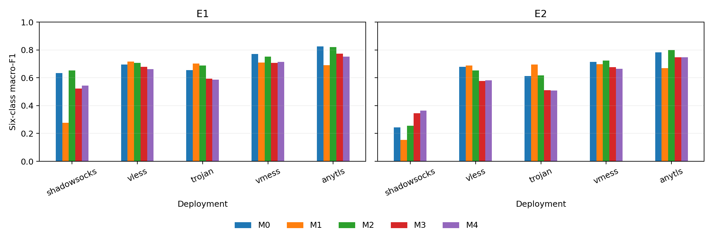

# 五部署业务统一模型与留一部署评价：正式实验报告

日期：2026-10-02。状态：Q01–Q12完成；525个分类器、5700次正式Ridge拟合、19,800条预测及预定统计均已完成。本轮停止，不自动扩模型、选子集、增加预算或搜索生成参数。64url继续保留为已停止的实验尝试。

## 1. 结论先行

本轮把旧的同部署、目标业务post缺失实验，推进到了两个不同问题：**充分源post监督下的已见部署统一分类，以及全局内容留出下的拟合期留一部署评价。**两者不能混同，也不能沿用旧F1_new结论。

真实配对增广M2在两个实验的协议等权F1上均高于内容组控制M3，预定家族校正区间均为正；E1也明确高于原样pre混合M1。但M2相对强post混合M0只提升0.88和0.36个百分点，两项校正区间均跨零。因此：

> 当前结果支持“在这套增广机制中，真实配对优于内容组控制”，尚不支持“真实配对增广可靠超过充分的多部署post监督”。E2也未建立相对M1的稳定增益。没有达到每个实验三项主对照全部通过的预登记标准。

这不是证明方法与M0等效，也不是证明配对永远无用。它明确了当前方法、数据和监督条件下的证据边界。尤其留出SS时，M3/M4优于M2，不能用平均收益掩盖最差部署问题。

完整自动生成附表见 [detailed-results.md](detailed-results.md)，包含逐seed、逐部署、逐业务以及所有内容的错误修复/新增记录。准备与权限审计见 [preparation-report.md](preparation-report.md)。

## 2. 数据与观测定义

仅使用Extend v3冻结W队列，不混入0914、0916或64url尝试：

- SS、VLESS、Trojan、VMess、AnyTLS五个实际部署，每部署120次访问，共600次。
- 六业务，每业务五内容，每内容四重复，重复号为1、2、3、4。全局独立内容数是30，不是150或600。
- 六业务为GitHub仓库浏览、YouTube搜索、Bing搜索、Wikipedia文章、MDN文档和YouTube视频播放。
- 1200行双侧数值，列顺序固定为 `[W_up,W_down,P_up,P_down,R_up,R_down]`。

W是登记访问窗口内正TCP/UDP传输载荷的字节量，P为正载荷事件数，R为该窗口新定义的全局方向段数。**不是逐flow唯一TCP字节，不是原始stream FR，也不是只含TCP的观测。**这次没有采用记录序列编码器或157维统计模型。

分类器只接收上述六维数值。IP、端口、SNI、域名文本、协议ID、访问ID、内容ID、绝对时间和质量标志均不作为数值特征。业务标签本身依然按domain × activity登记，标签名称不是模型输入。部署身份用于训练成员划分、均衡日程、源生成器分组及结果分项，不作为共享模型测试输入。

Hy2不在本轮冻结的五部署W分类集合内；本轮没有新增其资格审核、模型训练或迁移结论。AnyTLS参与的是现有W访问口径，不能据此声称其排他TCP flow资格或T口径成立。

## 3. 内容划分、权限与泄漏检查

五个外层内容折保持冻结。相同内容在所有部署的全部重复、pre/post、内部连接及衍生视图共同归入同一折。

| 实验 | 场景 | 每场景训练 | 每场景测试 | 分类器总数 |
|---|---|---:|---:|---:|
| E1：五部署统一模型 | 五个内容折 | 24内容×4重复×5部署=480 | 6内容×4重复×5部署=120 | 75 |
| I0：独立部署参照 | 五部署×五折 | 24内容×4重复=96 | 6内容×4重复=24 | 75 |
| E2：留一部署 | 五目标×五折 | 24内容×4重复×4源部署=384 | 目标6内容×4重复=24 | 375 |

E2逐次留出SS、VLESS、Trojan、VMess或AnyTLS，每次源集合为其余四个部署。目标部署全部pre/post禁止拟合；所有源部署的测试内容也禁止拟合。目标其余96次访问和源侧留出内容不拿来适配。测试post只进入冻结模型，不能用于重估均值、方差或选择checkpoint。测试pre未导出到推理包。

前期审计核对72000条历史W角色记录，2150项接口负测试通过，已登记carrier、原始文件及身份审核没有跨训练/禁止集合冲突。五处历史未观察主动SYN的限制仍保留，不能将当前台账验证升级为完整TCP出生重建或对所有未知采集错误的绝对排除。

权限机制是软件白名单、独立数据包和哈希验证，不是操作系统级隔离。共享进程会为不同方法装配输入；M0模型头只消费post，但不能声称整个批量进程从未读过为其他方法准备的pre。模型头独立性已做工程重放。

## 4. 方法与公平资源

| 方法 | 主槽 | 辅助槽 | 对应权限 |
|---|---|---|---|
| M0 PostMix | 全部允许的真实post | 同批post重复 | 不用pre的强源post混合参照 |
| M1 PreMix | 相同真实post | 原样pre | 有业务标签，无精确配对损失 |
| M2 PairedAug | 相同真实post | 真实配对生成的pre视图 | 训练区同次访问对应 |
| M3 GroupAug | 相同真实post | 内容组匿名生成视图 | 同内容同部署，无访问/重复身份 |
| M4 CyclicAug | 相同真实post | 固定循环错配生成视图 | 同内容重复1→2→3→4→1 |
| I0 | 单部署真实post | 同批post重复 | 测试时需要部署路由 |

所有源部署的六业务都有真实post。本轮不再设置旧实验的C/U业务缺post，也没有节省标签或目标侧校准数据的直接结论。M1的pre与post不通过公共行序拼接；M3的双侧bag独立排序，删除访问ID和重复号，但保留内容关系。M4是固定置换，不是独立条件重采样。

### 4.1 生成器

每个源部署单独拟合W漂移；只用该部署pre查询该部署生成器，再混合训练共享分类器。没有将这些视图命名为未见目标协议模拟。

每外层训练区四路固定内容交叉生成：查询六内容24访问，拟合其余18内容72访问；残差使用18次留一内容拟合，每次17内容68访问。查询内容在所有源部署均不进入其生成器拟合和残差池。

三方法共同使用既定W必要可行域、Ridge alpha=1与同一解码器。配对/循环残差池72行，group使用内容中心目标和288行Cartesian残差；后者仍依赖真实源post漂移池，不是无post参照。每查询访问八视图、三seed。100查询组×三方法×19拟合=5700次正式Ridge；模型确定性拟合供三seed抽样复用，E2只读取合法四源缓存。

保存的生成视图共172800条，经过必要摘要约束检查，无失败重抽。它们不是172800次独立访问，更不是真实流量会话。固定解码器的direction_bound操作计数为paired 31404、group 32158、cyclic 32441，每方法57600条视图；zero_direction和sigmoid_endpoint计数均为0。direction_bound是既定输出参数化的边界操作，不是被拒绝样本或协议合法性证明。不能将按构造通过约束当作主要科研成功指标。

### 4.2 分类器和CUDA配置

共享分类器为 `6 → 32 ReLU → 6`，422参数，无协议嵌入或专家路由。I0每个部署422参数，合计五模型2110参数。输入log1p后，由本场景允许的真实训练post拟合均值与总体标准差，所有共享方法使用相同缩放器。

Adam学习率0.001，1000步，权重平方和系数0.5×10^-4，不罚偏置；seed为20260918、20260919、20260920。不早停、不搜索、不挑最优seed。损失为 `0.5 CE(post)+0.5 CE(aux)+L2`。

每步E1主/辅助槽各120、E2各96、I0各24。每访问主槽250次、辅助槽250次；M0/I0辅助槽也是post，因此直接post共500次，而M1–M4是250次post加250次辅助。这是相同post资源、主槽日程、总槽与更新步数，不是相同直接post曝光次数。

正式生成、训练与推理全部CUDA：生成器float64、分类器float32，TF32关闭，禁止CPU静默回退。运行环境Pytorch312、RTX 4060 Ti。55场景保存的训练循环/检查点计时合计176.78秒；这是实现记录的墙钟区段，含末尾保存开销，不是纯GPU kernel时间，也不含全部准备、生成、文件装配与评分耗时。没有保存可审计的纯生成GPU总时长，因此不补造该数字。

## 5. 主要成绩

以下F1均为完整六类macro-F1：每seed先合并五折OOF，再逐部署计算，最后平均三个seed。最差部署F1先在每seed取最小再平均。

| 方法 | E1等权F1 | E1最差F1 | E1合并F1 | E2等权F1 | E2最差F1 | E2合并F1 |
|---|---:|---:|---:|---:|---:|---:|
| M0 | 0.7159 | 0.6335 | 0.7262 | 0.6061 | 0.2432 | 0.6219 |
| M1 | 0.6190 | 0.2769 | 0.6332 | 0.5809 | 0.1543 | 0.5994 |
| M2 | 0.7248 | 0.6529 | 0.7324 | 0.6097 | 0.2549 | 0.6275 |
| M3 | 0.6556 | 0.5222 | 0.6744 | 0.5713 | 0.3449 | 0.5936 |
| M4 | 0.6516 | 0.5443 | 0.6717 | 0.5731 | 0.3635 | 0.5974 |

E2是五个不同留部署任务的汇总，不是一台模型同时未见五个部署。合并F1不等于协议等权F1。

### 5.1 逐部署结果

| 部署 | E1 M0 | E1 M2 | 独立I0 | E2 M0 | E2 M2 | E2 M3 | E2 M4 |
|---|---:|---:|---:|---:|---:|---:|---:|
| SS | 0.6343 | 0.6529 | 0.8197 | 0.2432 | 0.2549 | 0.3449 | 0.3635 |
| VLESS | 0.6954 | 0.7067 | 0.7196 | 0.6787 | 0.6523 | 0.5768 | 0.5822 |
| Trojan | 0.6547 | 0.6895 | 0.6888 | 0.6118 | 0.6171 | 0.5115 | 0.5083 |
| VMess | 0.7701 | 0.7530 | 0.7421 | 0.7133 | 0.7241 | 0.6768 | 0.6654 |
| AnyTLS | 0.8251 | 0.8218 | 0.8125 | 0.7837 | 0.8001 | 0.7466 | 0.7463 |



E1的M2相对M0在SS、VLESS、Trojan更高，在VMess和AnyTLS更低。E2在四部署点估计更高，但VLESS由0.6787降至0.6523。逐部署没有新增显著性检验家族，以上都是分项描述。

I0等权F1为0.7565，比E1 M0高0.0406、比M2高0.0318；主要差异之一是SS独立模型0.8197，而共享M0为0.6343。其他部署并非全部独立更好。I0有已知部署路由、五套参数且每模型训练数据更少，这个对照不能证明参数共享本身的因果损失，也不支持将共享模型包装成普遍最优。

### 5.2 预定主对照

按业务分层重采样30个内容簇，每业务有放回抽五内容，保留所有部署、重复、方法和seed共同权重，10000次。E1/E2各自三项主比较，采用0.008333/0.991667分位校正；这不是全部六项的联合5%保证。

| 实验 | 比较 | Δ等权F1 | 普通95%区间 | 家族校正区间 | 结论 |
|---|---|---:|---|---|---|
| E1 | M2−M0 | +0.0088 | [-0.0067, 0.0261] | [-0.0097, 0.0303] | 未建立增益 |
| E1 | M2−M1 | +0.1058 | [0.0748, 0.1334] | [0.0685, 0.1399] | 支持增益 |
| E1 | M2−M3 | +0.0692 | [0.0421, 0.0979] | [0.0368, 0.1045] | 支持增益 |
| E2 | M2−M0 | +0.0036 | [-0.0096, 0.0160] | [-0.0125, 0.0185] | 未建立增益 |
| E2 | M2−M1 | +0.0288 | [-0.0020, 0.0567] | [-0.0089, 0.0627] | 未建立增益 |
| E2 | M2−M3 | +0.0384 | [0.0122, 0.0666] | [0.0063, 0.0719] | 支持增益 |

次要M2−M4：E1 +0.0732，普通95%区间[0.0458,0.1039]；E2 +0.0366，[0.0066,0.0670]。这些未做新增家族校正，不与三项主要成功门混计。

全部区间条件于固定模型，未包含重训、外部部署、跨日期或回顾性研究选择的不确定性。区间跨零不等于等效，正区间也不表示五个部署都改善。

### 5.3 seed与概率指标

| 实验/方法 | seed 20260918 | seed 20260919 | seed 20260920 |
|---|---:|---:|---:|
| E1 M0 | 0.7081 | 0.7175 | 0.7222 |
| E1 M2 | 0.7142 | 0.7285 | 0.7315 |
| E2 M0 | 0.6036 | 0.5996 | 0.6153 |
| E2 M2 | 0.6127 | 0.5955 | 0.6209 |

E1三个seed的M2点估计均略高于M0；E2第二seed更低。三个seed不是三个独立数据集，不能用其均值替代内容簇推断。

| 方法 | E1 CE bits | E1 Brier | E2 CE bits | E2 Brier |
|---|---:|---:|---:|---:|
| M0 | 1.1078 | 0.3838 | 1.7597 | 0.5445 |
| M1 | 1.3635 | 0.4678 | 2.3852 | 0.5760 |
| M2 | 1.1067 | 0.3843 | 1.5694 | 0.5216 |
| M3 | 1.2558 | 0.4666 | 1.4163 | 0.5244 |
| M4 | 1.2822 | 0.4752 | 1.4215 | 0.5256 |

Brier按六维平方和定义；均为部署等权、seed平均。E1 M2的CE几乎不变、Brier略差。E2 M2相对M0的概率指标改善，但M3/M4的CE更低。这些没有新增显著性检验，不能以单一F1排序声称所有概率性质更优。

## 6. 业务与错误定位

| 业务 | E1 M0 F1 | E1 M2 F1 | E2 M0 F1 | E2 M2 F1 |
|---|---:|---:|---:|---:|
| Bing搜索 | 0.7228 | 0.7357 | 0.5477 | 0.5762 |
| MDN文档 | 0.5879 | 0.6391 | 0.4752 | 0.4852 |
| GitHub仓库 | 0.7163 | 0.7513 | 0.6044 | 0.6376 |
| Wikipedia文章 | 0.5316 | 0.4620 | 0.3862 | 0.3310 |
| YouTube搜索 | 0.8441 | 0.8610 | 0.8015 | 0.8160 |
| YouTube播放 | 0.8929 | 0.8995 | 0.8219 | 0.8123 |

逐类F1在每部署每seed计算后平均。最清晰的代价是Wikipedia在E1、E2都下降；E2播放也下降。不能宣称六类全面提高。

M2对M0的正确/错误转移如下，计数是120访问×三seed的判断次数，不是360独立样本：

| 部署 | E1修复 | E1新增错误 | E2修复 | E2新增错误 |
|---|---:|---:|---:|---:|
| SS | 27 | 21 | 8 | 1 |
| VLESS | 15 | 11 | 7 | 17 |
| Trojan | 20 | 9 | 20 | 18 |
| VMess | 4 | 7 | 15 | 8 |
| AnyTLS | 5 | 5 | 13 | 6 |
| 合计 | 71 | 53 | 63 | 50 |

E1 Wikipedia中的Computer_network内容为修复3/新增13，Transmission_Control_Protocol为0/9，Transport_Layer_Security为0/8，表明并非单个随机访问的孤立改变。E2 Computer_network为0/6，Domain_Name_System为2/6。

E2 YouTube播放五内容中，M2相对M0没有修复错误；aircAruvnKk新增2、aqz-KE-bpKQ新增1、eRsGyueVLvQ新增4、sAWK0mgrMp4新增1，R6MlUcmOul8无变化。上述跨部署/seed计数均在完整附表中按内容、部署、seed展开。E1播放F1略增但召回从0.9067降至0.9000，说明F1变化也包含误报变化，不能仅解释为更多播放访问被修复。

### 6.1 SS留出是重要反例

E2 M2的SS F1只有0.2549；M3为0.3449、M4为0.3635。M2相对M3仅修复4次却新增35次错误，相对M4修复4次、新增42次。M3/M4虽然平均F1更低，最差部署成绩却更高。

SS的M0 CE为4.1826 bits，M2降至3.1995，而M3/M4约1.79/1.75。可描述为当前源混合与增广机制未充分解决SS留出条件；不能仅凭结果确定是cipher、网络、特征尺度或其他具体机制导致，更不能拿历史配置未知直接代替因果诊断。

## 7. 执行记录、输出和复现

运行顺序是先全部生成，再全部训练，再统一推理封存，最后评分。不存在先看E1结果后修改E2的方法步骤。

- 300生成任务完成，5700次正式Ridge。先前工程冒烟拟合另计，不混入正式预算。
- 55分类场景完成，共525分类器，各1000步。没有因失败seed替换模型。
- 预测共19800条：E1 9000、E2 9000、I0 1800。
- 训练/生成记录的test_reads均为0，封存记录labels_read=false、test_pre_read=false。评分阶段才合入标签。
- 全部登记代码、冻结输入和生成/模型完成文件哈希复核通过。

评分发生一次纯输出错误：NumPy int64 seed键不能直接JSON序列化。新增 `score_serialization_adapter.py` 只在JSON写入边界转成Python标量，保留原 `score.py`、合同、模型、预测、指标与bootstrap计算不变。首次失败已产生的逐部署指标文件由相同冻结评分重写；没有查看表现后修改规则。修复登记在 `scoring-serialization-repair.json`。

冻结合同SHA256：`8b25d56969279cec090fdbf669e69239f08372f8fb8d4288c3fd3e113b1a6c5b`。

预测SHA256：`00e28fb4acabd560fe067cc3f64c4b38717503aa25216acda45a98e83f86c120`。

合同中准备阶段的formal_training_allowed=false原样保留；本次用户授权独立写入 `authorization.json`，绑定上述合同及525/5700预算，运行器核对后执行。这不是跳过门B。

代码位于 `eval/business_protocol_eval/`，结果位于 `outputs/business-protocol-eval-extend/run-01/`。关键产物：

| 文件/目录 | 内容 |
|---|---|
| contract.json / authorization.json | 冻结方法、指纹与正式授权 |
| cohort.parquet / roles / generator-roles | 访问、全局内容折及允许成员 |
| generation | 模型、残差、三seed八视图、解码记录与完成哈希 |
| models | 55场景模型、损失轨迹、主槽日程哈希与训练记录 |
| predictions.parquet / prediction-seal.json | 不含评分标签的冻结概率 |
| per-protocol-seed-metrics.parquet | 逐部署逐seed五项指标 |
| aggregate-seed-metrics.parquet | 等权、最差、合并F1 |
| primary-contrasts.parquet / E1-bootstrap.npz / E2-bootstrap.npz | 主对照及完整抽样成绩 |
| confusion-matrices.json | 全部逐seed逐部署混淆矩阵 |
| report-per-class.parquet / report-content-errors.parquet | 逐类、逐内容错误明细 |
| report-audit.json | 预算、CUDA、读取记录、冻结哈希最终复核 |

正式执行命令（从仓库根目录，使用Pytorch312）：

```powershell
D:/Tools/Anaconda/envs/Pytorch312/python.exe eval/business_protocol_eval/run.py generate
D:/Tools/Anaconda/envs/Pytorch312/python.exe eval/business_protocol_eval/run.py train
D:/Tools/Anaconda/envs/Pytorch312/python.exe eval/business_protocol_eval/run.py infer
D:/Tools/Anaconda/envs/Pytorch312/python.exe eval/business_protocol_eval/score_serialization_adapter.py
D:/Tools/Anaconda/envs/Pytorch312/python.exe eval/business_protocol_eval/report_results.py
```

generate/train可核验完成文件后续跑；infer/score有已完成防覆盖断言，不应为重跑而删除封存文件。现有结果的报告可单独重建。正式重新训练须新登记输出版本。数据、输出和本地plan继续不推送；本次没有执行新的Git提交或远端推送。

## 8. 研究定位与停止边界

可以保留的结论：

1. 一个不显式输入协议身份的小模型能在当前五部署的全局留出内容上进行六业务分类；本轮同时量化了统一参数与独立模型之间不均匀的代价。
2. 在当前交叉生成机制内，真实配对比内容组控制提供更高的协议等权F1，E1也优于原样pre混合。
3. 强真实post混合已经解释了大部分最终表现，配对辅助在其上的额外增益尚未确立。
4. 拟合期留一部署暴露了明显不对称，尤其SS；平均增益不能替代最差部署保证。

不能推出：配对普遍优于单侧、节约真实post/标签、无监督域泛化、纯协议因果效应、新配置/新VPS/跨日期有效、外部DIRECT迁移、无索引在线识别或真实流量生成。目标部署历史上已被研究者分析过，E2是回顾性数据上的拟合期隔离，不是全新盲测。

本轮不按SS例外重新挑源组合，也不为使M2超过M0新增参数搜索。旧缺post业务增广的正结果与本轮充分post监督下的有限增益可以同时成立，它们回答的是不同训练资源条件下的问题。下一轮若提出方法，应另行登记明确机制与主要终点，而不是把本轮变成必须获胜的持续调参。
