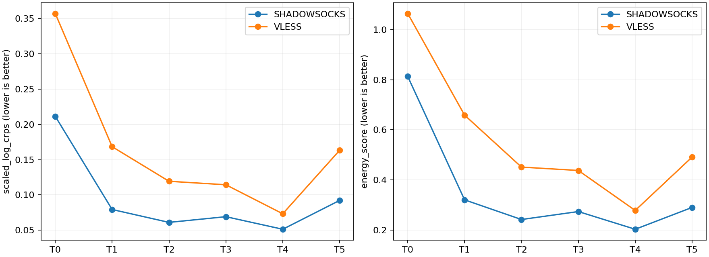
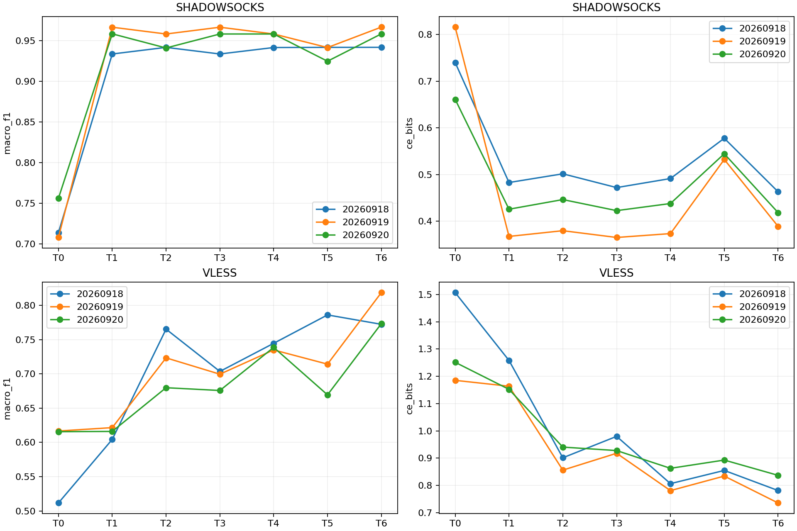
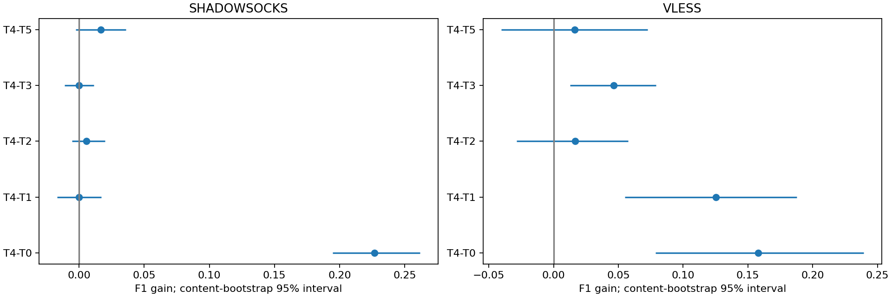

# 0916 条件代理漂移与前向特征合成：实验总结

完成日期：2026-09-26。F0–F10已执行；历史S/L/Q、A–H及原数据产物未覆盖。本轮没有新采集、PCAP扫描、序列生成、部署分类或阈值搜索。

## 1. 核心结论

**前向漂移合成具有当前任务下的训练用途，但用途明显依赖部署、指标与参照。**

- SS：从pre原样训练到变换后训练有大幅改善，但log1p坐标的固定中心已几乎达到条件随机模型的F1；没有建立复杂条件模型的额外分类决策收益。
- VLESS：真配条件随机模型T4比原pre、固定中心及条件中心有更好的平均F1和CE。相对无条件联合漂移T2，CE改善更明确，F1差区间跨零。
- 精确配对：生成质量评分上T4优于错配T5；SS的业务CE也改善，但两部署的T4−T5业务F1区间均跨零，VLESS的CE区间也跨零。因此不能宣布“精确同次配对已带来稳定的额外业务分类收益”。
- T4的概率区间仍欠覆盖，且部分业务召回下降。不能将必要数值约束通过与整体指标改善，解释为完整业务语义或协议会话保真。

这项结果与旧SSL结论不冲突：本轮学习的是有向前向摘要变换，而不是表示一致性；它证明了一种有限的跨侧统计适配用途，并未证明通用代理模拟。

## 2. 数据、资格与特征

保留0916主队列全部240访问：SS/VLESS各120，六业务、30独立内容、每内容每部署四次重复{1,2,4,5}。旧五折内容划分未改变，每部署每折96训练访问、24测试访问。

| 部署 | 访问 | 内容 | 候选连接对 | 合格连接对 |
|---|---:|---:|---:|---:|
| SS | 120 | 30 | 1410 | 1410 |
| VLESS | 120 | 30 | 1185 | 1182 |

VLESS排除3对含无效唯一字节观测的连接，不删除访问。此处不要求TLS记录可解析，因此不同于旧R+T实验的1179对VLESS记录队列。两侧在同一访问使用完全相同的合格连接集合。

每访问生成六基础量：U_up/U_down为观测唯一TCP字节，E_up/E_down为正新字节事件数，R_up/R_down为各连接零阈值方向段按方向求和。另保留共同合格连接数F，固定不生成。分类器使用log1p后的这7维。

R不是旧FR；E不是原始包数；U不代表已被应用成功接收的字节。没有加入IP、端口、SNI、域名、URL、绝对时间或部署名称作为数值输入。F来自共同连接资格与离线关联，因此本轮仍具有offline-index-assisted范围。

## 3. 嵌套训练权限

为避免“见过某内容真实post后再合成同内容”造成乐观结果：

1. 每个外层训练区24内容分四个内fold，每fold六内容、24访问。
2. 生成器用其余18内容、72访问拟合，只为留出的六内容pre生成分类训练视图。
3. 生成器的随机残差另用leave-one-content-out计算，残差所属内容不进入该次回归拟合。
4. 每源访问生成8视图；三个seed全部保留。全部视图仍归属于原访问/内容，统计自由度不增加。
5. 外层离线质量评价另外用24训练内容拟合生成器，对六测试内容pre生成样本，比较真实test post。该测试pre不会进入业务分类训练或推理。

因此，质量评价使用96访问校准，而合成分类训练视图使用72访问校准；这是内容隔离的结果，二者不是完全相同的生成器拟合规模。

生成器不以业务标签为数值条件；业务用于分层划分与下游分类。残差近邻基于入口七维和训练内容质心，固定最近8内容；错配控制使用同内容身份，这些权限均不隐藏。

## 4. 模型与预算

| 臂 | 方法 |
|---|---|
| T0 | 原pre训练，直接测试真实post |
| T1 | 每部署固定log1p漂移中位数 |
| T2 | 无条件完整六维漂移向量采样 |
| T3 | 条件仿射Ridge中心，无随机残差 |
| T4 | 真配条件中心＋完整OOF残差向量采样 |
| T5 | 同T4，但用同内容跨重复循环错配目标拟合 |
| T6 | 真实训练post监督参照 |

Ridge为输入7维、输出6维漂移，平均每访问平方欧氏误差加α=1权重惩罚，截距不惩罚；两侧共用训练pre尺度；残差回到共同log坐标后采样。没有反转旧post→pre校准器。

T1的“固定中心”是在log1p坐标中，不是一个固定字节前缀，也不是精确协议K。

所有业务分类器为7→32→6 ReLU MLP，无BN/dropout。固定1000步、batch24、Adam lr=0.001、CE(nats)+weight L2(1e−4/2)，bias不正则。输入尺度统一由该外折真实训练pre拟合。同部署/fold/seed下各臂新头初值、访问及视图调度相同，每个训练访问被使用250次。

三seed为20260918、20260919、20260920。没有早停或测试参数搜索。

- 40个训练内生成任务，1520次CUDA Ridge拟合；10个外层质量任务，500次CUDA Ridge拟合。
- 210个CUDA小分类器、210000次更新；5040条真实post OOF预测对应240独立访问，不是5040独立样本。
- 训练内115200个合成视图，测试离线28800个合成视图。
- Ridge为CUDA float64，分类器为CUDA float32，未启用TF32；无CPU模型回退。表处理、抽样、解码及bootstrap可在CPU。
- 40个生成任务内部计时合计28.81秒；210个分类任务内部训练/保存计时合计336.79秒，均不是整个流程墙钟耗时。

## 5. 合法性与外推范围

使用预先固定的必要约束：非负整数、R_d≤E_d≤U_d、零/正方向一致、总段数≥F、两方向段数差绝对值≤F。解码不裁负、不逐维修剪；随机臂最多32次完整向量重抽，仍失败才显式回退pre。

训练内首次非法率：

| 部署 | T1 | T2 | T3 | T4 | T5 |
|---|---:|---:|---:|---:|---:|
| SS | 0% | 0.191% | 0% | 0% | 3.993% |
| VLESS | 0% | 8.351% | 0% | 3.464% | 4.288% |

全部臂最终fallback=0，均通过预声明“首次非法≤10%、fallback≤1%”门。测试离线最终fallback也为0。全部最终生成视图再次检查必要约束通过。

拒绝重抽改变生成分布，已保存首次原始值、最后原始值、最终整数值及各次失败原因；不能将拒绝采样隐去。必要摘要约束不构成可运行TCP流或PCAP存在性证明。

测试入口超出训练逐维min/max范围的访问：SS 11/120、VLESS 7/120。它们全部保留，并有范围内/外评分台账；逐维范围内也不证明联合支持覆盖。

## 6. 生成质量：T4改善不等于概率已校准

CRPS采用外层训练pre尺度上的log坐标；energy score评估六维联合样本。均越低越好；以下为描述性点估计。

| 部署 | 臂 | scaled-log CRPS | energy score | 名义80%区间覆盖率 |
|---|---|---:|---:|---:|
| SS | T0 | 0.211493 | 0.813253 | 0.069444 |
| SS | T1 | 0.079367 | 0.320208 | 0.084722 |
| SS | T2 | 0.061107 | 0.241682 | 0.687037 |
| SS | T3 | 0.069178 | 0.273466 | 0.084722 |
| SS | T4 | **0.051366** | **0.202763** | 0.675000 |
| SS | T5 | 0.092252 | 0.289921 | 0.879630 |
| VLESS | T0 | 0.357212 | 1.064674 | 0.004167 |
| VLESS | T1 | 0.168395 | 0.658560 | 0.088889 |
| VLESS | T2 | 0.119375 | 0.451035 | 0.679167 |
| VLESS | T3 | 0.114423 | 0.437573 | 0.104167 |
| VLESS | T4 | **0.073315** | **0.277915** | 0.643519 |
| VLESS | T5 | 0.163279 | 0.491131 | 0.885648 |

确定性臂区间退化，不宜将其低覆盖当作未曾拟合的概率目标失败。随机臂每访问仅8样本，经验分位区间粗糙；T4覆盖率低于80%，不能称已校准条件分布。T5覆盖更高而CRPS更差，也提示单看覆盖不够。

相关矩阵误差并非所有情况T4最优：SS的T3优于T4；VLESS的T5在该单项指标略优于T4。不能选择一个距离作为“生成真实”的充分证明。



## 7. 真实留出post业务识别

### 三seed均值

| 臂 | SS F1 | SS CE(bits) | VLESS F1 | VLESS CE(bits) |
|---|---:|---:|---:|---:|
| T0 原pre | 0.726004 | 0.739082 | 0.581331 | 1.314511 |
| T1 固定中心 | 0.952829 | 0.425275 | 0.614012 | 1.191386 |
| T2 无条件联合 | 0.946970 | 0.442474 | 0.722824 | 0.899315 |
| T3 条件中心 | 0.952767 | 0.419891 | 0.692961 | 0.941847 |
| T4 真配条件随机 | 0.952642 | 0.434193 | 0.739400 | 0.816754 |
| T5 错配条件随机 | 0.935985 | 0.551534 | 0.723212 | 0.860738 |
| T6 真实post | 0.955580 | 0.423396 | 0.788045 | 0.784642 |

SS的T4、T1、T3点估计接近不是统计等效证明；T4也不是SS最强臂。VLESS的T4优于其他合成臂的均值不意味着每seed均最优：seed20260918中T2、T5的F1都高于T4。完整42行逐seed指标在业务报告与Parquet中。

### 预声明比较：F1差及描述性95%区间（百分点）

| 部署 | 比较 | 差值 | 区间 |
|---|---|---:|---:|
| SS | T4−T0 | +22.66 | [+19.46, +26.17] |
| SS | T4−T1 | −0.02 | [−1.68, +1.69] |
| SS | T4−T2 | +0.57 | [−0.55, +2.00] |
| SS | T4−T3 | −0.01 | [−1.11, +1.12] |
| SS | T4−T5 | +1.67 | [−0.26, +3.60] |
| VLESS | T4−T0 | +15.81 | [+7.87, +23.94] |
| VLESS | T4−T1 | +12.54 | [+5.51, +18.78] |
| VLESS | T4−T2 | +1.66 | [−2.85, +5.76] |
| VLESS | T4−T3 | +4.64 | [+1.27, +7.92] |
| VLESS | T4−T5 | +1.62 | [−4.06, +7.28] |

CE减小量（参照−T4）：SS对T5为0.1173 bits，区间[0.1023,0.1324]；VLESS对T2为0.0826，[0.0479,0.1369]；VLESS对T5为0.0440，[−0.0374,0.1126]。

因此，SS真配相对错配的概率损失优势比F1优势证据更清楚；VLESS尚未建立超越错配的稳定业务增量。两者不能合并成统一的“精确配对必要”结论。





### 业务例外不能省略

| 部署/业务 | T0召回 | T4召回 | T6召回 |
|---|---:|---:|---:|
| SS MDN文档 | 0.0333 | 1.0000 | 0.9833 |
| SS Wikipedia文章 | 1.0000 | 0.9333 | 0.9667 |
| SS YouTube搜索 | 0.9000 | 0.8500 | 0.8833 |
| VLESS Bing搜索 | 0.1833 | 0.7833 | 0.9000 |
| VLESS MDN文档 | 0.4833 | 0.7833 | 0.7833 |
| VLESS YouTube搜索 | 0.3333 | **0.1500** | 0.3000 |
| VLESS YouTube播放 | 0.7667 | 0.9000 | 0.8667 |

总体F1改善并非所有业务都受益，尤其VLESS YouTube搜索退化明显。真实post七维参照对该业务也只有0.30召回，提示这个小摘要及固定学习器本身的任务支持有限，但本轮不能进一步把原因唯一归到特征不足或生成误差。

错误翻转（每部署360个seed×访问预测，不是360独立访问）：T4相对T0，SS修复72、新增7；VLESS修复65、新增15。相对T5，SS修复8、新增2；VLESS修复21、新增16。

## 8. 审计与不确定性

- 19项相关单元/回归测试通过，包括CUDA恒等/仿射恢复、摘要非法检测、循环donor、等权调度、post-only推理与评分公式。
- 40个训练内生成任务的源内容均不在拟合内容内；LOCO残差排除自身内容；donor全部来自相应拟合区。
- 从保存的CUDA中心与残差池重建4800个首次生成提议，原始值差为0。
- 210个分类器CUDA独立重载，推理batch由24改为6，全部分类决策一致，最大概率差3.5762787e−7。
- 同部署/fold/seed的各臂分类头初值及训练调度哈希一致；旧内容/flow/capture身份隔离保持。
- 输入、配置、阶段代码、生成器、分类器与产物保存独立哈希契约；历史结果只读。

2000次bootstrap按业务分层重采内容，并共同保留同内容的重复、部署、臂和seed。先各seed评分再平均，不构造概率集成。区间条件于已拟合模型、未作多重比较校正，不消除多轮回顾性分析影响。没有外部验证。

## 9. 成本、适用范围与停止决定

生成器仍使用真实训练post做校准，分类器仍使用全部原训练访问标签。本轮没有证明节省目标域抓包或业务标签。来自代理会话的pre也不是天然真实DIRECT样本。

F固定且共同flow资格用双侧证据建立，所以当前是离线关联的访问摘要合成。未生成新flow数量/拓扑、时间线、IAT、记录结构或协议包；未验证任意外部加密源、未见配置、跨日期、SS未知cipher变化、Hy2共享carrier或无索引在线推理。

按计划到此冻结。不基于结果自动扩模型、调α、改变近邻数、追加业务条件或搜索增强视图数。若继续推进，应先决定要研究的是VLESS七维摘要的业务例外、概率覆盖不足，还是明确的配对校准预算；这些是下一轮选择，不属于本轮已完成成果。

## 10. 产物与复现入口

报告：

- [覆盖审计](coverage-report.md)
- [有向漂移描述](drift-description.md)
- [训练OOF合法性门](generation-legality-report.md)
- [外层生成质量](generation-quality-report.md)
- [完整业务结果](business-results.md)

数据根目录：`outputs/conditional-proxy-drift-0916/run-01/`。其中包含480行paired-primitives、连接资格、旧外fold及新内fold、循环donor、观测漂移、训练OOF合成谱系、测试离线合成及评分、业务5040行OOF预测、固定比较区间、逐业务/负载/支持范围分层、生成和分类重载审计。

`generation/`保存40任务的真实/错配Ridge、LOCO残差与生成视图；`phase2/`保存10个质量任务及210个分类器的检查点、训练日志和预测。

使用Pytorch312，命令如下：

```powershell
python eval/conditional_proxy_drift/run.py --stage prepare
python eval/conditional_proxy_drift/run.py --stage generate
python eval/conditional_proxy_drift/phase2.py --stage all
python eval/conditional_proxy_drift/summarize.py
python eval/conditional_proxy_drift/audit_support.py
python eval/conditional_proxy_drift/verify_generation.py
```

phase2只有F5通过才允许启动。生成任务和分类任务完成后按哈希跳过；未完成的小任务从头重做，不声称步级恢复。为保留已冻结F0–F5契约，后续代码采用独立phase2契约，没有改写已执行阶段的源文件。最后的支持范围脚本在基础质量报告生成后执行一次，避免重复追加段落。

此次只补充/使用本地依赖与CUDA环境，没有提交或推送仓库。
