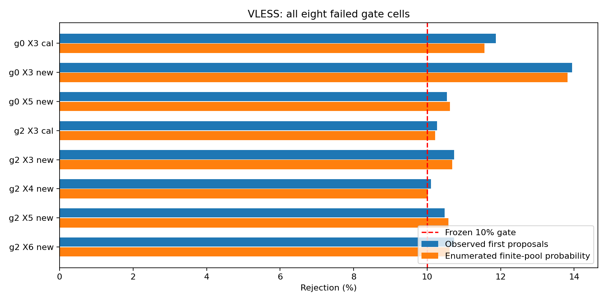
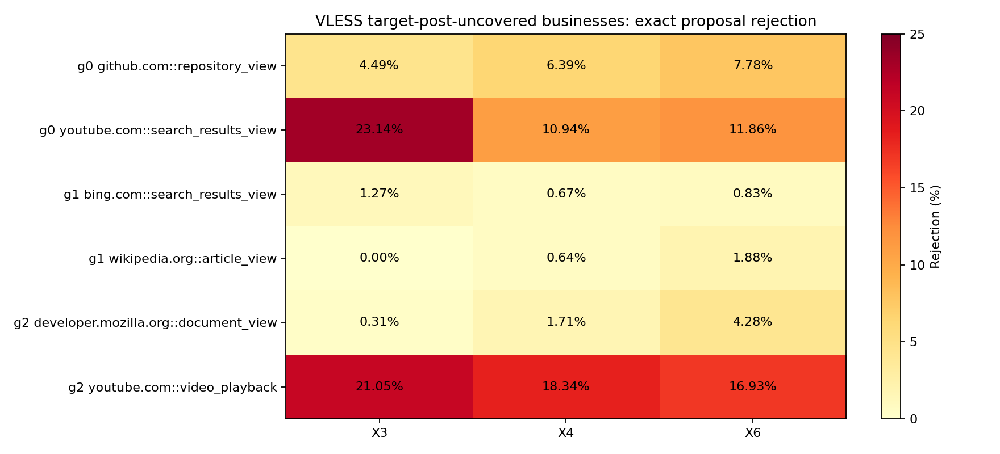

# 跨业务配对校准实验与拒绝机制诊断：完整报告

日期：2026-09-28。范围：XBC0–XBC5，以及用户随后批准的C/U_pre只读拒绝诊断。

## 1. 摘要与当前结论

本轮将“每种业务都有少量目标post”的旧预算设置，改为“只有四种辅助业务提供目标post，另外两种业务仅提供pre及标签”，检验变换能否跨业务复用。原七维表示、生成器和分类器设计保持固定，新增不提供逐访问匹配身份的组级控制X6。

已完成240个scenario、5040次CUDA Ridge拟合与2073600个合成视图；权限、数学等价性、配对身份隔离、LOCO谱系和最终数值约束检查均通过。但60个预定合法性单元有8个首次非法率超过10%，全部位于VLESS，故正式分类停止。

后续只读诊断表明：主要失败机制是候选的上行R大于E，而不是E大于U；大部分条件中心自身合法，加入冻结漂移/残差后才越界。目标侧未覆盖的YouTube播放和搜索业务比同组另一业务更易越界。这个模式不能简单归结为“所有新业务都在C的取值范围外”，也不是仅增加随机视图就会消失。

**本轮没有新的分类F1、CE或真实配对业务增益结果。** 诊断支持进一步审视联合计数约束与输入余量，不证明跨业务增广无效，也没有授权我们修改生成器或绕过门限继续训练。

## 2. 科学问题与旧结果的关系

旧配对预算实验中，最低25%预算仍覆盖全部六业务。SS B4/B1 F1为.963134/.955765，VLESS为.805795/.786466，两者差值区间均包含零；最低预算CE有改善。它不能回答“目标业务完全没有真实post训练样本”时的用途。

新实验预定的两项主问题是：同一个真配方法X4是否在同一部署/测试设置下，同时优于直接源增广X1与组级控制X6。主终点F1_new必须从完整六分类混淆矩阵计算，其他业务误报为新业务也计入FP。该终点尚未执行，不能以当前生成合法性替代分类评价。

## 3. 数据、角色与固定分组

数据仍为0916六业务、30内容、240访问，SS/VLESS各120；每内容每部署四重复{1,2,4,5}。五折内容划分，每部署每折96训练访问与24测试访问。同内容重复、父访问全部flow和两侧整体划分。

每scenario C=6内容/24配对访问，来自四种辅助业务，分配2/2/1/1；U=18内容/72次pre访问，其中new业务32次、辅助业务40次。8轮换保证每辅助业务的每个训练内容恰三次进入C。两部署同角色，三个seed为20260918/19/20。

|   组 | post未覆盖业务                                                     |
|-----:|:-------------------------------------------------------------------|
|    0 | github.com::repository_view / youtube.com::search_results_view     |
|    1 | wikipedia.org::article_view / bing.com::search_results_view        |
|    2 | youtube.com::video_playback / developer.mozilla.org::document_view |

共有2部署×5折×3组×8轮换=240个scenario。不是全部15种两业务组合；8轮换和3seed不是新增独立内容。

受限训练只能用C_pre/C_post/U_pre和训练标签。U_post、H_pre、H_post和测试标签均未进入本次诊断；历史共同连接资格依赖双侧观测的边界仍然存在。不能宣称无需捕获U_post或已经降低端到端采集成本。参考XR权限另包保存，本轮未打开运行。

## 4. 方法与已执行配置

七维为上下行唯一新字节U、新字节事件数E、零阈值方向段数R以及共同连接数F。R是连接级求和，不是旧FR；模型不使用IP、端口、SNI、链路层或内容ID特征。

| 臂 | U的表示 | 当前执行状态 |
|---|---|---|
| X1 | 原pre | 不需要生成；未分类 |
| X2 | 固定中心漂移 | 生成完成 |
| X3 | 无条件联合漂移 | 生成完成 |
| X4 | 真配条件中心+LOCO联合残差 | 生成完成 |
| X5 | 同内容跨重复循环错配 | 生成完成 |
| X6 | 组均值目标+组内全部组合LOCO残差 | 生成完成 |
| XR | U真实post，独立额外资源参考 | 未运行 |

Ridge在log1p坐标拟合，CUDA float64，alpha=1，截距不罚；6输入量+F，生成6量，F固定。每U访问8视图，完整残差向量采样，最多32次重抽，ties-to-even取整，不逐维裁剪。每个scenario只有6校准内容，min(8,6)=6，残差候选池实际覆盖全部C，不能称为局部近邻筛选。

X6生成包仅有内容组、pre七维与post六维，移除校准session/repetition/时间/连接ID及post F。组目标在log坐标求post均值，以24个pre输入拟合，与每组4×4组合的平均平方损失只差参数无关常数；不改变有效正则。每次LOCO剔除整个内容的两侧，形成96条组合残差而不是96个独立样本。

CUDA目标解等价误差4.79×10⁻¹⁶，梯度核对误差1.14×10⁻¹⁵；独立重排组内两侧后参数、残差多重集和固定seed样本不变。补充的非最优参数梯度、舍入、约束与F1定义等测试合计11项通过。

原定分类器为7→32→6 ReLU、Adam .001、1000步、batch24、CE+权重L2，共4320受限分类器与720参考分类器；这些任务均未启动。

## 5. 冻结门限与当前失败单元

门限为首次非法率≤10%、fallback≤1%，按部署×业务组×臂×new/cal分别判断，不能合并角色掩盖失败。全部最终fallback为零，但不等于首次候选分布合格。

| protocol   |   business_group | arm   | business_role   |   views |   first_invalid_rate |   exact_rejection_probability |   center_invalid |   fallback_rate |   mean_attempts |   attempts_max |
|:-----------|-----------------:|:------|:----------------|--------:|---------------------:|------------------------------:|-----------------:|----------------:|----------------:|---------------:|
| VLESS      |                0 | X3    | cal             |   38400 |             0.118724 |                      0.115599 |         0.000000 |        0.000000 |        1.163203 |              8 |
| VLESS      |                0 | X3    | new             |   30720 |             0.139486 |                      0.138184 |         0.000000 |        0.000000 |        1.188184 |              8 |
| VLESS      |                0 | X5    | new             |   30720 |             0.105339 |                      0.106250 |         0.002344 |        0.000000 |        1.131934 |             13 |
| VLESS      |                2 | X3    | cal             |   38400 |             0.102682 |                      0.102188 |         0.000000 |        0.000000 |        1.131250 |              7 |
| VLESS      |                2 | X3    | new             |   30720 |             0.107292 |                      0.106836 |         0.000000 |        0.000000 |        1.141667 |              8 |
| VLESS      |                2 | X4    | new             |   30720 |             0.101074 |                      0.100228 |         0.000000 |        0.000000 |        1.127051 |              8 |
| VLESS      |                2 | X5    | new             |   30720 |             0.104753 |                      0.105762 |         0.000000 |        0.000000 |        1.123991 |              7 |
| VLESS      |                2 | X6    | new             |   30720 |             0.107292 |                      0.106063 |         0.000000 |        0.000000 |        1.128743 |              6 |

“精确拒绝概率”来自冻结有限残差池枚举，不是新增真实样本或置信区间。每组等量残差、六组均匀选取，故X3/X4/X5可枚举24候选，X6枚举96候选，X2一个固定候选。对每查询再平均，等价于当前生成器第一次提议的分布。

8个失败单元的枚举均值也都超过10%。其中组2/new/X4的10.0228%仅略高于门限，这说明停止判据已触发，但不能渲染成严重数值崩溃。枚举消除了有限seed/view抽样误差，没有消除C集合、业务覆盖或数据总体的不确定性。

## 6. 失败究竟是什么约束

| protocol    |   views |   any_invalid |   R_gt_E_up |   R_gt_E_down |   E_gt_U_up |   E_gt_U_down |   direction_imbalance |   runs_below_F |   negative |
|:------------|--------:|--------------:|------------:|--------------:|------------:|--------------:|----------------------:|---------------:|-----------:|
| SHADOWSOCKS | 1036800 |         24317 |        2878 |             8 |           0 |             0 |                 22012 |           1434 |          0 |
| VLESS       | 1036800 |         57866 |       55592 |            79 |           0 |             0 |                  3079 |             16 |          0 |

约束列为非互斥计数，同一个候选可能违反多项，不能相加作为总失败数。这是对旧“首个原因”记录的补充，不替换其优先级口径。

VLESS 57866个首次非法候选中，55592个违反上行R>E（约96.1%）；两方向E>U均为零。SS虽然各预定单元都过门，也有24317个非法首次提议，以方向段不平衡为主。这说明“全部问题都来自R>E”不适用于两个部署。

对组2/new/X4，条件中心全部合法，3105个首次非法候选全部是上行R>E。X6相同设置的3296个非法候选中3294个涉及该问题，少数还有方向不平衡或段数低于F。X6不提供精确对应并非唯一原因：X3、X4和X5也存在这类边界问题。

## 7. 中心余量与残差如何共同越界

设上行合法余量为m=log(1+E_up)−log(1+R_up)，合法原始候选要求m≥0。当前生成器有：

`m_candidate = m_center + (residual_E_up − residual_R_up)`。

完整六维残差保留了donor内部联合变化，但把它加到另一个入口的中心上，并不自动保留目标入口的联合计数约束。若负残差差值超过中心余量，就会生成R_up>E_up。取整可能修复小于一个单位的差异，所以正式失败计数依然按冻结解码器，不以负log余量替代。

|   business_group | arm   | label_id                             |   center_invalid |   pre_log_E_R_margin_up |   center_log_E_R_margin_up |   exact_rejection_probability |
|-----------------:|:------|:-------------------------------------|-----------------:|------------------------:|---------------------------:|------------------------------:|
|                0 | X3    | github.com::repository_view          |         0.000000 |                1.290930 |                   1.290930 |                      0.044922 |
|                0 | X3    | youtube.com::search_results_view     |         0.000000 |                0.703503 |                   0.703503 |                      0.231445 |
|                0 | X4    | github.com::repository_view          |         0.003125 |                1.290930 |                   0.718917 |                      0.063867 |
|                0 | X4    | youtube.com::search_results_view     |         0.000000 |                0.703503 |                   0.459510 |                      0.109440 |
|                0 | X6    | github.com::repository_view          |         0.003125 |                1.290930 |                   0.697410 |                      0.077848 |
|                0 | X6    | youtube.com::search_results_view     |         0.000000 |                0.703503 |                   0.472956 |                      0.118636 |
|                1 | X3    | bing.com::search_results_view        |         0.000000 |                1.613954 |                   1.613954 |                      0.012695 |
|                1 | X3    | wikipedia.org::article_view          |         0.000000 |                0.953582 |                   0.953582 |                      0.000000 |
|                1 | X4    | bing.com::search_results_view        |         0.000000 |                1.613954 |                   1.194760 |                      0.006706 |
|                1 | X4    | wikipedia.org::article_view          |         0.000000 |                0.953582 |                   0.624200 |                      0.006445 |
|                1 | X6    | bing.com::search_results_view        |         0.000000 |                1.613954 |                   1.203495 |                      0.008333 |
|                1 | X6    | wikipedia.org::article_view          |         0.000000 |                0.953582 |                   0.625177 |                      0.018766 |
|                2 | X3    | developer.mozilla.org::document_view |         0.000000 |                1.391449 |                   1.391449 |                      0.003125 |
|                2 | X3    | youtube.com::video_playback          |         0.000000 |                0.609959 |                   0.609959 |                      0.210547 |
|                2 | X4    | developer.mozilla.org::document_view |         0.000000 |                1.391449 |                   0.966745 |                      0.017057 |
|                2 | X4    | youtube.com::video_playback          |         0.000000 |                0.609959 |                   0.371029 |                      0.183398 |
|                2 | X6    | developer.mozilla.org::document_view |         0.000000 |                1.391449 |                   0.959063 |                      0.042806 |
|                2 | X6    | youtube.com::video_playback          |         0.000000 |                0.609959 |                   0.400780 |                      0.169320 |

组2的X4视频平均中心余量约.371，而MDN约.967；拒绝概率分别18.3398%与1.7057%。这与视频更贴近约束边界的描述一致，但不是因果隔离实验：输入、中心与候选残差池会共同变化。

X6视频拒绝概率16.9320%，反而低于X4的18.3398%；但MDN为4.2806%，高于X4。因此不能把“组级控制整体更差”当成所有业务上的统一解释。组0的X3 YouTube搜索拒绝率23.1445%，GitHub约4.4922%，也呈现明显业务差异。

### 内容分布而不是单个异常视频

| label_id                             | content_id                                                        |   query_instances |   exact_rejection_probability |
|:-------------------------------------|:------------------------------------------------------------------|------------------:|------------------------------:|
| developer.mozilla.org::document_view | https://developer.mozilla.org/en-US/docs/Web/API/Fetch_API        |               128 |                      0.006836 |
| developer.mozilla.org::document_view | https://developer.mozilla.org/en-US/docs/Web/HTTP                 |               128 |                      0.009440 |
| developer.mozilla.org::document_view | https://developer.mozilla.org/en-US/docs/Web/HTTP/Guides/Caching  |               128 |                      0.009440 |
| developer.mozilla.org::document_view | https://developer.mozilla.org/en-US/docs/Web/HTTP/Guides/Cookies  |               128 |                      0.031576 |
| developer.mozilla.org::document_view | https://developer.mozilla.org/en-US/docs/Web/HTTP/Guides/Overview |               128 |                      0.027995 |
| youtube.com::video_playback          | youtube_video:R6MlUcmOul8                                         |               128 |                      0.183919 |
| youtube.com::video_playback          | youtube_video:aircAruvnKk                                         |               128 |                      0.186523 |
| youtube.com::video_playback          | youtube_video:aqz-KE-bpKQ                                         |               128 |                      0.179362 |
| youtube.com::video_playback          | youtube_video:eRsGyueVLvQ                                         |               128 |                      0.185221 |
| youtube.com::video_playback          | youtube_video:sAWK0mgrMp4                                         |               128 |                      0.181966 |

每内容的数字平均了它出现在U中的训练折、轮换及四重复；不是独立新增访问。五个视频的X4均值都在约17.94%–18.65%，未发现仅靠剔除一个视频就能解释该组失败的证据。本轮未删除任何内容。

## 8. 是否只是C范围外推

| protocol   |   business_group | arm   | business_role   | support_bin               |   queries |   exact_rejection_probability |
|:-----------|-----------------:|:------|:----------------|:--------------------------|----------:|------------------------------:|
| VLESS      |                0 | X3    | cal             | inside_C_marginal_ranges  |      1116 |                      0.092481 |
| VLESS      |                0 | X3    | cal             | outside_C_marginal_ranges |       484 |                      0.168905 |
| VLESS      |                0 | X3    | new             | inside_C_marginal_ranges  |       335 |                      0.188682 |
| VLESS      |                0 | X3    | new             | outside_C_marginal_ranges |       945 |                      0.120282 |
| VLESS      |                0 | X5    | new             | inside_C_marginal_ranges  |       335 |                      0.111194 |
| VLESS      |                0 | X5    | new             | outside_C_marginal_ranges |       945 |                      0.104497 |
| VLESS      |                2 | X3    | cal             | inside_C_marginal_ranges  |      1141 |                      0.088957 |
| VLESS      |                2 | X3    | cal             | outside_C_marginal_ranges |       459 |                      0.135076 |
| VLESS      |                2 | X3    | new             | inside_C_marginal_ranges  |      1093 |                      0.091758 |
| VLESS      |                2 | X3    | new             | outside_C_marginal_ranges |       187 |                      0.194964 |
| VLESS      |                2 | X4    | new             | inside_C_marginal_ranges  |      1093 |                      0.087717 |
| VLESS      |                2 | X4    | new             | outside_C_marginal_ranges |       187 |                      0.173351 |
| VLESS      |                2 | X5    | new             | inside_C_marginal_ranges  |      1093 |                      0.097362 |
| VLESS      |                2 | X5    | new             | outside_C_marginal_ranges |       187 |                      0.154857 |
| VLESS      |                2 | X6    | new             | inside_C_marginal_ranges  |      1093 |                      0.095847 |
| VLESS      |                2 | X6    | new             | outside_C_marginal_ranges |       187 |                      0.165775 |

“在范围内”仅指每个输入维度都落在C的边缘min/max内，不表示位于联合数据支持内部。组2/new/X4范围外拒绝率17.34%，范围内仍8.77%；组0/new/X3则范围内18.87%、范围外12.03%。因此边缘范围外推不是统一充分解释，不能仅按此标记过滤U样本。所有范围计算只用C_pre，查询只用U_pre。

## 9. 重抽会怎样改变残差来源

候选池均匀提议，接受事件取决于查询及残差。对固定查询，接受后的残差分布相当于原分布在合法集合上的条件分布，而不是原始无条件残差池。对均匀的带索引候选池，其条件分布与提议分布的总变差距离等于拒绝概率；映射到输出数值后如有重复候选，距离可能更小，不能把索引距离直接称为流量分布距离。

| protocol   |   business_group | arm   | business_role   |   exact_rejection_probability |   donor_content_TV_after_conditioning |
|:-----------|-----------------:|:------|:----------------|------------------------------:|--------------------------------------:|
| VLESS      |                0 | X3    | cal             |                      0.115599 |                              0.090700 |
| VLESS      |                0 | X3    | new             |                      0.138184 |                              0.112107 |
| VLESS      |                0 | X5    | new             |                      0.106250 |                              0.085289 |
| VLESS      |                2 | X3    | cal             |                      0.102188 |                              0.084908 |
| VLESS      |                2 | X3    | new             |                      0.106836 |                              0.096792 |
| VLESS      |                2 | X4    | new             |                      0.100228 |                              0.091517 |
| VLESS      |                2 | X5    | new             |                      0.105762 |                              0.091883 |
| VLESS      |                2 | X6    | new             |                      0.106063 |                              0.092825 |

失败单元中，接受后donor内容分布相对六内容均匀分布的平均TV约.085–.112。故即使fallback为零，重抽也已经改变了训练合成分布。该变化是否有害或有益于业务识别，本轮没有分类证据。

单查询最高枚举拒绝率为87.5%，相应连续33次全拒概率约1.22%；这是极端查询而非总体回退率。实际保存样本的最终fallback全为零，不能据此推断未来任意随机抽样也一定零回退。逐单元风险与实际最终donor份额另存表格；它们用于解释，未被用来调整生成参数。

## 10. 当前能支持和不能支持的结论

可以支持：

- 当前固定生成器在某些VLESS业务未覆盖条件下，候选分布有可复现的联合计数约束失配。
- 主要问题发生于上行E/R余量与迁移来的漂移/残差组合，而不是大面积中心本身非法或字节量不足。
- 缺失post业务的差异真实存在于当前观测：YouTube搜索/播放更脆弱；并非所有new业务或组级控制都同样失败。
- 重抽筛选改变残差和donor分布，零fallback不能作为它完全不影响统计表示的证据。

不能支持：

- 真实配对增广在新业务上有F1收益、没有收益，或优于组级控制；这些分类尚未运行。
- 精确协议开销、完整可实现流量、语义保真、实际采集成本节省或未见部署泛化。
- 输入越界是唯一原因、组级身份删除是唯一原因，或简单裁剪必然能够改善业务表现。

## 11. 停止决定与建议

本次用户批准的只读诊断已完成；没有放宽门限，没有裁剪生成量，没有重新训练或读取目标post来选择修复。原XBC6–XBC10仍未启动。

诊断足以提出一个具体下一候选：在不改变数据角色与分类器的前提下，研究显式保留E/R及方向段联合可行域的生成表示或采样方式，并为真配、错配和组级臂共同匹配定义。它不是已实施修复；独立逐维裁剪可能破坏联合关系和对照公平性，不建议未经新方案就使用。

另一条可选择路径是单独登记“保留现有拒绝机制的探索性分类”，保留所有臂与门失败声明；但那需要用户明确确认，不能把它包装成原预定主实验通过。是否进行新方法、探索性分类或在此结项，是下一决策点。

## 12. 产物索引与复现

- 已批准主计划：`plan/cross-business-calibration-plan-20260928.md`。
- 配置：`configs/cross-business-calibration-0916.yaml`。
- 源码：`src/proxy_analysis/cross_business_calibration/`。
- 只读诊断：`eval/cross_business_calibration/diagnose_rejection.py`。
- 完整报告生成：`eval/cross_business_calibration/report_diagnostic.py`。
- 实验输出：`outputs/cross-business-calibration-0916/run-01/`。
- 诊断输出：上述目录的`rejection-diagnostic/`。
- [原生成阶段报告](summary.md)、[全部合法性单元](generation-legality.md)、[权限分组](permissions.md)、[训练侧支持审计](support-and-audit.md)。

诊断表包括逐查询观测计数、全部有限池精确拒绝概率、中心合法性、业务/内容分层、donor提议与接受份额、残差方向余量分位数、边缘支持分层与有限重抽风险。模型中心重放使用CUDA float64，无新增拟合；统计枚举和绘图在CPU上完成。测试记录为`outputs/cross-business-diagnostic-tests.xml`，11项通过。

复现命令（Pytorch312环境、仓库根目录）：

```text
python eval/cross_business_calibration/diagnose_rejection.py
python eval/cross_business_calibration/report_diagnostic.py
```

原冻结代码、参数、阈值与生成文件哈希在诊断开始核对未改变；本报告不改写原阶段门结果。所有结果仍来自多轮研究过的0916数据，严格权限隔离不等于新的外部盲测。

## 13. 图表与完整分层附录





[完整分层数值附录](rejection-diagnostic-tables.md)保留全部部署、业务组、臂、角色和donor业务份额，不仅包含失败设置。
