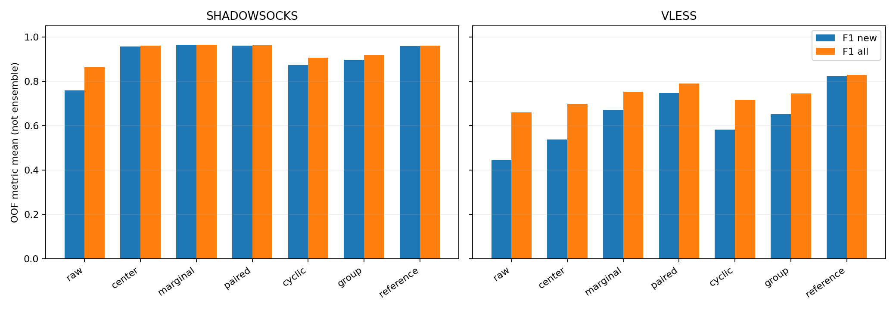
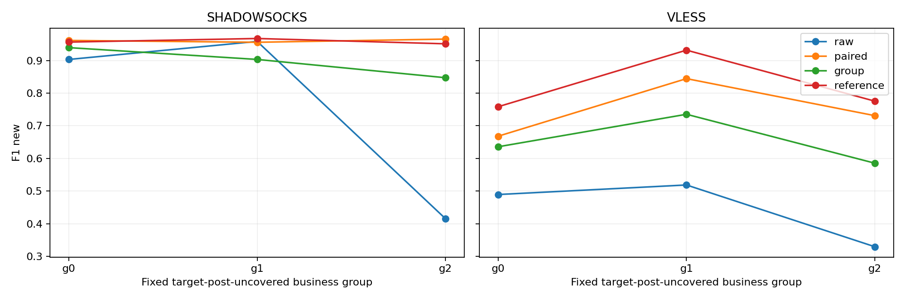

# 可行摘要坐标增广：完整实验报告

日期：2026-09-28。状态：FSC0–FSC9完成。本轮结果冻结，不追加参数搜索。

## 1. 本轮回答什么

旧跨业务实验因VLESS生成候选违反上行R≤E等必要约束，在分类前停止。本轮按独立方案，将输出改成段数/方向差/事件余量/字节余量坐标与可行解码，保留业务角色、七维分类输入与固定模型。不是继续放宽旧10%门限，也不是把旧失败记录覆盖。

主要问题仍然是：在目标两业务没有训练post时，真配增广是否同时优于原pre增广和只知道内容组、不知道逐访问对应的增广。合法性按构造通过是实施条件，不是方法成功本身。

## 2. 结果概览

以下按部署先等权平均三个业务组、八轮换、三个seed的OOF指标，不进行概率集成。F1_new来自完整六分类混淆矩阵，再取该设置的两个未覆盖类F1均值。

| protocol    | arm       |   F1_new |   F1_all |   BA_all |   CE_all_bits |   Brier_all |   CE_new_bits |   Brier_new |
|:------------|:----------|---------:|---------:|---------:|--------------:|------------:|--------------:|------------:|
| SHADOWSOCKS | center    | 0.957334 | 0.959446 | 0.959491 |      0.310475 |    0.077141 |      0.349813 |    0.091642 |
| SHADOWSOCKS | cyclic    | 0.873508 | 0.905276 | 0.907755 |      0.501982 |    0.170021 |      0.644677 |    0.246315 |
| SHADOWSOCKS | group     | 0.896676 | 0.917525 | 0.918866 |      0.471777 |    0.153204 |      0.577347 |    0.206982 |
| SHADOWSOCKS | marginal  | 0.963339 | 0.964534 | 0.964583 |      0.300803 |    0.071798 |      0.317041 |    0.076092 |
| SHADOWSOCKS | paired    | 0.961005 | 0.962720 | 0.962731 |      0.303847 |    0.074152 |      0.344651 |    0.088708 |
| SHADOWSOCKS | raw       | 0.758973 | 0.864246 | 0.879630 |      0.503814 |    0.175004 |      0.948524 |    0.384238 |
| SHADOWSOCKS | reference | 0.958370 | 0.960168 | 0.960185 |      0.286504 |    0.067319 |      0.294794 |    0.068552 |
| VLESS       | center    | 0.537126 | 0.696877 | 0.725694 |      1.061763 |    0.374436 |      1.820888 |    0.631731 |
| VLESS       | cyclic    | 0.582880 | 0.715652 | 0.737616 |      0.865666 |    0.345646 |      1.242648 |    0.526551 |
| VLESS       | group     | 0.652044 | 0.745629 | 0.762153 |      0.829183 |    0.328390 |      1.135333 |    0.475751 |
| VLESS       | marginal  | 0.670577 | 0.752101 | 0.766319 |      0.823391 |    0.315062 |      1.116398 |    0.441921 |
| VLESS       | paired    | 0.747832 | 0.788936 | 0.798495 |      0.773526 |    0.297187 |      0.987750 |    0.398232 |
| VLESS       | raw       | 0.445694 | 0.660628 | 0.713542 |      1.185511 |    0.414508 |      2.388272 |    0.836384 |
| VLESS       | reference | 0.821861 | 0.829010 | 0.835880 |      0.664898 |    0.247835 |      0.690791 |    0.259095 |

### 按预定判据解释

SHADOWSOCKS：paired相对raw的F1_new差为+20.203个百分点，相对group为+6.433个百分点。两项调整区间下界均大于零，满足本轮限定条件下的双重增量判据；不等于普遍必要性或外部泛化证明。

VLESS：paired相对raw的F1_new差为+30.214个百分点，相对group为+9.579个百分点。两项调整区间下界均大于零，满足本轮限定条件下的双重增量判据；不等于普遍必要性或外部泛化证明。

### 两项预定主对照

| protocol    | contrast     |    delta |    low95 |   high95 |   adjusted_low |   adjusted_high |
|:------------|:-------------|---------:|---------:|---------:|---------------:|----------------:|
| SHADOWSOCKS | paired-raw   | 0.202032 | 0.165164 | 0.243989 |       0.155052 |        0.255388 |
| SHADOWSOCKS | paired-group | 0.064329 | 0.041990 | 0.093224 |       0.036417 |        0.102058 |
| VLESS       | paired-raw   | 0.302138 | 0.242564 | 0.359245 |       0.227232 |        0.374436 |
| VLESS       | paired-group | 0.095789 | 0.060124 | 0.136019 |       0.051231 |        0.146133 |

普通区间为95%；调整区间为四项主要比较的98.75%双侧内容bootstrap百分位区间。正差值有利于paired，F1为0–1单位。

| protocol    | both_adjusted_lower_above_zero   | both_points_at_least_1pp   | both_adjusted_lower_above_1pp   |
|:------------|:---------------------------------|:---------------------------|:--------------------------------|
| SHADOWSOCKS | True                             | True                       | True                            |
| VLESS       | True                             | True                       | True                            |

同一部署两项调整区间下界都大于零，才符合预定双重增量判断。1个百分点只是操作性效果量参考；点估计过1pp和调整下界过1pp不同。不能以paired胜cyclic替代胜group，也不能在F1失败后改以CE作为主成功终点。具体结果的科学解释见后续结论，不由零非法率推导。

## 3. 数据、权限与任务

沿用0916六业务、30内容、240访问，SS/VLESS各120，四次重复{1,2,4,5}。五外折每部署训练24内容/96访问，测试6内容/24访问。C为6辅助内容/24配对访问，U为18内容/72个pre访问，其中两种post未覆盖业务32访问。八轮换及三个seed不增加独立内容数量。

固定业务组：g0=GitHub仓库+YouTube搜索；g1=Wikipedia文章+Bing搜索；g2=YouTube播放+MDN文档。没有删除视频、重选业务或改变标签。

生成拟合仅用C，U_pre仅查询。group生成包不含校准session/repetition/时间/连接索引或post F，只保留无序两侧数值与内容关联。分类输入仅七维数值，无IP、端口、SNI或身份信息。reference在受限预测封存后独立运行，才开放U_post；没有反馈主实验。

原共同连接资格和F仍来自历史双侧审计，本轮不等于证明可以完全不采集U_post。当前所有结果是既有数据上的后续研究，不是新外部盲测。

## 4. 编码、解码与生成目标

原输入为U_up/down、E_up/down、R_up/down和F；R为连接零阈值新字节方向段数之和，不是旧FR。

新编码只用一侧六维：N=R_up+R_down，D=R_up−R_down，G=E−R，H=U−E；编码为[log(N+.5),asinh(D),log(G_up+.5),log(G_down+.5),log(H_up+.5),log(H_down+.5)]，不需要post F。

解码Q(z)=floor(exp(z))保证非负整数；N=max(F,Q(z_N))。D先限制在F允许范围，再取与N同奇偶的合法格点。R=(N±D)/2；非零方向E=R+G、U=E+H；零R方向联动令E/U为零，并记录忽略余量。所有输出需满足精确整数范围，溢出停止而不裁剪或fallback。

这是包含边界映射的支持保持解码，不是完全无投影、无分布变化的生成器。各生成臂共用它；一次donor抽取只解码一次，不拒绝重抽。

Ridge仍为7输入/6输出、含截距48参数，alpha=1，截距不罚，CUDA float64。输入原pre七维log1p按C标准化；输出漂移改为新编码，输出尺度只用C_pre编码的总体标准差，常数维置1。容量和正则系数不变，但目标几何改变，不能声称损失与旧模型完全一样。

group的目标为该内容全部post编码的均值，不是原始均值再编码。LOCO重新拟合，逐内容生成4×4完整残差，仍只代表四次真实重复。展开平方目标与均值目标在新坐标重新验证，未借用旧目标证明或真配残差。

## 5. 全部对照与分类配置

| 臂 | U输入/监督资源 |
|---|---|
| raw | 原pre与标签 |
| center | 固定新坐标漂移中心 |
| marginal | 无条件联合新坐标漂移 |
| paired | 真配条件中心+内容LOCO残差 |
| cyclic | 同内容跨重复循环错配，独立重拟合 |
| group | 匿名内容组目标+笛卡尔积LOCO残差 |
| reference | 独立额外权限真实U_post |

所有臂C部分均为真实post；分类器输入仍是还原后的原七维，不提供潜变量。共同分类尺度仅C_pre原七维log1p。模型7→32→6 ReLU，Adam .001，1000步，batch24，CE(nats)+.5×10⁻⁴权重平方和，bias不罚，无BN/dropout、无早停或搜索。每来源访问250次，七臂初值和调度一致，seed为20260918/19/20。

全部拟合、训练、模型推理使用Pytorch312 CUDA；CPU仅用于数据管理、随机抽样、统计和绘图。独立分类器批量计算，不共享模型参数，工程阶段验证串行等价和模型维隔离。

实际环境：Python 3.12.8 / Pytorch312，PyTorch 2.5.1、CUDA 12.4，NVIDIA GeForce RTX 4060 Ti；Ridge/编解码float64，分类float32，TF32关闭，确定性算法开启。18项相关回归测试通过，记录见outputs/feasible-tests-complete.xml。

## 6. 解码作用不等于无失真

2073600生成视图全部通过独立旧约束检查，零重抽、零fallback。N下界映射、D边界和零方向联动的发生率如下：

| protocol    | arm      |   views |   N_active_rate |   D_active_rate |   zero_direction_rate |
|:------------|:---------|--------:|----------------:|----------------:|----------------------:|
| SHADOWSOCKS | center   |  207360 |        0.000000 |        0.000000 |              0.000000 |
| SHADOWSOCKS | cyclic   |  207360 |        0.003381 |        0.108584 |              0.002218 |
| SHADOWSOCKS | group    |  207360 |        0.001331 |        0.081944 |              0.000598 |
| SHADOWSOCKS | marginal |  207360 |        0.000000 |        0.005830 |              0.000000 |
| SHADOWSOCKS | paired   |  207360 |        0.000000 |        0.008927 |              0.000000 |
| VLESS       | center   |  207360 |        0.000000 |        0.000000 |              0.000000 |
| VLESS       | cyclic   |  207360 |        0.000005 |        0.000096 |              0.000000 |
| VLESS       | group    |  207360 |        0.000010 |        0.000121 |              0.000000 |
| VLESS       | marginal |  207360 |        0.000000 |        0.000000 |              0.000000 |
| VLESS       | paired   |  207360 |        0.000000 |        0.000101 |              0.000000 |

D边界位移保存在潜变量坐标；整数格点量化单独记录，不与幅度截界混合。零方向被忽略的G/H和输出分位数均有台账。合法性不保证协议会话可实现或标签保真。

每源访问每seed的八视图实际去重数：

| protocol    | arm      |     mean |   min |   max |
|:------------|:---------|---------:|------:|------:|
| SHADOWSOCKS | center   | 1.000000 |     1 |     1 |
| SHADOWSOCKS | cyclic   | 6.925502 |     3 |     8 |
| SHADOWSOCKS | group    | 7.712191 |     5 |     8 |
| SHADOWSOCKS | marginal | 6.925502 |     3 |     8 |
| SHADOWSOCKS | paired   | 6.925502 |     3 |     8 |
| VLESS       | center   | 1.000000 |     1 |     1 |
| VLESS       | cyclic   | 6.922222 |     3 |     8 |
| VLESS       | group    | 7.713966 |     5 |     8 |
| VLESS       | marginal | 6.922222 |     3 |     8 |
| VLESS       | paired   | 6.922222 |     3 |     8 |

固定中心重复视图不创造额外信息。离散解码可能合并不同潜变量；没有按多样性或边界发生率选择臂或调整参数。

## 7. 业务组、seed和错误变化

| protocol    |   business_group | arm       |   F1_new |   F1_all |   BA_all |   CE_all_bits |   Brier_all |   CE_new_bits |   Brier_new |
|:------------|-----------------:|:----------|---------:|---------:|---------:|--------------:|------------:|--------------:|------------:|
| SHADOWSOCKS |                0 | center    | 0.954876 | 0.959298 | 0.959375 |      0.313137 |    0.080423 |      0.340479 |    0.130731 |
| SHADOWSOCKS |                0 | cyclic    | 0.946055 | 0.950840 | 0.951042 |      0.432849 |    0.132272 |      0.358801 |    0.145078 |
| SHADOWSOCKS |                0 | group     | 0.939483 | 0.947879 | 0.948264 |      0.415962 |    0.123138 |      0.348961 |    0.141193 |
| SHADOWSOCKS |                0 | marginal  | 0.965041 | 0.964867 | 0.964931 |      0.303469 |    0.074613 |      0.274090 |    0.099775 |
| SHADOWSOCKS |                0 | paired    | 0.961472 | 0.963866 | 0.963889 |      0.295909 |    0.071521 |      0.242512 |    0.086361 |
| SHADOWSOCKS |                0 | raw       | 0.903243 | 0.935140 | 0.935764 |      0.387901 |    0.116995 |      0.573730 |    0.226547 |
| SHADOWSOCKS |                0 | reference | 0.956461 | 0.960412 | 0.960417 |      0.289142 |    0.069917 |      0.216543 |    0.079293 |
| SHADOWSOCKS |                1 | center    | 0.956832 | 0.957914 | 0.957986 |      0.311637 |    0.075173 |      0.483555 |    0.084036 |
| SHADOWSOCKS |                1 | cyclic    | 0.864762 | 0.898172 | 0.902431 |      0.501971 |    0.169970 |      0.822789 |    0.266757 |
| SHADOWSOCKS |                1 | group     | 0.903301 | 0.920431 | 0.922222 |      0.466446 |    0.149879 |      0.754807 |    0.225383 |
| SHADOWSOCKS |                1 | marginal  | 0.962097 | 0.962442 | 0.962500 |      0.302073 |    0.069721 |      0.461804 |    0.074539 |
| SHADOWSOCKS |                1 | paired    | 0.955898 | 0.956571 | 0.956597 |      0.316947 |    0.079302 |      0.540789 |    0.112674 |
| SHADOWSOCKS |                1 | raw       | 0.958529 | 0.948526 | 0.948958 |      0.345352 |    0.092885 |      0.462523 |    0.072706 |
| SHADOWSOCKS |                1 | reference | 0.967437 | 0.961786 | 0.961806 |      0.279762 |    0.061930 |      0.446436 |    0.063730 |
| SHADOWSOCKS |                2 | center    | 0.960294 | 0.961127 | 0.961111 |      0.306649 |    0.075828 |      0.225404 |    0.060158 |
| SHADOWSOCKS |                2 | cyclic    | 0.809708 | 0.866817 | 0.869792 |      0.571126 |    0.207822 |      0.752440 |    0.327110 |
| SHADOWSOCKS |                2 | group     | 0.847245 | 0.884266 | 0.886111 |      0.532921 |    0.186596 |      0.628274 |    0.254370 |
| SHADOWSOCKS |                2 | marginal  | 0.962878 | 0.966291 | 0.966319 |      0.296868 |    0.071060 |      0.215229 |    0.053963 |
| SHADOWSOCKS |                2 | paired    | 0.965646 | 0.967722 | 0.967708 |      0.298685 |    0.071632 |      0.250653 |    0.067089 |
| SHADOWSOCKS |                2 | raw       | 0.415146 | 0.709071 | 0.754167 |      0.778188 |    0.315134 |      1.809319 |    0.853460 |
| SHADOWSOCKS |                2 | reference | 0.951213 | 0.958307 | 0.958333 |      0.290607 |    0.070110 |      0.221402 |    0.062634 |
| VLESS       |                0 | center    | 0.517926 | 0.722243 | 0.754514 |      0.858664 |    0.341611 |      1.457406 |    0.679209 |
| VLESS       |                0 | cyclic    | 0.611847 | 0.770643 | 0.792361 |      0.802128 |    0.320044 |      1.060253 |    0.485520 |
| VLESS       |                0 | group     | 0.635649 | 0.780774 | 0.800000 |      0.791909 |    0.311049 |      1.032397 |    0.464648 |
| VLESS       |                0 | marginal  | 0.667071 | 0.777829 | 0.796528 |      0.745651 |    0.289728 |      1.038314 |    0.455861 |
| VLESS       |                0 | paired    | 0.668043 | 0.774655 | 0.788542 |      0.763731 |    0.299662 |      1.020125 |    0.444884 |
| VLESS       |                0 | raw       | 0.489296 | 0.709017 | 0.758333 |      0.935856 |    0.359264 |      1.720115 |    0.744106 |
| VLESS       |                0 | reference | 0.758401 | 0.831865 | 0.839236 |      0.642631 |    0.246540 |      0.775044 |    0.312874 |
| VLESS       |                1 | center    | 0.546671 | 0.641023 | 0.682986 |      1.491252 |    0.450366 |      2.691149 |    0.616923 |
| VLESS       |                1 | cyclic    | 0.674119 | 0.692907 | 0.718750 |      0.991658 |    0.376530 |      1.544702 |    0.531011 |
| VLESS       |                1 | group     | 0.735195 | 0.725372 | 0.748264 |      0.923711 |    0.351757 |      1.337547 |    0.455750 |
| VLESS       |                1 | marginal  | 0.694581 | 0.710120 | 0.732986 |      0.985219 |    0.366498 |      1.294864 |    0.418221 |
| VLESS       |                1 | paired    | 0.844473 | 0.796557 | 0.806944 |      0.821095 |    0.303382 |      0.944933 |    0.316506 |
| VLESS       |                1 | raw       | 0.518530 | 0.619796 | 0.673958 |      1.557250 |    0.458221 |      3.183138 |    0.754645 |
| VLESS       |                1 | reference | 0.931757 | 0.835241 | 0.842361 |      0.674311 |    0.240217 |      0.425179 |    0.114919 |
| VLESS       |                2 | center    | 0.546780 | 0.727366 | 0.739583 |      0.835373 |    0.331331 |      1.314110 |    0.599060 |
| VLESS       |                2 | cyclic    | 0.462673 | 0.683407 | 0.701736 |      0.803211 |    0.340364 |      1.122989 |    0.563121 |
| VLESS       |                2 | group     | 0.585286 | 0.730740 | 0.738194 |      0.771931 |    0.322365 |      1.036055 |    0.506854 |
| VLESS       |                2 | marginal  | 0.650079 | 0.768353 | 0.769444 |      0.739303 |    0.288960 |      1.016017 |    0.451681 |
| VLESS       |                2 | paired    | 0.730981 | 0.795595 | 0.800000 |      0.735752 |    0.288517 |      0.998193 |    0.433306 |
| VLESS       |                2 | raw       | 0.329254 | 0.653071 | 0.708333 |      1.063426 |    0.426039 |      2.261563 |    1.010402 |
| VLESS       |                2 | reference | 0.775423 | 0.819924 | 0.826042 |      0.677751 |    0.256748 |      0.872150 |    0.349492 |

逐seed均值：

| protocol    | arm       |     seed |   F1_new |   F1_all |   BA_all |   CE_all_bits |   Brier_all |   CE_new_bits |   Brier_new |
|:------------|:----------|---------:|---------:|---------:|---------:|--------------:|------------:|--------------:|------------:|
| SHADOWSOCKS | center    | 20260918 | 0.948778 | 0.951344 | 0.951389 |      0.346072 |    0.090635 |      0.387105 |    0.109169 |
| SHADOWSOCKS | center    | 20260919 | 0.955133 | 0.958287 | 0.958333 |      0.314966 |    0.078519 |      0.363976 |    0.094219 |
| SHADOWSOCKS | center    | 20260920 | 0.968093 | 0.968708 | 0.968750 |      0.270385 |    0.062270 |      0.298357 |    0.071537 |
| SHADOWSOCKS | cyclic    | 20260918 | 0.869281 | 0.896887 | 0.898958 |      0.522590 |    0.180140 |      0.673760 |    0.261599 |
| SHADOWSOCKS | cyclic    | 20260919 | 0.872930 | 0.907082 | 0.909722 |      0.503470 |    0.169237 |      0.647926 |    0.245359 |
| SHADOWSOCKS | cyclic    | 20260920 | 0.878313 | 0.911860 | 0.914583 |      0.479886 |    0.160687 |      0.612345 |    0.231988 |
| SHADOWSOCKS | group     | 20260918 | 0.883365 | 0.907587 | 0.909375 |      0.495277 |    0.164710 |      0.607417 |    0.224077 |
| SHADOWSOCKS | group     | 20260919 | 0.899115 | 0.919528 | 0.920833 |      0.469683 |    0.151560 |      0.579696 |    0.207103 |
| SHADOWSOCKS | group     | 20260920 | 0.907549 | 0.925460 | 0.926389 |      0.450369 |    0.143344 |      0.544930 |    0.189764 |
| SHADOWSOCKS | marginal  | 20260918 | 0.955908 | 0.956183 | 0.956250 |      0.338144 |    0.086035 |      0.350622 |    0.091614 |
| SHADOWSOCKS | marginal  | 20260919 | 0.963336 | 0.965926 | 0.965972 |      0.299911 |    0.070089 |      0.324471 |    0.075255 |
| SHADOWSOCKS | marginal  | 20260920 | 0.970773 | 0.971492 | 0.971528 |      0.264355 |    0.059269 |      0.276030 |    0.061408 |
| SHADOWSOCKS | paired    | 20260918 | 0.952636 | 0.953454 | 0.953472 |      0.341521 |    0.088868 |      0.384388 |    0.107167 |
| SHADOWSOCKS | paired    | 20260919 | 0.959307 | 0.963529 | 0.963542 |      0.303683 |    0.072819 |      0.354232 |    0.089415 |
| SHADOWSOCKS | paired    | 20260920 | 0.971072 | 0.971176 | 0.971181 |      0.266337 |    0.060769 |      0.295334 |    0.069541 |
| SHADOWSOCKS | raw       | 20260918 | 0.728787 | 0.843279 | 0.861111 |      0.553674 |    0.200794 |      1.026864 |    0.428397 |
| SHADOWSOCKS | raw       | 20260919 | 0.763199 | 0.869330 | 0.885069 |      0.501333 |    0.171115 |      0.957944 |    0.380860 |
| SHADOWSOCKS | raw       | 20260920 | 0.784932 | 0.880129 | 0.892708 |      0.456435 |    0.153104 |      0.860763 |    0.343456 |
| SHADOWSOCKS | reference | 20260918 | 0.953599 | 0.954172 | 0.954167 |      0.320817 |    0.079570 |      0.326395 |    0.080761 |
| SHADOWSOCKS | reference | 20260919 | 0.957883 | 0.960734 | 0.960764 |      0.288424 |    0.066860 |      0.301727 |    0.068760 |
| SHADOWSOCKS | reference | 20260920 | 0.963628 | 0.965599 | 0.965625 |      0.250271 |    0.055528 |      0.256260 |    0.056135 |
| VLESS       | center    | 20260918 | 0.513145 | 0.684917 | 0.714931 |      1.062187 |    0.383662 |      1.826102 |    0.642905 |
| VLESS       | center    | 20260919 | 0.551084 | 0.702241 | 0.729514 |      1.063384 |    0.369242 |      1.833192 |    0.627080 |
| VLESS       | center    | 20260920 | 0.547148 | 0.703474 | 0.732639 |      1.059719 |    0.370405 |      1.803371 |    0.625208 |
| VLESS       | cyclic    | 20260918 | 0.584586 | 0.712852 | 0.732292 |      0.872564 |    0.352009 |      1.264719 |    0.537957 |
| VLESS       | cyclic    | 20260919 | 0.564440 | 0.705491 | 0.730208 |      0.868126 |    0.343056 |      1.251576 |    0.525593 |
| VLESS       | cyclic    | 20260920 | 0.599613 | 0.728614 | 0.750347 |      0.856308 |    0.341873 |      1.211650 |    0.516101 |
| VLESS       | group     | 20260918 | 0.661214 | 0.748523 | 0.763194 |      0.831934 |    0.332317 |      1.138668 |    0.475319 |
| VLESS       | group     | 20260919 | 0.637153 | 0.738229 | 0.756944 |      0.828434 |    0.326950 |      1.136675 |    0.476324 |
| VLESS       | group     | 20260920 | 0.657764 | 0.750134 | 0.766319 |      0.827182 |    0.325903 |      1.130655 |    0.475609 |
| VLESS       | marginal  | 20260918 | 0.666461 | 0.746659 | 0.759375 |      0.828785 |    0.324658 |      1.124749 |    0.451104 |
| VLESS       | marginal  | 20260919 | 0.671607 | 0.757735 | 0.772917 |      0.812164 |    0.308323 |      1.096333 |    0.431877 |
| VLESS       | marginal  | 20260920 | 0.673664 | 0.751908 | 0.766667 |      0.829224 |    0.312205 |      1.128114 |    0.442781 |
| VLESS       | paired    | 20260918 | 0.742140 | 0.782554 | 0.790625 |      0.779552 |    0.308451 |      1.011351 |    0.414793 |
| VLESS       | paired    | 20260919 | 0.748221 | 0.790691 | 0.802778 |      0.761160 |    0.288992 |      0.957946 |    0.385254 |
| VLESS       | paired    | 20260920 | 0.753135 | 0.793561 | 0.802083 |      0.779865 |    0.294119 |      0.993954 |    0.394648 |
| VLESS       | raw       | 20260918 | 0.452316 | 0.660531 | 0.712153 |      1.134877 |    0.409089 |      2.207840 |    0.795880 |
| VLESS       | raw       | 20260919 | 0.443991 | 0.662115 | 0.714236 |      1.200954 |    0.413656 |      2.486654 |    0.857976 |
| VLESS       | raw       | 20260920 | 0.440774 | 0.659237 | 0.714236 |      1.220701 |    0.420779 |      2.470322 |    0.855297 |
| VLESS       | reference | 20260918 | 0.799304 | 0.812130 | 0.821181 |      0.678865 |    0.260332 |      0.723626 |    0.276354 |
| VLESS       | reference | 20260919 | 0.832818 | 0.836480 | 0.843750 |      0.657816 |    0.242243 |      0.674252 |    0.250283 |
| VLESS       | reference | 20260920 | 0.833460 | 0.838420 | 0.842708 |      0.658013 |    0.240931 |      0.674495 |    0.250648 |

逐业务召回/F1、各组逐轮换、paired相对其他臂的修复/新增错误、所有CE/Brier对照和次级区间见[完整结果表](results-tables.md)及输出error-ledger/error-counts。group0/1/2的成绩全部保留，不依据结果改换主问题。

### 不能被总体均值掩盖的差异

SS的主要收益集中在g2：paired相对raw的F1_new提高55.050个百分点；g1的raw已经达到0.958529，paired为0.955898，略低0.263个百分点。采用12项次级比较的调整区间后，分组双重增量仅在SS的g2，以及VLESS的g1/g2同时成立。g0中paired相对group的额外增量，在两个部署均未取得相应调整区间支持。因此总体主终点成立，不等于每个业务组均成立。

SS的center、marginal也很强：paired相对center仅提高0.367个百分点，普通95%区间为[-0.511,1.251]个百分点；相对marginal为-0.233个百分点，普通95%区间为[-0.766,0.254]。这些结果不支持SS中条件生成器必不可少；但center/marginal自身使用了真配漂移，不能将它们称为完全不需要对应信息的控制。

VLESS的paired仍比额外权限reference低7.403个百分点F1_new，普通95%区间为[-13.200,-3.409]个百分点。YouTube搜索的paired单类F1仅0.415717、召回0.308333；GitHub的单类F1则由raw的0.952997降至paired的0.920369。YouTube播放由raw的零召回改善至0.768750，但这些例外说明生成并未普遍保持或恢复所有业务边界。

按每个120访问OOF中的40个目标业务访问计数，再平均组/轮换/seed：SS的paired相对raw平均修复10.264个错误、新增0.528个；相对group修复3.208个、新增0.111个。VLESS对应为12.931/0.958，以及6.625/1.417。它们是重复实验平均计数，不是新增独立样本。

当前支持的是：在本次固定预算和目标业务无训练post的设置中，新方法相对原pre增广及所登记的匿名内容组控制均有总体业务增量。它不证明优于所有可能的非逐访问配对方法，也不将零非法率本身解释为业务收益。

## 8. 不确定性与边界

每个组/轮换/seed先合并五折的120个访问评分，再平均。10000次bootstrap按六业务分层抽取内容，保留重复及全部部署/组/轮换/seed的关联。区间条件于现有模型和固定校准集合，不包含重新采C并重训的全部不确定性。4个主要比较做Bonferroni区间；如讨论限定业务组的双重优势，使用12个次级比较的同时处理，不能事后缩小家族。

完整对照表还保存了辅助比较的调整分位数列；四项/十二项家族的覆盖声明仅用于预登记主比较及分组双重比较，不覆盖表中所有辅助对照。上述简单参照与逐业务解释属于描述性结果，不另行宣布多重检验成功。

reference使用同尺度、网络、步数及调度，但拥有额外真实post，是匹配训练预算的额外数据参考而非理论上界。由于旧拒绝版本未完成分类，本轮不能宣称业务性能优于旧版本；合法性改动、目标几何与边界映射一起构成方法，不能把结果唯一归因于其中一个因素。

本轮不能直接证明实际采集节省、标签节省、合法TCP协议生成、精确协议开销、Hy2共享载体支持、跨未知配置/日期或外部DIRECT泛化。所有测试内容仍来自反复研究的0916。

## 9. 执行规模与最终审计

240scenario；5040次CUDA Ridge；2073600生成视图；4320受限分类器+720额外权限参考=5040分类器，504万次更新；120960预测行，但真实访问240、独立内容30。

观测编码/解码往返、随机与边界样例、数值溢出停止、组目标等价和排列不变、LOCO来源、旧独立约束、全量CUDA解码重放、逐模型加载重放及C/U/H flow/capture互斥均核对通过。七臂同scenario/seed初值、来源调度与分类scaler精确一致。

| mode       |   scenarios |   models |   sum_scenario_seconds |
|:-----------|------------:|---------:|-----------------------:|
| restricted |         240 |     4320 |             488.511107 |
| reference  |         240 |      720 |             467.960037 |

时间为逐scenario阶段累计，不等于整个任务墙钟时间。生成耗时另见generation-runtime.parquet。

## 10. 文件和复现

- 计划：`plan/feasible-summary-calibration-plan-20260928.md`。
- 配置：`configs/feasible-summary-calibration-0916.yaml`。
- 核心代码：`src/proxy_analysis/feasible_summary_calibration/`。
- 执行脚本：`eval/feasible_summary_calibration/`。
- 完整模型、预测、bootstrap、日志：`outputs/feasible-summary-calibration-0916/run-01/`。
- 本报告及图：`docs/feasible-summary-calibration-0916/`。

关键封存文件包括contract、generation-gate、generation-audit、classification-contract、restricted/reference-prediction-seal、statistics-complete和completion。旧XBC失败与拒绝诊断文件未覆盖。

本轮到此冻结。无论两项主要比较是否同时成立，均不自动扩大网络、加入flow生成、调整残差池或搜索权重。下一研究需要用户单独确定。
