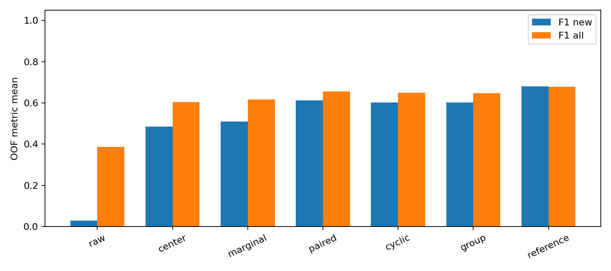
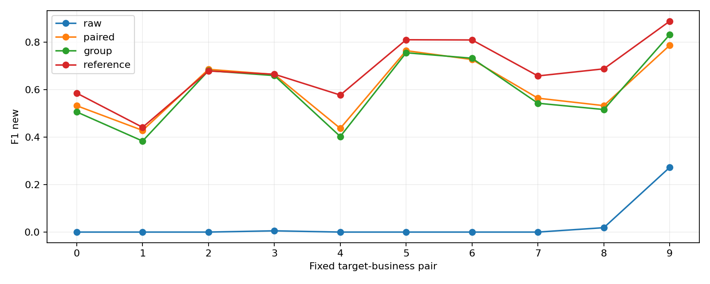

# Hy2 HFC-W：跨业务窗口摘要增广完整报告

日期：2026-09-28。状态：生成、训练、评分及最终审计完成。本轮冻结，不自动搜索参数。

## 1. 结论与主要结果

在五业务、目标两业务无训练post的预定设置中，paired相对raw和group的双重增量判据**未同时通过**。判据为两项F1_new的97.5%调整内容bootstrap区间下界均大于零，而非合法率、胜错配或CE改善。

| protocol   | arm       |   F1_new |   F1_all |   BA_all |   CE_all_bits |   Brier_all |   CE_new_bits |   Brier_new |
|:-----------|:----------|---------:|---------:|---------:|--------------:|------------:|--------------:|------------:|
| HYSTERIA2  | center    | 0.486004 | 0.603772 | 0.639944 |      1.285254 |    0.491474 |      1.726733 |    0.649469 |
| HYSTERIA2  | cyclic    | 0.602048 | 0.649361 | 0.661222 |      1.214707 |    0.472093 |      1.288214 |    0.504862 |
| HYSTERIA2  | group     | 0.601417 | 0.648007 | 0.660667 |      1.186497 |    0.462766 |      1.267373 |    0.498797 |
| HYSTERIA2  | marginal  | 0.509213 | 0.616006 | 0.648889 |      1.232953 |    0.484506 |      1.502994 |    0.597688 |
| HYSTERIA2  | paired    | 0.612644 | 0.654907 | 0.664111 |      1.159726 |    0.452825 |      1.266780 |    0.497943 |
| HYSTERIA2  | raw       | 0.029655 | 0.386594 | 0.494556 |     10.251960 |    0.824424 |     24.669515 |    1.665140 |
| HYSTERIA2  | reference | 0.680592 | 0.678769 | 0.687500 |      1.117054 |    0.434052 |      1.120447 |    0.436464 |

### 两项主比较

| contrast     |    delta |     low95 |   high95 |   adjusted_low |   adjusted_high |
|:-------------|---------:|----------:|---------:|---------------:|----------------:|
| paired-raw   | 0.582990 |  0.525593 | 0.631986 |       0.517786 |        0.637772 |
| paired-group | 0.011227 | -0.002718 | 0.024998 |      -0.004713 |        0.027117 |

F1值为0–1单位，差乘100为百分点。F1_new来自完整五类混淆矩阵，再取目标两类F1均值；并非简化二分类。所有结果先按五折OOF计算，再平均组合/轮换/seed，不做概率集成。

### 本轮结果的具体含义

paired的F1_new=0.612644，raw=0.029655，group=0.601417。相对raw提高58.299个百分点，97.5%调整区间为[51.779,63.777]个百分点；相对group提高1.123个百分点，调整区间为[-0.471,2.712]个百分点，跨零。因此只能确认当前变换增广相对原pre增广有用途，尚未建立精确访问对应超越该组级方法的额外用途。不能将区间跨零解释成方法等效或对应关系完全无信息。

paired相对center、marginal的F1_new分别提高12.664和10.343个百分点，普通95%区间分别为[8.080,17.086]与[6.035,14.550]个百分点。条件化方案有描述性优势，但group/cyclic也约为0.60，不能把全部优势归于真实实例身份。辅助对照不属于两项主要比较的同时覆盖声明。

reference的F1_new=0.680592，paired低6.795个百分点，普通95%区间为[-11.059,-2.745]个百分点，且新业务CE/Brier也不如reference。这不是合成数据已替代真实post的结果。

paired相对group的新业务CE/Brier差分别仅为-0.000593 bits和-0.000855，普通95%区间均跨零；不能在F1未通过时改用概率指标宣布成功。完整五类F1从raw的0.386594改善至paired的0.654907，但相对group的0.648007差距仍小。

十个业务组中，paired−group的20项家族调整区间均跨零。YouTube搜索＋播放组，paired=0.787300而group=0.832337，点估计反而更低；保留这一例外，不能只展示有利组。三个seed的paired合并均值均高于group，但seed不能替代内容级独立性，不能由此宣布显著。

每个100访问OOF中有40个目标业务访问，平均组/轮换/seed后：paired相对raw修复22.472个错误、新增0.011个；相对group修复1.750个、新增1.667个。重复运行的平均计数不是额外独立样本。

raw在十组中的七组F1_new为零，新业务CE达24.670 bits。这是当前混合C_post与U_pre训练在真实post上的严重失败表现，不是概率单位错误，也不是二分类指标；不能凭这个大增益单独证明精确配对必要。共享carrier、范围混杂及表示压缩可能影响实例关系的可利用性，但本轮没有把它们分别做因果对照，不能直接将未通过归因于多路复用。

## 2. 数据与测量口径

只使用0916 Hy2，五类各五内容，每内容四重复1/2/4/5，共25内容、100访问。Bing主目标DIRECT，Bilibili主目标DIRECT，均不进入主实验。旧SS/VLESS为六分类和不同摘要，不能把本次分数直接用于协议排名。

外部窗口固定manifest UTC [started_at,completed_at)，不是pre首尾或媒体播放进度。pre按完整flow-index绑定的主carrier成员在原始TUN中定位，post按carrier路径在原始physical捕获中定位。重建覆盖5520登记成员，不能只复用1526个请求关联成员。

六维为方向payload字节W、正payload事件数P、合并时间线方向段R。实际TCP重传和QUIC控制/恢复观测保留，不称唯一应用字节；R不是旧FR，不将内层F或carrier数放入分类输入。所有成员引用的同一原包只计一次。

200份原始文件约11.56GB；主carrier无重复纳入候选、会话窗口无重叠，5条跨候选生命周期引用中找到的2个旧carrier包全部排除在后续主输入之外。此结论限于所登记观察范围，不是所有网络历史无混杂的证明。

98个carrier创建事件未知，历史carry-in不完全可识别。用户确认窗口观测口径后保留这一限制。另有GitHub python/cpython一次访问的一个尾部成员无包：保留访问，只统计实际观测，不补零、不删除访问、不以缺失标记作特征；原失败审核门保留，另存accepted-window-gate。Wikipedia一次HTTP200但子资源失败的文章访问由用户确认有效，降级原字段保留。详见[原始包审核](measurement-audit.md)。

## 3. 资源预算与隔离

五内容外折继承既有内容ID：每折20训练内容/80访问，5测试内容/20访问。十种目标二业务组合全部报告；三辅助业务各选2内容构成C=6内容/24配对访问，U=14内容/56pre访问，其中目标业务32访问。六均衡轮换，每辅助内容入C三次；三seed为20260918/19/20。

生成器只用C；U只允许pre和既有标签；U_post单独导出，仅受限预测封存后的reference开放。H推理只有post，H_pre没有导出，H标签在预测封存后评分。匿名group包只有C的两侧无序内容数值集合，没有session/repetition/time/carrier身份。raw使用同样额外pre和标签，因此paired−raw不能归因于多拿源标签。

预处理只拟合C_pre，LOCO每次剔除整内容并重拟合。全部内容及访问保持C/U/H互斥。资格整理曾读取两侧原始数据，因此本轮不证明实际无需采集U_post，也不证明无内部索引的在线分段。

## 4. 生成模型与可行构造

令N=R_up+R_down、D=R_up−R_down、G=P−R、H=W−P、M=65526P。

编码为[log(N−.5),asinh(D),log(G_up+.5),log(G_down+.5),log((H_up+.5)/(M_up−H_up+.5)),log((H_down+.5)/(M_down−H_down+.5))]。

解码N=1+floor(exp(z_N))；N偶数时D=0、奇数时D取±1合法格点；R=(N±D)/2；非零方向P=R+floor(exp(z_G))，H=floor((M+1)sigmoid(z_H))，W=P+H；零方向联动归零。边界映射、整数格点及浮点sigmoid端点作用单独记录。L=65527是非jumbo传输payload的保守计数上界，不是实际MTU。

输出满足0≤R≤P≤W≤65527P、零方向联动与单条合并序列|D|≤1。此构造只保证摘要必要约束，不保证可运行QUIC会话或业务语义。溢出停止、零重抽、零fallback。

生成器6输入/6输出加截距42参数Ridge，alpha=1、均方目标、截距不罚。输入原六维log1p标准化；目标为新编码漂移，尺度仅C_pre编码标准差，常数维置1。group在新编码上取目标均值，并用4×4组合的内容LOCO联合残差；不复用真配池。

## 5. 对照与CUDA训练

raw：原pre；center：真实漂移逐维中位数；marginal：真实联合漂移随机抽样；paired：真配条件中心及LOCO残差；cyclic：同内容跨重复错配独立拟合；group：匿名组目标与独立残差；reference：额外真实U_post。center/marginal也依赖真实漂移，不能称为无配对参照。

分类器6→32→5 ReLU，Adam .001、1000步、batch24，权重平方损失.5×1e−4，bias不罚；无早停/搜索/BN/dropout。每来源访问300次，各臂同初值、同调度、同C_pre尺度。每U访问8生成视图，视图不增加独立内容数量。

生成及Ridge为CUDA float64，分类训练/推理CUDA float32，TF32关闭、确定性算法开启；CPU只做解析、台账、抽样、统计和绘图。6300次Ridge、2016000视图、5400受限分类器＋900reference，共6300模型/630万更新，126000预测行。实际独立内容仍25、访问仍100。

## 6. 各业务组合及随机种子

|   business_group | target_businesses                                                       |
|-----------------:|:------------------------------------------------------------------------|
|                0 | developer.mozilla.org::document_view + github.com::repository_view      |
|                1 | developer.mozilla.org::document_view + wikipedia.org::article_view      |
|                2 | developer.mozilla.org::document_view + youtube.com::search_results_view |
|                3 | developer.mozilla.org::document_view + youtube.com::video_playback      |
|                4 | github.com::repository_view + wikipedia.org::article_view               |
|                5 | github.com::repository_view + youtube.com::search_results_view          |
|                6 | github.com::repository_view + youtube.com::video_playback               |
|                7 | wikipedia.org::article_view + youtube.com::search_results_view          |
|                8 | wikipedia.org::article_view + youtube.com::video_playback               |
|                9 | youtube.com::search_results_view + youtube.com::video_playback          |

| protocol   |   business_group | arm       |   F1_new |   F1_all |   BA_all |   CE_all_bits |   Brier_all |   CE_new_bits |   Brier_new |
|:-----------|-----------------:|:----------|---------:|---------:|---------:|--------------:|------------:|--------------:|------------:|
| HYSTERIA2  |                0 | center    | 0.292392 | 0.552688 | 0.607778 |      1.457027 |    0.508750 |      2.512233 |    0.828576 |
| HYSTERIA2  |                0 | cyclic    | 0.496699 | 0.641789 | 0.643889 |      1.209491 |    0.469282 |      1.629841 |    0.634271 |
| HYSTERIA2  |                0 | group     | 0.506452 | 0.646985 | 0.649444 |      1.175992 |    0.456395 |      1.616419 |    0.628215 |
| HYSTERIA2  |                0 | marginal  | 0.350374 | 0.598934 | 0.643889 |      1.212022 |    0.467106 |      1.751219 |    0.681152 |
| HYSTERIA2  |                0 | paired    | 0.532695 | 0.654509 | 0.654444 |      1.148882 |    0.445601 |      1.584898 |    0.612729 |
| HYSTERIA2  |                0 | raw       | 0.000000 | 0.443937 | 0.552222 |     14.341395 |    0.783283 |     35.334047 |    1.776254 |
| HYSTERIA2  |                0 | reference | 0.585801 | 0.675065 | 0.682778 |      1.126108 |    0.437811 |      1.485371 |    0.573992 |
| HYSTERIA2  |                1 | center    | 0.077113 | 0.485198 | 0.562778 |      1.584525 |    0.565309 |      2.977301 |    1.086863 |
| HYSTERIA2  |                1 | cyclic    | 0.365116 | 0.622599 | 0.657222 |      1.290350 |    0.497407 |      1.536043 |    0.623615 |
| HYSTERIA2  |                1 | group     | 0.383704 | 0.632951 | 0.662222 |      1.239018 |    0.479985 |      1.493436 |    0.613120 |
| HYSTERIA2  |                1 | marginal  | 0.174577 | 0.532230 | 0.590556 |      1.347432 |    0.513106 |      2.252560 |    0.905027 |
| HYSTERIA2  |                1 | paired    | 0.428654 | 0.662977 | 0.677778 |      1.174308 |    0.455123 |      1.490628 |    0.616778 |
| HYSTERIA2  |                1 | raw       | 0.000000 | 0.448300 | 0.546667 |     18.987578 |    0.860519 |     46.685963 |    1.905242 |
| HYSTERIA2  |                1 | reference | 0.441659 | 0.664151 | 0.668889 |      1.127125 |    0.438389 |      1.437769 |    0.603907 |
| HYSTERIA2  |                2 | center    | 0.585833 | 0.654199 | 0.681667 |      1.245007 |    0.485281 |      1.492996 |    0.570400 |
| HYSTERIA2  |                2 | cyclic    | 0.671707 | 0.670033 | 0.675556 |      1.269312 |    0.491625 |      1.305068 |    0.504945 |
| HYSTERIA2  |                2 | group     | 0.680228 | 0.676244 | 0.681667 |      1.222725 |    0.475169 |      1.254831 |    0.486993 |
| HYSTERIA2  |                2 | marginal  | 0.542524 | 0.642477 | 0.679444 |      1.236345 |    0.483433 |      1.400218 |    0.545287 |
| HYSTERIA2  |                2 | paired    | 0.686168 | 0.673466 | 0.677778 |      1.171959 |    0.456053 |      1.217320 |    0.470880 |
| HYSTERIA2  |                2 | raw       | 0.000000 | 0.377902 | 0.502222 |     10.110372 |    0.791093 |     24.315012 |    1.561128 |
| HYSTERIA2  |                2 | reference | 0.679068 | 0.673277 | 0.681111 |      1.137506 |    0.442330 |      1.071363 |    0.417689 |
| HYSTERIA2  |                3 | center    | 0.502963 | 0.634276 | 0.671667 |      1.240862 |    0.470440 |      1.686662 |    0.646477 |
| HYSTERIA2  |                3 | cyclic    | 0.667424 | 0.677526 | 0.683333 |      1.144523 |    0.442607 |      1.033806 |    0.413717 |
| HYSTERIA2  |                3 | group     | 0.659734 | 0.666650 | 0.673333 |      1.123061 |    0.434868 |      1.034049 |    0.414276 |
| HYSTERIA2  |                3 | marginal  | 0.549017 | 0.653007 | 0.684444 |      1.179468 |    0.458966 |      1.423191 |    0.580536 |
| HYSTERIA2  |                3 | paired    | 0.664475 | 0.680727 | 0.687222 |      1.107410 |    0.428122 |      1.072549 |    0.427953 |
| HYSTERIA2  |                3 | raw       | 0.005291 | 0.399094 | 0.524444 |      7.324076 |    0.833401 |     17.319366 |    1.698676 |
| HYSTERIA2  |                3 | reference | 0.665460 | 0.684934 | 0.692778 |      1.095542 |    0.425872 |      0.976169 |    0.399364 |
| HYSTERIA2  |                4 | center    | 0.264557 | 0.561682 | 0.619444 |      1.282288 |    0.476456 |      2.055712 |    0.761279 |
| HYSTERIA2  |                4 | cyclic    | 0.424132 | 0.636965 | 0.647222 |      1.230829 |    0.479332 |      1.679682 |    0.672360 |
| HYSTERIA2  |                4 | group     | 0.403028 | 0.629470 | 0.646111 |      1.196357 |    0.467968 |      1.681013 |    0.678128 |
| HYSTERIA2  |                4 | marginal  | 0.339542 | 0.605126 | 0.661111 |      1.197275 |    0.462262 |      1.683612 |    0.663364 |
| HYSTERIA2  |                4 | paired    | 0.437286 | 0.641180 | 0.650556 |      1.168630 |    0.455455 |      1.666909 |    0.667927 |
| HYSTERIA2  |                4 | raw       | 0.000000 | 0.443609 | 0.553333 |     15.299844 |    0.793326 |     37.765558 |    1.807186 |
| HYSTERIA2  |                4 | reference | 0.577715 | 0.677993 | 0.684444 |      1.135351 |    0.441814 |      1.502478 |    0.585980 |
| HYSTERIA2  |                5 | center    | 0.738172 | 0.653038 | 0.655556 |      1.208685 |    0.486470 |      1.206291 |    0.455945 |
| HYSTERIA2  |                5 | cyclic    | 0.754018 | 0.655591 | 0.657222 |      1.248431 |    0.484814 |      1.349502 |    0.498181 |
| HYSTERIA2  |                5 | group     | 0.756012 | 0.650257 | 0.652222 |      1.215877 |    0.474547 |      1.302148 |    0.479646 |
| HYSTERIA2  |                5 | marginal  | 0.770776 | 0.672090 | 0.674444 |      1.238018 |    0.491083 |      1.246952 |    0.461518 |
| HYSTERIA2  |                5 | paired    | 0.764852 | 0.652583 | 0.656111 |      1.188815 |    0.464388 |      1.250906 |    0.455274 |
| HYSTERIA2  |                5 | raw       | 0.000000 | 0.303853 | 0.412778 |      7.716655 |    0.842459 |     18.255960 |    1.599910 |
| HYSTERIA2  |                5 | reference | 0.810798 | 0.676246 | 0.683889 |      1.150395 |    0.447244 |      1.162654 |    0.415801 |
| HYSTERIA2  |                6 | center    | 0.637563 | 0.600814 | 0.606111 |      1.210541 |    0.488301 |      1.498979 |    0.603475 |
| HYSTERIA2  |                6 | cyclic    | 0.726319 | 0.648923 | 0.648889 |      1.145483 |    0.444461 |      1.198070 |    0.444121 |
| HYSTERIA2  |                6 | group     | 0.732849 | 0.649546 | 0.650000 |      1.137447 |    0.443075 |      1.186541 |    0.442073 |
| HYSTERIA2  |                6 | marginal  | 0.694858 | 0.629191 | 0.628889 |      1.209220 |    0.483366 |      1.425992 |    0.572214 |
| HYSTERIA2  |                6 | paired    | 0.727479 | 0.653169 | 0.652222 |      1.133974 |    0.441230 |      1.209339 |    0.448521 |
| HYSTERIA2  |                6 | raw       | 0.000000 | 0.301770 | 0.411667 |      6.139922 |    0.882948 |     14.265422 |    1.695774 |
| HYSTERIA2  |                6 | reference | 0.809935 | 0.688189 | 0.695000 |      1.103264 |    0.429897 |      1.002019 |    0.363933 |
| HYSTERIA2  |                7 | center    | 0.538697 | 0.646269 | 0.687222 |      1.195350 |    0.471710 |      1.290827 |    0.520178 |
| HYSTERIA2  |                7 | cyclic    | 0.557974 | 0.640535 | 0.660000 |      1.295155 |    0.503022 |      1.348561 |    0.530503 |
| HYSTERIA2  |                7 | group     | 0.543178 | 0.634617 | 0.658889 |      1.248477 |    0.487546 |      1.285840 |    0.510871 |
| HYSTERIA2  |                7 | marginal  | 0.491391 | 0.626904 | 0.679444 |      1.234428 |    0.486346 |      1.310275 |    0.520209 |
| HYSTERIA2  |                7 | paired    | 0.564494 | 0.649146 | 0.668889 |      1.195458 |    0.468718 |      1.216934 |    0.486734 |
| HYSTERIA2  |                7 | raw       | 0.000000 | 0.371417 | 0.492778 |     10.599455 |    0.788017 |     25.597405 |    1.584628 |
| HYSTERIA2  |                7 | reference | 0.658267 | 0.678290 | 0.686111 |      1.144647 |    0.444977 |      1.092796 |    0.429970 |
| HYSTERIA2  |                8 | center    | 0.498949 | 0.634338 | 0.675556 |      1.178850 |    0.458716 |      1.437282 |    0.592328 |
| HYSTERIA2  |                8 | cyclic    | 0.514032 | 0.640587 | 0.669444 |      1.167800 |    0.453233 |      1.055668 |    0.440193 |
| HYSTERIA2  |                8 | group     | 0.516649 | 0.639617 | 0.666667 |      1.151802 |    0.449128 |      1.038925 |    0.437160 |
| HYSTERIA2  |                8 | marginal  | 0.524418 | 0.638648 | 0.673889 |      1.174308 |    0.462387 |      1.295238 |    0.545239 |
| HYSTERIA2  |                8 | paired    | 0.533039 | 0.647147 | 0.670556 |      1.127605 |    0.440318 |      1.035536 |    0.438722 |
| HYSTERIA2  |                8 | raw       | 0.018519 | 0.396800 | 0.517222 |      9.388467 |    0.820806 |     22.519025 |    1.690669 |
| HYSTERIA2  |                8 | reference | 0.688195 | 0.702486 | 0.708333 |      1.104212 |    0.429746 |      0.973638 |    0.401533 |
| HYSTERIA2  |                9 | center    | 0.723801 | 0.615221 | 0.631667 |      1.249408 |    0.503308 |      1.109044 |    0.429168 |
| HYSTERIA2  |                9 | cyclic    | 0.843061 | 0.659056 | 0.669444 |      1.145697 |    0.455147 |      0.745898 |    0.286713 |
| HYSTERIA2  |                9 | group     | 0.832337 | 0.653735 | 0.666111 |      1.154213 |    0.458973 |      0.780526 |    0.297490 |
| HYSTERIA2  |                9 | marginal  | 0.654653 | 0.561459 | 0.572778 |      1.301011 |    0.537006 |      1.240681 |    0.502329 |
| HYSTERIA2  |                9 | paired    | 0.787300 | 0.634169 | 0.645556 |      1.180220 |    0.473242 |      0.922781 |    0.353907 |
| HYSTERIA2  |                9 | raw       | 0.272736 | 0.379261 | 0.432222 |      2.611833 |    0.848392 |      4.637390 |    1.331934 |
| HYSTERIA2  |                9 | reference | 0.889024 | 0.667060 | 0.691667 |      1.046385 |    0.402438 |      0.500215 |    0.172470 |

逐seed均值：

| protocol   | arm       |     seed |   F1_new |   F1_all |   BA_all |   CE_all_bits |   Brier_all |   CE_new_bits |   Brier_new |
|:-----------|:----------|---------:|---------:|---------:|---------:|--------------:|------------:|--------------:|------------:|
| HYSTERIA2  | center    | 20260918 | 0.489915 | 0.606578 | 0.643667 |      1.281298 |    0.496283 |      1.618987 |    0.623702 |
| HYSTERIA2  | center    | 20260919 | 0.483421 | 0.600214 | 0.638000 |      1.273351 |    0.485699 |      1.698624 |    0.636588 |
| HYSTERIA2  | center    | 20260920 | 0.484675 | 0.604525 | 0.638167 |      1.301114 |    0.492440 |      1.862587 |    0.688116 |
| HYSTERIA2  | cyclic    | 20260918 | 0.587887 | 0.641801 | 0.657667 |      1.243399 |    0.482349 |      1.299532 |    0.506625 |
| HYSTERIA2  | cyclic    | 20260919 | 0.605277 | 0.646900 | 0.658667 |      1.218184 |    0.472769 |      1.285181 |    0.503362 |
| HYSTERIA2  | cyclic    | 20260920 | 0.612980 | 0.659380 | 0.667333 |      1.182538 |    0.461162 |      1.279929 |    0.504599 |
| HYSTERIA2  | group     | 20260918 | 0.586012 | 0.639700 | 0.656833 |      1.215846 |    0.473445 |      1.279331 |    0.500814 |
| HYSTERIA2  | group     | 20260919 | 0.599989 | 0.645261 | 0.659500 |      1.188112 |    0.462571 |      1.266404 |    0.497657 |
| HYSTERIA2  | group     | 20260920 | 0.618251 | 0.659061 | 0.665667 |      1.155533 |    0.452280 |      1.256383 |    0.497921 |
| HYSTERIA2  | marginal  | 20260918 | 0.500140 | 0.613067 | 0.648833 |      1.263981 |    0.497440 |      1.507282 |    0.599748 |
| HYSTERIA2  | marginal  | 20260919 | 0.512394 | 0.613199 | 0.648167 |      1.228742 |    0.479155 |      1.485635 |    0.584868 |
| HYSTERIA2  | marginal  | 20260920 | 0.515105 | 0.621754 | 0.649667 |      1.206135 |    0.476924 |      1.516065 |    0.608446 |
| HYSTERIA2  | paired    | 20260918 | 0.599121 | 0.645437 | 0.658000 |      1.194152 |    0.465404 |      1.275102 |    0.498623 |
| HYSTERIA2  | paired    | 20260919 | 0.610045 | 0.648753 | 0.659333 |      1.158777 |    0.452414 |      1.262019 |    0.497785 |
| HYSTERIA2  | paired    | 20260920 | 0.628766 | 0.670533 | 0.675000 |      1.126249 |    0.440657 |      1.263218 |    0.497420 |
| HYSTERIA2  | raw       | 20260918 | 0.035515 | 0.390052 | 0.498167 |     11.177776 |    0.823155 |     26.999049 |    1.668957 |
| HYSTERIA2  | raw       | 20260919 | 0.031430 | 0.385229 | 0.493500 |     10.808819 |    0.823145 |     26.037826 |    1.653483 |
| HYSTERIA2  | raw       | 20260920 | 0.022019 | 0.384501 | 0.492000 |      8.769285 |    0.826974 |     20.971670 |    1.672980 |
| HYSTERIA2  | reference | 20260918 | 0.674745 | 0.668766 | 0.681000 |      1.161286 |    0.451090 |      1.158076 |    0.450298 |
| HYSTERIA2  | reference | 20260919 | 0.680662 | 0.682584 | 0.689000 |      1.115825 |    0.432549 |      1.121739 |    0.436737 |
| HYSTERIA2  | reference | 20260920 | 0.686370 | 0.684957 | 0.692500 |      1.074050 |    0.418517 |      1.081528 |    0.422357 |

十组合的分组双重比較采用20项家族的99.75%区间，不能凭整体结论宣称每组都成立。单类F1/召回、CE、Brier、修复/新增错误、轮换结果以及全部比较见[详细结果表](results-tables.md)和error-ledger/error-counts。

## 7. 解码作用与多样性

| arm      |   views |   direction_bound |   zero_direction |   sigmoid_endpoint |   unique_views_mean |   direction_bound_rate |   zero_direction_rate |   sigmoid_endpoint_rate |
|:---------|--------:|------------------:|-----------------:|-------------------:|--------------------:|-----------------------:|----------------------:|------------------------:|
| center   |  403200 |            198144 |                0 |                  0 |            1.000000 |               0.491429 |              0.000000 |                0.000000 |
| cyclic   |  403200 |            290473 |                0 |                  0 |            6.857143 |               0.720419 |              0.000000 |                0.000000 |
| group    |  403200 |            290784 |                0 |                  0 |            7.684524 |               0.721190 |              0.000000 |                0.000000 |
| marginal |  403200 |            169229 |                0 |                  0 |            6.857143 |               0.419715 |              0.000000 |                0.000000 |
| paired   |  403200 |            291709 |                0 |                  0 |            6.857143 |               0.723485 |              0.000000 |                0.000000 |

合法率不是业务收益，边界发生率不能独立证明收益机制。这里direction_bound包含N为偶数时D必须归零的奇偶约束作用，不能把其发生率等同于严重越界或与旧FSC的F条件边界率直接比较。group残差池96条、paired/cyclic24条，均只来自6内容24访问；每查询同为8视图。零方向与边界映射可能改变分布，不称无失真生成。

## 8. 不确定性与解释边界

10000次按五业务分层内容bootstrap，保留重复、所有组/轮换/seed的关联；区间条件于已拟合模型和固定C设计。总体两主比较用家族2；十组的二比较用家族20。其他辅助比较的普通95%区间仅作描述；结果表中的调整分位列不构成所有辅助比较的同时覆盖声明。

paired若通过，支持当前已见Hy2部署、登记窗口与有限组级控制下的增广用途，不证明所有无配对方法不可能成功；若未通过，不扩网络、调阈值或换业务组合挽救结果。reference拥有额外真实post，非理论上界，差距不能因合成合法而忽略。

本次五分类/窗口观测不是旧六分类/唯一TCP字节实验的直接复刻。不能自动合并三个部署的显著性为一个新统一预登记结论；如需联合声明应单独报告六项主比较家族。不能主张QUIC解复用、逐flow生成、真实协议可实现、纯协议因果律、外部DIRECT迁移或实际采集节省。

## 9. 审计与复现

生成2016000视图逐条由保存模型及donor重放；组目标展开等价、匿名重排不变、异常数值停止、输入权限、CUDA串行/批量等价已验收。6300分类器checkpoint重载推理通过，900个scenario/seed核对七臂同初值/调度/尺度。19项回归测试通过，包括完整五类混淆矩阵的目标F1计算。

| mode       |   models |   scenario_seconds_sum |
|:-----------|---------:|-----------------------:|
| restricted |     5400 |             538.161001 |
| reference  |      900 |             521.781350 |

以上为各scenario累计阶段秒数，不是全任务墙钟时间。主要目录：`eval/hy2_carrier_calibration/`、`outputs/hy2-window-calibration-0916/run-01/`。accepted-window-gate、learning-contract、generation-replay、classification-contract、两次prediction-seal、statistics-complete与completion提供可追溯链。

本轮冻结，不自动新增模型、补采或调整成功标准。
