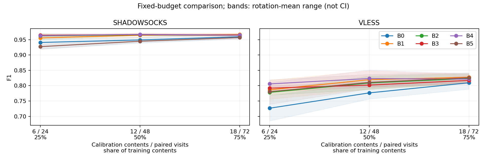

# 有限配对校准预算：0916实验总结

日期：2026-09-28。状态：CB0–CB8完成；本轮停止，不新增参数搜索或模型训练。

## 1. 结论先行

本轮检验的是：仅允许一部分训练内容提供真实pre/post配对，能否利用其余内容的pre和既有业务标签，生成有用的代理域训练摘要？

结果需要分成三个层次：

1. **相对只使用校准post的B0，加入生成的额外内容在低、中预算下有用途。** SS与VLESS在25%、50%预算下，B4−B0的macro-F1内容bootstrap区间均在零以上。
2. **相对直接加入同样额外pre和标签的B1，尚未建立稳定的分类决策增益。** 两部署三个预算的B4−B1 F1区间全部包含零；75%预算的点估计还略为负。最低25%预算下，两部署的CE改善区间均在零以下，SS的Brier也改善。
3. **精确对应的增量具有部署、预算和指标依赖。** SS在25%、50%预算下真配B4优于错配B5的F1区间在零以上；VLESS三个预算均未建立这项F1优势。这不等于所有生成器都需要同次精确配对。

因此，当前最稳妥的表述是：在既有双侧审计的0916队列中，有限校准加额外源内容可以提高相对小规模目标侧监督的表现；漂移合成在最低预算下呈现概率损失改善，但其相对直接源数据增广的稳定F1优势尚未建立。**不能据此宣称已经节省75%的实际流量采集，或者减少了业务标签需求。**

## 2. 实验对象、权限与预算

固定0916六业务、30个独立内容、240次访问；SS/VLESS各120次，每内容每部署4次重复（1、2、4、5）。业务为Bing搜索、MDN文档、GitHub仓库、Wikipedia文章、YouTube搜索与视频播放。

沿用五折内容划分。每部署每折24个训练内容、96次访问，测试6个未见内容、24次访问；同内容重复、父访问的全部连接和两侧一起划分。没有额外验证集、早停或测试集调参。

| 每业务校准内容k | C内容/部署/折 | C配对访问 | U额外pre访问 | C占训练内容比例 |
|---:|---:|---:|---:|---:|
| 1 | 6 | 24 | 72 | 25% |
| 2 | 12 | 48 | 48 | 50% |
| 3 | 18 | 72 | 24 | 75% |

每个预算4次均衡循环轮换，角色以固定哈希顺序确定，不以性能选择。相同轮换的C跨预算嵌套；两部署使用相同内容角色。三个seed为20260918/19/20，不改变角色。

- C：生成器可读pre/post；分类器可读post和标签，共同分类尺度仅用C_pre。
- U：仅开放pre与既有标签。U_post不进入生成器、残差池、近邻、缩放器、合法性筛选、分类器或模型选择；本轮也不做U_post生成质量评分。
- H：训练完全不可读；推理只接收七维post数值；预测封存后才读取标签评分。H_pre不使用。

**历史依赖必须保留：**七维摘要的共同连接资格及连接数F曾使用双侧观测审计。当前屏蔽U_post数值是模型拟合权限模拟，不会消除历史资格中的post依赖。不能将本轮等同于真正未捕获U_post的端到端系统。Python允许列表与分进程接口也不是操作系统级沙箱。

## 3. 表示、生成器和模型配置

输入为7维：两个方向的唯一TCP字节U、新字节事件数E、零阈值新字节方向段数R，加共同合格连接数F。R是连接级段数求和，**不是旧FR**；不包含IP、端口、SNI、链路层标识或内容身份特征。身份字段只用于划分、谱系和统计，不传入模型。

生成器保持上轮定义：log1p漂移、逐维标准化、CUDA float64 Ridge，alpha=1；截距不惩罚。C内按内容LOCO重拟合残差；完整六维残差向量联合采样；邻居数min(8,C内容数)，每个U访问8个视图，F不生成。B5在C内按同内容重复1→2→4→5→1循环错配，并独立重拟合中心和残差。k=1的LOCO每次只有5个拟合内容，未为它另换模型。

| 臂 | 分类训练输入 | 解释 |
|---|---|---|
| B0 | C真实post | 小预算目标监督 |
| B1 | C真实post + U原pre | 同样额外内容/标签，不做变换 |
| B2 | C真实post + U固定中心合成 | 简单部署漂移 |
| B3 | C真实post + U无条件联合漂移 | 无入口条件的增广 |
| B4 | C真实post + U真配条件随机合成 | 主方法 |
| B5 | C真实post + U错配条件随机合成 | 同次对应控制 |

分类器固定7→32→6，ReLU、Adam lr=0.001、1000步、batch24，CE(nats)+0.5×10⁻⁴×权重平方和，bias不惩罚，无BN/dropout。六臂同scenario/seed初值相同；B1–B5来源调度相同，每源访问出现250次。B0只循环C，更新次数相同，各C访问次数差不超过1。

全部模型拟合、训练与推理使用Pytorch312环境的CUDA，不作CPU回退；数据导出、抽样、统计及绘图使用CPU。18个独立小分类器沿模型维批量计算，不共享参数。工程核对中，5步后与独立串行模型最大logit差2.38×10⁻⁷、权重差2.98×10⁻⁸；改变其他模型输入不影响被测模型。

**本轮共同分类尺度只用C_pre拟合，与上轮全部训练pre尺度不同。** 预算变化也改变真实C占比、U数量和尺度估计精度，因此曲线是整个预算方案的表现，不是孤立的生成器学习曲线。

## 4. 执行量与审计

- 120个scenario：2部署×5折×3预算×4轮换。
- 3,120次CUDA Ridge拟合；552,960个U合成视图。
- 2,160个CUDA分类器，216万次更新；51,840条OOF预测。
- 每个模型重载后改变推理batch边界核对，概率在固定数值容差内一致，argmax全部一致。
- 全部scenario的C/U/H访问、连接ID与捕获文件SHA256集合两两互斥。
- 训练包污染测试：修改U_post及H数值不改变导出的训练包；受控CUDA拟合不变性与禁止角色请求测试通过。
- 生成donor和所有LOCO拟合范围都在C；U仅查询；分类scaler只用C。
- 冻结源数据、配置、生成和训练代码哈希最终核对一致。没有修改历史实验或扫描新PCAP。

合法性门按部署×预算×生成臂汇总，阈值仍为首次非法≤10%、fallback≤1%。全部通过，最终fallback均为0；最高首次非法率为VLESS k=2 B3的8.6762%。这只证明必要摘要约束通过，不等于生成了协议合法的完整流量。

更完整成本与合法性表见[权限与预算](permissions-and-budget.md)、[生成合法性](generation-legality.md)。

## 5. 主结果：macro-F1

先对每个seed/轮换汇总五折120次访问计算指标，再平均三个seed与四轮换；**不进行概率集成**。

| 部署 | C预算 | B0 | B1 | B2 | B3 | B4 | B5 |
|---|---:|---:|---:|---:|---:|---:|---:|
| SS | 25% | .940961 | .955765 | .962507 | .964514 | .963134 | .927402 |
| SS | 50% | .949293 | .964674 | .965926 | .966626 | .967315 | .945054 |
| SS | 75% | .959697 | .967349 | .964560 | .964556 | .965253 | .956883 |
| VLESS | 25% | .726497 | .786466 | .778052 | .791903 | .805795 | .780427 |
| VLESS | 50% | .776464 | .819549 | .808865 | .801930 | .823317 | .810647 |
| VLESS | 75% | .809455 | .827379 | .823402 | .817139 | .821500 | .825928 |

色带为平均seed后的轮换范围，不是置信区间。B4并非预算增加时严格单调，也不是所有格子的最高分。

### 5.1 核心对照：是否超出额外pre和标签本身的价值？

下表为B4−B1；F1以百分点表示，CE为bits。区间为2000次按业务分层的内容bootstrap，全部部署/预算/seed/轮换共享同一次内容重抽。

| 部署 | C预算 | ΔF1百分点 [95%区间] | ΔCE [95%区间] |
|---|---:|---:|---:|
| SS | 25% | +0.737 [−1.552, +3.020] | −.0380 [−.0617, −.0139] |
| SS | 50% | +0.264 [−1.189, +1.720] | −.0010 [−.0177, +.0177] |
| SS | 75% | −0.210 [−1.125, +.418] | −.0023 [−.0157, +.0151] |
| VLESS | 25% | +1.933 [−.269, +4.167] | −.0589 [−.1265, −.0060] |
| VLESS | 50% | +.377 [−1.158, +1.991] | −.0103 [−.0494, +.0223] |
| VLESS | 75% | −.588 [−1.913, +.870] | −.0062 [−.0253, +.0097] |

最低预算SS的Brier差为−.021750，区间[−.035894,−.008183]；VLESS为−.016853，区间[−.039093,+.004339]。CE收益不应自动翻译成F1收益，更不能称为概率校准误差已降低——本轮测量的是预测损失，没有单独估计概率校准曲线。

### 5.2 相对B0与其他机制控制

B4−B0在SS的三个预算分别为+2.217、+1.802、+.556个百分点；VLESS分别为+7.930、+4.685、+1.204个百分点。只有前两个预算的区间不含零。这项差值同时包含额外U内容和标签的用途，不能全部归因于漂移建模。

SS B4−B5在25%、50%预算分别为+3.573个百分点[+1.693,+5.564]和+2.226[+.762,+3.966]；75%为+.837，区间下界为零。三个预算CE均优于B5。SS的B2/B3本身已很强，不能由真配胜错配推断复杂条件生成是必要条件。

VLESS三个预算的B4−B5 F1区间均包含零；75%预算B5的F1和CE点估计反而更好。VLESS k=1 B4−B2为+2.774个百分点[+.326,+5.586]；k=2 B4−B3为+2.139[+.525,+4.239]。这些局部对照应完整保留，但不替代预定核心B4−B1，也不升级为跨预算普遍优越性。

所有区间均为未做多重比较校正的描述性区间，条件于现有模型与固定均衡C轮换；不包含重新抽取校准内容并重训的完整不确定性。区间包含零不代表等效，边界恰为零也不称严格正效应。

## 6. 业务例外与重复稳定性

VLESS最低预算下B4相比B1：Bing搜索召回从.7375升至.8625；视频播放从.8542升至.8958；MDN文档从.8167降至.7458。YouTube搜索为.3917，虽略高于B1的.3708，仍低于B0的.4667。这个失败模式没有通过删除业务或调整生成器掩盖。

VLESS 75%预算下，B4的YouTube搜索/播放召回分别为.3792/.8542，低于B1的.4042/.8792，解释了部分合并F1退化。SS也有类似权衡：25%预算B4相对B1改善MDN、GitHub和视频播放，但YouTube搜索从.9417降至.8875，Wikipedia从1降至.9625。

| 部署 | 预算 | B4三seed的F1（各平均四轮换） | B4轮换均值范围 |
|---|---:|---|---|
| SS | 25% | .956168 / .968685 / .964549 | [.955526,.969397] |
| SS | 50% | .958281 / .972870 / .970793 | [.963851,.969406] |
| SS | 75% | .958312 / .970799 / .966646 | [.963868,.966637] |
| VLESS | 25% | .799792 / .799986 / .817605 | [.796313,.810385] |
| VLESS | 50% | .813355 / .828002 / .828593 | [.796380,.851651] |
| VLESS | 75% | .801415 / .832970 / .830115 | [.809790,.839090] |

VLESS中预算轮换范围尤其明显；不能只报告最有利校准集合。四轮换和三seed也不是新增独立访问。本轮独立内容仍只有30个，访问仍240次。

全部432个seed×轮换指标、36格汇总、业务召回、修复/新增错误及所有主对照区间见[完整结果附录](business-budget-results.md)。逐访问错误变化保存在`error-change-ledger.parquet`，没有仅保留净改善。

## 7. 为什么不宣称已经减少某个比例的采集预算

旧全post监督T6的F1为SS .955580、VLESS .788045。本轮部分小预算臂数值更高，但**不是相同条件的等效检验**：共同尺度与来源调度不同，额外pre/合成还改变正则化与输入分布。T6仅为预测封存后读取的历史参考，不是理论上界、匹配基线或模型选择依据；没有额外拟合可选k=4参照。

没有预先定义可接受性能损失，也没有新日期/新配置外部验证，因此不能从测试曲线倒推“最低6内容就够”“节省75%而无损”。U既有标签始终开放，业务标签成本没有减少；历史共同连接资格也使本轮不能直接推断真实抓包成本。

本轮不涉及外部DIRECT流量、Hy2共享carrier、记录序列编码器、在线无索引切分或跨未知部署泛化。七维摘要结果不能替代此前记录表示或SSL实验结论。

## 8. 交付与复现

- 配置：`configs/paired-calibration-budget-0916.yaml`。
- 核心权限导出/生成：`src/proxy_analysis/calibration_budget/`。
- 入口及评估脚本：`eval/paired_calibration_budget/`，见[执行说明](../../eval/paired_calibration_budget/README.md)。
- 数据、模型、谱系与审计：`outputs/paired-calibration-budget-0916/run-01/`。
- `completion.json`登记完成状态；`contract.json`、`worker-contract.json`、`training-contract.json`、`prediction-seal.json`、`scoring-seal.json`保存分阶段哈希。
- 权限与统计测试：`tests/unit/test_calibration_budget.py`、`tests/unit/test_calibration_budget_statistics.py`。

**停止决定：**按预定范围完成，不因B4未全面胜出而调整alpha、邻居、视图数、网络或预算点。当前正结果是相对小规模目标监督的收益及最低预算的概率损失改善；相对简单源增广的稳定F1增量仍未建立。若后续要提出“实际节省配对采集”的应用主张，应先解决pre-only资格和预注册非劣界，而非继续在同一测试队列上选择最有利预算。
