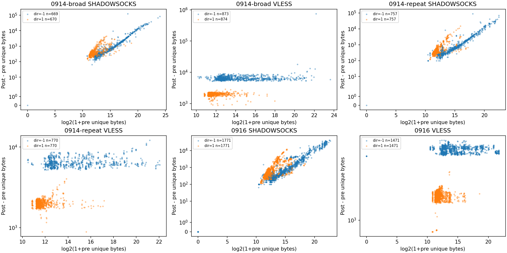
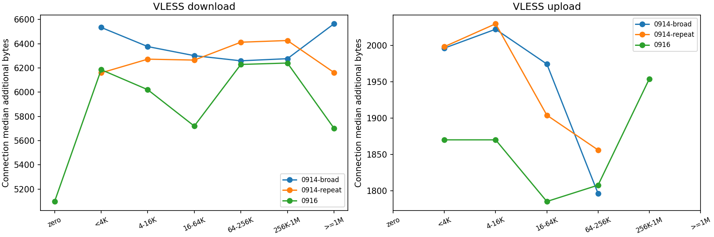
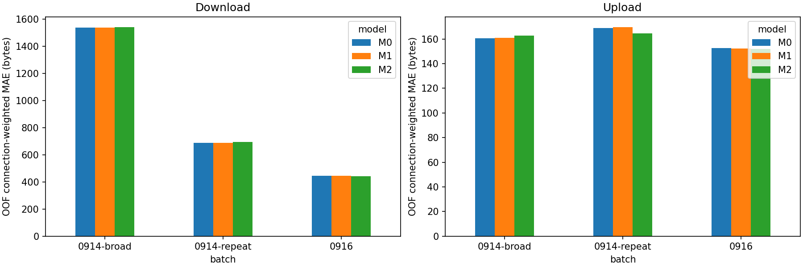

# VLESS 早期阶段机制候选：实施结果

日期：2026-09-24。三个批次独立报告；未补采、未全量重扫、未改阈值或旧 240 访问队列。

## 结论

本轮支持“连接级附加量及方向段差存在部署相关的集中模式”，但没有取得 initial/relay 的独立语义边界。记录语法可解析不等于阶段可识别；因此没有生成分阶段校正 K，也没有删除固定头部或两段。

0916 VLESS 上行在 <4 KiB 和 4–16 KiB 两个主要负载箱中位附加量均为 1,870 bytes（分别 1,085、350 条连接）；更大上行箱仅 21、14、1 条，≥1 MiB 为空，不能外推任意大负载。下行各非零负载箱中位约 5,702–6,240 bytes，≥1 MiB 有 76 条，说明集中现象不只出现在小流，但各箱中心并不完全相同。

在共同段资格集合、内容分组 OOF 中，0916 VLESS 上行 M0/M1/M2 的 MAE 分别为 152.79/152.43/151.82 bytes；下行为 446.32/446.41/440.92 bytes。新增关系项改善有限，不能因此认定附加量是精确常数，更不能证明其来自握手。0914 的方向结果及条目等权指标全部保留如下。

冻结样本 57 对连接/114 文件，76,130,116 bytes（72.60 MiB）；实际为 45 对 VLESS、12 对 SS，空分层未补样本。VLESS 两侧共 180 条方向流均建立初始 Hello 与连续记录语法解析，但证据等级只到 E1，不到 E2。SS 24 条方向/侧各自保留为无 cipher 解析的参照。

实现核验纠正了一个容易混淆的点：本次 VLESS 走 Mihomo 自带 transport/vless/vision，而不是仅因 go.mod 存在就认定使用 sing-vmess 的 Vision 实现。实现能指出控制命令/切换状态，但本轮捕获未提供经验证的命令位置。

## 1. 权限、资格与分组

有效字节连接方向 12,624 行；描述性成功拟合 340 次，失败 0 次；分类器拟合 0。空折不拟合，记录在 descriptive-models.json。

所有连接随父访问和同 URL 内容分组；全数据新建稳定哈希五折，非原 240 队列分类折。对旧 primary 注册 content_id 又核对同内容同折。跨批次相同 URL 共用身份；URL 仅用于分组、其哈希存入表，不进入回归。metadata 和配对差值不作为攻击模型输入。

字节集合只需同方向两侧 U 有效；段模型须同连接四方向侧均有效。结束状态只用已有 FIN/RST 标记，不重做上一轮四格筛选，也不把它们当因果解释。1 KiB=1024 bytes。

## 2. 负载分层

| batch | protocol | direction | load_bin | connections | visits | items | median | mad | iqr | q05 | q95 | positive_fraction | negative_fraction | zero_fraction | ratio_median | ratio_q05 | ratio_q95 | item_equal_median |
| --- | --- | --- | --- | --- | --- | --- | --- | --- | --- | --- | --- | --- | --- | --- | --- | --- | --- | --- |
| 0914-broad | SHADOWSOCKS | -1 | zero | 1 | 1 | 1 | 0 | 0 | 0 | 0 | 0 | 0 | 0 | 1 | NA | NA | NA | 0 |
| 0914-broad | SHADOWSOCKS | -1 | (0,4KiB) | 12 | 10 | 10 | 219 | 17 | 51 | 103.4 | 270 | 1 | 0 | 0 | 1.0598 | 1.0292 | 1.1307 | 227.5 |
| 0914-broad | SHADOWSOCKS | -1 | [4,16KiB) | 298 | 39 | 39 | 270 | 51 | 102 | 168 | 581.1 | 1 | 0 | 0 | 1.0393 | 1.0229 | 1.0688 | 270 |
| 0914-broad | SHADOWSOCKS | -1 | [16,64KiB) | 139 | 33 | 33 | 712 | 170 | 340 | 406 | 1157.4 | 1 | 0 | 0 | 1.0193 | 1.0146 | 1.039 | 678 |
| 0914-broad | SHADOWSOCKS | -1 | [64,256KiB) | 118 | 35 | 35 | 1919 | 476 | 884 | 1086 | 3525.5 | 1 | 0 | 0 | 1.0145 | 1.0117 | 1.024 | 2038 |
| 0914-broad | SHADOWSOCKS | -1 | [256KiB,1MiB) | 67 | 29 | 29 | 6866 | 2380 | 4590 | 3714.2 | 13098 | 1 | 0 | 0 | 1.0135 | 1.0075 | 1.0182 | 6781 |
| 0914-broad | SHADOWSOCKS | -1 | [1MiB,inf) | 34 | 23 | 23 | 22336 | 4811 | 9137.5 | 13499 | 49038 | 1 | 0 | 0 | 1.0099 | 1.0059 | 1.0135 | 22030 |
| 0914-broad | SHADOWSOCKS | 1 | zero | 0 | 0 | 0 | NA | NA | NA | NA | NA | NA | NA | NA | NA | NA | NA | NA |
| 0914-broad | SHADOWSOCKS | 1 | (0,4KiB) | 462 | 39 | 39 | 283 | 28 | 69 | 201.1 | 461 | 1 | 0 | 0 | 1.1064 | 1.069 | 1.1409 | 272 |
| 0914-broad | SHADOWSOCKS | 1 | [4,16KiB) | 162 | 35 | 35 | 498 | 187 | 566.25 | 272.3 | 2329.3 | 1 | 0 | 0 | 1.09 | 1.0321 | 1.2251 | 749.5 |
| 0914-broad | SHADOWSOCKS | 1 | [16,64KiB) | 40 | 14 | 14 | 986.5 | 398 | 810 | 332.6 | 3002.2 | 1 | 0 | 0 | 1.0358 | 1.008 | 1.1105 | 1099.8 |
| 0914-broad | SHADOWSOCKS | 1 | [64,256KiB) | 5 | 5 | 5 | 1008 | 303 | 543 | 452 | 1265.4 | 1 | 0 | 0 | 1.0063 | 1.005 | 1.0118 | 1008 |
| 0914-broad | SHADOWSOCKS | 1 | [256KiB,1MiB) | 1 | 1 | 1 | 1583 | 0 | 0 | 1583 | 1583 | 1 | 0 | 0 | 1.0034 | 1.0034 | 1.0034 | 1583 |
| 0914-broad | SHADOWSOCKS | 1 | [1MiB,inf) | 0 | 0 | 0 | NA | NA | NA | NA | NA | NA | NA | NA | NA | NA | NA | NA |
| 0914-broad | VLESS | -1 | zero | 0 | 0 | 0 | NA | NA | NA | NA | NA | NA | NA | NA | NA | NA | NA | NA |
| 0914-broad | VLESS | -1 | (0,4KiB) | 40 | 13 | 13 | 6534 | 521 | 1106 | 5334 | 7320.7 | 1 | 0 | 0 | 3.0474 | 2.4327 | 6.4727 | 6500 |
| 0914-broad | VLESS | -1 | [4,16KiB) | 459 | 41 | 41 | 6376 | 529 | 1168.5 | 5458.9 | 8021.5 | 1 | 0 | 0 | 1.9406 | 1.4956 | 2.4546 | 6368 |
| 0914-broad | VLESS | -1 | [16,64KiB) | 166 | 29 | 29 | 6301 | 536.5 | 1277.8 | 5447 | 8265.2 | 1 | 0 | 0 | 1.2089 | 1.1046 | 1.3707 | 6329.5 |
| 0914-broad | VLESS | -1 | [64,256KiB) | 112 | 31 | 31 | 6258.5 | 437.5 | 903 | 5400.4 | 8400.9 | 1 | 0 | 0 | 1.0505 | 1.0263 | 1.0888 | 6179.5 |
| 0914-broad | VLESS | -1 | [256KiB,1MiB) | 61 | 30 | 30 | 6276 | 367 | 715 | 5402 | 8198 | 1 | 0 | 0 | 1.0154 | 1.0069 | 1.0264 | 6221 |
| 0914-broad | VLESS | -1 | [1MiB,inf) | 35 | 21 | 21 | 6564 | 509 | 1480 | 5449.5 | 14617 | 1 | 0 | 0 | 1.0041 | 1.0017 | 1.0082 | 6528.5 |
| 0914-broad | VLESS | 1 | zero | 0 | 0 | 0 | NA | NA | NA | NA | NA | NA | NA | NA | NA | NA | NA | NA |
| 0914-broad | VLESS | 1 | (0,4KiB) | 664 | 41 | 41 | 1996.5 | 126.5 | 254 | 1725.2 | 2257.7 | 1 | 0 | 0 | 1.7327 | 1.5293 | 1.9129 | 1993 |
| 0914-broad | VLESS | 1 | [4,16KiB) | 180 | 38 | 38 | 2022.5 | 137 | 265.75 | 1721.5 | 2333.4 | 1 | 0 | 0 | 1.3294 | 1.1484 | 1.5035 | 2016.5 |
| 0914-broad | VLESS | 1 | [16,64KiB) | 26 | 11 | 11 | 1974.5 | 188 | 382.75 | 1165.5 | 2360.5 | 1 | 0 | 0 | 1.0636 | 1.0286 | 1.1162 | 1972 |
| 0914-broad | VLESS | 1 | [64,256KiB) | 4 | 4 | 4 | 1796 | 126.5 | 280.25 | 1283.7 | 1972.5 | 1 | 0 | 0 | 1.0126 | 1.0057 | 1.0205 | 1796 |
| 0914-broad | VLESS | 1 | [256KiB,1MiB) | 0 | 0 | 0 | NA | NA | NA | NA | NA | NA | NA | NA | NA | NA | NA | NA |
| 0914-broad | VLESS | 1 | [1MiB,inf) | 0 | 0 | 0 | NA | NA | NA | NA | NA | NA | NA | NA | NA | NA | NA | NA |
| 0914-repeat | SHADOWSOCKS | -1 | zero | 1 | 1 | 1 | 0 | 0 | 0 | 0 | 0 | 0 | 0 | 1 | NA | NA | NA | 0 |
| 0914-repeat | SHADOWSOCKS | -1 | (0,4KiB) | 25 | 18 | 7 | 236 | 68 | 102 | 100 | 338 | 1 | 0 | 0 | 1.0712 | 1.0417 | 1.175 | 202 |
| 0914-repeat | SHADOWSOCKS | -1 | [4,16KiB) | 293 | 62 | 13 | 270 | 34 | 102 | 168 | 569.2 | 1 | 0 | 0 | 1.0387 | 1.022 | 1.0782 | 270 |
| 0914-repeat | SHADOWSOCKS | -1 | [16,64KiB) | 199 | 56 | 12 | 644 | 136 | 340 | 372 | 1133.6 | 1 | 0 | 0 | 1.0189 | 1.0137 | 1.0339 | 627 |
| 0914-repeat | SHADOWSOCKS | -1 | [64,256KiB) | 128 | 55 | 12 | 1868 | 442 | 858.5 | 1018 | 3624.1 | 1 | 0 | 0 | 1.0142 | 1.0105 | 1.0178 | 1885 |
| 0914-repeat | SHADOWSOCKS | -1 | [256KiB,1MiB) | 71 | 41 | 10 | 5200 | 1496 | 3723 | 3279 | 14618 | 1 | 0 | 0 | 1.013 | 1.0081 | 1.0175 | 4928 |
| 0914-repeat | SHADOWSOCKS | -1 | [1MiB,inf) | 40 | 26 | 6 | 21214 | 7004 | 12206 | 12405 | 42302 | 1 | 0 | 0 | 1.0099 | 1.0068 | 1.0147 | 20330 |
| 0914-repeat | SHADOWSOCKS | 1 | zero | 0 | 0 | 0 | NA | NA | NA | NA | NA | NA | NA | NA | NA | NA | NA | NA |
| 0914-repeat | SHADOWSOCKS | 1 | (0,4KiB) | 556 | 64 | 13 | 291 | 33 | 68 | 217 | 499.5 | 1 | 0 | 0 | 1.1068 | 1.072 | 1.149 | 294 |
| 0914-repeat | SHADOWSOCKS | 1 | [4,16KiB) | 167 | 53 | 12 | 641 | 287 | 797 | 297 | 2874.8 | 1 | 0 | 0 | 1.1224 | 1.0458 | 1.2497 | 726 |
| 0914-repeat | SHADOWSOCKS | 1 | [16,64KiB) | 28 | 20 | 6 | 1613 | 1210.5 | 3402.2 | 379.1 | 10656 | 1 | 0 | 0 | 1.0505 | 1.0078 | 1.2426 | 3231.5 |
| 0914-repeat | SHADOWSOCKS | 1 | [64,256KiB) | 6 | 3 | 3 | 608 | 68 | 119 | 534 | 2629.8 | 1 | 0 | 0 | 1.0052 | 1.0045 | 1.0388 | 608 |
| 0914-repeat | SHADOWSOCKS | 1 | [256KiB,1MiB) | 0 | 0 | 0 | NA | NA | NA | NA | NA | NA | NA | NA | NA | NA | NA | NA |
| 0914-repeat | SHADOWSOCKS | 1 | [1MiB,inf) | 0 | 0 | 0 | NA | NA | NA | NA | NA | NA | NA | NA | NA | NA | NA | NA |
| 0914-repeat | VLESS | -1 | zero | 0 | 0 | 0 | NA | NA | NA | NA | NA | NA | NA | NA | NA | NA | NA | NA |
| 0914-repeat | VLESS | -1 | (0,4KiB) | 26 | 20 | 8 | 6159 | 548.5 | 868.5 | 5267.8 | 7245.5 | 1 | 0 | 0 | 2.8867 | 2.3048 | 5.8782 | 6319.5 |
| 0914-repeat | VLESS | -1 | [4,16KiB) | 367 | 65 | 14 | 6272 | 471 | 1057.5 | 5463.6 | 7859.4 | 1 | 0 | 0 | 1.9705 | 1.442 | 2.4851 | 6223.5 |
| 0914-repeat | VLESS | -1 | [16,64KiB) | 172 | 48 | 11 | 6264.5 | 523 | 1363.2 | 5414.9 | 8201.8 | 1 | 0 | 0 | 1.1736 | 1.0999 | 1.3375 | 6245 |
| 0914-repeat | VLESS | -1 | [64,256KiB) | 95 | 46 | 12 | 6412 | 673 | 1409.5 | 5518.5 | 8251.2 | 1 | 0 | 0 | 1.0499 | 1.026 | 1.1015 | 6301.5 |
| 0914-repeat | VLESS | -1 | [256KiB,1MiB) | 77 | 47 | 11 | 6426 | 385 | 1128 | 5898.6 | 9228.2 | 1 | 0 | 0 | 1.0166 | 1.0085 | 1.0245 | 6416 |
| 0914-repeat | VLESS | -1 | [1MiB,inf) | 33 | 28 | 8 | 6162 | 276 | 478 | 5658.2 | 10903 | 1 | 0 | 0 | 1.0043 | 1.0015 | 1.0056 | 6204.2 |
| 0914-repeat | VLESS | 1 | zero | 0 | 0 | 0 | NA | NA | NA | NA | NA | NA | NA | NA | NA | NA | NA | NA |
| 0914-repeat | VLESS | 1 | (0,4KiB) | 608 | 66 | 14 | 1998.5 | 130.5 | 260.25 | 1745 | 2257 | 1 | 0 | 0 | 1.7326 | 1.5138 | 1.931 | 1960.5 |
| 0914-repeat | VLESS | 1 | [4,16KiB) | 141 | 55 | 12 | 2030 | 153 | 321 | 1761 | 3005 | 1 | 0 | 0 | 1.3586 | 1.1593 | 1.4722 | 2065 |
| 0914-repeat | VLESS | 1 | [16,64KiB) | 13 | 11 | 4 | 1904 | 126 | 192 | 1402 | 2139.2 | 1 | 0 | 0 | 1.0497 | 1.0266 | 1.1039 | 1865 |
| 0914-repeat | VLESS | 1 | [64,256KiB) | 8 | 4 | 2 | 1856 | 20 | 109.25 | 1774.2 | 2172.5 | 1 | 0 | 0 | 1.0212 | 1.0139 | 1.0286 | 1856.5 |
| 0914-repeat | VLESS | 1 | [256KiB,1MiB) | 0 | 0 | 0 | NA | NA | NA | NA | NA | NA | NA | NA | NA | NA | NA | NA |
| 0914-repeat | VLESS | 1 | [1MiB,inf) | 0 | 0 | 0 | NA | NA | NA | NA | NA | NA | NA | NA | NA | NA | NA | NA |
| 0916 | SHADOWSOCKS | -1 | zero | 37 | 14 | 10 | 0 | 0 | 0 | 0 | 0 | 0 | 0 | 1 | NA | NA | NA | 0 |
| 0916 | SHADOWSOCKS | -1 | (0,4KiB) | 77 | 44 | 23 | 134 | 34 | 136 | 100 | 372 | 1 | 0 | 0 | 1.0712 | 1.0411 | 1.1593 | 168 |
| 0916 | SHADOWSOCKS | -1 | [4,16KiB) | 712 | 150 | 30 | 270 | 68 | 102 | 134 | 440 | 1 | 0 | 0 | 1.0311 | 1.0208 | 1.0684 | 270 |
| 0916 | SHADOWSOCKS | -1 | [16,64KiB) | 448 | 118 | 29 | 644 | 170 | 374 | 372 | 2830.3 | 1 | 0 | 0 | 1.0212 | 1.0122 | 1.0615 | 644 |
| 0916 | SHADOWSOCKS | -1 | [64,256KiB) | 239 | 122 | 30 | 1970 | 748 | 1666 | 946.6 | 4347.3 | 1 | 0 | 0 | 1.0148 | 1.0091 | 1.0414 | 2025.5 |
| 0916 | SHADOWSOCKS | -1 | [256KiB,1MiB) | 118 | 96 | 24 | 5693 | 1989 | 3969.5 | 2328.7 | 14101 | 1 | 0 | 0 | 1.0135 | 1.0075 | 1.0192 | 6364.5 |
| 0916 | SHADOWSOCKS | -1 | [1MiB,inf) | 140 | 80 | 19 | 22251 | 6664 | 13166 | 10977 | 34667 | 1 | 0 | 0 | 1.0074 | 1.0052 | 1.0114 | 19939 |
| 0916 | SHADOWSOCKS | 1 | zero | 0 | 0 | 0 | NA | NA | NA | NA | NA | NA | NA | NA | NA | NA | NA | NA |
| 0916 | SHADOWSOCKS | 1 | (0,4KiB) | 1132 | 150 | 30 | 288 | 32.5 | 70 | 203 | 522 | 1 | 0 | 0 | 1.0997 | 1.0529 | 1.1417 | 287.25 |
| 0916 | SHADOWSOCKS | 1 | [4,16KiB) | 492 | 150 | 30 | 727 | 306 | 1598.8 | 205 | 3266.9 | 1 | 0 | 0 | 1.1394 | 1.0489 | 1.2534 | 853 |
| 0916 | SHADOWSOCKS | 1 | [16,64KiB) | 128 | 83 | 20 | 2414 | 902.5 | 1711.5 | 373.9 | 8121 | 1 | 0 | 0 | 1.0593 | 1.01 | 1.3091 | 2405.5 |
| 0916 | SHADOWSOCKS | 1 | [64,256KiB) | 14 | 14 | 9 | 942.5 | 471.5 | 1505 | 473.1 | 3145 | 1 | 0 | 0 | 1.0131 | 1.0068 | 1.046 | 1578 |
| 0916 | SHADOWSOCKS | 1 | [256KiB,1MiB) | 5 | 5 | 4 | 1348 | 68 | 272 | 1293.6 | 1647.2 | 1 | 0 | 0 | 1.0046 | 1.0044 | 1.0049 | 1424.5 |
| 0916 | SHADOWSOCKS | 1 | [1MiB,inf) | 0 | 0 | 0 | NA | NA | NA | NA | NA | NA | NA | NA | NA | NA | NA | NA |
| 0916 | VLESS | -1 | zero | 6 | 1 | 1 | 5097 | 0 | 0 | 5097 | 5097 | 1 | 0 | 0 | NA | NA | NA | 5097 |
| 0916 | VLESS | -1 | (0,4KiB) | 41 | 26 | 16 | 6185 | 153 | 278 | 5413 | 6490 | 1 | 0 | 0 | 4.2825 | 2.8508 | 5.5028 | 6155.2 |
| 0916 | VLESS | -1 | [4,16KiB) | 732 | 150 | 30 | 6020 | 427.5 | 848.5 | 5357 | 6830.9 | 1 | 0 | 0 | 1.8852 | 1.4427 | 2.2014 | 6195.2 |
| 0916 | VLESS | -1 | [16,64KiB) | 364 | 113 | 25 | 5719.5 | 354 | 825.75 | 5332 | 6576.7 | 1 | 0 | 0 | 1.1769 | 1.1011 | 1.3264 | 6213 |
| 0916 | VLESS | -1 | [64,256KiB) | 146 | 96 | 28 | 6228.5 | 218.5 | 471.75 | 5405.2 | 6804.5 | 1 | 0 | 0 | 1.0611 | 1.0241 | 1.0983 | 6234.5 |
| 0916 | VLESS | -1 | [256KiB,1MiB) | 106 | 91 | 22 | 6240 | 245.5 | 603.25 | 5370.2 | 6646.5 | 1 | 0 | 0 | 1.0139 | 1.0077 | 1.0226 | 6212 |
| 0916 | VLESS | -1 | [1MiB,inf) | 76 | 63 | 18 | 5702 | 174 | 539.25 | 5454 | 6644.2 | 1 | 0 | 0 | 1.0022 | 1.0016 | 1.0057 | 5808.8 |
| 0916 | VLESS | 1 | zero | 0 | 0 | 0 | NA | NA | NA | NA | NA | NA | NA | NA | NA | NA | NA | NA |
| 0916 | VLESS | 1 | (0,4KiB) | 1085 | 150 | 30 | 1870 | 133 | 267 | 1617.2 | 2113.4 | 1 | 0 | 0 | 1.6182 | 1.4439 | 1.8239 | 1835.2 |
| 0916 | VLESS | 1 | [4,16KiB) | 350 | 143 | 30 | 1870 | 131 | 265.25 | 1590.5 | 2286.4 | 1 | 0 | 0 | 1.351 | 1.1291 | 1.4935 | 1856.5 |
| 0916 | VLESS | 1 | [16,64KiB) | 21 | 15 | 8 | 1785 | 146 | 287 | 1573 | 1979 | 1 | 0 | 0 | 1.0488 | 1.029 | 1.0908 | 1786.8 |
| 0916 | VLESS | 1 | [64,256KiB) | 14 | 14 | 5 | 1807.5 | 135 | 205.25 | 1616.5 | 1984.7 | 1 | 0 | 0 | 1.0265 | 1.0215 | 1.03 | 1808 |
| 0916 | VLESS | 1 | [256KiB,1MiB) | 1 | 1 | 1 | 1954 | 0 | 0 | 1954 | 1954 | 1 | 0 | 0 | 1.0051 | 1.0051 | 1.0051 | 1954 |
| 0916 | VLESS | 1 | [1MiB,inf) | 0 | 0 | 0 | NA | NA | NA | NA | NA | NA | NA | NA | NA | NA | NA | NA |

median/MAD/IQR 为连接等权；item_equal_median 先访问内连接中位、再条目内重复中位、最后条目等权中位。不是访问总附加量。零负载单列，稀疏/空箱不隐藏。

## 3. 描述性模型

M0=训练中位常数；M1=常数+log2(1+入口字节)；M2 再加入口方向段数及两侧 FIN/RST。M1/M2 使用固定 LAD 线性目标、固定次序去除共线列；所有拟合/尺度/常数都在该折训练内容计算，无超参搜索。全样本拟合仅为描述，主误差使用 OOF。

| batch | protocol | direction | scope | model | rows | mae | median_absolute_error | signed_median | item_equal_mae |
| --- | --- | --- | --- | --- | --- | --- | --- | --- | --- |
| 0914-broad | SHADOWSOCKS | -1 | byte_all | M0 | 669 | 2559.9 | 340 | -34 | 3206.6 |
| 0914-broad | SHADOWSOCKS | -1 | byte_all | M1 | 669 | 2002 | 426 | 0.047927 | 2525.6 |
| 0914-broad | SHADOWSOCKS | -1 | run_common | M0 | 669 | 2559.9 | 340 | -34 | 3206.6 |
| 0914-broad | SHADOWSOCKS | -1 | run_common | M1 | 669 | 2002 | 426 | 0.047927 | 2525.6 |
| 0914-broad | SHADOWSOCKS | -1 | run_common | M2 | 669 | 2012.2 | 478.74 | -12.191 | 2500 |
| 0914-broad | SHADOWSOCKS | 1 | byte_all | M0 | 670 | 230.57 | 56 | 0 | 261.86 |
| 0914-broad | SHADOWSOCKS | 1 | byte_all | M1 | 670 | 182.4 | 52.686 | -1.3855 | 204.9 |
| 0914-broad | SHADOWSOCKS | 1 | run_common | M0 | 669 | 230.96 | 58 | 0 | 262.02 |
| 0914-broad | SHADOWSOCKS | 1 | run_common | M1 | 669 | 182.53 | 52.483 | -1.4122 | 204.97 |
| 0914-broad | SHADOWSOCKS | 1 | run_common | M2 | 669 | 152.72 | 42.47 | -1.0463 | 178.38 |
| 0914-broad | VLESS | -1 | byte_all | M0 | 873 | 1536.5 | 507.5 | 28.5 | 1348.7 |
| 0914-broad | VLESS | -1 | byte_all | M1 | 873 | 1536.7 | 509.7 | 24.996 | 1350.4 |
| 0914-broad | VLESS | -1 | run_common | M0 | 873 | 1536.5 | 507.5 | 28.5 | 1348.7 |
| 0914-broad | VLESS | -1 | run_common | M1 | 873 | 1536.7 | 509.7 | 24.996 | 1350.4 |
| 0914-broad | VLESS | -1 | run_common | M2 | 873 | 1539.5 | 517.36 | 27.712 | 1349.3 |
| 0914-broad | VLESS | 1 | byte_all | M0 | 874 | 160.55 | 131.25 | -0.75 | 144.02 |
| 0914-broad | VLESS | 1 | byte_all | M1 | 874 | 161.09 | 130.44 | -1.5046 | 144.34 |
| 0914-broad | VLESS | 1 | run_common | M0 | 873 | 160.57 | 131.5 | -1.5 | 144.03 |
| 0914-broad | VLESS | 1 | run_common | M1 | 873 | 161.12 | 130.62 | -1.4594 | 144.37 |
| 0914-broad | VLESS | 1 | run_common | M2 | 873 | 162.92 | 130.17 | -3.7788 | 146.79 |
| 0914-repeat | SHADOWSOCKS | -1 | byte_all | M0 | 757 | 2386.8 | 374 | 0 | 2138.1 |
| 0914-repeat | SHADOWSOCKS | -1 | byte_all | M1 | 757 | 1886.3 | 400.48 | -16.799 | 1644.2 |
| 0914-repeat | SHADOWSOCKS | -1 | run_common | M0 | 757 | 2386.8 | 374 | 0 | 2138.1 |
| 0914-repeat | SHADOWSOCKS | -1 | run_common | M1 | 757 | 1886.3 | 400.48 | -16.799 | 1644.2 |
| 0914-repeat | SHADOWSOCKS | -1 | run_common | M2 | 757 | 1837.7 | 425.28 | 19.171 | 1634.9 |
| 0914-repeat | SHADOWSOCKS | 1 | byte_all | M0 | 757 | 320.83 | 63 | 0 | 317.8 |
| 0914-repeat | SHADOWSOCKS | 1 | byte_all | M1 | 757 | 280.6 | 53.223 | 0.56263 | 259.69 |
| 0914-repeat | SHADOWSOCKS | 1 | run_common | M0 | 757 | 320.83 | 63 | 0 | 317.8 |
| 0914-repeat | SHADOWSOCKS | 1 | run_common | M1 | 757 | 280.6 | 53.223 | 0.56263 | 259.69 |
| 0914-repeat | SHADOWSOCKS | 1 | run_common | M2 | 757 | 254.19 | 53.674 | 8.8187 | 241.4 |
| 0914-repeat | VLESS | -1 | byte_all | M0 | 770 | 686.26 | 481 | -21.5 | 563.1 |
| 0914-repeat | VLESS | -1 | byte_all | M1 | 770 | 688.8 | 498.23 | -20.21 | 565.2 |
| 0914-repeat | VLESS | -1 | run_common | M0 | 770 | 686.26 | 481 | -21.5 | 563.1 |
| 0914-repeat | VLESS | -1 | run_common | M1 | 770 | 688.8 | 498.23 | -20.21 | 565.2 |
| 0914-repeat | VLESS | -1 | run_common | M2 | 770 | 692.93 | 499.91 | -25.843 | 576.51 |
| 0914-repeat | VLESS | 1 | byte_all | M0 | 770 | 169.02 | 136.5 | -7 | 154.46 |
| 0914-repeat | VLESS | 1 | byte_all | M1 | 770 | 169.56 | 136.4 | -10.876 | 154.86 |
| 0914-repeat | VLESS | 1 | run_common | M0 | 770 | 169.02 | 136.5 | -7 | 154.46 |
| 0914-repeat | VLESS | 1 | run_common | M1 | 770 | 169.56 | 136.4 | -10.876 | 154.86 |
| 0914-repeat | VLESS | 1 | run_common | M2 | 770 | 164.58 | 132.21 | 3.1116 | 152.03 |
| 0916 | SHADOWSOCKS | -1 | byte_all | M0 | 1771 | 2577.6 | 272 | 0 | 2244.2 |
| 0916 | SHADOWSOCKS | -1 | byte_all | M1 | 1771 | 2157.6 | 384.46 | -6.2484 | 1743.9 |
| 0916 | SHADOWSOCKS | -1 | run_common | M0 | 1771 | 2577.6 | 272 | 0 | 2244.2 |
| 0916 | SHADOWSOCKS | -1 | run_common | M1 | 1771 | 2157.6 | 384.46 | -6.2484 | 1743.9 |
| 0916 | SHADOWSOCKS | -1 | run_common | M2 | 1771 | 2060.7 | 435.91 | -2.1996 | 1640.8 |
| 0916 | SHADOWSOCKS | 1 | byte_all | M0 | 1771 | 499.11 | 96 | -3 | 546.7 |
| 0916 | SHADOWSOCKS | 1 | byte_all | M1 | 1771 | 356.79 | 102.91 | -1.1743 | 404.41 |
| 0916 | SHADOWSOCKS | 1 | run_common | M0 | 1771 | 499.11 | 96 | -3 | 546.7 |
| 0916 | SHADOWSOCKS | 1 | run_common | M1 | 1771 | 356.79 | 102.91 | -1.1743 | 404.41 |
| 0916 | SHADOWSOCKS | 1 | run_common | M2 | 1771 | 312.37 | 89.215 | -3.5691 | 365.45 |
| 0916 | VLESS | -1 | byte_all | M0 | 1471 | 446.32 | 450.5 | -15.5 | 421.61 |
| 0916 | VLESS | -1 | byte_all | M1 | 1471 | 446.41 | 450.24 | -12.555 | 422.59 |
| 0916 | VLESS | -1 | run_common | M0 | 1471 | 446.32 | 450.5 | -15.5 | 421.61 |
| 0916 | VLESS | -1 | run_common | M1 | 1471 | 446.41 | 450.24 | -12.555 | 422.59 |
| 0916 | VLESS | -1 | run_common | M2 | 1471 | 440.92 | 453.26 | -7.9069 | 416.56 |
| 0916 | VLESS | 1 | byte_all | M0 | 1471 | 152.79 | 133 | 1 | 145.5 |
| 0916 | VLESS | 1 | byte_all | M1 | 1471 | 152.43 | 133.95 | 2.0499 | 144.95 |
| 0916 | VLESS | 1 | run_common | M0 | 1471 | 152.79 | 133 | 1 | 145.5 |
| 0916 | VLESS | 1 | run_common | M1 | 1471 | 152.43 | 133.95 | 2.0499 | 144.95 |
| 0916 | VLESS | 1 | run_common | M2 | 1471 | 151.82 | 132 | 2.2542 | 145.23 |

byte_all 与 run_common 分开；M0/M1/M2 只能在 run_common 内直接比较。MAE 与 item_equal_mae 分别为连接等权和访问→条目等权，不将连接当独立访问。内部交叉拟合不是外部机制验证。

## 4. 固定样本和时间/记录定位

| batch | protocol | mechanism_group | load_layer | available | selected |
| --- | --- | --- | --- | --- | --- |
| 0914-broad | SHADOWSOCKS | zero | low | 222 | 1 |
| 0914-broad | SHADOWSOCKS | zero | mid | 218 | 1 |
| 0914-broad | SHADOWSOCKS | zero | high | 182 | 1 |
| 0914-broad | SHADOWSOCKS | nonzero_tail | low | 0 | 0 |
| 0914-broad | SHADOWSOCKS | nonzero_tail | mid | 0 | 0 |
| 0914-broad | SHADOWSOCKS | nonzero_tail | high | 8 | 1 |
| 0914-broad | VLESS | plus2 | low | 240 | 2 |
| 0914-broad | VLESS | plus2 | mid | 273 | 2 |
| 0914-broad | VLESS | plus2 | high | 255 | 2 |
| 0914-broad | VLESS | other_nonzero | low | 50 | 2 |
| 0914-broad | VLESS | other_nonzero | mid | 16 | 2 |
| 0914-broad | VLESS | other_nonzero | high | 28 | 2 |
| 0914-broad | VLESS | zero | low | 1 | 1 |
| 0914-broad | VLESS | zero | mid | 2 | 1 |
| 0914-broad | VLESS | zero | high | 8 | 1 |
| 0914-repeat | SHADOWSOCKS | zero | low | 248 | 1 |
| 0914-repeat | SHADOWSOCKS | zero | mid | 245 | 1 |
| 0914-repeat | SHADOWSOCKS | zero | high | 211 | 1 |
| 0914-repeat | SHADOWSOCKS | nonzero_tail | low | 0 | 0 |
| 0914-repeat | SHADOWSOCKS | nonzero_tail | mid | 0 | 0 |
| 0914-repeat | SHADOWSOCKS | nonzero_tail | high | 6 | 1 |
| 0914-repeat | VLESS | plus2 | low | 208 | 2 |
| 0914-repeat | VLESS | plus2 | mid | 245 | 2 |
| 0914-repeat | VLESS | plus2 | high | 196 | 2 |
| 0914-repeat | VLESS | other_nonzero | low | 49 | 2 |
| 0914-repeat | VLESS | other_nonzero | mid | 11 | 1 |
| 0914-repeat | VLESS | other_nonzero | high | 51 | 1 |
| 0914-repeat | VLESS | zero | low | 0 | 0 |
| 0914-repeat | VLESS | zero | mid | 1 | 1 |
| 0914-repeat | VLESS | zero | high | 9 | 2 |
| 0916 | SHADOWSOCKS | zero | low | 583 | 1 |
| 0916 | SHADOWSOCKS | zero | mid | 573 | 1 |
| 0916 | SHADOWSOCKS | zero | high | 400 | 1 |
| 0916 | SHADOWSOCKS | nonzero_tail | low | 0 | 0 |
| 0916 | SHADOWSOCKS | nonzero_tail | mid | 0 | 0 |
| 0916 | SHADOWSOCKS | nonzero_tail | high | 30 | 1 |
| 0916 | VLESS | plus2 | low | 452 | 2 |
| 0916 | VLESS | plus2 | mid | 481 | 2 |
| 0916 | VLESS | plus2 | high | 440 | 2 |
| 0916 | VLESS | other_nonzero | low | 36 | 2 |
| 0916 | VLESS | other_nonzero | mid | 6 | 2 |
| 0916 | VLESS | other_nonzero | high | 38 | 2 |
| 0916 | VLESS | zero | low | 2 | 1 |
| 0916 | VLESS | zero | mid | 3 | 2 |
| 0916 | VLESS | zero | high | 13 | 2 |

按双侧 Δrun 分组抽样是事后诊断，不代表总体发生率。VLESS 每格 discovery/verification 各最多一条；SS 每格最多一条。先冻结清单、来源哈希和规则，再读取捕获；没有解析失败后替换样本。

[全部 57 对连接图谱](timeline-atlas/index.md)。每图并列两侧前 12 段、完整连接段时间线和前 12 条记录语法单位；红虚线为 RST。全量 150,052 段的侧内时间、首个新字节零点和累计字节进度保存在 event-timelines.parquet。首包时钟和首字节时钟分开，不代表两侧共同物理事件，也未用逐时刻差值寻找切点。

## 5. 独立证据与可观测性

| protocol | partition | side | evidence_level | parse_status | size |
| --- | --- | --- | --- | --- | --- |
| SHADOWSOCKS | discovery | post | E0 | SS_control_no_cipher_record_parser | 10 |
| SHADOWSOCKS | discovery | pre | E0 | SS_control_no_cipher_record_parser | 10 |
| SHADOWSOCKS | verification | post | E0 | SS_control_no_cipher_record_parser | 14 |
| SHADOWSOCKS | verification | pre | E0 | SS_control_no_cipher_record_parser | 14 |
| VLESS | discovery | post | E1 | syntax_prefix_complete | 40 |
| VLESS | discovery | pre | E1 | syntax_prefix_complete | 40 |
| VLESS | verification | post | E1 | syntax_prefix_complete | 50 |
| VLESS | verification | pre | E1 | syntax_prefix_complete | 50 |

[历史实现、精确版本与源码定位](implementation-evidence.md)。post 的记录语法可以延续通过不同处理路径，不能把解析到尾部解释成始终同一外层 TLS；更不能把第一个 type=23 当作握手结束/转发开始。没有内部密钥或受验证阶段标记时，阶段保持未知。

对所选 VLESS 访问的保留 trace/journal 检查源码中明确的 Vision direct/padding 日志字样：状态 complete，匹配数 0，文件数 72。只保留计数/哈希，不导出日志正文。这只针对所选保留日志，不声称所有可能日志都不存在。

### RST 时间线（只作结束现象）

| batch | protocol | side | direction | rst_events | median_relative_progress | median_time_ns |
| --- | --- | --- | --- | --- | --- | --- |
| 0914-broad | VLESS | post | 1 | 1 | 1 | 4.3257e+10 |
| 0914-broad | VLESS | pre | 1 | 22 | 1 | 3.113e+10 |
| 0914-repeat | VLESS | pre | 1 | 16 | 1 | 2.7279e+10 |
| 0916 | VLESS | post | -1 | 1 | 1 | 8.5375e+08 |
| 0916 | VLESS | pre | 1 | 23 | 1 | 4.0199e+10 |

### 初始两条记录语法单位

| batch | side | direction | record_index | content_type | records | median_payload | median_first_ns | median_available_ns |
| --- | --- | --- | --- | --- | --- | --- | --- | --- |
| 0914-broad | post | -1 | 0 | 22 | 15 | 122 | 4.0583e+08 | 4.0583e+08 |
| 0914-broad | post | -1 | 1 | 20 | 15 | 1 | 4.0583e+08 | 4.0583e+08 |
| 0914-broad | post | 1 | 0 | 22 | 15 | 667 | 4.4335e+07 | 4.4335e+07 |
| 0914-broad | post | 1 | 1 | 20 | 15 | 1 | 4.0628e+08 | 4.0628e+08 |
| 0914-broad | pre | -1 | 0 | 22 | 15 | 122 | 1.0032e+09 | 1.0032e+09 |
| 0914-broad | pre | -1 | 1 | 20 | 12 | 1 | 7.936e+08 | 7.936e+08 |
| 0914-broad | pre | -1 | 1 | 22 | 3 | 3037 | 1.0907e+09 | 1.0911e+09 |
| 0914-broad | pre | 1 | 0 | 22 | 15 | 1768 | 9.4696e+05 | 9.4696e+05 |
| 0914-broad | pre | 1 | 1 | 20 | 12 | 1 | 8.0807e+08 | 8.0807e+08 |
| 0914-broad | pre | 1 | 1 | 22 | 3 | 37 | 1.0939e+09 | 1.0939e+09 |
| 0914-repeat | post | -1 | 0 | 22 | 13 | 122 | 3.9985e+08 | 3.9985e+08 |
| 0914-repeat | post | -1 | 1 | 20 | 13 | 1 | 3.9985e+08 | 3.9985e+08 |
| 0914-repeat | post | 1 | 0 | 22 | 13 | 667 | 4.4224e+07 | 4.4224e+07 |
| 0914-repeat | post | 1 | 1 | 20 | 13 | 1 | 4.0089e+08 | 4.0089e+08 |
| 0914-repeat | pre | -1 | 0 | 22 | 13 | 1210 | 6.4809e+08 | 6.4823e+08 |
| 0914-repeat | pre | -1 | 1 | 20 | 11 | 1 | 6.4352e+08 | 6.4352e+08 |
| 0914-repeat | pre | -1 | 1 | 22 | 2 | 3585.5 | 8.0756e+08 | 8.0888e+08 |
| 0914-repeat | pre | 1 | 0 | 22 | 13 | 1765 | 7.9881e+05 | 7.9881e+05 |
| 0914-repeat | pre | 1 | 1 | 20 | 11 | 1 | 6.5082e+08 | 6.5082e+08 |
| 0914-repeat | pre | 1 | 1 | 22 | 2 | 37 | 8.1257e+08 | 8.1257e+08 |
| 0916 | post | -1 | 0 | 22 | 17 | 122 | 4.0319e+08 | 4.0319e+08 |
| 0916 | post | -1 | 1 | 20 | 17 | 1 | 4.0319e+08 | 4.0319e+08 |
| 0916 | post | 1 | 0 | 22 | 17 | 512 | 4.5285e+07 | 4.5285e+07 |
| 0916 | post | 1 | 1 | 20 | 17 | 1 | 4.0349e+08 | 4.0349e+08 |
| 0916 | pre | -1 | 0 | 22 | 17 | 1210 | 6.5045e+08 | 6.5047e+08 |
| 0916 | pre | -1 | 1 | 20 | 16 | 1 | 6.4871e+08 | 6.4871e+08 |
| 0916 | pre | -1 | 1 | 22 | 1 | 6806 | 8.5167e+08 | 8.6532e+08 |
| 0916 | pre | 1 | 0 | 22 | 17 | 1761 | 6.8847e+05 | 6.8847e+05 |
| 0916 | pre | 1 | 1 | 20 | 16 | 1 | 6.5551e+08 | 6.5551e+08 |
| 0916 | pre | 1 | 1 | 22 | 1 | 37 | 8.7003e+08 | 8.7003e+08 |

记录表含字节区间、首次观测时间、完整可用时间和包来源；乱序时两个时间不一定相同。TCP 序号重组经过区间和载荷重叠一致性检查；缺口不补零，不任意重同步。原始载荷只在内存，不保存 SNI、endpoint、凭据或明文正文。

## 6. 阶段门与最终状态

E0–E8 完成描述/解析与证据分级；本轮 E2 语义证据行数为 0，因此 E9 条件不成立，未生成 initial/relay 特征。E10 输出 unavailable 权限，post-only_phase 只有 post 参数且不返回虚构边界；这不是获得了可用的 post-only 规范化方法。

本轮没有发现充分阶段证据，不等于证明早期阶段不贡献附加量。若要继续，需要不同的独立证据或明确的新测量问题；不能用最相似切点、固定减 2 或同数据低残差来填补机制缺口。

测试：65 项通过，0 失败、0 错误。旧输入哈希未变；既有方向段重建、OOF 行唯一性、内容分组、预算及主队列内容一致性审计通过。条件分阶段字节拆分/合并未实施，故不宣称验证了不存在的 E9 功能。

复用入口：`python eval/protocol_normalization/run_early_stage_mechanism.py <tables|models|sample|sources|parse|report|all>`。报告与实验产物位于独立目录；本轮到此停止，不启动分类训练。
