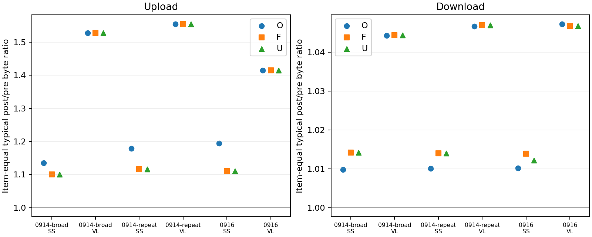

# 唯一 TCP 字节与协议规范化：阶段性测量报告

本次完成协议证据审计和可独立实施的区间字节测量。停在历史协议配置确认门；尚未执行精确协议校正、TLS 记录恢复、Hy2 全成员联合字节分析或任何分类训练。

## 主要发现

在共同有效连接集合、主请求 proxy、按条目等权的口径下，0916 SS 上行典型 post/pre 从 O 的约 1.195 降至 U 的约 1.111；下行为约 1.010→1.012。VLESS 上行 O/U 均约 1.415，下行约 1.0472→1.0468。去重并非必然把两侧比值拉近 1：它同时修正 pre 和 post；也不能由去重后的差值直接确定封装种类。

## 1. 覆盖与质量

登记 1,002 次尝试、987 次选定访问。严格 TCP 配对 6,596 条，方向侧台账 26,384 行；可用唯一观测字节 26,358 行，Q0 26 行。数据提取错误 0。

| 批次 | 协议 | 选定访问 | 访问有严格TCP配对 | 配对数 |
| --- | --- | --- | --- | --- |
| 0914-broad | HYSTERIA2 | 64 | 0 | 0 |
| 0914-broad | SHADOWSOCKS | 64 | 42 | 695 |
| 0914-broad | VLESS | 64 | 44 | 904 |
| 0914-repeat | HYSTERIA2 | 90 | 0 | 0 |
| 0914-repeat | SHADOWSOCKS | 90 | 70 | 843 |
| 0914-repeat | VLESS | 90 | 79 | 895 |
| 0916 | HYSTERIA2 | 175 | 0 | 0 |
| 0916 | SHADOWSOCKS | 175 | 150 | 1771 |
| 0916 | VLESS | 175 | 157 | 1488 |

Hy2 的 0 表示不适用严格 TCP→TCP 对照，并非没有流量。DIRECT 与辅助代理上下文没有被改成主要代理业务。

## 2. 完整性与异常

| 批次 | 协议 | 侧 | 方向侧记录 | 唯一字节可用 | 闭合连续候选 | 序号/epoch歧义 | 冲突方向记录 |
| --- | --- | --- | --- | --- | --- | --- | --- |
| 0914-broad | SHADOWSOCKS | post | 1390 | 1390 | 1375 | 0 | 0 |
| 0914-broad | SHADOWSOCKS | pre | 1390 | 1389 | 1366 | 0 | 1 |
| 0914-broad | VLESS | post | 1808 | 1804 | 1760 | 4 | 0 |
| 0914-broad | VLESS | pre | 1808 | 1807 | 928 | 0 | 1 |
| 0914-repeat | SHADOWSOCKS | post | 1686 | 1686 | 1645 | 0 | 0 |
| 0914-repeat | SHADOWSOCKS | pre | 1686 | 1686 | 1644 | 0 | 0 |
| 0914-repeat | VLESS | post | 1790 | 1778 | 1752 | 12 | 0 |
| 0914-repeat | VLESS | pre | 1790 | 1790 | 946 | 0 | 0 |
| 0916 | SHADOWSOCKS | post | 3542 | 3542 | 3423 | 0 | 0 |
| 0916 | SHADOWSOCKS | pre | 3542 | 3542 | 3422 | 0 | 0 |
| 0916 | VLESS | post | 2976 | 2970 | 2935 | 6 | 0 |
| 0916 | VLESS | pre | 2976 | 2974 | 1400 | 2 | 0 |

所有可用量仍是 Q1：观测到的唯一序号位置，而非成功交付字节。闭合连续候选由 SYN/FIN、内部缺口、RST 和内容冲突检查决定，没有独立成功转发验证，故不升级 Q2。冲突只比较内存字节并保存计数，不保存载荷内容，不据此诊断攻击或归因协议。

## 3. 重复字节量

下面是方向侧记录的字节加权诊断，不是内容等权业务结果。O=观测字节，F=删除完全重传包，U=精确序号区间并集。F−U 表示仅删除完全重传后残留的重叠字节。

| 批次 | 协议 | 侧 | 方向 | 观测字节 | 唯一字节 | 重复比例(字节加权) | F−U |
| --- | --- | --- | --- | --- | --- | --- | --- |
| 0914-broad | SHADOWSOCKS | post | -1 | 180366409 | 180212078 | 0.000855653 | 34838 |
| 0914-broad | SHADOWSOCKS | post | 1 | 5440197 | 5241885 | 0.0364531 | 0 |
| 0914-broad | SHADOWSOCKS | pre | -1 | 164903260 | 164299400 | 0.0036619 | 0 |
| 0914-broad | SHADOWSOCKS | pre | 1 | 4908107 | 4908107 | 0 | 0 |
| 0914-broad | VLESS | post | -1 | 160548085 | 160544118 | 2.47091e-05 | 0 |
| 0914-broad | VLESS | post | 1 | 6444462 | 6443756 | 0.000109551 | 0 |
| 0914-broad | VLESS | pre | -1 | 139901373 | 139504377 | 0.00283768 | 0 |
| 0914-broad | VLESS | pre | 1 | 4666053 | 4659054 | 0.00149998 | 0 |
| 0914-repeat | SHADOWSOCKS | post | -1 | 169705867 | 169223779 | 0.00284073 | 102190 |
| 0914-repeat | SHADOWSOCKS | post | 1 | 5528976 | 5258832 | 0.0488597 | 0 |
| 0914-repeat | SHADOWSOCKS | pre | -1 | 168163031 | 167132514 | 0.00612808 | 0 |
| 0914-repeat | SHADOWSOCKS | pre | 1 | 4792242 | 4792242 | 0 | 0 |
| 0914-repeat | VLESS | post | -1 | 142209958 | 142206938 | 2.12362e-05 | 0 |
| 0914-repeat | VLESS | post | 1 | 6104414 | 6103768 | 0.000105825 | 0 |
| 0914-repeat | VLESS | pre | -1 | 137216866 | 136558501 | 0.00479799 | 0 |
| 0914-repeat | VLESS | pre | 1 | 4331975 | 4331833 | 3.27795e-05 | 0 |
| 0916 | SHADOWSOCKS | post | -1 | 541737903 | 538714092 | 0.00558169 | 605315 |
| 0916 | SHADOWSOCKS | post | 1 | 17306211 | 15815081 | 0.0861616 | 0 |
| 0916 | SHADOWSOCKS | pre | -1 | 535686201 | 533698778 | 0.00371005 | 0 |
| 0916 | SHADOWSOCKS | pre | 1 | 14470622 | 14470622 | 0 | 0 |
| 0916 | VLESS | post | -1 | 287441438 | 287431885 | 3.32346e-05 | 0 |
| 0916 | VLESS | post | 1 | 10742833 | 10742833 | 0 | 0 |
| 0916 | VLESS | pre | -1 | 279016932 | 278476217 | 0.00193793 | 0 |
| 0916 | VLESS | pre | 1 | 7982197 | 7982197 | 0 | 0 |

重复字节可能来自网络重传或捕获重复；仅凭区间重叠不能区分来源。观察到重叠载荷冲突或 epoch 歧义的方向不输出精确 U。

## 4. 同一集合上的 O / F / U 对照

只使用主请求 proxy、两侧唯一字节均有效的共同连接方向集合；先在每访问内累加，再对每条目重复取中位 log-ratio，最后按条目等权取中位。+1=上行，−1=下行。不能将这些方向结果与旧双向总字节混为一谈。

| 批次 | 协议 | 方向 | 视角 | 条目数 | 访问数 | 典型post/pre倍率 |
| --- | --- | --- | --- | --- | --- | --- |
| 0914-broad | SHADOWSOCKS | -1 | F | 39 | 39 | 1.0142 |
| 0914-broad | SHADOWSOCKS | -1 | O | 39 | 39 | 1.00981 |
| 0914-broad | SHADOWSOCKS | -1 | U | 39 | 39 | 1.0142 |
| 0914-broad | SHADOWSOCKS | 1 | F | 39 | 39 | 1.10012 |
| 0914-broad | SHADOWSOCKS | 1 | O | 39 | 39 | 1.13447 |
| 0914-broad | SHADOWSOCKS | 1 | U | 39 | 39 | 1.10012 |
| 0914-broad | VLESS | -1 | F | 41 | 41 | 1.04439 |
| 0914-broad | VLESS | -1 | O | 41 | 41 | 1.0443 |
| 0914-broad | VLESS | -1 | U | 41 | 41 | 1.04439 |
| 0914-broad | VLESS | 1 | F | 41 | 41 | 1.52776 |
| 0914-broad | VLESS | 1 | O | 41 | 41 | 1.52776 |
| 0914-broad | VLESS | 1 | U | 41 | 41 | 1.52776 |
| 0914-repeat | SHADOWSOCKS | -1 | F | 13 | 65 | 1.01394 |
| 0914-repeat | SHADOWSOCKS | -1 | O | 13 | 65 | 1.01003 |
| 0914-repeat | SHADOWSOCKS | -1 | U | 13 | 65 | 1.01394 |
| 0914-repeat | SHADOWSOCKS | 1 | F | 13 | 65 | 1.11583 |
| 0914-repeat | SHADOWSOCKS | 1 | O | 13 | 65 | 1.17827 |
| 0914-repeat | SHADOWSOCKS | 1 | U | 13 | 65 | 1.11583 |
| 0914-repeat | VLESS | -1 | F | 14 | 70 | 1.04695 |
| 0914-repeat | VLESS | -1 | O | 14 | 70 | 1.04663 |
| 0914-repeat | VLESS | -1 | U | 14 | 70 | 1.04695 |
| 0914-repeat | VLESS | 1 | F | 14 | 70 | 1.5549 |
| 0914-repeat | VLESS | 1 | O | 14 | 70 | 1.5549 |
| 0914-repeat | VLESS | 1 | U | 14 | 70 | 1.5549 |
| 0916 | SHADOWSOCKS | -1 | F | 30 | 150 | 1.01388 |
| 0916 | SHADOWSOCKS | -1 | O | 30 | 150 | 1.01013 |
| 0916 | SHADOWSOCKS | -1 | U | 30 | 150 | 1.0122 |
| 0916 | SHADOWSOCKS | 1 | F | 30 | 150 | 1.11054 |
| 0916 | SHADOWSOCKS | 1 | O | 30 | 150 | 1.19466 |
| 0916 | SHADOWSOCKS | 1 | U | 30 | 150 | 1.11054 |
| 0916 | VLESS | -1 | F | 30 | 150 | 1.04675 |
| 0916 | VLESS | -1 | O | 30 | 150 | 1.04722 |
| 0916 | VLESS | -1 | U | 30 | 150 | 1.04675 |
| 0916 | VLESS | 1 | F | 30 | 150 | 1.41451 |
| 0916 | VLESS | 1 | O | 30 | 150 | 1.41451 |
| 0916 | VLESS | 1 | U | 30 | 150 | 1.41451 |

O→U 的变化只能解释重复观测的贡献；余下差值可能含封装、控制、截断与未转发部分。由于协议栈仍未知，本轮没有 U→K 结果，不把 U 后残差直接叫作认证或填充开销。

## 5. 固定多尺度方向段

从首次观测新字节事件合并同方向段，阈值固定 0/64/256/1024 bytes。各阈值独立从原段表出发，单次同时删除小段，再合并相邻同方向段。以下是连接级描述，连接数不是独立访问数；高阈值可能删除大部分控制交互，差值更小不自动表示更好。

| 批次 | 协议 | 阈值 | 配对数 | |段数差|中位 | pre保留中位 | post保留中位 | pre零/单段率 | post零/单段率 |
| --- | --- | --- | --- | --- | --- | --- | --- | --- |
| 0914-broad | SHADOWSOCKS | 0 | 669 | 0 | 1 | 1 | 0.00149477 | 0.00149477 |
| 0914-broad | SHADOWSOCKS | 64 | 669 | 2 | 0.999159 | 1 | 0.00149477 | 0.00149477 |
| 0914-broad | SHADOWSOCKS | 256 | 669 | 0 | 0.997605 | 0.996625 | 0.00149477 | 0.00149477 |
| 0914-broad | SHADOWSOCKS | 1024 | 669 | 0 | 0.956254 | 0.963911 | 0.00298954 | 0.00149477 |
| 0914-broad | VLESS | 0 | 873 | 2 | 1 | 1 | 0 | 0 |
| 0914-broad | VLESS | 64 | 873 | 2 | 0.998124 | 0.998538 | 0 | 0 |
| 0914-broad | VLESS | 256 | 873 | 2 | 0.996315 | 0.99819 | 0 | 0 |
| 0914-broad | VLESS | 1024 | 873 | 3 | 0.9357 | 0.960731 | 0.0091638 | 0 |
| 0914-repeat | SHADOWSOCKS | 0 | 757 | 0 | 1 | 1 | 0.001321 | 0.001321 |
| 0914-repeat | SHADOWSOCKS | 64 | 757 | 2 | 0.999101 | 1 | 0.001321 | 0.001321 |
| 0914-repeat | SHADOWSOCKS | 256 | 757 | 0 | 0.99754 | 0.996531 | 0.001321 | 0.001321 |
| 0914-repeat | SHADOWSOCKS | 1024 | 757 | 0 | 0.968355 | 0.971145 | 0.00660502 | 0.00660502 |
| 0914-repeat | VLESS | 0 | 770 | 2 | 1 | 1 | 0 | 0 |
| 0914-repeat | VLESS | 64 | 770 | 2 | 0.998608 | 0.99853 | 0 | 0 |
| 0914-repeat | VLESS | 256 | 770 | 2 | 0.996876 | 0.998276 | 0 | 0 |
| 0914-repeat | VLESS | 1024 | 770 | 3 | 0.956194 | 0.967087 | 0.0038961 | 0 |
| 0916 | SHADOWSOCKS | 0 | 1771 | 0 | 1 | 1 | 0.0208922 | 0.0208922 |
| 0916 | SHADOWSOCKS | 64 | 1771 | 2 | 0.998768 | 1 | 0.0208922 | 0.0208922 |
| 0916 | SHADOWSOCKS | 256 | 1771 | 0 | 0.996875 | 0.995135 | 0.0208922 | 0.0208922 |
| 0916 | SHADOWSOCKS | 1024 | 1771 | 0 | 0.963542 | 0.977205 | 0.0231508 | 0.0225861 |
| 0916 | VLESS | 0 | 1471 | 2 | 1 | 1 | 0.00407886 | 0 |
| 0916 | VLESS | 64 | 1471 | 2 | 0.998203 | 0.998266 | 0.00407886 | 0 |
| 0916 | VLESS | 256 | 1471 | 2 | 0.996218 | 0.997578 | 0.00407886 | 0 |
| 0916 | VLESS | 1024 | 1471 | 2 | 0.958679 | 0.971077 | 0.00611829 | 0 |

原 FR 定义未改写；新段是首次观测唯一字节上的交互，仍受时间顺序、调度与缓冲影响，不是协议不变量。未根据标签或 pre/post 相似度选择阈值。

## 6. 复核与下一步

方向 observed=unique+duplicate、事件累计、独立区间并集、累计曲线端点、配对网格和输入冻结校验通过。与旧统计报告的 1,084 个侧总载荷逐项相等。新增事件 1,646,161 行；旧 240 主队列成员只做覆盖登记，没有改动或训练。

源代码、配置、输入及输出摘要记录在 provenance.json。协议证据详情见 [栈审计](stack-and-observability-audit.md)，本轮暂停点见 [阶段门](measurement-gate.md)。

相关测试记录：{"tests": 29, "failures": 0, "errors": 0, "skipped": 0, "status": "passed", "source_sha256": "1e9c8b75680c60b4aa9376cd4aa8df24177d04f30ba74765bb6d06b17c7e6d5a"}
