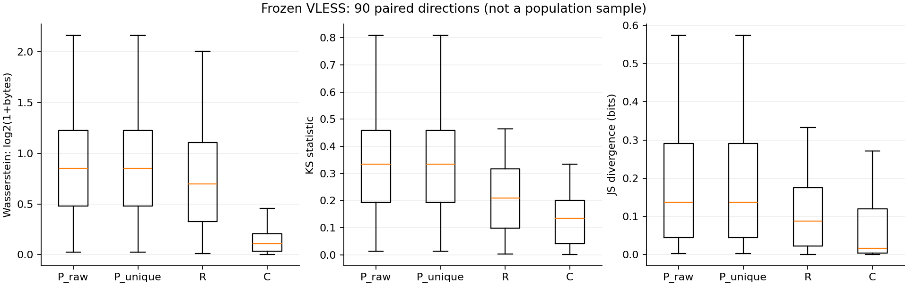
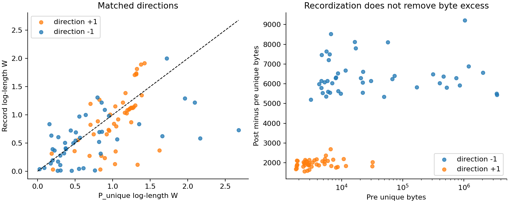
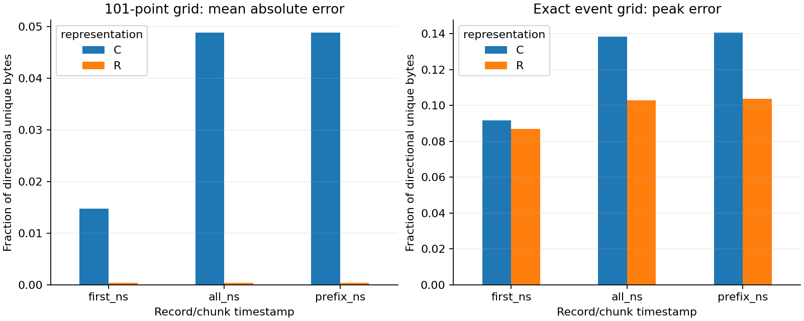

# 记录级 flow 表示：冻结样本方法可行性报告

日期：2026-09-26。范围：R0–R9。已执行；没有新增分类/回归训练，没有生成 initial/relay 或精确 K。

## 1. 核心结论

1. **同字节流的静态记录结构通过重分段测试。** 1440 个正向方向流场景全部通过，720 个负向场景全部拒绝完整性；这是解析实现性质，不是代理前后记录不变性的证据。
2. **在当前定点 VLESS 样本，记录级长度描述整体更接近，但并非每条连接都改善。** 90 个配对方向中，R 的 log-length Wasserstein 在 53 个方向低于 P_unique；中位距离由 0.848556 降至 0.698281。这里是两个距离分布的中位数，不是配对差值中位数；后者见下表。
3. **固定分块说明距离不能单独判优。** C 的同一距离中位数为 0.106821，比 R 更小；但 C 丢失语法结构，且其时间聚合损失需要一起看。
4. **记录化保留全部唯一字节，不会消除部署附加量。** R/C/P_unique 的方向总字节逐项相等；本样本 post/pre 字节比中位数仍为 1.577907。头部也被计入，不冒充业务有效载荷。
5. **不能宣布交互或业务语义完整保留。** 记录时刻约定、跨方向 tie、记录内部反向事件都可能改变方向序列；101 点均值可能很小而短时峰值不小。本轮额外报告全事件时刻的精确峰值作为数值核查，不用于选择表示。

## 2. 样本、冻结与资格

57 对/114 个捕获原样保留，其中 VLESS 45 对、SS 12 对。涉及 48 个父访问、32 个既有内容组。VLESS 主比较为 90 个配对方向、180 条方向侧流；SS 为 48 条方向侧流基础参照。Hy2 不在冻结样本内。下表单位为连接对，不是捕获文件。

| batch | protocol | pairs |
| --- | --- | --- |
| 0914-broad | SHADOWSOCKS | 4 |
| 0914-broad | VLESS | 15 |
| 0914-repeat | SHADOWSOCKS | 4 |
| 0914-repeat | VLESS | 13 |
| 0916 | SHADOWSOCKS | 4 |
| 0916 | VLESS | 17 |

这是旧抽样层定点样本，不估计全数据集发生率。discovery/verification 都已经看过，仅保留历史标记，不叫新盲测。12 对 SS 不套 TLS 解析；未知 cipher 的边界不变。

180 条 VLESS 方向侧流全部通过：连续索引、连续无重叠字节区间、5-byte 头计账、完整 U 覆盖、旧 first/all 时间重算一致，以及按序前缀时间与来源区间核验。失败或替换成员均为 0。语法 E1 不意味着认证成功、同一封装层或 E2 阶段定位。

## 3. 表示和固定方法

|表示|单位|重传处理|边界|
|---|---|---|---|
|P_raw|非空 TCP 载荷包|保留重复载荷|只用方向、TCP 载荷长度与时间|
|P_unique|每包首次贡献字节|去掉零新字节，部分重叠只计新字节|主要包级参照|
|U|方向唯一字节与零阈值方向段|去重|沿用旧口径，无阈值搜索|
|R|严格连续可见记录，总长含头|按重组字节计账|语法而非业务阶段|
|C|方向内固定 1024-byte 块，末块可短|按重组字节计账|非协议粗化对照，无块大小搜索|

| protocol | side | representation | direction_sides | units | bytes |
| --- | --- | --- | --- | --- | --- |
| SHADOWSOCKS | post | P_raw | 24 | 9801 | 19570961 |
| SHADOWSOCKS | post | P_unique | 24 | 9791 | 19567694 |
| SHADOWSOCKS | pre | P_raw | 24 | 5780 | 19472691 |
| SHADOWSOCKS | pre | P_unique | 24 | 5751 | 19409735 |
| VLESS | post | C | 90 | 15440 | 15765790 |
| VLESS | post | P_raw | 90 | 11024 | 15765790 |
| VLESS | post | P_unique | 90 | 11024 | 15765790 |
| VLESS | post | R | 90 | 6883 | 15765790 |
| VLESS | pre | C | 90 | 15072 | 15389609 |
| VLESS | pre | P_raw | 90 | 8212 | 15442786 |
| VLESS | pre | P_unique | 90 | 8193 | 15389609 |
| VLESS | pre | R | 90 | 6534 | 15389609 |

长度距离：W(log2(1+length))、原始 bytes W、KS statistic、固定箱 JS divergence（base 2，非平方根）。箱边界为 0/64/128/256/512/1024/2048/4096/8192/16384/32768/∞，在结果计算前配置冻结。没有逐条记录配对、DTW、最相似前缀或距离总分。

时间：first=首次看到任一字节，all=全部记录字节已出现，prefix=从方向起点到记录末尾连续可用。prefix 不是应用读取时间。原始 ns 相对捕获首包，另存各侧首个新字节归零时间；两侧归零不是同一真实事件，不能据此估计代理延迟。方向内 IAT 按字节序计算，零值和负值保留。

## 4. 受控重分段：只证明实现性质

| scenario | streams | passed | max_synthetic_span_ns | max_synthetic_prefix_wait_ns |
| --- | --- | --- | --- | --- |
| duplicate_overlap_reorder | 180 | 180 | 13000 | 1000 |
| fixed_1460 | 180 | 180 | 12000 | 0 |
| fixed_256 | 180 | 180 | 65000 | 0 |
| fixed_4096 | 180 | 180 | 5000 | 0 |
| header_cross | 180 | 180 | 11000 | 0 |
| inherited_time_refinement | 180 | 180 | — | — |
| irregular | 180 | 180 | 15000 | 0 |
| multi_record | 180 | 180 | 0 | 0 |

每个 VLESS 方向流：固定 256/1460/4096、固定种子不等长切分、记录头跨段、一段多记录、重复/部分重叠/邻近乱序，以及继承原来源时间的细分。静态签名逐项比较 record_index/start/end/content_type/version/body_length，字节内容不改、U 不改。加速来源映射与旧冻结重组器在所有实际流上交叉核验，随机重叠也有单元测试。

继承时间场景只细分原所有权区间，三个时间全部一致；其他场景使用明确的 1000 ns 人工到达步长，能改变 span/prefix wait。这不是网络性能模拟。缺字节、冲突、缺 SYN 起点、末记录缺字节均不得完整通过，未补零或重新同步。

## 5. 同连接跨侧距离

### 5.1 配对方向分布中位数（每种表示 n=90）

| representation | w_log2 | w_bytes | ks | js_bits | count_ratio | byte_ratio |
| --- | --- | --- | --- | --- | --- | --- |
| P_raw | 0.848556 | 295.131 | 0.333333 | 0.136998 | 1.35553 | 1.57791 |
| P_unique | 0.848556 | 295.131 | 0.333333 | 0.136998 | 1.36425 | 1.57791 |
| R | 0.698281 | 225.25 | 0.209416 | 0.0874612 | 1.36607 | 1.57791 |
| C | 0.106821 | 51.5083 | 0.133929 | 0.0166354 | 1.5 | 1.57791 |

### 5.2 同方向相对 P_unique 的变化

负差表示相应描述距离下降；不作独立记录显著性检验。

| representation | directions | W_log_lower | W_log_equal | W_log_higher | median_W_log_change | median_KS_change | median_JS_change |
| --- | --- | --- | --- | --- | --- | --- | --- |
| C | 90 | 88 | 0 | 2 | -0.76103 | -0.168336 | -0.0589338 |
| P_raw | 90 | 4 | 82 | 4 | 0 | 0 | 0 |
| R | 90 | 53 | 0 | 37 | -0.103356 | -0.0928379 | -0.0327173 |

### 5.3 先在连接内平均两个方向，再取 45 对连接中位数

| representation | w_log2 | ks | js_bits |
| --- | --- | --- | --- |
| P_raw | 0.807748 | 0.317079 | 0.14938 |
| P_unique | 0.807748 | 0.317079 | 0.148805 |
| R | 0.759764 | 0.214077 | 0.102197 |
| C | 0.117795 | 0.133333 | 0.0579041 |





### 5.4 批次和方向（+1 为既有入口方向定义，−1 为反向）

| batch | direction | representation | w_log2 | ks | js_bits |
| --- | --- | --- | --- | --- | --- |
| 0914-broad | -1 | C | 0.101642 | 0.125 | 0.0113952 |
| 0914-broad | -1 | P_raw | 0.545036 | 0.277512 | 0.0627263 |
| 0914-broad | -1 | P_unique | 0.551443 | 0.277512 | 0.0627263 |
| 0914-broad | -1 | R | 0.608023 | 0.144762 | 0.0805049 |
| 0914-broad | 1 | C | 0.122305 | 0.166667 | 0.0165288 |
| 0914-broad | 1 | P_raw | 0.965226 | 0.443182 | 0.108373 |
| 0914-broad | 1 | P_unique | 0.965226 | 0.443182 | 0.108373 |
| 0914-broad | 1 | R | 0.80007 | 0.214286 | 0.0338601 |
| 0914-repeat | -1 | C | 0.0437815 | 0.04 | 0.0412591 |
| 0914-repeat | -1 | P_raw | 0.377849 | 0.182692 | 0.0780592 |
| 0914-repeat | -1 | P_unique | 0.377849 | 0.182692 | 0.0780592 |
| 0914-repeat | -1 | R | 0.504509 | 0.12987 | 0.104037 |
| 0914-repeat | 1 | C | 0.138334 | 0.2 | 0.0165288 |
| 0914-repeat | 1 | P_raw | 1.22693 | 0.458333 | 0.251924 |
| 0914-repeat | 1 | P_unique | 1.22693 | 0.458333 | 0.251924 |
| 0914-repeat | 1 | R | 1.12511 | 0.333333 | 0.119904 |
| 0916 | -1 | C | 0.0372349 | 0.0666667 | 0.0145205 |
| 0916 | -1 | P_raw | 0.56242 | 0.207692 | 0.131445 |
| 0916 | -1 | P_unique | 0.56242 | 0.207692 | 0.131445 |
| 0916 | -1 | R | 0.545073 | 0.150376 | 0.106385 |
| 0916 | 1 | C | 0.173247 | 0.2 | 0.127192 |
| 0916 | 1 | P_raw | 1.03123 | 0.380952 | 0.161606 |
| 0916 | 1 | P_unique | 1.03123 | 0.380952 | 0.161606 |
| 0916 | 1 | R | 1.0856 | 0.328571 | 0.0824694 |

### 5.5 访问/内容等权敏感性

先平均同连接方向，再在父访问内平均连接；内容等权再在同批次同内容内平均访问。表中 mean 是各等权单位的距离均值，不是上文中位数。少量定点内容不能支持跨内容泛化结论。

| unit | batch | representation | units | mean_W_log | mean_KS | mean_JS |
| --- | --- | --- | --- | --- | --- | --- |
| visit | 0914-broad | C | 10 | 0.120859 | 0.124953 | 0.0351042 |
| visit | 0914-broad | P_raw | 10 | 0.817444 | 0.339243 | 0.164779 |
| visit | 0914-broad | P_unique | 10 | 0.817486 | 0.339346 | 0.164776 |
| visit | 0914-broad | R | 10 | 0.57779 | 0.158031 | 0.0723727 |
| visit | 0914-repeat | C | 12 | 0.139386 | 0.151643 | 0.0629769 |
| visit | 0914-repeat | P_raw | 12 | 0.942726 | 0.359029 | 0.220357 |
| visit | 0914-repeat | P_unique | 12 | 0.942383 | 0.359034 | 0.220312 |
| visit | 0914-repeat | R | 12 | 0.751489 | 0.237126 | 0.115529 |
| visit | 0916 | C | 14 | 0.16528 | 0.126796 | 0.094574 |
| visit | 0916 | P_raw | 14 | 0.887772 | 0.317926 | 0.156507 |
| visit | 0916 | P_unique | 14 | 0.887835 | 0.317947 | 0.156527 |
| visit | 0916 | R | 14 | 0.76201 | 0.211047 | 0.118115 |
| content | 0914-broad | C | 10 | 0.120859 | 0.124953 | 0.0351042 |
| content | 0914-broad | P_raw | 10 | 0.817444 | 0.339243 | 0.164779 |
| content | 0914-broad | P_unique | 10 | 0.817486 | 0.339346 | 0.164776 |
| content | 0914-broad | R | 10 | 0.57779 | 0.158031 | 0.0723727 |
| content | 0914-repeat | C | 6 | 0.16332 | 0.152054 | 0.0701931 |
| content | 0914-repeat | P_raw | 6 | 0.937493 | 0.36239 | 0.23713 |
| content | 0914-repeat | P_unique | 6 | 0.937236 | 0.362414 | 0.237103 |
| content | 0914-repeat | R | 6 | 0.777772 | 0.2329 | 0.124419 |
| content | 0916 | C | 12 | 0.177194 | 0.128854 | 0.0992145 |
| content | 0916 | P_raw | 12 | 0.90646 | 0.326965 | 0.159106 |
| content | 0916 | P_unique | 12 | 0.906534 | 0.326989 | 0.159129 |
| content | 0916 | R | 12 | 0.7686 | 0.212988 | 0.122434 |

### 5.6 历史抽样层

| partition | mechanism_group | representation | directions | median_W_log | median_KS |
| --- | --- | --- | --- | --- | --- |
| discovery | other_nonzero | C | 14 | 0.173896 | 0.154762 |
| discovery | other_nonzero | P_raw | 14 | 1.16842 | 0.383333 |
| discovery | other_nonzero | P_unique | 14 | 1.16842 | 0.383333 |
| discovery | other_nonzero | R | 14 | 1.01565 | 0.25 |
| discovery | plus2 | C | 18 | 0.0936708 | 0.133929 |
| discovery | plus2 | P_raw | 18 | 0.86469 | 0.333333 |
| discovery | plus2 | P_unique | 18 | 0.86469 | 0.333333 |
| discovery | plus2 | R | 18 | 0.676036 | 0.214037 |
| discovery | zero | C | 8 | 0.0465337 | 0.0717949 |
| discovery | zero | P_raw | 8 | 0.468262 | 0.187179 |
| discovery | zero | P_unique | 8 | 0.468262 | 0.187179 |
| discovery | zero | R | 8 | 0.321766 | 0.0927736 |
| verification | other_nonzero | C | 18 | 0.121854 | 0.154762 |
| verification | other_nonzero | P_raw | 18 | 1.00545 | 0.392308 |
| verification | other_nonzero | P_unique | 18 | 1.00545 | 0.392308 |
| verification | other_nonzero | R | 18 | 0.811397 | 0.306521 |
| verification | plus2 | C | 18 | 0.143749 | 0.154762 |
| verification | plus2 | P_raw | 18 | 0.758837 | 0.263756 |
| verification | plus2 | P_unique | 18 | 0.758837 | 0.263756 |
| verification | plus2 | R | 18 | 0.759388 | 0.172834 |
| verification | zero | C | 14 | 0.0817461 | 0.107955 |
| verification | zero | P_raw | 14 | 0.521844 | 0.224276 |
| verification | zero | P_unique | 14 | 0.521844 | 0.224276 |
| verification | zero | R | 14 | 0.549902 | 0.137316 |

更细的 batch×partition×mechanism_group×load_layer 交叉层保存在 stratified-metrics.parquet，空层不补零。完整逐连接结果见附录与机器表。

## 6. 字节形状、记录类型与时间聚合

### 6.1 跨侧累计形状

下表为配对方向中位数。count_axis 是各方向单位索引归一化；common_window 是两侧各自首新字节归零后的共同截取秒窗（至较短观察终点）；normalized_duration 各自除以持续时间。后者主动消除持续时间差，不是时间保真。所有曲线各用本方向总字节归一化，不能替代绝对工作量分析。

| representation | count_axis_shape_mae | first_ns_common_window_shape_mae | all_ns_common_window_shape_mae | prefix_ns_common_window_shape_mae | first_ns_normalized_duration_shape_mae | all_ns_normalized_duration_shape_mae | prefix_ns_normalized_duration_shape_mae |
| --- | --- | --- | --- | --- | --- | --- | --- |
| P_raw | 0.0966967 | 0.134093 | 0.134093 | 0.134093 | 0.123218 | 0.123218 | 0.123218 |
| P_unique | 0.0966967 | 0.134093 | 0.134093 | 0.134093 | 0.123218 | 0.123218 | 0.123218 |
| R | 0.119835 | 0.134093 | 0.134093 | 0.134093 | 0.123218 | 0.123218 | 0.123218 |
| C | 0.0481846 | 0.197575 | 0.157999 | 0.157999 | 0.17282 | 0.145516 | 0.145516 |

### 6.2 同侧相对新字节到达曲线的误差

n=180/表示/时间约定。grid_MAE 和 grid_peak 使用预定 101 点；exact_peak 在所有相关事件时刻的并集求最大值，防止短跨度被网格漏掉。表中 mean 对方向侧流等权，largest 是最大单流峰值；数值为方向唯一字节比例。

| representation | time | n | mean_grid_MAE | mean_grid_peak | mean_exact_peak | largest_exact_peak |
| --- | --- | --- | --- | --- | --- | --- |
| C | all_ns | 180 | 0.0488377 | 0.111982 | 0.138348 | 0.42616 |
| C | first_ns | 180 | 0.0147926 | 0.0647282 | 0.0916488 | 0.2832 |
| C | prefix_ns | 180 | 0.0488377 | 0.111982 | 0.140518 | 0.42616 |
| R | all_ns | 180 | 0.000342191 | 0.0166553 | 0.102911 | 0.719401 |
| R | first_ns | 180 | 0.000359959 | 0.0157979 | 0.0867886 | 0.658895 |
| R | prefix_ns | 180 | 0.000342191 | 0.0166553 | 0.103671 | 0.719401 |



first 整条计账可提前释放字节，all/prefix 可延后。即使 101 点均值低，也不能声称完整保留字节到达过程。精确事件峰值是补充数值验算，不是新增调参指标。

### 6.3 记录/分块跨度内反向事件

| representation | units | median_span_ms | q95_span_ms | max_span_ms | opposite_event_inside_fraction | prefix_wait_positive_units |
| --- | --- | --- | --- | --- | --- | --- |
| C | 30512 | 0 | 10.441 | 65006.5 | 0.0380834 | 618 |
| R | 13417 | 0 | 8.44591 | 129.63 | 0.00886934 | 83 |

仅计 first < opposite_time < all 的事件，端点 tie 不擅自排先后。同一反向事件可能落入多个单位跨度，不能把累加值当独立流量。逐单位原始量保存于 unit-span-interactions.parquet。

### 6.4 跨方向 tie 与切换敏感性

每个时间约定有 90 个 VLESS 连接侧。两种方向优先次序是预定敏感性场景，不宣称所有合法排列的严格上下界。相同切换数也不能证明唯一因果次序。

| representation | time | mean_mixed_tie_fraction | order_sensitive_sides | max_priority_difference |
| --- | --- | --- | --- | --- |
| C | all_ns | 0 | 0 | 0 |
| C | first_ns | 0 | 0 | 0 |
| C | prefix_ns | 0 | 0 | 0 |
| P_raw | all_ns | 0 | 0 | 0 |
| P_raw | first_ns | 0 | 0 | 0 |
| P_raw | prefix_ns | 0 | 0 | 0 |
| P_unique | all_ns | 0 | 0 | 0 |
| P_unique | first_ns | 0 | 0 | 0 |
| P_unique | prefix_ns | 0 | 0 | 0 |
| R | all_ns | 0 | 0 | 0 |
| R | first_ns | 0 | 0 | 0 |
| R | prefix_ns | 0 | 0 | 0 |

### 6.5 类型组成与方向内转移

类型仅作语法标签：20/21/22/23；不映射为真实握手、业务、Vision initial/relay。各方向内按字节位置取转移，分母为该方向记录数−1（单记录时缺失而非零）。下表为 post−pre 比例差；记录序号不跨侧配对。

| kind | from_type | to_type | median | mean |
| --- | --- | --- | --- | --- |
| count | 20 | 20 | -0.025 | -0.0401328 |
| count | 21 | 21 | 0 | -0.000740741 |
| count | 22 | 22 | -0.0277778 | -0.0943984 |
| count | 23 | 23 | 0.0555556 | 0.135272 |
| transition | 20 | 20 | 0 | 0 |
| transition | 20 | 21 | 0 | 0 |
| transition | 20 | 22 | 0 | -0.0207252 |
| transition | 20 | 23 | -0.019152 | -0.0383892 |
| transition | 21 | 20 | 0 | 0 |
| transition | 21 | 21 | 0 | 0 |
| transition | 21 | 22 | 0 | 0 |
| transition | 21 | 23 | 0 | 0 |
| transition | 22 | 20 | -0.030525 | -0.0591144 |
| transition | 22 | 21 | 0 | 0 |
| transition | 22 | 22 | 0 | -0.042209 |
| transition | 22 | 23 | 0 | -0.0154342 |
| transition | 23 | 20 | 0 | 0 |
| transition | 23 | 21 | 0 | -0.000793651 |
| transition | 23 | 22 | 0 | 0 |
| transition | 23 | 23 | 0.0674242 | 0.176666 |

## 7. SS 基础参照与旧 M0 旁路

SS 共 12 对，仍只报告唯一 TCP 字节与旧零阈值方向段；没有 SS 记录、没有猜 cipher。方向字节差与比的中位数：

| direction | difference | ratio |
| --- | --- | --- |
| -1 | 729 | 1.0252 |
| 1 | 298 | 1.11332 |

SS 零阈值段差分布：{0: 9, 8: 2, 72: 1}。VLESS 段差分布：{0: 11, 2: 18, 3: 8, 4: 6, 6: 2}。这些是原抽样层选择后的构成，不是总体发生率。

M0 全部复用旧 byte_all 的内容 OOF 中心，没有在这 45 对 VLESS/12 对 SS 中重新拟合。对 114 个配对方向逐项核对旧系数、训练折中位数、内容排除与旧残差；估计器只用 post 字节和已知 batch×deployment×direction 的训练中心。pre 仅用于评分。

| batch | protocol | direction | n | mae | median_abs_error | bias | negative_rate | zero_denominators |
| --- | --- | --- | --- | --- | --- | --- | --- | --- |
| 0914-broad | SHADOWSOCKS | -1 | 4 | 17467.5 | 1088 | 17195.5 | 0 | 0 |
| 0914-broad | SHADOWSOCKS | 1 | 4 | 451.25 | 40 | 411.25 | 0 | 0 |
| 0914-broad | VLESS | -1 | 15 | 770.933 | 484.5 | 515.667 | 0 | 0 |
| 0914-broad | VLESS | 1 | 15 | 101.6 | 83.5 | 44.7333 | 0 | 0 |
| 0914-repeat | SHADOWSOCKS | -1 | 4 | 14339.5 | 986 | 13982.5 | 0 | 0 |
| 0914-repeat | SHADOWSOCKS | 1 | 4 | 3736 | 78.5 | 3688 | 0 | 0 |
| 0914-repeat | VLESS | -1 | 13 | 890.808 | 737 | 135.423 | 0 | 0 |
| 0914-repeat | VLESS | 1 | 13 | 167.269 | 114 | 46.3462 | 0 | 0 |
| 0916 | SHADOWSOCKS | -1 | 4 | 1224 | 459 | 1020 | 0 | 0 |
| 0916 | SHADOWSOCKS | 1 | 4 | 667.75 | 213.5 | 630.25 | 0 | 0 |
| 0916 | VLESS | -1 | 17 | 334.941 | 334 | -87.8235 | 0 | 0 |
| 0916 | VLESS | 1 | 17 | 127.882 | 72 | -31.1765 | 0 | 0 |

全表负估计 0/114，pre=0 分母 0/114；负值不会截断。这里样本中没有负值不等于规则保证非负。每行有相对误差和训练中心。M0 是标量估计，R 是结构表示，未定义共同预测任务，因此不声称 R 胜过 M0。经验字节中心不是精确 K，更不是从 post 头部删除同样长度。

## 8. 权限、预算和可复现性

- post 的记录/分块表示仅接收同侧区间和来源映射；90 条 post 方向流替换无关 pre 后输出不变。114 条 M0 估计替换评分 pre 后也不变。
- 本轮 classifier_fits=0、regression_fits=0；IP/端口/SNI/业务标签没有进入训练（本轮根本无模型）。协议、身份、语法类型保存在审计表，并未自动加入旧模型。
- 输入和旧结果 SHA256 复核一致；旧 240 访问队列未改。独立输出目录保存契约、样本清单、来源、代码哈希、种子、表和测试结果。
- 唯一捕获仍为 114 个，共 76,130,116 bytes；没有扫描其他捕获。capture-read-audit.json 记录**单次 capture 阶段**的读文件遍数（含哈希、分析、VLESS 载荷读取）和处理体积。本次开发执行 capture 两次，第二次增加继承时间细分检查；累计捕获文件处理体积为单次的两倍，唯一输入体积不变。所有载荷只在内存，没有保存或发送。
- 测试 85 项，失败 0，错误 0。Pytorch312；完整入口见下。

```powershell
& 'D:/Tools/Anaconda/envs/Pytorch312/python.exe' eval/protocol_normalization/run_record_representation.py --stage all
```

支持 prepare/capture/metrics/report 分阶段；先运行测试生成 tests.xml 再生成报告。配置冻结后不按结果改 bin、样本、块大小或解析规则。主要输出均为 Parquet，避免巨型逐记录 Markdown。

## 9. 结项判断与边界

本轮支持：**严格重组后的可见记录语法具有对同字节流分段变化的静态稳健性；在这批 VLESS 定点连接上，其部分长度描述较包级更接近，且与任意固定分块具有不同的时间聚合特征。**

本轮不支持：逐记录 pre/post 语义对应、同一封装层认证、initial/relay 切换、精确 K、全数据集普遍改善、业务语义恢复、SSL/分类收益。记录化没有把所有 post 字节恢复成 pre；经验中心也没有解释协议机制。

R0–R9 在此停止。没有自动扩大 PCAP 范围、没有重训编码器、没有恢复阶段切点搜索。若后续研究下游价值，需要单独批准同内容划分、相同 post 编码器和配对对照的任务；这不能由当前距离结果替代。

详细文件目录：outputs/record-representation-0914-0916/run-01。附录：connection-details.md。
