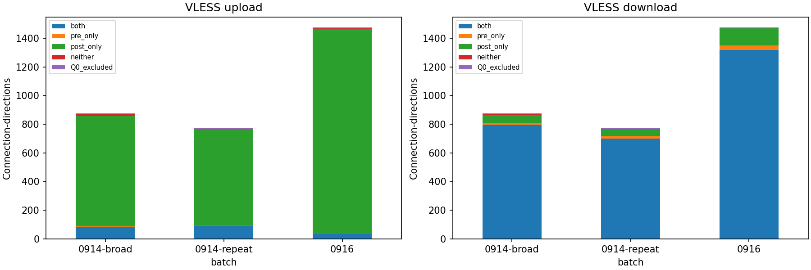
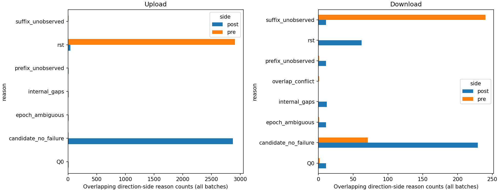
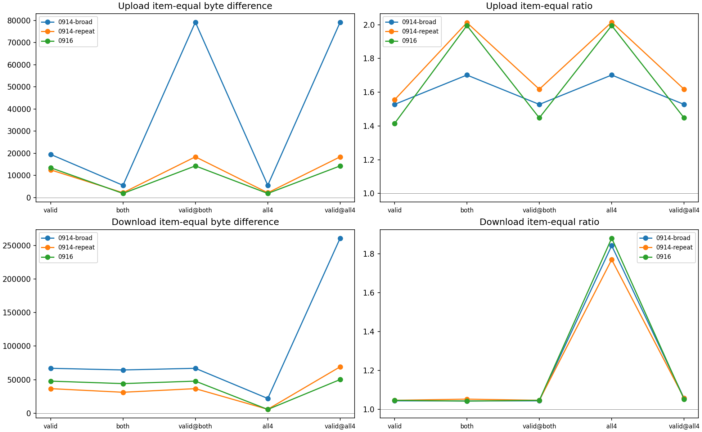
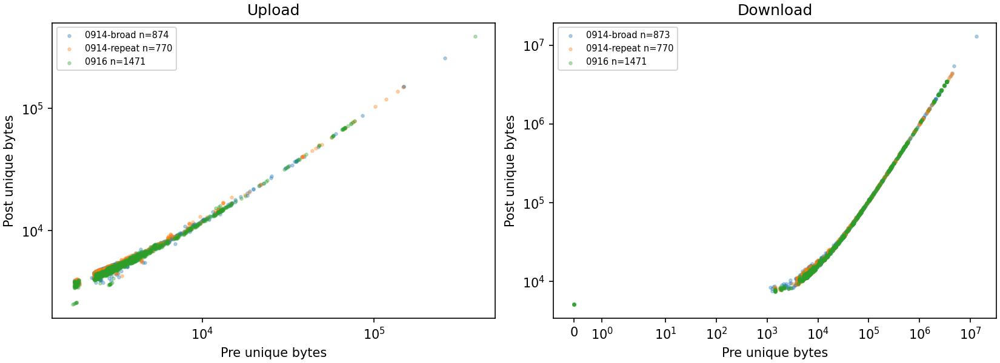
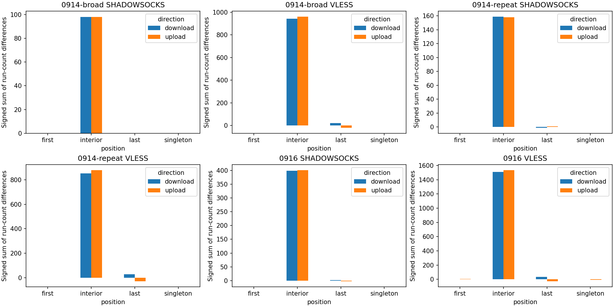
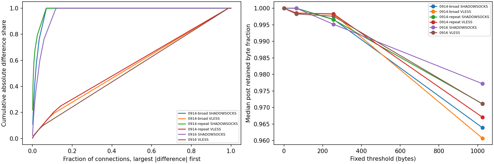
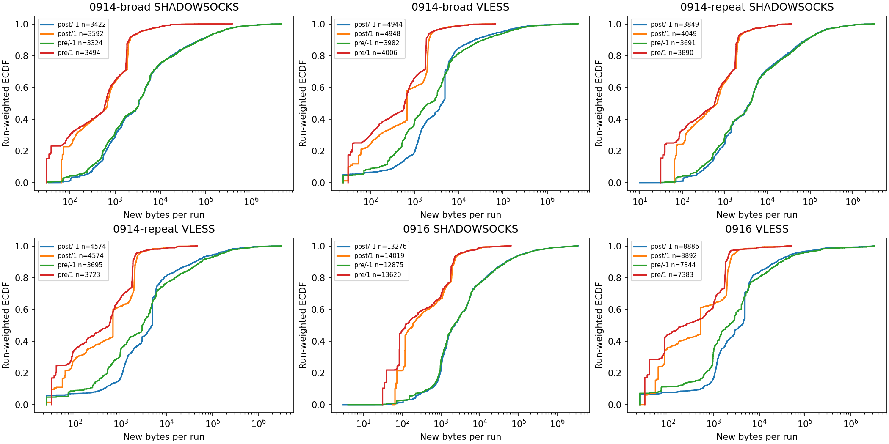
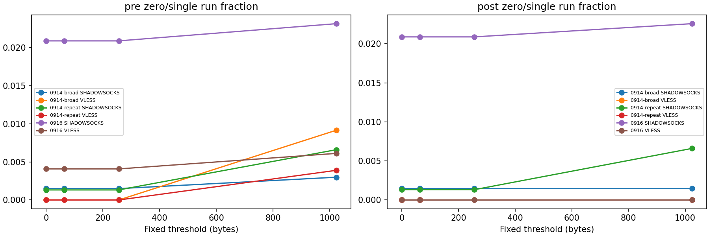

# 协议规范化定点诊断报告

日期：2026-09-23。只使用 0914/0916 既有 run-01 测量表；没有重读 PCAP、训练模型、生成 K 校正、改变阈值或修改旧 240 访问队列。

## 核心结果与判断

1. 配置不确定性已收敛为有来源的部分确认，而非已恢复历史快照。SS cipher 缺口仍在；本轮不产生精确开销 K。
2. VLESS 的候选不对称主要体现为 pre 上行 RST，而不是大量有效方向存在内部字节缺口。0916 上行 1,471 条有效连接方向中，1,433 条（97.42%）仅 post 为候选，且对应 pre 均有 RST；下行 1,318 条（89.60%）为双侧候选。RST 标记的来源/触发机制未定位，不能归因为丢包或转发失败。
3. 0916 上行主集合典型倍率 1.4145、条目等权差值 13,471 bytes；双侧候选倍率反而为 1.9950、差值 1,843.75 bytes。后者仅 34 条连接方向、32 次访问、16 个条目。相同 32 次访问保留全部有效连接时，倍率为 1.4479、差值 14,286 bytes。说明筛选改变了连接构成，不能用子集更完整来代替主要测量。
4. 0916 下行 S_both 覆盖全部 150 次访问，倍率 1.0468→1.0433，差值 47,758→44,072 bytes；S_all4 则只保留 33 条连接、32 次访问，倍率为 1.8812。方向候选与整连接候选不能混用。
5. VLESS 三批次零阈值段数差中位均为 +2，约 98.7% 的连接有非零段差；SS 中位均为 0，非零连接约 7.0%、7.0%、12.1%。0916 SS 前 10% 连接贡献 92.89% 的绝对段差，VLESS 对应为 14.57%，两者在连接间的集中程度不同。
6. 计数差主要落在 interior 类别，但 interior 只表示非首末段，并不证明差异遍布整个时间轴；也可能包含早期交互。VLESS 的 +2 不能解释为已经识别了两个可删除协议段。当前未建立独立阶段证据，本轮不设计固定减段校正。
7. 固定阈值本身能改变比较：SS 三批次段数差中位在 0-byte 阈值为 0、64-byte 为 +2、256-byte 又为 0。故不能把更小段差视为更可靠，也不能重选阈值。

## 1. 证据与权限

三种部署的标签已按采集者 2026-09-23 追溯确认记录。SS 原生、无 plugin/mux、原生 UDP，cipher 未保存；VLESS TCP、TLS/REALITY、Vision、无 mux；Hy2 QUIC/UDP、无 Salamander、共享 carrier、端口范围/跳跃。整体均为部分确认，因为精确历史参数/快照不全。此记录不能当作逐会话配置快照；TLS/REALITY 标签不表示两套开销相加。

唯一 TCP 字节及固定定义方向段可测；精确协议开销仍不可给出。Hy2 不适用于本轮严格 TCP 配对分析，不将缺少结果写成没有流量。没有数值开销上下界，也不把 U 当成功业务交付；Q2 仍为 0。

## 2. 覆盖与 VLESS 候选构成

| batch | protocol | main_route | visits | pairs |
| --- | --- | --- | --- | --- |
| 0914-broad | HYSTERIA2 | direct | 27 | 0 |
| 0914-broad | HYSTERIA2 | proxy | 37 | 0 |
| 0914-broad | SHADOWSOCKS | direct | 25 | 25 |
| 0914-broad | SHADOWSOCKS | proxy | 39 | 670 |
| 0914-broad | VLESS | direct | 23 | 28 |
| 0914-broad | VLESS | proxy | 41 | 876 |
| 0914-repeat | HYSTERIA2 | direct | 30 | 0 |
| 0914-repeat | HYSTERIA2 | proxy | 60 | 0 |
| 0914-repeat | SHADOWSOCKS | direct | 25 | 86 |
| 0914-repeat | SHADOWSOCKS | proxy | 65 | 757 |
| 0914-repeat | VLESS | direct | 20 | 119 |
| 0914-repeat | VLESS | proxy | 70 | 776 |
| 0916 | HYSTERIA2 | direct | 50 | 0 |
| 0916 | HYSTERIA2 | proxy | 125 | 0 |
| 0916 | SHADOWSOCKS | direct | 25 | 0 |
| 0916 | SHADOWSOCKS | proxy | 150 | 1771 |
| 0916 | VLESS | direct | 25 | 13 |
| 0916 | VLESS | proxy | 150 | 1475 |

以下主要统计只使用 main_route=proxy。方向 +1=上行、−1=下行。每个方向的配对表有 pre/post 两行；候选方向数不是完整连接数。四格外单列 Q0。

| batch | direction | stratum | pair_directions | connections | visits | items | fraction_all | fraction_valid |
| --- | --- | --- | --- | --- | --- | --- | --- | --- |
| 0914-broad | -1 | both | 798 | 798 | 41 | 41 | 0.91096 | 0.91409 |
| 0914-broad | -1 | pre_only | 10 | 10 | 7 | 7 | 0.011416 | 0.011455 |
| 0914-broad | -1 | post_only | 57 | 57 | 18 | 18 | 0.065068 | 0.065292 |
| 0914-broad | -1 | neither | 8 | 8 | 6 | 6 | 0.0091324 | 0.0091638 |
| 0914-broad | -1 | Q0_excluded | 3 | 3 | 3 | 3 | 0.0034247 | NA |
| 0914-broad | 1 | both | 80 | 80 | 15 | 15 | 0.091324 | 0.091533 |
| 0914-broad | 1 | pre_only | 6 | 6 | 3 | 3 | 0.0068493 | 0.006865 |
| 0914-broad | 1 | post_only | 770 | 770 | 41 | 41 | 0.879 | 0.88101 |
| 0914-broad | 1 | neither | 18 | 18 | 11 | 11 | 0.020548 | 0.020595 |
| 0914-broad | 1 | Q0_excluded | 2 | 2 | 2 | 2 | 0.0022831 | NA |
| 0914-repeat | -1 | both | 700 | 700 | 70 | 14 | 0.90206 | 0.90909 |
| 0914-repeat | -1 | pre_only | 20 | 20 | 17 | 9 | 0.025773 | 0.025974 |
| 0914-repeat | -1 | post_only | 49 | 49 | 30 | 12 | 0.063144 | 0.063636 |
| 0914-repeat | -1 | neither | 1 | 1 | 1 | 1 | 0.0012887 | 0.0012987 |
| 0914-repeat | -1 | Q0_excluded | 6 | 6 | 4 | 4 | 0.007732 | NA |
| 0914-repeat | 1 | both | 95 | 95 | 29 | 9 | 0.12242 | 0.12338 |
| 0914-repeat | 1 | pre_only | 2 | 2 | 2 | 2 | 0.0025773 | 0.0025974 |
| 0914-repeat | 1 | post_only | 670 | 670 | 70 | 14 | 0.8634 | 0.87013 |
| 0914-repeat | 1 | neither | 3 | 3 | 3 | 2 | 0.003866 | 0.0038961 |
| 0914-repeat | 1 | Q0_excluded | 6 | 6 | 4 | 4 | 0.007732 | NA |
| 0916 | -1 | both | 1318 | 1318 | 150 | 30 | 0.89356 | 0.89599 |
| 0916 | -1 | pre_only | 31 | 31 | 25 | 17 | 0.021017 | 0.021074 |
| 0916 | -1 | post_only | 122 | 122 | 75 | 27 | 0.082712 | 0.082937 |
| 0916 | -1 | neither | 0 | 0 | 0 | 0 | 0 | 0 |
| 0916 | -1 | Q0_excluded | 4 | 4 | 4 | 4 | 0.0027119 | NA |
| 0916 | 1 | both | 34 | 34 | 32 | 16 | 0.023051 | 0.023114 |
| 0916 | 1 | pre_only | 0 | 0 | 0 | 0 | 0 | 0 |
| 0916 | 1 | post_only | 1433 | 1433 | 150 | 30 | 0.97153 | 0.97417 |
| 0916 | 1 | neither | 4 | 4 | 4 | 4 | 0.0027119 | 0.0027192 |
| 0916 | 1 | Q0_excluded | 4 | 4 | 4 | 4 | 0.0027119 | NA |

### 原因组合（互斥）

| batch | direction | side | stratum | reason_combination | rows | gap_bytes |
| --- | --- | --- | --- | --- | --- | --- |
| 0914-broad | -1 | post | Q0_excluded | prefix_unobserved+suffix_unobserved+internal_gaps+epoch_ambiguous+Q0 | 2 | NA |
| 0914-broad | -1 | post | Q0_excluded | suffix_unobserved | 1 | 0 |
| 0914-broad | -1 | post | both | candidate_no_failure | 798 | 0 |
| 0914-broad | -1 | post | neither | rst | 1 | 0 |
| 0914-broad | -1 | post | neither | suffix_unobserved | 6 | 0 |
| 0914-broad | -1 | post | neither | suffix_unobserved+internal_gaps | 1 | 2824 |
| 0914-broad | -1 | post | post_only | candidate_no_failure | 57 | 0 |
| 0914-broad | -1 | post | pre_only | rst | 10 | 0 |
| 0914-broad | -1 | pre | Q0_excluded | candidate_no_failure | 2 | 0 |
| 0914-broad | -1 | pre | Q0_excluded | suffix_unobserved+overlap_conflict+Q0 | 1 | NA |
| 0914-broad | -1 | pre | both | candidate_no_failure | 798 | 0 |
| 0914-broad | -1 | pre | neither | suffix_unobserved | 8 | 0 |
| 0914-broad | -1 | pre | post_only | suffix_unobserved | 57 | 0 |
| 0914-broad | -1 | pre | pre_only | candidate_no_failure | 10 | 0 |
| 0914-broad | 1 | post | Q0_excluded | prefix_unobserved+internal_gaps+rst+epoch_ambiguous+Q0 | 2 | NA |
| 0914-broad | 1 | post | both | candidate_no_failure | 80 | 0 |
| 0914-broad | 1 | post | neither | rst | 17 | 0 |
| 0914-broad | 1 | post | neither | suffix_unobserved+rst | 1 | 0 |
| 0914-broad | 1 | post | post_only | candidate_no_failure | 770 | 0 |
| 0914-broad | 1 | post | pre_only | rst | 6 | 0 |
| 0914-broad | 1 | pre | Q0_excluded | candidate_no_failure | 1 | 0 |
| 0914-broad | 1 | pre | Q0_excluded | rst | 1 | 0 |
| 0914-broad | 1 | pre | both | candidate_no_failure | 80 | 0 |
| 0914-broad | 1 | pre | neither | rst | 13 | 0 |
| 0914-broad | 1 | pre | neither | suffix_unobserved+rst | 5 | 0 |
| 0914-broad | 1 | pre | post_only | rst | 765 | 0 |
| 0914-broad | 1 | pre | post_only | suffix_unobserved+rst | 5 | 0 |
| 0914-broad | 1 | pre | pre_only | candidate_no_failure | 6 | 0 |
| 0914-repeat | -1 | post | Q0_excluded | prefix_unobserved+internal_gaps+epoch_ambiguous+Q0 | 6 | NA |
| 0914-repeat | -1 | post | both | candidate_no_failure | 700 | 0 |
| 0914-repeat | -1 | post | neither | suffix_unobserved | 1 | 0 |
| 0914-repeat | -1 | post | post_only | candidate_no_failure | 49 | 0 |
| 0914-repeat | -1 | post | pre_only | rst | 20 | 0 |
| 0914-repeat | -1 | pre | Q0_excluded | candidate_no_failure | 5 | 0 |
| 0914-repeat | -1 | pre | Q0_excluded | suffix_unobserved | 1 | 0 |
| 0914-repeat | -1 | pre | both | candidate_no_failure | 700 | 0 |
| 0914-repeat | -1 | pre | neither | suffix_unobserved | 1 | 0 |
| 0914-repeat | -1 | pre | post_only | suffix_unobserved | 49 | 0 |
| 0914-repeat | -1 | pre | pre_only | candidate_no_failure | 20 | 0 |
| 0914-repeat | 1 | post | Q0_excluded | prefix_unobserved+internal_gaps+rst+epoch_ambiguous+Q0 | 6 | NA |
| 0914-repeat | 1 | post | both | candidate_no_failure | 95 | 0 |
| 0914-repeat | 1 | post | neither | rst | 3 | 0 |
| 0914-repeat | 1 | post | post_only | candidate_no_failure | 670 | 0 |
| 0914-repeat | 1 | post | pre_only | rst | 2 | 0 |
| 0914-repeat | 1 | pre | Q0_excluded | rst | 6 | 0 |
| 0914-repeat | 1 | pre | both | candidate_no_failure | 95 | 0 |
| 0914-repeat | 1 | pre | neither | rst | 2 | 0 |
| 0914-repeat | 1 | pre | neither | suffix_unobserved+rst | 1 | 0 |
| 0914-repeat | 1 | pre | post_only | rst | 669 | 0 |
| 0914-repeat | 1 | pre | post_only | suffix_unobserved+rst | 1 | 0 |
| 0914-repeat | 1 | pre | pre_only | candidate_no_failure | 2 | 0 |
| 0916 | -1 | post | Q0_excluded | candidate_no_failure | 1 | 0 |
| 0916 | -1 | post | Q0_excluded | prefix_unobserved+internal_gaps+epoch_ambiguous+Q0 | 3 | NA |
| 0916 | -1 | post | both | candidate_no_failure | 1318 | 0 |
| 0916 | -1 | post | post_only | candidate_no_failure | 122 | 0 |
| 0916 | -1 | post | pre_only | rst | 31 | 0 |
| 0916 | -1 | pre | Q0_excluded | candidate_no_failure | 3 | 0 |
| 0916 | -1 | pre | Q0_excluded | prefix_unobserved+suffix_unobserved+epoch_ambiguous+Q0 | 1 | NA |
| 0916 | -1 | pre | both | candidate_no_failure | 1318 | 0 |
| 0916 | -1 | pre | post_only | suffix_unobserved | 122 | 0 |
| 0916 | -1 | pre | pre_only | candidate_no_failure | 31 | 0 |
| 0916 | 1 | post | Q0_excluded | candidate_no_failure | 1 | 0 |
| 0916 | 1 | post | Q0_excluded | prefix_unobserved+internal_gaps+rst+epoch_ambiguous+Q0 | 3 | NA |
| 0916 | 1 | post | both | candidate_no_failure | 34 | 0 |
| 0916 | 1 | post | neither | rst | 4 | 0 |
| 0916 | 1 | post | post_only | candidate_no_failure | 1433 | 0 |
| 0916 | 1 | pre | Q0_excluded | prefix_unobserved+internal_gaps+rst+epoch_ambiguous+Q0 | 1 | NA |
| 0916 | 1 | pre | Q0_excluded | rst | 3 | 0 |
| 0916 | 1 | pre | both | candidate_no_failure | 34 | 0 |
| 0916 | 1 | pre | neither | rst | 3 | 0 |
| 0916 | 1 | pre | neither | suffix_unobserved+rst | 1 | 0 |
| 0916 | 1 | pre | post_only | rst | 1433 | 0 |

组合表每条方向侧记录仅属于一种组合；另存的 reason-overlaps 表允许重叠，不应相加作总数。Q0_excluded 是配对资格：其中正常的一侧仍可能为 candidate_no_failure。Q0 方向的 gap_bytes 不作为可靠缺口大小输出，避免序号歧义生成的巨大间隙被误认为丢失字节。prefix/suffix 缺失、RST 和 gap 是观测条件，不证明采集失败或某协议阶段。application_delivery_not_proven 是全局限制，没有当成解释不对称的原因。

## 3. VLESS 字节差与倍率

S_valid：同方向两侧 U 均有效；S_both：再要求同方向两侧闭合连续候选；S_all4：整个连接四条方向侧记录均候选。valid_on 子集 visits 表示保留对应子集有覆盖的访问，但使用这些访问全部有效连接。后两者不替换主集合。

每访问先求和，再按条目重复取中位差值/中位 log-ratio，最后按条目等权取中位；typical_ratio 为最终中位 log-ratio 的指数。零分母不填 1；空子集访问不填零字节。

| batch | direction | cohort | items | visits | median_item_difference | typical_ratio |
| --- | --- | --- | --- | --- | --- | --- |
| 0914-broad | -1 | S_all4 | 15 | 15 | 21892 | 1.8426 |
| 0914-broad | -1 | S_both | 41 | 41 | 64402 | 1.0435 |
| 0914-broad | -1 | S_valid | 41 | 41 | 66899 | 1.0444 |
| 0914-broad | -1 | S_valid_on_S_all4_visits | 15 | 15 | 2.6093e+05 | 1.0576 |
| 0914-broad | -1 | S_valid_on_S_both_visits | 41 | 41 | 66899 | 1.0444 |
| 0914-broad | 1 | S_all4 | 15 | 15 | 5518 | 1.7018 |
| 0914-broad | 1 | S_both | 15 | 15 | 5518 | 1.7018 |
| 0914-broad | 1 | S_valid | 41 | 41 | 19490 | 1.5278 |
| 0914-broad | 1 | S_valid_on_S_all4_visits | 15 | 15 | 79208 | 1.5278 |
| 0914-broad | 1 | S_valid_on_S_both_visits | 15 | 15 | 79208 | 1.5278 |
| 0914-repeat | -1 | S_all4 | 9 | 28 | 5767 | 1.7707 |
| 0914-repeat | -1 | S_both | 14 | 70 | 31153 | 1.053 |
| 0914-repeat | -1 | S_valid | 14 | 70 | 36568 | 1.0469 |
| 0914-repeat | -1 | S_valid_on_S_all4_visits | 9 | 28 | 69139 | 1.0577 |
| 0914-repeat | -1 | S_valid_on_S_both_visits | 14 | 70 | 36568 | 1.0469 |
| 0914-repeat | 1 | S_all4 | 9 | 28 | 2149 | 2.0153 |
| 0914-repeat | 1 | S_both | 9 | 29 | 2149 | 2.0125 |
| 0914-repeat | 1 | S_valid | 14 | 70 | 12503 | 1.5549 |
| 0914-repeat | 1 | S_valid_on_S_all4_visits | 9 | 28 | 18388 | 1.6177 |
| 0914-repeat | 1 | S_valid_on_S_both_visits | 9 | 29 | 18388 | 1.6177 |
| 0916 | -1 | S_all4 | 16 | 32 | 5531.5 | 1.8812 |
| 0916 | -1 | S_both | 30 | 150 | 44072 | 1.0433 |
| 0916 | -1 | S_valid | 30 | 150 | 47758 | 1.0468 |
| 0916 | -1 | S_valid_on_S_all4_visits | 16 | 32 | 50150 | 1.0525 |
| 0916 | -1 | S_valid_on_S_both_visits | 30 | 150 | 47758 | 1.0468 |
| 0916 | 1 | S_all4 | 16 | 32 | 1843.8 | 1.995 |
| 0916 | 1 | S_both | 16 | 32 | 1843.8 | 1.995 |
| 0916 | 1 | S_valid | 30 | 150 | 13471 | 1.4145 |
| 0916 | 1 | S_valid_on_S_all4_visits | 16 | 32 | 14286 | 1.4479 |
| 0916 | 1 | S_valid_on_S_both_visits | 16 | 32 | 14286 | 1.4479 |

### 子集覆盖

| batch | direction | cohort | base_visits | available_visits | median_pair_fraction | median_pre_byte_fraction | median_post_byte_fraction |
| --- | --- | --- | --- | --- | --- | --- | --- |
| 0914-broad | -1 | S_all4 | 41 | 15 | 0.13492 | 0.016482 | 0.021804 |
| 0914-broad | -1 | S_both | 41 | 41 | 0.96154 | 0.99855 | 0.99775 |
| 0914-broad | -1 | S_valid | 41 | 41 | 1 | 1 | 1 |
| 0914-broad | 1 | S_all4 | 41 | 15 | 0.13492 | 0.079194 | 0.096472 |
| 0914-broad | 1 | S_both | 41 | 15 | 0.13492 | 0.079194 | 0.096472 |
| 0914-broad | 1 | S_valid | 41 | 41 | 1 | 1 | 1 |
| 0914-repeat | -1 | S_all4 | 70 | 28 | 0.2 | 0.016637 | 0.022109 |
| 0914-repeat | -1 | S_both | 70 | 70 | 0.96369 | 0.99875 | 0.9974 |
| 0914-repeat | -1 | S_valid | 70 | 70 | 1 | 1 | 1 |
| 0914-repeat | 1 | S_all4 | 70 | 28 | 0.2 | 0.097488 | 0.12991 |
| 0914-repeat | 1 | S_both | 70 | 29 | 0.2 | 0.10131 | 0.14384 |
| 0914-repeat | 1 | S_valid | 70 | 70 | 1 | 1 | 1 |
| 0916 | -1 | S_all4 | 150 | 32 | 0.14286 | 0.0093944 | 0.019318 |
| 0916 | -1 | S_both | 150 | 150 | 0.92857 | 0.9969 | 0.99371 |
| 0916 | -1 | S_valid | 150 | 150 | 1 | 1 | 1 |
| 0916 | 1 | S_all4 | 150 | 32 | 0.14286 | 0.031446 | 0.045253 |
| 0916 | 1 | S_both | 150 | 32 | 0.14286 | 0.032561 | 0.048578 |
| 0916 | 1 | S_valid | 150 | 150 | 1 | 1 | 1 |

覆盖比例的中位数只针对有定义的访问；available_visits 明示缺失。闭合子集的数值变化混有连接选择效应，不是协议校正，也不代表它更适合作为主队列。

### 连接方向分布

| batch | direction | cohort | pair_directions | zero_pre | positive_fraction | negative_fraction | zero_fraction | difference_q5 | difference_q25 | difference_q50 | difference_q75 | difference_q95 | ratio_q5 | ratio_q25 | ratio_q50 | ratio_q75 | ratio_q95 |
| --- | --- | --- | --- | --- | --- | --- | --- | --- | --- | --- | --- | --- | --- | --- | --- | --- | --- |
| 0914-broad | -1 | S_all4 | 80 | 0 | 1 | 0 | 0 | 5372.2 | 6471.8 | 7310.5 | 7723.8 | 9701.5 | 1.009 | 1.4761 | 2.2957 | 2.4614 | 2.9578 |
| 0914-broad | -1 | S_both | 798 | 0 | 1 | 0 | 0 | 5431.7 | 5919.5 | 6347 | 7066 | 8215 | 1.0109 | 1.1163 | 1.6251 | 2.0379 | 2.5479 |
| 0914-broad | -1 | S_valid | 873 | 0 | 1 | 0 | 0 | 5433.8 | 5924 | 6349 | 7069 | 8298.8 | 1.0096 | 1.1123 | 1.6167 | 2.0342 | 2.5281 |
| 0914-broad | -1 | S_valid_on_S_all4_visits | 610 | 0 | 1 | 0 | 0 | 5538.6 | 6070.2 | 6441 | 7205.8 | 8407.7 | 1.0141 | 1.1751 | 1.7312 | 2.1278 | 2.548 |
| 0914-broad | -1 | S_valid_on_S_both_visits | 873 | 0 | 1 | 0 | 0 | 5433.8 | 5924 | 6349 | 7069 | 8298.8 | 1.0096 | 1.1123 | 1.6167 | 2.0342 | 2.5281 |
| 0914-broad | 1 | S_all4 | 80 | 0 | 1 | 0 | 0 | 1756 | 1884.2 | 2001.5 | 2161.5 | 2287 | 1.2559 | 1.5859 | 1.7246 | 1.8513 | 2.0464 |
| 0914-broad | 1 | S_both | 80 | 0 | 1 | 0 | 0 | 1756 | 1884.2 | 2001.5 | 2161.5 | 2287 | 1.2559 | 1.5859 | 1.7246 | 1.8513 | 2.0464 |
| 0914-broad | 1 | S_valid | 874 | 0 | 1 | 0 | 0 | 1720.7 | 1868 | 2001 | 2129.5 | 2266 | 1.1588 | 1.4927 | 1.6877 | 1.7876 | 1.9009 |
| 0914-broad | 1 | S_valid_on_S_all4_visits | 611 | 0 | 1 | 0 | 0 | 1628.5 | 1861.5 | 1994 | 2129 | 2262 | 1.1349 | 1.4794 | 1.6931 | 1.7925 | 1.906 |
| 0914-broad | 1 | S_valid_on_S_both_visits | 611 | 0 | 1 | 0 | 0 | 1628.5 | 1861.5 | 1994 | 2129 | 2262 | 1.1349 | 1.4794 | 1.6931 | 1.7925 | 1.906 |
| 0914-repeat | -1 | S_all4 | 94 | 0 | 1 | 0 | 0 | 5390.4 | 6741.5 | 7719 | 8266.8 | 9626.3 | 1.0089 | 1.0476 | 1.7369 | 2.3082 | 2.5347 |
| 0914-repeat | -1 | S_both | 700 | 0 | 1 | 0 | 0 | 5464.9 | 5939.2 | 6333 | 7150.8 | 8394.8 | 1.0089 | 1.0849 | 1.4092 | 1.9918 | 2.4861 |
| 0914-repeat | -1 | S_valid | 770 | 0 | 1 | 0 | 0 | 5472 | 5920.5 | 6307 | 7088.8 | 8372.5 | 1.0089 | 1.0878 | 1.4195 | 1.9958 | 2.4849 |
| 0914-repeat | -1 | S_valid_on_S_all4_visits | 510 | 0 | 1 | 0 | 0 | 5496.9 | 5976.2 | 6463.5 | 7415 | 8513.3 | 1.0127 | 1.0989 | 1.4757 | 2.0678 | 2.5031 |
| 0914-repeat | -1 | S_valid_on_S_both_visits | 770 | 0 | 1 | 0 | 0 | 5472 | 5920.5 | 6307 | 7088.8 | 8372.5 | 1.0089 | 1.0878 | 1.4195 | 1.9958 | 2.4849 |
| 0914-repeat | 1 | S_all4 | 94 | 0 | 1 | 0 | 0 | 1778.3 | 1944 | 2090 | 2232.8 | 2799.3 | 1.3454 | 1.5514 | 1.7555 | 1.9391 | 2.1525 |
| 0914-repeat | 1 | S_both | 95 | 0 | 1 | 0 | 0 | 1778.4 | 1944 | 2089 | 2232.5 | 2790.4 | 1.3463 | 1.5555 | 1.7544 | 1.9368 | 2.1519 |
| 0914-repeat | 1 | S_valid | 770 | 0 | 1 | 0 | 0 | 1744.5 | 1870.2 | 1999 | 2143 | 2313.6 | 1.2131 | 1.5206 | 1.6818 | 1.783 | 1.9168 |
| 0914-repeat | 1 | S_valid_on_S_all4_visits | 510 | 0 | 1 | 0 | 0 | 1740.9 | 1868 | 1993.5 | 2149 | 2335.1 | 1.2633 | 1.5583 | 1.7171 | 1.7988 | 1.9482 |
| 0914-repeat | 1 | S_valid_on_S_both_visits | 517 | 0 | 1 | 0 | 0 | 1741.6 | 1868 | 1994 | 2149 | 2334.4 | 1.2636 | 1.5589 | 1.7181 | 1.7989 | 1.948 |
| 0916 | -1 | S_all4 | 33 | 0 | 1 | 0 | 0 | 5289.4 | 5382 | 5498 | 5628 | 5857.8 | 1.5977 | 1.747 | 1.9111 | 2.1198 | 2.2438 |
| 0916 | -1 | S_both | 1318 | 0 | 1 | 0 | 0 | 5352 | 5542 | 6027.5 | 6375 | 6723.3 | 1.0063 | 1.1077 | 1.4038 | 1.905 | 2.2038 |
| 0916 | -1 | S_valid | 1471 | 6 | 1 | 0 | 0 | 5350.5 | 5542 | 6042 | 6375 | 6730.5 | 1.0059 | 1.1085 | 1.4459 | 1.9141 | 2.2144 |
| 0916 | -1 | S_valid_on_S_all4_visits | 277 | 0 | 1 | 0 | 0 | 5334.8 | 5583 | 6168 | 6444 | 6918.8 | 1.0118 | 1.1079 | 1.6471 | 1.9197 | 2.4134 |
| 0916 | -1 | S_valid_on_S_both_visits | 1471 | 6 | 1 | 0 | 0 | 5350.5 | 5542 | 6042 | 6375 | 6730.5 | 1.0059 | 1.1085 | 1.4459 | 1.9141 | 2.2144 |
| 0916 | 1 | S_all4 | 33 | 0 | 1 | 0 | 0 | 1619.6 | 1679 | 1788 | 1989 | 2038 | 1.8572 | 1.9148 | 1.9739 | 2.067 | 2.1228 |
| 0916 | 1 | S_both | 34 | 0 | 1 | 0 | 0 | 1619.9 | 1685.8 | 1778 | 1988.2 | 2037.2 | 1.8592 | 1.9154 | 1.9641 | 2.0617 | 2.1218 |
| 0916 | 1 | S_valid | 1471 | 0 | 1 | 0 | 0 | 1602.5 | 1734.5 | 1867 | 1998.5 | 2138.5 | 1.1413 | 1.4442 | 1.5761 | 1.6557 | 1.787 |
| 0916 | 1 | S_valid_on_S_all4_visits | 277 | 0 | 1 | 0 | 0 | 1594.8 | 1717 | 1843 | 1986 | 2103.2 | 1.071 | 1.4612 | 1.5756 | 1.6881 | 1.9986 |
| 0916 | 1 | S_valid_on_S_both_visits | 277 | 0 | 1 | 0 | 0 | 1594.8 | 1717 | 1843 | 1986 | 2103.2 | 1.071 | 1.4612 | 1.5756 | 1.6881 | 1.9986 |

## 4. 零阈值方向段定位

| batch | protocol | valid_pair_directions | connections_with_any_valid_direction | run_eligible_pairs | run_eligible_visits |
| --- | --- | --- | --- | --- | --- |
| 0914-broad | SHADOWSOCKS | 1339 | 670 | 669 | 39 |
| 0914-broad | VLESS | 1747 | 874 | 873 | 41 |
| 0914-repeat | SHADOWSOCKS | 1514 | 757 | 757 | 65 |
| 0914-repeat | VLESS | 1540 | 770 | 770 | 70 |
| 0916 | SHADOWSOCKS | 3542 | 1771 | 1771 | 150 |
| 0916 | VLESS | 2942 | 1471 | 1471 | 150 |

两侧两个方向均 U 有效才纳入段比较。从新字节事件按各侧相对时间和 packet_ordinal 重建，与旧段表逐条精确相等。没有跨侧时钟对齐，也没有按段序号建立段对应。

| batch | protocol | direction | position | count_pre | count_post | difference | absolute_cell_difference | bytes_pre | bytes_post |
| --- | --- | --- | --- | --- | --- | --- | --- | --- | --- |
| 0914-broad | SHADOWSOCKS | -1 | first | 0 | 0 | 0 | 0 | 0 | 0 |
| 0914-broad | SHADOWSOCKS | -1 | interior | 2825 | 2923 | 98 | 102 | 1.0939e+08 | 1.1263e+08 |
| 0914-broad | SHADOWSOCKS | -1 | last | 499 | 499 | 0 | 0 | 5.3942e+07 | 5.261e+07 |
| 0914-broad | SHADOWSOCKS | -1 | singleton | 0 | 0 | 0 | 0 | 0 | 0 |
| 0914-broad | SHADOWSOCKS | 1 | first | 668 | 668 | 0 | 0 | 1.215e+06 | 1.2973e+06 |
| 0914-broad | SHADOWSOCKS | 1 | interior | 2656 | 2754 | 98 | 102 | 3.5661e+06 | 3.8032e+06 |
| 0914-broad | SHADOWSOCKS | 1 | last | 169 | 169 | 0 | 0 | 52033 | 58799 |
| 0914-broad | SHADOWSOCKS | 1 | singleton | 1 | 1 | 0 | 0 | 2071 | 2195 |
| 0914-broad | VLESS | -1 | first | 0 | 0 | 0 | 0 | 0 | 0 |
| 0914-broad | VLESS | -1 | interior | 3133 | 4075 | 942 | 942 | 7.4916e+07 | 9.0704e+07 |
| 0914-broad | VLESS | -1 | last | 849 | 869 | 20 | 26 | 6.2712e+07 | 5.3401e+07 |
| 0914-broad | VLESS | -1 | singleton | 0 | 0 | 0 | 0 | 0 | 0 |
| 0914-broad | VLESS | 1 | first | 873 | 873 | 0 | 0 | 1.5819e+06 | 5.8666e+05 |
| 0914-broad | VLESS | 1 | interior | 3109 | 4071 | 962 | 962 | 2.9808e+06 | 5.7087e+06 |
| 0914-broad | VLESS | 1 | last | 24 | 4 | -20 | 26 | 1351 | 103 |
| 0914-broad | VLESS | 1 | singleton | 0 | 0 | 0 | 0 | 0 | 0 |
| 0914-repeat | SHADOWSOCKS | -1 | first | 0 | 0 | 0 | 0 | 0 | 0 |
| 0914-repeat | SHADOWSOCKS | -1 | interior | 3133 | 3292 | 159 | 163 | 1.1525e+08 | 1.1808e+08 |
| 0914-repeat | SHADOWSOCKS | -1 | last | 558 | 557 | -1 | 1 | 4.8605e+07 | 4.7814e+07 |
| 0914-repeat | SHADOWSOCKS | -1 | singleton | 0 | 0 | 0 | 0 | 0 | 0 |
| 0914-repeat | SHADOWSOCKS | 1 | first | 756 | 756 | 0 | 0 | 1.389e+06 | 1.4823e+06 |
| 0914-repeat | SHADOWSOCKS | 1 | interior | 2935 | 3093 | 158 | 164 | 3.1248e+06 | 3.4647e+06 |
| 0914-repeat | SHADOWSOCKS | 1 | last | 198 | 199 | 1 | 1 | 39365 | 47934 |
| 0914-repeat | SHADOWSOCKS | 1 | singleton | 1 | 1 | 0 | 0 | 1802 | 1928 |
| 0914-repeat | VLESS | -1 | first | 0 | 0 | 0 | 0 | 0 | 0 |
| 0914-repeat | VLESS | -1 | interior | 2953 | 3804 | 851 | 853 | 7.2916e+07 | 9.0917e+07 |
| 0914-repeat | VLESS | -1 | last | 742 | 770 | 28 | 28 | 5.6599e+07 | 4.3639e+07 |
| 0914-repeat | VLESS | -1 | singleton | 0 | 0 | 0 | 0 | 0 | 0 |
| 0914-repeat | VLESS | 1 | first | 770 | 770 | 0 | 0 | 1.4092e+06 | 5.1744e+05 |
| 0914-repeat | VLESS | 1 | interior | 2925 | 3804 | 879 | 881 | 2.5467e+06 | 4.9958e+06 |
| 0914-repeat | VLESS | 1 | last | 28 | 0 | -28 | 28 | 1798 | 0 |
| 0914-repeat | VLESS | 1 | singleton | 0 | 0 | 0 | 0 | 0 | 0 |
| 0916 | SHADOWSOCKS | -1 | first | 0 | 0 | 0 | 0 | 0 | 0 |
| 0916 | SHADOWSOCKS | -1 | interior | 11849 | 12248 | 399 | 445 | 4.2919e+08 | 4.3609e+08 |
| 0916 | SHADOWSOCKS | -1 | last | 1026 | 1028 | 2 | 12 | 1.0451e+08 | 1.0262e+08 |
| 0916 | SHADOWSOCKS | -1 | singleton | 0 | 0 | 0 | 0 | 0 | 0 |
| 0916 | SHADOWSOCKS | 1 | first | 1734 | 1734 | 0 | 0 | 3.2474e+06 | 3.4591e+06 |
| 0916 | SHADOWSOCKS | 1 | interior | 11141 | 11542 | 401 | 455 | 1.0864e+07 | 1.1986e+07 |
| 0916 | SHADOWSOCKS | 1 | last | 708 | 706 | -2 | 12 | 2.9186e+05 | 2.9746e+05 |
| 0916 | SHADOWSOCKS | 1 | singleton | 37 | 37 | 0 | 0 | 67140 | 72066 |
| 0916 | VLESS | -1 | first | 0 | 0 | 0 | 0 | 0 | 0 |
| 0916 | VLESS | -1 | interior | 5912 | 7421 | 1509 | 1511 | 1.2853e+08 | 1.3754e+08 |
| 0916 | VLESS | -1 | last | 1432 | 1465 | 33 | 33 | 1.4804e+08 | 1.4785e+08 |
| 0916 | VLESS | -1 | singleton | 0 | 0 | 0 | 0 | 0 | 0 |
| 0916 | VLESS | 1 | first | 1465 | 1471 | 6 | 6 | 2.708e+06 | 7.6051e+05 |
| 0916 | VLESS | 1 | interior | 5879 | 7415 | 1536 | 1538 | 5.1982e+06 | 9.8998e+06 |
| 0916 | VLESS | 1 | last | 33 | 6 | -27 | 39 | 2188 | 144 |
| 0916 | VLESS | 1 | singleton | 6 | 0 | -6 | 6 | 10878 | 0 |

difference 是该格 post 段数减 pre 段数的和，可正负抵消；absolute_cell_difference 是各连接该格差值绝对值之和。first/interior/last/singleton 互斥，分解逐连接严格守恒。first/last 不等于握手/关闭阶段。

| batch | protocol | pairs | visits | items | mean_signed_difference | median_signed_difference | sum_absolute_difference | nonzero_pair_fraction | nonzero_visit_fraction | nonzero_item_fraction | top10pct_pairs_absolute_share |
| --- | --- | --- | --- | --- | --- | --- | --- | --- | --- | --- | --- |
| 0914-broad | SHADOWSOCKS | 669 | 39 | 39 | 0.29297 | 0 | 204 | 0.070254 | 0.74359 | 0.74359 | 1 |
| 0914-broad | VLESS | 873 | 41 | 41 | 2.181 | 2 | 1904 | 0.9874 | 1 | 1 | 0.18382 |
| 0914-repeat | SHADOWSOCKS | 757 | 65 | 13 | 0.41876 | 0 | 327 | 0.070013 | 0.53846 | 0.84615 | 1 |
| 0914-repeat | VLESS | 770 | 70 | 14 | 2.2468 | 2 | 1734 | 0.98701 | 1 | 1 | 0.19031 |
| 0916 | SHADOWSOCKS | 1771 | 150 | 30 | 0.45172 | 0 | 900 | 0.1214 | 0.81333 | 1 | 0.92889 |
| 0916 | VLESS | 1471 | 150 | 30 | 2.0741 | 2 | 3055 | 0.98776 | 1 | 1 | 0.14566 |

集中度分母是连接级 sum|Δrun|，不是格子级绝对差总量；前 10% 按绝对差排序取向上整数量。非零访问/条目表示其中至少一条连接有段数差，不因连接间抵消而归零。

ECDF 为段加权描述，不是访问等权推断。固定字节箱与首尾方向组合分别见 run-size-summary.parquet、run-endpoint-combinations.parquet。

## 5. 全部四阈值

| batch | protocol | threshold_bytes | pairs | visits | items | median_difference | median_absolute_difference | pre_zero_fraction | pre_single_fraction | pre_retained_fraction | pre_up_runs_median | pre_up_retained_fraction | pre_down_runs_median | pre_down_retained_fraction | post_zero_fraction | post_single_fraction | post_retained_fraction | post_up_runs_median | post_up_retained_fraction | post_down_runs_median | post_down_retained_fraction |
| --- | --- | --- | --- | --- | --- | --- | --- | --- | --- | --- | --- | --- | --- | --- | --- | --- | --- | --- | --- | --- | --- |
| 0914-broad | SHADOWSOCKS | 0 | 669 | 39 | 39 | 0 | 0 | 0 | 0.0014948 | 1 | 4 | 1 | 3 | 1 | 0 | 0.0014948 | 1 | 4 | 1 | 3 | 1 |
| 0914-broad | SHADOWSOCKS | 64 | 669 | 39 | 39 | 2 | 2 | 0 | 0.0014948 | 0.99916 | 3 | 0.98895 | 2 | 1 | 0 | 0.0014948 | 1 | 4 | 1 | 3 | 1 |
| 0914-broad | SHADOWSOCKS | 256 | 669 | 39 | 39 | 0 | 0 | 0 | 0.0014948 | 0.9976 | 2 | 0.98724 | 2 | 1 | 0 | 0.0014948 | 0.99662 | 2 | 0.97603 | 2 | 1 |
| 0914-broad | SHADOWSOCKS | 1024 | 669 | 39 | 39 | 0 | 0 | 0 | 0.0029895 | 0.95625 | 1 | 0.73494 | 1 | 0.9856 | 0 | 0.0014948 | 0.96391 | 1 | 0.72111 | 1 | 0.9883 |
| 0914-broad | VLESS | 0 | 873 | 41 | 41 | 2 | 2 | 0 | 0 | 1 | 4 | 1 | 4 | 1 | 0 | 0 | 1 | 5 | 1 | 5 | 1 |
| 0914-broad | VLESS | 64 | 873 | 41 | 41 | 2 | 2 | 0 | 0 | 0.99812 | 2 | 0.98821 | 2 | 1 | 0 | 0 | 0.99854 | 3 | 0.99295 | 3 | 1 |
| 0914-broad | VLESS | 256 | 873 | 41 | 41 | 2 | 2 | 0 | 0 | 0.99631 | 2 | 0.9871 | 2 | 1 | 0 | 0 | 0.99819 | 3 | 0.9894 | 3 | 1 |
| 0914-broad | VLESS | 1024 | 873 | 41 | 41 | 3 | 3 | 0 | 0.0091638 | 0.9357 | 1 | 0.73036 | 1 | 0.96898 | 0 | 0 | 0.96073 | 2 | 0.83734 | 3 | 0.99828 |
| 0914-repeat | SHADOWSOCKS | 0 | 757 | 65 | 13 | 0 | 0 | 0 | 0.001321 | 1 | 4 | 1 | 3 | 1 | 0 | 0.001321 | 1 | 4 | 1 | 3 | 1 |
| 0914-repeat | SHADOWSOCKS | 64 | 757 | 65 | 13 | 2 | 2 | 0 | 0.001321 | 0.9991 | 2 | 0.98849 | 2 | 1 | 0 | 0.001321 | 1 | 4 | 1 | 3 | 1 |
| 0914-repeat | SHADOWSOCKS | 256 | 757 | 65 | 13 | 0 | 0 | 0 | 0.001321 | 0.99754 | 2 | 0.98707 | 2 | 1 | 0 | 0.001321 | 0.99653 | 2 | 0.97573 | 2 | 1 |
| 0914-repeat | SHADOWSOCKS | 1024 | 757 | 65 | 13 | 0 | 0 | 0 | 0.006605 | 0.96836 | 1 | 0.73907 | 1 | 0.99045 | 0 | 0.006605 | 0.97114 | 1 | 0.72191 | 1 | 0.99344 |
| 0914-repeat | VLESS | 0 | 770 | 70 | 14 | 2 | 2 | 0 | 0 | 1 | 4 | 1 | 4 | 1 | 0 | 0 | 1 | 5 | 1 | 5 | 1 |
| 0914-repeat | VLESS | 64 | 770 | 70 | 14 | 2 | 2 | 0 | 0 | 0.99861 | 2 | 0.98827 | 2 | 1 | 0 | 0 | 0.99853 | 3 | 0.99288 | 3 | 1 |
| 0914-repeat | VLESS | 256 | 770 | 70 | 14 | 2 | 2 | 0 | 0 | 0.99688 | 2 | 0.98688 | 2 | 0.99996 | 0 | 0 | 0.99828 | 3 | 0.98834 | 3 | 1 |
| 0914-repeat | VLESS | 1024 | 770 | 70 | 14 | 3 | 3 | 0 | 0.0038961 | 0.95619 | 1 | 0.73693 | 1 | 0.98266 | 0 | 0 | 0.96709 | 2 | 0.83763 | 3 | 0.99925 |
| 0916 | SHADOWSOCKS | 0 | 1771 | 150 | 30 | 0 | 0 | 0 | 0.020892 | 1 | 4 | 1 | 3 | 1 | 0 | 0.020892 | 1 | 4 | 1 | 3 | 1 |
| 0916 | SHADOWSOCKS | 64 | 1771 | 150 | 30 | 2 | 2 | 0 | 0.020892 | 0.99877 | 2 | 0.98906 | 2 | 1 | 0 | 0.020892 | 1 | 4 | 1 | 3 | 1 |
| 0916 | SHADOWSOCKS | 256 | 1771 | 150 | 30 | 0 | 0 | 0 | 0.020892 | 0.99688 | 2 | 0.9796 | 2 | 1 | 0 | 0.020892 | 0.99514 | 2 | 0.96503 | 2 | 1 |
| 0916 | SHADOWSOCKS | 1024 | 1771 | 150 | 30 | 0 | 0 | 0 | 0.023151 | 0.96354 | 2 | 0.91193 | 2 | 0.98102 | 0 | 0.022586 | 0.9772 | 2 | 0.94771 | 2 | 0.99278 |
| 0916 | VLESS | 0 | 1471 | 150 | 30 | 2 | 2 | 0 | 0.0040789 | 1 | 4 | 1 | 4 | 1 | 0 | 0 | 1 | 5 | 1 | 5 | 1 |
| 0916 | VLESS | 64 | 1471 | 150 | 30 | 2 | 2 | 0 | 0.0040789 | 0.9982 | 2 | 0.9874 | 2 | 1 | 0 | 0 | 0.99827 | 3 | 0.98943 | 3 | 1 |
| 0916 | VLESS | 256 | 1471 | 150 | 30 | 2 | 2 | 0 | 0.0040789 | 0.99622 | 2 | 0.97927 | 2 | 0.99943 | 0 | 0 | 0.99758 | 3 | 0.98061 | 3 | 1 |
| 0916 | VLESS | 1024 | 1471 | 150 | 30 | 2 | 2 | 0 | 0.0061183 | 0.95868 | 2 | 0.94523 | 2 | 0.97272 | 0 | 0 | 0.97108 | 2 | 0.87226 | 3 | 0.99933 |

四阈值均报告；更少段差可能伴随删除大量字节或退化为零/单段，不能据此选一个更有利阈值。

## 6. 验证与停止门

输入资格、配对唯一性、旧访问总量复现、段序列/字节重建、格子分解守恒均通过。测试：{"tests": 49, "failures": 0, "errors": 0, "skipped": 0}

输入哈希复核通过，旧产物未改。结果只支持描述性定位，不新增显著性、等效、因果或分类收益结论。后续协议解析器、K 校正、阈值搜索、分类训练需另行确认。

运行：`python eval/protocol_normalization/run_targeted_diagnostics.py all`；分阶段可用 evidence、completeness、runs、report。新数据位于 outputs/protocol-normalization-targeted-diagnostics-0914-0916/run-01。
