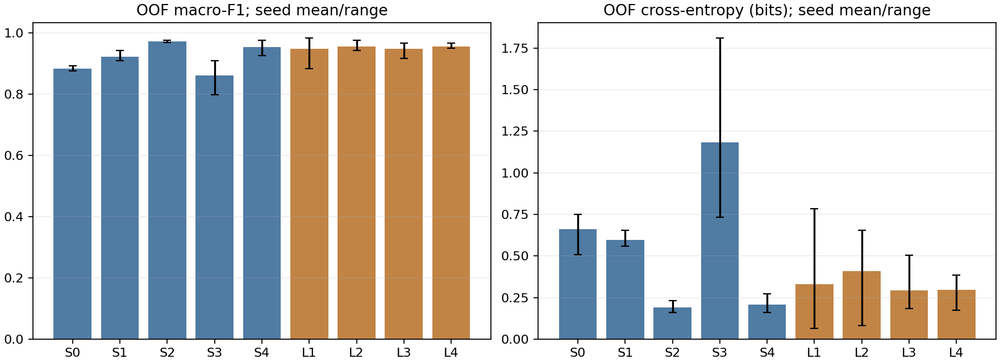
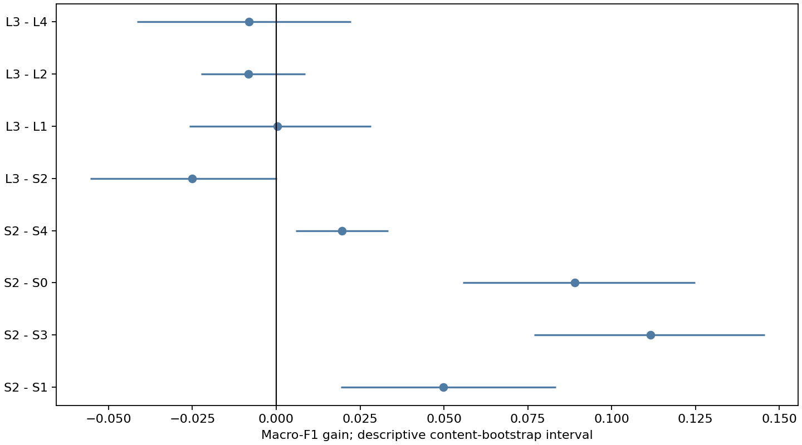

# 0916 VLESS：记录结构＋独立时间的正式业务实验

## 1. 执行状态与研究范围

195/195正式阶段完成，195,000次优化更新；75个直接监督、60个SSL、60个SSL后微调。135个业务分类器产生3240行OOF预测；这些行包含三个seed和九个臂，不是3240个独立访问。

队列仍为120访问、30独立内容、六个domain×activity业务，每内容四次重复。使用共同可解析的1179对排他TCP连接；6对候选连接未纳入任何表示臂。旧五折保持，每折训练96访问/24内容、测试24访问/6内容。研究范围是当前已见VLESS部署内的未见内容，不是未见协议、外部数据或无索引在线攻击。

## 2. 表示与模型

静态分支分别编码上下行：P_unique按首次贡献的新字节单位，R按严格记录语法，C按1024-byte方向分块。所有臂使用相同独立新字节时间线，不把记录压缩到first/all/prefix中的单一瞬时点。原FR未改名或替换；类型20/21/22/23仅为语法标签，不表示业务或Vision阶段。

静态和时间编码均为两层32-channel、kernel=3卷积及mean/max池化；flow表示32维；访问内flow mean/max加log1p(flow_count)，65→32→6分类头。业务标签仅监督父访问，没有为每条资源flow强加业务标签。IP/端口/SNI/URL和内容身份不作为模型数值输入。

S0=T-only，S1=P＋T，S2=R＋T，S3=C＋T，S4=R-no-type＋T。L1=post-only SSL，L2=双侧侧内SSL，L3=同次排他flow真配，L4=同内容跨重复flow错配；四个L臂固定R＋T并随后访问级微调。L2控制额外见过pre数据的作用。对齐的是flow表示，不是同序号记录。

所有SSL臂共用平衡flow子池。L4为无自配双射；相同内容四次访问按循环donor及同一选中flow rank组合。它不保证跨重复的同一资源连接语义，因此L3−L4不是纯访问噪声或信息量。监督阶段仍使用全部共同flow。

## 3. 固定训练与权限

每阶段1000步，Adam lr=0.001，batch=24。监督CE＋weight L2(1e−4/2)，bias不正则；SSL VICReg权重25/25/1、eps=1e−4、5%数值掩码。无早停、BN/dropout、阈值/权重搜索。seed=20260918/19/20。连续特征只使用训练post缩放；测试pre完全不在推理Store中。

CUDA-only float32，未启用AMP/TF32，确定性算法；模型训练、外层推理和检查点重放均在CUDA，CPU仅用于数据处理/统计。完整序列分块保留halo，GPU缓存与向量池化不改变网络或训练预算。训练时间合计2.05小时（含各阶段保存间隔开销，不等于总wall-time）。

每100步保存模型、优化器和随机状态，支持相同冻结契约恢复。微调仅继承SSL编码器，使用与直接监督相同seed的新分类头。严格资格本身使用双侧离线证据，访问划分由内部索引辅助；保持offline_index_assisted_post边界。

## 4. 主要结果：三seed均值

| arm | macro_f1_mean | balanced_accuracy_mean | ce_bits_mean | brier_mean |
| --- | --- | --- | --- | --- |
| S0 | 0.883347 | 0.883333 | 0.659572 | 0.183607 |
| S1 | 0.92242 | 0.922222 | 0.598072 | 0.122684 |
| S2 | 0.97232 | 0.972222 | 0.189567 | 0.0452322 |
| S3 | 0.86067 | 0.861111 | 1.18243 | 0.243003 |
| S4 | 0.95278 | 0.952778 | 0.206973 | 0.0650211 |
| L1 | 0.946976 | 0.947222 | 0.328883 | 0.0846174 |
| L2 | 0.955567 | 0.955556 | 0.408997 | 0.0719812 |
| L3 | 0.947317 | 0.947222 | 0.292926 | 0.0849483 |
| L4 | 0.955491 | 0.955556 | 0.297128 | 0.0784837 |

逐seed值及min/max保存在metrics-by-seed/metrics-summary.parquet。CE为bits，Brier为六类平方误差之和。

## 5. 预声明配对对照

F1/BA为新臂减参照；CE/Brier为参照减新臂，均正值表示改善。

| arm | reference | macro_f1_gain | macro_f1_ci_low | macro_f1_ci_high | ce_bits_gain | ce_bits_ci_low | ce_bits_ci_high |
| --- | --- | --- | --- | --- | --- | --- | --- |
| S2 | S1 | 0.0499002 | 0.0192781 | 0.0833701 | 0.408505 | 0.0531433 | 0.885848 |
| S2 | S3 | 0.11165 | 0.076873 | 0.145599 | 0.992866 | 0.54706 | 1.4091 |
| S2 | S0 | 0.0889729 | 0.0556383 | 0.124869 | 0.470006 | 0.133171 | 0.867999 |
| S2 | S4 | 0.0195393 | 0.00583788 | 0.0334632 | 0.0174057 | -0.00969582 | 0.0426504 |
| L3 | S2 | -0.0250023 | -0.0554924 | 0.000102723 | -0.103359 | -0.193647 | -0.022219 |
| L3 | L1 | 0.000341609 | -0.0258805 | 0.0281796 | 0.0359577 | -0.0820858 | 0.172636 |
| L3 | L2 | -0.00824995 | -0.0224451 | 0.00871319 | 0.116071 | -0.0767359 | 0.370152 |
| L3 | L4 | -0.0081738 | -0.041542 | 0.0222798 | 0.00420187 | -0.158363 | 0.180599 |

2000次按业务分层的内容bootstrap；同内容四次访问和全部臂/seed共同重采。每次重采重新计算每seed指标再取均值，不把访问F1平均，不先混合seed概率构造集成。区间是条件于既有模型的未校正描述区间；没有消除历史回顾性分析或多重比较，跨零不表示等效。每业务仅5内容，不能因flow多而夸大独立样本量。

## 6. 业务分项召回

| arm | bing.com::search_results_view | developer.mozilla.org::document_view | github.com::repository_view | wikipedia.org::article_view | youtube.com::search_results_view | youtube.com::video_playback |
| --- | --- | --- | --- | --- | --- | --- |
| S0 | 0.9 | 0.916667 | 0.983333 | 0.883333 | 0.8 | 0.816667 |
| S1 | 0.85 | 0.916667 | 0.983333 | 0.916667 | 0.916667 | 0.95 |
| S2 | 0.983333 | 0.983333 | 1 | 1 | 0.966667 | 0.9 |
| S3 | 0.883333 | 0.9 | 0.983333 | 0.883333 | 0.733333 | 0.783333 |
| S4 | 0.966667 | 0.933333 | 1 | 0.983333 | 0.95 | 0.883333 |
| L1 | 0.95 | 0.95 | 1 | 0.983333 | 0.866667 | 0.933333 |
| L2 | 0.95 | 0.916667 | 1 | 1 | 0.966667 | 0.9 |
| L3 | 0.933333 | 0.933333 | 1 | 0.983333 | 0.966667 | 0.866667 |
| L4 | 0.95 | 1 | 0.983333 | 0.983333 | 0.933333 | 0.883333 |

全部逐seed混淆矩阵与“修正错误/新增错误”计数分别保存在confusion-matrices.parquet和decision-changes.parquet；不只报告整体F1。

## 7. 如何解释这些对照

- S2−S1/S3回答记录描述相对于包级/固定分块的用途；S2−S0回答时间之外的结构增量；S2−S4回答语法类型通道的增量。不得将类型通道的可预测性直接解释为业务语义恢复。
- L3−S2混合预训练与对应机制变化；L3−L1还包含pre资源差异，必须联合L2/L4读。若L3仅胜过L1，不足以声称精确对应有独立收益。
- 即使R监督未胜过P/C，仍完整执行和报告SSL比较；没有按中间测试分数选择实验臂。
- 本轮不验证initial/relay、精确K、逐记录语义对应、SS/Hy2统一记录解析或未见部署泛化。

## 8. 再现与审计

135个检查点在CUDA独立重载，使用每批6访问（原预测24访问）重放；全部决策一致，最大概率误差1.9073486e-06。这验证实现/存档一致性，不是新的独立泛化实验。

原120成员与内容折、捕获身份、全部张量、预处理和代码均保存SHA256。每折训练视图限定训练访问；测试视图只能读取post。训练输入不得接触测试内容，训练后的统计评分不能回流为模型选择。

复用入口：eval/record_time_business/run.py --stage formal。结果根目录：outputs/record-time-business-0916/run-01/formal。固定契约、195个子任务done/检查点/训练日志、OOF预测、bootstrap和重放审计均已保存。旧解析研究与旧240访问实验产物没有覆盖。
