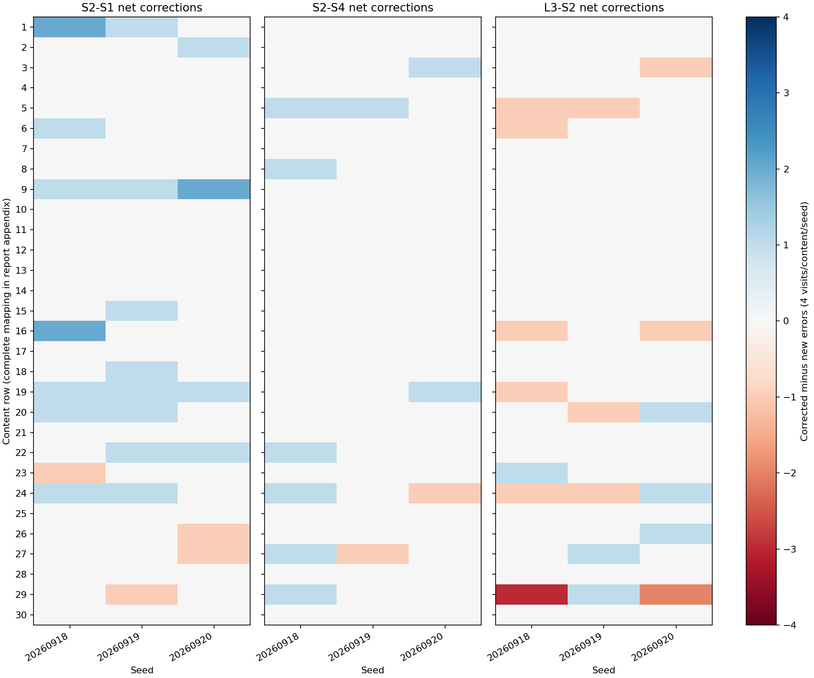
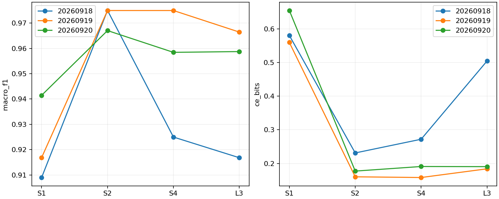
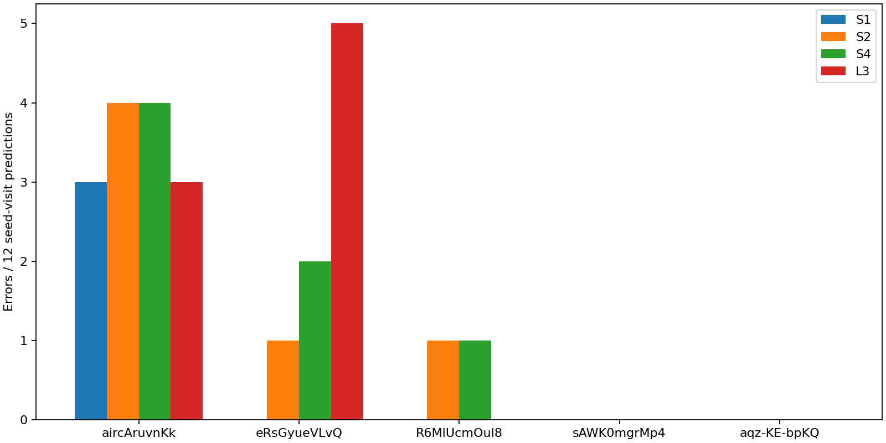

# 记录表示与配对预训练：现有预测定位

旧模型未重训。120访问、30内容；跨seed计数不增加独立样本量。

## 三seed完整指标

| arm   |     seed |   macro_f1 |   balanced_accuracy |   ce_bits |    brier |
|:------|---------:|-----------:|--------------------:|----------:|---------:|
| S1    | 20260918 |   0.908973 |            0.908333 |  0.580269 | 0.159857 |
| S1    | 20260919 |   0.916838 |            0.916667 |  0.559430 | 0.118838 |
| S1    | 20260920 |   0.941448 |            0.941667 |  0.654517 | 0.089358 |
| S2    | 20260918 |   0.974984 |            0.975000 |  0.231158 | 0.047437 |
| S2    | 20260919 |   0.974953 |            0.975000 |  0.160280 | 0.048160 |
| S2    | 20260920 |   0.967022 |            0.966667 |  0.177262 | 0.040100 |
| S4    | 20260918 |   0.924964 |            0.925000 |  0.271858 | 0.098925 |
| S4    | 20260919 |   0.974953 |            0.975000 |  0.158164 | 0.051520 |
| S4    | 20260920 |   0.958425 |            0.958333 |  0.190895 | 0.044618 |
| L3    | 20260918 |   0.916793 |            0.916667 |  0.504286 | 0.128026 |
| L3    | 20260919 |   0.966431 |            0.966667 |  0.184013 | 0.061512 |
| L3    | 20260920 |   0.958728 |            0.958333 |  0.190478 | 0.065307 |

## 错误交集（每seed独立列出）

A=S1正确且S2错误；B=S2正确且L3错误；C=S2和L3均错误。A与B天然互斥。

| scope   |     seed |   A |   B |   C |   A_L3_wrong |   B_S1_wrong |   error_union |   error_intersection |   A_persistent_fraction |
|:--------|---------:|----:|----:|----:|-------------:|-------------:|--------------:|---------------------:|------------------------:|
| all     | 20260918 |   3 |   8 |   2 |            2 |            3 |            11 |                    2 |                0.666667 |
| all     | 20260919 |   2 |   3 |   1 |            0 |            0 |             6 |                    1 |                0.000000 |
| all     | 20260920 |   2 |   4 |   1 |            1 |            0 |             8 |                    1 |                0.500000 |
| youtube | 20260918 |   3 |   4 |   2 |            2 |            0 |             7 |                    2 |                0.666667 |
| youtube | 20260919 |   2 |   1 |   0 |            0 |            0 |             3 |                    0 |                0.000000 |
| youtube | 20260920 |   2 |   2 |   1 |            1 |            0 |             5 |                    1 |                0.500000 |

## YouTube全部内容的错误及CE贡献

计数为seed×visit，单内容分母12，不是12独立访问。

| arm   | label_id                         | content_id                                                         |   seed_visit_errors |   ce_bits_sum |
|:------|:---------------------------------|:-------------------------------------------------------------------|--------------------:|--------------:|
| L3    | youtube.com::search_results_view | https://www.youtube.com/results?search_query=astronomy+documentary |                   0 |      0.116883 |
| L3    | youtube.com::search_results_view | https://www.youtube.com/results?search_query=bicycle+maintenance   |                   0 |      0.021236 |
| L3    | youtube.com::search_results_view | https://www.youtube.com/results?search_query=bread+baking          |                   0 |      1.713492 |
| L3    | youtube.com::search_results_view | https://www.youtube.com/results?search_query=piano+practice        |                   2 |      7.577873 |
| L3    | youtube.com::search_results_view | https://www.youtube.com/results?search_query=watercolor+tutorial   |                   0 |      0.078012 |
| L3    | youtube.com::video_playback      | youtube_video:R6MlUcmOul8                                          |                   0 |      0.044952 |
| L3    | youtube.com::video_playback      | youtube_video:aircAruvnKk                                          |                   3 |     31.603143 |
| L3    | youtube.com::video_playback      | youtube_video:aqz-KE-bpKQ                                          |                   0 |      0.159050 |
| L3    | youtube.com::video_playback      | youtube_video:eRsGyueVLvQ                                          |                   5 |     13.578016 |
| L3    | youtube.com::video_playback      | youtube_video:sAWK0mgrMp4                                          |                   0 |      0.207116 |
| S1    | youtube.com::search_results_view | https://www.youtube.com/results?search_query=astronomy+documentary |                   0 |      0.175257 |
| S1    | youtube.com::search_results_view | https://www.youtube.com/results?search_query=bicycle+maintenance   |                   2 |      5.325651 |
| S1    | youtube.com::search_results_view | https://www.youtube.com/results?search_query=bread+baking          |                   0 |      1.465477 |
| S1    | youtube.com::search_results_view | https://www.youtube.com/results?search_query=piano+practice        |                   3 |     15.988843 |
| S1    | youtube.com::search_results_view | https://www.youtube.com/results?search_query=watercolor+tutorial   |                   0 |      0.147378 |
| S1    | youtube.com::video_playback      | youtube_video:R6MlUcmOul8                                          |                   0 |      0.464424 |
| S1    | youtube.com::video_playback      | youtube_video:aircAruvnKk                                          |                   3 |     11.930856 |
| S1    | youtube.com::video_playback      | youtube_video:aqz-KE-bpKQ                                          |                   0 |      0.014341 |
| S1    | youtube.com::video_playback      | youtube_video:eRsGyueVLvQ                                          |                   0 |      0.927833 |
| S1    | youtube.com::video_playback      | youtube_video:sAWK0mgrMp4                                          |                   0 |      0.135350 |
| S2    | youtube.com::search_results_view | https://www.youtube.com/results?search_query=astronomy+documentary |                   0 |      0.272570 |
| S2    | youtube.com::search_results_view | https://www.youtube.com/results?search_query=bicycle+maintenance   |                   0 |      0.882282 |
| S2    | youtube.com::search_results_view | https://www.youtube.com/results?search_query=bread+baking          |                   1 |      1.720479 |
| S2    | youtube.com::search_results_view | https://www.youtube.com/results?search_query=piano+practice        |                   1 |      2.763703 |
| S2    | youtube.com::search_results_view | https://www.youtube.com/results?search_query=watercolor+tutorial   |                   0 |      0.153113 |
| S2    | youtube.com::video_playback      | youtube_video:R6MlUcmOul8                                          |                   1 |      1.447012 |
| S2    | youtube.com::video_playback      | youtube_video:aircAruvnKk                                          |                   4 |     38.656725 |
| S2    | youtube.com::video_playback      | youtube_video:aqz-KE-bpKQ                                          |                   0 |      0.009542 |
| S2    | youtube.com::video_playback      | youtube_video:eRsGyueVLvQ                                          |                   1 |     11.138750 |
| S2    | youtube.com::video_playback      | youtube_video:sAWK0mgrMp4                                          |                   0 |      0.356396 |
| S4    | youtube.com::search_results_view | https://www.youtube.com/results?search_query=astronomy+documentary |                   0 |      0.437101 |
| S4    | youtube.com::search_results_view | https://www.youtube.com/results?search_query=bicycle+maintenance   |                   1 |      1.472509 |
| S4    | youtube.com::search_results_view | https://www.youtube.com/results?search_query=bread+baking          |                   1 |      2.615747 |
| S4    | youtube.com::search_results_view | https://www.youtube.com/results?search_query=piano+practice        |                   1 |      3.205586 |
| S4    | youtube.com::search_results_view | https://www.youtube.com/results?search_query=watercolor+tutorial   |                   0 |      0.184901 |
| S4    | youtube.com::video_playback      | youtube_video:R6MlUcmOul8                                          |                   1 |      1.232243 |
| S4    | youtube.com::video_playback      | youtube_video:aircAruvnKk                                          |                   4 |     34.994133 |
| S4    | youtube.com::video_playback      | youtube_video:aqz-KE-bpKQ                                          |                   0 |      0.017371 |
| S4    | youtube.com::video_playback      | youtube_video:eRsGyueVLvQ                                          |                   2 |     11.860232 |
| S4    | youtube.com::video_playback      | youtube_video:sAWK0mgrMp4                                          |                   0 |      0.276558 |

行号与内容映射见figure-content-index.parquet；完整错误及概率变化见error-ledger.parquet。新增定位为探索性描述，不用于删除样本或选择超参数。旧配对区间沿用原报告，不把区间跨零当等效。

## 计数单位核对

| comparison   | state           |   seed_visits |   distinct_visits |   distinct_contents |
|:-------------|:----------------|--------------:|------------------:|--------------------:|
| L3-S2        | both_correct    |           335 |               119 |                  30 |
| L3-S2        | corrected       |             6 |                 6 |                   6 |
| L3-S2        | different_wrong |             1 |                 1 |                   1 |
| L3-S2        | new_error       |            15 |                10 |                   8 |
| L3-S2        | same_wrong      |             3 |                 2 |                   1 |
| S2-S1        | both_correct    |           325 |               116 |                  30 |
| S2-S1        | corrected       |            25 |                18 |                  12 |
| S2-S1        | different_wrong |             1 |                 1 |                   1 |
| S2-S1        | new_error       |             7 |                 5 |                   4 |
| S2-S1        | same_wrong      |             2 |                 2 |                   2 |
| S2-S4        | both_correct    |           340 |               119 |                  30 |
| S2-S4        | corrected       |            10 |                 9 |                   9 |
| S2-S4        | new_error       |             3 |                 3 |                   3 |
| S2-S4        | same_wrong      |             7 |                 6 |                   5 |

旧bootstrap抽样已按同一RNG重建，并逐次核对S2−S1四指标全部2000次抽样，一致性误差为0.0。
