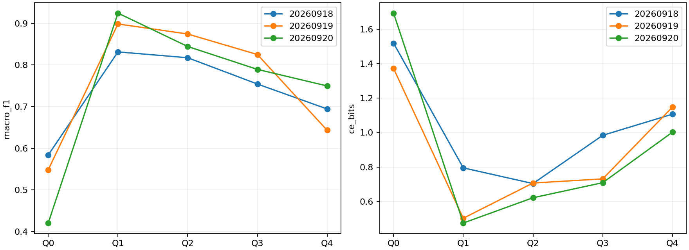

# 冻结flow表示探针

75/75任务完成；只训练原65→32→6小型非线性头，编码器逐任务验证未改变。训练、编码、测试均CUDA。Q0随机编码器；Q1–Q4为L1–L4的SSL结束编码器。

## 三seed均值

| arm   |   macro_f1 |   balanced_accuracy |   ce_bits |    brier |
|:------|-----------:|--------------------:|----------:|---------:|
| Q0    |   0.517569 |            0.561111 |  1.528650 | 0.588080 |
| Q1    |   0.884997 |            0.886111 |  0.590791 | 0.211145 |
| Q2    |   0.845541 |            0.847222 |  0.677542 | 0.247401 |
| Q3    |   0.789710 |            0.791667 |  0.808096 | 0.298277 |
| Q4    |   0.695853 |            0.700000 |  1.085821 | 0.437251 |

## 逐seed

| arm   |     seed |   macro_f1 |   balanced_accuracy |   ce_bits |    brier |
|:------|---------:|-----------:|--------------------:|----------:|---------:|
| Q0    | 20260918 |   0.583846 |            0.633333 |  1.519467 | 0.584802 |
| Q0    | 20260919 |   0.548398 |            0.566667 |  1.372381 | 0.553326 |
| Q0    | 20260920 |   0.420462 |            0.483333 |  1.694101 | 0.626111 |
| Q1    | 20260918 |   0.831550 |            0.833333 |  0.795100 | 0.289444 |
| Q1    | 20260919 |   0.898682 |            0.900000 |  0.502482 | 0.181796 |
| Q1    | 20260920 |   0.924759 |            0.925000 |  0.474792 | 0.162195 |
| Q2    | 20260918 |   0.817523 |            0.816667 |  0.704019 | 0.270738 |
| Q2    | 20260919 |   0.874546 |            0.875000 |  0.707091 | 0.240750 |
| Q2    | 20260920 |   0.844553 |            0.850000 |  0.621516 | 0.230714 |
| Q3    | 20260918 |   0.754343 |            0.758333 |  0.984152 | 0.353427 |
| Q3    | 20260919 |   0.825242 |            0.825000 |  0.731111 | 0.266417 |
| Q3    | 20260920 |   0.789546 |            0.791667 |  0.709027 | 0.274987 |
| Q4    | 20260918 |   0.694481 |            0.700000 |  1.106999 | 0.457608 |
| Q4    | 20260919 |   0.643306 |            0.641667 |  1.148051 | 0.461330 |
| Q4    | 20260920 |   0.749772 |            0.758333 |  1.002413 | 0.392814 |

## 固定对照

正值均表示改善。区间条件于固定模型，内容级分层bootstrap，未作多重比较校正；跨零不是等效。

| arm   | reference   |   macro_f1_gain |   macro_f1_low |   macro_f1_high |   balanced_accuracy_gain |   balanced_accuracy_low |   balanced_accuracy_high |   ce_bits_gain |   ce_bits_low |   ce_bits_high |   brier_gain |   brier_low |   brier_high |
|:------|:------------|----------------:|---------------:|----------------:|-------------------------:|------------------------:|-------------------------:|---------------:|--------------:|---------------:|-------------:|------------:|-------------:|
| Q3    | Q0          |        0.272141 |       0.200325 |        0.344935 |                 0.230556 |                0.163889 |                 0.294444 |       0.720553 |      0.583821 |       0.846511 |     0.289803 |    0.240609 |     0.336103 |
| Q3    | Q1          |       -0.095287 |      -0.147941 |       -0.051191 |                -0.094444 |               -0.138889 |                -0.052778 |      -0.217305 |     -0.288964 |      -0.151503 |    -0.087132 |   -0.125005 |    -0.053422 |
| Q3    | Q2          |       -0.055830 |      -0.103229 |       -0.014092 |                -0.055556 |               -0.100000 |                -0.016597 |      -0.130554 |     -0.211444 |      -0.053045 |    -0.050876 |   -0.084046 |    -0.019451 |
| Q3    | Q4          |        0.093857 |       0.008017 |        0.176352 |                 0.091667 |                0.008333 |                 0.169444 |       0.277725 |      0.111248 |       0.446266 |     0.138974 |    0.073689 |     0.205285 |
| Q1    | Q0          |        0.367428 |       0.303300 |        0.437053 |                 0.325000 |                0.263889 |                 0.383333 |       0.937858 |      0.840473 |       1.017172 |     0.376935 |    0.338831 |     0.409500 |
| Q2    | Q0          |        0.327972 |       0.257703 |        0.402346 |                 0.286111 |                0.222222 |                 0.350000 |       0.851107 |      0.728928 |       0.958315 |     0.340679 |    0.298667 |     0.379401 |
| Q4    | Q0          |        0.178285 |       0.096132 |        0.261878 |                 0.138889 |                0.061042 |                 0.216667 |       0.442829 |      0.315034 |       0.554693 |     0.150829 |    0.099781 |     0.196452 |

本轮只解释固定低容量头下的业务可读性，不估计互信息，也不证明微调造成某种语义破坏。不同编码器输出尺度与固定正则可能影响读出，故不是表示信息量绝对排名。S2是端到端监督参照，不是冻结探针对照。范围仍限已见VLESS与离线索引关联队列。

## 冻结读出与旧微调的描述比较

| ssl_source   |     seed |   frozen_f1 |   finetuned_f1 |   difference |
|:-------------|---------:|------------:|---------------:|-------------:|
| L1           | 20260918 |    0.831550 |       0.882458 |     0.050908 |
| L1           | 20260919 |    0.898682 |       0.974953 |     0.076271 |
| L1           | 20260920 |    0.924759 |       0.983516 |     0.058758 |
| L2           | 20260918 |    0.817523 |       0.950239 |     0.132716 |
| L2           | 20260919 |    0.874546 |       0.941136 |     0.066590 |
| L2           | 20260920 |    0.844553 |       0.975327 |     0.130774 |
| L3           | 20260918 |    0.754343 |       0.916793 |     0.162450 |
| L3           | 20260919 |    0.825242 |       0.966431 |     0.141189 |
| L3           | 20260920 |    0.789546 |       0.958728 |     0.169182 |
| L4           | 20260918 |    0.694481 |       0.949911 |     0.255430 |
| L4           | 20260919 |    0.643306 |       0.949916 |     0.306610 |
| L4           | 20260920 |    0.749772 |       0.966646 |     0.216874 |

75个新增分类头在CUDA独立重载、改为6访问批次验证，决策全部一致；编码器冻结、内容及flow隔离全部通过。旧135模型未重复重放。详细审计见probe-audit.parquet。
