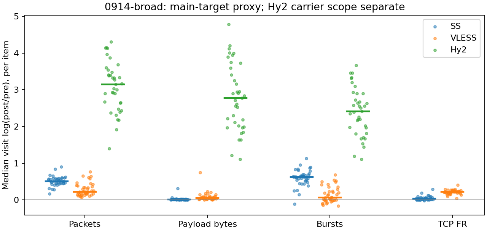

# 0914-broad：全部条目统计

本批次 64 个条目，192 次选定访问。主请求 proxy 汇总仅使用明确路由的可比较观测；所有未进入汇总的条目仍可在下方查看。

## 路由与特征覆盖

| 部署 | 选定访问 | 主请求proxy | 主请求direct | 可计算代理上下文 | DIRECT pre | 提取错误 |
| --- | --- | --- | --- | --- | --- | --- |
| Hy2 | 64 | 37 | 27 | 41 | 43 | 0 |
| SS | 64 | 39 | 25 | 42 | 26 | 0 |
| VLESS | 64 | 41 | 23 | 44 | 24 | 0 |

## 按条目等权汇总的变换

Δ：每条目内先取重复变换中位数，再对条目取中位数。ratio=exp(Δ) 仅用于正尺度指标。MAD 在单次 broad 不定义；+/− 是条目变换方向数，零单独保留在明细中。

| 部署 | scope | 特征 | 条目n | 访问n | Δ中位 | 典型倍率 | 条目MAD中位 | +/− |
| --- | --- | --- | --- | --- | --- | --- | --- | --- |
| Hy2 | carrier_context_envelope | burst_count | 37 | 37 | 2.4162 | 11.203 | — | 37/0 |
| Hy2 | carrier_context_envelope | connection_span_concurrency_max | 37 | 37 | -1.9459 | 0.14286 | — | 0/36 |
| Hy2 | carrier_context_envelope | cumulative_l1 | 37 | 37 | 0.50045 | — | — | 37/0 |
| Hy2 | carrier_context_envelope | direction_entropy | 37 | 37 | 0.048389 | — | — | 24/13 |
| Hy2 | carrier_context_envelope | down_transport_bytes | 37 | 37 | 2.7882 | 16.252 | — | 37/0 |
| Hy2 | carrier_context_envelope | duration_s | 37 | 37 | -0.00016567 | 0.99983 | — | 0/37 |
| Hy2 | carrier_context_envelope | entity_count | 37 | 37 | -2.3026 | 0.1 | — | 0/36 |
| Hy2 | carrier_context_envelope | iat_js | 37 | 37 | 0.38716 | — | — | 37/0 |
| Hy2 | carrier_context_envelope | iat_ks | 37 | 37 | 0.56137 | — | — | 37/0 |
| Hy2 | carrier_context_envelope | iat_median_us | 37 | 37 | -3.4265 | 0.032502 | — | 0/37 |
| Hy2 | carrier_context_envelope | iat_us_p95 | 37 | 37 | -4.7602 | 0.0085642 | — | 0/37 |
| Hy2 | carrier_context_envelope | iat_wasserstein_log1p_us | 37 | 37 | 3.4599 | — | — | 37/0 |
| Hy2 | carrier_context_envelope | ip_bytes | 37 | 37 | 2.7719 | 15.989 | — | 37/0 |
| Hy2 | carrier_context_envelope | length_js | 37 | 37 | 0.71605 | — | — | 37/0 |
| Hy2 | carrier_context_envelope | length_ks | 37 | 37 | 0.5146 | — | — | 37/0 |
| Hy2 | carrier_context_envelope | length_median | 37 | 37 | 0 | 1 | — | 18/18 |
| Hy2 | carrier_context_envelope | length_p95 | 37 | 37 | -1.823 | 0.16155 | — | 0/37 |
| Hy2 | carrier_context_envelope | length_wasserstein_bytes | 37 | 37 | 1518.4 | — | — | 37/0 |
| Hy2 | carrier_context_envelope | nonempty_packets | 37 | 37 | 3.7241 | 41.435 | — | 37/0 |
| Hy2 | carrier_context_envelope | offload_suspect_fraction | 37 | 37 | -0.28785 | — | — | 0/37 |
| Hy2 | carrier_context_envelope | packet_count | 37 | 37 | 3.1448 | 23.215 | — | 37/0 |
| Hy2 | carrier_context_envelope | transition_entropy | 37 | 37 | 0.29256 | — | — | 35/2 |
| Hy2 | carrier_context_envelope | transport_bytes | 37 | 37 | 2.7736 | 16.015 | — | 37/0 |
| Hy2 | carrier_context_envelope | up_byte_fraction | 37 | 37 | -0.017228 | — | — | 7/30 |
| Hy2 | carrier_context_envelope | up_transport_bytes | 37 | 37 | 2.2597 | 9.5803 | — | 37/0 |
| SS | exclusive_page | burst_count | 39 | 39 | 0.62016 | 1.8592 | — | 38/1 |
| SS | exclusive_page | connection_span_concurrency_max | 39 | 39 | 0 | 1 | — | 1/3 |
| SS | exclusive_page | cumulative_l1 | 39 | 39 | 0.0042364 | — | — | 39/0 |
| SS | exclusive_page | direction_entropy | 39 | 39 | -0.17386 | — | — | 2/37 |
| SS | exclusive_page | down_transport_bytes | 39 | 39 | 0.010807 | 1.0109 | — | 37/2 |
| SS | exclusive_page | duration_s | 39 | 39 | -7.9142e-05 | 0.99992 | — | 2/37 |
| SS | exclusive_page | entity_count | 39 | 39 | 0 | 1 | — | 0/0 |
| SS | exclusive_page | fr_runs | 39 | 39 | 0.032391 | 1.0329 | — | 29/1 |
| SS | exclusive_page | fr_runs_per_packet | 39 | 39 | -0.039224 | — | — | 1/38 |
| SS | exclusive_page | fr_switches | 39 | 39 | 0.035246 | 1.0359 | — | 29/1 |
| SS | exclusive_page | fr_switches_per_possible_transition | 39 | 39 | -0.035627 | — | — | 1/38 |
| SS | exclusive_page | full_retransmission_fraction | 39 | 39 | 0 | — | — | 19/16 |
| SS | exclusive_page | iat_js | 39 | 39 | 0.2 | — | — | 39/0 |
| SS | exclusive_page | iat_ks | 39 | 39 | 0.37285 | — | — | 39/0 |
| SS | exclusive_page | iat_median_us | 39 | 39 | 2.6465 | 14.105 | — | 39/0 |
| SS | exclusive_page | iat_us_p95 | 39 | 39 | -0.83633 | 0.4333 | — | 1/38 |
| SS | exclusive_page | iat_wasserstein_log1p_us | 39 | 39 | 1.3734 | — | — | 39/0 |
| SS | exclusive_page | ip_bytes | 39 | 39 | 0.049584 | 1.0508 | — | 39/0 |
| SS | exclusive_page | length_js | 39 | 39 | 0.31749 | — | — | 39/0 |
| SS | exclusive_page | length_ks | 39 | 39 | 0.47379 | — | — | 39/0 |
| SS | exclusive_page | length_median | 39 | 39 | -0.67904 | 0.5071 | — | 1/38 |
| SS | exclusive_page | length_p95 | 39 | 39 | -0.36059 | 0.69727 | — | 0/39 |
| SS | exclusive_page | length_wasserstein_bytes | 39 | 39 | 797.43 | — | — | 39/0 |
| SS | exclusive_page | nonempty_packets | 39 | 39 | 0.46041 | 1.5847 | — | 39/0 |
| SS | exclusive_page | offload_suspect_fraction | 39 | 39 | -0.17753 | — | — | 0/39 |
| SS | exclusive_page | packet_count | 39 | 39 | 0.507 | 1.6603 | — | 39/0 |
| SS | exclusive_page | rtt_median_ms | 39 | 39 | 6.4069 | 606.04 | — | 39/0 |
| SS | exclusive_page | transition_entropy | 39 | 39 | -0.11041 | — | — | 0/39 |
| SS | exclusive_page | transport_bytes | 39 | 39 | 0.01428 | 1.0144 | — | 38/1 |
| SS | exclusive_page | up_byte_fraction | 39 | 39 | 0.0027505 | — | — | 38/1 |
| SS | exclusive_page | up_transport_bytes | 39 | 39 | 0.12616 | 1.1345 | — | 39/0 |
| VLESS | exclusive_page | burst_count | 41 | 41 | 0.068153 | 1.0705 | — | 29/12 |
| VLESS | exclusive_page | connection_span_concurrency_max | 41 | 41 | 0 | 1 | — | 0/2 |
| VLESS | exclusive_page | cumulative_l1 | 41 | 41 | 0.0050367 | — | — | 41/0 |
| VLESS | exclusive_page | direction_entropy | 41 | 41 | -0.051548 | — | — | 10/31 |
| VLESS | exclusive_page | down_transport_bytes | 41 | 41 | 0.043435 | 1.0444 | — | 41/0 |
| VLESS | exclusive_page | duration_s | 41 | 41 | -0.001447 | 0.99855 | — | 9/32 |
| VLESS | exclusive_page | entity_count | 41 | 41 | 0 | 1 | — | 0/0 |
| VLESS | exclusive_page | fr_runs | 41 | 41 | 0.21825 | 1.2439 | — | 41/0 |
| VLESS | exclusive_page | fr_runs_per_packet | 41 | 41 | 0.0018266 | — | — | 22/19 |
| VLESS | exclusive_page | fr_switches | 41 | 41 | 0.24512 | 1.2778 | — | 41/0 |
| VLESS | exclusive_page | fr_switches_per_possible_transition | 41 | 41 | 0.0028889 | — | — | 25/16 |
| VLESS | exclusive_page | full_retransmission_fraction | 41 | 41 | -0.00065775 | — | — | 1/27 |
| VLESS | exclusive_page | iat_js | 41 | 41 | 0.072271 | — | — | 41/0 |
| VLESS | exclusive_page | iat_ks | 41 | 41 | 0.14954 | — | — | 41/0 |
| VLESS | exclusive_page | iat_median_us | 41 | 41 | -0.24248 | 0.78468 | — | 15/26 |
| VLESS | exclusive_page | iat_us_p95 | 41 | 41 | 0.41343 | 1.512 | — | 28/13 |
| VLESS | exclusive_page | iat_wasserstein_log1p_us | 41 | 41 | 0.62543 | — | — | 41/0 |
| VLESS | exclusive_page | ip_bytes | 41 | 41 | 0.067577 | 1.0699 | — | 41/0 |
| VLESS | exclusive_page | length_js | 41 | 41 | 0.054306 | — | — | 41/0 |
| VLESS | exclusive_page | length_ks | 41 | 41 | 0.13213 | — | — | 41/0 |
| VLESS | exclusive_page | length_median | 41 | 41 | 0 | 1 | — | 15/16 |
| VLESS | exclusive_page | length_p95 | 41 | 41 | -0.025176 | 0.97514 | — | 0/26 |
| VLESS | exclusive_page | length_wasserstein_bytes | 41 | 41 | 273.66 | — | — | 41/0 |
| VLESS | exclusive_page | nonempty_packets | 41 | 41 | 0.21072 | 1.2346 | — | 41/0 |
| VLESS | exclusive_page | offload_suspect_fraction | 41 | 41 | -0.069814 | — | — | 0/41 |
| VLESS | exclusive_page | packet_count | 41 | 41 | 0.22296 | 1.2498 | — | 41/0 |
| VLESS | exclusive_page | rtt_median_ms | 41 | 41 | 0.32487 | 1.3838 | — | 22/19 |
| VLESS | exclusive_page | transition_entropy | 41 | 41 | -0.0031969 | — | — | 18/23 |
| VLESS | exclusive_page | transport_bytes | 41 | 41 | 0.055321 | 1.0569 | — | 41/0 |
| VLESS | exclusive_page | up_byte_fraction | 41 | 41 | 0.0099206 | — | — | 38/3 |
| VLESS | exclusive_page | up_transport_bytes | 41 | 41 | 0.42582 | 1.5308 | — | 41/0 |

## 全部条目索引

| 序号 | 域名 | 业务标签 | 目标URL | 详细报告 |
| --- | --- | --- | --- | --- |
| 0 | bilibili.com | bilibili.com::page_load | https://www.bilibili.com/ | [打开](items/0914-broad/000-03a1074eccdcc58e.md) |
| 1 | bilibili.com | bilibili.com::video_playback | https://www.bilibili.com/video/BV1hu4m1P7Mu/ | [打开](items/0914-broad/001-e5fecd4c6dc2d8fa.md) |
| 2 | bilibili.com | bilibili.com::video_playback | https://www.bilibili.com/video/BV1HEf2YWEvs/ | [打开](items/0914-broad/002-65f28e939abe486f.md) |
| 3 | youtube.com | youtube.com::page_load | https://www.youtube.com/ | [打开](items/0914-broad/003-b33f01d766fc799f.md) |
| 4 | youtube.com | youtube.com::video_playback | https://www.youtube.com/watch?v=sAWK0mgrMp4 | [打开](items/0914-broad/004-23488168c950132e.md) |
| 5 | google.com | google.com::page_load | https://www.google.com/ | [打开](items/0914-broad/005-a1650371c2279625.md) |
| 6 | example.com | example.com::page_load | https://example.com/ | [打开](items/0914-broad/006-4940a1d23e2a20e3.md) |
| 7 | wikipedia.org | wikipedia.org::page_load | https://en.wikipedia.org/wiki/Main_Page | [打开](items/0914-broad/007-3919d06d9356bc02.md) |
| 8 | wikipedia.org | wikipedia.org::page_load | https://en.wikipedia.org/wiki/Computer_network | [打开](items/0914-broad/008-ef5f0f74423aec69.md) |
| 9 | mozilla.org | mozilla.org::page_load | https://www.mozilla.org/ | [打开](items/0914-broad/009-fc700d73367aa958.md) |
| 10 | developer.mozilla.org | developer.mozilla.org::page_load | https://developer.mozilla.org/en-US/ | [打开](items/0914-broad/010-c44f26eaddde119e.md) |
| 11 | developer.mozilla.org | developer.mozilla.org::page_load | https://developer.mozilla.org/en-US/docs/Web/HTTP | [打开](items/0914-broad/011-73bd6b3ff9da1b8f.md) |
| 12 | ietf.org | ietf.org::page_load | https://www.ietf.org/ | [打开](items/0914-broad/012-d1b6540ac20ffddd.md) |
| 13 | arxiv.org | arxiv.org::page_load | https://arxiv.org/ | [打开](items/0914-broad/013-54c889c14021009e.md) |
| 14 | arxiv.org | arxiv.org::page_load | https://arxiv.org/abs/1706.03762 | [打开](items/0914-broad/014-8548da95f4c57d3d.md) |
| 15 | gov.cn | gov.cn::page_load | https://www.gov.cn/ | [打开](items/0914-broad/015-7700f6cf1d986262.md) |
| 16 | baidu.com | baidu.com::page_load | https://www.baidu.com/ | [打开](items/0914-broad/016-be50ad635f12eb4c.md) |
| 17 | bing.com | bing.com::page_load | https://www.bing.com/ | [打开](items/0914-broad/017-d4334bf7a80b0baa.md) |
| 18 | duckduckgo.com | duckduckgo.com::page_load | https://duckduckgo.com/ | [打开](items/0914-broad/018-35714b7b867e869f.md) |
| 19 | 12306.cn | 12306.cn::page_load | https://www.12306.cn/index/ | [打开](items/0914-broad/019-c2cc2dc17a45f5df.md) |
| 20 | yahoo.com | yahoo.com::page_load | https://www.yahoo.com/ | [打开](items/0914-broad/020-2be64b2356984d5d.md) |
| 21 | msn.com | msn.com::page_load | https://www.msn.com/ | [打开](items/0914-broad/021-a1ce870b271d2665.md) |
| 22 | baidu.com | baidu.com::page_load | https://map.baidu.com/ | [打开](items/0914-broad/022-163b5d6d9f43cde1.md) |
| 23 | openstreetmap.org | openstreetmap.org::page_load | https://www.openstreetmap.org/ | [打开](items/0914-broad/023-da2216f422baacb1.md) |
| 24 | google.com | google.com::page_load | https://www.google.com/maps/ | [打开](items/0914-broad/024-f2e964b1312db7f1.md) |
| 25 | github.com | github.com::page_load | https://github.com/ | [打开](items/0914-broad/025-e2dabc4efc3e1415.md) |
| 26 | github.com | github.com::page_load | https://github.com/explore | [打开](items/0914-broad/026-b16adab0fdb56938.md) |
| 27 | github.com | github.com::page_load | https://github.com/RakuLomis/TrafficTracer | [打开](items/0914-broad/027-749aaa846a695f20.md) |
| 28 | gitee.com | gitee.com::page_load | https://gitee.com/ | [打开](items/0914-broad/028-e13aaa3e0bf4d51f.md) |
| 29 | stackoverflow.com | stackoverflow.com::page_load | https://stackoverflow.com/questions | [打开](items/0914-broad/029-74ce5c39f948c1bc.md) |
| 30 | huggingface.co | huggingface.co::page_load | https://huggingface.co/ | [打开](items/0914-broad/030-ec6c72f4aa9eab5e.md) |
| 31 | huggingface.co | huggingface.co::page_load | https://huggingface.co/models | [打开](items/0914-broad/031-701545c2bf6e83b4.md) |
| 32 | csdn.net | csdn.net::page_load | https://www.csdn.net/ | [打开](items/0914-broad/032-339369e7d2885566.md) |
| 33 | rottentomatoes.com | rottentomatoes.com::page_load | https://www.rottentomatoes.com/ | [打开](items/0914-broad/033-3d9c3b964050e901.md) |
| 34 | rottentomatoes.com | rottentomatoes.com::page_load | https://www.rottentomatoes.com/m/interstellar_2014 | [打开](items/0914-broad/034-aee8a4df4318a9ca.md) |
| 35 | zhihu.com | zhihu.com::page_load | https://www.zhihu.com/ | [打开](items/0914-broad/035-407d30e49abdb011.md) |
| 36 | sina.com.cn | sina.com.cn::page_load | https://news.sina.com.cn/ | [打开](items/0914-broad/036-2cd840e427a2a2d4.md) |
| 37 | qq.com | qq.com::page_load | https://news.qq.com/ | [打开](items/0914-broad/037-a9b93ce69136bbbe.md) |
| 38 | 163.com | 163.com::page_load | https://news.163.com/ | [打开](items/0914-broad/038-d1d4f1179d7953b0.md) |
| 39 | bbc.com | bbc.com::page_load | https://www.bbc.com/ | [打开](items/0914-broad/039-ced068145ebae313.md) |
| 40 | reuters.com | reuters.com::page_load | https://www.reuters.com/ | [打开](items/0914-broad/040-3d0996146d77bbbf.md) |
| 41 | theguardian.com | theguardian.com::page_load | https://www.theguardian.com/international | [打开](items/0914-broad/041-bcf028e7bd71a305.md) |
| 42 | jd.com | jd.com::page_load | https://www.jd.com/ | [打开](items/0914-broad/042-b25a2bfce40a8078.md) |
| 43 | taobao.com | taobao.com::page_load | https://www.taobao.com/ | [打开](items/0914-broad/043-5333dde2f990ae96.md) |
| 44 | mi.com | mi.com::page_load | https://www.mi.com/ | [打开](items/0914-broad/044-acafa47ccb33b1ec.md) |
| 45 | apple.com | apple.com::page_load | https://www.apple.com/ | [打开](items/0914-broad/045-4b252f80b34e7f35.md) |
| 46 | apple.com | apple.com::page_load | https://www.apple.com/iphone/ | [打开](items/0914-broad/046-9c0b341cc6b91efd.md) |
| 47 | ikea.com | ikea.com::page_load | https://www.ikea.com/ | [打开](items/0914-broad/047-4e3e799a938ad74a.md) |
| 48 | unsplash.com | unsplash.com::page_load | https://unsplash.com/ | [打开](items/0914-broad/048-5c58ed49d5145434.md) |
| 49 | pinterest.com | pinterest.com::page_load | https://www.pinterest.com/ | [打开](items/0914-broad/049-19161666ec833b18.md) |
| 50 | qq.com | qq.com::page_load | https://v.qq.com/ | [打开](items/0914-broad/050-552f610899d8cb42.md) |
| 51 | iqiyi.com | iqiyi.com::page_load | https://www.iqiyi.com/ | [打开](items/0914-broad/051-f70777c38b7419f0.md) |
| 52 | youku.com | youku.com::page_load | https://www.youku.com/ | [打开](items/0914-broad/052-d3945655cca318fb.md) |
| 53 | vimeo.com | vimeo.com::page_load | https://vimeo.com/ | [打开](items/0914-broad/053-fc4aec24173a767f.md) |
| 54 | twitch.tv | twitch.tv::page_load | https://www.twitch.tv/ | [打开](items/0914-broad/054-cb827cdabcbfc170.md) |
| 55 | douyu.com | douyu.com::page_load | https://www.douyu.com/ | [打开](items/0914-broad/055-0622e90115758873.md) |
| 56 | huya.com | huya.com::page_load | https://www.huya.com/ | [打开](items/0914-broad/056-1aab5cdb0503fa0d.md) |
| 57 | music.163.com | music.163.com::page_load | https://music.163.com/ | [打开](items/0914-broad/057-cc60c82c9a8c5f7f.md) |
| 58 | soundcloud.com | soundcloud.com::page_load | https://soundcloud.com/ | [打开](items/0914-broad/058-82696b9247883ae3.md) |
| 59 | spotify.com | spotify.com::page_load | https://open.spotify.com/ | [打开](items/0914-broad/059-4ec2bf424979cef2.md) |
| 60 | tradingview.com | tradingview.com::page_load | https://www.tradingview.com/ | [打开](items/0914-broad/060-d755ffe8ed747f13.md) |
| 61 | weather.com | weather.com::page_load | https://weather.com/ | [打开](items/0914-broad/061-52c061d6e52a0063.md) |
| 62 | cloudflare.com | cloudflare.com::page_load | https://www.cloudflare.com/ | [打开](items/0914-broad/062-42971ee289706a94.md) |
| 63 | speed.cloudflare.com | speed.cloudflare.com::page_load | https://speed.cloudflare.com/ | [打开](items/0914-broad/063-078e1a59ded42736.md) |
