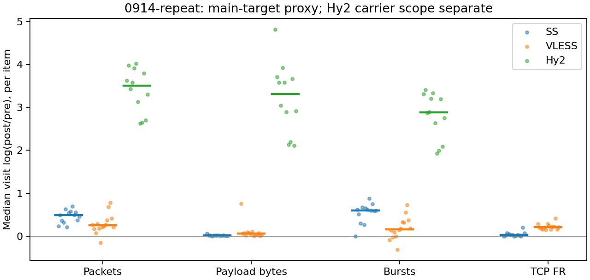

# 0914-repeat：全部条目统计

本批次 18 个条目，270 次选定访问。主请求 proxy 汇总仅使用明确路由的可比较观测；所有未进入汇总的条目仍可在下方查看。

## 路由与特征覆盖

| 部署 | 选定访问 | 主请求proxy | 主请求direct | 可计算代理上下文 | DIRECT pre | 提取错误 |
| --- | --- | --- | --- | --- | --- | --- |
| Hy2 | 90 | 60 | 30 | 65 | 55 | 0 |
| SS | 90 | 65 | 25 | 70 | 25 | 0 |
| VLESS | 90 | 70 | 20 | 79 | 20 | 0 |

## 按条目等权汇总的变换

Δ：每条目内先取重复变换中位数，再对条目取中位数。ratio=exp(Δ) 仅用于正尺度指标。MAD 在单次 broad 不定义；+/− 是条目变换方向数，零单独保留在明细中。

| 部署 | scope | 特征 | 条目n | 访问n | Δ中位 | 典型倍率 | 条目MAD中位 | +/− |
| --- | --- | --- | --- | --- | --- | --- | --- | --- |
| Hy2 | carrier_context_envelope | burst_count | 12 | 60 | 2.8837 | 17.88 | 0.14289 | 12/0 |
| Hy2 | carrier_context_envelope | connection_span_concurrency_max | 12 | 60 | -1.4979 | 0.22361 | 0 | 0/11 |
| Hy2 | carrier_context_envelope | cumulative_l1 | 12 | 60 | 0.38917 | — | 0.025199 | 12/0 |
| Hy2 | carrier_context_envelope | direction_entropy | 12 | 60 | 0.056462 | — | 0.032635 | 7/5 |
| Hy2 | carrier_context_envelope | down_transport_bytes | 12 | 60 | 3.3321 | 27.998 | 0.060475 | 12/0 |
| Hy2 | carrier_context_envelope | duration_s | 12 | 60 | -0.00020253 | 0.9998 | 0.00011937 | 0/12 |
| Hy2 | carrier_context_envelope | entity_count | 12 | 60 | -1.9459 | 0.14286 | 0 | 0/11 |
| Hy2 | carrier_context_envelope | iat_js | 12 | 60 | 0.35616 | — | 0.033549 | 12/0 |
| Hy2 | carrier_context_envelope | iat_ks | 12 | 60 | 0.49095 | — | 0.031529 | 12/0 |
| Hy2 | carrier_context_envelope | iat_median_us | 12 | 60 | -2.9676 | 0.051427 | 0.58846 | 1/11 |
| Hy2 | carrier_context_envelope | iat_us_p95 | 12 | 60 | -4.231 | 0.014538 | 0.467 | 0/12 |
| Hy2 | carrier_context_envelope | iat_wasserstein_log1p_us | 12 | 60 | 3.0484 | — | 0.17983 | 12/0 |
| Hy2 | carrier_context_envelope | ip_bytes | 12 | 60 | 3.3054 | 27.26 | 0.072785 | 12/0 |
| Hy2 | carrier_context_envelope | length_js | 12 | 60 | 0.70358 | — | 0.023239 | 12/0 |
| Hy2 | carrier_context_envelope | length_ks | 12 | 60 | 0.48554 | — | 0.031617 | 12/0 |
| Hy2 | carrier_context_envelope | length_median | 12 | 60 | 0.018208 | 1.0184 | 0.016283 | 7/5 |
| Hy2 | carrier_context_envelope | length_p95 | 12 | 60 | -1.823 | 0.16155 | 0.0020862 | 0/12 |
| Hy2 | carrier_context_envelope | length_wasserstein_bytes | 12 | 60 | 1493.6 | — | 230.56 | 12/0 |
| Hy2 | carrier_context_envelope | nonempty_packets | 12 | 60 | 4.0344 | 56.51 | 0.1041 | 12/0 |
| Hy2 | carrier_context_envelope | offload_suspect_fraction | 12 | 60 | -0.26144 | — | 0.022986 | 0/12 |
| Hy2 | carrier_context_envelope | packet_count | 12 | 60 | 3.5103 | 33.459 | 0.16071 | 12/0 |
| Hy2 | carrier_context_envelope | transition_entropy | 12 | 60 | 0.31672 | — | 0.038572 | 11/1 |
| Hy2 | carrier_context_envelope | transport_bytes | 12 | 60 | 3.3173 | 27.586 | 0.062694 | 12/0 |
| Hy2 | carrier_context_envelope | up_byte_fraction | 12 | 60 | -0.01102 | — | 0.0026604 | 3/9 |
| Hy2 | carrier_context_envelope | up_transport_bytes | 12 | 60 | 2.5586 | 12.918 | 0.13108 | 12/0 |
| SS | exclusive_page | burst_count | 13 | 65 | 0.60189 | 1.8256 | 0.051098 | 12/0 |
| SS | exclusive_page | connection_span_concurrency_max | 13 | 65 | 0 | 1 | 0 | 0/0 |
| SS | exclusive_page | cumulative_l1 | 13 | 65 | 0.0036015 | — | 0.00085055 | 13/0 |
| SS | exclusive_page | direction_entropy | 13 | 65 | -0.18575 | — | 0.019261 | 1/12 |
| SS | exclusive_page | down_transport_bytes | 13 | 65 | 0.0099791 | 1.01 | 0.0014817 | 11/2 |
| SS | exclusive_page | duration_s | 13 | 65 | -3.8429e-05 | 0.99996 | 4.9542e-05 | 1/12 |
| SS | exclusive_page | entity_count | 13 | 65 | 0 | 1 | 0 | 0/0 |
| SS | exclusive_page | fr_runs | 13 | 65 | 0.026317 | 1.0267 | 0.0048111 | 10/0 |
| SS | exclusive_page | fr_runs_per_packet | 13 | 65 | -0.036305 | — | 0.0068385 | 0/13 |
| SS | exclusive_page | fr_switches | 13 | 65 | 0.028573 | 1.029 | 0.0059735 | 10/0 |
| SS | exclusive_page | fr_switches_per_possible_transition | 13 | 65 | -0.032478 | — | 0.0059397 | 0/13 |
| SS | exclusive_page | full_retransmission_fraction | 13 | 65 | 0.0032487 | — | 0.0010685 | 10/2 |
| SS | exclusive_page | iat_js | 13 | 65 | 0.22625 | — | 0.022443 | 13/0 |
| SS | exclusive_page | iat_ks | 13 | 65 | 0.38427 | — | 0.023292 | 13/0 |
| SS | exclusive_page | iat_median_us | 13 | 65 | 2.8837 | 17.88 | 0.2086 | 13/0 |
| SS | exclusive_page | iat_us_p95 | 13 | 65 | -0.79873 | 0.4499 | 0.1505 | 1/12 |
| SS | exclusive_page | iat_wasserstein_log1p_us | 13 | 65 | 1.5052 | — | 0.11499 | 13/0 |
| SS | exclusive_page | ip_bytes | 13 | 65 | 0.047809 | 1.049 | 0.0046133 | 13/0 |
| SS | exclusive_page | length_js | 13 | 65 | 0.33436 | — | 0.024973 | 13/0 |
| SS | exclusive_page | length_ks | 13 | 65 | 0.48746 | — | 0.020756 | 13/0 |
| SS | exclusive_page | length_median | 13 | 65 | -0.70706 | 0.49309 | 0 | 2/11 |
| SS | exclusive_page | length_p95 | 13 | 65 | -0.36059 | 0.69727 | 0 | 0/13 |
| SS | exclusive_page | length_wasserstein_bytes | 13 | 65 | 828.04 | — | 76.249 | 13/0 |
| SS | exclusive_page | nonempty_packets | 13 | 65 | 0.43514 | 1.5452 | 0.073787 | 13/0 |
| SS | exclusive_page | offload_suspect_fraction | 13 | 65 | -0.18151 | — | 0.011713 | 0/13 |
| SS | exclusive_page | packet_count | 13 | 65 | 0.48924 | 1.6311 | 0.057158 | 13/0 |
| SS | exclusive_page | rtt_median_ms | 13 | 65 | 6.4596 | 638.81 | 0.090694 | 13/0 |
| SS | exclusive_page | transition_entropy | 13 | 65 | -0.1158 | — | 0.019139 | 0/13 |
| SS | exclusive_page | transport_bytes | 13 | 65 | 0.016481 | 1.0166 | 0.0014589 | 13/0 |
| SS | exclusive_page | up_byte_fraction | 13 | 65 | 0.0041536 | — | 0.0006383 | 13/0 |
| SS | exclusive_page | up_transport_bytes | 13 | 65 | 0.16405 | 1.1783 | 0.020341 | 13/0 |
| VLESS | exclusive_page | burst_count | 14 | 70 | 0.15932 | 1.1727 | 0.033328 | 10/4 |
| VLESS | exclusive_page | connection_span_concurrency_max | 14 | 70 | 0 | 1 | 0 | 0/0 |
| VLESS | exclusive_page | cumulative_l1 | 14 | 70 | 0.0071249 | — | 0.0015318 | 14/0 |
| VLESS | exclusive_page | direction_entropy | 14 | 70 | -0.094413 | — | 0.014883 | 2/12 |
| VLESS | exclusive_page | down_transport_bytes | 14 | 70 | 0.045573 | 1.0466 | 0.0013674 | 14/0 |
| VLESS | exclusive_page | duration_s | 14 | 70 | -0.0013473 | 0.99865 | 0.00045697 | 1/13 |
| VLESS | exclusive_page | entity_count | 14 | 70 | 0 | 1 | 0 | 0/0 |
| VLESS | exclusive_page | fr_runs | 14 | 70 | 0.20734 | 1.2304 | 0.011858 | 14/0 |
| VLESS | exclusive_page | fr_runs_per_packet | 14 | 70 | 0.0018035 | — | 0.0042109 | 8/6 |
| VLESS | exclusive_page | fr_switches | 14 | 70 | 0.22902 | 1.2574 | 0.012117 | 14/0 |
| VLESS | exclusive_page | fr_switches_per_possible_transition | 14 | 70 | 0.0026807 | — | 0.0037542 | 8/6 |
| VLESS | exclusive_page | full_retransmission_fraction | 14 | 70 | 0 | — | 3.1083e-05 | 0/6 |
| VLESS | exclusive_page | iat_js | 14 | 70 | 0.072237 | — | 0.012439 | 14/0 |
| VLESS | exclusive_page | iat_ks | 14 | 70 | 0.14604 | — | 0.032967 | 14/0 |
| VLESS | exclusive_page | iat_median_us | 14 | 70 | -0.072223 | 0.93032 | 0.17056 | 5/9 |
| VLESS | exclusive_page | iat_us_p95 | 14 | 70 | 0.46387 | 1.5902 | 0.22681 | 10/4 |
| VLESS | exclusive_page | iat_wasserstein_log1p_us | 14 | 70 | 0.61819 | — | 0.12164 | 14/0 |
| VLESS | exclusive_page | ip_bytes | 14 | 70 | 0.070605 | 1.0732 | 0.0037517 | 14/0 |
| VLESS | exclusive_page | length_js | 14 | 70 | 0.060592 | — | 0.017699 | 14/0 |
| VLESS | exclusive_page | length_ks | 14 | 70 | 0.13308 | — | 0.028369 | 14/0 |
| VLESS | exclusive_page | length_median | 14 | 70 | 0 | 1 | 0.024867 | 5/5 |
| VLESS | exclusive_page | length_p95 | 14 | 70 | 0 | 1 | 0 | 1/6 |
| VLESS | exclusive_page | length_wasserstein_bytes | 14 | 70 | 263.04 | — | 49.722 | 14/0 |
| VLESS | exclusive_page | nonempty_packets | 14 | 70 | 0.17533 | 1.1916 | 0.033941 | 13/1 |
| VLESS | exclusive_page | offload_suspect_fraction | 14 | 70 | -0.065141 | — | 0.013487 | 1/13 |
| VLESS | exclusive_page | packet_count | 14 | 70 | 0.24951 | 1.2834 | 0.04845 | 13/1 |
| VLESS | exclusive_page | rtt_median_ms | 14 | 70 | 0.0080262 | 1.0081 | 0.46626 | 8/6 |
| VLESS | exclusive_page | transition_entropy | 14 | 70 | -0.00088466 | — | 0.009221 | 5/9 |
| VLESS | exclusive_page | transport_bytes | 14 | 70 | 0.058284 | 1.06 | 0.0018359 | 14/0 |
| VLESS | exclusive_page | up_byte_fraction | 14 | 70 | 0.010322 | — | 0.0005138 | 13/1 |
| VLESS | exclusive_page | up_transport_bytes | 14 | 70 | 0.44141 | 1.5549 | 0.014881 | 14/0 |

## 全部条目索引

| 序号 | 域名 | 业务标签 | 目标URL | 详细报告 |
| --- | --- | --- | --- | --- |
| 0 | example.com | example.com::page_load | https://example.com/ | [打开](items/0914-repeat/000-52b665b8c86315aa.md) |
| 1 | wikipedia.org | wikipedia.org::page_load | https://en.wikipedia.org/wiki/Computer_network | [打开](items/0914-repeat/001-a870845f58a33a88.md) |
| 2 | developer.mozilla.org | developer.mozilla.org::page_load | https://developer.mozilla.org/en-US/docs/Web/HTTP | [打开](items/0914-repeat/002-e31a59cb5a09ed0c.md) |
| 3 | github.com | github.com::page_load | https://github.com/RakuLomis/TrafficTracer | [打开](items/0914-repeat/003-bd69cc7b22aeb4e2.md) |
| 4 | arxiv.org | arxiv.org::page_load | https://arxiv.org/abs/1706.03762 | [打开](items/0914-repeat/004-e22c68c458e63076.md) |
| 5 | baidu.com | baidu.com::page_load | https://www.baidu.com/s?wd=network%20traffic%20analysis | [打开](items/0914-repeat/005-c5cd7be8564166f2.md) |
| 6 | bing.com | bing.com::page_load | https://www.bing.com/search?q=network%20traffic%20analysis | [打开](items/0914-repeat/006-e60541f6f8f5d851.md) |
| 7 | openstreetmap.org | openstreetmap.org::page_load | https://www.openstreetmap.org/#map=13/32.0603/118.7969 | [打开](items/0914-repeat/007-a3fb58999c9407a2.md) |
| 8 | rottentomatoes.com | rottentomatoes.com::page_load | https://www.rottentomatoes.com/m/interstellar_2014 | [打开](items/0914-repeat/008-060fb48a6acb0794.md) |
| 9 | zhihu.com | zhihu.com::page_load | https://www.zhihu.com/question/23646318 | [打开](items/0914-repeat/009-047af27258054ba8.md) |
| 10 | apple.com | apple.com::page_load | https://www.apple.com/iphone/ | [打开](items/0914-repeat/010-7e006405ba53fc24.md) |
| 11 | weather.com | weather.com::page_load | https://weather.com/zh-CN/cn/jiangsu/city/nanjing/today | [打开](items/0914-repeat/011-19016c66eac34f07.md) |
| 12 | bilibili.com | bilibili.com::video_playback | https://www.bilibili.com/video/BV1hu4m1P7Mu/ | [打开](items/0914-repeat/012-4fa75eeae0866c3a.md) |
| 13 | youtube.com | youtube.com::video_playback | https://www.youtube.com/watch?v=sAWK0mgrMp4 | [打开](items/0914-repeat/013-eaec0634af260dd1.md) |
| 14 | vimeo.com | vimeo.com::page_load | https://vimeo.com/513177164 | [打开](items/0914-repeat/014-fec1e142274ceefd.md) |
| 15 | unsplash.com | unsplash.com::page_load | https://unsplash.com/ | [打开](items/0914-repeat/015-a5038b32c4089bb0.md) |
| 16 | tradingview.com | tradingview.com::page_load | https://www.tradingview.com/chart/?symbol=NASDAQ%3AAAPL | [打开](items/0914-repeat/016-8ffadb555737a4f5.md) |
| 17 | cloudflare.com | cloudflare.com::page_load | https://www.cloudflare.com/ | [打开](items/0914-repeat/017-f20b0ad17b2e7d87.md) |
