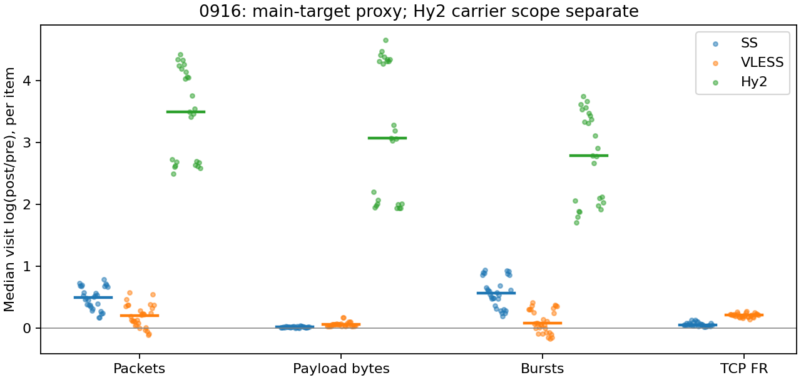

# 0916：全部条目统计

本批次 35 个条目，525 次选定访问。主请求 proxy 汇总仅使用明确路由的可比较观测；所有未进入汇总的条目仍可在下方查看。

## 路由与特征覆盖

| 部署 | 选定访问 | 主请求proxy | 主请求direct | 可计算代理上下文 | DIRECT pre | 提取错误 |
| --- | --- | --- | --- | --- | --- | --- |
| Hy2 | 175 | 125 | 50 | 136 | 100 | 0 |
| SS | 175 | 150 | 25 | 150 | 25 | 0 |
| VLESS | 175 | 150 | 25 | 157 | 25 | 0 |

## 按条目等权汇总的变换

Δ：每条目内先取重复变换中位数，再对条目取中位数。ratio=exp(Δ) 仅用于正尺度指标。MAD 在单次 broad 不定义；+/− 是条目变换方向数，零单独保留在明细中。

| 部署 | scope | 特征 | 条目n | 访问n | Δ中位 | 典型倍率 | 条目MAD中位 | +/− |
| --- | --- | --- | --- | --- | --- | --- | --- | --- |
| Hy2 | carrier_context_envelope | burst_count | 25 | 125 | 2.7814 | 16.142 | 0.089258 | 25/0 |
| Hy2 | carrier_context_envelope | connection_span_concurrency_max | 25 | 125 | -1.7918 | 0.16667 | 0 | 0/25 |
| Hy2 | carrier_context_envelope | cumulative_l1 | 25 | 125 | 0.18257 | — | 0.0070893 | 25/0 |
| Hy2 | carrier_context_envelope | direction_entropy | 25 | 125 | 0.064121 | — | 0.031604 | 14/11 |
| Hy2 | carrier_context_envelope | down_transport_bytes | 25 | 125 | 3.0963 | 22.117 | 0.017209 | 25/0 |
| Hy2 | carrier_context_envelope | duration_s | 25 | 125 | -9.3773e-05 | 0.99991 | 6.1052e-05 | 0/25 |
| Hy2 | carrier_context_envelope | entity_count | 25 | 125 | -2.1972 | 0.11111 | 0 | 0/25 |
| Hy2 | carrier_context_envelope | iat_js | 25 | 125 | 0.37835 | — | 0.016607 | 25/0 |
| Hy2 | carrier_context_envelope | iat_ks | 25 | 125 | 0.52959 | — | 0.022094 | 25/0 |
| Hy2 | carrier_context_envelope | iat_median_us | 25 | 125 | -3.188 | 0.041255 | 0.1977 | 0/25 |
| Hy2 | carrier_context_envelope | iat_us_p95 | 25 | 125 | -5.3182 | 0.0049017 | 0.5384 | 0/25 |
| Hy2 | carrier_context_envelope | iat_wasserstein_log1p_us | 25 | 125 | 3.1756 | — | 0.11077 | 25/0 |
| Hy2 | carrier_context_envelope | ip_bytes | 25 | 125 | 3.0602 | 21.332 | 0.017773 | 25/0 |
| Hy2 | carrier_context_envelope | length_js | 25 | 125 | 0.71745 | — | 0.026201 | 25/0 |
| Hy2 | carrier_context_envelope | length_ks | 25 | 125 | 0.52237 | — | 0.027823 | 25/0 |
| Hy2 | carrier_context_envelope | length_median | 25 | 125 | -0.18998 | 0.82697 | 0.01507 | 11/14 |
| Hy2 | carrier_context_envelope | length_p95 | 25 | 125 | -1.823 | 0.16155 | 0 | 0/25 |
| Hy2 | carrier_context_envelope | length_wasserstein_bytes | 25 | 125 | 1761.1 | — | 112.63 | 25/0 |
| Hy2 | carrier_context_envelope | nonempty_packets | 25 | 125 | 4.0693 | 58.518 | 0.070149 | 25/0 |
| Hy2 | carrier_context_envelope | offload_suspect_fraction | 25 | 125 | -0.29222 | — | 0.021772 | 0/25 |
| Hy2 | carrier_context_envelope | packet_count | 25 | 125 | 3.4958 | 32.977 | 0.070519 | 25/0 |
| Hy2 | carrier_context_envelope | transition_entropy | 25 | 125 | 0.33022 | — | 0.035828 | 25/0 |
| Hy2 | carrier_context_envelope | transport_bytes | 25 | 125 | 3.0683 | 21.505 | 0.018316 | 25/0 |
| Hy2 | carrier_context_envelope | up_byte_fraction | 25 | 125 | -0.013973 | — | 0.0025712 | 6/19 |
| Hy2 | carrier_context_envelope | up_transport_bytes | 25 | 125 | 2.2808 | 9.7844 | 0.15715 | 25/0 |
| SS | exclusive_page | burst_count | 30 | 150 | 0.55925 | 1.7494 | 0.060446 | 30/0 |
| SS | exclusive_page | connection_span_concurrency_max | 30 | 150 | 0 | 1 | 0 | 0/2 |
| SS | exclusive_page | cumulative_l1 | 30 | 150 | 0.0021853 | — | 0.00072798 | 30/0 |
| SS | exclusive_page | direction_entropy | 30 | 150 | -0.21723 | — | 0.028746 | 0/30 |
| SS | exclusive_page | down_transport_bytes | 30 | 150 | 0.010083 | 1.0101 | 0.002391 | 27/3 |
| SS | exclusive_page | duration_s | 30 | 150 | -9.8488e-06 | 0.99999 | 9.5261e-06 | 3/27 |
| SS | exclusive_page | entity_count | 30 | 150 | 0 | 1 | 0 | 0/0 |
| SS | exclusive_page | fr_runs | 30 | 150 | 0.04954 | 1.0508 | 0.024962 | 30/0 |
| SS | exclusive_page | fr_runs_per_packet | 30 | 150 | -0.036304 | — | 0.0085151 | 0/30 |
| SS | exclusive_page | fr_switches | 30 | 150 | 0.053414 | 1.0549 | 0.026816 | 30/0 |
| SS | exclusive_page | fr_switches_per_possible_transition | 30 | 150 | -0.033662 | — | 0.0079348 | 0/30 |
| SS | exclusive_page | full_retransmission_fraction | 30 | 150 | 0.0064671 | — | 0.0024534 | 28/2 |
| SS | exclusive_page | iat_js | 30 | 150 | 0.19959 | — | 0.021336 | 30/0 |
| SS | exclusive_page | iat_ks | 30 | 150 | 0.35855 | — | 0.033215 | 30/0 |
| SS | exclusive_page | iat_median_us | 30 | 150 | 2.821 | 16.793 | 0.23622 | 30/0 |
| SS | exclusive_page | iat_us_p95 | 30 | 150 | -0.95855 | 0.38345 | 0.18443 | 0/30 |
| SS | exclusive_page | iat_wasserstein_log1p_us | 30 | 150 | 1.4456 | — | 0.13224 | 30/0 |
| SS | exclusive_page | ip_bytes | 30 | 150 | 0.047902 | 1.0491 | 0.0048031 | 30/0 |
| SS | exclusive_page | length_js | 30 | 150 | 0.34833 | — | 0.02336 | 30/0 |
| SS | exclusive_page | length_ks | 30 | 150 | 0.47238 | — | 0.018444 | 30/0 |
| SS | exclusive_page | length_median | 30 | 150 | -0.63252 | 0.53125 | 0 | 5/25 |
| SS | exclusive_page | length_p95 | 30 | 150 | -0.62291 | 0.53638 | 0 | 0/30 |
| SS | exclusive_page | length_wasserstein_bytes | 30 | 150 | 901.24 | — | 113.25 | 30/0 |
| SS | exclusive_page | nonempty_packets | 30 | 150 | 0.4714 | 1.6022 | 0.061552 | 30/0 |
| SS | exclusive_page | offload_suspect_fraction | 30 | 150 | -0.17378 | — | 0.013741 | 0/30 |
| SS | exclusive_page | packet_count | 30 | 150 | 0.49367 | 1.6383 | 0.048306 | 30/0 |
| SS | exclusive_page | rtt_median_ms | 30 | 150 | 6.3258 | 558.82 | 0.15392 | 30/0 |
| SS | exclusive_page | transition_entropy | 30 | 150 | -0.12742 | — | 0.019987 | 0/30 |
| SS | exclusive_page | transport_bytes | 30 | 150 | 0.019171 | 1.0194 | 0.0025234 | 30/0 |
| SS | exclusive_page | up_byte_fraction | 30 | 150 | 0.0059501 | — | 0.0012626 | 30/0 |
| SS | exclusive_page | up_transport_bytes | 30 | 150 | 0.17786 | 1.1947 | 0.030264 | 30/0 |
| VLESS | exclusive_page | burst_count | 30 | 150 | 0.07398 | 1.0768 | 0.095967 | 21/8 |
| VLESS | exclusive_page | connection_span_concurrency_max | 30 | 150 | 0 | 1 | 0 | 0/0 |
| VLESS | exclusive_page | cumulative_l1 | 30 | 150 | 0.0031495 | — | 0.00093643 | 30/0 |
| VLESS | exclusive_page | direction_entropy | 30 | 150 | -0.059842 | — | 0.016372 | 2/28 |
| VLESS | exclusive_page | down_transport_bytes | 30 | 150 | 0.046143 | 1.0472 | 0.0031981 | 30/0 |
| VLESS | exclusive_page | duration_s | 30 | 150 | -0.00052078 | 0.99948 | 0.00017087 | 0/30 |
| VLESS | exclusive_page | entity_count | 30 | 150 | 0 | 1 | 0 | 0/0 |
| VLESS | exclusive_page | fr_runs | 30 | 150 | 0.20897 | 1.2324 | 0.014851 | 30/0 |
| VLESS | exclusive_page | fr_runs_per_packet | 30 | 150 | 0.0033139 | — | 0.005536 | 19/11 |
| VLESS | exclusive_page | fr_switches | 30 | 150 | 0.22988 | 1.2584 | 0.019585 | 30/0 |
| VLESS | exclusive_page | fr_switches_per_possible_transition | 30 | 150 | 0.0051018 | — | 0.0053327 | 19/11 |
| VLESS | exclusive_page | full_retransmission_fraction | 30 | 150 | -0.00075142 | — | 0.00035139 | 2/20 |
| VLESS | exclusive_page | iat_js | 30 | 150 | 0.076912 | — | 0.013243 | 30/0 |
| VLESS | exclusive_page | iat_ks | 30 | 150 | 0.14656 | — | 0.030144 | 30/0 |
| VLESS | exclusive_page | iat_median_us | 30 | 150 | 0.12325 | 1.1312 | 0.38637 | 17/13 |
| VLESS | exclusive_page | iat_us_p95 | 30 | 150 | 1.106 | 3.0224 | 0.33279 | 28/2 |
| VLESS | exclusive_page | iat_wasserstein_log1p_us | 30 | 150 | 0.79372 | — | 0.10547 | 30/0 |
| VLESS | exclusive_page | ip_bytes | 30 | 150 | 0.060561 | 1.0624 | 0.0087696 | 30/0 |
| VLESS | exclusive_page | length_js | 30 | 150 | 0.050631 | — | 0.01177 | 30/0 |
| VLESS | exclusive_page | length_ks | 30 | 150 | 0.14454 | — | 0.032912 | 30/0 |
| VLESS | exclusive_page | length_median | 30 | 150 | 0 | 1 | 0.16311 | 12/14 |
| VLESS | exclusive_page | length_p95 | 30 | 150 | -0.025176 | 0.97514 | 0.00248 | 0/19 |
| VLESS | exclusive_page | length_wasserstein_bytes | 30 | 150 | 284.37 | — | 75.74 | 30/0 |
| VLESS | exclusive_page | nonempty_packets | 30 | 150 | 0.15664 | 1.1696 | 0.043529 | 26/4 |
| VLESS | exclusive_page | offload_suspect_fraction | 30 | 150 | -0.046106 | — | 0.013467 | 1/29 |
| VLESS | exclusive_page | packet_count | 30 | 150 | 0.20218 | 1.2241 | 0.063637 | 25/5 |
| VLESS | exclusive_page | rtt_median_ms | 30 | 150 | 0.079776 | 1.083 | 0.50512 | 15/15 |
| VLESS | exclusive_page | transition_entropy | 30 | 150 | -0.0032565 | — | 0.017098 | 13/17 |
| VLESS | exclusive_page | transport_bytes | 30 | 150 | 0.057094 | 1.0588 | 0.0039363 | 30/0 |
| VLESS | exclusive_page | up_byte_fraction | 30 | 150 | 0.0085859 | — | 0.00094735 | 28/2 |
| VLESS | exclusive_page | up_transport_bytes | 30 | 150 | 0.34678 | 1.4145 | 0.014637 | 30/0 |

## 全部条目索引

| 序号 | 域名 | 业务标签 | 目标URL | 详细报告 |
| --- | --- | --- | --- | --- |
| 0 | youtube.com | youtube.com::video_playback | https://www.youtube.com/watch?v=sAWK0mgrMp4 | [打开](items/0916/000-d932ac8d522d98ff.md) |
| 1 | youtube.com | youtube.com::video_playback | https://www.youtube.com/watch?v=aircAruvnKk | [打开](items/0916/001-9ccf5734891877d5.md) |
| 2 | youtube.com | youtube.com::video_playback | https://www.youtube.com/watch?v=aqz-KE-bpKQ | [打开](items/0916/002-728ea2e75f01c90e.md) |
| 3 | youtube.com | youtube.com::video_playback | https://www.youtube.com/watch?v=eRsGyueVLvQ | [打开](items/0916/003-14300581fd1a0d83.md) |
| 4 | youtube.com | youtube.com::video_playback | https://www.youtube.com/watch?v=R6MlUcmOul8 | [打开](items/0916/004-f88aab46dba5c500.md) |
| 5 | wikipedia.org | wikipedia.org::article_view | https://en.wikipedia.org/wiki/Computer_network | [打开](items/0916/005-1fce546ae60ecb0f.md) |
| 6 | wikipedia.org | wikipedia.org::article_view | https://en.wikipedia.org/wiki/Transmission_Control_Protocol | [打开](items/0916/006-e0920e755d03f117.md) |
| 7 | wikipedia.org | wikipedia.org::article_view | https://en.wikipedia.org/wiki/Domain_Name_System | [打开](items/0916/007-c741301b85b865ba.md) |
| 8 | wikipedia.org | wikipedia.org::article_view | https://en.wikipedia.org/wiki/Transport_Layer_Security | [打开](items/0916/008-e0f986e6d3b73440.md) |
| 9 | wikipedia.org | wikipedia.org::article_view | https://en.wikipedia.org/wiki/Hypertext_Transfer_Protocol | [打开](items/0916/009-5a152f3565bd1248.md) |
| 10 | developer.mozilla.org | developer.mozilla.org::document_view | https://developer.mozilla.org/en-US/docs/Web/HTTP | [打开](items/0916/010-0b6a8e16e43dc3dd.md) |
| 11 | developer.mozilla.org | developer.mozilla.org::document_view | https://developer.mozilla.org/en-US/docs/Web/HTTP/Guides/Overview | [打开](items/0916/011-332fb4c1850dbc98.md) |
| 12 | developer.mozilla.org | developer.mozilla.org::document_view | https://developer.mozilla.org/en-US/docs/Web/HTTP/Guides/Caching | [打开](items/0916/012-2933f525b7b2f7f0.md) |
| 13 | developer.mozilla.org | developer.mozilla.org::document_view | https://developer.mozilla.org/en-US/docs/Web/HTTP/Guides/Cookies | [打开](items/0916/013-6ca4f86817855e8d.md) |
| 14 | developer.mozilla.org | developer.mozilla.org::document_view | https://developer.mozilla.org/en-US/docs/Web/API/Fetch_API | [打开](items/0916/014-68874ddd81c85c66.md) |
| 15 | github.com | github.com::repository_view | https://github.com/RakuLomis/TrafficTracer | [打开](items/0916/015-57c5dd466efa0b23.md) |
| 16 | github.com | github.com::repository_view | https://github.com/python/cpython | [打开](items/0916/016-515737294522d769.md) |
| 17 | github.com | github.com::repository_view | https://github.com/pallets/flask | [打开](items/0916/017-867150d5228c4b25.md) |
| 18 | github.com | github.com::repository_view | https://github.com/numpy/numpy | [打开](items/0916/018-a61e83fc06b09a37.md) |
| 19 | github.com | github.com::repository_view | https://github.com/scikit-learn/scikit-learn | [打开](items/0916/019-0ad60f4a0b281497.md) |
| 20 | bing.com | bing.com::search_results_view | https://www.bing.com/search?q=network+traffic+analysis | [打开](items/0916/020-936d97b21da57969.md) |
| 21 | bing.com | bing.com::search_results_view | https://www.bing.com/search?q=sourdough+bread+recipe | [打开](items/0916/021-ccba4ef3798580f3.md) |
| 22 | bing.com | bing.com::search_results_view | https://www.bing.com/search?q=beginner+guitar+chords | [打开](items/0916/022-3c617a3431f9c1b9.md) |
| 23 | bing.com | bing.com::search_results_view | https://www.bing.com/search?q=indoor+plant+care | [打开](items/0916/023-2cd603c0787b467b.md) |
| 24 | bing.com | bing.com::search_results_view | https://www.bing.com/search?q=solar+system+facts | [打开](items/0916/024-7b5bc1f17020cd47.md) |
| 25 | youtube.com | youtube.com::search_results_view | https://www.youtube.com/results?search_query=watercolor+tutorial | [打开](items/0916/025-935cad15f49f3ff7.md) |
| 26 | youtube.com | youtube.com::search_results_view | https://www.youtube.com/results?search_query=bicycle+maintenance | [打开](items/0916/026-f6c246c8096716eb.md) |
| 27 | youtube.com | youtube.com::search_results_view | https://www.youtube.com/results?search_query=piano+practice | [打开](items/0916/027-4e9ad2b48947194b.md) |
| 28 | youtube.com | youtube.com::search_results_view | https://www.youtube.com/results?search_query=bread+baking | [打开](items/0916/028-d9e36e35c4a9c19c.md) |
| 29 | youtube.com | youtube.com::search_results_view | https://www.youtube.com/results?search_query=astronomy+documentary | [打开](items/0916/029-cc582f1d14ae7fba.md) |
| 30 | bilibili.com | bilibili.com::video_playback | https://www.bilibili.com/video/BV1hu4m1P7Mu/ | [打开](items/0916/030-7e420a997afe3a95.md) |
| 31 | bilibili.com | bilibili.com::video_playback | https://www.bilibili.com/video/BV1HEf2YWEvs/ | [打开](items/0916/031-879db5089bd4266d.md) |
| 32 | bilibili.com | bilibili.com::video_playback | https://www.bilibili.com/video/BV1pW411J7s8/ | [打开](items/0916/032-4a61dba33783383f.md) |
| 33 | bilibili.com | bilibili.com::video_playback | https://www.bilibili.com/video/BV1ys411472E/?p=2 | [打开](items/0916/033-8b49b533c37bb561.md) |
| 34 | bilibili.com | bilibili.com::video_playback | https://www.bilibili.com/video/BV1o4411D7vm/ | [打开](items/0916/034-49e62ea2152a528a.md) |
