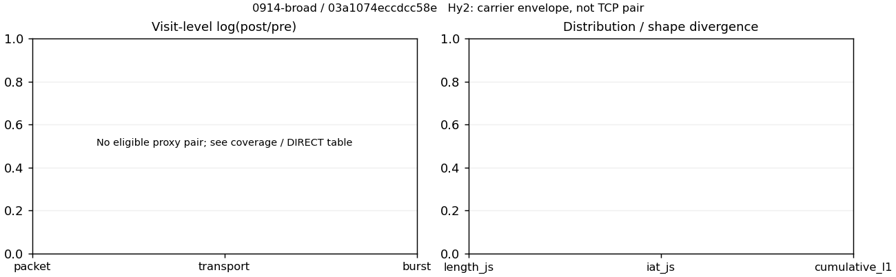

# 0914-broad · 条目 000 · bilibili.com

目标：https://www.bilibili.com/

活动标签：bilibili.com::page_load。选定访问 3 次。

[返回总索引](../../README.md) · [统计口径](../../methods.md)

## 覆盖与资格（每次访问均保留）

| 部署 | 重复 | 主请求路由 | 活动状态 | 代理比较 | DIRECT pre | 请求 proxy/direct/unresolved | 错误 |
| --- | --- | --- | --- | --- | --- | --- | --- |
| Hy2 | 1 | direct | passed | 0 | 1 | 0/175/0 | [] |
| SS | 1 | direct | passed | 0 | 1 | 0/180/0 | [] |
| VLESS | 1 | direct | passed | 0 | 1 | 0/179/0 | [] |

主请求非 proxy 的统计仅解释为已索引的辅助代理连接或 DIRECT 观测，不代表目标业务经代理传输。播放确认与配对资格是两道不同的门。

图中散点为单次访问，短线为重复中位数；Hy2 是共享载体包络，不能与 TCP 配对作等范围因果对比。

形态图先逐访问归一化，再对访问等权平均；实线 pre，虚线 post。分箱序号及边界见 methods，不将分箱索引误解为长度或时间。

## 每次访问的关键观测

### SS

范围：`direct_pre_only`。每格 pre → post；空值为不可观测/不适用。

| 重复 | 包数 | 载荷字节 | burst | TCP FR | IAT中位µs | length JS | IAT JS |
| --- | --- | --- | --- | --- | --- | --- | --- |
| 1 | 1512 → — | 1.893e+06 → — | 940 → — | 271 → — | 190.97 → — | — | — |

完整标量统计：中位数 [min,max]；Δ 为重复内逐访问变换的中位数，MAD 未缩放。n 为可用变换数；DIRECT-only 的 nΔ=0 不代表 pre 不可用。

| scope | 特征 | pre | post | Δ | IQRΔ | MADΔ | nΔ |
| --- | --- | --- | --- | --- | --- | --- | --- |
| direct_pre_only | active_span_sum_s_1000ms | 29.105 [29.105, 29.105] | — | — | — | — | 0 |
| direct_pre_only | active_span_sum_s_100ms | 7.7787 [7.7787, 7.7787] | — | — | — | — | 0 |
| direct_pre_only | active_span_sum_s_500ms | 14.217 [14.217, 14.217] | — | — | — | — | 0 |
| direct_pre_only | burst_bytes_iqr | 1240 [1240, 1240] | — | — | — | — | 0 |
| direct_pre_only | burst_bytes_mad | 83 [83, 83] | — | — | — | — | 0 |
| direct_pre_only | burst_bytes_max | 29324 [29324, 29324] | — | — | — | — | 0 |
| direct_pre_only | burst_bytes_mean | 2013.9 [2013.9, 2013.9] | — | — | — | — | 0 |
| direct_pre_only | burst_bytes_median | 83 [83, 83] | — | — | — | — | 0 |
| direct_pre_only | burst_bytes_min | 0 [0, 0] | — | — | — | — | 0 |
| direct_pre_only | burst_bytes_p95 | 12852 [12852, 12852] | — | — | — | — | 0 |
| direct_pre_only | burst_bytes_q25 | 0 [0, 0] | — | — | — | — | 0 |
| direct_pre_only | burst_bytes_q75 | 1240 [1240, 1240] | — | — | — | — | 0 |
| direct_pre_only | burst_bytes_std | 4445.3 [4445.3, 4445.3] | — | — | — | — | 0 |
| direct_pre_only | burst_count | 940 [940, 940] | — | — | — | — | 0 |
| direct_pre_only | burst_duration_ms_iqr | 9.858 [9.858, 9.858] | — | — | — | — | 0 |
| direct_pre_only | burst_duration_ms_mad | 0 [0, 0] | — | — | — | — | 0 |
| direct_pre_only | burst_duration_ms_max | 4451.8 [4451.8, 4451.8] | — | — | — | — | 0 |
| direct_pre_only | burst_duration_ms_mean | 86.23 [86.23, 86.23] | — | — | — | — | 0 |
| direct_pre_only | burst_duration_ms_median | 0 [0, 0] | — | — | — | — | 0 |
| direct_pre_only | burst_duration_ms_min | 0 [0, 0] | — | — | — | — | 0 |
| direct_pre_only | burst_duration_ms_p95 | 336.86 [336.86, 336.86] | — | — | — | — | 0 |
| direct_pre_only | burst_duration_ms_q25 | 0 [0, 0] | — | — | — | — | 0 |
| direct_pre_only | burst_duration_ms_q75 | 9.858 [9.858, 9.858] | — | — | — | — | 0 |
| direct_pre_only | burst_duration_ms_std | 423.37 [423.37, 423.37] | — | — | — | — | 0 |
| direct_pre_only | burst_packets_iqr | 1 [1, 1] | — | — | — | — | 0 |
| direct_pre_only | burst_packets_mad | 0 [0, 0] | — | — | — | — | 0 |
| direct_pre_only | burst_packets_max | 7 [7, 7] | — | — | — | — | 0 |
| direct_pre_only | burst_packets_mean | 1.6085 [1.6085, 1.6085] | — | — | — | — | 0 |
| direct_pre_only | burst_packets_median | 1 [1, 1] | — | — | — | — | 0 |
| direct_pre_only | burst_packets_min | 1 [1, 1] | — | — | — | — | 0 |
| direct_pre_only | burst_packets_p95 | 3 [3, 3] | — | — | — | — | 0 |
| direct_pre_only | burst_packets_q25 | 1 [1, 1] | — | — | — | — | 0 |
| direct_pre_only | burst_packets_q75 | 2 [2, 2] | — | — | — | — | 0 |
| direct_pre_only | burst_packets_std | 0.88842 [0.88842, 0.88842] | — | — | — | — | 0 |
| direct_pre_only | connection_span_concurrency_max | 18 [18, 18] | — | — | — | — | 0 |
| direct_pre_only | direction_entropy | 0.91499 [0.91499, 0.91499] | — | — | — | — | 0 |
| direct_pre_only | down_burst_count | 458 [458, 458] | — | — | — | — | 0 |
| direct_pre_only | down_ip_bytes | 1.7378e+06 [1.7378e+06, 1.7378e+06] | — | — | — | — | 0 |
| direct_pre_only | down_packets | 849 [849, 849] | — | — | — | — | 0 |
| direct_pre_only | down_transport_bytes | 1.6934e+06 [1.6934e+06, 1.6934e+06] | — | — | — | — | 0 |
| direct_pre_only | duration_s | 17.977 [17.977, 17.977] | — | — | — | — | 0 |
| direct_pre_only | entity_count | 24 [24, 24] | — | — | — | — | 0 |
| direct_pre_only | fr_runs | 271 [271, 271] | — | — | — | — | 0 |
| direct_pre_only | fr_runs_per_packet | 0.33252 [0.33252, 0.33252] | — | — | — | — | 0 |
| direct_pre_only | fr_switches | 247 [247, 247] | — | — | — | — | 0 |
| direct_pre_only | fr_switches_per_possible_transition | 0.31226 [0.31226, 0.31226] | — | — | — | — | 0 |
| direct_pre_only | full_retransmission_fraction | 0.0046296 [0.0046296, 0.0046296] | — | — | — | — | 0 |
| direct_pre_only | full_retransmission_packets | 7 [7, 7] | — | — | — | — | 0 |
| direct_pre_only | iat_count | 1488 [1488, 1488] | — | — | — | — | 0 |
| direct_pre_only | iat_median_us | 190.97 [190.97, 190.97] | — | — | — | — | 0 |
| direct_pre_only | iat_us_iqr | 2744.1 [2744.1, 2744.1] | — | — | — | — | 0 |
| direct_pre_only | iat_us_mad | 181.8 [181.8, 181.8] | — | — | — | — | 0 |
| direct_pre_only | iat_us_max | 4.4518e+06 [4.4518e+06, 4.4518e+06] | — | — | — | — | 0 |
| direct_pre_only | iat_us_mean | 57165 [57165, 57165] | — | — | — | — | 0 |
| direct_pre_only | iat_us_median | 190.97 [190.97, 190.97] | — | — | — | — | 0 |
| direct_pre_only | iat_us_min | 1.18 [1.18, 1.18] | — | — | — | — | 0 |
| direct_pre_only | iat_us_p95 | 76150 [76150, 76150] | — | — | — | — | 0 |
| direct_pre_only | iat_us_q25 | 35.403 [35.403, 35.403] | — | — | — | — | 0 |
| direct_pre_only | iat_us_q75 | 2779.5 [2779.5, 2779.5] | — | — | — | — | 0 |
| direct_pre_only | iat_us_std | 3.3989e+05 [3.3989e+05, 3.3989e+05] | — | — | — | — | 0 |
| direct_pre_only | idle_gap_count_1000ms | 23 [23, 23] | — | — | — | — | 0 |
| direct_pre_only | idle_gap_count_100ms | 68 [68, 68] | — | — | — | — | 0 |
| direct_pre_only | idle_gap_count_500ms | 42 [42, 42] | — | — | — | — | 0 |
| direct_pre_only | idle_gap_sum_s_1000ms | 55.956 [55.956, 55.956] | — | — | — | — | 0 |
| direct_pre_only | idle_gap_sum_s_100ms | 77.282 [77.282, 77.282] | — | — | — | — | 0 |
| direct_pre_only | idle_gap_sum_s_500ms | 70.844 [70.844, 70.844] | — | — | — | — | 0 |
| direct_pre_only | ip_bytes | 1.9721e+06 [1.9721e+06, 1.9721e+06] | — | — | — | — | 0 |
| direct_pre_only | length_iqr | 2674 [2674, 2674] | — | — | — | — | 0 |
| direct_pre_only | length_mad | 1028 [1028, 1028] | — | — | — | — | 0 |
| direct_pre_only | length_max | 8948 [8948, 8948] | — | — | — | — | 0 |
| direct_pre_only | length_mean | 2322.7 [2322.7, 2322.7] | — | — | — | — | 0 |
| direct_pre_only | length_median | 1117 [1117, 1117] | — | — | — | — | 0 |
| direct_pre_only | length_min | 31 [31, 31] | — | — | — | — | 0 |
| direct_pre_only | length_p95 | 8920 [8920, 8920] | — | — | — | — | 0 |
| direct_pre_only | length_q25 | 206 [206, 206] | — | — | — | — | 0 |
| direct_pre_only | length_q75 | 2880 [2880, 2880] | — | — | — | — | 0 |
| direct_pre_only | length_std | 2816.9 [2816.9, 2816.9] | — | — | — | — | 0 |
| direct_pre_only | nonempty_entity_count | 24 [24, 24] | — | — | — | — | 0 |
| direct_pre_only | nonempty_packets | 815 [815, 815] | — | — | — | — | 0 |
| direct_pre_only | offload_suspect_fraction | 0.22288 [0.22288, 0.22288] | — | — | — | — | 0 |
| direct_pre_only | packet_count | 1512 [1512, 1512] | — | — | — | — | 0 |
| direct_pre_only | rtt_median_ms | 0.11077 [0.11077, 0.11077] | — | — | — | — | 0 |
| direct_pre_only | rtt_sample_count | 647 [647, 647] | — | — | — | — | 0 |
| direct_pre_only | tcp_ack_count | 1486 [1486, 1486] | — | — | — | — | 0 |
| direct_pre_only | tcp_fin_count | 46 [46, 46] | — | — | — | — | 0 |
| direct_pre_only | tcp_packet_count | 1512 [1512, 1512] | — | — | — | — | 0 |
| direct_pre_only | tcp_rst_count | 2 [2, 2] | — | — | — | — | 0 |
| direct_pre_only | tcp_syn_count | 48 [48, 48] | — | — | — | — | 0 |
| direct_pre_only | tcp_window_raw_median | 65455 [65455, 65455] | — | — | — | — | 0 |
| direct_pre_only | transition_entropy | 0.83425 [0.83425, 0.83425] | — | — | — | — | 0 |
| direct_pre_only | transition_n_mm | 411 [411, 411] | — | — | — | — | 0 |
| direct_pre_only | transition_n_mp | 112 [112, 112] | — | — | — | — | 0 |
| direct_pre_only | transition_n_pm | 135 [135, 135] | — | — | — | — | 0 |
| direct_pre_only | transition_n_pp | 133 [133, 133] | — | — | — | — | 0 |
| direct_pre_only | transition_p_mm | 0.78585 [0.78585, 0.78585] | — | — | — | — | 0 |
| direct_pre_only | transition_p_mp | 0.21415 [0.21415, 0.21415] | — | — | — | — | 0 |
| direct_pre_only | transition_p_pm | 0.50373 [0.50373, 0.50373] | — | — | — | — | 0 |
| direct_pre_only | transition_p_pp | 0.49627 [0.49627, 0.49627] | — | — | — | — | 0 |
| direct_pre_only | transport_bytes | 1.893e+06 [1.893e+06, 1.893e+06] | — | — | — | — | 0 |
| direct_pre_only | up_burst_count | 482 [482, 482] | — | — | — | — | 0 |
| direct_pre_only | up_byte_fraction | 0.10543 [0.10543, 0.10543] | — | — | — | — | 0 |
| direct_pre_only | up_ip_bytes | 2.3432e+05 [2.3432e+05, 2.3432e+05] | — | — | — | — | 0 |
| direct_pre_only | up_packets | 663 [663, 663] | — | — | — | — | 0 |
| direct_pre_only | up_transport_bytes | 1.9959e+05 [1.9959e+05, 1.9959e+05] | — | — | — | — | 0 |
| direct_pre_only | zero_iat_count | 0 [0, 0] | — | — | — | — | 0 |
| direct_pre_only | zero_iat_fraction | 0 [0, 0] | — | — | — | — | 0 |

### VLESS

范围：`direct_pre_only`。每格 pre → post；空值为不可观测/不适用。

| 重复 | 包数 | 载荷字节 | burst | TCP FR | IAT中位µs | length JS | IAT JS |
| --- | --- | --- | --- | --- | --- | --- | --- |
| 1 | 1728 → — | 2.2618e+06 → — | 1068 → — | 331 → — | 164.46 → — | — | — |

完整标量统计：中位数 [min,max]；Δ 为重复内逐访问变换的中位数，MAD 未缩放。n 为可用变换数；DIRECT-only 的 nΔ=0 不代表 pre 不可用。

| scope | 特征 | pre | post | Δ | IQRΔ | MADΔ | nΔ |
| --- | --- | --- | --- | --- | --- | --- | --- |
| direct_pre_only | active_span_sum_s_1000ms | 25.798 [25.798, 25.798] | — | — | — | — | 0 |
| direct_pre_only | active_span_sum_s_100ms | 9.2522 [9.2522, 9.2522] | — | — | — | — | 0 |
| direct_pre_only | active_span_sum_s_500ms | 13.645 [13.645, 13.645] | — | — | — | — | 0 |
| direct_pre_only | burst_bytes_iqr | 1459 [1459, 1459] | — | — | — | — | 0 |
| direct_pre_only | burst_bytes_mad | 86 [86, 86] | — | — | — | — | 0 |
| direct_pre_only | burst_bytes_max | 23612 [23612, 23612] | — | — | — | — | 0 |
| direct_pre_only | burst_bytes_mean | 2117.8 [2117.8, 2117.8] | — | — | — | — | 0 |
| direct_pre_only | burst_bytes_median | 86 [86, 86] | — | — | — | — | 0 |
| direct_pre_only | burst_bytes_min | 0 [0, 0] | — | — | — | — | 0 |
| direct_pre_only | burst_bytes_p95 | 14230 [14230, 14230] | — | — | — | — | 0 |
| direct_pre_only | burst_bytes_q25 | 0 [0, 0] | — | — | — | — | 0 |
| direct_pre_only | burst_bytes_q75 | 1459 [1459, 1459] | — | — | — | — | 0 |
| direct_pre_only | burst_bytes_std | 4629.7 [4629.7, 4629.7] | — | — | — | — | 0 |
| direct_pre_only | burst_count | 1068 [1068, 1068] | — | — | — | — | 0 |
| direct_pre_only | burst_duration_ms_iqr | 4.717 [4.717, 4.717] | — | — | — | — | 0 |
| direct_pre_only | burst_duration_ms_mad | 0 [0, 0] | — | — | — | — | 0 |
| direct_pre_only | burst_duration_ms_max | 4626.8 [4626.8, 4626.8] | — | — | — | — | 0 |
| direct_pre_only | burst_duration_ms_mean | 68.458 [68.458, 68.458] | — | — | — | — | 0 |
| direct_pre_only | burst_duration_ms_median | 0 [0, 0] | — | — | — | — | 0 |
| direct_pre_only | burst_duration_ms_min | 0 [0, 0] | — | — | — | — | 0 |
| direct_pre_only | burst_duration_ms_p95 | 87.281 [87.281, 87.281] | — | — | — | — | 0 |
| direct_pre_only | burst_duration_ms_q25 | 0 [0, 0] | — | — | — | — | 0 |
| direct_pre_only | burst_duration_ms_q75 | 4.717 [4.717, 4.717] | — | — | — | — | 0 |
| direct_pre_only | burst_duration_ms_std | 404.18 [404.18, 404.18] | — | — | — | — | 0 |
| direct_pre_only | burst_packets_iqr | 1 [1, 1] | — | — | — | — | 0 |
| direct_pre_only | burst_packets_mad | 0 [0, 0] | — | — | — | — | 0 |
| direct_pre_only | burst_packets_max | 11 [11, 11] | — | — | — | — | 0 |
| direct_pre_only | burst_packets_mean | 1.618 [1.618, 1.618] | — | — | — | — | 0 |
| direct_pre_only | burst_packets_median | 1 [1, 1] | — | — | — | — | 0 |
| direct_pre_only | burst_packets_min | 1 [1, 1] | — | — | — | — | 0 |
| direct_pre_only | burst_packets_p95 | 3 [3, 3] | — | — | — | — | 0 |
| direct_pre_only | burst_packets_q25 | 1 [1, 1] | — | — | — | — | 0 |
| direct_pre_only | burst_packets_q75 | 2 [2, 2] | — | — | — | — | 0 |
| direct_pre_only | burst_packets_std | 0.87202 [0.87202, 0.87202] | — | — | — | — | 0 |
| direct_pre_only | connection_span_concurrency_max | 18 [18, 18] | — | — | — | — | 0 |
| direct_pre_only | direction_entropy | 0.90743 [0.90743, 0.90743] | — | — | — | — | 0 |
| direct_pre_only | down_burst_count | 518 [518, 518] | — | — | — | — | 0 |
| direct_pre_only | down_ip_bytes | 2.078e+06 [2.078e+06, 2.078e+06] | — | — | — | — | 0 |
| direct_pre_only | down_packets | 977 [977, 977] | — | — | — | — | 0 |
| direct_pre_only | down_transport_bytes | 2.027e+06 [2.027e+06, 2.027e+06] | — | — | — | — | 0 |
| direct_pre_only | duration_s | 17.416 [17.416, 17.416] | — | — | — | — | 0 |
| direct_pre_only | entity_count | 32 [32, 32] | — | — | — | — | 0 |
| direct_pre_only | fr_runs | 331 [331, 331] | — | — | — | — | 0 |
| direct_pre_only | fr_runs_per_packet | 0.35978 [0.35978, 0.35978] | — | — | — | — | 0 |
| direct_pre_only | fr_switches | 299 [299, 299] | — | — | — | — | 0 |
| direct_pre_only | fr_switches_per_possible_transition | 0.33671 [0.33671, 0.33671] | — | — | — | — | 0 |
| direct_pre_only | full_retransmission_fraction | 0.005787 [0.005787, 0.005787] | — | — | — | — | 0 |
| direct_pre_only | full_retransmission_packets | 10 [10, 10] | — | — | — | — | 0 |
| direct_pre_only | iat_count | 1696 [1696, 1696] | — | — | — | — | 0 |
| direct_pre_only | iat_median_us | 164.46 [164.46, 164.46] | — | — | — | — | 0 |
| direct_pre_only | iat_us_iqr | 2303.3 [2303.3, 2303.3] | — | — | — | — | 0 |
| direct_pre_only | iat_us_mad | 156.3 [156.3, 156.3] | — | — | — | — | 0 |
| direct_pre_only | iat_us_max | 4.6268e+06 [4.6268e+06, 4.6268e+06] | — | — | — | — | 0 |
| direct_pre_only | iat_us_mean | 48047 [48047, 48047] | — | — | — | — | 0 |
| direct_pre_only | iat_us_median | 164.46 [164.46, 164.46] | — | — | — | — | 0 |
| direct_pre_only | iat_us_min | 2.164 [2.164, 2.164] | — | — | — | — | 0 |
| direct_pre_only | iat_us_p95 | 62817 [62817, 62817] | — | — | — | — | 0 |
| direct_pre_only | iat_us_q25 | 31.822 [31.822, 31.822] | — | — | — | — | 0 |
| direct_pre_only | iat_us_q75 | 2335.1 [2335.1, 2335.1] | — | — | — | — | 0 |
| direct_pre_only | iat_us_std | 3.4182e+05 [3.4182e+05, 3.4182e+05] | — | — | — | — | 0 |
| direct_pre_only | idle_gap_count_1000ms | 17 [17, 17] | — | — | — | — | 0 |
| direct_pre_only | idle_gap_count_100ms | 53 [53, 53] | — | — | — | — | 0 |
| direct_pre_only | idle_gap_count_500ms | 33 [33, 33] | — | — | — | — | 0 |
| direct_pre_only | idle_gap_sum_s_1000ms | 55.69 [55.69, 55.69] | — | — | — | — | 0 |
| direct_pre_only | idle_gap_sum_s_100ms | 72.236 [72.236, 72.236] | — | — | — | — | 0 |
| direct_pre_only | idle_gap_sum_s_500ms | 67.843 [67.843, 67.843] | — | — | — | — | 0 |
| direct_pre_only | ip_bytes | 2.3523e+06 [2.3523e+06, 2.3523e+06] | — | — | — | — | 0 |
| direct_pre_only | length_iqr | 2585 [2585, 2585] | — | — | — | — | 0 |
| direct_pre_only | length_mad | 1218 [1218, 1218] | — | — | — | — | 0 |
| direct_pre_only | length_max | 8948 [8948, 8948] | — | — | — | — | 0 |
| direct_pre_only | length_mean | 2458.5 [2458.5, 2458.5] | — | — | — | — | 0 |
| direct_pre_only | length_median | 1307 [1307, 1307] | — | — | — | — | 0 |
| direct_pre_only | length_min | 31 [31, 31] | — | — | — | — | 0 |
| direct_pre_only | length_p95 | 8920 [8920, 8920] | — | — | — | — | 0 |
| direct_pre_only | length_q25 | 295 [295, 295] | — | — | — | — | 0 |
| direct_pre_only | length_q75 | 2880 [2880, 2880] | — | — | — | — | 0 |
| direct_pre_only | length_std | 2816.9 [2816.9, 2816.9] | — | — | — | — | 0 |
| direct_pre_only | nonempty_entity_count | 32 [32, 32] | — | — | — | — | 0 |
| direct_pre_only | nonempty_packets | 920 [920, 920] | — | — | — | — | 0 |
| direct_pre_only | offload_suspect_fraction | 0.24884 [0.24884, 0.24884] | — | — | — | — | 0 |
| direct_pre_only | packet_count | 1728 [1728, 1728] | — | — | — | — | 0 |
| direct_pre_only | rtt_median_ms | 0.11748 [0.11748, 0.11748] | — | — | — | — | 0 |
| direct_pre_only | rtt_sample_count | 753 [753, 753] | — | — | — | — | 0 |
| direct_pre_only | tcp_ack_count | 1694 [1694, 1694] | — | — | — | — | 0 |
| direct_pre_only | tcp_fin_count | 64 [64, 64] | — | — | — | — | 0 |
| direct_pre_only | tcp_packet_count | 1728 [1728, 1728] | — | — | — | — | 0 |
| direct_pre_only | tcp_rst_count | 2 [2, 2] | — | — | — | — | 0 |
| direct_pre_only | tcp_syn_count | 64 [64, 64] | — | — | — | — | 0 |
| direct_pre_only | tcp_window_raw_median | 65504 [65504, 65504] | — | — | — | — | 0 |
| direct_pre_only | transition_entropy | 0.84455 [0.84455, 0.84455] | — | — | — | — | 0 |
| direct_pre_only | transition_n_mm | 458 [458, 458] | — | — | — | — | 0 |
| direct_pre_only | transition_n_mp | 134 [134, 134] | — | — | — | — | 0 |
| direct_pre_only | transition_n_pm | 165 [165, 165] | — | — | — | — | 0 |
| direct_pre_only | transition_n_pp | 131 [131, 131] | — | — | — | — | 0 |
| direct_pre_only | transition_p_mm | 0.77365 [0.77365, 0.77365] | — | — | — | — | 0 |
| direct_pre_only | transition_p_mp | 0.22635 [0.22635, 0.22635] | — | — | — | — | 0 |
| direct_pre_only | transition_p_pm | 0.55743 [0.55743, 0.55743] | — | — | — | — | 0 |
| direct_pre_only | transition_p_pp | 0.44257 [0.44257, 0.44257] | — | — | — | — | 0 |
| direct_pre_only | transport_bytes | 2.2618e+06 [2.2618e+06, 2.2618e+06] | — | — | — | — | 0 |
| direct_pre_only | up_burst_count | 550 [550, 550] | — | — | — | — | 0 |
| direct_pre_only | up_byte_fraction | 0.10384 [0.10384, 0.10384] | — | — | — | — | 0 |
| direct_pre_only | up_ip_bytes | 2.7428e+05 [2.7428e+05, 2.7428e+05] | — | — | — | — | 0 |
| direct_pre_only | up_packets | 751 [751, 751] | — | — | — | — | 0 |
| direct_pre_only | up_transport_bytes | 2.3488e+05 [2.3488e+05, 2.3488e+05] | — | — | — | — | 0 |
| direct_pre_only | zero_iat_count | 0 [0, 0] | — | — | — | — | 0 |
| direct_pre_only | zero_iat_fraction | 0 [0, 0] | — | — | — | — | 0 |

### Hy2

范围：`direct_pre_only`。每格 pre → post；空值为不可观测/不适用。

| 重复 | 包数 | 载荷字节 | burst | TCP FR | IAT中位µs | length JS | IAT JS |
| --- | --- | --- | --- | --- | --- | --- | --- |
| 1 | 1664 → — | 1.9943e+06 → — | 1061 → — | 232 → — | 128.07 → — | — | — |

完整标量统计：中位数 [min,max]；Δ 为重复内逐访问变换的中位数，MAD 未缩放。n 为可用变换数；DIRECT-only 的 nΔ=0 不代表 pre 不可用。

| scope | 特征 | pre | post | Δ | IQRΔ | MADΔ | nΔ |
| --- | --- | --- | --- | --- | --- | --- | --- |
| direct_pre_only | active_span_sum_s_1000ms | 26.362 [26.362, 26.362] | — | — | — | — | 0 |
| direct_pre_only | active_span_sum_s_100ms | 7.364 [7.364, 7.364] | — | — | — | — | 0 |
| direct_pre_only | active_span_sum_s_500ms | 12.777 [12.777, 12.777] | — | — | — | — | 0 |
| direct_pre_only | burst_bytes_iqr | 1221 [1221, 1221] | — | — | — | — | 0 |
| direct_pre_only | burst_bytes_mad | 35 [35, 35] | — | — | — | — | 0 |
| direct_pre_only | burst_bytes_max | 28672 [28672, 28672] | — | — | — | — | 0 |
| direct_pre_only | burst_bytes_mean | 1879.6 [1879.6, 1879.6] | — | — | — | — | 0 |
| direct_pre_only | burst_bytes_median | 35 [35, 35] | — | — | — | — | 0 |
| direct_pre_only | burst_bytes_min | 0 [0, 0] | — | — | — | — | 0 |
| direct_pre_only | burst_bytes_p95 | 11424 [11424, 11424] | — | — | — | — | 0 |
| direct_pre_only | burst_bytes_q25 | 0 [0, 0] | — | — | — | — | 0 |
| direct_pre_only | burst_bytes_q75 | 1221 [1221, 1221] | — | — | — | — | 0 |
| direct_pre_only | burst_bytes_std | 4427.2 [4427.2, 4427.2] | — | — | — | — | 0 |
| direct_pre_only | burst_count | 1061 [1061, 1061] | — | — | — | — | 0 |
| direct_pre_only | burst_duration_ms_iqr | 1.0706 [1.0706, 1.0706] | — | — | — | — | 0 |
| direct_pre_only | burst_duration_ms_mad | 0 [0, 0] | — | — | — | — | 0 |
| direct_pre_only | burst_duration_ms_max | 4570.8 [4570.8, 4570.8] | — | — | — | — | 0 |
| direct_pre_only | burst_duration_ms_mean | 57.555 [57.555, 57.555] | — | — | — | — | 0 |
| direct_pre_only | burst_duration_ms_median | 0 [0, 0] | — | — | — | — | 0 |
| direct_pre_only | burst_duration_ms_min | 0 [0, 0] | — | — | — | — | 0 |
| direct_pre_only | burst_duration_ms_p95 | 83.584 [83.584, 83.584] | — | — | — | — | 0 |
| direct_pre_only | burst_duration_ms_q25 | 0 [0, 0] | — | — | — | — | 0 |
| direct_pre_only | burst_duration_ms_q75 | 1.0706 [1.0706, 1.0706] | — | — | — | — | 0 |
| direct_pre_only | burst_duration_ms_std | 386.37 [386.37, 386.37] | — | — | — | — | 0 |
| direct_pre_only | burst_packets_iqr | 1 [1, 1] | — | — | — | — | 0 |
| direct_pre_only | burst_packets_mad | 0 [0, 0] | — | — | — | — | 0 |
| direct_pre_only | burst_packets_max | 8 [8, 8] | — | — | — | — | 0 |
| direct_pre_only | burst_packets_mean | 1.5683 [1.5683, 1.5683] | — | — | — | — | 0 |
| direct_pre_only | burst_packets_median | 1 [1, 1] | — | — | — | — | 0 |
| direct_pre_only | burst_packets_min | 1 [1, 1] | — | — | — | — | 0 |
| direct_pre_only | burst_packets_p95 | 3 [3, 3] | — | — | — | — | 0 |
| direct_pre_only | burst_packets_q25 | 1 [1, 1] | — | — | — | — | 0 |
| direct_pre_only | burst_packets_q75 | 2 [2, 2] | — | — | — | — | 0 |
| direct_pre_only | burst_packets_std | 0.88035 [0.88035, 0.88035] | — | — | — | — | 0 |
| direct_pre_only | connection_span_concurrency_max | 15 [15, 15] | — | — | — | — | 0 |
| direct_pre_only | direction_entropy | 0.91032 [0.91032, 0.91032] | — | — | — | — | 0 |
| direct_pre_only | down_burst_count | 517 [517, 517] | — | — | — | — | 0 |
| direct_pre_only | down_ip_bytes | 1.8468e+06 [1.8468e+06, 1.8468e+06] | — | — | — | — | 0 |
| direct_pre_only | down_packets | 926 [926, 926] | — | — | — | — | 0 |
| direct_pre_only | down_transport_bytes | 1.7984e+06 [1.7984e+06, 1.7984e+06] | — | — | — | — | 0 |
| direct_pre_only | duration_s | 17.693 [17.693, 17.693] | — | — | — | — | 0 |
| direct_pre_only | entity_count | 27 [27, 27] | — | — | — | — | 0 |
| direct_pre_only | fr_runs | 232 [232, 232] | — | — | — | — | 0 |
| direct_pre_only | fr_runs_per_packet | 0.25778 [0.25778, 0.25778] | — | — | — | — | 0 |
| direct_pre_only | fr_switches | 205 [205, 205] | — | — | — | — | 0 |
| direct_pre_only | fr_switches_per_possible_transition | 0.23482 [0.23482, 0.23482] | — | — | — | — | 0 |
| direct_pre_only | full_retransmission_fraction | 0.0090144 [0.0090144, 0.0090144] | — | — | — | — | 0 |
| direct_pre_only | full_retransmission_packets | 15 [15, 15] | — | — | — | — | 0 |
| direct_pre_only | iat_count | 1637 [1637, 1637] | — | — | — | — | 0 |
| direct_pre_only | iat_median_us | 128.07 [128.07, 128.07] | — | — | — | — | 0 |
| direct_pre_only | iat_us_iqr | 1180.9 [1180.9, 1180.9] | — | — | — | — | 0 |
| direct_pre_only | iat_us_mad | 118.63 [118.63, 118.63] | — | — | — | — | 0 |
| direct_pre_only | iat_us_max | 1.5001e+07 [1.5001e+07, 1.5001e+07] | — | — | — | — | 0 |
| direct_pre_only | iat_us_mean | 58487 [58487, 58487] | — | — | — | — | 0 |
| direct_pre_only | iat_us_median | 128.07 [128.07, 128.07] | — | — | — | — | 0 |
| direct_pre_only | iat_us_min | 0.04 [0.04, 0.04] | — | — | — | — | 0 |
| direct_pre_only | iat_us_p95 | 59684 [59684, 59684] | — | — | — | — | 0 |
| direct_pre_only | iat_us_q25 | 25.442 [25.442, 25.442] | — | — | — | — | 0 |
| direct_pre_only | iat_us_q75 | 1206.3 [1206.3, 1206.3] | — | — | — | — | 0 |
| direct_pre_only | iat_us_std | 6.0986e+05 [6.0986e+05, 6.0986e+05] | — | — | — | — | 0 |
| direct_pre_only | idle_gap_count_1000ms | 15 [15, 15] | — | — | — | — | 0 |
| direct_pre_only | idle_gap_count_100ms | 52 [52, 52] | — | — | — | — | 0 |
| direct_pre_only | idle_gap_count_500ms | 31 [31, 31] | — | — | — | — | 0 |
| direct_pre_only | idle_gap_sum_s_1000ms | 69.382 [69.382, 69.382] | — | — | — | — | 0 |
| direct_pre_only | idle_gap_sum_s_100ms | 88.38 [88.38, 88.38] | — | — | — | — | 0 |
| direct_pre_only | idle_gap_sum_s_500ms | 82.967 [82.967, 82.967] | — | — | — | — | 0 |
| direct_pre_only | ip_bytes | 2.0814e+06 [2.0814e+06, 2.0814e+06] | — | — | — | — | 0 |
| direct_pre_only | length_iqr | 2731 [2731, 2731] | — | — | — | — | 0 |
| direct_pre_only | length_mad | 1223.5 [1223.5, 1223.5] | — | — | — | — | 0 |
| direct_pre_only | length_max | 8948 [8948, 8948] | — | — | — | — | 0 |
| direct_pre_only | length_mean | 2215.9 [2215.9, 2215.9] | — | — | — | — | 0 |
| direct_pre_only | length_median | 1310.5 [1310.5, 1310.5] | — | — | — | — | 0 |
| direct_pre_only | length_min | 31 [31, 31] | — | — | — | — | 0 |
| direct_pre_only | length_p95 | 8920 [8920, 8920] | — | — | — | — | 0 |
| direct_pre_only | length_q25 | 125 [125, 125] | — | — | — | — | 0 |
| direct_pre_only | length_q75 | 2856 [2856, 2856] | — | — | — | — | 0 |
| direct_pre_only | length_std | 2632.1 [2632.1, 2632.1] | — | — | — | — | 0 |
| direct_pre_only | nonempty_entity_count | 27 [27, 27] | — | — | — | — | 0 |
| direct_pre_only | nonempty_packets | 900 [900, 900] | — | — | — | — | 0 |
| direct_pre_only | offload_suspect_fraction | 0.24159 [0.24159, 0.24159] | — | — | — | — | 0 |
| direct_pre_only | packet_count | 1664 [1664, 1664] | — | — | — | — | 0 |
| direct_pre_only | rtt_median_ms | 0.092916 [0.092916, 0.092916] | — | — | — | — | 0 |
| direct_pre_only | rtt_sample_count | 688 [688, 688] | — | — | — | — | 0 |
| direct_pre_only | tcp_ack_count | 1634 [1634, 1634] | — | — | — | — | 0 |
| direct_pre_only | tcp_fin_count | 53 [53, 53] | — | — | — | — | 0 |
| direct_pre_only | tcp_packet_count | 1664 [1664, 1664] | — | — | — | — | 0 |
| direct_pre_only | tcp_rst_count | 3 [3, 3] | — | — | — | — | 0 |
| direct_pre_only | tcp_syn_count | 54 [54, 54] | — | — | — | — | 0 |
| direct_pre_only | tcp_window_raw_median | 65455 [65455, 65455] | — | — | — | — | 0 |
| direct_pre_only | transition_entropy | 0.73691 [0.73691, 0.73691] | — | — | — | — | 0 |
| direct_pre_only | transition_n_mm | 492 [492, 492] | — | — | — | — | 0 |
| direct_pre_only | transition_n_mp | 90 [90, 90] | — | — | — | — | 0 |
| direct_pre_only | transition_n_pm | 115 [115, 115] | — | — | — | — | 0 |
| direct_pre_only | transition_n_pp | 176 [176, 176] | — | — | — | — | 0 |
| direct_pre_only | transition_p_mm | 0.84536 [0.84536, 0.84536] | — | — | — | — | 0 |
| direct_pre_only | transition_p_mp | 0.15464 [0.15464, 0.15464] | — | — | — | — | 0 |
| direct_pre_only | transition_p_pm | 0.39519 [0.39519, 0.39519] | — | — | — | — | 0 |
| direct_pre_only | transition_p_pp | 0.60481 [0.60481, 0.60481] | — | — | — | — | 0 |
| direct_pre_only | transport_bytes | 1.9943e+06 [1.9943e+06, 1.9943e+06] | — | — | — | — | 0 |
| direct_pre_only | up_burst_count | 544 [544, 544] | — | — | — | — | 0 |
| direct_pre_only | up_byte_fraction | 0.098205 [0.098205, 0.098205] | — | — | — | — | 0 |
| direct_pre_only | up_ip_bytes | 2.3458e+05 [2.3458e+05, 2.3458e+05] | — | — | — | — | 0 |
| direct_pre_only | up_packets | 738 [738, 738] | — | — | — | — | 0 |
| direct_pre_only | up_transport_bytes | 1.9585e+05 [1.9585e+05, 1.9585e+05] | — | — | — | — | 0 |
| direct_pre_only | zero_iat_count | 0 [0, 0] | — | — | — | — | 0 |
| direct_pre_only | zero_iat_fraction | 0 [0, 0] | — | — | — | — | 0 |

## 不同部署对比

以下是各部署自身重复中位数的差异，不按重复编号强行配对。跨 TCP/Hy2 的行标记异质观测范围。

| 视角 | 特征 | 部署A | 部署B | A中位 | B中位 | B−A | 比较口径 |
| --- | --- | --- | --- | --- | --- | --- | --- |
| pre | burst_count | SS | VLESS | 940 | 1068 | 128 | same_scope_unpaired_visits |
| pre | burst_count | SS | Hy2 | 940 | 1061 | 121 | same_scope_unpaired_visits |
| pre | burst_count | VLESS | Hy2 | 1068 | 1061 | -7 | same_scope_unpaired_visits |
| pre | connection_span_concurrency_max | SS | VLESS | 18 | 18 | 0 | same_scope_unpaired_visits |
| pre | connection_span_concurrency_max | SS | Hy2 | 18 | 15 | -3 | same_scope_unpaired_visits |
| pre | connection_span_concurrency_max | VLESS | Hy2 | 18 | 15 | -3 | same_scope_unpaired_visits |
| pre | direction_entropy | SS | VLESS | 0.91499 | 0.90743 | -0.0075608 | same_scope_unpaired_visits |
| pre | direction_entropy | SS | Hy2 | 0.91499 | 0.91032 | -0.0046681 | same_scope_unpaired_visits |
| pre | direction_entropy | VLESS | Hy2 | 0.90743 | 0.91032 | 0.0028926 | same_scope_unpaired_visits |
| pre | down_transport_bytes | SS | VLESS | 1.6934e+06 | 2.027e+06 | 3.3352e+05 | same_scope_unpaired_visits |
| pre | down_transport_bytes | SS | Hy2 | 1.6934e+06 | 1.7984e+06 | 1.05e+05 | same_scope_unpaired_visits |
| pre | down_transport_bytes | VLESS | Hy2 | 2.027e+06 | 1.7984e+06 | -2.2852e+05 | same_scope_unpaired_visits |
| pre | duration_s | SS | VLESS | 17.977 | 17.416 | -0.56067 | same_scope_unpaired_visits |
| pre | duration_s | SS | Hy2 | 17.977 | 17.693 | -0.28356 | same_scope_unpaired_visits |
| pre | duration_s | VLESS | Hy2 | 17.416 | 17.693 | 0.27711 | same_scope_unpaired_visits |
| pre | entity_count | SS | VLESS | 24 | 32 | 8 | same_scope_unpaired_visits |
| pre | entity_count | SS | Hy2 | 24 | 27 | 3 | same_scope_unpaired_visits |
| pre | entity_count | VLESS | Hy2 | 32 | 27 | -5 | same_scope_unpaired_visits |
| pre | fr_runs | SS | VLESS | 271 | 331 | 60 | same_scope_unpaired_visits |
| pre | fr_runs | SS | Hy2 | 271 | 232 | -39 | same_scope_unpaired_visits |
| pre | fr_runs | VLESS | Hy2 | 331 | 232 | -99 | same_scope_unpaired_visits |
| pre | fr_runs_per_packet | SS | VLESS | 0.33252 | 0.35978 | 0.027267 | same_scope_unpaired_visits |
| pre | fr_runs_per_packet | SS | Hy2 | 0.33252 | 0.25778 | -0.074738 | same_scope_unpaired_visits |
| pre | fr_runs_per_packet | VLESS | Hy2 | 0.35978 | 0.25778 | -0.102 | same_scope_unpaired_visits |
| pre | fr_switches | SS | VLESS | 247 | 299 | 52 | same_scope_unpaired_visits |
| pre | fr_switches | SS | Hy2 | 247 | 205 | -42 | same_scope_unpaired_visits |
| pre | fr_switches | VLESS | Hy2 | 299 | 205 | -94 | same_scope_unpaired_visits |
| pre | fr_switches_per_possible_transition | SS | VLESS | 0.31226 | 0.33671 | 0.024449 | same_scope_unpaired_visits |
| pre | fr_switches_per_possible_transition | SS | Hy2 | 0.31226 | 0.23482 | -0.077441 | same_scope_unpaired_visits |
| pre | fr_switches_per_possible_transition | VLESS | Hy2 | 0.33671 | 0.23482 | -0.10189 | same_scope_unpaired_visits |
| pre | full_retransmission_fraction | SS | VLESS | 0.0046296 | 0.005787 | 0.0011574 | same_scope_unpaired_visits |
| pre | full_retransmission_fraction | SS | Hy2 | 0.0046296 | 0.0090144 | 0.0043848 | same_scope_unpaired_visits |
| pre | full_retransmission_fraction | VLESS | Hy2 | 0.005787 | 0.0090144 | 0.0032274 | same_scope_unpaired_visits |
| pre | iat_median_us | SS | VLESS | 190.97 | 164.46 | -26.509 | same_scope_unpaired_visits |
| pre | iat_median_us | SS | Hy2 | 190.97 | 128.07 | -62.897 | same_scope_unpaired_visits |
| pre | iat_median_us | VLESS | Hy2 | 164.46 | 128.07 | -36.388 | same_scope_unpaired_visits |
| pre | iat_us_p95 | SS | VLESS | 76150 | 62817 | -13333 | same_scope_unpaired_visits |
| pre | iat_us_p95 | SS | Hy2 | 76150 | 59684 | -16466 | same_scope_unpaired_visits |
| pre | iat_us_p95 | VLESS | Hy2 | 62817 | 59684 | -3132.7 | same_scope_unpaired_visits |
| pre | ip_bytes | SS | VLESS | 1.9721e+06 | 2.3523e+06 | 3.802e+05 | same_scope_unpaired_visits |
| pre | ip_bytes | SS | Hy2 | 1.9721e+06 | 2.0814e+06 | 1.0929e+05 | same_scope_unpaired_visits |
| pre | ip_bytes | VLESS | Hy2 | 2.3523e+06 | 2.0814e+06 | -2.7091e+05 | same_scope_unpaired_visits |
| pre | length_median | SS | VLESS | 1117 | 1307 | 190 | same_scope_unpaired_visits |
| pre | length_median | SS | Hy2 | 1117 | 1310.5 | 193.5 | same_scope_unpaired_visits |
| pre | length_median | VLESS | Hy2 | 1307 | 1310.5 | 3.5 | same_scope_unpaired_visits |
| pre | length_p95 | SS | VLESS | 8920 | 8920 | 0 | same_scope_unpaired_visits |
| pre | length_p95 | SS | Hy2 | 8920 | 8920 | 0 | same_scope_unpaired_visits |
| pre | length_p95 | VLESS | Hy2 | 8920 | 8920 | 0 | same_scope_unpaired_visits |
| pre | nonempty_packets | SS | VLESS | 815 | 920 | 105 | same_scope_unpaired_visits |
| pre | nonempty_packets | SS | Hy2 | 815 | 900 | 85 | same_scope_unpaired_visits |
| pre | nonempty_packets | VLESS | Hy2 | 920 | 900 | -20 | same_scope_unpaired_visits |
| pre | offload_suspect_fraction | SS | VLESS | 0.22288 | 0.24884 | 0.025959 | same_scope_unpaired_visits |
| pre | offload_suspect_fraction | SS | Hy2 | 0.22288 | 0.24159 | 0.018703 | same_scope_unpaired_visits |
| pre | offload_suspect_fraction | VLESS | Hy2 | 0.24884 | 0.24159 | -0.0072561 | same_scope_unpaired_visits |
| pre | packet_count | SS | VLESS | 1512 | 1728 | 216 | same_scope_unpaired_visits |
| pre | packet_count | SS | Hy2 | 1512 | 1664 | 152 | same_scope_unpaired_visits |
| pre | packet_count | VLESS | Hy2 | 1728 | 1664 | -64 | same_scope_unpaired_visits |
| pre | rtt_median_ms | SS | VLESS | 0.11077 | 0.11748 | 0.006712 | same_scope_unpaired_visits |
| pre | rtt_median_ms | SS | Hy2 | 0.11077 | 0.092916 | -0.017851 | same_scope_unpaired_visits |
| pre | rtt_median_ms | VLESS | Hy2 | 0.11748 | 0.092916 | -0.024563 | same_scope_unpaired_visits |
| pre | transition_entropy | SS | VLESS | 0.83425 | 0.84455 | 0.010299 | same_scope_unpaired_visits |
| pre | transition_entropy | SS | Hy2 | 0.83425 | 0.73691 | -0.097344 | same_scope_unpaired_visits |
| pre | transition_entropy | VLESS | Hy2 | 0.84455 | 0.73691 | -0.10764 | same_scope_unpaired_visits |
| pre | transport_bytes | SS | VLESS | 1.893e+06 | 2.2618e+06 | 3.688e+05 | same_scope_unpaired_visits |
| pre | transport_bytes | SS | Hy2 | 1.893e+06 | 1.9943e+06 | 1.0126e+05 | same_scope_unpaired_visits |
| pre | transport_bytes | VLESS | Hy2 | 2.2618e+06 | 1.9943e+06 | -2.6755e+05 | same_scope_unpaired_visits |
| pre | up_byte_fraction | SS | VLESS | 0.10543 | 0.10384 | -0.0015907 | same_scope_unpaired_visits |
| pre | up_byte_fraction | SS | Hy2 | 0.10543 | 0.098205 | -0.0072301 | same_scope_unpaired_visits |
| pre | up_byte_fraction | VLESS | Hy2 | 0.10384 | 0.098205 | -0.0056394 | same_scope_unpaired_visits |
| pre | up_transport_bytes | SS | VLESS | 1.9959e+05 | 2.3488e+05 | 35287 | same_scope_unpaired_visits |
| pre | up_transport_bytes | SS | Hy2 | 1.9959e+05 | 1.9585e+05 | -3743 | same_scope_unpaired_visits |
| pre | up_transport_bytes | VLESS | Hy2 | 2.3488e+05 | 1.9585e+05 | -39030 | same_scope_unpaired_visits |

## 可复核的访问标识

| 部署 | 重复 | session_id |
| --- | --- | --- |
| SS | 1 | 31adb06f-e362-4360-a174-479349862d51 |
| VLESS | 1 | 333da43b-433f-47a0-a219-dfb4aa41cd65 |
| Hy2 | 1 | ff990c65-7c19-4b0f-902f-38038132ee95 |

全量三种 packet selection、Hy2 full 范围、Q25/Q75、直方图与曲线见机器可读产物；本页只显示 observed 主范围。
