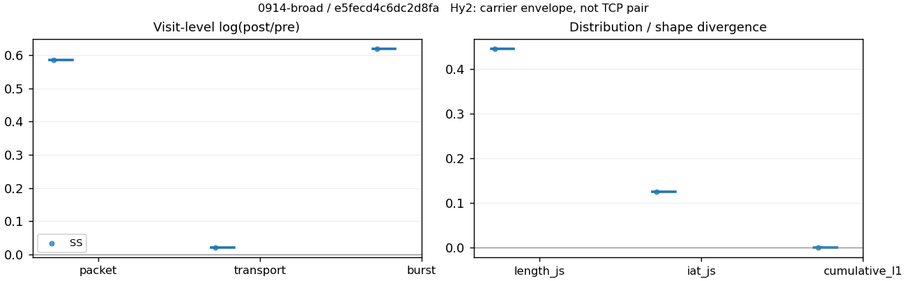
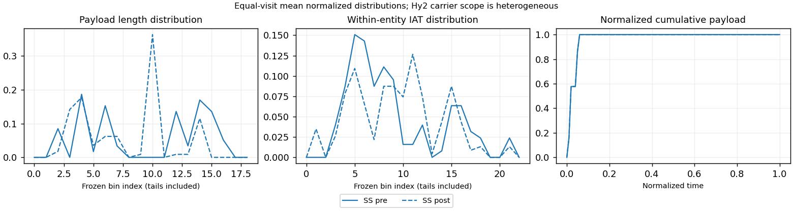

# 0914-broad · 条目 001 · bilibili.com

目标：https://www.bilibili.com/video/BV1hu4m1P7Mu/

活动标签：bilibili.com::video_playback。选定访问 3 次。

[返回总索引](../../README.md) · [统计口径](../../methods.md)

## 覆盖与资格（每次访问均保留）

| 部署 | 重复 | 主请求路由 | 活动状态 | 代理比较 | DIRECT pre | 请求 proxy/direct/unresolved | 错误 |
| --- | --- | --- | --- | --- | --- | --- | --- |
| Hy2 | 1 | direct | passed | 0 | 1 | 0/300/0 | [] |
| SS | 1 | direct | passed | 1 | 1 | 4/309/0 | [] |
| VLESS | 1 | direct | passed | 0 | 1 | 0/299/0 | [] |

主请求非 proxy 的统计仅解释为已索引的辅助代理连接或 DIRECT 观测，不代表目标业务经代理传输。播放确认与配对资格是两道不同的门。

图中散点为单次访问，短线为重复中位数；Hy2 是共享载体包络，不能与 TCP 配对作等范围因果对比。

形态图先逐访问归一化，再对访问等权平均；实线 pre，虚线 post。分箱序号及边界见 methods，不将分箱索引误解为长度或时间。

## 每次访问的关键观测

### SS

范围：`exclusive_page`。每格 pre → post；空值为不可观测/不适用。

| 重复 | 包数 | 载荷字节 | burst | TCP FR | IAT中位µs | length JS | IAT JS |
| --- | --- | --- | --- | --- | --- | --- | --- |
| 1 | 129 → 232 | 1.0847e+05 → 1.1079e+05 | 91 → 169 | 22 → 22 | 81.02 → 429.32 | 0.44444 | 0.12394 |

范围：`direct_pre_only`。每格 pre → post；空值为不可观测/不适用。

| 重复 | 包数 | 载荷字节 | burst | TCP FR | IAT中位µs | length JS | IAT JS |
| --- | --- | --- | --- | --- | --- | --- | --- |
| 1 | 4597 → — | 9.4461e+06 → — | 3043 → — | 482 → — | 58.018 → — | — | — |

完整标量统计：中位数 [min,max]；Δ 为重复内逐访问变换的中位数，MAD 未缩放。n 为可用变换数；DIRECT-only 的 nΔ=0 不代表 pre 不可用。

| scope | 特征 | pre | post | Δ | IQRΔ | MADΔ | nΔ |
| --- | --- | --- | --- | --- | --- | --- | --- |
| direct_pre_only | active_span_sum_s_1000ms | 37.895 [37.895, 37.895] | — | — | — | — | 0 |
| direct_pre_only | active_span_sum_s_100ms | 13.364 [13.364, 13.364] | — | — | — | — | 0 |
| direct_pre_only | active_span_sum_s_500ms | 28.357 [28.357, 28.357] | — | — | — | — | 0 |
| direct_pre_only | burst_bytes_iqr | 2880 [2880, 2880] | — | — | — | — | 0 |
| direct_pre_only | burst_bytes_mad | 31 [31, 31] | — | — | — | — | 0 |
| direct_pre_only | burst_bytes_max | 29400 [29400, 29400] | — | — | — | — | 0 |
| direct_pre_only | burst_bytes_mean | 3104.2 [3104.2, 3104.2] | — | — | — | — | 0 |
| direct_pre_only | burst_bytes_median | 31 [31, 31] | — | — | — | — | 0 |
| direct_pre_only | burst_bytes_min | 0 [0, 0] | — | — | — | — | 0 |
| direct_pre_only | burst_bytes_p95 | 19600 [19600, 19600] | — | — | — | — | 0 |
| direct_pre_only | burst_bytes_q25 | 0 [0, 0] | — | — | — | — | 0 |
| direct_pre_only | burst_bytes_q75 | 2880 [2880, 2880] | — | — | — | — | 0 |
| direct_pre_only | burst_bytes_std | 5649.2 [5649.2, 5649.2] | — | — | — | — | 0 |
| direct_pre_only | burst_count | 3043 [3043, 3043] | — | — | — | — | 0 |
| direct_pre_only | burst_duration_ms_iqr | 0.061775 [0.061775, 0.061775] | — | — | — | — | 0 |
| direct_pre_only | burst_duration_ms_mad | 0 [0, 0] | — | — | — | — | 0 |
| direct_pre_only | burst_duration_ms_max | 12581 [12581, 12581] | — | — | — | — | 0 |
| direct_pre_only | burst_duration_ms_mean | 54.482 [54.482, 54.482] | — | — | — | — | 0 |
| direct_pre_only | burst_duration_ms_median | 0 [0, 0] | — | — | — | — | 0 |
| direct_pre_only | burst_duration_ms_min | 0 [0, 0] | — | — | — | — | 0 |
| direct_pre_only | burst_duration_ms_p95 | 61.444 [61.444, 61.444] | — | — | — | — | 0 |
| direct_pre_only | burst_duration_ms_q25 | 0 [0, 0] | — | — | — | — | 0 |
| direct_pre_only | burst_duration_ms_q75 | 0.061775 [0.061775, 0.061775] | — | — | — | — | 0 |
| direct_pre_only | burst_duration_ms_std | 632.92 [632.92, 632.92] | — | — | — | — | 0 |
| direct_pre_only | burst_packets_iqr | 1 [1, 1] | — | — | — | — | 0 |
| direct_pre_only | burst_packets_mad | 0 [0, 0] | — | — | — | — | 0 |
| direct_pre_only | burst_packets_max | 9 [9, 9] | — | — | — | — | 0 |
| direct_pre_only | burst_packets_mean | 1.5107 [1.5107, 1.5107] | — | — | — | — | 0 |
| direct_pre_only | burst_packets_median | 1 [1, 1] | — | — | — | — | 0 |
| direct_pre_only | burst_packets_min | 1 [1, 1] | — | — | — | — | 0 |
| direct_pre_only | burst_packets_p95 | 3 [3, 3] | — | — | — | — | 0 |
| direct_pre_only | burst_packets_q25 | 1 [1, 1] | — | — | — | — | 0 |
| direct_pre_only | burst_packets_q75 | 2 [2, 2] | — | — | — | — | 0 |
| direct_pre_only | burst_packets_std | 0.87323 [0.87323, 0.87323] | — | — | — | — | 0 |
| direct_pre_only | connection_span_concurrency_max | 24 [24, 24] | — | — | — | — | 0 |
| direct_pre_only | direction_entropy | 0.71239 [0.71239, 0.71239] | — | — | — | — | 0 |
| direct_pre_only | down_burst_count | 1492 [1492, 1492] | — | — | — | — | 0 |
| direct_pre_only | down_ip_bytes | 9.282e+06 [9.282e+06, 9.282e+06] | — | — | — | — | 0 |
| direct_pre_only | down_packets | 2698 [2698, 2698] | — | — | — | — | 0 |
| direct_pre_only | down_transport_bytes | 9.1412e+06 [9.1412e+06, 9.1412e+06] | — | — | — | — | 0 |
| direct_pre_only | duration_s | 46.823 [46.823, 46.823] | — | — | — | — | 0 |
| direct_pre_only | entity_count | 59 [59, 59] | — | — | — | — | 0 |
| direct_pre_only | fr_runs | 482 [482, 482] | — | — | — | — | 0 |
| direct_pre_only | fr_runs_per_packet | 0.18639 [0.18639, 0.18639] | — | — | — | — | 0 |
| direct_pre_only | fr_switches | 423 [423, 423] | — | — | — | — | 0 |
| direct_pre_only | fr_switches_per_possible_transition | 0.16739 [0.16739, 0.16739] | — | — | — | — | 0 |
| direct_pre_only | full_retransmission_fraction | 0.0045682 [0.0045682, 0.0045682] | — | — | — | — | 0 |
| direct_pre_only | full_retransmission_packets | 21 [21, 21] | — | — | — | — | 0 |
| direct_pre_only | iat_count | 4538 [4538, 4538] | — | — | — | — | 0 |
| direct_pre_only | iat_median_us | 58.018 [58.018, 58.018] | — | — | — | — | 0 |
| direct_pre_only | iat_us_iqr | 383.54 [383.54, 383.54] | — | — | — | — | 0 |
| direct_pre_only | iat_us_mad | 50.96 [50.96, 50.96] | — | — | — | — | 0 |
| direct_pre_only | iat_us_max | 1.5001e+07 [1.5001e+07, 1.5001e+07] | — | — | — | — | 0 |
| direct_pre_only | iat_us_mean | 70996 [70996, 70996] | — | — | — | — | 0 |
| direct_pre_only | iat_us_median | 58.018 [58.018, 58.018] | — | — | — | — | 0 |
| direct_pre_only | iat_us_min | 0.002 [0.002, 0.002] | — | — | — | — | 0 |
| direct_pre_only | iat_us_p95 | 40347 [40347, 40347] | — | — | — | — | 0 |
| direct_pre_only | iat_us_q25 | 14.325 [14.325, 14.325] | — | — | — | — | 0 |
| direct_pre_only | iat_us_q75 | 397.86 [397.86, 397.86] | — | — | — | — | 0 |
| direct_pre_only | iat_us_std | 8.5308e+05 [8.5308e+05, 8.5308e+05] | — | — | — | — | 0 |
| direct_pre_only | idle_gap_count_1000ms | 31 [31, 31] | — | — | — | — | 0 |
| direct_pre_only | idle_gap_count_100ms | 103 [103, 103] | — | — | — | — | 0 |
| direct_pre_only | idle_gap_count_500ms | 44 [44, 44] | — | — | — | — | 0 |
| direct_pre_only | idle_gap_sum_s_1000ms | 284.28 [284.28, 284.28] | — | — | — | — | 0 |
| direct_pre_only | idle_gap_sum_s_100ms | 308.81 [308.81, 308.81] | — | — | — | — | 0 |
| direct_pre_only | idle_gap_sum_s_500ms | 293.82 [293.82, 293.82] | — | — | — | — | 0 |
| direct_pre_only | ip_bytes | 9.6864e+06 [9.6864e+06, 9.6864e+06] | — | — | — | — | 0 |
| direct_pre_only | length_iqr | 5758.8 [5758.8, 5758.8] | — | — | — | — | 0 |
| direct_pre_only | length_mad | 2470 [2470, 2470] | — | — | — | — | 0 |
| direct_pre_only | length_max | 8948 [8948, 8948] | — | — | — | — | 0 |
| direct_pre_only | length_mean | 3652.8 [3652.8, 3652.8] | — | — | — | — | 0 |
| direct_pre_only | length_median | 2824 [2824, 2824] | — | — | — | — | 0 |
| direct_pre_only | length_min | 6 [6, 6] | — | — | — | — | 0 |
| direct_pre_only | length_p95 | 8920 [8920, 8920] | — | — | — | — | 0 |
| direct_pre_only | length_q25 | 601.25 [601.25, 601.25] | — | — | — | — | 0 |
| direct_pre_only | length_q75 | 6360 [6360, 6360] | — | — | — | — | 0 |
| direct_pre_only | length_std | 3231 [3231, 3231] | — | — | — | — | 0 |
| direct_pre_only | nonempty_entity_count | 59 [59, 59] | — | — | — | — | 0 |
| direct_pre_only | nonempty_packets | 2586 [2586, 2586] | — | — | — | — | 0 |
| direct_pre_only | offload_suspect_fraction | 0.3635 [0.3635, 0.3635] | — | — | — | — | 0 |
| direct_pre_only | packet_count | 4597 [4597, 4597] | — | — | — | — | 0 |
| direct_pre_only | rtt_median_ms | 0.067728 [0.067728, 0.067728] | — | — | — | — | 0 |
| direct_pre_only | rtt_sample_count | 1847 [1847, 1847] | — | — | — | — | 0 |
| direct_pre_only | tcp_ack_count | 4538 [4538, 4538] | — | — | — | — | 0 |
| direct_pre_only | tcp_fin_count | 118 [118, 118] | — | — | — | — | 0 |
| direct_pre_only | tcp_packet_count | 4597 [4597, 4597] | — | — | — | — | 0 |
| direct_pre_only | tcp_rst_count | 0 [0, 0] | — | — | — | — | 0 |
| direct_pre_only | tcp_syn_count | 118 [118, 118] | — | — | — | — | 0 |
| direct_pre_only | tcp_window_raw_median | 65535 [65535, 65535] | — | — | — | — | 0 |
| direct_pre_only | transition_entropy | 0.5593 [0.5593, 0.5593] | — | — | — | — | 0 |
| direct_pre_only | transition_n_mm | 1857 [1857, 1857] | — | — | — | — | 0 |
| direct_pre_only | transition_n_mp | 199 [199, 199] | — | — | — | — | 0 |
| direct_pre_only | transition_n_pm | 224 [224, 224] | — | — | — | — | 0 |
| direct_pre_only | transition_n_pp | 247 [247, 247] | — | — | — | — | 0 |
| direct_pre_only | transition_p_mm | 0.90321 [0.90321, 0.90321] | — | — | — | — | 0 |
| direct_pre_only | transition_p_mp | 0.09679 [0.09679, 0.09679] | — | — | — | — | 0 |
| direct_pre_only | transition_p_pm | 0.47558 [0.47558, 0.47558] | — | — | — | — | 0 |
| direct_pre_only | transition_p_pp | 0.52442 [0.52442, 0.52442] | — | — | — | — | 0 |
| direct_pre_only | transport_bytes | 9.4461e+06 [9.4461e+06, 9.4461e+06] | — | — | — | — | 0 |
| direct_pre_only | up_burst_count | 1551 [1551, 1551] | — | — | — | — | 0 |
| direct_pre_only | up_byte_fraction | 0.032281 [0.032281, 0.032281] | — | — | — | — | 0 |
| direct_pre_only | up_ip_bytes | 4.0441e+05 [4.0441e+05, 4.0441e+05] | — | — | — | — | 0 |
| direct_pre_only | up_packets | 1899 [1899, 1899] | — | — | — | — | 0 |
| direct_pre_only | up_transport_bytes | 3.0494e+05 [3.0494e+05, 3.0494e+05] | — | — | — | — | 0 |
| direct_pre_only | zero_iat_count | 0 [0, 0] | — | — | — | — | 0 |
| direct_pre_only | zero_iat_fraction | 0 [0, 0] | — | — | — | — | 0 |
| exclusive_page | active_span_sum_s_1000ms | 2.5906 [2.5906, 2.5906] | 2.6408 [2.6408, 2.6408] | 0.019162 | — | — | 1 |
| exclusive_page | active_span_sum_s_100ms | 1.0655 [1.0655, 1.0655] | 1.5837 [1.5837, 1.5837] | 0.39626 | — | — | 1 |
| exclusive_page | active_span_sum_s_500ms | 2.5906 [2.5906, 2.5906] | 2.6408 [2.6408, 2.6408] | 0.019162 | — | — | 1 |
| exclusive_page | burst_bytes_iqr | 1460 [1460, 1460] | 1428 [1428, 1428] | -0.022162 | — | — | 1 |
| exclusive_page | burst_bytes_mad | 31 [31, 31] | 20 [20, 20] | -0.43825 | — | — | 1 |
| exclusive_page | burst_bytes_max | 17112 [17112, 17112] | 2896 [2896, 2896] | -1.7764 | — | — | 1 |
| exclusive_page | burst_bytes_mean | 1192 [1192, 1192] | 655.57 [655.57, 655.57] | -0.59786 | — | — | 1 |
| exclusive_page | burst_bytes_median | 31 [31, 31] | 20 [20, 20] | -0.43825 | — | — | 1 |
| exclusive_page | burst_bytes_min | 0 [0, 0] | 0 [0, 0] | — | — | — | 0 |
| exclusive_page | burst_bytes_p95 | 4096 [4096, 4096] | 2856 [2856, 2856] | -0.36059 | — | — | 1 |
| exclusive_page | burst_bytes_q25 | 0 [0, 0] | 0 [0, 0] | — | — | — | 0 |
| exclusive_page | burst_bytes_q75 | 1460 [1460, 1460] | 1428 [1428, 1428] | -0.022162 | — | — | 1 |
| exclusive_page | burst_bytes_std | 2747.4 [2747.4, 2747.4] | 954.42 [954.42, 954.42] | -1.0573 | — | — | 1 |
| exclusive_page | burst_count | 91 [91, 91] | 169 [169, 169] | 0.61904 | — | — | 1 |
| exclusive_page | burst_duration_ms_iqr | 0.40328 [0.40328, 0.40328] | 0 [0, 0] | — | — | — | 0 |
| exclusive_page | burst_duration_ms_mad | 0 [0, 0] | 0 [0, 0] | — | — | — | 0 |
| exclusive_page | burst_duration_ms_max | 11511 [11511, 11511] | 15025 [15025, 15025] | 0.26642 | — | — | 1 |
| exclusive_page | burst_duration_ms_mean | 151.9 [151.9, 151.9] | 95.647 [95.647, 95.647] | -0.46259 | — | — | 1 |
| exclusive_page | burst_duration_ms_median | 0 [0, 0] | 0 [0, 0] | — | — | — | 0 |
| exclusive_page | burst_duration_ms_min | 0 [0, 0] | 0 [0, 0] | — | — | — | 0 |
| exclusive_page | burst_duration_ms_p95 | 149.74 [149.74, 149.74] | 61.277 [61.277, 61.277] | -0.89351 | — | — | 1 |
| exclusive_page | burst_duration_ms_q25 | 0 [0, 0] | 0 [0, 0] | — | — | — | 0 |
| exclusive_page | burst_duration_ms_q75 | 0.40328 [0.40328, 0.40328] | 0 [0, 0] | — | — | — | 0 |
| exclusive_page | burst_duration_ms_std | 1199.2 [1199.2, 1199.2] | 1152.3 [1152.3, 1152.3] | -0.039959 | — | — | 1 |
| exclusive_page | burst_packets_iqr | 1 [1, 1] | 0 [0, 0] | — | — | — | 0 |
| exclusive_page | burst_packets_mad | 0 [0, 0] | 0 [0, 0] | — | — | — | 0 |
| exclusive_page | burst_packets_max | 4 [4, 4] | 5 [5, 5] | 0.22314 | — | — | 1 |
| exclusive_page | burst_packets_mean | 1.4176 [1.4176, 1.4176] | 1.3728 [1.3728, 1.3728] | -0.032114 | — | — | 1 |
| exclusive_page | burst_packets_median | 1 [1, 1] | 1 [1, 1] | 0 | — | — | 1 |
| exclusive_page | burst_packets_min | 1 [1, 1] | 1 [1, 1] | 0 | — | — | 1 |
| exclusive_page | burst_packets_p95 | 3 [3, 3] | 4 [4, 4] | 0.28768 | — | — | 1 |
| exclusive_page | burst_packets_q25 | 1 [1, 1] | 1 [1, 1] | 0 | — | — | 1 |
| exclusive_page | burst_packets_q75 | 2 [2, 2] | 1 [1, 1] | -0.69315 | — | — | 1 |
| exclusive_page | burst_packets_std | 0.66409 [0.66409, 0.66409] | 0.84795 [0.84795, 0.84795] | 0.24441 | — | — | 1 |
| exclusive_page | connection_span_concurrency_max | 2 [2, 2] | 2 [2, 2] | 0 | — | — | 1 |
| exclusive_page | cumulative_l1 | — | — | 9.3388e-05 | — | — | 1 |
| exclusive_page | cumulative_max | — | — | 0.0057967 | — | — | 1 |
| exclusive_page | direction_entropy | 0.8663 [0.8663, 0.8663] | 0.72895 [0.72895, 0.72895] | -0.13735 | — | — | 1 |
| exclusive_page | down_burst_count | 44 [44, 44] | 83 [83, 83] | 0.63465 | — | — | 1 |
| exclusive_page | down_ip_bytes | 1.0358e+05 [1.0358e+05, 1.0358e+05] | 1.0753e+05 [1.0753e+05, 1.0753e+05] | 0.037444 | — | — | 1 |
| exclusive_page | down_packets | 70 [70, 70] | 118 [118, 118] | 0.52219 | — | — | 1 |
| exclusive_page | down_transport_bytes | 99916 [99916, 99916] | 1.0137e+05 [1.0137e+05, 1.0137e+05] | 0.014467 | — | — | 1 |
| exclusive_page | duration_s | 44.157 [44.157, 44.157] | 44.157 [44.157, 44.157] | -1.3114e-05 | — | — | 1 |
| exclusive_page | entity_count | 3 [3, 3] | 3 [3, 3] | 0 | — | — | 1 |
| exclusive_page | fr_runs | 22 [22, 22] | 22 [22, 22] | 0 | — | — | 1 |
| exclusive_page | fr_runs_per_packet | 0.37288 [0.37288, 0.37288] | 0.19469 [0.19469, 0.19469] | -0.17819 | — | — | 1 |
| exclusive_page | fr_switches | 19 [19, 19] | 19 [19, 19] | 0 | — | — | 1 |
| exclusive_page | fr_switches_per_possible_transition | 0.33929 [0.33929, 0.33929] | 0.17273 [0.17273, 0.17273] | -0.16656 | — | — | 1 |
| exclusive_page | full_retransmission_fraction | 0 [0, 0] | 0 [0, 0] | 0 | — | — | 1 |
| exclusive_page | full_retransmission_packets | 0 [0, 0] | 0 [0, 0] | — | — | — | 0 |
| exclusive_page | iat_count | 126 [126, 126] | 229 [229, 229] | 0.59744 | — | — | 1 |
| exclusive_page | iat_js | — | — | 0.12394 | — | — | 1 |
| exclusive_page | iat_ks | — | — | 0.21727 | — | — | 1 |
| exclusive_page | iat_median_us | 81.02 [81.02, 81.02] | 429.32 [429.32, 429.32] | 1.6675 | — | — | 1 |
| exclusive_page | iat_us_iqr | 2265 [2265, 2265] | 2720.5 [2720.5, 2720.5] | 0.18325 | — | — | 1 |
| exclusive_page | iat_us_mad | 75.353 [75.353, 75.353] | 422.97 [422.97, 422.97] | 1.7251 | — | — | 1 |
| exclusive_page | iat_us_max | 1.5001e+07 [1.5001e+07, 1.5001e+07] | 1.5206e+07 [1.5206e+07, 1.5206e+07] | 0.013577 | — | — | 1 |
| exclusive_page | iat_us_mean | 3.5002e+05 [3.5002e+05, 3.5002e+05] | 1.9258e+05 [1.9258e+05, 1.9258e+05] | -0.5975 | — | — | 1 |
| exclusive_page | iat_us_median | 81.02 [81.02, 81.02] | 429.32 [429.32, 429.32] | 1.6675 | — | — | 1 |
| exclusive_page | iat_us_min | 2.694 [2.694, 2.694] | 0.051 [0.051, 0.051] | -3.967 | — | — | 1 |
| exclusive_page | iat_us_p95 | 1.5394e+05 [1.5394e+05, 1.5394e+05] | 67170 [67170, 67170] | -0.82933 | — | — | 1 |
| exclusive_page | iat_us_q25 | 17.599 [17.599, 17.599] | 20.41 [20.41, 20.41] | 0.14815 | — | — | 1 |
| exclusive_page | iat_us_q75 | 2282.6 [2282.6, 2282.6] | 2740.9 [2740.9, 2740.9] | 0.18298 | — | — | 1 |
| exclusive_page | iat_us_std | 2.1224e+06 [2.1224e+06, 2.1224e+06] | 1.5844e+06 [1.5844e+06, 1.5844e+06] | -0.29234 | — | — | 1 |
| exclusive_page | iat_wasserstein_log1p_us | — | — | 0.87767 | — | — | 1 |
| exclusive_page | idle_gap_count_1000ms | 3 [3, 3] | 3 [3, 3] | 0 | — | — | 1 |
| exclusive_page | idle_gap_count_100ms | 10 [10, 10] | 8 [8, 8] | -0.22314 | — | — | 1 |
| exclusive_page | idle_gap_count_500ms | 3 [3, 3] | 3 [3, 3] | 0 | — | — | 1 |
| exclusive_page | idle_gap_sum_s_1000ms | 41.512 [41.512, 41.512] | 41.46 [41.46, 41.46] | -0.0012679 | — | — | 1 |
| exclusive_page | idle_gap_sum_s_100ms | 43.038 [43.038, 43.038] | 42.517 [42.517, 42.517] | -0.01217 | — | — | 1 |
| exclusive_page | idle_gap_sum_s_500ms | 41.512 [41.512, 41.512] | 41.46 [41.46, 41.46] | -0.0012679 | — | — | 1 |
| exclusive_page | ip_bytes | 1.1523e+05 [1.1523e+05, 1.1523e+05] | 1.2384e+05 [1.2384e+05, 1.2384e+05] | 0.072127 | — | — | 1 |
| exclusive_page | length_iqr | 2658 [2658, 2658] | 1330 [1330, 1330] | -0.6924 | — | — | 1 |
| exclusive_page | length_js | — | — | 0.44444 | — | — | 1 |
| exclusive_page | length_ks | — | — | 0.39268 | — | — | 1 |
| exclusive_page | length_mad | 1368 [1368, 1368] | 818 [818, 818] | -0.51424 | — | — | 1 |
| exclusive_page | length_max | 8920 [8920, 8920] | 2856 [2856, 2856] | -1.1389 | — | — | 1 |
| exclusive_page | length_mean | 1838.5 [1838.5, 1838.5] | 980.46 [980.46, 980.46] | -0.62867 | — | — | 1 |
| exclusive_page | length_median | 1460 [1460, 1460] | 1242 [1242, 1242] | -0.16171 | — | — | 1 |
| exclusive_page | length_min | 31 [31, 31] | 20 [20, 20] | -0.43825 | — | — | 1 |
| exclusive_page | length_p95 | 6824 [6824, 6824] | 2856 [2856, 2856] | -0.87102 | — | — | 1 |
| exclusive_page | length_q25 | 93.5 [93.5, 93.5] | 98 [98, 98] | 0.047006 | — | — | 1 |
| exclusive_page | length_q75 | 2751.5 [2751.5, 2751.5] | 1428 [1428, 1428] | -0.65587 | — | — | 1 |
| exclusive_page | length_std | 2169.7 [2169.7, 2169.7] | 901.5 [901.5, 901.5] | -0.8783 | — | — | 1 |
| exclusive_page | length_wasserstein_bytes | — | — | 868.9 | — | — | 1 |
| exclusive_page | nonempty_entity_count | 3 [3, 3] | 3 [3, 3] | 0 | — | — | 1 |
| exclusive_page | nonempty_packets | 59 [59, 59] | 113 [113, 113] | 0.64985 | — | — | 1 |
| exclusive_page | offload_suspect_fraction | 0.24031 [0.24031, 0.24031] | 0.064655 [0.064655, 0.064655] | -0.17565 | — | — | 1 |
| exclusive_page | packet_count | 129 [129, 129] | 232 [232, 232] | 0.58692 | — | — | 1 |
| exclusive_page | rtt_median_ms | 0.066724 [0.066724, 0.066724] | 27.438 [27.438, 27.438] | 6.0191 | — | — | 1 |
| exclusive_page | rtt_sample_count | 59 [59, 59] | 65 [65, 65] | 0.09685 | — | — | 1 |
| exclusive_page | tcp_ack_count | 126 [126, 126] | 229 [229, 229] | 0.59744 | — | — | 1 |
| exclusive_page | tcp_fin_count | 6 [6, 6] | 6 [6, 6] | 0 | — | — | 1 |
| exclusive_page | tcp_packet_count | 129 [129, 129] | 232 [232, 232] | 0.58692 | — | — | 1 |
| exclusive_page | tcp_rst_count | 0 [0, 0] | 0 [0, 0] | — | — | — | 0 |
| exclusive_page | tcp_syn_count | 6 [6, 6] | 6 [6, 6] | 0 | — | — | 1 |
| exclusive_page | tcp_window_raw_median | 65379 [65379, 65379] | 133 [133, 133] | -6.1976 | — | — | 1 |
| exclusive_page | transition_entropy | 0.79418 [0.79418, 0.79418] | 0.55915 [0.55915, 0.55915] | -0.23503 | — | — | 1 |
| exclusive_page | transition_n_mm | 31 [31, 31] | 79 [79, 79] | 0.93546 | — | — | 1 |
| exclusive_page | transition_n_mp | 8 [8, 8] | 8 [8, 8] | 0 | — | — | 1 |
| exclusive_page | transition_n_pm | 11 [11, 11] | 11 [11, 11] | 0 | — | — | 1 |
| exclusive_page | transition_n_pp | 6 [6, 6] | 12 [12, 12] | 0.69315 | — | — | 1 |
| exclusive_page | transition_p_mm | 0.79487 [0.79487, 0.79487] | 0.90805 [0.90805, 0.90805] | 0.11317 | — | — | 1 |
| exclusive_page | transition_p_mp | 0.20513 [0.20513, 0.20513] | 0.091954 [0.091954, 0.091954] | -0.11317 | — | — | 1 |
| exclusive_page | transition_p_pm | 0.64706 [0.64706, 0.64706] | 0.47826 [0.47826, 0.47826] | -0.1688 | — | — | 1 |
| exclusive_page | transition_p_pp | 0.35294 [0.35294, 0.35294] | 0.52174 [0.52174, 0.52174] | 0.1688 | — | — | 1 |
| exclusive_page | transport_bytes | 1.0847e+05 [1.0847e+05, 1.0847e+05] | 1.1079e+05 [1.1079e+05, 1.1079e+05] | 0.021181 | — | — | 1 |
| exclusive_page | up_burst_count | 47 [47, 47] | 86 [86, 86] | 0.6042 | — | — | 1 |
| exclusive_page | up_byte_fraction | 0.078861 [0.078861, 0.078861] | 0.085024 [0.085024, 0.085024] | 0.0061637 | — | — | 1 |
| exclusive_page | up_ip_bytes | 11646 [11646, 11646] | 16312 [16312, 16312] | 0.33694 | — | — | 1 |
| exclusive_page | up_packets | 59 [59, 59] | 114 [114, 114] | 0.65866 | — | — | 1 |
| exclusive_page | up_transport_bytes | 8554 [8554, 8554] | 9420 [9420, 9420] | 0.096436 | — | — | 1 |
| exclusive_page | zero_iat_count | 0 [0, 0] | 0 [0, 0] | — | — | — | 0 |
| exclusive_page | zero_iat_fraction | 0 [0, 0] | 0 [0, 0] | 0 | — | — | 1 |

### VLESS

范围：`direct_pre_only`。每格 pre → post；空值为不可观测/不适用。

| 重复 | 包数 | 载荷字节 | burst | TCP FR | IAT中位µs | length JS | IAT JS |
| --- | --- | --- | --- | --- | --- | --- | --- |
| 1 | 3926 → — | 8.615e+06 → — | 2472 → — | 445 → — | 64.837 → — | — | — |

完整标量统计：中位数 [min,max]；Δ 为重复内逐访问变换的中位数，MAD 未缩放。n 为可用变换数；DIRECT-only 的 nΔ=0 不代表 pre 不可用。

| scope | 特征 | pre | post | Δ | IQRΔ | MADΔ | nΔ |
| --- | --- | --- | --- | --- | --- | --- | --- |
| direct_pre_only | active_span_sum_s_1000ms | 34.825 [34.825, 34.825] | — | — | — | — | 0 |
| direct_pre_only | active_span_sum_s_100ms | 9.9793 [9.9793, 9.9793] | — | — | — | — | 0 |
| direct_pre_only | active_span_sum_s_500ms | 22.711 [22.711, 22.711] | — | — | — | — | 0 |
| direct_pre_only | burst_bytes_iqr | 3439.5 [3439.5, 3439.5] | — | — | — | — | 0 |
| direct_pre_only | burst_bytes_mad | 90 [90, 90] | — | — | — | — | 0 |
| direct_pre_only | burst_bytes_max | 29400 [29400, 29400] | — | — | — | — | 0 |
| direct_pre_only | burst_bytes_mean | 3485 [3485, 3485] | — | — | — | — | 0 |
| direct_pre_only | burst_bytes_median | 90 [90, 90] | — | — | — | — | 0 |
| direct_pre_only | burst_bytes_min | 0 [0, 0] | — | — | — | — | 0 |
| direct_pre_only | burst_bytes_p95 | 20480 [20480, 20480] | — | — | — | — | 0 |
| direct_pre_only | burst_bytes_q25 | 0 [0, 0] | — | — | — | — | 0 |
| direct_pre_only | burst_bytes_q75 | 3439.5 [3439.5, 3439.5] | — | — | — | — | 0 |
| direct_pre_only | burst_bytes_std | 6195.2 [6195.2, 6195.2] | — | — | — | — | 0 |
| direct_pre_only | burst_count | 2472 [2472, 2472] | — | — | — | — | 0 |
| direct_pre_only | burst_duration_ms_iqr | 0.091693 [0.091693, 0.091693] | — | — | — | — | 0 |
| direct_pre_only | burst_duration_ms_mad | 0 [0, 0] | — | — | — | — | 0 |
| direct_pre_only | burst_duration_ms_max | 13273 [13273, 13273] | — | — | — | — | 0 |
| direct_pre_only | burst_duration_ms_mean | 87.136 [87.136, 87.136] | — | — | — | — | 0 |
| direct_pre_only | burst_duration_ms_median | 0 [0, 0] | — | — | — | — | 0 |
| direct_pre_only | burst_duration_ms_min | 0 [0, 0] | — | — | — | — | 0 |
| direct_pre_only | burst_duration_ms_p95 | 65.03 [65.03, 65.03] | — | — | — | — | 0 |
| direct_pre_only | burst_duration_ms_q25 | 0 [0, 0] | — | — | — | — | 0 |
| direct_pre_only | burst_duration_ms_q75 | 0.091693 [0.091693, 0.091693] | — | — | — | — | 0 |
| direct_pre_only | burst_duration_ms_std | 859.61 [859.61, 859.61] | — | — | — | — | 0 |
| direct_pre_only | burst_packets_iqr | 1 [1, 1] | — | — | — | — | 0 |
| direct_pre_only | burst_packets_mad | 0 [0, 0] | — | — | — | — | 0 |
| direct_pre_only | burst_packets_max | 7 [7, 7] | — | — | — | — | 0 |
| direct_pre_only | burst_packets_mean | 1.5882 [1.5882, 1.5882] | — | — | — | — | 0 |
| direct_pre_only | burst_packets_median | 1 [1, 1] | — | — | — | — | 0 |
| direct_pre_only | burst_packets_min | 1 [1, 1] | — | — | — | — | 0 |
| direct_pre_only | burst_packets_p95 | 3 [3, 3] | — | — | — | — | 0 |
| direct_pre_only | burst_packets_q25 | 1 [1, 1] | — | — | — | — | 0 |
| direct_pre_only | burst_packets_q75 | 2 [2, 2] | — | — | — | — | 0 |
| direct_pre_only | burst_packets_std | 0.9332 [0.9332, 0.9332] | — | — | — | — | 0 |
| direct_pre_only | connection_span_concurrency_max | 16 [16, 16] | — | — | — | — | 0 |
| direct_pre_only | direction_entropy | 0.7221 [0.7221, 0.7221] | — | — | — | — | 0 |
| direct_pre_only | down_burst_count | 1221 [1221, 1221] | — | — | — | — | 0 |
| direct_pre_only | down_ip_bytes | 8.4792e+06 [8.4792e+06, 8.4792e+06] | — | — | — | — | 0 |
| direct_pre_only | down_packets | 2347 [2347, 2347] | — | — | — | — | 0 |
| direct_pre_only | down_transport_bytes | 8.3569e+06 [8.3569e+06, 8.3569e+06] | — | — | — | — | 0 |
| direct_pre_only | duration_s | 47.144 [47.144, 47.144] | — | — | — | — | 0 |
| direct_pre_only | entity_count | 30 [30, 30] | — | — | — | — | 0 |
| direct_pre_only | fr_runs | 445 [445, 445] | — | — | — | — | 0 |
| direct_pre_only | fr_runs_per_packet | 0.19148 [0.19148, 0.19148] | — | — | — | — | 0 |
| direct_pre_only | fr_switches | 415 [415, 415] | — | — | — | — | 0 |
| direct_pre_only | fr_switches_per_possible_transition | 0.18091 [0.18091, 0.18091] | — | — | — | — | 0 |
| direct_pre_only | full_retransmission_fraction | 0.0050942 [0.0050942, 0.0050942] | — | — | — | — | 0 |
| direct_pre_only | full_retransmission_packets | 20 [20, 20] | — | — | — | — | 0 |
| direct_pre_only | iat_count | 3896 [3896, 3896] | — | — | — | — | 0 |
| direct_pre_only | iat_median_us | 64.837 [64.837, 64.837] | — | — | — | — | 0 |
| direct_pre_only | iat_us_iqr | 386.6 [386.6, 386.6] | — | — | — | — | 0 |
| direct_pre_only | iat_us_mad | 56.987 [56.987, 56.987] | — | — | — | — | 0 |
| direct_pre_only | iat_us_max | 1.5001e+07 [1.5001e+07, 1.5001e+07] | — | — | — | — | 0 |
| direct_pre_only | iat_us_mean | 1.183e+05 [1.183e+05, 1.183e+05] | — | — | — | — | 0 |
| direct_pre_only | iat_us_median | 64.837 [64.837, 64.837] | — | — | — | — | 0 |
| direct_pre_only | iat_us_min | 0.034 [0.034, 0.034] | — | — | — | — | 0 |
| direct_pre_only | iat_us_p95 | 40988 [40988, 40988] | — | — | — | — | 0 |
| direct_pre_only | iat_us_q25 | 14.607 [14.607, 14.607] | — | — | — | — | 0 |
| direct_pre_only | iat_us_q75 | 401.21 [401.21, 401.21] | — | — | — | — | 0 |
| direct_pre_only | iat_us_std | 1.1581e+06 [1.1581e+06, 1.1581e+06] | — | — | — | — | 0 |
| direct_pre_only | idle_gap_count_1000ms | 48 [48, 48] | — | — | — | — | 0 |
| direct_pre_only | idle_gap_count_100ms | 125 [125, 125] | — | — | — | — | 0 |
| direct_pre_only | idle_gap_count_500ms | 65 [65, 65] | — | — | — | — | 0 |
| direct_pre_only | idle_gap_sum_s_1000ms | 426.07 [426.07, 426.07] | — | — | — | — | 0 |
| direct_pre_only | idle_gap_sum_s_100ms | 450.91 [450.91, 450.91] | — | — | — | — | 0 |
| direct_pre_only | idle_gap_sum_s_500ms | 438.18 [438.18, 438.18] | — | — | — | — | 0 |
| direct_pre_only | ip_bytes | 8.8198e+06 [8.8198e+06, 8.8198e+06] | — | — | — | — | 0 |
| direct_pre_only | length_iqr | 6481 [6481, 6481] | — | — | — | — | 0 |
| direct_pre_only | length_mad | 2543 [2543, 2543] | — | — | — | — | 0 |
| direct_pre_only | length_max | 8948 [8948, 8948] | — | — | — | — | 0 |
| direct_pre_only | length_mean | 3707 [3707, 3707] | — | — | — | — | 0 |
| direct_pre_only | length_median | 2824 [2824, 2824] | — | — | — | — | 0 |
| direct_pre_only | length_min | 31 [31, 31] | — | — | — | — | 0 |
| direct_pre_only | length_p95 | 8920 [8920, 8920] | — | — | — | — | 0 |
| direct_pre_only | length_q25 | 582 [582, 582] | — | — | — | — | 0 |
| direct_pre_only | length_q75 | 7063 [7063, 7063] | — | — | — | — | 0 |
| direct_pre_only | length_std | 3311.8 [3311.8, 3311.8] | — | — | — | — | 0 |
| direct_pre_only | nonempty_entity_count | 30 [30, 30] | — | — | — | — | 0 |
| direct_pre_only | nonempty_packets | 2324 [2324, 2324] | — | — | — | — | 0 |
| direct_pre_only | offload_suspect_fraction | 0.38054 [0.38054, 0.38054] | — | — | — | — | 0 |
| direct_pre_only | packet_count | 3926 [3926, 3926] | — | — | — | — | 0 |
| direct_pre_only | rtt_median_ms | 0.0817 [0.0817, 0.0817] | — | — | — | — | 0 |
| direct_pre_only | rtt_sample_count | 1505 [1505, 1505] | — | — | — | — | 0 |
| direct_pre_only | tcp_ack_count | 3895 [3895, 3895] | — | — | — | — | 0 |
| direct_pre_only | tcp_fin_count | 59 [59, 59] | — | — | — | — | 0 |
| direct_pre_only | tcp_packet_count | 3926 [3926, 3926] | — | — | — | — | 0 |
| direct_pre_only | tcp_rst_count | 1 [1, 1] | — | — | — | — | 0 |
| direct_pre_only | tcp_syn_count | 60 [60, 60] | — | — | — | — | 0 |
| direct_pre_only | tcp_window_raw_median | 65535 [65535, 65535] | — | — | — | — | 0 |
| direct_pre_only | transition_entropy | 0.59037 [0.59037, 0.59037] | — | — | — | — | 0 |
| direct_pre_only | transition_n_mm | 1638 [1638, 1638] | — | — | — | — | 0 |
| direct_pre_only | transition_n_mp | 194 [194, 194] | — | — | — | — | 0 |
| direct_pre_only | transition_n_pm | 221 [221, 221] | — | — | — | — | 0 |
| direct_pre_only | transition_n_pp | 241 [241, 241] | — | — | — | — | 0 |
| direct_pre_only | transition_p_mm | 0.8941 [0.8941, 0.8941] | — | — | — | — | 0 |
| direct_pre_only | transition_p_mp | 0.1059 [0.1059, 0.1059] | — | — | — | — | 0 |
| direct_pre_only | transition_p_pm | 0.47835 [0.47835, 0.47835] | — | — | — | — | 0 |
| direct_pre_only | transition_p_pp | 0.52165 [0.52165, 0.52165] | — | — | — | — | 0 |
| direct_pre_only | transport_bytes | 8.615e+06 [8.615e+06, 8.615e+06] | — | — | — | — | 0 |
| direct_pre_only | up_burst_count | 1251 [1251, 1251] | — | — | — | — | 0 |
| direct_pre_only | up_byte_fraction | 0.029952 [0.029952, 0.029952] | — | — | — | — | 0 |
| direct_pre_only | up_ip_bytes | 3.4062e+05 [3.4062e+05, 3.4062e+05] | — | — | — | — | 0 |
| direct_pre_only | up_packets | 1579 [1579, 1579] | — | — | — | — | 0 |
| direct_pre_only | up_transport_bytes | 2.5804e+05 [2.5804e+05, 2.5804e+05] | — | — | — | — | 0 |
| direct_pre_only | zero_iat_count | 0 [0, 0] | — | — | — | — | 0 |
| direct_pre_only | zero_iat_fraction | 0 [0, 0] | — | — | — | — | 0 |

### Hy2

范围：`direct_pre_only`。每格 pre → post；空值为不可观测/不适用。

| 重复 | 包数 | 载荷字节 | burst | TCP FR | IAT中位µs | length JS | IAT JS |
| --- | --- | --- | --- | --- | --- | --- | --- |
| 1 | 4705 → — | 1.0265e+07 → — | 2924 → — | 511 → — | 69.084 → — | — | — |

完整标量统计：中位数 [min,max]；Δ 为重复内逐访问变换的中位数，MAD 未缩放。n 为可用变换数；DIRECT-only 的 nΔ=0 不代表 pre 不可用。

| scope | 特征 | pre | post | Δ | IQRΔ | MADΔ | nΔ |
| --- | --- | --- | --- | --- | --- | --- | --- |
| direct_pre_only | active_span_sum_s_1000ms | 38.955 [38.955, 38.955] | — | — | — | — | 0 |
| direct_pre_only | active_span_sum_s_100ms | 12.266 [12.266, 12.266] | — | — | — | — | 0 |
| direct_pre_only | active_span_sum_s_500ms | 22.358 [22.358, 22.358] | — | — | — | — | 0 |
| direct_pre_only | burst_bytes_iqr | 3362 [3362, 3362] | — | — | — | — | 0 |
| direct_pre_only | burst_bytes_mad | 80 [80, 80] | — | — | — | — | 0 |
| direct_pre_only | burst_bytes_max | 28672 [28672, 28672] | — | — | — | — | 0 |
| direct_pre_only | burst_bytes_mean | 3510.4 [3510.4, 3510.4] | — | — | — | — | 0 |
| direct_pre_only | burst_bytes_median | 80 [80, 80] | — | — | — | — | 0 |
| direct_pre_only | burst_bytes_min | 0 [0, 0] | — | — | — | — | 0 |
| direct_pre_only | burst_bytes_p95 | 20480 [20480, 20480] | — | — | — | — | 0 |
| direct_pre_only | burst_bytes_q25 | 0 [0, 0] | — | — | — | — | 0 |
| direct_pre_only | burst_bytes_q75 | 3362 [3362, 3362] | — | — | — | — | 0 |
| direct_pre_only | burst_bytes_std | 6248.3 [6248.3, 6248.3] | — | — | — | — | 0 |
| direct_pre_only | burst_count | 2924 [2924, 2924] | — | — | — | — | 0 |
| direct_pre_only | burst_duration_ms_iqr | 0.090825 [0.090825, 0.090825] | — | — | — | — | 0 |
| direct_pre_only | burst_duration_ms_mad | 0 [0, 0] | — | — | — | — | 0 |
| direct_pre_only | burst_duration_ms_max | 14141 [14141, 14141] | — | — | — | — | 0 |
| direct_pre_only | burst_duration_ms_mean | 148.73 [148.73, 148.73] | — | — | — | — | 0 |
| direct_pre_only | burst_duration_ms_median | 0 [0, 0] | — | — | — | — | 0 |
| direct_pre_only | burst_duration_ms_min | 0 [0, 0] | — | — | — | — | 0 |
| direct_pre_only | burst_duration_ms_p95 | 59.898 [59.898, 59.898] | — | — | — | — | 0 |
| direct_pre_only | burst_duration_ms_q25 | 0 [0, 0] | — | — | — | — | 0 |
| direct_pre_only | burst_duration_ms_q75 | 0.090825 [0.090825, 0.090825] | — | — | — | — | 0 |
| direct_pre_only | burst_duration_ms_std | 1239 [1239, 1239] | — | — | — | — | 0 |
| direct_pre_only | burst_packets_iqr | 1 [1, 1] | — | — | — | — | 0 |
| direct_pre_only | burst_packets_mad | 0 [0, 0] | — | — | — | — | 0 |
| direct_pre_only | burst_packets_max | 9 [9, 9] | — | — | — | — | 0 |
| direct_pre_only | burst_packets_mean | 1.6091 [1.6091, 1.6091] | — | — | — | — | 0 |
| direct_pre_only | burst_packets_median | 1 [1, 1] | — | — | — | — | 0 |
| direct_pre_only | burst_packets_min | 1 [1, 1] | — | — | — | — | 0 |
| direct_pre_only | burst_packets_p95 | 4 [4, 4] | — | — | — | — | 0 |
| direct_pre_only | burst_packets_q25 | 1 [1, 1] | — | — | — | — | 0 |
| direct_pre_only | burst_packets_q75 | 2 [2, 2] | — | — | — | — | 0 |
| direct_pre_only | burst_packets_std | 0.9786 [0.9786, 0.9786] | — | — | — | — | 0 |
| direct_pre_only | connection_span_concurrency_max | 27 [27, 27] | — | — | — | — | 0 |
| direct_pre_only | direction_entropy | 0.65991 [0.65991, 0.65991] | — | — | — | — | 0 |
| direct_pre_only | down_burst_count | 1443 [1443, 1443] | — | — | — | — | 0 |
| direct_pre_only | down_ip_bytes | 1.0126e+07 [1.0126e+07, 1.0126e+07] | — | — | — | — | 0 |
| direct_pre_only | down_packets | 2898 [2898, 2898] | — | — | — | — | 0 |
| direct_pre_only | down_transport_bytes | 9.9748e+06 [9.9748e+06, 9.9748e+06] | — | — | — | — | 0 |
| direct_pre_only | duration_s | 46.825 [46.825, 46.825] | — | — | — | — | 0 |
| direct_pre_only | entity_count | 38 [38, 38] | — | — | — | — | 0 |
| direct_pre_only | fr_runs | 511 [511, 511] | — | — | — | — | 0 |
| direct_pre_only | fr_runs_per_packet | 0.18315 [0.18315, 0.18315] | — | — | — | — | 0 |
| direct_pre_only | fr_switches | 473 [473, 473] | — | — | — | — | 0 |
| direct_pre_only | fr_switches_per_possible_transition | 0.17188 [0.17188, 0.17188] | — | — | — | — | 0 |
| direct_pre_only | full_retransmission_fraction | 0.0038257 [0.0038257, 0.0038257] | — | — | — | — | 0 |
| direct_pre_only | full_retransmission_packets | 18 [18, 18] | — | — | — | — | 0 |
| direct_pre_only | iat_count | 4667 [4667, 4667] | — | — | — | — | 0 |
| direct_pre_only | iat_median_us | 69.084 [69.084, 69.084] | — | — | — | — | 0 |
| direct_pre_only | iat_us_iqr | 447.38 [447.38, 447.38] | — | — | — | — | 0 |
| direct_pre_only | iat_us_mad | 60.794 [60.794, 60.794] | — | — | — | — | 0 |
| direct_pre_only | iat_us_max | 1.5001e+07 [1.5001e+07, 1.5001e+07] | — | — | — | — | 0 |
| direct_pre_only | iat_us_mean | 2.5505e+05 [2.5505e+05, 2.5505e+05] | — | — | — | — | 0 |
| direct_pre_only | iat_us_median | 69.084 [69.084, 69.084] | — | — | — | — | 0 |
| direct_pre_only | iat_us_min | 0.321 [0.321, 0.321] | — | — | — | — | 0 |
| direct_pre_only | iat_us_p95 | 49176 [49176, 49176] | — | — | — | — | 0 |
| direct_pre_only | iat_us_q25 | 15.225 [15.225, 15.225] | — | — | — | — | 0 |
| direct_pre_only | iat_us_q75 | 462.6 [462.6, 462.6] | — | — | — | — | 0 |
| direct_pre_only | iat_us_std | 1.7949e+06 [1.7949e+06, 1.7949e+06] | — | — | — | — | 0 |
| direct_pre_only | idle_gap_count_1000ms | 102 [102, 102] | — | — | — | — | 0 |
| direct_pre_only | idle_gap_count_100ms | 170 [170, 170] | — | — | — | — | 0 |
| direct_pre_only | idle_gap_count_500ms | 127 [127, 127] | — | — | — | — | 0 |
| direct_pre_only | idle_gap_sum_s_1000ms | 1151.4 [1151.4, 1151.4] | — | — | — | — | 0 |
| direct_pre_only | idle_gap_sum_s_100ms | 1178.1 [1178.1, 1178.1] | — | — | — | — | 0 |
| direct_pre_only | idle_gap_sum_s_500ms | 1168 [1168, 1168] | — | — | — | — | 0 |
| direct_pre_only | ip_bytes | 1.051e+07 [1.051e+07, 1.051e+07] | — | — | — | — | 0 |
| direct_pre_only | length_iqr | 5967 [5967, 5967] | — | — | — | — | 0 |
| direct_pre_only | length_mad | 2320.5 [2320.5, 2320.5] | — | — | — | — | 0 |
| direct_pre_only | length_max | 8948 [8948, 8948] | — | — | — | — | 0 |
| direct_pre_only | length_mean | 3679 [3679, 3679] | — | — | — | — | 0 |
| direct_pre_only | length_median | 2824 [2824, 2824] | — | — | — | — | 0 |
| direct_pre_only | length_min | 31 [31, 31] | — | — | — | — | 0 |
| direct_pre_only | length_p95 | 8920 [8920, 8920] | — | — | — | — | 0 |
| direct_pre_only | length_q25 | 769 [769, 769] | — | — | — | — | 0 |
| direct_pre_only | length_q75 | 6736 [6736, 6736] | — | — | — | — | 0 |
| direct_pre_only | length_std | 3206.2 [3206.2, 3206.2] | — | — | — | — | 0 |
| direct_pre_only | nonempty_entity_count | 38 [38, 38] | — | — | — | — | 0 |
| direct_pre_only | nonempty_packets | 2790 [2790, 2790] | — | — | — | — | 0 |
| direct_pre_only | offload_suspect_fraction | 0.39129 [0.39129, 0.39129] | — | — | — | — | 0 |
| direct_pre_only | packet_count | 4705 [4705, 4705] | — | — | — | — | 0 |
| direct_pre_only | rtt_median_ms | 0.090091 [0.090091, 0.090091] | — | — | — | — | 0 |
| direct_pre_only | rtt_sample_count | 1742 [1742, 1742] | — | — | — | — | 0 |
| direct_pre_only | tcp_ack_count | 4667 [4667, 4667] | — | — | — | — | 0 |
| direct_pre_only | tcp_fin_count | 76 [76, 76] | — | — | — | — | 0 |
| direct_pre_only | tcp_packet_count | 4705 [4705, 4705] | — | — | — | — | 0 |
| direct_pre_only | tcp_rst_count | 0 [0, 0] | — | — | — | — | 0 |
| direct_pre_only | tcp_syn_count | 76 [76, 76] | — | — | — | — | 0 |
| direct_pre_only | tcp_window_raw_median | 65535 [65535, 65535] | — | — | — | — | 0 |
| direct_pre_only | transition_entropy | 0.54958 [0.54958, 0.54958] | — | — | — | — | 0 |
| direct_pre_only | transition_n_mm | 2059 [2059, 2059] | — | — | — | — | 0 |
| direct_pre_only | transition_n_mp | 219 [219, 219] | — | — | — | — | 0 |
| direct_pre_only | transition_n_pm | 254 [254, 254] | — | — | — | — | 0 |
| direct_pre_only | transition_n_pp | 220 [220, 220] | — | — | — | — | 0 |
| direct_pre_only | transition_p_mm | 0.90386 [0.90386, 0.90386] | — | — | — | — | 0 |
| direct_pre_only | transition_p_mp | 0.096137 [0.096137, 0.096137] | — | — | — | — | 0 |
| direct_pre_only | transition_p_pm | 0.53586 [0.53586, 0.53586] | — | — | — | — | 0 |
| direct_pre_only | transition_p_pp | 0.46414 [0.46414, 0.46414] | — | — | — | — | 0 |
| direct_pre_only | transport_bytes | 1.0265e+07 [1.0265e+07, 1.0265e+07] | — | — | — | — | 0 |
| direct_pre_only | up_burst_count | 1481 [1481, 1481] | — | — | — | — | 0 |
| direct_pre_only | up_byte_fraction | 0.028232 [0.028232, 0.028232] | — | — | — | — | 0 |
| direct_pre_only | up_ip_bytes | 3.8427e+05 [3.8427e+05, 3.8427e+05] | — | — | — | — | 0 |
| direct_pre_only | up_packets | 1807 [1807, 1807] | — | — | — | — | 0 |
| direct_pre_only | up_transport_bytes | 2.8979e+05 [2.8979e+05, 2.8979e+05] | — | — | — | — | 0 |
| direct_pre_only | zero_iat_count | 0 [0, 0] | — | — | — | — | 0 |
| direct_pre_only | zero_iat_fraction | 0 [0, 0] | — | — | — | — | 0 |

## 不同部署对比

以下是各部署自身重复中位数的差异，不按重复编号强行配对。跨 TCP/Hy2 的行标记异质观测范围。

| 视角 | 特征 | 部署A | 部署B | A中位 | B中位 | B−A | 比较口径 |
| --- | --- | --- | --- | --- | --- | --- | --- |
| pre | burst_count | SS | VLESS | 3043 | 2472 | -571 | same_scope_unpaired_visits |
| pre | burst_count | SS | Hy2 | 3043 | 2924 | -119 | same_scope_unpaired_visits |
| pre | burst_count | VLESS | Hy2 | 2472 | 2924 | 452 | same_scope_unpaired_visits |
| pre | connection_span_concurrency_max | SS | VLESS | 24 | 16 | -8 | same_scope_unpaired_visits |
| pre | connection_span_concurrency_max | SS | Hy2 | 24 | 27 | 3 | same_scope_unpaired_visits |
| pre | connection_span_concurrency_max | VLESS | Hy2 | 16 | 27 | 11 | same_scope_unpaired_visits |
| pre | direction_entropy | SS | VLESS | 0.71239 | 0.7221 | 0.0097084 | same_scope_unpaired_visits |
| pre | direction_entropy | SS | Hy2 | 0.71239 | 0.65991 | -0.052478 | same_scope_unpaired_visits |
| pre | direction_entropy | VLESS | Hy2 | 0.7221 | 0.65991 | -0.062186 | same_scope_unpaired_visits |
| pre | down_transport_bytes | SS | VLESS | 9.1412e+06 | 8.3569e+06 | -7.8426e+05 | same_scope_unpaired_visits |
| pre | down_transport_bytes | SS | Hy2 | 9.1412e+06 | 9.9748e+06 | 8.3355e+05 | same_scope_unpaired_visits |
| pre | down_transport_bytes | VLESS | Hy2 | 8.3569e+06 | 9.9748e+06 | 1.6178e+06 | same_scope_unpaired_visits |
| pre | duration_s | SS | VLESS | 46.823 | 47.144 | 0.32083 | same_scope_unpaired_visits |
| pre | duration_s | SS | Hy2 | 46.823 | 46.825 | 0.0013792 | same_scope_unpaired_visits |
| pre | duration_s | VLESS | Hy2 | 47.144 | 46.825 | -0.31945 | same_scope_unpaired_visits |
| pre | entity_count | SS | VLESS | 59 | 30 | -29 | same_scope_unpaired_visits |
| pre | entity_count | SS | Hy2 | 59 | 38 | -21 | same_scope_unpaired_visits |
| pre | entity_count | VLESS | Hy2 | 30 | 38 | 8 | same_scope_unpaired_visits |
| pre | fr_runs | SS | VLESS | 482 | 445 | -37 | same_scope_unpaired_visits |
| pre | fr_runs | SS | Hy2 | 482 | 511 | 29 | same_scope_unpaired_visits |
| pre | fr_runs | VLESS | Hy2 | 445 | 511 | 66 | same_scope_unpaired_visits |
| pre | fr_runs_per_packet | SS | VLESS | 0.18639 | 0.19148 | 0.005092 | same_scope_unpaired_visits |
| pre | fr_runs_per_packet | SS | Hy2 | 0.18639 | 0.18315 | -0.0032341 | same_scope_unpaired_visits |
| pre | fr_runs_per_packet | VLESS | Hy2 | 0.19148 | 0.18315 | -0.0083261 | same_scope_unpaired_visits |
| pre | fr_switches | SS | VLESS | 423 | 415 | -8 | same_scope_unpaired_visits |
| pre | fr_switches | SS | Hy2 | 423 | 473 | 50 | same_scope_unpaired_visits |
| pre | fr_switches | VLESS | Hy2 | 415 | 473 | 58 | same_scope_unpaired_visits |
| pre | fr_switches_per_possible_transition | SS | VLESS | 0.16739 | 0.18091 | 0.013515 | same_scope_unpaired_visits |
| pre | fr_switches_per_possible_transition | SS | Hy2 | 0.16739 | 0.17188 | 0.0044828 | same_scope_unpaired_visits |
| pre | fr_switches_per_possible_transition | VLESS | Hy2 | 0.18091 | 0.17188 | -0.0090317 | same_scope_unpaired_visits |
| pre | full_retransmission_fraction | SS | VLESS | 0.0045682 | 0.0050942 | 0.00052605 | same_scope_unpaired_visits |
| pre | full_retransmission_fraction | SS | Hy2 | 0.0045682 | 0.0038257 | -0.00074248 | same_scope_unpaired_visits |
| pre | full_retransmission_fraction | VLESS | Hy2 | 0.0050942 | 0.0038257 | -0.0012685 | same_scope_unpaired_visits |
| pre | iat_median_us | SS | VLESS | 58.018 | 64.837 | 6.8185 | same_scope_unpaired_visits |
| pre | iat_median_us | SS | Hy2 | 58.018 | 69.084 | 11.066 | same_scope_unpaired_visits |
| pre | iat_median_us | VLESS | Hy2 | 64.837 | 69.084 | 4.2475 | same_scope_unpaired_visits |
| pre | iat_us_p95 | SS | VLESS | 40347 | 40988 | 640.22 | same_scope_unpaired_visits |
| pre | iat_us_p95 | SS | Hy2 | 40347 | 49176 | 8828.8 | same_scope_unpaired_visits |
| pre | iat_us_p95 | VLESS | Hy2 | 40988 | 49176 | 8188.6 | same_scope_unpaired_visits |
| pre | ip_bytes | SS | VLESS | 9.6864e+06 | 8.8198e+06 | -8.6654e+05 | same_scope_unpaired_visits |
| pre | ip_bytes | SS | Hy2 | 9.6864e+06 | 1.051e+07 | 8.2364e+05 | same_scope_unpaired_visits |
| pre | ip_bytes | VLESS | Hy2 | 8.8198e+06 | 1.051e+07 | 1.6902e+06 | same_scope_unpaired_visits |
| pre | length_median | SS | VLESS | 2824 | 2824 | 0 | same_scope_unpaired_visits |
| pre | length_median | SS | Hy2 | 2824 | 2824 | 0 | same_scope_unpaired_visits |
| pre | length_median | VLESS | Hy2 | 2824 | 2824 | 0 | same_scope_unpaired_visits |
| pre | length_p95 | SS | VLESS | 8920 | 8920 | 0 | same_scope_unpaired_visits |
| pre | length_p95 | SS | Hy2 | 8920 | 8920 | 0 | same_scope_unpaired_visits |
| pre | length_p95 | VLESS | Hy2 | 8920 | 8920 | 0 | same_scope_unpaired_visits |
| pre | nonempty_packets | SS | VLESS | 2586 | 2324 | -262 | same_scope_unpaired_visits |
| pre | nonempty_packets | SS | Hy2 | 2586 | 2790 | 204 | same_scope_unpaired_visits |
| pre | nonempty_packets | VLESS | Hy2 | 2324 | 2790 | 466 | same_scope_unpaired_visits |
| pre | offload_suspect_fraction | SS | VLESS | 0.3635 | 0.38054 | 0.017042 | same_scope_unpaired_visits |
| pre | offload_suspect_fraction | SS | Hy2 | 0.3635 | 0.39129 | 0.027788 | same_scope_unpaired_visits |
| pre | offload_suspect_fraction | VLESS | Hy2 | 0.38054 | 0.39129 | 0.010746 | same_scope_unpaired_visits |
| pre | packet_count | SS | VLESS | 4597 | 3926 | -671 | same_scope_unpaired_visits |
| pre | packet_count | SS | Hy2 | 4597 | 4705 | 108 | same_scope_unpaired_visits |
| pre | packet_count | VLESS | Hy2 | 3926 | 4705 | 779 | same_scope_unpaired_visits |
| pre | rtt_median_ms | SS | VLESS | 0.067728 | 0.0817 | 0.013972 | same_scope_unpaired_visits |
| pre | rtt_median_ms | SS | Hy2 | 0.067728 | 0.090091 | 0.022363 | same_scope_unpaired_visits |
| pre | rtt_median_ms | VLESS | Hy2 | 0.0817 | 0.090091 | 0.0083915 | same_scope_unpaired_visits |
| pre | transition_entropy | SS | VLESS | 0.5593 | 0.59037 | 0.03107 | same_scope_unpaired_visits |
| pre | transition_entropy | SS | Hy2 | 0.5593 | 0.54958 | -0.0097216 | same_scope_unpaired_visits |
| pre | transition_entropy | VLESS | Hy2 | 0.59037 | 0.54958 | -0.040791 | same_scope_unpaired_visits |
| pre | transport_bytes | SS | VLESS | 9.4461e+06 | 8.615e+06 | -8.3116e+05 | same_scope_unpaired_visits |
| pre | transport_bytes | SS | Hy2 | 9.4461e+06 | 1.0265e+07 | 8.184e+05 | same_scope_unpaired_visits |
| pre | transport_bytes | VLESS | Hy2 | 8.615e+06 | 1.0265e+07 | 1.6496e+06 | same_scope_unpaired_visits |
| pre | up_byte_fraction | SS | VLESS | 0.032281 | 0.029952 | -0.002329 | same_scope_unpaired_visits |
| pre | up_byte_fraction | SS | Hy2 | 0.032281 | 0.028232 | -0.0040496 | same_scope_unpaired_visits |
| pre | up_byte_fraction | VLESS | Hy2 | 0.029952 | 0.028232 | -0.0017206 | same_scope_unpaired_visits |
| pre | up_transport_bytes | SS | VLESS | 3.0494e+05 | 2.5804e+05 | -46895 | same_scope_unpaired_visits |
| pre | up_transport_bytes | SS | Hy2 | 3.0494e+05 | 2.8979e+05 | -15148 | same_scope_unpaired_visits |
| pre | up_transport_bytes | VLESS | Hy2 | 2.5804e+05 | 2.8979e+05 | 31747 | same_scope_unpaired_visits |

## 可复核的访问标识

| 部署 | 重复 | session_id |
| --- | --- | --- |
| SS | 1 | bcc2a144-7cc5-40cd-9e66-8d08bbf9f8b8 |
| VLESS | 1 | be56cab7-7c08-4a1c-9b8e-68f140666106 |
| Hy2 | 1 | 4a8e34d7-e521-4b52-a42a-472bf8fe573e |

全量三种 packet selection、Hy2 full 范围、Q25/Q75、直方图与曲线见机器可读产物；本页只显示 observed 主范围。
