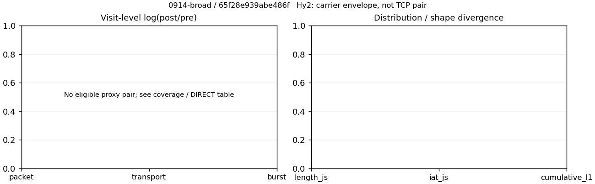

# 0914-broad · 条目 002 · bilibili.com

目标：https://www.bilibili.com/video/BV1HEf2YWEvs/

活动标签：bilibili.com::video_playback。选定访问 3 次。

[返回总索引](../../README.md) · [统计口径](../../methods.md)

## 覆盖与资格（每次访问均保留）

| 部署 | 重复 | 主请求路由 | 活动状态 | 代理比较 | DIRECT pre | 请求 proxy/direct/unresolved | 错误 |
| --- | --- | --- | --- | --- | --- | --- | --- |
| Hy2 | 1 | direct | passed | 0 | 1 | 0/279/0 | [] |
| SS | 1 | direct | passed | 0 | 1 | 0/277/0 | [] |
| VLESS | 1 | direct | passed | 0 | 1 | 0/276/0 | [] |

主请求非 proxy 的统计仅解释为已索引的辅助代理连接或 DIRECT 观测，不代表目标业务经代理传输。播放确认与配对资格是两道不同的门。

图中散点为单次访问，短线为重复中位数；Hy2 是共享载体包络，不能与 TCP 配对作等范围因果对比。

形态图先逐访问归一化，再对访问等权平均；实线 pre，虚线 post。分箱序号及边界见 methods，不将分箱索引误解为长度或时间。

## 每次访问的关键观测

### SS

范围：`direct_pre_only`。每格 pre → post；空值为不可观测/不适用。

| 重复 | 包数 | 载荷字节 | burst | TCP FR | IAT中位µs | length JS | IAT JS |
| --- | --- | --- | --- | --- | --- | --- | --- |
| 1 | 3763 → — | 8.3738e+06 → — | 2341 → — | 405 → — | 59.972 → — | — | — |

完整标量统计：中位数 [min,max]；Δ 为重复内逐访问变换的中位数，MAD 未缩放。n 为可用变换数；DIRECT-only 的 nΔ=0 不代表 pre 不可用。

| scope | 特征 | pre | post | Δ | IQRΔ | MADΔ | nΔ |
| --- | --- | --- | --- | --- | --- | --- | --- |
| direct_pre_only | active_span_sum_s_1000ms | 33.206 [33.206, 33.206] | — | — | — | — | 0 |
| direct_pre_only | active_span_sum_s_100ms | 10.21 [10.21, 10.21] | — | — | — | — | 0 |
| direct_pre_only | active_span_sum_s_500ms | 23.931 [23.931, 23.931] | — | — | — | — | 0 |
| direct_pre_only | burst_bytes_iqr | 4160 [4160, 4160] | — | — | — | — | 0 |
| direct_pre_only | burst_bytes_mad | 92 [92, 92] | — | — | — | — | 0 |
| direct_pre_only | burst_bytes_max | 28672 [28672, 28672] | — | — | — | — | 0 |
| direct_pre_only | burst_bytes_mean | 3577 [3577, 3577] | — | — | — | — | 0 |
| direct_pre_only | burst_bytes_median | 92 [92, 92] | — | — | — | — | 0 |
| direct_pre_only | burst_bytes_min | 0 [0, 0] | — | — | — | — | 0 |
| direct_pre_only | burst_bytes_p95 | 20480 [20480, 20480] | — | — | — | — | 0 |
| direct_pre_only | burst_bytes_q25 | 0 [0, 0] | — | — | — | — | 0 |
| direct_pre_only | burst_bytes_q75 | 4160 [4160, 4160] | — | — | — | — | 0 |
| direct_pre_only | burst_bytes_std | 6220.6 [6220.6, 6220.6] | — | — | — | — | 0 |
| direct_pre_only | burst_count | 2341 [2341, 2341] | — | — | — | — | 0 |
| direct_pre_only | burst_duration_ms_iqr | 0.099466 [0.099466, 0.099466] | — | — | — | — | 0 |
| direct_pre_only | burst_duration_ms_mad | 0 [0, 0] | — | — | — | — | 0 |
| direct_pre_only | burst_duration_ms_max | 14837 [14837, 14837] | — | — | — | — | 0 |
| direct_pre_only | burst_duration_ms_mean | 114.19 [114.19, 114.19] | — | — | — | — | 0 |
| direct_pre_only | burst_duration_ms_median | 0 [0, 0] | — | — | — | — | 0 |
| direct_pre_only | burst_duration_ms_min | 0 [0, 0] | — | — | — | — | 0 |
| direct_pre_only | burst_duration_ms_p95 | 67.414 [67.414, 67.414] | — | — | — | — | 0 |
| direct_pre_only | burst_duration_ms_q25 | 0 [0, 0] | — | — | — | — | 0 |
| direct_pre_only | burst_duration_ms_q75 | 0.099466 [0.099466, 0.099466] | — | — | — | — | 0 |
| direct_pre_only | burst_duration_ms_std | 1035 [1035, 1035] | — | — | — | — | 0 |
| direct_pre_only | burst_packets_iqr | 1 [1, 1] | — | — | — | — | 0 |
| direct_pre_only | burst_packets_mad | 0 [0, 0] | — | — | — | — | 0 |
| direct_pre_only | burst_packets_max | 10 [10, 10] | — | — | — | — | 0 |
| direct_pre_only | burst_packets_mean | 1.6074 [1.6074, 1.6074] | — | — | — | — | 0 |
| direct_pre_only | burst_packets_median | 1 [1, 1] | — | — | — | — | 0 |
| direct_pre_only | burst_packets_min | 1 [1, 1] | — | — | — | — | 0 |
| direct_pre_only | burst_packets_p95 | 3 [3, 3] | — | — | — | — | 0 |
| direct_pre_only | burst_packets_q25 | 1 [1, 1] | — | — | — | — | 0 |
| direct_pre_only | burst_packets_q75 | 2 [2, 2] | — | — | — | — | 0 |
| direct_pre_only | burst_packets_std | 0.96638 [0.96638, 0.96638] | — | — | — | — | 0 |
| direct_pre_only | connection_span_concurrency_max | 14 [14, 14] | — | — | — | — | 0 |
| direct_pre_only | direction_entropy | 0.70578 [0.70578, 0.70578] | — | — | — | — | 0 |
| direct_pre_only | down_burst_count | 1155 [1155, 1155] | — | — | — | — | 0 |
| direct_pre_only | down_ip_bytes | 8.2412e+06 [8.2412e+06, 8.2412e+06] | — | — | — | — | 0 |
| direct_pre_only | down_packets | 2284 [2284, 2284] | — | — | — | — | 0 |
| direct_pre_only | down_transport_bytes | 8.1222e+06 [8.1222e+06, 8.1222e+06] | — | — | — | — | 0 |
| direct_pre_only | duration_s | 46.359 [46.359, 46.359] | — | — | — | — | 0 |
| direct_pre_only | entity_count | 31 [31, 31] | — | — | — | — | 0 |
| direct_pre_only | fr_runs | 405 [405, 405] | — | — | — | — | 0 |
| direct_pre_only | fr_runs_per_packet | 0.17841 [0.17841, 0.17841] | — | — | — | — | 0 |
| direct_pre_only | fr_switches | 374 [374, 374] | — | — | — | — | 0 |
| direct_pre_only | fr_switches_per_possible_transition | 0.16704 [0.16704, 0.16704] | — | — | — | — | 0 |
| direct_pre_only | full_retransmission_fraction | 0.0042519 [0.0042519, 0.0042519] | — | — | — | — | 0 |
| direct_pre_only | full_retransmission_packets | 16 [16, 16] | — | — | — | — | 0 |
| direct_pre_only | iat_count | 3732 [3732, 3732] | — | — | — | — | 0 |
| direct_pre_only | iat_median_us | 59.972 [59.972, 59.972] | — | — | — | — | 0 |
| direct_pre_only | iat_us_iqr | 403.51 [403.51, 403.51] | — | — | — | — | 0 |
| direct_pre_only | iat_us_mad | 52.126 [52.126, 52.126] | — | — | — | — | 0 |
| direct_pre_only | iat_us_max | 1.4837e+07 [1.4837e+07, 1.4837e+07] | — | — | — | — | 0 |
| direct_pre_only | iat_us_mean | 74921 [74921, 74921] | — | — | — | — | 0 |
| direct_pre_only | iat_us_median | 59.972 [59.972, 59.972] | — | — | — | — | 0 |
| direct_pre_only | iat_us_min | 0.094 [0.094, 0.094] | — | — | — | — | 0 |
| direct_pre_only | iat_us_p95 | 40479 [40479, 40479] | — | — | — | — | 0 |
| direct_pre_only | iat_us_q25 | 14.863 [14.863, 14.863] | — | — | — | — | 0 |
| direct_pre_only | iat_us_q75 | 418.37 [418.37, 418.37] | — | — | — | — | 0 |
| direct_pre_only | iat_us_std | 8.2564e+05 [8.2564e+05, 8.2564e+05] | — | — | — | — | 0 |
| direct_pre_only | idle_gap_count_1000ms | 32 [32, 32] | — | — | — | — | 0 |
| direct_pre_only | idle_gap_count_100ms | 97 [97, 97] | — | — | — | — | 0 |
| direct_pre_only | idle_gap_count_500ms | 44 [44, 44] | — | — | — | — | 0 |
| direct_pre_only | idle_gap_sum_s_1000ms | 246.4 [246.4, 246.4] | — | — | — | — | 0 |
| direct_pre_only | idle_gap_sum_s_100ms | 269.4 [269.4, 269.4] | — | — | — | — | 0 |
| direct_pre_only | idle_gap_sum_s_500ms | 255.67 [255.67, 255.67] | — | — | — | — | 0 |
| direct_pre_only | ip_bytes | 8.5701e+06 [8.5701e+06, 8.5701e+06] | — | — | — | — | 0 |
| direct_pre_only | length_iqr | 6179.5 [6179.5, 6179.5] | — | — | — | — | 0 |
| direct_pre_only | length_mad | 2475 [2475, 2475] | — | — | — | — | 0 |
| direct_pre_only | length_max | 8948 [8948, 8948] | — | — | — | — | 0 |
| direct_pre_only | length_mean | 3688.9 [3688.9, 3688.9] | — | — | — | — | 0 |
| direct_pre_only | length_median | 2824 [2824, 2824] | — | — | — | — | 0 |
| direct_pre_only | length_min | 12 [12, 12] | — | — | — | — | 0 |
| direct_pre_only | length_p95 | 8920 [8920, 8920] | — | — | — | — | 0 |
| direct_pre_only | length_q25 | 602.25 [602.25, 602.25] | — | — | — | — | 0 |
| direct_pre_only | length_q75 | 6781.8 [6781.8, 6781.8] | — | — | — | — | 0 |
| direct_pre_only | length_std | 3260.6 [3260.6, 3260.6] | — | — | — | — | 0 |
| direct_pre_only | nonempty_entity_count | 31 [31, 31] | — | — | — | — | 0 |
| direct_pre_only | nonempty_packets | 2270 [2270, 2270] | — | — | — | — | 0 |
| direct_pre_only | offload_suspect_fraction | 0.38746 [0.38746, 0.38746] | — | — | — | — | 0 |
| direct_pre_only | packet_count | 3763 [3763, 3763] | — | — | — | — | 0 |
| direct_pre_only | rtt_median_ms | 0.08859 [0.08859, 0.08859] | — | — | — | — | 0 |
| direct_pre_only | rtt_sample_count | 1429 [1429, 1429] | — | — | — | — | 0 |
| direct_pre_only | tcp_ack_count | 3731 [3731, 3731] | — | — | — | — | 0 |
| direct_pre_only | tcp_fin_count | 61 [61, 61] | — | — | — | — | 0 |
| direct_pre_only | tcp_packet_count | 3763 [3763, 3763] | — | — | — | — | 0 |
| direct_pre_only | tcp_rst_count | 1 [1, 1] | — | — | — | — | 0 |
| direct_pre_only | tcp_syn_count | 62 [62, 62] | — | — | — | — | 0 |
| direct_pre_only | tcp_window_raw_median | 65535 [65535, 65535] | — | — | — | — | 0 |
| direct_pre_only | transition_entropy | 0.55941 [0.55941, 0.55941] | — | — | — | — | 0 |
| direct_pre_only | transition_n_mm | 1632 [1632, 1632] | — | — | — | — | 0 |
| direct_pre_only | transition_n_mp | 172 [172, 172] | — | — | — | — | 0 |
| direct_pre_only | transition_n_pm | 202 [202, 202] | — | — | — | — | 0 |
| direct_pre_only | transition_n_pp | 233 [233, 233] | — | — | — | — | 0 |
| direct_pre_only | transition_p_mm | 0.90466 [0.90466, 0.90466] | — | — | — | — | 0 |
| direct_pre_only | transition_p_mp | 0.095344 [0.095344, 0.095344] | — | — | — | — | 0 |
| direct_pre_only | transition_p_pm | 0.46437 [0.46437, 0.46437] | — | — | — | — | 0 |
| direct_pre_only | transition_p_pp | 0.53563 [0.53563, 0.53563] | — | — | — | — | 0 |
| direct_pre_only | transport_bytes | 8.3738e+06 [8.3738e+06, 8.3738e+06] | — | — | — | — | 0 |
| direct_pre_only | up_burst_count | 1186 [1186, 1186] | — | — | — | — | 0 |
| direct_pre_only | up_byte_fraction | 0.030047 [0.030047, 0.030047] | — | — | — | — | 0 |
| direct_pre_only | up_ip_bytes | 3.2895e+05 [3.2895e+05, 3.2895e+05] | — | — | — | — | 0 |
| direct_pre_only | up_packets | 1479 [1479, 1479] | — | — | — | — | 0 |
| direct_pre_only | up_transport_bytes | 2.5161e+05 [2.5161e+05, 2.5161e+05] | — | — | — | — | 0 |
| direct_pre_only | zero_iat_count | 0 [0, 0] | — | — | — | — | 0 |
| direct_pre_only | zero_iat_fraction | 0 [0, 0] | — | — | — | — | 0 |

### VLESS

范围：`direct_pre_only`。每格 pre → post；空值为不可观测/不适用。

| 重复 | 包数 | 载荷字节 | burst | TCP FR | IAT中位µs | length JS | IAT JS |
| --- | --- | --- | --- | --- | --- | --- | --- |
| 1 | 3551 → — | 8.4007e+06 → — | 2176 → — | 392 → — | 68.737 → — | — | — |

完整标量统计：中位数 [min,max]；Δ 为重复内逐访问变换的中位数，MAD 未缩放。n 为可用变换数；DIRECT-only 的 nΔ=0 不代表 pre 不可用。

| scope | 特征 | pre | post | Δ | IQRΔ | MADΔ | nΔ |
| --- | --- | --- | --- | --- | --- | --- | --- |
| direct_pre_only | active_span_sum_s_1000ms | 31.94 [31.94, 31.94] | — | — | — | — | 0 |
| direct_pre_only | active_span_sum_s_100ms | 7.6589 [7.6589, 7.6589] | — | — | — | — | 0 |
| direct_pre_only | active_span_sum_s_500ms | 20.649 [20.649, 20.649] | — | — | — | — | 0 |
| direct_pre_only | burst_bytes_iqr | 5173.8 [5173.8, 5173.8] | — | — | — | — | 0 |
| direct_pre_only | burst_bytes_mad | 92 [92, 92] | — | — | — | — | 0 |
| direct_pre_only | burst_bytes_max | 28672 [28672, 28672] | — | — | — | — | 0 |
| direct_pre_only | burst_bytes_mean | 3860.6 [3860.6, 3860.6] | — | — | — | — | 0 |
| direct_pre_only | burst_bytes_median | 92 [92, 92] | — | — | — | — | 0 |
| direct_pre_only | burst_bytes_min | 0 [0, 0] | — | — | — | — | 0 |
| direct_pre_only | burst_bytes_p95 | 20480 [20480, 20480] | — | — | — | — | 0 |
| direct_pre_only | burst_bytes_q25 | 0 [0, 0] | — | — | — | — | 0 |
| direct_pre_only | burst_bytes_q75 | 5173.8 [5173.8, 5173.8] | — | — | — | — | 0 |
| direct_pre_only | burst_bytes_std | 6582.1 [6582.1, 6582.1] | — | — | — | — | 0 |
| direct_pre_only | burst_count | 2176 [2176, 2176] | — | — | — | — | 0 |
| direct_pre_only | burst_duration_ms_iqr | 0.10313 [0.10313, 0.10313] | — | — | — | — | 0 |
| direct_pre_only | burst_duration_ms_mad | 0 [0, 0] | — | — | — | — | 0 |
| direct_pre_only | burst_duration_ms_max | 14773 [14773, 14773] | — | — | — | — | 0 |
| direct_pre_only | burst_duration_ms_mean | 70.693 [70.693, 70.693] | — | — | — | — | 0 |
| direct_pre_only | burst_duration_ms_median | 0 [0, 0] | — | — | — | — | 0 |
| direct_pre_only | burst_duration_ms_min | 0 [0, 0] | — | — | — | — | 0 |
| direct_pre_only | burst_duration_ms_p95 | 70.605 [70.605, 70.605] | — | — | — | — | 0 |
| direct_pre_only | burst_duration_ms_q25 | 0 [0, 0] | — | — | — | — | 0 |
| direct_pre_only | burst_duration_ms_q75 | 0.10313 [0.10313, 0.10313] | — | — | — | — | 0 |
| direct_pre_only | burst_duration_ms_std | 648.16 [648.16, 648.16] | — | — | — | — | 0 |
| direct_pre_only | burst_packets_iqr | 1 [1, 1] | — | — | — | — | 0 |
| direct_pre_only | burst_packets_mad | 0 [0, 0] | — | — | — | — | 0 |
| direct_pre_only | burst_packets_max | 8 [8, 8] | — | — | — | — | 0 |
| direct_pre_only | burst_packets_mean | 1.6319 [1.6319, 1.6319] | — | — | — | — | 0 |
| direct_pre_only | burst_packets_median | 1 [1, 1] | — | — | — | — | 0 |
| direct_pre_only | burst_packets_min | 1 [1, 1] | — | — | — | — | 0 |
| direct_pre_only | burst_packets_p95 | 4 [4, 4] | — | — | — | — | 0 |
| direct_pre_only | burst_packets_q25 | 1 [1, 1] | — | — | — | — | 0 |
| direct_pre_only | burst_packets_q75 | 2 [2, 2] | — | — | — | — | 0 |
| direct_pre_only | burst_packets_std | 0.97254 [0.97254, 0.97254] | — | — | — | — | 0 |
| direct_pre_only | connection_span_concurrency_max | 16 [16, 16] | — | — | — | — | 0 |
| direct_pre_only | direction_entropy | 0.70302 [0.70302, 0.70302] | — | — | — | — | 0 |
| direct_pre_only | down_burst_count | 1075 [1075, 1075] | — | — | — | — | 0 |
| direct_pre_only | down_ip_bytes | 8.2744e+06 [8.2744e+06, 8.2744e+06] | — | — | — | — | 0 |
| direct_pre_only | down_packets | 2165 [2165, 2165] | — | — | — | — | 0 |
| direct_pre_only | down_transport_bytes | 8.1617e+06 [8.1617e+06, 8.1617e+06] | — | — | — | — | 0 |
| direct_pre_only | duration_s | 46.709 [46.709, 46.709] | — | — | — | — | 0 |
| direct_pre_only | entity_count | 26 [26, 26] | — | — | — | — | 0 |
| direct_pre_only | fr_runs | 392 [392, 392] | — | — | — | — | 0 |
| direct_pre_only | fr_runs_per_packet | 0.18148 [0.18148, 0.18148] | — | — | — | — | 0 |
| direct_pre_only | fr_switches | 366 [366, 366] | — | — | — | — | 0 |
| direct_pre_only | fr_switches_per_possible_transition | 0.17151 [0.17151, 0.17151] | — | — | — | — | 0 |
| direct_pre_only | full_retransmission_fraction | 0.0090115 [0.0090115, 0.0090115] | — | — | — | — | 0 |
| direct_pre_only | full_retransmission_packets | 32 [32, 32] | — | — | — | — | 0 |
| direct_pre_only | iat_count | 3525 [3525, 3525] | — | — | — | — | 0 |
| direct_pre_only | iat_median_us | 68.737 [68.737, 68.737] | — | — | — | — | 0 |
| direct_pre_only | iat_us_iqr | 411.92 [411.92, 411.92] | — | — | — | — | 0 |
| direct_pre_only | iat_us_mad | 60.427 [60.427, 60.427] | — | — | — | — | 0 |
| direct_pre_only | iat_us_max | 1.4773e+07 [1.4773e+07, 1.4773e+07] | — | — | — | — | 0 |
| direct_pre_only | iat_us_mean | 54244 [54244, 54244] | — | — | — | — | 0 |
| direct_pre_only | iat_us_median | 68.737 [68.737, 68.737] | — | — | — | — | 0 |
| direct_pre_only | iat_us_min | 0.098 [0.098, 0.098] | — | — | — | — | 0 |
| direct_pre_only | iat_us_p95 | 34332 [34332, 34332] | — | — | — | — | 0 |
| direct_pre_only | iat_us_q25 | 15.648 [15.648, 15.648] | — | — | — | — | 0 |
| direct_pre_only | iat_us_q75 | 427.57 [427.57, 427.57] | — | — | — | — | 0 |
| direct_pre_only | iat_us_std | 5.4978e+05 [5.4978e+05, 5.4978e+05] | — | — | — | — | 0 |
| direct_pre_only | idle_gap_count_1000ms | 37 [37, 37] | — | — | — | — | 0 |
| direct_pre_only | idle_gap_count_100ms | 105 [105, 105] | — | — | — | — | 0 |
| direct_pre_only | idle_gap_count_500ms | 52 [52, 52] | — | — | — | — | 0 |
| direct_pre_only | idle_gap_sum_s_1000ms | 159.27 [159.27, 159.27] | — | — | — | — | 0 |
| direct_pre_only | idle_gap_sum_s_100ms | 183.55 [183.55, 183.55] | — | — | — | — | 0 |
| direct_pre_only | idle_gap_sum_s_500ms | 170.56 [170.56, 170.56] | — | — | — | — | 0 |
| direct_pre_only | ip_bytes | 8.5862e+06 [8.5862e+06, 8.5862e+06] | — | — | — | — | 0 |
| direct_pre_only | length_iqr | 6798.2 [6798.2, 6798.2] | — | — | — | — | 0 |
| direct_pre_only | length_mad | 2484.5 [2484.5, 2484.5] | — | — | — | — | 0 |
| direct_pre_only | length_max | 8948 [8948, 8948] | — | — | — | — | 0 |
| direct_pre_only | length_mean | 3889.2 [3889.2, 3889.2] | — | — | — | — | 0 |
| direct_pre_only | length_median | 2856 [2856, 2856] | — | — | — | — | 0 |
| direct_pre_only | length_min | 31 [31, 31] | — | — | — | — | 0 |
| direct_pre_only | length_p95 | 8920 [8920, 8920] | — | — | — | — | 0 |
| direct_pre_only | length_q25 | 665.75 [665.75, 665.75] | — | — | — | — | 0 |
| direct_pre_only | length_q75 | 7464 [7464, 7464] | — | — | — | — | 0 |
| direct_pre_only | length_std | 3317.1 [3317.1, 3317.1] | — | — | — | — | 0 |
| direct_pre_only | nonempty_entity_count | 26 [26, 26] | — | — | — | — | 0 |
| direct_pre_only | nonempty_packets | 2160 [2160, 2160] | — | — | — | — | 0 |
| direct_pre_only | offload_suspect_fraction | 0.40383 [0.40383, 0.40383] | — | — | — | — | 0 |
| direct_pre_only | packet_count | 3551 [3551, 3551] | — | — | — | — | 0 |
| direct_pre_only | rtt_median_ms | 0.095653 [0.095653, 0.095653] | — | — | — | — | 0 |
| direct_pre_only | rtt_sample_count | 1334 [1334, 1334] | — | — | — | — | 0 |
| direct_pre_only | tcp_ack_count | 3524 [3524, 3524] | — | — | — | — | 0 |
| direct_pre_only | tcp_fin_count | 51 [51, 51] | — | — | — | — | 0 |
| direct_pre_only | tcp_packet_count | 3551 [3551, 3551] | — | — | — | — | 0 |
| direct_pre_only | tcp_rst_count | 1 [1, 1] | — | — | — | — | 0 |
| direct_pre_only | tcp_syn_count | 52 [52, 52] | — | — | — | — | 0 |
| direct_pre_only | tcp_window_raw_median | 65535 [65535, 65535] | — | — | — | — | 0 |
| direct_pre_only | transition_entropy | 0.5686 [0.5686, 0.5686] | — | — | — | — | 0 |
| direct_pre_only | transition_n_mm | 1553 [1553, 1553] | — | — | — | — | 0 |
| direct_pre_only | transition_n_mp | 171 [171, 171] | — | — | — | — | 0 |
| direct_pre_only | transition_n_pm | 195 [195, 195] | — | — | — | — | 0 |
| direct_pre_only | transition_n_pp | 215 [215, 215] | — | — | — | — | 0 |
| direct_pre_only | transition_p_mm | 0.90081 [0.90081, 0.90081] | — | — | — | — | 0 |
| direct_pre_only | transition_p_mp | 0.099188 [0.099188, 0.099188] | — | — | — | — | 0 |
| direct_pre_only | transition_p_pm | 0.47561 [0.47561, 0.47561] | — | — | — | — | 0 |
| direct_pre_only | transition_p_pp | 0.52439 [0.52439, 0.52439] | — | — | — | — | 0 |
| direct_pre_only | transport_bytes | 8.4007e+06 [8.4007e+06, 8.4007e+06] | — | — | — | — | 0 |
| direct_pre_only | up_burst_count | 1101 [1101, 1101] | — | — | — | — | 0 |
| direct_pre_only | up_byte_fraction | 0.028461 [0.028461, 0.028461] | — | — | — | — | 0 |
| direct_pre_only | up_ip_bytes | 3.1175e+05 [3.1175e+05, 3.1175e+05] | — | — | — | — | 0 |
| direct_pre_only | up_packets | 1386 [1386, 1386] | — | — | — | — | 0 |
| direct_pre_only | up_transport_bytes | 2.391e+05 [2.391e+05, 2.391e+05] | — | — | — | — | 0 |
| direct_pre_only | zero_iat_count | 0 [0, 0] | — | — | — | — | 0 |
| direct_pre_only | zero_iat_fraction | 0 [0, 0] | — | — | — | — | 0 |

### Hy2

范围：`direct_pre_only`。每格 pre → post；空值为不可观测/不适用。

| 重复 | 包数 | 载荷字节 | burst | TCP FR | IAT中位µs | length JS | IAT JS |
| --- | --- | --- | --- | --- | --- | --- | --- |
| 1 | 4225 → — | 9.6778e+06 → — | 2625 → — | 396 → — | 59.543 → — | — | — |

完整标量统计：中位数 [min,max]；Δ 为重复内逐访问变换的中位数，MAD 未缩放。n 为可用变换数；DIRECT-only 的 nΔ=0 不代表 pre 不可用。

| scope | 特征 | pre | post | Δ | IQRΔ | MADΔ | nΔ |
| --- | --- | --- | --- | --- | --- | --- | --- |
| direct_pre_only | active_span_sum_s_1000ms | 30.783 [30.783, 30.783] | — | — | — | — | 0 |
| direct_pre_only | active_span_sum_s_100ms | 10.2 [10.2, 10.2] | — | — | — | — | 0 |
| direct_pre_only | active_span_sum_s_500ms | 21.966 [21.966, 21.966] | — | — | — | — | 0 |
| direct_pre_only | burst_bytes_iqr | 5224 [5224, 5224] | — | — | — | — | 0 |
| direct_pre_only | burst_bytes_mad | 80 [80, 80] | — | — | — | — | 0 |
| direct_pre_only | burst_bytes_max | 28672 [28672, 28672] | — | — | — | — | 0 |
| direct_pre_only | burst_bytes_mean | 3686.8 [3686.8, 3686.8] | — | — | — | — | 0 |
| direct_pre_only | burst_bytes_median | 80 [80, 80] | — | — | — | — | 0 |
| direct_pre_only | burst_bytes_min | 0 [0, 0] | — | — | — | — | 0 |
| direct_pre_only | burst_bytes_p95 | 20480 [20480, 20480] | — | — | — | — | 0 |
| direct_pre_only | burst_bytes_q25 | 0 [0, 0] | — | — | — | — | 0 |
| direct_pre_only | burst_bytes_q75 | 5224 [5224, 5224] | — | — | — | — | 0 |
| direct_pre_only | burst_bytes_std | 6246 [6246, 6246] | — | — | — | — | 0 |
| direct_pre_only | burst_count | 2625 [2625, 2625] | — | — | — | — | 0 |
| direct_pre_only | burst_duration_ms_iqr | 0.08138 [0.08138, 0.08138] | — | — | — | — | 0 |
| direct_pre_only | burst_duration_ms_mad | 0 [0, 0] | — | — | — | — | 0 |
| direct_pre_only | burst_duration_ms_max | 14613 [14613, 14613] | — | — | — | — | 0 |
| direct_pre_only | burst_duration_ms_mean | 120.33 [120.33, 120.33] | — | — | — | — | 0 |
| direct_pre_only | burst_duration_ms_median | 0 [0, 0] | — | — | — | — | 0 |
| direct_pre_only | burst_duration_ms_min | 0 [0, 0] | — | — | — | — | 0 |
| direct_pre_only | burst_duration_ms_p95 | 59.019 [59.019, 59.019] | — | — | — | — | 0 |
| direct_pre_only | burst_duration_ms_q25 | 0 [0, 0] | — | — | — | — | 0 |
| direct_pre_only | burst_duration_ms_q75 | 0.08138 [0.08138, 0.08138] | — | — | — | — | 0 |
| direct_pre_only | burst_duration_ms_std | 1126.9 [1126.9, 1126.9] | — | — | — | — | 0 |
| direct_pre_only | burst_packets_iqr | 1 [1, 1] | — | — | — | — | 0 |
| direct_pre_only | burst_packets_mad | 0 [0, 0] | — | — | — | — | 0 |
| direct_pre_only | burst_packets_max | 8 [8, 8] | — | — | — | — | 0 |
| direct_pre_only | burst_packets_mean | 1.6095 [1.6095, 1.6095] | — | — | — | — | 0 |
| direct_pre_only | burst_packets_median | 1 [1, 1] | — | — | — | — | 0 |
| direct_pre_only | burst_packets_min | 1 [1, 1] | — | — | — | — | 0 |
| direct_pre_only | burst_packets_p95 | 4 [4, 4] | — | — | — | — | 0 |
| direct_pre_only | burst_packets_q25 | 1 [1, 1] | — | — | — | — | 0 |
| direct_pre_only | burst_packets_q75 | 2 [2, 2] | — | — | — | — | 0 |
| direct_pre_only | burst_packets_std | 0.98576 [0.98576, 0.98576] | — | — | — | — | 0 |
| direct_pre_only | connection_span_concurrency_max | 18 [18, 18] | — | — | — | — | 0 |
| direct_pre_only | direction_entropy | 0.64503 [0.64503, 0.64503] | — | — | — | — | 0 |
| direct_pre_only | down_burst_count | 1299 [1299, 1299] | — | — | — | — | 0 |
| direct_pre_only | down_ip_bytes | 9.5701e+06 [9.5701e+06, 9.5701e+06] | — | — | — | — | 0 |
| direct_pre_only | down_packets | 2611 [2611, 2611] | — | — | — | — | 0 |
| direct_pre_only | down_transport_bytes | 9.4341e+06 [9.4341e+06, 9.4341e+06] | — | — | — | — | 0 |
| direct_pre_only | duration_s | 46.345 [46.345, 46.345] | — | — | — | — | 0 |
| direct_pre_only | entity_count | 27 [27, 27] | — | — | — | — | 0 |
| direct_pre_only | fr_runs | 396 [396, 396] | — | — | — | — | 0 |
| direct_pre_only | fr_runs_per_packet | 0.15403 [0.15403, 0.15403] | — | — | — | — | 0 |
| direct_pre_only | fr_switches | 369 [369, 369] | — | — | — | — | 0 |
| direct_pre_only | fr_switches_per_possible_transition | 0.14505 [0.14505, 0.14505] | — | — | — | — | 0 |
| direct_pre_only | full_retransmission_fraction | 0.0054438 [0.0054438, 0.0054438] | — | — | — | — | 0 |
| direct_pre_only | full_retransmission_packets | 23 [23, 23] | — | — | — | — | 0 |
| direct_pre_only | iat_count | 4198 [4198, 4198] | — | — | — | — | 0 |
| direct_pre_only | iat_median_us | 59.543 [59.543, 59.543] | — | — | — | — | 0 |
| direct_pre_only | iat_us_iqr | 345.05 [345.05, 345.05] | — | — | — | — | 0 |
| direct_pre_only | iat_us_mad | 51.811 [51.811, 51.811] | — | — | — | — | 0 |
| direct_pre_only | iat_us_max | 1.5001e+07 [1.5001e+07, 1.5001e+07] | — | — | — | — | 0 |
| direct_pre_only | iat_us_mean | 1.9032e+05 [1.9032e+05, 1.9032e+05] | — | — | — | — | 0 |
| direct_pre_only | iat_us_median | 59.543 [59.543, 59.543] | — | — | — | — | 0 |
| direct_pre_only | iat_us_min | 0.002 [0.002, 0.002] | — | — | — | — | 0 |
| direct_pre_only | iat_us_p95 | 40373 [40373, 40373] | — | — | — | — | 0 |
| direct_pre_only | iat_us_q25 | 15.105 [15.105, 15.105] | — | — | — | — | 0 |
| direct_pre_only | iat_us_q75 | 360.15 [360.15, 360.15] | — | — | — | — | 0 |
| direct_pre_only | iat_us_std | 1.562e+06 [1.562e+06, 1.562e+06] | — | — | — | — | 0 |
| direct_pre_only | idle_gap_count_1000ms | 67 [67, 67] | — | — | — | — | 0 |
| direct_pre_only | idle_gap_count_100ms | 126 [126, 126] | — | — | — | — | 0 |
| direct_pre_only | idle_gap_count_500ms | 79 [79, 79] | — | — | — | — | 0 |
| direct_pre_only | idle_gap_sum_s_1000ms | 768.17 [768.17, 768.17] | — | — | — | — | 0 |
| direct_pre_only | idle_gap_sum_s_100ms | 788.76 [788.76, 788.76] | — | — | — | — | 0 |
| direct_pre_only | idle_gap_sum_s_500ms | 776.99 [776.99, 776.99] | — | — | — | — | 0 |
| direct_pre_only | ip_bytes | 9.8982e+06 [9.8982e+06, 9.8982e+06] | — | — | — | — | 0 |
| direct_pre_only | length_iqr | 5771.5 [5771.5, 5771.5] | — | — | — | — | 0 |
| direct_pre_only | length_mad | 2395 [2395, 2395] | — | — | — | — | 0 |
| direct_pre_only | length_max | 8948 [8948, 8948] | — | — | — | — | 0 |
| direct_pre_only | length_mean | 3764.2 [3764.2, 3764.2] | — | — | — | — | 0 |
| direct_pre_only | length_median | 2856 [2856, 2856] | — | — | — | — | 0 |
| direct_pre_only | length_min | 24 [24, 24] | — | — | — | — | 0 |
| direct_pre_only | length_p95 | 8920 [8920, 8920] | — | — | — | — | 0 |
| direct_pre_only | length_q25 | 753 [753, 753] | — | — | — | — | 0 |
| direct_pre_only | length_q75 | 6524.5 [6524.5, 6524.5] | — | — | — | — | 0 |
| direct_pre_only | length_std | 3185.9 [3185.9, 3185.9] | — | — | — | — | 0 |
| direct_pre_only | nonempty_entity_count | 27 [27, 27] | — | — | — | — | 0 |
| direct_pre_only | nonempty_packets | 2571 [2571, 2571] | — | — | — | — | 0 |
| direct_pre_only | offload_suspect_fraction | 0.41231 [0.41231, 0.41231] | — | — | — | — | 0 |
| direct_pre_only | packet_count | 4225 [4225, 4225] | — | — | — | — | 0 |
| direct_pre_only | rtt_median_ms | 0.089151 [0.089151, 0.089151] | — | — | — | — | 0 |
| direct_pre_only | rtt_sample_count | 1533 [1533, 1533] | — | — | — | — | 0 |
| direct_pre_only | tcp_ack_count | 4197 [4197, 4197] | — | — | — | — | 0 |
| direct_pre_only | tcp_fin_count | 53 [53, 53] | — | — | — | — | 0 |
| direct_pre_only | tcp_packet_count | 4225 [4225, 4225] | — | — | — | — | 0 |
| direct_pre_only | tcp_rst_count | 1 [1, 1] | — | — | — | — | 0 |
| direct_pre_only | tcp_syn_count | 54 [54, 54] | — | — | — | — | 0 |
| direct_pre_only | tcp_window_raw_median | 65535 [65535, 65535] | — | — | — | — | 0 |
| direct_pre_only | transition_entropy | 0.5036 [0.5036, 0.5036] | — | — | — | — | 0 |
| direct_pre_only | transition_n_mm | 1951 [1951, 1951] | — | — | — | — | 0 |
| direct_pre_only | transition_n_mp | 172 [172, 172] | — | — | — | — | 0 |
| direct_pre_only | transition_n_pm | 197 [197, 197] | — | — | — | — | 0 |
| direct_pre_only | transition_n_pp | 224 [224, 224] | — | — | — | — | 0 |
| direct_pre_only | transition_p_mm | 0.91898 [0.91898, 0.91898] | — | — | — | — | 0 |
| direct_pre_only | transition_p_mp | 0.081017 [0.081017, 0.081017] | — | — | — | — | 0 |
| direct_pre_only | transition_p_pm | 0.46793 [0.46793, 0.46793] | — | — | — | — | 0 |
| direct_pre_only | transition_p_pp | 0.53207 [0.53207, 0.53207] | — | — | — | — | 0 |
| direct_pre_only | transport_bytes | 9.6778e+06 [9.6778e+06, 9.6778e+06] | — | — | — | — | 0 |
| direct_pre_only | up_burst_count | 1326 [1326, 1326] | — | — | — | — | 0 |
| direct_pre_only | up_byte_fraction | 0.02518 [0.02518, 0.02518] | — | — | — | — | 0 |
| direct_pre_only | up_ip_bytes | 3.281e+05 [3.281e+05, 3.281e+05] | — | — | — | — | 0 |
| direct_pre_only | up_packets | 1614 [1614, 1614] | — | — | — | — | 0 |
| direct_pre_only | up_transport_bytes | 2.4369e+05 [2.4369e+05, 2.4369e+05] | — | — | — | — | 0 |
| direct_pre_only | zero_iat_count | 0 [0, 0] | — | — | — | — | 0 |
| direct_pre_only | zero_iat_fraction | 0 [0, 0] | — | — | — | — | 0 |

## 不同部署对比

以下是各部署自身重复中位数的差异，不按重复编号强行配对。跨 TCP/Hy2 的行标记异质观测范围。

| 视角 | 特征 | 部署A | 部署B | A中位 | B中位 | B−A | 比较口径 |
| --- | --- | --- | --- | --- | --- | --- | --- |
| pre | burst_count | SS | VLESS | 2341 | 2176 | -165 | same_scope_unpaired_visits |
| pre | burst_count | SS | Hy2 | 2341 | 2625 | 284 | same_scope_unpaired_visits |
| pre | burst_count | VLESS | Hy2 | 2176 | 2625 | 449 | same_scope_unpaired_visits |
| pre | connection_span_concurrency_max | SS | VLESS | 14 | 16 | 2 | same_scope_unpaired_visits |
| pre | connection_span_concurrency_max | SS | Hy2 | 14 | 18 | 4 | same_scope_unpaired_visits |
| pre | connection_span_concurrency_max | VLESS | Hy2 | 16 | 18 | 2 | same_scope_unpaired_visits |
| pre | direction_entropy | SS | VLESS | 0.70578 | 0.70302 | -0.0027643 | same_scope_unpaired_visits |
| pre | direction_entropy | SS | Hy2 | 0.70578 | 0.64503 | -0.060751 | same_scope_unpaired_visits |
| pre | direction_entropy | VLESS | Hy2 | 0.70302 | 0.64503 | -0.057987 | same_scope_unpaired_visits |
| pre | down_transport_bytes | SS | VLESS | 8.1222e+06 | 8.1617e+06 | 39486 | same_scope_unpaired_visits |
| pre | down_transport_bytes | SS | Hy2 | 8.1222e+06 | 9.4341e+06 | 1.312e+06 | same_scope_unpaired_visits |
| pre | down_transport_bytes | VLESS | Hy2 | 8.1617e+06 | 9.4341e+06 | 1.2725e+06 | same_scope_unpaired_visits |
| pre | duration_s | SS | VLESS | 46.359 | 46.709 | 0.35062 | same_scope_unpaired_visits |
| pre | duration_s | SS | Hy2 | 46.359 | 46.345 | -0.013817 | same_scope_unpaired_visits |
| pre | duration_s | VLESS | Hy2 | 46.709 | 46.345 | -0.36444 | same_scope_unpaired_visits |
| pre | entity_count | SS | VLESS | 31 | 26 | -5 | same_scope_unpaired_visits |
| pre | entity_count | SS | Hy2 | 31 | 27 | -4 | same_scope_unpaired_visits |
| pre | entity_count | VLESS | Hy2 | 26 | 27 | 1 | same_scope_unpaired_visits |
| pre | fr_runs | SS | VLESS | 405 | 392 | -13 | same_scope_unpaired_visits |
| pre | fr_runs | SS | Hy2 | 405 | 396 | -9 | same_scope_unpaired_visits |
| pre | fr_runs | VLESS | Hy2 | 392 | 396 | 4 | same_scope_unpaired_visits |
| pre | fr_runs_per_packet | SS | VLESS | 0.17841 | 0.18148 | 0.0030674 | same_scope_unpaired_visits |
| pre | fr_runs_per_packet | SS | Hy2 | 0.17841 | 0.15403 | -0.024388 | same_scope_unpaired_visits |
| pre | fr_runs_per_packet | VLESS | Hy2 | 0.18148 | 0.15403 | -0.027456 | same_scope_unpaired_visits |
| pre | fr_switches | SS | VLESS | 374 | 366 | -8 | same_scope_unpaired_visits |
| pre | fr_switches | SS | Hy2 | 374 | 369 | -5 | same_scope_unpaired_visits |
| pre | fr_switches | VLESS | Hy2 | 366 | 369 | 3 | same_scope_unpaired_visits |
| pre | fr_switches_per_possible_transition | SS | VLESS | 0.16704 | 0.17151 | 0.00447 | same_scope_unpaired_visits |
| pre | fr_switches_per_possible_transition | SS | Hy2 | 0.16704 | 0.14505 | -0.021992 | same_scope_unpaired_visits |
| pre | fr_switches_per_possible_transition | VLESS | Hy2 | 0.17151 | 0.14505 | -0.026462 | same_scope_unpaired_visits |
| pre | full_retransmission_fraction | SS | VLESS | 0.0042519 | 0.0090115 | 0.0047596 | same_scope_unpaired_visits |
| pre | full_retransmission_fraction | SS | Hy2 | 0.0042519 | 0.0054438 | 0.0011919 | same_scope_unpaired_visits |
| pre | full_retransmission_fraction | VLESS | Hy2 | 0.0090115 | 0.0054438 | -0.0035678 | same_scope_unpaired_visits |
| pre | iat_median_us | SS | VLESS | 59.972 | 68.737 | 8.7645 | same_scope_unpaired_visits |
| pre | iat_median_us | SS | Hy2 | 59.972 | 59.543 | -0.43 | same_scope_unpaired_visits |
| pre | iat_median_us | VLESS | Hy2 | 68.737 | 59.543 | -9.1945 | same_scope_unpaired_visits |
| pre | iat_us_p95 | SS | VLESS | 40479 | 34332 | -6146.5 | same_scope_unpaired_visits |
| pre | iat_us_p95 | SS | Hy2 | 40479 | 40373 | -106.12 | same_scope_unpaired_visits |
| pre | iat_us_p95 | VLESS | Hy2 | 34332 | 40373 | 6040.4 | same_scope_unpaired_visits |
| pre | ip_bytes | SS | VLESS | 8.5701e+06 | 8.5862e+06 | 16060 | same_scope_unpaired_visits |
| pre | ip_bytes | SS | Hy2 | 8.5701e+06 | 9.8982e+06 | 1.3281e+06 | same_scope_unpaired_visits |
| pre | ip_bytes | VLESS | Hy2 | 8.5862e+06 | 9.8982e+06 | 1.312e+06 | same_scope_unpaired_visits |
| pre | length_median | SS | VLESS | 2824 | 2856 | 32 | same_scope_unpaired_visits |
| pre | length_median | SS | Hy2 | 2824 | 2856 | 32 | same_scope_unpaired_visits |
| pre | length_median | VLESS | Hy2 | 2856 | 2856 | 0 | same_scope_unpaired_visits |
| pre | length_p95 | SS | VLESS | 8920 | 8920 | 0 | same_scope_unpaired_visits |
| pre | length_p95 | SS | Hy2 | 8920 | 8920 | 0 | same_scope_unpaired_visits |
| pre | length_p95 | VLESS | Hy2 | 8920 | 8920 | 0 | same_scope_unpaired_visits |
| pre | nonempty_packets | SS | VLESS | 2270 | 2160 | -110 | same_scope_unpaired_visits |
| pre | nonempty_packets | SS | Hy2 | 2270 | 2571 | 301 | same_scope_unpaired_visits |
| pre | nonempty_packets | VLESS | Hy2 | 2160 | 2571 | 411 | same_scope_unpaired_visits |
| pre | offload_suspect_fraction | SS | VLESS | 0.38746 | 0.40383 | 0.016373 | same_scope_unpaired_visits |
| pre | offload_suspect_fraction | SS | Hy2 | 0.38746 | 0.41231 | 0.024851 | same_scope_unpaired_visits |
| pre | offload_suspect_fraction | VLESS | Hy2 | 0.40383 | 0.41231 | 0.0084778 | same_scope_unpaired_visits |
| pre | packet_count | SS | VLESS | 3763 | 3551 | -212 | same_scope_unpaired_visits |
| pre | packet_count | SS | Hy2 | 3763 | 4225 | 462 | same_scope_unpaired_visits |
| pre | packet_count | VLESS | Hy2 | 3551 | 4225 | 674 | same_scope_unpaired_visits |
| pre | rtt_median_ms | SS | VLESS | 0.08859 | 0.095653 | 0.007063 | same_scope_unpaired_visits |
| pre | rtt_median_ms | SS | Hy2 | 0.08859 | 0.089151 | 0.000561 | same_scope_unpaired_visits |
| pre | rtt_median_ms | VLESS | Hy2 | 0.095653 | 0.089151 | -0.006502 | same_scope_unpaired_visits |
| pre | transition_entropy | SS | VLESS | 0.55941 | 0.5686 | 0.0091884 | same_scope_unpaired_visits |
| pre | transition_entropy | SS | Hy2 | 0.55941 | 0.5036 | -0.055811 | same_scope_unpaired_visits |
| pre | transition_entropy | VLESS | Hy2 | 0.5686 | 0.5036 | -0.064999 | same_scope_unpaired_visits |
| pre | transport_bytes | SS | VLESS | 8.3738e+06 | 8.4007e+06 | 26972 | same_scope_unpaired_visits |
| pre | transport_bytes | SS | Hy2 | 8.3738e+06 | 9.6778e+06 | 1.304e+06 | same_scope_unpaired_visits |
| pre | transport_bytes | VLESS | Hy2 | 8.4007e+06 | 9.6778e+06 | 1.2771e+06 | same_scope_unpaired_visits |
| pre | up_byte_fraction | SS | VLESS | 0.030047 | 0.028461 | -0.0015861 | same_scope_unpaired_visits |
| pre | up_byte_fraction | SS | Hy2 | 0.030047 | 0.02518 | -0.0048672 | same_scope_unpaired_visits |
| pre | up_byte_fraction | VLESS | Hy2 | 0.028461 | 0.02518 | -0.0032811 | same_scope_unpaired_visits |
| pre | up_transport_bytes | SS | VLESS | 2.5161e+05 | 2.391e+05 | -12514 | same_scope_unpaired_visits |
| pre | up_transport_bytes | SS | Hy2 | 2.5161e+05 | 2.4369e+05 | -7921 | same_scope_unpaired_visits |
| pre | up_transport_bytes | VLESS | Hy2 | 2.391e+05 | 2.4369e+05 | 4593 | same_scope_unpaired_visits |

## 可复核的访问标识

| 部署 | 重复 | session_id |
| --- | --- | --- |
| SS | 1 | 317d5533-37b9-438b-bf14-2f6e4afe2987 |
| VLESS | 1 | baaf7417-e8ae-4099-8df5-18df97ef5c30 |
| Hy2 | 1 | 017481e1-7dfc-44e0-8e94-db9375454d35 |

全量三种 packet selection、Hy2 full 范围、Q25/Q75、直方图与曲线见机器可读产物；本页只显示 observed 主范围。
