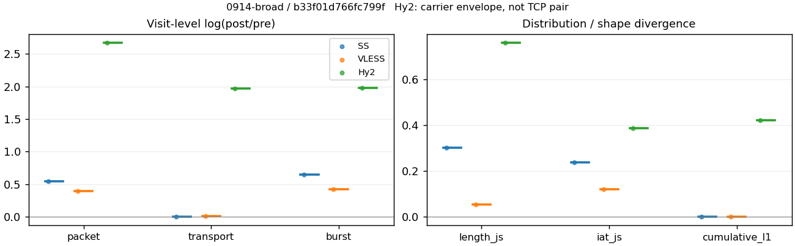
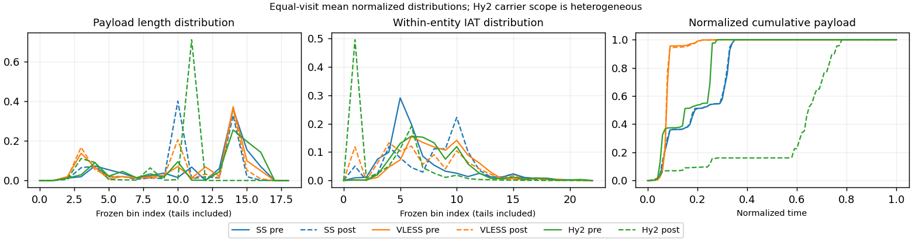

# 0914-broad · 条目 003 · youtube.com

目标：https://www.youtube.com/

活动标签：youtube.com::page_load。选定访问 3 次。

[返回总索引](../../README.md) · [统计口径](../../methods.md)

## 覆盖与资格（每次访问均保留）

| 部署 | 重复 | 主请求路由 | 活动状态 | 代理比较 | DIRECT pre | 请求 proxy/direct/unresolved | 错误 |
| --- | --- | --- | --- | --- | --- | --- | --- |
| Hy2 | 1 | proxy | passed | 1 | 1 | 172/1/0 | [] |
| SS | 1 | proxy | passed | 1 | 0 | 171/0/0 | [] |
| VLESS | 1 | proxy | passed | 1 | 0 | 172/0/0 | [] |

主请求非 proxy 的统计仅解释为已索引的辅助代理连接或 DIRECT 观测，不代表目标业务经代理传输。播放确认与配对资格是两道不同的门。

图中散点为单次访问，短线为重复中位数；Hy2 是共享载体包络，不能与 TCP 配对作等范围因果对比。

形态图先逐访问归一化，再对访问等权平均；实线 pre，虚线 post。分箱序号及边界见 methods，不将分箱索引误解为长度或时间。

## 每次访问的关键观测

### SS

范围：`exclusive_page`。每格 pre → post；空值为不可观测/不适用。

| 重复 | 包数 | 载荷字节 | burst | TCP FR | IAT中位µs | length JS | IAT JS |
| --- | --- | --- | --- | --- | --- | --- | --- |
| 1 | 4089 → 7070 | 7.4553e+06 → 7.5061e+06 | 2502 → 4791 | 187 → 194 | 20.966 → 295.73 | 0.30352 | 0.23746 |

完整标量统计：中位数 [min,max]；Δ 为重复内逐访问变换的中位数，MAD 未缩放。n 为可用变换数；DIRECT-only 的 nΔ=0 不代表 pre 不可用。

| scope | 特征 | pre | post | Δ | IQRΔ | MADΔ | nΔ |
| --- | --- | --- | --- | --- | --- | --- | --- |
| exclusive_page | active_span_sum_s_1000ms | 30.7 [30.7, 30.7] | 36.119 [36.119, 36.119] | 0.16255 | — | — | 1 |
| exclusive_page | active_span_sum_s_100ms | 8.1443 [8.1443, 8.1443] | 14.406 [14.406, 14.406] | 0.57029 | — | — | 1 |
| exclusive_page | active_span_sum_s_500ms | 22.344 [22.344, 22.344] | 27.296 [27.296, 27.296] | 0.20017 | — | — | 1 |
| exclusive_page | burst_bytes_iqr | 4096 [4096, 4096] | 2856 [2856, 2856] | -0.36059 | — | — | 1 |
| exclusive_page | burst_bytes_mad | 39 [39, 39] | 34 [34, 34] | -0.1372 | — | — | 1 |
| exclusive_page | burst_bytes_max | 28672 [28672, 28672] | 25704 [25704, 25704] | -0.10927 | — | — | 1 |
| exclusive_page | burst_bytes_mean | 2979.7 [2979.7, 2979.7] | 1566.7 [1566.7, 1566.7] | -0.64285 | — | — | 1 |
| exclusive_page | burst_bytes_median | 39 [39, 39] | 34 [34, 34] | -0.1372 | — | — | 1 |
| exclusive_page | burst_bytes_min | 0 [0, 0] | 0 [0, 0] | — | — | — | 0 |
| exclusive_page | burst_bytes_p95 | 14480 [14480, 14480] | 5712 [5712, 5712] | -0.9302 | — | — | 1 |
| exclusive_page | burst_bytes_q25 | 0 [0, 0] | 0 [0, 0] | — | — | — | 0 |
| exclusive_page | burst_bytes_q75 | 4096 [4096, 4096] | 2856 [2856, 2856] | -0.36059 | — | — | 1 |
| exclusive_page | burst_bytes_std | 5103.4 [5103.4, 5103.4] | 2370.6 [2370.6, 2370.6] | -0.76676 | — | — | 1 |
| exclusive_page | burst_count | 2502 [2502, 2502] | 4791 [4791, 4791] | 0.64965 | — | — | 1 |
| exclusive_page | burst_duration_ms_iqr | 0.026593 [0.026593, 0.026593] | 0.12014 [0.12014, 0.12014] | 1.508 | — | — | 1 |
| exclusive_page | burst_duration_ms_mad | 0 [0, 0] | 0 [0, 0] | — | — | — | 0 |
| exclusive_page | burst_duration_ms_max | 15001 [15001, 15001] | 2069.2 [2069.2, 2069.2] | -1.9809 | — | — | 1 |
| exclusive_page | burst_duration_ms_mean | 38.312 [38.312, 38.312] | 4.2402 [4.2402, 4.2402] | -2.2012 | — | — | 1 |
| exclusive_page | burst_duration_ms_median | 0 [0, 0] | 0 [0, 0] | — | — | — | 0 |
| exclusive_page | burst_duration_ms_min | 0 [0, 0] | 0 [0, 0] | — | — | — | 0 |
| exclusive_page | burst_duration_ms_p95 | 16.589 [16.589, 16.589] | 0.97065 [0.97065, 0.97065] | -2.8385 | — | — | 1 |
| exclusive_page | burst_duration_ms_q25 | 0 [0, 0] | 0 [0, 0] | — | — | — | 0 |
| exclusive_page | burst_duration_ms_q75 | 0.026593 [0.026593, 0.026593] | 0.12014 [0.12014, 0.12014] | 1.508 | — | — | 1 |
| exclusive_page | burst_duration_ms_std | 612.19 [612.19, 612.19] | 48.203 [48.203, 48.203] | -2.5416 | — | — | 1 |
| exclusive_page | burst_packets_iqr | 1 [1, 1] | 1 [1, 1] | 0 | — | — | 1 |
| exclusive_page | burst_packets_mad | 0 [0, 0] | 0 [0, 0] | — | — | — | 0 |
| exclusive_page | burst_packets_max | 16 [16, 16] | 10 [10, 10] | -0.47 | — | — | 1 |
| exclusive_page | burst_packets_mean | 1.6343 [1.6343, 1.6343] | 1.4757 [1.4757, 1.4757] | -0.10209 | — | — | 1 |
| exclusive_page | burst_packets_median | 1 [1, 1] | 1 [1, 1] | 0 | — | — | 1 |
| exclusive_page | burst_packets_min | 1 [1, 1] | 1 [1, 1] | 0 | — | — | 1 |
| exclusive_page | burst_packets_p95 | 4 [4, 4] | 3 [3, 3] | -0.28768 | — | — | 1 |
| exclusive_page | burst_packets_q25 | 1 [1, 1] | 1 [1, 1] | 0 | — | — | 1 |
| exclusive_page | burst_packets_q75 | 2 [2, 2] | 2 [2, 2] | 0 | — | — | 1 |
| exclusive_page | burst_packets_std | 1.3141 [1.3141, 1.3141] | 0.86526 [0.86526, 0.86526] | -0.41785 | — | — | 1 |
| exclusive_page | connection_span_concurrency_max | 12 [12, 12] | 12 [12, 12] | 0 | — | — | 1 |
| exclusive_page | cumulative_l1 | — | — | 0.0023682 | — | — | 1 |
| exclusive_page | cumulative_max | — | — | 0.043246 | — | — | 1 |
| exclusive_page | direction_entropy | 0.48546 [0.48546, 0.48546] | 0.32697 [0.32697, 0.32697] | -0.15849 | — | — | 1 |
| exclusive_page | down_burst_count | 1241 [1241, 1241] | 2386 [2386, 2386] | 0.6537 | — | — | 1 |
| exclusive_page | down_ip_bytes | 7.4988e+06 [7.4988e+06, 7.4988e+06] | 7.6211e+06 [7.6211e+06, 7.6211e+06] | 0.016183 | — | — | 1 |
| exclusive_page | down_packets | 2679 [2679, 2679] | 4320 [4320, 4320] | 0.47781 | — | — | 1 |
| exclusive_page | down_transport_bytes | 7.3593e+06 [7.3593e+06, 7.3593e+06] | 7.3959e+06 [7.3959e+06, 7.3959e+06] | 0.0049656 | — | — | 1 |
| exclusive_page | duration_s | 24.745 [24.745, 24.745] | 24.744 [24.744, 24.744] | -2.9353e-05 | — | — | 1 |
| exclusive_page | entity_count | 20 [20, 20] | 20 [20, 20] | 0 | — | — | 1 |
| exclusive_page | fr_runs | 187 [187, 187] | 194 [194, 194] | 0.03675 | — | — | 1 |
| exclusive_page | fr_runs_per_packet | 0.070301 [0.070301, 0.070301] | 0.04468 [0.04468, 0.04468] | -0.025621 | — | — | 1 |
| exclusive_page | fr_switches | 167 [167, 167] | 174 [174, 174] | 0.041061 | — | — | 1 |
| exclusive_page | fr_switches_per_possible_transition | 0.063258 [0.063258, 0.063258] | 0.040259 [0.040259, 0.040259] | -0.022998 | — | — | 1 |
| exclusive_page | full_retransmission_fraction | 0.0031793 [0.0031793, 0.0031793] | 0.0028289 [0.0028289, 0.0028289] | -0.00035041 | — | — | 1 |
| exclusive_page | full_retransmission_packets | 13 [13, 13] | 20 [20, 20] | 0.43078 | — | — | 1 |
| exclusive_page | iat_count | 4069 [4069, 4069] | 7050 [7050, 7050] | 0.54963 | — | — | 1 |
| exclusive_page | iat_js | — | — | 0.23746 | — | — | 1 |
| exclusive_page | iat_ks | — | — | 0.42208 | — | — | 1 |
| exclusive_page | iat_median_us | 20.966 [20.966, 20.966] | 295.73 [295.73, 295.73] | 2.6465 | — | — | 1 |
| exclusive_page | iat_us_iqr | 71.767 [71.767, 71.767] | 873.07 [873.07, 873.07] | 2.4986 | — | — | 1 |
| exclusive_page | iat_us_mad | 14.568 [14.568, 14.568] | 289.1 [289.1, 289.1] | 2.9879 | — | — | 1 |
| exclusive_page | iat_us_max | 1.5001e+07 [1.5001e+07, 1.5001e+07] | 1.5065e+07 [1.5065e+07, 1.5065e+07] | 0.0042374 | — | — | 1 |
| exclusive_page | iat_us_mean | 26664 [26664, 26664] | 15391 [15391, 15391] | -0.54956 | — | — | 1 |
| exclusive_page | iat_us_median | 20.966 [20.966, 20.966] | 295.73 [295.73, 295.73] | 2.6465 | — | — | 1 |
| exclusive_page | iat_us_min | 0.035 [0.035, 0.035] | 0.031 [0.031, 0.031] | -0.12136 | — | — | 1 |
| exclusive_page | iat_us_p95 | 26350 [26350, 26350] | 13154 [13154, 13154] | -0.6947 | — | — | 1 |
| exclusive_page | iat_us_q25 | 12.029 [12.029, 12.029] | 15.236 [15.236, 15.236] | 0.23636 | — | — | 1 |
| exclusive_page | iat_us_q75 | 83.796 [83.796, 83.796] | 888.31 [888.31, 888.31] | 2.3609 | — | — | 1 |
| exclusive_page | iat_us_std | 4.8184e+05 [4.8184e+05, 4.8184e+05] | 3.6413e+05 [3.6413e+05, 3.6413e+05] | -0.28011 | — | — | 1 |
| exclusive_page | iat_wasserstein_log1p_us | — | — | 1.4405 | — | — | 1 |
| exclusive_page | idle_gap_count_1000ms | 14 [14, 14] | 12 [12, 12] | -0.15415 | — | — | 1 |
| exclusive_page | idle_gap_count_100ms | 90 [90, 90] | 84 [84, 84] | -0.068993 | — | — | 1 |
| exclusive_page | idle_gap_count_500ms | 27 [27, 27] | 26 [26, 26] | -0.03774 | — | — | 1 |
| exclusive_page | idle_gap_sum_s_1000ms | 77.797 [77.797, 77.797] | 72.386 [72.386, 72.386] | -0.072099 | — | — | 1 |
| exclusive_page | idle_gap_sum_s_100ms | 100.35 [100.35, 100.35] | 94.099 [94.099, 94.099] | -0.064348 | — | — | 1 |
| exclusive_page | idle_gap_sum_s_500ms | 86.153 [86.153, 86.153] | 81.209 [81.209, 81.209] | -0.059107 | — | — | 1 |
| exclusive_page | ip_bytes | 7.6684e+06 [7.6684e+06, 7.6684e+06] | 7.9344e+06 [7.9344e+06, 7.9344e+06] | 0.034107 | — | — | 1 |
| exclusive_page | length_iqr | 1888 [1888, 1888] | 1428 [1428, 1428] | -0.27924 | — | — | 1 |
| exclusive_page | length_js | — | — | 0.30352 | — | — | 1 |
| exclusive_page | length_ks | — | — | 0.48982 | — | — | 1 |
| exclusive_page | length_mad | 1448 [1448, 1448] | 1235.5 [1235.5, 1235.5] | -0.15871 | — | — | 1 |
| exclusive_page | length_max | 8920 [8920, 8920] | 8568 [8568, 8568] | -0.040262 | — | — | 1 |
| exclusive_page | length_mean | 2802.7 [2802.7, 2802.7] | 1728.7 [1728.7, 1728.7] | -0.48321 | — | — | 1 |
| exclusive_page | length_median | 2896 [2896, 2896] | 1428 [1428, 1428] | -0.70706 | — | — | 1 |
| exclusive_page | length_min | 31 [31, 31] | 6 [6, 6] | -1.6422 | — | — | 1 |
| exclusive_page | length_p95 | 8192 [8192, 8192] | 2856 [2856, 2856] | -1.0537 | — | — | 1 |
| exclusive_page | length_q25 | 1216 [1216, 1216] | 1428 [1428, 1428] | 0.16071 | — | — | 1 |
| exclusive_page | length_q75 | 3104 [3104, 3104] | 2856 [2856, 2856] | -0.08327 | — | — | 1 |
| exclusive_page | length_std | 2333.2 [2333.2, 2333.2] | 1121.2 [1121.2, 1121.2] | -0.73283 | — | — | 1 |
| exclusive_page | length_wasserstein_bytes | — | — | 1141.8 | — | — | 1 |
| exclusive_page | nonempty_entity_count | 20 [20, 20] | 20 [20, 20] | 0 | — | — | 1 |
| exclusive_page | nonempty_packets | 2660 [2660, 2660] | 4342 [4342, 4342] | 0.49001 | — | — | 1 |
| exclusive_page | offload_suspect_fraction | 0.42186 [0.42186, 0.42186] | 0.23395 [0.23395, 0.23395] | -0.18792 | — | — | 1 |
| exclusive_page | packet_count | 4089 [4089, 4089] | 7070 [7070, 7070] | 0.54756 | — | — | 1 |
| exclusive_page | rtt_median_ms | 0.04918 [0.04918, 0.04918] | 32.368 [32.368, 32.368] | 6.4894 | — | — | 1 |
| exclusive_page | rtt_sample_count | 1382 [1382, 1382] | 729 [729, 729] | -0.63961 | — | — | 1 |
| exclusive_page | tcp_ack_count | 4069 [4069, 4069] | 7047 [7047, 7047] | 0.5492 | — | — | 1 |
| exclusive_page | tcp_fin_count | 40 [40, 40] | 42 [42, 42] | 0.04879 | — | — | 1 |
| exclusive_page | tcp_packet_count | 4089 [4089, 4089] | 7070 [7070, 7070] | 0.54756 | — | — | 1 |
| exclusive_page | tcp_rst_count | 0 [0, 0] | 0 [0, 0] | — | — | — | 0 |
| exclusive_page | tcp_syn_count | 40 [40, 40] | 43 [43, 43] | 0.072321 | — | — | 1 |
| exclusive_page | tcp_window_raw_median | 65535 [65535, 65535] | 165 [165, 165] | -5.9844 | — | — | 1 |
| exclusive_page | transition_entropy | 0.28117 [0.28117, 0.28117] | 0.18889 [0.18889, 0.18889] | -0.092281 | — | — | 1 |
| exclusive_page | transition_n_mm | 2291 [2291, 2291] | 3990 [3990, 3990] | 0.5548 | — | — | 1 |
| exclusive_page | transition_n_mp | 78 [78, 78] | 82 [82, 82] | 0.05001 | — | — | 1 |
| exclusive_page | transition_n_pm | 89 [89, 89] | 92 [92, 92] | 0.033152 | — | — | 1 |
| exclusive_page | transition_n_pp | 182 [182, 182] | 158 [158, 158] | -0.14141 | — | — | 1 |
| exclusive_page | transition_p_mm | 0.96707 [0.96707, 0.96707] | 0.97986 [0.97986, 0.97986] | 0.012788 | — | — | 1 |
| exclusive_page | transition_p_mp | 0.032925 [0.032925, 0.032925] | 0.020138 [0.020138, 0.020138] | -0.012788 | — | — | 1 |
| exclusive_page | transition_p_pm | 0.32841 [0.32841, 0.32841] | 0.368 [0.368, 0.368] | 0.039587 | — | — | 1 |
| exclusive_page | transition_p_pp | 0.67159 [0.67159, 0.67159] | 0.632 [0.632, 0.632] | -0.039587 | — | — | 1 |
| exclusive_page | transport_bytes | 7.4553e+06 [7.4553e+06, 7.4553e+06] | 7.5061e+06 [7.5061e+06, 7.5061e+06] | 0.0067946 | — | — | 1 |
| exclusive_page | up_burst_count | 1261 [1261, 1261] | 2405 [2405, 2405] | 0.64564 | — | — | 1 |
| exclusive_page | up_byte_fraction | 0.012877 [0.012877, 0.012877] | 0.014681 [0.014681, 0.014681] | 0.0018038 | — | — | 1 |
| exclusive_page | up_ip_bytes | 1.6964e+05 [1.6964e+05, 1.6964e+05] | 3.1336e+05 [3.1336e+05, 3.1336e+05] | 0.61367 | — | — | 1 |
| exclusive_page | up_packets | 1410 [1410, 1410] | 2750 [2750, 2750] | 0.66801 | — | — | 1 |
| exclusive_page | up_transport_bytes | 96003 [96003, 96003] | 1.102e+05 [1.102e+05, 1.102e+05] | 0.13789 | — | — | 1 |
| exclusive_page | zero_iat_count | 0 [0, 0] | 0 [0, 0] | — | — | — | 0 |
| exclusive_page | zero_iat_fraction | 0 [0, 0] | 0 [0, 0] | 0 | — | — | 1 |

### VLESS

范围：`exclusive_page`。每格 pre → post；空值为不可观测/不适用。

| 重复 | 包数 | 载荷字节 | burst | TCP FR | IAT中位µs | length JS | IAT JS |
| --- | --- | --- | --- | --- | --- | --- | --- |
| 1 | 3199 → 4771 | 4.9327e+06 → 5.0038e+06 | 2094 → 3186 | 104 → 128 | 148.69 → 34.961 | 0.054208 | 0.12135 |

完整标量统计：中位数 [min,max]；Δ 为重复内逐访问变换的中位数，MAD 未缩放。n 为可用变换数；DIRECT-only 的 nΔ=0 不代表 pre 不可用。

| scope | 特征 | pre | post | Δ | IQRΔ | MADΔ | nΔ |
| --- | --- | --- | --- | --- | --- | --- | --- |
| exclusive_page | active_span_sum_s_1000ms | 18.201 [18.201, 18.201] | 17.977 [17.977, 17.977] | -0.012378 | — | — | 1 |
| exclusive_page | active_span_sum_s_100ms | 3.5807 [3.5807, 3.5807] | 7.7284 [7.7284, 7.7284] | 0.76935 | — | — | 1 |
| exclusive_page | active_span_sum_s_500ms | 10.135 [10.135, 10.135] | 17.287 [17.287, 17.287] | 0.53393 | — | — | 1 |
| exclusive_page | burst_bytes_iqr | 2896 [2896, 2896] | 2856 [2856, 2856] | -0.013908 | — | — | 1 |
| exclusive_page | burst_bytes_mad | 31 [31, 31] | 60 [60, 60] | 0.66036 | — | — | 1 |
| exclusive_page | burst_bytes_max | 20480 [20480, 20480] | 19240 [19240, 19240] | -0.062457 | — | — | 1 |
| exclusive_page | burst_bytes_mean | 2355.6 [2355.6, 2355.6] | 1570.6 [1570.6, 1570.6] | -0.40538 | — | — | 1 |
| exclusive_page | burst_bytes_median | 31 [31, 31] | 60 [60, 60] | 0.66036 | — | — | 1 |
| exclusive_page | burst_bytes_min | 0 [0, 0] | 0 [0, 0] | — | — | — | 0 |
| exclusive_page | burst_bytes_p95 | 11584 [11584, 11584] | 5712 [5712, 5712] | -0.70706 | — | — | 1 |
| exclusive_page | burst_bytes_q25 | 0 [0, 0] | 0 [0, 0] | — | — | — | 0 |
| exclusive_page | burst_bytes_q75 | 2896 [2896, 2896] | 2856 [2856, 2856] | -0.013908 | — | — | 1 |
| exclusive_page | burst_bytes_std | 3994.9 [3994.9, 3994.9] | 2264.1 [2264.1, 2264.1] | -0.56783 | — | — | 1 |
| exclusive_page | burst_count | 2094 [2094, 2094] | 3186 [3186, 3186] | 0.41969 | — | — | 1 |
| exclusive_page | burst_duration_ms_iqr | 0.39532 [0.39532, 0.39532] | 0.003614 [0.003614, 0.003614] | -4.6949 | — | — | 1 |
| exclusive_page | burst_duration_ms_mad | 0 [0, 0] | 0 [0, 0] | — | — | — | 0 |
| exclusive_page | burst_duration_ms_max | 805.54 [805.54, 805.54] | 378.79 [378.79, 378.79] | -0.75452 | — | — | 1 |
| exclusive_page | burst_duration_ms_mean | 7.3599 [7.3599, 7.3599] | 3.5634 [3.5634, 3.5634] | -0.72534 | — | — | 1 |
| exclusive_page | burst_duration_ms_median | 0 [0, 0] | 0 [0, 0] | — | — | — | 0 |
| exclusive_page | burst_duration_ms_min | 0 [0, 0] | 0 [0, 0] | — | — | — | 0 |
| exclusive_page | burst_duration_ms_p95 | 4.4084 [4.4084, 4.4084] | 3.552 [3.552, 3.552] | -0.21599 | — | — | 1 |
| exclusive_page | burst_duration_ms_q25 | 0 [0, 0] | 0 [0, 0] | — | — | — | 0 |
| exclusive_page | burst_duration_ms_q75 | 0.39532 [0.39532, 0.39532] | 0.003614 [0.003614, 0.003614] | -4.6949 | — | — | 1 |
| exclusive_page | burst_duration_ms_std | 54.413 [54.413, 54.413] | 25.193 [25.193, 25.193] | -0.77005 | — | — | 1 |
| exclusive_page | burst_packets_iqr | 1 [1, 1] | 1 [1, 1] | 0 | — | — | 1 |
| exclusive_page | burst_packets_mad | 0 [0, 0] | 0 [0, 0] | — | — | — | 0 |
| exclusive_page | burst_packets_max | 12 [12, 12] | 8 [8, 8] | -0.40547 | — | — | 1 |
| exclusive_page | burst_packets_mean | 1.5277 [1.5277, 1.5277] | 1.4975 [1.4975, 1.4975] | -0.019972 | — | — | 1 |
| exclusive_page | burst_packets_median | 1 [1, 1] | 1 [1, 1] | 0 | — | — | 1 |
| exclusive_page | burst_packets_min | 1 [1, 1] | 1 [1, 1] | 0 | — | — | 1 |
| exclusive_page | burst_packets_p95 | 3 [3, 3] | 3 [3, 3] | 0 | — | — | 1 |
| exclusive_page | burst_packets_q25 | 1 [1, 1] | 1 [1, 1] | 0 | — | — | 1 |
| exclusive_page | burst_packets_q75 | 2 [2, 2] | 2 [2, 2] | 0 | — | — | 1 |
| exclusive_page | burst_packets_std | 0.84238 [0.84238, 0.84238] | 0.89612 [0.89612, 0.89612] | 0.061853 | — | — | 1 |
| exclusive_page | connection_span_concurrency_max | 9 [9, 9] | 9 [9, 9] | 0 | — | — | 1 |
| exclusive_page | cumulative_l1 | — | — | 0.002389 | — | — | 1 |
| exclusive_page | cumulative_max | — | — | 0.085728 | — | — | 1 |
| exclusive_page | direction_entropy | 0.39923 [0.39923, 0.39923] | 0.27747 [0.27747, 0.27747] | -0.12176 | — | — | 1 |
| exclusive_page | down_burst_count | 1041 [1041, 1041] | 1587 [1587, 1587] | 0.42166 | — | — | 1 |
| exclusive_page | down_ip_bytes | 4.9921e+06 [4.9921e+06, 4.9921e+06] | 5.0748e+06 [5.0748e+06, 5.0748e+06] | 0.016419 | — | — | 1 |
| exclusive_page | down_packets | 2060 [2060, 2060] | 2770 [2770, 2770] | 0.29614 | — | — | 1 |
| exclusive_page | down_transport_bytes | 4.8849e+06 [4.8849e+06, 4.8849e+06] | 4.9306e+06 [4.9306e+06, 4.9306e+06] | 0.0093167 | — | — | 1 |
| exclusive_page | duration_s | 20.696 [20.696, 20.696] | 20.672 [20.672, 20.672] | -0.0011898 | — | — | 1 |
| exclusive_page | entity_count | 12 [12, 12] | 12 [12, 12] | 0 | — | — | 1 |
| exclusive_page | fr_runs | 104 [104, 104] | 128 [128, 128] | 0.20764 | — | — | 1 |
| exclusive_page | fr_runs_per_packet | 0.05051 [0.05051, 0.05051] | 0.046818 [0.046818, 0.046818] | -0.0036921 | — | — | 1 |
| exclusive_page | fr_switches | 92 [92, 92] | 116 [116, 116] | 0.2318 | — | — | 1 |
| exclusive_page | fr_switches_per_possible_transition | 0.044944 [0.044944, 0.044944] | 0.042616 [0.042616, 0.042616] | -0.0023281 | — | — | 1 |
| exclusive_page | full_retransmission_fraction | 0.0021882 [0.0021882, 0.0021882] | 0 [0, 0] | -0.0021882 | — | — | 1 |
| exclusive_page | full_retransmission_packets | 7 [7, 7] | 0 [0, 0] | — | — | — | 0 |
| exclusive_page | iat_count | 3187 [3187, 3187] | 4759 [4759, 4759] | 0.40096 | — | — | 1 |
| exclusive_page | iat_js | — | — | 0.12135 | — | — | 1 |
| exclusive_page | iat_ks | — | — | 0.28953 | — | — | 1 |
| exclusive_page | iat_median_us | 148.69 [148.69, 148.69] | 34.961 [34.961, 34.961] | -1.4477 | — | — | 1 |
| exclusive_page | iat_us_iqr | 797.13 [797.13, 797.13] | 610.56 [610.56, 610.56] | -0.26665 | — | — | 1 |
| exclusive_page | iat_us_mad | 136.23 [136.23, 136.23] | 34.905 [34.905, 34.905] | -1.3617 | — | — | 1 |
| exclusive_page | iat_us_max | 1.446e+07 [1.446e+07, 1.446e+07] | 1.4412e+07 [1.4412e+07, 1.4412e+07] | -0.0033269 | — | — | 1 |
| exclusive_page | iat_us_mean | 11875 [11875, 11875] | 7858.9 [7858.9, 7858.9] | -0.4128 | — | — | 1 |
| exclusive_page | iat_us_median | 148.69 [148.69, 148.69] | 34.961 [34.961, 34.961] | -1.4477 | — | — | 1 |
| exclusive_page | iat_us_min | 0.155 [0.155, 0.155] | 0.03 [0.03, 0.03] | -1.6422 | — | — | 1 |
| exclusive_page | iat_us_p95 | 6914.5 [6914.5, 6914.5] | 8176.7 [8176.7, 8176.7] | 0.16767 | — | — | 1 |
| exclusive_page | iat_us_q25 | 40.502 [40.502, 40.502] | 7.4825 [7.4825, 7.4825] | -1.6888 | — | — | 1 |
| exclusive_page | iat_us_q75 | 837.63 [837.63, 837.63] | 618.04 [618.04, 618.04] | -0.30403 | — | — | 1 |
| exclusive_page | iat_us_std | 2.6576e+05 [2.6576e+05, 2.6576e+05] | 2.1479e+05 [2.1479e+05, 2.1479e+05] | -0.21295 | — | — | 1 |
| exclusive_page | iat_wasserstein_log1p_us | — | — | 1.1943 | — | — | 1 |
| exclusive_page | idle_gap_count_1000ms | 4 [4, 4] | 4 [4, 4] | 0 | — | — | 1 |
| exclusive_page | idle_gap_count_100ms | 52 [52, 52] | 59 [59, 59] | 0.12629 | — | — | 1 |
| exclusive_page | idle_gap_count_500ms | 17 [17, 17] | 5 [5, 5] | -1.2238 | — | — | 1 |
| exclusive_page | idle_gap_sum_s_1000ms | 19.645 [19.645, 19.645] | 19.423 [19.423, 19.423] | -0.011344 | — | — | 1 |
| exclusive_page | idle_gap_sum_s_100ms | 34.266 [34.266, 34.266] | 29.672 [29.672, 29.672] | -0.14393 | — | — | 1 |
| exclusive_page | idle_gap_sum_s_500ms | 27.711 [27.711, 27.711] | 20.114 [20.114, 20.114] | -0.32042 | — | — | 1 |
| exclusive_page | ip_bytes | 5.099e+06 [5.099e+06, 5.099e+06] | 5.2556e+06 [5.2556e+06, 5.2556e+06] | 0.030247 | — | — | 1 |
| exclusive_page | length_iqr | 2374 [2374, 2374] | 2663 [2663, 2663] | 0.11488 | — | — | 1 |
| exclusive_page | length_js | — | — | 0.054208 | — | — | 1 |
| exclusive_page | length_ks | — | — | 0.1486 | — | — | 1 |
| exclusive_page | length_mad | 1396 [1396, 1396] | 1388 [1388, 1388] | -0.0057471 | — | — | 1 |
| exclusive_page | length_max | 8920 [8920, 8920] | 13528 [13528, 13528] | 0.41647 | — | — | 1 |
| exclusive_page | length_mean | 2395.7 [2395.7, 2395.7] | 1830.2 [1830.2, 1830.2] | -0.26924 | — | — | 1 |
| exclusive_page | length_median | 2824 [2824, 2824] | 1428 [1428, 1428] | -0.68188 | — | — | 1 |
| exclusive_page | length_min | 19 [19, 19] | 19 [19, 19] | 0 | — | — | 1 |
| exclusive_page | length_p95 | 7280 [7280, 7280] | 4344 [4344, 4344] | -0.51634 | — | — | 1 |
| exclusive_page | length_q25 | 512 [512, 512] | 193 [193, 193] | -0.97563 | — | — | 1 |
| exclusive_page | length_q75 | 2886 [2886, 2886] | 2856 [2856, 2856] | -0.010449 | — | — | 1 |
| exclusive_page | length_std | 2208 [2208, 2208] | 1584.8 [1584.8, 1584.8] | -0.33163 | — | — | 1 |
| exclusive_page | length_wasserstein_bytes | — | — | 581.29 | — | — | 1 |
| exclusive_page | nonempty_entity_count | 12 [12, 12] | 12 [12, 12] | 0 | — | — | 1 |
| exclusive_page | nonempty_packets | 2059 [2059, 2059] | 2734 [2734, 2734] | 0.28355 | — | — | 1 |
| exclusive_page | offload_suspect_fraction | 0.39356 [0.39356, 0.39356] | 0.26661 [0.26661, 0.26661] | -0.12695 | — | — | 1 |
| exclusive_page | packet_count | 3199 [3199, 3199] | 4771 [4771, 4771] | 0.39972 | — | — | 1 |
| exclusive_page | rtt_median_ms | 0.35717 [0.35717, 0.35717] | 0.031233 [0.031233, 0.031233] | -2.4367 | — | — | 1 |
| exclusive_page | rtt_sample_count | 1092 [1092, 1092] | 1916 [1916, 1916] | 0.56223 | — | — | 1 |
| exclusive_page | tcp_ack_count | 3163 [3163, 3163] | 4759 [4759, 4759] | 0.40852 | — | — | 1 |
| exclusive_page | tcp_fin_count | 24 [24, 24] | 24 [24, 24] | 0 | — | — | 1 |
| exclusive_page | tcp_packet_count | 3199 [3199, 3199] | 4771 [4771, 4771] | 0.39972 | — | — | 1 |
| exclusive_page | tcp_rst_count | 24 [24, 24] | 0 [0, 0] | — | — | — | 0 |
| exclusive_page | tcp_syn_count | 24 [24, 24] | 24 [24, 24] | 0 | — | — | 1 |
| exclusive_page | tcp_window_raw_median | 65535 [65535, 65535] | 246 [246, 246] | -5.585 | — | — | 1 |
| exclusive_page | transition_entropy | 0.20842 [0.20842, 0.20842] | 0.18311 [0.18311, 0.18311] | -0.025308 | — | — | 1 |
| exclusive_page | transition_n_mm | 1844 [1844, 1844] | 2539 [2539, 2539] | 0.31983 | — | — | 1 |
| exclusive_page | transition_n_mp | 40 [40, 40] | 52 [52, 52] | 0.26236 | — | — | 1 |
| exclusive_page | transition_n_pm | 52 [52, 52] | 64 [64, 64] | 0.20764 | — | — | 1 |
| exclusive_page | transition_n_pp | 111 [111, 111] | 67 [67, 67] | -0.50484 | — | — | 1 |
| exclusive_page | transition_p_mm | 0.97877 [0.97877, 0.97877] | 0.97993 [0.97993, 0.97993] | 0.001162 | — | — | 1 |
| exclusive_page | transition_p_mp | 0.021231 [0.021231, 0.021231] | 0.020069 [0.020069, 0.020069] | -0.001162 | — | — | 1 |
| exclusive_page | transition_p_pm | 0.31902 [0.31902, 0.31902] | 0.48855 [0.48855, 0.48855] | 0.16953 | — | — | 1 |
| exclusive_page | transition_p_pp | 0.68098 [0.68098, 0.68098] | 0.51145 [0.51145, 0.51145] | -0.16953 | — | — | 1 |
| exclusive_page | transport_bytes | 4.9327e+06 [4.9327e+06, 4.9327e+06] | 5.0038e+06 [5.0038e+06, 5.0038e+06] | 0.014309 | — | — | 1 |
| exclusive_page | up_burst_count | 1053 [1053, 1053] | 1599 [1599, 1599] | 0.41774 | — | — | 1 |
| exclusive_page | up_byte_fraction | 0.0096866 [0.0096866, 0.0096866] | 0.014618 [0.014618, 0.014618] | 0.0049313 | — | — | 1 |
| exclusive_page | up_ip_bytes | 1.069e+05 [1.069e+05, 1.069e+05] | 1.8084e+05 [1.8084e+05, 1.8084e+05] | 0.52574 | — | — | 1 |
| exclusive_page | up_packets | 1139 [1139, 1139] | 2001 [2001, 2001] | 0.5635 | — | — | 1 |
| exclusive_page | up_transport_bytes | 47781 [47781, 47781] | 73145 [73145, 73145] | 0.42582 | — | — | 1 |
| exclusive_page | zero_iat_count | 0 [0, 0] | 0 [0, 0] | — | — | — | 0 |
| exclusive_page | zero_iat_fraction | 0 [0, 0] | 0 [0, 0] | 0 | — | — | 1 |

### Hy2

范围：`carrier_context_envelope`。每格 pre → post；空值为不可观测/不适用。

| 重复 | 包数 | 载荷字节 | burst | TCP FR | IAT中位µs | length JS | IAT JS |
| --- | --- | --- | --- | --- | --- | --- | --- |
| 1 | 3320 → 47884 | 7.4001e+06 → 5.289e+07 | 2066 → 14980 | — | 83.812 → 1.386 | 0.76038 | 0.38738 |

范围：`direct_pre_only`。每格 pre → post；空值为不可观测/不适用。

| 重复 | 包数 | 载荷字节 | burst | TCP FR | IAT中位µs | length JS | IAT JS |
| --- | --- | --- | --- | --- | --- | --- | --- |
| 1 | 30 → — | 8636 → — | 21 → — | 7 → — | 179.54 → — | — | — |

完整标量统计：中位数 [min,max]；Δ 为重复内逐访问变换的中位数，MAD 未缩放。n 为可用变换数；DIRECT-only 的 nΔ=0 不代表 pre 不可用。

| scope | 特征 | pre | post | Δ | IQRΔ | MADΔ | nΔ |
| --- | --- | --- | --- | --- | --- | --- | --- |
| carrier_context_envelope | active_span_sum_s_1000ms | 16.958 [16.958, 16.958] | 11.326 [11.326, 11.326] | -0.40361 | — | — | 1 |
| carrier_context_envelope | active_span_sum_s_100ms | 3.7451 [3.7451, 3.7451] | 7.1753 [7.1753, 7.1753] | 0.65019 | — | — | 1 |
| carrier_context_envelope | active_span_sum_s_500ms | 14.061 [14.061, 14.061] | 11.326 [11.326, 11.326] | -0.21629 | — | — | 1 |
| carrier_context_envelope | burst_bytes_iqr | 5660 [5660, 5660] | 5099 [5099, 5099] | -0.10438 | — | — | 1 |
| carrier_context_envelope | burst_bytes_mad | 39 [39, 39] | 267 [267, 267] | 1.9237 | — | — | 1 |
| carrier_context_envelope | burst_bytes_max | 27944 [27944, 27944] | 2.7002e+05 [2.7002e+05, 2.7002e+05] | 2.2683 | — | — | 1 |
| carrier_context_envelope | burst_bytes_mean | 3581.9 [3581.9, 3581.9] | 3530.7 [3530.7, 3530.7] | -0.014389 | — | — | 1 |
| carrier_context_envelope | burst_bytes_median | 39 [39, 39] | 300 [300, 300] | 2.0402 | — | — | 1 |
| carrier_context_envelope | burst_bytes_min | 0 [0, 0] | 22 [22, 22] | — | — | — | 0 |
| carrier_context_envelope | burst_bytes_p95 | 19112 [19112, 19112] | 11528 [11528, 11528] | -0.50552 | — | — | 1 |
| carrier_context_envelope | burst_bytes_q25 | 0 [0, 0] | 69 [69, 69] | — | — | — | 0 |
| carrier_context_envelope | burst_bytes_q75 | 5660 [5660, 5660] | 5168 [5168, 5168] | -0.090938 | — | — | 1 |
| carrier_context_envelope | burst_bytes_std | 5843.3 [5843.3, 5843.3] | 8415.1 [8415.1, 8415.1] | 0.36473 | — | — | 1 |
| carrier_context_envelope | burst_count | 2066 [2066, 2066] | 14980 [14980, 14980] | 1.9811 | — | — | 1 |
| carrier_context_envelope | burst_duration_ms_iqr | 0.091224 [0.091224, 0.091224] | 0.025913 [0.025913, 0.025913] | -1.2586 | — | — | 1 |
| carrier_context_envelope | burst_duration_ms_mad | 0 [0, 0] | 4.7e-05 [4.7e-05, 4.7e-05] | — | — | — | 0 |
| carrier_context_envelope | burst_duration_ms_max | 15001 [15001, 15001] | 225.02 [225.02, 225.02] | -4.1997 | — | — | 1 |
| carrier_context_envelope | burst_duration_ms_mean | 62.04 [62.04, 62.04] | 0.24 [0.24, 0.24] | -5.5549 | — | — | 1 |
| carrier_context_envelope | burst_duration_ms_median | 0 [0, 0] | 4.7e-05 [4.7e-05, 4.7e-05] | — | — | — | 0 |
| carrier_context_envelope | burst_duration_ms_min | 0 [0, 0] | 0 [0, 0] | — | — | — | 0 |
| carrier_context_envelope | burst_duration_ms_p95 | 6.9147 [6.9147, 6.9147] | 0.14465 [0.14465, 0.14465] | -3.8671 | — | — | 1 |
| carrier_context_envelope | burst_duration_ms_q25 | 0 [0, 0] | 0 [0, 0] | — | — | — | 0 |
| carrier_context_envelope | burst_duration_ms_q75 | 0.091224 [0.091224, 0.091224] | 0.025913 [0.025913, 0.025913] | -1.2586 | — | — | 1 |
| carrier_context_envelope | burst_duration_ms_std | 876.67 [876.67, 876.67] | 4.3482 [4.3482, 4.3482] | -5.3064 | — | — | 1 |
| carrier_context_envelope | burst_packets_iqr | 1 [1, 1] | 3 [3, 3] | 1.0986 | — | — | 1 |
| carrier_context_envelope | burst_packets_mad | 0 [0, 0] | 1 [1, 1] | — | — | — | 0 |
| carrier_context_envelope | burst_packets_max | 24 [24, 24] | 194 [194, 194] | 2.0898 | — | — | 1 |
| carrier_context_envelope | burst_packets_mean | 1.607 [1.607, 1.607] | 3.1965 [3.1965, 3.1965] | 0.68772 | — | — | 1 |
| carrier_context_envelope | burst_packets_median | 1 [1, 1] | 2 [2, 2] | 0.69315 | — | — | 1 |
| carrier_context_envelope | burst_packets_min | 1 [1, 1] | 1 [1, 1] | 0 | — | — | 1 |
| carrier_context_envelope | burst_packets_p95 | 3 [3, 3] | 9 [9, 9] | 1.0986 | — | — | 1 |
| carrier_context_envelope | burst_packets_q25 | 1 [1, 1] | 1 [1, 1] | 0 | — | — | 1 |
| carrier_context_envelope | burst_packets_q75 | 2 [2, 2] | 4 [4, 4] | 0.69315 | — | — | 1 |
| carrier_context_envelope | burst_packets_std | 1.134 [1.134, 1.134] | 5.9177 [5.9177, 5.9177] | 1.6522 | — | — | 1 |
| carrier_context_envelope | connection_span_concurrency_max | 11 [11, 11] | 1 [1, 1] | -2.3979 | — | — | 1 |
| carrier_context_envelope | cumulative_l1 | — | — | 0.42376 | — | — | 1 |
| carrier_context_envelope | cumulative_max | — | — | 0.83995 | — | — | 1 |
| carrier_context_envelope | direction_entropy | 0.54569 [0.54569, 0.54569] | 0.7277 [0.7277, 0.7277] | 0.18201 | — | — | 1 |
| carrier_context_envelope | direction_run_analog_runs | 169 [169, 169] | 14980 [14980, 14980] | 4.4846 | — | — | 1 |
| carrier_context_envelope | direction_run_analog_runs_per_packet | 0.079009 [0.079009, 0.079009] | 0.31284 [0.31284, 0.31284] | 0.23383 | — | — | 1 |
| carrier_context_envelope | direction_run_analog_switches | 155 [155, 155] | 14979 [14979, 14979] | 4.571 | — | — | 1 |
| carrier_context_envelope | direction_run_analog_switches_per_possible_transition | 0.072941 [0.072941, 0.072941] | 0.31283 [0.31283, 0.31283] | 0.23988 | — | — | 1 |
| carrier_context_envelope | down_burst_count | 1026 [1026, 1026] | 7490 [7490, 7490] | 1.9879 | — | — | 1 |
| carrier_context_envelope | down_ip_bytes | 7.4413e+06 [7.4413e+06, 7.4413e+06] | 5.3218e+07 [5.3218e+07, 5.3218e+07] | 1.9673 | — | — | 1 |
| carrier_context_envelope | down_packets | 2158 [2158, 2158] | 38168 [38168, 38168] | 2.8728 | — | — | 1 |
| carrier_context_envelope | down_transport_bytes | 7.329e+06 [7.329e+06, 7.329e+06] | 5.2149e+07 [5.2149e+07, 5.2149e+07] | 1.9623 | — | — | 1 |
| carrier_context_envelope | duration_s | 19.264 [19.264, 19.264] | 19.261 [19.261, 19.261] | -0.00016567 | — | — | 1 |
| carrier_context_envelope | entity_count | 14 [14, 14] | 1 [1, 1] | -2.6391 | — | — | 1 |
| carrier_context_envelope | full_retransmission_fraction | 0.0036145 [0.0036145, 0.0036145] | — | — | — | — | 0 |
| carrier_context_envelope | full_retransmission_packets | 12 [12, 12] | — | — | — | — | 0 |
| carrier_context_envelope | iat_count | 3306 [3306, 3306] | 47883 [47883, 47883] | 2.673 | — | — | 1 |
| carrier_context_envelope | iat_js | — | — | 0.38738 | — | — | 1 |
| carrier_context_envelope | iat_ks | — | — | 0.53008 | — | — | 1 |
| carrier_context_envelope | iat_median_us | 83.812 [83.812, 83.812] | 1.386 [1.386, 1.386] | -4.1022 | — | — | 1 |
| carrier_context_envelope | iat_us_iqr | 515.73 [515.73, 515.73] | 24.743 [24.743, 24.743] | -3.037 | — | — | 1 |
| carrier_context_envelope | iat_us_mad | 71.961 [71.961, 71.961] | 1.351 [1.351, 1.351] | -3.9753 | — | — | 1 |
| carrier_context_envelope | iat_us_max | 1.5001e+07 [1.5001e+07, 1.5001e+07] | 3.8584e+06 [3.8584e+06, 3.8584e+06] | -1.3579 | — | — | 1 |
| carrier_context_envelope | iat_us_mean | 57845 [57845, 57845] | 402.25 [402.25, 402.25] | -4.9685 | — | — | 1 |
| carrier_context_envelope | iat_us_median | 83.812 [83.812, 83.812] | 1.386 [1.386, 1.386] | -4.1022 | — | — | 1 |
| carrier_context_envelope | iat_us_min | 0.243 [0.243, 0.243] | 0.002 [0.002, 0.002] | -4.7999 | — | — | 1 |
| carrier_context_envelope | iat_us_p95 | 5380.8 [5380.8, 5380.8] | 158.76 [158.76, 158.76] | -3.5232 | — | — | 1 |
| carrier_context_envelope | iat_us_q25 | 23.175 [23.175, 23.175] | 0.051 [0.051, 0.051] | -6.119 | — | — | 1 |
| carrier_context_envelope | iat_us_q75 | 538.9 [538.9, 538.9] | 24.794 [24.794, 24.794] | -3.0789 | — | — | 1 |
| carrier_context_envelope | iat_us_std | 8.6027e+05 [8.6027e+05, 8.6027e+05] | 22819 [22819, 22819] | -3.6296 | — | — | 1 |
| carrier_context_envelope | iat_wasserstein_log1p_us | — | — | 3.0541 | — | — | 1 |
| carrier_context_envelope | idle_gap_count_1000ms | 18 [18, 18] | 3 [3, 3] | -1.7918 | — | — | 1 |
| carrier_context_envelope | idle_gap_count_100ms | 73 [73, 73] | 30 [30, 30] | -0.88926 | — | — | 1 |
| carrier_context_envelope | idle_gap_count_500ms | 22 [22, 22] | 3 [3, 3] | -1.9924 | — | — | 1 |
| carrier_context_envelope | idle_gap_sum_s_1000ms | 174.28 [174.28, 174.28] | 7.9346 [7.9346, 7.9346] | -3.0894 | — | — | 1 |
| carrier_context_envelope | idle_gap_sum_s_100ms | 187.49 [187.49, 187.49] | 12.085 [12.085, 12.085] | -2.7417 | — | — | 1 |
| carrier_context_envelope | idle_gap_sum_s_500ms | 177.17 [177.17, 177.17] | 7.9346 [7.9346, 7.9346] | -3.1059 | — | — | 1 |
| carrier_context_envelope | ip_bytes | 7.5731e+06 [7.5731e+06, 7.5731e+06] | 5.4231e+07 [5.4231e+07, 5.4231e+07] | 1.9686 | — | — | 1 |
| carrier_context_envelope | length_iqr | 4522.5 [4522.5, 4522.5] | 596 [596, 596] | -2.0266 | — | — | 1 |
| carrier_context_envelope | length_js | — | — | 0.76038 | — | — | 1 |
| carrier_context_envelope | length_ks | — | — | 0.64236 | — | — | 1 |
| carrier_context_envelope | length_mad | 2199 [2199, 2199] | 0 [0, 0] | — | — | — | 0 |
| carrier_context_envelope | length_max | 8920 [8920, 8920] | 1441 [1441, 1441] | -1.823 | — | — | 1 |
| carrier_context_envelope | length_mean | 3459.6 [3459.6, 3459.6] | 1104.5 [1104.5, 1104.5] | -1.1417 | — | — | 1 |
| carrier_context_envelope | length_median | 2830 [2830, 2830] | 1441 [1441, 1441] | -0.67494 | — | — | 1 |
| carrier_context_envelope | length_min | 31 [31, 31] | 22 [22, 22] | -0.34294 | — | — | 1 |
| carrier_context_envelope | length_p95 | 8920 [8920, 8920] | 1441 [1441, 1441] | -1.823 | — | — | 1 |
| carrier_context_envelope | length_q25 | 1137.5 [1137.5, 1137.5] | 845 [845, 845] | -0.29725 | — | — | 1 |
| carrier_context_envelope | length_q75 | 5660 [5660, 5660] | 1441 [1441, 1441] | -1.3681 | — | — | 1 |
| carrier_context_envelope | length_std | 2965.5 [2965.5, 2965.5] | 563.33 [563.33, 563.33] | -1.6609 | — | — | 1 |
| carrier_context_envelope | length_wasserstein_bytes | — | — | 2358.9 | — | — | 1 |
| carrier_context_envelope | nonempty_entity_count | 14 [14, 14] | 1 [1, 1] | -2.6391 | — | — | 1 |
| carrier_context_envelope | nonempty_packets | 2139 [2139, 2139] | 47884 [47884, 47884] | 3.1084 | — | — | 1 |
| carrier_context_envelope | offload_suspect_fraction | 0.41386 [0.41386, 0.41386] | 0 [0, 0] | -0.41386 | — | — | 1 |
| carrier_context_envelope | packet_count | 3320 [3320, 3320] | 47884 [47884, 47884] | 2.6688 | — | — | 1 |
| carrier_context_envelope | rtt_median_ms | 0.11613 [0.11613, 0.11613] | — | — | — | — | 0 |
| carrier_context_envelope | rtt_sample_count | 1139 [1139, 1139] | 0 [0, 0] | — | — | — | 0 |
| carrier_context_envelope | tcp_ack_count | 3306 [3306, 3306] | — | — | — | — | 0 |
| carrier_context_envelope | tcp_fin_count | 28 [28, 28] | — | — | — | — | 0 |
| carrier_context_envelope | tcp_packet_count | 3320 [3320, 3320] | 0 [0, 0] | — | — | — | 0 |
| carrier_context_envelope | tcp_rst_count | 0 [0, 0] | — | — | — | — | 0 |
| carrier_context_envelope | tcp_syn_count | 28 [28, 28] | — | — | — | — | 0 |
| carrier_context_envelope | tcp_window_raw_median | 65535 [65535, 65535] | — | — | — | — | 0 |
| carrier_context_envelope | transition_entropy | 0.32362 [0.32362, 0.32362] | 0.72695 [0.72695, 0.72695] | 0.40333 | — | — | 1 |
| carrier_context_envelope | transition_n_mm | 1791 [1791, 1791] | 30678 [30678, 30678] | 2.8408 | — | — | 1 |
| carrier_context_envelope | transition_n_mp | 76 [76, 76] | 7490 [7490, 7490] | 4.5906 | — | — | 1 |
| carrier_context_envelope | transition_n_pm | 79 [79, 79] | 7489 [7489, 7489] | 4.5517 | — | — | 1 |
| carrier_context_envelope | transition_n_pp | 179 [179, 179] | 2226 [2226, 2226] | 2.5206 | — | — | 1 |
| carrier_context_envelope | transition_p_mm | 0.95929 [0.95929, 0.95929] | 0.80376 [0.80376, 0.80376] | -0.15553 | — | — | 1 |
| carrier_context_envelope | transition_p_mp | 0.040707 [0.040707, 0.040707] | 0.19624 [0.19624, 0.19624] | 0.15553 | — | — | 1 |
| carrier_context_envelope | transition_p_pm | 0.3062 [0.3062, 0.3062] | 0.77087 [0.77087, 0.77087] | 0.46467 | — | — | 1 |
| carrier_context_envelope | transition_p_pp | 0.6938 [0.6938, 0.6938] | 0.22913 [0.22913, 0.22913] | -0.46467 | — | — | 1 |
| carrier_context_envelope | transport_bytes | 7.4001e+06 [7.4001e+06, 7.4001e+06] | 5.289e+07 [5.289e+07, 5.289e+07] | 1.9667 | — | — | 1 |
| carrier_context_envelope | up_burst_count | 1040 [1040, 1040] | 7490 [7490, 7490] | 1.9743 | — | — | 1 |
| carrier_context_envelope | up_byte_fraction | 0.009617 [0.009617, 0.009617] | 0.014008 [0.014008, 0.014008] | 0.0043912 | — | — | 1 |
| carrier_context_envelope | up_ip_bytes | 1.3185e+05 [1.3185e+05, 1.3185e+05] | 1.0129e+06 [1.0129e+06, 1.0129e+06] | 2.039 | — | — | 1 |
| carrier_context_envelope | up_packets | 1162 [1162, 1162] | 9716 [9716, 9716] | 2.1236 | — | — | 1 |
| carrier_context_envelope | up_transport_bytes | 71167 [71167, 71167] | 7.4089e+05 [7.4089e+05, 7.4089e+05] | 2.3428 | — | — | 1 |
| carrier_context_envelope | zero_iat_count | 0 [0, 0] | 0 [0, 0] | — | — | — | 0 |
| carrier_context_envelope | zero_iat_fraction | 0 [0, 0] | 0 [0, 0] | 0 | — | — | 1 |
| direct_pre_only | active_span_sum_s_1000ms | 1.0119 [1.0119, 1.0119] | — | — | — | — | 0 |
| direct_pre_only | active_span_sum_s_100ms | 0.11499 [0.11499, 0.11499] | — | — | — | — | 0 |
| direct_pre_only | active_span_sum_s_500ms | 0.40323 [0.40323, 0.40323] | — | — | — | — | 0 |
| direct_pre_only | burst_bytes_iqr | 577 [577, 577] | — | — | — | — | 0 |
| direct_pre_only | burst_bytes_mad | 31 [31, 31] | — | — | — | — | 0 |
| direct_pre_only | burst_bytes_max | 2865 [2865, 2865] | — | — | — | — | 0 |
| direct_pre_only | burst_bytes_mean | 411.24 [411.24, 411.24] | — | — | — | — | 0 |
| direct_pre_only | burst_bytes_median | 31 [31, 31] | — | — | — | — | 0 |
| direct_pre_only | burst_bytes_min | 0 [0, 0] | — | — | — | — | 0 |
| direct_pre_only | burst_bytes_p95 | 1738 [1738, 1738] | — | — | — | — | 0 |
| direct_pre_only | burst_bytes_q25 | 0 [0, 0] | — | — | — | — | 0 |
| direct_pre_only | burst_bytes_q75 | 577 [577, 577] | — | — | — | — | 0 |
| direct_pre_only | burst_bytes_std | 743.24 [743.24, 743.24] | — | — | — | — | 0 |
| direct_pre_only | burst_count | 21 [21, 21] | — | — | — | — | 0 |
| direct_pre_only | burst_duration_ms_iqr | 11.735 [11.735, 11.735] | — | — | — | — | 0 |
| direct_pre_only | burst_duration_ms_mad | 0 [0, 0] | — | — | — | — | 0 |
| direct_pre_only | burst_duration_ms_max | 15001 [15001, 15001] | — | — | — | — | 0 |
| direct_pre_only | burst_duration_ms_mean | 762.29 [762.29, 762.29] | — | — | — | — | 0 |
| direct_pre_only | burst_duration_ms_median | 0 [0, 0] | — | — | — | — | 0 |
| direct_pre_only | burst_duration_ms_min | 0 [0, 0] | — | — | — | — | 0 |
| direct_pre_only | burst_duration_ms_p95 | 608.65 [608.65, 608.65] | — | — | — | — | 0 |
| direct_pre_only | burst_duration_ms_q25 | 0 [0, 0] | — | — | — | — | 0 |
| direct_pre_only | burst_duration_ms_q75 | 11.735 [11.735, 11.735] | — | — | — | — | 0 |
| direct_pre_only | burst_duration_ms_std | 3186.9 [3186.9, 3186.9] | — | — | — | — | 0 |
| direct_pre_only | burst_packets_iqr | 1 [1, 1] | — | — | — | — | 0 |
| direct_pre_only | burst_packets_mad | 0 [0, 0] | — | — | — | — | 0 |
| direct_pre_only | burst_packets_max | 2 [2, 2] | — | — | — | — | 0 |
| direct_pre_only | burst_packets_mean | 1.4286 [1.4286, 1.4286] | — | — | — | — | 0 |
| direct_pre_only | burst_packets_median | 1 [1, 1] | — | — | — | — | 0 |
| direct_pre_only | burst_packets_min | 1 [1, 1] | — | — | — | — | 0 |
| direct_pre_only | burst_packets_p95 | 2 [2, 2] | — | — | — | — | 0 |
| direct_pre_only | burst_packets_q25 | 1 [1, 1] | — | — | — | — | 0 |
| direct_pre_only | burst_packets_q75 | 2 [2, 2] | — | — | — | — | 0 |
| direct_pre_only | burst_packets_std | 0.49487 [0.49487, 0.49487] | — | — | — | — | 0 |
| direct_pre_only | connection_span_concurrency_max | 1 [1, 1] | — | — | — | — | 0 |
| direct_pre_only | direction_entropy | 0.99403 [0.99403, 0.99403] | — | — | — | — | 0 |
| direct_pre_only | down_burst_count | 10 [10, 10] | — | — | — | — | 0 |
| direct_pre_only | down_ip_bytes | 6635 [6635, 6635] | — | — | — | — | 0 |
| direct_pre_only | down_packets | 15 [15, 15] | — | — | — | — | 0 |
| direct_pre_only | down_transport_bytes | 5847 [5847, 5847] | — | — | — | — | 0 |
| direct_pre_only | duration_s | 16.013 [16.013, 16.013] | — | — | — | — | 0 |
| direct_pre_only | entity_count | 1 [1, 1] | — | — | — | — | 0 |
| direct_pre_only | fr_runs | 7 [7, 7] | — | — | — | — | 0 |
| direct_pre_only | fr_runs_per_packet | 0.63636 [0.63636, 0.63636] | — | — | — | — | 0 |
| direct_pre_only | fr_switches | 6 [6, 6] | — | — | — | — | 0 |
| direct_pre_only | fr_switches_per_possible_transition | 0.6 [0.6, 0.6] | — | — | — | — | 0 |
| direct_pre_only | full_retransmission_fraction | 0 [0, 0] | — | — | — | — | 0 |
| direct_pre_only | full_retransmission_packets | 0 [0, 0] | — | — | — | — | 0 |
| direct_pre_only | iat_count | 29 [29, 29] | — | — | — | — | 0 |
| direct_pre_only | iat_median_us | 179.54 [179.54, 179.54] | — | — | — | — | 0 |
| direct_pre_only | iat_us_iqr | 1217.7 [1217.7, 1217.7] | — | — | — | — | 0 |
| direct_pre_only | iat_us_mad | 162.71 [162.71, 162.71] | — | — | — | — | 0 |
| direct_pre_only | iat_us_max | 1.5001e+07 [1.5001e+07, 1.5001e+07] | — | — | — | — | 0 |
| direct_pre_only | iat_us_mean | 5.5216e+05 [5.5216e+05, 5.5216e+05] | — | — | — | — | 0 |
| direct_pre_only | iat_us_median | 179.54 [179.54, 179.54] | — | — | — | — | 0 |
| direct_pre_only | iat_us_min | 3.768 [3.768, 3.768] | — | — | — | — | 0 |
| direct_pre_only | iat_us_p95 | 4.8049e+05 [4.8049e+05, 4.8049e+05] | — | — | — | — | 0 |
| direct_pre_only | iat_us_q25 | 46.417 [46.417, 46.417] | — | — | — | — | 0 |
| direct_pre_only | iat_us_q75 | 1264.1 [1264.1, 1264.1] | — | — | — | — | 0 |
| direct_pre_only | iat_us_std | 2.7332e+06 [2.7332e+06, 2.7332e+06] | — | — | — | — | 0 |
| direct_pre_only | idle_gap_count_1000ms | 1 [1, 1] | — | — | — | — | 0 |
| direct_pre_only | idle_gap_count_100ms | 3 [3, 3] | — | — | — | — | 0 |
| direct_pre_only | idle_gap_count_500ms | 2 [2, 2] | — | — | — | — | 0 |
| direct_pre_only | idle_gap_sum_s_1000ms | 15.001 [15.001, 15.001] | — | — | — | — | 0 |
| direct_pre_only | idle_gap_sum_s_100ms | 15.898 [15.898, 15.898] | — | — | — | — | 0 |
| direct_pre_only | idle_gap_sum_s_500ms | 15.61 [15.61, 15.61] | — | — | — | — | 0 |
| direct_pre_only | ip_bytes | 10212 [10212, 10212] | — | — | — | — | 0 |
| direct_pre_only | length_iqr | 1130.5 [1130.5, 1130.5] | — | — | — | — | 0 |
| direct_pre_only | length_mad | 538 [538, 538] | — | — | — | — | 0 |
| direct_pre_only | length_max | 2865 [2865, 2865] | — | — | — | — | 0 |
| direct_pre_only | length_mean | 785.09 [785.09, 785.09] | — | — | — | — | 0 |
| direct_pre_only | length_median | 577 [577, 577] | — | — | — | — | 0 |
| direct_pre_only | length_min | 31 [31, 31] | — | — | — | — | 0 |
| direct_pre_only | length_p95 | 2301.5 [2301.5, 2301.5] | — | — | — | — | 0 |
| direct_pre_only | length_q25 | 56.5 [56.5, 56.5] | — | — | — | — | 0 |
| direct_pre_only | length_q75 | 1187 [1187, 1187] | — | — | — | — | 0 |
| direct_pre_only | length_std | 872.41 [872.41, 872.41] | — | — | — | — | 0 |
| direct_pre_only | nonempty_entity_count | 1 [1, 1] | — | — | — | — | 0 |
| direct_pre_only | nonempty_packets | 11 [11, 11] | — | — | — | — | 0 |
| direct_pre_only | offload_suspect_fraction | 0.066667 [0.066667, 0.066667] | — | — | — | — | 0 |
| direct_pre_only | packet_count | 30 [30, 30] | — | — | — | — | 0 |
| direct_pre_only | rtt_median_ms | 0.064875 [0.064875, 0.064875] | — | — | — | — | 0 |
| direct_pre_only | rtt_sample_count | 15 [15, 15] | — | — | — | — | 0 |
| direct_pre_only | tcp_ack_count | 29 [29, 29] | — | — | — | — | 0 |
| direct_pre_only | tcp_fin_count | 2 [2, 2] | — | — | — | — | 0 |
| direct_pre_only | tcp_packet_count | 30 [30, 30] | — | — | — | — | 0 |
| direct_pre_only | tcp_rst_count | 0 [0, 0] | — | — | — | — | 0 |
| direct_pre_only | tcp_syn_count | 2 [2, 2] | — | — | — | — | 0 |
| direct_pre_only | tcp_window_raw_median | 64044 [64044, 64044] | — | — | — | — | 0 |
| direct_pre_only | transition_entropy | 0.97095 [0.97095, 0.97095] | — | — | — | — | 0 |
| direct_pre_only | transition_n_mm | 2 [2, 2] | — | — | — | — | 0 |
| direct_pre_only | transition_n_mp | 3 [3, 3] | — | — | — | — | 0 |
| direct_pre_only | transition_n_pm | 3 [3, 3] | — | — | — | — | 0 |
| direct_pre_only | transition_n_pp | 2 [2, 2] | — | — | — | — | 0 |
| direct_pre_only | transition_p_mm | 0.4 [0.4, 0.4] | — | — | — | — | 0 |
| direct_pre_only | transition_p_mp | 0.6 [0.6, 0.6] | — | — | — | — | 0 |
| direct_pre_only | transition_p_pm | 0.6 [0.6, 0.6] | — | — | — | — | 0 |
| direct_pre_only | transition_p_pp | 0.4 [0.4, 0.4] | — | — | — | — | 0 |
| direct_pre_only | transport_bytes | 8636 [8636, 8636] | — | — | — | — | 0 |
| direct_pre_only | up_burst_count | 11 [11, 11] | — | — | — | — | 0 |
| direct_pre_only | up_byte_fraction | 0.32295 [0.32295, 0.32295] | — | — | — | — | 0 |
| direct_pre_only | up_ip_bytes | 3577 [3577, 3577] | — | — | — | — | 0 |
| direct_pre_only | up_packets | 15 [15, 15] | — | — | — | — | 0 |
| direct_pre_only | up_transport_bytes | 2789 [2789, 2789] | — | — | — | — | 0 |
| direct_pre_only | zero_iat_count | 0 [0, 0] | — | — | — | — | 0 |
| direct_pre_only | zero_iat_fraction | 0 [0, 0] | — | — | — | — | 0 |

## 不同部署对比

以下是各部署自身重复中位数的差异，不按重复编号强行配对。跨 TCP/Hy2 的行标记异质观测范围。

| 视角 | 特征 | 部署A | 部署B | A中位 | B中位 | B−A | 比较口径 |
| --- | --- | --- | --- | --- | --- | --- | --- |
| pre | burst_count | SS | VLESS | 2502 | 2094 | -408 | same_scope_unpaired_visits |
| pre | burst_count | SS | Hy2 | 2502 | 2066 | -436 | heterogeneous_scope_descriptive_only |
| pre | burst_count | VLESS | Hy2 | 2094 | 2066 | -28 | heterogeneous_scope_descriptive_only |
| pre | connection_span_concurrency_max | SS | VLESS | 12 | 9 | -3 | same_scope_unpaired_visits |
| pre | connection_span_concurrency_max | SS | Hy2 | 12 | 11 | -1 | heterogeneous_scope_descriptive_only |
| pre | connection_span_concurrency_max | VLESS | Hy2 | 9 | 11 | 2 | heterogeneous_scope_descriptive_only |
| pre | direction_entropy | SS | VLESS | 0.48546 | 0.39923 | -0.086232 | same_scope_unpaired_visits |
| pre | direction_entropy | SS | Hy2 | 0.48546 | 0.54569 | 0.060233 | heterogeneous_scope_descriptive_only |
| pre | direction_entropy | VLESS | Hy2 | 0.39923 | 0.54569 | 0.14646 | heterogeneous_scope_descriptive_only |
| pre | down_transport_bytes | SS | VLESS | 7.3593e+06 | 4.8849e+06 | -2.4744e+06 | same_scope_unpaired_visits |
| pre | down_transport_bytes | SS | Hy2 | 7.3593e+06 | 7.329e+06 | -30319 | heterogeneous_scope_descriptive_only |
| pre | down_transport_bytes | VLESS | Hy2 | 4.8849e+06 | 7.329e+06 | 2.444e+06 | heterogeneous_scope_descriptive_only |
| pre | duration_s | SS | VLESS | 24.745 | 20.696 | -4.0485 | same_scope_unpaired_visits |
| pre | duration_s | SS | Hy2 | 24.745 | 19.264 | -5.4807 | heterogeneous_scope_descriptive_only |
| pre | duration_s | VLESS | Hy2 | 20.696 | 19.264 | -1.4322 | heterogeneous_scope_descriptive_only |
| pre | entity_count | SS | VLESS | 20 | 12 | -8 | same_scope_unpaired_visits |
| pre | entity_count | SS | Hy2 | 20 | 14 | -6 | heterogeneous_scope_descriptive_only |
| pre | entity_count | VLESS | Hy2 | 12 | 14 | 2 | heterogeneous_scope_descriptive_only |
| pre | fr_runs | SS | VLESS | 187 | 104 | -83 | same_scope_unpaired_visits |
| pre | fr_runs_per_packet | SS | VLESS | 0.070301 | 0.05051 | -0.019791 | same_scope_unpaired_visits |
| pre | fr_switches | SS | VLESS | 167 | 92 | -75 | same_scope_unpaired_visits |
| pre | fr_switches_per_possible_transition | SS | VLESS | 0.063258 | 0.044944 | -0.018314 | same_scope_unpaired_visits |
| pre | full_retransmission_fraction | SS | VLESS | 0.0031793 | 0.0021882 | -0.00099108 | same_scope_unpaired_visits |
| pre | full_retransmission_fraction | SS | Hy2 | 0.0031793 | 0.0036145 | 0.0004352 | heterogeneous_scope_descriptive_only |
| pre | full_retransmission_fraction | VLESS | Hy2 | 0.0021882 | 0.0036145 | 0.0014263 | heterogeneous_scope_descriptive_only |
| pre | iat_median_us | SS | VLESS | 20.966 | 148.69 | 127.73 | same_scope_unpaired_visits |
| pre | iat_median_us | SS | Hy2 | 20.966 | 83.812 | 62.846 | heterogeneous_scope_descriptive_only |
| pre | iat_median_us | VLESS | Hy2 | 148.69 | 83.812 | -64.882 | heterogeneous_scope_descriptive_only |
| pre | iat_us_p95 | SS | VLESS | 26350 | 6914.5 | -19435 | same_scope_unpaired_visits |
| pre | iat_us_p95 | SS | Hy2 | 26350 | 5380.8 | -20969 | heterogeneous_scope_descriptive_only |
| pre | iat_us_p95 | VLESS | Hy2 | 6914.5 | 5380.8 | -1533.7 | heterogeneous_scope_descriptive_only |
| pre | ip_bytes | SS | VLESS | 7.6684e+06 | 5.099e+06 | -2.5694e+06 | same_scope_unpaired_visits |
| pre | ip_bytes | SS | Hy2 | 7.6684e+06 | 7.5731e+06 | -95251 | heterogeneous_scope_descriptive_only |
| pre | ip_bytes | VLESS | Hy2 | 5.099e+06 | 7.5731e+06 | 2.4741e+06 | heterogeneous_scope_descriptive_only |
| pre | length_median | SS | VLESS | 2896 | 2824 | -72 | same_scope_unpaired_visits |
| pre | length_median | SS | Hy2 | 2896 | 2830 | -66 | heterogeneous_scope_descriptive_only |
| pre | length_median | VLESS | Hy2 | 2824 | 2830 | 6 | heterogeneous_scope_descriptive_only |
| pre | length_p95 | SS | VLESS | 8192 | 7280 | -912 | same_scope_unpaired_visits |
| pre | length_p95 | SS | Hy2 | 8192 | 8920 | 728 | heterogeneous_scope_descriptive_only |
| pre | length_p95 | VLESS | Hy2 | 7280 | 8920 | 1640 | heterogeneous_scope_descriptive_only |
| pre | nonempty_packets | SS | VLESS | 2660 | 2059 | -601 | same_scope_unpaired_visits |
| pre | nonempty_packets | SS | Hy2 | 2660 | 2139 | -521 | heterogeneous_scope_descriptive_only |
| pre | nonempty_packets | VLESS | Hy2 | 2059 | 2139 | 80 | heterogeneous_scope_descriptive_only |
| pre | offload_suspect_fraction | SS | VLESS | 0.42186 | 0.39356 | -0.028303 | same_scope_unpaired_visits |
| pre | offload_suspect_fraction | SS | Hy2 | 0.42186 | 0.41386 | -0.0080081 | heterogeneous_scope_descriptive_only |
| pre | offload_suspect_fraction | VLESS | Hy2 | 0.39356 | 0.41386 | 0.020295 | heterogeneous_scope_descriptive_only |
| pre | packet_count | SS | VLESS | 4089 | 3199 | -890 | same_scope_unpaired_visits |
| pre | packet_count | SS | Hy2 | 4089 | 3320 | -769 | heterogeneous_scope_descriptive_only |
| pre | packet_count | VLESS | Hy2 | 3199 | 3320 | 121 | heterogeneous_scope_descriptive_only |
| pre | rtt_median_ms | SS | VLESS | 0.04918 | 0.35717 | 0.30799 | same_scope_unpaired_visits |
| pre | rtt_median_ms | SS | Hy2 | 0.04918 | 0.11613 | 0.066953 | heterogeneous_scope_descriptive_only |
| pre | rtt_median_ms | VLESS | Hy2 | 0.35717 | 0.11613 | -0.24104 | heterogeneous_scope_descriptive_only |
| pre | transition_entropy | SS | VLESS | 0.28117 | 0.20842 | -0.072748 | same_scope_unpaired_visits |
| pre | transition_entropy | SS | Hy2 | 0.28117 | 0.32362 | 0.04245 | heterogeneous_scope_descriptive_only |
| pre | transition_entropy | VLESS | Hy2 | 0.20842 | 0.32362 | 0.1152 | heterogeneous_scope_descriptive_only |
| pre | transport_bytes | SS | VLESS | 7.4553e+06 | 4.9327e+06 | -2.5226e+06 | same_scope_unpaired_visits |
| pre | transport_bytes | SS | Hy2 | 7.4553e+06 | 7.4001e+06 | -55155 | heterogeneous_scope_descriptive_only |
| pre | transport_bytes | VLESS | Hy2 | 4.9327e+06 | 7.4001e+06 | 2.4674e+06 | heterogeneous_scope_descriptive_only |
| pre | up_byte_fraction | SS | VLESS | 0.012877 | 0.0096866 | -0.0031906 | same_scope_unpaired_visits |
| pre | up_byte_fraction | SS | Hy2 | 0.012877 | 0.009617 | -0.0032602 | heterogeneous_scope_descriptive_only |
| pre | up_byte_fraction | VLESS | Hy2 | 0.0096866 | 0.009617 | -6.9584e-05 | heterogeneous_scope_descriptive_only |
| pre | up_transport_bytes | SS | VLESS | 96003 | 47781 | -48222 | same_scope_unpaired_visits |
| pre | up_transport_bytes | SS | Hy2 | 96003 | 71167 | -24836 | heterogeneous_scope_descriptive_only |
| pre | up_transport_bytes | VLESS | Hy2 | 47781 | 71167 | 23386 | heterogeneous_scope_descriptive_only |
| post | burst_count | SS | VLESS | 4791 | 3186 | -1605 | same_scope_unpaired_visits |
| post | burst_count | SS | Hy2 | 4791 | 14980 | 10189 | heterogeneous_scope_descriptive_only |
| post | burst_count | VLESS | Hy2 | 3186 | 14980 | 11794 | heterogeneous_scope_descriptive_only |
| post | connection_span_concurrency_max | SS | VLESS | 12 | 9 | -3 | same_scope_unpaired_visits |
| post | connection_span_concurrency_max | SS | Hy2 | 12 | 1 | -11 | heterogeneous_scope_descriptive_only |
| post | connection_span_concurrency_max | VLESS | Hy2 | 9 | 1 | -8 | heterogeneous_scope_descriptive_only |
| post | direction_entropy | SS | VLESS | 0.32697 | 0.27747 | -0.049496 | same_scope_unpaired_visits |
| post | direction_entropy | SS | Hy2 | 0.32697 | 0.7277 | 0.40073 | heterogeneous_scope_descriptive_only |
| post | direction_entropy | VLESS | Hy2 | 0.27747 | 0.7277 | 0.45023 | heterogeneous_scope_descriptive_only |
| post | down_transport_bytes | SS | VLESS | 7.3959e+06 | 4.9306e+06 | -2.4653e+06 | same_scope_unpaired_visits |
| post | down_transport_bytes | SS | Hy2 | 7.3959e+06 | 5.2149e+07 | 4.4753e+07 | heterogeneous_scope_descriptive_only |
| post | down_transport_bytes | VLESS | Hy2 | 4.9306e+06 | 5.2149e+07 | 4.7218e+07 | heterogeneous_scope_descriptive_only |
| post | duration_s | SS | VLESS | 24.744 | 20.672 | -4.0724 | same_scope_unpaired_visits |
| post | duration_s | SS | Hy2 | 24.744 | 19.261 | -5.4832 | heterogeneous_scope_descriptive_only |
| post | duration_s | VLESS | Hy2 | 20.672 | 19.261 | -1.4108 | heterogeneous_scope_descriptive_only |
| post | entity_count | SS | VLESS | 20 | 12 | -8 | same_scope_unpaired_visits |
| post | entity_count | SS | Hy2 | 20 | 1 | -19 | heterogeneous_scope_descriptive_only |
| post | entity_count | VLESS | Hy2 | 12 | 1 | -11 | heterogeneous_scope_descriptive_only |
| post | fr_runs | SS | VLESS | 194 | 128 | -66 | same_scope_unpaired_visits |
| post | fr_runs_per_packet | SS | VLESS | 0.04468 | 0.046818 | 0.002138 | same_scope_unpaired_visits |
| post | fr_switches | SS | VLESS | 174 | 116 | -58 | same_scope_unpaired_visits |
| post | fr_switches_per_possible_transition | SS | VLESS | 0.040259 | 0.042616 | 0.0023566 | same_scope_unpaired_visits |
| post | full_retransmission_fraction | SS | VLESS | 0.0028289 | 0 | -0.0028289 | same_scope_unpaired_visits |
| post | iat_median_us | SS | VLESS | 295.73 | 34.961 | -260.76 | same_scope_unpaired_visits |
| post | iat_median_us | SS | Hy2 | 295.73 | 1.386 | -294.34 | heterogeneous_scope_descriptive_only |
| post | iat_median_us | VLESS | Hy2 | 34.961 | 1.386 | -33.575 | heterogeneous_scope_descriptive_only |
| post | iat_us_p95 | SS | VLESS | 13154 | 8176.7 | -4977.7 | same_scope_unpaired_visits |
| post | iat_us_p95 | SS | Hy2 | 13154 | 158.76 | -12996 | heterogeneous_scope_descriptive_only |
| post | iat_us_p95 | VLESS | Hy2 | 8176.7 | 158.76 | -8017.9 | heterogeneous_scope_descriptive_only |
| post | ip_bytes | SS | VLESS | 7.9344e+06 | 5.2556e+06 | -2.6788e+06 | same_scope_unpaired_visits |
| post | ip_bytes | SS | Hy2 | 7.9344e+06 | 5.4231e+07 | 4.6296e+07 | heterogeneous_scope_descriptive_only |
| post | ip_bytes | VLESS | Hy2 | 5.2556e+06 | 5.4231e+07 | 4.8975e+07 | heterogeneous_scope_descriptive_only |
| post | length_median | SS | VLESS | 1428 | 1428 | 0 | same_scope_unpaired_visits |
| post | length_median | SS | Hy2 | 1428 | 1441 | 13 | heterogeneous_scope_descriptive_only |
| post | length_median | VLESS | Hy2 | 1428 | 1441 | 13 | heterogeneous_scope_descriptive_only |
| post | length_p95 | SS | VLESS | 2856 | 4344 | 1488 | same_scope_unpaired_visits |
| post | length_p95 | SS | Hy2 | 2856 | 1441 | -1415 | heterogeneous_scope_descriptive_only |
| post | length_p95 | VLESS | Hy2 | 4344 | 1441 | -2903 | heterogeneous_scope_descriptive_only |
| post | nonempty_packets | SS | VLESS | 4342 | 2734 | -1608 | same_scope_unpaired_visits |
| post | nonempty_packets | SS | Hy2 | 4342 | 47884 | 43542 | heterogeneous_scope_descriptive_only |
| post | nonempty_packets | VLESS | Hy2 | 2734 | 47884 | 45150 | heterogeneous_scope_descriptive_only |
| post | offload_suspect_fraction | SS | VLESS | 0.23395 | 0.26661 | 0.032665 | same_scope_unpaired_visits |
| post | offload_suspect_fraction | SS | Hy2 | 0.23395 | 0 | -0.23395 | heterogeneous_scope_descriptive_only |
| post | offload_suspect_fraction | VLESS | Hy2 | 0.26661 | 0 | -0.26661 | heterogeneous_scope_descriptive_only |
| post | packet_count | SS | VLESS | 7070 | 4771 | -2299 | same_scope_unpaired_visits |
| post | packet_count | SS | Hy2 | 7070 | 47884 | 40814 | heterogeneous_scope_descriptive_only |
| post | packet_count | VLESS | Hy2 | 4771 | 47884 | 43113 | heterogeneous_scope_descriptive_only |
| post | rtt_median_ms | SS | VLESS | 32.368 | 0.031233 | -32.337 | same_scope_unpaired_visits |
| post | transition_entropy | SS | VLESS | 0.18889 | 0.18311 | -0.0057739 | same_scope_unpaired_visits |
| post | transition_entropy | SS | Hy2 | 0.18889 | 0.72695 | 0.53806 | heterogeneous_scope_descriptive_only |
| post | transition_entropy | VLESS | Hy2 | 0.18311 | 0.72695 | 0.54384 | heterogeneous_scope_descriptive_only |
| post | transport_bytes | SS | VLESS | 7.5061e+06 | 5.0038e+06 | -2.5023e+06 | same_scope_unpaired_visits |
| post | transport_bytes | SS | Hy2 | 7.5061e+06 | 5.289e+07 | 4.5384e+07 | heterogeneous_scope_descriptive_only |
| post | transport_bytes | VLESS | Hy2 | 5.0038e+06 | 5.289e+07 | 4.7886e+07 | heterogeneous_scope_descriptive_only |
| post | up_byte_fraction | SS | VLESS | 0.014681 | 0.014618 | -6.3048e-05 | same_scope_unpaired_visits |
| post | up_byte_fraction | SS | Hy2 | 0.014681 | 0.014008 | -0.00067282 | heterogeneous_scope_descriptive_only |
| post | up_byte_fraction | VLESS | Hy2 | 0.014618 | 0.014008 | -0.00060977 | heterogeneous_scope_descriptive_only |
| post | up_transport_bytes | SS | VLESS | 1.102e+05 | 73145 | -37052 | same_scope_unpaired_visits |
| post | up_transport_bytes | SS | Hy2 | 1.102e+05 | 7.4089e+05 | 6.3069e+05 | heterogeneous_scope_descriptive_only |
| post | up_transport_bytes | VLESS | Hy2 | 73145 | 7.4089e+05 | 6.6774e+05 | heterogeneous_scope_descriptive_only |
| transformation | burst_count | SS | VLESS | 0.64965 | 0.41969 | -0.22996 | same_scope_unpaired_visits |
| transformation | burst_count | SS | Hy2 | 0.64965 | 1.9811 | 1.3315 | heterogeneous_scope_descriptive_only |
| transformation | burst_count | VLESS | Hy2 | 0.41969 | 1.9811 | 1.5614 | heterogeneous_scope_descriptive_only |
| transformation | connection_span_concurrency_max | SS | VLESS | 0 | 0 | 0 | same_scope_unpaired_visits |
| transformation | connection_span_concurrency_max | SS | Hy2 | 0 | -2.3979 | -2.3979 | heterogeneous_scope_descriptive_only |
| transformation | connection_span_concurrency_max | VLESS | Hy2 | 0 | -2.3979 | -2.3979 | heterogeneous_scope_descriptive_only |
| transformation | direction_entropy | SS | VLESS | -0.15849 | -0.12176 | 0.036736 | same_scope_unpaired_visits |
| transformation | direction_entropy | SS | Hy2 | -0.15849 | 0.18201 | 0.3405 | heterogeneous_scope_descriptive_only |
| transformation | direction_entropy | VLESS | Hy2 | -0.12176 | 0.18201 | 0.30377 | heterogeneous_scope_descriptive_only |
| transformation | down_transport_bytes | SS | VLESS | 0.0049656 | 0.0093167 | 0.0043511 | same_scope_unpaired_visits |
| transformation | down_transport_bytes | SS | Hy2 | 0.0049656 | 1.9623 | 1.9573 | heterogeneous_scope_descriptive_only |
| transformation | down_transport_bytes | VLESS | Hy2 | 0.0093167 | 1.9623 | 1.953 | heterogeneous_scope_descriptive_only |
| transformation | duration_s | SS | VLESS | -2.9353e-05 | -0.0011898 | -0.0011605 | same_scope_unpaired_visits |
| transformation | duration_s | SS | Hy2 | -2.9353e-05 | -0.00016567 | -0.00013632 | heterogeneous_scope_descriptive_only |
| transformation | duration_s | VLESS | Hy2 | -0.0011898 | -0.00016567 | 0.0010242 | heterogeneous_scope_descriptive_only |
| transformation | entity_count | SS | VLESS | 0 | 0 | 0 | same_scope_unpaired_visits |
| transformation | entity_count | SS | Hy2 | 0 | -2.6391 | -2.6391 | heterogeneous_scope_descriptive_only |
| transformation | entity_count | VLESS | Hy2 | 0 | -2.6391 | -2.6391 | heterogeneous_scope_descriptive_only |
| transformation | fr_runs | SS | VLESS | 0.03675 | 0.20764 | 0.17089 | same_scope_unpaired_visits |
| transformation | fr_runs_per_packet | SS | VLESS | -0.025621 | -0.0036921 | 0.021929 | same_scope_unpaired_visits |
| transformation | fr_switches | SS | VLESS | 0.041061 | 0.2318 | 0.19074 | same_scope_unpaired_visits |
| transformation | fr_switches_per_possible_transition | SS | VLESS | -0.022998 | -0.0023281 | 0.02067 | same_scope_unpaired_visits |
| transformation | full_retransmission_fraction | SS | VLESS | -0.00035041 | -0.0021882 | -0.0018378 | same_scope_unpaired_visits |
| transformation | iat_median_us | SS | VLESS | 2.6465 | -1.4477 | -4.0942 | same_scope_unpaired_visits |
| transformation | iat_median_us | SS | Hy2 | 2.6465 | -4.1022 | -6.7487 | heterogeneous_scope_descriptive_only |
| transformation | iat_median_us | VLESS | Hy2 | -1.4477 | -4.1022 | -2.6545 | heterogeneous_scope_descriptive_only |
| transformation | iat_us_p95 | SS | VLESS | -0.6947 | 0.16767 | 0.86236 | same_scope_unpaired_visits |
| transformation | iat_us_p95 | SS | Hy2 | -0.6947 | -3.5232 | -2.8285 | heterogeneous_scope_descriptive_only |
| transformation | iat_us_p95 | VLESS | Hy2 | 0.16767 | -3.5232 | -3.6909 | heterogeneous_scope_descriptive_only |
| transformation | ip_bytes | SS | VLESS | 0.034107 | 0.030247 | -0.0038596 | same_scope_unpaired_visits |
| transformation | ip_bytes | SS | Hy2 | 0.034107 | 1.9686 | 1.9345 | heterogeneous_scope_descriptive_only |
| transformation | ip_bytes | VLESS | Hy2 | 0.030247 | 1.9686 | 1.9384 | heterogeneous_scope_descriptive_only |
| transformation | length_median | SS | VLESS | -0.70706 | -0.68188 | 0.025176 | same_scope_unpaired_visits |
| transformation | length_median | SS | Hy2 | -0.70706 | -0.67494 | 0.032116 | heterogeneous_scope_descriptive_only |
| transformation | length_median | VLESS | Hy2 | -0.68188 | -0.67494 | 0.0069401 | heterogeneous_scope_descriptive_only |
| transformation | length_p95 | SS | VLESS | -1.0537 | -0.51634 | 0.5374 | same_scope_unpaired_visits |
| transformation | length_p95 | SS | Hy2 | -1.0537 | -1.823 | -0.76922 | heterogeneous_scope_descriptive_only |
| transformation | length_p95 | VLESS | Hy2 | -0.51634 | -1.823 | -1.3066 | heterogeneous_scope_descriptive_only |
| transformation | nonempty_packets | SS | VLESS | 0.49001 | 0.28355 | -0.20646 | same_scope_unpaired_visits |
| transformation | nonempty_packets | SS | Hy2 | 0.49001 | 3.1084 | 2.6184 | heterogeneous_scope_descriptive_only |
| transformation | nonempty_packets | VLESS | Hy2 | 0.28355 | 3.1084 | 2.8249 | heterogeneous_scope_descriptive_only |
| transformation | offload_suspect_fraction | SS | VLESS | -0.18792 | -0.12695 | 0.060968 | same_scope_unpaired_visits |
| transformation | offload_suspect_fraction | SS | Hy2 | -0.18792 | -0.41386 | -0.22594 | heterogeneous_scope_descriptive_only |
| transformation | offload_suspect_fraction | VLESS | Hy2 | -0.12695 | -0.41386 | -0.28691 | heterogeneous_scope_descriptive_only |
| transformation | packet_count | SS | VLESS | 0.54756 | 0.39972 | -0.14784 | same_scope_unpaired_visits |
| transformation | packet_count | SS | Hy2 | 0.54756 | 2.6688 | 2.1213 | heterogeneous_scope_descriptive_only |
| transformation | packet_count | VLESS | Hy2 | 0.39972 | 2.6688 | 2.2691 | heterogeneous_scope_descriptive_only |
| transformation | rtt_median_ms | SS | VLESS | 6.4894 | -2.4367 | -8.9262 | same_scope_unpaired_visits |
| transformation | transition_entropy | SS | VLESS | -0.092281 | -0.025308 | 0.066974 | same_scope_unpaired_visits |
| transformation | transition_entropy | SS | Hy2 | -0.092281 | 0.40333 | 0.49561 | heterogeneous_scope_descriptive_only |
| transformation | transition_entropy | VLESS | Hy2 | -0.025308 | 0.40333 | 0.42864 | heterogeneous_scope_descriptive_only |
| transformation | transport_bytes | SS | VLESS | 0.0067946 | 0.014309 | 0.0075141 | same_scope_unpaired_visits |
| transformation | transport_bytes | SS | Hy2 | 0.0067946 | 1.9667 | 1.9599 | heterogeneous_scope_descriptive_only |
| transformation | transport_bytes | VLESS | Hy2 | 0.014309 | 1.9667 | 1.9524 | heterogeneous_scope_descriptive_only |
| transformation | up_byte_fraction | SS | VLESS | 0.0018038 | 0.0049313 | 0.0031275 | same_scope_unpaired_visits |
| transformation | up_byte_fraction | SS | Hy2 | 0.0018038 | 0.0043912 | 0.0025874 | heterogeneous_scope_descriptive_only |
| transformation | up_byte_fraction | VLESS | Hy2 | 0.0049313 | 0.0043912 | -0.00054019 | heterogeneous_scope_descriptive_only |
| transformation | up_transport_bytes | SS | VLESS | 0.13789 | 0.42582 | 0.28793 | same_scope_unpaired_visits |
| transformation | up_transport_bytes | SS | Hy2 | 0.13789 | 2.3428 | 2.2049 | heterogeneous_scope_descriptive_only |
| transformation | up_transport_bytes | VLESS | Hy2 | 0.42582 | 2.3428 | 1.917 | heterogeneous_scope_descriptive_only |
| transformation | length_js | SS | VLESS | 0.30352 | 0.054208 | -0.24931 | same_scope_unpaired_visits |
| transformation | length_js | SS | Hy2 | 0.30352 | 0.76038 | 0.45686 | heterogeneous_scope_descriptive_only |
| transformation | length_js | VLESS | Hy2 | 0.054208 | 0.76038 | 0.70618 | heterogeneous_scope_descriptive_only |
| transformation | length_ks | SS | VLESS | 0.48982 | 0.1486 | -0.34122 | same_scope_unpaired_visits |
| transformation | length_ks | SS | Hy2 | 0.48982 | 0.64236 | 0.15254 | heterogeneous_scope_descriptive_only |
| transformation | length_ks | VLESS | Hy2 | 0.1486 | 0.64236 | 0.49376 | heterogeneous_scope_descriptive_only |
| transformation | length_wasserstein_bytes | SS | VLESS | 1141.8 | 581.29 | -560.51 | same_scope_unpaired_visits |
| transformation | length_wasserstein_bytes | SS | Hy2 | 1141.8 | 2358.9 | 1217.1 | heterogeneous_scope_descriptive_only |
| transformation | length_wasserstein_bytes | VLESS | Hy2 | 581.29 | 2358.9 | 1777.6 | heterogeneous_scope_descriptive_only |
| transformation | iat_js | SS | VLESS | 0.23746 | 0.12135 | -0.11612 | same_scope_unpaired_visits |
| transformation | iat_js | SS | Hy2 | 0.23746 | 0.38738 | 0.14991 | heterogeneous_scope_descriptive_only |
| transformation | iat_js | VLESS | Hy2 | 0.12135 | 0.38738 | 0.26603 | heterogeneous_scope_descriptive_only |
| transformation | iat_ks | SS | VLESS | 0.42208 | 0.28953 | -0.13255 | same_scope_unpaired_visits |
| transformation | iat_ks | SS | Hy2 | 0.42208 | 0.53008 | 0.108 | heterogeneous_scope_descriptive_only |
| transformation | iat_ks | VLESS | Hy2 | 0.28953 | 0.53008 | 0.24055 | heterogeneous_scope_descriptive_only |
| transformation | iat_wasserstein_log1p_us | SS | VLESS | 1.4405 | 1.1943 | -0.24623 | same_scope_unpaired_visits |
| transformation | iat_wasserstein_log1p_us | SS | Hy2 | 1.4405 | 3.0541 | 1.6136 | heterogeneous_scope_descriptive_only |
| transformation | iat_wasserstein_log1p_us | VLESS | Hy2 | 1.1943 | 3.0541 | 1.8598 | heterogeneous_scope_descriptive_only |
| transformation | cumulative_l1 | SS | VLESS | 0.0023682 | 0.002389 | 2.0798e-05 | same_scope_unpaired_visits |
| transformation | cumulative_l1 | SS | Hy2 | 0.0023682 | 0.42376 | 0.42139 | heterogeneous_scope_descriptive_only |
| transformation | cumulative_l1 | VLESS | Hy2 | 0.002389 | 0.42376 | 0.42137 | heterogeneous_scope_descriptive_only |

## 可复核的访问标识

| 部署 | 重复 | session_id |
| --- | --- | --- |
| SS | 1 | c08d7a3a-63e4-4fa0-a423-c0395f471bff |
| VLESS | 1 | 9cbec30c-0daf-4e64-88ca-1d8905ec6967 |
| Hy2 | 1 | 27589bfa-9cc3-4c85-b1eb-34723f3565b5 |

全量三种 packet selection、Hy2 full 范围、Q25/Q75、直方图与曲线见机器可读产物；本页只显示 observed 主范围。
