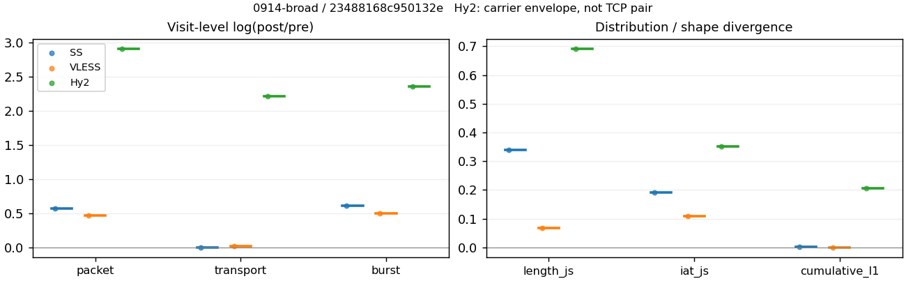
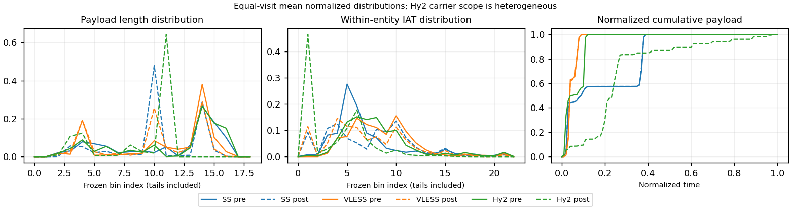

# 0914-broad · 条目 004 · youtube.com

目标：https://www.youtube.com/watch?v=sAWK0mgrMp4

活动标签：youtube.com::video_playback。选定访问 3 次。

[返回总索引](../../README.md) · [统计口径](../../methods.md)

## 覆盖与资格（每次访问均保留）

| 部署 | 重复 | 主请求路由 | 活动状态 | 代理比较 | DIRECT pre | 请求 proxy/direct/unresolved | 错误 |
| --- | --- | --- | --- | --- | --- | --- | --- |
| Hy2 | 1 | proxy | passed | 1 | 1 | 215/1/0 | [] |
| SS | 1 | proxy | passed | 1 | 0 | 233/0/0 | [] |
| VLESS | 1 | proxy | passed | 1 | 0 | 236/0/0 | [] |

主请求非 proxy 的统计仅解释为已索引的辅助代理连接或 DIRECT 观测，不代表目标业务经代理传输。播放确认与配对资格是两道不同的门。

图中散点为单次访问，短线为重复中位数；Hy2 是共享载体包络，不能与 TCP 配对作等范围因果对比。

形态图先逐访问归一化，再对访问等权平均；实线 pre，虚线 post。分箱序号及边界见 methods，不将分箱索引误解为长度或时间。

## 每次访问的关键观测

### SS

范围：`exclusive_page`。每格 pre → post；空值为不可观测/不适用。

| 重复 | 包数 | 载荷字节 | burst | TCP FR | IAT中位µs | length JS | IAT JS |
| --- | --- | --- | --- | --- | --- | --- | --- |
| 1 | 4492 → 7984 | 7.948e+06 → 8.0239e+06 | 2820 → 5243 | 243 → 251 | 23.34 → 129.74 | 0.34037 | 0.19035 |

完整标量统计：中位数 [min,max]；Δ 为重复内逐访问变换的中位数，MAD 未缩放。n 为可用变换数；DIRECT-only 的 nΔ=0 不代表 pre 不可用。

| scope | 特征 | pre | post | Δ | IQRΔ | MADΔ | nΔ |
| --- | --- | --- | --- | --- | --- | --- | --- |
| exclusive_page | active_span_sum_s_1000ms | 34.184 [34.184, 34.184] | 36.714 [36.714, 36.714] | 0.071389 | — | — | 1 |
| exclusive_page | active_span_sum_s_100ms | 9.8796 [9.8796, 9.8796] | 17.3 [17.3, 17.3] | 0.56025 | — | — | 1 |
| exclusive_page | active_span_sum_s_500ms | 26.957 [26.957, 26.957] | 32.254 [32.254, 32.254] | 0.17938 | — | — | 1 |
| exclusive_page | burst_bytes_iqr | 2896 [2896, 2896] | 2856 [2856, 2856] | -0.013908 | — | — | 1 |
| exclusive_page | burst_bytes_mad | 33 [33, 33] | 34 [34, 34] | 0.029853 | — | — | 1 |
| exclusive_page | burst_bytes_max | 28672 [28672, 28672] | 18564 [18564, 18564] | -0.4347 | — | — | 1 |
| exclusive_page | burst_bytes_mean | 2818.4 [2818.4, 2818.4] | 1530.4 [1530.4, 1530.4] | -0.61066 | — | — | 1 |
| exclusive_page | burst_bytes_median | 33 [33, 33] | 34 [34, 34] | 0.029853 | — | — | 1 |
| exclusive_page | burst_bytes_min | 0 [0, 0] | 0 [0, 0] | — | — | — | 0 |
| exclusive_page | burst_bytes_p95 | 17125 [17125, 17125] | 5712 [5712, 5712] | -1.098 | — | — | 1 |
| exclusive_page | burst_bytes_q25 | 0 [0, 0] | 0 [0, 0] | — | — | — | 0 |
| exclusive_page | burst_bytes_q75 | 2896 [2896, 2896] | 2856 [2856, 2856] | -0.013908 | — | — | 1 |
| exclusive_page | burst_bytes_std | 5276.9 [5276.9, 5276.9] | 2222 [2222, 2222] | -0.86493 | — | — | 1 |
| exclusive_page | burst_count | 2820 [2820, 2820] | 5243 [5243, 5243] | 0.62016 | — | — | 1 |
| exclusive_page | burst_duration_ms_iqr | 0.02378 [0.02378, 0.02378] | 0.003317 [0.003317, 0.003317] | -1.9698 | — | — | 1 |
| exclusive_page | burst_duration_ms_mad | 0 [0, 0] | 0 [0, 0] | — | — | — | 0 |
| exclusive_page | burst_duration_ms_max | 15001 [15001, 15001] | 24471 [24471, 24471] | 0.48935 | — | — | 1 |
| exclusive_page | burst_duration_ms_mean | 76.62 [76.62, 76.62] | 27.704 [27.704, 27.704] | -1.0173 | — | — | 1 |
| exclusive_page | burst_duration_ms_median | 0 [0, 0] | 0 [0, 0] | — | — | — | 0 |
| exclusive_page | burst_duration_ms_min | 0 [0, 0] | 0 [0, 0] | — | — | — | 0 |
| exclusive_page | burst_duration_ms_p95 | 32.765 [32.765, 32.765] | 0.97621 [0.97621, 0.97621] | -3.5134 | — | — | 1 |
| exclusive_page | burst_duration_ms_q25 | 0 [0, 0] | 0 [0, 0] | — | — | — | 0 |
| exclusive_page | burst_duration_ms_q75 | 0.02378 [0.02378, 0.02378] | 0.003317 [0.003317, 0.003317] | -1.9698 | — | — | 1 |
| exclusive_page | burst_duration_ms_std | 937.32 [937.32, 937.32] | 610.05 [610.05, 610.05] | -0.42949 | — | — | 1 |
| exclusive_page | burst_packets_iqr | 1 [1, 1] | 1 [1, 1] | 0 | — | — | 1 |
| exclusive_page | burst_packets_mad | 0 [0, 0] | 0 [0, 0] | — | — | — | 0 |
| exclusive_page | burst_packets_max | 28 [28, 28] | 15 [15, 15] | -0.62415 | — | — | 1 |
| exclusive_page | burst_packets_mean | 1.5929 [1.5929, 1.5929] | 1.5228 [1.5228, 1.5228] | -0.045015 | — | — | 1 |
| exclusive_page | burst_packets_median | 1 [1, 1] | 1 [1, 1] | 0 | — | — | 1 |
| exclusive_page | burst_packets_min | 1 [1, 1] | 1 [1, 1] | 0 | — | — | 1 |
| exclusive_page | burst_packets_p95 | 4 [4, 4] | 3 [3, 3] | -0.28768 | — | — | 1 |
| exclusive_page | burst_packets_q25 | 1 [1, 1] | 1 [1, 1] | 0 | — | — | 1 |
| exclusive_page | burst_packets_q75 | 2 [2, 2] | 2 [2, 2] | 0 | — | — | 1 |
| exclusive_page | burst_packets_std | 1.4068 [1.4068, 1.4068] | 0.90499 [0.90499, 0.90499] | -0.44112 | — | — | 1 |
| exclusive_page | connection_span_concurrency_max | 14 [14, 14] | 13 [13, 13] | -0.074108 | — | — | 1 |
| exclusive_page | cumulative_l1 | — | — | 0.0010803 | — | — | 1 |
| exclusive_page | cumulative_max | — | — | 0.036745 | — | — | 1 |
| exclusive_page | direction_entropy | 0.55648 [0.55648, 0.55648] | 0.38262 [0.38262, 0.38262] | -0.17386 | — | — | 1 |
| exclusive_page | down_burst_count | 1400 [1400, 1400] | 2612 [2612, 2612] | 0.62364 | — | — | 1 |
| exclusive_page | down_ip_bytes | 7.9591e+06 [7.9591e+06, 7.9591e+06] | 8.1051e+06 [8.1051e+06, 8.1051e+06] | 0.018179 | — | — | 1 |
| exclusive_page | down_packets | 2865 [2865, 2865] | 4562 [4562, 4562] | 0.46519 | — | — | 1 |
| exclusive_page | down_transport_bytes | 7.81e+06 [7.81e+06, 7.81e+06] | 7.8673e+06 [7.8673e+06, 7.8673e+06] | 0.0073067 | — | — | 1 |
| exclusive_page | duration_s | 61.013 [61.013, 61.013] | 61.012 [61.012, 61.012] | -1.0225e-05 | — | — | 1 |
| exclusive_page | entity_count | 20 [20, 20] | 20 [20, 20] | 0 | — | — | 1 |
| exclusive_page | fr_runs | 243 [243, 243] | 251 [251, 251] | 0.032391 | — | — | 1 |
| exclusive_page | fr_runs_per_packet | 0.086079 [0.086079, 0.086079] | 0.054542 [0.054542, 0.054542] | -0.031537 | — | — | 1 |
| exclusive_page | fr_switches | 223 [223, 223] | 231 [231, 231] | 0.035246 | — | — | 1 |
| exclusive_page | fr_switches_per_possible_transition | 0.079558 [0.079558, 0.079558] | 0.050415 [0.050415, 0.050415] | -0.029143 | — | — | 1 |
| exclusive_page | full_retransmission_fraction | 0.0033393 [0.0033393, 0.0033393] | 0.0031313 [0.0031313, 0.0031313] | -0.00020801 | — | — | 1 |
| exclusive_page | full_retransmission_packets | 15 [15, 15] | 25 [25, 25] | 0.51083 | — | — | 1 |
| exclusive_page | iat_count | 4472 [4472, 4472] | 7964 [7964, 7964] | 0.5771 | — | — | 1 |
| exclusive_page | iat_js | — | — | 0.19035 | — | — | 1 |
| exclusive_page | iat_ks | — | — | 0.28052 | — | — | 1 |
| exclusive_page | iat_median_us | 23.34 [23.34, 23.34] | 129.74 [129.74, 129.74] | 1.7154 | — | — | 1 |
| exclusive_page | iat_us_iqr | 91.346 [91.346, 91.346] | 754.34 [754.34, 754.34] | 2.1112 | — | — | 1 |
| exclusive_page | iat_us_mad | 17.111 [17.111, 17.111] | 127.48 [127.48, 127.48] | 2.0082 | — | — | 1 |
| exclusive_page | iat_us_max | 1.5001e+07 [1.5001e+07, 1.5001e+07] | 1.5396e+07 [1.5396e+07, 1.5396e+07] | 0.02596 | — | — | 1 |
| exclusive_page | iat_us_mean | 1.7165e+05 [1.7165e+05, 1.7165e+05] | 92619 [92619, 92619] | -0.61699 | — | — | 1 |
| exclusive_page | iat_us_median | 23.34 [23.34, 23.34] | 129.74 [129.74, 129.74] | 1.7154 | — | — | 1 |
| exclusive_page | iat_us_min | 0.012 [0.012, 0.012] | 0.031 [0.031, 0.031] | 0.94908 | — | — | 1 |
| exclusive_page | iat_us_p95 | 41979 [41979, 41979] | 25926 [25926, 25926] | -0.48194 | — | — | 1 |
| exclusive_page | iat_us_q25 | 12.556 [12.556, 12.556] | 6.4915 [6.4915, 6.4915] | -0.65974 | — | — | 1 |
| exclusive_page | iat_us_q75 | 103.9 [103.9, 103.9] | 760.83 [760.83, 760.83] | 1.991 | — | — | 1 |
| exclusive_page | iat_us_std | 1.4588e+06 [1.4588e+06, 1.4588e+06] | 1.0881e+06 [1.0881e+06, 1.0881e+06] | -0.2932 | — | — | 1 |
| exclusive_page | iat_wasserstein_log1p_us | — | — | 1.1315 | — | — | 1 |
| exclusive_page | idle_gap_count_1000ms | 73 [73, 73] | 63 [63, 63] | -0.14732 | — | — | 1 |
| exclusive_page | idle_gap_count_100ms | 156 [156, 156] | 132 [132, 132] | -0.16705 | — | — | 1 |
| exclusive_page | idle_gap_count_500ms | 84 [84, 84] | 70 [70, 70] | -0.18232 | — | — | 1 |
| exclusive_page | idle_gap_sum_s_1000ms | 733.45 [733.45, 733.45] | 700.9 [700.9, 700.9] | -0.045394 | — | — | 1 |
| exclusive_page | idle_gap_sum_s_100ms | 757.76 [757.76, 757.76] | 720.31 [720.31, 720.31] | -0.050673 | — | — | 1 |
| exclusive_page | idle_gap_sum_s_500ms | 740.68 [740.68, 740.68] | 705.36 [705.36, 705.36] | -0.048856 | — | — | 1 |
| exclusive_page | ip_bytes | 8.1821e+06 [8.1821e+06, 8.1821e+06] | 8.5123e+06 [8.5123e+06, 8.5123e+06] | 0.039569 | — | — | 1 |
| exclusive_page | length_iqr | 3549 [3549, 3549] | 1428 [1428, 1428] | -0.91039 | — | — | 1 |
| exclusive_page | length_js | — | — | 0.34037 | — | — | 1 |
| exclusive_page | length_ks | — | — | 0.45923 | — | — | 1 |
| exclusive_page | length_mad | 1485 [1485, 1485] | 300 [300, 300] | -1.5994 | — | — | 1 |
| exclusive_page | length_max | 8920 [8920, 8920] | 12852 [12852, 12852] | 0.3652 | — | — | 1 |
| exclusive_page | length_mean | 2815.5 [2815.5, 2815.5] | 1743.6 [1743.6, 1743.6] | -0.47919 | — | — | 1 |
| exclusive_page | length_median | 2800 [2800, 2800] | 1428 [1428, 1428] | -0.67334 | — | — | 1 |
| exclusive_page | length_min | 16 [16, 16] | 6 [6, 6] | -0.98083 | — | — | 1 |
| exclusive_page | length_p95 | 8192 [8192, 8192] | 2856 [2856, 2856] | -1.0537 | — | — | 1 |
| exclusive_page | length_q25 | 547 [547, 547] | 1428 [1428, 1428] | 0.95958 | — | — | 1 |
| exclusive_page | length_q75 | 4096 [4096, 4096] | 2856 [2856, 2856] | -0.36059 | — | — | 1 |
| exclusive_page | length_std | 2533.6 [2533.6, 2533.6] | 1132.5 [1132.5, 1132.5] | -0.80526 | — | — | 1 |
| exclusive_page | length_wasserstein_bytes | — | — | 1331.7 | — | — | 1 |
| exclusive_page | nonempty_entity_count | 20 [20, 20] | 20 [20, 20] | 0 | — | — | 1 |
| exclusive_page | nonempty_packets | 2823 [2823, 2823] | 4602 [4602, 4602] | 0.48869 | — | — | 1 |
| exclusive_page | offload_suspect_fraction | 0.38157 [0.38157, 0.38157] | 0.19076 [0.19076, 0.19076] | -0.19081 | — | — | 1 |
| exclusive_page | packet_count | 4492 [4492, 4492] | 7984 [7984, 7984] | 0.57514 | — | — | 1 |
| exclusive_page | rtt_median_ms | 0.049033 [0.049033, 0.049033] | 28.215 [28.215, 28.215] | 6.3551 | — | — | 1 |
| exclusive_page | rtt_sample_count | 1535 [1535, 1535] | 779 [779, 779] | -0.67827 | — | — | 1 |
| exclusive_page | tcp_ack_count | 4470 [4470, 4470] | 7960 [7960, 7960] | 0.57704 | — | — | 1 |
| exclusive_page | tcp_fin_count | 40 [40, 40] | 39 [39, 39] | -0.025318 | — | — | 1 |
| exclusive_page | tcp_packet_count | 4492 [4492, 4492] | 7984 [7984, 7984] | 0.57514 | — | — | 1 |
| exclusive_page | tcp_rst_count | 2 [2, 2] | 1 [1, 1] | -0.69315 | — | — | 1 |
| exclusive_page | tcp_syn_count | 40 [40, 40] | 43 [43, 43] | 0.072321 | — | — | 1 |
| exclusive_page | tcp_window_raw_median | 65535 [65535, 65535] | 162 [162, 162] | -6.0027 | — | — | 1 |
| exclusive_page | transition_entropy | 0.34254 [0.34254, 0.34254] | 0.23097 [0.23097, 0.23097] | -0.11157 | — | — | 1 |
| exclusive_page | transition_n_mm | 2342 [2342, 2342] | 4140 [4140, 4140] | 0.56969 | — | — | 1 |
| exclusive_page | transition_n_mp | 108 [108, 108] | 112 [112, 112] | 0.036368 | — | — | 1 |
| exclusive_page | transition_n_pm | 115 [115, 115] | 119 [119, 119] | 0.034191 | — | — | 1 |
| exclusive_page | transition_n_pp | 238 [238, 238] | 211 [211, 211] | -0.12041 | — | — | 1 |
| exclusive_page | transition_p_mm | 0.95592 [0.95592, 0.95592] | 0.97366 [0.97366, 0.97366] | 0.017741 | — | — | 1 |
| exclusive_page | transition_p_mp | 0.044082 [0.044082, 0.044082] | 0.026341 [0.026341, 0.026341] | -0.017741 | — | — | 1 |
| exclusive_page | transition_p_pm | 0.32578 [0.32578, 0.32578] | 0.36061 [0.36061, 0.36061] | 0.034827 | — | — | 1 |
| exclusive_page | transition_p_pp | 0.67422 [0.67422, 0.67422] | 0.63939 [0.63939, 0.63939] | -0.034827 | — | — | 1 |
| exclusive_page | transport_bytes | 7.948e+06 [7.948e+06, 7.948e+06] | 8.0239e+06 [8.0239e+06, 8.0239e+06] | 0.0094963 | — | — | 1 |
| exclusive_page | up_burst_count | 1420 [1420, 1420] | 2631 [2631, 2631] | 0.61671 | — | — | 1 |
| exclusive_page | up_byte_fraction | 0.017368 [0.017368, 0.017368] | 0.019517 [0.019517, 0.019517] | 0.0021492 | — | — | 1 |
| exclusive_page | up_ip_bytes | 2.2296e+05 [2.2296e+05, 2.2296e+05] | 4.072e+05 [4.072e+05, 4.072e+05] | 0.6023 | — | — | 1 |
| exclusive_page | up_packets | 1627 [1627, 1627] | 3422 [3422, 3422] | 0.74349 | — | — | 1 |
| exclusive_page | up_transport_bytes | 1.3804e+05 [1.3804e+05, 1.3804e+05] | 1.566e+05 [1.566e+05, 1.566e+05] | 0.12616 | — | — | 1 |
| exclusive_page | zero_iat_count | 0 [0, 0] | 0 [0, 0] | — | — | — | 0 |
| exclusive_page | zero_iat_fraction | 0 [0, 0] | 0 [0, 0] | 0 | — | — | 1 |

### VLESS

范围：`exclusive_page`。每格 pre → post；空值为不可观测/不适用。

| 重复 | 包数 | 载荷字节 | burst | TCP FR | IAT中位µs | length JS | IAT JS |
| --- | --- | --- | --- | --- | --- | --- | --- |
| 1 | 4023 → 6425 | 5.551e+06 → 5.6855e+06 | 2686 → 4428 | 148 → 184 | 157.03 → 38.958 | 0.068227 | 0.10875 |

完整标量统计：中位数 [min,max]；Δ 为重复内逐访问变换的中位数，MAD 未缩放。n 为可用变换数；DIRECT-only 的 nΔ=0 不代表 pre 不可用。

| scope | 特征 | pre | post | Δ | IQRΔ | MADΔ | nΔ |
| --- | --- | --- | --- | --- | --- | --- | --- |
| exclusive_page | active_span_sum_s_1000ms | 25.334 [25.334, 25.334] | 26.444 [26.444, 26.444] | 0.04288 | — | — | 1 |
| exclusive_page | active_span_sum_s_100ms | 4.6108 [4.6108, 4.6108] | 11.975 [11.975, 11.975] | 0.95443 | — | — | 1 |
| exclusive_page | active_span_sum_s_500ms | 13.541 [13.541, 13.541] | 26.444 [26.444, 26.444] | 0.66929 | — | — | 1 |
| exclusive_page | burst_bytes_iqr | 2896 [2896, 2896] | 2824 [2824, 2824] | -0.025176 | — | — | 1 |
| exclusive_page | burst_bytes_mad | 0 [0, 0] | 27.5 [27.5, 27.5] | — | — | — | 0 |
| exclusive_page | burst_bytes_max | 23120 [23120, 23120] | 43332 [43332, 43332] | 0.62819 | — | — | 1 |
| exclusive_page | burst_bytes_mean | 2066.6 [2066.6, 2066.6] | 1284 [1284, 1284] | -0.47595 | — | — | 1 |
| exclusive_page | burst_bytes_median | 0 [0, 0] | 27.5 [27.5, 27.5] | — | — | — | 0 |
| exclusive_page | burst_bytes_min | 0 [0, 0] | 0 [0, 0] | — | — | — | 0 |
| exclusive_page | burst_bytes_p95 | 8688 [8688, 8688] | 4344 [4344, 4344] | -0.69315 | — | — | 1 |
| exclusive_page | burst_bytes_q25 | 0 [0, 0] | 0 [0, 0] | — | — | — | 0 |
| exclusive_page | burst_bytes_q75 | 2896 [2896, 2896] | 2824 [2824, 2824] | -0.025176 | — | — | 1 |
| exclusive_page | burst_bytes_std | 3283.7 [3283.7, 3283.7] | 1914.1 [1914.1, 1914.1] | -0.53973 | — | — | 1 |
| exclusive_page | burst_count | 2686 [2686, 2686] | 4428 [4428, 4428] | 0.49989 | — | — | 1 |
| exclusive_page | burst_duration_ms_iqr | 0.496 [0.496, 0.496] | 0.000127 [0.000127, 0.000127] | -8.2701 | — | — | 1 |
| exclusive_page | burst_duration_ms_mad | 0 [0, 0] | 0 [0, 0] | — | — | — | 0 |
| exclusive_page | burst_duration_ms_max | 15001 [15001, 15001] | 15052 [15052, 15052] | 0.003364 | — | — | 1 |
| exclusive_page | burst_duration_ms_mean | 61.368 [61.368, 61.368] | 14.457 [14.457, 14.457] | -1.4457 | — | — | 1 |
| exclusive_page | burst_duration_ms_median | 0 [0, 0] | 0 [0, 0] | — | — | — | 0 |
| exclusive_page | burst_duration_ms_min | 0 [0, 0] | 0 [0, 0] | — | — | — | 0 |
| exclusive_page | burst_duration_ms_p95 | 6.7743 [6.7743, 6.7743] | 3.4957 [3.4957, 3.4957] | -0.66162 | — | — | 1 |
| exclusive_page | burst_duration_ms_q25 | 0 [0, 0] | 0 [0, 0] | — | — | — | 0 |
| exclusive_page | burst_duration_ms_q75 | 0.496 [0.496, 0.496] | 0.000127 [0.000127, 0.000127] | -8.2701 | — | — | 1 |
| exclusive_page | burst_duration_ms_std | 829.57 [829.57, 829.57] | 392.34 [392.34, 392.34] | -0.74878 | — | — | 1 |
| exclusive_page | burst_packets_iqr | 1 [1, 1] | 1 [1, 1] | 0 | — | — | 1 |
| exclusive_page | burst_packets_mad | 0 [0, 0] | 0 [0, 0] | — | — | — | 0 |
| exclusive_page | burst_packets_max | 8 [8, 8] | 18 [18, 18] | 0.81093 | — | — | 1 |
| exclusive_page | burst_packets_mean | 1.4978 [1.4978, 1.4978] | 1.451 [1.451, 1.451] | -0.031726 | — | — | 1 |
| exclusive_page | burst_packets_median | 1 [1, 1] | 1 [1, 1] | 0 | — | — | 1 |
| exclusive_page | burst_packets_min | 1 [1, 1] | 1 [1, 1] | 0 | — | — | 1 |
| exclusive_page | burst_packets_p95 | 2 [2, 2] | 3 [3, 3] | 0.40547 | — | — | 1 |
| exclusive_page | burst_packets_q25 | 1 [1, 1] | 1 [1, 1] | 0 | — | — | 1 |
| exclusive_page | burst_packets_q75 | 2 [2, 2] | 2 [2, 2] | 0 | — | — | 1 |
| exclusive_page | burst_packets_std | 0.65304 [0.65304, 0.65304] | 0.85914 [0.85914, 0.85914] | 0.27428 | — | — | 1 |
| exclusive_page | connection_span_concurrency_max | 10 [10, 10] | 10 [10, 10] | 0 | — | — | 1 |
| exclusive_page | cumulative_l1 | — | — | 0.0006759 | — | — | 1 |
| exclusive_page | cumulative_max | — | — | 0.022851 | — | — | 1 |
| exclusive_page | direction_entropy | 0.31927 [0.31927, 0.31927] | 0.28833 [0.28833, 0.28833] | -0.030936 | — | — | 1 |
| exclusive_page | down_burst_count | 1334 [1334, 1334] | 2205 [2205, 2205] | 0.50255 | — | — | 1 |
| exclusive_page | down_ip_bytes | 5.6235e+06 [5.6235e+06, 5.6235e+06] | 5.7723e+06 [5.7723e+06, 5.7723e+06] | 0.026116 | — | — | 1 |
| exclusive_page | down_packets | 2589 [2589, 2589] | 3581 [3581, 3581] | 0.32437 | — | — | 1 |
| exclusive_page | down_transport_bytes | 5.4887e+06 [5.4887e+06, 5.4887e+06] | 5.5859e+06 [5.5859e+06, 5.5859e+06] | 0.017556 | — | — | 1 |
| exclusive_page | duration_s | 60.098 [60.098, 60.098] | 60.063 [60.063, 60.063] | -0.00059281 | — | — | 1 |
| exclusive_page | entity_count | 18 [18, 18] | 18 [18, 18] | 0 | — | — | 1 |
| exclusive_page | fr_runs | 148 [148, 148] | 184 [184, 184] | 0.21772 | — | — | 1 |
| exclusive_page | fr_runs_per_packet | 0.059153 [0.059153, 0.059153] | 0.052452 [0.052452, 0.052452] | -0.0067011 | — | — | 1 |
| exclusive_page | fr_switches | 130 [130, 130] | 166 [166, 166] | 0.24445 | — | — | 1 |
| exclusive_page | fr_switches_per_possible_transition | 0.052335 [0.052335, 0.052335] | 0.047564 [0.047564, 0.047564] | -0.0047705 | — | — | 1 |
| exclusive_page | full_retransmission_fraction | 0.00074571 [0.00074571, 0.00074571] | 0.00015564 [0.00015564, 0.00015564] | -0.00059007 | — | — | 1 |
| exclusive_page | full_retransmission_packets | 3 [3, 3] | 1 [1, 1] | -1.0986 | — | — | 1 |
| exclusive_page | iat_count | 4005 [4005, 4005] | 6407 [6407, 6407] | 0.46985 | — | — | 1 |
| exclusive_page | iat_js | — | — | 0.10875 | — | — | 1 |
| exclusive_page | iat_ks | — | — | 0.26814 | — | — | 1 |
| exclusive_page | iat_median_us | 157.03 [157.03, 157.03] | 38.958 [38.958, 38.958] | -1.394 | — | — | 1 |
| exclusive_page | iat_us_iqr | 858.48 [858.48, 858.48] | 630.56 [630.56, 630.56] | -0.30855 | — | — | 1 |
| exclusive_page | iat_us_mad | 147.96 [147.96, 147.96] | 38.847 [38.847, 38.847] | -1.3373 | — | — | 1 |
| exclusive_page | iat_us_max | 1.5001e+07 [1.5001e+07, 1.5001e+07] | 1.5379e+07 [1.5379e+07, 1.5379e+07] | 0.024907 | — | — | 1 |
| exclusive_page | iat_us_mean | 1.4381e+05 [1.4381e+05, 1.4381e+05] | 89791 [89791, 89791] | -0.47101 | — | — | 1 |
| exclusive_page | iat_us_median | 157.03 [157.03, 157.03] | 38.958 [38.958, 38.958] | -1.394 | — | — | 1 |
| exclusive_page | iat_us_min | 0.832 [0.832, 0.832] | 0.032 [0.032, 0.032] | -3.2581 | — | — | 1 |
| exclusive_page | iat_us_p95 | 9708.1 [9708.1, 9708.1] | 10527 [10527, 10527] | 0.080954 | — | — | 1 |
| exclusive_page | iat_us_q25 | 34.887 [34.887, 34.887] | 7.6265 [7.6265, 7.6265] | -1.5205 | — | — | 1 |
| exclusive_page | iat_us_q75 | 893.37 [893.37, 893.37] | 638.19 [638.19, 638.19] | -0.33637 | — | — | 1 |
| exclusive_page | iat_us_std | 1.3522e+06 [1.3522e+06, 1.3522e+06] | 1.0949e+06 [1.0949e+06, 1.0949e+06] | -0.2111 | — | — | 1 |
| exclusive_page | iat_wasserstein_log1p_us | — | — | 1.1954 | — | — | 1 |
| exclusive_page | idle_gap_count_1000ms | 52 [52, 52] | 43 [43, 43] | -0.19004 | — | — | 1 |
| exclusive_page | idle_gap_count_100ms | 115 [115, 115] | 121 [121, 121] | 0.050858 | — | — | 1 |
| exclusive_page | idle_gap_count_500ms | 70 [70, 70] | 43 [43, 43] | -0.4873 | — | — | 1 |
| exclusive_page | idle_gap_sum_s_1000ms | 550.63 [550.63, 550.63] | 548.85 [548.85, 548.85] | -0.0032366 | — | — | 1 |
| exclusive_page | idle_gap_sum_s_100ms | 571.35 [571.35, 571.35] | 563.32 [563.32, 563.32] | -0.014161 | — | — | 1 |
| exclusive_page | idle_gap_sum_s_500ms | 562.42 [562.42, 562.42] | 548.85 [548.85, 548.85] | -0.024427 | — | — | 1 |
| exclusive_page | ip_bytes | 5.7601e+06 [5.7601e+06, 5.7601e+06] | 6.0268e+06 [6.0268e+06, 6.0268e+06] | 0.045255 | — | — | 1 |
| exclusive_page | length_iqr | 1959 [1959, 1959] | 2583 [2583, 2583] | 0.27652 | — | — | 1 |
| exclusive_page | length_js | — | — | 0.068227 | — | — | 1 |
| exclusive_page | length_ks | — | — | 0.20232 | — | — | 1 |
| exclusive_page | length_mad | 924 [924, 924] | 1340 [1340, 1340] | 0.37171 | — | — | 1 |
| exclusive_page | length_max | 8920 [8920, 8920] | 13032 [13032, 13032] | 0.37911 | — | — | 1 |
| exclusive_page | length_mean | 2218.6 [2218.6, 2218.6] | 1620.7 [1620.7, 1620.7] | -0.31402 | — | — | 1 |
| exclusive_page | length_median | 2372 [2372, 2372] | 1412 [1412, 1412] | -0.51873 | — | — | 1 |
| exclusive_page | length_min | 24 [24, 24] | 5 [5, 5] | -1.5686 | — | — | 1 |
| exclusive_page | length_p95 | 5792 [5792, 5792] | 3004 [3004, 3004] | -0.65653 | — | — | 1 |
| exclusive_page | length_q25 | 937 [937, 937] | 241 [241, 241] | -1.3579 | — | — | 1 |
| exclusive_page | length_q75 | 2896 [2896, 2896] | 2824 [2824, 2824] | -0.025176 | — | — | 1 |
| exclusive_page | length_std | 1892.5 [1892.5, 1892.5] | 1290.7 [1290.7, 1290.7] | -0.38267 | — | — | 1 |
| exclusive_page | length_wasserstein_bytes | — | — | 600.46 | — | — | 1 |
| exclusive_page | nonempty_entity_count | 18 [18, 18] | 18 [18, 18] | 0 | — | — | 1 |
| exclusive_page | nonempty_packets | 2502 [2502, 2502] | 3508 [3508, 3508] | 0.33796 | — | — | 1 |
| exclusive_page | offload_suspect_fraction | 0.36888 [0.36888, 0.36888] | 0.21572 [0.21572, 0.21572] | -0.15316 | — | — | 1 |
| exclusive_page | packet_count | 4023 [4023, 4023] | 6425 [6425, 6425] | 0.46817 | — | — | 1 |
| exclusive_page | rtt_median_ms | 0.37425 [0.37425, 0.37425] | 0.040276 [0.040276, 0.040276] | -2.2292 | — | — | 1 |
| exclusive_page | rtt_sample_count | 1373 [1373, 1373] | 2489 [2489, 2489] | 0.59488 | — | — | 1 |
| exclusive_page | tcp_ack_count | 3969 [3969, 3969] | 6405 [6405, 6405] | 0.47856 | — | — | 1 |
| exclusive_page | tcp_fin_count | 36 [36, 36] | 36 [36, 36] | 0 | — | — | 1 |
| exclusive_page | tcp_packet_count | 4023 [4023, 4023] | 6425 [6425, 6425] | 0.46817 | — | — | 1 |
| exclusive_page | tcp_rst_count | 36 [36, 36] | 1 [1, 1] | -3.5835 | — | — | 1 |
| exclusive_page | tcp_syn_count | 36 [36, 36] | 37 [37, 37] | 0.027399 | — | — | 1 |
| exclusive_page | tcp_window_raw_median | 65535 [65535, 65535] | 185 [185, 185] | -5.87 | — | — | 1 |
| exclusive_page | transition_entropy | 0.21187 [0.21187, 0.21187] | 0.19719 [0.19719, 0.19719] | -0.014679 | — | — | 1 |
| exclusive_page | transition_n_mm | 2283 [2283, 2283] | 3239 [3239, 3239] | 0.34977 | — | — | 1 |
| exclusive_page | transition_n_mp | 56 [56, 56] | 74 [74, 74] | 0.27871 | — | — | 1 |
| exclusive_page | transition_n_pm | 74 [74, 74] | 92 [92, 92] | 0.21772 | — | — | 1 |
| exclusive_page | transition_n_pp | 71 [71, 71] | 85 [85, 85] | 0.17997 | — | — | 1 |
| exclusive_page | transition_p_mm | 0.97606 [0.97606, 0.97606] | 0.97766 [0.97766, 0.97766] | 0.0016056 | — | — | 1 |
| exclusive_page | transition_p_mp | 0.023942 [0.023942, 0.023942] | 0.022336 [0.022336, 0.022336] | -0.0016056 | — | — | 1 |
| exclusive_page | transition_p_pm | 0.51034 [0.51034, 0.51034] | 0.51977 [0.51977, 0.51977] | 0.0094292 | — | — | 1 |
| exclusive_page | transition_p_pp | 0.48966 [0.48966, 0.48966] | 0.48023 [0.48023, 0.48023] | -0.0094292 | — | — | 1 |
| exclusive_page | transport_bytes | 5.551e+06 [5.551e+06, 5.551e+06] | 5.6855e+06 [5.6855e+06, 5.6855e+06] | 0.023941 | — | — | 1 |
| exclusive_page | up_burst_count | 1352 [1352, 1352] | 2223 [2223, 2223] | 0.49727 | — | — | 1 |
| exclusive_page | up_byte_fraction | 0.011222 [0.011222, 0.011222] | 0.017515 [0.017515, 0.017515] | 0.0062924 | — | — | 1 |
| exclusive_page | up_ip_bytes | 1.3661e+05 [1.3661e+05, 1.3661e+05] | 2.5448e+05 [2.5448e+05, 2.5448e+05] | 0.62207 | — | — | 1 |
| exclusive_page | up_packets | 1434 [1434, 1434] | 2844 [2844, 2844] | 0.68474 | — | — | 1 |
| exclusive_page | up_transport_bytes | 62294 [62294, 62294] | 99579 [99579, 99579] | 0.46909 | — | — | 1 |
| exclusive_page | zero_iat_count | 0 [0, 0] | 0 [0, 0] | — | — | — | 0 |
| exclusive_page | zero_iat_fraction | 0 [0, 0] | 0 [0, 0] | 0 | — | — | 1 |

### Hy2

范围：`carrier_context_envelope`。每格 pre → post；空值为不可观测/不适用。

| 重复 | 包数 | 载荷字节 | burst | TCP FR | IAT中位µs | length JS | IAT JS |
| --- | --- | --- | --- | --- | --- | --- | --- |
| 1 | 3800 → 69285 | 7.9375e+06 → 7.2909e+07 | 2355 → 24849 | — | 93.24 → 4.334 | 0.6907 | 0.35272 |

范围：`direct_pre_only`。每格 pre → post；空值为不可观测/不适用。

| 重复 | 包数 | 载荷字节 | burst | TCP FR | IAT中位µs | length JS | IAT JS |
| --- | --- | --- | --- | --- | --- | --- | --- |
| 1 | 33 → — | 8669 → — | 25 → — | 7 → — | 186.76 → — | — | — |

完整标量统计：中位数 [min,max]；Δ 为重复内逐访问变换的中位数，MAD 未缩放。n 为可用变换数；DIRECT-only 的 nΔ=0 不代表 pre 不可用。

| scope | 特征 | pre | post | Δ | IQRΔ | MADΔ | nΔ |
| --- | --- | --- | --- | --- | --- | --- | --- |
| carrier_context_envelope | active_span_sum_s_1000ms | 27.572 [27.572, 27.572] | 26.269 [26.269, 26.269] | -0.048422 | — | — | 1 |
| carrier_context_envelope | active_span_sum_s_100ms | 4.4276 [4.4276, 4.4276] | 16.029 [16.029, 16.029] | 1.2865 | — | — | 1 |
| carrier_context_envelope | active_span_sum_s_500ms | 22.029 [22.029, 22.029] | 23.596 [23.596, 23.596] | 0.068747 | — | — | 1 |
| carrier_context_envelope | burst_bytes_iqr | 4212 [4212, 4212] | 2784 [2784, 2784] | -0.41405 | — | — | 1 |
| carrier_context_envelope | burst_bytes_mad | 31 [31, 31] | 268 [268, 268] | 2.157 | — | — | 1 |
| carrier_context_envelope | burst_bytes_max | 28645 [28645, 28645] | 3.3825e+05 [3.3825e+05, 3.3825e+05] | 2.4688 | — | — | 1 |
| carrier_context_envelope | burst_bytes_mean | 3370.5 [3370.5, 3370.5] | 2934.1 [2934.1, 2934.1] | -0.13867 | — | — | 1 |
| carrier_context_envelope | burst_bytes_median | 31 [31, 31] | 301 [301, 301] | 2.2731 | — | — | 1 |
| carrier_context_envelope | burst_bytes_min | 0 [0, 0] | 22 [22, 22] | — | — | — | 0 |
| carrier_context_envelope | burst_bytes_p95 | 20480 [20480, 20480] | 10932 [10932, 10932] | -0.62775 | — | — | 1 |
| carrier_context_envelope | burst_bytes_q25 | 0 [0, 0] | 98 [98, 98] | — | — | — | 0 |
| carrier_context_envelope | burst_bytes_q75 | 4212 [4212, 4212] | 2882 [2882, 2882] | -0.37945 | — | — | 1 |
| carrier_context_envelope | burst_bytes_std | 5953.5 [5953.5, 5953.5] | 6623.9 [6623.9, 6623.9] | 0.10671 | — | — | 1 |
| carrier_context_envelope | burst_count | 2355 [2355, 2355] | 24849 [24849, 24849] | 2.3563 | — | — | 1 |
| carrier_context_envelope | burst_duration_ms_iqr | 0.066319 [0.066319, 0.066319] | 0.022475 [0.022475, 0.022475] | -1.0821 | — | — | 1 |
| carrier_context_envelope | burst_duration_ms_mad | 0 [0, 0] | 4.2e-05 [4.2e-05, 4.2e-05] | — | — | — | 0 |
| carrier_context_envelope | burst_duration_ms_max | 15001 [15001, 15001] | 5669.6 [5669.6, 5669.6] | -0.973 | — | — | 1 |
| carrier_context_envelope | burst_duration_ms_mean | 89.799 [89.799, 89.799] | 1.3299 [1.3299, 1.3299] | -4.2125 | — | — | 1 |
| carrier_context_envelope | burst_duration_ms_median | 0 [0, 0] | 4.2e-05 [4.2e-05, 4.2e-05] | — | — | — | 0 |
| carrier_context_envelope | burst_duration_ms_min | 0 [0, 0] | 0 [0, 0] | — | — | — | 0 |
| carrier_context_envelope | burst_duration_ms_p95 | 31.098 [31.098, 31.098] | 0.13515 [0.13515, 0.13515] | -5.4385 | — | — | 1 |
| carrier_context_envelope | burst_duration_ms_q25 | 0 [0, 0] | 0 [0, 0] | — | — | — | 0 |
| carrier_context_envelope | burst_duration_ms_q75 | 0.066319 [0.066319, 0.066319] | 0.022475 [0.022475, 0.022475] | -1.0821 | — | — | 1 |
| carrier_context_envelope | burst_duration_ms_std | 1074.3 [1074.3, 1074.3] | 64.31 [64.31, 64.31] | -2.8157 | — | — | 1 |
| carrier_context_envelope | burst_packets_iqr | 1 [1, 1] | 2 [2, 2] | 0.69315 | — | — | 1 |
| carrier_context_envelope | burst_packets_mad | 0 [0, 0] | 1 [1, 1] | — | — | — | 0 |
| carrier_context_envelope | burst_packets_max | 20 [20, 20] | 243 [243, 243] | 2.4973 | — | — | 1 |
| carrier_context_envelope | burst_packets_mean | 1.6136 [1.6136, 1.6136] | 2.7882 [2.7882, 2.7882] | 0.54695 | — | — | 1 |
| carrier_context_envelope | burst_packets_median | 1 [1, 1] | 2 [2, 2] | 0.69315 | — | — | 1 |
| carrier_context_envelope | burst_packets_min | 1 [1, 1] | 1 [1, 1] | 0 | — | — | 1 |
| carrier_context_envelope | burst_packets_p95 | 4 [4, 4] | 8 [8, 8] | 0.69315 | — | — | 1 |
| carrier_context_envelope | burst_packets_q25 | 1 [1, 1] | 1 [1, 1] | 0 | — | — | 1 |
| carrier_context_envelope | burst_packets_q75 | 2 [2, 2] | 3 [3, 3] | 0.40547 | — | — | 1 |
| carrier_context_envelope | burst_packets_std | 1.0982 [1.0982, 1.0982] | 4.6312 [4.6312, 4.6312] | 1.4391 | — | — | 1 |
| carrier_context_envelope | connection_span_concurrency_max | 17 [17, 17] | 1 [1, 1] | -2.8332 | — | — | 1 |
| carrier_context_envelope | cumulative_l1 | — | — | 0.20639 | — | — | 1 |
| carrier_context_envelope | cumulative_max | — | — | 0.85616 | — | — | 1 |
| carrier_context_envelope | direction_entropy | 0.61551 [0.61551, 0.61551] | 0.78021 [0.78021, 0.78021] | 0.1647 | — | — | 1 |
| carrier_context_envelope | direction_run_analog_runs | 238 [238, 238] | 24849 [24849, 24849] | 4.6483 | — | — | 1 |
| carrier_context_envelope | direction_run_analog_runs_per_packet | 0.10123 [0.10123, 0.10123] | 0.35865 [0.35865, 0.35865] | 0.25742 | — | — | 1 |
| carrier_context_envelope | direction_run_analog_switches | 215 [215, 215] | 24848 [24848, 24848] | 4.7499 | — | — | 1 |
| carrier_context_envelope | direction_run_analog_switches_per_possible_transition | 0.092354 [0.092354, 0.092354] | 0.35864 [0.35864, 0.35864] | 0.26629 | — | — | 1 |
| carrier_context_envelope | down_burst_count | 1166 [1166, 1166] | 12424 [12424, 12424] | 2.3661 | — | — | 1 |
| carrier_context_envelope | down_ip_bytes | 7.9228e+06 [7.9228e+06, 7.9228e+06] | 7.2969e+07 [7.2969e+07, 7.2969e+07] | 2.2203 | — | — | 1 |
| carrier_context_envelope | down_packets | 2422 [2422, 2422] | 53262 [53262, 53262] | 3.0906 | — | — | 1 |
| carrier_context_envelope | down_transport_bytes | 7.7966e+06 [7.7966e+06, 7.7966e+06] | 7.1478e+07 [7.1478e+07, 7.1478e+07] | 2.2157 | — | — | 1 |
| carrier_context_envelope | duration_s | 60.299 [60.299, 60.299] | 60.283 [60.283, 60.283] | -0.00027786 | — | — | 1 |
| carrier_context_envelope | entity_count | 23 [23, 23] | 1 [1, 1] | -3.1355 | — | — | 1 |
| carrier_context_envelope | full_retransmission_fraction | 0.0065789 [0.0065789, 0.0065789] | — | — | — | — | 0 |
| carrier_context_envelope | full_retransmission_packets | 25 [25, 25] | — | — | — | — | 0 |
| carrier_context_envelope | iat_count | 3777 [3777, 3777] | 69284 [69284, 69284] | 2.9093 | — | — | 1 |
| carrier_context_envelope | iat_js | — | — | 0.35272 | — | — | 1 |
| carrier_context_envelope | iat_ks | — | — | 0.50077 | — | — | 1 |
| carrier_context_envelope | iat_median_us | 93.24 [93.24, 93.24] | 4.334 [4.334, 4.334] | -3.0687 | — | — | 1 |
| carrier_context_envelope | iat_us_iqr | 433.68 [433.68, 433.68] | 26.747 [26.747, 26.747] | -2.7859 | — | — | 1 |
| carrier_context_envelope | iat_us_mad | 80.266 [80.266, 80.266] | 4.298 [4.298, 4.298] | -2.9272 | — | — | 1 |
| carrier_context_envelope | iat_us_max | 1.5001e+07 [1.5001e+07, 1.5001e+07] | 5.6696e+06 [5.6696e+06, 5.6696e+06] | -0.97302 | — | — | 1 |
| carrier_context_envelope | iat_us_mean | 2.292e+05 [2.292e+05, 2.292e+05] | 870.08 [870.08, 870.08] | -5.5738 | — | — | 1 |
| carrier_context_envelope | iat_us_median | 93.24 [93.24, 93.24] | 4.334 [4.334, 4.334] | -3.0687 | — | — | 1 |
| carrier_context_envelope | iat_us_min | 0.039 [0.039, 0.039] | 0.001 [0.001, 0.001] | -3.6636 | — | — | 1 |
| carrier_context_envelope | iat_us_p95 | 41910 [41910, 41910] | 358.93 [358.93, 358.93] | -4.7602 | — | — | 1 |
| carrier_context_envelope | iat_us_q25 | 23.642 [23.642, 23.642] | 0.043 [0.043, 0.043] | -6.3096 | — | — | 1 |
| carrier_context_envelope | iat_us_q75 | 457.32 [457.32, 457.32] | 26.79 [26.79, 26.79] | -2.8373 | — | — | 1 |
| carrier_context_envelope | iat_us_std | 1.7354e+06 [1.7354e+06, 1.7354e+06] | 45632 [45632, 45632] | -3.6384 | — | — | 1 |
| carrier_context_envelope | iat_wasserstein_log1p_us | — | — | 3.0754 | — | — | 1 |
| carrier_context_envelope | idle_gap_count_1000ms | 68 [68, 68] | 9 [9, 9] | -2.0223 | — | — | 1 |
| carrier_context_envelope | idle_gap_count_100ms | 163 [163, 163] | 56 [56, 56] | -1.0684 | — | — | 1 |
| carrier_context_envelope | idle_gap_count_500ms | 76 [76, 76] | 13 [13, 13] | -1.7658 | — | — | 1 |
| carrier_context_envelope | idle_gap_sum_s_1000ms | 838.12 [838.12, 838.12] | 34.014 [34.014, 34.014] | -3.2044 | — | — | 1 |
| carrier_context_envelope | idle_gap_sum_s_100ms | 861.27 [861.27, 861.27] | 44.254 [44.254, 44.254] | -2.9685 | — | — | 1 |
| carrier_context_envelope | idle_gap_sum_s_500ms | 843.67 [843.67, 843.67] | 36.686 [36.686, 36.686] | -3.1354 | — | — | 1 |
| carrier_context_envelope | ip_bytes | 8.1358e+06 [8.1358e+06, 8.1358e+06] | 7.4849e+07 [7.4849e+07, 7.4849e+07] | 2.2192 | — | — | 1 |
| carrier_context_envelope | length_iqr | 4804 [4804, 4804] | 828 [828, 828] | -1.7582 | — | — | 1 |
| carrier_context_envelope | length_js | — | — | 0.6907 | — | — | 1 |
| carrier_context_envelope | length_ks | — | — | 0.64143 | — | — | 1 |
| carrier_context_envelope | length_mad | 2270 [2270, 2270] | 0 [0, 0] | — | — | — | 0 |
| carrier_context_envelope | length_max | 8920 [8920, 8920] | 1441 [1441, 1441] | -1.823 | — | — | 1 |
| carrier_context_envelope | length_mean | 3376.2 [3376.2, 3376.2] | 1052.3 [1052.3, 1052.3] | -1.1658 | — | — | 1 |
| carrier_context_envelope | length_median | 2808 [2808, 2808] | 1441 [1441, 1441] | -0.66714 | — | — | 1 |
| carrier_context_envelope | length_min | 31 [31, 31] | 22 [22, 22] | -0.34294 | — | — | 1 |
| carrier_context_envelope | length_p95 | 8920 [8920, 8920] | 1441 [1441, 1441] | -1.823 | — | — | 1 |
| carrier_context_envelope | length_q25 | 819 [819, 819] | 613 [613, 613] | -0.28972 | — | — | 1 |
| carrier_context_envelope | length_q75 | 5623 [5623, 5623] | 1441 [1441, 1441] | -1.3615 | — | — | 1 |
| carrier_context_envelope | length_std | 3014.8 [3014.8, 3014.8] | 583.62 [583.62, 583.62] | -1.6421 | — | — | 1 |
| carrier_context_envelope | length_wasserstein_bytes | — | — | 2324.5 | — | — | 1 |
| carrier_context_envelope | nonempty_entity_count | 23 [23, 23] | 1 [1, 1] | -3.1355 | — | — | 1 |
| carrier_context_envelope | nonempty_packets | 2351 [2351, 2351] | 69285 [69285, 69285] | 3.3834 | — | — | 1 |
| carrier_context_envelope | offload_suspect_fraction | 0.39684 [0.39684, 0.39684] | 0 [0, 0] | -0.39684 | — | — | 1 |
| carrier_context_envelope | packet_count | 3800 [3800, 3800] | 69285 [69285, 69285] | 2.9032 | — | — | 1 |
| carrier_context_envelope | rtt_median_ms | 0.12691 [0.12691, 0.12691] | — | — | — | — | 0 |
| carrier_context_envelope | rtt_sample_count | 1298 [1298, 1298] | 0 [0, 0] | — | — | — | 0 |
| carrier_context_envelope | tcp_ack_count | 3777 [3777, 3777] | — | — | — | — | 0 |
| carrier_context_envelope | tcp_fin_count | 46 [46, 46] | — | — | — | — | 0 |
| carrier_context_envelope | tcp_packet_count | 3800 [3800, 3800] | 0 [0, 0] | — | — | — | 0 |
| carrier_context_envelope | tcp_rst_count | 0 [0, 0] | — | — | — | — | 0 |
| carrier_context_envelope | tcp_syn_count | 46 [46, 46] | — | — | — | — | 0 |
| carrier_context_envelope | tcp_window_raw_median | 65535 [65535, 65535] | — | — | — | — | 0 |
| carrier_context_envelope | transition_entropy | 0.38455 [0.38455, 0.38455] | 0.78013 [0.78013, 0.78013] | 0.39558 | — | — | 1 |
| carrier_context_envelope | transition_n_mm | 1880 [1880, 1880] | 40838 [40838, 40838] | 3.0783 | — | — | 1 |
| carrier_context_envelope | transition_n_mp | 102 [102, 102] | 12424 [12424, 12424] | 4.8024 | — | — | 1 |
| carrier_context_envelope | transition_n_pm | 113 [113, 113] | 12424 [12424, 12424] | 4.7 | — | — | 1 |
| carrier_context_envelope | transition_n_pp | 233 [233, 233] | 3598 [3598, 3598] | 2.7371 | — | — | 1 |
| carrier_context_envelope | transition_p_mm | 0.94854 [0.94854, 0.94854] | 0.76674 [0.76674, 0.76674] | -0.1818 | — | — | 1 |
| carrier_context_envelope | transition_p_mp | 0.051463 [0.051463, 0.051463] | 0.23326 [0.23326, 0.23326] | 0.1818 | — | — | 1 |
| carrier_context_envelope | transition_p_pm | 0.32659 [0.32659, 0.32659] | 0.77543 [0.77543, 0.77543] | 0.44884 | — | — | 1 |
| carrier_context_envelope | transition_p_pp | 0.67341 [0.67341, 0.67341] | 0.22457 [0.22457, 0.22457] | -0.44884 | — | — | 1 |
| carrier_context_envelope | transport_bytes | 7.9375e+06 [7.9375e+06, 7.9375e+06] | 7.2909e+07 [7.2909e+07, 7.2909e+07] | 2.2176 | — | — | 1 |
| carrier_context_envelope | up_burst_count | 1189 [1189, 1189] | 12425 [12425, 12425] | 2.3466 | — | — | 1 |
| carrier_context_envelope | up_byte_fraction | 0.01775 [0.01775, 0.01775] | 0.019623 [0.019623, 0.019623] | 0.0018733 | — | — | 1 |
| carrier_context_envelope | up_ip_bytes | 2.1303e+05 [2.1303e+05, 2.1303e+05] | 1.8793e+06 [1.8793e+06, 1.8793e+06] | 2.1772 | — | — | 1 |
| carrier_context_envelope | up_packets | 1378 [1378, 1378] | 16023 [16023, 16023] | 2.4534 | — | — | 1 |
| carrier_context_envelope | up_transport_bytes | 1.4089e+05 [1.4089e+05, 1.4089e+05] | 1.4307e+06 [1.4307e+06, 1.4307e+06] | 2.3179 | — | — | 1 |
| carrier_context_envelope | zero_iat_count | 0 [0, 0] | 0 [0, 0] | — | — | — | 0 |
| carrier_context_envelope | zero_iat_fraction | 0 [0, 0] | 0 [0, 0] | 0 | — | — | 1 |
| direct_pre_only | active_span_sum_s_1000ms | 0.47054 [0.47054, 0.47054] | — | — | — | — | 0 |
| direct_pre_only | active_span_sum_s_100ms | 0.10456 [0.10456, 0.10456] | — | — | — | — | 0 |
| direct_pre_only | active_span_sum_s_500ms | 0.47054 [0.47054, 0.47054] | — | — | — | — | 0 |
| direct_pre_only | burst_bytes_iqr | 92 [92, 92] | — | — | — | — | 0 |
| direct_pre_only | burst_bytes_mad | 0 [0, 0] | — | — | — | — | 0 |
| direct_pre_only | burst_bytes_max | 2800 [2800, 2800] | — | — | — | — | 0 |
| direct_pre_only | burst_bytes_mean | 346.76 [346.76, 346.76] | — | — | — | — | 0 |
| direct_pre_only | burst_bytes_median | 0 [0, 0] | — | — | — | — | 0 |
| direct_pre_only | burst_bytes_min | 0 [0, 0] | — | — | — | — | 0 |
| direct_pre_only | burst_bytes_p95 | 1709.2 [1709.2, 1709.2] | — | — | — | — | 0 |
| direct_pre_only | burst_bytes_q25 | 0 [0, 0] | — | — | — | — | 0 |
| direct_pre_only | burst_bytes_q75 | 92 [92, 92] | — | — | — | — | 0 |
| direct_pre_only | burst_bytes_std | 696.84 [696.84, 696.84] | — | — | — | — | 0 |
| direct_pre_only | burst_count | 25 [25, 25] | — | — | — | — | 0 |
| direct_pre_only | burst_duration_ms_iqr | 0.84601 [0.84601, 0.84601] | — | — | — | — | 0 |
| direct_pre_only | burst_duration_ms_mad | 0 [0, 0] | — | — | — | — | 0 |
| direct_pre_only | burst_duration_ms_max | 15000 [15000, 15000] | — | — | — | — | 0 |
| direct_pre_only | burst_duration_ms_mean | 753.57 [753.57, 753.57] | — | — | — | — | 0 |
| direct_pre_only | burst_duration_ms_median | 0 [0, 0] | — | — | — | — | 0 |
| direct_pre_only | burst_duration_ms_min | 0 [0, 0] | — | — | — | — | 0 |
| direct_pre_only | burst_duration_ms_p95 | 2773.3 [2773.3, 2773.3] | — | — | — | — | 0 |
| direct_pre_only | burst_duration_ms_q25 | 0 [0, 0] | — | — | — | — | 0 |
| direct_pre_only | burst_duration_ms_q75 | 0.84601 [0.84601, 0.84601] | — | — | — | — | 0 |
| direct_pre_only | burst_duration_ms_std | 2982.2 [2982.2, 2982.2] | — | — | — | — | 0 |
| direct_pre_only | burst_packets_iqr | 1 [1, 1] | — | — | — | — | 0 |
| direct_pre_only | burst_packets_mad | 0 [0, 0] | — | — | — | — | 0 |
| direct_pre_only | burst_packets_max | 2 [2, 2] | — | — | — | — | 0 |
| direct_pre_only | burst_packets_mean | 1.32 [1.32, 1.32] | — | — | — | — | 0 |
| direct_pre_only | burst_packets_median | 1 [1, 1] | — | — | — | — | 0 |
| direct_pre_only | burst_packets_min | 1 [1, 1] | — | — | — | — | 0 |
| direct_pre_only | burst_packets_p95 | 2 [2, 2] | — | — | — | — | 0 |
| direct_pre_only | burst_packets_q25 | 1 [1, 1] | — | — | — | — | 0 |
| direct_pre_only | burst_packets_q75 | 2 [2, 2] | — | — | — | — | 0 |
| direct_pre_only | burst_packets_std | 0.46648 [0.46648, 0.46648] | — | — | — | — | 0 |
| direct_pre_only | connection_span_concurrency_max | 1 [1, 1] | — | — | — | — | 0 |
| direct_pre_only | direction_entropy | 0.97095 [0.97095, 0.97095] | — | — | — | — | 0 |
| direct_pre_only | down_burst_count | 12 [12, 12] | — | — | — | — | 0 |
| direct_pre_only | down_ip_bytes | 6740 [6740, 6740] | — | — | — | — | 0 |
| direct_pre_only | down_packets | 17 [17, 17] | — | — | — | — | 0 |
| direct_pre_only | down_transport_bytes | 5848 [5848, 5848] | — | — | — | — | 0 |
| direct_pre_only | duration_s | 58.535 [58.535, 58.535] | — | — | — | — | 0 |
| direct_pre_only | entity_count | 1 [1, 1] | — | — | — | — | 0 |
| direct_pre_only | fr_runs | 7 [7, 7] | — | — | — | — | 0 |
| direct_pre_only | fr_runs_per_packet | 0.7 [0.7, 0.7] | — | — | — | — | 0 |
| direct_pre_only | fr_switches | 6 [6, 6] | — | — | — | — | 0 |
| direct_pre_only | fr_switches_per_possible_transition | 0.66667 [0.66667, 0.66667] | — | — | — | — | 0 |
| direct_pre_only | full_retransmission_fraction | 0 [0, 0] | — | — | — | — | 0 |
| direct_pre_only | full_retransmission_packets | 0 [0, 0] | — | — | — | — | 0 |
| direct_pre_only | iat_count | 32 [32, 32] | — | — | — | — | 0 |
| direct_pre_only | iat_median_us | 186.76 [186.76, 186.76] | — | — | — | — | 0 |
| direct_pre_only | iat_us_iqr | 8155 [8155, 8155] | — | — | — | — | 0 |
| direct_pre_only | iat_us_mad | 179.6 [179.6, 179.6] | — | — | — | — | 0 |
| direct_pre_only | iat_us_max | 1.5e+07 [1.5e+07, 1.5e+07] | — | — | — | — | 0 |
| direct_pre_only | iat_us_mean | 1.8292e+06 [1.8292e+06, 1.8292e+06] | — | — | — | — | 0 |
| direct_pre_only | iat_us_median | 186.76 [186.76, 186.76] | — | — | — | — | 0 |
| direct_pre_only | iat_us_min | 4.689 [4.689, 4.689] | — | — | — | — | 0 |
| direct_pre_only | iat_us_p95 | 1.5e+07 [1.5e+07, 1.5e+07] | — | — | — | — | 0 |
| direct_pre_only | iat_us_q25 | 48.246 [48.246, 48.246] | — | — | — | — | 0 |
| direct_pre_only | iat_us_q75 | 8203.2 [8203.2, 8203.2] | — | — | — | — | 0 |
| direct_pre_only | iat_us_std | 4.5872e+06 [4.5872e+06, 4.5872e+06] | — | — | — | — | 0 |
| direct_pre_only | idle_gap_count_1000ms | 5 [5, 5] | — | — | — | — | 0 |
| direct_pre_only | idle_gap_count_100ms | 6 [6, 6] | — | — | — | — | 0 |
| direct_pre_only | idle_gap_count_500ms | 5 [5, 5] | — | — | — | — | 0 |
| direct_pre_only | idle_gap_sum_s_1000ms | 58.065 [58.065, 58.065] | — | — | — | — | 0 |
| direct_pre_only | idle_gap_sum_s_100ms | 58.431 [58.431, 58.431] | — | — | — | — | 0 |
| direct_pre_only | idle_gap_sum_s_500ms | 58.065 [58.065, 58.065] | — | — | — | — | 0 |
| direct_pre_only | ip_bytes | 10401 [10401, 10401] | — | — | — | — | 0 |
| direct_pre_only | length_iqr | 1272.2 [1272.2, 1272.2] | — | — | — | — | 0 |
| direct_pre_only | length_mad | 639.5 [639.5, 639.5] | — | — | — | — | 0 |
| direct_pre_only | length_max | 2800 [2800, 2800] | — | — | — | — | 0 |
| direct_pre_only | length_mean | 866.9 [866.9, 866.9] | — | — | — | — | 0 |
| direct_pre_only | length_median | 696 [696, 696] | — | — | — | — | 0 |
| direct_pre_only | length_min | 31 [31, 31] | — | — | — | — | 0 |
| direct_pre_only | length_p95 | 2336.5 [2336.5, 2336.5] | — | — | — | — | 0 |
| direct_pre_only | length_q25 | 78.5 [78.5, 78.5] | — | — | — | — | 0 |
| direct_pre_only | length_q75 | 1350.8 [1350.8, 1350.8] | — | — | — | — | 0 |
| direct_pre_only | length_std | 873.53 [873.53, 873.53] | — | — | — | — | 0 |
| direct_pre_only | nonempty_entity_count | 1 [1, 1] | — | — | — | — | 0 |
| direct_pre_only | nonempty_packets | 10 [10, 10] | — | — | — | — | 0 |
| direct_pre_only | offload_suspect_fraction | 0.090909 [0.090909, 0.090909] | — | — | — | — | 0 |
| direct_pre_only | packet_count | 33 [33, 33] | — | — | — | — | 0 |
| direct_pre_only | rtt_median_ms | 0.10373 [0.10373, 0.10373] | — | — | — | — | 0 |
| direct_pre_only | rtt_sample_count | 14 [14, 14] | — | — | — | — | 0 |
| direct_pre_only | tcp_ack_count | 32 [32, 32] | — | — | — | — | 0 |
| direct_pre_only | tcp_fin_count | 2 [2, 2] | — | — | — | — | 0 |
| direct_pre_only | tcp_packet_count | 33 [33, 33] | — | — | — | — | 0 |
| direct_pre_only | tcp_rst_count | 0 [0, 0] | — | — | — | — | 0 |
| direct_pre_only | tcp_syn_count | 2 [2, 2] | — | — | — | — | 0 |
| direct_pre_only | tcp_window_raw_median | 65369 [65369, 65369] | — | — | — | — | 0 |
| direct_pre_only | transition_entropy | 0.89999 [0.89999, 0.89999] | — | — | — | — | 0 |
| direct_pre_only | transition_n_mm | 1 [1, 1] | — | — | — | — | 0 |
| direct_pre_only | transition_n_mp | 3 [3, 3] | — | — | — | — | 0 |
| direct_pre_only | transition_n_pm | 3 [3, 3] | — | — | — | — | 0 |
| direct_pre_only | transition_n_pp | 2 [2, 2] | — | — | — | — | 0 |
| direct_pre_only | transition_p_mm | 0.25 [0.25, 0.25] | — | — | — | — | 0 |
| direct_pre_only | transition_p_mp | 0.75 [0.75, 0.75] | — | — | — | — | 0 |
| direct_pre_only | transition_p_pm | 0.6 [0.6, 0.6] | — | — | — | — | 0 |
| direct_pre_only | transition_p_pp | 0.4 [0.4, 0.4] | — | — | — | — | 0 |
| direct_pre_only | transport_bytes | 8669 [8669, 8669] | — | — | — | — | 0 |
| direct_pre_only | up_burst_count | 13 [13, 13] | — | — | — | — | 0 |
| direct_pre_only | up_byte_fraction | 0.32541 [0.32541, 0.32541] | — | — | — | — | 0 |
| direct_pre_only | up_ip_bytes | 3661 [3661, 3661] | — | — | — | — | 0 |
| direct_pre_only | up_packets | 16 [16, 16] | — | — | — | — | 0 |
| direct_pre_only | up_transport_bytes | 2821 [2821, 2821] | — | — | — | — | 0 |
| direct_pre_only | zero_iat_count | 0 [0, 0] | — | — | — | — | 0 |
| direct_pre_only | zero_iat_fraction | 0 [0, 0] | — | — | — | — | 0 |

## 不同部署对比

以下是各部署自身重复中位数的差异，不按重复编号强行配对。跨 TCP/Hy2 的行标记异质观测范围。

| 视角 | 特征 | 部署A | 部署B | A中位 | B中位 | B−A | 比较口径 |
| --- | --- | --- | --- | --- | --- | --- | --- |
| pre | burst_count | SS | VLESS | 2820 | 2686 | -134 | same_scope_unpaired_visits |
| pre | burst_count | SS | Hy2 | 2820 | 2355 | -465 | heterogeneous_scope_descriptive_only |
| pre | burst_count | VLESS | Hy2 | 2686 | 2355 | -331 | heterogeneous_scope_descriptive_only |
| pre | connection_span_concurrency_max | SS | VLESS | 14 | 10 | -4 | same_scope_unpaired_visits |
| pre | connection_span_concurrency_max | SS | Hy2 | 14 | 17 | 3 | heterogeneous_scope_descriptive_only |
| pre | connection_span_concurrency_max | VLESS | Hy2 | 10 | 17 | 7 | heterogeneous_scope_descriptive_only |
| pre | direction_entropy | SS | VLESS | 0.55648 | 0.31927 | -0.23721 | same_scope_unpaired_visits |
| pre | direction_entropy | SS | Hy2 | 0.55648 | 0.61551 | 0.05903 | heterogeneous_scope_descriptive_only |
| pre | direction_entropy | VLESS | Hy2 | 0.31927 | 0.61551 | 0.29624 | heterogeneous_scope_descriptive_only |
| pre | down_transport_bytes | SS | VLESS | 7.81e+06 | 5.4887e+06 | -2.3213e+06 | same_scope_unpaired_visits |
| pre | down_transport_bytes | SS | Hy2 | 7.81e+06 | 7.7966e+06 | -13349 | heterogeneous_scope_descriptive_only |
| pre | down_transport_bytes | VLESS | Hy2 | 5.4887e+06 | 7.7966e+06 | 2.3079e+06 | heterogeneous_scope_descriptive_only |
| pre | duration_s | SS | VLESS | 61.013 | 60.098 | -0.91439 | same_scope_unpaired_visits |
| pre | duration_s | SS | Hy2 | 61.013 | 60.299 | -0.71326 | heterogeneous_scope_descriptive_only |
| pre | duration_s | VLESS | Hy2 | 60.098 | 60.299 | 0.20113 | heterogeneous_scope_descriptive_only |
| pre | entity_count | SS | VLESS | 20 | 18 | -2 | same_scope_unpaired_visits |
| pre | entity_count | SS | Hy2 | 20 | 23 | 3 | heterogeneous_scope_descriptive_only |
| pre | entity_count | VLESS | Hy2 | 18 | 23 | 5 | heterogeneous_scope_descriptive_only |
| pre | fr_runs | SS | VLESS | 243 | 148 | -95 | same_scope_unpaired_visits |
| pre | fr_runs_per_packet | SS | VLESS | 0.086079 | 0.059153 | -0.026926 | same_scope_unpaired_visits |
| pre | fr_switches | SS | VLESS | 223 | 130 | -93 | same_scope_unpaired_visits |
| pre | fr_switches_per_possible_transition | SS | VLESS | 0.079558 | 0.052335 | -0.027223 | same_scope_unpaired_visits |
| pre | full_retransmission_fraction | SS | VLESS | 0.0033393 | 0.00074571 | -0.0025936 | same_scope_unpaired_visits |
| pre | full_retransmission_fraction | SS | Hy2 | 0.0033393 | 0.0065789 | 0.0032397 | heterogeneous_scope_descriptive_only |
| pre | full_retransmission_fraction | VLESS | Hy2 | 0.00074571 | 0.0065789 | 0.0058332 | heterogeneous_scope_descriptive_only |
| pre | iat_median_us | SS | VLESS | 23.34 | 157.03 | 133.69 | same_scope_unpaired_visits |
| pre | iat_median_us | SS | Hy2 | 23.34 | 93.24 | 69.9 | heterogeneous_scope_descriptive_only |
| pre | iat_median_us | VLESS | Hy2 | 157.03 | 93.24 | -63.792 | heterogeneous_scope_descriptive_only |
| pre | iat_us_p95 | SS | VLESS | 41979 | 9708.1 | -32271 | same_scope_unpaired_visits |
| pre | iat_us_p95 | SS | Hy2 | 41979 | 41910 | -68.745 | heterogeneous_scope_descriptive_only |
| pre | iat_us_p95 | VLESS | Hy2 | 9708.1 | 41910 | 32202 | heterogeneous_scope_descriptive_only |
| pre | ip_bytes | SS | VLESS | 8.1821e+06 | 5.7601e+06 | -2.422e+06 | same_scope_unpaired_visits |
| pre | ip_bytes | SS | Hy2 | 8.1821e+06 | 8.1358e+06 | -46292 | heterogeneous_scope_descriptive_only |
| pre | ip_bytes | VLESS | Hy2 | 5.7601e+06 | 8.1358e+06 | 2.3757e+06 | heterogeneous_scope_descriptive_only |
| pre | length_median | SS | VLESS | 2800 | 2372 | -428 | same_scope_unpaired_visits |
| pre | length_median | SS | Hy2 | 2800 | 2808 | 8 | heterogeneous_scope_descriptive_only |
| pre | length_median | VLESS | Hy2 | 2372 | 2808 | 436 | heterogeneous_scope_descriptive_only |
| pre | length_p95 | SS | VLESS | 8192 | 5792 | -2400 | same_scope_unpaired_visits |
| pre | length_p95 | SS | Hy2 | 8192 | 8920 | 728 | heterogeneous_scope_descriptive_only |
| pre | length_p95 | VLESS | Hy2 | 5792 | 8920 | 3128 | heterogeneous_scope_descriptive_only |
| pre | nonempty_packets | SS | VLESS | 2823 | 2502 | -321 | same_scope_unpaired_visits |
| pre | nonempty_packets | SS | Hy2 | 2823 | 2351 | -472 | heterogeneous_scope_descriptive_only |
| pre | nonempty_packets | VLESS | Hy2 | 2502 | 2351 | -151 | heterogeneous_scope_descriptive_only |
| pre | offload_suspect_fraction | SS | VLESS | 0.38157 | 0.36888 | -0.012688 | same_scope_unpaired_visits |
| pre | offload_suspect_fraction | SS | Hy2 | 0.38157 | 0.39684 | 0.015275 | heterogeneous_scope_descriptive_only |
| pre | offload_suspect_fraction | VLESS | Hy2 | 0.36888 | 0.39684 | 0.027963 | heterogeneous_scope_descriptive_only |
| pre | packet_count | SS | VLESS | 4492 | 4023 | -469 | same_scope_unpaired_visits |
| pre | packet_count | SS | Hy2 | 4492 | 3800 | -692 | heterogeneous_scope_descriptive_only |
| pre | packet_count | VLESS | Hy2 | 4023 | 3800 | -223 | heterogeneous_scope_descriptive_only |
| pre | rtt_median_ms | SS | VLESS | 0.049033 | 0.37425 | 0.32522 | same_scope_unpaired_visits |
| pre | rtt_median_ms | SS | Hy2 | 0.049033 | 0.12691 | 0.077881 | heterogeneous_scope_descriptive_only |
| pre | rtt_median_ms | VLESS | Hy2 | 0.37425 | 0.12691 | -0.24733 | heterogeneous_scope_descriptive_only |
| pre | transition_entropy | SS | VLESS | 0.34254 | 0.21187 | -0.13067 | same_scope_unpaired_visits |
| pre | transition_entropy | SS | Hy2 | 0.34254 | 0.38455 | 0.04201 | heterogeneous_scope_descriptive_only |
| pre | transition_entropy | VLESS | Hy2 | 0.21187 | 0.38455 | 0.17268 | heterogeneous_scope_descriptive_only |
| pre | transport_bytes | SS | VLESS | 7.948e+06 | 5.551e+06 | -2.397e+06 | same_scope_unpaired_visits |
| pre | transport_bytes | SS | Hy2 | 7.948e+06 | 7.9375e+06 | -10500 | heterogeneous_scope_descriptive_only |
| pre | transport_bytes | VLESS | Hy2 | 5.551e+06 | 7.9375e+06 | 2.3865e+06 | heterogeneous_scope_descriptive_only |
| pre | up_byte_fraction | SS | VLESS | 0.017368 | 0.011222 | -0.0061459 | same_scope_unpaired_visits |
| pre | up_byte_fraction | SS | Hy2 | 0.017368 | 0.01775 | 0.0003819 | heterogeneous_scope_descriptive_only |
| pre | up_byte_fraction | VLESS | Hy2 | 0.011222 | 0.01775 | 0.0065278 | heterogeneous_scope_descriptive_only |
| pre | up_transport_bytes | SS | VLESS | 1.3804e+05 | 62294 | -75747 | same_scope_unpaired_visits |
| pre | up_transport_bytes | SS | Hy2 | 1.3804e+05 | 1.4089e+05 | 2849 | heterogeneous_scope_descriptive_only |
| pre | up_transport_bytes | VLESS | Hy2 | 62294 | 1.4089e+05 | 78596 | heterogeneous_scope_descriptive_only |
| post | burst_count | SS | VLESS | 5243 | 4428 | -815 | same_scope_unpaired_visits |
| post | burst_count | SS | Hy2 | 5243 | 24849 | 19606 | heterogeneous_scope_descriptive_only |
| post | burst_count | VLESS | Hy2 | 4428 | 24849 | 20421 | heterogeneous_scope_descriptive_only |
| post | connection_span_concurrency_max | SS | VLESS | 13 | 10 | -3 | same_scope_unpaired_visits |
| post | connection_span_concurrency_max | SS | Hy2 | 13 | 1 | -12 | heterogeneous_scope_descriptive_only |
| post | connection_span_concurrency_max | VLESS | Hy2 | 10 | 1 | -9 | heterogeneous_scope_descriptive_only |
| post | direction_entropy | SS | VLESS | 0.38262 | 0.28833 | -0.094285 | same_scope_unpaired_visits |
| post | direction_entropy | SS | Hy2 | 0.38262 | 0.78021 | 0.39759 | heterogeneous_scope_descriptive_only |
| post | direction_entropy | VLESS | Hy2 | 0.28833 | 0.78021 | 0.49187 | heterogeneous_scope_descriptive_only |
| post | down_transport_bytes | SS | VLESS | 7.8673e+06 | 5.5859e+06 | -2.2813e+06 | same_scope_unpaired_visits |
| post | down_transport_bytes | SS | Hy2 | 7.8673e+06 | 7.1478e+07 | 6.3611e+07 | heterogeneous_scope_descriptive_only |
| post | down_transport_bytes | VLESS | Hy2 | 5.5859e+06 | 7.1478e+07 | 6.5892e+07 | heterogeneous_scope_descriptive_only |
| post | duration_s | SS | VLESS | 61.012 | 60.063 | -0.94938 | same_scope_unpaired_visits |
| post | duration_s | SS | Hy2 | 61.012 | 60.283 | -0.72939 | heterogeneous_scope_descriptive_only |
| post | duration_s | VLESS | Hy2 | 60.063 | 60.283 | 0.21999 | heterogeneous_scope_descriptive_only |
| post | entity_count | SS | VLESS | 20 | 18 | -2 | same_scope_unpaired_visits |
| post | entity_count | SS | Hy2 | 20 | 1 | -19 | heterogeneous_scope_descriptive_only |
| post | entity_count | VLESS | Hy2 | 18 | 1 | -17 | heterogeneous_scope_descriptive_only |
| post | fr_runs | SS | VLESS | 251 | 184 | -67 | same_scope_unpaired_visits |
| post | fr_runs_per_packet | SS | VLESS | 0.054542 | 0.052452 | -0.00209 | same_scope_unpaired_visits |
| post | fr_switches | SS | VLESS | 231 | 166 | -65 | same_scope_unpaired_visits |
| post | fr_switches_per_possible_transition | SS | VLESS | 0.050415 | 0.047564 | -0.0028502 | same_scope_unpaired_visits |
| post | full_retransmission_fraction | SS | VLESS | 0.0031313 | 0.00015564 | -0.0029756 | same_scope_unpaired_visits |
| post | iat_median_us | SS | VLESS | 129.74 | 38.958 | -90.781 | same_scope_unpaired_visits |
| post | iat_median_us | SS | Hy2 | 129.74 | 4.334 | -125.41 | heterogeneous_scope_descriptive_only |
| post | iat_median_us | VLESS | Hy2 | 38.958 | 4.334 | -34.624 | heterogeneous_scope_descriptive_only |
| post | iat_us_p95 | SS | VLESS | 25926 | 10527 | -15399 | same_scope_unpaired_visits |
| post | iat_us_p95 | SS | Hy2 | 25926 | 358.93 | -25567 | heterogeneous_scope_descriptive_only |
| post | iat_us_p95 | VLESS | Hy2 | 10527 | 358.93 | -10168 | heterogeneous_scope_descriptive_only |
| post | ip_bytes | SS | VLESS | 8.5123e+06 | 6.0268e+06 | -2.4856e+06 | same_scope_unpaired_visits |
| post | ip_bytes | SS | Hy2 | 8.5123e+06 | 7.4849e+07 | 6.6336e+07 | heterogeneous_scope_descriptive_only |
| post | ip_bytes | VLESS | Hy2 | 6.0268e+06 | 7.4849e+07 | 6.8822e+07 | heterogeneous_scope_descriptive_only |
| post | length_median | SS | VLESS | 1428 | 1412 | -16 | same_scope_unpaired_visits |
| post | length_median | SS | Hy2 | 1428 | 1441 | 13 | heterogeneous_scope_descriptive_only |
| post | length_median | VLESS | Hy2 | 1412 | 1441 | 29 | heterogeneous_scope_descriptive_only |
| post | length_p95 | SS | VLESS | 2856 | 3004 | 148 | same_scope_unpaired_visits |
| post | length_p95 | SS | Hy2 | 2856 | 1441 | -1415 | heterogeneous_scope_descriptive_only |
| post | length_p95 | VLESS | Hy2 | 3004 | 1441 | -1563 | heterogeneous_scope_descriptive_only |
| post | nonempty_packets | SS | VLESS | 4602 | 3508 | -1094 | same_scope_unpaired_visits |
| post | nonempty_packets | SS | Hy2 | 4602 | 69285 | 64683 | heterogeneous_scope_descriptive_only |
| post | nonempty_packets | VLESS | Hy2 | 3508 | 69285 | 65777 | heterogeneous_scope_descriptive_only |
| post | offload_suspect_fraction | SS | VLESS | 0.19076 | 0.21572 | 0.024963 | same_scope_unpaired_visits |
| post | offload_suspect_fraction | SS | Hy2 | 0.19076 | 0 | -0.19076 | heterogeneous_scope_descriptive_only |
| post | offload_suspect_fraction | VLESS | Hy2 | 0.21572 | 0 | -0.21572 | heterogeneous_scope_descriptive_only |
| post | packet_count | SS | VLESS | 7984 | 6425 | -1559 | same_scope_unpaired_visits |
| post | packet_count | SS | Hy2 | 7984 | 69285 | 61301 | heterogeneous_scope_descriptive_only |
| post | packet_count | VLESS | Hy2 | 6425 | 69285 | 62860 | heterogeneous_scope_descriptive_only |
| post | rtt_median_ms | SS | VLESS | 28.215 | 0.040276 | -28.175 | same_scope_unpaired_visits |
| post | transition_entropy | SS | VLESS | 0.23097 | 0.19719 | -0.033775 | same_scope_unpaired_visits |
| post | transition_entropy | SS | Hy2 | 0.23097 | 0.78013 | 0.54916 | heterogeneous_scope_descriptive_only |
| post | transition_entropy | VLESS | Hy2 | 0.19719 | 0.78013 | 0.58294 | heterogeneous_scope_descriptive_only |
| post | transport_bytes | SS | VLESS | 8.0239e+06 | 5.6855e+06 | -2.3383e+06 | same_scope_unpaired_visits |
| post | transport_bytes | SS | Hy2 | 8.0239e+06 | 7.2909e+07 | 6.4885e+07 | heterogeneous_scope_descriptive_only |
| post | transport_bytes | VLESS | Hy2 | 5.6855e+06 | 7.2909e+07 | 6.7223e+07 | heterogeneous_scope_descriptive_only |
| post | up_byte_fraction | SS | VLESS | 0.019517 | 0.017515 | -0.0020027 | same_scope_unpaired_visits |
| post | up_byte_fraction | SS | Hy2 | 0.019517 | 0.019623 | 0.00010604 | heterogeneous_scope_descriptive_only |
| post | up_byte_fraction | VLESS | Hy2 | 0.017515 | 0.019623 | 0.0021087 | heterogeneous_scope_descriptive_only |
| post | up_transport_bytes | SS | VLESS | 1.566e+05 | 99579 | -57024 | same_scope_unpaired_visits |
| post | up_transport_bytes | SS | Hy2 | 1.566e+05 | 1.4307e+06 | 1.2741e+06 | heterogeneous_scope_descriptive_only |
| post | up_transport_bytes | VLESS | Hy2 | 99579 | 1.4307e+06 | 1.3311e+06 | heterogeneous_scope_descriptive_only |
| transformation | burst_count | SS | VLESS | 0.62016 | 0.49989 | -0.12026 | same_scope_unpaired_visits |
| transformation | burst_count | SS | Hy2 | 0.62016 | 2.3563 | 1.7361 | heterogeneous_scope_descriptive_only |
| transformation | burst_count | VLESS | Hy2 | 0.49989 | 2.3563 | 1.8564 | heterogeneous_scope_descriptive_only |
| transformation | connection_span_concurrency_max | SS | VLESS | -0.074108 | 0 | 0.074108 | same_scope_unpaired_visits |
| transformation | connection_span_concurrency_max | SS | Hy2 | -0.074108 | -2.8332 | -2.7591 | heterogeneous_scope_descriptive_only |
| transformation | connection_span_concurrency_max | VLESS | Hy2 | 0 | -2.8332 | -2.8332 | heterogeneous_scope_descriptive_only |
| transformation | direction_entropy | SS | VLESS | -0.17386 | -0.030936 | 0.14292 | same_scope_unpaired_visits |
| transformation | direction_entropy | SS | Hy2 | -0.17386 | 0.1647 | 0.33856 | heterogeneous_scope_descriptive_only |
| transformation | direction_entropy | VLESS | Hy2 | -0.030936 | 0.1647 | 0.19564 | heterogeneous_scope_descriptive_only |
| transformation | down_transport_bytes | SS | VLESS | 0.0073067 | 0.017556 | 0.01025 | same_scope_unpaired_visits |
| transformation | down_transport_bytes | SS | Hy2 | 0.0073067 | 2.2157 | 2.2084 | heterogeneous_scope_descriptive_only |
| transformation | down_transport_bytes | VLESS | Hy2 | 0.017556 | 2.2157 | 2.1981 | heterogeneous_scope_descriptive_only |
| transformation | duration_s | SS | VLESS | -1.0225e-05 | -0.00059281 | -0.00058258 | same_scope_unpaired_visits |
| transformation | duration_s | SS | Hy2 | -1.0225e-05 | -0.00027786 | -0.00026764 | heterogeneous_scope_descriptive_only |
| transformation | duration_s | VLESS | Hy2 | -0.00059281 | -0.00027786 | 0.00031495 | heterogeneous_scope_descriptive_only |
| transformation | entity_count | SS | VLESS | 0 | 0 | 0 | same_scope_unpaired_visits |
| transformation | entity_count | SS | Hy2 | 0 | -3.1355 | -3.1355 | heterogeneous_scope_descriptive_only |
| transformation | entity_count | VLESS | Hy2 | 0 | -3.1355 | -3.1355 | heterogeneous_scope_descriptive_only |
| transformation | fr_runs | SS | VLESS | 0.032391 | 0.21772 | 0.18533 | same_scope_unpaired_visits |
| transformation | fr_runs_per_packet | SS | VLESS | -0.031537 | -0.0067011 | 0.024836 | same_scope_unpaired_visits |
| transformation | fr_switches | SS | VLESS | 0.035246 | 0.24445 | 0.20921 | same_scope_unpaired_visits |
| transformation | fr_switches_per_possible_transition | SS | VLESS | -0.029143 | -0.0047705 | 0.024372 | same_scope_unpaired_visits |
| transformation | full_retransmission_fraction | SS | VLESS | -0.00020801 | -0.00059007 | -0.00038206 | same_scope_unpaired_visits |
| transformation | iat_median_us | SS | VLESS | 1.7154 | -1.394 | -3.1093 | same_scope_unpaired_visits |
| transformation | iat_median_us | SS | Hy2 | 1.7154 | -3.0687 | -4.784 | heterogeneous_scope_descriptive_only |
| transformation | iat_median_us | VLESS | Hy2 | -1.394 | -3.0687 | -1.6747 | heterogeneous_scope_descriptive_only |
| transformation | iat_us_p95 | SS | VLESS | -0.48194 | 0.080954 | 0.56289 | same_scope_unpaired_visits |
| transformation | iat_us_p95 | SS | Hy2 | -0.48194 | -4.7602 | -4.2782 | heterogeneous_scope_descriptive_only |
| transformation | iat_us_p95 | VLESS | Hy2 | 0.080954 | -4.7602 | -4.8411 | heterogeneous_scope_descriptive_only |
| transformation | ip_bytes | SS | VLESS | 0.039569 | 0.045255 | 0.0056864 | same_scope_unpaired_visits |
| transformation | ip_bytes | SS | Hy2 | 0.039569 | 2.2192 | 2.1796 | heterogeneous_scope_descriptive_only |
| transformation | ip_bytes | VLESS | Hy2 | 0.045255 | 2.2192 | 2.1739 | heterogeneous_scope_descriptive_only |
| transformation | length_median | SS | VLESS | -0.67334 | -0.51873 | 0.15462 | same_scope_unpaired_visits |
| transformation | length_median | SS | Hy2 | -0.67334 | -0.66714 | 0.0062094 | heterogeneous_scope_descriptive_only |
| transformation | length_median | VLESS | Hy2 | -0.51873 | -0.66714 | -0.14841 | heterogeneous_scope_descriptive_only |
| transformation | length_p95 | SS | VLESS | -1.0537 | -0.65653 | 0.3972 | same_scope_unpaired_visits |
| transformation | length_p95 | SS | Hy2 | -1.0537 | -1.823 | -0.76922 | heterogeneous_scope_descriptive_only |
| transformation | length_p95 | VLESS | Hy2 | -0.65653 | -1.823 | -1.1664 | heterogeneous_scope_descriptive_only |
| transformation | nonempty_packets | SS | VLESS | 0.48869 | 0.33796 | -0.15074 | same_scope_unpaired_visits |
| transformation | nonempty_packets | SS | Hy2 | 0.48869 | 3.3834 | 2.8947 | heterogeneous_scope_descriptive_only |
| transformation | nonempty_packets | VLESS | Hy2 | 0.33796 | 3.3834 | 3.0454 | heterogeneous_scope_descriptive_only |
| transformation | offload_suspect_fraction | SS | VLESS | -0.19081 | -0.15316 | 0.037652 | same_scope_unpaired_visits |
| transformation | offload_suspect_fraction | SS | Hy2 | -0.19081 | -0.39684 | -0.20603 | heterogeneous_scope_descriptive_only |
| transformation | offload_suspect_fraction | VLESS | Hy2 | -0.15316 | -0.39684 | -0.24368 | heterogeneous_scope_descriptive_only |
| transformation | packet_count | SS | VLESS | 0.57514 | 0.46817 | -0.10697 | same_scope_unpaired_visits |
| transformation | packet_count | SS | Hy2 | 0.57514 | 2.9032 | 2.3281 | heterogeneous_scope_descriptive_only |
| transformation | packet_count | VLESS | Hy2 | 0.46817 | 2.9032 | 2.4351 | heterogeneous_scope_descriptive_only |
| transformation | rtt_median_ms | SS | VLESS | 6.3551 | -2.2292 | -8.5843 | same_scope_unpaired_visits |
| transformation | transition_entropy | SS | VLESS | -0.11157 | -0.014679 | 0.096895 | same_scope_unpaired_visits |
| transformation | transition_entropy | SS | Hy2 | -0.11157 | 0.39558 | 0.50715 | heterogeneous_scope_descriptive_only |
| transformation | transition_entropy | VLESS | Hy2 | -0.014679 | 0.39558 | 0.41026 | heterogeneous_scope_descriptive_only |
| transformation | transport_bytes | SS | VLESS | 0.0094963 | 0.023941 | 0.014444 | same_scope_unpaired_visits |
| transformation | transport_bytes | SS | Hy2 | 0.0094963 | 2.2176 | 2.2081 | heterogeneous_scope_descriptive_only |
| transformation | transport_bytes | VLESS | Hy2 | 0.023941 | 2.2176 | 2.1937 | heterogeneous_scope_descriptive_only |
| transformation | up_byte_fraction | SS | VLESS | 0.0021492 | 0.0062924 | 0.0041432 | same_scope_unpaired_visits |
| transformation | up_byte_fraction | SS | Hy2 | 0.0021492 | 0.0018733 | -0.00027586 | heterogeneous_scope_descriptive_only |
| transformation | up_byte_fraction | VLESS | Hy2 | 0.0062924 | 0.0018733 | -0.0044191 | heterogeneous_scope_descriptive_only |
| transformation | up_transport_bytes | SS | VLESS | 0.12616 | 0.46909 | 0.34292 | same_scope_unpaired_visits |
| transformation | up_transport_bytes | SS | Hy2 | 0.12616 | 2.3179 | 2.1918 | heterogeneous_scope_descriptive_only |
| transformation | up_transport_bytes | VLESS | Hy2 | 0.46909 | 2.3179 | 1.8489 | heterogeneous_scope_descriptive_only |
| transformation | length_js | SS | VLESS | 0.34037 | 0.068227 | -0.27214 | same_scope_unpaired_visits |
| transformation | length_js | SS | Hy2 | 0.34037 | 0.6907 | 0.35034 | heterogeneous_scope_descriptive_only |
| transformation | length_js | VLESS | Hy2 | 0.068227 | 0.6907 | 0.62247 | heterogeneous_scope_descriptive_only |
| transformation | length_ks | SS | VLESS | 0.45923 | 0.20232 | -0.25691 | same_scope_unpaired_visits |
| transformation | length_ks | SS | Hy2 | 0.45923 | 0.64143 | 0.1822 | heterogeneous_scope_descriptive_only |
| transformation | length_ks | VLESS | Hy2 | 0.20232 | 0.64143 | 0.43911 | heterogeneous_scope_descriptive_only |
| transformation | length_wasserstein_bytes | SS | VLESS | 1331.7 | 600.46 | -731.24 | same_scope_unpaired_visits |
| transformation | length_wasserstein_bytes | SS | Hy2 | 1331.7 | 2324.5 | 992.79 | heterogeneous_scope_descriptive_only |
| transformation | length_wasserstein_bytes | VLESS | Hy2 | 600.46 | 2324.5 | 1724 | heterogeneous_scope_descriptive_only |
| transformation | iat_js | SS | VLESS | 0.19035 | 0.10875 | -0.081593 | same_scope_unpaired_visits |
| transformation | iat_js | SS | Hy2 | 0.19035 | 0.35272 | 0.16237 | heterogeneous_scope_descriptive_only |
| transformation | iat_js | VLESS | Hy2 | 0.10875 | 0.35272 | 0.24396 | heterogeneous_scope_descriptive_only |
| transformation | iat_ks | SS | VLESS | 0.28052 | 0.26814 | -0.012383 | same_scope_unpaired_visits |
| transformation | iat_ks | SS | Hy2 | 0.28052 | 0.50077 | 0.22025 | heterogeneous_scope_descriptive_only |
| transformation | iat_ks | VLESS | Hy2 | 0.26814 | 0.50077 | 0.23263 | heterogeneous_scope_descriptive_only |
| transformation | iat_wasserstein_log1p_us | SS | VLESS | 1.1315 | 1.1954 | 0.063865 | same_scope_unpaired_visits |
| transformation | iat_wasserstein_log1p_us | SS | Hy2 | 1.1315 | 3.0754 | 1.9439 | heterogeneous_scope_descriptive_only |
| transformation | iat_wasserstein_log1p_us | VLESS | Hy2 | 1.1954 | 3.0754 | 1.88 | heterogeneous_scope_descriptive_only |
| transformation | cumulative_l1 | SS | VLESS | 0.0010803 | 0.0006759 | -0.00040435 | same_scope_unpaired_visits |
| transformation | cumulative_l1 | SS | Hy2 | 0.0010803 | 0.20639 | 0.20531 | heterogeneous_scope_descriptive_only |
| transformation | cumulative_l1 | VLESS | Hy2 | 0.0006759 | 0.20639 | 0.20571 | heterogeneous_scope_descriptive_only |

## 可复核的访问标识

| 部署 | 重复 | session_id |
| --- | --- | --- |
| SS | 1 | f31b03a8-d4a9-466a-a5b9-3a2d5ba29d75 |
| VLESS | 1 | fe5f8f85-a7bc-4ff7-ad5b-d39335123b7d |
| Hy2 | 1 | 9d8fb1cb-db05-4436-acf6-3203bfed5631 |

全量三种 packet selection、Hy2 full 范围、Q25/Q75、直方图与曲线见机器可读产物；本页只显示 observed 主范围。
