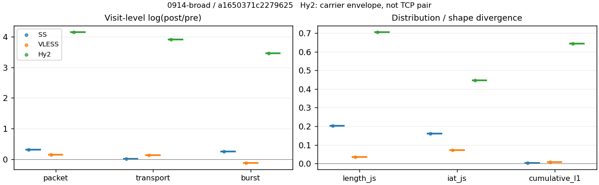
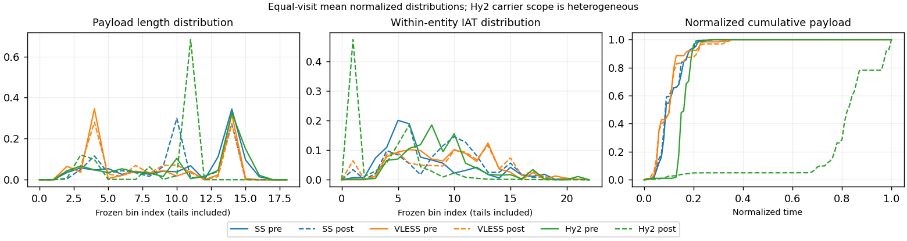

# 0914-broad · 条目 005 · google.com

目标：https://www.google.com/

活动标签：google.com::page_load。选定访问 3 次。

[返回总索引](../../README.md) · [统计口径](../../methods.md)

## 覆盖与资格（每次访问均保留）

| 部署 | 重复 | 主请求路由 | 活动状态 | 代理比较 | DIRECT pre | 请求 proxy/direct/unresolved | 错误 |
| --- | --- | --- | --- | --- | --- | --- | --- |
| Hy2 | 1 | proxy | passed | 1 | 0 | 37/0/0 | [] |
| SS | 1 | proxy | passed | 1 | 0 | 40/0/0 | [] |
| VLESS | 1 | proxy | passed | 1 | 0 | 40/0/0 | [] |

主请求非 proxy 的统计仅解释为已索引的辅助代理连接或 DIRECT 观测，不代表目标业务经代理传输。播放确认与配对资格是两道不同的门。

图中散点为单次访问，短线为重复中位数；Hy2 是共享载体包络，不能与 TCP 配对作等范围因果对比。

形态图先逐访问归一化，再对访问等权平均；实线 pre，虚线 post。分箱序号及边界见 methods，不将分箱索引误解为长度或时间。

## 每次访问的关键观测

### SS

范围：`exclusive_page`。每格 pre → post；空值为不可观测/不适用。

| 重复 | 包数 | 载荷字节 | burst | TCP FR | IAT中位µs | length JS | IAT JS |
| --- | --- | --- | --- | --- | --- | --- | --- |
| 1 | 1030 → 1412 | 1.1418e+06 → 1.1617e+06 | 776 → 1002 | 89 → 89 | 31.732 → 505.47 | 0.20351 | 0.15982 |

完整标量统计：中位数 [min,max]；Δ 为重复内逐访问变换的中位数，MAD 未缩放。n 为可用变换数；DIRECT-only 的 nΔ=0 不代表 pre 不可用。

| scope | 特征 | pre | post | Δ | IQRΔ | MADΔ | nΔ |
| --- | --- | --- | --- | --- | --- | --- | --- |
| exclusive_page | active_span_sum_s_1000ms | 12.359 [12.359, 12.359] | 12.834 [12.834, 12.834] | 0.037733 | — | — | 1 |
| exclusive_page | active_span_sum_s_100ms | 3.3966 [3.3966, 3.3966] | 6.0804 [6.0804, 6.0804] | 0.58228 | — | — | 1 |
| exclusive_page | active_span_sum_s_500ms | 11.419 [11.419, 11.419] | 11.93 [11.93, 11.93] | 0.043782 | — | — | 1 |
| exclusive_page | burst_bytes_iqr | 2688 [2688, 2688] | 1826.8 [1826.8, 1826.8] | -0.38626 | — | — | 1 |
| exclusive_page | burst_bytes_mad | 39 [39, 39] | 40 [40, 40] | 0.025318 | — | — | 1 |
| exclusive_page | burst_bytes_max | 20480 [20480, 20480] | 9990 [9990, 9990] | -0.71786 | — | — | 1 |
| exclusive_page | burst_bytes_mean | 1471.4 [1471.4, 1471.4] | 1159.3 [1159.3, 1159.3] | -0.23834 | — | — | 1 |
| exclusive_page | burst_bytes_median | 39 [39, 39] | 40 [40, 40] | 0.025318 | — | — | 1 |
| exclusive_page | burst_bytes_min | 0 [0, 0] | 0 [0, 0] | — | — | — | 0 |
| exclusive_page | burst_bytes_p95 | 6132 [6132, 6132] | 4586 [4586, 4586] | -0.29051 | — | — | 1 |
| exclusive_page | burst_bytes_q25 | 0 [0, 0] | 0 [0, 0] | — | — | — | 0 |
| exclusive_page | burst_bytes_q75 | 2688 [2688, 2688] | 1826.8 [1826.8, 1826.8] | -0.38626 | — | — | 1 |
| exclusive_page | burst_bytes_std | 2617.9 [2617.9, 2617.9] | 1658.4 [1658.4, 1658.4] | -0.45649 | — | — | 1 |
| exclusive_page | burst_count | 776 [776, 776] | 1002 [1002, 1002] | 0.2556 | — | — | 1 |
| exclusive_page | burst_duration_ms_iqr | 0 [0, 0] | 0.0001355 [0.0001355, 0.0001355] | — | — | — | 0 |
| exclusive_page | burst_duration_ms_mad | 0 [0, 0] | 0 [0, 0] | — | — | — | 0 |
| exclusive_page | burst_duration_ms_max | 3416 [3416, 3416] | 304.08 [304.08, 304.08] | -2.4189 | — | — | 1 |
| exclusive_page | burst_duration_ms_mean | 13.889 [13.889, 13.889] | 5.8644 [5.8644, 5.8644] | -0.86222 | — | — | 1 |
| exclusive_page | burst_duration_ms_median | 0 [0, 0] | 0 [0, 0] | — | — | — | 0 |
| exclusive_page | burst_duration_ms_min | 0 [0, 0] | 0 [0, 0] | — | — | — | 0 |
| exclusive_page | burst_duration_ms_p95 | 38.606 [38.606, 38.606] | 7.3896 [7.3896, 7.3896] | -1.6533 | — | — | 1 |
| exclusive_page | burst_duration_ms_q25 | 0 [0, 0] | 0 [0, 0] | — | — | — | 0 |
| exclusive_page | burst_duration_ms_q75 | 0 [0, 0] | 0.0001355 [0.0001355, 0.0001355] | — | — | — | 0 |
| exclusive_page | burst_duration_ms_std | 130.55 [130.55, 130.55] | 33.262 [33.262, 33.262] | -1.3674 | — | — | 1 |
| exclusive_page | burst_packets_iqr | 0 [0, 0] | 1 [1, 1] | — | — | — | 0 |
| exclusive_page | burst_packets_mad | 0 [0, 0] | 0 [0, 0] | — | — | — | 0 |
| exclusive_page | burst_packets_max | 9 [9, 9] | 7 [7, 7] | -0.25131 | — | — | 1 |
| exclusive_page | burst_packets_mean | 1.3273 [1.3273, 1.3273] | 1.4092 [1.4092, 1.4092] | 0.059848 | — | — | 1 |
| exclusive_page | burst_packets_median | 1 [1, 1] | 1 [1, 1] | 0 | — | — | 1 |
| exclusive_page | burst_packets_min | 1 [1, 1] | 1 [1, 1] | 0 | — | — | 1 |
| exclusive_page | burst_packets_p95 | 3 [3, 3] | 3 [3, 3] | 0 | — | — | 1 |
| exclusive_page | burst_packets_q25 | 1 [1, 1] | 1 [1, 1] | 0 | — | — | 1 |
| exclusive_page | burst_packets_q75 | 1 [1, 1] | 2 [2, 2] | 0.69315 | — | — | 1 |
| exclusive_page | burst_packets_std | 0.85167 [0.85167, 0.85167] | 0.87562 [0.87562, 0.87562] | 0.027732 | — | — | 1 |
| exclusive_page | connection_span_concurrency_max | 8 [8, 8] | 8 [8, 8] | 0 | — | — | 1 |
| exclusive_page | cumulative_l1 | — | — | 0.0040273 | — | — | 1 |
| exclusive_page | cumulative_max | — | — | 0.08269 | — | — | 1 |
| exclusive_page | direction_entropy | 0.64458 [0.64458, 0.64458] | 0.59306 [0.59306, 0.59306] | -0.051517 | — | — | 1 |
| exclusive_page | down_burst_count | 384 [384, 384] | 497 [497, 497] | 0.25795 | — | — | 1 |
| exclusive_page | down_ip_bytes | 1.1238e+06 [1.1238e+06, 1.1238e+06] | 1.1498e+06 [1.1498e+06, 1.1498e+06] | 0.022865 | — | — | 1 |
| exclusive_page | down_packets | 591 [591, 591] | 786 [786, 786] | 0.28514 | — | — | 1 |
| exclusive_page | down_transport_bytes | 1.093e+06 [1.093e+06, 1.093e+06] | 1.1088e+06 [1.1088e+06, 1.1088e+06] | 0.014377 | — | — | 1 |
| exclusive_page | duration_s | 18.076 [18.076, 18.076] | 18.075 [18.075, 18.075] | -6.8428e-05 | — | — | 1 |
| exclusive_page | entity_count | 8 [8, 8] | 8 [8, 8] | 0 | — | — | 1 |
| exclusive_page | fr_runs | 89 [89, 89] | 89 [89, 89] | 0 | — | — | 1 |
| exclusive_page | fr_runs_per_packet | 0.15559 [0.15559, 0.15559] | 0.11195 [0.11195, 0.11195] | -0.043645 | — | — | 1 |
| exclusive_page | fr_switches | 81 [81, 81] | 81 [81, 81] | 0 | — | — | 1 |
| exclusive_page | fr_switches_per_possible_transition | 0.14362 [0.14362, 0.14362] | 0.10292 [0.10292, 0.10292] | -0.040695 | — | — | 1 |
| exclusive_page | full_retransmission_fraction | 0 [0, 0] | 0.0014164 [0.0014164, 0.0014164] | 0.0014164 | — | — | 1 |
| exclusive_page | full_retransmission_packets | 0 [0, 0] | 2 [2, 2] | — | — | — | 0 |
| exclusive_page | iat_count | 1022 [1022, 1022] | 1404 [1404, 1404] | 0.31756 | — | — | 1 |
| exclusive_page | iat_js | — | — | 0.15982 | — | — | 1 |
| exclusive_page | iat_ks | — | — | 0.36771 | — | — | 1 |
| exclusive_page | iat_median_us | 31.732 [31.732, 31.732] | 505.47 [505.47, 505.47] | 2.7682 | — | — | 1 |
| exclusive_page | iat_us_iqr | 251.35 [251.35, 251.35] | 1609.7 [1609.7, 1609.7] | 1.8569 | — | — | 1 |
| exclusive_page | iat_us_mad | 26.485 [26.485, 26.485] | 495.94 [495.94, 495.94] | 2.9299 | — | — | 1 |
| exclusive_page | iat_us_max | 1.276e+07 [1.276e+07, 1.276e+07] | 1.2726e+07 [1.2726e+07, 1.2726e+07] | -0.0025976 | — | — | 1 |
| exclusive_page | iat_us_mean | 34096 [34096, 34096] | 24815 [24815, 24815] | -0.31774 | — | — | 1 |
| exclusive_page | iat_us_median | 31.732 [31.732, 31.732] | 505.47 [505.47, 505.47] | 2.7682 | — | — | 1 |
| exclusive_page | iat_us_min | 0.165 [0.165, 0.165] | 0.04 [0.04, 0.04] | -1.4171 | — | — | 1 |
| exclusive_page | iat_us_p95 | 69800 [69800, 69800] | 38169 [38169, 38169] | -0.6036 | — | — | 1 |
| exclusive_page | iat_us_q25 | 12.691 [12.691, 12.691] | 22.003 [22.003, 22.003] | 0.55027 | — | — | 1 |
| exclusive_page | iat_us_q75 | 264.04 [264.04, 264.04] | 1631.7 [1631.7, 1631.7] | 1.8213 | — | — | 1 |
| exclusive_page | iat_us_std | 4.2816e+05 [4.2816e+05, 4.2816e+05] | 3.6234e+05 [3.6234e+05, 3.6234e+05] | -0.16693 | — | — | 1 |
| exclusive_page | iat_wasserstein_log1p_us | — | — | 1.4048 | — | — | 1 |
| exclusive_page | idle_gap_count_1000ms | 6 [6, 6] | 6 [6, 6] | 0 | — | — | 1 |
| exclusive_page | idle_gap_count_100ms | 38 [38, 38] | 33 [33, 33] | -0.14108 | — | — | 1 |
| exclusive_page | idle_gap_count_500ms | 7 [7, 7] | 7 [7, 7] | 0 | — | — | 1 |
| exclusive_page | idle_gap_sum_s_1000ms | 22.487 [22.487, 22.487] | 22.005 [22.005, 22.005] | -0.021643 | — | — | 1 |
| exclusive_page | idle_gap_sum_s_100ms | 31.449 [31.449, 31.449] | 28.759 [28.759, 28.759] | -0.089414 | — | — | 1 |
| exclusive_page | idle_gap_sum_s_500ms | 23.427 [23.427, 23.427] | 22.91 [22.91, 22.91] | -0.022326 | — | — | 1 |
| exclusive_page | ip_bytes | 1.1955e+06 [1.1955e+06, 1.1955e+06] | 1.2442e+06 [1.2442e+06, 1.2442e+06] | 0.039927 | — | — | 1 |
| exclusive_page | length_iqr | 2218.5 [2218.5, 2218.5] | 2291 [2291, 2291] | 0.032157 | — | — | 1 |
| exclusive_page | length_js | — | — | 0.20351 | — | — | 1 |
| exclusive_page | length_ks | — | — | 0.40455 | — | — | 1 |
| exclusive_page | length_mad | 1200 [1200, 1200] | 1059 [1059, 1059] | -0.125 | — | — | 1 |
| exclusive_page | length_max | 8192 [8192, 8192] | 4130 [4130, 4130] | -0.68488 | — | — | 1 |
| exclusive_page | length_mean | 1996.1 [1996.1, 1996.1] | 1461.2 [1461.2, 1461.2] | -0.31194 | — | — | 1 |
| exclusive_page | length_median | 1696 [1696, 1696] | 1428 [1428, 1428] | -0.172 | — | — | 1 |
| exclusive_page | length_min | 31 [31, 31] | 20 [20, 20] | -0.43825 | — | — | 1 |
| exclusive_page | length_p95 | 4096 [4096, 4096] | 2856 [2856, 2856] | -0.36059 | — | — | 1 |
| exclusive_page | length_q25 | 677.5 [677.5, 677.5] | 565 [565, 565] | -0.18158 | — | — | 1 |
| exclusive_page | length_q75 | 2896 [2896, 2896] | 2856 [2856, 2856] | -0.013908 | — | — | 1 |
| exclusive_page | length_std | 1541.1 [1541.1, 1541.1] | 1001.4 [1001.4, 1001.4] | -0.43116 | — | — | 1 |
| exclusive_page | length_wasserstein_bytes | — | — | 538.25 | — | — | 1 |
| exclusive_page | nonempty_entity_count | 8 [8, 8] | 8 [8, 8] | 0 | — | — | 1 |
| exclusive_page | nonempty_packets | 572 [572, 572] | 795 [795, 795] | 0.3292 | — | — | 1 |
| exclusive_page | offload_suspect_fraction | 0.31553 [0.31553, 0.31553] | 0.18626 [0.18626, 0.18626] | -0.12927 | — | — | 1 |
| exclusive_page | packet_count | 1030 [1030, 1030] | 1412 [1412, 1412] | 0.31545 | — | — | 1 |
| exclusive_page | rtt_median_ms | 0.030313 [0.030313, 0.030313] | 36.996 [36.996, 36.996] | 7.107 | — | — | 1 |
| exclusive_page | rtt_sample_count | 444 [444, 444] | 289 [289, 289] | -0.4294 | — | — | 1 |
| exclusive_page | tcp_ack_count | 1022 [1022, 1022] | 1404 [1404, 1404] | 0.31756 | — | — | 1 |
| exclusive_page | tcp_fin_count | 16 [16, 16] | 16 [16, 16] | 0 | — | — | 1 |
| exclusive_page | tcp_packet_count | 1030 [1030, 1030] | 1412 [1412, 1412] | 0.31545 | — | — | 1 |
| exclusive_page | tcp_rst_count | 0 [0, 0] | 0 [0, 0] | — | — | — | 0 |
| exclusive_page | tcp_syn_count | 16 [16, 16] | 16 [16, 16] | 0 | — | — | 1 |
| exclusive_page | tcp_window_raw_median | 65535 [65535, 65535] | 145.5 [145.5, 145.5] | -6.1102 | — | — | 1 |
| exclusive_page | transition_entropy | 0.5054 [0.5054, 0.5054] | 0.40943 [0.40943, 0.40943] | -0.095971 | — | — | 1 |
| exclusive_page | transition_n_mm | 437 [437, 437] | 640 [640, 640] | 0.38153 | — | — | 1 |
| exclusive_page | transition_n_mp | 40 [40, 40] | 40 [40, 40] | 0 | — | — | 1 |
| exclusive_page | transition_n_pm | 41 [41, 41] | 41 [41, 41] | 0 | — | — | 1 |
| exclusive_page | transition_n_pp | 46 [46, 46] | 66 [66, 66] | 0.36101 | — | — | 1 |
| exclusive_page | transition_p_mm | 0.91614 [0.91614, 0.91614] | 0.94118 [0.94118, 0.94118] | 0.025034 | — | — | 1 |
| exclusive_page | transition_p_mp | 0.083857 [0.083857, 0.083857] | 0.058824 [0.058824, 0.058824] | -0.025034 | — | — | 1 |
| exclusive_page | transition_p_pm | 0.47126 [0.47126, 0.47126] | 0.38318 [0.38318, 0.38318] | -0.088087 | — | — | 1 |
| exclusive_page | transition_p_pp | 0.52874 [0.52874, 0.52874] | 0.61682 [0.61682, 0.61682] | 0.088087 | — | — | 1 |
| exclusive_page | transport_bytes | 1.1418e+06 [1.1418e+06, 1.1418e+06] | 1.1617e+06 [1.1617e+06, 1.1617e+06] | 0.017259 | — | — | 1 |
| exclusive_page | up_burst_count | 392 [392, 392] | 505 [505, 505] | 0.2533 | — | — | 1 |
| exclusive_page | up_byte_fraction | 0.042715 [0.042715, 0.042715] | 0.04547 [0.04547, 0.04547] | 0.0027546 | — | — | 1 |
| exclusive_page | up_ip_bytes | 71664 [71664, 71664] | 94369 [94369, 94369] | 0.27522 | — | — | 1 |
| exclusive_page | up_packets | 439 [439, 439] | 626 [626, 626] | 0.35485 | — | — | 1 |
| exclusive_page | up_transport_bytes | 48772 [48772, 48772] | 52821 [52821, 52821] | 0.079752 | — | — | 1 |
| exclusive_page | zero_iat_count | 0 [0, 0] | 0 [0, 0] | — | — | — | 0 |
| exclusive_page | zero_iat_fraction | 0 [0, 0] | 0 [0, 0] | 0 | — | — | 1 |

### VLESS

范围：`exclusive_page`。每格 pre → post；空值为不可观测/不适用。

| 重复 | 包数 | 载荷字节 | burst | TCP FR | IAT中位µs | length JS | IAT JS |
| --- | --- | --- | --- | --- | --- | --- | --- |
| 1 | 638 → 741 | 3.9812e+05 → 4.5962e+05 | 490 → 440 | 66 → 82 | 413.03 → 772.32 | 0.034663 | 0.072271 |

完整标量统计：中位数 [min,max]；Δ 为重复内逐访问变换的中位数，MAD 未缩放。n 为可用变换数；DIRECT-only 的 nΔ=0 不代表 pre 不可用。

| scope | 特征 | pre | post | Δ | IQRΔ | MADΔ | nΔ |
| --- | --- | --- | --- | --- | --- | --- | --- |
| exclusive_page | active_span_sum_s_1000ms | 9.9049 [9.9049, 9.9049] | 9.8694 [9.8694, 9.8694] | -0.0035879 | — | — | 1 |
| exclusive_page | active_span_sum_s_100ms | 1.7607 [1.7607, 1.7607] | 4.3702 [4.3702, 4.3702] | 0.90907 | — | — | 1 |
| exclusive_page | active_span_sum_s_500ms | 4.8856 [4.8856, 4.8856] | 9.8694 [9.8694, 9.8694] | 0.70314 | — | — | 1 |
| exclusive_page | burst_bytes_iqr | 1520 [1520, 1520] | 2824 [2824, 2824] | 0.61944 | — | — | 1 |
| exclusive_page | burst_bytes_mad | 31 [31, 31] | 70 [70, 70] | 0.81451 | — | — | 1 |
| exclusive_page | burst_bytes_max | 4272 [4272, 4272] | 5297 [5297, 5297] | 0.21506 | — | — | 1 |
| exclusive_page | burst_bytes_mean | 812.49 [812.49, 812.49] | 1044.6 [1044.6, 1044.6] | 0.25128 | — | — | 1 |
| exclusive_page | burst_bytes_median | 31 [31, 31] | 70 [70, 70] | 0.81451 | — | — | 1 |
| exclusive_page | burst_bytes_min | 0 [0, 0] | 0 [0, 0] | — | — | — | 0 |
| exclusive_page | burst_bytes_p95 | 2896 [2896, 2896] | 2896 [2896, 2896] | 0 | — | — | 1 |
| exclusive_page | burst_bytes_q25 | 0 [0, 0] | 0 [0, 0] | — | — | — | 0 |
| exclusive_page | burst_bytes_q75 | 1520 [1520, 1520] | 2824 [2824, 2824] | 0.61944 | — | — | 1 |
| exclusive_page | burst_bytes_std | 1227.9 [1227.9, 1227.9] | 1273.1 [1273.1, 1273.1] | 0.036166 | — | — | 1 |
| exclusive_page | burst_count | 490 [490, 490] | 440 [440, 440] | -0.10763 | — | — | 1 |
| exclusive_page | burst_duration_ms_iqr | 0.31639 [0.31639, 0.31639] | 6.272 [6.272, 6.272] | 2.9869 | — | — | 1 |
| exclusive_page | burst_duration_ms_mad | 0 [0, 0] | 0 [0, 0] | — | — | — | 0 |
| exclusive_page | burst_duration_ms_max | 2208.6 [2208.6, 2208.6] | 2208.8 [2208.8, 2208.8] | 8.6109e-05 | — | — | 1 |
| exclusive_page | burst_duration_ms_mean | 26.668 [26.668, 26.668] | 21.115 [21.115, 21.115] | -0.23349 | — | — | 1 |
| exclusive_page | burst_duration_ms_median | 0 [0, 0] | 0 [0, 0] | — | — | — | 0 |
| exclusive_page | burst_duration_ms_min | 0 [0, 0] | 0 [0, 0] | — | — | — | 0 |
| exclusive_page | burst_duration_ms_p95 | 188.46 [188.46, 188.46] | 154.72 [154.72, 154.72] | -0.1973 | — | — | 1 |
| exclusive_page | burst_duration_ms_q25 | 0 [0, 0] | 0 [0, 0] | — | — | — | 0 |
| exclusive_page | burst_duration_ms_q75 | 0.31639 [0.31639, 0.31639] | 6.272 [6.272, 6.272] | 2.9869 | — | — | 1 |
| exclusive_page | burst_duration_ms_std | 158.19 [158.19, 158.19] | 116.76 [116.76, 116.76] | -0.30366 | — | — | 1 |
| exclusive_page | burst_packets_iqr | 1 [1, 1] | 1 [1, 1] | 0 | — | — | 1 |
| exclusive_page | burst_packets_mad | 0 [0, 0] | 0 [0, 0] | — | — | — | 0 |
| exclusive_page | burst_packets_max | 4 [4, 4] | 7 [7, 7] | 0.55962 | — | — | 1 |
| exclusive_page | burst_packets_mean | 1.302 [1.302, 1.302] | 1.6841 [1.6841, 1.6841] | 0.25729 | — | — | 1 |
| exclusive_page | burst_packets_median | 1 [1, 1] | 1 [1, 1] | 0 | — | — | 1 |
| exclusive_page | burst_packets_min | 1 [1, 1] | 1 [1, 1] | 0 | — | — | 1 |
| exclusive_page | burst_packets_p95 | 2 [2, 2] | 4 [4, 4] | 0.69315 | — | — | 1 |
| exclusive_page | burst_packets_q25 | 1 [1, 1] | 1 [1, 1] | 0 | — | — | 1 |
| exclusive_page | burst_packets_q75 | 2 [2, 2] | 2 [2, 2] | 0 | — | — | 1 |
| exclusive_page | burst_packets_std | 0.54078 [0.54078, 0.54078] | 1.0883 [1.0883, 1.0883] | 0.69931 | — | — | 1 |
| exclusive_page | connection_span_concurrency_max | 5 [5, 5] | 5 [5, 5] | 0 | — | — | 1 |
| exclusive_page | cumulative_l1 | — | — | 0.0077556 | — | — | 1 |
| exclusive_page | cumulative_max | — | — | 0.057986 | — | — | 1 |
| exclusive_page | direction_entropy | 0.65689 [0.65689, 0.65689] | 0.71392 [0.71392, 0.71392] | 0.057029 | — | — | 1 |
| exclusive_page | down_burst_count | 241 [241, 241] | 216 [216, 216] | -0.10952 | — | — | 1 |
| exclusive_page | down_ip_bytes | 3.867e+05 [3.867e+05, 3.867e+05] | 4.3521e+05 [4.3521e+05, 4.3521e+05] | 0.11819 | — | — | 1 |
| exclusive_page | down_packets | 358 [358, 358] | 427 [427, 427] | 0.17625 | — | — | 1 |
| exclusive_page | down_transport_bytes | 3.6802e+05 [3.6802e+05, 3.6802e+05] | 4.1294e+05 [4.1294e+05, 4.1294e+05] | 0.11518 | — | — | 1 |
| exclusive_page | duration_s | 19.041 [19.041, 19.041] | 19.021 [19.021, 19.021] | -0.0010829 | — | — | 1 |
| exclusive_page | entity_count | 8 [8, 8] | 8 [8, 8] | 0 | — | — | 1 |
| exclusive_page | fr_runs | 66 [66, 66] | 82 [82, 82] | 0.21706 | — | — | 1 |
| exclusive_page | fr_runs_per_packet | 0.19643 [0.19643, 0.19643] | 0.20347 [0.20347, 0.20347] | 0.0070454 | — | — | 1 |
| exclusive_page | fr_switches | 58 [58, 58] | 74 [74, 74] | 0.24362 | — | — | 1 |
| exclusive_page | fr_switches_per_possible_transition | 0.17683 [0.17683, 0.17683] | 0.18734 [0.18734, 0.18734] | 0.010513 | — | — | 1 |
| exclusive_page | full_retransmission_fraction | 0.0031348 [0.0031348, 0.0031348] | 0 [0, 0] | -0.0031348 | — | — | 1 |
| exclusive_page | full_retransmission_packets | 2 [2, 2] | 0 [0, 0] | — | — | — | 0 |
| exclusive_page | iat_count | 630 [630, 630] | 733 [733, 733] | 0.15143 | — | — | 1 |
| exclusive_page | iat_js | — | — | 0.072271 | — | — | 1 |
| exclusive_page | iat_ks | — | — | 0.080539 | — | — | 1 |
| exclusive_page | iat_median_us | 413.03 [413.03, 413.03] | 772.32 [772.32, 772.32] | 0.62587 | — | — | 1 |
| exclusive_page | iat_us_iqr | 4165.8 [4165.8, 4165.8] | 7787.8 [7787.8, 7787.8] | 0.62564 | — | — | 1 |
| exclusive_page | iat_us_mad | 403.54 [403.54, 403.54] | 763.67 [763.67, 763.67] | 0.63786 | — | — | 1 |
| exclusive_page | iat_us_max | 1.2119e+07 [1.2119e+07, 1.2119e+07] | 1.2076e+07 [1.2076e+07, 1.2076e+07] | -0.0035759 | — | — | 1 |
| exclusive_page | iat_us_mean | 43305 [43305, 43305] | 36993 [36993, 36993] | -0.15755 | — | — | 1 |
| exclusive_page | iat_us_median | 413.03 [413.03, 413.03] | 772.32 [772.32, 772.32] | 0.62587 | — | — | 1 |
| exclusive_page | iat_us_min | 2.916 [2.916, 2.916] | 0.035 [0.035, 0.035] | -4.4226 | — | — | 1 |
| exclusive_page | iat_us_p95 | 41014 [41014, 41014] | 95756 [95756, 95756] | 0.84789 | — | — | 1 |
| exclusive_page | iat_us_q25 | 36.524 [36.524, 36.524] | 19.754 [19.754, 19.754] | -0.61462 | — | — | 1 |
| exclusive_page | iat_us_q75 | 4202.4 [4202.4, 4202.4] | 7807.6 [7807.6, 7807.6] | 0.61944 | — | — | 1 |
| exclusive_page | iat_us_std | 5.0306e+05 [5.0306e+05, 5.0306e+05] | 4.6119e+05 [4.6119e+05, 4.6119e+05] | -0.0869 | — | — | 1 |
| exclusive_page | iat_wasserstein_log1p_us | — | — | 0.62543 | — | — | 1 |
| exclusive_page | idle_gap_count_1000ms | 4 [4, 4] | 4 [4, 4] | 0 | — | — | 1 |
| exclusive_page | idle_gap_count_100ms | 28 [28, 28] | 33 [33, 33] | 0.1643 | — | — | 1 |
| exclusive_page | idle_gap_count_500ms | 12 [12, 12] | 4 [4, 4] | -1.0986 | — | — | 1 |
| exclusive_page | idle_gap_sum_s_1000ms | 17.377 [17.377, 17.377] | 17.246 [17.246, 17.246] | -0.0075703 | — | — | 1 |
| exclusive_page | idle_gap_sum_s_100ms | 25.521 [25.521, 25.521] | 22.745 [22.745, 22.745] | -0.11515 | — | — | 1 |
| exclusive_page | idle_gap_sum_s_500ms | 22.396 [22.396, 22.396] | 17.246 [17.246, 17.246] | -0.26131 | — | — | 1 |
| exclusive_page | ip_bytes | 4.3125e+05 [4.3125e+05, 4.3125e+05] | 4.9856e+05 [4.9856e+05, 4.9856e+05] | 0.14502 | — | — | 1 |
| exclusive_page | length_iqr | 2752 [2752, 2752] | 2752 [2752, 2752] | 0 | — | — | 1 |
| exclusive_page | length_js | — | — | 0.034663 | — | — | 1 |
| exclusive_page | length_ks | — | — | 0.069257 | — | — | 1 |
| exclusive_page | length_mad | 590.5 [590.5, 590.5] | 661 [661, 661] | 0.11278 | — | — | 1 |
| exclusive_page | length_max | 4096 [4096, 4096] | 2824 [2824, 2824] | -0.37186 | — | — | 1 |
| exclusive_page | length_mean | 1184.9 [1184.9, 1184.9] | 1140.5 [1140.5, 1140.5] | -0.038172 | — | — | 1 |
| exclusive_page | length_median | 629.5 [629.5, 629.5] | 725 [725, 725] | 0.14125 | — | — | 1 |
| exclusive_page | length_min | 24 [24, 24] | 3 [3, 3] | -2.0794 | — | — | 1 |
| exclusive_page | length_p95 | 2824 [2824, 2824] | 2824 [2824, 2824] | 0 | — | — | 1 |
| exclusive_page | length_q25 | 72 [72, 72] | 72 [72, 72] | 0 | — | — | 1 |
| exclusive_page | length_q75 | 2824 [2824, 2824] | 2824 [2824, 2824] | 0 | — | — | 1 |
| exclusive_page | length_std | 1215.1 [1215.1, 1215.1] | 1134.5 [1134.5, 1134.5] | -0.068624 | — | — | 1 |
| exclusive_page | length_wasserstein_bytes | — | — | 106.54 | — | — | 1 |
| exclusive_page | nonempty_entity_count | 8 [8, 8] | 8 [8, 8] | 0 | — | — | 1 |
| exclusive_page | nonempty_packets | 336 [336, 336] | 403 [403, 403] | 0.18183 | — | — | 1 |
| exclusive_page | offload_suspect_fraction | 0.18339 [0.18339, 0.18339] | 0.15924 [0.15924, 0.15924] | -0.024141 | — | — | 1 |
| exclusive_page | packet_count | 638 [638, 638] | 741 [741, 741] | 0.14966 | — | — | 1 |
| exclusive_page | rtt_median_ms | 0.12116 [0.12116, 0.12116] | 8.5236 [8.5236, 8.5236] | 4.2535 | — | — | 1 |
| exclusive_page | rtt_sample_count | 273 [273, 273] | 310 [310, 310] | 0.1271 | — | — | 1 |
| exclusive_page | tcp_ack_count | 614 [614, 614] | 733 [733, 733] | 0.17715 | — | — | 1 |
| exclusive_page | tcp_fin_count | 16 [16, 16] | 16 [16, 16] | 0 | — | — | 1 |
| exclusive_page | tcp_packet_count | 638 [638, 638] | 741 [741, 741] | 0.14966 | — | — | 1 |
| exclusive_page | tcp_rst_count | 16 [16, 16] | 0 [0, 0] | — | — | — | 0 |
| exclusive_page | tcp_syn_count | 16 [16, 16] | 16 [16, 16] | 0 | — | — | 1 |
| exclusive_page | tcp_window_raw_median | 65535 [65535, 65535] | 141 [141, 141] | -6.1416 | — | — | 1 |
| exclusive_page | transition_entropy | 0.53743 [0.53743, 0.53743] | 0.5861 [0.5861, 0.5861] | 0.048666 | — | — | 1 |
| exclusive_page | transition_n_mm | 246 [246, 246] | 283 [283, 283] | 0.14012 | — | — | 1 |
| exclusive_page | transition_n_mp | 25 [25, 25] | 33 [33, 33] | 0.27763 | — | — | 1 |
| exclusive_page | transition_n_pm | 33 [33, 33] | 41 [41, 41] | 0.21706 | — | — | 1 |
| exclusive_page | transition_n_pp | 24 [24, 24] | 38 [38, 38] | 0.45953 | — | — | 1 |
| exclusive_page | transition_p_mm | 0.90775 [0.90775, 0.90775] | 0.89557 [0.89557, 0.89557] | -0.012179 | — | — | 1 |
| exclusive_page | transition_p_mp | 0.092251 [0.092251, 0.092251] | 0.10443 [0.10443, 0.10443] | 0.012179 | — | — | 1 |
| exclusive_page | transition_p_pm | 0.57895 [0.57895, 0.57895] | 0.51899 [0.51899, 0.51899] | -0.05996 | — | — | 1 |
| exclusive_page | transition_p_pp | 0.42105 [0.42105, 0.42105] | 0.48101 [0.48101, 0.48101] | 0.05996 | — | — | 1 |
| exclusive_page | transport_bytes | 3.9812e+05 [3.9812e+05, 3.9812e+05] | 4.5962e+05 [4.5962e+05, 4.5962e+05] | 0.14365 | — | — | 1 |
| exclusive_page | up_burst_count | 249 [249, 249] | 224 [224, 224] | -0.10581 | — | — | 1 |
| exclusive_page | up_byte_fraction | 0.075611 [0.075611, 0.075611] | 0.10156 [0.10156, 0.10156] | 0.025949 | — | — | 1 |
| exclusive_page | up_ip_bytes | 44558 [44558, 44558] | 63347 [63347, 63347] | 0.35184 | — | — | 1 |
| exclusive_page | up_packets | 280 [280, 280] | 314 [314, 314] | 0.1146 | — | — | 1 |
| exclusive_page | up_transport_bytes | 30102 [30102, 30102] | 46679 [46679, 46679] | 0.4387 | — | — | 1 |
| exclusive_page | zero_iat_count | 0 [0, 0] | 0 [0, 0] | — | — | — | 0 |
| exclusive_page | zero_iat_fraction | 0 [0, 0] | 0 [0, 0] | 0 | — | — | 1 |

### Hy2

范围：`carrier_context_envelope`。每格 pre → post；空值为不可观测/不适用。

| 重复 | 包数 | 载荷字节 | burst | TCP FR | IAT中位µs | length JS | IAT JS |
| --- | --- | --- | --- | --- | --- | --- | --- |
| 1 | 651 → 40857 | 8.9895e+05 → 4.4315e+07 | 434 → 13743 | — | 163.39 → 3.6295 | 0.7042 | 0.4463 |

完整标量统计：中位数 [min,max]；Δ 为重复内逐访问变换的中位数，MAD 未缩放。n 为可用变换数；DIRECT-only 的 nΔ=0 不代表 pre 不可用。

| scope | 特征 | pre | post | Δ | IQRΔ | MADΔ | nΔ |
| --- | --- | --- | --- | --- | --- | --- | --- |
| carrier_context_envelope | active_span_sum_s_1000ms | 5.1634 [5.1634, 5.1634] | 12.283 [12.283, 12.283] | 0.86662 | — | — | 1 |
| carrier_context_envelope | active_span_sum_s_100ms | 0.93698 [0.93698, 0.93698] | 7.0671 [7.0671, 7.0671] | 2.0205 | — | — | 1 |
| carrier_context_envelope | active_span_sum_s_500ms | 5.1634 [5.1634, 5.1634] | 11.47 [11.47, 11.47] | 0.79812 | — | — | 1 |
| carrier_context_envelope | burst_bytes_iqr | 2254 [2254, 2254] | 5094 [5094, 5094] | 0.81536 | — | — | 1 |
| carrier_context_envelope | burst_bytes_mad | 39 [39, 39] | 408 [408, 408] | 2.3477 | — | — | 1 |
| carrier_context_envelope | burst_bytes_max | 20480 [20480, 20480] | 2.0585e+05 [2.0585e+05, 2.0585e+05] | 2.3077 | — | — | 1 |
| carrier_context_envelope | burst_bytes_mean | 2071.3 [2071.3, 2071.3] | 3224.6 [3224.6, 3224.6] | 0.44261 | — | — | 1 |
| carrier_context_envelope | burst_bytes_median | 39 [39, 39] | 441 [441, 441] | 2.4255 | — | — | 1 |
| carrier_context_envelope | burst_bytes_min | 0 [0, 0] | 22 [22, 22] | — | — | — | 0 |
| carrier_context_envelope | burst_bytes_p95 | 9905 [9905, 9905] | 10932 [10932, 10932] | 0.098655 | — | — | 1 |
| carrier_context_envelope | burst_bytes_q25 | 0 [0, 0] | 74 [74, 74] | — | — | — | 0 |
| carrier_context_envelope | burst_bytes_q75 | 2254 [2254, 2254] | 5168 [5168, 5168] | 0.82978 | — | — | 1 |
| carrier_context_envelope | burst_bytes_std | 3708.9 [3708.9, 3708.9] | 7122.3 [7122.3, 7122.3] | 0.6525 | — | — | 1 |
| carrier_context_envelope | burst_count | 434 [434, 434] | 13743 [13743, 13743] | 3.4552 | — | — | 1 |
| carrier_context_envelope | burst_duration_ms_iqr | 0.38791 [0.38791, 0.38791] | 0.025059 [0.025059, 0.025059] | -2.7395 | — | — | 1 |
| carrier_context_envelope | burst_duration_ms_mad | 0 [0, 0] | 4.7e-05 [4.7e-05, 4.7e-05] | — | — | — | 0 |
| carrier_context_envelope | burst_duration_ms_max | 15001 [15001, 15001] | 474.12 [474.12, 474.12] | -3.4544 | — | — | 1 |
| carrier_context_envelope | burst_duration_ms_mean | 44.304 [44.304, 44.304] | 0.29575 [0.29575, 0.29575] | -5.0093 | — | — | 1 |
| carrier_context_envelope | burst_duration_ms_median | 0 [0, 0] | 4.7e-05 [4.7e-05, 4.7e-05] | — | — | — | 0 |
| carrier_context_envelope | burst_duration_ms_min | 0 [0, 0] | 0 [0, 0] | — | — | — | 0 |
| carrier_context_envelope | burst_duration_ms_p95 | 84.81 [84.81, 84.81] | 0.12804 [0.12804, 0.12804] | -6.4958 | — | — | 1 |
| carrier_context_envelope | burst_duration_ms_q25 | 0 [0, 0] | 0 [0, 0] | — | — | — | 0 |
| carrier_context_envelope | burst_duration_ms_q75 | 0.38791 [0.38791, 0.38791] | 0.025059 [0.025059, 0.025059] | -2.7395 | — | — | 1 |
| carrier_context_envelope | burst_duration_ms_std | 719.82 [719.82, 719.82] | 6.1994 [6.1994, 6.1994] | -4.7546 | — | — | 1 |
| carrier_context_envelope | burst_packets_iqr | 1 [1, 1] | 3 [3, 3] | 1.0986 | — | — | 1 |
| carrier_context_envelope | burst_packets_mad | 0 [0, 0] | 1 [1, 1] | — | — | — | 0 |
| carrier_context_envelope | burst_packets_max | 8 [8, 8] | 151 [151, 151] | 2.9378 | — | — | 1 |
| carrier_context_envelope | burst_packets_mean | 1.5 [1.5, 1.5] | 2.9729 [2.9729, 2.9729] | 0.68408 | — | — | 1 |
| carrier_context_envelope | burst_packets_median | 1 [1, 1] | 2 [2, 2] | 0.69315 | — | — | 1 |
| carrier_context_envelope | burst_packets_min | 1 [1, 1] | 1 [1, 1] | 0 | — | — | 1 |
| carrier_context_envelope | burst_packets_p95 | 3 [3, 3] | 8 [8, 8] | 0.98083 | — | — | 1 |
| carrier_context_envelope | burst_packets_q25 | 1 [1, 1] | 1 [1, 1] | 0 | — | — | 1 |
| carrier_context_envelope | burst_packets_q75 | 2 [2, 2] | 4 [4, 4] | 0.69315 | — | — | 1 |
| carrier_context_envelope | burst_packets_std | 0.75364 [0.75364, 0.75364] | 4.9304 [4.9304, 4.9304] | 1.8783 | — | — | 1 |
| carrier_context_envelope | connection_span_concurrency_max | 7 [7, 7] | 1 [1, 1] | -1.9459 | — | — | 1 |
| carrier_context_envelope | cumulative_l1 | — | — | 0.64307 | — | — | 1 |
| carrier_context_envelope | cumulative_max | — | — | 0.95025 | — | — | 1 |
| carrier_context_envelope | direction_entropy | 0.77792 [0.77792, 0.77792] | 0.76166 [0.76166, 0.76166] | -0.016258 | — | — | 1 |
| carrier_context_envelope | direction_run_analog_runs | 80 [80, 80] | 13743 [13743, 13743] | 5.1463 | — | — | 1 |
| carrier_context_envelope | direction_run_analog_runs_per_packet | 0.2139 [0.2139, 0.2139] | 0.33637 [0.33637, 0.33637] | 0.12246 | — | — | 1 |
| carrier_context_envelope | direction_run_analog_switches | 72 [72, 72] | 13742 [13742, 13742] | 5.2515 | — | — | 1 |
| carrier_context_envelope | direction_run_analog_switches_per_possible_transition | 0.19672 [0.19672, 0.19672] | 0.33635 [0.33635, 0.33635] | 0.13963 | — | — | 1 |
| carrier_context_envelope | down_burst_count | 213 [213, 213] | 6871 [6871, 6871] | 3.4738 | — | — | 1 |
| carrier_context_envelope | down_ip_bytes | 8.7553e+05 [8.7553e+05, 8.7553e+05] | 4.451e+07 [4.451e+07, 4.451e+07] | 3.9286 | — | — | 1 |
| carrier_context_envelope | down_packets | 395 [395, 395] | 31835 [31835, 31835] | 4.3894 | — | — | 1 |
| carrier_context_envelope | down_transport_bytes | 8.5492e+05 [8.5492e+05, 8.5492e+05] | 4.3619e+07 [4.3619e+07, 4.3619e+07] | 3.9322 | — | — | 1 |
| carrier_context_envelope | duration_s | 18.416 [18.416, 18.416] | 18.401 [18.401, 18.401] | -0.00078595 | — | — | 1 |
| carrier_context_envelope | entity_count | 8 [8, 8] | 1 [1, 1] | -2.0794 | — | — | 1 |
| carrier_context_envelope | full_retransmission_fraction | 0.0015361 [0.0015361, 0.0015361] | — | — | — | — | 0 |
| carrier_context_envelope | full_retransmission_packets | 1 [1, 1] | — | — | — | — | 0 |
| carrier_context_envelope | iat_count | 643 [643, 643] | 40856 [40856, 40856] | 4.1517 | — | — | 1 |
| carrier_context_envelope | iat_js | — | — | 0.4463 | — | — | 1 |
| carrier_context_envelope | iat_ks | — | — | 0.64042 | — | — | 1 |
| carrier_context_envelope | iat_median_us | 163.39 [163.39, 163.39] | 3.6295 [3.6295, 3.6295] | -3.807 | — | — | 1 |
| carrier_context_envelope | iat_us_iqr | 819.09 [819.09, 819.09] | 24.594 [24.594, 24.594] | -3.5057 | — | — | 1 |
| carrier_context_envelope | iat_us_mad | 149.72 [149.72, 149.72] | 3.5935 [3.5935, 3.5935] | -3.7296 | — | — | 1 |
| carrier_context_envelope | iat_us_max | 1.5001e+07 [1.5001e+07, 1.5001e+07] | 4.7528e+06 [4.7528e+06, 4.7528e+06] | -1.1494 | — | — | 1 |
| carrier_context_envelope | iat_us_mean | 1.6544e+05 [1.6544e+05, 1.6544e+05] | 450.39 [450.39, 450.39] | -5.9062 | — | — | 1 |
| carrier_context_envelope | iat_us_median | 163.39 [163.39, 163.39] | 3.6295 [3.6295, 3.6295] | -3.807 | — | — | 1 |
| carrier_context_envelope | iat_us_min | 0.028 [0.028, 0.028] | 0 [0, 0] | — | — | — | 0 |
| carrier_context_envelope | iat_us_p95 | 55887 [55887, 55887] | 214.41 [214.41, 214.41] | -5.5632 | — | — | 1 |
| carrier_context_envelope | iat_us_q25 | 50.288 [50.288, 50.288] | 0.044 [0.044, 0.044] | -7.0413 | — | — | 1 |
| carrier_context_envelope | iat_us_q75 | 869.38 [869.38, 869.38] | 24.638 [24.638, 24.638] | -3.5635 | — | — | 1 |
| carrier_context_envelope | iat_us_std | 1.5009e+06 [1.5009e+06, 1.5009e+06] | 25271 [25271, 25271] | -4.0841 | — | — | 1 |
| carrier_context_envelope | iat_wasserstein_log1p_us | — | — | 3.7262 | — | — | 1 |
| carrier_context_envelope | idle_gap_count_1000ms | 7 [7, 7] | 2 [2, 2] | -1.2528 | — | — | 1 |
| carrier_context_envelope | idle_gap_count_100ms | 31 [31, 31] | 31 [31, 31] | 0 | — | — | 1 |
| carrier_context_envelope | idle_gap_count_500ms | 7 [7, 7] | 3 [3, 3] | -0.8473 | — | — | 1 |
| carrier_context_envelope | idle_gap_sum_s_1000ms | 101.21 [101.21, 101.21] | 6.1184 [6.1184, 6.1184] | -2.8059 | — | — | 1 |
| carrier_context_envelope | idle_gap_sum_s_100ms | 105.44 [105.44, 105.44] | 11.334 [11.334, 11.334] | -2.2303 | — | — | 1 |
| carrier_context_envelope | idle_gap_sum_s_500ms | 101.21 [101.21, 101.21] | 6.9316 [6.9316, 6.9316] | -2.6811 | — | — | 1 |
| carrier_context_envelope | ip_bytes | 9.3295e+05 [9.3295e+05, 9.3295e+05] | 4.5459e+07 [4.5459e+07, 4.5459e+07] | 3.8862 | — | — | 1 |
| carrier_context_envelope | length_iqr | 2296.8 [2296.8, 2296.8] | 596 [596, 596] | -1.349 | — | — | 1 |
| carrier_context_envelope | length_js | — | — | 0.7042 | — | — | 1 |
| carrier_context_envelope | length_ks | — | — | 0.56417 | — | — | 1 |
| carrier_context_envelope | length_mad | 1025 [1025, 1025] | 0 [0, 0] | — | — | — | 0 |
| carrier_context_envelope | length_max | 8920 [8920, 8920] | 1441 [1441, 1441] | -1.823 | — | — | 1 |
| carrier_context_envelope | length_mean | 2403.6 [2403.6, 2403.6] | 1084.6 [1084.6, 1084.6] | -0.79573 | — | — | 1 |
| carrier_context_envelope | length_median | 1971 [1971, 1971] | 1441 [1441, 1441] | -0.3132 | — | — | 1 |
| carrier_context_envelope | length_min | 13 [13, 13] | 22 [22, 22] | 0.52609 | — | — | 1 |
| carrier_context_envelope | length_p95 | 7075 [7075, 7075] | 1441 [1441, 1441] | -1.5912 | — | — | 1 |
| carrier_context_envelope | length_q25 | 533.25 [533.25, 533.25] | 845 [845, 845] | 0.46035 | — | — | 1 |
| carrier_context_envelope | length_q75 | 2830 [2830, 2830] | 1441 [1441, 1441] | -0.67494 | — | — | 1 |
| carrier_context_envelope | length_std | 2213 [2213, 2213] | 575.94 [575.94, 575.94] | -1.3461 | — | — | 1 |
| carrier_context_envelope | length_wasserstein_bytes | — | — | 1382.5 | — | — | 1 |
| carrier_context_envelope | nonempty_entity_count | 8 [8, 8] | 1 [1, 1] | -2.0794 | — | — | 1 |
| carrier_context_envelope | nonempty_packets | 374 [374, 374] | 40857 [40857, 40857] | 4.6936 | — | — | 1 |
| carrier_context_envelope | offload_suspect_fraction | 0.32412 [0.32412, 0.32412] | 0 [0, 0] | -0.32412 | — | — | 1 |
| carrier_context_envelope | packet_count | 651 [651, 651] | 40857 [40857, 40857] | 4.1393 | — | — | 1 |
| carrier_context_envelope | rtt_median_ms | 0.17845 [0.17845, 0.17845] | — | — | — | — | 0 |
| carrier_context_envelope | rtt_sample_count | 269 [269, 269] | 0 [0, 0] | — | — | — | 0 |
| carrier_context_envelope | tcp_ack_count | 643 [643, 643] | — | — | — | — | 0 |
| carrier_context_envelope | tcp_fin_count | 16 [16, 16] | — | — | — | — | 0 |
| carrier_context_envelope | tcp_packet_count | 651 [651, 651] | 0 [0, 0] | — | — | — | 0 |
| carrier_context_envelope | tcp_rst_count | 0 [0, 0] | — | — | — | — | 0 |
| carrier_context_envelope | tcp_syn_count | 16 [16, 16] | — | — | — | — | 0 |
| carrier_context_envelope | tcp_window_raw_median | 65535 [65535, 65535] | — | — | — | — | 0 |
| carrier_context_envelope | transition_entropy | 0.63993 [0.63993, 0.63993] | 0.76126 [0.76126, 0.76126] | 0.12134 | — | — | 1 |
| carrier_context_envelope | transition_n_mm | 252 [252, 252] | 24964 [24964, 24964] | 4.5958 | — | — | 1 |
| carrier_context_envelope | transition_n_mp | 36 [36, 36] | 6871 [6871, 6871] | 5.2515 | — | — | 1 |
| carrier_context_envelope | transition_n_pm | 36 [36, 36] | 6871 [6871, 6871] | 5.2515 | — | — | 1 |
| carrier_context_envelope | transition_n_pp | 42 [42, 42] | 2150 [2150, 2150] | 3.9356 | — | — | 1 |
| carrier_context_envelope | transition_p_mm | 0.875 [0.875, 0.875] | 0.78417 [0.78417, 0.78417] | -0.090832 | — | — | 1 |
| carrier_context_envelope | transition_p_mp | 0.125 [0.125, 0.125] | 0.21583 [0.21583, 0.21583] | 0.090832 | — | — | 1 |
| carrier_context_envelope | transition_p_pm | 0.46154 [0.46154, 0.46154] | 0.76167 [0.76167, 0.76167] | 0.30013 | — | — | 1 |
| carrier_context_envelope | transition_p_pp | 0.53846 [0.53846, 0.53846] | 0.23833 [0.23833, 0.23833] | -0.30013 | — | — | 1 |
| carrier_context_envelope | transport_bytes | 8.9895e+05 [8.9895e+05, 8.9895e+05] | 4.4315e+07 [4.4315e+07, 4.4315e+07] | 3.8979 | — | — | 1 |
| carrier_context_envelope | up_burst_count | 221 [221, 221] | 6872 [6872, 6872] | 3.437 | — | — | 1 |
| carrier_context_envelope | up_byte_fraction | 0.048978 [0.048978, 0.048978] | 0.015716 [0.015716, 0.015716] | -0.033262 | — | — | 1 |
| carrier_context_envelope | up_ip_bytes | 57417 [57417, 57417] | 9.4906e+05 [9.4906e+05, 9.4906e+05] | 2.8051 | — | — | 1 |
| carrier_context_envelope | up_packets | 256 [256, 256] | 9022 [9022, 9022] | 3.5622 | — | — | 1 |
| carrier_context_envelope | up_transport_bytes | 44029 [44029, 44029] | 6.9644e+05 [6.9644e+05, 6.9644e+05] | 2.7611 | — | — | 1 |
| carrier_context_envelope | zero_iat_count | 0 [0, 0] | 1 [1, 1] | — | — | — | 0 |
| carrier_context_envelope | zero_iat_fraction | 0 [0, 0] | 2.4476e-05 [2.4476e-05, 2.4476e-05] | 2.4476e-05 | — | — | 1 |

## 不同部署对比

以下是各部署自身重复中位数的差异，不按重复编号强行配对。跨 TCP/Hy2 的行标记异质观测范围。

| 视角 | 特征 | 部署A | 部署B | A中位 | B中位 | B−A | 比较口径 |
| --- | --- | --- | --- | --- | --- | --- | --- |
| pre | burst_count | SS | VLESS | 776 | 490 | -286 | same_scope_unpaired_visits |
| pre | burst_count | SS | Hy2 | 776 | 434 | -342 | heterogeneous_scope_descriptive_only |
| pre | burst_count | VLESS | Hy2 | 490 | 434 | -56 | heterogeneous_scope_descriptive_only |
| pre | connection_span_concurrency_max | SS | VLESS | 8 | 5 | -3 | same_scope_unpaired_visits |
| pre | connection_span_concurrency_max | SS | Hy2 | 8 | 7 | -1 | heterogeneous_scope_descriptive_only |
| pre | connection_span_concurrency_max | VLESS | Hy2 | 5 | 7 | 2 | heterogeneous_scope_descriptive_only |
| pre | direction_entropy | SS | VLESS | 0.64458 | 0.65689 | 0.012305 | same_scope_unpaired_visits |
| pre | direction_entropy | SS | Hy2 | 0.64458 | 0.77792 | 0.13334 | heterogeneous_scope_descriptive_only |
| pre | direction_entropy | VLESS | Hy2 | 0.65689 | 0.77792 | 0.12103 | heterogeneous_scope_descriptive_only |
| pre | down_transport_bytes | SS | VLESS | 1.093e+06 | 3.6802e+05 | -7.25e+05 | same_scope_unpaired_visits |
| pre | down_transport_bytes | SS | Hy2 | 1.093e+06 | 8.5492e+05 | -2.3809e+05 | heterogeneous_scope_descriptive_only |
| pre | down_transport_bytes | VLESS | Hy2 | 3.6802e+05 | 8.5492e+05 | 4.8691e+05 | heterogeneous_scope_descriptive_only |
| pre | duration_s | SS | VLESS | 18.076 | 19.041 | 0.9647 | same_scope_unpaired_visits |
| pre | duration_s | SS | Hy2 | 18.076 | 18.416 | 0.33934 | heterogeneous_scope_descriptive_only |
| pre | duration_s | VLESS | Hy2 | 19.041 | 18.416 | -0.62536 | heterogeneous_scope_descriptive_only |
| pre | entity_count | SS | VLESS | 8 | 8 | 0 | same_scope_unpaired_visits |
| pre | entity_count | SS | Hy2 | 8 | 8 | 0 | heterogeneous_scope_descriptive_only |
| pre | entity_count | VLESS | Hy2 | 8 | 8 | 0 | heterogeneous_scope_descriptive_only |
| pre | fr_runs | SS | VLESS | 89 | 66 | -23 | same_scope_unpaired_visits |
| pre | fr_runs_per_packet | SS | VLESS | 0.15559 | 0.19643 | 0.040834 | same_scope_unpaired_visits |
| pre | fr_switches | SS | VLESS | 81 | 58 | -23 | same_scope_unpaired_visits |
| pre | fr_switches_per_possible_transition | SS | VLESS | 0.14362 | 0.17683 | 0.033212 | same_scope_unpaired_visits |
| pre | full_retransmission_fraction | SS | VLESS | 0 | 0.0031348 | 0.0031348 | same_scope_unpaired_visits |
| pre | full_retransmission_fraction | SS | Hy2 | 0 | 0.0015361 | 0.0015361 | heterogeneous_scope_descriptive_only |
| pre | full_retransmission_fraction | VLESS | Hy2 | 0.0031348 | 0.0015361 | -0.0015987 | heterogeneous_scope_descriptive_only |
| pre | iat_median_us | SS | VLESS | 31.732 | 413.03 | 381.3 | same_scope_unpaired_visits |
| pre | iat_median_us | SS | Hy2 | 31.732 | 163.39 | 131.66 | heterogeneous_scope_descriptive_only |
| pre | iat_median_us | VLESS | Hy2 | 413.03 | 163.39 | -249.65 | heterogeneous_scope_descriptive_only |
| pre | iat_us_p95 | SS | VLESS | 69800 | 41014 | -28786 | same_scope_unpaired_visits |
| pre | iat_us_p95 | SS | Hy2 | 69800 | 55887 | -13913 | heterogeneous_scope_descriptive_only |
| pre | iat_us_p95 | VLESS | Hy2 | 41014 | 55887 | 14873 | heterogeneous_scope_descriptive_only |
| pre | ip_bytes | SS | VLESS | 1.1955e+06 | 4.3125e+05 | -7.6422e+05 | same_scope_unpaired_visits |
| pre | ip_bytes | SS | Hy2 | 1.1955e+06 | 9.3295e+05 | -2.6253e+05 | heterogeneous_scope_descriptive_only |
| pre | ip_bytes | VLESS | Hy2 | 4.3125e+05 | 9.3295e+05 | 5.0169e+05 | heterogeneous_scope_descriptive_only |
| pre | length_median | SS | VLESS | 1696 | 629.5 | -1066.5 | same_scope_unpaired_visits |
| pre | length_median | SS | Hy2 | 1696 | 1971 | 275 | heterogeneous_scope_descriptive_only |
| pre | length_median | VLESS | Hy2 | 629.5 | 1971 | 1341.5 | heterogeneous_scope_descriptive_only |
| pre | length_p95 | SS | VLESS | 4096 | 2824 | -1272 | same_scope_unpaired_visits |
| pre | length_p95 | SS | Hy2 | 4096 | 7075 | 2979 | heterogeneous_scope_descriptive_only |
| pre | length_p95 | VLESS | Hy2 | 2824 | 7075 | 4251 | heterogeneous_scope_descriptive_only |
| pre | nonempty_packets | SS | VLESS | 572 | 336 | -236 | same_scope_unpaired_visits |
| pre | nonempty_packets | SS | Hy2 | 572 | 374 | -198 | heterogeneous_scope_descriptive_only |
| pre | nonempty_packets | VLESS | Hy2 | 336 | 374 | 38 | heterogeneous_scope_descriptive_only |
| pre | offload_suspect_fraction | SS | VLESS | 0.31553 | 0.18339 | -0.13215 | same_scope_unpaired_visits |
| pre | offload_suspect_fraction | SS | Hy2 | 0.31553 | 0.32412 | 0.0085828 | heterogeneous_scope_descriptive_only |
| pre | offload_suspect_fraction | VLESS | Hy2 | 0.18339 | 0.32412 | 0.14073 | heterogeneous_scope_descriptive_only |
| pre | packet_count | SS | VLESS | 1030 | 638 | -392 | same_scope_unpaired_visits |
| pre | packet_count | SS | Hy2 | 1030 | 651 | -379 | heterogeneous_scope_descriptive_only |
| pre | packet_count | VLESS | Hy2 | 638 | 651 | 13 | heterogeneous_scope_descriptive_only |
| pre | rtt_median_ms | SS | VLESS | 0.030313 | 0.12116 | 0.090845 | same_scope_unpaired_visits |
| pre | rtt_median_ms | SS | Hy2 | 0.030313 | 0.17845 | 0.14814 | heterogeneous_scope_descriptive_only |
| pre | rtt_median_ms | VLESS | Hy2 | 0.12116 | 0.17845 | 0.057296 | heterogeneous_scope_descriptive_only |
| pre | transition_entropy | SS | VLESS | 0.5054 | 0.53743 | 0.032031 | same_scope_unpaired_visits |
| pre | transition_entropy | SS | Hy2 | 0.5054 | 0.63993 | 0.13452 | heterogeneous_scope_descriptive_only |
| pre | transition_entropy | VLESS | Hy2 | 0.53743 | 0.63993 | 0.10249 | heterogeneous_scope_descriptive_only |
| pre | transport_bytes | SS | VLESS | 1.1418e+06 | 3.9812e+05 | -7.4367e+05 | same_scope_unpaired_visits |
| pre | transport_bytes | SS | Hy2 | 1.1418e+06 | 8.9895e+05 | -2.4283e+05 | heterogeneous_scope_descriptive_only |
| pre | transport_bytes | VLESS | Hy2 | 3.9812e+05 | 8.9895e+05 | 5.0084e+05 | heterogeneous_scope_descriptive_only |
| pre | up_byte_fraction | SS | VLESS | 0.042715 | 0.075611 | 0.032895 | same_scope_unpaired_visits |
| pre | up_byte_fraction | SS | Hy2 | 0.042715 | 0.048978 | 0.0062626 | heterogeneous_scope_descriptive_only |
| pre | up_byte_fraction | VLESS | Hy2 | 0.075611 | 0.048978 | -0.026633 | heterogeneous_scope_descriptive_only |
| pre | up_transport_bytes | SS | VLESS | 48772 | 30102 | -18670 | same_scope_unpaired_visits |
| pre | up_transport_bytes | SS | Hy2 | 48772 | 44029 | -4743 | heterogeneous_scope_descriptive_only |
| pre | up_transport_bytes | VLESS | Hy2 | 30102 | 44029 | 13927 | heterogeneous_scope_descriptive_only |
| post | burst_count | SS | VLESS | 1002 | 440 | -562 | same_scope_unpaired_visits |
| post | burst_count | SS | Hy2 | 1002 | 13743 | 12741 | heterogeneous_scope_descriptive_only |
| post | burst_count | VLESS | Hy2 | 440 | 13743 | 13303 | heterogeneous_scope_descriptive_only |
| post | connection_span_concurrency_max | SS | VLESS | 8 | 5 | -3 | same_scope_unpaired_visits |
| post | connection_span_concurrency_max | SS | Hy2 | 8 | 1 | -7 | heterogeneous_scope_descriptive_only |
| post | connection_span_concurrency_max | VLESS | Hy2 | 5 | 1 | -4 | heterogeneous_scope_descriptive_only |
| post | direction_entropy | SS | VLESS | 0.59306 | 0.71392 | 0.12085 | same_scope_unpaired_visits |
| post | direction_entropy | SS | Hy2 | 0.59306 | 0.76166 | 0.1686 | heterogeneous_scope_descriptive_only |
| post | direction_entropy | VLESS | Hy2 | 0.71392 | 0.76166 | 0.047744 | heterogeneous_scope_descriptive_only |
| post | down_transport_bytes | SS | VLESS | 1.1088e+06 | 4.1294e+05 | -6.959e+05 | same_scope_unpaired_visits |
| post | down_transport_bytes | SS | Hy2 | 1.1088e+06 | 4.3619e+07 | 4.251e+07 | heterogeneous_scope_descriptive_only |
| post | down_transport_bytes | VLESS | Hy2 | 4.1294e+05 | 4.3619e+07 | 4.3206e+07 | heterogeneous_scope_descriptive_only |
| post | duration_s | SS | VLESS | 18.075 | 19.021 | 0.94533 | same_scope_unpaired_visits |
| post | duration_s | SS | Hy2 | 18.075 | 18.401 | 0.32611 | heterogeneous_scope_descriptive_only |
| post | duration_s | VLESS | Hy2 | 19.021 | 18.401 | -0.61922 | heterogeneous_scope_descriptive_only |
| post | entity_count | SS | VLESS | 8 | 8 | 0 | same_scope_unpaired_visits |
| post | entity_count | SS | Hy2 | 8 | 1 | -7 | heterogeneous_scope_descriptive_only |
| post | entity_count | VLESS | Hy2 | 8 | 1 | -7 | heterogeneous_scope_descriptive_only |
| post | fr_runs | SS | VLESS | 89 | 82 | -7 | same_scope_unpaired_visits |
| post | fr_runs_per_packet | SS | VLESS | 0.11195 | 0.20347 | 0.091524 | same_scope_unpaired_visits |
| post | fr_switches | SS | VLESS | 81 | 74 | -7 | same_scope_unpaired_visits |
| post | fr_switches_per_possible_transition | SS | VLESS | 0.10292 | 0.18734 | 0.084419 | same_scope_unpaired_visits |
| post | full_retransmission_fraction | SS | VLESS | 0.0014164 | 0 | -0.0014164 | same_scope_unpaired_visits |
| post | iat_median_us | SS | VLESS | 505.47 | 772.32 | 266.85 | same_scope_unpaired_visits |
| post | iat_median_us | SS | Hy2 | 505.47 | 3.6295 | -501.84 | heterogeneous_scope_descriptive_only |
| post | iat_median_us | VLESS | Hy2 | 772.32 | 3.6295 | -768.69 | heterogeneous_scope_descriptive_only |
| post | iat_us_p95 | SS | VLESS | 38169 | 95756 | 57587 | same_scope_unpaired_visits |
| post | iat_us_p95 | SS | Hy2 | 38169 | 214.41 | -37955 | heterogeneous_scope_descriptive_only |
| post | iat_us_p95 | VLESS | Hy2 | 95756 | 214.41 | -95542 | heterogeneous_scope_descriptive_only |
| post | ip_bytes | SS | VLESS | 1.2442e+06 | 4.9856e+05 | -7.4562e+05 | same_scope_unpaired_visits |
| post | ip_bytes | SS | Hy2 | 1.2442e+06 | 4.5459e+07 | 4.4215e+07 | heterogeneous_scope_descriptive_only |
| post | ip_bytes | VLESS | Hy2 | 4.9856e+05 | 4.5459e+07 | 4.4961e+07 | heterogeneous_scope_descriptive_only |
| post | length_median | SS | VLESS | 1428 | 725 | -703 | same_scope_unpaired_visits |
| post | length_median | SS | Hy2 | 1428 | 1441 | 13 | heterogeneous_scope_descriptive_only |
| post | length_median | VLESS | Hy2 | 725 | 1441 | 716 | heterogeneous_scope_descriptive_only |
| post | length_p95 | SS | VLESS | 2856 | 2824 | -32 | same_scope_unpaired_visits |
| post | length_p95 | SS | Hy2 | 2856 | 1441 | -1415 | heterogeneous_scope_descriptive_only |
| post | length_p95 | VLESS | Hy2 | 2824 | 1441 | -1383 | heterogeneous_scope_descriptive_only |
| post | nonempty_packets | SS | VLESS | 795 | 403 | -392 | same_scope_unpaired_visits |
| post | nonempty_packets | SS | Hy2 | 795 | 40857 | 40062 | heterogeneous_scope_descriptive_only |
| post | nonempty_packets | VLESS | Hy2 | 403 | 40857 | 40454 | heterogeneous_scope_descriptive_only |
| post | offload_suspect_fraction | SS | VLESS | 0.18626 | 0.15924 | -0.027016 | same_scope_unpaired_visits |
| post | offload_suspect_fraction | SS | Hy2 | 0.18626 | 0 | -0.18626 | heterogeneous_scope_descriptive_only |
| post | offload_suspect_fraction | VLESS | Hy2 | 0.15924 | 0 | -0.15924 | heterogeneous_scope_descriptive_only |
| post | packet_count | SS | VLESS | 1412 | 741 | -671 | same_scope_unpaired_visits |
| post | packet_count | SS | Hy2 | 1412 | 40857 | 39445 | heterogeneous_scope_descriptive_only |
| post | packet_count | VLESS | Hy2 | 741 | 40857 | 40116 | heterogeneous_scope_descriptive_only |
| post | rtt_median_ms | SS | VLESS | 36.996 | 8.5236 | -28.473 | same_scope_unpaired_visits |
| post | transition_entropy | SS | VLESS | 0.40943 | 0.5861 | 0.17667 | same_scope_unpaired_visits |
| post | transition_entropy | SS | Hy2 | 0.40943 | 0.76126 | 0.35183 | heterogeneous_scope_descriptive_only |
| post | transition_entropy | VLESS | Hy2 | 0.5861 | 0.76126 | 0.17517 | heterogeneous_scope_descriptive_only |
| post | transport_bytes | SS | VLESS | 1.1617e+06 | 4.5962e+05 | -7.0204e+05 | same_scope_unpaired_visits |
| post | transport_bytes | SS | Hy2 | 1.1617e+06 | 4.4315e+07 | 4.3154e+07 | heterogeneous_scope_descriptive_only |
| post | transport_bytes | VLESS | Hy2 | 4.5962e+05 | 4.4315e+07 | 4.3856e+07 | heterogeneous_scope_descriptive_only |
| post | up_byte_fraction | SS | VLESS | 0.04547 | 0.10156 | 0.05609 | same_scope_unpaired_visits |
| post | up_byte_fraction | SS | Hy2 | 0.04547 | 0.015716 | -0.029754 | heterogeneous_scope_descriptive_only |
| post | up_byte_fraction | VLESS | Hy2 | 0.10156 | 0.015716 | -0.085844 | heterogeneous_scope_descriptive_only |
| post | up_transport_bytes | SS | VLESS | 52821 | 46679 | -6142 | same_scope_unpaired_visits |
| post | up_transport_bytes | SS | Hy2 | 52821 | 6.9644e+05 | 6.4362e+05 | heterogeneous_scope_descriptive_only |
| post | up_transport_bytes | VLESS | Hy2 | 46679 | 6.9644e+05 | 6.4976e+05 | heterogeneous_scope_descriptive_only |
| transformation | burst_count | SS | VLESS | 0.2556 | -0.10763 | -0.36323 | same_scope_unpaired_visits |
| transformation | burst_count | SS | Hy2 | 0.2556 | 3.4552 | 3.1996 | heterogeneous_scope_descriptive_only |
| transformation | burst_count | VLESS | Hy2 | -0.10763 | 3.4552 | 3.5629 | heterogeneous_scope_descriptive_only |
| transformation | connection_span_concurrency_max | SS | VLESS | 0 | 0 | 0 | same_scope_unpaired_visits |
| transformation | connection_span_concurrency_max | SS | Hy2 | 0 | -1.9459 | -1.9459 | heterogeneous_scope_descriptive_only |
| transformation | connection_span_concurrency_max | VLESS | Hy2 | 0 | -1.9459 | -1.9459 | heterogeneous_scope_descriptive_only |
| transformation | direction_entropy | SS | VLESS | -0.051517 | 0.057029 | 0.10855 | same_scope_unpaired_visits |
| transformation | direction_entropy | SS | Hy2 | -0.051517 | -0.016258 | 0.035259 | heterogeneous_scope_descriptive_only |
| transformation | direction_entropy | VLESS | Hy2 | 0.057029 | -0.016258 | -0.073287 | heterogeneous_scope_descriptive_only |
| transformation | down_transport_bytes | SS | VLESS | 0.014377 | 0.11518 | 0.1008 | same_scope_unpaired_visits |
| transformation | down_transport_bytes | SS | Hy2 | 0.014377 | 3.9322 | 3.9179 | heterogeneous_scope_descriptive_only |
| transformation | down_transport_bytes | VLESS | Hy2 | 0.11518 | 3.9322 | 3.817 | heterogeneous_scope_descriptive_only |
| transformation | duration_s | SS | VLESS | -6.8428e-05 | -0.0010829 | -0.0010144 | same_scope_unpaired_visits |
| transformation | duration_s | SS | Hy2 | -6.8428e-05 | -0.00078595 | -0.00071752 | heterogeneous_scope_descriptive_only |
| transformation | duration_s | VLESS | Hy2 | -0.0010829 | -0.00078595 | 0.00029691 | heterogeneous_scope_descriptive_only |
| transformation | entity_count | SS | VLESS | 0 | 0 | 0 | same_scope_unpaired_visits |
| transformation | entity_count | SS | Hy2 | 0 | -2.0794 | -2.0794 | heterogeneous_scope_descriptive_only |
| transformation | entity_count | VLESS | Hy2 | 0 | -2.0794 | -2.0794 | heterogeneous_scope_descriptive_only |
| transformation | fr_runs | SS | VLESS | 0 | 0.21706 | 0.21706 | same_scope_unpaired_visits |
| transformation | fr_runs_per_packet | SS | VLESS | -0.043645 | 0.0070454 | 0.05069 | same_scope_unpaired_visits |
| transformation | fr_switches | SS | VLESS | 0 | 0.24362 | 0.24362 | same_scope_unpaired_visits |
| transformation | fr_switches_per_possible_transition | SS | VLESS | -0.040695 | 0.010513 | 0.051207 | same_scope_unpaired_visits |
| transformation | full_retransmission_fraction | SS | VLESS | 0.0014164 | -0.0031348 | -0.0045512 | same_scope_unpaired_visits |
| transformation | iat_median_us | SS | VLESS | 2.7682 | 0.62587 | -2.1423 | same_scope_unpaired_visits |
| transformation | iat_median_us | SS | Hy2 | 2.7682 | -3.807 | -6.5752 | heterogeneous_scope_descriptive_only |
| transformation | iat_median_us | VLESS | Hy2 | 0.62587 | -3.807 | -4.4329 | heterogeneous_scope_descriptive_only |
| transformation | iat_us_p95 | SS | VLESS | -0.6036 | 0.84789 | 1.4515 | same_scope_unpaired_visits |
| transformation | iat_us_p95 | SS | Hy2 | -0.6036 | -5.5632 | -4.9596 | heterogeneous_scope_descriptive_only |
| transformation | iat_us_p95 | VLESS | Hy2 | 0.84789 | -5.5632 | -6.4111 | heterogeneous_scope_descriptive_only |
| transformation | ip_bytes | SS | VLESS | 0.039927 | 0.14502 | 0.10509 | same_scope_unpaired_visits |
| transformation | ip_bytes | SS | Hy2 | 0.039927 | 3.8862 | 3.8463 | heterogeneous_scope_descriptive_only |
| transformation | ip_bytes | VLESS | Hy2 | 0.14502 | 3.8862 | 3.7412 | heterogeneous_scope_descriptive_only |
| transformation | length_median | SS | VLESS | -0.172 | 0.14125 | 0.31324 | same_scope_unpaired_visits |
| transformation | length_median | SS | Hy2 | -0.172 | -0.3132 | -0.14121 | heterogeneous_scope_descriptive_only |
| transformation | length_median | VLESS | Hy2 | 0.14125 | -0.3132 | -0.45445 | heterogeneous_scope_descriptive_only |
| transformation | length_p95 | SS | VLESS | -0.36059 | 0 | 0.36059 | same_scope_unpaired_visits |
| transformation | length_p95 | SS | Hy2 | -0.36059 | -1.5912 | -1.2306 | heterogeneous_scope_descriptive_only |
| transformation | length_p95 | VLESS | Hy2 | 0 | -1.5912 | -1.5912 | heterogeneous_scope_descriptive_only |
| transformation | nonempty_packets | SS | VLESS | 0.3292 | 0.18183 | -0.14738 | same_scope_unpaired_visits |
| transformation | nonempty_packets | SS | Hy2 | 0.3292 | 4.6936 | 4.3644 | heterogeneous_scope_descriptive_only |
| transformation | nonempty_packets | VLESS | Hy2 | 0.18183 | 4.6936 | 4.5118 | heterogeneous_scope_descriptive_only |
| transformation | offload_suspect_fraction | SS | VLESS | -0.12927 | -0.024141 | 0.10513 | same_scope_unpaired_visits |
| transformation | offload_suspect_fraction | SS | Hy2 | -0.12927 | -0.32412 | -0.19484 | heterogeneous_scope_descriptive_only |
| transformation | offload_suspect_fraction | VLESS | Hy2 | -0.024141 | -0.32412 | -0.29998 | heterogeneous_scope_descriptive_only |
| transformation | packet_count | SS | VLESS | 0.31545 | 0.14966 | -0.16579 | same_scope_unpaired_visits |
| transformation | packet_count | SS | Hy2 | 0.31545 | 4.1393 | 3.8239 | heterogeneous_scope_descriptive_only |
| transformation | packet_count | VLESS | Hy2 | 0.14966 | 4.1393 | 3.9897 | heterogeneous_scope_descriptive_only |
| transformation | rtt_median_ms | SS | VLESS | 7.107 | 4.2535 | -2.8535 | same_scope_unpaired_visits |
| transformation | transition_entropy | SS | VLESS | -0.095971 | 0.048666 | 0.14464 | same_scope_unpaired_visits |
| transformation | transition_entropy | SS | Hy2 | -0.095971 | 0.12134 | 0.21731 | heterogeneous_scope_descriptive_only |
| transformation | transition_entropy | VLESS | Hy2 | 0.048666 | 0.12134 | 0.072672 | heterogeneous_scope_descriptive_only |
| transformation | transport_bytes | SS | VLESS | 0.017259 | 0.14365 | 0.12639 | same_scope_unpaired_visits |
| transformation | transport_bytes | SS | Hy2 | 0.017259 | 3.8979 | 3.8806 | heterogeneous_scope_descriptive_only |
| transformation | transport_bytes | VLESS | Hy2 | 0.14365 | 3.8979 | 3.7542 | heterogeneous_scope_descriptive_only |
| transformation | up_byte_fraction | SS | VLESS | 0.0027546 | 0.025949 | 0.023194 | same_scope_unpaired_visits |
| transformation | up_byte_fraction | SS | Hy2 | 0.0027546 | -0.033262 | -0.036017 | heterogeneous_scope_descriptive_only |
| transformation | up_byte_fraction | VLESS | Hy2 | 0.025949 | -0.033262 | -0.059211 | heterogeneous_scope_descriptive_only |
| transformation | up_transport_bytes | SS | VLESS | 0.079752 | 0.4387 | 0.35895 | same_scope_unpaired_visits |
| transformation | up_transport_bytes | SS | Hy2 | 0.079752 | 2.7611 | 2.6814 | heterogeneous_scope_descriptive_only |
| transformation | up_transport_bytes | VLESS | Hy2 | 0.4387 | 2.7611 | 2.3224 | heterogeneous_scope_descriptive_only |
| transformation | length_js | SS | VLESS | 0.20351 | 0.034663 | -0.16885 | same_scope_unpaired_visits |
| transformation | length_js | SS | Hy2 | 0.20351 | 0.7042 | 0.50069 | heterogeneous_scope_descriptive_only |
| transformation | length_js | VLESS | Hy2 | 0.034663 | 0.7042 | 0.66953 | heterogeneous_scope_descriptive_only |
| transformation | length_ks | SS | VLESS | 0.40455 | 0.069257 | -0.33529 | same_scope_unpaired_visits |
| transformation | length_ks | SS | Hy2 | 0.40455 | 0.56417 | 0.15962 | heterogeneous_scope_descriptive_only |
| transformation | length_ks | VLESS | Hy2 | 0.069257 | 0.56417 | 0.49491 | heterogeneous_scope_descriptive_only |
| transformation | length_wasserstein_bytes | SS | VLESS | 538.25 | 106.54 | -431.71 | same_scope_unpaired_visits |
| transformation | length_wasserstein_bytes | SS | Hy2 | 538.25 | 1382.5 | 844.28 | heterogeneous_scope_descriptive_only |
| transformation | length_wasserstein_bytes | VLESS | Hy2 | 106.54 | 1382.5 | 1276 | heterogeneous_scope_descriptive_only |
| transformation | iat_js | SS | VLESS | 0.15982 | 0.072271 | -0.087552 | same_scope_unpaired_visits |
| transformation | iat_js | SS | Hy2 | 0.15982 | 0.4463 | 0.28648 | heterogeneous_scope_descriptive_only |
| transformation | iat_js | VLESS | Hy2 | 0.072271 | 0.4463 | 0.37403 | heterogeneous_scope_descriptive_only |
| transformation | iat_ks | SS | VLESS | 0.36771 | 0.080539 | -0.28717 | same_scope_unpaired_visits |
| transformation | iat_ks | SS | Hy2 | 0.36771 | 0.64042 | 0.27271 | heterogeneous_scope_descriptive_only |
| transformation | iat_ks | VLESS | Hy2 | 0.080539 | 0.64042 | 0.55988 | heterogeneous_scope_descriptive_only |
| transformation | iat_wasserstein_log1p_us | SS | VLESS | 1.4048 | 0.62543 | -0.77934 | same_scope_unpaired_visits |
| transformation | iat_wasserstein_log1p_us | SS | Hy2 | 1.4048 | 3.7262 | 2.3215 | heterogeneous_scope_descriptive_only |
| transformation | iat_wasserstein_log1p_us | VLESS | Hy2 | 0.62543 | 3.7262 | 3.1008 | heterogeneous_scope_descriptive_only |
| transformation | cumulative_l1 | SS | VLESS | 0.0040273 | 0.0077556 | 0.0037283 | same_scope_unpaired_visits |
| transformation | cumulative_l1 | SS | Hy2 | 0.0040273 | 0.64307 | 0.63904 | heterogeneous_scope_descriptive_only |
| transformation | cumulative_l1 | VLESS | Hy2 | 0.0077556 | 0.64307 | 0.63532 | heterogeneous_scope_descriptive_only |

## 可复核的访问标识

| 部署 | 重复 | session_id |
| --- | --- | --- |
| SS | 1 | ea9ea0d8-6f57-4c49-855a-f79e9cca6408 |
| VLESS | 1 | 44f0cbc7-03e3-421e-9f07-53c79b5e3d4e |
| Hy2 | 1 | a8c6dd9c-8475-4b32-bf74-2d0e9471ef0a |

全量三种 packet selection、Hy2 full 范围、Q25/Q75、直方图与曲线见机器可读产物；本页只显示 observed 主范围。
