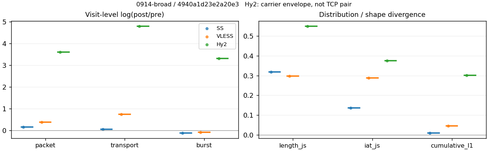
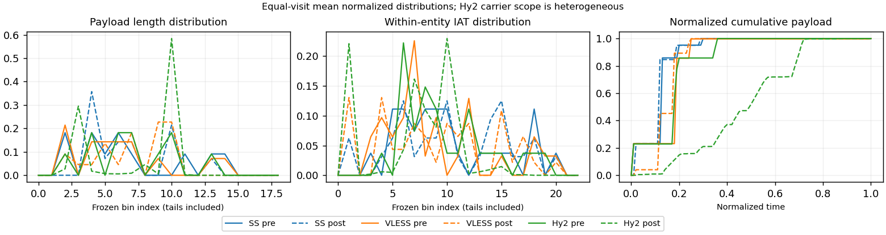

# 0914-broad · 条目 006 · example.com

目标：https://example.com/

活动标签：example.com::page_load。选定访问 3 次。

[返回总索引](../../README.md) · [统计口径](../../methods.md)

## 覆盖与资格（每次访问均保留）

| 部署 | 重复 | 主请求路由 | 活动状态 | 代理比较 | DIRECT pre | 请求 proxy/direct/unresolved | 错误 |
| --- | --- | --- | --- | --- | --- | --- | --- |
| Hy2 | 1 | proxy | passed | 1 | 0 | 1/0/0 | [] |
| SS | 1 | proxy | passed | 1 | 0 | 1/0/0 | [] |
| VLESS | 1 | proxy | passed | 1 | 0 | 1/0/0 | [] |

主请求非 proxy 的统计仅解释为已索引的辅助代理连接或 DIRECT 观测，不代表目标业务经代理传输。播放确认与配对资格是两道不同的门。

图中散点为单次访问，短线为重复中位数；Hy2 是共享载体包络，不能与 TCP 配对作等范围因果对比。

形态图先逐访问归一化，再对访问等权平均；实线 pre，虚线 post。分箱序号及边界见 methods，不将分箱索引误解为长度或时间。

## 每次访问的关键观测

### SS

范围：`exclusive_page`。每格 pre → post；空值为不可观测/不适用。

| 重复 | 包数 | 载荷字节 | burst | TCP FR | IAT中位µs | length JS | IAT JS |
| --- | --- | --- | --- | --- | --- | --- | --- |
| 1 | 28 → 33 | 7857 → 8344 | 19 → 17 | 6 → 6 | 238.27 → 773.83 | 0.31749 | 0.13604 |

完整标量统计：中位数 [min,max]；Δ 为重复内逐访问变换的中位数，MAD 未缩放。n 为可用变换数；DIRECT-only 的 nΔ=0 不代表 pre 不可用。

| scope | 特征 | pre | post | Δ | IQRΔ | MADΔ | nΔ |
| --- | --- | --- | --- | --- | --- | --- | --- |
| exclusive_page | active_span_sum_s_1000ms | 1.016 [1.016, 1.016] | 0.98411 [0.98411, 0.98411] | -0.03189 | — | — | 1 |
| exclusive_page | active_span_sum_s_100ms | 0.16327 [0.16327, 0.16327] | 0.25878 [0.25878, 0.25878] | 0.46058 | — | — | 1 |
| exclusive_page | active_span_sum_s_500ms | 1.016 [1.016, 1.016] | 0.98411 [0.98411, 0.98411] | -0.03189 | — | — | 1 |
| exclusive_page | burst_bytes_iqr | 438.5 [438.5, 438.5] | 755 [755, 755] | 0.54336 | — | — | 1 |
| exclusive_page | burst_bytes_mad | 31 [31, 31] | 65 [65, 65] | 0.7404 | — | — | 1 |
| exclusive_page | burst_bytes_max | 2819 [2819, 2819] | 1938 [1938, 1938] | -0.37473 | — | — | 1 |
| exclusive_page | burst_bytes_mean | 413.53 [413.53, 413.53] | 490.82 [490.82, 490.82] | 0.17136 | — | — | 1 |
| exclusive_page | burst_bytes_median | 31 [31, 31] | 65 [65, 65] | 0.7404 | — | — | 1 |
| exclusive_page | burst_bytes_min | 0 [0, 0] | 0 [0, 0] | — | — | — | 0 |
| exclusive_page | burst_bytes_p95 | 1922.6 [1922.6, 1922.6] | 1598.8 [1598.8, 1598.8] | -0.18443 | — | — | 1 |
| exclusive_page | burst_bytes_q25 | 0 [0, 0] | 0 [0, 0] | — | — | — | 0 |
| exclusive_page | burst_bytes_q75 | 438.5 [438.5, 438.5] | 755 [755, 755] | 0.54336 | — | — | 1 |
| exclusive_page | burst_bytes_std | 755.44 [755.44, 755.44] | 649.84 [649.84, 649.84] | -0.15057 | — | — | 1 |
| exclusive_page | burst_count | 19 [19, 19] | 17 [17, 17] | -0.11123 | — | — | 1 |
| exclusive_page | burst_duration_ms_iqr | 12.334 [12.334, 12.334] | 19.183 [19.183, 19.183] | 0.44167 | — | — | 1 |
| exclusive_page | burst_duration_ms_mad | 0 [0, 0] | 0 [0, 0] | — | — | — | 0 |
| exclusive_page | burst_duration_ms_max | 2108 [2108, 2108] | 2108.2 [2108.2, 2108.2] | 9.8079e-05 | — | — | 1 |
| exclusive_page | burst_duration_ms_mean | 147.46 [147.46, 147.46] | 154.16 [154.16, 154.16] | 0.044417 | — | — | 1 |
| exclusive_page | burst_duration_ms_median | 0 [0, 0] | 0 [0, 0] | — | — | — | 0 |
| exclusive_page | burst_duration_ms_min | 0 [0, 0] | 0 [0, 0] | — | — | — | 0 |
| exclusive_page | burst_duration_ms_p95 | 547.42 [547.42, 547.42] | 644.8 [644.8, 644.8] | 0.16373 | — | — | 1 |
| exclusive_page | burst_duration_ms_q25 | 0 [0, 0] | 0 [0, 0] | — | — | — | 0 |
| exclusive_page | burst_duration_ms_q75 | 12.334 [12.334, 12.334] | 19.183 [19.183, 19.183] | 0.44167 | — | — | 1 |
| exclusive_page | burst_duration_ms_std | 471.26 [471.26, 471.26] | 494 [494, 494] | 0.047128 | — | — | 1 |
| exclusive_page | burst_packets_iqr | 1 [1, 1] | 1 [1, 1] | 0 | — | — | 1 |
| exclusive_page | burst_packets_mad | 0 [0, 0] | 0 [0, 0] | — | — | — | 0 |
| exclusive_page | burst_packets_max | 3 [3, 3] | 5 [5, 5] | 0.51083 | — | — | 1 |
| exclusive_page | burst_packets_mean | 1.4737 [1.4737, 1.4737] | 1.9412 [1.9412, 1.9412] | 0.27553 | — | — | 1 |
| exclusive_page | burst_packets_median | 1 [1, 1] | 1 [1, 1] | 0 | — | — | 1 |
| exclusive_page | burst_packets_min | 1 [1, 1] | 1 [1, 1] | 0 | — | — | 1 |
| exclusive_page | burst_packets_p95 | 2.1 [2.1, 2.1] | 4.2 [4.2, 4.2] | 0.69315 | — | — | 1 |
| exclusive_page | burst_packets_q25 | 1 [1, 1] | 1 [1, 1] | 0 | — | — | 1 |
| exclusive_page | burst_packets_q75 | 2 [2, 2] | 2 [2, 2] | 0 | — | — | 1 |
| exclusive_page | burst_packets_std | 0.59546 [0.59546, 0.59546] | 1.2589 [1.2589, 1.2589] | 0.74865 | — | — | 1 |
| exclusive_page | connection_span_concurrency_max | 1 [1, 1] | 1 [1, 1] | 0 | — | — | 1 |
| exclusive_page | cumulative_l1 | — | — | 0.010623 | — | — | 1 |
| exclusive_page | cumulative_max | — | — | 0.61409 | — | — | 1 |
| exclusive_page | direction_entropy | 0.99403 [0.99403, 0.99403] | 1 [1, 1] | 0.0059698 | — | — | 1 |
| exclusive_page | down_burst_count | 9 [9, 9] | 8 [8, 8] | -0.11778 | — | — | 1 |
| exclusive_page | down_ip_bytes | 6086 [6086, 6086] | 6426 [6426, 6426] | 0.054361 | — | — | 1 |
| exclusive_page | down_packets | 14 [14, 14] | 16 [16, 16] | 0.13353 | — | — | 1 |
| exclusive_page | down_transport_bytes | 5350 [5350, 5350] | 5586 [5586, 5586] | 0.043167 | — | — | 1 |
| exclusive_page | duration_s | 3.124 [3.124, 3.124] | 3.0923 [3.0923, 3.0923] | -0.010193 | — | — | 1 |
| exclusive_page | entity_count | 1 [1, 1] | 1 [1, 1] | 0 | — | — | 1 |
| exclusive_page | fr_runs | 6 [6, 6] | 6 [6, 6] | 0 | — | — | 1 |
| exclusive_page | fr_runs_per_packet | 0.54545 [0.54545, 0.54545] | 0.42857 [0.42857, 0.42857] | -0.11688 | — | — | 1 |
| exclusive_page | fr_switches | 5 [5, 5] | 5 [5, 5] | 0 | — | — | 1 |
| exclusive_page | fr_switches_per_possible_transition | 0.5 [0.5, 0.5] | 0.38462 [0.38462, 0.38462] | -0.11538 | — | — | 1 |
| exclusive_page | full_retransmission_fraction | 0 [0, 0] | 0 [0, 0] | 0 | — | — | 1 |
| exclusive_page | full_retransmission_packets | 0 [0, 0] | 0 [0, 0] | — | — | — | 0 |
| exclusive_page | iat_count | 27 [27, 27] | 32 [32, 32] | 0.1699 | — | — | 1 |
| exclusive_page | iat_js | — | — | 0.13604 | — | — | 1 |
| exclusive_page | iat_ks | — | — | 0.15278 | — | — | 1 |
| exclusive_page | iat_median_us | 238.27 [238.27, 238.27] | 773.83 [773.83, 773.83] | 1.1779 | — | — | 1 |
| exclusive_page | iat_us_iqr | 12281 [12281, 12281] | 25513 [25513, 25513] | 0.7311 | — | — | 1 |
| exclusive_page | iat_us_mad | 223.86 [223.86, 223.86] | 763.3 [763.3, 763.3] | 1.2266 | — | — | 1 |
| exclusive_page | iat_us_max | 2.108e+06 [2.108e+06, 2.108e+06] | 2.1082e+06 [2.1082e+06, 2.1082e+06] | 9.8079e-05 | — | — | 1 |
| exclusive_page | iat_us_mean | 1.157e+05 [1.157e+05, 1.157e+05] | 96636 [96636, 96636] | -0.18009 | — | — | 1 |
| exclusive_page | iat_us_median | 238.27 [238.27, 238.27] | 773.83 [773.83, 773.83] | 1.1779 | — | — | 1 |
| exclusive_page | iat_us_min | 3.545 [3.545, 3.545] | 0.323 [0.323, 0.323] | -2.3956 | — | — | 1 |
| exclusive_page | iat_us_p95 | 3.4521e+05 [3.4521e+05, 3.4521e+05] | 2.7834e+05 [2.7834e+05, 2.7834e+05] | -0.2153 | — | — | 1 |
| exclusive_page | iat_us_q25 | 52.445 [52.445, 52.445] | 34.641 [34.641, 34.641] | -0.41474 | — | — | 1 |
| exclusive_page | iat_us_q75 | 12334 [12334, 12334] | 25548 [25548, 25548] | 0.7282 | — | — | 1 |
| exclusive_page | iat_us_std | 4.014e+05 [4.014e+05, 4.014e+05] | 3.6824e+05 [3.6824e+05, 3.6824e+05] | -0.086225 | — | — | 1 |
| exclusive_page | iat_wasserstein_log1p_us | — | — | 0.81662 | — | — | 1 |
| exclusive_page | idle_gap_count_1000ms | 1 [1, 1] | 1 [1, 1] | 0 | — | — | 1 |
| exclusive_page | idle_gap_count_100ms | 4 [4, 4] | 4 [4, 4] | 0 | — | — | 1 |
| exclusive_page | idle_gap_count_500ms | 1 [1, 1] | 1 [1, 1] | 0 | — | — | 1 |
| exclusive_page | idle_gap_sum_s_1000ms | 2.108 [2.108, 2.108] | 2.1082 [2.1082, 2.1082] | 9.8079e-05 | — | — | 1 |
| exclusive_page | idle_gap_sum_s_100ms | 2.9608 [2.9608, 2.9608] | 2.8336 [2.8336, 2.8336] | -0.04391 | — | — | 1 |
| exclusive_page | idle_gap_sum_s_500ms | 2.108 [2.108, 2.108] | 2.1082 [2.1082, 2.1082] | 9.8079e-05 | — | — | 1 |
| exclusive_page | ip_bytes | 9329 [9329, 9329] | 10076 [10076, 10076] | 0.077029 | — | — | 1 |
| exclusive_page | length_iqr | 902 [902, 902] | 1100.2 [1100.2, 1100.2] | 0.19868 | — | — | 1 |
| exclusive_page | length_js | — | — | 0.31749 | — | — | 1 |
| exclusive_page | length_ks | — | — | 0.27273 | — | — | 1 |
| exclusive_page | length_mad | 316 [316, 316] | 332 [332, 332] | 0.049393 | — | — | 1 |
| exclusive_page | length_max | 2819 [2819, 2819] | 1514 [1514, 1514] | -0.62163 | — | — | 1 |
| exclusive_page | length_mean | 714.27 [714.27, 714.27] | 596 [596, 596] | -0.18102 | — | — | 1 |
| exclusive_page | length_median | 380 [380, 380] | 421.5 [421.5, 421.5] | 0.10365 | — | — | 1 |
| exclusive_page | length_min | 31 [31, 31] | 65 [65, 65] | 0.7404 | — | — | 1 |
| exclusive_page | length_p95 | 2321 [2321, 2321] | 1458.1 [1458.1, 1458.1] | -0.46486 | — | — | 1 |
| exclusive_page | length_q25 | 78 [78, 78] | 105 [105, 105] | 0.29725 | — | — | 1 |
| exclusive_page | length_q75 | 980 [980, 980] | 1205.2 [1205.2, 1205.2] | 0.20689 | — | — | 1 |
| exclusive_page | length_std | 876.38 [876.38, 876.38] | 563.27 [563.27, 563.27] | -0.44204 | — | — | 1 |
| exclusive_page | length_wasserstein_bytes | — | — | 201.69 | — | — | 1 |
| exclusive_page | nonempty_entity_count | 1 [1, 1] | 1 [1, 1] | 0 | — | — | 1 |
| exclusive_page | nonempty_packets | 11 [11, 11] | 14 [14, 14] | 0.24116 | — | — | 1 |
| exclusive_page | offload_suspect_fraction | 0.071429 [0.071429, 0.071429] | 0.030303 [0.030303, 0.030303] | -0.041126 | — | — | 1 |
| exclusive_page | packet_count | 28 [28, 28] | 33 [33, 33] | 0.1643 | — | — | 1 |
| exclusive_page | rtt_median_ms | 0.12438 [0.12438, 0.12438] | 31.969 [31.969, 31.969] | 5.5492 | — | — | 1 |
| exclusive_page | rtt_sample_count | 14 [14, 14] | 16 [16, 16] | 0.13353 | — | — | 1 |
| exclusive_page | tcp_ack_count | 27 [27, 27] | 32 [32, 32] | 0.1699 | — | — | 1 |
| exclusive_page | tcp_fin_count | 2 [2, 2] | 2 [2, 2] | 0 | — | — | 1 |
| exclusive_page | tcp_packet_count | 28 [28, 28] | 33 [33, 33] | 0.1643 | — | — | 1 |
| exclusive_page | tcp_rst_count | 0 [0, 0] | 0 [0, 0] | — | — | — | 0 |
| exclusive_page | tcp_syn_count | 2 [2, 2] | 2 [2, 2] | 0 | — | — | 1 |
| exclusive_page | tcp_window_raw_median | 63801 [63801, 63801] | 128 [128, 128] | -6.2115 | — | — | 1 |
| exclusive_page | transition_entropy | 0.97095 [0.97095, 0.97095] | 0.95434 [0.95434, 0.95434] | -0.016614 | — | — | 1 |
| exclusive_page | transition_n_mm | 3 [3, 3] | 4 [4, 4] | 0.28768 | — | — | 1 |
| exclusive_page | transition_n_mp | 2 [2, 2] | 2 [2, 2] | 0 | — | — | 1 |
| exclusive_page | transition_n_pm | 3 [3, 3] | 3 [3, 3] | 0 | — | — | 1 |
| exclusive_page | transition_n_pp | 2 [2, 2] | 4 [4, 4] | 0.69315 | — | — | 1 |
| exclusive_page | transition_p_mm | 0.6 [0.6, 0.6] | 0.66667 [0.66667, 0.66667] | 0.066667 | — | — | 1 |
| exclusive_page | transition_p_mp | 0.4 [0.4, 0.4] | 0.33333 [0.33333, 0.33333] | -0.066667 | — | — | 1 |
| exclusive_page | transition_p_pm | 0.6 [0.6, 0.6] | 0.42857 [0.42857, 0.42857] | -0.17143 | — | — | 1 |
| exclusive_page | transition_p_pp | 0.4 [0.4, 0.4] | 0.57143 [0.57143, 0.57143] | 0.17143 | — | — | 1 |
| exclusive_page | transport_bytes | 7857 [7857, 7857] | 8344 [8344, 8344] | 0.060138 | — | — | 1 |
| exclusive_page | up_burst_count | 10 [10, 10] | 9 [9, 9] | -0.10536 | — | — | 1 |
| exclusive_page | up_byte_fraction | 0.31908 [0.31908, 0.31908] | 0.33054 [0.33054, 0.33054] | 0.011458 | — | — | 1 |
| exclusive_page | up_ip_bytes | 3243 [3243, 3243] | 3650 [3650, 3650] | 0.11823 | — | — | 1 |
| exclusive_page | up_packets | 14 [14, 14] | 17 [17, 17] | 0.19416 | — | — | 1 |
| exclusive_page | up_transport_bytes | 2507 [2507, 2507] | 2758 [2758, 2758] | 0.095419 | — | — | 1 |
| exclusive_page | zero_iat_count | 0 [0, 0] | 0 [0, 0] | — | — | — | 0 |
| exclusive_page | zero_iat_fraction | 0 [0, 0] | 0 [0, 0] | 0 | — | — | 1 |

### VLESS

范围：`exclusive_page`。每格 pre → post；空值为不可观测/不适用。

| 重复 | 包数 | 载荷字节 | burst | TCP FR | IAT中位µs | length JS | IAT JS |
| --- | --- | --- | --- | --- | --- | --- | --- |
| 1 | 32 → 47 | 7880 → 16615 | 23 → 21 | 6 → 8 | 79.093 → 258.54 | 0.29704 | 0.28859 |

完整标量统计：中位数 [min,max]；Δ 为重复内逐访问变换的中位数，MAD 未缩放。n 为可用变换数；DIRECT-only 的 nΔ=0 不代表 pre 不可用。

| scope | 特征 | pre | post | Δ | IQRΔ | MADΔ | nΔ |
| --- | --- | --- | --- | --- | --- | --- | --- |
| exclusive_page | active_span_sum_s_1000ms | 1.1246 [1.1246, 1.1246] | 1.0817 [1.0817, 1.0817] | -0.038942 | — | — | 1 |
| exclusive_page | active_span_sum_s_100ms | 0.059038 [0.059038, 0.059038] | 0.34827 [0.34827, 0.34827] | 1.7748 | — | — | 1 |
| exclusive_page | active_span_sum_s_500ms | 0.46526 [0.46526, 0.46526] | 1.0817 [1.0817, 1.0817] | 0.84366 | — | — | 1 |
| exclusive_page | burst_bytes_iqr | 446 [446, 446] | 1575 [1575, 1575] | 1.2617 | — | — | 1 |
| exclusive_page | burst_bytes_mad | 24 [24, 24] | 190 [190, 190] | 2.069 | — | — | 1 |
| exclusive_page | burst_bytes_max | 2372 [2372, 2372] | 2861 [2861, 2861] | 0.18744 | — | — | 1 |
| exclusive_page | burst_bytes_mean | 342.61 [342.61, 342.61] | 791.19 [791.19, 791.19] | 0.83695 | — | — | 1 |
| exclusive_page | burst_bytes_median | 24 [24, 24] | 190 [190, 190] | 2.069 | — | — | 1 |
| exclusive_page | burst_bytes_min | 0 [0, 0] | 0 [0, 0] | — | — | — | 0 |
| exclusive_page | burst_bytes_p95 | 1757 [1757, 1757] | 2824 [2824, 2824] | 0.47455 | — | — | 1 |
| exclusive_page | burst_bytes_q25 | 0 [0, 0] | 0 [0, 0] | — | — | — | 0 |
| exclusive_page | burst_bytes_q75 | 446 [446, 446] | 1575 [1575, 1575] | 1.2617 | — | — | 1 |
| exclusive_page | burst_bytes_std | 616.5 [616.5, 616.5] | 973.49 [973.49, 973.49] | 0.45683 | — | — | 1 |
| exclusive_page | burst_count | 23 [23, 23] | 21 [21, 21] | -0.090972 | — | — | 1 |
| exclusive_page | burst_duration_ms_iqr | 3.5158 [3.5158, 3.5158] | 39.242 [39.242, 39.242] | 2.4125 | — | — | 1 |
| exclusive_page | burst_duration_ms_mad | 0 [0, 0] | 0.009046 [0.009046, 0.009046] | — | — | — | 0 |
| exclusive_page | burst_duration_ms_max | 2405.4 [2405.4, 2405.4] | 2405.5 [2405.5, 2405.5] | 4.4656e-05 | — | — | 1 |
| exclusive_page | burst_duration_ms_mean | 151.57 [151.57, 151.57] | 152.24 [152.24, 152.24] | 0.0044291 | — | — | 1 |
| exclusive_page | burst_duration_ms_median | 0 [0, 0] | 0.009046 [0.009046, 0.009046] | — | — | — | 0 |
| exclusive_page | burst_duration_ms_min | 0 [0, 0] | 0 [0, 0] | — | — | — | 0 |
| exclusive_page | burst_duration_ms_p95 | 613.77 [613.77, 613.77] | 315.38 [315.38, 315.38] | -0.66586 | — | — | 1 |
| exclusive_page | burst_duration_ms_q25 | 0 [0, 0] | 0 [0, 0] | — | — | — | 0 |
| exclusive_page | burst_duration_ms_q75 | 3.5158 [3.5158, 3.5158] | 39.242 [39.242, 39.242] | 2.4125 | — | — | 1 |
| exclusive_page | burst_duration_ms_std | 501.08 [501.08, 501.08] | 510.02 [510.02, 510.02] | 0.017681 | — | — | 1 |
| exclusive_page | burst_packets_iqr | 1 [1, 1] | 2 [2, 2] | 0.69315 | — | — | 1 |
| exclusive_page | burst_packets_mad | 0 [0, 0] | 1 [1, 1] | — | — | — | 0 |
| exclusive_page | burst_packets_max | 3 [3, 3] | 7 [7, 7] | 0.8473 | — | — | 1 |
| exclusive_page | burst_packets_mean | 1.3913 [1.3913, 1.3913] | 2.2381 [2.2381, 2.2381] | 0.47538 | — | — | 1 |
| exclusive_page | burst_packets_median | 1 [1, 1] | 2 [2, 2] | 0.69315 | — | — | 1 |
| exclusive_page | burst_packets_min | 1 [1, 1] | 1 [1, 1] | 0 | — | — | 1 |
| exclusive_page | burst_packets_p95 | 2 [2, 2] | 5 [5, 5] | 0.91629 | — | — | 1 |
| exclusive_page | burst_packets_q25 | 1 [1, 1] | 1 [1, 1] | 0 | — | — | 1 |
| exclusive_page | burst_packets_q75 | 2 [2, 2] | 3 [3, 3] | 0.40547 | — | — | 1 |
| exclusive_page | burst_packets_std | 0.57021 [0.57021, 0.57021] | 1.4444 [1.4444, 1.4444] | 0.92941 | — | — | 1 |
| exclusive_page | connection_span_concurrency_max | 1 [1, 1] | 1 [1, 1] | 0 | — | — | 1 |
| exclusive_page | cumulative_l1 | — | — | 0.044964 | — | — | 1 |
| exclusive_page | cumulative_max | — | — | 0.66152 | — | — | 1 |
| exclusive_page | direction_entropy | 0.94029 [0.94029, 0.94029] | 0.90239 [0.90239, 0.90239] | -0.037893 | — | — | 1 |
| exclusive_page | down_burst_count | 11 [11, 11] | 10 [10, 10] | -0.09531 | — | — | 1 |
| exclusive_page | down_ip_bytes | 6213 [6213, 6213] | 13440 [13440, 13440] | 0.77159 | — | — | 1 |
| exclusive_page | down_packets | 16 [16, 16] | 26 [26, 26] | 0.48551 | — | — | 1 |
| exclusive_page | down_transport_bytes | 5373 [5373, 5373] | 12080 [12080, 12080] | 0.81016 | — | — | 1 |
| exclusive_page | duration_s | 3.53 [3.53, 3.53] | 3.4871 [3.4871, 3.4871] | -0.012212 | — | — | 1 |
| exclusive_page | entity_count | 1 [1, 1] | 1 [1, 1] | 0 | — | — | 1 |
| exclusive_page | fr_runs | 6 [6, 6] | 8 [8, 8] | 0.28768 | — | — | 1 |
| exclusive_page | fr_runs_per_packet | 0.42857 [0.42857, 0.42857] | 0.36364 [0.36364, 0.36364] | -0.064935 | — | — | 1 |
| exclusive_page | fr_switches | 5 [5, 5] | 7 [7, 7] | 0.33647 | — | — | 1 |
| exclusive_page | fr_switches_per_possible_transition | 0.38462 [0.38462, 0.38462] | 0.33333 [0.33333, 0.33333] | -0.051282 | — | — | 1 |
| exclusive_page | full_retransmission_fraction | 0 [0, 0] | 0 [0, 0] | 0 | — | — | 1 |
| exclusive_page | full_retransmission_packets | 0 [0, 0] | 0 [0, 0] | — | — | — | 0 |
| exclusive_page | iat_count | 31 [31, 31] | 46 [46, 46] | 0.39465 | — | — | 1 |
| exclusive_page | iat_js | — | — | 0.28859 | — | — | 1 |
| exclusive_page | iat_ks | — | — | 0.15708 | — | — | 1 |
| exclusive_page | iat_median_us | 79.093 [79.093, 79.093] | 258.54 [258.54, 258.54] | 1.1844 | — | — | 1 |
| exclusive_page | iat_us_iqr | 2788.1 [2788.1, 2788.1] | 4905.7 [4905.7, 4905.7] | 0.56504 | — | — | 1 |
| exclusive_page | iat_us_mad | 72.557 [72.557, 72.557] | 258.44 [258.44, 258.44] | 1.2703 | — | — | 1 |
| exclusive_page | iat_us_max | 2.4054e+06 [2.4054e+06, 2.4054e+06] | 2.4055e+06 [2.4055e+06, 2.4055e+06] | 4.4656e-05 | — | — | 1 |
| exclusive_page | iat_us_mean | 1.1387e+05 [1.1387e+05, 1.1387e+05] | 75808 [75808, 75808] | -0.40687 | — | — | 1 |
| exclusive_page | iat_us_median | 79.093 [79.093, 79.093] | 258.54 [258.54, 258.54] | 1.1844 | — | — | 1 |
| exclusive_page | iat_us_min | 3.28 [3.28, 3.28] | 0.103 [0.103, 0.103] | -3.4609 | — | — | 1 |
| exclusive_page | iat_us_p95 | 4.3144e+05 [4.3144e+05, 4.3144e+05] | 1.5519e+05 [1.5519e+05, 1.5519e+05] | -1.0225 | — | — | 1 |
| exclusive_page | iat_us_q25 | 34.266 [34.266, 34.266] | 11.028 [11.028, 11.028] | -1.1337 | — | — | 1 |
| exclusive_page | iat_us_q75 | 2822.3 [2822.3, 2822.3] | 4916.7 [4916.7, 4916.7] | 0.55507 | — | — | 1 |
| exclusive_page | iat_us_std | 4.3636e+05 [4.3636e+05, 4.3636e+05] | 3.5203e+05 [3.5203e+05, 3.5203e+05] | -0.21476 | — | — | 1 |
| exclusive_page | iat_wasserstein_log1p_us | — | — | 1.0458 | — | — | 1 |
| exclusive_page | idle_gap_count_1000ms | 1 [1, 1] | 1 [1, 1] | 0 | — | — | 1 |
| exclusive_page | idle_gap_count_100ms | 4 [4, 4] | 5 [5, 5] | 0.22314 | — | — | 1 |
| exclusive_page | idle_gap_count_500ms | 2 [2, 2] | 1 [1, 1] | -0.69315 | — | — | 1 |
| exclusive_page | idle_gap_sum_s_1000ms | 2.4054 [2.4054, 2.4054] | 2.4055 [2.4055, 2.4055] | 4.4656e-05 | — | — | 1 |
| exclusive_page | idle_gap_sum_s_100ms | 3.471 [3.471, 3.471] | 3.1389 [3.1389, 3.1389] | -0.10056 | — | — | 1 |
| exclusive_page | idle_gap_sum_s_500ms | 3.0647 [3.0647, 3.0647] | 2.4055 [2.4055, 2.4055] | -0.24221 | — | — | 1 |
| exclusive_page | ip_bytes | 9536 [9536, 9536] | 19123 [19123, 19123] | 0.69582 | — | — | 1 |
| exclusive_page | length_iqr | 477.75 [477.75, 477.75] | 1025.5 [1025.5, 1025.5] | 0.76385 | — | — | 1 |
| exclusive_page | length_js | — | — | 0.29704 | — | — | 1 |
| exclusive_page | length_ks | — | — | 0.42208 | — | — | 1 |
| exclusive_page | length_mad | 240.5 [240.5, 240.5] | 522.5 [522.5, 522.5] | 0.7759 | — | — | 1 |
| exclusive_page | length_max | 2372 [2372, 2372] | 1412 [1412, 1412] | -0.51873 | — | — | 1 |
| exclusive_page | length_mean | 562.86 [562.86, 562.86] | 755.23 [755.23, 755.23] | 0.29399 | — | — | 1 |
| exclusive_page | length_median | 275.5 [275.5, 275.5] | 702 [702, 702] | 0.93535 | — | — | 1 |
| exclusive_page | length_min | 24 [24, 24] | 24 [24, 24] | 0 | — | — | 1 |
| exclusive_page | length_p95 | 2015.1 [2015.1, 2015.1] | 1412 [1412, 1412] | -0.35569 | — | — | 1 |
| exclusive_page | length_q25 | 71 [71, 71] | 182.5 [182.5, 182.5] | 0.94407 | — | — | 1 |
| exclusive_page | length_q75 | 548.75 [548.75, 548.75] | 1208 [1208, 1208] | 0.78908 | — | — | 1 |
| exclusive_page | length_std | 702.28 [702.28, 702.28] | 531.16 [531.16, 531.16] | -0.27928 | — | — | 1 |
| exclusive_page | length_wasserstein_bytes | — | — | 388.23 | — | — | 1 |
| exclusive_page | nonempty_entity_count | 1 [1, 1] | 1 [1, 1] | 0 | — | — | 1 |
| exclusive_page | nonempty_packets | 14 [14, 14] | 22 [22, 22] | 0.45199 | — | — | 1 |
| exclusive_page | offload_suspect_fraction | 0.0625 [0.0625, 0.0625] | 0 [0, 0] | -0.0625 | — | — | 1 |
| exclusive_page | packet_count | 32 [32, 32] | 47 [47, 47] | 0.38441 | — | — | 1 |
| exclusive_page | rtt_median_ms | 0.083575 [0.083575, 0.083575] | 40.442 [40.442, 40.442] | 6.1819 | — | — | 1 |
| exclusive_page | rtt_sample_count | 14 [14, 14] | 19 [19, 19] | 0.30538 | — | — | 1 |
| exclusive_page | tcp_ack_count | 29 [29, 29] | 46 [46, 46] | 0.46135 | — | — | 1 |
| exclusive_page | tcp_fin_count | 2 [2, 2] | 2 [2, 2] | 0 | — | — | 1 |
| exclusive_page | tcp_packet_count | 32 [32, 32] | 47 [47, 47] | 0.38441 | — | — | 1 |
| exclusive_page | tcp_rst_count | 2 [2, 2] | 0 [0, 0] | — | — | — | 0 |
| exclusive_page | tcp_syn_count | 2 [2, 2] | 2 [2, 2] | 0 | — | — | 1 |
| exclusive_page | tcp_window_raw_median | 63801 [63801, 63801] | 131 [131, 131] | -6.1883 | — | — | 1 |
| exclusive_page | transition_entropy | 0.87269 [0.87269, 0.87269] | 0.82814 [0.82814, 0.82814] | -0.044551 | — | — | 1 |
| exclusive_page | transition_n_mm | 6 [6, 6] | 11 [11, 11] | 0.60614 | — | — | 1 |
| exclusive_page | transition_n_mp | 2 [2, 2] | 3 [3, 3] | 0.40547 | — | — | 1 |
| exclusive_page | transition_n_pm | 3 [3, 3] | 4 [4, 4] | 0.28768 | — | — | 1 |
| exclusive_page | transition_n_pp | 2 [2, 2] | 3 [3, 3] | 0.40547 | — | — | 1 |
| exclusive_page | transition_p_mm | 0.75 [0.75, 0.75] | 0.78571 [0.78571, 0.78571] | 0.035714 | — | — | 1 |
| exclusive_page | transition_p_mp | 0.25 [0.25, 0.25] | 0.21429 [0.21429, 0.21429] | -0.035714 | — | — | 1 |
| exclusive_page | transition_p_pm | 0.6 [0.6, 0.6] | 0.57143 [0.57143, 0.57143] | -0.028571 | — | — | 1 |
| exclusive_page | transition_p_pp | 0.4 [0.4, 0.4] | 0.42857 [0.42857, 0.42857] | 0.028571 | — | — | 1 |
| exclusive_page | transport_bytes | 7880 [7880, 7880] | 16615 [16615, 16615] | 0.74598 | — | — | 1 |
| exclusive_page | up_burst_count | 12 [12, 12] | 11 [11, 11] | -0.087011 | — | — | 1 |
| exclusive_page | up_byte_fraction | 0.31815 [0.31815, 0.31815] | 0.27295 [0.27295, 0.27295] | -0.045201 | — | — | 1 |
| exclusive_page | up_ip_bytes | 3323 [3323, 3323] | 5683 [5683, 5683] | 0.53661 | — | — | 1 |
| exclusive_page | up_packets | 16 [16, 16] | 21 [21, 21] | 0.27193 | — | — | 1 |
| exclusive_page | up_transport_bytes | 2507 [2507, 2507] | 4535 [4535, 4535] | 0.59274 | — | — | 1 |
| exclusive_page | zero_iat_count | 0 [0, 0] | 0 [0, 0] | — | — | — | 0 |
| exclusive_page | zero_iat_fraction | 0 [0, 0] | 0 [0, 0] | 0 | — | — | 1 |

### Hy2

范围：`carrier_context_envelope`。每格 pre → post；空值为不可观测/不适用。

| 重复 | 包数 | 载荷字节 | burst | TCP FR | IAT中位µs | length JS | IAT JS |
| --- | --- | --- | --- | --- | --- | --- | --- |
| 1 | 28 → 1029 | 7825 → 9.3749e+05 | 21 → 577 | — | 263.43 → 130.8 | 0.54824 | 0.37468 |

完整标量统计：中位数 [min,max]；Δ 为重复内逐访问变换的中位数，MAD 未缩放。n 为可用变换数；DIRECT-only 的 nΔ=0 不代表 pre 不可用。

| scope | 特征 | pre | post | Δ | IQRΔ | MADΔ | nΔ |
| --- | --- | --- | --- | --- | --- | --- | --- |
| carrier_context_envelope | active_span_sum_s_1000ms | 1.196 [1.196, 1.196] | 1.196 [1.196, 1.196] | -4.4091e-05 | — | — | 1 |
| carrier_context_envelope | active_span_sum_s_100ms | 0.077093 [0.077093, 0.077093] | 1.0394 [1.0394, 1.0394] | 2.6014 | — | — | 1 |
| carrier_context_envelope | active_span_sum_s_500ms | 0.46201 [0.46201, 0.46201] | 1.196 [1.196, 1.196] | 0.95113 | — | — | 1 |
| carrier_context_envelope | burst_bytes_iqr | 540 [540, 540] | 2826 [2826, 2826] | 1.655 | — | — | 1 |
| carrier_context_envelope | burst_bytes_mad | 31 [31, 31] | 264 [264, 264] | 2.142 | — | — | 1 |
| carrier_context_envelope | burst_bytes_max | 1791 [1791, 1791] | 15601 [15601, 15601] | 2.1646 | — | — | 1 |
| carrier_context_envelope | burst_bytes_mean | 372.62 [372.62, 372.62] | 1624.8 [1624.8, 1624.8] | 1.4726 | — | — | 1 |
| carrier_context_envelope | burst_bytes_median | 31 [31, 31] | 297 [297, 297] | 2.2597 | — | — | 1 |
| carrier_context_envelope | burst_bytes_min | 0 [0, 0] | 26 [26, 26] | — | — | — | 0 |
| carrier_context_envelope | burst_bytes_p95 | 1406 [1406, 1406] | 4290 [4290, 4290] | 1.1155 | — | — | 1 |
| carrier_context_envelope | burst_bytes_q25 | 0 [0, 0] | 34 [34, 34] | — | — | — | 0 |
| carrier_context_envelope | burst_bytes_q75 | 540 [540, 540] | 2860 [2860, 2860] | 1.667 | — | — | 1 |
| carrier_context_envelope | burst_bytes_std | 553.92 [553.92, 553.92] | 1956.6 [1956.6, 1956.6] | 1.262 | — | — | 1 |
| carrier_context_envelope | burst_count | 21 [21, 21] | 577 [577, 577] | 3.3133 | — | — | 1 |
| carrier_context_envelope | burst_duration_ms_iqr | 2.0902 [2.0902, 2.0902] | 0.55597 [0.55597, 0.55597] | -1.3243 | — | — | 1 |
| carrier_context_envelope | burst_duration_ms_mad | 0 [0, 0] | 3.7e-05 [3.7e-05, 3.7e-05] | — | — | — | 0 |
| carrier_context_envelope | burst_duration_ms_max | 734.02 [734.02, 734.02] | 157.01 [157.01, 157.01] | -1.5422 | — | — | 1 |
| carrier_context_envelope | burst_duration_ms_mean | 54.528 [54.528, 54.528] | 0.92481 [0.92481, 0.92481] | -4.0769 | — | — | 1 |
| carrier_context_envelope | burst_duration_ms_median | 0 [0, 0] | 3.7e-05 [3.7e-05, 3.7e-05] | — | — | — | 0 |
| carrier_context_envelope | burst_duration_ms_min | 0 [0, 0] | 0 [0, 0] | — | — | — | 0 |
| carrier_context_envelope | burst_duration_ms_p95 | 209.53 [209.53, 209.53] | 1.2022 [1.2022, 1.2022] | -5.1607 | — | — | 1 |
| carrier_context_envelope | burst_duration_ms_q25 | 0 [0, 0] | 0 [0, 0] | — | — | — | 0 |
| carrier_context_envelope | burst_duration_ms_q75 | 2.0902 [2.0902, 2.0902] | 0.55597 [0.55597, 0.55597] | -1.3243 | — | — | 1 |
| carrier_context_envelope | burst_duration_ms_std | 162.03 [162.03, 162.03] | 7.4265 [7.4265, 7.4265] | -3.0827 | — | — | 1 |
| carrier_context_envelope | burst_packets_iqr | 1 [1, 1] | 1 [1, 1] | 0 | — | — | 1 |
| carrier_context_envelope | burst_packets_mad | 0 [0, 0] | 1 [1, 1] | — | — | — | 0 |
| carrier_context_envelope | burst_packets_max | 2 [2, 2] | 11 [11, 11] | 1.7047 | — | — | 1 |
| carrier_context_envelope | burst_packets_mean | 1.3333 [1.3333, 1.3333] | 1.7834 [1.7834, 1.7834] | 0.29082 | — | — | 1 |
| carrier_context_envelope | burst_packets_median | 1 [1, 1] | 2 [2, 2] | 0.69315 | — | — | 1 |
| carrier_context_envelope | burst_packets_min | 1 [1, 1] | 1 [1, 1] | 0 | — | — | 1 |
| carrier_context_envelope | burst_packets_p95 | 2 [2, 2] | 3 [3, 3] | 0.40547 | — | — | 1 |
| carrier_context_envelope | burst_packets_q25 | 1 [1, 1] | 1 [1, 1] | 0 | — | — | 1 |
| carrier_context_envelope | burst_packets_q75 | 2 [2, 2] | 2 [2, 2] | 0 | — | — | 1 |
| carrier_context_envelope | burst_packets_std | 0.4714 [0.4714, 0.4714] | 1.2194 [1.2194, 1.2194] | 0.95037 | — | — | 1 |
| carrier_context_envelope | connection_span_concurrency_max | 1 [1, 1] | 1 [1, 1] | 0 | — | — | 1 |
| carrier_context_envelope | cumulative_l1 | — | — | 0.30008 | — | — | 1 |
| carrier_context_envelope | cumulative_max | — | — | 0.72985 | — | — | 1 |
| carrier_context_envelope | direction_entropy | 0.99403 [0.99403, 0.99403] | 0.90088 [0.90088, 0.90088] | -0.093149 | — | — | 1 |
| carrier_context_envelope | direction_run_analog_runs | 6 [6, 6] | 577 [577, 577] | 4.5661 | — | — | 1 |
| carrier_context_envelope | direction_run_analog_runs_per_packet | 0.54545 [0.54545, 0.54545] | 0.56074 [0.56074, 0.56074] | 0.015284 | — | — | 1 |
| carrier_context_envelope | direction_run_analog_switches | 5 [5, 5] | 576 [576, 576] | 4.7467 | — | — | 1 |
| carrier_context_envelope | direction_run_analog_switches_per_possible_transition | 0.5 [0.5, 0.5] | 0.56031 [0.56031, 0.56031] | 0.060311 | — | — | 1 |
| carrier_context_envelope | down_burst_count | 10 [10, 10] | 288 [288, 288] | 3.3604 | — | — | 1 |
| carrier_context_envelope | down_ip_bytes | 6086 [6086, 6086] | 9.3178e+05 [9.3178e+05, 9.3178e+05] | 5.0311 | — | — | 1 |
| carrier_context_envelope | down_packets | 14 [14, 14] | 703 [703, 703] | 3.9163 | — | — | 1 |
| carrier_context_envelope | down_transport_bytes | 5350 [5350, 5350] | 9.121e+05 [9.121e+05, 9.121e+05] | 5.1386 | — | — | 1 |
| carrier_context_envelope | duration_s | 1.196 [1.196, 1.196] | 1.196 [1.196, 1.196] | -4.4091e-05 | — | — | 1 |
| carrier_context_envelope | entity_count | 1 [1, 1] | 1 [1, 1] | 0 | — | — | 1 |
| carrier_context_envelope | full_retransmission_fraction | 0 [0, 0] | — | — | — | — | 0 |
| carrier_context_envelope | full_retransmission_packets | 0 [0, 0] | — | — | — | — | 0 |
| carrier_context_envelope | iat_count | 27 [27, 27] | 1028 [1028, 1028] | 3.6395 | — | — | 1 |
| carrier_context_envelope | iat_js | — | — | 0.37468 | — | — | 1 |
| carrier_context_envelope | iat_ks | — | — | 0.33049 | — | — | 1 |
| carrier_context_envelope | iat_median_us | 263.43 [263.43, 263.43] | 130.8 [130.8, 130.8] | -0.70013 | — | — | 1 |
| carrier_context_envelope | iat_us_iqr | 3160.9 [3160.9, 3160.9] | 767.17 [767.17, 767.17] | -1.4159 | — | — | 1 |
| carrier_context_envelope | iat_us_mad | 234.36 [234.36, 234.36] | 130.7 [130.7, 130.7] | -0.58395 | — | — | 1 |
| carrier_context_envelope | iat_us_max | 7.3402e+05 [7.3402e+05, 7.3402e+05] | 1.5656e+05 [1.5656e+05, 1.5656e+05] | -1.5451 | — | — | 1 |
| carrier_context_envelope | iat_us_mean | 44297 [44297, 44297] | 1163.4 [1163.4, 1163.4] | -3.6396 | — | — | 1 |
| carrier_context_envelope | iat_us_median | 263.43 [263.43, 263.43] | 130.8 [130.8, 130.8] | -0.70013 | — | — | 1 |
| carrier_context_envelope | iat_us_min | 5.707 [5.707, 5.707] | 0.036 [0.036, 0.036] | -5.0659 | — | — | 1 |
| carrier_context_envelope | iat_us_p95 | 1.9929e+05 [1.9929e+05, 1.9929e+05] | 1307.5 [1307.5, 1307.5] | -5.0266 | — | — | 1 |
| carrier_context_envelope | iat_us_q25 | 50.094 [50.094, 50.094] | 41.349 [41.349, 41.349] | -0.19185 | — | — | 1 |
| carrier_context_envelope | iat_us_q75 | 3211 [3211, 3211] | 808.52 [808.52, 808.52] | -1.3791 | — | — | 1 |
| carrier_context_envelope | iat_us_std | 1.4433e+05 [1.4433e+05, 1.4433e+05] | 6325 [6325, 6325] | -3.1276 | — | — | 1 |
| carrier_context_envelope | iat_wasserstein_log1p_us | — | — | 1.8885 | — | — | 1 |
| carrier_context_envelope | idle_gap_count_1000ms | 0 [0, 0] | 0 [0, 0] | — | — | — | 0 |
| carrier_context_envelope | idle_gap_count_100ms | 3 [3, 3] | 1 [1, 1] | -1.0986 | — | — | 1 |
| carrier_context_envelope | idle_gap_count_500ms | 1 [1, 1] | 0 [0, 0] | — | — | — | 0 |
| carrier_context_envelope | idle_gap_sum_s_1000ms | 0 [0, 0] | 0 [0, 0] | — | — | — | 0 |
| carrier_context_envelope | idle_gap_sum_s_100ms | 1.1189 [1.1189, 1.1189] | 0.15656 [0.15656, 0.15656] | -1.9667 | — | — | 1 |
| carrier_context_envelope | idle_gap_sum_s_500ms | 0.73402 [0.73402, 0.73402] | 0 [0, 0] | — | — | — | 0 |
| carrier_context_envelope | ip_bytes | 9297 [9297, 9297] | 9.663e+05 [9.663e+05, 9.663e+05] | 4.6438 | — | — | 1 |
| carrier_context_envelope | length_iqr | 1050.5 [1050.5, 1050.5] | 1394 [1394, 1394] | 0.28291 | — | — | 1 |
| carrier_context_envelope | length_js | — | — | 0.54824 | — | — | 1 |
| carrier_context_envelope | length_ks | — | — | 0.49315 | — | — | 1 |
| carrier_context_envelope | length_mad | 476 [476, 476] | 0 [0, 0] | — | — | — | 0 |
| carrier_context_envelope | length_max | 1791 [1791, 1791] | 1441 [1441, 1441] | -0.21744 | — | — | 1 |
| carrier_context_envelope | length_mean | 711.36 [711.36, 711.36] | 911.07 [911.07, 911.07] | 0.24744 | — | — | 1 |
| carrier_context_envelope | length_median | 540 [540, 540] | 1430 [1430, 1430] | 0.97386 | — | — | 1 |
| carrier_context_envelope | length_min | 31 [31, 31] | 25 [25, 25] | -0.21511 | — | — | 1 |
| carrier_context_envelope | length_p95 | 1598.5 [1598.5, 1598.5] | 1430 [1430, 1430] | -0.11139 | — | — | 1 |
| carrier_context_envelope | length_q25 | 213 [213, 213] | 36 [36, 36] | -1.7778 | — | — | 1 |
| carrier_context_envelope | length_q75 | 1263.5 [1263.5, 1263.5] | 1430 [1430, 1430] | 0.12379 | — | — | 1 |
| carrier_context_envelope | length_std | 587.18 [587.18, 587.18] | 650.54 [650.54, 650.54] | 0.10247 | — | — | 1 |
| carrier_context_envelope | length_wasserstein_bytes | — | — | 321.11 | — | — | 1 |
| carrier_context_envelope | nonempty_entity_count | 1 [1, 1] | 1 [1, 1] | 0 | — | — | 1 |
| carrier_context_envelope | nonempty_packets | 11 [11, 11] | 1029 [1029, 1029] | 4.5384 | — | — | 1 |
| carrier_context_envelope | offload_suspect_fraction | 0.035714 [0.035714, 0.035714] | 0 [0, 0] | -0.035714 | — | — | 1 |
| carrier_context_envelope | packet_count | 28 [28, 28] | 1029 [1029, 1029] | 3.6041 | — | — | 1 |
| carrier_context_envelope | rtt_median_ms | 0.11792 [0.11792, 0.11792] | — | — | — | — | 0 |
| carrier_context_envelope | rtt_sample_count | 15 [15, 15] | 0 [0, 0] | — | — | — | 0 |
| carrier_context_envelope | tcp_ack_count | 27 [27, 27] | — | — | — | — | 0 |
| carrier_context_envelope | tcp_fin_count | 2 [2, 2] | — | — | — | — | 0 |
| carrier_context_envelope | tcp_packet_count | 28 [28, 28] | 0 [0, 0] | — | — | — | 0 |
| carrier_context_envelope | tcp_rst_count | 0 [0, 0] | — | — | — | — | 0 |
| carrier_context_envelope | tcp_syn_count | 2 [2, 2] | — | — | — | — | 0 |
| carrier_context_envelope | tcp_window_raw_median | 63801 [63801, 63801] | — | — | — | — | 0 |
| carrier_context_envelope | transition_entropy | 0.97095 [0.97095, 0.97095] | 0.82935 [0.82935, 0.82935] | -0.14161 | — | — | 1 |
| carrier_context_envelope | transition_n_mm | 3 [3, 3] | 415 [415, 415] | 4.9297 | — | — | 1 |
| carrier_context_envelope | transition_n_mp | 2 [2, 2] | 288 [288, 288] | 4.9698 | — | — | 1 |
| carrier_context_envelope | transition_n_pm | 3 [3, 3] | 288 [288, 288] | 4.5643 | — | — | 1 |
| carrier_context_envelope | transition_n_pp | 2 [2, 2] | 37 [37, 37] | 2.9178 | — | — | 1 |
| carrier_context_envelope | transition_p_mm | 0.6 [0.6, 0.6] | 0.59033 [0.59033, 0.59033] | -0.0096728 | — | — | 1 |
| carrier_context_envelope | transition_p_mp | 0.4 [0.4, 0.4] | 0.40967 [0.40967, 0.40967] | 0.0096728 | — | — | 1 |
| carrier_context_envelope | transition_p_pm | 0.6 [0.6, 0.6] | 0.88615 [0.88615, 0.88615] | 0.28615 | — | — | 1 |
| carrier_context_envelope | transition_p_pp | 0.4 [0.4, 0.4] | 0.11385 [0.11385, 0.11385] | -0.28615 | — | — | 1 |
| carrier_context_envelope | transport_bytes | 7825 [7825, 7825] | 9.3749e+05 [9.3749e+05, 9.3749e+05] | 4.7859 | — | — | 1 |
| carrier_context_envelope | up_burst_count | 11 [11, 11] | 289 [289, 289] | 3.2685 | — | — | 1 |
| carrier_context_envelope | up_byte_fraction | 0.31629 [0.31629, 0.31629] | 0.027087 [0.027087, 0.027087] | -0.28921 | — | — | 1 |
| carrier_context_envelope | up_ip_bytes | 3211 [3211, 3211] | 34522 [34522, 34522] | 2.375 | — | — | 1 |
| carrier_context_envelope | up_packets | 14 [14, 14] | 326 [326, 326] | 3.1478 | — | — | 1 |
| carrier_context_envelope | up_transport_bytes | 2475 [2475, 2475] | 25394 [25394, 25394] | 2.3283 | — | — | 1 |
| carrier_context_envelope | zero_iat_count | 0 [0, 0] | 0 [0, 0] | — | — | — | 0 |
| carrier_context_envelope | zero_iat_fraction | 0 [0, 0] | 0 [0, 0] | 0 | — | — | 1 |

## 不同部署对比

以下是各部署自身重复中位数的差异，不按重复编号强行配对。跨 TCP/Hy2 的行标记异质观测范围。

| 视角 | 特征 | 部署A | 部署B | A中位 | B中位 | B−A | 比较口径 |
| --- | --- | --- | --- | --- | --- | --- | --- |
| pre | burst_count | SS | VLESS | 19 | 23 | 4 | same_scope_unpaired_visits |
| pre | burst_count | SS | Hy2 | 19 | 21 | 2 | heterogeneous_scope_descriptive_only |
| pre | burst_count | VLESS | Hy2 | 23 | 21 | -2 | heterogeneous_scope_descriptive_only |
| pre | connection_span_concurrency_max | SS | VLESS | 1 | 1 | 0 | same_scope_unpaired_visits |
| pre | connection_span_concurrency_max | SS | Hy2 | 1 | 1 | 0 | heterogeneous_scope_descriptive_only |
| pre | connection_span_concurrency_max | VLESS | Hy2 | 1 | 1 | 0 | heterogeneous_scope_descriptive_only |
| pre | direction_entropy | SS | VLESS | 0.99403 | 0.94029 | -0.053744 | same_scope_unpaired_visits |
| pre | direction_entropy | SS | Hy2 | 0.99403 | 0.99403 | 0 | heterogeneous_scope_descriptive_only |
| pre | direction_entropy | VLESS | Hy2 | 0.94029 | 0.99403 | 0.053744 | heterogeneous_scope_descriptive_only |
| pre | down_transport_bytes | SS | VLESS | 5350 | 5373 | 23 | same_scope_unpaired_visits |
| pre | down_transport_bytes | SS | Hy2 | 5350 | 5350 | 0 | heterogeneous_scope_descriptive_only |
| pre | down_transport_bytes | VLESS | Hy2 | 5373 | 5350 | -23 | heterogeneous_scope_descriptive_only |
| pre | duration_s | SS | VLESS | 3.124 | 3.53 | 0.40597 | same_scope_unpaired_visits |
| pre | duration_s | SS | Hy2 | 3.124 | 1.196 | -1.928 | heterogeneous_scope_descriptive_only |
| pre | duration_s | VLESS | Hy2 | 3.53 | 1.196 | -2.334 | heterogeneous_scope_descriptive_only |
| pre | entity_count | SS | VLESS | 1 | 1 | 0 | same_scope_unpaired_visits |
| pre | entity_count | SS | Hy2 | 1 | 1 | 0 | heterogeneous_scope_descriptive_only |
| pre | entity_count | VLESS | Hy2 | 1 | 1 | 0 | heterogeneous_scope_descriptive_only |
| pre | fr_runs | SS | VLESS | 6 | 6 | 0 | same_scope_unpaired_visits |
| pre | fr_runs_per_packet | SS | VLESS | 0.54545 | 0.42857 | -0.11688 | same_scope_unpaired_visits |
| pre | fr_switches | SS | VLESS | 5 | 5 | 0 | same_scope_unpaired_visits |
| pre | fr_switches_per_possible_transition | SS | VLESS | 0.5 | 0.38462 | -0.11538 | same_scope_unpaired_visits |
| pre | full_retransmission_fraction | SS | VLESS | 0 | 0 | 0 | same_scope_unpaired_visits |
| pre | full_retransmission_fraction | SS | Hy2 | 0 | 0 | 0 | heterogeneous_scope_descriptive_only |
| pre | full_retransmission_fraction | VLESS | Hy2 | 0 | 0 | 0 | heterogeneous_scope_descriptive_only |
| pre | iat_median_us | SS | VLESS | 238.27 | 79.093 | -159.18 | same_scope_unpaired_visits |
| pre | iat_median_us | SS | Hy2 | 238.27 | 263.43 | 25.165 | heterogeneous_scope_descriptive_only |
| pre | iat_median_us | VLESS | Hy2 | 79.093 | 263.43 | 184.34 | heterogeneous_scope_descriptive_only |
| pre | iat_us_p95 | SS | VLESS | 3.4521e+05 | 4.3144e+05 | 86224 | same_scope_unpaired_visits |
| pre | iat_us_p95 | SS | Hy2 | 3.4521e+05 | 1.9929e+05 | -1.4593e+05 | heterogeneous_scope_descriptive_only |
| pre | iat_us_p95 | VLESS | Hy2 | 4.3144e+05 | 1.9929e+05 | -2.3215e+05 | heterogeneous_scope_descriptive_only |
| pre | ip_bytes | SS | VLESS | 9329 | 9536 | 207 | same_scope_unpaired_visits |
| pre | ip_bytes | SS | Hy2 | 9329 | 9297 | -32 | heterogeneous_scope_descriptive_only |
| pre | ip_bytes | VLESS | Hy2 | 9536 | 9297 | -239 | heterogeneous_scope_descriptive_only |
| pre | length_median | SS | VLESS | 380 | 275.5 | -104.5 | same_scope_unpaired_visits |
| pre | length_median | SS | Hy2 | 380 | 540 | 160 | heterogeneous_scope_descriptive_only |
| pre | length_median | VLESS | Hy2 | 275.5 | 540 | 264.5 | heterogeneous_scope_descriptive_only |
| pre | length_p95 | SS | VLESS | 2321 | 2015.1 | -305.85 | same_scope_unpaired_visits |
| pre | length_p95 | SS | Hy2 | 2321 | 1598.5 | -722.5 | heterogeneous_scope_descriptive_only |
| pre | length_p95 | VLESS | Hy2 | 2015.1 | 1598.5 | -416.65 | heterogeneous_scope_descriptive_only |
| pre | nonempty_packets | SS | VLESS | 11 | 14 | 3 | same_scope_unpaired_visits |
| pre | nonempty_packets | SS | Hy2 | 11 | 11 | 0 | heterogeneous_scope_descriptive_only |
| pre | nonempty_packets | VLESS | Hy2 | 14 | 11 | -3 | heterogeneous_scope_descriptive_only |
| pre | offload_suspect_fraction | SS | VLESS | 0.071429 | 0.0625 | -0.0089286 | same_scope_unpaired_visits |
| pre | offload_suspect_fraction | SS | Hy2 | 0.071429 | 0.035714 | -0.035714 | heterogeneous_scope_descriptive_only |
| pre | offload_suspect_fraction | VLESS | Hy2 | 0.0625 | 0.035714 | -0.026786 | heterogeneous_scope_descriptive_only |
| pre | packet_count | SS | VLESS | 28 | 32 | 4 | same_scope_unpaired_visits |
| pre | packet_count | SS | Hy2 | 28 | 28 | 0 | heterogeneous_scope_descriptive_only |
| pre | packet_count | VLESS | Hy2 | 32 | 28 | -4 | heterogeneous_scope_descriptive_only |
| pre | rtt_median_ms | SS | VLESS | 0.12438 | 0.083575 | -0.040808 | same_scope_unpaired_visits |
| pre | rtt_median_ms | SS | Hy2 | 0.12438 | 0.11792 | -0.0064615 | heterogeneous_scope_descriptive_only |
| pre | rtt_median_ms | VLESS | Hy2 | 0.083575 | 0.11792 | 0.034346 | heterogeneous_scope_descriptive_only |
| pre | transition_entropy | SS | VLESS | 0.97095 | 0.87269 | -0.09826 | same_scope_unpaired_visits |
| pre | transition_entropy | SS | Hy2 | 0.97095 | 0.97095 | 0 | heterogeneous_scope_descriptive_only |
| pre | transition_entropy | VLESS | Hy2 | 0.87269 | 0.97095 | 0.09826 | heterogeneous_scope_descriptive_only |
| pre | transport_bytes | SS | VLESS | 7857 | 7880 | 23 | same_scope_unpaired_visits |
| pre | transport_bytes | SS | Hy2 | 7857 | 7825 | -32 | heterogeneous_scope_descriptive_only |
| pre | transport_bytes | VLESS | Hy2 | 7880 | 7825 | -55 | heterogeneous_scope_descriptive_only |
| pre | up_byte_fraction | SS | VLESS | 0.31908 | 0.31815 | -0.00093132 | same_scope_unpaired_visits |
| pre | up_byte_fraction | SS | Hy2 | 0.31908 | 0.31629 | -0.0027846 | heterogeneous_scope_descriptive_only |
| pre | up_byte_fraction | VLESS | Hy2 | 0.31815 | 0.31629 | -0.0018533 | heterogeneous_scope_descriptive_only |
| pre | up_transport_bytes | SS | VLESS | 2507 | 2507 | 0 | same_scope_unpaired_visits |
| pre | up_transport_bytes | SS | Hy2 | 2507 | 2475 | -32 | heterogeneous_scope_descriptive_only |
| pre | up_transport_bytes | VLESS | Hy2 | 2507 | 2475 | -32 | heterogeneous_scope_descriptive_only |
| post | burst_count | SS | VLESS | 17 | 21 | 4 | same_scope_unpaired_visits |
| post | burst_count | SS | Hy2 | 17 | 577 | 560 | heterogeneous_scope_descriptive_only |
| post | burst_count | VLESS | Hy2 | 21 | 577 | 556 | heterogeneous_scope_descriptive_only |
| post | connection_span_concurrency_max | SS | VLESS | 1 | 1 | 0 | same_scope_unpaired_visits |
| post | connection_span_concurrency_max | SS | Hy2 | 1 | 1 | 0 | heterogeneous_scope_descriptive_only |
| post | connection_span_concurrency_max | VLESS | Hy2 | 1 | 1 | 0 | heterogeneous_scope_descriptive_only |
| post | direction_entropy | SS | VLESS | 1 | 0.90239 | -0.097607 | same_scope_unpaired_visits |
| post | direction_entropy | SS | Hy2 | 1 | 0.90088 | -0.099119 | heterogeneous_scope_descriptive_only |
| post | direction_entropy | VLESS | Hy2 | 0.90239 | 0.90088 | -0.0015119 | heterogeneous_scope_descriptive_only |
| post | down_transport_bytes | SS | VLESS | 5586 | 12080 | 6494 | same_scope_unpaired_visits |
| post | down_transport_bytes | SS | Hy2 | 5586 | 9.121e+05 | 9.0651e+05 | heterogeneous_scope_descriptive_only |
| post | down_transport_bytes | VLESS | Hy2 | 12080 | 9.121e+05 | 9.0002e+05 | heterogeneous_scope_descriptive_only |
| post | duration_s | SS | VLESS | 3.0923 | 3.4871 | 0.3948 | same_scope_unpaired_visits |
| post | duration_s | SS | Hy2 | 3.0923 | 1.196 | -1.8964 | heterogeneous_scope_descriptive_only |
| post | duration_s | VLESS | Hy2 | 3.4871 | 1.196 | -2.2912 | heterogeneous_scope_descriptive_only |
| post | entity_count | SS | VLESS | 1 | 1 | 0 | same_scope_unpaired_visits |
| post | entity_count | SS | Hy2 | 1 | 1 | 0 | heterogeneous_scope_descriptive_only |
| post | entity_count | VLESS | Hy2 | 1 | 1 | 0 | heterogeneous_scope_descriptive_only |
| post | fr_runs | SS | VLESS | 6 | 8 | 2 | same_scope_unpaired_visits |
| post | fr_runs_per_packet | SS | VLESS | 0.42857 | 0.36364 | -0.064935 | same_scope_unpaired_visits |
| post | fr_switches | SS | VLESS | 5 | 7 | 2 | same_scope_unpaired_visits |
| post | fr_switches_per_possible_transition | SS | VLESS | 0.38462 | 0.33333 | -0.051282 | same_scope_unpaired_visits |
| post | full_retransmission_fraction | SS | VLESS | 0 | 0 | 0 | same_scope_unpaired_visits |
| post | iat_median_us | SS | VLESS | 773.83 | 258.54 | -515.29 | same_scope_unpaired_visits |
| post | iat_median_us | SS | Hy2 | 773.83 | 130.8 | -643.03 | heterogeneous_scope_descriptive_only |
| post | iat_median_us | VLESS | Hy2 | 258.54 | 130.8 | -127.74 | heterogeneous_scope_descriptive_only |
| post | iat_us_p95 | SS | VLESS | 2.7834e+05 | 1.5519e+05 | -1.2315e+05 | same_scope_unpaired_visits |
| post | iat_us_p95 | SS | Hy2 | 2.7834e+05 | 1307.5 | -2.7703e+05 | heterogeneous_scope_descriptive_only |
| post | iat_us_p95 | VLESS | Hy2 | 1.5519e+05 | 1307.5 | -1.5388e+05 | heterogeneous_scope_descriptive_only |
| post | ip_bytes | SS | VLESS | 10076 | 19123 | 9047 | same_scope_unpaired_visits |
| post | ip_bytes | SS | Hy2 | 10076 | 9.663e+05 | 9.5623e+05 | heterogeneous_scope_descriptive_only |
| post | ip_bytes | VLESS | Hy2 | 19123 | 9.663e+05 | 9.4718e+05 | heterogeneous_scope_descriptive_only |
| post | length_median | SS | VLESS | 421.5 | 702 | 280.5 | same_scope_unpaired_visits |
| post | length_median | SS | Hy2 | 421.5 | 1430 | 1008.5 | heterogeneous_scope_descriptive_only |
| post | length_median | VLESS | Hy2 | 702 | 1430 | 728 | heterogeneous_scope_descriptive_only |
| post | length_p95 | SS | VLESS | 1458.1 | 1412 | -46.1 | same_scope_unpaired_visits |
| post | length_p95 | SS | Hy2 | 1458.1 | 1430 | -28.1 | heterogeneous_scope_descriptive_only |
| post | length_p95 | VLESS | Hy2 | 1412 | 1430 | 18 | heterogeneous_scope_descriptive_only |
| post | nonempty_packets | SS | VLESS | 14 | 22 | 8 | same_scope_unpaired_visits |
| post | nonempty_packets | SS | Hy2 | 14 | 1029 | 1015 | heterogeneous_scope_descriptive_only |
| post | nonempty_packets | VLESS | Hy2 | 22 | 1029 | 1007 | heterogeneous_scope_descriptive_only |
| post | offload_suspect_fraction | SS | VLESS | 0.030303 | 0 | -0.030303 | same_scope_unpaired_visits |
| post | offload_suspect_fraction | SS | Hy2 | 0.030303 | 0 | -0.030303 | heterogeneous_scope_descriptive_only |
| post | offload_suspect_fraction | VLESS | Hy2 | 0 | 0 | 0 | heterogeneous_scope_descriptive_only |
| post | packet_count | SS | VLESS | 33 | 47 | 14 | same_scope_unpaired_visits |
| post | packet_count | SS | Hy2 | 33 | 1029 | 996 | heterogeneous_scope_descriptive_only |
| post | packet_count | VLESS | Hy2 | 47 | 1029 | 982 | heterogeneous_scope_descriptive_only |
| post | rtt_median_ms | SS | VLESS | 31.969 | 40.442 | 8.4727 | same_scope_unpaired_visits |
| post | transition_entropy | SS | VLESS | 0.95434 | 0.82814 | -0.1262 | same_scope_unpaired_visits |
| post | transition_entropy | SS | Hy2 | 0.95434 | 0.82935 | -0.12499 | heterogeneous_scope_descriptive_only |
| post | transition_entropy | VLESS | Hy2 | 0.82814 | 0.82935 | 0.0012056 | heterogeneous_scope_descriptive_only |
| post | transport_bytes | SS | VLESS | 8344 | 16615 | 8271 | same_scope_unpaired_visits |
| post | transport_bytes | SS | Hy2 | 8344 | 9.3749e+05 | 9.2915e+05 | heterogeneous_scope_descriptive_only |
| post | transport_bytes | VLESS | Hy2 | 16615 | 9.3749e+05 | 9.2088e+05 | heterogeneous_scope_descriptive_only |
| post | up_byte_fraction | SS | VLESS | 0.33054 | 0.27295 | -0.057591 | same_scope_unpaired_visits |
| post | up_byte_fraction | SS | Hy2 | 0.33054 | 0.027087 | -0.30345 | heterogeneous_scope_descriptive_only |
| post | up_byte_fraction | VLESS | Hy2 | 0.27295 | 0.027087 | -0.24586 | heterogeneous_scope_descriptive_only |
| post | up_transport_bytes | SS | VLESS | 2758 | 4535 | 1777 | same_scope_unpaired_visits |
| post | up_transport_bytes | SS | Hy2 | 2758 | 25394 | 22636 | heterogeneous_scope_descriptive_only |
| post | up_transport_bytes | VLESS | Hy2 | 4535 | 25394 | 20859 | heterogeneous_scope_descriptive_only |
| transformation | burst_count | SS | VLESS | -0.11123 | -0.090972 | 0.020254 | same_scope_unpaired_visits |
| transformation | burst_count | SS | Hy2 | -0.11123 | 3.3133 | 3.4245 | heterogeneous_scope_descriptive_only |
| transformation | burst_count | VLESS | Hy2 | -0.090972 | 3.3133 | 3.4043 | heterogeneous_scope_descriptive_only |
| transformation | connection_span_concurrency_max | SS | VLESS | 0 | 0 | 0 | same_scope_unpaired_visits |
| transformation | connection_span_concurrency_max | SS | Hy2 | 0 | 0 | 0 | heterogeneous_scope_descriptive_only |
| transformation | connection_span_concurrency_max | VLESS | Hy2 | 0 | 0 | 0 | heterogeneous_scope_descriptive_only |
| transformation | direction_entropy | SS | VLESS | 0.0059698 | -0.037893 | -0.043862 | same_scope_unpaired_visits |
| transformation | direction_entropy | SS | Hy2 | 0.0059698 | -0.093149 | -0.099119 | heterogeneous_scope_descriptive_only |
| transformation | direction_entropy | VLESS | Hy2 | -0.037893 | -0.093149 | -0.055256 | heterogeneous_scope_descriptive_only |
| transformation | down_transport_bytes | SS | VLESS | 0.043167 | 0.81016 | 0.767 | same_scope_unpaired_visits |
| transformation | down_transport_bytes | SS | Hy2 | 0.043167 | 5.1386 | 5.0955 | heterogeneous_scope_descriptive_only |
| transformation | down_transport_bytes | VLESS | Hy2 | 0.81016 | 5.1386 | 4.3285 | heterogeneous_scope_descriptive_only |
| transformation | duration_s | SS | VLESS | -0.010193 | -0.012212 | -0.0020188 | same_scope_unpaired_visits |
| transformation | duration_s | SS | Hy2 | -0.010193 | -4.4091e-05 | 0.010149 | heterogeneous_scope_descriptive_only |
| transformation | duration_s | VLESS | Hy2 | -0.012212 | -4.4091e-05 | 0.012168 | heterogeneous_scope_descriptive_only |
| transformation | entity_count | SS | VLESS | 0 | 0 | 0 | same_scope_unpaired_visits |
| transformation | entity_count | SS | Hy2 | 0 | 0 | 0 | heterogeneous_scope_descriptive_only |
| transformation | entity_count | VLESS | Hy2 | 0 | 0 | 0 | heterogeneous_scope_descriptive_only |
| transformation | fr_runs | SS | VLESS | 0 | 0.28768 | 0.28768 | same_scope_unpaired_visits |
| transformation | fr_runs_per_packet | SS | VLESS | -0.11688 | -0.064935 | 0.051948 | same_scope_unpaired_visits |
| transformation | fr_switches | SS | VLESS | 0 | 0.33647 | 0.33647 | same_scope_unpaired_visits |
| transformation | fr_switches_per_possible_transition | SS | VLESS | -0.11538 | -0.051282 | 0.064103 | same_scope_unpaired_visits |
| transformation | full_retransmission_fraction | SS | VLESS | 0 | 0 | 0 | same_scope_unpaired_visits |
| transformation | iat_median_us | SS | VLESS | 1.1779 | 1.1844 | 0.0064793 | same_scope_unpaired_visits |
| transformation | iat_median_us | SS | Hy2 | 1.1779 | -0.70013 | -1.8781 | heterogeneous_scope_descriptive_only |
| transformation | iat_median_us | VLESS | Hy2 | 1.1844 | -0.70013 | -1.8846 | heterogeneous_scope_descriptive_only |
| transformation | iat_us_p95 | SS | VLESS | -0.2153 | -1.0225 | -0.80715 | same_scope_unpaired_visits |
| transformation | iat_us_p95 | SS | Hy2 | -0.2153 | -5.0266 | -4.8113 | heterogeneous_scope_descriptive_only |
| transformation | iat_us_p95 | VLESS | Hy2 | -1.0225 | -5.0266 | -4.0042 | heterogeneous_scope_descriptive_only |
| transformation | ip_bytes | SS | VLESS | 0.077029 | 0.69582 | 0.61879 | same_scope_unpaired_visits |
| transformation | ip_bytes | SS | Hy2 | 0.077029 | 4.6438 | 4.5668 | heterogeneous_scope_descriptive_only |
| transformation | ip_bytes | VLESS | Hy2 | 0.69582 | 4.6438 | 3.948 | heterogeneous_scope_descriptive_only |
| transformation | length_median | SS | VLESS | 0.10365 | 0.93535 | 0.8317 | same_scope_unpaired_visits |
| transformation | length_median | SS | Hy2 | 0.10365 | 0.97386 | 0.87021 | heterogeneous_scope_descriptive_only |
| transformation | length_median | VLESS | Hy2 | 0.93535 | 0.97386 | 0.038515 | heterogeneous_scope_descriptive_only |
| transformation | length_p95 | SS | VLESS | -0.46486 | -0.35569 | 0.10918 | same_scope_unpaired_visits |
| transformation | length_p95 | SS | Hy2 | -0.46486 | -0.11139 | 0.35347 | heterogeneous_scope_descriptive_only |
| transformation | length_p95 | VLESS | Hy2 | -0.35569 | -0.11139 | 0.2443 | heterogeneous_scope_descriptive_only |
| transformation | nonempty_packets | SS | VLESS | 0.24116 | 0.45199 | 0.21082 | same_scope_unpaired_visits |
| transformation | nonempty_packets | SS | Hy2 | 0.24116 | 4.5384 | 4.2973 | heterogeneous_scope_descriptive_only |
| transformation | nonempty_packets | VLESS | Hy2 | 0.45199 | 4.5384 | 4.0865 | heterogeneous_scope_descriptive_only |
| transformation | offload_suspect_fraction | SS | VLESS | -0.041126 | -0.0625 | -0.021374 | same_scope_unpaired_visits |
| transformation | offload_suspect_fraction | SS | Hy2 | -0.041126 | -0.035714 | 0.0054113 | heterogeneous_scope_descriptive_only |
| transformation | offload_suspect_fraction | VLESS | Hy2 | -0.0625 | -0.035714 | 0.026786 | heterogeneous_scope_descriptive_only |
| transformation | packet_count | SS | VLESS | 0.1643 | 0.38441 | 0.22011 | same_scope_unpaired_visits |
| transformation | packet_count | SS | Hy2 | 0.1643 | 3.6041 | 3.4398 | heterogeneous_scope_descriptive_only |
| transformation | packet_count | VLESS | Hy2 | 0.38441 | 3.6041 | 3.2197 | heterogeneous_scope_descriptive_only |
| transformation | rtt_median_ms | SS | VLESS | 5.5492 | 6.1819 | 0.63271 | same_scope_unpaired_visits |
| transformation | transition_entropy | SS | VLESS | -0.016614 | -0.044551 | -0.027937 | same_scope_unpaired_visits |
| transformation | transition_entropy | SS | Hy2 | -0.016614 | -0.14161 | -0.12499 | heterogeneous_scope_descriptive_only |
| transformation | transition_entropy | VLESS | Hy2 | -0.044551 | -0.14161 | -0.097054 | heterogeneous_scope_descriptive_only |
| transformation | transport_bytes | SS | VLESS | 0.060138 | 0.74598 | 0.68584 | same_scope_unpaired_visits |
| transformation | transport_bytes | SS | Hy2 | 0.060138 | 4.7859 | 4.7257 | heterogeneous_scope_descriptive_only |
| transformation | transport_bytes | VLESS | Hy2 | 0.74598 | 4.7859 | 4.0399 | heterogeneous_scope_descriptive_only |
| transformation | up_byte_fraction | SS | VLESS | 0.011458 | -0.045201 | -0.056659 | same_scope_unpaired_visits |
| transformation | up_byte_fraction | SS | Hy2 | 0.011458 | -0.28921 | -0.30067 | heterogeneous_scope_descriptive_only |
| transformation | up_byte_fraction | VLESS | Hy2 | -0.045201 | -0.28921 | -0.24401 | heterogeneous_scope_descriptive_only |
| transformation | up_transport_bytes | SS | VLESS | 0.095419 | 0.59274 | 0.49732 | same_scope_unpaired_visits |
| transformation | up_transport_bytes | SS | Hy2 | 0.095419 | 2.3283 | 2.2329 | heterogeneous_scope_descriptive_only |
| transformation | up_transport_bytes | VLESS | Hy2 | 0.59274 | 2.3283 | 1.7355 | heterogeneous_scope_descriptive_only |
| transformation | length_js | SS | VLESS | 0.31749 | 0.29704 | -0.020446 | same_scope_unpaired_visits |
| transformation | length_js | SS | Hy2 | 0.31749 | 0.54824 | 0.23075 | heterogeneous_scope_descriptive_only |
| transformation | length_js | VLESS | Hy2 | 0.29704 | 0.54824 | 0.2512 | heterogeneous_scope_descriptive_only |
| transformation | length_ks | SS | VLESS | 0.27273 | 0.42208 | 0.14935 | same_scope_unpaired_visits |
| transformation | length_ks | SS | Hy2 | 0.27273 | 0.49315 | 0.22043 | heterogeneous_scope_descriptive_only |
| transformation | length_ks | VLESS | Hy2 | 0.42208 | 0.49315 | 0.071075 | heterogeneous_scope_descriptive_only |
| transformation | length_wasserstein_bytes | SS | VLESS | 201.69 | 388.23 | 186.54 | same_scope_unpaired_visits |
| transformation | length_wasserstein_bytes | SS | Hy2 | 201.69 | 321.11 | 119.42 | heterogeneous_scope_descriptive_only |
| transformation | length_wasserstein_bytes | VLESS | Hy2 | 388.23 | 321.11 | -67.12 | heterogeneous_scope_descriptive_only |
| transformation | iat_js | SS | VLESS | 0.13604 | 0.28859 | 0.15255 | same_scope_unpaired_visits |
| transformation | iat_js | SS | Hy2 | 0.13604 | 0.37468 | 0.23864 | heterogeneous_scope_descriptive_only |
| transformation | iat_js | VLESS | Hy2 | 0.28859 | 0.37468 | 0.08609 | heterogeneous_scope_descriptive_only |
| transformation | iat_ks | SS | VLESS | 0.15278 | 0.15708 | 0.004305 | same_scope_unpaired_visits |
| transformation | iat_ks | SS | Hy2 | 0.15278 | 0.33049 | 0.17771 | heterogeneous_scope_descriptive_only |
| transformation | iat_ks | VLESS | Hy2 | 0.15708 | 0.33049 | 0.1734 | heterogeneous_scope_descriptive_only |
| transformation | iat_wasserstein_log1p_us | SS | VLESS | 0.81662 | 1.0458 | 0.22915 | same_scope_unpaired_visits |
| transformation | iat_wasserstein_log1p_us | SS | Hy2 | 0.81662 | 1.8885 | 1.0719 | heterogeneous_scope_descriptive_only |
| transformation | iat_wasserstein_log1p_us | VLESS | Hy2 | 1.0458 | 1.8885 | 0.84272 | heterogeneous_scope_descriptive_only |
| transformation | cumulative_l1 | SS | VLESS | 0.010623 | 0.044964 | 0.034341 | same_scope_unpaired_visits |
| transformation | cumulative_l1 | SS | Hy2 | 0.010623 | 0.30008 | 0.28945 | heterogeneous_scope_descriptive_only |
| transformation | cumulative_l1 | VLESS | Hy2 | 0.044964 | 0.30008 | 0.25511 | heterogeneous_scope_descriptive_only |

## 可复核的访问标识

| 部署 | 重复 | session_id |
| --- | --- | --- |
| SS | 1 | 850cfce6-bbfb-4f21-9117-c2aaa96c60f5 |
| VLESS | 1 | 1406209c-4719-41c5-af02-8535298c0167 |
| Hy2 | 1 | b192e1d9-8129-415b-a914-b465746f1d35 |

全量三种 packet selection、Hy2 full 范围、Q25/Q75、直方图与曲线见机器可读产物；本页只显示 observed 主范围。
