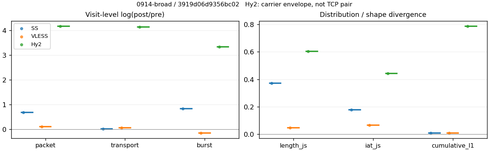
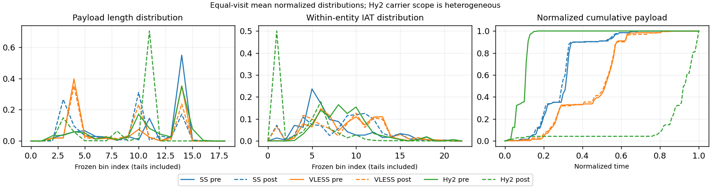

# 0914-broad · 条目 007 · wikipedia.org

目标：https://en.wikipedia.org/wiki/Main_Page

活动标签：wikipedia.org::page_load。选定访问 3 次。

[返回总索引](../../README.md) · [统计口径](../../methods.md)

## 覆盖与资格（每次访问均保留）

| 部署 | 重复 | 主请求路由 | 活动状态 | 代理比较 | DIRECT pre | 请求 proxy/direct/unresolved | 错误 |
| --- | --- | --- | --- | --- | --- | --- | --- |
| Hy2 | 1 | proxy | passed | 1 | 0 | 27/0/0 | [] |
| SS | 1 | proxy | passed | 1 | 0 | 27/0/0 | [] |
| VLESS | 1 | proxy | passed | 1 | 0 | 27/0/0 | [] |

主请求非 proxy 的统计仅解释为已索引的辅助代理连接或 DIRECT 观测，不代表目标业务经代理传输。播放确认与配对资格是两道不同的门。

图中散点为单次访问，短线为重复中位数；Hy2 是共享载体包络，不能与 TCP 配对作等范围因果对比。

形态图先逐访问归一化，再对访问等权平均；实线 pre，虚线 post。分箱序号及边界见 methods，不将分箱索引误解为长度或时间。

## 每次访问的关键观测

### SS

范围：`exclusive_page`。每格 pre → post；空值为不可观测/不适用。

| 重复 | 包数 | 载荷字节 | burst | TCP FR | IAT中位µs | length JS | IAT JS |
| --- | --- | --- | --- | --- | --- | --- | --- |
| 1 | 456 → 898 | 5.4145e+05 → 5.5084e+05 | 288 → 660 | 42 → 46 | 32.591 → 393.02 | 0.37229 | 0.17744 |

完整标量统计：中位数 [min,max]；Δ 为重复内逐访问变换的中位数，MAD 未缩放。n 为可用变换数；DIRECT-only 的 nΔ=0 不代表 pre 不可用。

| scope | 特征 | pre | post | Δ | IQRΔ | MADΔ | nΔ |
| --- | --- | --- | --- | --- | --- | --- | --- |
| exclusive_page | active_span_sum_s_1000ms | 4.4873 [4.4873, 4.4873] | 4.4836 [4.4836, 4.4836] | -0.00082418 | — | — | 1 |
| exclusive_page | active_span_sum_s_100ms | 1.6914 [1.6914, 1.6914] | 2.4286 [2.4286, 2.4286] | 0.36177 | — | — | 1 |
| exclusive_page | active_span_sum_s_500ms | 4.4873 [4.4873, 4.4873] | 4.4836 [4.4836, 4.4836] | -0.00082418 | — | — | 1 |
| exclusive_page | burst_bytes_iqr | 2896 [2896, 2896] | 1428 [1428, 1428] | -0.70706 | — | — | 1 |
| exclusive_page | burst_bytes_mad | 92 [92, 92] | 34 [34, 34] | -0.99543 | — | — | 1 |
| exclusive_page | burst_bytes_max | 20480 [20480, 20480] | 7140 [7140, 7140] | -1.0537 | — | — | 1 |
| exclusive_page | burst_bytes_mean | 1880 [1880, 1880] | 834.6 [834.6, 834.6] | -0.81209 | — | — | 1 |
| exclusive_page | burst_bytes_median | 92 [92, 92] | 34 [34, 34] | -0.99543 | — | — | 1 |
| exclusive_page | burst_bytes_min | 0 [0, 0] | 0 [0, 0] | — | — | — | 0 |
| exclusive_page | burst_bytes_p95 | 8688 [8688, 8688] | 2911 [2911, 2911] | -1.0934 | — | — | 1 |
| exclusive_page | burst_bytes_q25 | 0 [0, 0] | 0 [0, 0] | — | — | — | 0 |
| exclusive_page | burst_bytes_q75 | 2896 [2896, 2896] | 1428 [1428, 1428] | -0.70706 | — | — | 1 |
| exclusive_page | burst_bytes_std | 3156.9 [3156.9, 3156.9] | 1203.6 [1203.6, 1203.6] | -0.96426 | — | — | 1 |
| exclusive_page | burst_count | 288 [288, 288] | 660 [660, 660] | 0.82928 | — | — | 1 |
| exclusive_page | burst_duration_ms_iqr | 0.029983 [0.029983, 0.029983] | 0 [0, 0] | — | — | — | 0 |
| exclusive_page | burst_duration_ms_mad | 0 [0, 0] | 0 [0, 0] | — | — | — | 0 |
| exclusive_page | burst_duration_ms_max | 1920.7 [1920.7, 1920.7] | 1920.9 [1920.9, 1920.9] | 0.00011833 | — | — | 1 |
| exclusive_page | burst_duration_ms_mean | 23.397 [23.397, 23.397] | 8.4563 [8.4563, 8.4563] | -1.0177 | — | — | 1 |
| exclusive_page | burst_duration_ms_median | 0 [0, 0] | 0 [0, 0] | — | — | — | 0 |
| exclusive_page | burst_duration_ms_min | 0 [0, 0] | 0 [0, 0] | — | — | — | 0 |
| exclusive_page | burst_duration_ms_p95 | 87.585 [87.585, 87.585] | 1.5623 [1.5623, 1.5623] | -4.0265 | — | — | 1 |
| exclusive_page | burst_duration_ms_q25 | 0 [0, 0] | 0 [0, 0] | — | — | — | 0 |
| exclusive_page | burst_duration_ms_q75 | 0.029983 [0.029983, 0.029983] | 0 [0, 0] | — | — | — | 0 |
| exclusive_page | burst_duration_ms_std | 149.43 [149.43, 149.43] | 96.099 [96.099, 96.099] | -0.44144 | — | — | 1 |
| exclusive_page | burst_packets_iqr | 1 [1, 1] | 0 [0, 0] | — | — | — | 0 |
| exclusive_page | burst_packets_mad | 0 [0, 0] | 0 [0, 0] | — | — | — | 0 |
| exclusive_page | burst_packets_max | 10 [10, 10] | 8 [8, 8] | -0.22314 | — | — | 1 |
| exclusive_page | burst_packets_mean | 1.5833 [1.5833, 1.5833] | 1.3606 [1.3606, 1.3606] | -0.1516 | — | — | 1 |
| exclusive_page | burst_packets_median | 1 [1, 1] | 1 [1, 1] | 0 | — | — | 1 |
| exclusive_page | burst_packets_min | 1 [1, 1] | 1 [1, 1] | 0 | — | — | 1 |
| exclusive_page | burst_packets_p95 | 4 [4, 4] | 3 [3, 3] | -0.28768 | — | — | 1 |
| exclusive_page | burst_packets_q25 | 1 [1, 1] | 1 [1, 1] | 0 | — | — | 1 |
| exclusive_page | burst_packets_q75 | 2 [2, 2] | 1 [1, 1] | -0.69315 | — | — | 1 |
| exclusive_page | burst_packets_std | 1.1637 [1.1637, 1.1637] | 0.79408 [0.79408, 0.79408] | -0.38216 | — | — | 1 |
| exclusive_page | connection_span_concurrency_max | 2 [2, 2] | 2 [2, 2] | 0 | — | — | 1 |
| exclusive_page | cumulative_l1 | — | — | 0.0091212 | — | — | 1 |
| exclusive_page | cumulative_max | — | — | 0.13697 | — | — | 1 |
| exclusive_page | direction_entropy | 0.67324 [0.67324, 0.67324] | 0.45216 [0.45216, 0.45216] | -0.22108 | — | — | 1 |
| exclusive_page | down_burst_count | 142 [142, 142] | 328 [328, 328] | 0.83719 | — | — | 1 |
| exclusive_page | down_ip_bytes | 5.4e+05 [5.4e+05, 5.4e+05] | 5.5866e+05 [5.5866e+05, 5.5866e+05] | 0.033983 | — | — | 1 |
| exclusive_page | down_packets | 281 [281, 281] | 493 [493, 493] | 0.56215 | — | — | 1 |
| exclusive_page | down_transport_bytes | 5.2535e+05 [5.2535e+05, 5.2535e+05] | 5.3299e+05 [5.3299e+05, 5.3299e+05] | 0.014442 | — | — | 1 |
| exclusive_page | duration_s | 4.8962 [4.8962, 4.8962] | 4.8957 [4.8957, 4.8957] | -0.00011669 | — | — | 1 |
| exclusive_page | entity_count | 4 [4, 4] | 4 [4, 4] | 0 | — | — | 1 |
| exclusive_page | fr_runs | 42 [42, 42] | 46 [46, 46] | 0.090972 | — | — | 1 |
| exclusive_page | fr_runs_per_packet | 0.15162 [0.15162, 0.15162] | 0.092742 [0.092742, 0.092742] | -0.058883 | — | — | 1 |
| exclusive_page | fr_switches | 38 [38, 38] | 42 [42, 42] | 0.10008 | — | — | 1 |
| exclusive_page | fr_switches_per_possible_transition | 0.13919 [0.13919, 0.13919] | 0.085366 [0.085366, 0.085366] | -0.053828 | — | — | 1 |
| exclusive_page | full_retransmission_fraction | 0 [0, 0] | 0 [0, 0] | 0 | — | — | 1 |
| exclusive_page | full_retransmission_packets | 0 [0, 0] | 0 [0, 0] | — | — | — | 0 |
| exclusive_page | iat_count | 452 [452, 452] | 894 [894, 894] | 0.68202 | — | — | 1 |
| exclusive_page | iat_js | — | — | 0.17744 | — | — | 1 |
| exclusive_page | iat_ks | — | — | 0.31719 | — | — | 1 |
| exclusive_page | iat_median_us | 32.591 [32.591, 32.591] | 393.02 [393.02, 393.02] | 2.4898 | — | — | 1 |
| exclusive_page | iat_us_iqr | 225.27 [225.27, 225.27] | 1082.6 [1082.6, 1082.6] | 1.5698 | — | — | 1 |
| exclusive_page | iat_us_mad | 27.742 [27.742, 27.742] | 386.38 [386.38, 386.38] | 2.6339 | — | — | 1 |
| exclusive_page | iat_us_max | 1.8793e+06 [1.8793e+06, 1.8793e+06] | 1.9209e+06 [1.9209e+06, 1.9209e+06] | 0.021866 | — | — | 1 |
| exclusive_page | iat_us_mean | 17277 [17277, 17277] | 8732.2 [8732.2, 8732.2] | -0.68234 | — | — | 1 |
| exclusive_page | iat_us_median | 32.591 [32.591, 32.591] | 393.02 [393.02, 393.02] | 2.4898 | — | — | 1 |
| exclusive_page | iat_us_min | 0.084 [0.084, 0.084] | 0.036 [0.036, 0.036] | -0.8473 | — | — | 1 |
| exclusive_page | iat_us_p95 | 53907 [53907, 53907] | 22053 [22053, 22053] | -0.89381 | — | — | 1 |
| exclusive_page | iat_us_q25 | 13.754 [13.754, 13.754] | 15.56 [15.56, 15.56] | 0.12338 | — | — | 1 |
| exclusive_page | iat_us_q75 | 239.02 [239.02, 239.02] | 1098.2 [1098.2, 1098.2] | 1.5248 | — | — | 1 |
| exclusive_page | iat_us_std | 1.1882e+05 [1.1882e+05, 1.1882e+05] | 83019 [83019, 83019] | -0.35851 | — | — | 1 |
| exclusive_page | iat_wasserstein_log1p_us | — | — | 1.2243 | — | — | 1 |
| exclusive_page | idle_gap_count_1000ms | 2 [2, 2] | 2 [2, 2] | 0 | — | — | 1 |
| exclusive_page | idle_gap_count_100ms | 13 [13, 13] | 11 [11, 11] | -0.16705 | — | — | 1 |
| exclusive_page | idle_gap_count_500ms | 2 [2, 2] | 2 [2, 2] | 0 | — | — | 1 |
| exclusive_page | idle_gap_sum_s_1000ms | 3.3218 [3.3218, 3.3218] | 3.323 [3.323, 3.323] | 0.0003609 | — | — | 1 |
| exclusive_page | idle_gap_sum_s_100ms | 6.1177 [6.1177, 6.1177] | 5.378 [5.378, 5.378] | -0.12887 | — | — | 1 |
| exclusive_page | idle_gap_sum_s_500ms | 3.3218 [3.3218, 3.3218] | 3.323 [3.323, 3.323] | 0.0003609 | — | — | 1 |
| exclusive_page | ip_bytes | 5.6523e+05 [5.6523e+05, 5.6523e+05] | 6.0496e+05 [6.0496e+05, 6.0496e+05] | 0.067941 | — | — | 1 |
| exclusive_page | length_iqr | 1730 [1730, 1730] | 1388 [1388, 1388] | -0.22026 | — | — | 1 |
| exclusive_page | length_js | — | — | 0.37229 | — | — | 1 |
| exclusive_page | length_ks | — | — | 0.52825 | — | — | 1 |
| exclusive_page | length_mad | 0 [0, 0] | 1339.5 [1339.5, 1339.5] | — | — | — | 0 |
| exclusive_page | length_max | 4096 [4096, 4096] | 7140 [7140, 7140] | 0.5557 | — | — | 1 |
| exclusive_page | length_mean | 1954.7 [1954.7, 1954.7] | 1110.6 [1110.6, 1110.6] | -0.56537 | — | — | 1 |
| exclusive_page | length_median | 2896 [2896, 2896] | 1428 [1428, 1428] | -0.70706 | — | — | 1 |
| exclusive_page | length_min | 9 [9, 9] | 34 [34, 34] | 1.3291 | — | — | 1 |
| exclusive_page | length_p95 | 2896 [2896, 2896] | 2856 [2856, 2856] | -0.013908 | — | — | 1 |
| exclusive_page | length_q25 | 1166 [1166, 1166] | 40 [40, 40] | -3.3725 | — | — | 1 |
| exclusive_page | length_q75 | 2896 [2896, 2896] | 1428 [1428, 1428] | -0.70706 | — | — | 1 |
| exclusive_page | length_std | 1135.6 [1135.6, 1135.6] | 1063.2 [1063.2, 1063.2] | -0.065804 | — | — | 1 |
| exclusive_page | length_wasserstein_bytes | — | — | 864.05 | — | — | 1 |
| exclusive_page | nonempty_entity_count | 4 [4, 4] | 4 [4, 4] | 0 | — | — | 1 |
| exclusive_page | nonempty_packets | 277 [277, 277] | 496 [496, 496] | 0.58256 | — | — | 1 |
| exclusive_page | offload_suspect_fraction | 0.35307 [0.35307, 0.35307] | 0.12584 [0.12584, 0.12584] | -0.22723 | — | — | 1 |
| exclusive_page | packet_count | 456 [456, 456] | 898 [898, 898] | 0.67768 | — | — | 1 |
| exclusive_page | rtt_median_ms | 0.072482 [0.072482, 0.072482] | 32.486 [32.486, 32.486] | 6.1052 | — | — | 1 |
| exclusive_page | rtt_sample_count | 174 [174, 174] | 150 [150, 150] | -0.14842 | — | — | 1 |
| exclusive_page | tcp_ack_count | 452 [452, 452] | 894 [894, 894] | 0.68202 | — | — | 1 |
| exclusive_page | tcp_fin_count | 8 [8, 8] | 8 [8, 8] | 0 | — | — | 1 |
| exclusive_page | tcp_packet_count | 456 [456, 456] | 898 [898, 898] | 0.67768 | — | — | 1 |
| exclusive_page | tcp_rst_count | 0 [0, 0] | 0 [0, 0] | — | — | — | 0 |
| exclusive_page | tcp_syn_count | 8 [8, 8] | 8 [8, 8] | 0 | — | — | 1 |
| exclusive_page | tcp_window_raw_median | 65535 [65535, 65535] | 138 [138, 138] | -6.1631 | — | — | 1 |
| exclusive_page | transition_entropy | 0.49482 [0.49482, 0.49482] | 0.32571 [0.32571, 0.32571] | -0.16911 | — | — | 1 |
| exclusive_page | transition_n_mm | 207 [207, 207] | 426 [426, 426] | 0.72172 | — | — | 1 |
| exclusive_page | transition_n_mp | 17 [17, 17] | 19 [19, 19] | 0.11123 | — | — | 1 |
| exclusive_page | transition_n_pm | 21 [21, 21] | 23 [23, 23] | 0.090972 | — | — | 1 |
| exclusive_page | transition_n_pp | 28 [28, 28] | 24 [24, 24] | -0.15415 | — | — | 1 |
| exclusive_page | transition_p_mm | 0.92411 [0.92411, 0.92411] | 0.9573 [0.9573, 0.9573] | 0.033196 | — | — | 1 |
| exclusive_page | transition_p_mp | 0.075893 [0.075893, 0.075893] | 0.042697 [0.042697, 0.042697] | -0.033196 | — | — | 1 |
| exclusive_page | transition_p_pm | 0.42857 [0.42857, 0.42857] | 0.48936 [0.48936, 0.48936] | 0.06079 | — | — | 1 |
| exclusive_page | transition_p_pp | 0.57143 [0.57143, 0.57143] | 0.51064 [0.51064, 0.51064] | -0.06079 | — | — | 1 |
| exclusive_page | transport_bytes | 5.4145e+05 [5.4145e+05, 5.4145e+05] | 5.5084e+05 [5.5084e+05, 5.5084e+05] | 0.017185 | — | — | 1 |
| exclusive_page | up_burst_count | 146 [146, 146] | 332 [332, 332] | 0.82153 | — | — | 1 |
| exclusive_page | up_byte_fraction | 0.029737 [0.029737, 0.029737] | 0.032394 [0.032394, 0.032394] | 0.0026576 | — | — | 1 |
| exclusive_page | up_ip_bytes | 25233 [25233, 25233] | 46304 [46304, 46304] | 0.60708 | — | — | 1 |
| exclusive_page | up_packets | 175 [175, 175] | 405 [405, 405] | 0.8391 | — | — | 1 |
| exclusive_page | up_transport_bytes | 16101 [16101, 16101] | 17844 [17844, 17844] | 0.10279 | — | — | 1 |
| exclusive_page | zero_iat_count | 0 [0, 0] | 0 [0, 0] | — | — | — | 0 |
| exclusive_page | zero_iat_fraction | 0 [0, 0] | 0 [0, 0] | 0 | — | — | 1 |

### VLESS

范围：`exclusive_page`。每格 pre → post；空值为不可观测/不适用。

| 重复 | 包数 | 载荷字节 | burst | TCP FR | IAT中位µs | length JS | IAT JS |
| --- | --- | --- | --- | --- | --- | --- | --- |
| 1 | 759 → 852 | 5.4104e+05 → 5.7333e+05 | 594 → 516 | 32 → 40 | 368.75 → 439.37 | 0.04721 | 0.066043 |

完整标量统计：中位数 [min,max]；Δ 为重复内逐访问变换的中位数，MAD 未缩放。n 为可用变换数；DIRECT-only 的 nΔ=0 不代表 pre 不可用。

| scope | 特征 | pre | post | Δ | IQRΔ | MADΔ | nΔ |
| --- | --- | --- | --- | --- | --- | --- | --- |
| exclusive_page | active_span_sum_s_1000ms | 6.6309 [6.6309, 6.6309] | 6.5586 [6.5586, 6.5586] | -0.010954 | — | — | 1 |
| exclusive_page | active_span_sum_s_100ms | 1.5951 [1.5951, 1.5951] | 2.8886 [2.8886, 2.8886] | 0.59383 | — | — | 1 |
| exclusive_page | active_span_sum_s_500ms | 3.9656 [3.9656, 3.9656] | 6.5586 [6.5586, 6.5586] | 0.50311 | — | — | 1 |
| exclusive_page | burst_bytes_iqr | 2824 [2824, 2824] | 2824 [2824, 2824] | 0 | — | — | 1 |
| exclusive_page | burst_bytes_mad | 31 [31, 31] | 72 [72, 72] | 0.84268 | — | — | 1 |
| exclusive_page | burst_bytes_max | 5720 [5720, 5720] | 4832 [4832, 4832] | -0.16871 | — | — | 1 |
| exclusive_page | burst_bytes_mean | 910.85 [910.85, 910.85] | 1111.1 [1111.1, 1111.1] | 0.19874 | — | — | 1 |
| exclusive_page | burst_bytes_median | 31 [31, 31] | 72 [72, 72] | 0.84268 | — | — | 1 |
| exclusive_page | burst_bytes_min | 0 [0, 0] | 0 [0, 0] | — | — | — | 0 |
| exclusive_page | burst_bytes_p95 | 2896 [2896, 2896] | 2896 [2896, 2896] | 0 | — | — | 1 |
| exclusive_page | burst_bytes_q25 | 0 [0, 0] | 0 [0, 0] | — | — | — | 0 |
| exclusive_page | burst_bytes_q75 | 2824 [2824, 2824] | 2824 [2824, 2824] | 0 | — | — | 1 |
| exclusive_page | burst_bytes_std | 1278.1 [1278.1, 1278.1] | 1289.9 [1289.9, 1289.9] | 0.0092363 | — | — | 1 |
| exclusive_page | burst_count | 594 [594, 594] | 516 [516, 516] | -0.14077 | — | — | 1 |
| exclusive_page | burst_duration_ms_iqr | 0.034345 [0.034345, 0.034345] | 3.401 [3.401, 3.401] | 4.5954 | — | — | 1 |
| exclusive_page | burst_duration_ms_mad | 0 [0, 0] | 0 [0, 0] | — | — | — | 0 |
| exclusive_page | burst_duration_ms_max | 1748.7 [1748.7, 1748.7] | 1748.9 [1748.9, 1748.9] | 0.00012361 | — | — | 1 |
| exclusive_page | burst_duration_ms_mean | 14.037 [14.037, 14.037] | 14.281 [14.281, 14.281] | 0.017224 | — | — | 1 |
| exclusive_page | burst_duration_ms_median | 0 [0, 0] | 0 [0, 0] | — | — | — | 0 |
| exclusive_page | burst_duration_ms_min | 0 [0, 0] | 0 [0, 0] | — | — | — | 0 |
| exclusive_page | burst_duration_ms_p95 | 9.3108 [9.3108, 9.3108] | 10.233 [10.233, 10.233] | 0.094463 | — | — | 1 |
| exclusive_page | burst_duration_ms_q25 | 0 [0, 0] | 0 [0, 0] | — | — | — | 0 |
| exclusive_page | burst_duration_ms_q75 | 0.034345 [0.034345, 0.034345] | 3.401 [3.401, 3.401] | 4.5954 | — | — | 1 |
| exclusive_page | burst_duration_ms_std | 107.54 [107.54, 107.54] | 101.45 [101.45, 101.45] | -0.058263 | — | — | 1 |
| exclusive_page | burst_packets_iqr | 1 [1, 1] | 1 [1, 1] | 0 | — | — | 1 |
| exclusive_page | burst_packets_mad | 0 [0, 0] | 0 [0, 0] | — | — | — | 0 |
| exclusive_page | burst_packets_max | 4 [4, 4] | 8 [8, 8] | 0.69315 | — | — | 1 |
| exclusive_page | burst_packets_mean | 1.2778 [1.2778, 1.2778] | 1.6512 [1.6512, 1.6512] | 0.25636 | — | — | 1 |
| exclusive_page | burst_packets_median | 1 [1, 1] | 1 [1, 1] | 0 | — | — | 1 |
| exclusive_page | burst_packets_min | 1 [1, 1] | 1 [1, 1] | 0 | — | — | 1 |
| exclusive_page | burst_packets_p95 | 2 [2, 2] | 3 [3, 3] | 0.40547 | — | — | 1 |
| exclusive_page | burst_packets_q25 | 1 [1, 1] | 1 [1, 1] | 0 | — | — | 1 |
| exclusive_page | burst_packets_q75 | 2 [2, 2] | 2 [2, 2] | 0 | — | — | 1 |
| exclusive_page | burst_packets_std | 0.5078 [0.5078, 0.5078] | 0.96369 [0.96369, 0.96369] | 0.64069 | — | — | 1 |
| exclusive_page | connection_span_concurrency_max | 3 [3, 3] | 3 [3, 3] | 0 | — | — | 1 |
| exclusive_page | cumulative_l1 | — | — | 0.0091567 | — | — | 1 |
| exclusive_page | cumulative_max | — | — | 0.029018 | — | — | 1 |
| exclusive_page | direction_entropy | 0.49704 [0.49704, 0.49704] | 0.45743 [0.45743, 0.45743] | -0.039608 | — | — | 1 |
| exclusive_page | down_burst_count | 295 [295, 295] | 256 [256, 256] | -0.1418 | — | — | 1 |
| exclusive_page | down_ip_bytes | 5.4777e+05 [5.4777e+05, 5.4777e+05] | 5.7557e+05 [5.7557e+05, 5.7557e+05] | 0.049493 | — | — | 1 |
| exclusive_page | down_packets | 436 [436, 436] | 502 [502, 502] | 0.14096 | — | — | 1 |
| exclusive_page | down_transport_bytes | 5.2507e+05 [5.2507e+05, 5.2507e+05] | 5.4943e+05 [5.4943e+05, 5.4943e+05] | 0.045352 | — | — | 1 |
| exclusive_page | duration_s | 4.5572 [4.5572, 4.5572] | 4.5361 [4.5361, 4.5361] | -0.004641 | — | — | 1 |
| exclusive_page | entity_count | 4 [4, 4] | 4 [4, 4] | 0 | — | — | 1 |
| exclusive_page | fr_runs | 32 [32, 32] | 40 [40, 40] | 0.22314 | — | — | 1 |
| exclusive_page | fr_runs_per_packet | 0.074246 [0.074246, 0.074246] | 0.080321 [0.080321, 0.080321] | 0.0060753 | — | — | 1 |
| exclusive_page | fr_switches | 28 [28, 28] | 36 [36, 36] | 0.25131 | — | — | 1 |
| exclusive_page | fr_switches_per_possible_transition | 0.065574 [0.065574, 0.065574] | 0.072874 [0.072874, 0.072874] | 0.0073007 | — | — | 1 |
| exclusive_page | full_retransmission_fraction | 0 [0, 0] | 0 [0, 0] | 0 | — | — | 1 |
| exclusive_page | full_retransmission_packets | 0 [0, 0] | 0 [0, 0] | — | — | — | 0 |
| exclusive_page | iat_count | 755 [755, 755] | 848 [848, 848] | 0.11616 | — | — | 1 |
| exclusive_page | iat_js | — | — | 0.066043 | — | — | 1 |
| exclusive_page | iat_ks | — | — | 0.1456 | — | — | 1 |
| exclusive_page | iat_median_us | 368.75 [368.75, 368.75] | 439.37 [439.37, 439.37] | 0.17521 | — | — | 1 |
| exclusive_page | iat_us_iqr | 2584.1 [2584.1, 2584.1] | 3086.4 [3086.4, 3086.4] | 0.17762 | — | — | 1 |
| exclusive_page | iat_us_mad | 357.09 [357.09, 357.09] | 432.15 [432.15, 432.15] | 0.19078 | — | — | 1 |
| exclusive_page | iat_us_max | 1.7487e+06 [1.7487e+06, 1.7487e+06] | 1.7489e+06 [1.7489e+06, 1.7489e+06] | 0.00012361 | — | — | 1 |
| exclusive_page | iat_us_mean | 12776 [12776, 12776] | 11290 [11290, 11290] | -0.12364 | — | — | 1 |
| exclusive_page | iat_us_median | 368.75 [368.75, 368.75] | 439.37 [439.37, 439.37] | 0.17521 | — | — | 1 |
| exclusive_page | iat_us_min | 0.939 [0.939, 0.939] | 0.036 [0.036, 0.036] | -3.2613 | — | — | 1 |
| exclusive_page | iat_us_p95 | 9905.3 [9905.3, 9905.3] | 40979 [40979, 40979] | 1.42 | — | — | 1 |
| exclusive_page | iat_us_q25 | 38.745 [38.745, 38.745] | 13.523 [13.523, 13.523] | -1.0526 | — | — | 1 |
| exclusive_page | iat_us_q75 | 2622.9 [2622.9, 2622.9] | 3099.9 [3099.9, 3099.9] | 0.16711 | — | — | 1 |
| exclusive_page | iat_us_std | 95570 [95570, 95570] | 80508 [80508, 80508] | -0.1715 | — | — | 1 |
| exclusive_page | iat_wasserstein_log1p_us | — | — | 0.47924 | — | — | 1 |
| exclusive_page | idle_gap_count_1000ms | 2 [2, 2] | 2 [2, 2] | 0 | — | — | 1 |
| exclusive_page | idle_gap_count_100ms | 17 [17, 17] | 21 [21, 21] | 0.21131 | — | — | 1 |
| exclusive_page | idle_gap_count_500ms | 6 [6, 6] | 2 [2, 2] | -1.0986 | — | — | 1 |
| exclusive_page | idle_gap_sum_s_1000ms | 3.0148 [3.0148, 3.0148] | 3.0151 [3.0151, 3.0151] | 0.00012025 | — | — | 1 |
| exclusive_page | idle_gap_sum_s_100ms | 8.0505 [8.0505, 8.0505] | 6.6852 [6.6852, 6.6852] | -0.18584 | — | — | 1 |
| exclusive_page | idle_gap_sum_s_500ms | 5.68 [5.68, 5.68] | 3.0151 [3.0151, 3.0151] | -0.6333 | — | — | 1 |
| exclusive_page | ip_bytes | 5.8048e+05 [5.8048e+05, 5.8048e+05] | 6.1834e+05 [6.1834e+05, 6.1834e+05] | 0.063188 | — | — | 1 |
| exclusive_page | length_iqr | 2752 [2752, 2752] | 1376 [1376, 1376] | -0.69315 | — | — | 1 |
| exclusive_page | length_js | — | — | 0.04721 | — | — | 1 |
| exclusive_page | length_ks | — | — | 0.13089 | — | — | 1 |
| exclusive_page | length_mad | 839 [839, 839] | 1300.5 [1300.5, 1300.5] | 0.43829 | — | — | 1 |
| exclusive_page | length_max | 2896 [2896, 2896] | 2824 [2824, 2824] | -0.025176 | — | — | 1 |
| exclusive_page | length_mean | 1255.3 [1255.3, 1255.3] | 1151.3 [1151.3, 1151.3] | -0.086529 | — | — | 1 |
| exclusive_page | length_median | 911 [911, 911] | 1372.5 [1372.5, 1372.5] | 0.40985 | — | — | 1 |
| exclusive_page | length_min | 24 [24, 24] | 24 [24, 24] | 0 | — | — | 1 |
| exclusive_page | length_p95 | 2824 [2824, 2824] | 2824 [2824, 2824] | 0 | — | — | 1 |
| exclusive_page | length_q25 | 72 [72, 72] | 72 [72, 72] | 0 | — | — | 1 |
| exclusive_page | length_q75 | 2824 [2824, 2824] | 1448 [1448, 1448] | -0.66797 | — | — | 1 |
| exclusive_page | length_std | 1239.4 [1239.4, 1239.4] | 1082.9 [1082.9, 1082.9] | -0.13504 | — | — | 1 |
| exclusive_page | length_wasserstein_bytes | — | — | 227.85 | — | — | 1 |
| exclusive_page | nonempty_entity_count | 4 [4, 4] | 4 [4, 4] | 0 | — | — | 1 |
| exclusive_page | nonempty_packets | 431 [431, 431] | 498 [498, 498] | 0.14449 | — | — | 1 |
| exclusive_page | offload_suspect_fraction | 0.21344 [0.21344, 0.21344] | 0.14319 [0.14319, 0.14319] | -0.070246 | — | — | 1 |
| exclusive_page | packet_count | 759 [759, 759] | 852 [852, 852] | 0.11558 | — | — | 1 |
| exclusive_page | rtt_median_ms | 0.089938 [0.089938, 0.089938] | 3.0226 [3.0226, 3.0226] | 3.5147 | — | — | 1 |
| exclusive_page | rtt_sample_count | 313 [313, 313] | 326 [326, 326] | 0.040694 | — | — | 1 |
| exclusive_page | tcp_ack_count | 747 [747, 747] | 848 [848, 848] | 0.12682 | — | — | 1 |
| exclusive_page | tcp_fin_count | 8 [8, 8] | 8 [8, 8] | 0 | — | — | 1 |
| exclusive_page | tcp_packet_count | 759 [759, 759] | 852 [852, 852] | 0.11558 | — | — | 1 |
| exclusive_page | tcp_rst_count | 8 [8, 8] | 0 [0, 0] | — | — | — | 0 |
| exclusive_page | tcp_syn_count | 8 [8, 8] | 8 [8, 8] | 0 | — | — | 1 |
| exclusive_page | tcp_window_raw_median | 65535 [65535, 65535] | 153 [153, 153] | -6.0599 | — | — | 1 |
| exclusive_page | transition_entropy | 0.28183 [0.28183, 0.28183] | 0.29658 [0.29658, 0.29658] | 0.014756 | — | — | 1 |
| exclusive_page | transition_n_mm | 368 [368, 368] | 430 [430, 430] | 0.1557 | — | — | 1 |
| exclusive_page | transition_n_mp | 12 [12, 12] | 16 [16, 16] | 0.28768 | — | — | 1 |
| exclusive_page | transition_n_pm | 16 [16, 16] | 20 [20, 20] | 0.22314 | — | — | 1 |
| exclusive_page | transition_n_pp | 31 [31, 31] | 28 [28, 28] | -0.10178 | — | — | 1 |
| exclusive_page | transition_p_mm | 0.96842 [0.96842, 0.96842] | 0.96413 [0.96413, 0.96413] | -0.0042955 | — | — | 1 |
| exclusive_page | transition_p_mp | 0.031579 [0.031579, 0.031579] | 0.035874 [0.035874, 0.035874] | 0.0042955 | — | — | 1 |
| exclusive_page | transition_p_pm | 0.34043 [0.34043, 0.34043] | 0.41667 [0.41667, 0.41667] | 0.076241 | — | — | 1 |
| exclusive_page | transition_p_pp | 0.65957 [0.65957, 0.65957] | 0.58333 [0.58333, 0.58333] | -0.076241 | — | — | 1 |
| exclusive_page | transport_bytes | 5.4104e+05 [5.4104e+05, 5.4104e+05] | 5.7333e+05 [5.7333e+05, 5.7333e+05] | 0.057963 | — | — | 1 |
| exclusive_page | up_burst_count | 299 [299, 299] | 260 [260, 260] | -0.13976 | — | — | 1 |
| exclusive_page | up_byte_fraction | 0.029528 [0.029528, 0.029528] | 0.04169 [0.04169, 0.04169] | 0.012162 | — | — | 1 |
| exclusive_page | up_ip_bytes | 32708 [32708, 32708] | 42778 [42778, 42778] | 0.2684 | — | — | 1 |
| exclusive_page | up_packets | 323 [323, 323] | 350 [350, 350] | 0.080281 | — | — | 1 |
| exclusive_page | up_transport_bytes | 15976 [15976, 15976] | 23902 [23902, 23902] | 0.40287 | — | — | 1 |
| exclusive_page | zero_iat_count | 0 [0, 0] | 0 [0, 0] | — | — | — | 0 |
| exclusive_page | zero_iat_fraction | 0 [0, 0] | 0 [0, 0] | 0 | — | — | 1 |

### Hy2

范围：`carrier_context_envelope`。每格 pre → post；空值为不可观测/不适用。

| 重复 | 包数 | 载荷字节 | burst | TCP FR | IAT中位µs | length JS | IAT JS |
| --- | --- | --- | --- | --- | --- | --- | --- |
| 1 | 477 → 30448 | 5.4428e+05 → 3.3654e+07 | 344 → 9663 | — | 174.79 → 0.968 | 0.60409 | 0.44302 |

完整标量统计：中位数 [min,max]；Δ 为重复内逐访问变换的中位数，MAD 未缩放。n 为可用变换数；DIRECT-only 的 nΔ=0 不代表 pre 不可用。

| scope | 特征 | pre | post | Δ | IQRΔ | MADΔ | nΔ |
| --- | --- | --- | --- | --- | --- | --- | --- |
| carrier_context_envelope | active_span_sum_s_1000ms | 2.9566 [2.9566, 2.9566] | 7.0741 [7.0741, 7.0741] | 0.87238 | — | — | 1 |
| carrier_context_envelope | active_span_sum_s_100ms | 0.50053 [0.50053, 0.50053] | 4.621 [4.621, 4.621] | 2.2227 | — | — | 1 |
| carrier_context_envelope | active_span_sum_s_500ms | 2.9566 [2.9566, 2.9566] | 7.0741 [7.0741, 7.0741] | 0.87238 | — | — | 1 |
| carrier_context_envelope | burst_bytes_iqr | 2856 [2856, 2856] | 5129 [5129, 5129] | 0.58549 | — | — | 1 |
| carrier_context_envelope | burst_bytes_mad | 39.5 [39.5, 39.5] | 255 [255, 255] | 1.865 | — | — | 1 |
| carrier_context_envelope | burst_bytes_max | 17136 [17136, 17136] | 2.2569e+05 [2.2569e+05, 2.2569e+05] | 2.578 | — | — | 1 |
| carrier_context_envelope | burst_bytes_mean | 1582.2 [1582.2, 1582.2] | 3482.8 [3482.8, 3482.8] | 0.78902 | — | — | 1 |
| carrier_context_envelope | burst_bytes_median | 39.5 [39.5, 39.5] | 288 [288, 288] | 1.9867 | — | — | 1 |
| carrier_context_envelope | burst_bytes_min | 0 [0, 0] | 22 [22, 22] | — | — | — | 0 |
| carrier_context_envelope | burst_bytes_p95 | 6526.3 [6526.3, 6526.3] | 11528 [11528, 11528] | 0.56894 | — | — | 1 |
| carrier_context_envelope | burst_bytes_q25 | 0 [0, 0] | 39 [39, 39] | — | — | — | 0 |
| carrier_context_envelope | burst_bytes_q75 | 2856 [2856, 2856] | 5168 [5168, 5168] | 0.59306 | — | — | 1 |
| carrier_context_envelope | burst_bytes_std | 2550.4 [2550.4, 2550.4] | 9111.2 [9111.2, 9111.2] | 1.2733 | — | — | 1 |
| carrier_context_envelope | burst_count | 344 [344, 344] | 9663 [9663, 9663] | 3.3354 | — | — | 1 |
| carrier_context_envelope | burst_duration_ms_iqr | 0.0936 [0.0936, 0.0936] | 0.025904 [0.025904, 0.025904] | -1.2846 | — | — | 1 |
| carrier_context_envelope | burst_duration_ms_mad | 0 [0, 0] | 5.1e-05 [5.1e-05, 5.1e-05] | — | — | — | 0 |
| carrier_context_envelope | burst_duration_ms_max | 12597 [12597, 12597] | 221.45 [221.45, 221.45] | -4.041 | — | — | 1 |
| carrier_context_envelope | burst_duration_ms_mean | 113.24 [113.24, 113.24] | 0.20669 [0.20669, 0.20669] | -6.3061 | — | — | 1 |
| carrier_context_envelope | burst_duration_ms_median | 0 [0, 0] | 5.1e-05 [5.1e-05, 5.1e-05] | — | — | — | 0 |
| carrier_context_envelope | burst_duration_ms_min | 0 [0, 0] | 0 [0, 0] | — | — | — | 0 |
| carrier_context_envelope | burst_duration_ms_p95 | 12.615 [12.615, 12.615] | 0.16362 [0.16362, 0.16362] | -4.3451 | — | — | 1 |
| carrier_context_envelope | burst_duration_ms_q25 | 0 [0, 0] | 0 [0, 0] | — | — | — | 0 |
| carrier_context_envelope | burst_duration_ms_q75 | 0.0936 [0.0936, 0.0936] | 0.025904 [0.025904, 0.025904] | -1.2846 | — | — | 1 |
| carrier_context_envelope | burst_duration_ms_std | 1129.3 [1129.3, 1129.3] | 3.6465 [3.6465, 3.6465] | -5.7356 | — | — | 1 |
| carrier_context_envelope | burst_packets_iqr | 1 [1, 1] | 3 [3, 3] | 1.0986 | — | — | 1 |
| carrier_context_envelope | burst_packets_mad | 0 [0, 0] | 1 [1, 1] | — | — | — | 0 |
| carrier_context_envelope | burst_packets_max | 7 [7, 7] | 162 [162, 162] | 3.1417 | — | — | 1 |
| carrier_context_envelope | burst_packets_mean | 1.3866 [1.3866, 1.3866] | 3.151 [3.151, 3.151] | 0.82084 | — | — | 1 |
| carrier_context_envelope | burst_packets_median | 1 [1, 1] | 2 [2, 2] | 0.69315 | — | — | 1 |
| carrier_context_envelope | burst_packets_min | 1 [1, 1] | 1 [1, 1] | 0 | — | — | 1 |
| carrier_context_envelope | burst_packets_p95 | 3 [3, 3] | 8 [8, 8] | 0.98083 | — | — | 1 |
| carrier_context_envelope | burst_packets_q25 | 1 [1, 1] | 1 [1, 1] | 0 | — | — | 1 |
| carrier_context_envelope | burst_packets_q75 | 2 [2, 2] | 4 [4, 4] | 0.69315 | — | — | 1 |
| carrier_context_envelope | burst_packets_std | 0.73052 [0.73052, 0.73052] | 6.3857 [6.3857, 6.3857] | 2.1681 | — | — | 1 |
| carrier_context_envelope | connection_span_concurrency_max | 3 [3, 3] | 1 [1, 1] | -1.0986 | — | — | 1 |
| carrier_context_envelope | cumulative_l1 | — | — | 0.78613 | — | — | 1 |
| carrier_context_envelope | cumulative_max | — | — | 0.95797 | — | — | 1 |
| carrier_context_envelope | direction_entropy | 0.6612 [0.6612, 0.6612] | 0.72182 [0.72182, 0.72182] | 0.060624 | — | — | 1 |
| carrier_context_envelope | direction_run_analog_runs | 34 [34, 34] | 9663 [9663, 9663] | 5.6497 | — | — | 1 |
| carrier_context_envelope | direction_run_analog_runs_per_packet | 0.12409 [0.12409, 0.12409] | 0.31736 [0.31736, 0.31736] | 0.19327 | — | — | 1 |
| carrier_context_envelope | direction_run_analog_switches | 30 [30, 30] | 9662 [9662, 9662] | 5.7748 | — | — | 1 |
| carrier_context_envelope | direction_run_analog_switches_per_possible_transition | 0.11111 [0.11111, 0.11111] | 0.31734 [0.31734, 0.31734] | 0.20623 | — | — | 1 |
| carrier_context_envelope | down_burst_count | 170 [170, 170] | 4831 [4831, 4831] | 3.347 | — | — | 1 |
| carrier_context_envelope | down_ip_bytes | 5.4281e+05 [5.4281e+05, 5.4281e+05] | 3.3966e+07 [3.3966e+07, 3.3966e+07] | 4.1364 | — | — | 1 |
| carrier_context_envelope | down_packets | 281 [281, 281] | 24360 [24360, 24360] | 4.4623 | — | — | 1 |
| carrier_context_envelope | down_transport_bytes | 5.2816e+05 [5.2816e+05, 5.2816e+05] | 3.3284e+07 [3.3284e+07, 3.3284e+07] | 4.1434 | — | — | 1 |
| carrier_context_envelope | duration_s | 14.096 [14.096, 14.096] | 14.092 [14.092, 14.092] | -0.0003286 | — | — | 1 |
| carrier_context_envelope | entity_count | 4 [4, 4] | 1 [1, 1] | -1.3863 | — | — | 1 |
| carrier_context_envelope | full_retransmission_fraction | 0.0020964 [0.0020964, 0.0020964] | — | — | — | — | 0 |
| carrier_context_envelope | full_retransmission_packets | 1 [1, 1] | — | — | — | — | 0 |
| carrier_context_envelope | iat_count | 473 [473, 473] | 30447 [30447, 30447] | 4.1646 | — | — | 1 |
| carrier_context_envelope | iat_js | — | — | 0.44302 | — | — | 1 |
| carrier_context_envelope | iat_ks | — | — | 0.62254 | — | — | 1 |
| carrier_context_envelope | iat_median_us | 174.79 [174.79, 174.79] | 0.968 [0.968, 0.968] | -5.1961 | — | — | 1 |
| carrier_context_envelope | iat_us_iqr | 811.05 [811.05, 811.05] | 27.137 [27.137, 27.137] | -3.3974 | — | — | 1 |
| carrier_context_envelope | iat_us_mad | 156.44 [156.44, 156.44] | 0.934 [0.934, 0.934] | -5.121 | — | — | 1 |
| carrier_context_envelope | iat_us_max | 1.2597e+07 [1.2597e+07, 1.2597e+07] | 5.6525e+06 [5.6525e+06, 5.6525e+06] | -0.80133 | — | — | 1 |
| carrier_context_envelope | iat_us_mean | 83258 [83258, 83258] | 462.82 [462.82, 462.82] | -5.1924 | — | — | 1 |
| carrier_context_envelope | iat_us_median | 174.79 [174.79, 174.79] | 0.968 [0.968, 0.968] | -5.1961 | — | — | 1 |
| carrier_context_envelope | iat_us_min | 2.312 [2.312, 2.312] | 0 [0, 0] | — | — | — | 0 |
| carrier_context_envelope | iat_us_p95 | 10439 [10439, 10439] | 312.55 [312.55, 312.55] | -3.5086 | — | — | 1 |
| carrier_context_envelope | iat_us_q25 | 50.863 [50.863, 50.863] | 0.052 [0.052, 0.052] | -6.8856 | — | — | 1 |
| carrier_context_envelope | iat_us_q75 | 861.91 [861.91, 861.91] | 27.189 [27.189, 27.189] | -3.4563 | — | — | 1 |
| carrier_context_envelope | iat_us_std | 9.6432e+05 [9.6432e+05, 9.6432e+05] | 33581 [33581, 33581] | -3.3575 | — | — | 1 |
| carrier_context_envelope | iat_wasserstein_log1p_us | — | — | 3.6606 | — | — | 1 |
| carrier_context_envelope | idle_gap_count_1000ms | 3 [3, 3] | 2 [2, 2] | -0.40547 | — | — | 1 |
| carrier_context_envelope | idle_gap_count_100ms | 15 [15, 15] | 17 [17, 17] | 0.12516 | — | — | 1 |
| carrier_context_envelope | idle_gap_count_500ms | 3 [3, 3] | 2 [2, 2] | -0.40547 | — | — | 1 |
| carrier_context_envelope | idle_gap_sum_s_1000ms | 36.424 [36.424, 36.424] | 7.0175 [7.0175, 7.0175] | -1.6468 | — | — | 1 |
| carrier_context_envelope | idle_gap_sum_s_100ms | 38.881 [38.881, 38.881] | 9.4706 [9.4706, 9.4706] | -1.4123 | — | — | 1 |
| carrier_context_envelope | idle_gap_sum_s_500ms | 36.424 [36.424, 36.424] | 7.0175 [7.0175, 7.0175] | -1.6468 | — | — | 1 |
| carrier_context_envelope | ip_bytes | 5.6916e+05 [5.6916e+05, 5.6916e+05] | 3.4507e+07 [3.4507e+07, 3.4507e+07] | 4.1048 | — | — | 1 |
| carrier_context_envelope | length_iqr | 1531.5 [1531.5, 1531.5] | 596 [596, 596] | -0.94376 | — | — | 1 |
| carrier_context_envelope | length_js | — | — | 0.60409 | — | — | 1 |
| carrier_context_envelope | length_ks | — | — | 0.5146 | — | — | 1 |
| carrier_context_envelope | length_mad | 1348.5 [1348.5, 1348.5] | 0 [0, 0] | — | — | — | 0 |
| carrier_context_envelope | length_max | 8920 [8920, 8920] | 1441 [1441, 1441] | -1.823 | — | — | 1 |
| carrier_context_envelope | length_mean | 1986.4 [1986.4, 1986.4] | 1105.3 [1105.3, 1105.3] | -0.58621 | — | — | 1 |
| carrier_context_envelope | length_median | 1465 [1465, 1465] | 1441 [1441, 1441] | -0.016518 | — | — | 1 |
| carrier_context_envelope | length_min | 26 [26, 26] | 22 [22, 22] | -0.16705 | — | — | 1 |
| carrier_context_envelope | length_p95 | 5660 [5660, 5660] | 1441 [1441, 1441] | -1.3681 | — | — | 1 |
| carrier_context_envelope | length_q25 | 1324.5 [1324.5, 1324.5] | 845 [845, 845] | -0.44945 | — | — | 1 |
| carrier_context_envelope | length_q75 | 2856 [2856, 2856] | 1441 [1441, 1441] | -0.68408 | — | — | 1 |
| carrier_context_envelope | length_std | 1488.2 [1488.2, 1488.2] | 567.31 [567.31, 567.31] | -0.9644 | — | — | 1 |
| carrier_context_envelope | length_wasserstein_bytes | — | — | 887.37 | — | — | 1 |
| carrier_context_envelope | nonempty_entity_count | 4 [4, 4] | 1 [1, 1] | -1.3863 | — | — | 1 |
| carrier_context_envelope | nonempty_packets | 274 [274, 274] | 30448 [30448, 30448] | 4.7106 | — | — | 1 |
| carrier_context_envelope | offload_suspect_fraction | 0.2956 [0.2956, 0.2956] | 0 [0, 0] | -0.2956 | — | — | 1 |
| carrier_context_envelope | packet_count | 477 [477, 477] | 30448 [30448, 30448] | 4.1563 | — | — | 1 |
| carrier_context_envelope | rtt_median_ms | 0.12556 [0.12556, 0.12556] | — | — | — | — | 0 |
| carrier_context_envelope | rtt_sample_count | 194 [194, 194] | 0 [0, 0] | — | — | — | 0 |
| carrier_context_envelope | tcp_ack_count | 473 [473, 473] | — | — | — | — | 0 |
| carrier_context_envelope | tcp_fin_count | 8 [8, 8] | — | — | — | — | 0 |
| carrier_context_envelope | tcp_packet_count | 477 [477, 477] | 0 [0, 0] | — | — | — | 0 |
| carrier_context_envelope | tcp_rst_count | 0 [0, 0] | — | — | — | — | 0 |
| carrier_context_envelope | tcp_syn_count | 8 [8, 8] | — | — | — | — | 0 |
| carrier_context_envelope | tcp_window_raw_median | 65535 [65535, 65535] | — | — | — | — | 0 |
| carrier_context_envelope | transition_entropy | 0.42917 [0.42917, 0.42917] | 0.72172 [0.72172, 0.72172] | 0.29256 | — | — | 1 |
| carrier_context_envelope | transition_n_mm | 210 [210, 210] | 19529 [19529, 19529] | 4.5325 | — | — | 1 |
| carrier_context_envelope | transition_n_mp | 13 [13, 13] | 4831 [4831, 4831] | 5.9179 | — | — | 1 |
| carrier_context_envelope | transition_n_pm | 17 [17, 17] | 4831 [4831, 4831] | 5.6496 | — | — | 1 |
| carrier_context_envelope | transition_n_pp | 30 [30, 30] | 1256 [1256, 1256] | 3.7345 | — | — | 1 |
| carrier_context_envelope | transition_p_mm | 0.9417 [0.9417, 0.9417] | 0.80168 [0.80168, 0.80168] | -0.14002 | — | — | 1 |
| carrier_context_envelope | transition_p_mp | 0.058296 [0.058296, 0.058296] | 0.19832 [0.19832, 0.19832] | 0.14002 | — | — | 1 |
| carrier_context_envelope | transition_p_pm | 0.3617 [0.3617, 0.3617] | 0.79366 [0.79366, 0.79366] | 0.43196 | — | — | 1 |
| carrier_context_envelope | transition_p_pp | 0.6383 [0.6383, 0.6383] | 0.20634 [0.20634, 0.20634] | -0.43196 | — | — | 1 |
| carrier_context_envelope | transport_bytes | 5.4428e+05 [5.4428e+05, 5.4428e+05] | 3.3654e+07 [3.3654e+07, 3.3654e+07] | 4.1244 | — | — | 1 |
| carrier_context_envelope | up_burst_count | 174 [174, 174] | 4832 [4832, 4832] | 3.324 | — | — | 1 |
| carrier_context_envelope | up_byte_fraction | 0.029613 [0.029613, 0.029613] | 0.010998 [0.010998, 0.010998] | -0.018616 | — | — | 1 |
| carrier_context_envelope | up_ip_bytes | 26354 [26354, 26354] | 5.4059e+05 [5.4059e+05, 5.4059e+05] | 3.021 | — | — | 1 |
| carrier_context_envelope | up_packets | 196 [196, 196] | 6088 [6088, 6088] | 3.436 | — | — | 1 |
| carrier_context_envelope | up_transport_bytes | 16118 [16118, 16118] | 3.7012e+05 [3.7012e+05, 3.7012e+05] | 3.1339 | — | — | 1 |
| carrier_context_envelope | zero_iat_count | 0 [0, 0] | 1 [1, 1] | — | — | — | 0 |
| carrier_context_envelope | zero_iat_fraction | 0 [0, 0] | 3.2844e-05 [3.2844e-05, 3.2844e-05] | 3.2844e-05 | — | — | 1 |

## 不同部署对比

以下是各部署自身重复中位数的差异，不按重复编号强行配对。跨 TCP/Hy2 的行标记异质观测范围。

| 视角 | 特征 | 部署A | 部署B | A中位 | B中位 | B−A | 比较口径 |
| --- | --- | --- | --- | --- | --- | --- | --- |
| pre | burst_count | SS | VLESS | 288 | 594 | 306 | same_scope_unpaired_visits |
| pre | burst_count | SS | Hy2 | 288 | 344 | 56 | heterogeneous_scope_descriptive_only |
| pre | burst_count | VLESS | Hy2 | 594 | 344 | -250 | heterogeneous_scope_descriptive_only |
| pre | connection_span_concurrency_max | SS | VLESS | 2 | 3 | 1 | same_scope_unpaired_visits |
| pre | connection_span_concurrency_max | SS | Hy2 | 2 | 3 | 1 | heterogeneous_scope_descriptive_only |
| pre | connection_span_concurrency_max | VLESS | Hy2 | 3 | 3 | 0 | heterogeneous_scope_descriptive_only |
| pre | direction_entropy | SS | VLESS | 0.67324 | 0.49704 | -0.1762 | same_scope_unpaired_visits |
| pre | direction_entropy | SS | Hy2 | 0.67324 | 0.6612 | -0.012039 | heterogeneous_scope_descriptive_only |
| pre | direction_entropy | VLESS | Hy2 | 0.49704 | 0.6612 | 0.16416 | heterogeneous_scope_descriptive_only |
| pre | down_transport_bytes | SS | VLESS | 5.2535e+05 | 5.2507e+05 | -282 | same_scope_unpaired_visits |
| pre | down_transport_bytes | SS | Hy2 | 5.2535e+05 | 5.2816e+05 | 2811 | heterogeneous_scope_descriptive_only |
| pre | down_transport_bytes | VLESS | Hy2 | 5.2507e+05 | 5.2816e+05 | 3093 | heterogeneous_scope_descriptive_only |
| pre | duration_s | SS | VLESS | 4.8962 | 4.5572 | -0.33905 | same_scope_unpaired_visits |
| pre | duration_s | SS | Hy2 | 4.8962 | 14.096 | 9.1999 | heterogeneous_scope_descriptive_only |
| pre | duration_s | VLESS | Hy2 | 4.5572 | 14.096 | 9.539 | heterogeneous_scope_descriptive_only |
| pre | entity_count | SS | VLESS | 4 | 4 | 0 | same_scope_unpaired_visits |
| pre | entity_count | SS | Hy2 | 4 | 4 | 0 | heterogeneous_scope_descriptive_only |
| pre | entity_count | VLESS | Hy2 | 4 | 4 | 0 | heterogeneous_scope_descriptive_only |
| pre | fr_runs | SS | VLESS | 42 | 32 | -10 | same_scope_unpaired_visits |
| pre | fr_runs_per_packet | SS | VLESS | 0.15162 | 0.074246 | -0.077379 | same_scope_unpaired_visits |
| pre | fr_switches | SS | VLESS | 38 | 28 | -10 | same_scope_unpaired_visits |
| pre | fr_switches_per_possible_transition | SS | VLESS | 0.13919 | 0.065574 | -0.07362 | same_scope_unpaired_visits |
| pre | full_retransmission_fraction | SS | VLESS | 0 | 0 | 0 | same_scope_unpaired_visits |
| pre | full_retransmission_fraction | SS | Hy2 | 0 | 0.0020964 | 0.0020964 | heterogeneous_scope_descriptive_only |
| pre | full_retransmission_fraction | VLESS | Hy2 | 0 | 0.0020964 | 0.0020964 | heterogeneous_scope_descriptive_only |
| pre | iat_median_us | SS | VLESS | 32.591 | 368.75 | 336.16 | same_scope_unpaired_visits |
| pre | iat_median_us | SS | Hy2 | 32.591 | 174.79 | 142.2 | heterogeneous_scope_descriptive_only |
| pre | iat_median_us | VLESS | Hy2 | 368.75 | 174.79 | -193.96 | heterogeneous_scope_descriptive_only |
| pre | iat_us_p95 | SS | VLESS | 53907 | 9905.3 | -44001 | same_scope_unpaired_visits |
| pre | iat_us_p95 | SS | Hy2 | 53907 | 10439 | -43467 | heterogeneous_scope_descriptive_only |
| pre | iat_us_p95 | VLESS | Hy2 | 9905.3 | 10439 | 534.16 | heterogeneous_scope_descriptive_only |
| pre | ip_bytes | SS | VLESS | 5.6523e+05 | 5.8048e+05 | 15253 | same_scope_unpaired_visits |
| pre | ip_bytes | SS | Hy2 | 5.6523e+05 | 5.6916e+05 | 3932 | heterogeneous_scope_descriptive_only |
| pre | ip_bytes | VLESS | Hy2 | 5.8048e+05 | 5.6916e+05 | -11321 | heterogeneous_scope_descriptive_only |
| pre | length_median | SS | VLESS | 2896 | 911 | -1985 | same_scope_unpaired_visits |
| pre | length_median | SS | Hy2 | 2896 | 1465 | -1431 | heterogeneous_scope_descriptive_only |
| pre | length_median | VLESS | Hy2 | 911 | 1465 | 554 | heterogeneous_scope_descriptive_only |
| pre | length_p95 | SS | VLESS | 2896 | 2824 | -72 | same_scope_unpaired_visits |
| pre | length_p95 | SS | Hy2 | 2896 | 5660 | 2764 | heterogeneous_scope_descriptive_only |
| pre | length_p95 | VLESS | Hy2 | 2824 | 5660 | 2836 | heterogeneous_scope_descriptive_only |
| pre | nonempty_packets | SS | VLESS | 277 | 431 | 154 | same_scope_unpaired_visits |
| pre | nonempty_packets | SS | Hy2 | 277 | 274 | -3 | heterogeneous_scope_descriptive_only |
| pre | nonempty_packets | VLESS | Hy2 | 431 | 274 | -157 | heterogeneous_scope_descriptive_only |
| pre | offload_suspect_fraction | SS | VLESS | 0.35307 | 0.21344 | -0.13963 | same_scope_unpaired_visits |
| pre | offload_suspect_fraction | SS | Hy2 | 0.35307 | 0.2956 | -0.057473 | heterogeneous_scope_descriptive_only |
| pre | offload_suspect_fraction | VLESS | Hy2 | 0.21344 | 0.2956 | 0.082159 | heterogeneous_scope_descriptive_only |
| pre | packet_count | SS | VLESS | 456 | 759 | 303 | same_scope_unpaired_visits |
| pre | packet_count | SS | Hy2 | 456 | 477 | 21 | heterogeneous_scope_descriptive_only |
| pre | packet_count | VLESS | Hy2 | 759 | 477 | -282 | heterogeneous_scope_descriptive_only |
| pre | rtt_median_ms | SS | VLESS | 0.072482 | 0.089938 | 0.017456 | same_scope_unpaired_visits |
| pre | rtt_median_ms | SS | Hy2 | 0.072482 | 0.12556 | 0.053077 | heterogeneous_scope_descriptive_only |
| pre | rtt_median_ms | VLESS | Hy2 | 0.089938 | 0.12556 | 0.035621 | heterogeneous_scope_descriptive_only |
| pre | transition_entropy | SS | VLESS | 0.49482 | 0.28183 | -0.21299 | same_scope_unpaired_visits |
| pre | transition_entropy | SS | Hy2 | 0.49482 | 0.42917 | -0.065648 | heterogeneous_scope_descriptive_only |
| pre | transition_entropy | VLESS | Hy2 | 0.28183 | 0.42917 | 0.14734 | heterogeneous_scope_descriptive_only |
| pre | transport_bytes | SS | VLESS | 5.4145e+05 | 5.4104e+05 | -407 | same_scope_unpaired_visits |
| pre | transport_bytes | SS | Hy2 | 5.4145e+05 | 5.4428e+05 | 2828 | heterogeneous_scope_descriptive_only |
| pre | transport_bytes | VLESS | Hy2 | 5.4104e+05 | 5.4428e+05 | 3235 | heterogeneous_scope_descriptive_only |
| pre | up_byte_fraction | SS | VLESS | 0.029737 | 0.029528 | -0.00020867 | same_scope_unpaired_visits |
| pre | up_byte_fraction | SS | Hy2 | 0.029737 | 0.029613 | -0.00012327 | heterogeneous_scope_descriptive_only |
| pre | up_byte_fraction | VLESS | Hy2 | 0.029528 | 0.029613 | 8.5391e-05 | heterogeneous_scope_descriptive_only |
| pre | up_transport_bytes | SS | VLESS | 16101 | 15976 | -125 | same_scope_unpaired_visits |
| pre | up_transport_bytes | SS | Hy2 | 16101 | 16118 | 17 | heterogeneous_scope_descriptive_only |
| pre | up_transport_bytes | VLESS | Hy2 | 15976 | 16118 | 142 | heterogeneous_scope_descriptive_only |
| post | burst_count | SS | VLESS | 660 | 516 | -144 | same_scope_unpaired_visits |
| post | burst_count | SS | Hy2 | 660 | 9663 | 9003 | heterogeneous_scope_descriptive_only |
| post | burst_count | VLESS | Hy2 | 516 | 9663 | 9147 | heterogeneous_scope_descriptive_only |
| post | connection_span_concurrency_max | SS | VLESS | 2 | 3 | 1 | same_scope_unpaired_visits |
| post | connection_span_concurrency_max | SS | Hy2 | 2 | 1 | -1 | heterogeneous_scope_descriptive_only |
| post | connection_span_concurrency_max | VLESS | Hy2 | 3 | 1 | -2 | heterogeneous_scope_descriptive_only |
| post | direction_entropy | SS | VLESS | 0.45216 | 0.45743 | 0.0052769 | same_scope_unpaired_visits |
| post | direction_entropy | SS | Hy2 | 0.45216 | 0.72182 | 0.26967 | heterogeneous_scope_descriptive_only |
| post | direction_entropy | VLESS | Hy2 | 0.45743 | 0.72182 | 0.26439 | heterogeneous_scope_descriptive_only |
| post | down_transport_bytes | SS | VLESS | 5.3299e+05 | 5.4943e+05 | 16437 | same_scope_unpaired_visits |
| post | down_transport_bytes | SS | Hy2 | 5.3299e+05 | 3.3284e+07 | 3.2751e+07 | heterogeneous_scope_descriptive_only |
| post | down_transport_bytes | VLESS | Hy2 | 5.4943e+05 | 3.3284e+07 | 3.2735e+07 | heterogeneous_scope_descriptive_only |
| post | duration_s | SS | VLESS | 4.8957 | 4.5361 | -0.35958 | same_scope_unpaired_visits |
| post | duration_s | SS | Hy2 | 4.8957 | 14.092 | 9.1959 | heterogeneous_scope_descriptive_only |
| post | duration_s | VLESS | Hy2 | 4.5361 | 14.092 | 9.5555 | heterogeneous_scope_descriptive_only |
| post | entity_count | SS | VLESS | 4 | 4 | 0 | same_scope_unpaired_visits |
| post | entity_count | SS | Hy2 | 4 | 1 | -3 | heterogeneous_scope_descriptive_only |
| post | entity_count | VLESS | Hy2 | 4 | 1 | -3 | heterogeneous_scope_descriptive_only |
| post | fr_runs | SS | VLESS | 46 | 40 | -6 | same_scope_unpaired_visits |
| post | fr_runs_per_packet | SS | VLESS | 0.092742 | 0.080321 | -0.012421 | same_scope_unpaired_visits |
| post | fr_switches | SS | VLESS | 42 | 36 | -6 | same_scope_unpaired_visits |
| post | fr_switches_per_possible_transition | SS | VLESS | 0.085366 | 0.072874 | -0.012491 | same_scope_unpaired_visits |
| post | full_retransmission_fraction | SS | VLESS | 0 | 0 | 0 | same_scope_unpaired_visits |
| post | iat_median_us | SS | VLESS | 393.02 | 439.37 | 46.348 | same_scope_unpaired_visits |
| post | iat_median_us | SS | Hy2 | 393.02 | 0.968 | -392.05 | heterogeneous_scope_descriptive_only |
| post | iat_median_us | VLESS | Hy2 | 439.37 | 0.968 | -438.4 | heterogeneous_scope_descriptive_only |
| post | iat_us_p95 | SS | VLESS | 22053 | 40979 | 18926 | same_scope_unpaired_visits |
| post | iat_us_p95 | SS | Hy2 | 22053 | 312.55 | -21740 | heterogeneous_scope_descriptive_only |
| post | iat_us_p95 | VLESS | Hy2 | 40979 | 312.55 | -40667 | heterogeneous_scope_descriptive_only |
| post | ip_bytes | SS | VLESS | 6.0496e+05 | 6.1834e+05 | 13379 | same_scope_unpaired_visits |
| post | ip_bytes | SS | Hy2 | 6.0496e+05 | 3.4507e+07 | 3.3902e+07 | heterogeneous_scope_descriptive_only |
| post | ip_bytes | VLESS | Hy2 | 6.1834e+05 | 3.4507e+07 | 3.3889e+07 | heterogeneous_scope_descriptive_only |
| post | length_median | SS | VLESS | 1428 | 1372.5 | -55.5 | same_scope_unpaired_visits |
| post | length_median | SS | Hy2 | 1428 | 1441 | 13 | heterogeneous_scope_descriptive_only |
| post | length_median | VLESS | Hy2 | 1372.5 | 1441 | 68.5 | heterogeneous_scope_descriptive_only |
| post | length_p95 | SS | VLESS | 2856 | 2824 | -32 | same_scope_unpaired_visits |
| post | length_p95 | SS | Hy2 | 2856 | 1441 | -1415 | heterogeneous_scope_descriptive_only |
| post | length_p95 | VLESS | Hy2 | 2824 | 1441 | -1383 | heterogeneous_scope_descriptive_only |
| post | nonempty_packets | SS | VLESS | 496 | 498 | 2 | same_scope_unpaired_visits |
| post | nonempty_packets | SS | Hy2 | 496 | 30448 | 29952 | heterogeneous_scope_descriptive_only |
| post | nonempty_packets | VLESS | Hy2 | 498 | 30448 | 29950 | heterogeneous_scope_descriptive_only |
| post | offload_suspect_fraction | SS | VLESS | 0.12584 | 0.14319 | 0.017357 | same_scope_unpaired_visits |
| post | offload_suspect_fraction | SS | Hy2 | 0.12584 | 0 | -0.12584 | heterogeneous_scope_descriptive_only |
| post | offload_suspect_fraction | VLESS | Hy2 | 0.14319 | 0 | -0.14319 | heterogeneous_scope_descriptive_only |
| post | packet_count | SS | VLESS | 898 | 852 | -46 | same_scope_unpaired_visits |
| post | packet_count | SS | Hy2 | 898 | 30448 | 29550 | heterogeneous_scope_descriptive_only |
| post | packet_count | VLESS | Hy2 | 852 | 30448 | 29596 | heterogeneous_scope_descriptive_only |
| post | rtt_median_ms | SS | VLESS | 32.486 | 3.0226 | -29.464 | same_scope_unpaired_visits |
| post | transition_entropy | SS | VLESS | 0.32571 | 0.29658 | -0.029122 | same_scope_unpaired_visits |
| post | transition_entropy | SS | Hy2 | 0.32571 | 0.72172 | 0.39602 | heterogeneous_scope_descriptive_only |
| post | transition_entropy | VLESS | Hy2 | 0.29658 | 0.72172 | 0.42514 | heterogeneous_scope_descriptive_only |
| post | transport_bytes | SS | VLESS | 5.5084e+05 | 5.7333e+05 | 22495 | same_scope_unpaired_visits |
| post | transport_bytes | SS | Hy2 | 5.5084e+05 | 3.3654e+07 | 3.3104e+07 | heterogeneous_scope_descriptive_only |
| post | transport_bytes | VLESS | Hy2 | 5.7333e+05 | 3.3654e+07 | 3.3081e+07 | heterogeneous_scope_descriptive_only |
| post | up_byte_fraction | SS | VLESS | 0.032394 | 0.04169 | 0.0092953 | same_scope_unpaired_visits |
| post | up_byte_fraction | SS | Hy2 | 0.032394 | 0.010998 | -0.021397 | heterogeneous_scope_descriptive_only |
| post | up_byte_fraction | VLESS | Hy2 | 0.04169 | 0.010998 | -0.030692 | heterogeneous_scope_descriptive_only |
| post | up_transport_bytes | SS | VLESS | 17844 | 23902 | 6058 | same_scope_unpaired_visits |
| post | up_transport_bytes | SS | Hy2 | 17844 | 3.7012e+05 | 3.5228e+05 | heterogeneous_scope_descriptive_only |
| post | up_transport_bytes | VLESS | Hy2 | 23902 | 3.7012e+05 | 3.4622e+05 | heterogeneous_scope_descriptive_only |
| transformation | burst_count | SS | VLESS | 0.82928 | -0.14077 | -0.97005 | same_scope_unpaired_visits |
| transformation | burst_count | SS | Hy2 | 0.82928 | 3.3354 | 2.5061 | heterogeneous_scope_descriptive_only |
| transformation | burst_count | VLESS | Hy2 | -0.14077 | 3.3354 | 3.4762 | heterogeneous_scope_descriptive_only |
| transformation | connection_span_concurrency_max | SS | VLESS | 0 | 0 | 0 | same_scope_unpaired_visits |
| transformation | connection_span_concurrency_max | SS | Hy2 | 0 | -1.0986 | -1.0986 | heterogeneous_scope_descriptive_only |
| transformation | connection_span_concurrency_max | VLESS | Hy2 | 0 | -1.0986 | -1.0986 | heterogeneous_scope_descriptive_only |
| transformation | direction_entropy | SS | VLESS | -0.22108 | -0.039608 | 0.18147 | same_scope_unpaired_visits |
| transformation | direction_entropy | SS | Hy2 | -0.22108 | 0.060624 | 0.28171 | heterogeneous_scope_descriptive_only |
| transformation | direction_entropy | VLESS | Hy2 | -0.039608 | 0.060624 | 0.10023 | heterogeneous_scope_descriptive_only |
| transformation | down_transport_bytes | SS | VLESS | 0.014442 | 0.045352 | 0.03091 | same_scope_unpaired_visits |
| transformation | down_transport_bytes | SS | Hy2 | 0.014442 | 4.1434 | 4.129 | heterogeneous_scope_descriptive_only |
| transformation | down_transport_bytes | VLESS | Hy2 | 0.045352 | 4.1434 | 4.0981 | heterogeneous_scope_descriptive_only |
| transformation | duration_s | SS | VLESS | -0.00011669 | -0.004641 | -0.0045243 | same_scope_unpaired_visits |
| transformation | duration_s | SS | Hy2 | -0.00011669 | -0.0003286 | -0.0002119 | heterogeneous_scope_descriptive_only |
| transformation | duration_s | VLESS | Hy2 | -0.004641 | -0.0003286 | 0.0043124 | heterogeneous_scope_descriptive_only |
| transformation | entity_count | SS | VLESS | 0 | 0 | 0 | same_scope_unpaired_visits |
| transformation | entity_count | SS | Hy2 | 0 | -1.3863 | -1.3863 | heterogeneous_scope_descriptive_only |
| transformation | entity_count | VLESS | Hy2 | 0 | -1.3863 | -1.3863 | heterogeneous_scope_descriptive_only |
| transformation | fr_runs | SS | VLESS | 0.090972 | 0.22314 | 0.13217 | same_scope_unpaired_visits |
| transformation | fr_runs_per_packet | SS | VLESS | -0.058883 | 0.0060753 | 0.064958 | same_scope_unpaired_visits |
| transformation | fr_switches | SS | VLESS | 0.10008 | 0.25131 | 0.15123 | same_scope_unpaired_visits |
| transformation | fr_switches_per_possible_transition | SS | VLESS | -0.053828 | 0.0073007 | 0.061129 | same_scope_unpaired_visits |
| transformation | full_retransmission_fraction | SS | VLESS | 0 | 0 | 0 | same_scope_unpaired_visits |
| transformation | iat_median_us | SS | VLESS | 2.4898 | 0.17521 | -2.3146 | same_scope_unpaired_visits |
| transformation | iat_median_us | SS | Hy2 | 2.4898 | -5.1961 | -7.6859 | heterogeneous_scope_descriptive_only |
| transformation | iat_median_us | VLESS | Hy2 | 0.17521 | -5.1961 | -5.3713 | heterogeneous_scope_descriptive_only |
| transformation | iat_us_p95 | SS | VLESS | -0.89381 | 1.42 | 2.3138 | same_scope_unpaired_visits |
| transformation | iat_us_p95 | SS | Hy2 | -0.89381 | -3.5086 | -2.6148 | heterogeneous_scope_descriptive_only |
| transformation | iat_us_p95 | VLESS | Hy2 | 1.42 | -3.5086 | -4.9286 | heterogeneous_scope_descriptive_only |
| transformation | ip_bytes | SS | VLESS | 0.067941 | 0.063188 | -0.0047535 | same_scope_unpaired_visits |
| transformation | ip_bytes | SS | Hy2 | 0.067941 | 4.1048 | 4.0368 | heterogeneous_scope_descriptive_only |
| transformation | ip_bytes | VLESS | Hy2 | 0.063188 | 4.1048 | 4.0416 | heterogeneous_scope_descriptive_only |
| transformation | length_median | SS | VLESS | -0.70706 | 0.40985 | 1.1169 | same_scope_unpaired_visits |
| transformation | length_median | SS | Hy2 | -0.70706 | -0.016518 | 0.69054 | heterogeneous_scope_descriptive_only |
| transformation | length_median | VLESS | Hy2 | 0.40985 | -0.016518 | -0.42636 | heterogeneous_scope_descriptive_only |
| transformation | length_p95 | SS | VLESS | -0.013908 | 0 | 0.013908 | same_scope_unpaired_visits |
| transformation | length_p95 | SS | Hy2 | -0.013908 | -1.3681 | -1.3542 | heterogeneous_scope_descriptive_only |
| transformation | length_p95 | VLESS | Hy2 | 0 | -1.3681 | -1.3681 | heterogeneous_scope_descriptive_only |
| transformation | nonempty_packets | SS | VLESS | 0.58256 | 0.14449 | -0.43807 | same_scope_unpaired_visits |
| transformation | nonempty_packets | SS | Hy2 | 0.58256 | 4.7106 | 4.1281 | heterogeneous_scope_descriptive_only |
| transformation | nonempty_packets | VLESS | Hy2 | 0.14449 | 4.7106 | 4.5662 | heterogeneous_scope_descriptive_only |
| transformation | offload_suspect_fraction | SS | VLESS | -0.22723 | -0.070246 | 0.15699 | same_scope_unpaired_visits |
| transformation | offload_suspect_fraction | SS | Hy2 | -0.22723 | -0.2956 | -0.068362 | heterogeneous_scope_descriptive_only |
| transformation | offload_suspect_fraction | VLESS | Hy2 | -0.070246 | -0.2956 | -0.22535 | heterogeneous_scope_descriptive_only |
| transformation | packet_count | SS | VLESS | 0.67768 | 0.11558 | -0.56209 | same_scope_unpaired_visits |
| transformation | packet_count | SS | Hy2 | 0.67768 | 4.1563 | 3.4786 | heterogeneous_scope_descriptive_only |
| transformation | packet_count | VLESS | Hy2 | 0.11558 | 4.1563 | 4.0407 | heterogeneous_scope_descriptive_only |
| transformation | rtt_median_ms | SS | VLESS | 6.1052 | 3.5147 | -2.5905 | same_scope_unpaired_visits |
| transformation | transition_entropy | SS | VLESS | -0.16911 | 0.014756 | 0.18387 | same_scope_unpaired_visits |
| transformation | transition_entropy | SS | Hy2 | -0.16911 | 0.29256 | 0.46167 | heterogeneous_scope_descriptive_only |
| transformation | transition_entropy | VLESS | Hy2 | 0.014756 | 0.29256 | 0.2778 | heterogeneous_scope_descriptive_only |
| transformation | transport_bytes | SS | VLESS | 0.017185 | 0.057963 | 0.040778 | same_scope_unpaired_visits |
| transformation | transport_bytes | SS | Hy2 | 0.017185 | 4.1244 | 4.1073 | heterogeneous_scope_descriptive_only |
| transformation | transport_bytes | VLESS | Hy2 | 0.057963 | 4.1244 | 4.0665 | heterogeneous_scope_descriptive_only |
| transformation | up_byte_fraction | SS | VLESS | 0.0026576 | 0.012162 | 0.009504 | same_scope_unpaired_visits |
| transformation | up_byte_fraction | SS | Hy2 | 0.0026576 | -0.018616 | -0.021273 | heterogeneous_scope_descriptive_only |
| transformation | up_byte_fraction | VLESS | Hy2 | 0.012162 | -0.018616 | -0.030777 | heterogeneous_scope_descriptive_only |
| transformation | up_transport_bytes | SS | VLESS | 0.10279 | 0.40287 | 0.30009 | same_scope_unpaired_visits |
| transformation | up_transport_bytes | SS | Hy2 | 0.10279 | 3.1339 | 3.0311 | heterogeneous_scope_descriptive_only |
| transformation | up_transport_bytes | VLESS | Hy2 | 0.40287 | 3.1339 | 2.731 | heterogeneous_scope_descriptive_only |
| transformation | length_js | SS | VLESS | 0.37229 | 0.04721 | -0.32508 | same_scope_unpaired_visits |
| transformation | length_js | SS | Hy2 | 0.37229 | 0.60409 | 0.2318 | heterogeneous_scope_descriptive_only |
| transformation | length_js | VLESS | Hy2 | 0.04721 | 0.60409 | 0.55688 | heterogeneous_scope_descriptive_only |
| transformation | length_ks | SS | VLESS | 0.52825 | 0.13089 | -0.39736 | same_scope_unpaired_visits |
| transformation | length_ks | SS | Hy2 | 0.52825 | 0.5146 | -0.013649 | heterogeneous_scope_descriptive_only |
| transformation | length_ks | VLESS | Hy2 | 0.13089 | 0.5146 | 0.38371 | heterogeneous_scope_descriptive_only |
| transformation | length_wasserstein_bytes | SS | VLESS | 864.05 | 227.85 | -636.2 | same_scope_unpaired_visits |
| transformation | length_wasserstein_bytes | SS | Hy2 | 864.05 | 887.37 | 23.32 | heterogeneous_scope_descriptive_only |
| transformation | length_wasserstein_bytes | VLESS | Hy2 | 227.85 | 887.37 | 659.52 | heterogeneous_scope_descriptive_only |
| transformation | iat_js | SS | VLESS | 0.17744 | 0.066043 | -0.1114 | same_scope_unpaired_visits |
| transformation | iat_js | SS | Hy2 | 0.17744 | 0.44302 | 0.26557 | heterogeneous_scope_descriptive_only |
| transformation | iat_js | VLESS | Hy2 | 0.066043 | 0.44302 | 0.37697 | heterogeneous_scope_descriptive_only |
| transformation | iat_ks | SS | VLESS | 0.31719 | 0.1456 | -0.17159 | same_scope_unpaired_visits |
| transformation | iat_ks | SS | Hy2 | 0.31719 | 0.62254 | 0.30535 | heterogeneous_scope_descriptive_only |
| transformation | iat_ks | VLESS | Hy2 | 0.1456 | 0.62254 | 0.47694 | heterogeneous_scope_descriptive_only |
| transformation | iat_wasserstein_log1p_us | SS | VLESS | 1.2243 | 0.47924 | -0.74501 | same_scope_unpaired_visits |
| transformation | iat_wasserstein_log1p_us | SS | Hy2 | 1.2243 | 3.6606 | 2.4364 | heterogeneous_scope_descriptive_only |
| transformation | iat_wasserstein_log1p_us | VLESS | Hy2 | 0.47924 | 3.6606 | 3.1814 | heterogeneous_scope_descriptive_only |
| transformation | cumulative_l1 | SS | VLESS | 0.0091212 | 0.0091567 | 3.5558e-05 | same_scope_unpaired_visits |
| transformation | cumulative_l1 | SS | Hy2 | 0.0091212 | 0.78613 | 0.77701 | heterogeneous_scope_descriptive_only |
| transformation | cumulative_l1 | VLESS | Hy2 | 0.0091567 | 0.78613 | 0.77697 | heterogeneous_scope_descriptive_only |

## 可复核的访问标识

| 部署 | 重复 | session_id |
| --- | --- | --- |
| SS | 1 | 9757272f-4fc0-4540-bcaf-c256a43c1ba7 |
| VLESS | 1 | b5c7f56e-aded-4c51-be94-8c609b8d06cd |
| Hy2 | 1 | dc112c33-1184-4df5-8abb-acdfb6b13471 |

全量三种 packet selection、Hy2 full 范围、Q25/Q75、直方图与曲线见机器可读产物；本页只显示 observed 主范围。
