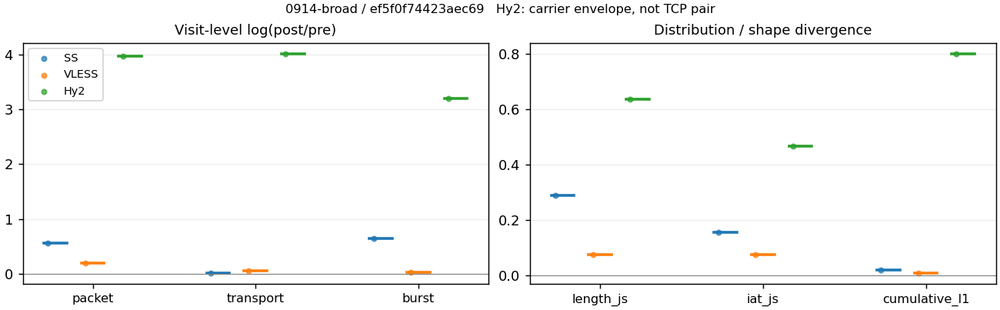
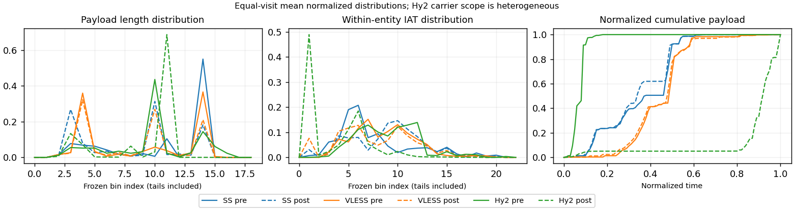

# 0914-broad · 条目 008 · wikipedia.org

目标：https://en.wikipedia.org/wiki/Computer_network

活动标签：wikipedia.org::page_load。选定访问 3 次。

[返回总索引](../../README.md) · [统计口径](../../methods.md)

## 覆盖与资格（每次访问均保留）

| 部署 | 重复 | 主请求路由 | 活动状态 | 代理比较 | DIRECT pre | 请求 proxy/direct/unresolved | 错误 |
| --- | --- | --- | --- | --- | --- | --- | --- |
| Hy2 | 1 | proxy | passed | 1 | 0 | 33/0/0 | [] |
| SS | 1 | proxy | passed | 1 | 0 | 33/0/0 | [] |
| VLESS | 1 | proxy | passed | 1 | 0 | 33/0/0 | [] |

主请求非 proxy 的统计仅解释为已索引的辅助代理连接或 DIRECT 观测，不代表目标业务经代理传输。播放确认与配对资格是两道不同的门。

图中散点为单次访问，短线为重复中位数；Hy2 是共享载体包络，不能与 TCP 配对作等范围因果对比。

形态图先逐访问归一化，再对访问等权平均；实线 pre，虚线 post。分箱序号及边界见 methods，不将分箱索引误解为长度或时间。

## 每次访问的关键观测

### SS

范围：`exclusive_page`。每格 pre → post；空值为不可观测/不适用。

| 重复 | 包数 | 载荷字节 | burst | TCP FR | IAT中位µs | length JS | IAT JS |
| --- | --- | --- | --- | --- | --- | --- | --- |
| 1 | 579 → 1012 | 6.2585e+05 → 6.3723e+05 | 389 → 737 | 46 → 48 | 37.355 → 444.35 | 0.28968 | 0.15524 |

完整标量统计：中位数 [min,max]；Δ 为重复内逐访问变换的中位数，MAD 未缩放。n 为可用变换数；DIRECT-only 的 nΔ=0 不代表 pre 不可用。

| scope | 特征 | pre | post | Δ | IQRΔ | MADΔ | nΔ |
| --- | --- | --- | --- | --- | --- | --- | --- |
| exclusive_page | active_span_sum_s_1000ms | 6.6563 [6.6563, 6.6563] | 7.6901 [7.6901, 7.6901] | 0.14436 | — | — | 1 |
| exclusive_page | active_span_sum_s_100ms | 1.9059 [1.9059, 1.9059] | 2.8982 [2.8982, 2.8982] | 0.41916 | — | — | 1 |
| exclusive_page | active_span_sum_s_500ms | 4.8611 [4.8611, 4.8611] | 5.7727 [5.7727, 5.7727] | 0.17188 | — | — | 1 |
| exclusive_page | burst_bytes_iqr | 2896 [2896, 2896] | 1428 [1428, 1428] | -0.70706 | — | — | 1 |
| exclusive_page | burst_bytes_mad | 58 [58, 58] | 34 [34, 34] | -0.53408 | — | — | 1 |
| exclusive_page | burst_bytes_max | 20922 [20922, 20922] | 8568 [8568, 8568] | -0.89277 | — | — | 1 |
| exclusive_page | burst_bytes_mean | 1608.9 [1608.9, 1608.9] | 864.63 [864.63, 864.63] | -0.62099 | — | — | 1 |
| exclusive_page | burst_bytes_median | 58 [58, 58] | 34 [34, 34] | -0.53408 | — | — | 1 |
| exclusive_page | burst_bytes_min | 0 [0, 0] | 0 [0, 0] | — | — | — | 0 |
| exclusive_page | burst_bytes_p95 | 8688 [8688, 8688] | 2930 [2930, 2930] | -1.0869 | — | — | 1 |
| exclusive_page | burst_bytes_q25 | 0 [0, 0] | 0 [0, 0] | — | — | — | 0 |
| exclusive_page | burst_bytes_q75 | 2896 [2896, 2896] | 1428 [1428, 1428] | -0.70706 | — | — | 1 |
| exclusive_page | burst_bytes_std | 2990.6 [2990.6, 2990.6] | 1325.7 [1325.7, 1325.7] | -0.81349 | — | — | 1 |
| exclusive_page | burst_count | 389 [389, 389] | 737 [737, 737] | 0.63901 | — | — | 1 |
| exclusive_page | burst_duration_ms_iqr | 0.023563 [0.023563, 0.023563] | 0 [0, 0] | — | — | — | 0 |
| exclusive_page | burst_duration_ms_mad | 0 [0, 0] | 0 [0, 0] | — | — | — | 0 |
| exclusive_page | burst_duration_ms_max | 3971.2 [3971.2, 3971.2] | 3972.9 [3972.9, 3972.9] | 0.00042574 | — | — | 1 |
| exclusive_page | burst_duration_ms_mean | 49.807 [49.807, 49.807] | 20.484 [20.484, 20.484] | -0.88852 | — | — | 1 |
| exclusive_page | burst_duration_ms_median | 0 [0, 0] | 0 [0, 0] | — | — | — | 0 |
| exclusive_page | burst_duration_ms_min | 0 [0, 0] | 0 [0, 0] | — | — | — | 0 |
| exclusive_page | burst_duration_ms_p95 | 95.774 [95.774, 95.774] | 3.0322 [3.0322, 3.0322] | -3.4527 | — | — | 1 |
| exclusive_page | burst_duration_ms_q25 | 0 [0, 0] | 0 [0, 0] | — | — | — | 0 |
| exclusive_page | burst_duration_ms_q75 | 0.023563 [0.023563, 0.023563] | 0 [0, 0] | — | — | — | 0 |
| exclusive_page | burst_duration_ms_std | 342.04 [342.04, 342.04] | 232.49 [232.49, 232.49] | -0.38609 | — | — | 1 |
| exclusive_page | burst_packets_iqr | 1 [1, 1] | 0 [0, 0] | — | — | — | 0 |
| exclusive_page | burst_packets_mad | 0 [0, 0] | 0 [0, 0] | — | — | — | 0 |
| exclusive_page | burst_packets_max | 11 [11, 11] | 7 [7, 7] | -0.45199 | — | — | 1 |
| exclusive_page | burst_packets_mean | 1.4884 [1.4884, 1.4884] | 1.3731 [1.3731, 1.3731] | -0.080627 | — | — | 1 |
| exclusive_page | burst_packets_median | 1 [1, 1] | 1 [1, 1] | 0 | — | — | 1 |
| exclusive_page | burst_packets_min | 1 [1, 1] | 1 [1, 1] | 0 | — | — | 1 |
| exclusive_page | burst_packets_p95 | 3.6 [3.6, 3.6] | 3 [3, 3] | -0.18232 | — | — | 1 |
| exclusive_page | burst_packets_q25 | 1 [1, 1] | 1 [1, 1] | 0 | — | — | 1 |
| exclusive_page | burst_packets_q75 | 2 [2, 2] | 1 [1, 1] | -0.69315 | — | — | 1 |
| exclusive_page | burst_packets_std | 1.077 [1.077, 1.077] | 0.81405 [0.81405, 0.81405] | -0.2799 | — | — | 1 |
| exclusive_page | connection_span_concurrency_max | 4 [4, 4] | 4 [4, 4] | 0 | — | — | 1 |
| exclusive_page | cumulative_l1 | — | — | 0.019954 | — | — | 1 |
| exclusive_page | cumulative_max | — | — | 0.14319 | — | — | 1 |
| exclusive_page | direction_entropy | 0.74398 [0.74398, 0.74398] | 0.50268 [0.50268, 0.50268] | -0.2413 | — | — | 1 |
| exclusive_page | down_burst_count | 192 [192, 192] | 366 [366, 366] | 0.64514 | — | — | 1 |
| exclusive_page | down_ip_bytes | 6.2434e+05 [6.2434e+05, 6.2434e+05] | 6.4453e+05 [6.4453e+05, 6.4453e+05] | 0.031829 | — | — | 1 |
| exclusive_page | down_packets | 339 [339, 339] | 566 [566, 566] | 0.51259 | — | — | 1 |
| exclusive_page | down_transport_bytes | 6.0667e+05 [6.0667e+05, 6.0667e+05] | 6.1506e+05 [6.1506e+05, 6.1506e+05] | 0.013731 | — | — | 1 |
| exclusive_page | duration_s | 6.3965 [6.3965, 6.3965] | 6.3959 [6.3959, 6.3959] | -0.0001023 | — | — | 1 |
| exclusive_page | entity_count | 5 [5, 5] | 5 [5, 5] | 0 | — | — | 1 |
| exclusive_page | fr_runs | 46 [46, 46] | 48 [48, 48] | 0.04256 | — | — | 1 |
| exclusive_page | fr_runs_per_packet | 0.1369 [0.1369, 0.1369] | 0.083189 [0.083189, 0.083189] | -0.053716 | — | — | 1 |
| exclusive_page | fr_switches | 41 [41, 41] | 43 [43, 43] | 0.047628 | — | — | 1 |
| exclusive_page | fr_switches_per_possible_transition | 0.12387 [0.12387, 0.12387] | 0.075175 [0.075175, 0.075175] | -0.048692 | — | — | 1 |
| exclusive_page | full_retransmission_fraction | 0.0017271 [0.0017271, 0.0017271] | 0.00098814 [0.00098814, 0.00098814] | -0.00073897 | — | — | 1 |
| exclusive_page | full_retransmission_packets | 1 [1, 1] | 1 [1, 1] | 0 | — | — | 1 |
| exclusive_page | iat_count | 574 [574, 574] | 1007 [1007, 1007] | 0.5621 | — | — | 1 |
| exclusive_page | iat_js | — | — | 0.15524 | — | — | 1 |
| exclusive_page | iat_ks | — | — | 0.33907 | — | — | 1 |
| exclusive_page | iat_median_us | 37.355 [37.355, 37.355] | 444.35 [444.35, 444.35] | 2.4761 | — | — | 1 |
| exclusive_page | iat_us_iqr | 377.45 [377.45, 377.45] | 1226.1 [1226.1, 1226.1] | 1.1781 | — | — | 1 |
| exclusive_page | iat_us_mad | 32.099 [32.099, 32.099] | 433.17 [433.17, 433.17] | 2.6023 | — | — | 1 |
| exclusive_page | iat_us_max | 3.9712e+06 [3.9712e+06, 3.9712e+06] | 3.9729e+06 [3.9729e+06, 3.9729e+06] | 0.00042461 | — | — | 1 |
| exclusive_page | iat_us_mean | 35730 [35730, 35730] | 20363 [20363, 20363] | -0.5623 | — | — | 1 |
| exclusive_page | iat_us_median | 37.355 [37.355, 37.355] | 444.35 [444.35, 444.35] | 2.4761 | — | — | 1 |
| exclusive_page | iat_us_min | 0.245 [0.245, 0.245] | 0.041 [0.041, 0.041] | -1.7877 | — | — | 1 |
| exclusive_page | iat_us_p95 | 43234 [43234, 43234] | 26808 [26808, 26808] | -0.47794 | — | — | 1 |
| exclusive_page | iat_us_q25 | 14.093 [14.093, 14.093] | 26.61 [26.61, 26.61] | 0.63561 | — | — | 1 |
| exclusive_page | iat_us_q75 | 391.54 [391.54, 391.54] | 1252.7 [1252.7, 1252.7] | 1.1629 | — | — | 1 |
| exclusive_page | iat_us_std | 2.8238e+05 [2.8238e+05, 2.8238e+05] | 2.1169e+05 [2.1169e+05, 2.1169e+05] | -0.28813 | — | — | 1 |
| exclusive_page | iat_wasserstein_log1p_us | — | — | 1.2085 | — | — | 1 |
| exclusive_page | idle_gap_count_1000ms | 5 [5, 5] | 4 [4, 4] | -0.22314 | — | — | 1 |
| exclusive_page | idle_gap_count_100ms | 19 [19, 19] | 19 [19, 19] | 0 | — | — | 1 |
| exclusive_page | idle_gap_count_500ms | 8 [8, 8] | 7 [7, 7] | -0.13353 | — | — | 1 |
| exclusive_page | idle_gap_sum_s_1000ms | 13.853 [13.853, 13.853] | 12.815 [12.815, 12.815] | -0.077871 | — | — | 1 |
| exclusive_page | idle_gap_sum_s_100ms | 18.603 [18.603, 18.603] | 17.607 [17.607, 17.607] | -0.055048 | — | — | 1 |
| exclusive_page | idle_gap_sum_s_500ms | 15.648 [15.648, 15.648] | 14.732 [14.732, 14.732] | -0.060299 | — | — | 1 |
| exclusive_page | ip_bytes | 6.5605e+05 [6.5605e+05, 6.5605e+05] | 6.968e+05 [6.968e+05, 6.968e+05] | 0.060266 | — | — | 1 |
| exclusive_page | length_iqr | 2465 [2465, 2465] | 1388 [1388, 1388] | -0.57433 | — | — | 1 |
| exclusive_page | length_js | — | — | 0.28968 | — | — | 1 |
| exclusive_page | length_ks | — | — | 0.50249 | — | — | 1 |
| exclusive_page | length_mad | 0 [0, 0] | 1336 [1336, 1336] | — | — | — | 0 |
| exclusive_page | length_max | 2896 [2896, 2896] | 4284 [4284, 4284] | 0.39156 | — | — | 1 |
| exclusive_page | length_mean | 1862.6 [1862.6, 1862.6] | 1104.4 [1104.4, 1104.4] | -0.52271 | — | — | 1 |
| exclusive_page | length_median | 2896 [2896, 2896] | 1428 [1428, 1428] | -0.70706 | — | — | 1 |
| exclusive_page | length_min | 31 [31, 31] | 20 [20, 20] | -0.43825 | — | — | 1 |
| exclusive_page | length_p95 | 2896 [2896, 2896] | 2856 [2856, 2856] | -0.013908 | — | — | 1 |
| exclusive_page | length_q25 | 431 [431, 431] | 40 [40, 40] | -2.3772 | — | — | 1 |
| exclusive_page | length_q75 | 2896 [2896, 2896] | 1428 [1428, 1428] | -0.70706 | — | — | 1 |
| exclusive_page | length_std | 1194.9 [1194.9, 1194.9] | 1025.9 [1025.9, 1025.9] | -0.15252 | — | — | 1 |
| exclusive_page | length_wasserstein_bytes | — | — | 763.47 | — | — | 1 |
| exclusive_page | nonempty_entity_count | 5 [5, 5] | 5 [5, 5] | 0 | — | — | 1 |
| exclusive_page | nonempty_packets | 336 [336, 336] | 577 [577, 577] | 0.54073 | — | — | 1 |
| exclusive_page | offload_suspect_fraction | 0.33506 [0.33506, 0.33506] | 0.12253 [0.12253, 0.12253] | -0.21253 | — | — | 1 |
| exclusive_page | packet_count | 579 [579, 579] | 1012 [1012, 1012] | 0.55838 | — | — | 1 |
| exclusive_page | rtt_median_ms | 0.06797 [0.06797, 0.06797] | 27.403 [27.403, 27.403] | 5.9993 | — | — | 1 |
| exclusive_page | rtt_sample_count | 234 [234, 234] | 190 [190, 190] | -0.2083 | — | — | 1 |
| exclusive_page | tcp_ack_count | 574 [574, 574] | 1007 [1007, 1007] | 0.5621 | — | — | 1 |
| exclusive_page | tcp_fin_count | 10 [10, 10] | 10 [10, 10] | 0 | — | — | 1 |
| exclusive_page | tcp_packet_count | 579 [579, 579] | 1012 [1012, 1012] | 0.55838 | — | — | 1 |
| exclusive_page | tcp_rst_count | 0 [0, 0] | 0 [0, 0] | — | — | — | 0 |
| exclusive_page | tcp_syn_count | 10 [10, 10] | 10 [10, 10] | 0 | — | — | 1 |
| exclusive_page | tcp_window_raw_median | 65535 [65535, 65535] | 135 [135, 135] | -6.1851 | — | — | 1 |
| exclusive_page | transition_entropy | 0.48007 [0.48007, 0.48007] | 0.31128 [0.31128, 0.31128] | -0.1688 | — | — | 1 |
| exclusive_page | transition_n_mm | 242 [242, 242] | 489 [489, 489] | 0.70342 | — | — | 1 |
| exclusive_page | transition_n_mp | 18 [18, 18] | 19 [19, 19] | 0.054067 | — | — | 1 |
| exclusive_page | transition_n_pm | 23 [23, 23] | 24 [24, 24] | 0.04256 | — | — | 1 |
| exclusive_page | transition_n_pp | 48 [48, 48] | 40 [40, 40] | -0.18232 | — | — | 1 |
| exclusive_page | transition_p_mm | 0.93077 [0.93077, 0.93077] | 0.9626 [0.9626, 0.9626] | 0.031829 | — | — | 1 |
| exclusive_page | transition_p_mp | 0.069231 [0.069231, 0.069231] | 0.037402 [0.037402, 0.037402] | -0.031829 | — | — | 1 |
| exclusive_page | transition_p_pm | 0.32394 [0.32394, 0.32394] | 0.375 [0.375, 0.375] | 0.051056 | — | — | 1 |
| exclusive_page | transition_p_pp | 0.67606 [0.67606, 0.67606] | 0.625 [0.625, 0.625] | -0.051056 | — | — | 1 |
| exclusive_page | transport_bytes | 6.2585e+05 [6.2585e+05, 6.2585e+05] | 6.3723e+05 [6.3723e+05, 6.3723e+05] | 0.018022 | — | — | 1 |
| exclusive_page | up_burst_count | 197 [197, 197] | 371 [371, 371] | 0.633 | — | — | 1 |
| exclusive_page | up_byte_fraction | 0.03064 [0.03064, 0.03064] | 0.03479 [0.03479, 0.03479] | 0.0041497 | — | — | 1 |
| exclusive_page | up_ip_bytes | 31708 [31708, 31708] | 52269 [52269, 52269] | 0.49983 | — | — | 1 |
| exclusive_page | up_packets | 240 [240, 240] | 446 [446, 446] | 0.61968 | — | — | 1 |
| exclusive_page | up_transport_bytes | 19176 [19176, 19176] | 22169 [22169, 22169] | 0.14504 | — | — | 1 |
| exclusive_page | zero_iat_count | 0 [0, 0] | 0 [0, 0] | — | — | — | 0 |
| exclusive_page | zero_iat_fraction | 0 [0, 0] | 0 [0, 0] | 0 | — | — | 1 |

### VLESS

范围：`exclusive_page`。每格 pre → post；空值为不可观测/不适用。

| 重复 | 包数 | 载荷字节 | burst | TCP FR | IAT中位µs | length JS | IAT JS |
| --- | --- | --- | --- | --- | --- | --- | --- |
| 1 | 849 → 1032 | 6.1044e+05 → 6.4236e+05 | 708 → 726 | 43 → 52 | 187.31 → 98.535 | 0.076885 | 0.076034 |

完整标量统计：中位数 [min,max]；Δ 为重复内逐访问变换的中位数，MAD 未缩放。n 为可用变换数；DIRECT-only 的 nΔ=0 不代表 pre 不可用。

| scope | 特征 | pre | post | Δ | IQRΔ | MADΔ | nΔ |
| --- | --- | --- | --- | --- | --- | --- | --- |
| exclusive_page | active_span_sum_s_1000ms | 7.2955 [7.2955, 7.2955] | 6.0892 [6.0892, 6.0892] | -0.18075 | — | — | 1 |
| exclusive_page | active_span_sum_s_100ms | 1.4923 [1.4923, 1.4923] | 2.7973 [2.7973, 2.7973] | 0.62834 | — | — | 1 |
| exclusive_page | active_span_sum_s_500ms | 3.4739 [3.4739, 3.4739] | 6.0892 [6.0892, 6.0892] | 0.56122 | — | — | 1 |
| exclusive_page | burst_bytes_iqr | 1806.2 [1806.2, 1806.2] | 1545.5 [1545.5, 1545.5] | -0.15591 | — | — | 1 |
| exclusive_page | burst_bytes_mad | 64 [64, 64] | 72 [72, 72] | 0.11778 | — | — | 1 |
| exclusive_page | burst_bytes_max | 5792 [5792, 5792] | 5792 [5792, 5792] | 0 | — | — | 1 |
| exclusive_page | burst_bytes_mean | 862.21 [862.21, 862.21] | 884.8 [884.8, 884.8] | 0.025864 | — | — | 1 |
| exclusive_page | burst_bytes_median | 64 [64, 64] | 72 [72, 72] | 0.11778 | — | — | 1 |
| exclusive_page | burst_bytes_min | 0 [0, 0] | 0 [0, 0] | — | — | — | 0 |
| exclusive_page | burst_bytes_p95 | 2896 [2896, 2896] | 2896 [2896, 2896] | 0 | — | — | 1 |
| exclusive_page | burst_bytes_q25 | 0 [0, 0] | 0 [0, 0] | — | — | — | 0 |
| exclusive_page | burst_bytes_q75 | 1806.2 [1806.2, 1806.2] | 1545.5 [1545.5, 1545.5] | -0.15591 | — | — | 1 |
| exclusive_page | burst_bytes_std | 1271.4 [1271.4, 1271.4] | 1206.6 [1206.6, 1206.6] | -0.052302 | — | — | 1 |
| exclusive_page | burst_count | 708 [708, 708] | 726 [726, 726] | 0.025106 | — | — | 1 |
| exclusive_page | burst_duration_ms_iqr | 0 [0, 0] | 0.00018725 [0.00018725, 0.00018725] | — | — | — | 0 |
| exclusive_page | burst_duration_ms_mad | 0 [0, 0] | 0 [0, 0] | — | — | — | 0 |
| exclusive_page | burst_duration_ms_max | 1159.5 [1159.5, 1159.5] | 1200.9 [1200.9, 1200.9] | 0.035034 | — | — | 1 |
| exclusive_page | burst_duration_ms_mean | 10.08 [10.08, 10.08] | 8.5391 [8.5391, 8.5391] | -0.16587 | — | — | 1 |
| exclusive_page | burst_duration_ms_median | 0 [0, 0] | 0 [0, 0] | — | — | — | 0 |
| exclusive_page | burst_duration_ms_min | 0 [0, 0] | 0 [0, 0] | — | — | — | 0 |
| exclusive_page | burst_duration_ms_p95 | 2.3955 [2.3955, 2.3955] | 9.7061 [9.7061, 9.7061] | 1.3992 | — | — | 1 |
| exclusive_page | burst_duration_ms_q25 | 0 [0, 0] | 0 [0, 0] | — | — | — | 0 |
| exclusive_page | burst_duration_ms_q75 | 0 [0, 0] | 0.00018725 [0.00018725, 0.00018725] | — | — | — | 0 |
| exclusive_page | burst_duration_ms_std | 81.015 [81.015, 81.015] | 66.197 [66.197, 66.197] | -0.20201 | — | — | 1 |
| exclusive_page | burst_packets_iqr | 0 [0, 0] | 1 [1, 1] | — | — | — | 0 |
| exclusive_page | burst_packets_mad | 0 [0, 0] | 0 [0, 0] | — | — | — | 0 |
| exclusive_page | burst_packets_max | 7 [7, 7] | 7 [7, 7] | 0 | — | — | 1 |
| exclusive_page | burst_packets_mean | 1.1992 [1.1992, 1.1992] | 1.4215 [1.4215, 1.4215] | 0.17009 | — | — | 1 |
| exclusive_page | burst_packets_median | 1 [1, 1] | 1 [1, 1] | 0 | — | — | 1 |
| exclusive_page | burst_packets_min | 1 [1, 1] | 1 [1, 1] | 0 | — | — | 1 |
| exclusive_page | burst_packets_p95 | 2 [2, 2] | 3 [3, 3] | 0.40547 | — | — | 1 |
| exclusive_page | burst_packets_q25 | 1 [1, 1] | 1 [1, 1] | 0 | — | — | 1 |
| exclusive_page | burst_packets_q75 | 1 [1, 1] | 2 [2, 2] | 0.69315 | — | — | 1 |
| exclusive_page | burst_packets_std | 0.51656 [0.51656, 0.51656] | 0.84062 [0.84062, 0.84062] | 0.48695 | — | — | 1 |
| exclusive_page | connection_span_concurrency_max | 4 [4, 4] | 4 [4, 4] | 0 | — | — | 1 |
| exclusive_page | cumulative_l1 | — | — | 0.010536 | — | — | 1 |
| exclusive_page | cumulative_max | — | — | 0.085176 | — | — | 1 |
| exclusive_page | direction_entropy | 0.53341 [0.53341, 0.53341] | 0.46331 [0.46331, 0.46331] | -0.070099 | — | — | 1 |
| exclusive_page | down_burst_count | 352 [352, 352] | 361 [361, 361] | 0.025247 | — | — | 1 |
| exclusive_page | down_ip_bytes | 6.1845e+05 [6.1845e+05, 6.1845e+05] | 6.48e+05 [6.48e+05, 6.48e+05] | 0.046673 | — | — | 1 |
| exclusive_page | down_packets | 455 [455, 455] | 562 [562, 562] | 0.2112 | — | — | 1 |
| exclusive_page | down_transport_bytes | 5.9476e+05 [5.9476e+05, 5.9476e+05] | 6.1874e+05 [6.1874e+05, 6.1874e+05] | 0.039535 | — | — | 1 |
| exclusive_page | duration_s | 3.6655 [3.6655, 3.6655] | 3.6149 [3.6149, 3.6149] | -0.013911 | — | — | 1 |
| exclusive_page | entity_count | 4 [4, 4] | 4 [4, 4] | 0 | — | — | 1 |
| exclusive_page | fr_runs | 43 [43, 43] | 52 [52, 52] | 0.19004 | — | — | 1 |
| exclusive_page | fr_runs_per_packet | 0.094923 [0.094923, 0.094923] | 0.092857 [0.092857, 0.092857] | -0.0020656 | — | — | 1 |
| exclusive_page | fr_switches | 39 [39, 39] | 48 [48, 48] | 0.20764 | — | — | 1 |
| exclusive_page | fr_switches_per_possible_transition | 0.08686 [0.08686, 0.08686] | 0.086331 [0.086331, 0.086331] | -0.00052875 | — | — | 1 |
| exclusive_page | full_retransmission_fraction | 0.0011779 [0.0011779, 0.0011779] | 0 [0, 0] | -0.0011779 | — | — | 1 |
| exclusive_page | full_retransmission_packets | 1 [1, 1] | 0 [0, 0] | — | — | — | 0 |
| exclusive_page | iat_count | 845 [845, 845] | 1028 [1028, 1028] | 0.19603 | — | — | 1 |
| exclusive_page | iat_js | — | — | 0.076034 | — | — | 1 |
| exclusive_page | iat_ks | — | — | 0.17748 | — | — | 1 |
| exclusive_page | iat_median_us | 187.31 [187.31, 187.31] | 98.535 [98.535, 98.535] | -0.64237 | — | — | 1 |
| exclusive_page | iat_us_iqr | 995.05 [995.05, 995.05] | 1033.8 [1033.8, 1033.8] | 0.03821 | — | — | 1 |
| exclusive_page | iat_us_mad | 180.46 [180.46, 180.46] | 98.34 [98.34, 98.34] | -0.60709 | — | — | 1 |
| exclusive_page | iat_us_max | 1.1595e+06 [1.1595e+06, 1.1595e+06] | 1.2009e+06 [1.2009e+06, 1.2009e+06] | 0.035034 | — | — | 1 |
| exclusive_page | iat_us_mean | 10006 [10006, 10006] | 8089.3 [8089.3, 8089.3] | -0.21264 | — | — | 1 |
| exclusive_page | iat_us_median | 187.31 [187.31, 187.31] | 98.535 [98.535, 98.535] | -0.64237 | — | — | 1 |
| exclusive_page | iat_us_min | 2.495 [2.495, 2.495] | 0.035 [0.035, 0.035] | -4.2667 | — | — | 1 |
| exclusive_page | iat_us_p95 | 9859.9 [9859.9, 9859.9] | 29102 [29102, 29102] | 1.0823 | — | — | 1 |
| exclusive_page | iat_us_q25 | 43.516 [43.516, 43.516] | 13.41 [13.41, 13.41] | -1.1771 | — | — | 1 |
| exclusive_page | iat_us_q75 | 1038.6 [1038.6, 1038.6] | 1047.2 [1047.2, 1047.2] | 0.0082945 | — | — | 1 |
| exclusive_page | iat_us_std | 74467 [74467, 74467] | 56091 [56091, 56091] | -0.28337 | — | — | 1 |
| exclusive_page | iat_wasserstein_log1p_us | — | — | 0.63542 | — | — | 1 |
| exclusive_page | idle_gap_count_1000ms | 1 [1, 1] | 2 [2, 2] | 0.69315 | — | — | 1 |
| exclusive_page | idle_gap_count_100ms | 16 [16, 16] | 20 [20, 20] | 0.22314 | — | — | 1 |
| exclusive_page | idle_gap_count_500ms | 6 [6, 6] | 2 [2, 2] | -1.0986 | — | — | 1 |
| exclusive_page | idle_gap_sum_s_1000ms | 1.1595 [1.1595, 1.1595] | 2.2267 [2.2267, 2.2267] | 0.65248 | — | — | 1 |
| exclusive_page | idle_gap_sum_s_100ms | 6.9628 [6.9628, 6.9628] | 5.5186 [5.5186, 5.5186] | -0.23246 | — | — | 1 |
| exclusive_page | idle_gap_sum_s_500ms | 4.9811 [4.9811, 4.9811] | 2.2267 [2.2267, 2.2267] | -0.80514 | — | — | 1 |
| exclusive_page | ip_bytes | 6.5461e+05 [6.5461e+05, 6.5461e+05] | 6.9698e+05 [6.9698e+05, 6.9698e+05] | 0.062722 | — | — | 1 |
| exclusive_page | length_iqr | 2752 [2752, 2752] | 1376 [1376, 1376] | -0.69315 | — | — | 1 |
| exclusive_page | length_js | — | — | 0.076885 | — | — | 1 |
| exclusive_page | length_ks | — | — | 0.19014 | — | — | 1 |
| exclusive_page | length_mad | 1298 [1298, 1298] | 1340 [1340, 1340] | 0.031845 | — | — | 1 |
| exclusive_page | length_max | 5792 [5792, 5792] | 2896 [2896, 2896] | -0.69315 | — | — | 1 |
| exclusive_page | length_mean | 1347.6 [1347.6, 1347.6] | 1147.1 [1147.1, 1147.1] | -0.16107 | — | — | 1 |
| exclusive_page | length_median | 1370 [1370, 1370] | 1412 [1412, 1412] | 0.030196 | — | — | 1 |
| exclusive_page | length_min | 2 [2, 2] | 2 [2, 2] | 0 | — | — | 1 |
| exclusive_page | length_p95 | 2896 [2896, 2896] | 2824 [2824, 2824] | -0.025176 | — | — | 1 |
| exclusive_page | length_q25 | 72 [72, 72] | 72 [72, 72] | 0 | — | — | 1 |
| exclusive_page | length_q75 | 2824 [2824, 2824] | 1448 [1448, 1448] | -0.66797 | — | — | 1 |
| exclusive_page | length_std | 1274.1 [1274.1, 1274.1] | 1043.2 [1043.2, 1043.2] | -0.20003 | — | — | 1 |
| exclusive_page | length_wasserstein_bytes | — | — | 289.31 | — | — | 1 |
| exclusive_page | nonempty_entity_count | 4 [4, 4] | 4 [4, 4] | 0 | — | — | 1 |
| exclusive_page | nonempty_packets | 453 [453, 453] | 560 [560, 560] | 0.21204 | — | — | 1 |
| exclusive_page | offload_suspect_fraction | 0.21673 [0.21673, 0.21673] | 0.125 [0.125, 0.125] | -0.091726 | — | — | 1 |
| exclusive_page | packet_count | 849 [849, 849] | 1032 [1032, 1032] | 0.19519 | — | — | 1 |
| exclusive_page | rtt_median_ms | 0.0651 [0.0651, 0.0651] | 0.051778 [0.051778, 0.051778] | -0.22896 | — | — | 1 |
| exclusive_page | rtt_sample_count | 383 [383, 383] | 420 [420, 420] | 0.09222 | — | — | 1 |
| exclusive_page | tcp_ack_count | 840 [840, 840] | 1028 [1028, 1028] | 0.20197 | — | — | 1 |
| exclusive_page | tcp_fin_count | 7 [7, 7] | 8 [8, 8] | 0.13353 | — | — | 1 |
| exclusive_page | tcp_packet_count | 849 [849, 849] | 1032 [1032, 1032] | 0.19519 | — | — | 1 |
| exclusive_page | tcp_rst_count | 5 [5, 5] | 0 [0, 0] | — | — | — | 0 |
| exclusive_page | tcp_syn_count | 8 [8, 8] | 8 [8, 8] | 0 | — | — | 1 |
| exclusive_page | tcp_window_raw_median | 65504 [65504, 65504] | 178 [178, 178] | -5.9081 | — | — | 1 |
| exclusive_page | transition_entropy | 0.35107 [0.35107, 0.35107] | 0.33294 [0.33294, 0.33294] | -0.018129 | — | — | 1 |
| exclusive_page | transition_n_mm | 377 [377, 377] | 479 [479, 479] | 0.23946 | — | — | 1 |
| exclusive_page | transition_n_mp | 18 [18, 18] | 22 [22, 22] | 0.20067 | — | — | 1 |
| exclusive_page | transition_n_pm | 21 [21, 21] | 26 [26, 26] | 0.21357 | — | — | 1 |
| exclusive_page | transition_n_pp | 33 [33, 33] | 29 [29, 29] | -0.12921 | — | — | 1 |
| exclusive_page | transition_p_mm | 0.95443 [0.95443, 0.95443] | 0.95609 [0.95609, 0.95609] | 0.0016574 | — | — | 1 |
| exclusive_page | transition_p_mp | 0.04557 [0.04557, 0.04557] | 0.043912 [0.043912, 0.043912] | -0.0016574 | — | — | 1 |
| exclusive_page | transition_p_pm | 0.38889 [0.38889, 0.38889] | 0.47273 [0.47273, 0.47273] | 0.083838 | — | — | 1 |
| exclusive_page | transition_p_pp | 0.61111 [0.61111, 0.61111] | 0.52727 [0.52727, 0.52727] | -0.083838 | — | — | 1 |
| exclusive_page | transport_bytes | 6.1044e+05 [6.1044e+05, 6.1044e+05] | 6.4236e+05 [6.4236e+05, 6.4236e+05] | 0.05097 | — | — | 1 |
| exclusive_page | up_burst_count | 356 [356, 356] | 365 [365, 365] | 0.024967 | — | — | 1 |
| exclusive_page | up_byte_fraction | 0.025694 [0.025694, 0.025694] | 0.036772 [0.036772, 0.036772] | 0.011078 | — | — | 1 |
| exclusive_page | up_ip_bytes | 36157 [36157, 36157] | 48981 [48981, 48981] | 0.30356 | — | — | 1 |
| exclusive_page | up_packets | 394 [394, 394] | 470 [470, 470] | 0.17638 | — | — | 1 |
| exclusive_page | up_transport_bytes | 15685 [15685, 15685] | 23621 [23621, 23621] | 0.40943 | — | — | 1 |
| exclusive_page | zero_iat_count | 0 [0, 0] | 0 [0, 0] | — | — | — | 0 |
| exclusive_page | zero_iat_fraction | 0 [0, 0] | 0 [0, 0] | 0 | — | — | 1 |

### Hy2

范围：`carrier_context_envelope`。每格 pre → post；空值为不可观测/不适用。

| 重复 | 包数 | 载荷字节 | burst | TCP FR | IAT中位µs | length JS | IAT JS |
| --- | --- | --- | --- | --- | --- | --- | --- |
| 1 | 581 → 30685 | 6.1464e+05 → 3.3896e+07 | 395 → 9690 | — | 316.59 → 2.406 | 0.63646 | 0.46697 |

完整标量统计：中位数 [min,max]；Δ 为重复内逐访问变换的中位数，MAD 未缩放。n 为可用变换数；DIRECT-only 的 nΔ=0 不代表 pre 不可用。

| scope | 特征 | pre | post | Δ | IQRΔ | MADΔ | nΔ |
| --- | --- | --- | --- | --- | --- | --- | --- |
| carrier_context_envelope | active_span_sum_s_1000ms | 4.0378 [4.0378, 4.0378] | 7.1315 [7.1315, 7.1315] | 0.56882 | — | — | 1 |
| carrier_context_envelope | active_span_sum_s_100ms | 1.2126 [1.2126, 1.2126] | 4.9615 [4.9615, 4.9615] | 1.4089 | — | — | 1 |
| carrier_context_envelope | active_span_sum_s_500ms | 4.0378 [4.0378, 4.0378] | 7.1315 [7.1315, 7.1315] | 0.56882 | — | — | 1 |
| carrier_context_envelope | burst_bytes_iqr | 2768 [2768, 2768] | 5131 [5131, 5131] | 0.61718 | — | — | 1 |
| carrier_context_envelope | burst_bytes_mad | 64 [64, 64] | 351.5 [351.5, 351.5] | 1.7033 | — | — | 1 |
| carrier_context_envelope | burst_bytes_max | 20480 [20480, 20480] | 4.3698e+05 [4.3698e+05, 4.3698e+05] | 3.0604 | — | — | 1 |
| carrier_context_envelope | burst_bytes_mean | 1556 [1556, 1556] | 3498 [3498, 3498] | 0.81004 | — | — | 1 |
| carrier_context_envelope | burst_bytes_median | 64 [64, 64] | 384.5 [384.5, 384.5] | 1.7931 | — | — | 1 |
| carrier_context_envelope | burst_bytes_min | 0 [0, 0] | 22 [22, 22] | — | — | — | 0 |
| carrier_context_envelope | burst_bytes_p95 | 6398.6 [6398.6, 6398.6] | 11528 [11528, 11528] | 0.5887 | — | — | 1 |
| carrier_context_envelope | burst_bytes_q25 | 0 [0, 0] | 37 [37, 37] | — | — | — | 0 |
| carrier_context_envelope | burst_bytes_q75 | 2768 [2768, 2768] | 5168 [5168, 5168] | 0.62436 | — | — | 1 |
| carrier_context_envelope | burst_bytes_std | 2820.7 [2820.7, 2820.7] | 9497.9 [9497.9, 9497.9] | 1.2141 | — | — | 1 |
| carrier_context_envelope | burst_count | 395 [395, 395] | 9690 [9690, 9690] | 3.2 | — | — | 1 |
| carrier_context_envelope | burst_duration_ms_iqr | 0.9063 [0.9063, 0.9063] | 0.02628 [0.02628, 0.02628] | -3.5405 | — | — | 1 |
| carrier_context_envelope | burst_duration_ms_mad | 0 [0, 0] | 4.9e-05 [4.9e-05, 4.9e-05] | — | — | — | 0 |
| carrier_context_envelope | burst_duration_ms_max | 12242 [12242, 12242] | 374.42 [374.42, 374.42] | -3.4873 | — | — | 1 |
| carrier_context_envelope | burst_duration_ms_mean | 69.078 [69.078, 69.078] | 0.2875 [0.2875, 0.2875] | -5.4818 | — | — | 1 |
| carrier_context_envelope | burst_duration_ms_median | 0 [0, 0] | 4.9e-05 [4.9e-05, 4.9e-05] | — | — | — | 0 |
| carrier_context_envelope | burst_duration_ms_min | 0 [0, 0] | 0 [0, 0] | — | — | — | 0 |
| carrier_context_envelope | burst_duration_ms_p95 | 15.13 [15.13, 15.13] | 0.15703 [0.15703, 0.15703] | -4.568 | — | — | 1 |
| carrier_context_envelope | burst_duration_ms_q25 | 0 [0, 0] | 0 [0, 0] | — | — | — | 0 |
| carrier_context_envelope | burst_duration_ms_q75 | 0.9063 [0.9063, 0.9063] | 0.02628 [0.02628, 0.02628] | -3.5405 | — | — | 1 |
| carrier_context_envelope | burst_duration_ms_std | 854.22 [854.22, 854.22] | 5.5922 [5.5922, 5.5922] | -5.0288 | — | — | 1 |
| carrier_context_envelope | burst_packets_iqr | 1 [1, 1] | 3 [3, 3] | 1.0986 | — | — | 1 |
| carrier_context_envelope | burst_packets_mad | 0 [0, 0] | 1 [1, 1] | — | — | — | 0 |
| carrier_context_envelope | burst_packets_max | 10 [10, 10] | 314 [314, 314] | 3.4468 | — | — | 1 |
| carrier_context_envelope | burst_packets_mean | 1.4709 [1.4709, 1.4709] | 3.1667 [3.1667, 3.1667] | 0.76681 | — | — | 1 |
| carrier_context_envelope | burst_packets_median | 1 [1, 1] | 2 [2, 2] | 0.69315 | — | — | 1 |
| carrier_context_envelope | burst_packets_min | 1 [1, 1] | 1 [1, 1] | 0 | — | — | 1 |
| carrier_context_envelope | burst_packets_p95 | 2.3 [2.3, 2.3] | 8 [8, 8] | 1.2465 | — | — | 1 |
| carrier_context_envelope | burst_packets_q25 | 1 [1, 1] | 1 [1, 1] | 0 | — | — | 1 |
| carrier_context_envelope | burst_packets_q75 | 2 [2, 2] | 4 [4, 4] | 0.69315 | — | — | 1 |
| carrier_context_envelope | burst_packets_std | 0.82126 [0.82126, 0.82126] | 6.6643 [6.6643, 6.6643] | 2.0937 | — | — | 1 |
| carrier_context_envelope | connection_span_concurrency_max | 3 [3, 3] | 1 [1, 1] | -1.0986 | — | — | 1 |
| carrier_context_envelope | cumulative_l1 | — | — | 0.79955 | — | — | 1 |
| carrier_context_envelope | cumulative_max | — | — | 0.94954 | — | — | 1 |
| carrier_context_envelope | direction_entropy | 0.64553 [0.64553, 0.64553] | 0.72821 [0.72821, 0.72821] | 0.082676 | — | — | 1 |
| carrier_context_envelope | direction_run_analog_runs | 49 [49, 49] | 9690 [9690, 9690] | 5.287 | — | — | 1 |
| carrier_context_envelope | direction_run_analog_runs_per_packet | 0.14162 [0.14162, 0.14162] | 0.31579 [0.31579, 0.31579] | 0.17417 | — | — | 1 |
| carrier_context_envelope | direction_run_analog_switches | 44 [44, 44] | 9689 [9689, 9689] | 5.3946 | — | — | 1 |
| carrier_context_envelope | direction_run_analog_switches_per_possible_transition | 0.12903 [0.12903, 0.12903] | 0.31577 [0.31577, 0.31577] | 0.18673 | — | — | 1 |
| carrier_context_envelope | down_burst_count | 195 [195, 195] | 4845 [4845, 4845] | 3.2127 | — | — | 1 |
| carrier_context_envelope | down_ip_bytes | 6.1483e+05 [6.1483e+05, 6.1483e+05] | 3.4161e+07 [3.4161e+07, 3.4161e+07] | 4.0175 | — | — | 1 |
| carrier_context_envelope | down_packets | 353 [353, 353] | 24451 [24451, 24451] | 4.238 | — | — | 1 |
| carrier_context_envelope | down_transport_bytes | 5.9643e+05 [5.9643e+05, 5.9643e+05] | 3.3477e+07 [3.3477e+07, 3.3477e+07] | 4.0276 | — | — | 1 |
| carrier_context_envelope | duration_s | 14.379 [14.379, 14.379] | 14.379 [14.379, 14.379] | -5.7003e-05 | — | — | 1 |
| carrier_context_envelope | entity_count | 5 [5, 5] | 1 [1, 1] | -1.6094 | — | — | 1 |
| carrier_context_envelope | full_retransmission_fraction | 0 [0, 0] | — | — | — | — | 0 |
| carrier_context_envelope | full_retransmission_packets | 0 [0, 0] | — | — | — | — | 0 |
| carrier_context_envelope | iat_count | 576 [576, 576] | 30684 [30684, 30684] | 3.9754 | — | — | 1 |
| carrier_context_envelope | iat_js | — | — | 0.46697 | — | — | 1 |
| carrier_context_envelope | iat_ks | — | — | 0.65481 | — | — | 1 |
| carrier_context_envelope | iat_median_us | 316.59 [316.59, 316.59] | 2.406 [2.406, 2.406] | -4.8797 | — | — | 1 |
| carrier_context_envelope | iat_us_iqr | 1436.4 [1436.4, 1436.4] | 25.999 [25.999, 25.999] | -4.0119 | — | — | 1 |
| carrier_context_envelope | iat_us_mad | 304.69 [304.69, 304.69] | 2.37 [2.37, 2.37] | -4.8564 | — | — | 1 |
| carrier_context_envelope | iat_us_max | 1.2242e+07 [1.2242e+07, 1.2242e+07] | 5.846e+06 [5.846e+06, 5.846e+06] | -0.73913 | — | — | 1 |
| carrier_context_envelope | iat_us_mean | 48771 [48771, 48771] | 468.6 [468.6, 468.6] | -4.6451 | — | — | 1 |
| carrier_context_envelope | iat_us_median | 316.59 [316.59, 316.59] | 2.406 [2.406, 2.406] | -4.8797 | — | — | 1 |
| carrier_context_envelope | iat_us_min | 1.775 [1.775, 1.775] | 0.001 [0.001, 0.001] | -7.4816 | — | — | 1 |
| carrier_context_envelope | iat_us_p95 | 22068 [22068, 22068] | 236.06 [236.06, 236.06] | -4.5378 | — | — | 1 |
| carrier_context_envelope | iat_us_q25 | 53.563 [53.563, 53.563] | 0.047 [0.047, 0.047] | -7.0385 | — | — | 1 |
| carrier_context_envelope | iat_us_q75 | 1490 [1490, 1490] | 26.046 [26.046, 26.046] | -4.0467 | — | — | 1 |
| carrier_context_envelope | iat_us_std | 7.0806e+05 [7.0806e+05, 7.0806e+05] | 34536 [34536, 34536] | -3.0205 | — | — | 1 |
| carrier_context_envelope | iat_wasserstein_log1p_us | — | — | 3.9441 | — | — | 1 |
| carrier_context_envelope | idle_gap_count_1000ms | 2 [2, 2] | 2 [2, 2] | 0 | — | — | 1 |
| carrier_context_envelope | idle_gap_count_100ms | 15 [15, 15] | 16 [16, 16] | 0.064539 | — | — | 1 |
| carrier_context_envelope | idle_gap_count_500ms | 2 [2, 2] | 2 [2, 2] | 0 | — | — | 1 |
| carrier_context_envelope | idle_gap_sum_s_1000ms | 24.054 [24.054, 24.054] | 7.247 [7.247, 7.247] | -1.1997 | — | — | 1 |
| carrier_context_envelope | idle_gap_sum_s_100ms | 26.88 [26.88, 26.88] | 9.4171 [9.4171, 9.4171] | -1.0488 | — | — | 1 |
| carrier_context_envelope | idle_gap_sum_s_500ms | 24.054 [24.054, 24.054] | 7.247 [7.247, 7.247] | -1.1997 | — | — | 1 |
| carrier_context_envelope | ip_bytes | 6.4493e+05 [6.4493e+05, 6.4493e+05] | 3.4755e+07 [3.4755e+07, 3.4755e+07] | 3.9869 | — | — | 1 |
| carrier_context_envelope | length_iqr | 524.75 [524.75, 524.75] | 596 [596, 596] | 0.12732 | — | — | 1 |
| carrier_context_envelope | length_js | — | — | 0.63646 | — | — | 1 |
| carrier_context_envelope | length_ks | — | — | 0.43353 | — | — | 1 |
| carrier_context_envelope | length_mad | 329.5 [329.5, 329.5] | 0 [0, 0] | — | — | — | 0 |
| carrier_context_envelope | length_max | 8920 [8920, 8920] | 1441 [1441, 1441] | -1.823 | — | — | 1 |
| carrier_context_envelope | length_mean | 1776.4 [1776.4, 1776.4] | 1104.6 [1104.6, 1104.6] | -0.47508 | — | — | 1 |
| carrier_context_envelope | length_median | 1405 [1405, 1405] | 1441 [1441, 1441] | 0.0253 | — | — | 1 |
| carrier_context_envelope | length_min | 31 [31, 31] | 22 [22, 22] | -0.34294 | — | — | 1 |
| carrier_context_envelope | length_p95 | 6560.2 [6560.2, 6560.2] | 1441 [1441, 1441] | -1.5157 | — | — | 1 |
| carrier_context_envelope | length_q25 | 1015.8 [1015.8, 1015.8] | 845 [845, 845] | -0.18405 | — | — | 1 |
| carrier_context_envelope | length_q75 | 1540.5 [1540.5, 1540.5] | 1441 [1441, 1441] | -0.06677 | — | — | 1 |
| carrier_context_envelope | length_std | 1800.1 [1800.1, 1800.1] | 566.13 [566.13, 566.13] | -1.1568 | — | — | 1 |
| carrier_context_envelope | length_wasserstein_bytes | — | — | 712.27 | — | — | 1 |
| carrier_context_envelope | nonempty_entity_count | 5 [5, 5] | 1 [1, 1] | -1.6094 | — | — | 1 |
| carrier_context_envelope | nonempty_packets | 346 [346, 346] | 30685 [30685, 30685] | 4.4851 | — | — | 1 |
| carrier_context_envelope | offload_suspect_fraction | 0.16695 [0.16695, 0.16695] | 0 [0, 0] | -0.16695 | — | — | 1 |
| carrier_context_envelope | packet_count | 581 [581, 581] | 30685 [30685, 30685] | 3.9668 | — | — | 1 |
| carrier_context_envelope | rtt_median_ms | 0.21438 [0.21438, 0.21438] | — | — | — | — | 0 |
| carrier_context_envelope | rtt_sample_count | 231 [231, 231] | 0 [0, 0] | — | — | — | 0 |
| carrier_context_envelope | tcp_ack_count | 576 [576, 576] | — | — | — | — | 0 |
| carrier_context_envelope | tcp_fin_count | 10 [10, 10] | — | — | — | — | 0 |
| carrier_context_envelope | tcp_packet_count | 581 [581, 581] | 0 [0, 0] | — | — | — | 0 |
| carrier_context_envelope | tcp_rst_count | 0 [0, 0] | — | — | — | — | 0 |
| carrier_context_envelope | tcp_syn_count | 10 [10, 10] | — | — | — | — | 0 |
| carrier_context_envelope | tcp_window_raw_median | 65535 [65535, 65535] | — | — | — | — | 0 |
| carrier_context_envelope | transition_entropy | 0.46817 [0.46817, 0.46817] | 0.72779 [0.72779, 0.72779] | 0.25961 | — | — | 1 |
| carrier_context_envelope | transition_n_mm | 265 [265, 265] | 19606 [19606, 19606] | 4.3039 | — | — | 1 |
| carrier_context_envelope | transition_n_mp | 20 [20, 20] | 4845 [4845, 4845] | 5.49 | — | — | 1 |
| carrier_context_envelope | transition_n_pm | 24 [24, 24] | 4844 [4844, 4844] | 5.3074 | — | — | 1 |
| carrier_context_envelope | transition_n_pp | 32 [32, 32] | 1389 [1389, 1389] | 3.7706 | — | — | 1 |
| carrier_context_envelope | transition_p_mm | 0.92982 [0.92982, 0.92982] | 0.80185 [0.80185, 0.80185] | -0.12798 | — | — | 1 |
| carrier_context_envelope | transition_p_mp | 0.070175 [0.070175, 0.070175] | 0.19815 [0.19815, 0.19815] | 0.12798 | — | — | 1 |
| carrier_context_envelope | transition_p_pm | 0.42857 [0.42857, 0.42857] | 0.77715 [0.77715, 0.77715] | 0.34858 | — | — | 1 |
| carrier_context_envelope | transition_p_pp | 0.57143 [0.57143, 0.57143] | 0.22285 [0.22285, 0.22285] | -0.34858 | — | — | 1 |
| carrier_context_envelope | transport_bytes | 6.1464e+05 [6.1464e+05, 6.1464e+05] | 3.3896e+07 [3.3896e+07, 3.3896e+07] | 4.01 | — | — | 1 |
| carrier_context_envelope | up_burst_count | 200 [200, 200] | 4845 [4845, 4845] | 3.1874 | — | — | 1 |
| carrier_context_envelope | up_byte_fraction | 0.029626 [0.029626, 0.029626] | 0.012357 [0.012357, 0.012357] | -0.017269 | — | — | 1 |
| carrier_context_envelope | up_ip_bytes | 30105 [30105, 30105] | 5.9339e+05 [5.9339e+05, 5.9339e+05] | 2.9812 | — | — | 1 |
| carrier_context_envelope | up_packets | 228 [228, 228] | 6234 [6234, 6234] | 3.3084 | — | — | 1 |
| carrier_context_envelope | up_transport_bytes | 18209 [18209, 18209] | 4.1884e+05 [4.1884e+05, 4.1884e+05] | 3.1356 | — | — | 1 |
| carrier_context_envelope | zero_iat_count | 0 [0, 0] | 0 [0, 0] | — | — | — | 0 |
| carrier_context_envelope | zero_iat_fraction | 0 [0, 0] | 0 [0, 0] | 0 | — | — | 1 |

## 不同部署对比

以下是各部署自身重复中位数的差异，不按重复编号强行配对。跨 TCP/Hy2 的行标记异质观测范围。

| 视角 | 特征 | 部署A | 部署B | A中位 | B中位 | B−A | 比较口径 |
| --- | --- | --- | --- | --- | --- | --- | --- |
| pre | burst_count | SS | VLESS | 389 | 708 | 319 | same_scope_unpaired_visits |
| pre | burst_count | SS | Hy2 | 389 | 395 | 6 | heterogeneous_scope_descriptive_only |
| pre | burst_count | VLESS | Hy2 | 708 | 395 | -313 | heterogeneous_scope_descriptive_only |
| pre | connection_span_concurrency_max | SS | VLESS | 4 | 4 | 0 | same_scope_unpaired_visits |
| pre | connection_span_concurrency_max | SS | Hy2 | 4 | 3 | -1 | heterogeneous_scope_descriptive_only |
| pre | connection_span_concurrency_max | VLESS | Hy2 | 4 | 3 | -1 | heterogeneous_scope_descriptive_only |
| pre | direction_entropy | SS | VLESS | 0.74398 | 0.53341 | -0.21057 | same_scope_unpaired_visits |
| pre | direction_entropy | SS | Hy2 | 0.74398 | 0.64553 | -0.098449 | heterogeneous_scope_descriptive_only |
| pre | direction_entropy | VLESS | Hy2 | 0.53341 | 0.64553 | 0.11212 | heterogeneous_scope_descriptive_only |
| pre | down_transport_bytes | SS | VLESS | 6.0667e+05 | 5.9476e+05 | -11915 | same_scope_unpaired_visits |
| pre | down_transport_bytes | SS | Hy2 | 6.0667e+05 | 5.9643e+05 | -10244 | heterogeneous_scope_descriptive_only |
| pre | down_transport_bytes | VLESS | Hy2 | 5.9476e+05 | 5.9643e+05 | 1671 | heterogeneous_scope_descriptive_only |
| pre | duration_s | SS | VLESS | 6.3965 | 3.6655 | -2.731 | same_scope_unpaired_visits |
| pre | duration_s | SS | Hy2 | 6.3965 | 14.379 | 7.9829 | heterogeneous_scope_descriptive_only |
| pre | duration_s | VLESS | Hy2 | 3.6655 | 14.379 | 10.714 | heterogeneous_scope_descriptive_only |
| pre | entity_count | SS | VLESS | 5 | 4 | -1 | same_scope_unpaired_visits |
| pre | entity_count | SS | Hy2 | 5 | 5 | 0 | heterogeneous_scope_descriptive_only |
| pre | entity_count | VLESS | Hy2 | 4 | 5 | 1 | heterogeneous_scope_descriptive_only |
| pre | fr_runs | SS | VLESS | 46 | 43 | -3 | same_scope_unpaired_visits |
| pre | fr_runs_per_packet | SS | VLESS | 0.1369 | 0.094923 | -0.041982 | same_scope_unpaired_visits |
| pre | fr_switches | SS | VLESS | 41 | 39 | -2 | same_scope_unpaired_visits |
| pre | fr_switches_per_possible_transition | SS | VLESS | 0.12387 | 0.08686 | -0.037007 | same_scope_unpaired_visits |
| pre | full_retransmission_fraction | SS | VLESS | 0.0017271 | 0.0011779 | -0.00054926 | same_scope_unpaired_visits |
| pre | full_retransmission_fraction | SS | Hy2 | 0.0017271 | 0 | -0.0017271 | heterogeneous_scope_descriptive_only |
| pre | full_retransmission_fraction | VLESS | Hy2 | 0.0011779 | 0 | -0.0011779 | heterogeneous_scope_descriptive_only |
| pre | iat_median_us | SS | VLESS | 37.355 | 187.31 | 149.96 | same_scope_unpaired_visits |
| pre | iat_median_us | SS | Hy2 | 37.355 | 316.59 | 279.24 | heterogeneous_scope_descriptive_only |
| pre | iat_median_us | VLESS | Hy2 | 187.31 | 316.59 | 129.28 | heterogeneous_scope_descriptive_only |
| pre | iat_us_p95 | SS | VLESS | 43234 | 9859.9 | -33374 | same_scope_unpaired_visits |
| pre | iat_us_p95 | SS | Hy2 | 43234 | 22068 | -21166 | heterogeneous_scope_descriptive_only |
| pre | iat_us_p95 | VLESS | Hy2 | 9859.9 | 22068 | 12208 | heterogeneous_scope_descriptive_only |
| pre | ip_bytes | SS | VLESS | 6.5605e+05 | 6.5461e+05 | -1442 | same_scope_unpaired_visits |
| pre | ip_bytes | SS | Hy2 | 6.5605e+05 | 6.4493e+05 | -11119 | heterogeneous_scope_descriptive_only |
| pre | ip_bytes | VLESS | Hy2 | 6.5461e+05 | 6.4493e+05 | -9677 | heterogeneous_scope_descriptive_only |
| pre | length_median | SS | VLESS | 2896 | 1370 | -1526 | same_scope_unpaired_visits |
| pre | length_median | SS | Hy2 | 2896 | 1405 | -1491 | heterogeneous_scope_descriptive_only |
| pre | length_median | VLESS | Hy2 | 1370 | 1405 | 35 | heterogeneous_scope_descriptive_only |
| pre | length_p95 | SS | VLESS | 2896 | 2896 | 0 | same_scope_unpaired_visits |
| pre | length_p95 | SS | Hy2 | 2896 | 6560.2 | 3664.2 | heterogeneous_scope_descriptive_only |
| pre | length_p95 | VLESS | Hy2 | 2896 | 6560.2 | 3664.2 | heterogeneous_scope_descriptive_only |
| pre | nonempty_packets | SS | VLESS | 336 | 453 | 117 | same_scope_unpaired_visits |
| pre | nonempty_packets | SS | Hy2 | 336 | 346 | 10 | heterogeneous_scope_descriptive_only |
| pre | nonempty_packets | VLESS | Hy2 | 453 | 346 | -107 | heterogeneous_scope_descriptive_only |
| pre | offload_suspect_fraction | SS | VLESS | 0.33506 | 0.21673 | -0.11833 | same_scope_unpaired_visits |
| pre | offload_suspect_fraction | SS | Hy2 | 0.33506 | 0.16695 | -0.16811 | heterogeneous_scope_descriptive_only |
| pre | offload_suspect_fraction | VLESS | Hy2 | 0.21673 | 0.16695 | -0.049772 | heterogeneous_scope_descriptive_only |
| pre | packet_count | SS | VLESS | 579 | 849 | 270 | same_scope_unpaired_visits |
| pre | packet_count | SS | Hy2 | 579 | 581 | 2 | heterogeneous_scope_descriptive_only |
| pre | packet_count | VLESS | Hy2 | 849 | 581 | -268 | heterogeneous_scope_descriptive_only |
| pre | rtt_median_ms | SS | VLESS | 0.06797 | 0.0651 | -0.00287 | same_scope_unpaired_visits |
| pre | rtt_median_ms | SS | Hy2 | 0.06797 | 0.21438 | 0.14641 | heterogeneous_scope_descriptive_only |
| pre | rtt_median_ms | VLESS | Hy2 | 0.0651 | 0.21438 | 0.14928 | heterogeneous_scope_descriptive_only |
| pre | transition_entropy | SS | VLESS | 0.48007 | 0.35107 | -0.129 | same_scope_unpaired_visits |
| pre | transition_entropy | SS | Hy2 | 0.48007 | 0.46817 | -0.011898 | heterogeneous_scope_descriptive_only |
| pre | transition_entropy | VLESS | Hy2 | 0.35107 | 0.46817 | 0.1171 | heterogeneous_scope_descriptive_only |
| pre | transport_bytes | SS | VLESS | 6.2585e+05 | 6.1044e+05 | -15406 | same_scope_unpaired_visits |
| pre | transport_bytes | SS | Hy2 | 6.2585e+05 | 6.1464e+05 | -11211 | heterogeneous_scope_descriptive_only |
| pre | transport_bytes | VLESS | Hy2 | 6.1044e+05 | 6.1464e+05 | 4195 | heterogeneous_scope_descriptive_only |
| pre | up_byte_fraction | SS | VLESS | 0.03064 | 0.025694 | -0.0049455 | same_scope_unpaired_visits |
| pre | up_byte_fraction | SS | Hy2 | 0.03064 | 0.029626 | -0.0010144 | heterogeneous_scope_descriptive_only |
| pre | up_byte_fraction | VLESS | Hy2 | 0.025694 | 0.029626 | 0.0039311 | heterogeneous_scope_descriptive_only |
| pre | up_transport_bytes | SS | VLESS | 19176 | 15685 | -3491 | same_scope_unpaired_visits |
| pre | up_transport_bytes | SS | Hy2 | 19176 | 18209 | -967 | heterogeneous_scope_descriptive_only |
| pre | up_transport_bytes | VLESS | Hy2 | 15685 | 18209 | 2524 | heterogeneous_scope_descriptive_only |
| post | burst_count | SS | VLESS | 737 | 726 | -11 | same_scope_unpaired_visits |
| post | burst_count | SS | Hy2 | 737 | 9690 | 8953 | heterogeneous_scope_descriptive_only |
| post | burst_count | VLESS | Hy2 | 726 | 9690 | 8964 | heterogeneous_scope_descriptive_only |
| post | connection_span_concurrency_max | SS | VLESS | 4 | 4 | 0 | same_scope_unpaired_visits |
| post | connection_span_concurrency_max | SS | Hy2 | 4 | 1 | -3 | heterogeneous_scope_descriptive_only |
| post | connection_span_concurrency_max | VLESS | Hy2 | 4 | 1 | -3 | heterogeneous_scope_descriptive_only |
| post | direction_entropy | SS | VLESS | 0.50268 | 0.46331 | -0.039371 | same_scope_unpaired_visits |
| post | direction_entropy | SS | Hy2 | 0.50268 | 0.72821 | 0.22553 | heterogeneous_scope_descriptive_only |
| post | direction_entropy | VLESS | Hy2 | 0.46331 | 0.72821 | 0.2649 | heterogeneous_scope_descriptive_only |
| post | down_transport_bytes | SS | VLESS | 6.1506e+05 | 6.1874e+05 | 3682 | same_scope_unpaired_visits |
| post | down_transport_bytes | SS | Hy2 | 6.1506e+05 | 3.3477e+07 | 3.2862e+07 | heterogeneous_scope_descriptive_only |
| post | down_transport_bytes | VLESS | Hy2 | 6.1874e+05 | 3.3477e+07 | 3.2858e+07 | heterogeneous_scope_descriptive_only |
| post | duration_s | SS | VLESS | 6.3959 | 3.6149 | -2.7809 | same_scope_unpaired_visits |
| post | duration_s | SS | Hy2 | 6.3959 | 14.379 | 7.9827 | heterogeneous_scope_descriptive_only |
| post | duration_s | VLESS | Hy2 | 3.6149 | 14.379 | 10.764 | heterogeneous_scope_descriptive_only |
| post | entity_count | SS | VLESS | 5 | 4 | -1 | same_scope_unpaired_visits |
| post | entity_count | SS | Hy2 | 5 | 1 | -4 | heterogeneous_scope_descriptive_only |
| post | entity_count | VLESS | Hy2 | 4 | 1 | -3 | heterogeneous_scope_descriptive_only |
| post | fr_runs | SS | VLESS | 48 | 52 | 4 | same_scope_unpaired_visits |
| post | fr_runs_per_packet | SS | VLESS | 0.083189 | 0.092857 | 0.0096682 | same_scope_unpaired_visits |
| post | fr_switches | SS | VLESS | 43 | 48 | 5 | same_scope_unpaired_visits |
| post | fr_switches_per_possible_transition | SS | VLESS | 0.075175 | 0.086331 | 0.011156 | same_scope_unpaired_visits |
| post | full_retransmission_fraction | SS | VLESS | 0.00098814 | 0 | -0.00098814 | same_scope_unpaired_visits |
| post | iat_median_us | SS | VLESS | 444.35 | 98.535 | -345.81 | same_scope_unpaired_visits |
| post | iat_median_us | SS | Hy2 | 444.35 | 2.406 | -441.94 | heterogeneous_scope_descriptive_only |
| post | iat_median_us | VLESS | Hy2 | 98.535 | 2.406 | -96.129 | heterogeneous_scope_descriptive_only |
| post | iat_us_p95 | SS | VLESS | 26808 | 29102 | 2294.7 | same_scope_unpaired_visits |
| post | iat_us_p95 | SS | Hy2 | 26808 | 236.06 | -26571 | heterogeneous_scope_descriptive_only |
| post | iat_us_p95 | VLESS | Hy2 | 29102 | 236.06 | -28866 | heterogeneous_scope_descriptive_only |
| post | ip_bytes | SS | VLESS | 6.968e+05 | 6.9698e+05 | 178 | same_scope_unpaired_visits |
| post | ip_bytes | SS | Hy2 | 6.968e+05 | 3.4755e+07 | 3.4058e+07 | heterogeneous_scope_descriptive_only |
| post | ip_bytes | VLESS | Hy2 | 6.9698e+05 | 3.4755e+07 | 3.4058e+07 | heterogeneous_scope_descriptive_only |
| post | length_median | SS | VLESS | 1428 | 1412 | -16 | same_scope_unpaired_visits |
| post | length_median | SS | Hy2 | 1428 | 1441 | 13 | heterogeneous_scope_descriptive_only |
| post | length_median | VLESS | Hy2 | 1412 | 1441 | 29 | heterogeneous_scope_descriptive_only |
| post | length_p95 | SS | VLESS | 2856 | 2824 | -32 | same_scope_unpaired_visits |
| post | length_p95 | SS | Hy2 | 2856 | 1441 | -1415 | heterogeneous_scope_descriptive_only |
| post | length_p95 | VLESS | Hy2 | 2824 | 1441 | -1383 | heterogeneous_scope_descriptive_only |
| post | nonempty_packets | SS | VLESS | 577 | 560 | -17 | same_scope_unpaired_visits |
| post | nonempty_packets | SS | Hy2 | 577 | 30685 | 30108 | heterogeneous_scope_descriptive_only |
| post | nonempty_packets | VLESS | Hy2 | 560 | 30685 | 30125 | heterogeneous_scope_descriptive_only |
| post | offload_suspect_fraction | SS | VLESS | 0.12253 | 0.125 | 0.0024704 | same_scope_unpaired_visits |
| post | offload_suspect_fraction | SS | Hy2 | 0.12253 | 0 | -0.12253 | heterogeneous_scope_descriptive_only |
| post | offload_suspect_fraction | VLESS | Hy2 | 0.125 | 0 | -0.125 | heterogeneous_scope_descriptive_only |
| post | packet_count | SS | VLESS | 1012 | 1032 | 20 | same_scope_unpaired_visits |
| post | packet_count | SS | Hy2 | 1012 | 30685 | 29673 | heterogeneous_scope_descriptive_only |
| post | packet_count | VLESS | Hy2 | 1032 | 30685 | 29653 | heterogeneous_scope_descriptive_only |
| post | rtt_median_ms | SS | VLESS | 27.403 | 0.051778 | -27.351 | same_scope_unpaired_visits |
| post | transition_entropy | SS | VLESS | 0.31128 | 0.33294 | 0.021668 | same_scope_unpaired_visits |
| post | transition_entropy | SS | Hy2 | 0.31128 | 0.72779 | 0.41651 | heterogeneous_scope_descriptive_only |
| post | transition_entropy | VLESS | Hy2 | 0.33294 | 0.72779 | 0.39484 | heterogeneous_scope_descriptive_only |
| post | transport_bytes | SS | VLESS | 6.3723e+05 | 6.4236e+05 | 5134 | same_scope_unpaired_visits |
| post | transport_bytes | SS | Hy2 | 6.3723e+05 | 3.3896e+07 | 3.3258e+07 | heterogeneous_scope_descriptive_only |
| post | transport_bytes | VLESS | Hy2 | 6.4236e+05 | 3.3896e+07 | 3.3253e+07 | heterogeneous_scope_descriptive_only |
| post | up_byte_fraction | SS | VLESS | 0.03479 | 0.036772 | 0.0019823 | same_scope_unpaired_visits |
| post | up_byte_fraction | SS | Hy2 | 0.03479 | 0.012357 | -0.022433 | heterogeneous_scope_descriptive_only |
| post | up_byte_fraction | VLESS | Hy2 | 0.036772 | 0.012357 | -0.024415 | heterogeneous_scope_descriptive_only |
| post | up_transport_bytes | SS | VLESS | 22169 | 23621 | 1452 | same_scope_unpaired_visits |
| post | up_transport_bytes | SS | Hy2 | 22169 | 4.1884e+05 | 3.9667e+05 | heterogeneous_scope_descriptive_only |
| post | up_transport_bytes | VLESS | Hy2 | 23621 | 4.1884e+05 | 3.9522e+05 | heterogeneous_scope_descriptive_only |
| transformation | burst_count | SS | VLESS | 0.63901 | 0.025106 | -0.6139 | same_scope_unpaired_visits |
| transformation | burst_count | SS | Hy2 | 0.63901 | 3.2 | 2.561 | heterogeneous_scope_descriptive_only |
| transformation | burst_count | VLESS | Hy2 | 0.025106 | 3.2 | 3.1749 | heterogeneous_scope_descriptive_only |
| transformation | connection_span_concurrency_max | SS | VLESS | 0 | 0 | 0 | same_scope_unpaired_visits |
| transformation | connection_span_concurrency_max | SS | Hy2 | 0 | -1.0986 | -1.0986 | heterogeneous_scope_descriptive_only |
| transformation | connection_span_concurrency_max | VLESS | Hy2 | 0 | -1.0986 | -1.0986 | heterogeneous_scope_descriptive_only |
| transformation | direction_entropy | SS | VLESS | -0.2413 | -0.070099 | 0.1712 | same_scope_unpaired_visits |
| transformation | direction_entropy | SS | Hy2 | -0.2413 | 0.082676 | 0.32397 | heterogeneous_scope_descriptive_only |
| transformation | direction_entropy | VLESS | Hy2 | -0.070099 | 0.082676 | 0.15278 | heterogeneous_scope_descriptive_only |
| transformation | down_transport_bytes | SS | VLESS | 0.013731 | 0.039535 | 0.025804 | same_scope_unpaired_visits |
| transformation | down_transport_bytes | SS | Hy2 | 0.013731 | 4.0276 | 4.0139 | heterogeneous_scope_descriptive_only |
| transformation | down_transport_bytes | VLESS | Hy2 | 0.039535 | 4.0276 | 3.9881 | heterogeneous_scope_descriptive_only |
| transformation | duration_s | SS | VLESS | -0.0001023 | -0.013911 | -0.013809 | same_scope_unpaired_visits |
| transformation | duration_s | SS | Hy2 | -0.0001023 | -5.7003e-05 | 4.5293e-05 | heterogeneous_scope_descriptive_only |
| transformation | duration_s | VLESS | Hy2 | -0.013911 | -5.7003e-05 | 0.013854 | heterogeneous_scope_descriptive_only |
| transformation | entity_count | SS | VLESS | 0 | 0 | 0 | same_scope_unpaired_visits |
| transformation | entity_count | SS | Hy2 | 0 | -1.6094 | -1.6094 | heterogeneous_scope_descriptive_only |
| transformation | entity_count | VLESS | Hy2 | 0 | -1.6094 | -1.6094 | heterogeneous_scope_descriptive_only |
| transformation | fr_runs | SS | VLESS | 0.04256 | 0.19004 | 0.14748 | same_scope_unpaired_visits |
| transformation | fr_runs_per_packet | SS | VLESS | -0.053716 | -0.0020656 | 0.05165 | same_scope_unpaired_visits |
| transformation | fr_switches | SS | VLESS | 0.047628 | 0.20764 | 0.16001 | same_scope_unpaired_visits |
| transformation | fr_switches_per_possible_transition | SS | VLESS | -0.048692 | -0.00052875 | 0.048163 | same_scope_unpaired_visits |
| transformation | full_retransmission_fraction | SS | VLESS | -0.00073897 | -0.0011779 | -0.00043888 | same_scope_unpaired_visits |
| transformation | iat_median_us | SS | VLESS | 2.4761 | -0.64237 | -3.1185 | same_scope_unpaired_visits |
| transformation | iat_median_us | SS | Hy2 | 2.4761 | -4.8797 | -7.3558 | heterogeneous_scope_descriptive_only |
| transformation | iat_median_us | VLESS | Hy2 | -0.64237 | -4.8797 | -4.2373 | heterogeneous_scope_descriptive_only |
| transformation | iat_us_p95 | SS | VLESS | -0.47794 | 1.0823 | 1.5603 | same_scope_unpaired_visits |
| transformation | iat_us_p95 | SS | Hy2 | -0.47794 | -4.5378 | -4.0599 | heterogeneous_scope_descriptive_only |
| transformation | iat_us_p95 | VLESS | Hy2 | 1.0823 | -4.5378 | -5.6201 | heterogeneous_scope_descriptive_only |
| transformation | ip_bytes | SS | VLESS | 0.060266 | 0.062722 | 0.0024558 | same_scope_unpaired_visits |
| transformation | ip_bytes | SS | Hy2 | 0.060266 | 3.9869 | 3.9267 | heterogeneous_scope_descriptive_only |
| transformation | ip_bytes | VLESS | Hy2 | 0.062722 | 3.9869 | 3.9242 | heterogeneous_scope_descriptive_only |
| transformation | length_median | SS | VLESS | -0.70706 | 0.030196 | 0.73725 | same_scope_unpaired_visits |
| transformation | length_median | SS | Hy2 | -0.70706 | 0.0253 | 0.73236 | heterogeneous_scope_descriptive_only |
| transformation | length_median | VLESS | Hy2 | 0.030196 | 0.0253 | -0.0048964 | heterogeneous_scope_descriptive_only |
| transformation | length_p95 | SS | VLESS | -0.013908 | -0.025176 | -0.011268 | same_scope_unpaired_visits |
| transformation | length_p95 | SS | Hy2 | -0.013908 | -1.5157 | -1.5018 | heterogeneous_scope_descriptive_only |
| transformation | length_p95 | VLESS | Hy2 | -0.025176 | -1.5157 | -1.4905 | heterogeneous_scope_descriptive_only |
| transformation | nonempty_packets | SS | VLESS | 0.54073 | 0.21204 | -0.32869 | same_scope_unpaired_visits |
| transformation | nonempty_packets | SS | Hy2 | 0.54073 | 4.4851 | 3.9444 | heterogeneous_scope_descriptive_only |
| transformation | nonempty_packets | VLESS | Hy2 | 0.21204 | 4.4851 | 4.273 | heterogeneous_scope_descriptive_only |
| transformation | offload_suspect_fraction | SS | VLESS | -0.21253 | -0.091726 | 0.12081 | same_scope_unpaired_visits |
| transformation | offload_suspect_fraction | SS | Hy2 | -0.21253 | -0.16695 | 0.045577 | heterogeneous_scope_descriptive_only |
| transformation | offload_suspect_fraction | VLESS | Hy2 | -0.091726 | -0.16695 | -0.075228 | heterogeneous_scope_descriptive_only |
| transformation | packet_count | SS | VLESS | 0.55838 | 0.19519 | -0.36319 | same_scope_unpaired_visits |
| transformation | packet_count | SS | Hy2 | 0.55838 | 3.9668 | 3.4084 | heterogeneous_scope_descriptive_only |
| transformation | packet_count | VLESS | Hy2 | 0.19519 | 3.9668 | 3.7716 | heterogeneous_scope_descriptive_only |
| transformation | rtt_median_ms | SS | VLESS | 5.9993 | -0.22896 | -6.2283 | same_scope_unpaired_visits |
| transformation | transition_entropy | SS | VLESS | -0.1688 | -0.018129 | 0.15067 | same_scope_unpaired_visits |
| transformation | transition_entropy | SS | Hy2 | -0.1688 | 0.25961 | 0.42841 | heterogeneous_scope_descriptive_only |
| transformation | transition_entropy | VLESS | Hy2 | -0.018129 | 0.25961 | 0.27774 | heterogeneous_scope_descriptive_only |
| transformation | transport_bytes | SS | VLESS | 0.018022 | 0.05097 | 0.032949 | same_scope_unpaired_visits |
| transformation | transport_bytes | SS | Hy2 | 0.018022 | 4.01 | 3.992 | heterogeneous_scope_descriptive_only |
| transformation | transport_bytes | VLESS | Hy2 | 0.05097 | 4.01 | 3.959 | heterogeneous_scope_descriptive_only |
| transformation | up_byte_fraction | SS | VLESS | 0.0041497 | 0.011078 | 0.0069279 | same_scope_unpaired_visits |
| transformation | up_byte_fraction | SS | Hy2 | 0.0041497 | -0.017269 | -0.021419 | heterogeneous_scope_descriptive_only |
| transformation | up_byte_fraction | VLESS | Hy2 | 0.011078 | -0.017269 | -0.028346 | heterogeneous_scope_descriptive_only |
| transformation | up_transport_bytes | SS | VLESS | 0.14504 | 0.40943 | 0.2644 | same_scope_unpaired_visits |
| transformation | up_transport_bytes | SS | Hy2 | 0.14504 | 3.1356 | 2.9905 | heterogeneous_scope_descriptive_only |
| transformation | up_transport_bytes | VLESS | Hy2 | 0.40943 | 3.1356 | 2.7261 | heterogeneous_scope_descriptive_only |
| transformation | length_js | SS | VLESS | 0.28968 | 0.076885 | -0.21279 | same_scope_unpaired_visits |
| transformation | length_js | SS | Hy2 | 0.28968 | 0.63646 | 0.34678 | heterogeneous_scope_descriptive_only |
| transformation | length_js | VLESS | Hy2 | 0.076885 | 0.63646 | 0.55958 | heterogeneous_scope_descriptive_only |
| transformation | length_ks | SS | VLESS | 0.50249 | 0.19014 | -0.31235 | same_scope_unpaired_visits |
| transformation | length_ks | SS | Hy2 | 0.50249 | 0.43353 | -0.068956 | heterogeneous_scope_descriptive_only |
| transformation | length_ks | VLESS | Hy2 | 0.19014 | 0.43353 | 0.24339 | heterogeneous_scope_descriptive_only |
| transformation | length_wasserstein_bytes | SS | VLESS | 763.47 | 289.31 | -474.17 | same_scope_unpaired_visits |
| transformation | length_wasserstein_bytes | SS | Hy2 | 763.47 | 712.27 | -51.204 | heterogeneous_scope_descriptive_only |
| transformation | length_wasserstein_bytes | VLESS | Hy2 | 289.31 | 712.27 | 422.96 | heterogeneous_scope_descriptive_only |
| transformation | iat_js | SS | VLESS | 0.15524 | 0.076034 | -0.07921 | same_scope_unpaired_visits |
| transformation | iat_js | SS | Hy2 | 0.15524 | 0.46697 | 0.31173 | heterogeneous_scope_descriptive_only |
| transformation | iat_js | VLESS | Hy2 | 0.076034 | 0.46697 | 0.39094 | heterogeneous_scope_descriptive_only |
| transformation | iat_ks | SS | VLESS | 0.33907 | 0.17748 | -0.16159 | same_scope_unpaired_visits |
| transformation | iat_ks | SS | Hy2 | 0.33907 | 0.65481 | 0.31574 | heterogeneous_scope_descriptive_only |
| transformation | iat_ks | VLESS | Hy2 | 0.17748 | 0.65481 | 0.47733 | heterogeneous_scope_descriptive_only |
| transformation | iat_wasserstein_log1p_us | SS | VLESS | 1.2085 | 0.63542 | -0.5731 | same_scope_unpaired_visits |
| transformation | iat_wasserstein_log1p_us | SS | Hy2 | 1.2085 | 3.9441 | 2.7355 | heterogeneous_scope_descriptive_only |
| transformation | iat_wasserstein_log1p_us | VLESS | Hy2 | 0.63542 | 3.9441 | 3.3086 | heterogeneous_scope_descriptive_only |
| transformation | cumulative_l1 | SS | VLESS | 0.019954 | 0.010536 | -0.0094177 | same_scope_unpaired_visits |
| transformation | cumulative_l1 | SS | Hy2 | 0.019954 | 0.79955 | 0.77959 | heterogeneous_scope_descriptive_only |
| transformation | cumulative_l1 | VLESS | Hy2 | 0.010536 | 0.79955 | 0.78901 | heterogeneous_scope_descriptive_only |

## 可复核的访问标识

| 部署 | 重复 | session_id |
| --- | --- | --- |
| SS | 1 | ab0f3c59-3a9e-490a-b6d4-99e7761a14ce |
| VLESS | 1 | a2f75289-d26d-4c02-aa25-bc269beb4de1 |
| Hy2 | 1 | 0076263f-1175-44c5-bf03-e7b96d93e87d |

全量三种 packet selection、Hy2 full 范围、Q25/Q75、直方图与曲线见机器可读产物；本页只显示 observed 主范围。
