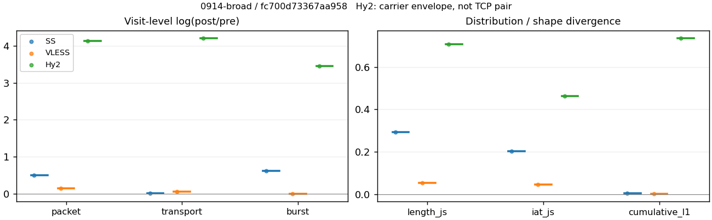
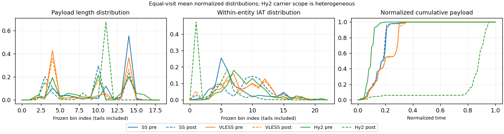

# 0914-broad · 条目 009 · mozilla.org

目标：https://www.mozilla.org/

活动标签：mozilla.org::page_load。选定访问 3 次。

[返回总索引](../../README.md) · [统计口径](../../methods.md)

## 覆盖与资格（每次访问均保留）

| 部署 | 重复 | 主请求路由 | 活动状态 | 代理比较 | DIRECT pre | 请求 proxy/direct/unresolved | 错误 |
| --- | --- | --- | --- | --- | --- | --- | --- |
| Hy2 | 1 | proxy | passed | 1 | 1 | 49/3/0 | [] |
| SS | 1 | proxy | passed | 1 | 0 | 52/0/0 | [] |
| VLESS | 1 | proxy | passed | 1 | 0 | 52/0/0 | [] |

主请求非 proxy 的统计仅解释为已索引的辅助代理连接或 DIRECT 观测，不代表目标业务经代理传输。播放确认与配对资格是两道不同的门。

图中散点为单次访问，短线为重复中位数；Hy2 是共享载体包络，不能与 TCP 配对作等范围因果对比。

形态图先逐访问归一化，再对访问等权平均；实线 pre，虚线 post。分箱序号及边界见 methods，不将分箱索引误解为长度或时间。

## 每次访问的关键观测

### SS

范围：`exclusive_page`。每格 pre → post；空值为不可观测/不适用。

| 重复 | 包数 | 载荷字节 | burst | TCP FR | IAT中位µs | length JS | IAT JS |
| --- | --- | --- | --- | --- | --- | --- | --- |
| 1 | 862 → 1418 | 1.0247e+06 → 1.0421e+06 | 558 → 1028 | 66 → 66 | 29.319 → 501.06 | 0.29183 | 0.20235 |

完整标量统计：中位数 [min,max]；Δ 为重复内逐访问变换的中位数，MAD 未缩放。n 为可用变换数；DIRECT-only 的 nΔ=0 不代表 pre 不可用。

| scope | 特征 | pre | post | Δ | IQRΔ | MADΔ | nΔ |
| --- | --- | --- | --- | --- | --- | --- | --- |
| exclusive_page | active_span_sum_s_1000ms | 9.4351 [9.4351, 9.4351] | 11.858 [11.858, 11.858] | 0.22857 | — | — | 1 |
| exclusive_page | active_span_sum_s_100ms | 2.9155 [2.9155, 2.9155] | 4.7012 [4.7012, 4.7012] | 0.47776 | — | — | 1 |
| exclusive_page | active_span_sum_s_500ms | 7.7498 [7.7498, 7.7498] | 9.7086 [9.7086, 9.7086] | 0.22534 | — | — | 1 |
| exclusive_page | burst_bytes_iqr | 2896 [2896, 2896] | 1468 [1468, 1468] | -0.67943 | — | — | 1 |
| exclusive_page | burst_bytes_mad | 64 [64, 64] | 34 [34, 34] | -0.63252 | — | — | 1 |
| exclusive_page | burst_bytes_max | 20480 [20480, 20480] | 14280 [14280, 14280] | -0.36059 | — | — | 1 |
| exclusive_page | burst_bytes_mean | 1836.4 [1836.4, 1836.4] | 1013.8 [1013.8, 1013.8] | -0.59414 | — | — | 1 |
| exclusive_page | burst_bytes_median | 64 [64, 64] | 34 [34, 34] | -0.63252 | — | — | 1 |
| exclusive_page | burst_bytes_min | 0 [0, 0] | 0 [0, 0] | — | — | — | 0 |
| exclusive_page | burst_bytes_p95 | 8511.2 [8511.2, 8511.2] | 3959.5 [3959.5, 3959.5] | -0.76527 | — | — | 1 |
| exclusive_page | burst_bytes_q25 | 0 [0, 0] | 0 [0, 0] | — | — | — | 0 |
| exclusive_page | burst_bytes_q75 | 2896 [2896, 2896] | 1468 [1468, 1468] | -0.67943 | — | — | 1 |
| exclusive_page | burst_bytes_std | 3367.3 [3367.3, 3367.3] | 1583.9 [1583.9, 1583.9] | -0.75422 | — | — | 1 |
| exclusive_page | burst_count | 558 [558, 558] | 1028 [1028, 1028] | 0.61101 | — | — | 1 |
| exclusive_page | burst_duration_ms_iqr | 0.029876 [0.029876, 0.029876] | 0 [0, 0] | — | — | — | 0 |
| exclusive_page | burst_duration_ms_mad | 0 [0, 0] | 0 [0, 0] | — | — | — | 0 |
| exclusive_page | burst_duration_ms_max | 1573.6 [1573.6, 1573.6] | 1574.1 [1574.1, 1574.1] | 0.00031209 | — | — | 1 |
| exclusive_page | burst_duration_ms_mean | 22.915 [22.915, 22.915] | 8.7458 [8.7458, 8.7458] | -0.96323 | — | — | 1 |
| exclusive_page | burst_duration_ms_median | 0 [0, 0] | 0 [0, 0] | — | — | — | 0 |
| exclusive_page | burst_duration_ms_min | 0 [0, 0] | 0 [0, 0] | — | — | — | 0 |
| exclusive_page | burst_duration_ms_p95 | 99.462 [99.462, 99.462] | 4.9715 [4.9715, 4.9715] | -2.9961 | — | — | 1 |
| exclusive_page | burst_duration_ms_q25 | 0 [0, 0] | 0 [0, 0] | — | — | — | 0 |
| exclusive_page | burst_duration_ms_q75 | 0.029876 [0.029876, 0.029876] | 0 [0, 0] | — | — | — | 0 |
| exclusive_page | burst_duration_ms_std | 132.49 [132.49, 132.49] | 78.56 [78.56, 78.56] | -0.52265 | — | — | 1 |
| exclusive_page | burst_packets_iqr | 1 [1, 1] | 0 [0, 0] | — | — | — | 0 |
| exclusive_page | burst_packets_mad | 0 [0, 0] | 0 [0, 0] | — | — | — | 0 |
| exclusive_page | burst_packets_max | 9 [9, 9] | 11 [11, 11] | 0.20067 | — | — | 1 |
| exclusive_page | burst_packets_mean | 1.5448 [1.5448, 1.5448] | 1.3794 [1.3794, 1.3794] | -0.11326 | — | — | 1 |
| exclusive_page | burst_packets_median | 1 [1, 1] | 1 [1, 1] | 0 | — | — | 1 |
| exclusive_page | burst_packets_min | 1 [1, 1] | 1 [1, 1] | 0 | — | — | 1 |
| exclusive_page | burst_packets_p95 | 3 [3, 3] | 3 [3, 3] | 0 | — | — | 1 |
| exclusive_page | burst_packets_q25 | 1 [1, 1] | 1 [1, 1] | 0 | — | — | 1 |
| exclusive_page | burst_packets_q75 | 2 [2, 2] | 1 [1, 1] | -0.69315 | — | — | 1 |
| exclusive_page | burst_packets_std | 1.1378 [1.1378, 1.1378] | 0.85531 [0.85531, 0.85531] | -0.28538 | — | — | 1 |
| exclusive_page | connection_span_concurrency_max | 6 [6, 6] | 5 [5, 5] | -0.18232 | — | — | 1 |
| exclusive_page | cumulative_l1 | — | — | 0.0045723 | — | — | 1 |
| exclusive_page | cumulative_max | — | — | 0.13327 | — | — | 1 |
| exclusive_page | direction_entropy | 0.65367 [0.65367, 0.65367] | 0.50244 [0.50244, 0.50244] | -0.15123 | — | — | 1 |
| exclusive_page | down_burst_count | 276 [276, 276] | 511 [511, 511] | 0.61597 | — | — | 1 |
| exclusive_page | down_ip_bytes | 1.0299e+06 [1.0299e+06, 1.0299e+06] | 1.0567e+06 [1.0567e+06, 1.0567e+06] | 0.02565 | — | — | 1 |
| exclusive_page | down_packets | 536 [536, 536] | 802 [802, 802] | 0.40297 | — | — | 1 |
| exclusive_page | down_transport_bytes | 1.002e+06 [1.002e+06, 1.002e+06] | 1.0149e+06 [1.0149e+06, 1.0149e+06] | 0.012783 | — | — | 1 |
| exclusive_page | duration_s | 16.799 [16.799, 16.799] | 16.796 [16.796, 16.796] | -0.00015576 | — | — | 1 |
| exclusive_page | entity_count | 6 [6, 6] | 6 [6, 6] | 0 | — | — | 1 |
| exclusive_page | fr_runs | 66 [66, 66] | 66 [66, 66] | 0 | — | — | 1 |
| exclusive_page | fr_runs_per_packet | 0.12476 [0.12476, 0.12476] | 0.081281 [0.081281, 0.081281] | -0.043483 | — | — | 1 |
| exclusive_page | fr_switches | 60 [60, 60] | 60 [60, 60] | 0 | — | — | 1 |
| exclusive_page | fr_switches_per_possible_transition | 0.11472 [0.11472, 0.11472] | 0.074442 [0.074442, 0.074442] | -0.040281 | — | — | 1 |
| exclusive_page | full_retransmission_fraction | 0.0011601 [0.0011601, 0.0011601] | 0.0028209 [0.0028209, 0.0028209] | 0.0016608 | — | — | 1 |
| exclusive_page | full_retransmission_packets | 1 [1, 1] | 4 [4, 4] | 1.3863 | — | — | 1 |
| exclusive_page | iat_count | 856 [856, 856] | 1412 [1412, 1412] | 0.50049 | — | — | 1 |
| exclusive_page | iat_js | — | — | 0.20235 | — | — | 1 |
| exclusive_page | iat_ks | — | — | 0.39385 | — | — | 1 |
| exclusive_page | iat_median_us | 29.319 [29.319, 29.319] | 501.06 [501.06, 501.06] | 2.8385 | — | — | 1 |
| exclusive_page | iat_us_iqr | 186.57 [186.57, 186.57] | 1377.3 [1377.3, 1377.3] | 1.9991 | — | — | 1 |
| exclusive_page | iat_us_mad | 22.738 [22.738, 22.738] | 490.77 [490.77, 490.77] | 3.0719 | — | — | 1 |
| exclusive_page | iat_us_max | 1.1195e+07 [1.1195e+07, 1.1195e+07] | 1.1127e+07 [1.1127e+07, 1.1127e+07] | -0.0061385 | — | — | 1 |
| exclusive_page | iat_us_mean | 43670 [43670, 43670] | 26294 [26294, 26294] | -0.5073 | — | — | 1 |
| exclusive_page | iat_us_median | 29.319 [29.319, 29.319] | 501.06 [501.06, 501.06] | 2.8385 | — | — | 1 |
| exclusive_page | iat_us_min | 0.023 [0.023, 0.023] | 0.037 [0.037, 0.037] | 0.47542 | — | — | 1 |
| exclusive_page | iat_us_p95 | 57370 [57370, 57370] | 31879 [31879, 31879] | -0.58758 | — | — | 1 |
| exclusive_page | iat_us_q25 | 13.675 [13.675, 13.675] | 23.301 [23.301, 23.301] | 0.53296 | — | — | 1 |
| exclusive_page | iat_us_q75 | 200.25 [200.25, 200.25] | 1400.6 [1400.6, 1400.6] | 1.9451 | — | — | 1 |
| exclusive_page | iat_us_std | 5.4763e+05 [5.4763e+05, 5.4763e+05] | 4.2258e+05 [4.2258e+05, 4.2258e+05] | -0.25921 | — | — | 1 |
| exclusive_page | iat_wasserstein_log1p_us | — | — | 1.4874 | — | — | 1 |
| exclusive_page | idle_gap_count_1000ms | 6 [6, 6] | 4 [4, 4] | -0.40547 | — | — | 1 |
| exclusive_page | idle_gap_count_100ms | 31 [31, 31] | 32 [32, 32] | 0.031749 | — | — | 1 |
| exclusive_page | idle_gap_count_500ms | 9 [9, 9] | 7 [7, 7] | -0.25131 | — | — | 1 |
| exclusive_page | idle_gap_sum_s_1000ms | 27.946 [27.946, 27.946] | 25.27 [25.27, 25.27] | -0.10068 | — | — | 1 |
| exclusive_page | idle_gap_sum_s_100ms | 34.466 [34.466, 34.466] | 32.427 [32.427, 32.427] | -0.06099 | — | — | 1 |
| exclusive_page | idle_gap_sum_s_500ms | 29.631 [29.631, 29.631] | 27.419 [27.419, 27.419] | -0.077597 | — | — | 1 |
| exclusive_page | ip_bytes | 1.0696e+06 [1.0696e+06, 1.0696e+06] | 1.126e+06 [1.126e+06, 1.126e+06] | 0.051327 | — | — | 1 |
| exclusive_page | length_iqr | 2088 [2088, 2088] | 1455 [1455, 1455] | -0.3612 | — | — | 1 |
| exclusive_page | length_js | — | — | 0.29183 | — | — | 1 |
| exclusive_page | length_ks | — | — | 0.49307 | — | — | 1 |
| exclusive_page | length_mad | 96 [96, 96] | 1354 [1354, 1354] | 2.6465 | — | — | 1 |
| exclusive_page | length_max | 4552 [4552, 4552] | 7140 [7140, 7140] | 0.45015 | — | — | 1 |
| exclusive_page | length_mean | 1937.1 [1937.1, 1937.1] | 1283.4 [1283.4, 1283.4] | -0.41164 | — | — | 1 |
| exclusive_page | length_median | 2896 [2896, 2896] | 1428 [1428, 1428] | -0.70706 | — | — | 1 |
| exclusive_page | length_min | 31 [31, 31] | 20 [20, 20] | -0.43825 | — | — | 1 |
| exclusive_page | length_p95 | 2896 [2896, 2896] | 2856 [2856, 2856] | -0.013908 | — | — | 1 |
| exclusive_page | length_q25 | 808 [808, 808] | 74 [74, 74] | -2.3905 | — | — | 1 |
| exclusive_page | length_q75 | 2896 [2896, 2896] | 1529 [1529, 1529] | -0.63872 | — | — | 1 |
| exclusive_page | length_std | 1152.4 [1152.4, 1152.4] | 1171.3 [1171.3, 1171.3] | 0.016296 | — | — | 1 |
| exclusive_page | length_wasserstein_bytes | — | — | 706.38 | — | — | 1 |
| exclusive_page | nonempty_entity_count | 6 [6, 6] | 6 [6, 6] | 0 | — | — | 1 |
| exclusive_page | nonempty_packets | 529 [529, 529] | 812 [812, 812] | 0.42851 | — | — | 1 |
| exclusive_page | offload_suspect_fraction | 0.36311 [0.36311, 0.36311] | 0.15867 [0.15867, 0.15867] | -0.20443 | — | — | 1 |
| exclusive_page | packet_count | 862 [862, 862] | 1418 [1418, 1418] | 0.49775 | — | — | 1 |
| exclusive_page | rtt_median_ms | 0.062941 [0.062941, 0.062941] | 27.71 [27.71, 27.71] | 6.0874 | — | — | 1 |
| exclusive_page | rtt_sample_count | 323 [323, 323] | 236 [236, 236] | -0.31382 | — | — | 1 |
| exclusive_page | tcp_ack_count | 856 [856, 856] | 1412 [1412, 1412] | 0.50049 | — | — | 1 |
| exclusive_page | tcp_fin_count | 12 [12, 12] | 12 [12, 12] | 0 | — | — | 1 |
| exclusive_page | tcp_packet_count | 862 [862, 862] | 1418 [1418, 1418] | 0.49775 | — | — | 1 |
| exclusive_page | tcp_rst_count | 0 [0, 0] | 0 [0, 0] | — | — | — | 0 |
| exclusive_page | tcp_syn_count | 12 [12, 12] | 12 [12, 12] | 0 | — | — | 1 |
| exclusive_page | tcp_window_raw_median | 65535 [65535, 65535] | 137 [137, 137] | -6.1704 | — | — | 1 |
| exclusive_page | transition_entropy | 0.44462 [0.44462, 0.44462] | 0.31497 [0.31497, 0.31497] | -0.12964 | — | — | 1 |
| exclusive_page | transition_n_mm | 408 [408, 408] | 690 [690, 690] | 0.52542 | — | — | 1 |
| exclusive_page | transition_n_mp | 28 [28, 28] | 28 [28, 28] | 0 | — | — | 1 |
| exclusive_page | transition_n_pm | 32 [32, 32] | 32 [32, 32] | 0 | — | — | 1 |
| exclusive_page | transition_n_pp | 55 [55, 55] | 56 [56, 56] | 0.018019 | — | — | 1 |
| exclusive_page | transition_p_mm | 0.93578 [0.93578, 0.93578] | 0.961 [0.961, 0.961] | 0.025223 | — | — | 1 |
| exclusive_page | transition_p_mp | 0.06422 [0.06422, 0.06422] | 0.038997 [0.038997, 0.038997] | -0.025223 | — | — | 1 |
| exclusive_page | transition_p_pm | 0.36782 [0.36782, 0.36782] | 0.36364 [0.36364, 0.36364] | -0.0041797 | — | — | 1 |
| exclusive_page | transition_p_pp | 0.63218 [0.63218, 0.63218] | 0.63636 [0.63636, 0.63636] | 0.0041797 | — | — | 1 |
| exclusive_page | transport_bytes | 1.0247e+06 [1.0247e+06, 1.0247e+06] | 1.0421e+06 [1.0421e+06, 1.0421e+06] | 0.016875 | — | — | 1 |
| exclusive_page | up_burst_count | 282 [282, 282] | 517 [517, 517] | 0.60614 | — | — | 1 |
| exclusive_page | up_byte_fraction | 0.022181 [0.022181, 0.022181] | 0.026175 [0.026175, 0.026175] | 0.0039939 | — | — | 1 |
| exclusive_page | up_ip_bytes | 39741 [39741, 39741] | 69318 [69318, 69318] | 0.55632 | — | — | 1 |
| exclusive_page | up_packets | 326 [326, 326] | 616 [616, 616] | 0.63635 | — | — | 1 |
| exclusive_page | up_transport_bytes | 22729 [22729, 22729] | 27278 [27278, 27278] | 0.18244 | — | — | 1 |
| exclusive_page | zero_iat_count | 0 [0, 0] | 0 [0, 0] | — | — | — | 0 |
| exclusive_page | zero_iat_fraction | 0 [0, 0] | 0 [0, 0] | 0 | — | — | 1 |

### VLESS

范围：`exclusive_page`。每格 pre → post；空值为不可观测/不适用。

| 重复 | 包数 | 载荷字节 | burst | TCP FR | IAT中位µs | length JS | IAT JS |
| --- | --- | --- | --- | --- | --- | --- | --- |
| 1 | 1281 → 1483 | 9.0686e+05 → 9.6331e+05 | 1019 → 1022 | 65 → 80 | 246.12 → 306.26 | 0.054306 | 0.045726 |

完整标量统计：中位数 [min,max]；Δ 为重复内逐访问变换的中位数，MAD 未缩放。n 为可用变换数；DIRECT-only 的 nΔ=0 不代表 pre 不可用。

| scope | 特征 | pre | post | Δ | IQRΔ | MADΔ | nΔ |
| --- | --- | --- | --- | --- | --- | --- | --- |
| exclusive_page | active_span_sum_s_1000ms | 12.423 [12.423, 12.423] | 11.822 [11.822, 11.822] | -0.049606 | — | — | 1 |
| exclusive_page | active_span_sum_s_100ms | 2.4838 [2.4838, 2.4838] | 4.6296 [4.6296, 4.6296] | 0.62268 | — | — | 1 |
| exclusive_page | active_span_sum_s_500ms | 6.6507 [6.6507, 6.6507] | 10.96 [10.96, 10.96] | 0.49949 | — | — | 1 |
| exclusive_page | burst_bytes_iqr | 2824 [2824, 2824] | 2824 [2824, 2824] | 0 | — | — | 1 |
| exclusive_page | burst_bytes_mad | 39 [39, 39] | 72 [72, 72] | 0.6131 | — | — | 1 |
| exclusive_page | burst_bytes_max | 5720 [5720, 5720] | 4832 [4832, 4832] | -0.16871 | — | — | 1 |
| exclusive_page | burst_bytes_mean | 889.95 [889.95, 889.95] | 942.57 [942.57, 942.57] | 0.057445 | — | — | 1 |
| exclusive_page | burst_bytes_median | 39 [39, 39] | 72 [72, 72] | 0.6131 | — | — | 1 |
| exclusive_page | burst_bytes_min | 0 [0, 0] | 0 [0, 0] | — | — | — | 0 |
| exclusive_page | burst_bytes_p95 | 2896 [2896, 2896] | 2896 [2896, 2896] | 0 | — | — | 1 |
| exclusive_page | burst_bytes_q25 | 0 [0, 0] | 0 [0, 0] | — | — | — | 0 |
| exclusive_page | burst_bytes_q75 | 2824 [2824, 2824] | 2824 [2824, 2824] | 0 | — | — | 1 |
| exclusive_page | burst_bytes_std | 1295.8 [1295.8, 1295.8] | 1236.2 [1236.2, 1236.2] | -0.04706 | — | — | 1 |
| exclusive_page | burst_count | 1019 [1019, 1019] | 1022 [1022, 1022] | 0.0029397 | — | — | 1 |
| exclusive_page | burst_duration_ms_iqr | 0 [0, 0] | 0.0097377 [0.0097377, 0.0097377] | — | — | — | 0 |
| exclusive_page | burst_duration_ms_mad | 0 [0, 0] | 0 [0, 0] | — | — | — | 0 |
| exclusive_page | burst_duration_ms_max | 13074 [13074, 13074] | 13115 [13115, 13115] | 0.0030927 | — | — | 1 |
| exclusive_page | burst_duration_ms_mean | 35.109 [35.109, 35.109] | 32.962 [32.962, 32.962] | -0.063102 | — | — | 1 |
| exclusive_page | burst_duration_ms_median | 0 [0, 0] | 0 [0, 0] | — | — | — | 0 |
| exclusive_page | burst_duration_ms_min | 0 [0, 0] | 0 [0, 0] | — | — | — | 0 |
| exclusive_page | burst_duration_ms_p95 | 9.3725 [9.3725, 9.3725] | 9.9069 [9.9069, 9.9069] | 0.055457 | — | — | 1 |
| exclusive_page | burst_duration_ms_q25 | 0 [0, 0] | 0 [0, 0] | — | — | — | 0 |
| exclusive_page | burst_duration_ms_q75 | 0 [0, 0] | 0.0097377 [0.0097377, 0.0097377] | — | — | — | 0 |
| exclusive_page | burst_duration_ms_std | 561.83 [561.83, 561.83] | 559.45 [559.45, 559.45] | -0.0042332 | — | — | 1 |
| exclusive_page | burst_packets_iqr | 0 [0, 0] | 1 [1, 1] | — | — | — | 0 |
| exclusive_page | burst_packets_mad | 0 [0, 0] | 0 [0, 0] | — | — | — | 0 |
| exclusive_page | burst_packets_max | 5 [5, 5] | 12 [12, 12] | 0.87547 | — | — | 1 |
| exclusive_page | burst_packets_mean | 1.2571 [1.2571, 1.2571] | 1.4511 [1.4511, 1.4511] | 0.14349 | — | — | 1 |
| exclusive_page | burst_packets_median | 1 [1, 1] | 1 [1, 1] | 0 | — | — | 1 |
| exclusive_page | burst_packets_min | 1 [1, 1] | 1 [1, 1] | 0 | — | — | 1 |
| exclusive_page | burst_packets_p95 | 2 [2, 2] | 3 [3, 3] | 0.40547 | — | — | 1 |
| exclusive_page | burst_packets_q25 | 1 [1, 1] | 1 [1, 1] | 0 | — | — | 1 |
| exclusive_page | burst_packets_q75 | 1 [1, 1] | 2 [2, 2] | 0.69315 | — | — | 1 |
| exclusive_page | burst_packets_std | 0.49396 [0.49396, 0.49396] | 0.92214 [0.92214, 0.92214] | 0.62424 | — | — | 1 |
| exclusive_page | connection_span_concurrency_max | 4 [4, 4] | 4 [4, 4] | 0 | — | — | 1 |
| exclusive_page | cumulative_l1 | — | — | 0.0028048 | — | — | 1 |
| exclusive_page | cumulative_max | — | — | 0.029568 | — | — | 1 |
| exclusive_page | direction_entropy | 0.49671 [0.49671, 0.49671] | 0.4748 [0.4748, 0.4748] | -0.021903 | — | — | 1 |
| exclusive_page | down_burst_count | 506 [506, 506] | 508 [508, 508] | 0.0039448 | — | — | 1 |
| exclusive_page | down_ip_bytes | 9.2216e+05 [9.2216e+05, 9.2216e+05] | 9.7047e+05 [9.7047e+05, 9.7047e+05] | 0.051066 | — | — | 1 |
| exclusive_page | down_packets | 729 [729, 729] | 838 [838, 838] | 0.13934 | — | — | 1 |
| exclusive_page | down_transport_bytes | 8.842e+05 [8.842e+05, 8.842e+05] | 9.2685e+05 [9.2685e+05, 9.2685e+05] | 0.047117 | — | — | 1 |
| exclusive_page | duration_s | 19.019 [19.019, 19.019] | 18.988 [18.988, 18.988] | -0.0016643 | — | — | 1 |
| exclusive_page | entity_count | 7 [7, 7] | 7 [7, 7] | 0 | — | — | 1 |
| exclusive_page | fr_runs | 65 [65, 65] | 80 [80, 80] | 0.20764 | — | — | 1 |
| exclusive_page | fr_runs_per_packet | 0.090782 [0.090782, 0.090782] | 0.09816 [0.09816, 0.09816] | 0.0073774 | — | — | 1 |
| exclusive_page | fr_switches | 58 [58, 58] | 73 [73, 73] | 0.23002 | — | — | 1 |
| exclusive_page | fr_switches_per_possible_transition | 0.081805 [0.081805, 0.081805] | 0.090347 [0.090347, 0.090347] | 0.0085412 | — | — | 1 |
| exclusive_page | full_retransmission_fraction | 0 [0, 0] | 0 [0, 0] | 0 | — | — | 1 |
| exclusive_page | full_retransmission_packets | 0 [0, 0] | 0 [0, 0] | — | — | — | 0 |
| exclusive_page | iat_count | 1274 [1274, 1274] | 1476 [1476, 1476] | 0.14717 | — | — | 1 |
| exclusive_page | iat_js | — | — | 0.045726 | — | — | 1 |
| exclusive_page | iat_ks | — | — | 0.10618 | — | — | 1 |
| exclusive_page | iat_median_us | 246.12 [246.12, 246.12] | 306.26 [306.26, 306.26] | 0.21862 | — | — | 1 |
| exclusive_page | iat_us_iqr | 2025.9 [2025.9, 2025.9] | 2278.8 [2278.8, 2278.8] | 0.1176 | — | — | 1 |
| exclusive_page | iat_us_mad | 236.5 [236.5, 236.5] | 298.52 [298.52, 298.52] | 0.23287 | — | — | 1 |
| exclusive_page | iat_us_max | 1.3074e+07 [1.3074e+07, 1.3074e+07] | 1.3115e+07 [1.3115e+07, 1.3115e+07] | 0.0030927 | — | — | 1 |
| exclusive_page | iat_us_mean | 39081 [39081, 39081] | 33326 [33326, 33326] | -0.15931 | — | — | 1 |
| exclusive_page | iat_us_median | 246.12 [246.12, 246.12] | 306.26 [306.26, 306.26] | 0.21862 | — | — | 1 |
| exclusive_page | iat_us_min | 1.504 [1.504, 1.504] | 0.048 [0.048, 0.048] | -3.4447 | — | — | 1 |
| exclusive_page | iat_us_p95 | 10126 [10126, 10126] | 40850 [40850, 40850] | 1.3947 | — | — | 1 |
| exclusive_page | iat_us_q25 | 46.525 [46.525, 46.525] | 23.447 [23.447, 23.447] | -0.68526 | — | — | 1 |
| exclusive_page | iat_us_q75 | 2072.4 [2072.4, 2072.4] | 2302.2 [2302.2, 2302.2] | 0.10514 | — | — | 1 |
| exclusive_page | iat_us_std | 6.0694e+05 [6.0694e+05, 6.0694e+05] | 5.6234e+05 [5.6234e+05, 5.6234e+05] | -0.076323 | — | — | 1 |
| exclusive_page | iat_wasserstein_log1p_us | — | — | 0.38221 | — | — | 1 |
| exclusive_page | idle_gap_count_1000ms | 3 [3, 3] | 3 [3, 3] | 0 | — | — | 1 |
| exclusive_page | idle_gap_count_100ms | 31 [31, 31] | 38 [38, 38] | 0.2036 | — | — | 1 |
| exclusive_page | idle_gap_count_500ms | 11 [11, 11] | 4 [4, 4] | -1.0116 | — | — | 1 |
| exclusive_page | idle_gap_sum_s_1000ms | 37.366 [37.366, 37.366] | 37.367 [37.367, 37.367] | 1.5827e-05 | — | — | 1 |
| exclusive_page | idle_gap_sum_s_100ms | 47.306 [47.306, 47.306] | 44.559 [44.559, 44.559] | -0.059811 | — | — | 1 |
| exclusive_page | idle_gap_sum_s_500ms | 43.139 [43.139, 43.139] | 38.229 [38.229, 38.229] | -0.12082 | — | — | 1 |
| exclusive_page | ip_bytes | 9.7344e+05 [9.7344e+05, 9.7344e+05] | 1.0415e+06 [1.0415e+06, 1.0415e+06] | 0.067577 | — | — | 1 |
| exclusive_page | length_iqr | 2752 [2752, 2752] | 2752 [2752, 2752] | 0 | — | — | 1 |
| exclusive_page | length_js | — | — | 0.054306 | — | — | 1 |
| exclusive_page | length_ks | — | — | 0.11674 | — | — | 1 |
| exclusive_page | length_mad | 788 [788, 788] | 1136 [1136, 1136] | 0.36577 | — | — | 1 |
| exclusive_page | length_max | 2896 [2896, 2896] | 2896 [2896, 2896] | 0 | — | — | 1 |
| exclusive_page | length_mean | 1266.6 [1266.6, 1266.6] | 1182 [1182, 1182] | -0.069123 | — | — | 1 |
| exclusive_page | length_median | 860 [860, 860] | 1208 [1208, 1208] | 0.33979 | — | — | 1 |
| exclusive_page | length_min | 24 [24, 24] | 1 [1, 1] | -3.1781 | — | — | 1 |
| exclusive_page | length_p95 | 2824 [2824, 2824] | 2824 [2824, 2824] | 0 | — | — | 1 |
| exclusive_page | length_q25 | 72 [72, 72] | 72 [72, 72] | 0 | — | — | 1 |
| exclusive_page | length_q75 | 2824 [2824, 2824] | 2824 [2824, 2824] | 0 | — | — | 1 |
| exclusive_page | length_std | 1249.9 [1249.9, 1249.9] | 1129.4 [1129.4, 1129.4] | -0.10137 | — | — | 1 |
| exclusive_page | length_wasserstein_bytes | — | — | 180.82 | — | — | 1 |
| exclusive_page | nonempty_entity_count | 7 [7, 7] | 7 [7, 7] | 0 | — | — | 1 |
| exclusive_page | nonempty_packets | 716 [716, 716] | 815 [815, 815] | 0.12951 | — | — | 1 |
| exclusive_page | offload_suspect_fraction | 0.21311 [0.21311, 0.21311] | 0.15577 [0.15577, 0.15577] | -0.057349 | — | — | 1 |
| exclusive_page | packet_count | 1281 [1281, 1281] | 1483 [1483, 1483] | 0.14643 | — | — | 1 |
| exclusive_page | rtt_median_ms | 0.074569 [0.074569, 0.074569] | 0.10109 [0.10109, 0.10109] | 0.30427 | — | — | 1 |
| exclusive_page | rtt_sample_count | 544 [544, 544] | 622 [622, 622] | 0.13399 | — | — | 1 |
| exclusive_page | tcp_ack_count | 1262 [1262, 1262] | 1475 [1475, 1475] | 0.15596 | — | — | 1 |
| exclusive_page | tcp_fin_count | 14 [14, 14] | 14 [14, 14] | 0 | — | — | 1 |
| exclusive_page | tcp_packet_count | 1281 [1281, 1281] | 1483 [1483, 1483] | 0.14643 | — | — | 1 |
| exclusive_page | tcp_rst_count | 12 [12, 12] | 1 [1, 1] | -2.4849 | — | — | 1 |
| exclusive_page | tcp_syn_count | 14 [14, 14] | 14 [14, 14] | 0 | — | — | 1 |
| exclusive_page | tcp_window_raw_median | 65535 [65535, 65535] | 153 [153, 153] | -6.0599 | — | — | 1 |
| exclusive_page | transition_entropy | 0.32697 [0.32697, 0.32697] | 0.34224 [0.34224, 0.34224] | 0.015262 | — | — | 1 |
| exclusive_page | transition_n_mm | 606 [606, 606] | 692 [692, 692] | 0.13271 | — | — | 1 |
| exclusive_page | transition_n_mp | 26 [26, 26] | 33 [33, 33] | 0.23841 | — | — | 1 |
| exclusive_page | transition_n_pm | 32 [32, 32] | 40 [40, 40] | 0.22314 | — | — | 1 |
| exclusive_page | transition_n_pp | 45 [45, 45] | 43 [43, 43] | -0.045462 | — | — | 1 |
| exclusive_page | transition_p_mm | 0.95886 [0.95886, 0.95886] | 0.95448 [0.95448, 0.95448] | -0.004378 | — | — | 1 |
| exclusive_page | transition_p_mp | 0.041139 [0.041139, 0.041139] | 0.045517 [0.045517, 0.045517] | 0.004378 | — | — | 1 |
| exclusive_page | transition_p_pm | 0.41558 [0.41558, 0.41558] | 0.48193 [0.48193, 0.48193] | 0.066343 | — | — | 1 |
| exclusive_page | transition_p_pp | 0.58442 [0.58442, 0.58442] | 0.51807 [0.51807, 0.51807] | -0.066343 | — | — | 1 |
| exclusive_page | transport_bytes | 9.0686e+05 [9.0686e+05, 9.0686e+05] | 9.6331e+05 [9.6331e+05, 9.6331e+05] | 0.060385 | — | — | 1 |
| exclusive_page | up_burst_count | 513 [513, 513] | 514 [514, 514] | 0.0019474 | — | — | 1 |
| exclusive_page | up_byte_fraction | 0.024994 [0.024994, 0.024994] | 0.037845 [0.037845, 0.037845] | 0.012851 | — | — | 1 |
| exclusive_page | up_ip_bytes | 51282 [51282, 51282] | 71024 [71024, 71024] | 0.32568 | — | — | 1 |
| exclusive_page | up_packets | 552 [552, 552] | 645 [645, 645] | 0.1557 | — | — | 1 |
| exclusive_page | up_transport_bytes | 22666 [22666, 22666] | 36456 [36456, 36456] | 0.47524 | — | — | 1 |
| exclusive_page | zero_iat_count | 0 [0, 0] | 0 [0, 0] | — | — | — | 0 |
| exclusive_page | zero_iat_fraction | 0 [0, 0] | 0 [0, 0] | 0 | — | — | 1 |

### Hy2

范围：`carrier_context_envelope`。每格 pre → post；空值为不可观测/不适用。

| 重复 | 包数 | 载荷字节 | burst | TCP FR | IAT中位µs | length JS | IAT JS |
| --- | --- | --- | --- | --- | --- | --- | --- |
| 1 | 507 → 31643 | 5.1087e+05 → 3.4273e+07 | 336 → 10723 | — | 186.84 → 4.218 | 0.70796 | 0.46184 |

范围：`direct_pre_only`。每格 pre → post；空值为不可观测/不适用。

| 重复 | 包数 | 载荷字节 | burst | TCP FR | IAT中位µs | length JS | IAT JS |
| --- | --- | --- | --- | --- | --- | --- | --- |
| 1 | 244 → — | 5.2858e+05 → — | 148 → — | 15 → — | 125.05 → — | — | — |

完整标量统计：中位数 [min,max]；Δ 为重复内逐访问变换的中位数，MAD 未缩放。n 为可用变换数；DIRECT-only 的 nΔ=0 不代表 pre 不可用。

| scope | 特征 | pre | post | Δ | IQRΔ | MADΔ | nΔ |
| --- | --- | --- | --- | --- | --- | --- | --- |
| carrier_context_envelope | active_span_sum_s_1000ms | 5.163 [5.163, 5.163] | 8.1895 [8.1895, 8.1895] | 0.46134 | — | — | 1 |
| carrier_context_envelope | active_span_sum_s_100ms | 0.82903 [0.82903, 0.82903] | 5.7487 [5.7487, 5.7487] | 1.9365 | — | — | 1 |
| carrier_context_envelope | active_span_sum_s_500ms | 5.163 [5.163, 5.163] | 8.1895 [8.1895, 8.1895] | 0.46134 | — | — | 1 |
| carrier_context_envelope | burst_bytes_iqr | 1624.2 [1624.2, 1624.2] | 4285 [4285, 4285] | 0.97007 | — | — | 1 |
| carrier_context_envelope | burst_bytes_mad | 36 [36, 36] | 397 [397, 397] | 2.4004 | — | — | 1 |
| carrier_context_envelope | burst_bytes_max | 28672 [28672, 28672] | 1.9459e+05 [1.9459e+05, 1.9459e+05] | 1.915 | — | — | 1 |
| carrier_context_envelope | burst_bytes_mean | 1520.4 [1520.4, 1520.4] | 3196.2 [3196.2, 3196.2] | 0.74296 | — | — | 1 |
| carrier_context_envelope | burst_bytes_median | 36 [36, 36] | 430 [430, 430] | 2.4803 | — | — | 1 |
| carrier_context_envelope | burst_bytes_min | 0 [0, 0] | 22 [22, 22] | — | — | — | 0 |
| carrier_context_envelope | burst_bytes_p95 | 7930 [7930, 7930] | 10932 [10932, 10932] | 0.32104 | — | — | 1 |
| carrier_context_envelope | burst_bytes_q25 | 0 [0, 0] | 38 [38, 38] | — | — | — | 0 |
| carrier_context_envelope | burst_bytes_q75 | 1624.2 [1624.2, 1624.2] | 4323 [4323, 4323] | 0.9789 | — | — | 1 |
| carrier_context_envelope | burst_bytes_std | 3629.1 [3629.1, 3629.1] | 6902.9 [6902.9, 6902.9] | 0.64297 | — | — | 1 |
| carrier_context_envelope | burst_count | 336 [336, 336] | 10723 [10723, 10723] | 3.463 | — | — | 1 |
| carrier_context_envelope | burst_duration_ms_iqr | 0.83131 [0.83131, 0.83131] | 0.025122 [0.025122, 0.025122] | -3.4992 | — | — | 1 |
| carrier_context_envelope | burst_duration_ms_mad | 0 [0, 0] | 4.5e-05 [4.5e-05, 4.5e-05] | — | — | — | 0 |
| carrier_context_envelope | burst_duration_ms_max | 12781 [12781, 12781] | 3913.9 [3913.9, 3913.9] | -1.1834 | — | — | 1 |
| carrier_context_envelope | burst_duration_ms_mean | 125.16 [125.16, 125.16] | 0.65241 [0.65241, 0.65241] | -5.2567 | — | — | 1 |
| carrier_context_envelope | burst_duration_ms_median | 0 [0, 0] | 4.5e-05 [4.5e-05, 4.5e-05] | — | — | — | 0 |
| carrier_context_envelope | burst_duration_ms_min | 0 [0, 0] | 0 [0, 0] | — | — | — | 0 |
| carrier_context_envelope | burst_duration_ms_p95 | 189.03 [189.03, 189.03] | 0.14919 [0.14919, 0.14919] | -7.1444 | — | — | 1 |
| carrier_context_envelope | burst_duration_ms_q25 | 0 [0, 0] | 0 [0, 0] | — | — | — | 0 |
| carrier_context_envelope | burst_duration_ms_q75 | 0.83131 [0.83131, 0.83131] | 0.025122 [0.025122, 0.025122] | -3.4992 | — | — | 1 |
| carrier_context_envelope | burst_duration_ms_std | 1177.3 [1177.3, 1177.3] | 38.373 [38.373, 38.373] | -3.4236 | — | — | 1 |
| carrier_context_envelope | burst_packets_iqr | 1 [1, 1] | 3 [3, 3] | 1.0986 | — | — | 1 |
| carrier_context_envelope | burst_packets_mad | 0 [0, 0] | 1 [1, 1] | — | — | — | 0 |
| carrier_context_envelope | burst_packets_max | 10 [10, 10] | 140 [140, 140] | 2.6391 | — | — | 1 |
| carrier_context_envelope | burst_packets_mean | 1.5089 [1.5089, 1.5089] | 2.9509 [2.9509, 2.9509] | 0.67073 | — | — | 1 |
| carrier_context_envelope | burst_packets_median | 1 [1, 1] | 2 [2, 2] | 0.69315 | — | — | 1 |
| carrier_context_envelope | burst_packets_min | 1 [1, 1] | 1 [1, 1] | 0 | — | — | 1 |
| carrier_context_envelope | burst_packets_p95 | 3 [3, 3] | 8 [8, 8] | 0.98083 | — | — | 1 |
| carrier_context_envelope | burst_packets_q25 | 1 [1, 1] | 1 [1, 1] | 0 | — | — | 1 |
| carrier_context_envelope | burst_packets_q75 | 2 [2, 2] | 4 [4, 4] | 0.69315 | — | — | 1 |
| carrier_context_envelope | burst_packets_std | 0.85212 [0.85212, 0.85212] | 4.8049 [4.8049, 4.8049] | 1.7297 | — | — | 1 |
| carrier_context_envelope | connection_span_concurrency_max | 4 [4, 4] | 1 [1, 1] | -1.3863 | — | — | 1 |
| carrier_context_envelope | cumulative_l1 | — | — | 0.73487 | — | — | 1 |
| carrier_context_envelope | cumulative_max | — | — | 0.9408 | — | — | 1 |
| carrier_context_envelope | direction_entropy | 0.8782 [0.8782, 0.8782] | 0.75672 [0.75672, 0.75672] | -0.12148 | — | — | 1 |
| carrier_context_envelope | direction_run_analog_runs | 60 [60, 60] | 10723 [10723, 10723] | 5.1858 | — | — | 1 |
| carrier_context_envelope | direction_run_analog_runs_per_packet | 0.21505 [0.21505, 0.21505] | 0.33887 [0.33887, 0.33887] | 0.12382 | — | — | 1 |
| carrier_context_envelope | direction_run_analog_switches | 52 [52, 52] | 10722 [10722, 10722] | 5.3288 | — | — | 1 |
| carrier_context_envelope | direction_run_analog_switches_per_possible_transition | 0.19188 [0.19188, 0.19188] | 0.33885 [0.33885, 0.33885] | 0.14697 | — | — | 1 |
| carrier_context_envelope | down_burst_count | 164 [164, 164] | 5361 [5361, 5361] | 3.487 | — | — | 1 |
| carrier_context_envelope | down_ip_bytes | 5.017e+05 [5.017e+05, 5.017e+05] | 3.4514e+07 [3.4514e+07, 3.4514e+07] | 4.2311 | — | — | 1 |
| carrier_context_envelope | down_packets | 299 [299, 299] | 24741 [24741, 24741] | 4.4158 | — | — | 1 |
| carrier_context_envelope | down_transport_bytes | 4.8609e+05 [4.8609e+05, 4.8609e+05] | 3.3821e+07 [3.3821e+07, 3.3821e+07] | 4.2425 | — | — | 1 |
| carrier_context_envelope | duration_s | 15.055 [15.055, 15.055] | 15.051 [15.051, 15.051] | -0.0003028 | — | — | 1 |
| carrier_context_envelope | entity_count | 8 [8, 8] | 1 [1, 1] | -2.0794 | — | — | 1 |
| carrier_context_envelope | full_retransmission_fraction | 0.0019724 [0.0019724, 0.0019724] | — | — | — | — | 0 |
| carrier_context_envelope | full_retransmission_packets | 1 [1, 1] | — | — | — | — | 0 |
| carrier_context_envelope | iat_count | 499 [499, 499] | 31642 [31642, 31642] | 4.1496 | — | — | 1 |
| carrier_context_envelope | iat_js | — | — | 0.46184 | — | — | 1 |
| carrier_context_envelope | iat_ks | — | — | 0.67559 | — | — | 1 |
| carrier_context_envelope | iat_median_us | 186.84 [186.84, 186.84] | 4.218 [4.218, 4.218] | -3.7909 | — | — | 1 |
| carrier_context_envelope | iat_us_iqr | 989.13 [989.13, 989.13] | 26.827 [26.827, 26.827] | -3.6074 | — | — | 1 |
| carrier_context_envelope | iat_us_mad | 170.33 [170.33, 170.33] | 4.182 [4.182, 4.182] | -3.7069 | — | — | 1 |
| carrier_context_envelope | iat_us_max | 1.2781e+07 [1.2781e+07, 1.2781e+07] | 3.9139e+06 [3.9139e+06, 3.9139e+06] | -1.1834 | — | — | 1 |
| carrier_context_envelope | iat_us_mean | 1.1073e+05 [1.1073e+05, 1.1073e+05] | 475.65 [475.65, 475.65] | -5.4502 | — | — | 1 |
| carrier_context_envelope | iat_us_median | 186.84 [186.84, 186.84] | 4.218 [4.218, 4.218] | -3.7909 | — | — | 1 |
| carrier_context_envelope | iat_us_min | 2.562 [2.562, 2.562] | 0.001 [0.001, 0.001] | -7.8485 | — | — | 1 |
| carrier_context_envelope | iat_us_p95 | 75456 [75456, 75456] | 391.56 [391.56, 391.56] | -5.2612 | — | — | 1 |
| carrier_context_envelope | iat_us_q25 | 66.917 [66.917, 66.917] | 0.045 [0.045, 0.045] | -7.3045 | — | — | 1 |
| carrier_context_envelope | iat_us_q75 | 1056 [1056, 1056] | 26.872 [26.872, 26.872] | -3.6712 | — | — | 1 |
| carrier_context_envelope | iat_us_std | 1.1171e+06 [1.1171e+06, 1.1171e+06] | 25414 [25414, 25414] | -3.7832 | — | — | 1 |
| carrier_context_envelope | iat_wasserstein_log1p_us | — | — | 3.8889 | — | — | 1 |
| carrier_context_envelope | idle_gap_count_1000ms | 4 [4, 4] | 3 [3, 3] | -0.28768 | — | — | 1 |
| carrier_context_envelope | idle_gap_count_100ms | 25 [25, 25] | 15 [15, 15] | -0.51083 | — | — | 1 |
| carrier_context_envelope | idle_gap_count_500ms | 4 [4, 4] | 3 [3, 3] | -0.28768 | — | — | 1 |
| carrier_context_envelope | idle_gap_sum_s_1000ms | 50.094 [50.094, 50.094] | 6.8612 [6.8612, 6.8612] | -1.988 | — | — | 1 |
| carrier_context_envelope | idle_gap_sum_s_100ms | 54.428 [54.428, 54.428] | 9.302 [9.302, 9.302] | -1.7666 | — | — | 1 |
| carrier_context_envelope | idle_gap_sum_s_500ms | 50.094 [50.094, 50.094] | 6.8612 [6.8612, 6.8612] | -1.988 | — | — | 1 |
| carrier_context_envelope | ip_bytes | 5.3738e+05 [5.3738e+05, 5.3738e+05] | 3.5159e+07 [3.5159e+07, 3.5159e+07] | 4.1809 | — | — | 1 |
| carrier_context_envelope | length_iqr | 2582.5 [2582.5, 2582.5] | 596 [596, 596] | -1.4663 | — | — | 1 |
| carrier_context_envelope | length_js | — | — | 0.70796 | — | — | 1 |
| carrier_context_envelope | length_ks | — | — | 0.35842 | — | — | 1 |
| carrier_context_envelope | length_mad | 1290 [1290, 1290] | 0 [0, 0] | — | — | — | 0 |
| carrier_context_envelope | length_max | 8920 [8920, 8920] | 1441 [1441, 1441] | -1.823 | — | — | 1 |
| carrier_context_envelope | length_mean | 1831.1 [1831.1, 1831.1] | 1083.1 [1083.1, 1083.1] | -0.52507 | — | — | 1 |
| carrier_context_envelope | length_median | 1404 [1404, 1404] | 1441 [1441, 1441] | 0.026012 | — | — | 1 |
| carrier_context_envelope | length_min | 20 [20, 20] | 22 [22, 22] | 0.09531 | — | — | 1 |
| carrier_context_envelope | length_p95 | 7684.9 [7684.9, 7684.9] | 1441 [1441, 1441] | -1.6739 | — | — | 1 |
| carrier_context_envelope | length_q25 | 119 [119, 119] | 845 [845, 845] | 1.9602 | — | — | 1 |
| carrier_context_envelope | length_q75 | 2701.5 [2701.5, 2701.5] | 1441 [1441, 1441] | -0.62847 | — | — | 1 |
| carrier_context_envelope | length_std | 2141.7 [2141.7, 2141.7] | 579.15 [579.15, 579.15] | -1.3078 | — | — | 1 |
| carrier_context_envelope | length_wasserstein_bytes | — | — | 1043.2 | — | — | 1 |
| carrier_context_envelope | nonempty_entity_count | 8 [8, 8] | 1 [1, 1] | -2.0794 | — | — | 1 |
| carrier_context_envelope | nonempty_packets | 279 [279, 279] | 31643 [31643, 31643] | 4.7311 | — | — | 1 |
| carrier_context_envelope | offload_suspect_fraction | 0.19724 [0.19724, 0.19724] | 0 [0, 0] | -0.19724 | — | — | 1 |
| carrier_context_envelope | packet_count | 507 [507, 507] | 31643 [31643, 31643] | 4.1338 | — | — | 1 |
| carrier_context_envelope | rtt_median_ms | 0.13933 [0.13933, 0.13933] | — | — | — | — | 0 |
| carrier_context_envelope | rtt_sample_count | 214 [214, 214] | 0 [0, 0] | — | — | — | 0 |
| carrier_context_envelope | tcp_ack_count | 499 [499, 499] | — | — | — | — | 0 |
| carrier_context_envelope | tcp_fin_count | 16 [16, 16] | — | — | — | — | 0 |
| carrier_context_envelope | tcp_packet_count | 507 [507, 507] | 0 [0, 0] | — | — | — | 0 |
| carrier_context_envelope | tcp_rst_count | 0 [0, 0] | — | — | — | — | 0 |
| carrier_context_envelope | tcp_syn_count | 16 [16, 16] | — | — | — | — | 0 |
| carrier_context_envelope | tcp_window_raw_median | 65504 [65504, 65504] | — | — | — | — | 0 |
| carrier_context_envelope | transition_entropy | 0.65452 [0.65452, 0.65452] | 0.75665 [0.75665, 0.75665] | 0.10212 | — | — | 1 |
| carrier_context_envelope | transition_n_mm | 167 [167, 167] | 19380 [19380, 19380] | 4.754 | — | — | 1 |
| carrier_context_envelope | transition_n_mp | 23 [23, 23] | 5361 [5361, 5361] | 5.4514 | — | — | 1 |
| carrier_context_envelope | transition_n_pm | 29 [29, 29] | 5361 [5361, 5361] | 5.2196 | — | — | 1 |
| carrier_context_envelope | transition_n_pp | 52 [52, 52] | 1540 [1540, 1540] | 3.3883 | — | — | 1 |
| carrier_context_envelope | transition_p_mm | 0.87895 [0.87895, 0.87895] | 0.78332 [0.78332, 0.78332] | -0.095632 | — | — | 1 |
| carrier_context_envelope | transition_p_mp | 0.12105 [0.12105, 0.12105] | 0.21668 [0.21668, 0.21668] | 0.095632 | — | — | 1 |
| carrier_context_envelope | transition_p_pm | 0.35802 [0.35802, 0.35802] | 0.77684 [0.77684, 0.77684] | 0.41882 | — | — | 1 |
| carrier_context_envelope | transition_p_pp | 0.64198 [0.64198, 0.64198] | 0.22316 [0.22316, 0.22316] | -0.41882 | — | — | 1 |
| carrier_context_envelope | transport_bytes | 5.1087e+05 [5.1087e+05, 5.1087e+05] | 3.4273e+07 [3.4273e+07, 3.4273e+07] | 4.206 | — | — | 1 |
| carrier_context_envelope | up_burst_count | 172 [172, 172] | 5362 [5362, 5362] | 3.4396 | — | — | 1 |
| carrier_context_envelope | up_byte_fraction | 0.048515 [0.048515, 0.048515] | 0.01318 [0.01318, 0.01318] | -0.035335 | — | — | 1 |
| carrier_context_envelope | up_ip_bytes | 35677 [35677, 35677] | 6.4498e+05 [6.4498e+05, 6.4498e+05] | 2.8947 | — | — | 1 |
| carrier_context_envelope | up_packets | 208 [208, 208] | 6902 [6902, 6902] | 3.502 | — | — | 1 |
| carrier_context_envelope | up_transport_bytes | 24785 [24785, 24785] | 4.5172e+05 [4.5172e+05, 4.5172e+05] | 2.9028 | — | — | 1 |
| carrier_context_envelope | zero_iat_count | 0 [0, 0] | 0 [0, 0] | — | — | — | 0 |
| carrier_context_envelope | zero_iat_fraction | 0 [0, 0] | 0 [0, 0] | 0 | — | — | 1 |
| direct_pre_only | active_span_sum_s_1000ms | 0.58845 [0.58845, 0.58845] | — | — | — | — | 0 |
| direct_pre_only | active_span_sum_s_100ms | 0.29132 [0.29132, 0.29132] | — | — | — | — | 0 |
| direct_pre_only | active_span_sum_s_500ms | 0.58845 [0.58845, 0.58845] | — | — | — | — | 0 |
| direct_pre_only | burst_bytes_iqr | 5600 [5600, 5600] | — | — | — | — | 0 |
| direct_pre_only | burst_bytes_mad | 35 [35, 35] | — | — | — | — | 0 |
| direct_pre_only | burst_bytes_max | 20480 [20480, 20480] | — | — | — | — | 0 |
| direct_pre_only | burst_bytes_mean | 3571.5 [3571.5, 3571.5] | — | — | — | — | 0 |
| direct_pre_only | burst_bytes_median | 35 [35, 35] | — | — | — | — | 0 |
| direct_pre_only | burst_bytes_min | 0 [0, 0] | — | — | — | — | 0 |
| direct_pre_only | burst_bytes_p95 | 14508 [14508, 14508] | — | — | — | — | 0 |
| direct_pre_only | burst_bytes_q25 | 0 [0, 0] | — | — | — | — | 0 |
| direct_pre_only | burst_bytes_q75 | 5600 [5600, 5600] | — | — | — | — | 0 |
| direct_pre_only | burst_bytes_std | 5063.4 [5063.4, 5063.4] | — | — | — | — | 0 |
| direct_pre_only | burst_count | 148 [148, 148] | — | — | — | — | 0 |
| direct_pre_only | burst_duration_ms_iqr | 0.27921 [0.27921, 0.27921] | — | — | — | — | 0 |
| direct_pre_only | burst_duration_ms_mad | 0 [0, 0] | — | — | — | — | 0 |
| direct_pre_only | burst_duration_ms_max | 13134 [13134, 13134] | — | — | — | — | 0 |
| direct_pre_only | burst_duration_ms_mean | 91.506 [91.506, 91.506] | — | — | — | — | 0 |
| direct_pre_only | burst_duration_ms_median | 0 [0, 0] | — | — | — | — | 0 |
| direct_pre_only | burst_duration_ms_min | 0 [0, 0] | — | — | — | — | 0 |
| direct_pre_only | burst_duration_ms_p95 | 8.9397 [8.9397, 8.9397] | — | — | — | — | 0 |
| direct_pre_only | burst_duration_ms_q25 | 0 [0, 0] | — | — | — | — | 0 |
| direct_pre_only | burst_duration_ms_q75 | 0.27921 [0.27921, 0.27921] | — | — | — | — | 0 |
| direct_pre_only | burst_duration_ms_std | 1075.8 [1075.8, 1075.8] | — | — | — | — | 0 |
| direct_pre_only | burst_packets_iqr | 1 [1, 1] | — | — | — | — | 0 |
| direct_pre_only | burst_packets_mad | 0 [0, 0] | — | — | — | — | 0 |
| direct_pre_only | burst_packets_max | 6 [6, 6] | — | — | — | — | 0 |
| direct_pre_only | burst_packets_mean | 1.6486 [1.6486, 1.6486] | — | — | — | — | 0 |
| direct_pre_only | burst_packets_median | 1 [1, 1] | — | — | — | — | 0 |
| direct_pre_only | burst_packets_min | 1 [1, 1] | — | — | — | — | 0 |
| direct_pre_only | burst_packets_p95 | 3 [3, 3] | — | — | — | — | 0 |
| direct_pre_only | burst_packets_q25 | 1 [1, 1] | — | — | — | — | 0 |
| direct_pre_only | burst_packets_q75 | 2 [2, 2] | — | — | — | — | 0 |
| direct_pre_only | burst_packets_std | 0.84522 [0.84522, 0.84522] | — | — | — | — | 0 |
| direct_pre_only | connection_span_concurrency_max | 1 [1, 1] | — | — | — | — | 0 |
| direct_pre_only | direction_entropy | 0.41567 [0.41567, 0.41567] | — | — | — | — | 0 |
| direct_pre_only | down_burst_count | 73 [73, 73] | — | — | — | — | 0 |
| direct_pre_only | down_ip_bytes | 5.3148e+05 [5.3148e+05, 5.3148e+05] | — | — | — | — | 0 |
| direct_pre_only | down_packets | 161 [161, 161] | — | — | — | — | 0 |
| direct_pre_only | down_transport_bytes | 5.2309e+05 [5.2309e+05, 5.2309e+05] | — | — | — | — | 0 |
| direct_pre_only | duration_s | 13.782 [13.782, 13.782] | — | — | — | — | 0 |
| direct_pre_only | entity_count | 2 [2, 2] | — | — | — | — | 0 |
| direct_pre_only | fr_runs | 15 [15, 15] | — | — | — | — | 0 |
| direct_pre_only | fr_runs_per_packet | 0.096774 [0.096774, 0.096774] | — | — | — | — | 0 |
| direct_pre_only | fr_switches | 13 [13, 13] | — | — | — | — | 0 |
| direct_pre_only | fr_switches_per_possible_transition | 0.084967 [0.084967, 0.084967] | — | — | — | — | 0 |
| direct_pre_only | full_retransmission_fraction | 0.0040984 [0.0040984, 0.0040984] | — | — | — | — | 0 |
| direct_pre_only | full_retransmission_packets | 1 [1, 1] | — | — | — | — | 0 |
| direct_pre_only | iat_count | 242 [242, 242] | — | — | — | — | 0 |
| direct_pre_only | iat_median_us | 125.05 [125.05, 125.05] | — | — | — | — | 0 |
| direct_pre_only | iat_us_iqr | 500.85 [500.85, 500.85] | — | — | — | — | 0 |
| direct_pre_only | iat_us_mad | 109.94 [109.94, 109.94] | — | — | — | — | 0 |
| direct_pre_only | iat_us_max | 1.3134e+07 [1.3134e+07, 1.3134e+07] | — | — | — | — | 0 |
| direct_pre_only | iat_us_mean | 56705 [56705, 56705] | — | — | — | — | 0 |
| direct_pre_only | iat_us_median | 125.05 [125.05, 125.05] | — | — | — | — | 0 |
| direct_pre_only | iat_us_min | 0.768 [0.768, 0.768] | — | — | — | — | 0 |
| direct_pre_only | iat_us_p95 | 6902.8 [6902.8, 6902.8] | — | — | — | — | 0 |
| direct_pre_only | iat_us_q25 | 27.61 [27.61, 27.61] | — | — | — | — | 0 |
| direct_pre_only | iat_us_q75 | 528.46 [528.46, 528.46] | — | — | — | — | 0 |
| direct_pre_only | iat_us_std | 8.4252e+05 [8.4252e+05, 8.4252e+05] | — | — | — | — | 0 |
| direct_pre_only | idle_gap_count_1000ms | 1 [1, 1] | — | — | — | — | 0 |
| direct_pre_only | idle_gap_count_100ms | 3 [3, 3] | — | — | — | — | 0 |
| direct_pre_only | idle_gap_count_500ms | 1 [1, 1] | — | — | — | — | 0 |
| direct_pre_only | idle_gap_sum_s_1000ms | 13.134 [13.134, 13.134] | — | — | — | — | 0 |
| direct_pre_only | idle_gap_sum_s_100ms | 13.431 [13.431, 13.431] | — | — | — | — | 0 |
| direct_pre_only | idle_gap_sum_s_500ms | 13.134 [13.134, 13.134] | — | — | — | — | 0 |
| direct_pre_only | ip_bytes | 5.4132e+05 [5.4132e+05, 5.4132e+05] | — | — | — | — | 0 |
| direct_pre_only | length_iqr | 2244 [2244, 2244] | — | — | — | — | 0 |
| direct_pre_only | length_mad | 1373 [1373, 1373] | — | — | — | — | 0 |
| direct_pre_only | length_max | 8920 [8920, 8920] | — | — | — | — | 0 |
| direct_pre_only | length_mean | 3410.2 [3410.2, 3410.2] | — | — | — | — | 0 |
| direct_pre_only | length_median | 2800 [2800, 2800] | — | — | — | — | 0 |
| direct_pre_only | length_min | 31 [31, 31] | — | — | — | — | 0 |
| direct_pre_only | length_p95 | 8920 [8920, 8920] | — | — | — | — | 0 |
| direct_pre_only | length_q25 | 2501 [2501, 2501] | — | — | — | — | 0 |
| direct_pre_only | length_q75 | 4745 [4745, 4745] | — | — | — | — | 0 |
| direct_pre_only | length_std | 2326.5 [2326.5, 2326.5] | — | — | — | — | 0 |
| direct_pre_only | nonempty_entity_count | 2 [2, 2] | — | — | — | — | 0 |
| direct_pre_only | nonempty_packets | 155 [155, 155] | — | — | — | — | 0 |
| direct_pre_only | offload_suspect_fraction | 0.4959 [0.4959, 0.4959] | — | — | — | — | 0 |
| direct_pre_only | packet_count | 244 [244, 244] | — | — | — | — | 0 |
| direct_pre_only | rtt_median_ms | 0.2043 [0.2043, 0.2043] | — | — | — | — | 0 |
| direct_pre_only | rtt_sample_count | 84 [84, 84] | — | — | — | — | 0 |
| direct_pre_only | tcp_ack_count | 242 [242, 242] | — | — | — | — | 0 |
| direct_pre_only | tcp_fin_count | 4 [4, 4] | — | — | — | — | 0 |
| direct_pre_only | tcp_packet_count | 244 [244, 244] | — | — | — | — | 0 |
| direct_pre_only | tcp_rst_count | 0 [0, 0] | — | — | — | — | 0 |
| direct_pre_only | tcp_syn_count | 4 [4, 4] | — | — | — | — | 0 |
| direct_pre_only | tcp_window_raw_median | 65535 [65535, 65535] | — | — | — | — | 0 |
| direct_pre_only | transition_entropy | 0.31082 [0.31082, 0.31082] | — | — | — | — | 0 |
| direct_pre_only | transition_n_mm | 135 [135, 135] | — | — | — | — | 0 |
| direct_pre_only | transition_n_mp | 6 [6, 6] | — | — | — | — | 0 |
| direct_pre_only | transition_n_pm | 7 [7, 7] | — | — | — | — | 0 |
| direct_pre_only | transition_n_pp | 5 [5, 5] | — | — | — | — | 0 |
| direct_pre_only | transition_p_mm | 0.95745 [0.95745, 0.95745] | — | — | — | — | 0 |
| direct_pre_only | transition_p_mp | 0.042553 [0.042553, 0.042553] | — | — | — | — | 0 |
| direct_pre_only | transition_p_pm | 0.58333 [0.58333, 0.58333] | — | — | — | — | 0 |
| direct_pre_only | transition_p_pp | 0.41667 [0.41667, 0.41667] | — | — | — | — | 0 |
| direct_pre_only | transport_bytes | 5.2858e+05 [5.2858e+05, 5.2858e+05] | — | — | — | — | 0 |
| direct_pre_only | up_burst_count | 75 [75, 75] | — | — | — | — | 0 |
| direct_pre_only | up_byte_fraction | 0.010392 [0.010392, 0.010392] | — | — | — | — | 0 |
| direct_pre_only | up_ip_bytes | 9837 [9837, 9837] | — | — | — | — | 0 |
| direct_pre_only | up_packets | 83 [83, 83] | — | — | — | — | 0 |
| direct_pre_only | up_transport_bytes | 5493 [5493, 5493] | — | — | — | — | 0 |
| direct_pre_only | zero_iat_count | 0 [0, 0] | — | — | — | — | 0 |
| direct_pre_only | zero_iat_fraction | 0 [0, 0] | — | — | — | — | 0 |

## 不同部署对比

以下是各部署自身重复中位数的差异，不按重复编号强行配对。跨 TCP/Hy2 的行标记异质观测范围。

| 视角 | 特征 | 部署A | 部署B | A中位 | B中位 | B−A | 比较口径 |
| --- | --- | --- | --- | --- | --- | --- | --- |
| pre | burst_count | SS | VLESS | 558 | 1019 | 461 | same_scope_unpaired_visits |
| pre | burst_count | SS | Hy2 | 558 | 336 | -222 | heterogeneous_scope_descriptive_only |
| pre | burst_count | VLESS | Hy2 | 1019 | 336 | -683 | heterogeneous_scope_descriptive_only |
| pre | connection_span_concurrency_max | SS | VLESS | 6 | 4 | -2 | same_scope_unpaired_visits |
| pre | connection_span_concurrency_max | SS | Hy2 | 6 | 4 | -2 | heterogeneous_scope_descriptive_only |
| pre | connection_span_concurrency_max | VLESS | Hy2 | 4 | 4 | 0 | heterogeneous_scope_descriptive_only |
| pre | direction_entropy | SS | VLESS | 0.65367 | 0.49671 | -0.15696 | same_scope_unpaired_visits |
| pre | direction_entropy | SS | Hy2 | 0.65367 | 0.8782 | 0.22454 | heterogeneous_scope_descriptive_only |
| pre | direction_entropy | VLESS | Hy2 | 0.49671 | 0.8782 | 0.3815 | heterogeneous_scope_descriptive_only |
| pre | down_transport_bytes | SS | VLESS | 1.002e+06 | 8.842e+05 | -1.1778e+05 | same_scope_unpaired_visits |
| pre | down_transport_bytes | SS | Hy2 | 1.002e+06 | 4.8609e+05 | -5.1589e+05 | heterogeneous_scope_descriptive_only |
| pre | down_transport_bytes | VLESS | Hy2 | 8.842e+05 | 4.8609e+05 | -3.9811e+05 | heterogeneous_scope_descriptive_only |
| pre | duration_s | SS | VLESS | 16.799 | 19.019 | 2.2202 | same_scope_unpaired_visits |
| pre | duration_s | SS | Hy2 | 16.799 | 15.055 | -1.7439 | heterogeneous_scope_descriptive_only |
| pre | duration_s | VLESS | Hy2 | 19.019 | 15.055 | -3.9641 | heterogeneous_scope_descriptive_only |
| pre | entity_count | SS | VLESS | 6 | 7 | 1 | same_scope_unpaired_visits |
| pre | entity_count | SS | Hy2 | 6 | 8 | 2 | heterogeneous_scope_descriptive_only |
| pre | entity_count | VLESS | Hy2 | 7 | 8 | 1 | heterogeneous_scope_descriptive_only |
| pre | fr_runs | SS | VLESS | 66 | 65 | -1 | same_scope_unpaired_visits |
| pre | fr_runs_per_packet | SS | VLESS | 0.12476 | 0.090782 | -0.033982 | same_scope_unpaired_visits |
| pre | fr_switches | SS | VLESS | 60 | 58 | -2 | same_scope_unpaired_visits |
| pre | fr_switches_per_possible_transition | SS | VLESS | 0.11472 | 0.081805 | -0.032917 | same_scope_unpaired_visits |
| pre | full_retransmission_fraction | SS | VLESS | 0.0011601 | 0 | -0.0011601 | same_scope_unpaired_visits |
| pre | full_retransmission_fraction | SS | Hy2 | 0.0011601 | 0.0019724 | 0.00081229 | heterogeneous_scope_descriptive_only |
| pre | full_retransmission_fraction | VLESS | Hy2 | 0 | 0.0019724 | 0.0019724 | heterogeneous_scope_descriptive_only |
| pre | iat_median_us | SS | VLESS | 29.319 | 246.12 | 216.8 | same_scope_unpaired_visits |
| pre | iat_median_us | SS | Hy2 | 29.319 | 186.84 | 157.52 | heterogeneous_scope_descriptive_only |
| pre | iat_median_us | VLESS | Hy2 | 246.12 | 186.84 | -59.279 | heterogeneous_scope_descriptive_only |
| pre | iat_us_p95 | SS | VLESS | 57370 | 10126 | -47244 | same_scope_unpaired_visits |
| pre | iat_us_p95 | SS | Hy2 | 57370 | 75456 | 18086 | heterogeneous_scope_descriptive_only |
| pre | iat_us_p95 | VLESS | Hy2 | 10126 | 75456 | 65329 | heterogeneous_scope_descriptive_only |
| pre | ip_bytes | SS | VLESS | 1.0696e+06 | 9.7344e+05 | -96192 | same_scope_unpaired_visits |
| pre | ip_bytes | SS | Hy2 | 1.0696e+06 | 5.3738e+05 | -5.3226e+05 | heterogeneous_scope_descriptive_only |
| pre | ip_bytes | VLESS | Hy2 | 9.7344e+05 | 5.3738e+05 | -4.3607e+05 | heterogeneous_scope_descriptive_only |
| pre | length_median | SS | VLESS | 2896 | 860 | -2036 | same_scope_unpaired_visits |
| pre | length_median | SS | Hy2 | 2896 | 1404 | -1492 | heterogeneous_scope_descriptive_only |
| pre | length_median | VLESS | Hy2 | 860 | 1404 | 544 | heterogeneous_scope_descriptive_only |
| pre | length_p95 | SS | VLESS | 2896 | 2824 | -72 | same_scope_unpaired_visits |
| pre | length_p95 | SS | Hy2 | 2896 | 7684.9 | 4788.9 | heterogeneous_scope_descriptive_only |
| pre | length_p95 | VLESS | Hy2 | 2824 | 7684.9 | 4860.9 | heterogeneous_scope_descriptive_only |
| pre | nonempty_packets | SS | VLESS | 529 | 716 | 187 | same_scope_unpaired_visits |
| pre | nonempty_packets | SS | Hy2 | 529 | 279 | -250 | heterogeneous_scope_descriptive_only |
| pre | nonempty_packets | VLESS | Hy2 | 716 | 279 | -437 | heterogeneous_scope_descriptive_only |
| pre | offload_suspect_fraction | SS | VLESS | 0.36311 | 0.21311 | -0.14999 | same_scope_unpaired_visits |
| pre | offload_suspect_fraction | SS | Hy2 | 0.36311 | 0.19724 | -0.16587 | heterogeneous_scope_descriptive_only |
| pre | offload_suspect_fraction | VLESS | Hy2 | 0.21311 | 0.19724 | -0.015876 | heterogeneous_scope_descriptive_only |
| pre | packet_count | SS | VLESS | 862 | 1281 | 419 | same_scope_unpaired_visits |
| pre | packet_count | SS | Hy2 | 862 | 507 | -355 | heterogeneous_scope_descriptive_only |
| pre | packet_count | VLESS | Hy2 | 1281 | 507 | -774 | heterogeneous_scope_descriptive_only |
| pre | rtt_median_ms | SS | VLESS | 0.062941 | 0.074569 | 0.011628 | same_scope_unpaired_visits |
| pre | rtt_median_ms | SS | Hy2 | 0.062941 | 0.13933 | 0.076394 | heterogeneous_scope_descriptive_only |
| pre | rtt_median_ms | VLESS | Hy2 | 0.074569 | 0.13933 | 0.064766 | heterogeneous_scope_descriptive_only |
| pre | transition_entropy | SS | VLESS | 0.44462 | 0.32697 | -0.11764 | same_scope_unpaired_visits |
| pre | transition_entropy | SS | Hy2 | 0.44462 | 0.65452 | 0.20991 | heterogeneous_scope_descriptive_only |
| pre | transition_entropy | VLESS | Hy2 | 0.32697 | 0.65452 | 0.32755 | heterogeneous_scope_descriptive_only |
| pre | transport_bytes | SS | VLESS | 1.0247e+06 | 9.0686e+05 | -1.1784e+05 | same_scope_unpaired_visits |
| pre | transport_bytes | SS | Hy2 | 1.0247e+06 | 5.1087e+05 | -5.1383e+05 | heterogeneous_scope_descriptive_only |
| pre | transport_bytes | VLESS | Hy2 | 9.0686e+05 | 5.1087e+05 | -3.9599e+05 | heterogeneous_scope_descriptive_only |
| pre | up_byte_fraction | SS | VLESS | 0.022181 | 0.024994 | 0.0028128 | same_scope_unpaired_visits |
| pre | up_byte_fraction | SS | Hy2 | 0.022181 | 0.048515 | 0.026334 | heterogeneous_scope_descriptive_only |
| pre | up_byte_fraction | VLESS | Hy2 | 0.024994 | 0.048515 | 0.023521 | heterogeneous_scope_descriptive_only |
| pre | up_transport_bytes | SS | VLESS | 22729 | 22666 | -63 | same_scope_unpaired_visits |
| pre | up_transport_bytes | SS | Hy2 | 22729 | 24785 | 2056 | heterogeneous_scope_descriptive_only |
| pre | up_transport_bytes | VLESS | Hy2 | 22666 | 24785 | 2119 | heterogeneous_scope_descriptive_only |
| post | burst_count | SS | VLESS | 1028 | 1022 | -6 | same_scope_unpaired_visits |
| post | burst_count | SS | Hy2 | 1028 | 10723 | 9695 | heterogeneous_scope_descriptive_only |
| post | burst_count | VLESS | Hy2 | 1022 | 10723 | 9701 | heterogeneous_scope_descriptive_only |
| post | connection_span_concurrency_max | SS | VLESS | 5 | 4 | -1 | same_scope_unpaired_visits |
| post | connection_span_concurrency_max | SS | Hy2 | 5 | 1 | -4 | heterogeneous_scope_descriptive_only |
| post | connection_span_concurrency_max | VLESS | Hy2 | 4 | 1 | -3 | heterogeneous_scope_descriptive_only |
| post | direction_entropy | SS | VLESS | 0.50244 | 0.4748 | -0.027634 | same_scope_unpaired_visits |
| post | direction_entropy | SS | Hy2 | 0.50244 | 0.75672 | 0.25428 | heterogeneous_scope_descriptive_only |
| post | direction_entropy | VLESS | Hy2 | 0.4748 | 0.75672 | 0.28192 | heterogeneous_scope_descriptive_only |
| post | down_transport_bytes | SS | VLESS | 1.0149e+06 | 9.2685e+05 | -88009 | same_scope_unpaired_visits |
| post | down_transport_bytes | SS | Hy2 | 1.0149e+06 | 3.3821e+07 | 3.2806e+07 | heterogeneous_scope_descriptive_only |
| post | down_transport_bytes | VLESS | Hy2 | 9.2685e+05 | 3.3821e+07 | 3.2894e+07 | heterogeneous_scope_descriptive_only |
| post | duration_s | SS | VLESS | 16.796 | 18.988 | 2.1912 | same_scope_unpaired_visits |
| post | duration_s | SS | Hy2 | 16.796 | 15.051 | -1.7458 | heterogeneous_scope_descriptive_only |
| post | duration_s | VLESS | Hy2 | 18.988 | 15.051 | -3.937 | heterogeneous_scope_descriptive_only |
| post | entity_count | SS | VLESS | 6 | 7 | 1 | same_scope_unpaired_visits |
| post | entity_count | SS | Hy2 | 6 | 1 | -5 | heterogeneous_scope_descriptive_only |
| post | entity_count | VLESS | Hy2 | 7 | 1 | -6 | heterogeneous_scope_descriptive_only |
| post | fr_runs | SS | VLESS | 66 | 80 | 14 | same_scope_unpaired_visits |
| post | fr_runs_per_packet | SS | VLESS | 0.081281 | 0.09816 | 0.016879 | same_scope_unpaired_visits |
| post | fr_switches | SS | VLESS | 60 | 73 | 13 | same_scope_unpaired_visits |
| post | fr_switches_per_possible_transition | SS | VLESS | 0.074442 | 0.090347 | 0.015905 | same_scope_unpaired_visits |
| post | full_retransmission_fraction | SS | VLESS | 0.0028209 | 0 | -0.0028209 | same_scope_unpaired_visits |
| post | iat_median_us | SS | VLESS | 501.06 | 306.26 | -194.8 | same_scope_unpaired_visits |
| post | iat_median_us | SS | Hy2 | 501.06 | 4.218 | -496.85 | heterogeneous_scope_descriptive_only |
| post | iat_median_us | VLESS | Hy2 | 306.26 | 4.218 | -302.04 | heterogeneous_scope_descriptive_only |
| post | iat_us_p95 | SS | VLESS | 31879 | 40850 | 8970.9 | same_scope_unpaired_visits |
| post | iat_us_p95 | SS | Hy2 | 31879 | 391.56 | -31487 | heterogeneous_scope_descriptive_only |
| post | iat_us_p95 | VLESS | Hy2 | 40850 | 391.56 | -40458 | heterogeneous_scope_descriptive_only |
| post | ip_bytes | SS | VLESS | 1.126e+06 | 1.0415e+06 | -84471 | same_scope_unpaired_visits |
| post | ip_bytes | SS | Hy2 | 1.126e+06 | 3.5159e+07 | 3.4033e+07 | heterogeneous_scope_descriptive_only |
| post | ip_bytes | VLESS | Hy2 | 1.0415e+06 | 3.5159e+07 | 3.4117e+07 | heterogeneous_scope_descriptive_only |
| post | length_median | SS | VLESS | 1428 | 1208 | -220 | same_scope_unpaired_visits |
| post | length_median | SS | Hy2 | 1428 | 1441 | 13 | heterogeneous_scope_descriptive_only |
| post | length_median | VLESS | Hy2 | 1208 | 1441 | 233 | heterogeneous_scope_descriptive_only |
| post | length_p95 | SS | VLESS | 2856 | 2824 | -32 | same_scope_unpaired_visits |
| post | length_p95 | SS | Hy2 | 2856 | 1441 | -1415 | heterogeneous_scope_descriptive_only |
| post | length_p95 | VLESS | Hy2 | 2824 | 1441 | -1383 | heterogeneous_scope_descriptive_only |
| post | nonempty_packets | SS | VLESS | 812 | 815 | 3 | same_scope_unpaired_visits |
| post | nonempty_packets | SS | Hy2 | 812 | 31643 | 30831 | heterogeneous_scope_descriptive_only |
| post | nonempty_packets | VLESS | Hy2 | 815 | 31643 | 30828 | heterogeneous_scope_descriptive_only |
| post | offload_suspect_fraction | SS | VLESS | 0.15867 | 0.15577 | -0.0029088 | same_scope_unpaired_visits |
| post | offload_suspect_fraction | SS | Hy2 | 0.15867 | 0 | -0.15867 | heterogeneous_scope_descriptive_only |
| post | offload_suspect_fraction | VLESS | Hy2 | 0.15577 | 0 | -0.15577 | heterogeneous_scope_descriptive_only |
| post | packet_count | SS | VLESS | 1418 | 1483 | 65 | same_scope_unpaired_visits |
| post | packet_count | SS | Hy2 | 1418 | 31643 | 30225 | heterogeneous_scope_descriptive_only |
| post | packet_count | VLESS | Hy2 | 1483 | 31643 | 30160 | heterogeneous_scope_descriptive_only |
| post | rtt_median_ms | SS | VLESS | 27.71 | 0.10109 | -27.609 | same_scope_unpaired_visits |
| post | transition_entropy | SS | VLESS | 0.31497 | 0.34224 | 0.027261 | same_scope_unpaired_visits |
| post | transition_entropy | SS | Hy2 | 0.31497 | 0.75665 | 0.44167 | heterogeneous_scope_descriptive_only |
| post | transition_entropy | VLESS | Hy2 | 0.34224 | 0.75665 | 0.41441 | heterogeneous_scope_descriptive_only |
| post | transport_bytes | SS | VLESS | 1.0421e+06 | 9.6331e+05 | -78831 | same_scope_unpaired_visits |
| post | transport_bytes | SS | Hy2 | 1.0421e+06 | 3.4273e+07 | 3.3231e+07 | heterogeneous_scope_descriptive_only |
| post | transport_bytes | VLESS | Hy2 | 9.6331e+05 | 3.4273e+07 | 3.331e+07 | heterogeneous_scope_descriptive_only |
| post | up_byte_fraction | SS | VLESS | 0.026175 | 0.037845 | 0.01167 | same_scope_unpaired_visits |
| post | up_byte_fraction | SS | Hy2 | 0.026175 | 0.01318 | -0.012995 | heterogeneous_scope_descriptive_only |
| post | up_byte_fraction | VLESS | Hy2 | 0.037845 | 0.01318 | -0.024664 | heterogeneous_scope_descriptive_only |
| post | up_transport_bytes | SS | VLESS | 27278 | 36456 | 9178 | same_scope_unpaired_visits |
| post | up_transport_bytes | SS | Hy2 | 27278 | 4.5172e+05 | 4.2445e+05 | heterogeneous_scope_descriptive_only |
| post | up_transport_bytes | VLESS | Hy2 | 36456 | 4.5172e+05 | 4.1527e+05 | heterogeneous_scope_descriptive_only |
| transformation | burst_count | SS | VLESS | 0.61101 | 0.0029397 | -0.60807 | same_scope_unpaired_visits |
| transformation | burst_count | SS | Hy2 | 0.61101 | 3.463 | 2.852 | heterogeneous_scope_descriptive_only |
| transformation | burst_count | VLESS | Hy2 | 0.0029397 | 3.463 | 3.4601 | heterogeneous_scope_descriptive_only |
| transformation | connection_span_concurrency_max | SS | VLESS | -0.18232 | 0 | 0.18232 | same_scope_unpaired_visits |
| transformation | connection_span_concurrency_max | SS | Hy2 | -0.18232 | -1.3863 | -1.204 | heterogeneous_scope_descriptive_only |
| transformation | connection_span_concurrency_max | VLESS | Hy2 | 0 | -1.3863 | -1.3863 | heterogeneous_scope_descriptive_only |
| transformation | direction_entropy | SS | VLESS | -0.15123 | -0.021903 | 0.12933 | same_scope_unpaired_visits |
| transformation | direction_entropy | SS | Hy2 | -0.15123 | -0.12148 | 0.02975 | heterogeneous_scope_descriptive_only |
| transformation | direction_entropy | VLESS | Hy2 | -0.021903 | -0.12148 | -0.099578 | heterogeneous_scope_descriptive_only |
| transformation | down_transport_bytes | SS | VLESS | 0.012783 | 0.047117 | 0.034335 | same_scope_unpaired_visits |
| transformation | down_transport_bytes | SS | Hy2 | 0.012783 | 4.2425 | 4.2297 | heterogeneous_scope_descriptive_only |
| transformation | down_transport_bytes | VLESS | Hy2 | 0.047117 | 4.2425 | 4.1953 | heterogeneous_scope_descriptive_only |
| transformation | duration_s | SS | VLESS | -0.00015576 | -0.0016643 | -0.0015086 | same_scope_unpaired_visits |
| transformation | duration_s | SS | Hy2 | -0.00015576 | -0.0003028 | -0.00014704 | heterogeneous_scope_descriptive_only |
| transformation | duration_s | VLESS | Hy2 | -0.0016643 | -0.0003028 | 0.0013615 | heterogeneous_scope_descriptive_only |
| transformation | entity_count | SS | VLESS | 0 | 0 | 0 | same_scope_unpaired_visits |
| transformation | entity_count | SS | Hy2 | 0 | -2.0794 | -2.0794 | heterogeneous_scope_descriptive_only |
| transformation | entity_count | VLESS | Hy2 | 0 | -2.0794 | -2.0794 | heterogeneous_scope_descriptive_only |
| transformation | fr_runs | SS | VLESS | 0 | 0.20764 | 0.20764 | same_scope_unpaired_visits |
| transformation | fr_runs_per_packet | SS | VLESS | -0.043483 | 0.0073774 | 0.05086 | same_scope_unpaired_visits |
| transformation | fr_switches | SS | VLESS | 0 | 0.23002 | 0.23002 | same_scope_unpaired_visits |
| transformation | fr_switches_per_possible_transition | SS | VLESS | -0.040281 | 0.0085412 | 0.048822 | same_scope_unpaired_visits |
| transformation | full_retransmission_fraction | SS | VLESS | 0.0016608 | 0 | -0.0016608 | same_scope_unpaired_visits |
| transformation | iat_median_us | SS | VLESS | 2.8385 | 0.21862 | -2.6199 | same_scope_unpaired_visits |
| transformation | iat_median_us | SS | Hy2 | 2.8385 | -3.7909 | -6.6294 | heterogeneous_scope_descriptive_only |
| transformation | iat_median_us | VLESS | Hy2 | 0.21862 | -3.7909 | -4.0095 | heterogeneous_scope_descriptive_only |
| transformation | iat_us_p95 | SS | VLESS | -0.58758 | 1.3947 | 1.9823 | same_scope_unpaired_visits |
| transformation | iat_us_p95 | SS | Hy2 | -0.58758 | -5.2612 | -4.6736 | heterogeneous_scope_descriptive_only |
| transformation | iat_us_p95 | VLESS | Hy2 | 1.3947 | -5.2612 | -6.6559 | heterogeneous_scope_descriptive_only |
| transformation | ip_bytes | SS | VLESS | 0.051327 | 0.067577 | 0.01625 | same_scope_unpaired_visits |
| transformation | ip_bytes | SS | Hy2 | 0.051327 | 4.1809 | 4.1296 | heterogeneous_scope_descriptive_only |
| transformation | ip_bytes | VLESS | Hy2 | 0.067577 | 4.1809 | 4.1134 | heterogeneous_scope_descriptive_only |
| transformation | length_median | SS | VLESS | -0.70706 | 0.33979 | 1.0468 | same_scope_unpaired_visits |
| transformation | length_median | SS | Hy2 | -0.70706 | 0.026012 | 0.73307 | heterogeneous_scope_descriptive_only |
| transformation | length_median | VLESS | Hy2 | 0.33979 | 0.026012 | -0.31378 | heterogeneous_scope_descriptive_only |
| transformation | length_p95 | SS | VLESS | -0.013908 | 0 | 0.013908 | same_scope_unpaired_visits |
| transformation | length_p95 | SS | Hy2 | -0.013908 | -1.6739 | -1.66 | heterogeneous_scope_descriptive_only |
| transformation | length_p95 | VLESS | Hy2 | 0 | -1.6739 | -1.6739 | heterogeneous_scope_descriptive_only |
| transformation | nonempty_packets | SS | VLESS | 0.42851 | 0.12951 | -0.299 | same_scope_unpaired_visits |
| transformation | nonempty_packets | SS | Hy2 | 0.42851 | 4.7311 | 4.3025 | heterogeneous_scope_descriptive_only |
| transformation | nonempty_packets | VLESS | Hy2 | 0.12951 | 4.7311 | 4.6016 | heterogeneous_scope_descriptive_only |
| transformation | offload_suspect_fraction | SS | VLESS | -0.20443 | -0.057349 | 0.14709 | same_scope_unpaired_visits |
| transformation | offload_suspect_fraction | SS | Hy2 | -0.20443 | -0.19724 | 0.0071962 | heterogeneous_scope_descriptive_only |
| transformation | offload_suspect_fraction | VLESS | Hy2 | -0.057349 | -0.19724 | -0.13989 | heterogeneous_scope_descriptive_only |
| transformation | packet_count | SS | VLESS | 0.49775 | 0.14643 | -0.35132 | same_scope_unpaired_visits |
| transformation | packet_count | SS | Hy2 | 0.49775 | 4.1338 | 3.636 | heterogeneous_scope_descriptive_only |
| transformation | packet_count | VLESS | Hy2 | 0.14643 | 4.1338 | 3.9873 | heterogeneous_scope_descriptive_only |
| transformation | rtt_median_ms | SS | VLESS | 6.0874 | 0.30427 | -5.7831 | same_scope_unpaired_visits |
| transformation | transition_entropy | SS | VLESS | -0.12964 | 0.015262 | 0.1449 | same_scope_unpaired_visits |
| transformation | transition_entropy | SS | Hy2 | -0.12964 | 0.10212 | 0.23177 | heterogeneous_scope_descriptive_only |
| transformation | transition_entropy | VLESS | Hy2 | 0.015262 | 0.10212 | 0.086861 | heterogeneous_scope_descriptive_only |
| transformation | transport_bytes | SS | VLESS | 0.016875 | 0.060385 | 0.04351 | same_scope_unpaired_visits |
| transformation | transport_bytes | SS | Hy2 | 0.016875 | 4.206 | 4.1891 | heterogeneous_scope_descriptive_only |
| transformation | transport_bytes | VLESS | Hy2 | 0.060385 | 4.206 | 4.1456 | heterogeneous_scope_descriptive_only |
| transformation | up_byte_fraction | SS | VLESS | 0.0039939 | 0.012851 | 0.0088568 | same_scope_unpaired_visits |
| transformation | up_byte_fraction | SS | Hy2 | 0.0039939 | -0.035335 | -0.039329 | heterogeneous_scope_descriptive_only |
| transformation | up_byte_fraction | VLESS | Hy2 | 0.012851 | -0.035335 | -0.048186 | heterogeneous_scope_descriptive_only |
| transformation | up_transport_bytes | SS | VLESS | 0.18244 | 0.47524 | 0.2928 | same_scope_unpaired_visits |
| transformation | up_transport_bytes | SS | Hy2 | 0.18244 | 2.9028 | 2.7204 | heterogeneous_scope_descriptive_only |
| transformation | up_transport_bytes | VLESS | Hy2 | 0.47524 | 2.9028 | 2.4276 | heterogeneous_scope_descriptive_only |
| transformation | length_js | SS | VLESS | 0.29183 | 0.054306 | -0.23752 | same_scope_unpaired_visits |
| transformation | length_js | SS | Hy2 | 0.29183 | 0.70796 | 0.41614 | heterogeneous_scope_descriptive_only |
| transformation | length_js | VLESS | Hy2 | 0.054306 | 0.70796 | 0.65366 | heterogeneous_scope_descriptive_only |
| transformation | length_ks | SS | VLESS | 0.49307 | 0.11674 | -0.37633 | same_scope_unpaired_visits |
| transformation | length_ks | SS | Hy2 | 0.49307 | 0.35842 | -0.13465 | heterogeneous_scope_descriptive_only |
| transformation | length_ks | VLESS | Hy2 | 0.11674 | 0.35842 | 0.24169 | heterogeneous_scope_descriptive_only |
| transformation | length_wasserstein_bytes | SS | VLESS | 706.38 | 180.82 | -525.56 | same_scope_unpaired_visits |
| transformation | length_wasserstein_bytes | SS | Hy2 | 706.38 | 1043.2 | 336.79 | heterogeneous_scope_descriptive_only |
| transformation | length_wasserstein_bytes | VLESS | Hy2 | 180.82 | 1043.2 | 862.35 | heterogeneous_scope_descriptive_only |
| transformation | iat_js | SS | VLESS | 0.20235 | 0.045726 | -0.15663 | same_scope_unpaired_visits |
| transformation | iat_js | SS | Hy2 | 0.20235 | 0.46184 | 0.25949 | heterogeneous_scope_descriptive_only |
| transformation | iat_js | VLESS | Hy2 | 0.045726 | 0.46184 | 0.41612 | heterogeneous_scope_descriptive_only |
| transformation | iat_ks | SS | VLESS | 0.39385 | 0.10618 | -0.28767 | same_scope_unpaired_visits |
| transformation | iat_ks | SS | Hy2 | 0.39385 | 0.67559 | 0.28175 | heterogeneous_scope_descriptive_only |
| transformation | iat_ks | VLESS | Hy2 | 0.10618 | 0.67559 | 0.56942 | heterogeneous_scope_descriptive_only |
| transformation | iat_wasserstein_log1p_us | SS | VLESS | 1.4874 | 0.38221 | -1.1052 | same_scope_unpaired_visits |
| transformation | iat_wasserstein_log1p_us | SS | Hy2 | 1.4874 | 3.8889 | 2.4015 | heterogeneous_scope_descriptive_only |
| transformation | iat_wasserstein_log1p_us | VLESS | Hy2 | 0.38221 | 3.8889 | 3.5067 | heterogeneous_scope_descriptive_only |
| transformation | cumulative_l1 | SS | VLESS | 0.0045723 | 0.0028048 | -0.0017675 | same_scope_unpaired_visits |
| transformation | cumulative_l1 | SS | Hy2 | 0.0045723 | 0.73487 | 0.7303 | heterogeneous_scope_descriptive_only |
| transformation | cumulative_l1 | VLESS | Hy2 | 0.0028048 | 0.73487 | 0.73206 | heterogeneous_scope_descriptive_only |

## 可复核的访问标识

| 部署 | 重复 | session_id |
| --- | --- | --- |
| SS | 1 | a3e30093-26d8-4cc1-b9db-1e6fd8c71ec9 |
| VLESS | 1 | 181cff62-f25f-456e-9780-0a72e1a81668 |
| Hy2 | 1 | b343f658-7c7f-492c-9d5e-c941a43143fe |

全量三种 packet selection、Hy2 full 范围、Q25/Q75、直方图与曲线见机器可读产物；本页只显示 observed 主范围。
