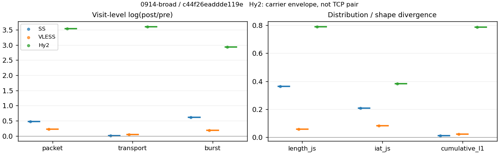
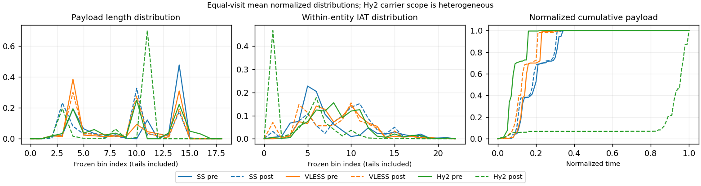

# 0914-broad · 条目 010 · developer.mozilla.org

目标：https://developer.mozilla.org/en-US/

活动标签：developer.mozilla.org::page_load。选定访问 3 次。

[返回总索引](../../README.md) · [统计口径](../../methods.md)

## 覆盖与资格（每次访问均保留）

| 部署 | 重复 | 主请求路由 | 活动状态 | 代理比较 | DIRECT pre | 请求 proxy/direct/unresolved | 错误 |
| --- | --- | --- | --- | --- | --- | --- | --- |
| Hy2 | 1 | proxy | passed | 1 | 0 | 74/0/0 | [] |
| SS | 1 | proxy | passed | 1 | 0 | 74/0/0 | [] |
| VLESS | 1 | proxy | passed | 1 | 0 | 74/0/0 | [] |

主请求非 proxy 的统计仅解释为已索引的辅助代理连接或 DIRECT 观测，不代表目标业务经代理传输。播放确认与配对资格是两道不同的门。

图中散点为单次访问，短线为重复中位数；Hy2 是共享载体包络，不能与 TCP 配对作等范围因果对比。

形态图先逐访问归一化，再对访问等权平均；实线 pre，虚线 post。分箱序号及边界见 methods，不将分箱索引误解为长度或时间。

## 每次访问的关键观测

### SS

范围：`exclusive_page`。每格 pre → post；空值为不可观测/不适用。

| 重复 | 包数 | 载荷字节 | burst | TCP FR | IAT中位µs | length JS | IAT JS |
| --- | --- | --- | --- | --- | --- | --- | --- |
| 1 | 655 → 1058 | 6.5749e+05 → 6.6917e+05 | 431 → 793 | 45 → 45 | 32.972 → 569.73 | 0.36464 | 0.20872 |

完整标量统计：中位数 [min,max]；Δ 为重复内逐访问变换的中位数，MAD 未缩放。n 为可用变换数；DIRECT-only 的 nΔ=0 不代表 pre 不可用。

| scope | 特征 | pre | post | Δ | IQRΔ | MADΔ | nΔ |
| --- | --- | --- | --- | --- | --- | --- | --- |
| exclusive_page | active_span_sum_s_1000ms | 8.5364 [8.5364, 8.5364] | 9.7895 [9.7895, 9.7895] | 0.13697 | — | — | 1 |
| exclusive_page | active_span_sum_s_100ms | 2.0361 [2.0361, 2.0361] | 3.659 [3.659, 3.659] | 0.58616 | — | — | 1 |
| exclusive_page | active_span_sum_s_500ms | 7.0709 [7.0709, 7.0709] | 8.2686 [8.2686, 8.2686] | 0.15648 | — | — | 1 |
| exclusive_page | burst_bytes_iqr | 2896 [2896, 2896] | 1428 [1428, 1428] | -0.70706 | — | — | 1 |
| exclusive_page | burst_bytes_mad | 64 [64, 64] | 34 [34, 34] | -0.63252 | — | — | 1 |
| exclusive_page | burst_bytes_max | 20688 [20688, 20688] | 7140 [7140, 7140] | -1.0638 | — | — | 1 |
| exclusive_page | burst_bytes_mean | 1525.5 [1525.5, 1525.5] | 843.84 [843.84, 843.84] | -0.59211 | — | — | 1 |
| exclusive_page | burst_bytes_median | 64 [64, 64] | 34 [34, 34] | -0.63252 | — | — | 1 |
| exclusive_page | burst_bytes_min | 0 [0, 0] | 0 [0, 0] | — | — | — | 0 |
| exclusive_page | burst_bytes_p95 | 5813 [5813, 5813] | 2896 [2896, 2896] | -0.69677 | — | — | 1 |
| exclusive_page | burst_bytes_q25 | 0 [0, 0] | 0 [0, 0] | — | — | — | 0 |
| exclusive_page | burst_bytes_q75 | 2896 [2896, 2896] | 1428 [1428, 1428] | -0.70706 | — | — | 1 |
| exclusive_page | burst_bytes_std | 2864.7 [2864.7, 2864.7] | 1210.6 [1210.6, 1210.6] | -0.86132 | — | — | 1 |
| exclusive_page | burst_count | 431 [431, 431] | 793 [793, 793] | 0.60972 | — | — | 1 |
| exclusive_page | burst_duration_ms_iqr | 0.039693 [0.039693, 0.039693] | 0 [0, 0] | — | — | — | 0 |
| exclusive_page | burst_duration_ms_mad | 0 [0, 0] | 0 [0, 0] | — | — | — | 0 |
| exclusive_page | burst_duration_ms_max | 11349 [11349, 11349] | 11351 [11351, 11351] | 0.0001826 | — | — | 1 |
| exclusive_page | burst_duration_ms_mean | 67.272 [67.272, 67.272] | 34.089 [34.089, 34.089] | -0.67976 | — | — | 1 |
| exclusive_page | burst_duration_ms_median | 0 [0, 0] | 0 [0, 0] | — | — | — | 0 |
| exclusive_page | burst_duration_ms_min | 0 [0, 0] | 0 [0, 0] | — | — | — | 0 |
| exclusive_page | burst_duration_ms_p95 | 95.027 [95.027, 95.027] | 4.049 [4.049, 4.049] | -3.1557 | — | — | 1 |
| exclusive_page | burst_duration_ms_q25 | 0 [0, 0] | 0 [0, 0] | — | — | — | 0 |
| exclusive_page | burst_duration_ms_q75 | 0.039693 [0.039693, 0.039693] | 0 [0, 0] | — | — | — | 0 |
| exclusive_page | burst_duration_ms_std | 725.71 [725.71, 725.71] | 533.58 [533.58, 533.58] | -0.30756 | — | — | 1 |
| exclusive_page | burst_packets_iqr | 1 [1, 1] | 0 [0, 0] | — | — | — | 0 |
| exclusive_page | burst_packets_mad | 0 [0, 0] | 0 [0, 0] | — | — | — | 0 |
| exclusive_page | burst_packets_max | 11 [11, 11] | 10 [10, 10] | -0.09531 | — | — | 1 |
| exclusive_page | burst_packets_mean | 1.5197 [1.5197, 1.5197] | 1.3342 [1.3342, 1.3342] | -0.13021 | — | — | 1 |
| exclusive_page | burst_packets_median | 1 [1, 1] | 1 [1, 1] | 0 | — | — | 1 |
| exclusive_page | burst_packets_min | 1 [1, 1] | 1 [1, 1] | 0 | — | — | 1 |
| exclusive_page | burst_packets_p95 | 3 [3, 3] | 3 [3, 3] | 0 | — | — | 1 |
| exclusive_page | burst_packets_q25 | 1 [1, 1] | 1 [1, 1] | 0 | — | — | 1 |
| exclusive_page | burst_packets_q75 | 2 [2, 2] | 1 [1, 1] | -0.69315 | — | — | 1 |
| exclusive_page | burst_packets_std | 1.0482 [1.0482, 1.0482] | 0.82095 [0.82095, 0.82095] | -0.24441 | — | — | 1 |
| exclusive_page | connection_span_concurrency_max | 4 [4, 4] | 4 [4, 4] | 0 | — | — | 1 |
| exclusive_page | cumulative_l1 | — | — | 0.013253 | — | — | 1 |
| exclusive_page | cumulative_max | — | — | 0.204 | — | — | 1 |
| exclusive_page | direction_entropy | 0.85062 [0.85062, 0.85062] | 0.53874 [0.53874, 0.53874] | -0.31188 | — | — | 1 |
| exclusive_page | down_burst_count | 213 [213, 213] | 394 [394, 394] | 0.61506 | — | — | 1 |
| exclusive_page | down_ip_bytes | 6.5226e+05 [6.5226e+05, 6.5226e+05] | 6.6865e+05 [6.6865e+05, 6.6865e+05] | 0.02483 | — | — | 1 |
| exclusive_page | down_packets | 383 [383, 383] | 578 [578, 578] | 0.41154 | — | — | 1 |
| exclusive_page | down_transport_bytes | 6.323e+05 [6.323e+05, 6.323e+05] | 6.385e+05 [6.385e+05, 6.385e+05] | 0.0097609 | — | — | 1 |
| exclusive_page | duration_s | 15.648 [15.648, 15.648] | 15.455 [15.455, 15.455] | -0.012411 | — | — | 1 |
| exclusive_page | entity_count | 5 [5, 5] | 5 [5, 5] | 0 | — | — | 1 |
| exclusive_page | fr_runs | 45 [45, 45] | 45 [45, 45] | 0 | — | — | 1 |
| exclusive_page | fr_runs_per_packet | 0.11628 [0.11628, 0.11628] | 0.077055 [0.077055, 0.077055] | -0.039224 | — | — | 1 |
| exclusive_page | fr_switches | 40 [40, 40] | 40 [40, 40] | 0 | — | — | 1 |
| exclusive_page | fr_switches_per_possible_transition | 0.10471 [0.10471, 0.10471] | 0.069085 [0.069085, 0.069085] | -0.035627 | — | — | 1 |
| exclusive_page | full_retransmission_fraction | 0.0030534 [0.0030534, 0.0030534] | 0.0037807 [0.0037807, 0.0037807] | 0.00072728 | — | — | 1 |
| exclusive_page | full_retransmission_packets | 2 [2, 2] | 4 [4, 4] | 0.69315 | — | — | 1 |
| exclusive_page | iat_count | 650 [650, 650] | 1053 [1053, 1053] | 0.48243 | — | — | 1 |
| exclusive_page | iat_js | — | — | 0.20872 | — | — | 1 |
| exclusive_page | iat_ks | — | — | 0.39309 | — | — | 1 |
| exclusive_page | iat_median_us | 32.972 [32.972, 32.972] | 569.73 [569.73, 569.73] | 2.8495 | — | — | 1 |
| exclusive_page | iat_us_iqr | 161.41 [161.41, 161.41] | 1573.8 [1573.8, 1573.8] | 2.2773 | — | — | 1 |
| exclusive_page | iat_us_mad | 26.066 [26.066, 26.066] | 553.24 [553.24, 553.24] | 3.0551 | — | — | 1 |
| exclusive_page | iat_us_max | 1.1349e+07 [1.1349e+07, 1.1349e+07] | 1.1351e+07 [1.1351e+07, 1.1351e+07] | 0.0001826 | — | — | 1 |
| exclusive_page | iat_us_mean | 64569 [64569, 64569] | 39575 [39575, 39575] | -0.48953 | — | — | 1 |
| exclusive_page | iat_us_median | 32.972 [32.972, 32.972] | 569.73 [569.73, 569.73] | 2.8495 | — | — | 1 |
| exclusive_page | iat_us_min | 0.049 [0.049, 0.049] | 0.039 [0.039, 0.039] | -0.22826 | — | — | 1 |
| exclusive_page | iat_us_p95 | 80749 [80749, 80749] | 35834 [35834, 35834] | -0.81245 | — | — | 1 |
| exclusive_page | iat_us_q25 | 13.921 [13.921, 13.921] | 23.084 [23.084, 23.084] | 0.50572 | — | — | 1 |
| exclusive_page | iat_us_q75 | 175.33 [175.33, 175.33] | 1596.9 [1596.9, 1596.9] | 2.2091 | — | — | 1 |
| exclusive_page | iat_us_std | 7.0531e+05 [7.0531e+05, 7.0531e+05] | 5.5244e+05 [5.5244e+05, 5.5244e+05] | -0.24429 | — | — | 1 |
| exclusive_page | iat_wasserstein_log1p_us | — | — | 1.4439 | — | — | 1 |
| exclusive_page | idle_gap_count_1000ms | 5 [5, 5] | 4 [4, 4] | -0.22314 | — | — | 1 |
| exclusive_page | idle_gap_count_100ms | 27 [27, 27] | 26 [26, 26] | -0.03774 | — | — | 1 |
| exclusive_page | idle_gap_count_500ms | 7 [7, 7] | 6 [6, 6] | -0.15415 | — | — | 1 |
| exclusive_page | idle_gap_sum_s_1000ms | 33.434 [33.434, 33.434] | 31.883 [31.883, 31.883] | -0.047478 | — | — | 1 |
| exclusive_page | idle_gap_sum_s_100ms | 39.934 [39.934, 39.934] | 38.014 [38.014, 38.014] | -0.049276 | — | — | 1 |
| exclusive_page | idle_gap_sum_s_500ms | 34.899 [34.899, 34.899] | 33.404 [33.404, 33.404] | -0.043778 | — | — | 1 |
| exclusive_page | ip_bytes | 6.9165e+05 [6.9165e+05, 6.9165e+05] | 7.3222e+05 [7.3222e+05, 7.3222e+05] | 0.056995 | — | — | 1 |
| exclusive_page | length_iqr | 2728.5 [2728.5, 2728.5] | 1360 [1360, 1360] | -0.69627 | — | — | 1 |
| exclusive_page | length_js | — | — | 0.36464 | — | — | 1 |
| exclusive_page | length_ks | — | — | 0.45478 | — | — | 1 |
| exclusive_page | length_mad | 1150 [1150, 1150] | 1286 [1286, 1286] | 0.11177 | — | — | 1 |
| exclusive_page | length_max | 4096 [4096, 4096] | 2856 [2856, 2856] | -0.36059 | — | — | 1 |
| exclusive_page | length_mean | 1698.9 [1698.9, 1698.9] | 1145.8 [1145.8, 1145.8] | -0.39387 | — | — | 1 |
| exclusive_page | length_median | 1746 [1746, 1746] | 1428 [1428, 1428] | -0.20105 | — | — | 1 |
| exclusive_page | length_min | 31 [31, 31] | 20 [20, 20] | -0.43825 | — | — | 1 |
| exclusive_page | length_p95 | 2896 [2896, 2896] | 2856 [2856, 2856] | -0.013908 | — | — | 1 |
| exclusive_page | length_q25 | 167.5 [167.5, 167.5] | 73 [73, 73] | -0.83052 | — | — | 1 |
| exclusive_page | length_q75 | 2896 [2896, 2896] | 1433 [1433, 1433] | -0.70356 | — | — | 1 |
| exclusive_page | length_std | 1245.9 [1245.9, 1245.9] | 990.16 [990.16, 990.16] | -0.22974 | — | — | 1 |
| exclusive_page | length_wasserstein_bytes | — | — | 553.19 | — | — | 1 |
| exclusive_page | nonempty_entity_count | 5 [5, 5] | 5 [5, 5] | 0 | — | — | 1 |
| exclusive_page | nonempty_packets | 387 [387, 387] | 584 [584, 584] | 0.41148 | — | — | 1 |
| exclusive_page | offload_suspect_fraction | 0.30229 [0.30229, 0.30229] | 0.12476 [0.12476, 0.12476] | -0.17753 | — | — | 1 |
| exclusive_page | packet_count | 655 [655, 655] | 1058 [1058, 1058] | 0.4795 | — | — | 1 |
| exclusive_page | rtt_median_ms | 0.070851 [0.070851, 0.070851] | 33.005 [33.005, 33.005] | 6.1438 | — | — | 1 |
| exclusive_page | rtt_sample_count | 259 [259, 259] | 183 [183, 183] | -0.34734 | — | — | 1 |
| exclusive_page | tcp_ack_count | 650 [650, 650] | 1052 [1052, 1052] | 0.48148 | — | — | 1 |
| exclusive_page | tcp_fin_count | 10 [10, 10] | 10 [10, 10] | 0 | — | — | 1 |
| exclusive_page | tcp_packet_count | 655 [655, 655] | 1058 [1058, 1058] | 0.4795 | — | — | 1 |
| exclusive_page | tcp_rst_count | 0 [0, 0] | 0 [0, 0] | — | — | — | 0 |
| exclusive_page | tcp_syn_count | 10 [10, 10] | 11 [11, 11] | 0.09531 | — | — | 1 |
| exclusive_page | tcp_window_raw_median | 65535 [65535, 65535] | 145 [145, 145] | -6.1136 | — | — | 1 |
| exclusive_page | transition_entropy | 0.45575 [0.45575, 0.45575] | 0.30336 [0.30336, 0.30336] | -0.15239 | — | — | 1 |
| exclusive_page | transition_n_mm | 258 [258, 258] | 490 [490, 490] | 0.64145 | — | — | 1 |
| exclusive_page | transition_n_mp | 18 [18, 18] | 18 [18, 18] | 0 | — | — | 1 |
| exclusive_page | transition_n_pm | 22 [22, 22] | 22 [22, 22] | 0 | — | — | 1 |
| exclusive_page | transition_n_pp | 84 [84, 84] | 49 [49, 49] | -0.539 | — | — | 1 |
| exclusive_page | transition_p_mm | 0.93478 [0.93478, 0.93478] | 0.96457 [0.96457, 0.96457] | 0.029784 | — | — | 1 |
| exclusive_page | transition_p_mp | 0.065217 [0.065217, 0.065217] | 0.035433 [0.035433, 0.035433] | -0.029784 | — | — | 1 |
| exclusive_page | transition_p_pm | 0.20755 [0.20755, 0.20755] | 0.30986 [0.30986, 0.30986] | 0.10231 | — | — | 1 |
| exclusive_page | transition_p_pp | 0.79245 [0.79245, 0.79245] | 0.69014 [0.69014, 0.69014] | -0.10231 | — | — | 1 |
| exclusive_page | transport_bytes | 6.5749e+05 [6.5749e+05, 6.5749e+05] | 6.6917e+05 [6.6917e+05, 6.6917e+05] | 0.017606 | — | — | 1 |
| exclusive_page | up_burst_count | 218 [218, 218] | 399 [399, 399] | 0.60447 | — | — | 1 |
| exclusive_page | up_byte_fraction | 0.038312 [0.038312, 0.038312] | 0.045827 [0.045827, 0.045827] | 0.0075147 | — | — | 1 |
| exclusive_page | up_ip_bytes | 39398 [39398, 39398] | 63566 [63566, 63566] | 0.47836 | — | — | 1 |
| exclusive_page | up_packets | 272 [272, 272] | 480 [480, 480] | 0.56798 | — | — | 1 |
| exclusive_page | up_transport_bytes | 25190 [25190, 25190] | 30666 [30666, 30666] | 0.19671 | — | — | 1 |
| exclusive_page | zero_iat_count | 0 [0, 0] | 0 [0, 0] | — | — | — | 0 |
| exclusive_page | zero_iat_fraction | 0 [0, 0] | 0 [0, 0] | 0 | — | — | 1 |

### VLESS

范围：`exclusive_page`。每格 pre → post；空值为不可观测/不适用。

| 重复 | 包数 | 载荷字节 | burst | TCP FR | IAT中位µs | length JS | IAT JS |
| --- | --- | --- | --- | --- | --- | --- | --- |
| 1 | 845 → 1056 | 6.4579e+05 → 6.791e+05 | 558 → 676 | 42 → 48 | 220.61 → 167.83 | 0.058151 | 0.081556 |

完整标量统计：中位数 [min,max]；Δ 为重复内逐访问变换的中位数，MAD 未缩放。n 为可用变换数；DIRECT-only 的 nΔ=0 不代表 pre 不可用。

| scope | 特征 | pre | post | Δ | IQRΔ | MADΔ | nΔ |
| --- | --- | --- | --- | --- | --- | --- | --- |
| exclusive_page | active_span_sum_s_1000ms | 7.5495 [7.5495, 7.5495] | 6.7899 [6.7899, 6.7899] | -0.10605 | — | — | 1 |
| exclusive_page | active_span_sum_s_100ms | 1.6147 [1.6147, 1.6147] | 2.8745 [2.8745, 2.8745] | 0.57671 | — | — | 1 |
| exclusive_page | active_span_sum_s_500ms | 3.7056 [3.7056, 3.7056] | 6.1584 [6.1584, 6.1584] | 0.50799 | — | — | 1 |
| exclusive_page | burst_bytes_iqr | 2896 [2896, 2896] | 1761.5 [1761.5, 1761.5] | -0.49716 | — | — | 1 |
| exclusive_page | burst_bytes_mad | 39 [39, 39] | 72 [72, 72] | 0.6131 | — | — | 1 |
| exclusive_page | burst_bytes_max | 11517 [11517, 11517] | 4236 [4236, 4236] | -1.0002 | — | — | 1 |
| exclusive_page | burst_bytes_mean | 1157.3 [1157.3, 1157.3] | 1004.6 [1004.6, 1004.6] | -0.14154 | — | — | 1 |
| exclusive_page | burst_bytes_median | 39 [39, 39] | 72 [72, 72] | 0.6131 | — | — | 1 |
| exclusive_page | burst_bytes_min | 0 [0, 0] | 0 [0, 0] | — | — | — | 0 |
| exclusive_page | burst_bytes_p95 | 4277.4 [4277.4, 4277.4] | 2896 [2896, 2896] | -0.39001 | — | — | 1 |
| exclusive_page | burst_bytes_q25 | 0 [0, 0] | 0 [0, 0] | — | — | — | 0 |
| exclusive_page | burst_bytes_q75 | 2896 [2896, 2896] | 1761.5 [1761.5, 1761.5] | -0.49716 | — | — | 1 |
| exclusive_page | burst_bytes_std | 1653.9 [1653.9, 1653.9] | 1189.8 [1189.8, 1189.8] | -0.32937 | — | — | 1 |
| exclusive_page | burst_count | 558 [558, 558] | 676 [676, 676] | 0.19183 | — | — | 1 |
| exclusive_page | burst_duration_ms_iqr | 0.8172 [0.8172, 0.8172] | 0.53308 [0.53308, 0.53308] | -0.4272 | — | — | 1 |
| exclusive_page | burst_duration_ms_mad | 0 [0, 0] | 0 [0, 0] | — | — | — | 0 |
| exclusive_page | burst_duration_ms_max | 9106.4 [9106.4, 9106.4] | 9106.7 [9106.7, 9106.7] | 2.7742e-05 | — | — | 1 |
| exclusive_page | burst_duration_ms_mean | 28.667 [28.667, 28.667] | 19.245 [19.245, 19.245] | -0.39853 | — | — | 1 |
| exclusive_page | burst_duration_ms_median | 0 [0, 0] | 0 [0, 0] | — | — | — | 0 |
| exclusive_page | burst_duration_ms_min | 0 [0, 0] | 0 [0, 0] | — | — | — | 0 |
| exclusive_page | burst_duration_ms_p95 | 9.7069 [9.7069, 9.7069] | 9.5987 [9.5987, 9.5987] | -0.011215 | — | — | 1 |
| exclusive_page | burst_duration_ms_q25 | 0 [0, 0] | 0 [0, 0] | — | — | — | 0 |
| exclusive_page | burst_duration_ms_q75 | 0.8172 [0.8172, 0.8172] | 0.53308 [0.53308, 0.53308] | -0.4272 | — | — | 1 |
| exclusive_page | burst_duration_ms_std | 394.41 [394.41, 394.41] | 351.16 [351.16, 351.16] | -0.11613 | — | — | 1 |
| exclusive_page | burst_packets_iqr | 1 [1, 1] | 1 [1, 1] | 0 | — | — | 1 |
| exclusive_page | burst_packets_mad | 0 [0, 0] | 0 [0, 0] | — | — | — | 0 |
| exclusive_page | burst_packets_max | 7 [7, 7] | 13 [13, 13] | 0.61904 | — | — | 1 |
| exclusive_page | burst_packets_mean | 1.5143 [1.5143, 1.5143] | 1.5621 [1.5621, 1.5621] | 0.031073 | — | — | 1 |
| exclusive_page | burst_packets_median | 1 [1, 1] | 1 [1, 1] | 0 | — | — | 1 |
| exclusive_page | burst_packets_min | 1 [1, 1] | 1 [1, 1] | 0 | — | — | 1 |
| exclusive_page | burst_packets_p95 | 2 [2, 2] | 3 [3, 3] | 0.40547 | — | — | 1 |
| exclusive_page | burst_packets_q25 | 1 [1, 1] | 1 [1, 1] | 0 | — | — | 1 |
| exclusive_page | burst_packets_q75 | 2 [2, 2] | 2 [2, 2] | 0 | — | — | 1 |
| exclusive_page | burst_packets_std | 0.66584 [0.66584, 0.66584] | 0.99138 [0.99138, 0.99138] | 0.39804 | — | — | 1 |
| exclusive_page | connection_span_concurrency_max | 3 [3, 3] | 3 [3, 3] | 0 | — | — | 1 |
| exclusive_page | cumulative_l1 | — | — | 0.022246 | — | — | 1 |
| exclusive_page | cumulative_max | — | — | 0.28519 | — | — | 1 |
| exclusive_page | direction_entropy | 0.68963 [0.68963, 0.68963] | 0.50106 [0.50106, 0.50106] | -0.18857 | — | — | 1 |
| exclusive_page | down_burst_count | 277 [277, 277] | 336 [336, 336] | 0.19309 | — | — | 1 |
| exclusive_page | down_ip_bytes | 6.5202e+05 [6.5202e+05, 6.5202e+05] | 6.8222e+05 [6.8222e+05, 6.8222e+05] | 0.045279 | — | — | 1 |
| exclusive_page | down_packets | 517 [517, 517] | 610 [610, 610] | 0.16542 | — | — | 1 |
| exclusive_page | down_transport_bytes | 6.251e+05 [6.251e+05, 6.251e+05] | 6.5046e+05 [6.5046e+05, 6.5046e+05] | 0.039776 | — | — | 1 |
| exclusive_page | duration_s | 14.6 [14.6, 14.6] | 14.224 [14.224, 14.224] | -0.026055 | — | — | 1 |
| exclusive_page | entity_count | 4 [4, 4] | 4 [4, 4] | 0 | — | — | 1 |
| exclusive_page | fr_runs | 42 [42, 42] | 48 [48, 48] | 0.13353 | — | — | 1 |
| exclusive_page | fr_runs_per_packet | 0.079848 [0.079848, 0.079848] | 0.079077 [0.079077, 0.079077] | -0.00077048 | — | — | 1 |
| exclusive_page | fr_switches | 38 [38, 38] | 44 [44, 44] | 0.1466 | — | — | 1 |
| exclusive_page | fr_switches_per_possible_transition | 0.072797 [0.072797, 0.072797] | 0.072968 [0.072968, 0.072968] | 0.00017156 | — | — | 1 |
| exclusive_page | full_retransmission_fraction | 0 [0, 0] | 0 [0, 0] | 0 | — | — | 1 |
| exclusive_page | full_retransmission_packets | 0 [0, 0] | 0 [0, 0] | — | — | — | 0 |
| exclusive_page | iat_count | 841 [841, 841] | 1052 [1052, 1052] | 0.22386 | — | — | 1 |
| exclusive_page | iat_js | — | — | 0.081556 | — | — | 1 |
| exclusive_page | iat_ks | — | — | 0.19166 | — | — | 1 |
| exclusive_page | iat_median_us | 220.61 [220.61, 220.61] | 167.83 [167.83, 167.83] | -0.27343 | — | — | 1 |
| exclusive_page | iat_us_iqr | 998.09 [998.09, 998.09] | 989.07 [989.07, 989.07] | -0.0090824 | — | — | 1 |
| exclusive_page | iat_us_mad | 212.25 [212.25, 212.25] | 167.7 [167.7, 167.7] | -0.23559 | — | — | 1 |
| exclusive_page | iat_us_max | 9.1064e+06 [9.1064e+06, 9.1064e+06] | 9.1067e+06 [9.1067e+06, 9.1067e+06] | 2.6667e-05 | — | — | 1 |
| exclusive_page | iat_us_mean | 21185 [21185, 21185] | 16211 [16211, 16211] | -0.26762 | — | — | 1 |
| exclusive_page | iat_us_median | 220.61 [220.61, 220.61] | 167.83 [167.83, 167.83] | -0.27343 | — | — | 1 |
| exclusive_page | iat_us_min | 1.276 [1.276, 1.276] | 0.038 [0.038, 0.038] | -3.5139 | — | — | 1 |
| exclusive_page | iat_us_p95 | 9704.4 [9704.4, 9704.4] | 37306 [37306, 37306] | 1.3466 | — | — | 1 |
| exclusive_page | iat_us_q25 | 38.847 [38.847, 38.847] | 10.87 [10.87, 10.87] | -1.2736 | — | — | 1 |
| exclusive_page | iat_us_q75 | 1036.9 [1036.9, 1036.9] | 999.94 [999.94, 999.94] | -0.036335 | — | — | 1 |
| exclusive_page | iat_us_std | 3.2239e+05 [3.2239e+05, 3.2239e+05] | 2.8458e+05 [2.8458e+05, 2.8458e+05] | -0.12476 | — | — | 1 |
| exclusive_page | iat_wasserstein_log1p_us | — | — | 0.55626 | — | — | 1 |
| exclusive_page | idle_gap_count_1000ms | 2 [2, 2] | 2 [2, 2] | 0 | — | — | 1 |
| exclusive_page | idle_gap_count_100ms | 18 [18, 18] | 21 [21, 21] | 0.15415 | — | — | 1 |
| exclusive_page | idle_gap_count_500ms | 7 [7, 7] | 3 [3, 3] | -0.8473 | — | — | 1 |
| exclusive_page | idle_gap_sum_s_1000ms | 10.267 [10.267, 10.267] | 10.264 [10.264, 10.264] | -0.00031303 | — | — | 1 |
| exclusive_page | idle_gap_sum_s_100ms | 16.202 [16.202, 16.202] | 14.179 [14.179, 14.179] | -0.13335 | — | — | 1 |
| exclusive_page | idle_gap_sum_s_500ms | 14.111 [14.111, 14.111] | 10.895 [10.895, 10.895] | -0.25862 | — | — | 1 |
| exclusive_page | ip_bytes | 6.897e+05 [6.897e+05, 6.897e+05] | 7.3514e+05 [7.3514e+05, 7.3514e+05] | 0.063811 | — | — | 1 |
| exclusive_page | length_iqr | 2752 [2752, 2752] | 1345 [1345, 1345] | -0.71593 | — | — | 1 |
| exclusive_page | length_js | — | — | 0.058151 | — | — | 1 |
| exclusive_page | length_ks | — | — | 0.15428 | — | — | 1 |
| exclusive_page | length_mad | 1091 [1091, 1091] | 1340 [1340, 1340] | 0.20557 | — | — | 1 |
| exclusive_page | length_max | 2896 [2896, 2896] | 2896 [2896, 2896] | 0 | — | — | 1 |
| exclusive_page | length_mean | 1227.7 [1227.7, 1227.7] | 1118.8 [1118.8, 1118.8] | -0.092935 | — | — | 1 |
| exclusive_page | length_median | 1163 [1163, 1163] | 1412 [1412, 1412] | 0.194 | — | — | 1 |
| exclusive_page | length_min | 5 [5, 5] | 5 [5, 5] | 0 | — | — | 1 |
| exclusive_page | length_p95 | 2896 [2896, 2896] | 2824 [2824, 2824] | -0.025176 | — | — | 1 |
| exclusive_page | length_q25 | 72 [72, 72] | 72 [72, 72] | 0 | — | — | 1 |
| exclusive_page | length_q75 | 2824 [2824, 2824] | 1417 [1417, 1417] | -0.68961 | — | — | 1 |
| exclusive_page | length_std | 1187 [1187, 1187] | 1009.1 [1009.1, 1009.1] | -0.16237 | — | — | 1 |
| exclusive_page | length_wasserstein_bytes | — | — | 237.79 | — | — | 1 |
| exclusive_page | nonempty_entity_count | 4 [4, 4] | 4 [4, 4] | 0 | — | — | 1 |
| exclusive_page | nonempty_packets | 526 [526, 526] | 607 [607, 607] | 0.14323 | — | — | 1 |
| exclusive_page | offload_suspect_fraction | 0.22249 [0.22249, 0.22249] | 0.12311 [0.12311, 0.12311] | -0.099379 | — | — | 1 |
| exclusive_page | packet_count | 845 [845, 845] | 1056 [1056, 1056] | 0.22291 | — | — | 1 |
| exclusive_page | rtt_median_ms | 0.48962 [0.48962, 0.48962] | 0.74746 [0.74746, 0.74746] | 0.42306 | — | — | 1 |
| exclusive_page | rtt_sample_count | 307 [307, 307] | 402 [402, 402] | 0.2696 | — | — | 1 |
| exclusive_page | tcp_ack_count | 833 [833, 833] | 1052 [1052, 1052] | 0.23341 | — | — | 1 |
| exclusive_page | tcp_fin_count | 8 [8, 8] | 8 [8, 8] | 0 | — | — | 1 |
| exclusive_page | tcp_packet_count | 845 [845, 845] | 1056 [1056, 1056] | 0.22291 | — | — | 1 |
| exclusive_page | tcp_rst_count | 8 [8, 8] | 0 [0, 0] | — | — | — | 0 |
| exclusive_page | tcp_syn_count | 8 [8, 8] | 8 [8, 8] | 0 | — | — | 1 |
| exclusive_page | tcp_window_raw_median | 65535 [65535, 65535] | 186 [186, 186] | -5.8646 | — | — | 1 |
| exclusive_page | transition_entropy | 0.33733 [0.33733, 0.33733] | 0.30887 [0.30887, 0.30887] | -0.028452 | — | — | 1 |
| exclusive_page | transition_n_mm | 408 [408, 408] | 516 [516, 516] | 0.23484 | — | — | 1 |
| exclusive_page | transition_n_mp | 17 [17, 17] | 20 [20, 20] | 0.16252 | — | — | 1 |
| exclusive_page | transition_n_pm | 21 [21, 21] | 24 [24, 24] | 0.13353 | — | — | 1 |
| exclusive_page | transition_n_pp | 76 [76, 76] | 43 [43, 43] | -0.56953 | — | — | 1 |
| exclusive_page | transition_p_mm | 0.96 [0.96, 0.96] | 0.96269 [0.96269, 0.96269] | 0.0026866 | — | — | 1 |
| exclusive_page | transition_p_mp | 0.04 [0.04, 0.04] | 0.037313 [0.037313, 0.037313] | -0.0026866 | — | — | 1 |
| exclusive_page | transition_p_pm | 0.21649 [0.21649, 0.21649] | 0.35821 [0.35821, 0.35821] | 0.14171 | — | — | 1 |
| exclusive_page | transition_p_pp | 0.78351 [0.78351, 0.78351] | 0.64179 [0.64179, 0.64179] | -0.14171 | — | — | 1 |
| exclusive_page | transport_bytes | 6.4579e+05 [6.4579e+05, 6.4579e+05] | 6.791e+05 [6.791e+05, 6.791e+05] | 0.050292 | — | — | 1 |
| exclusive_page | up_burst_count | 281 [281, 281] | 340 [340, 340] | 0.19059 | — | — | 1 |
| exclusive_page | up_byte_fraction | 0.032043 [0.032043, 0.032043] | 0.042169 [0.042169, 0.042169] | 0.010126 | — | — | 1 |
| exclusive_page | up_ip_bytes | 37685 [37685, 37685] | 52929 [52929, 52929] | 0.33969 | — | — | 1 |
| exclusive_page | up_packets | 328 [328, 328] | 446 [446, 446] | 0.30731 | — | — | 1 |
| exclusive_page | up_transport_bytes | 20693 [20693, 20693] | 28637 [28637, 28637] | 0.3249 | — | — | 1 |
| exclusive_page | zero_iat_count | 0 [0, 0] | 0 [0, 0] | — | — | — | 0 |
| exclusive_page | zero_iat_fraction | 0 [0, 0] | 0 [0, 0] | 0 | — | — | 1 |

### Hy2

范围：`carrier_context_envelope`。每格 pre → post；空值为不可观测/不适用。

| 重复 | 包数 | 载荷字节 | burst | TCP FR | IAT中位µs | length JS | IAT JS |
| --- | --- | --- | --- | --- | --- | --- | --- |
| 1 | 641 → 22114 | 6.6033e+05 → 2.4036e+07 | 405 → 7582 | — | 163.84 → 5.61 | 0.78774 | 0.38145 |

完整标量统计：中位数 [min,max]；Δ 为重复内逐访问变换的中位数，MAD 未缩放。n 为可用变换数；DIRECT-only 的 nΔ=0 不代表 pre 不可用。

| scope | 特征 | pre | post | Δ | IQRΔ | MADΔ | nΔ |
| --- | --- | --- | --- | --- | --- | --- | --- |
| carrier_context_envelope | active_span_sum_s_1000ms | 6.5134 [6.5134, 6.5134] | 6.6801 [6.6801, 6.6801] | 0.025274 | — | — | 1 |
| carrier_context_envelope | active_span_sum_s_100ms | 1.2198 [1.2198, 1.2198] | 5.1084 [5.1084, 5.1084] | 1.4322 | — | — | 1 |
| carrier_context_envelope | active_span_sum_s_500ms | 5.0642 [5.0642, 5.0642] | 6.6801 [6.6801, 6.6801] | 0.27694 | — | — | 1 |
| carrier_context_envelope | burst_bytes_iqr | 1842 [1842, 1842] | 4286 [4286, 4286] | 0.8445 | — | — | 1 |
| carrier_context_envelope | burst_bytes_mad | 64 [64, 64] | 348.5 [348.5, 348.5] | 1.6948 | — | — | 1 |
| carrier_context_envelope | burst_bytes_max | 20480 [20480, 20480] | 2.1851e+05 [2.1851e+05, 2.1851e+05] | 2.3674 | — | — | 1 |
| carrier_context_envelope | burst_bytes_mean | 1630.5 [1630.5, 1630.5] | 3170.1 [3170.1, 3170.1] | 0.66492 | — | — | 1 |
| carrier_context_envelope | burst_bytes_median | 64 [64, 64] | 381.5 [381.5, 381.5] | 1.7852 | — | — | 1 |
| carrier_context_envelope | burst_bytes_min | 0 [0, 0] | 22 [22, 22] | — | — | — | 0 |
| carrier_context_envelope | burst_bytes_p95 | 7982.8 [7982.8, 7982.8] | 10932 [10932, 10932] | 0.31441 | — | — | 1 |
| carrier_context_envelope | burst_bytes_q25 | 0 [0, 0] | 37 [37, 37] | — | — | — | 0 |
| carrier_context_envelope | burst_bytes_q75 | 1842 [1842, 1842] | 4323 [4323, 4323] | 0.8531 | — | — | 1 |
| carrier_context_envelope | burst_bytes_std | 3309.7 [3309.7, 3309.7] | 6721.4 [6721.4, 6721.4] | 0.70845 | — | — | 1 |
| carrier_context_envelope | burst_count | 405 [405, 405] | 7582 [7582, 7582] | 2.9296 | — | — | 1 |
| carrier_context_envelope | burst_duration_ms_iqr | 0.78421 [0.78421, 0.78421] | 0.025644 [0.025644, 0.025644] | -3.4204 | — | — | 1 |
| carrier_context_envelope | burst_duration_ms_mad | 0 [0, 0] | 4.7e-05 [4.7e-05, 4.7e-05] | — | — | — | 0 |
| carrier_context_envelope | burst_duration_ms_max | 10236 [10236, 10236] | 477.88 [477.88, 477.88] | -3.0643 | — | — | 1 |
| carrier_context_envelope | burst_duration_ms_mean | 64.284 [64.284, 64.284] | 0.35072 [0.35072, 0.35072] | -5.2111 | — | — | 1 |
| carrier_context_envelope | burst_duration_ms_median | 0 [0, 0] | 4.7e-05 [4.7e-05, 4.7e-05] | — | — | — | 0 |
| carrier_context_envelope | burst_duration_ms_min | 0 [0, 0] | 0 [0, 0] | — | — | — | 0 |
| carrier_context_envelope | burst_duration_ms_p95 | 157.24 [157.24, 157.24] | 0.25072 [0.25072, 0.25072] | -6.4412 | — | — | 1 |
| carrier_context_envelope | burst_duration_ms_q25 | 0 [0, 0] | 0 [0, 0] | — | — | — | 0 |
| carrier_context_envelope | burst_duration_ms_q75 | 0.78421 [0.78421, 0.78421] | 0.025644 [0.025644, 0.025644] | -3.4204 | — | — | 1 |
| carrier_context_envelope | burst_duration_ms_std | 718.37 [718.37, 718.37] | 7.4618 [7.4618, 7.4618] | -4.5672 | — | — | 1 |
| carrier_context_envelope | burst_packets_iqr | 1 [1, 1] | 2 [2, 2] | 0.69315 | — | — | 1 |
| carrier_context_envelope | burst_packets_mad | 0 [0, 0] | 1 [1, 1] | — | — | — | 0 |
| carrier_context_envelope | burst_packets_max | 8 [8, 8] | 163 [163, 163] | 3.0143 | — | — | 1 |
| carrier_context_envelope | burst_packets_mean | 1.5827 [1.5827, 1.5827] | 2.9166 [2.9166, 2.9166] | 0.61129 | — | — | 1 |
| carrier_context_envelope | burst_packets_median | 1 [1, 1] | 2 [2, 2] | 0.69315 | — | — | 1 |
| carrier_context_envelope | burst_packets_min | 1 [1, 1] | 1 [1, 1] | 0 | — | — | 1 |
| carrier_context_envelope | burst_packets_p95 | 3 [3, 3] | 8 [8, 8] | 0.98083 | — | — | 1 |
| carrier_context_envelope | burst_packets_q25 | 1 [1, 1] | 1 [1, 1] | 0 | — | — | 1 |
| carrier_context_envelope | burst_packets_q75 | 2 [2, 2] | 3 [3, 3] | 0.40547 | — | — | 1 |
| carrier_context_envelope | burst_packets_std | 0.85848 [0.85848, 0.85848] | 4.6547 [4.6547, 4.6547] | 1.6905 | — | — | 1 |
| carrier_context_envelope | connection_span_concurrency_max | 4 [4, 4] | 1 [1, 1] | -1.3863 | — | — | 1 |
| carrier_context_envelope | cumulative_l1 | — | — | 0.78459 | — | — | 1 |
| carrier_context_envelope | cumulative_max | — | — | 0.93225 | — | — | 1 |
| carrier_context_envelope | direction_entropy | 0.86116 [0.86116, 0.86116] | 0.7503 [0.7503, 0.7503] | -0.11086 | — | — | 1 |
| carrier_context_envelope | direction_run_analog_runs | 56 [56, 56] | 7582 [7582, 7582] | 4.9082 | — | — | 1 |
| carrier_context_envelope | direction_run_analog_runs_per_packet | 0.1447 [0.1447, 0.1447] | 0.34286 [0.34286, 0.34286] | 0.19816 | — | — | 1 |
| carrier_context_envelope | direction_run_analog_switches | 51 [51, 51] | 7581 [7581, 7581] | 5.0016 | — | — | 1 |
| carrier_context_envelope | direction_run_analog_switches_per_possible_transition | 0.13351 [0.13351, 0.13351] | 0.34283 [0.34283, 0.34283] | 0.20932 | — | — | 1 |
| carrier_context_envelope | down_burst_count | 200 [200, 200] | 3791 [3791, 3791] | 2.9421 | — | — | 1 |
| carrier_context_envelope | down_ip_bytes | 6.5443e+05 [6.5443e+05, 6.5443e+05] | 2.4262e+07 [2.4262e+07, 2.4262e+07] | 3.6129 | — | — | 1 |
| carrier_context_envelope | down_packets | 372 [372, 372] | 17367 [17367, 17367] | 3.8434 | — | — | 1 |
| carrier_context_envelope | down_transport_bytes | 6.3505e+05 [6.3505e+05, 6.3505e+05] | 2.3776e+07 [2.3776e+07, 2.3776e+07] | 3.6227 | — | — | 1 |
| carrier_context_envelope | duration_s | 13.452 [13.452, 13.452] | 13.449 [13.449, 13.449] | -0.00027911 | — | — | 1 |
| carrier_context_envelope | entity_count | 5 [5, 5] | 1 [1, 1] | -1.6094 | — | — | 1 |
| carrier_context_envelope | full_retransmission_fraction | 0.0031201 [0.0031201, 0.0031201] | — | — | — | — | 0 |
| carrier_context_envelope | full_retransmission_packets | 2 [2, 2] | — | — | — | — | 0 |
| carrier_context_envelope | iat_count | 636 [636, 636] | 22113 [22113, 22113] | 3.5487 | — | — | 1 |
| carrier_context_envelope | iat_js | — | — | 0.38145 | — | — | 1 |
| carrier_context_envelope | iat_ks | — | — | 0.56168 | — | — | 1 |
| carrier_context_envelope | iat_median_us | 163.84 [163.84, 163.84] | 5.61 [5.61, 5.61] | -3.3743 | — | — | 1 |
| carrier_context_envelope | iat_us_iqr | 959.34 [959.34, 959.34] | 31.121 [31.121, 31.121] | -3.4284 | — | — | 1 |
| carrier_context_envelope | iat_us_mad | 151.08 [151.08, 151.08] | 5.574 [5.574, 5.574] | -3.2997 | — | — | 1 |
| carrier_context_envelope | iat_us_max | 1.0236e+07 [1.0236e+07, 1.0236e+07] | 5.4033e+06 [5.4033e+06, 5.4033e+06] | -0.63886 | — | — | 1 |
| carrier_context_envelope | iat_us_mean | 42368 [42368, 42368] | 608.18 [608.18, 608.18] | -4.2437 | — | — | 1 |
| carrier_context_envelope | iat_us_median | 163.84 [163.84, 163.84] | 5.61 [5.61, 5.61] | -3.3743 | — | — | 1 |
| carrier_context_envelope | iat_us_min | 0.085 [0.085, 0.085] | 0.001 [0.001, 0.001] | -4.4427 | — | — | 1 |
| carrier_context_envelope | iat_us_p95 | 40258 [40258, 40258] | 691.93 [691.93, 691.93] | -4.0636 | — | — | 1 |
| carrier_context_envelope | iat_us_q25 | 47.529 [47.529, 47.529] | 0.044 [0.044, 0.044] | -6.9849 | — | — | 1 |
| carrier_context_envelope | iat_us_q75 | 1006.9 [1006.9, 1006.9] | 31.165 [31.165, 31.165] | -3.4753 | — | — | 1 |
| carrier_context_envelope | iat_us_std | 5.7404e+05 [5.7404e+05, 5.7404e+05] | 37792 [37792, 37792] | -2.7206 | — | — | 1 |
| carrier_context_envelope | iat_wasserstein_log1p_us | — | — | 3.4892 | — | — | 1 |
| carrier_context_envelope | idle_gap_count_1000ms | 2 [2, 2] | 2 [2, 2] | 0 | — | — | 1 |
| carrier_context_envelope | idle_gap_count_100ms | 22 [22, 22] | 10 [10, 10] | -0.78846 | — | — | 1 |
| carrier_context_envelope | idle_gap_count_500ms | 4 [4, 4] | 2 [2, 2] | -0.69315 | — | — | 1 |
| carrier_context_envelope | idle_gap_sum_s_1000ms | 20.432 [20.432, 20.432] | 6.7686 [6.7686, 6.7686] | -1.1048 | — | — | 1 |
| carrier_context_envelope | idle_gap_sum_s_100ms | 25.726 [25.726, 25.726] | 8.3403 [8.3403, 8.3403] | -1.1264 | — | — | 1 |
| carrier_context_envelope | idle_gap_sum_s_500ms | 21.882 [21.882, 21.882] | 6.7686 [6.7686, 6.7686] | -1.1734 | — | — | 1 |
| carrier_context_envelope | ip_bytes | 6.9377e+05 [6.9377e+05, 6.9377e+05] | 2.4655e+07 [2.4655e+07, 2.4655e+07] | 3.5706 | — | — | 1 |
| carrier_context_envelope | length_iqr | 2684.5 [2684.5, 2684.5] | 596 [596, 596] | -1.505 | — | — | 1 |
| carrier_context_envelope | length_js | — | — | 0.78774 | — | — | 1 |
| carrier_context_envelope | length_ks | — | — | 0.36888 | — | — | 1 |
| carrier_context_envelope | length_mad | 1291 [1291, 1291] | 0 [0, 0] | — | — | — | 0 |
| carrier_context_envelope | length_max | 8920 [8920, 8920] | 1441 [1441, 1441] | -1.823 | — | — | 1 |
| carrier_context_envelope | length_mean | 1706.3 [1706.3, 1706.3] | 1086.9 [1086.9, 1086.9] | -0.45098 | — | — | 1 |
| carrier_context_envelope | length_median | 1415 [1415, 1415] | 1441 [1441, 1441] | 0.018208 | — | — | 1 |
| carrier_context_envelope | length_min | 31 [31, 31] | 22 [22, 22] | -0.34294 | — | — | 1 |
| carrier_context_envelope | length_p95 | 6479 [6479, 6479] | 1441 [1441, 1441] | -1.5032 | — | — | 1 |
| carrier_context_envelope | length_q25 | 138.5 [138.5, 138.5] | 845 [845, 845] | 1.8085 | — | — | 1 |
| carrier_context_envelope | length_q75 | 2823 [2823, 2823] | 1441 [1441, 1441] | -0.67246 | — | — | 1 |
| carrier_context_envelope | length_std | 1925.8 [1925.8, 1925.8] | 580.52 [580.52, 580.52] | -1.1992 | — | — | 1 |
| carrier_context_envelope | length_wasserstein_bytes | — | — | 912.86 | — | — | 1 |
| carrier_context_envelope | nonempty_entity_count | 5 [5, 5] | 1 [1, 1] | -1.6094 | — | — | 1 |
| carrier_context_envelope | nonempty_packets | 387 [387, 387] | 22114 [22114, 22114] | 4.0455 | — | — | 1 |
| carrier_context_envelope | offload_suspect_fraction | 0.20437 [0.20437, 0.20437] | 0 [0, 0] | -0.20437 | — | — | 1 |
| carrier_context_envelope | packet_count | 641 [641, 641] | 22114 [22114, 22114] | 3.5409 | — | — | 1 |
| carrier_context_envelope | rtt_median_ms | 0.19285 [0.19285, 0.19285] | — | — | — | — | 0 |
| carrier_context_envelope | rtt_sample_count | 245 [245, 245] | 0 [0, 0] | — | — | — | 0 |
| carrier_context_envelope | tcp_ack_count | 636 [636, 636] | — | — | — | — | 0 |
| carrier_context_envelope | tcp_fin_count | 10 [10, 10] | — | — | — | — | 0 |
| carrier_context_envelope | tcp_packet_count | 641 [641, 641] | 0 [0, 0] | — | — | — | 0 |
| carrier_context_envelope | tcp_rst_count | 0 [0, 0] | — | — | — | — | 0 |
| carrier_context_envelope | tcp_syn_count | 10 [10, 10] | — | — | — | — | 0 |
| carrier_context_envelope | tcp_window_raw_median | 65535 [65535, 65535] | — | — | — | — | 0 |
| carrier_context_envelope | transition_entropy | 0.53333 [0.53333, 0.53333] | 0.75011 [0.75011, 0.75011] | 0.21678 | — | — | 1 |
| carrier_context_envelope | transition_n_mm | 249 [249, 249] | 13576 [13576, 13576] | 3.9986 | — | — | 1 |
| carrier_context_envelope | transition_n_mp | 23 [23, 23] | 3791 [3791, 3791] | 5.1049 | — | — | 1 |
| carrier_context_envelope | transition_n_pm | 28 [28, 28] | 3790 [3790, 3790] | 4.9079 | — | — | 1 |
| carrier_context_envelope | transition_n_pp | 82 [82, 82] | 956 [956, 956] | 2.456 | — | — | 1 |
| carrier_context_envelope | transition_p_mm | 0.91544 [0.91544, 0.91544] | 0.78171 [0.78171, 0.78171] | -0.13373 | — | — | 1 |
| carrier_context_envelope | transition_p_mp | 0.084559 [0.084559, 0.084559] | 0.21829 [0.21829, 0.21829] | 0.13373 | — | — | 1 |
| carrier_context_envelope | transition_p_pm | 0.25455 [0.25455, 0.25455] | 0.79857 [0.79857, 0.79857] | 0.54402 | — | — | 1 |
| carrier_context_envelope | transition_p_pp | 0.74545 [0.74545, 0.74545] | 0.20143 [0.20143, 0.20143] | -0.54402 | — | — | 1 |
| carrier_context_envelope | transport_bytes | 6.6033e+05 [6.6033e+05, 6.6033e+05] | 2.4036e+07 [2.4036e+07, 2.4036e+07] | 3.5946 | — | — | 1 |
| carrier_context_envelope | up_burst_count | 205 [205, 205] | 3791 [3791, 3791] | 2.9174 | — | — | 1 |
| carrier_context_envelope | up_byte_fraction | 0.03829 [0.03829, 0.03829] | 0.010814 [0.010814, 0.010814] | -0.027476 | — | — | 1 |
| carrier_context_envelope | up_ip_bytes | 39336 [39336, 39336] | 3.9284e+05 [3.9284e+05, 3.9284e+05] | 2.3013 | — | — | 1 |
| carrier_context_envelope | up_packets | 269 [269, 269] | 4747 [4747, 4747] | 2.8706 | — | — | 1 |
| carrier_context_envelope | up_transport_bytes | 25284 [25284, 25284] | 2.5992e+05 [2.5992e+05, 2.5992e+05] | 2.3302 | — | — | 1 |
| carrier_context_envelope | zero_iat_count | 0 [0, 0] | 0 [0, 0] | — | — | — | 0 |
| carrier_context_envelope | zero_iat_fraction | 0 [0, 0] | 0 [0, 0] | 0 | — | — | 1 |

## 不同部署对比

以下是各部署自身重复中位数的差异，不按重复编号强行配对。跨 TCP/Hy2 的行标记异质观测范围。

| 视角 | 特征 | 部署A | 部署B | A中位 | B中位 | B−A | 比较口径 |
| --- | --- | --- | --- | --- | --- | --- | --- |
| pre | burst_count | SS | VLESS | 431 | 558 | 127 | same_scope_unpaired_visits |
| pre | burst_count | SS | Hy2 | 431 | 405 | -26 | heterogeneous_scope_descriptive_only |
| pre | burst_count | VLESS | Hy2 | 558 | 405 | -153 | heterogeneous_scope_descriptive_only |
| pre | connection_span_concurrency_max | SS | VLESS | 4 | 3 | -1 | same_scope_unpaired_visits |
| pre | connection_span_concurrency_max | SS | Hy2 | 4 | 4 | 0 | heterogeneous_scope_descriptive_only |
| pre | connection_span_concurrency_max | VLESS | Hy2 | 3 | 4 | 1 | heterogeneous_scope_descriptive_only |
| pre | direction_entropy | SS | VLESS | 0.85062 | 0.68963 | -0.16099 | same_scope_unpaired_visits |
| pre | direction_entropy | SS | Hy2 | 0.85062 | 0.86116 | 0.010543 | heterogeneous_scope_descriptive_only |
| pre | direction_entropy | VLESS | Hy2 | 0.68963 | 0.86116 | 0.17153 | heterogeneous_scope_descriptive_only |
| pre | down_transport_bytes | SS | VLESS | 6.323e+05 | 6.251e+05 | -7200 | same_scope_unpaired_visits |
| pre | down_transport_bytes | SS | Hy2 | 6.323e+05 | 6.3505e+05 | 2750 | heterogeneous_scope_descriptive_only |
| pre | down_transport_bytes | VLESS | Hy2 | 6.251e+05 | 6.3505e+05 | 9950 | heterogeneous_scope_descriptive_only |
| pre | duration_s | SS | VLESS | 15.648 | 14.6 | -1.0486 | same_scope_unpaired_visits |
| pre | duration_s | SS | Hy2 | 15.648 | 13.452 | -2.1957 | heterogeneous_scope_descriptive_only |
| pre | duration_s | VLESS | Hy2 | 14.6 | 13.452 | -1.1471 | heterogeneous_scope_descriptive_only |
| pre | entity_count | SS | VLESS | 5 | 4 | -1 | same_scope_unpaired_visits |
| pre | entity_count | SS | Hy2 | 5 | 5 | 0 | heterogeneous_scope_descriptive_only |
| pre | entity_count | VLESS | Hy2 | 4 | 5 | 1 | heterogeneous_scope_descriptive_only |
| pre | fr_runs | SS | VLESS | 45 | 42 | -3 | same_scope_unpaired_visits |
| pre | fr_runs_per_packet | SS | VLESS | 0.11628 | 0.079848 | -0.036431 | same_scope_unpaired_visits |
| pre | fr_switches | SS | VLESS | 40 | 38 | -2 | same_scope_unpaired_visits |
| pre | fr_switches_per_possible_transition | SS | VLESS | 0.10471 | 0.072797 | -0.031915 | same_scope_unpaired_visits |
| pre | full_retransmission_fraction | SS | VLESS | 0.0030534 | 0 | -0.0030534 | same_scope_unpaired_visits |
| pre | full_retransmission_fraction | SS | Hy2 | 0.0030534 | 0.0031201 | 6.669e-05 | heterogeneous_scope_descriptive_only |
| pre | full_retransmission_fraction | VLESS | Hy2 | 0 | 0.0031201 | 0.0031201 | heterogeneous_scope_descriptive_only |
| pre | iat_median_us | SS | VLESS | 32.972 | 220.61 | 187.63 | same_scope_unpaired_visits |
| pre | iat_median_us | SS | Hy2 | 32.972 | 163.84 | 130.87 | heterogeneous_scope_descriptive_only |
| pre | iat_median_us | VLESS | Hy2 | 220.61 | 163.84 | -56.768 | heterogeneous_scope_descriptive_only |
| pre | iat_us_p95 | SS | VLESS | 80749 | 9704.4 | -71045 | same_scope_unpaired_visits |
| pre | iat_us_p95 | SS | Hy2 | 80749 | 40258 | -40491 | heterogeneous_scope_descriptive_only |
| pre | iat_us_p95 | VLESS | Hy2 | 9704.4 | 40258 | 30553 | heterogeneous_scope_descriptive_only |
| pre | ip_bytes | SS | VLESS | 6.9165e+05 | 6.897e+05 | -1953 | same_scope_unpaired_visits |
| pre | ip_bytes | SS | Hy2 | 6.9165e+05 | 6.9377e+05 | 2116 | heterogeneous_scope_descriptive_only |
| pre | ip_bytes | VLESS | Hy2 | 6.897e+05 | 6.9377e+05 | 4069 | heterogeneous_scope_descriptive_only |
| pre | length_median | SS | VLESS | 1746 | 1163 | -583 | same_scope_unpaired_visits |
| pre | length_median | SS | Hy2 | 1746 | 1415 | -331 | heterogeneous_scope_descriptive_only |
| pre | length_median | VLESS | Hy2 | 1163 | 1415 | 252 | heterogeneous_scope_descriptive_only |
| pre | length_p95 | SS | VLESS | 2896 | 2896 | 0 | same_scope_unpaired_visits |
| pre | length_p95 | SS | Hy2 | 2896 | 6479 | 3583 | heterogeneous_scope_descriptive_only |
| pre | length_p95 | VLESS | Hy2 | 2896 | 6479 | 3583 | heterogeneous_scope_descriptive_only |
| pre | nonempty_packets | SS | VLESS | 387 | 526 | 139 | same_scope_unpaired_visits |
| pre | nonempty_packets | SS | Hy2 | 387 | 387 | 0 | heterogeneous_scope_descriptive_only |
| pre | nonempty_packets | VLESS | Hy2 | 526 | 387 | -139 | heterogeneous_scope_descriptive_only |
| pre | offload_suspect_fraction | SS | VLESS | 0.30229 | 0.22249 | -0.079805 | same_scope_unpaired_visits |
| pre | offload_suspect_fraction | SS | Hy2 | 0.30229 | 0.20437 | -0.097922 | heterogeneous_scope_descriptive_only |
| pre | offload_suspect_fraction | VLESS | Hy2 | 0.22249 | 0.20437 | -0.018117 | heterogeneous_scope_descriptive_only |
| pre | packet_count | SS | VLESS | 655 | 845 | 190 | same_scope_unpaired_visits |
| pre | packet_count | SS | Hy2 | 655 | 641 | -14 | heterogeneous_scope_descriptive_only |
| pre | packet_count | VLESS | Hy2 | 845 | 641 | -204 | heterogeneous_scope_descriptive_only |
| pre | rtt_median_ms | SS | VLESS | 0.070851 | 0.48962 | 0.41877 | same_scope_unpaired_visits |
| pre | rtt_median_ms | SS | Hy2 | 0.070851 | 0.19285 | 0.122 | heterogeneous_scope_descriptive_only |
| pre | rtt_median_ms | VLESS | Hy2 | 0.48962 | 0.19285 | -0.29677 | heterogeneous_scope_descriptive_only |
| pre | transition_entropy | SS | VLESS | 0.45575 | 0.33733 | -0.11842 | same_scope_unpaired_visits |
| pre | transition_entropy | SS | Hy2 | 0.45575 | 0.53333 | 0.077584 | heterogeneous_scope_descriptive_only |
| pre | transition_entropy | VLESS | Hy2 | 0.33733 | 0.53333 | 0.196 | heterogeneous_scope_descriptive_only |
| pre | transport_bytes | SS | VLESS | 6.5749e+05 | 6.4579e+05 | -11697 | same_scope_unpaired_visits |
| pre | transport_bytes | SS | Hy2 | 6.5749e+05 | 6.6033e+05 | 2844 | heterogeneous_scope_descriptive_only |
| pre | transport_bytes | VLESS | Hy2 | 6.4579e+05 | 6.6033e+05 | 14541 | heterogeneous_scope_descriptive_only |
| pre | up_byte_fraction | SS | VLESS | 0.038312 | 0.032043 | -0.0062696 | same_scope_unpaired_visits |
| pre | up_byte_fraction | SS | Hy2 | 0.038312 | 0.03829 | -2.2656e-05 | heterogeneous_scope_descriptive_only |
| pre | up_byte_fraction | VLESS | Hy2 | 0.032043 | 0.03829 | 0.0062469 | heterogeneous_scope_descriptive_only |
| pre | up_transport_bytes | SS | VLESS | 25190 | 20693 | -4497 | same_scope_unpaired_visits |
| pre | up_transport_bytes | SS | Hy2 | 25190 | 25284 | 94 | heterogeneous_scope_descriptive_only |
| pre | up_transport_bytes | VLESS | Hy2 | 20693 | 25284 | 4591 | heterogeneous_scope_descriptive_only |
| post | burst_count | SS | VLESS | 793 | 676 | -117 | same_scope_unpaired_visits |
| post | burst_count | SS | Hy2 | 793 | 7582 | 6789 | heterogeneous_scope_descriptive_only |
| post | burst_count | VLESS | Hy2 | 676 | 7582 | 6906 | heterogeneous_scope_descriptive_only |
| post | connection_span_concurrency_max | SS | VLESS | 4 | 3 | -1 | same_scope_unpaired_visits |
| post | connection_span_concurrency_max | SS | Hy2 | 4 | 1 | -3 | heterogeneous_scope_descriptive_only |
| post | connection_span_concurrency_max | VLESS | Hy2 | 3 | 1 | -2 | heterogeneous_scope_descriptive_only |
| post | direction_entropy | SS | VLESS | 0.53874 | 0.50106 | -0.03768 | same_scope_unpaired_visits |
| post | direction_entropy | SS | Hy2 | 0.53874 | 0.7503 | 0.21156 | heterogeneous_scope_descriptive_only |
| post | direction_entropy | VLESS | Hy2 | 0.50106 | 0.7503 | 0.24924 | heterogeneous_scope_descriptive_only |
| post | down_transport_bytes | SS | VLESS | 6.385e+05 | 6.5046e+05 | 11963 | same_scope_unpaired_visits |
| post | down_transport_bytes | SS | Hy2 | 6.385e+05 | 2.3776e+07 | 2.3138e+07 | heterogeneous_scope_descriptive_only |
| post | down_transport_bytes | VLESS | Hy2 | 6.5046e+05 | 2.3776e+07 | 2.3126e+07 | heterogeneous_scope_descriptive_only |
| post | duration_s | SS | VLESS | 15.455 | 14.224 | -1.2311 | same_scope_unpaired_visits |
| post | duration_s | SS | Hy2 | 15.455 | 13.449 | -2.0064 | heterogeneous_scope_descriptive_only |
| post | duration_s | VLESS | Hy2 | 14.224 | 13.449 | -0.77533 | heterogeneous_scope_descriptive_only |
| post | entity_count | SS | VLESS | 5 | 4 | -1 | same_scope_unpaired_visits |
| post | entity_count | SS | Hy2 | 5 | 1 | -4 | heterogeneous_scope_descriptive_only |
| post | entity_count | VLESS | Hy2 | 4 | 1 | -3 | heterogeneous_scope_descriptive_only |
| post | fr_runs | SS | VLESS | 45 | 48 | 3 | same_scope_unpaired_visits |
| post | fr_runs_per_packet | SS | VLESS | 0.077055 | 0.079077 | 0.0020226 | same_scope_unpaired_visits |
| post | fr_switches | SS | VLESS | 40 | 44 | 4 | same_scope_unpaired_visits |
| post | fr_switches_per_possible_transition | SS | VLESS | 0.069085 | 0.072968 | 0.0038839 | same_scope_unpaired_visits |
| post | full_retransmission_fraction | SS | VLESS | 0.0037807 | 0 | -0.0037807 | same_scope_unpaired_visits |
| post | iat_median_us | SS | VLESS | 569.73 | 167.83 | -401.9 | same_scope_unpaired_visits |
| post | iat_median_us | SS | Hy2 | 569.73 | 5.61 | -564.12 | heterogeneous_scope_descriptive_only |
| post | iat_median_us | VLESS | Hy2 | 167.83 | 5.61 | -162.22 | heterogeneous_scope_descriptive_only |
| post | iat_us_p95 | SS | VLESS | 35834 | 37306 | 1471.6 | same_scope_unpaired_visits |
| post | iat_us_p95 | SS | Hy2 | 35834 | 691.93 | -35142 | heterogeneous_scope_descriptive_only |
| post | iat_us_p95 | VLESS | Hy2 | 37306 | 691.93 | -36614 | heterogeneous_scope_descriptive_only |
| post | ip_bytes | SS | VLESS | 7.3222e+05 | 7.3514e+05 | 2926 | same_scope_unpaired_visits |
| post | ip_bytes | SS | Hy2 | 7.3222e+05 | 2.4655e+07 | 2.3923e+07 | heterogeneous_scope_descriptive_only |
| post | ip_bytes | VLESS | Hy2 | 7.3514e+05 | 2.4655e+07 | 2.392e+07 | heterogeneous_scope_descriptive_only |
| post | length_median | SS | VLESS | 1428 | 1412 | -16 | same_scope_unpaired_visits |
| post | length_median | SS | Hy2 | 1428 | 1441 | 13 | heterogeneous_scope_descriptive_only |
| post | length_median | VLESS | Hy2 | 1412 | 1441 | 29 | heterogeneous_scope_descriptive_only |
| post | length_p95 | SS | VLESS | 2856 | 2824 | -32 | same_scope_unpaired_visits |
| post | length_p95 | SS | Hy2 | 2856 | 1441 | -1415 | heterogeneous_scope_descriptive_only |
| post | length_p95 | VLESS | Hy2 | 2824 | 1441 | -1383 | heterogeneous_scope_descriptive_only |
| post | nonempty_packets | SS | VLESS | 584 | 607 | 23 | same_scope_unpaired_visits |
| post | nonempty_packets | SS | Hy2 | 584 | 22114 | 21530 | heterogeneous_scope_descriptive_only |
| post | nonempty_packets | VLESS | Hy2 | 607 | 22114 | 21507 | heterogeneous_scope_descriptive_only |
| post | offload_suspect_fraction | SS | VLESS | 0.12476 | 0.12311 | -0.0016576 | same_scope_unpaired_visits |
| post | offload_suspect_fraction | SS | Hy2 | 0.12476 | 0 | -0.12476 | heterogeneous_scope_descriptive_only |
| post | offload_suspect_fraction | VLESS | Hy2 | 0.12311 | 0 | -0.12311 | heterogeneous_scope_descriptive_only |
| post | packet_count | SS | VLESS | 1058 | 1056 | -2 | same_scope_unpaired_visits |
| post | packet_count | SS | Hy2 | 1058 | 22114 | 21056 | heterogeneous_scope_descriptive_only |
| post | packet_count | VLESS | Hy2 | 1056 | 22114 | 21058 | heterogeneous_scope_descriptive_only |
| post | rtt_median_ms | SS | VLESS | 33.005 | 0.74746 | -32.257 | same_scope_unpaired_visits |
| post | transition_entropy | SS | VLESS | 0.30336 | 0.30887 | 0.0055166 | same_scope_unpaired_visits |
| post | transition_entropy | SS | Hy2 | 0.30336 | 0.75011 | 0.44675 | heterogeneous_scope_descriptive_only |
| post | transition_entropy | VLESS | Hy2 | 0.30887 | 0.75011 | 0.44123 | heterogeneous_scope_descriptive_only |
| post | transport_bytes | SS | VLESS | 6.6917e+05 | 6.791e+05 | 9934 | same_scope_unpaired_visits |
| post | transport_bytes | SS | Hy2 | 6.6917e+05 | 2.4036e+07 | 2.3367e+07 | heterogeneous_scope_descriptive_only |
| post | transport_bytes | VLESS | Hy2 | 6.791e+05 | 2.4036e+07 | 2.3357e+07 | heterogeneous_scope_descriptive_only |
| post | up_byte_fraction | SS | VLESS | 0.045827 | 0.042169 | -0.0036581 | same_scope_unpaired_visits |
| post | up_byte_fraction | SS | Hy2 | 0.045827 | 0.010814 | -0.035013 | heterogeneous_scope_descriptive_only |
| post | up_byte_fraction | VLESS | Hy2 | 0.042169 | 0.010814 | -0.031355 | heterogeneous_scope_descriptive_only |
| post | up_transport_bytes | SS | VLESS | 30666 | 28637 | -2029 | same_scope_unpaired_visits |
| post | up_transport_bytes | SS | Hy2 | 30666 | 2.5992e+05 | 2.2925e+05 | heterogeneous_scope_descriptive_only |
| post | up_transport_bytes | VLESS | Hy2 | 28637 | 2.5992e+05 | 2.3128e+05 | heterogeneous_scope_descriptive_only |
| transformation | burst_count | SS | VLESS | 0.60972 | 0.19183 | -0.41788 | same_scope_unpaired_visits |
| transformation | burst_count | SS | Hy2 | 0.60972 | 2.9296 | 2.3199 | heterogeneous_scope_descriptive_only |
| transformation | burst_count | VLESS | Hy2 | 0.19183 | 2.9296 | 2.7378 | heterogeneous_scope_descriptive_only |
| transformation | connection_span_concurrency_max | SS | VLESS | 0 | 0 | 0 | same_scope_unpaired_visits |
| transformation | connection_span_concurrency_max | SS | Hy2 | 0 | -1.3863 | -1.3863 | heterogeneous_scope_descriptive_only |
| transformation | connection_span_concurrency_max | VLESS | Hy2 | 0 | -1.3863 | -1.3863 | heterogeneous_scope_descriptive_only |
| transformation | direction_entropy | SS | VLESS | -0.31188 | -0.18857 | 0.12331 | same_scope_unpaired_visits |
| transformation | direction_entropy | SS | Hy2 | -0.31188 | -0.11086 | 0.20102 | heterogeneous_scope_descriptive_only |
| transformation | direction_entropy | VLESS | Hy2 | -0.18857 | -0.11086 | 0.07771 | heterogeneous_scope_descriptive_only |
| transformation | down_transport_bytes | SS | VLESS | 0.0097609 | 0.039776 | 0.030015 | same_scope_unpaired_visits |
| transformation | down_transport_bytes | SS | Hy2 | 0.0097609 | 3.6227 | 3.613 | heterogeneous_scope_descriptive_only |
| transformation | down_transport_bytes | VLESS | Hy2 | 0.039776 | 3.6227 | 3.583 | heterogeneous_scope_descriptive_only |
| transformation | duration_s | SS | VLESS | -0.012411 | -0.026055 | -0.013644 | same_scope_unpaired_visits |
| transformation | duration_s | SS | Hy2 | -0.012411 | -0.00027911 | 0.012132 | heterogeneous_scope_descriptive_only |
| transformation | duration_s | VLESS | Hy2 | -0.026055 | -0.00027911 | 0.025776 | heterogeneous_scope_descriptive_only |
| transformation | entity_count | SS | VLESS | 0 | 0 | 0 | same_scope_unpaired_visits |
| transformation | entity_count | SS | Hy2 | 0 | -1.6094 | -1.6094 | heterogeneous_scope_descriptive_only |
| transformation | entity_count | VLESS | Hy2 | 0 | -1.6094 | -1.6094 | heterogeneous_scope_descriptive_only |
| transformation | fr_runs | SS | VLESS | 0 | 0.13353 | 0.13353 | same_scope_unpaired_visits |
| transformation | fr_runs_per_packet | SS | VLESS | -0.039224 | -0.00077048 | 0.038454 | same_scope_unpaired_visits |
| transformation | fr_switches | SS | VLESS | 0 | 0.1466 | 0.1466 | same_scope_unpaired_visits |
| transformation | fr_switches_per_possible_transition | SS | VLESS | -0.035627 | 0.00017156 | 0.035799 | same_scope_unpaired_visits |
| transformation | full_retransmission_fraction | SS | VLESS | 0.00072728 | 0 | -0.00072728 | same_scope_unpaired_visits |
| transformation | iat_median_us | SS | VLESS | 2.8495 | -0.27343 | -3.1229 | same_scope_unpaired_visits |
| transformation | iat_median_us | SS | Hy2 | 2.8495 | -3.3743 | -6.2238 | heterogeneous_scope_descriptive_only |
| transformation | iat_median_us | VLESS | Hy2 | -0.27343 | -3.3743 | -3.1009 | heterogeneous_scope_descriptive_only |
| transformation | iat_us_p95 | SS | VLESS | -0.81245 | 1.3466 | 2.159 | same_scope_unpaired_visits |
| transformation | iat_us_p95 | SS | Hy2 | -0.81245 | -4.0636 | -3.2511 | heterogeneous_scope_descriptive_only |
| transformation | iat_us_p95 | VLESS | Hy2 | 1.3466 | -4.0636 | -5.4101 | heterogeneous_scope_descriptive_only |
| transformation | ip_bytes | SS | VLESS | 0.056995 | 0.063811 | 0.0068158 | same_scope_unpaired_visits |
| transformation | ip_bytes | SS | Hy2 | 0.056995 | 3.5706 | 3.5136 | heterogeneous_scope_descriptive_only |
| transformation | ip_bytes | VLESS | Hy2 | 0.063811 | 3.5706 | 3.5068 | heterogeneous_scope_descriptive_only |
| transformation | length_median | SS | VLESS | -0.20105 | 0.194 | 0.39506 | same_scope_unpaired_visits |
| transformation | length_median | SS | Hy2 | -0.20105 | 0.018208 | 0.21926 | heterogeneous_scope_descriptive_only |
| transformation | length_median | VLESS | Hy2 | 0.194 | 0.018208 | -0.1758 | heterogeneous_scope_descriptive_only |
| transformation | length_p95 | SS | VLESS | -0.013908 | -0.025176 | -0.011268 | same_scope_unpaired_visits |
| transformation | length_p95 | SS | Hy2 | -0.013908 | -1.5032 | -1.4893 | heterogeneous_scope_descriptive_only |
| transformation | length_p95 | VLESS | Hy2 | -0.025176 | -1.5032 | -1.4781 | heterogeneous_scope_descriptive_only |
| transformation | nonempty_packets | SS | VLESS | 0.41148 | 0.14323 | -0.26825 | same_scope_unpaired_visits |
| transformation | nonempty_packets | SS | Hy2 | 0.41148 | 4.0455 | 3.6341 | heterogeneous_scope_descriptive_only |
| transformation | nonempty_packets | VLESS | Hy2 | 0.14323 | 4.0455 | 3.9023 | heterogeneous_scope_descriptive_only |
| transformation | offload_suspect_fraction | SS | VLESS | -0.17753 | -0.099379 | 0.078147 | same_scope_unpaired_visits |
| transformation | offload_suspect_fraction | SS | Hy2 | -0.17753 | -0.20437 | -0.026842 | heterogeneous_scope_descriptive_only |
| transformation | offload_suspect_fraction | VLESS | Hy2 | -0.099379 | -0.20437 | -0.10499 | heterogeneous_scope_descriptive_only |
| transformation | packet_count | SS | VLESS | 0.4795 | 0.22291 | -0.25659 | same_scope_unpaired_visits |
| transformation | packet_count | SS | Hy2 | 0.4795 | 3.5409 | 3.0614 | heterogeneous_scope_descriptive_only |
| transformation | packet_count | VLESS | Hy2 | 0.22291 | 3.5409 | 3.318 | heterogeneous_scope_descriptive_only |
| transformation | rtt_median_ms | SS | VLESS | 6.1438 | 0.42306 | -5.7208 | same_scope_unpaired_visits |
| transformation | transition_entropy | SS | VLESS | -0.15239 | -0.028452 | 0.12394 | same_scope_unpaired_visits |
| transformation | transition_entropy | SS | Hy2 | -0.15239 | 0.21678 | 0.36917 | heterogeneous_scope_descriptive_only |
| transformation | transition_entropy | VLESS | Hy2 | -0.028452 | 0.21678 | 0.24523 | heterogeneous_scope_descriptive_only |
| transformation | transport_bytes | SS | VLESS | 0.017606 | 0.050292 | 0.032687 | same_scope_unpaired_visits |
| transformation | transport_bytes | SS | Hy2 | 0.017606 | 3.5946 | 3.577 | heterogeneous_scope_descriptive_only |
| transformation | transport_bytes | VLESS | Hy2 | 0.050292 | 3.5946 | 3.5443 | heterogeneous_scope_descriptive_only |
| transformation | up_byte_fraction | SS | VLESS | 0.0075147 | 0.010126 | 0.0026115 | same_scope_unpaired_visits |
| transformation | up_byte_fraction | SS | Hy2 | 0.0075147 | -0.027476 | -0.034991 | heterogeneous_scope_descriptive_only |
| transformation | up_byte_fraction | VLESS | Hy2 | 0.010126 | -0.027476 | -0.037602 | heterogeneous_scope_descriptive_only |
| transformation | up_transport_bytes | SS | VLESS | 0.19671 | 0.3249 | 0.1282 | same_scope_unpaired_visits |
| transformation | up_transport_bytes | SS | Hy2 | 0.19671 | 2.3302 | 2.1335 | heterogeneous_scope_descriptive_only |
| transformation | up_transport_bytes | VLESS | Hy2 | 0.3249 | 2.3302 | 2.0053 | heterogeneous_scope_descriptive_only |
| transformation | length_js | SS | VLESS | 0.36464 | 0.058151 | -0.30649 | same_scope_unpaired_visits |
| transformation | length_js | SS | Hy2 | 0.36464 | 0.78774 | 0.4231 | heterogeneous_scope_descriptive_only |
| transformation | length_js | VLESS | Hy2 | 0.058151 | 0.78774 | 0.72959 | heterogeneous_scope_descriptive_only |
| transformation | length_ks | SS | VLESS | 0.45478 | 0.15428 | -0.3005 | same_scope_unpaired_visits |
| transformation | length_ks | SS | Hy2 | 0.45478 | 0.36888 | -0.085902 | heterogeneous_scope_descriptive_only |
| transformation | length_ks | VLESS | Hy2 | 0.15428 | 0.36888 | 0.2146 | heterogeneous_scope_descriptive_only |
| transformation | length_wasserstein_bytes | SS | VLESS | 553.19 | 237.79 | -315.39 | same_scope_unpaired_visits |
| transformation | length_wasserstein_bytes | SS | Hy2 | 553.19 | 912.86 | 359.67 | heterogeneous_scope_descriptive_only |
| transformation | length_wasserstein_bytes | VLESS | Hy2 | 237.79 | 912.86 | 675.07 | heterogeneous_scope_descriptive_only |
| transformation | iat_js | SS | VLESS | 0.20872 | 0.081556 | -0.12716 | same_scope_unpaired_visits |
| transformation | iat_js | SS | Hy2 | 0.20872 | 0.38145 | 0.17273 | heterogeneous_scope_descriptive_only |
| transformation | iat_js | VLESS | Hy2 | 0.081556 | 0.38145 | 0.29989 | heterogeneous_scope_descriptive_only |
| transformation | iat_ks | SS | VLESS | 0.39309 | 0.19166 | -0.20142 | same_scope_unpaired_visits |
| transformation | iat_ks | SS | Hy2 | 0.39309 | 0.56168 | 0.1686 | heterogeneous_scope_descriptive_only |
| transformation | iat_ks | VLESS | Hy2 | 0.19166 | 0.56168 | 0.37002 | heterogeneous_scope_descriptive_only |
| transformation | iat_wasserstein_log1p_us | SS | VLESS | 1.4439 | 0.55626 | -0.88768 | same_scope_unpaired_visits |
| transformation | iat_wasserstein_log1p_us | SS | Hy2 | 1.4439 | 3.4892 | 2.0452 | heterogeneous_scope_descriptive_only |
| transformation | iat_wasserstein_log1p_us | VLESS | Hy2 | 0.55626 | 3.4892 | 2.9329 | heterogeneous_scope_descriptive_only |
| transformation | cumulative_l1 | SS | VLESS | 0.013253 | 0.022246 | 0.0089925 | same_scope_unpaired_visits |
| transformation | cumulative_l1 | SS | Hy2 | 0.013253 | 0.78459 | 0.77134 | heterogeneous_scope_descriptive_only |
| transformation | cumulative_l1 | VLESS | Hy2 | 0.022246 | 0.78459 | 0.76235 | heterogeneous_scope_descriptive_only |

## 可复核的访问标识

| 部署 | 重复 | session_id |
| --- | --- | --- |
| SS | 1 | bcfbe807-ab88-4015-a3a8-e9e0c890b10e |
| VLESS | 1 | 983c2de9-f294-4b14-b0ae-b8ca297b68a1 |
| Hy2 | 1 | 3ff239a3-04de-4e67-b109-6b02fe058944 |

全量三种 packet selection、Hy2 full 范围、Q25/Q75、直方图与曲线见机器可读产物；本页只显示 observed 主范围。
