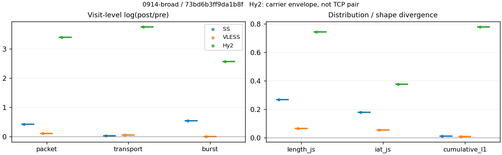
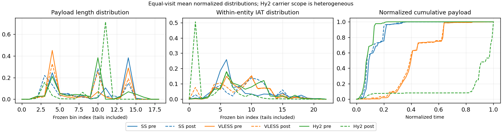

# 0914-broad · 条目 011 · developer.mozilla.org

目标：https://developer.mozilla.org/en-US/docs/Web/HTTP

活动标签：developer.mozilla.org::page_load。选定访问 3 次。

[返回总索引](../../README.md) · [统计口径](../../methods.md)

## 覆盖与资格（每次访问均保留）

| 部署 | 重复 | 主请求路由 | 活动状态 | 代理比较 | DIRECT pre | 请求 proxy/direct/unresolved | 错误 |
| --- | --- | --- | --- | --- | --- | --- | --- |
| Hy2 | 1 | proxy | passed | 1 | 0 | 74/0/0 | [] |
| SS | 1 | proxy | passed | 1 | 0 | 74/0/0 | [] |
| VLESS | 1 | proxy | passed | 1 | 0 | 74/0/0 | [] |

主请求非 proxy 的统计仅解释为已索引的辅助代理连接或 DIRECT 观测，不代表目标业务经代理传输。播放确认与配对资格是两道不同的门。

图中散点为单次访问，短线为重复中位数；Hy2 是共享载体包络，不能与 TCP 配对作等范围因果对比。

形态图先逐访问归一化，再对访问等权平均；实线 pre，虚线 post。分箱序号及边界见 methods，不将分箱索引误解为长度或时间。

## 每次访问的关键观测

### SS

范围：`exclusive_page`。每格 pre → post；空值为不可观测/不适用。

| 重复 | 包数 | 载荷字节 | burst | TCP FR | IAT中位µs | length JS | IAT JS |
| --- | --- | --- | --- | --- | --- | --- | --- |
| 1 | 540 → 826 | 4.6152e+05 → 4.7355e+05 | 342 → 586 | 52 → 54 | 38.017 → 622.25 | 0.26818 | 0.17928 |

完整标量统计：中位数 [min,max]；Δ 为重复内逐访问变换的中位数，MAD 未缩放。n 为可用变换数；DIRECT-only 的 nΔ=0 不代表 pre 不可用。

| scope | 特征 | pre | post | Δ | IQRΔ | MADΔ | nΔ |
| --- | --- | --- | --- | --- | --- | --- | --- |
| exclusive_page | active_span_sum_s_1000ms | 9.1749 [9.1749, 9.1749] | 9.166 [9.166, 9.166] | -0.00097102 | — | — | 1 |
| exclusive_page | active_span_sum_s_100ms | 1.7887 [1.7887, 1.7887] | 3.4795 [3.4795, 3.4795] | 0.66541 | — | — | 1 |
| exclusive_page | active_span_sum_s_500ms | 6.8111 [6.8111, 6.8111] | 9.166 [9.166, 9.166] | 0.29695 | — | — | 1 |
| exclusive_page | burst_bytes_iqr | 1448 [1448, 1448] | 1428 [1428, 1428] | -0.013908 | — | — | 1 |
| exclusive_page | burst_bytes_mad | 39 [39, 39] | 34 [34, 34] | -0.1372 | — | — | 1 |
| exclusive_page | burst_bytes_max | 20480 [20480, 20480] | 5786 [5786, 5786] | -1.264 | — | — | 1 |
| exclusive_page | burst_bytes_mean | 1349.5 [1349.5, 1349.5] | 808.11 [808.11, 808.11] | -0.51277 | — | — | 1 |
| exclusive_page | burst_bytes_median | 39 [39, 39] | 34 [34, 34] | -0.1372 | — | — | 1 |
| exclusive_page | burst_bytes_min | 0 [0, 0] | 0 [0, 0] | — | — | — | 0 |
| exclusive_page | burst_bytes_p95 | 5792 [5792, 5792] | 2930 [2930, 2930] | -0.68148 | — | — | 1 |
| exclusive_page | burst_bytes_q25 | 0 [0, 0] | 0 [0, 0] | — | — | — | 0 |
| exclusive_page | burst_bytes_q75 | 1448 [1448, 1448] | 1428 [1428, 1428] | -0.013908 | — | — | 1 |
| exclusive_page | burst_bytes_std | 3033.6 [3033.6, 3033.6] | 1193 [1193, 1193] | -0.9333 | — | — | 1 |
| exclusive_page | burst_count | 342 [342, 342] | 586 [586, 586] | 0.53851 | — | — | 1 |
| exclusive_page | burst_duration_ms_iqr | 0.048786 [0.048786, 0.048786] | 0 [0, 0] | — | — | — | 0 |
| exclusive_page | burst_duration_ms_mad | 0 [0, 0] | 0 [0, 0] | — | — | — | 0 |
| exclusive_page | burst_duration_ms_max | 9789.1 [9789.1, 9789.1] | 9789.5 [9789.5, 9789.5] | 3.959e-05 | — | — | 1 |
| exclusive_page | burst_duration_ms_mean | 57.076 [57.076, 57.076] | 28.859 [28.859, 28.859] | -0.68198 | — | — | 1 |
| exclusive_page | burst_duration_ms_median | 0 [0, 0] | 0 [0, 0] | — | — | — | 0 |
| exclusive_page | burst_duration_ms_min | 0 [0, 0] | 0 [0, 0] | — | — | — | 0 |
| exclusive_page | burst_duration_ms_p95 | 198.45 [198.45, 198.45] | 17.003 [17.003, 17.003] | -2.4571 | — | — | 1 |
| exclusive_page | burst_duration_ms_q25 | 0 [0, 0] | 0 [0, 0] | — | — | — | 0 |
| exclusive_page | burst_duration_ms_q75 | 0.048786 [0.048786, 0.048786] | 0 [0, 0] | — | — | — | 0 |
| exclusive_page | burst_duration_ms_std | 545.34 [545.34, 545.34] | 413.88 [413.88, 413.88] | -0.27584 | — | — | 1 |
| exclusive_page | burst_packets_iqr | 1 [1, 1] | 0 [0, 0] | — | — | — | 0 |
| exclusive_page | burst_packets_mad | 0 [0, 0] | 0 [0, 0] | — | — | — | 0 |
| exclusive_page | burst_packets_max | 8 [8, 8] | 7 [7, 7] | -0.13353 | — | — | 1 |
| exclusive_page | burst_packets_mean | 1.5789 [1.5789, 1.5789] | 1.4096 [1.4096, 1.4096] | -0.11348 | — | — | 1 |
| exclusive_page | burst_packets_median | 1 [1, 1] | 1 [1, 1] | 0 | — | — | 1 |
| exclusive_page | burst_packets_min | 1 [1, 1] | 1 [1, 1] | 0 | — | — | 1 |
| exclusive_page | burst_packets_p95 | 3 [3, 3] | 3.75 [3.75, 3.75] | 0.22314 | — | — | 1 |
| exclusive_page | burst_packets_q25 | 1 [1, 1] | 1 [1, 1] | 0 | — | — | 1 |
| exclusive_page | burst_packets_q75 | 2 [2, 2] | 1 [1, 1] | -0.69315 | — | — | 1 |
| exclusive_page | burst_packets_std | 1.0806 [1.0806, 1.0806] | 0.8603 [0.8603, 0.8603] | -0.22801 | — | — | 1 |
| exclusive_page | connection_span_concurrency_max | 4 [4, 4] | 4 [4, 4] | 0 | — | — | 1 |
| exclusive_page | cumulative_l1 | — | — | 0.012614 | — | — | 1 |
| exclusive_page | cumulative_max | — | — | 0.29452 | — | — | 1 |
| exclusive_page | direction_entropy | 0.93796 [0.93796, 0.93796] | 0.62182 [0.62182, 0.62182] | -0.31614 | — | — | 1 |
| exclusive_page | down_burst_count | 168 [168, 168] | 290 [290, 290] | 0.54592 | — | — | 1 |
| exclusive_page | down_ip_bytes | 4.4968e+05 [4.4968e+05, 4.4968e+05] | 4.6482e+05 [4.6482e+05, 4.6482e+05] | 0.033101 | — | — | 1 |
| exclusive_page | down_packets | 305 [305, 305] | 460 [460, 460] | 0.41091 | — | — | 1 |
| exclusive_page | down_transport_bytes | 4.3378e+05 [4.3378e+05, 4.3378e+05] | 4.408e+05 [4.408e+05, 4.408e+05] | 0.016067 | — | — | 1 |
| exclusive_page | duration_s | 15.406 [15.406, 15.406] | 15.244 [15.244, 15.244] | -0.010578 | — | — | 1 |
| exclusive_page | entity_count | 6 [6, 6] | 6 [6, 6] | 0 | — | — | 1 |
| exclusive_page | fr_runs | 52 [52, 52] | 54 [54, 54] | 0.03774 | — | — | 1 |
| exclusive_page | fr_runs_per_packet | 0.16456 [0.16456, 0.16456] | 0.11613 [0.11613, 0.11613] | -0.048428 | — | — | 1 |
| exclusive_page | fr_switches | 46 [46, 46] | 48 [48, 48] | 0.04256 | — | — | 1 |
| exclusive_page | fr_switches_per_possible_transition | 0.14839 [0.14839, 0.14839] | 0.10458 [0.10458, 0.10458] | -0.043812 | — | — | 1 |
| exclusive_page | full_retransmission_fraction | 0 [0, 0] | 0.0072639 [0.0072639, 0.0072639] | 0.0072639 | — | — | 1 |
| exclusive_page | full_retransmission_packets | 0 [0, 0] | 6 [6, 6] | — | — | — | 0 |
| exclusive_page | iat_count | 534 [534, 534] | 820 [820, 820] | 0.42891 | — | — | 1 |
| exclusive_page | iat_js | — | — | 0.17928 | — | — | 1 |
| exclusive_page | iat_ks | — | — | 0.37285 | — | — | 1 |
| exclusive_page | iat_median_us | 38.017 [38.017, 38.017] | 622.25 [622.25, 622.25] | 2.7953 | — | — | 1 |
| exclusive_page | iat_us_iqr | 497.79 [497.79, 497.79] | 2271.9 [2271.9, 2271.9] | 1.5182 | — | — | 1 |
| exclusive_page | iat_us_mad | 29.561 [29.561, 29.561] | 604.98 [604.98, 604.98] | 3.0188 | — | — | 1 |
| exclusive_page | iat_us_max | 9.7891e+06 [9.7891e+06, 9.7891e+06] | 9.7895e+06 [9.7895e+06, 9.7895e+06] | 3.959e-05 | — | — | 1 |
| exclusive_page | iat_us_mean | 59381 [59381, 59381] | 38324 [38324, 38324] | -0.43788 | — | — | 1 |
| exclusive_page | iat_us_median | 38.017 [38.017, 38.017] | 622.25 [622.25, 622.25] | 2.7953 | — | — | 1 |
| exclusive_page | iat_us_min | 0.008 [0.008, 0.008] | 0.041 [0.041, 0.041] | 1.6341 | — | — | 1 |
| exclusive_page | iat_us_p95 | 1.4609e+05 [1.4609e+05, 1.4609e+05] | 56519 [56519, 56519] | -0.94966 | — | — | 1 |
| exclusive_page | iat_us_q25 | 16.402 [16.402, 16.402] | 45.27 [45.27, 45.27] | 1.0152 | — | — | 1 |
| exclusive_page | iat_us_q75 | 514.19 [514.19, 514.19] | 2317.2 [2317.2, 2317.2] | 1.5055 | — | — | 1 |
| exclusive_page | iat_us_std | 6.063e+05 [6.063e+05, 6.063e+05] | 4.8594e+05 [4.8594e+05, 4.8594e+05] | -0.22129 | — | — | 1 |
| exclusive_page | iat_wasserstein_log1p_us | — | — | 1.3317 | — | — | 1 |
| exclusive_page | idle_gap_count_1000ms | 4 [4, 4] | 4 [4, 4] | 0 | — | — | 1 |
| exclusive_page | idle_gap_count_100ms | 29 [29, 29] | 31 [31, 31] | 0.066691 | — | — | 1 |
| exclusive_page | idle_gap_count_500ms | 8 [8, 8] | 4 [4, 4] | -0.69315 | — | — | 1 |
| exclusive_page | idle_gap_sum_s_1000ms | 22.534 [22.534, 22.534] | 22.26 [22.26, 22.26] | -0.012252 | — | — | 1 |
| exclusive_page | idle_gap_sum_s_100ms | 29.921 [29.921, 29.921] | 27.946 [27.946, 27.946] | -0.068257 | — | — | 1 |
| exclusive_page | idle_gap_sum_s_500ms | 24.898 [24.898, 24.898] | 22.26 [22.26, 22.26] | -0.112 | — | — | 1 |
| exclusive_page | ip_bytes | 4.8969e+05 [4.8969e+05, 4.8969e+05] | 5.2207e+05 [5.2207e+05, 5.2207e+05] | 0.064025 | — | — | 1 |
| exclusive_page | length_iqr | 2803 [2803, 2803] | 1358 [1358, 1358] | -0.72468 | — | — | 1 |
| exclusive_page | length_js | — | — | 0.26818 | — | — | 1 |
| exclusive_page | length_ks | — | — | 0.35532 | — | — | 1 |
| exclusive_page | length_mad | 1365 [1365, 1365] | 1021 [1021, 1021] | -0.29037 | — | — | 1 |
| exclusive_page | length_max | 4096 [4096, 4096] | 2930 [2930, 2930] | -0.33501 | — | — | 1 |
| exclusive_page | length_mean | 1460.5 [1460.5, 1460.5] | 1018.4 [1018.4, 1018.4] | -0.36055 | — | — | 1 |
| exclusive_page | length_median | 1448 [1448, 1448] | 1147 [1147, 1147] | -0.23303 | — | — | 1 |
| exclusive_page | length_min | 31 [31, 31] | 13 [13, 13] | -0.86904 | — | — | 1 |
| exclusive_page | length_p95 | 2896 [2896, 2896] | 2856 [2856, 2856] | -0.013908 | — | — | 1 |
| exclusive_page | length_q25 | 93 [93, 93] | 70 [70, 70] | -0.2841 | — | — | 1 |
| exclusive_page | length_q75 | 2896 [2896, 2896] | 1428 [1428, 1428] | -0.70706 | — | — | 1 |
| exclusive_page | length_std | 1257 [1257, 1257] | 971.01 [971.01, 971.01] | -0.25811 | — | — | 1 |
| exclusive_page | length_wasserstein_bytes | — | — | 442.21 | — | — | 1 |
| exclusive_page | nonempty_entity_count | 6 [6, 6] | 6 [6, 6] | 0 | — | — | 1 |
| exclusive_page | nonempty_packets | 316 [316, 316] | 465 [465, 465] | 0.3863 | — | — | 1 |
| exclusive_page | offload_suspect_fraction | 0.2463 [0.2463, 0.2463] | 0.11017 [0.11017, 0.11017] | -0.13613 | — | — | 1 |
| exclusive_page | packet_count | 540 [540, 540] | 826 [826, 826] | 0.42503 | — | — | 1 |
| exclusive_page | rtt_median_ms | 0.076575 [0.076575, 0.076575] | 27.775 [27.775, 27.775] | 5.8936 | — | — | 1 |
| exclusive_page | rtt_sample_count | 211 [211, 211] | 166 [166, 166] | -0.23987 | — | — | 1 |
| exclusive_page | tcp_ack_count | 534 [534, 534] | 820 [820, 820] | 0.42891 | — | — | 1 |
| exclusive_page | tcp_fin_count | 12 [12, 12] | 12 [12, 12] | 0 | — | — | 1 |
| exclusive_page | tcp_packet_count | 540 [540, 540] | 826 [826, 826] | 0.42503 | — | — | 1 |
| exclusive_page | tcp_rst_count | 0 [0, 0] | 0 [0, 0] | — | — | — | 0 |
| exclusive_page | tcp_syn_count | 12 [12, 12] | 12 [12, 12] | 0 | — | — | 1 |
| exclusive_page | tcp_window_raw_median | 65471 [65471, 65471] | 135 [135, 135] | -6.1841 | — | — | 1 |
| exclusive_page | transition_entropy | 0.58705 [0.58705, 0.58705] | 0.41094 [0.41094, 0.41094] | -0.17611 | — | — | 1 |
| exclusive_page | transition_n_mm | 179 [179, 179] | 367 [367, 367] | 0.71798 | — | — | 1 |
| exclusive_page | transition_n_mp | 21 [21, 21] | 22 [22, 22] | 0.04652 | — | — | 1 |
| exclusive_page | transition_n_pm | 25 [25, 25] | 26 [26, 26] | 0.039221 | — | — | 1 |
| exclusive_page | transition_n_pp | 85 [85, 85] | 44 [44, 44] | -0.65846 | — | — | 1 |
| exclusive_page | transition_p_mm | 0.895 [0.895, 0.895] | 0.94344 [0.94344, 0.94344] | 0.048445 | — | — | 1 |
| exclusive_page | transition_p_mp | 0.105 [0.105, 0.105] | 0.056555 [0.056555, 0.056555] | -0.048445 | — | — | 1 |
| exclusive_page | transition_p_pm | 0.22727 [0.22727, 0.22727] | 0.37143 [0.37143, 0.37143] | 0.14416 | — | — | 1 |
| exclusive_page | transition_p_pp | 0.77273 [0.77273, 0.77273] | 0.62857 [0.62857, 0.62857] | -0.14416 | — | — | 1 |
| exclusive_page | transport_bytes | 4.6152e+05 [4.6152e+05, 4.6152e+05] | 4.7355e+05 [4.7355e+05, 4.7355e+05] | 0.025741 | — | — | 1 |
| exclusive_page | up_burst_count | 174 [174, 174] | 296 [296, 296] | 0.5313 | — | — | 1 |
| exclusive_page | up_byte_fraction | 0.060108 [0.060108, 0.060108] | 0.069156 [0.069156, 0.069156] | 0.0090479 | — | — | 1 |
| exclusive_page | up_ip_bytes | 40009 [40009, 40009] | 57253 [57253, 57253] | 0.35838 | — | — | 1 |
| exclusive_page | up_packets | 235 [235, 235] | 366 [366, 366] | 0.44305 | — | — | 1 |
| exclusive_page | up_transport_bytes | 27741 [27741, 27741] | 32749 [32749, 32749] | 0.16596 | — | — | 1 |
| exclusive_page | zero_iat_count | 0 [0, 0] | 0 [0, 0] | — | — | — | 0 |
| exclusive_page | zero_iat_fraction | 0 [0, 0] | 0 [0, 0] | 0 | — | — | 1 |

### VLESS

范围：`exclusive_page`。每格 pre → post；空值为不可观测/不适用。

| 重复 | 包数 | 载荷字节 | burst | TCP FR | IAT中位µs | length JS | IAT JS |
| --- | --- | --- | --- | --- | --- | --- | --- |
| 1 | 673 → 747 | 4.4367e+05 → 4.6869e+05 | 431 → 433 | 58 → 64 | 280.55 → 392.13 | 0.06519 | 0.055765 |

完整标量统计：中位数 [min,max]；Δ 为重复内逐访问变换的中位数，MAD 未缩放。n 为可用变换数；DIRECT-only 的 nΔ=0 不代表 pre 不可用。

| scope | 特征 | pre | post | Δ | IQRΔ | MADΔ | nΔ |
| --- | --- | --- | --- | --- | --- | --- | --- |
| exclusive_page | active_span_sum_s_1000ms | 6.9628 [6.9628, 6.9628] | 6.5969 [6.5969, 6.5969] | -0.053976 | — | — | 1 |
| exclusive_page | active_span_sum_s_100ms | 1.3232 [1.3232, 1.3232] | 2.1434 [2.1434, 2.1434] | 0.48233 | — | — | 1 |
| exclusive_page | active_span_sum_s_500ms | 4.0825 [4.0825, 4.0825] | 5.8254 [5.8254, 5.8254] | 0.35553 | — | — | 1 |
| exclusive_page | burst_bytes_iqr | 2824 [2824, 2824] | 2824 [2824, 2824] | 0 | — | — | 1 |
| exclusive_page | burst_bytes_mad | 72 [72, 72] | 158 [158, 158] | 0.78593 | — | — | 1 |
| exclusive_page | burst_bytes_max | 18365 [18365, 18365] | 5702 [5702, 5702] | -1.1696 | — | — | 1 |
| exclusive_page | burst_bytes_mean | 1029.4 [1029.4, 1029.4] | 1082.4 [1082.4, 1082.4] | 0.05024 | — | — | 1 |
| exclusive_page | burst_bytes_median | 72 [72, 72] | 158 [158, 158] | 0.78593 | — | — | 1 |
| exclusive_page | burst_bytes_min | 0 [0, 0] | 0 [0, 0] | — | — | — | 0 |
| exclusive_page | burst_bytes_p95 | 2896 [2896, 2896] | 2896 [2896, 2896] | 0 | — | — | 1 |
| exclusive_page | burst_bytes_q25 | 0 [0, 0] | 0 [0, 0] | — | — | — | 0 |
| exclusive_page | burst_bytes_q75 | 2824 [2824, 2824] | 2824 [2824, 2824] | 0 | — | — | 1 |
| exclusive_page | burst_bytes_std | 1714.1 [1714.1, 1714.1] | 1265 [1265, 1265] | -0.30384 | — | — | 1 |
| exclusive_page | burst_count | 431 [431, 431] | 433 [433, 433] | 0.0046296 | — | — | 1 |
| exclusive_page | burst_duration_ms_iqr | 0.65826 [0.65826, 0.65826] | 1.0967 [1.0967, 1.0967] | 0.51043 | — | — | 1 |
| exclusive_page | burst_duration_ms_mad | 0 [0, 0] | 0 [0, 0] | — | — | — | 0 |
| exclusive_page | burst_duration_ms_max | 1565.4 [1565.4, 1565.4] | 1564.9 [1564.9, 1564.9] | -0.00034174 | — | — | 1 |
| exclusive_page | burst_duration_ms_mean | 17.314 [17.314, 17.314] | 14.179 [14.179, 14.179] | -0.19981 | — | — | 1 |
| exclusive_page | burst_duration_ms_median | 0 [0, 0] | 0 [0, 0] | — | — | — | 0 |
| exclusive_page | burst_duration_ms_min | 0 [0, 0] | 0 [0, 0] | — | — | — | 0 |
| exclusive_page | burst_duration_ms_p95 | 12.785 [12.785, 12.785] | 32.746 [32.746, 32.746] | 0.9405 | — | — | 1 |
| exclusive_page | burst_duration_ms_q25 | 0 [0, 0] | 0 [0, 0] | — | — | — | 0 |
| exclusive_page | burst_duration_ms_q75 | 0.65826 [0.65826, 0.65826] | 1.0967 [1.0967, 1.0967] | 0.51043 | — | — | 1 |
| exclusive_page | burst_duration_ms_std | 109.1 [109.1, 109.1] | 92.191 [92.191, 92.191] | -0.16843 | — | — | 1 |
| exclusive_page | burst_packets_iqr | 1 [1, 1] | 1 [1, 1] | 0 | — | — | 1 |
| exclusive_page | burst_packets_mad | 0 [0, 0] | 0 [0, 0] | — | — | — | 0 |
| exclusive_page | burst_packets_max | 11 [11, 11] | 8 [8, 8] | -0.31845 | — | — | 1 |
| exclusive_page | burst_packets_mean | 1.5615 [1.5615, 1.5615] | 1.7252 [1.7252, 1.7252] | 0.09969 | — | — | 1 |
| exclusive_page | burst_packets_median | 1 [1, 1] | 1 [1, 1] | 0 | — | — | 1 |
| exclusive_page | burst_packets_min | 1 [1, 1] | 1 [1, 1] | 0 | — | — | 1 |
| exclusive_page | burst_packets_p95 | 3 [3, 3] | 4 [4, 4] | 0.28768 | — | — | 1 |
| exclusive_page | burst_packets_q25 | 1 [1, 1] | 1 [1, 1] | 0 | — | — | 1 |
| exclusive_page | burst_packets_q75 | 2 [2, 2] | 2 [2, 2] | 0 | — | — | 1 |
| exclusive_page | burst_packets_std | 0.95626 [0.95626, 0.95626] | 1.0038 [1.0038, 1.0038] | 0.048517 | — | — | 1 |
| exclusive_page | connection_span_concurrency_max | 3 [3, 3] | 3 [3, 3] | 0 | — | — | 1 |
| exclusive_page | cumulative_l1 | — | — | 0.0098846 | — | — | 1 |
| exclusive_page | cumulative_max | — | — | 0.071267 | — | — | 1 |
| exclusive_page | direction_entropy | 0.81222 [0.81222, 0.81222] | 0.61294 [0.61294, 0.61294] | -0.19928 | — | — | 1 |
| exclusive_page | down_burst_count | 214 [214, 214] | 215 [215, 215] | 0.004662 | — | — | 1 |
| exclusive_page | down_ip_bytes | 4.4374e+05 [4.4374e+05, 4.4374e+05] | 4.6466e+05 [4.6466e+05, 4.6466e+05] | 0.046087 | — | — | 1 |
| exclusive_page | down_packets | 395 [395, 395] | 437 [437, 437] | 0.10105 | — | — | 1 |
| exclusive_page | down_transport_bytes | 4.2317e+05 [4.2317e+05, 4.2317e+05] | 4.4192e+05 [4.4192e+05, 4.4192e+05] | 0.043343 | — | — | 1 |
| exclusive_page | duration_s | 3.7646 [3.7646, 3.7646] | 3.727 [3.727, 3.727] | -0.010049 | — | — | 1 |
| exclusive_page | entity_count | 3 [3, 3] | 3 [3, 3] | 0 | — | — | 1 |
| exclusive_page | fr_runs | 58 [58, 58] | 64 [64, 64] | 0.09844 | — | — | 1 |
| exclusive_page | fr_runs_per_packet | 0.13842 [0.13842, 0.13842] | 0.14447 [0.14447, 0.14447] | 0.0060447 | — | — | 1 |
| exclusive_page | fr_switches | 55 [55, 55] | 61 [61, 61] | 0.10354 | — | — | 1 |
| exclusive_page | fr_switches_per_possible_transition | 0.13221 [0.13221, 0.13221] | 0.13864 [0.13864, 0.13864] | 0.0064248 | — | — | 1 |
| exclusive_page | full_retransmission_fraction | 0 [0, 0] | 0 [0, 0] | 0 | — | — | 1 |
| exclusive_page | full_retransmission_packets | 0 [0, 0] | 0 [0, 0] | — | — | — | 0 |
| exclusive_page | iat_count | 670 [670, 670] | 744 [744, 744] | 0.10476 | — | — | 1 |
| exclusive_page | iat_js | — | — | 0.055765 | — | — | 1 |
| exclusive_page | iat_ks | — | — | 0.13241 | — | — | 1 |
| exclusive_page | iat_median_us | 280.55 [280.55, 280.55] | 392.13 [392.13, 392.13] | 0.33482 | — | — | 1 |
| exclusive_page | iat_us_iqr | 1051.7 [1051.7, 1051.7] | 1279.5 [1279.5, 1279.5] | 0.19603 | — | — | 1 |
| exclusive_page | iat_us_mad | 269.12 [269.12, 269.12] | 382.8 [382.8, 382.8] | 0.35235 | — | — | 1 |
| exclusive_page | iat_us_max | 1.5654e+06 [1.5654e+06, 1.5654e+06] | 1.5649e+06 [1.5649e+06, 1.5649e+06] | -0.00034174 | — | — | 1 |
| exclusive_page | iat_us_mean | 12729 [12729, 12729] | 10970 [10970, 10970] | -0.14868 | — | — | 1 |
| exclusive_page | iat_us_median | 280.55 [280.55, 280.55] | 392.13 [392.13, 392.13] | 0.33482 | — | — | 1 |
| exclusive_page | iat_us_min | 0.897 [0.897, 0.897] | 0.037 [0.037, 0.037] | -3.1881 | — | — | 1 |
| exclusive_page | iat_us_p95 | 11229 [11229, 11229] | 38951 [38951, 38951] | 1.2438 | — | — | 1 |
| exclusive_page | iat_us_q25 | 37.335 [37.335, 37.335] | 14.743 [14.743, 14.743] | -0.92915 | — | — | 1 |
| exclusive_page | iat_us_q75 | 1089.1 [1089.1, 1089.1] | 1294.3 [1294.3, 1294.3] | 0.17261 | — | — | 1 |
| exclusive_page | iat_us_std | 88328 [88328, 88328] | 72688 [72688, 72688] | -0.19488 | — | — | 1 |
| exclusive_page | iat_wasserstein_log1p_us | — | — | 0.47286 | — | — | 1 |
| exclusive_page | idle_gap_count_1000ms | 1 [1, 1] | 1 [1, 1] | 0 | — | — | 1 |
| exclusive_page | idle_gap_count_100ms | 17 [17, 17] | 20 [20, 20] | 0.16252 | — | — | 1 |
| exclusive_page | idle_gap_count_500ms | 5 [5, 5] | 2 [2, 2] | -0.91629 | — | — | 1 |
| exclusive_page | idle_gap_sum_s_1000ms | 1.5654 [1.5654, 1.5654] | 1.5649 [1.5649, 1.5649] | -0.00034174 | — | — | 1 |
| exclusive_page | idle_gap_sum_s_100ms | 7.205 [7.205, 7.205] | 6.0184 [6.0184, 6.0184] | -0.17995 | — | — | 1 |
| exclusive_page | idle_gap_sum_s_500ms | 4.4457 [4.4457, 4.4457] | 2.3364 [2.3364, 2.3364] | -0.64334 | — | — | 1 |
| exclusive_page | ip_bytes | 4.7864e+05 [4.7864e+05, 4.7864e+05] | 5.0813e+05 [5.0813e+05, 5.0813e+05] | 0.059801 | — | — | 1 |
| exclusive_page | length_iqr | 2752 [2752, 2752] | 1340 [1340, 1340] | -0.71966 | — | — | 1 |
| exclusive_page | length_js | — | — | 0.06519 | — | — | 1 |
| exclusive_page | length_ks | — | — | 0.14067 | — | — | 1 |
| exclusive_page | length_mad | 84 [84, 84] | 993 [993, 993] | 2.4699 | — | — | 1 |
| exclusive_page | length_max | 2896 [2896, 2896] | 2824 [2824, 2824] | -0.025176 | — | — | 1 |
| exclusive_page | length_mean | 1058.9 [1058.9, 1058.9] | 1058 [1058, 1058] | -0.00082931 | — | — | 1 |
| exclusive_page | length_median | 120 [120, 120] | 1065 [1065, 1065] | 2.1832 | — | — | 1 |
| exclusive_page | length_min | 24 [24, 24] | 24 [24, 24] | 0 | — | — | 1 |
| exclusive_page | length_p95 | 2824 [2824, 2824] | 2824 [2824, 2824] | 0 | — | — | 1 |
| exclusive_page | length_q25 | 72 [72, 72] | 72 [72, 72] | 0 | — | — | 1 |
| exclusive_page | length_q75 | 2824 [2824, 2824] | 1412 [1412, 1412] | -0.69315 | — | — | 1 |
| exclusive_page | length_std | 1198.2 [1198.2, 1198.2] | 1024.2 [1024.2, 1024.2] | -0.15693 | — | — | 1 |
| exclusive_page | length_wasserstein_bytes | — | — | 273.2 | — | — | 1 |
| exclusive_page | nonempty_entity_count | 3 [3, 3] | 3 [3, 3] | 0 | — | — | 1 |
| exclusive_page | nonempty_packets | 419 [419, 419] | 443 [443, 443] | 0.055699 | — | — | 1 |
| exclusive_page | offload_suspect_fraction | 0.19019 [0.19019, 0.19019] | 0.11914 [0.11914, 0.11914] | -0.07105 | — | — | 1 |
| exclusive_page | packet_count | 673 [673, 673] | 747 [747, 747] | 0.10432 | — | — | 1 |
| exclusive_page | rtt_median_ms | 0.22966 [0.22966, 0.22966] | 1.1398 [1.1398, 1.1398] | 1.602 | — | — | 1 |
| exclusive_page | rtt_sample_count | 250 [250, 250] | 297 [297, 297] | 0.17227 | — | — | 1 |
| exclusive_page | tcp_ack_count | 664 [664, 664] | 744 [744, 744] | 0.11376 | — | — | 1 |
| exclusive_page | tcp_fin_count | 6 [6, 6] | 6 [6, 6] | 0 | — | — | 1 |
| exclusive_page | tcp_packet_count | 673 [673, 673] | 747 [747, 747] | 0.10432 | — | — | 1 |
| exclusive_page | tcp_rst_count | 6 [6, 6] | 0 [0, 0] | — | — | — | 0 |
| exclusive_page | tcp_syn_count | 6 [6, 6] | 6 [6, 6] | 0 | — | — | 1 |
| exclusive_page | tcp_window_raw_median | 65535 [65535, 65535] | 160 [160, 160] | -6.0152 | — | — | 1 |
| exclusive_page | transition_entropy | 0.52466 [0.52466, 0.52466] | 0.48622 [0.48622, 0.48622] | -0.038435 | — | — | 1 |
| exclusive_page | transition_n_mm | 285 [285, 285] | 344 [344, 344] | 0.18815 | — | — | 1 |
| exclusive_page | transition_n_mp | 26 [26, 26] | 29 [29, 29] | 0.1092 | — | — | 1 |
| exclusive_page | transition_n_pm | 29 [29, 29] | 32 [32, 32] | 0.09844 | — | — | 1 |
| exclusive_page | transition_n_pp | 76 [76, 76] | 35 [35, 35] | -0.77539 | — | — | 1 |
| exclusive_page | transition_p_mm | 0.9164 [0.9164, 0.9164] | 0.92225 [0.92225, 0.92225] | 0.0058533 | — | — | 1 |
| exclusive_page | transition_p_mp | 0.083601 [0.083601, 0.083601] | 0.077748 [0.077748, 0.077748] | -0.0058533 | — | — | 1 |
| exclusive_page | transition_p_pm | 0.27619 [0.27619, 0.27619] | 0.47761 [0.47761, 0.47761] | 0.20142 | — | — | 1 |
| exclusive_page | transition_p_pp | 0.72381 [0.72381, 0.72381] | 0.52239 [0.52239, 0.52239] | -0.20142 | — | — | 1 |
| exclusive_page | transport_bytes | 4.4367e+05 [4.4367e+05, 4.4367e+05] | 4.6869e+05 [4.6869e+05, 4.6869e+05] | 0.05487 | — | — | 1 |
| exclusive_page | up_burst_count | 217 [217, 217] | 218 [218, 218] | 0.0045977 | — | — | 1 |
| exclusive_page | up_byte_fraction | 0.046192 [0.046192, 0.046192] | 0.057123 [0.057123, 0.057123] | 0.010931 | — | — | 1 |
| exclusive_page | up_ip_bytes | 34902 [34902, 34902] | 43469 [43469, 43469] | 0.2195 | — | — | 1 |
| exclusive_page | up_packets | 278 [278, 278] | 310 [310, 310] | 0.10895 | — | — | 1 |
| exclusive_page | up_transport_bytes | 20494 [20494, 20494] | 26773 [26773, 26773] | 0.26726 | — | — | 1 |
| exclusive_page | zero_iat_count | 0 [0, 0] | 0 [0, 0] | — | — | — | 0 |
| exclusive_page | zero_iat_fraction | 0 [0, 0] | 0 [0, 0] | 0 | — | — | 1 |

### Hy2

范围：`carrier_context_envelope`。每格 pre → post；空值为不可观测/不适用。

| 重复 | 包数 | 载荷字节 | burst | TCP FR | IAT中位µs | length JS | IAT JS |
| --- | --- | --- | --- | --- | --- | --- | --- |
| 1 | 622 → 18751 | 4.909e+05 → 2.093e+07 | 414 → 5441 | — | 158.47 → 0.402 | 0.74319 | 0.37708 |

完整标量统计：中位数 [min,max]；Δ 为重复内逐访问变换的中位数，MAD 未缩放。n 为可用变换数；DIRECT-only 的 nΔ=0 不代表 pre 不可用。

| scope | 特征 | pre | post | Δ | IQRΔ | MADΔ | nΔ |
| --- | --- | --- | --- | --- | --- | --- | --- |
| carrier_context_envelope | active_span_sum_s_1000ms | 5.904 [5.904, 5.904] | 8.7537 [8.7537, 8.7537] | 0.39384 | — | — | 1 |
| carrier_context_envelope | active_span_sum_s_100ms | 1.2763 [1.2763, 1.2763] | 5.0493 [5.0493, 5.0493] | 1.3753 | — | — | 1 |
| carrier_context_envelope | active_span_sum_s_500ms | 4.6949 [4.6949, 4.6949] | 8.1748 [8.1748, 8.1748] | 0.55458 | — | — | 1 |
| carrier_context_envelope | burst_bytes_iqr | 1417 [1417, 1417] | 5131 [5131, 5131] | 1.2868 | — | — | 1 |
| carrier_context_envelope | burst_bytes_mad | 39 [39, 39] | 351 [351, 351] | 2.1972 | — | — | 1 |
| carrier_context_envelope | burst_bytes_max | 28523 [28523, 28523] | 4.2977e+05 [4.2977e+05, 4.2977e+05] | 2.7125 | — | — | 1 |
| carrier_context_envelope | burst_bytes_mean | 1185.8 [1185.8, 1185.8] | 3846.8 [3846.8, 3846.8] | 1.1769 | — | — | 1 |
| carrier_context_envelope | burst_bytes_median | 39 [39, 39] | 384 [384, 384] | 2.2871 | — | — | 1 |
| carrier_context_envelope | burst_bytes_min | 0 [0, 0] | 22 [22, 22] | — | — | — | 0 |
| carrier_context_envelope | burst_bytes_p95 | 4691.6 [4691.6, 4691.6] | 13814 [13814, 13814] | 1.0799 | — | — | 1 |
| carrier_context_envelope | burst_bytes_q25 | 0 [0, 0] | 37 [37, 37] | — | — | — | 0 |
| carrier_context_envelope | burst_bytes_q75 | 1417 [1417, 1417] | 5168 [5168, 5168] | 1.2939 | — | — | 1 |
| carrier_context_envelope | burst_bytes_std | 3034.5 [3034.5, 3034.5] | 10035 [10035, 10035] | 1.196 | — | — | 1 |
| carrier_context_envelope | burst_count | 414 [414, 414] | 5441 [5441, 5441] | 2.5759 | — | — | 1 |
| carrier_context_envelope | burst_duration_ms_iqr | 1.1438 [1.1438, 1.1438] | 0.032507 [0.032507, 0.032507] | -3.5606 | — | — | 1 |
| carrier_context_envelope | burst_duration_ms_mad | 0 [0, 0] | 6.8e-05 [6.8e-05, 6.8e-05] | — | — | — | 0 |
| carrier_context_envelope | burst_duration_ms_max | 11007 [11007, 11007] | 674.29 [674.29, 674.29] | -2.7927 | — | — | 1 |
| carrier_context_envelope | burst_duration_ms_mean | 68.259 [68.259, 68.259] | 0.57666 [0.57666, 0.57666] | -4.7738 | — | — | 1 |
| carrier_context_envelope | burst_duration_ms_median | 0 [0, 0] | 6.8e-05 [6.8e-05, 6.8e-05] | — | — | — | 0 |
| carrier_context_envelope | burst_duration_ms_min | 0 [0, 0] | 0 [0, 0] | — | — | — | 0 |
| carrier_context_envelope | burst_duration_ms_p95 | 120.56 [120.56, 120.56] | 0.71756 [0.71756, 0.71756] | -5.1241 | — | — | 1 |
| carrier_context_envelope | burst_duration_ms_q25 | 0 [0, 0] | 0 [0, 0] | — | — | — | 0 |
| carrier_context_envelope | burst_duration_ms_q75 | 1.1438 [1.1438, 1.1438] | 0.032507 [0.032507, 0.032507] | -3.5606 | — | — | 1 |
| carrier_context_envelope | burst_duration_ms_std | 764.97 [764.97, 764.97] | 11.146 [11.146, 11.146] | -4.2288 | — | — | 1 |
| carrier_context_envelope | burst_packets_iqr | 1 [1, 1] | 3 [3, 3] | 1.0986 | — | — | 1 |
| carrier_context_envelope | burst_packets_mad | 0 [0, 0] | 1 [1, 1] | — | — | — | 0 |
| carrier_context_envelope | burst_packets_max | 16 [16, 16] | 309 [309, 309] | 2.9608 | — | — | 1 |
| carrier_context_envelope | burst_packets_mean | 1.5024 [1.5024, 1.5024] | 3.4462 [3.4462, 3.4462] | 0.83021 | — | — | 1 |
| carrier_context_envelope | burst_packets_median | 1 [1, 1] | 2 [2, 2] | 0.69315 | — | — | 1 |
| carrier_context_envelope | burst_packets_min | 1 [1, 1] | 1 [1, 1] | 0 | — | — | 1 |
| carrier_context_envelope | burst_packets_p95 | 3 [3, 3] | 10 [10, 10] | 1.204 | — | — | 1 |
| carrier_context_envelope | burst_packets_q25 | 1 [1, 1] | 1 [1, 1] | 0 | — | — | 1 |
| carrier_context_envelope | burst_packets_q75 | 2 [2, 2] | 4 [4, 4] | 0.69315 | — | — | 1 |
| carrier_context_envelope | burst_packets_std | 0.98478 [0.98478, 0.98478] | 7.0361 [7.0361, 7.0361] | 1.9664 | — | — | 1 |
| carrier_context_envelope | connection_span_concurrency_max | 4 [4, 4] | 1 [1, 1] | -1.3863 | — | — | 1 |
| carrier_context_envelope | cumulative_l1 | — | — | 0.77852 | — | — | 1 |
| carrier_context_envelope | cumulative_max | — | — | 0.924 | — | — | 1 |
| carrier_context_envelope | direction_entropy | 0.88626 [0.88626, 0.88626] | 0.70295 [0.70295, 0.70295] | -0.1833 | — | — | 1 |
| carrier_context_envelope | direction_run_analog_runs | 54 [54, 54] | 5441 [5441, 5441] | 4.6127 | — | — | 1 |
| carrier_context_envelope | direction_run_analog_runs_per_packet | 0.14795 [0.14795, 0.14795] | 0.29017 [0.29017, 0.29017] | 0.14223 | — | — | 1 |
| carrier_context_envelope | direction_run_analog_switches | 48 [48, 48] | 5440 [5440, 5440] | 4.7303 | — | — | 1 |
| carrier_context_envelope | direction_run_analog_switches_per_possible_transition | 0.1337 [0.1337, 0.1337] | 0.29013 [0.29013, 0.29013] | 0.15643 | — | — | 1 |
| carrier_context_envelope | down_burst_count | 204 [204, 204] | 2720 [2720, 2720] | 2.5903 | — | — | 1 |
| carrier_context_envelope | down_ip_bytes | 4.8151e+05 [4.8151e+05, 4.8151e+05] | 2.1123e+07 [2.1123e+07, 2.1123e+07] | 3.7812 | — | — | 1 |
| carrier_context_envelope | down_packets | 360 [360, 360] | 15175 [15175, 15175] | 3.7413 | — | — | 1 |
| carrier_context_envelope | down_transport_bytes | 4.6274e+05 [4.6274e+05, 4.6274e+05] | 2.0698e+07 [2.0698e+07, 2.0698e+07] | 3.8006 | — | — | 1 |
| carrier_context_envelope | duration_s | 14.187 [14.187, 14.187] | 14.17 [14.17, 14.17] | -0.0011706 | — | — | 1 |
| carrier_context_envelope | entity_count | 6 [6, 6] | 1 [1, 1] | -1.7918 | — | — | 1 |
| carrier_context_envelope | full_retransmission_fraction | 0.0048232 [0.0048232, 0.0048232] | — | — | — | — | 0 |
| carrier_context_envelope | full_retransmission_packets | 3 [3, 3] | — | — | — | — | 0 |
| carrier_context_envelope | iat_count | 616 [616, 616] | 18750 [18750, 18750] | 3.4157 | — | — | 1 |
| carrier_context_envelope | iat_js | — | — | 0.37708 | — | — | 1 |
| carrier_context_envelope | iat_ks | — | — | 0.53455 | — | — | 1 |
| carrier_context_envelope | iat_median_us | 158.47 [158.47, 158.47] | 0.402 [0.402, 0.402] | -5.9769 | — | — | 1 |
| carrier_context_envelope | iat_us_iqr | 1586.4 [1586.4, 1586.4] | 33.438 [33.438, 33.438] | -3.8596 | — | — | 1 |
| carrier_context_envelope | iat_us_mad | 150.36 [150.36, 150.36] | 0.369 [0.369, 0.369] | -6.01 | — | — | 1 |
| carrier_context_envelope | iat_us_max | 1.1007e+07 [1.1007e+07, 1.1007e+07] | 4.0211e+06 [4.0211e+06, 4.0211e+06] | -1.007 | — | — | 1 |
| carrier_context_envelope | iat_us_mean | 47521 [47521, 47521] | 755.74 [755.74, 755.74] | -4.1412 | — | — | 1 |
| carrier_context_envelope | iat_us_median | 158.47 [158.47, 158.47] | 0.402 [0.402, 0.402] | -5.9769 | — | — | 1 |
| carrier_context_envelope | iat_us_min | 0.314 [0.314, 0.314] | 0.01 [0.01, 0.01] | -3.4468 | — | — | 1 |
| carrier_context_envelope | iat_us_p95 | 40672 [40672, 40672] | 733.98 [733.98, 733.98] | -4.0148 | — | — | 1 |
| carrier_context_envelope | iat_us_q25 | 36.34 [36.34, 36.34] | 0.064 [0.064, 0.064] | -6.3418 | — | — | 1 |
| carrier_context_envelope | iat_us_q75 | 1622.8 [1622.8, 1622.8] | 33.502 [33.502, 33.502] | -3.8803 | — | — | 1 |
| carrier_context_envelope | iat_us_std | 6.2792e+05 [6.2792e+05, 6.2792e+05] | 31929 [31929, 31929] | -2.9789 | — | — | 1 |
| carrier_context_envelope | iat_wasserstein_log1p_us | — | — | 3.5961 | — | — | 1 |
| carrier_context_envelope | idle_gap_count_1000ms | 3 [3, 3] | 2 [2, 2] | -0.40547 | — | — | 1 |
| carrier_context_envelope | idle_gap_count_100ms | 24 [24, 24] | 22 [22, 22] | -0.087011 | — | — | 1 |
| carrier_context_envelope | idle_gap_count_500ms | 5 [5, 5] | 3 [3, 3] | -0.51083 | — | — | 1 |
| carrier_context_envelope | idle_gap_sum_s_1000ms | 23.369 [23.369, 23.369] | 5.4164 [5.4164, 5.4164] | -1.462 | — | — | 1 |
| carrier_context_envelope | idle_gap_sum_s_100ms | 27.997 [27.997, 27.997] | 9.1207 [9.1207, 9.1207] | -1.1215 | — | — | 1 |
| carrier_context_envelope | idle_gap_sum_s_500ms | 24.578 [24.578, 24.578] | 5.9953 [5.9953, 5.9953] | -1.4109 | — | — | 1 |
| carrier_context_envelope | ip_bytes | 5.2338e+05 [5.2338e+05, 5.2338e+05] | 2.1456e+07 [2.1456e+07, 2.1456e+07] | 3.7134 | — | — | 1 |
| carrier_context_envelope | length_iqr | 1309 [1309, 1309] | 596 [596, 596] | -0.78678 | — | — | 1 |
| carrier_context_envelope | length_js | — | — | 0.74319 | — | — | 1 |
| carrier_context_envelope | length_ks | — | — | 0.56719 | — | — | 1 |
| carrier_context_envelope | length_mad | 811 [811, 811] | 0 [0, 0] | — | — | — | 0 |
| carrier_context_envelope | length_max | 8920 [8920, 8920] | 1441 [1441, 1441] | -1.823 | — | — | 1 |
| carrier_context_envelope | length_mean | 1344.9 [1344.9, 1344.9] | 1116.2 [1116.2, 1116.2] | -0.18639 | — | — | 1 |
| carrier_context_envelope | length_median | 1404 [1404, 1404] | 1441 [1441, 1441] | 0.026012 | — | — | 1 |
| carrier_context_envelope | length_min | 2 [2, 2] | 22 [22, 22] | 2.3979 | — | — | 1 |
| carrier_context_envelope | length_p95 | 4720.8 [4720.8, 4720.8] | 1441 [1441, 1441] | -1.1866 | — | — | 1 |
| carrier_context_envelope | length_q25 | 106 [106, 106] | 845 [845, 845] | 2.0759 | — | — | 1 |
| carrier_context_envelope | length_q75 | 1415 [1415, 1415] | 1441 [1441, 1441] | 0.018208 | — | — | 1 |
| carrier_context_envelope | length_std | 1687.4 [1687.4, 1687.4] | 560.45 [560.45, 560.45] | -1.1022 | — | — | 1 |
| carrier_context_envelope | length_wasserstein_bytes | — | — | 672.48 | — | — | 1 |
| carrier_context_envelope | nonempty_entity_count | 6 [6, 6] | 1 [1, 1] | -1.7918 | — | — | 1 |
| carrier_context_envelope | nonempty_packets | 365 [365, 365] | 18751 [18751, 18751] | 3.9391 | — | — | 1 |
| carrier_context_envelope | offload_suspect_fraction | 0.093248 [0.093248, 0.093248] | 0 [0, 0] | -0.093248 | — | — | 1 |
| carrier_context_envelope | packet_count | 622 [622, 622] | 18751 [18751, 18751] | 3.4061 | — | — | 1 |
| carrier_context_envelope | rtt_median_ms | 0.1438 [0.1438, 0.1438] | — | — | — | — | 0 |
| carrier_context_envelope | rtt_sample_count | 248 [248, 248] | 0 [0, 0] | — | — | — | 0 |
| carrier_context_envelope | tcp_ack_count | 616 [616, 616] | — | — | — | — | 0 |
| carrier_context_envelope | tcp_fin_count | 12 [12, 12] | — | — | — | — | 0 |
| carrier_context_envelope | tcp_packet_count | 622 [622, 622] | 0 [0, 0] | — | — | — | 0 |
| carrier_context_envelope | tcp_rst_count | 0 [0, 0] | — | — | — | — | 0 |
| carrier_context_envelope | tcp_syn_count | 12 [12, 12] | — | — | — | — | 0 |
| carrier_context_envelope | tcp_window_raw_median | 65535 [65535, 65535] | — | — | — | — | 0 |
| carrier_context_envelope | transition_entropy | 0.53654 [0.53654, 0.53654] | 0.70039 [0.70039, 0.70039] | 0.16384 | — | — | 1 |
| carrier_context_envelope | transition_n_mm | 227 [227, 227] | 12455 [12455, 12455] | 4.0049 | — | — | 1 |
| carrier_context_envelope | transition_n_mp | 21 [21, 21] | 2720 [2720, 2720] | 4.8639 | — | — | 1 |
| carrier_context_envelope | transition_n_pm | 27 [27, 27] | 2720 [2720, 2720] | 4.6126 | — | — | 1 |
| carrier_context_envelope | transition_n_pp | 84 [84, 84] | 855 [855, 855] | 2.3203 | — | — | 1 |
| carrier_context_envelope | transition_p_mm | 0.91532 [0.91532, 0.91532] | 0.82076 [0.82076, 0.82076] | -0.094565 | — | — | 1 |
| carrier_context_envelope | transition_p_mp | 0.084677 [0.084677, 0.084677] | 0.17924 [0.17924, 0.17924] | 0.094565 | — | — | 1 |
| carrier_context_envelope | transition_p_pm | 0.24324 [0.24324, 0.24324] | 0.76084 [0.76084, 0.76084] | 0.5176 | — | — | 1 |
| carrier_context_envelope | transition_p_pp | 0.75676 [0.75676, 0.75676] | 0.23916 [0.23916, 0.23916] | -0.5176 | — | — | 1 |
| carrier_context_envelope | transport_bytes | 4.909e+05 [4.909e+05, 4.909e+05] | 2.093e+07 [2.093e+07, 2.093e+07] | 3.7527 | — | — | 1 |
| carrier_context_envelope | up_burst_count | 210 [210, 210] | 2721 [2721, 2721] | 2.5616 | — | — | 1 |
| carrier_context_envelope | up_byte_fraction | 0.057368 [0.057368, 0.057368] | 0.011099 [0.011099, 0.011099] | -0.046269 | — | — | 1 |
| carrier_context_envelope | up_ip_bytes | 41870 [41870, 41870] | 3.3243e+05 [3.3243e+05, 3.3243e+05] | 2.0719 | — | — | 1 |
| carrier_context_envelope | up_packets | 262 [262, 262] | 3576 [3576, 3576] | 2.6137 | — | — | 1 |
| carrier_context_envelope | up_transport_bytes | 28162 [28162, 28162] | 2.323e+05 [2.323e+05, 2.323e+05] | 2.1101 | — | — | 1 |
| carrier_context_envelope | zero_iat_count | 0 [0, 0] | 0 [0, 0] | — | — | — | 0 |
| carrier_context_envelope | zero_iat_fraction | 0 [0, 0] | 0 [0, 0] | 0 | — | — | 1 |

## 不同部署对比

以下是各部署自身重复中位数的差异，不按重复编号强行配对。跨 TCP/Hy2 的行标记异质观测范围。

| 视角 | 特征 | 部署A | 部署B | A中位 | B中位 | B−A | 比较口径 |
| --- | --- | --- | --- | --- | --- | --- | --- |
| pre | burst_count | SS | VLESS | 342 | 431 | 89 | same_scope_unpaired_visits |
| pre | burst_count | SS | Hy2 | 342 | 414 | 72 | heterogeneous_scope_descriptive_only |
| pre | burst_count | VLESS | Hy2 | 431 | 414 | -17 | heterogeneous_scope_descriptive_only |
| pre | connection_span_concurrency_max | SS | VLESS | 4 | 3 | -1 | same_scope_unpaired_visits |
| pre | connection_span_concurrency_max | SS | Hy2 | 4 | 4 | 0 | heterogeneous_scope_descriptive_only |
| pre | connection_span_concurrency_max | VLESS | Hy2 | 3 | 4 | 1 | heterogeneous_scope_descriptive_only |
| pre | direction_entropy | SS | VLESS | 0.93796 | 0.81222 | -0.12574 | same_scope_unpaired_visits |
| pre | direction_entropy | SS | Hy2 | 0.93796 | 0.88626 | -0.051706 | heterogeneous_scope_descriptive_only |
| pre | direction_entropy | VLESS | Hy2 | 0.81222 | 0.88626 | 0.074034 | heterogeneous_scope_descriptive_only |
| pre | down_transport_bytes | SS | VLESS | 4.3378e+05 | 4.2317e+05 | -10605 | same_scope_unpaired_visits |
| pre | down_transport_bytes | SS | Hy2 | 4.3378e+05 | 4.6274e+05 | 28964 | heterogeneous_scope_descriptive_only |
| pre | down_transport_bytes | VLESS | Hy2 | 4.2317e+05 | 4.6274e+05 | 39569 | heterogeneous_scope_descriptive_only |
| pre | duration_s | SS | VLESS | 15.406 | 3.7646 | -11.641 | same_scope_unpaired_visits |
| pre | duration_s | SS | Hy2 | 15.406 | 14.187 | -1.2193 | heterogeneous_scope_descriptive_only |
| pre | duration_s | VLESS | Hy2 | 3.7646 | 14.187 | 10.422 | heterogeneous_scope_descriptive_only |
| pre | entity_count | SS | VLESS | 6 | 3 | -3 | same_scope_unpaired_visits |
| pre | entity_count | SS | Hy2 | 6 | 6 | 0 | heterogeneous_scope_descriptive_only |
| pre | entity_count | VLESS | Hy2 | 3 | 6 | 3 | heterogeneous_scope_descriptive_only |
| pre | fr_runs | SS | VLESS | 52 | 58 | 6 | same_scope_unpaired_visits |
| pre | fr_runs_per_packet | SS | VLESS | 0.16456 | 0.13842 | -0.026132 | same_scope_unpaired_visits |
| pre | fr_switches | SS | VLESS | 46 | 55 | 9 | same_scope_unpaired_visits |
| pre | fr_switches_per_possible_transition | SS | VLESS | 0.14839 | 0.13221 | -0.016176 | same_scope_unpaired_visits |
| pre | full_retransmission_fraction | SS | VLESS | 0 | 0 | 0 | same_scope_unpaired_visits |
| pre | full_retransmission_fraction | SS | Hy2 | 0 | 0.0048232 | 0.0048232 | heterogeneous_scope_descriptive_only |
| pre | full_retransmission_fraction | VLESS | Hy2 | 0 | 0.0048232 | 0.0048232 | heterogeneous_scope_descriptive_only |
| pre | iat_median_us | SS | VLESS | 38.017 | 280.55 | 242.54 | same_scope_unpaired_visits |
| pre | iat_median_us | SS | Hy2 | 38.017 | 158.47 | 120.46 | heterogeneous_scope_descriptive_only |
| pre | iat_median_us | VLESS | Hy2 | 280.55 | 158.47 | -122.08 | heterogeneous_scope_descriptive_only |
| pre | iat_us_p95 | SS | VLESS | 1.4609e+05 | 11229 | -1.3486e+05 | same_scope_unpaired_visits |
| pre | iat_us_p95 | SS | Hy2 | 1.4609e+05 | 40672 | -1.0542e+05 | heterogeneous_scope_descriptive_only |
| pre | iat_us_p95 | VLESS | Hy2 | 11229 | 40672 | 29444 | heterogeneous_scope_descriptive_only |
| pre | ip_bytes | SS | VLESS | 4.8969e+05 | 4.7864e+05 | -11056 | same_scope_unpaired_visits |
| pre | ip_bytes | SS | Hy2 | 4.8969e+05 | 5.2338e+05 | 33685 | heterogeneous_scope_descriptive_only |
| pre | ip_bytes | VLESS | Hy2 | 4.7864e+05 | 5.2338e+05 | 44741 | heterogeneous_scope_descriptive_only |
| pre | length_median | SS | VLESS | 1448 | 120 | -1328 | same_scope_unpaired_visits |
| pre | length_median | SS | Hy2 | 1448 | 1404 | -44 | heterogeneous_scope_descriptive_only |
| pre | length_median | VLESS | Hy2 | 120 | 1404 | 1284 | heterogeneous_scope_descriptive_only |
| pre | length_p95 | SS | VLESS | 2896 | 2824 | -72 | same_scope_unpaired_visits |
| pre | length_p95 | SS | Hy2 | 2896 | 4720.8 | 1824.8 | heterogeneous_scope_descriptive_only |
| pre | length_p95 | VLESS | Hy2 | 2824 | 4720.8 | 1896.8 | heterogeneous_scope_descriptive_only |
| pre | nonempty_packets | SS | VLESS | 316 | 419 | 103 | same_scope_unpaired_visits |
| pre | nonempty_packets | SS | Hy2 | 316 | 365 | 49 | heterogeneous_scope_descriptive_only |
| pre | nonempty_packets | VLESS | Hy2 | 419 | 365 | -54 | heterogeneous_scope_descriptive_only |
| pre | offload_suspect_fraction | SS | VLESS | 0.2463 | 0.19019 | -0.056103 | same_scope_unpaired_visits |
| pre | offload_suspect_fraction | SS | Hy2 | 0.2463 | 0.093248 | -0.15305 | heterogeneous_scope_descriptive_only |
| pre | offload_suspect_fraction | VLESS | Hy2 | 0.19019 | 0.093248 | -0.096946 | heterogeneous_scope_descriptive_only |
| pre | packet_count | SS | VLESS | 540 | 673 | 133 | same_scope_unpaired_visits |
| pre | packet_count | SS | Hy2 | 540 | 622 | 82 | heterogeneous_scope_descriptive_only |
| pre | packet_count | VLESS | Hy2 | 673 | 622 | -51 | heterogeneous_scope_descriptive_only |
| pre | rtt_median_ms | SS | VLESS | 0.076575 | 0.22966 | 0.15308 | same_scope_unpaired_visits |
| pre | rtt_median_ms | SS | Hy2 | 0.076575 | 0.1438 | 0.067221 | heterogeneous_scope_descriptive_only |
| pre | rtt_median_ms | VLESS | Hy2 | 0.22966 | 0.1438 | -0.08586 | heterogeneous_scope_descriptive_only |
| pre | transition_entropy | SS | VLESS | 0.58705 | 0.52466 | -0.062391 | same_scope_unpaired_visits |
| pre | transition_entropy | SS | Hy2 | 0.58705 | 0.53654 | -0.050503 | heterogeneous_scope_descriptive_only |
| pre | transition_entropy | VLESS | Hy2 | 0.52466 | 0.53654 | 0.011887 | heterogeneous_scope_descriptive_only |
| pre | transport_bytes | SS | VLESS | 4.6152e+05 | 4.4367e+05 | -17852 | same_scope_unpaired_visits |
| pre | transport_bytes | SS | Hy2 | 4.6152e+05 | 4.909e+05 | 29385 | heterogeneous_scope_descriptive_only |
| pre | transport_bytes | VLESS | Hy2 | 4.4367e+05 | 4.909e+05 | 47237 | heterogeneous_scope_descriptive_only |
| pre | up_byte_fraction | SS | VLESS | 0.060108 | 0.046192 | -0.013916 | same_scope_unpaired_visits |
| pre | up_byte_fraction | SS | Hy2 | 0.060108 | 0.057368 | -0.0027404 | heterogeneous_scope_descriptive_only |
| pre | up_byte_fraction | VLESS | Hy2 | 0.046192 | 0.057368 | 0.011175 | heterogeneous_scope_descriptive_only |
| pre | up_transport_bytes | SS | VLESS | 27741 | 20494 | -7247 | same_scope_unpaired_visits |
| pre | up_transport_bytes | SS | Hy2 | 27741 | 28162 | 421 | heterogeneous_scope_descriptive_only |
| pre | up_transport_bytes | VLESS | Hy2 | 20494 | 28162 | 7668 | heterogeneous_scope_descriptive_only |
| post | burst_count | SS | VLESS | 586 | 433 | -153 | same_scope_unpaired_visits |
| post | burst_count | SS | Hy2 | 586 | 5441 | 4855 | heterogeneous_scope_descriptive_only |
| post | burst_count | VLESS | Hy2 | 433 | 5441 | 5008 | heterogeneous_scope_descriptive_only |
| post | connection_span_concurrency_max | SS | VLESS | 4 | 3 | -1 | same_scope_unpaired_visits |
| post | connection_span_concurrency_max | SS | Hy2 | 4 | 1 | -3 | heterogeneous_scope_descriptive_only |
| post | connection_span_concurrency_max | VLESS | Hy2 | 3 | 1 | -2 | heterogeneous_scope_descriptive_only |
| post | direction_entropy | SS | VLESS | 0.62182 | 0.61294 | -0.0088793 | same_scope_unpaired_visits |
| post | direction_entropy | SS | Hy2 | 0.62182 | 0.70295 | 0.081136 | heterogeneous_scope_descriptive_only |
| post | direction_entropy | VLESS | Hy2 | 0.61294 | 0.70295 | 0.090015 | heterogeneous_scope_descriptive_only |
| post | down_transport_bytes | SS | VLESS | 4.408e+05 | 4.4192e+05 | 1114 | same_scope_unpaired_visits |
| post | down_transport_bytes | SS | Hy2 | 4.408e+05 | 2.0698e+07 | 2.0257e+07 | heterogeneous_scope_descriptive_only |
| post | down_transport_bytes | VLESS | Hy2 | 4.4192e+05 | 2.0698e+07 | 2.0256e+07 | heterogeneous_scope_descriptive_only |
| post | duration_s | SS | VLESS | 15.244 | 3.727 | -11.517 | same_scope_unpaired_visits |
| post | duration_s | SS | Hy2 | 15.244 | 14.17 | -1.0738 | heterogeneous_scope_descriptive_only |
| post | duration_s | VLESS | Hy2 | 3.727 | 14.17 | 10.443 | heterogeneous_scope_descriptive_only |
| post | entity_count | SS | VLESS | 6 | 3 | -3 | same_scope_unpaired_visits |
| post | entity_count | SS | Hy2 | 6 | 1 | -5 | heterogeneous_scope_descriptive_only |
| post | entity_count | VLESS | Hy2 | 3 | 1 | -2 | heterogeneous_scope_descriptive_only |
| post | fr_runs | SS | VLESS | 54 | 64 | 10 | same_scope_unpaired_visits |
| post | fr_runs_per_packet | SS | VLESS | 0.11613 | 0.14447 | 0.02834 | same_scope_unpaired_visits |
| post | fr_switches | SS | VLESS | 48 | 61 | 13 | same_scope_unpaired_visits |
| post | fr_switches_per_possible_transition | SS | VLESS | 0.10458 | 0.13864 | 0.034061 | same_scope_unpaired_visits |
| post | full_retransmission_fraction | SS | VLESS | 0.0072639 | 0 | -0.0072639 | same_scope_unpaired_visits |
| post | iat_median_us | SS | VLESS | 622.25 | 392.13 | -230.13 | same_scope_unpaired_visits |
| post | iat_median_us | SS | Hy2 | 622.25 | 0.402 | -621.85 | heterogeneous_scope_descriptive_only |
| post | iat_median_us | VLESS | Hy2 | 392.13 | 0.402 | -391.72 | heterogeneous_scope_descriptive_only |
| post | iat_us_p95 | SS | VLESS | 56519 | 38951 | -17567 | same_scope_unpaired_visits |
| post | iat_us_p95 | SS | Hy2 | 56519 | 733.98 | -55785 | heterogeneous_scope_descriptive_only |
| post | iat_us_p95 | VLESS | Hy2 | 38951 | 733.98 | -38217 | heterogeneous_scope_descriptive_only |
| post | ip_bytes | SS | VLESS | 5.2207e+05 | 5.0813e+05 | -13938 | same_scope_unpaired_visits |
| post | ip_bytes | SS | Hy2 | 5.2207e+05 | 2.1456e+07 | 2.0933e+07 | heterogeneous_scope_descriptive_only |
| post | ip_bytes | VLESS | Hy2 | 5.0813e+05 | 2.1456e+07 | 2.0947e+07 | heterogeneous_scope_descriptive_only |
| post | length_median | SS | VLESS | 1147 | 1065 | -82 | same_scope_unpaired_visits |
| post | length_median | SS | Hy2 | 1147 | 1441 | 294 | heterogeneous_scope_descriptive_only |
| post | length_median | VLESS | Hy2 | 1065 | 1441 | 376 | heterogeneous_scope_descriptive_only |
| post | length_p95 | SS | VLESS | 2856 | 2824 | -32 | same_scope_unpaired_visits |
| post | length_p95 | SS | Hy2 | 2856 | 1441 | -1415 | heterogeneous_scope_descriptive_only |
| post | length_p95 | VLESS | Hy2 | 2824 | 1441 | -1383 | heterogeneous_scope_descriptive_only |
| post | nonempty_packets | SS | VLESS | 465 | 443 | -22 | same_scope_unpaired_visits |
| post | nonempty_packets | SS | Hy2 | 465 | 18751 | 18286 | heterogeneous_scope_descriptive_only |
| post | nonempty_packets | VLESS | Hy2 | 443 | 18751 | 18308 | heterogeneous_scope_descriptive_only |
| post | offload_suspect_fraction | SS | VLESS | 0.11017 | 0.11914 | 0.0089737 | same_scope_unpaired_visits |
| post | offload_suspect_fraction | SS | Hy2 | 0.11017 | 0 | -0.11017 | heterogeneous_scope_descriptive_only |
| post | offload_suspect_fraction | VLESS | Hy2 | 0.11914 | 0 | -0.11914 | heterogeneous_scope_descriptive_only |
| post | packet_count | SS | VLESS | 826 | 747 | -79 | same_scope_unpaired_visits |
| post | packet_count | SS | Hy2 | 826 | 18751 | 17925 | heterogeneous_scope_descriptive_only |
| post | packet_count | VLESS | Hy2 | 747 | 18751 | 18004 | heterogeneous_scope_descriptive_only |
| post | rtt_median_ms | SS | VLESS | 27.775 | 1.1398 | -26.636 | same_scope_unpaired_visits |
| post | transition_entropy | SS | VLESS | 0.41094 | 0.48622 | 0.075285 | same_scope_unpaired_visits |
| post | transition_entropy | SS | Hy2 | 0.41094 | 0.70039 | 0.28945 | heterogeneous_scope_descriptive_only |
| post | transition_entropy | VLESS | Hy2 | 0.48622 | 0.70039 | 0.21416 | heterogeneous_scope_descriptive_only |
| post | transport_bytes | SS | VLESS | 4.7355e+05 | 4.6869e+05 | -4862 | same_scope_unpaired_visits |
| post | transport_bytes | SS | Hy2 | 4.7355e+05 | 2.093e+07 | 2.0457e+07 | heterogeneous_scope_descriptive_only |
| post | transport_bytes | VLESS | Hy2 | 4.6869e+05 | 2.093e+07 | 2.0462e+07 | heterogeneous_scope_descriptive_only |
| post | up_byte_fraction | SS | VLESS | 0.069156 | 0.057123 | -0.012033 | same_scope_unpaired_visits |
| post | up_byte_fraction | SS | Hy2 | 0.069156 | 0.011099 | -0.058057 | heterogeneous_scope_descriptive_only |
| post | up_byte_fraction | VLESS | Hy2 | 0.057123 | 0.011099 | -0.046024 | heterogeneous_scope_descriptive_only |
| post | up_transport_bytes | SS | VLESS | 32749 | 26773 | -5976 | same_scope_unpaired_visits |
| post | up_transport_bytes | SS | Hy2 | 32749 | 2.323e+05 | 1.9955e+05 | heterogeneous_scope_descriptive_only |
| post | up_transport_bytes | VLESS | Hy2 | 26773 | 2.323e+05 | 2.0553e+05 | heterogeneous_scope_descriptive_only |
| transformation | burst_count | SS | VLESS | 0.53851 | 0.0046296 | -0.53388 | same_scope_unpaired_visits |
| transformation | burst_count | SS | Hy2 | 0.53851 | 2.5759 | 2.0373 | heterogeneous_scope_descriptive_only |
| transformation | burst_count | VLESS | Hy2 | 0.0046296 | 2.5759 | 2.5712 | heterogeneous_scope_descriptive_only |
| transformation | connection_span_concurrency_max | SS | VLESS | 0 | 0 | 0 | same_scope_unpaired_visits |
| transformation | connection_span_concurrency_max | SS | Hy2 | 0 | -1.3863 | -1.3863 | heterogeneous_scope_descriptive_only |
| transformation | connection_span_concurrency_max | VLESS | Hy2 | 0 | -1.3863 | -1.3863 | heterogeneous_scope_descriptive_only |
| transformation | direction_entropy | SS | VLESS | -0.31614 | -0.19928 | 0.11686 | same_scope_unpaired_visits |
| transformation | direction_entropy | SS | Hy2 | -0.31614 | -0.1833 | 0.13284 | heterogeneous_scope_descriptive_only |
| transformation | direction_entropy | VLESS | Hy2 | -0.19928 | -0.1833 | 0.015981 | heterogeneous_scope_descriptive_only |
| transformation | down_transport_bytes | SS | VLESS | 0.016067 | 0.043343 | 0.027276 | same_scope_unpaired_visits |
| transformation | down_transport_bytes | SS | Hy2 | 0.016067 | 3.8006 | 3.7846 | heterogeneous_scope_descriptive_only |
| transformation | down_transport_bytes | VLESS | Hy2 | 0.043343 | 3.8006 | 3.7573 | heterogeneous_scope_descriptive_only |
| transformation | duration_s | SS | VLESS | -0.010578 | -0.010049 | 0.000529 | same_scope_unpaired_visits |
| transformation | duration_s | SS | Hy2 | -0.010578 | -0.0011706 | 0.0094071 | heterogeneous_scope_descriptive_only |
| transformation | duration_s | VLESS | Hy2 | -0.010049 | -0.0011706 | 0.0088781 | heterogeneous_scope_descriptive_only |
| transformation | entity_count | SS | VLESS | 0 | 0 | 0 | same_scope_unpaired_visits |
| transformation | entity_count | SS | Hy2 | 0 | -1.7918 | -1.7918 | heterogeneous_scope_descriptive_only |
| transformation | entity_count | VLESS | Hy2 | 0 | -1.7918 | -1.7918 | heterogeneous_scope_descriptive_only |
| transformation | fr_runs | SS | VLESS | 0.03774 | 0.09844 | 0.0607 | same_scope_unpaired_visits |
| transformation | fr_runs_per_packet | SS | VLESS | -0.048428 | 0.0060447 | 0.054473 | same_scope_unpaired_visits |
| transformation | fr_switches | SS | VLESS | 0.04256 | 0.10354 | 0.060981 | same_scope_unpaired_visits |
| transformation | fr_switches_per_possible_transition | SS | VLESS | -0.043812 | 0.0064248 | 0.050237 | same_scope_unpaired_visits |
| transformation | full_retransmission_fraction | SS | VLESS | 0.0072639 | 0 | -0.0072639 | same_scope_unpaired_visits |
| transformation | iat_median_us | SS | VLESS | 2.7953 | 0.33482 | -2.4605 | same_scope_unpaired_visits |
| transformation | iat_median_us | SS | Hy2 | 2.7953 | -5.9769 | -8.7722 | heterogeneous_scope_descriptive_only |
| transformation | iat_median_us | VLESS | Hy2 | 0.33482 | -5.9769 | -6.3117 | heterogeneous_scope_descriptive_only |
| transformation | iat_us_p95 | SS | VLESS | -0.94966 | 1.2438 | 2.1935 | same_scope_unpaired_visits |
| transformation | iat_us_p95 | SS | Hy2 | -0.94966 | -4.0148 | -3.0652 | heterogeneous_scope_descriptive_only |
| transformation | iat_us_p95 | VLESS | Hy2 | 1.2438 | -4.0148 | -5.2587 | heterogeneous_scope_descriptive_only |
| transformation | ip_bytes | SS | VLESS | 0.064025 | 0.059801 | -0.0042242 | same_scope_unpaired_visits |
| transformation | ip_bytes | SS | Hy2 | 0.064025 | 3.7134 | 3.6494 | heterogeneous_scope_descriptive_only |
| transformation | ip_bytes | VLESS | Hy2 | 0.059801 | 3.7134 | 3.6536 | heterogeneous_scope_descriptive_only |
| transformation | length_median | SS | VLESS | -0.23303 | 2.1832 | 2.4163 | same_scope_unpaired_visits |
| transformation | length_median | SS | Hy2 | -0.23303 | 0.026012 | 0.25905 | heterogeneous_scope_descriptive_only |
| transformation | length_median | VLESS | Hy2 | 2.1832 | 0.026012 | -2.1572 | heterogeneous_scope_descriptive_only |
| transformation | length_p95 | SS | VLESS | -0.013908 | 0 | 0.013908 | same_scope_unpaired_visits |
| transformation | length_p95 | SS | Hy2 | -0.013908 | -1.1866 | -1.1727 | heterogeneous_scope_descriptive_only |
| transformation | length_p95 | VLESS | Hy2 | 0 | -1.1866 | -1.1866 | heterogeneous_scope_descriptive_only |
| transformation | nonempty_packets | SS | VLESS | 0.3863 | 0.055699 | -0.3306 | same_scope_unpaired_visits |
| transformation | nonempty_packets | SS | Hy2 | 0.3863 | 3.9391 | 3.5528 | heterogeneous_scope_descriptive_only |
| transformation | nonempty_packets | VLESS | Hy2 | 0.055699 | 3.9391 | 3.8834 | heterogeneous_scope_descriptive_only |
| transformation | offload_suspect_fraction | SS | VLESS | -0.13613 | -0.07105 | 0.065077 | same_scope_unpaired_visits |
| transformation | offload_suspect_fraction | SS | Hy2 | -0.13613 | -0.093248 | 0.042879 | heterogeneous_scope_descriptive_only |
| transformation | offload_suspect_fraction | VLESS | Hy2 | -0.07105 | -0.093248 | -0.022198 | heterogeneous_scope_descriptive_only |
| transformation | packet_count | SS | VLESS | 0.42503 | 0.10432 | -0.32071 | same_scope_unpaired_visits |
| transformation | packet_count | SS | Hy2 | 0.42503 | 3.4061 | 2.981 | heterogeneous_scope_descriptive_only |
| transformation | packet_count | VLESS | Hy2 | 0.10432 | 3.4061 | 3.3017 | heterogeneous_scope_descriptive_only |
| transformation | rtt_median_ms | SS | VLESS | 5.8936 | 1.602 | -4.2916 | same_scope_unpaired_visits |
| transformation | transition_entropy | SS | VLESS | -0.17611 | -0.038435 | 0.13768 | same_scope_unpaired_visits |
| transformation | transition_entropy | SS | Hy2 | -0.17611 | 0.16384 | 0.33995 | heterogeneous_scope_descriptive_only |
| transformation | transition_entropy | VLESS | Hy2 | -0.038435 | 0.16384 | 0.20228 | heterogeneous_scope_descriptive_only |
| transformation | transport_bytes | SS | VLESS | 0.025741 | 0.05487 | 0.029129 | same_scope_unpaired_visits |
| transformation | transport_bytes | SS | Hy2 | 0.025741 | 3.7527 | 3.727 | heterogeneous_scope_descriptive_only |
| transformation | transport_bytes | VLESS | Hy2 | 0.05487 | 3.7527 | 3.6978 | heterogeneous_scope_descriptive_only |
| transformation | up_byte_fraction | SS | VLESS | 0.0090479 | 0.010931 | 0.0018827 | same_scope_unpaired_visits |
| transformation | up_byte_fraction | SS | Hy2 | 0.0090479 | -0.046269 | -0.055317 | heterogeneous_scope_descriptive_only |
| transformation | up_byte_fraction | VLESS | Hy2 | 0.010931 | -0.046269 | -0.0572 | heterogeneous_scope_descriptive_only |
| transformation | up_transport_bytes | SS | VLESS | 0.16596 | 0.26726 | 0.1013 | same_scope_unpaired_visits |
| transformation | up_transport_bytes | SS | Hy2 | 0.16596 | 2.1101 | 1.9441 | heterogeneous_scope_descriptive_only |
| transformation | up_transport_bytes | VLESS | Hy2 | 0.26726 | 2.1101 | 1.8428 | heterogeneous_scope_descriptive_only |
| transformation | length_js | SS | VLESS | 0.26818 | 0.06519 | -0.20299 | same_scope_unpaired_visits |
| transformation | length_js | SS | Hy2 | 0.26818 | 0.74319 | 0.47501 | heterogeneous_scope_descriptive_only |
| transformation | length_js | VLESS | Hy2 | 0.06519 | 0.74319 | 0.678 | heterogeneous_scope_descriptive_only |
| transformation | length_ks | SS | VLESS | 0.35532 | 0.14067 | -0.21466 | same_scope_unpaired_visits |
| transformation | length_ks | SS | Hy2 | 0.35532 | 0.56719 | 0.21187 | heterogeneous_scope_descriptive_only |
| transformation | length_ks | VLESS | Hy2 | 0.14067 | 0.56719 | 0.42652 | heterogeneous_scope_descriptive_only |
| transformation | length_wasserstein_bytes | SS | VLESS | 442.21 | 273.2 | -169.01 | same_scope_unpaired_visits |
| transformation | length_wasserstein_bytes | SS | Hy2 | 442.21 | 672.48 | 230.27 | heterogeneous_scope_descriptive_only |
| transformation | length_wasserstein_bytes | VLESS | Hy2 | 273.2 | 672.48 | 399.28 | heterogeneous_scope_descriptive_only |
| transformation | iat_js | SS | VLESS | 0.17928 | 0.055765 | -0.12352 | same_scope_unpaired_visits |
| transformation | iat_js | SS | Hy2 | 0.17928 | 0.37708 | 0.1978 | heterogeneous_scope_descriptive_only |
| transformation | iat_js | VLESS | Hy2 | 0.055765 | 0.37708 | 0.32131 | heterogeneous_scope_descriptive_only |
| transformation | iat_ks | SS | VLESS | 0.37285 | 0.13241 | -0.24044 | same_scope_unpaired_visits |
| transformation | iat_ks | SS | Hy2 | 0.37285 | 0.53455 | 0.1617 | heterogeneous_scope_descriptive_only |
| transformation | iat_ks | VLESS | Hy2 | 0.13241 | 0.53455 | 0.40214 | heterogeneous_scope_descriptive_only |
| transformation | iat_wasserstein_log1p_us | SS | VLESS | 1.3317 | 0.47286 | -0.8588 | same_scope_unpaired_visits |
| transformation | iat_wasserstein_log1p_us | SS | Hy2 | 1.3317 | 3.5961 | 2.2645 | heterogeneous_scope_descriptive_only |
| transformation | iat_wasserstein_log1p_us | VLESS | Hy2 | 0.47286 | 3.5961 | 3.1233 | heterogeneous_scope_descriptive_only |
| transformation | cumulative_l1 | SS | VLESS | 0.012614 | 0.0098846 | -0.0027292 | same_scope_unpaired_visits |
| transformation | cumulative_l1 | SS | Hy2 | 0.012614 | 0.77852 | 0.7659 | heterogeneous_scope_descriptive_only |
| transformation | cumulative_l1 | VLESS | Hy2 | 0.0098846 | 0.77852 | 0.76863 | heterogeneous_scope_descriptive_only |

## 可复核的访问标识

| 部署 | 重复 | session_id |
| --- | --- | --- |
| SS | 1 | aece8713-1f13-49b9-a7fd-1d51ed52b1d0 |
| VLESS | 1 | f3fb2c35-7d0b-44b5-b8e4-6b17b98ea1da |
| Hy2 | 1 | 3a215e92-5fb2-452d-bfec-436b76afad3c |

全量三种 packet selection、Hy2 full 范围、Q25/Q75、直方图与曲线见机器可读产物；本页只显示 observed 主范围。
