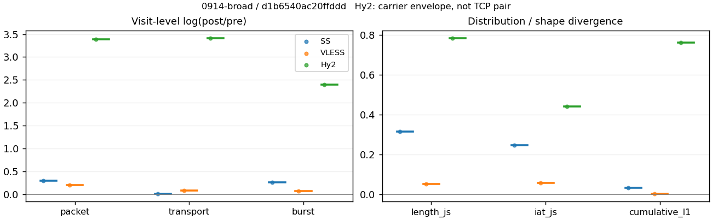
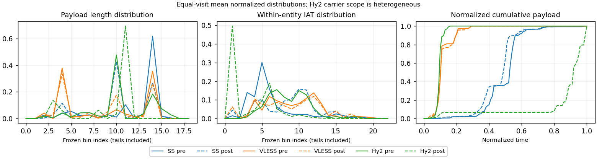

# 0914-broad · 条目 012 · ietf.org

目标：https://www.ietf.org/

活动标签：ietf.org::page_load。选定访问 3 次。

[返回总索引](../../README.md) · [统计口径](../../methods.md)

## 覆盖与资格（每次访问均保留）

| 部署 | 重复 | 主请求路由 | 活动状态 | 代理比较 | DIRECT pre | 请求 proxy/direct/unresolved | 错误 |
| --- | --- | --- | --- | --- | --- | --- | --- |
| Hy2 | 1 | proxy | passed | 1 | 0 | 20/0/0 | [] |
| SS | 1 | proxy | passed | 1 | 0 | 20/0/0 | [] |
| VLESS | 1 | proxy | passed | 1 | 0 | 20/0/0 | [] |

主请求非 proxy 的统计仅解释为已索引的辅助代理连接或 DIRECT 观测，不代表目标业务经代理传输。播放确认与配对资格是两道不同的门。

图中散点为单次访问，短线为重复中位数；Hy2 是共享载体包络，不能与 TCP 配对作等范围因果对比。

形态图先逐访问归一化，再对访问等权平均；实线 pre，虚线 post。分箱序号及边界见 methods，不将分箱索引误解为长度或时间。

## 每次访问的关键观测

### SS

范围：`exclusive_page`。每格 pre → post；空值为不可观测/不适用。

| 重复 | 包数 | 载荷字节 | burst | TCP FR | IAT中位µs | length JS | IAT JS |
| --- | --- | --- | --- | --- | --- | --- | --- |
| 1 | 799 → 1069 | 1.0187e+06 → 1.0338e+06 | 585 → 761 | 41 → 41 | 16.285 → 432.48 | 0.31533 | 0.24616 |

完整标量统计：中位数 [min,max]；Δ 为重复内逐访问变换的中位数，MAD 未缩放。n 为可用变换数；DIRECT-only 的 nΔ=0 不代表 pre 不可用。

| scope | 特征 | pre | post | Δ | IQRΔ | MADΔ | nΔ |
| --- | --- | --- | --- | --- | --- | --- | --- |
| exclusive_page | active_span_sum_s_1000ms | 7.666 [7.666, 7.666] | 9.3482 [9.3482, 9.3482] | 0.1984 | — | — | 1 |
| exclusive_page | active_span_sum_s_100ms | 2.086 [2.086, 2.086] | 3.2121 [3.2121, 3.2121] | 0.43168 | — | — | 1 |
| exclusive_page | active_span_sum_s_500ms | 5.2966 [5.2966, 5.2966] | 6.064 [6.064, 6.064] | 0.1353 | — | — | 1 |
| exclusive_page | burst_bytes_iqr | 2896 [2896, 2896] | 2852 [2852, 2852] | -0.01531 | — | — | 1 |
| exclusive_page | burst_bytes_mad | 35 [35, 35] | 65 [65, 65] | 0.61904 | — | — | 1 |
| exclusive_page | burst_bytes_max | 20480 [20480, 20480] | 13253 [13253, 13253] | -0.43522 | — | — | 1 |
| exclusive_page | burst_bytes_mean | 1741.3 [1741.3, 1741.3] | 1358.5 [1358.5, 1358.5] | -0.24827 | — | — | 1 |
| exclusive_page | burst_bytes_median | 35 [35, 35] | 65 [65, 65] | 0.61904 | — | — | 1 |
| exclusive_page | burst_bytes_min | 0 [0, 0] | 0 [0, 0] | — | — | — | 0 |
| exclusive_page | burst_bytes_p95 | 5792 [5792, 5792] | 5712 [5712, 5712] | -0.013908 | — | — | 1 |
| exclusive_page | burst_bytes_q25 | 0 [0, 0] | 0 [0, 0] | — | — | — | 0 |
| exclusive_page | burst_bytes_q75 | 2896 [2896, 2896] | 2852 [2852, 2852] | -0.01531 | — | — | 1 |
| exclusive_page | burst_bytes_std | 3019 [3019, 3019] | 2036.5 [2036.5, 2036.5] | -0.39369 | — | — | 1 |
| exclusive_page | burst_count | 585 [585, 585] | 761 [761, 761] | 0.26302 | — | — | 1 |
| exclusive_page | burst_duration_ms_iqr | 0 [0, 0] | 0.00011 [0.00011, 0.00011] | — | — | — | 0 |
| exclusive_page | burst_duration_ms_mad | 0 [0, 0] | 0 [0, 0] | — | — | — | 0 |
| exclusive_page | burst_duration_ms_max | 1629.3 [1629.3, 1629.3] | 1631.4 [1631.4, 1631.4] | 0.0012903 | — | — | 1 |
| exclusive_page | burst_duration_ms_mean | 16.868 [16.868, 16.868] | 9.9193 [9.9193, 9.9193] | -0.53091 | — | — | 1 |
| exclusive_page | burst_duration_ms_median | 0 [0, 0] | 0 [0, 0] | — | — | — | 0 |
| exclusive_page | burst_duration_ms_min | 0 [0, 0] | 0 [0, 0] | — | — | — | 0 |
| exclusive_page | burst_duration_ms_p95 | 12.27 [12.27, 12.27] | 2.4486 [2.4486, 2.4486] | -1.6117 | — | — | 1 |
| exclusive_page | burst_duration_ms_q25 | 0 [0, 0] | 0 [0, 0] | — | — | — | 0 |
| exclusive_page | burst_duration_ms_q75 | 0 [0, 0] | 0.00011 [0.00011, 0.00011] | — | — | — | 0 |
| exclusive_page | burst_duration_ms_std | 113.57 [113.57, 113.57] | 83.958 [83.958, 83.958] | -0.30212 | — | — | 1 |
| exclusive_page | burst_packets_iqr | 0 [0, 0] | 1 [1, 1] | — | — | — | 0 |
| exclusive_page | burst_packets_mad | 0 [0, 0] | 0 [0, 0] | — | — | — | 0 |
| exclusive_page | burst_packets_max | 9 [9, 9] | 11 [11, 11] | 0.20067 | — | — | 1 |
| exclusive_page | burst_packets_mean | 1.3658 [1.3658, 1.3658] | 1.4047 [1.4047, 1.4047] | 0.028096 | — | — | 1 |
| exclusive_page | burst_packets_median | 1 [1, 1] | 1 [1, 1] | 0 | — | — | 1 |
| exclusive_page | burst_packets_min | 1 [1, 1] | 1 [1, 1] | 0 | — | — | 1 |
| exclusive_page | burst_packets_p95 | 3 [3, 3] | 3 [3, 3] | 0 | — | — | 1 |
| exclusive_page | burst_packets_q25 | 1 [1, 1] | 1 [1, 1] | 0 | — | — | 1 |
| exclusive_page | burst_packets_q75 | 1 [1, 1] | 2 [2, 2] | 0.69315 | — | — | 1 |
| exclusive_page | burst_packets_std | 1.0619 [1.0619, 1.0619] | 0.87403 [0.87403, 0.87403] | -0.19475 | — | — | 1 |
| exclusive_page | connection_span_concurrency_max | 4 [4, 4] | 4 [4, 4] | 0 | — | — | 1 |
| exclusive_page | cumulative_l1 | — | — | 0.034891 | — | — | 1 |
| exclusive_page | cumulative_max | — | — | 0.49372 | — | — | 1 |
| exclusive_page | direction_entropy | 0.45869 [0.45869, 0.45869] | 0.43998 [0.43998, 0.43998] | -0.018707 | — | — | 1 |
| exclusive_page | down_burst_count | 290 [290, 290] | 378 [378, 378] | 0.26501 | — | — | 1 |
| exclusive_page | down_ip_bytes | 1.0105e+06 [1.0105e+06, 1.0105e+06] | 1.0319e+06 [1.0319e+06, 1.0319e+06] | 0.0209 | — | — | 1 |
| exclusive_page | down_packets | 472 [472, 472] | 625 [625, 625] | 0.28077 | — | — | 1 |
| exclusive_page | down_transport_bytes | 9.8594e+05 [9.8594e+05, 9.8594e+05] | 9.9932e+05 [9.9932e+05, 9.9932e+05] | 0.013486 | — | — | 1 |
| exclusive_page | duration_s | 4.7305 [4.7305, 4.7305] | 4.5684 [4.5684, 4.5684] | -0.034876 | — | — | 1 |
| exclusive_page | entity_count | 5 [5, 5] | 5 [5, 5] | 0 | — | — | 1 |
| exclusive_page | fr_runs | 41 [41, 41] | 41 [41, 41] | 0 | — | — | 1 |
| exclusive_page | fr_runs_per_packet | 0.088172 [0.088172, 0.088172] | 0.065495 [0.065495, 0.065495] | -0.022677 | — | — | 1 |
| exclusive_page | fr_switches | 36 [36, 36] | 36 [36, 36] | 0 | — | — | 1 |
| exclusive_page | fr_switches_per_possible_transition | 0.078261 [0.078261, 0.078261] | 0.057971 [0.057971, 0.057971] | -0.02029 | — | — | 1 |
| exclusive_page | full_retransmission_fraction | 0 [0, 0] | 0 [0, 0] | 0 | — | — | 1 |
| exclusive_page | full_retransmission_packets | 0 [0, 0] | 0 [0, 0] | — | — | — | 0 |
| exclusive_page | iat_count | 794 [794, 794] | 1064 [1064, 1064] | 0.29271 | — | — | 1 |
| exclusive_page | iat_js | — | — | 0.24616 | — | — | 1 |
| exclusive_page | iat_ks | — | — | 0.47146 | — | — | 1 |
| exclusive_page | iat_median_us | 16.285 [16.285, 16.285] | 432.48 [432.48, 432.48] | 3.2793 | — | — | 1 |
| exclusive_page | iat_us_iqr | 45.626 [45.626, 45.626] | 1017.1 [1017.1, 1017.1] | 3.1042 | — | — | 1 |
| exclusive_page | iat_us_mad | 11.389 [11.389, 11.389] | 422.62 [422.62, 422.62] | 3.6139 | — | — | 1 |
| exclusive_page | iat_us_max | 1.6293e+06 [1.6293e+06, 1.6293e+06] | 1.6314e+06 [1.6314e+06, 1.6314e+06] | 0.0012903 | — | — | 1 |
| exclusive_page | iat_us_mean | 14347 [14347, 14347] | 10319 [10319, 10319] | -0.3295 | — | — | 1 |
| exclusive_page | iat_us_median | 16.285 [16.285, 16.285] | 432.48 [432.48, 432.48] | 3.2793 | — | — | 1 |
| exclusive_page | iat_us_min | 0.143 [0.143, 0.143] | 0.038 [0.038, 0.038] | -1.3253 | — | — | 1 |
| exclusive_page | iat_us_p95 | 41676 [41676, 41676] | 31486 [31486, 31486] | -0.28038 | — | — | 1 |
| exclusive_page | iat_us_q25 | 8.9065 [8.9065, 8.9065] | 19.044 [19.044, 19.044] | 0.75996 | — | — | 1 |
| exclusive_page | iat_us_q75 | 54.533 [54.533, 54.533] | 1036.1 [1036.1, 1036.1] | 2.9444 | — | — | 1 |
| exclusive_page | iat_us_std | 98043 [98043, 98043] | 75225 [75225, 75225] | -0.26493 | — | — | 1 |
| exclusive_page | iat_wasserstein_log1p_us | — | — | 1.9107 | — | — | 1 |
| exclusive_page | idle_gap_count_1000ms | 3 [3, 3] | 1 [1, 1] | -1.0986 | — | — | 1 |
| exclusive_page | idle_gap_count_100ms | 20 [20, 20] | 18 [18, 18] | -0.10536 | — | — | 1 |
| exclusive_page | idle_gap_count_500ms | 6 [6, 6] | 5 [5, 5] | -0.18232 | — | — | 1 |
| exclusive_page | idle_gap_sum_s_1000ms | 3.7252 [3.7252, 3.7252] | 1.6314 [1.6314, 1.6314] | -0.82569 | — | — | 1 |
| exclusive_page | idle_gap_sum_s_100ms | 9.3052 [9.3052, 9.3052] | 7.7676 [7.7676, 7.7676] | -0.18062 | — | — | 1 |
| exclusive_page | idle_gap_sum_s_500ms | 6.0945 [6.0945, 6.0945] | 4.9156 [4.9156, 4.9156] | -0.21498 | — | — | 1 |
| exclusive_page | ip_bytes | 1.0603e+06 [1.0603e+06, 1.0603e+06] | 1.0976e+06 [1.0976e+06, 1.0976e+06] | 0.034528 | — | — | 1 |
| exclusive_page | length_iqr | 1448 [1448, 1448] | 1428 [1428, 1428] | -0.013908 | — | — | 1 |
| exclusive_page | length_js | — | — | 0.31533 | — | — | 1 |
| exclusive_page | length_ks | — | — | 0.5514 | — | — | 1 |
| exclusive_page | length_mad | 0 [0, 0] | 700 [700, 700] | — | — | — | 0 |
| exclusive_page | length_max | 8948 [8948, 8948] | 9996 [9996, 9996] | 0.11075 | — | — | 1 |
| exclusive_page | length_mean | 2190.7 [2190.7, 2190.7] | 1651.5 [1651.5, 1651.5] | -0.28257 | — | — | 1 |
| exclusive_page | length_median | 2896 [2896, 2896] | 1428 [1428, 1428] | -0.70706 | — | — | 1 |
| exclusive_page | length_min | 31 [31, 31] | 20 [20, 20] | -0.43825 | — | — | 1 |
| exclusive_page | length_p95 | 2896 [2896, 2896] | 2856 [2856, 2856] | -0.013908 | — | — | 1 |
| exclusive_page | length_q25 | 1448 [1448, 1448] | 1428 [1428, 1428] | -0.013908 | — | — | 1 |
| exclusive_page | length_q75 | 2896 [2896, 2896] | 2856 [2856, 2856] | -0.013908 | — | — | 1 |
| exclusive_page | length_std | 1169.5 [1169.5, 1169.5] | 1181.3 [1181.3, 1181.3] | 0.010065 | — | — | 1 |
| exclusive_page | length_wasserstein_bytes | — | — | 582.22 | — | — | 1 |
| exclusive_page | nonempty_entity_count | 5 [5, 5] | 5 [5, 5] | 0 | — | — | 1 |
| exclusive_page | nonempty_packets | 465 [465, 465] | 626 [626, 626] | 0.29731 | — | — | 1 |
| exclusive_page | offload_suspect_fraction | 0.39174 [0.39174, 0.39174] | 0.19738 [0.19738, 0.19738] | -0.19436 | — | — | 1 |
| exclusive_page | packet_count | 799 [799, 799] | 1069 [1069, 1069] | 0.29112 | — | — | 1 |
| exclusive_page | rtt_median_ms | 0.01615 [0.01615, 0.01615] | 35.413 [35.413, 35.413] | 7.6929 | — | — | 1 |
| exclusive_page | rtt_sample_count | 325 [325, 325] | 147 [147, 147] | -0.79339 | — | — | 1 |
| exclusive_page | tcp_ack_count | 794 [794, 794] | 1064 [1064, 1064] | 0.29271 | — | — | 1 |
| exclusive_page | tcp_fin_count | 10 [10, 10] | 10 [10, 10] | 0 | — | — | 1 |
| exclusive_page | tcp_packet_count | 799 [799, 799] | 1069 [1069, 1069] | 0.29112 | — | — | 1 |
| exclusive_page | tcp_rst_count | 0 [0, 0] | 0 [0, 0] | — | — | — | 0 |
| exclusive_page | tcp_syn_count | 10 [10, 10] | 10 [10, 10] | 0 | — | — | 1 |
| exclusive_page | tcp_window_raw_median | 65535 [65535, 65535] | 146 [146, 146] | -6.1067 | — | — | 1 |
| exclusive_page | transition_entropy | 0.30778 [0.30778, 0.30778] | 0.25392 [0.25392, 0.25392] | -0.05386 | — | — | 1 |
| exclusive_page | transition_n_mm | 400 [400, 400] | 549 [549, 549] | 0.31663 | — | — | 1 |
| exclusive_page | transition_n_mp | 16 [16, 16] | 16 [16, 16] | 0 | — | — | 1 |
| exclusive_page | transition_n_pm | 20 [20, 20] | 20 [20, 20] | 0 | — | — | 1 |
| exclusive_page | transition_n_pp | 24 [24, 24] | 36 [36, 36] | 0.40547 | — | — | 1 |
| exclusive_page | transition_p_mm | 0.96154 [0.96154, 0.96154] | 0.97168 [0.97168, 0.97168] | 0.010143 | — | — | 1 |
| exclusive_page | transition_p_mp | 0.038462 [0.038462, 0.038462] | 0.028319 [0.028319, 0.028319] | -0.010143 | — | — | 1 |
| exclusive_page | transition_p_pm | 0.45455 [0.45455, 0.45455] | 0.35714 [0.35714, 0.35714] | -0.097403 | — | — | 1 |
| exclusive_page | transition_p_pp | 0.54545 [0.54545, 0.54545] | 0.64286 [0.64286, 0.64286] | 0.097403 | — | — | 1 |
| exclusive_page | transport_bytes | 1.0187e+06 [1.0187e+06, 1.0187e+06] | 1.0338e+06 [1.0338e+06, 1.0338e+06] | 0.014747 | — | — | 1 |
| exclusive_page | up_burst_count | 295 [295, 295] | 383 [383, 383] | 0.26106 | — | — | 1 |
| exclusive_page | up_byte_fraction | 0.032145 [0.032145, 0.032145] | 0.033366 [0.033366, 0.033366] | 0.0012202 | — | — | 1 |
| exclusive_page | up_ip_bytes | 49790 [49790, 49790] | 65698 [65698, 65698] | 0.27725 | — | — | 1 |
| exclusive_page | up_packets | 327 [327, 327] | 444 [444, 444] | 0.30586 | — | — | 1 |
| exclusive_page | up_transport_bytes | 32746 [32746, 32746] | 34494 [34494, 34494] | 0.052005 | — | — | 1 |
| exclusive_page | zero_iat_count | 0 [0, 0] | 0 [0, 0] | — | — | — | 0 |
| exclusive_page | zero_iat_fraction | 0 [0, 0] | 0 [0, 0] | 0 | — | — | 1 |

### VLESS

范围：`exclusive_page`。每格 pre → post；空值为不可观测/不适用。

| 重复 | 包数 | 载荷字节 | burst | TCP FR | IAT中位µs | length JS | IAT JS |
| --- | --- | --- | --- | --- | --- | --- | --- |
| 1 | 578 → 705 | 4.4455e+05 → 4.844e+05 | 397 → 425 | 32 → 42 | 396.24 → 381.97 | 0.052207 | 0.05817 |

完整标量统计：中位数 [min,max]；Δ 为重复内逐访问变换的中位数，MAD 未缩放。n 为可用变换数；DIRECT-only 的 nΔ=0 不代表 pre 不可用。

| scope | 特征 | pre | post | Δ | IQRΔ | MADΔ | nΔ |
| --- | --- | --- | --- | --- | --- | --- | --- |
| exclusive_page | active_span_sum_s_1000ms | 7.1445 [7.1445, 7.1445] | 6.6044 [6.6044, 6.6044] | -0.078605 | — | — | 1 |
| exclusive_page | active_span_sum_s_100ms | 1.1381 [1.1381, 1.1381] | 2.6006 [2.6006, 2.6006] | 0.82635 | — | — | 1 |
| exclusive_page | active_span_sum_s_500ms | 3.5574 [3.5574, 3.5574] | 6.6044 [6.6044, 6.6044] | 0.61872 | — | — | 1 |
| exclusive_page | burst_bytes_iqr | 2896 [2896, 2896] | 2824 [2824, 2824] | -0.025176 | — | — | 1 |
| exclusive_page | burst_bytes_mad | 24 [24, 24] | 53 [53, 53] | 0.79224 | — | — | 1 |
| exclusive_page | burst_bytes_max | 5792 [5792, 5792] | 4024 [4024, 4024] | -0.3642 | — | — | 1 |
| exclusive_page | burst_bytes_mean | 1119.8 [1119.8, 1119.8] | 1139.8 [1139.8, 1139.8] | 0.017683 | — | — | 1 |
| exclusive_page | burst_bytes_median | 24 [24, 24] | 53 [53, 53] | 0.79224 | — | — | 1 |
| exclusive_page | burst_bytes_min | 0 [0, 0] | 0 [0, 0] | — | — | — | 0 |
| exclusive_page | burst_bytes_p95 | 2968 [2968, 2968] | 2896 [2896, 2896] | -0.024558 | — | — | 1 |
| exclusive_page | burst_bytes_q25 | 0 [0, 0] | 0 [0, 0] | — | — | — | 0 |
| exclusive_page | burst_bytes_q75 | 2896 [2896, 2896] | 2824 [2824, 2824] | -0.025176 | — | — | 1 |
| exclusive_page | burst_bytes_std | 1461.9 [1461.9, 1461.9] | 1274.6 [1274.6, 1274.6] | -0.13713 | — | — | 1 |
| exclusive_page | burst_count | 397 [397, 397] | 425 [425, 425] | 0.068153 | — | — | 1 |
| exclusive_page | burst_duration_ms_iqr | 1.4833 [1.4833, 1.4833] | 2.8416 [2.8416, 2.8416] | 0.65009 | — | — | 1 |
| exclusive_page | burst_duration_ms_mad | 0 [0, 0] | 0 [0, 0] | — | — | — | 0 |
| exclusive_page | burst_duration_ms_max | 11036 [11036, 11036] | 1578.5 [1578.5, 1578.5] | -1.9447 | — | — | 1 |
| exclusive_page | burst_duration_ms_mean | 51.549 [51.549, 51.549] | 15.116 [15.116, 15.116] | -1.2267 | — | — | 1 |
| exclusive_page | burst_duration_ms_median | 0 [0, 0] | 0 [0, 0] | — | — | — | 0 |
| exclusive_page | burst_duration_ms_min | 0 [0, 0] | 0 [0, 0] | — | — | — | 0 |
| exclusive_page | burst_duration_ms_p95 | 66.512 [66.512, 66.512] | 111.13 [111.13, 111.13] | 0.51333 | — | — | 1 |
| exclusive_page | burst_duration_ms_q25 | 0 [0, 0] | 0 [0, 0] | — | — | — | 0 |
| exclusive_page | burst_duration_ms_q75 | 1.4833 [1.4833, 1.4833] | 2.8416 [2.8416, 2.8416] | 0.65009 | — | — | 1 |
| exclusive_page | burst_duration_ms_std | 567.41 [567.41, 567.41] | 87.953 [87.953, 87.953] | -1.8643 | — | — | 1 |
| exclusive_page | burst_packets_iqr | 1 [1, 1] | 1 [1, 1] | 0 | — | — | 1 |
| exclusive_page | burst_packets_mad | 0 [0, 0] | 0 [0, 0] | — | — | — | 0 |
| exclusive_page | burst_packets_max | 3 [3, 3] | 7 [7, 7] | 0.8473 | — | — | 1 |
| exclusive_page | burst_packets_mean | 1.4559 [1.4559, 1.4559] | 1.6588 [1.6588, 1.6588] | 0.13047 | — | — | 1 |
| exclusive_page | burst_packets_median | 1 [1, 1] | 1 [1, 1] | 0 | — | — | 1 |
| exclusive_page | burst_packets_min | 1 [1, 1] | 1 [1, 1] | 0 | — | — | 1 |
| exclusive_page | burst_packets_p95 | 2 [2, 2] | 3 [3, 3] | 0.40547 | — | — | 1 |
| exclusive_page | burst_packets_q25 | 1 [1, 1] | 1 [1, 1] | 0 | — | — | 1 |
| exclusive_page | burst_packets_q75 | 2 [2, 2] | 2 [2, 2] | 0 | — | — | 1 |
| exclusive_page | burst_packets_std | 0.55088 [0.55088, 0.55088] | 0.9425 [0.9425, 0.9425] | 0.53701 | — | — | 1 |
| exclusive_page | connection_span_concurrency_max | 4 [4, 4] | 4 [4, 4] | 0 | — | — | 1 |
| exclusive_page | cumulative_l1 | — | — | 0.0047244 | — | — | 1 |
| exclusive_page | cumulative_max | — | — | 0.039276 | — | — | 1 |
| exclusive_page | direction_entropy | 0.4653 [0.4653, 0.4653] | 0.48506 [0.48506, 0.48506] | 0.019765 | — | — | 1 |
| exclusive_page | down_burst_count | 196 [196, 196] | 210 [210, 210] | 0.068993 | — | — | 1 |
| exclusive_page | down_ip_bytes | 4.495e+05 [4.495e+05, 4.495e+05] | 4.8231e+05 [4.8231e+05, 4.8231e+05] | 0.070452 | — | — | 1 |
| exclusive_page | down_packets | 359 [359, 359] | 424 [424, 424] | 0.16641 | — | — | 1 |
| exclusive_page | down_transport_bytes | 4.3079e+05 [4.3079e+05, 4.3079e+05] | 4.6022e+05 [4.6022e+05, 4.6022e+05] | 0.066084 | — | — | 1 |
| exclusive_page | duration_s | 15.795 [15.795, 15.795] | 15.762 [15.762, 15.762] | -0.0020597 | — | — | 1 |
| exclusive_page | entity_count | 5 [5, 5] | 5 [5, 5] | 0 | — | — | 1 |
| exclusive_page | fr_runs | 32 [32, 32] | 42 [42, 42] | 0.27193 | — | — | 1 |
| exclusive_page | fr_runs_per_packet | 0.093023 [0.093023, 0.093023] | 0.10269 [0.10269, 0.10269] | 0.0096662 | — | — | 1 |
| exclusive_page | fr_switches | 27 [27, 27] | 37 [37, 37] | 0.31508 | — | — | 1 |
| exclusive_page | fr_switches_per_possible_transition | 0.079646 [0.079646, 0.079646] | 0.091584 [0.091584, 0.091584] | 0.011938 | — | — | 1 |
| exclusive_page | full_retransmission_fraction | 0 [0, 0] | 0 [0, 0] | 0 | — | — | 1 |
| exclusive_page | full_retransmission_packets | 0 [0, 0] | 0 [0, 0] | — | — | — | 0 |
| exclusive_page | iat_count | 573 [573, 573] | 700 [700, 700] | 0.20019 | — | — | 1 |
| exclusive_page | iat_js | — | — | 0.05817 | — | — | 1 |
| exclusive_page | iat_ks | — | — | 0.097534 | — | — | 1 |
| exclusive_page | iat_median_us | 396.24 [396.24, 396.24] | 381.97 [381.97, 381.97] | -0.036678 | — | — | 1 |
| exclusive_page | iat_us_iqr | 2520.6 [2520.6, 2520.6] | 2824.9 [2824.9, 2824.9] | 0.114 | — | — | 1 |
| exclusive_page | iat_us_mad | 388.67 [388.67, 388.67] | 376.73 [376.73, 376.73] | -0.031205 | — | — | 1 |
| exclusive_page | iat_us_max | 1.1036e+07 [1.1036e+07, 1.1036e+07] | 1.1025e+07 [1.1025e+07, 1.1025e+07] | -0.00096734 | — | — | 1 |
| exclusive_page | iat_us_mean | 36617 [36617, 36617] | 29234 [29234, 29234] | -0.22518 | — | — | 1 |
| exclusive_page | iat_us_median | 396.24 [396.24, 396.24] | 381.97 [381.97, 381.97] | -0.036678 | — | — | 1 |
| exclusive_page | iat_us_min | 1.739 [1.739, 1.739] | 0.037 [0.037, 0.037] | -3.8501 | — | — | 1 |
| exclusive_page | iat_us_p95 | 17937 [17937, 17937] | 46009 [46009, 46009] | 0.94199 | — | — | 1 |
| exclusive_page | iat_us_q25 | 42.291 [42.291, 42.291] | 18.645 [18.645, 18.645] | -0.81898 | — | — | 1 |
| exclusive_page | iat_us_q75 | 2562.8 [2562.8, 2562.8] | 2843.6 [2843.6, 2843.6] | 0.10394 | — | — | 1 |
| exclusive_page | iat_us_std | 4.7284e+05 [4.7284e+05, 4.7284e+05] | 4.2422e+05 [4.2422e+05, 4.2422e+05] | -0.10849 | — | — | 1 |
| exclusive_page | iat_wasserstein_log1p_us | — | — | 0.42245 | — | — | 1 |
| exclusive_page | idle_gap_count_1000ms | 3 [3, 3] | 3 [3, 3] | 0 | — | — | 1 |
| exclusive_page | idle_gap_count_100ms | 20 [20, 20] | 25 [25, 25] | 0.22314 | — | — | 1 |
| exclusive_page | idle_gap_count_500ms | 8 [8, 8] | 3 [3, 3] | -0.98083 | — | — | 1 |
| exclusive_page | idle_gap_sum_s_1000ms | 13.837 [13.837, 13.837] | 13.859 [13.859, 13.859] | 0.001612 | — | — | 1 |
| exclusive_page | idle_gap_sum_s_100ms | 19.843 [19.843, 19.843] | 17.863 [17.863, 17.863] | -0.10513 | — | — | 1 |
| exclusive_page | idle_gap_sum_s_500ms | 17.424 [17.424, 17.424] | 13.859 [13.859, 13.859] | -0.2289 | — | — | 1 |
| exclusive_page | ip_bytes | 4.7457e+05 [4.7457e+05, 4.7457e+05] | 5.2156e+05 [5.2156e+05, 5.2156e+05] | 0.094412 | — | — | 1 |
| exclusive_page | length_iqr | 2752 [2752, 2752] | 2752 [2752, 2752] | 0 | — | — | 1 |
| exclusive_page | length_js | — | — | 0.052207 | — | — | 1 |
| exclusive_page | length_ks | — | — | 0.12461 | — | — | 1 |
| exclusive_page | length_mad | 1147 [1147, 1147] | 1136 [1136, 1136] | -0.0096365 | — | — | 1 |
| exclusive_page | length_max | 2896 [2896, 2896] | 2824 [2824, 2824] | -0.025176 | — | — | 1 |
| exclusive_page | length_mean | 1292.3 [1292.3, 1292.3] | 1184.3 [1184.3, 1184.3] | -0.087238 | — | — | 1 |
| exclusive_page | length_median | 1219 [1219, 1219] | 1208 [1208, 1208] | -0.0090648 | — | — | 1 |
| exclusive_page | length_min | 24 [24, 24] | 24 [24, 24] | 0 | — | — | 1 |
| exclusive_page | length_p95 | 2824 [2824, 2824] | 2824 [2824, 2824] | 0 | — | — | 1 |
| exclusive_page | length_q25 | 72 [72, 72] | 72 [72, 72] | 0 | — | — | 1 |
| exclusive_page | length_q75 | 2824 [2824, 2824] | 2824 [2824, 2824] | 0 | — | — | 1 |
| exclusive_page | length_std | 1217.1 [1217.1, 1217.1] | 1110.8 [1110.8, 1110.8] | -0.09141 | — | — | 1 |
| exclusive_page | length_wasserstein_bytes | — | — | 151.94 | — | — | 1 |
| exclusive_page | nonempty_entity_count | 5 [5, 5] | 5 [5, 5] | 0 | — | — | 1 |
| exclusive_page | nonempty_packets | 344 [344, 344] | 409 [409, 409] | 0.17307 | — | — | 1 |
| exclusive_page | offload_suspect_fraction | 0.23529 [0.23529, 0.23529] | 0.16312 [0.16312, 0.16312] | -0.072174 | — | — | 1 |
| exclusive_page | packet_count | 578 [578, 578] | 705 [705, 705] | 0.19862 | — | — | 1 |
| exclusive_page | rtt_median_ms | 0.72914 [0.72914, 0.72914] | 2.9382 [2.9382, 2.9382] | 1.3937 | — | — | 1 |
| exclusive_page | rtt_sample_count | 214 [214, 214] | 269 [269, 269] | 0.22874 | — | — | 1 |
| exclusive_page | tcp_ack_count | 563 [563, 563] | 700 [700, 700] | 0.2178 | — | — | 1 |
| exclusive_page | tcp_fin_count | 10 [10, 10] | 10 [10, 10] | 0 | — | — | 1 |
| exclusive_page | tcp_packet_count | 578 [578, 578] | 705 [705, 705] | 0.19862 | — | — | 1 |
| exclusive_page | tcp_rst_count | 10 [10, 10] | 0 [0, 0] | — | — | — | 0 |
| exclusive_page | tcp_syn_count | 10 [10, 10] | 10 [10, 10] | 0 | — | — | 1 |
| exclusive_page | tcp_window_raw_median | 65535 [65535, 65535] | 166 [166, 166] | -5.9784 | — | — | 1 |
| exclusive_page | transition_entropy | 0.30154 [0.30154, 0.30154] | 0.3403 [0.3403, 0.3403] | 0.038763 | — | — | 1 |
| exclusive_page | transition_n_mm | 294 [294, 294] | 345 [345, 345] | 0.15996 | — | — | 1 |
| exclusive_page | transition_n_mp | 11 [11, 11] | 16 [16, 16] | 0.37469 | — | — | 1 |
| exclusive_page | transition_n_pm | 16 [16, 16] | 21 [21, 21] | 0.27193 | — | — | 1 |
| exclusive_page | transition_n_pp | 18 [18, 18] | 22 [22, 22] | 0.20067 | — | — | 1 |
| exclusive_page | transition_p_mm | 0.96393 [0.96393, 0.96393] | 0.95568 [0.95568, 0.95568] | -0.0082558 | — | — | 1 |
| exclusive_page | transition_p_mp | 0.036066 [0.036066, 0.036066] | 0.044321 [0.044321, 0.044321] | 0.0082558 | — | — | 1 |
| exclusive_page | transition_p_pm | 0.47059 [0.47059, 0.47059] | 0.48837 [0.48837, 0.48837] | 0.017784 | — | — | 1 |
| exclusive_page | transition_p_pp | 0.52941 [0.52941, 0.52941] | 0.51163 [0.51163, 0.51163] | -0.017784 | — | — | 1 |
| exclusive_page | transport_bytes | 4.4455e+05 [4.4455e+05, 4.4455e+05] | 4.844e+05 [4.844e+05, 4.844e+05] | 0.085836 | — | — | 1 |
| exclusive_page | up_burst_count | 201 [201, 201] | 215 [215, 215] | 0.067333 | — | — | 1 |
| exclusive_page | up_byte_fraction | 0.030955 [0.030955, 0.030955] | 0.049908 [0.049908, 0.049908] | 0.018953 | — | — | 1 |
| exclusive_page | up_ip_bytes | 25069 [25069, 25069] | 39247 [39247, 39247] | 0.44824 | — | — | 1 |
| exclusive_page | up_packets | 219 [219, 219] | 281 [281, 281] | 0.24928 | — | — | 1 |
| exclusive_page | up_transport_bytes | 13761 [13761, 13761] | 24175 [24175, 24175] | 0.56348 | — | — | 1 |
| exclusive_page | zero_iat_count | 0 [0, 0] | 0 [0, 0] | — | — | — | 0 |
| exclusive_page | zero_iat_fraction | 0 [0, 0] | 0 [0, 0] | 0 | — | — | 1 |

### Hy2

范围：`carrier_context_envelope`。每格 pre → post；空值为不可观测/不适用。

| 重复 | 包数 | 载荷字节 | burst | TCP FR | IAT中位µs | length JS | IAT JS |
| --- | --- | --- | --- | --- | --- | --- | --- |
| 1 | 940 → 27823 | 1.0264e+06 → 3.1004e+07 | 758 → 8338 | — | 163.6 → 1.402 | 0.78348 | 0.44271 |

完整标量统计：中位数 [min,max]；Δ 为重复内逐访问变换的中位数，MAD 未缩放。n 为可用变换数；DIRECT-only 的 nΔ=0 不代表 pre 不可用。

| scope | 特征 | pre | post | Δ | IQRΔ | MADΔ | nΔ |
| --- | --- | --- | --- | --- | --- | --- | --- |
| carrier_context_envelope | active_span_sum_s_1000ms | 5.2187 [5.2187, 5.2187] | 7.6857 [7.6857, 7.6857] | 0.38712 | — | — | 1 |
| carrier_context_envelope | active_span_sum_s_100ms | 1.19 [1.19, 1.19] | 4.8461 [4.8461, 4.8461] | 1.4042 | — | — | 1 |
| carrier_context_envelope | active_span_sum_s_500ms | 5.2187 [5.2187, 5.2187] | 7.6857 [7.6857, 7.6857] | 0.38712 | — | — | 1 |
| carrier_context_envelope | burst_bytes_iqr | 1404 [1404, 1404] | 5126 [5126, 5126] | 1.295 | — | — | 1 |
| carrier_context_envelope | burst_bytes_mad | 33 [33, 33] | 294 [294, 294] | 2.1871 | — | — | 1 |
| carrier_context_envelope | burst_bytes_max | 20480 [20480, 20480] | 2.9272e+05 [2.9272e+05, 2.9272e+05] | 2.6598 | — | — | 1 |
| carrier_context_envelope | burst_bytes_mean | 1354 [1354, 1354] | 3718.3 [3718.3, 3718.3] | 1.0102 | — | — | 1 |
| carrier_context_envelope | burst_bytes_median | 33 [33, 33] | 327 [327, 327] | 2.2935 | — | — | 1 |
| carrier_context_envelope | burst_bytes_min | 0 [0, 0] | 22 [22, 22] | — | — | — | 0 |
| carrier_context_envelope | burst_bytes_p95 | 5751.8 [5751.8, 5751.8] | 13814 [13814, 13814] | 0.87617 | — | — | 1 |
| carrier_context_envelope | burst_bytes_q25 | 0 [0, 0] | 42 [42, 42] | — | — | — | 0 |
| carrier_context_envelope | burst_bytes_q75 | 1404 [1404, 1404] | 5168 [5168, 5168] | 1.3032 | — | — | 1 |
| carrier_context_envelope | burst_bytes_std | 2576.6 [2576.6, 2576.6] | 8267.2 [8267.2, 8267.2] | 1.1658 | — | — | 1 |
| carrier_context_envelope | burst_count | 758 [758, 758] | 8338 [8338, 8338] | 2.3979 | — | — | 1 |
| carrier_context_envelope | burst_duration_ms_iqr | 0 [0, 0] | 0.027488 [0.027488, 0.027488] | — | — | — | 0 |
| carrier_context_envelope | burst_duration_ms_mad | 0 [0, 0] | 4.7e-05 [4.7e-05, 4.7e-05] | — | — | — | 0 |
| carrier_context_envelope | burst_duration_ms_max | 12512 [12512, 12512] | 382.39 [382.39, 382.39] | -3.488 | — | — | 1 |
| carrier_context_envelope | burst_duration_ms_mean | 22.128 [22.128, 22.128] | 0.30794 [0.30794, 0.30794] | -4.2747 | — | — | 1 |
| carrier_context_envelope | burst_duration_ms_median | 0 [0, 0] | 4.7e-05 [4.7e-05, 4.7e-05] | — | — | — | 0 |
| carrier_context_envelope | burst_duration_ms_min | 0 [0, 0] | 0 [0, 0] | — | — | — | 0 |
| carrier_context_envelope | burst_duration_ms_p95 | 1.9591 [1.9591, 1.9591] | 0.21359 [0.21359, 0.21359] | -2.2162 | — | — | 1 |
| carrier_context_envelope | burst_duration_ms_q25 | 0 [0, 0] | 0 [0, 0] | — | — | — | 0 |
| carrier_context_envelope | burst_duration_ms_q75 | 0 [0, 0] | 0.027488 [0.027488, 0.027488] | — | — | — | 0 |
| carrier_context_envelope | burst_duration_ms_std | 455.45 [455.45, 455.45] | 5.6535 [5.6535, 5.6535] | -4.389 | — | — | 1 |
| carrier_context_envelope | burst_packets_iqr | 0 [0, 0] | 3 [3, 3] | — | — | — | 0 |
| carrier_context_envelope | burst_packets_mad | 0 [0, 0] | 1 [1, 1] | — | — | — | 0 |
| carrier_context_envelope | burst_packets_max | 5 [5, 5] | 212 [212, 212] | 3.7471 | — | — | 1 |
| carrier_context_envelope | burst_packets_mean | 1.2401 [1.2401, 1.2401] | 3.3369 [3.3369, 3.3369] | 0.98984 | — | — | 1 |
| carrier_context_envelope | burst_packets_median | 1 [1, 1] | 2 [2, 2] | 0.69315 | — | — | 1 |
| carrier_context_envelope | burst_packets_min | 1 [1, 1] | 1 [1, 1] | 0 | — | — | 1 |
| carrier_context_envelope | burst_packets_p95 | 2 [2, 2] | 10 [10, 10] | 1.6094 | — | — | 1 |
| carrier_context_envelope | burst_packets_q25 | 1 [1, 1] | 1 [1, 1] | 0 | — | — | 1 |
| carrier_context_envelope | burst_packets_q75 | 1 [1, 1] | 4 [4, 4] | 1.3863 | — | — | 1 |
| carrier_context_envelope | burst_packets_std | 0.58149 [0.58149, 0.58149] | 5.7472 [5.7472, 5.7472] | 2.2909 | — | — | 1 |
| carrier_context_envelope | connection_span_concurrency_max | 4 [4, 4] | 1 [1, 1] | -1.3863 | — | — | 1 |
| carrier_context_envelope | cumulative_l1 | — | — | 0.76239 | — | — | 1 |
| carrier_context_envelope | cumulative_max | — | — | 0.93299 | — | — | 1 |
| carrier_context_envelope | direction_entropy | 0.45282 [0.45282, 0.45282] | 0.71704 [0.71704, 0.71704] | 0.26423 | — | — | 1 |
| carrier_context_envelope | direction_run_analog_runs | 45 [45, 45] | 8338 [8338, 8338] | 5.2219 | — | — | 1 |
| carrier_context_envelope | direction_run_analog_runs_per_packet | 0.087209 [0.087209, 0.087209] | 0.29968 [0.29968, 0.29968] | 0.21247 | — | — | 1 |
| carrier_context_envelope | direction_run_analog_switches | 39 [39, 39] | 8337 [8337, 8337] | 5.3649 | — | — | 1 |
| carrier_context_envelope | direction_run_analog_switches_per_possible_transition | 0.076471 [0.076471, 0.076471] | 0.29965 [0.29965, 0.29965] | 0.22318 | — | — | 1 |
| carrier_context_envelope | down_burst_count | 376 [376, 376] | 4169 [4169, 4169] | 2.4058 | — | — | 1 |
| carrier_context_envelope | down_ip_bytes | 1.0193e+06 [1.0193e+06, 1.0193e+06] | 3.1258e+07 [3.1258e+07, 3.1258e+07] | 3.4232 | — | — | 1 |
| carrier_context_envelope | down_packets | 528 [528, 528] | 22326 [22326, 22326] | 3.7444 | — | — | 1 |
| carrier_context_envelope | down_transport_bytes | 9.918e+05 [9.918e+05, 9.918e+05] | 3.0633e+07 [3.0633e+07, 3.0633e+07] | 3.4303 | — | — | 1 |
| carrier_context_envelope | duration_s | 14.941 [14.941, 14.941] | 14.923 [14.923, 14.923] | -0.0011996 | — | — | 1 |
| carrier_context_envelope | entity_count | 6 [6, 6] | 1 [1, 1] | -1.7918 | — | — | 1 |
| carrier_context_envelope | full_retransmission_fraction | 0.0010638 [0.0010638, 0.0010638] | — | — | — | — | 0 |
| carrier_context_envelope | full_retransmission_packets | 1 [1, 1] | — | — | — | — | 0 |
| carrier_context_envelope | iat_count | 934 [934, 934] | 27822 [27822, 27822] | 3.3941 | — | — | 1 |
| carrier_context_envelope | iat_js | — | — | 0.44271 | — | — | 1 |
| carrier_context_envelope | iat_ks | — | — | 0.64346 | — | — | 1 |
| carrier_context_envelope | iat_median_us | 163.6 [163.6, 163.6] | 1.402 [1.402, 1.402] | -4.7595 | — | — | 1 |
| carrier_context_envelope | iat_us_iqr | 901.59 [901.59, 901.59] | 26.002 [26.002, 26.002] | -3.546 | — | — | 1 |
| carrier_context_envelope | iat_us_mad | 153.15 [153.15, 153.15] | 1.367 [1.367, 1.367] | -4.7188 | — | — | 1 |
| carrier_context_envelope | iat_us_max | 1.2512e+07 [1.2512e+07, 1.2512e+07] | 5.8487e+06 [5.8487e+06, 5.8487e+06] | -0.76049 | — | — | 1 |
| carrier_context_envelope | iat_us_mean | 32232 [32232, 32232] | 536.37 [536.37, 536.37] | -4.0959 | — | — | 1 |
| carrier_context_envelope | iat_us_median | 163.6 [163.6, 163.6] | 1.402 [1.402, 1.402] | -4.7595 | — | — | 1 |
| carrier_context_envelope | iat_us_min | 3.502 [3.502, 3.502] | 0.005 [0.005, 0.005] | -6.5517 | — | — | 1 |
| carrier_context_envelope | iat_us_p95 | 6211.4 [6211.4, 6211.4] | 295.2 [295.2, 295.2] | -3.0465 | — | — | 1 |
| carrier_context_envelope | iat_us_q25 | 50.283 [50.283, 50.283] | 0.057 [0.057, 0.057] | -6.7824 | — | — | 1 |
| carrier_context_envelope | iat_us_q75 | 951.88 [951.88, 951.88] | 26.059 [26.059, 26.059] | -3.5981 | — | — | 1 |
| carrier_context_envelope | iat_us_std | 5.7592e+05 [5.7592e+05, 5.7592e+05] | 36366 [36366, 36366] | -2.7623 | — | — | 1 |
| carrier_context_envelope | iat_wasserstein_log1p_us | — | — | 3.6087 | — | — | 1 |
| carrier_context_envelope | idle_gap_count_1000ms | 2 [2, 2] | 2 [2, 2] | 0 | — | — | 1 |
| carrier_context_envelope | idle_gap_count_100ms | 19 [19, 19] | 18 [18, 18] | -0.054067 | — | — | 1 |
| carrier_context_envelope | idle_gap_count_500ms | 2 [2, 2] | 2 [2, 2] | 0 | — | — | 1 |
| carrier_context_envelope | idle_gap_sum_s_1000ms | 24.886 [24.886, 24.886] | 7.2373 [7.2373, 7.2373] | -1.2351 | — | — | 1 |
| carrier_context_envelope | idle_gap_sum_s_100ms | 28.915 [28.915, 28.915] | 10.077 [10.077, 10.077] | -1.0541 | — | — | 1 |
| carrier_context_envelope | idle_gap_sum_s_500ms | 24.886 [24.886, 24.886] | 7.2373 [7.2373, 7.2373] | -1.2351 | — | — | 1 |
| carrier_context_envelope | ip_bytes | 1.0753e+06 [1.0753e+06, 1.0753e+06] | 3.1783e+07 [3.1783e+07, 3.1783e+07] | 3.3863 | — | — | 1 |
| carrier_context_envelope | length_iqr | 1398.8 [1398.8, 1398.8] | 596 [596, 596] | -0.85309 | — | — | 1 |
| carrier_context_envelope | length_js | — | — | 0.78348 | — | — | 1 |
| carrier_context_envelope | length_ks | — | — | 0.40101 | — | — | 1 |
| carrier_context_envelope | length_mad | 313 [313, 313] | 0 [0, 0] | — | — | — | 0 |
| carrier_context_envelope | length_max | 8948 [8948, 8948] | 1441 [1441, 1441] | -1.8261 | — | — | 1 |
| carrier_context_envelope | length_mean | 1989.1 [1989.1, 1989.1] | 1114.3 [1114.3, 1114.3] | -0.57942 | — | — | 1 |
| carrier_context_envelope | length_median | 1404 [1404, 1404] | 1441 [1441, 1441] | 0.026012 | — | — | 1 |
| carrier_context_envelope | length_min | 31 [31, 31] | 22 [22, 22] | -0.34294 | — | — | 1 |
| carrier_context_envelope | length_p95 | 5627 [5627, 5627] | 1441 [1441, 1441] | -1.3622 | — | — | 1 |
| carrier_context_envelope | length_q25 | 1404 [1404, 1404] | 845 [845, 845] | -0.50774 | — | — | 1 |
| carrier_context_envelope | length_q75 | 2802.8 [2802.8, 2802.8] | 1441 [1441, 1441] | -0.66526 | — | — | 1 |
| carrier_context_envelope | length_std | 1760 [1760, 1760] | 560.82 [560.82, 560.82] | -1.1437 | — | — | 1 |
| carrier_context_envelope | length_wasserstein_bytes | — | — | 902.34 | — | — | 1 |
| carrier_context_envelope | nonempty_entity_count | 6 [6, 6] | 1 [1, 1] | -1.7918 | — | — | 1 |
| carrier_context_envelope | nonempty_packets | 516 [516, 516] | 27823 [27823, 27823] | 3.9875 | — | — | 1 |
| carrier_context_envelope | offload_suspect_fraction | 0.17766 [0.17766, 0.17766] | 0 [0, 0] | -0.17766 | — | — | 1 |
| carrier_context_envelope | packet_count | 940 [940, 940] | 27823 [27823, 27823] | 3.3877 | — | — | 1 |
| carrier_context_envelope | rtt_median_ms | 0.073831 [0.073831, 0.073831] | — | — | — | — | 0 |
| carrier_context_envelope | rtt_sample_count | 411 [411, 411] | 0 [0, 0] | — | — | — | 0 |
| carrier_context_envelope | tcp_ack_count | 934 [934, 934] | — | — | — | — | 0 |
| carrier_context_envelope | tcp_fin_count | 12 [12, 12] | — | — | — | — | 0 |
| carrier_context_envelope | tcp_packet_count | 940 [940, 940] | 0 [0, 0] | — | — | — | 0 |
| carrier_context_envelope | tcp_rst_count | 0 [0, 0] | — | — | — | — | 0 |
| carrier_context_envelope | tcp_syn_count | 12 [12, 12] | — | — | — | — | 0 |
| carrier_context_envelope | tcp_window_raw_median | 65535 [65535, 65535] | — | — | — | — | 0 |
| carrier_context_envelope | transition_entropy | 0.29965 [0.29965, 0.29965] | 0.71496 [0.71496, 0.71496] | 0.41531 | — | — | 1 |
| carrier_context_envelope | transition_n_mm | 445 [445, 445] | 18157 [18157, 18157] | 3.7087 | — | — | 1 |
| carrier_context_envelope | transition_n_mp | 17 [17, 17] | 4169 [4169, 4169] | 5.5022 | — | — | 1 |
| carrier_context_envelope | transition_n_pm | 22 [22, 22] | 4168 [4168, 4168] | 5.2441 | — | — | 1 |
| carrier_context_envelope | transition_n_pp | 26 [26, 26] | 1328 [1328, 1328] | 3.9333 | — | — | 1 |
| carrier_context_envelope | transition_p_mm | 0.9632 [0.9632, 0.9632] | 0.81327 [0.81327, 0.81327] | -0.14994 | — | — | 1 |
| carrier_context_envelope | transition_p_mp | 0.036797 [0.036797, 0.036797] | 0.18673 [0.18673, 0.18673] | 0.14994 | — | — | 1 |
| carrier_context_envelope | transition_p_pm | 0.45833 [0.45833, 0.45833] | 0.75837 [0.75837, 0.75837] | 0.30004 | — | — | 1 |
| carrier_context_envelope | transition_p_pp | 0.54167 [0.54167, 0.54167] | 0.24163 [0.24163, 0.24163] | -0.30004 | — | — | 1 |
| carrier_context_envelope | transport_bytes | 1.0264e+06 [1.0264e+06, 1.0264e+06] | 3.1004e+07 [3.1004e+07, 3.1004e+07] | 3.4081 | — | — | 1 |
| carrier_context_envelope | up_burst_count | 382 [382, 382] | 4169 [4169, 4169] | 2.39 | — | — | 1 |
| carrier_context_envelope | up_byte_fraction | 0.033662 [0.033662, 0.033662] | 0.011946 [0.011946, 0.011946] | -0.021716 | — | — | 1 |
| carrier_context_envelope | up_ip_bytes | 56033 [56033, 56033] | 5.2428e+05 [5.2428e+05, 5.2428e+05] | 2.2361 | — | — | 1 |
| carrier_context_envelope | up_packets | 412 [412, 412] | 5497 [5497, 5497] | 2.5909 | — | — | 1 |
| carrier_context_envelope | up_transport_bytes | 34549 [34549, 34549] | 3.7036e+05 [3.7036e+05, 3.7036e+05] | 2.3721 | — | — | 1 |
| carrier_context_envelope | zero_iat_count | 0 [0, 0] | 0 [0, 0] | — | — | — | 0 |
| carrier_context_envelope | zero_iat_fraction | 0 [0, 0] | 0 [0, 0] | 0 | — | — | 1 |

## 不同部署对比

以下是各部署自身重复中位数的差异，不按重复编号强行配对。跨 TCP/Hy2 的行标记异质观测范围。

| 视角 | 特征 | 部署A | 部署B | A中位 | B中位 | B−A | 比较口径 |
| --- | --- | --- | --- | --- | --- | --- | --- |
| pre | burst_count | SS | VLESS | 585 | 397 | -188 | same_scope_unpaired_visits |
| pre | burst_count | SS | Hy2 | 585 | 758 | 173 | heterogeneous_scope_descriptive_only |
| pre | burst_count | VLESS | Hy2 | 397 | 758 | 361 | heterogeneous_scope_descriptive_only |
| pre | connection_span_concurrency_max | SS | VLESS | 4 | 4 | 0 | same_scope_unpaired_visits |
| pre | connection_span_concurrency_max | SS | Hy2 | 4 | 4 | 0 | heterogeneous_scope_descriptive_only |
| pre | connection_span_concurrency_max | VLESS | Hy2 | 4 | 4 | 0 | heterogeneous_scope_descriptive_only |
| pre | direction_entropy | SS | VLESS | 0.45869 | 0.4653 | 0.0066129 | same_scope_unpaired_visits |
| pre | direction_entropy | SS | Hy2 | 0.45869 | 0.45282 | -0.0058693 | heterogeneous_scope_descriptive_only |
| pre | direction_entropy | VLESS | Hy2 | 0.4653 | 0.45282 | -0.012482 | heterogeneous_scope_descriptive_only |
| pre | down_transport_bytes | SS | VLESS | 9.8594e+05 | 4.3079e+05 | -5.5514e+05 | same_scope_unpaired_visits |
| pre | down_transport_bytes | SS | Hy2 | 9.8594e+05 | 9.918e+05 | 5866 | heterogeneous_scope_descriptive_only |
| pre | down_transport_bytes | VLESS | Hy2 | 4.3079e+05 | 9.918e+05 | 5.6101e+05 | heterogeneous_scope_descriptive_only |
| pre | duration_s | SS | VLESS | 4.7305 | 15.795 | 11.064 | same_scope_unpaired_visits |
| pre | duration_s | SS | Hy2 | 4.7305 | 14.941 | 10.21 | heterogeneous_scope_descriptive_only |
| pre | duration_s | VLESS | Hy2 | 15.795 | 14.941 | -0.85402 | heterogeneous_scope_descriptive_only |
| pre | entity_count | SS | VLESS | 5 | 5 | 0 | same_scope_unpaired_visits |
| pre | entity_count | SS | Hy2 | 5 | 6 | 1 | heterogeneous_scope_descriptive_only |
| pre | entity_count | VLESS | Hy2 | 5 | 6 | 1 | heterogeneous_scope_descriptive_only |
| pre | fr_runs | SS | VLESS | 41 | 32 | -9 | same_scope_unpaired_visits |
| pre | fr_runs_per_packet | SS | VLESS | 0.088172 | 0.093023 | 0.0048512 | same_scope_unpaired_visits |
| pre | fr_switches | SS | VLESS | 36 | 27 | -9 | same_scope_unpaired_visits |
| pre | fr_switches_per_possible_transition | SS | VLESS | 0.078261 | 0.079646 | 0.0013851 | same_scope_unpaired_visits |
| pre | full_retransmission_fraction | SS | VLESS | 0 | 0 | 0 | same_scope_unpaired_visits |
| pre | full_retransmission_fraction | SS | Hy2 | 0 | 0.0010638 | 0.0010638 | heterogeneous_scope_descriptive_only |
| pre | full_retransmission_fraction | VLESS | Hy2 | 0 | 0.0010638 | 0.0010638 | heterogeneous_scope_descriptive_only |
| pre | iat_median_us | SS | VLESS | 16.285 | 396.24 | 379.96 | same_scope_unpaired_visits |
| pre | iat_median_us | SS | Hy2 | 16.285 | 163.6 | 147.31 | heterogeneous_scope_descriptive_only |
| pre | iat_median_us | VLESS | Hy2 | 396.24 | 163.6 | -232.65 | heterogeneous_scope_descriptive_only |
| pre | iat_us_p95 | SS | VLESS | 41676 | 17937 | -23739 | same_scope_unpaired_visits |
| pre | iat_us_p95 | SS | Hy2 | 41676 | 6211.4 | -35465 | heterogeneous_scope_descriptive_only |
| pre | iat_us_p95 | VLESS | Hy2 | 17937 | 6211.4 | -11725 | heterogeneous_scope_descriptive_only |
| pre | ip_bytes | SS | VLESS | 1.0603e+06 | 4.7457e+05 | -5.8574e+05 | same_scope_unpaired_visits |
| pre | ip_bytes | SS | Hy2 | 1.0603e+06 | 1.0753e+06 | 15029 | heterogeneous_scope_descriptive_only |
| pre | ip_bytes | VLESS | Hy2 | 4.7457e+05 | 1.0753e+06 | 6.0077e+05 | heterogeneous_scope_descriptive_only |
| pre | length_median | SS | VLESS | 2896 | 1219 | -1677 | same_scope_unpaired_visits |
| pre | length_median | SS | Hy2 | 2896 | 1404 | -1492 | heterogeneous_scope_descriptive_only |
| pre | length_median | VLESS | Hy2 | 1219 | 1404 | 185 | heterogeneous_scope_descriptive_only |
| pre | length_p95 | SS | VLESS | 2896 | 2824 | -72 | same_scope_unpaired_visits |
| pre | length_p95 | SS | Hy2 | 2896 | 5627 | 2731 | heterogeneous_scope_descriptive_only |
| pre | length_p95 | VLESS | Hy2 | 2824 | 5627 | 2803 | heterogeneous_scope_descriptive_only |
| pre | nonempty_packets | SS | VLESS | 465 | 344 | -121 | same_scope_unpaired_visits |
| pre | nonempty_packets | SS | Hy2 | 465 | 516 | 51 | heterogeneous_scope_descriptive_only |
| pre | nonempty_packets | VLESS | Hy2 | 344 | 516 | 172 | heterogeneous_scope_descriptive_only |
| pre | offload_suspect_fraction | SS | VLESS | 0.39174 | 0.23529 | -0.15645 | same_scope_unpaired_visits |
| pre | offload_suspect_fraction | SS | Hy2 | 0.39174 | 0.17766 | -0.21408 | heterogeneous_scope_descriptive_only |
| pre | offload_suspect_fraction | VLESS | Hy2 | 0.23529 | 0.17766 | -0.057635 | heterogeneous_scope_descriptive_only |
| pre | packet_count | SS | VLESS | 799 | 578 | -221 | same_scope_unpaired_visits |
| pre | packet_count | SS | Hy2 | 799 | 940 | 141 | heterogeneous_scope_descriptive_only |
| pre | packet_count | VLESS | Hy2 | 578 | 940 | 362 | heterogeneous_scope_descriptive_only |
| pre | rtt_median_ms | SS | VLESS | 0.01615 | 0.72914 | 0.71299 | same_scope_unpaired_visits |
| pre | rtt_median_ms | SS | Hy2 | 0.01615 | 0.073831 | 0.057681 | heterogeneous_scope_descriptive_only |
| pre | rtt_median_ms | VLESS | Hy2 | 0.72914 | 0.073831 | -0.65531 | heterogeneous_scope_descriptive_only |
| pre | transition_entropy | SS | VLESS | 0.30778 | 0.30154 | -0.006242 | same_scope_unpaired_visits |
| pre | transition_entropy | SS | Hy2 | 0.30778 | 0.29965 | -0.0081286 | heterogeneous_scope_descriptive_only |
| pre | transition_entropy | VLESS | Hy2 | 0.30154 | 0.29965 | -0.0018866 | heterogeneous_scope_descriptive_only |
| pre | transport_bytes | SS | VLESS | 1.0187e+06 | 4.4455e+05 | -5.7413e+05 | same_scope_unpaired_visits |
| pre | transport_bytes | SS | Hy2 | 1.0187e+06 | 1.0264e+06 | 7669 | heterogeneous_scope_descriptive_only |
| pre | transport_bytes | VLESS | Hy2 | 4.4455e+05 | 1.0264e+06 | 5.818e+05 | heterogeneous_scope_descriptive_only |
| pre | up_byte_fraction | SS | VLESS | 0.032145 | 0.030955 | -0.0011907 | same_scope_unpaired_visits |
| pre | up_byte_fraction | SS | Hy2 | 0.032145 | 0.033662 | 0.0015165 | heterogeneous_scope_descriptive_only |
| pre | up_byte_fraction | VLESS | Hy2 | 0.030955 | 0.033662 | 0.0027072 | heterogeneous_scope_descriptive_only |
| pre | up_transport_bytes | SS | VLESS | 32746 | 13761 | -18985 | same_scope_unpaired_visits |
| pre | up_transport_bytes | SS | Hy2 | 32746 | 34549 | 1803 | heterogeneous_scope_descriptive_only |
| pre | up_transport_bytes | VLESS | Hy2 | 13761 | 34549 | 20788 | heterogeneous_scope_descriptive_only |
| post | burst_count | SS | VLESS | 761 | 425 | -336 | same_scope_unpaired_visits |
| post | burst_count | SS | Hy2 | 761 | 8338 | 7577 | heterogeneous_scope_descriptive_only |
| post | burst_count | VLESS | Hy2 | 425 | 8338 | 7913 | heterogeneous_scope_descriptive_only |
| post | connection_span_concurrency_max | SS | VLESS | 4 | 4 | 0 | same_scope_unpaired_visits |
| post | connection_span_concurrency_max | SS | Hy2 | 4 | 1 | -3 | heterogeneous_scope_descriptive_only |
| post | connection_span_concurrency_max | VLESS | Hy2 | 4 | 1 | -3 | heterogeneous_scope_descriptive_only |
| post | direction_entropy | SS | VLESS | 0.43998 | 0.48506 | 0.045084 | same_scope_unpaired_visits |
| post | direction_entropy | SS | Hy2 | 0.43998 | 0.71704 | 0.27706 | heterogeneous_scope_descriptive_only |
| post | direction_entropy | VLESS | Hy2 | 0.48506 | 0.71704 | 0.23198 | heterogeneous_scope_descriptive_only |
| post | down_transport_bytes | SS | VLESS | 9.9932e+05 | 4.6022e+05 | -5.391e+05 | same_scope_unpaired_visits |
| post | down_transport_bytes | SS | Hy2 | 9.9932e+05 | 3.0633e+07 | 2.9634e+07 | heterogeneous_scope_descriptive_only |
| post | down_transport_bytes | VLESS | Hy2 | 4.6022e+05 | 3.0633e+07 | 3.0173e+07 | heterogeneous_scope_descriptive_only |
| post | duration_s | SS | VLESS | 4.5684 | 15.762 | 11.194 | same_scope_unpaired_visits |
| post | duration_s | SS | Hy2 | 4.5684 | 14.923 | 10.355 | heterogeneous_scope_descriptive_only |
| post | duration_s | VLESS | Hy2 | 15.762 | 14.923 | -0.83943 | heterogeneous_scope_descriptive_only |
| post | entity_count | SS | VLESS | 5 | 5 | 0 | same_scope_unpaired_visits |
| post | entity_count | SS | Hy2 | 5 | 1 | -4 | heterogeneous_scope_descriptive_only |
| post | entity_count | VLESS | Hy2 | 5 | 1 | -4 | heterogeneous_scope_descriptive_only |
| post | fr_runs | SS | VLESS | 41 | 42 | 1 | same_scope_unpaired_visits |
| post | fr_runs_per_packet | SS | VLESS | 0.065495 | 0.10269 | 0.037194 | same_scope_unpaired_visits |
| post | fr_switches | SS | VLESS | 36 | 37 | 1 | same_scope_unpaired_visits |
| post | fr_switches_per_possible_transition | SS | VLESS | 0.057971 | 0.091584 | 0.033613 | same_scope_unpaired_visits |
| post | full_retransmission_fraction | SS | VLESS | 0 | 0 | 0 | same_scope_unpaired_visits |
| post | iat_median_us | SS | VLESS | 432.48 | 381.97 | -50.503 | same_scope_unpaired_visits |
| post | iat_median_us | SS | Hy2 | 432.48 | 1.402 | -431.08 | heterogeneous_scope_descriptive_only |
| post | iat_median_us | VLESS | Hy2 | 381.97 | 1.402 | -380.57 | heterogeneous_scope_descriptive_only |
| post | iat_us_p95 | SS | VLESS | 31486 | 46009 | 14523 | same_scope_unpaired_visits |
| post | iat_us_p95 | SS | Hy2 | 31486 | 295.2 | -31191 | heterogeneous_scope_descriptive_only |
| post | iat_us_p95 | VLESS | Hy2 | 46009 | 295.2 | -45714 | heterogeneous_scope_descriptive_only |
| post | ip_bytes | SS | VLESS | 1.0976e+06 | 5.2156e+05 | -5.76e+05 | same_scope_unpaired_visits |
| post | ip_bytes | SS | Hy2 | 1.0976e+06 | 3.1783e+07 | 3.0685e+07 | heterogeneous_scope_descriptive_only |
| post | ip_bytes | VLESS | Hy2 | 5.2156e+05 | 3.1783e+07 | 3.1261e+07 | heterogeneous_scope_descriptive_only |
| post | length_median | SS | VLESS | 1428 | 1208 | -220 | same_scope_unpaired_visits |
| post | length_median | SS | Hy2 | 1428 | 1441 | 13 | heterogeneous_scope_descriptive_only |
| post | length_median | VLESS | Hy2 | 1208 | 1441 | 233 | heterogeneous_scope_descriptive_only |
| post | length_p95 | SS | VLESS | 2856 | 2824 | -32 | same_scope_unpaired_visits |
| post | length_p95 | SS | Hy2 | 2856 | 1441 | -1415 | heterogeneous_scope_descriptive_only |
| post | length_p95 | VLESS | Hy2 | 2824 | 1441 | -1383 | heterogeneous_scope_descriptive_only |
| post | nonempty_packets | SS | VLESS | 626 | 409 | -217 | same_scope_unpaired_visits |
| post | nonempty_packets | SS | Hy2 | 626 | 27823 | 27197 | heterogeneous_scope_descriptive_only |
| post | nonempty_packets | VLESS | Hy2 | 409 | 27823 | 27414 | heterogeneous_scope_descriptive_only |
| post | offload_suspect_fraction | SS | VLESS | 0.19738 | 0.16312 | -0.03426 | same_scope_unpaired_visits |
| post | offload_suspect_fraction | SS | Hy2 | 0.19738 | 0 | -0.19738 | heterogeneous_scope_descriptive_only |
| post | offload_suspect_fraction | VLESS | Hy2 | 0.16312 | 0 | -0.16312 | heterogeneous_scope_descriptive_only |
| post | packet_count | SS | VLESS | 1069 | 705 | -364 | same_scope_unpaired_visits |
| post | packet_count | SS | Hy2 | 1069 | 27823 | 26754 | heterogeneous_scope_descriptive_only |
| post | packet_count | VLESS | Hy2 | 705 | 27823 | 27118 | heterogeneous_scope_descriptive_only |
| post | rtt_median_ms | SS | VLESS | 35.413 | 2.9382 | -32.475 | same_scope_unpaired_visits |
| post | transition_entropy | SS | VLESS | 0.25392 | 0.3403 | 0.086381 | same_scope_unpaired_visits |
| post | transition_entropy | SS | Hy2 | 0.25392 | 0.71496 | 0.46105 | heterogeneous_scope_descriptive_only |
| post | transition_entropy | VLESS | Hy2 | 0.3403 | 0.71496 | 0.37467 | heterogeneous_scope_descriptive_only |
| post | transport_bytes | SS | VLESS | 1.0338e+06 | 4.844e+05 | -5.4942e+05 | same_scope_unpaired_visits |
| post | transport_bytes | SS | Hy2 | 1.0338e+06 | 3.1004e+07 | 2.997e+07 | heterogeneous_scope_descriptive_only |
| post | transport_bytes | VLESS | Hy2 | 4.844e+05 | 3.1004e+07 | 3.0519e+07 | heterogeneous_scope_descriptive_only |
| post | up_byte_fraction | SS | VLESS | 0.033366 | 0.049908 | 0.016542 | same_scope_unpaired_visits |
| post | up_byte_fraction | SS | Hy2 | 0.033366 | 0.011946 | -0.02142 | heterogeneous_scope_descriptive_only |
| post | up_byte_fraction | VLESS | Hy2 | 0.049908 | 0.011946 | -0.037962 | heterogeneous_scope_descriptive_only |
| post | up_transport_bytes | SS | VLESS | 34494 | 24175 | -10319 | same_scope_unpaired_visits |
| post | up_transport_bytes | SS | Hy2 | 34494 | 3.7036e+05 | 3.3587e+05 | heterogeneous_scope_descriptive_only |
| post | up_transport_bytes | VLESS | Hy2 | 24175 | 3.7036e+05 | 3.4619e+05 | heterogeneous_scope_descriptive_only |
| transformation | burst_count | SS | VLESS | 0.26302 | 0.068153 | -0.19487 | same_scope_unpaired_visits |
| transformation | burst_count | SS | Hy2 | 0.26302 | 2.3979 | 2.1349 | heterogeneous_scope_descriptive_only |
| transformation | burst_count | VLESS | Hy2 | 0.068153 | 2.3979 | 2.3297 | heterogeneous_scope_descriptive_only |
| transformation | connection_span_concurrency_max | SS | VLESS | 0 | 0 | 0 | same_scope_unpaired_visits |
| transformation | connection_span_concurrency_max | SS | Hy2 | 0 | -1.3863 | -1.3863 | heterogeneous_scope_descriptive_only |
| transformation | connection_span_concurrency_max | VLESS | Hy2 | 0 | -1.3863 | -1.3863 | heterogeneous_scope_descriptive_only |
| transformation | direction_entropy | SS | VLESS | -0.018707 | 0.019765 | 0.038471 | same_scope_unpaired_visits |
| transformation | direction_entropy | SS | Hy2 | -0.018707 | 0.26423 | 0.28293 | heterogeneous_scope_descriptive_only |
| transformation | direction_entropy | VLESS | Hy2 | 0.019765 | 0.26423 | 0.24446 | heterogeneous_scope_descriptive_only |
| transformation | down_transport_bytes | SS | VLESS | 0.013486 | 0.066084 | 0.052598 | same_scope_unpaired_visits |
| transformation | down_transport_bytes | SS | Hy2 | 0.013486 | 3.4303 | 3.4168 | heterogeneous_scope_descriptive_only |
| transformation | down_transport_bytes | VLESS | Hy2 | 0.066084 | 3.4303 | 3.3642 | heterogeneous_scope_descriptive_only |
| transformation | duration_s | SS | VLESS | -0.034876 | -0.0020597 | 0.032817 | same_scope_unpaired_visits |
| transformation | duration_s | SS | Hy2 | -0.034876 | -0.0011996 | 0.033677 | heterogeneous_scope_descriptive_only |
| transformation | duration_s | VLESS | Hy2 | -0.0020597 | -0.0011996 | 0.00086012 | heterogeneous_scope_descriptive_only |
| transformation | entity_count | SS | VLESS | 0 | 0 | 0 | same_scope_unpaired_visits |
| transformation | entity_count | SS | Hy2 | 0 | -1.7918 | -1.7918 | heterogeneous_scope_descriptive_only |
| transformation | entity_count | VLESS | Hy2 | 0 | -1.7918 | -1.7918 | heterogeneous_scope_descriptive_only |
| transformation | fr_runs | SS | VLESS | 0 | 0.27193 | 0.27193 | same_scope_unpaired_visits |
| transformation | fr_runs_per_packet | SS | VLESS | -0.022677 | 0.0096662 | 0.032343 | same_scope_unpaired_visits |
| transformation | fr_switches | SS | VLESS | 0 | 0.31508 | 0.31508 | same_scope_unpaired_visits |
| transformation | fr_switches_per_possible_transition | SS | VLESS | -0.02029 | 0.011938 | 0.032228 | same_scope_unpaired_visits |
| transformation | full_retransmission_fraction | SS | VLESS | 0 | 0 | 0 | same_scope_unpaired_visits |
| transformation | iat_median_us | SS | VLESS | 3.2793 | -0.036678 | -3.316 | same_scope_unpaired_visits |
| transformation | iat_median_us | SS | Hy2 | 3.2793 | -4.7595 | -8.0388 | heterogeneous_scope_descriptive_only |
| transformation | iat_median_us | VLESS | Hy2 | -0.036678 | -4.7595 | -4.7228 | heterogeneous_scope_descriptive_only |
| transformation | iat_us_p95 | SS | VLESS | -0.28038 | 0.94199 | 1.2224 | same_scope_unpaired_visits |
| transformation | iat_us_p95 | SS | Hy2 | -0.28038 | -3.0465 | -2.7661 | heterogeneous_scope_descriptive_only |
| transformation | iat_us_p95 | VLESS | Hy2 | 0.94199 | -3.0465 | -3.9885 | heterogeneous_scope_descriptive_only |
| transformation | ip_bytes | SS | VLESS | 0.034528 | 0.094412 | 0.059884 | same_scope_unpaired_visits |
| transformation | ip_bytes | SS | Hy2 | 0.034528 | 3.3863 | 3.3518 | heterogeneous_scope_descriptive_only |
| transformation | ip_bytes | VLESS | Hy2 | 0.094412 | 3.3863 | 3.2919 | heterogeneous_scope_descriptive_only |
| transformation | length_median | SS | VLESS | -0.70706 | -0.0090648 | 0.69799 | same_scope_unpaired_visits |
| transformation | length_median | SS | Hy2 | -0.70706 | 0.026012 | 0.73307 | heterogeneous_scope_descriptive_only |
| transformation | length_median | VLESS | Hy2 | -0.0090648 | 0.026012 | 0.035077 | heterogeneous_scope_descriptive_only |
| transformation | length_p95 | SS | VLESS | -0.013908 | 0 | 0.013908 | same_scope_unpaired_visits |
| transformation | length_p95 | SS | Hy2 | -0.013908 | -1.3622 | -1.3483 | heterogeneous_scope_descriptive_only |
| transformation | length_p95 | VLESS | Hy2 | 0 | -1.3622 | -1.3622 | heterogeneous_scope_descriptive_only |
| transformation | nonempty_packets | SS | VLESS | 0.29731 | 0.17307 | -0.12424 | same_scope_unpaired_visits |
| transformation | nonempty_packets | SS | Hy2 | 0.29731 | 3.9875 | 3.6902 | heterogeneous_scope_descriptive_only |
| transformation | nonempty_packets | VLESS | Hy2 | 0.17307 | 3.9875 | 3.8144 | heterogeneous_scope_descriptive_only |
| transformation | offload_suspect_fraction | SS | VLESS | -0.19436 | -0.072174 | 0.12219 | same_scope_unpaired_visits |
| transformation | offload_suspect_fraction | SS | Hy2 | -0.19436 | -0.17766 | 0.016699 | heterogeneous_scope_descriptive_only |
| transformation | offload_suspect_fraction | VLESS | Hy2 | -0.072174 | -0.17766 | -0.10549 | heterogeneous_scope_descriptive_only |
| transformation | packet_count | SS | VLESS | 0.29112 | 0.19862 | -0.092494 | same_scope_unpaired_visits |
| transformation | packet_count | SS | Hy2 | 0.29112 | 3.3877 | 3.0966 | heterogeneous_scope_descriptive_only |
| transformation | packet_count | VLESS | Hy2 | 0.19862 | 3.3877 | 3.1891 | heterogeneous_scope_descriptive_only |
| transformation | rtt_median_ms | SS | VLESS | 7.6929 | 1.3937 | -6.2992 | same_scope_unpaired_visits |
| transformation | transition_entropy | SS | VLESS | -0.05386 | 0.038763 | 0.092623 | same_scope_unpaired_visits |
| transformation | transition_entropy | SS | Hy2 | -0.05386 | 0.41531 | 0.46917 | heterogeneous_scope_descriptive_only |
| transformation | transition_entropy | VLESS | Hy2 | 0.038763 | 0.41531 | 0.37655 | heterogeneous_scope_descriptive_only |
| transformation | transport_bytes | SS | VLESS | 0.014747 | 0.085836 | 0.071089 | same_scope_unpaired_visits |
| transformation | transport_bytes | SS | Hy2 | 0.014747 | 3.4081 | 3.3933 | heterogeneous_scope_descriptive_only |
| transformation | transport_bytes | VLESS | Hy2 | 0.085836 | 3.4081 | 3.3223 | heterogeneous_scope_descriptive_only |
| transformation | up_byte_fraction | SS | VLESS | 0.0012202 | 0.018953 | 0.017733 | same_scope_unpaired_visits |
| transformation | up_byte_fraction | SS | Hy2 | 0.0012202 | -0.021716 | -0.022936 | heterogeneous_scope_descriptive_only |
| transformation | up_byte_fraction | VLESS | Hy2 | 0.018953 | -0.021716 | -0.040669 | heterogeneous_scope_descriptive_only |
| transformation | up_transport_bytes | SS | VLESS | 0.052005 | 0.56348 | 0.51148 | same_scope_unpaired_visits |
| transformation | up_transport_bytes | SS | Hy2 | 0.052005 | 2.3721 | 2.3201 | heterogeneous_scope_descriptive_only |
| transformation | up_transport_bytes | VLESS | Hy2 | 0.56348 | 2.3721 | 1.8086 | heterogeneous_scope_descriptive_only |
| transformation | length_js | SS | VLESS | 0.31533 | 0.052207 | -0.26313 | same_scope_unpaired_visits |
| transformation | length_js | SS | Hy2 | 0.31533 | 0.78348 | 0.46815 | heterogeneous_scope_descriptive_only |
| transformation | length_js | VLESS | Hy2 | 0.052207 | 0.78348 | 0.73127 | heterogeneous_scope_descriptive_only |
| transformation | length_ks | SS | VLESS | 0.5514 | 0.12461 | -0.42679 | same_scope_unpaired_visits |
| transformation | length_ks | SS | Hy2 | 0.5514 | 0.40101 | -0.15039 | heterogeneous_scope_descriptive_only |
| transformation | length_ks | VLESS | Hy2 | 0.12461 | 0.40101 | 0.2764 | heterogeneous_scope_descriptive_only |
| transformation | length_wasserstein_bytes | SS | VLESS | 582.22 | 151.94 | -430.28 | same_scope_unpaired_visits |
| transformation | length_wasserstein_bytes | SS | Hy2 | 582.22 | 902.34 | 320.11 | heterogeneous_scope_descriptive_only |
| transformation | length_wasserstein_bytes | VLESS | Hy2 | 151.94 | 902.34 | 750.39 | heterogeneous_scope_descriptive_only |
| transformation | iat_js | SS | VLESS | 0.24616 | 0.05817 | -0.18799 | same_scope_unpaired_visits |
| transformation | iat_js | SS | Hy2 | 0.24616 | 0.44271 | 0.19655 | heterogeneous_scope_descriptive_only |
| transformation | iat_js | VLESS | Hy2 | 0.05817 | 0.44271 | 0.38454 | heterogeneous_scope_descriptive_only |
| transformation | iat_ks | SS | VLESS | 0.47146 | 0.097534 | -0.37392 | same_scope_unpaired_visits |
| transformation | iat_ks | SS | Hy2 | 0.47146 | 0.64346 | 0.172 | heterogeneous_scope_descriptive_only |
| transformation | iat_ks | VLESS | Hy2 | 0.097534 | 0.64346 | 0.54592 | heterogeneous_scope_descriptive_only |
| transformation | iat_wasserstein_log1p_us | SS | VLESS | 1.9107 | 0.42245 | -1.4882 | same_scope_unpaired_visits |
| transformation | iat_wasserstein_log1p_us | SS | Hy2 | 1.9107 | 3.6087 | 1.6981 | heterogeneous_scope_descriptive_only |
| transformation | iat_wasserstein_log1p_us | VLESS | Hy2 | 0.42245 | 3.6087 | 3.1863 | heterogeneous_scope_descriptive_only |
| transformation | cumulative_l1 | SS | VLESS | 0.034891 | 0.0047244 | -0.030166 | same_scope_unpaired_visits |
| transformation | cumulative_l1 | SS | Hy2 | 0.034891 | 0.76239 | 0.7275 | heterogeneous_scope_descriptive_only |
| transformation | cumulative_l1 | VLESS | Hy2 | 0.0047244 | 0.76239 | 0.75767 | heterogeneous_scope_descriptive_only |

## 可复核的访问标识

| 部署 | 重复 | session_id |
| --- | --- | --- |
| SS | 1 | a652a519-63a2-4201-a63e-c7ad0e7868fb |
| VLESS | 1 | 134125c9-7b04-4a92-8e4a-649752380810 |
| Hy2 | 1 | 771a71b4-aacd-449e-b8a7-bab9095bdf86 |

全量三种 packet selection、Hy2 full 范围、Q25/Q75、直方图与曲线见机器可读产物；本页只显示 observed 主范围。
