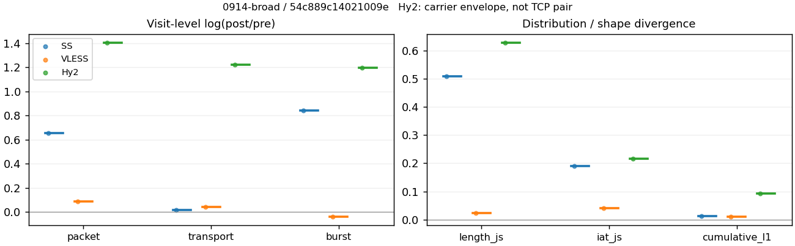
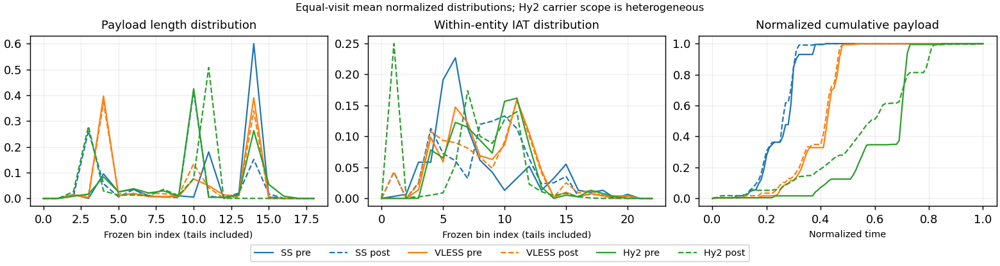

# 0914-broad · 条目 013 · arxiv.org

目标：https://arxiv.org/

活动标签：arxiv.org::page_load。选定访问 3 次。

[返回总索引](../../README.md) · [统计口径](../../methods.md)

## 覆盖与资格（每次访问均保留）

| 部署 | 重复 | 主请求路由 | 活动状态 | 代理比较 | DIRECT pre | 请求 proxy/direct/unresolved | 错误 |
| --- | --- | --- | --- | --- | --- | --- | --- |
| Hy2 | 1 | proxy | passed | 1 | 0 | 18/0/0 | [] |
| SS | 1 | proxy | passed | 1 | 0 | 18/0/0 | [] |
| VLESS | 1 | proxy | passed | 1 | 0 | 18/0/0 | [] |

主请求非 proxy 的统计仅解释为已索引的辅助代理连接或 DIRECT 观测，不代表目标业务经代理传输。播放确认与配对资格是两道不同的门。

图中散点为单次访问，短线为重复中位数；Hy2 是共享载体包络，不能与 TCP 配对作等范围因果对比。

形态图先逐访问归一化，再对访问等权平均；实线 pre，虚线 post。分箱序号及边界见 methods，不将分箱索引误解为长度或时间。

## 每次访问的关键观测

### SS

范围：`exclusive_page`。每格 pre → post；空值为不可观测/不适用。

| 重复 | 包数 | 载荷字节 | burst | TCP FR | IAT中位µs | length JS | IAT JS |
| --- | --- | --- | --- | --- | --- | --- | --- |
| 1 | 311 → 597 | 4.1807e+05 → 4.2472e+05 | 186 → 432 | 22 → 22 | 40.791 → 268.32 | 0.50937 | 0.1909 |

完整标量统计：中位数 [min,max]；Δ 为重复内逐访问变换的中位数，MAD 未缩放。n 为可用变换数；DIRECT-only 的 nΔ=0 不代表 pre 不可用。

| scope | 特征 | pre | post | Δ | IQRΔ | MADΔ | nΔ |
| --- | --- | --- | --- | --- | --- | --- | --- |
| exclusive_page | active_span_sum_s_1000ms | 2.8308 [2.8308, 2.8308] | 2.8283 [2.8283, 2.8283] | -0.00085581 | — | — | 1 |
| exclusive_page | active_span_sum_s_100ms | 1.1607 [1.1607, 1.1607] | 1.4042 [1.4042, 1.4042] | 0.19044 | — | — | 1 |
| exclusive_page | active_span_sum_s_500ms | 2.8308 [2.8308, 2.8308] | 2.8283 [2.8283, 2.8283] | -0.00085581 | — | — | 1 |
| exclusive_page | burst_bytes_iqr | 2896 [2896, 2896] | 1428 [1428, 1428] | -0.70706 | — | — | 1 |
| exclusive_page | burst_bytes_mad | 71 [71, 71] | 34 [34, 34] | -0.73632 | — | — | 1 |
| exclusive_page | burst_bytes_max | 20480 [20480, 20480] | 12852 [12852, 12852] | -0.46595 | — | — | 1 |
| exclusive_page | burst_bytes_mean | 2247.7 [2247.7, 2247.7] | 983.14 [983.14, 983.14] | -0.8269 | — | — | 1 |
| exclusive_page | burst_bytes_median | 71 [71, 71] | 34 [34, 34] | -0.73632 | — | — | 1 |
| exclusive_page | burst_bytes_min | 0 [0, 0] | 0 [0, 0] | — | — | — | 0 |
| exclusive_page | burst_bytes_p95 | 8844 [8844, 8844] | 2930 [2930, 2930] | -1.1047 | — | — | 1 |
| exclusive_page | burst_bytes_q25 | 0 [0, 0] | 0 [0, 0] | — | — | — | 0 |
| exclusive_page | burst_bytes_q75 | 2896 [2896, 2896] | 1428 [1428, 1428] | -0.70706 | — | — | 1 |
| exclusive_page | burst_bytes_std | 3574.1 [3574.1, 3574.1] | 1720 [1720, 1720] | -0.73138 | — | — | 1 |
| exclusive_page | burst_count | 186 [186, 186] | 432 [432, 432] | 0.84268 | — | — | 1 |
| exclusive_page | burst_duration_ms_iqr | 0.079143 [0.079143, 0.079143] | 0 [0, 0] | — | — | — | 0 |
| exclusive_page | burst_duration_ms_mad | 0 [0, 0] | 0 [0, 0] | — | — | — | 0 |
| exclusive_page | burst_duration_ms_max | 3438.5 [3438.5, 3438.5] | 3438.6 [3438.6, 3438.6] | 2.1324e-05 | — | — | 1 |
| exclusive_page | burst_duration_ms_mean | 42.031 [42.031, 42.031] | 17.074 [17.074, 17.074] | -0.90087 | — | — | 1 |
| exclusive_page | burst_duration_ms_median | 0 [0, 0] | 0 [0, 0] | — | — | — | 0 |
| exclusive_page | burst_duration_ms_min | 0 [0, 0] | 0 [0, 0] | — | — | — | 0 |
| exclusive_page | burst_duration_ms_p95 | 32.268 [32.268, 32.268] | 0.98879 [0.98879, 0.98879] | -3.4854 | — | — | 1 |
| exclusive_page | burst_duration_ms_q25 | 0 [0, 0] | 0 [0, 0] | — | — | — | 0 |
| exclusive_page | burst_duration_ms_q75 | 0.079143 [0.079143, 0.079143] | 0 [0, 0] | — | — | — | 0 |
| exclusive_page | burst_duration_ms_std | 320.62 [320.62, 320.62] | 210.56 [210.56, 210.56] | -0.42049 | — | — | 1 |
| exclusive_page | burst_packets_iqr | 1 [1, 1] | 0 [0, 0] | — | — | — | 0 |
| exclusive_page | burst_packets_mad | 0 [0, 0] | 0 [0, 0] | — | — | — | 0 |
| exclusive_page | burst_packets_max | 8 [8, 8] | 6 [6, 6] | -0.28768 | — | — | 1 |
| exclusive_page | burst_packets_mean | 1.672 [1.672, 1.672] | 1.3819 [1.3819, 1.3819] | -0.19055 | — | — | 1 |
| exclusive_page | burst_packets_median | 1 [1, 1] | 1 [1, 1] | 0 | — | — | 1 |
| exclusive_page | burst_packets_min | 1 [1, 1] | 1 [1, 1] | 0 | — | — | 1 |
| exclusive_page | burst_packets_p95 | 4 [4, 4] | 3 [3, 3] | -0.28768 | — | — | 1 |
| exclusive_page | burst_packets_q25 | 1 [1, 1] | 1 [1, 1] | 0 | — | — | 1 |
| exclusive_page | burst_packets_q75 | 2 [2, 2] | 1 [1, 1] | -0.69315 | — | — | 1 |
| exclusive_page | burst_packets_std | 1.1047 [1.1047, 1.1047] | 0.82773 [0.82773, 0.82773] | -0.28866 | — | — | 1 |
| exclusive_page | connection_span_concurrency_max | 2 [2, 2] | 2 [2, 2] | 0 | — | — | 1 |
| exclusive_page | cumulative_l1 | — | — | 0.011436 | — | — | 1 |
| exclusive_page | cumulative_max | — | — | 0.14489 | — | — | 1 |
| exclusive_page | direction_entropy | 0.55744 [0.55744, 0.55744] | 0.34901 [0.34901, 0.34901] | -0.20843 | — | — | 1 |
| exclusive_page | down_burst_count | 92 [92, 92] | 215 [215, 215] | 0.84885 | — | — | 1 |
| exclusive_page | down_ip_bytes | 4.2192e+05 [4.2192e+05, 4.2192e+05] | 4.3552e+05 [4.3552e+05, 4.3552e+05] | 0.031706 | — | — | 1 |
| exclusive_page | down_packets | 199 [199, 199] | 348 [348, 348] | 0.5589 | — | — | 1 |
| exclusive_page | down_transport_bytes | 4.1156e+05 [4.1156e+05, 4.1156e+05] | 4.174e+05 [4.174e+05, 4.174e+05] | 0.0141 | — | — | 1 |
| exclusive_page | duration_s | 4.7924 [4.7924, 4.7924] | 4.7912 [4.7912, 4.7912] | -0.0002499 | — | — | 1 |
| exclusive_page | entity_count | 2 [2, 2] | 2 [2, 2] | 0 | — | — | 1 |
| exclusive_page | fr_runs | 22 [22, 22] | 22 [22, 22] | 0 | — | — | 1 |
| exclusive_page | fr_runs_per_packet | 0.11 [0.11, 0.11] | 0.062678 [0.062678, 0.062678] | -0.047322 | — | — | 1 |
| exclusive_page | fr_switches | 20 [20, 20] | 20 [20, 20] | 0 | — | — | 1 |
| exclusive_page | fr_switches_per_possible_transition | 0.10101 [0.10101, 0.10101] | 0.057307 [0.057307, 0.057307] | -0.043704 | — | — | 1 |
| exclusive_page | full_retransmission_fraction | 0 [0, 0] | 0 [0, 0] | 0 | — | — | 1 |
| exclusive_page | full_retransmission_packets | 0 [0, 0] | 0 [0, 0] | — | — | — | 0 |
| exclusive_page | iat_count | 309 [309, 309] | 595 [595, 595] | 0.65522 | — | — | 1 |
| exclusive_page | iat_js | — | — | 0.1909 | — | — | 1 |
| exclusive_page | iat_ks | — | — | 0.31423 | — | — | 1 |
| exclusive_page | iat_median_us | 40.791 [40.791, 40.791] | 268.32 [268.32, 268.32] | 1.8837 | — | — | 1 |
| exclusive_page | iat_us_iqr | 337.9 [337.9, 337.9] | 1002.9 [1002.9, 1002.9] | 1.0879 | — | — | 1 |
| exclusive_page | iat_us_mad | 33.088 [33.088, 33.088] | 261.86 [261.86, 261.86] | 2.0686 | — | — | 1 |
| exclusive_page | iat_us_max | 3.4385e+06 [3.4385e+06, 3.4385e+06] | 3.4386e+06 [3.4386e+06, 3.4386e+06] | 2.1324e-05 | — | — | 1 |
| exclusive_page | iat_us_mean | 28982 [28982, 28982] | 15047 [15047, 15047] | -0.65546 | — | — | 1 |
| exclusive_page | iat_us_median | 40.791 [40.791, 40.791] | 268.32 [268.32, 268.32] | 1.8837 | — | — | 1 |
| exclusive_page | iat_us_min | 0.444 [0.444, 0.444] | 0.038 [0.038, 0.038] | -2.4582 | — | — | 1 |
| exclusive_page | iat_us_p95 | 41033 [41033, 41033] | 22915 [22915, 22915] | -0.58258 | — | — | 1 |
| exclusive_page | iat_us_q25 | 16.993 [16.993, 16.993] | 19.717 [19.717, 19.717] | 0.14868 | — | — | 1 |
| exclusive_page | iat_us_q75 | 354.89 [354.89, 354.89] | 1022.7 [1022.7, 1022.7] | 1.0583 | — | — | 1 |
| exclusive_page | iat_us_std | 2.4993e+05 [2.4993e+05, 2.4993e+05] | 1.7993e+05 [1.7993e+05, 1.7993e+05] | -0.32865 | — | — | 1 |
| exclusive_page | iat_wasserstein_log1p_us | — | — | 1.0542 | — | — | 1 |
| exclusive_page | idle_gap_count_1000ms | 2 [2, 2] | 2 [2, 2] | 0 | — | — | 1 |
| exclusive_page | idle_gap_count_100ms | 9 [9, 9] | 9 [9, 9] | 0 | — | — | 1 |
| exclusive_page | idle_gap_count_500ms | 2 [2, 2] | 2 [2, 2] | 0 | — | — | 1 |
| exclusive_page | idle_gap_sum_s_1000ms | 6.1246 [6.1246, 6.1246] | 6.1248 [6.1248, 6.1248] | 4.0503e-05 | — | — | 1 |
| exclusive_page | idle_gap_sum_s_100ms | 7.7947 [7.7947, 7.7947] | 7.549 [7.549, 7.549] | -0.032023 | — | — | 1 |
| exclusive_page | idle_gap_sum_s_500ms | 6.1246 [6.1246, 6.1246] | 6.1248 [6.1248, 6.1248] | 4.0503e-05 | — | — | 1 |
| exclusive_page | ip_bytes | 4.3427e+05 [4.3427e+05, 4.3427e+05] | 4.6052e+05 [4.6052e+05, 4.6052e+05] | 0.058685 | — | — | 1 |
| exclusive_page | length_iqr | 1448 [1448, 1448] | 1374 [1374, 1374] | -0.052457 | — | — | 1 |
| exclusive_page | length_js | — | — | 0.50937 | — | — | 1 |
| exclusive_page | length_ks | — | — | 0.60342 | — | — | 1 |
| exclusive_page | length_mad | 0 [0, 0] | 1113 [1113, 1113] | — | — | — | 0 |
| exclusive_page | length_max | 4096 [4096, 4096] | 7140 [7140, 7140] | 0.5557 | — | — | 1 |
| exclusive_page | length_mean | 2090.3 [2090.3, 2090.3] | 1210 [1210, 1210] | -0.54669 | — | — | 1 |
| exclusive_page | length_median | 2896 [2896, 2896] | 1428 [1428, 1428] | -0.70706 | — | — | 1 |
| exclusive_page | length_min | 16 [16, 16] | 20 [20, 20] | 0.22314 | — | — | 1 |
| exclusive_page | length_p95 | 2896 [2896, 2896] | 2856 [2856, 2856] | -0.013908 | — | — | 1 |
| exclusive_page | length_q25 | 1448 [1448, 1448] | 54 [54, 54] | -3.289 | — | — | 1 |
| exclusive_page | length_q75 | 2896 [2896, 2896] | 1428 [1428, 1428] | -0.70706 | — | — | 1 |
| exclusive_page | length_std | 1074.2 [1074.2, 1074.2] | 1128.2 [1128.2, 1128.2] | 0.049008 | — | — | 1 |
| exclusive_page | length_wasserstein_bytes | — | — | 963.98 | — | — | 1 |
| exclusive_page | nonempty_entity_count | 2 [2, 2] | 2 [2, 2] | 0 | — | — | 1 |
| exclusive_page | nonempty_packets | 200 [200, 200] | 351 [351, 351] | 0.56247 | — | — | 1 |
| exclusive_page | offload_suspect_fraction | 0.39871 [0.39871, 0.39871] | 0.11223 [0.11223, 0.11223] | -0.28649 | — | — | 1 |
| exclusive_page | packet_count | 311 [311, 311] | 597 [597, 597] | 0.65212 | — | — | 1 |
| exclusive_page | rtt_median_ms | 0.091028 [0.091028, 0.091028] | 33.075 [33.075, 33.075] | 5.8954 | — | — | 1 |
| exclusive_page | rtt_sample_count | 108 [108, 108] | 103 [103, 103] | -0.047402 | — | — | 1 |
| exclusive_page | tcp_ack_count | 309 [309, 309] | 595 [595, 595] | 0.65522 | — | — | 1 |
| exclusive_page | tcp_fin_count | 4 [4, 4] | 4 [4, 4] | 0 | — | — | 1 |
| exclusive_page | tcp_packet_count | 311 [311, 311] | 597 [597, 597] | 0.65212 | — | — | 1 |
| exclusive_page | tcp_rst_count | 0 [0, 0] | 0 [0, 0] | — | — | — | 0 |
| exclusive_page | tcp_syn_count | 4 [4, 4] | 4 [4, 4] | 0 | — | — | 1 |
| exclusive_page | tcp_window_raw_median | 65535 [65535, 65535] | 138 [138, 138] | -6.1631 | — | — | 1 |
| exclusive_page | transition_entropy | 0.38636 [0.38636, 0.38636] | 0.23605 [0.23605, 0.23605] | -0.15031 | — | — | 1 |
| exclusive_page | transition_n_mm | 163 [163, 163] | 317 [317, 317] | 0.66515 | — | — | 1 |
| exclusive_page | transition_n_mp | 9 [9, 9] | 9 [9, 9] | 0 | — | — | 1 |
| exclusive_page | transition_n_pm | 11 [11, 11] | 11 [11, 11] | 0 | — | — | 1 |
| exclusive_page | transition_n_pp | 15 [15, 15] | 12 [12, 12] | -0.22314 | — | — | 1 |
| exclusive_page | transition_p_mm | 0.94767 [0.94767, 0.94767] | 0.97239 [0.97239, 0.97239] | 0.024718 | — | — | 1 |
| exclusive_page | transition_p_mp | 0.052326 [0.052326, 0.052326] | 0.027607 [0.027607, 0.027607] | -0.024718 | — | — | 1 |
| exclusive_page | transition_p_pm | 0.42308 [0.42308, 0.42308] | 0.47826 [0.47826, 0.47826] | 0.055184 | — | — | 1 |
| exclusive_page | transition_p_pp | 0.57692 [0.57692, 0.57692] | 0.52174 [0.52174, 0.52174] | -0.055184 | — | — | 1 |
| exclusive_page | transport_bytes | 4.1807e+05 [4.1807e+05, 4.1807e+05] | 4.2472e+05 [4.2472e+05, 4.2472e+05] | 0.015777 | — | — | 1 |
| exclusive_page | up_burst_count | 94 [94, 94] | 217 [217, 217] | 0.8366 | — | — | 1 |
| exclusive_page | up_byte_fraction | 0.015567 [0.015567, 0.015567] | 0.017216 [0.017216, 0.017216] | 0.0016494 | — | — | 1 |
| exclusive_page | up_ip_bytes | 12348 [12348, 12348] | 25004 [25004, 25004] | 0.70554 | — | — | 1 |
| exclusive_page | up_packets | 112 [112, 112] | 249 [249, 249] | 0.79895 | — | — | 1 |
| exclusive_page | up_transport_bytes | 6508 [6508, 6508] | 7312 [7312, 7312] | 0.11648 | — | — | 1 |
| exclusive_page | zero_iat_count | 0 [0, 0] | 0 [0, 0] | — | — | — | 0 |
| exclusive_page | zero_iat_fraction | 0 [0, 0] | 0 [0, 0] | 0 | — | — | 1 |

### VLESS

范围：`exclusive_page`。每格 pre → post；空值为不可观测/不适用。

| 重复 | 包数 | 载荷字节 | burst | TCP FR | IAT中位µs | length JS | IAT JS |
| --- | --- | --- | --- | --- | --- | --- | --- |
| 1 | 512 → 559 | 4.1798e+05 → 4.3606e+05 | 380 → 366 | 20 → 24 | 178.74 → 180.6 | 0.023013 | 0.040987 |

完整标量统计：中位数 [min,max]；Δ 为重复内逐访问变换的中位数，MAD 未缩放。n 为可用变换数；DIRECT-only 的 nΔ=0 不代表 pre 不可用。

| scope | 特征 | pre | post | Δ | IQRΔ | MADΔ | nΔ |
| --- | --- | --- | --- | --- | --- | --- | --- |
| exclusive_page | active_span_sum_s_1000ms | 3.1504 [3.1504, 3.1504] | 3.0964 [3.0964, 3.0964] | -0.017288 | — | — | 1 |
| exclusive_page | active_span_sum_s_100ms | 0.79225 [0.79225, 0.79225] | 1.4698 [1.4698, 1.4698] | 0.61801 | — | — | 1 |
| exclusive_page | active_span_sum_s_500ms | 1.898 [1.898, 1.898] | 3.0964 [3.0964, 3.0964] | 0.48944 | — | — | 1 |
| exclusive_page | burst_bytes_iqr | 2896 [2896, 2896] | 2824 [2824, 2824] | -0.025176 | — | — | 1 |
| exclusive_page | burst_bytes_mad | 64 [64, 64] | 87 [87, 87] | 0.30703 | — | — | 1 |
| exclusive_page | burst_bytes_max | 5792 [5792, 5792] | 4832 [4832, 4832] | -0.18122 | — | — | 1 |
| exclusive_page | burst_bytes_mean | 1100 [1100, 1100] | 1191.4 [1191.4, 1191.4] | 0.079886 | — | — | 1 |
| exclusive_page | burst_bytes_median | 64 [64, 64] | 87 [87, 87] | 0.30703 | — | — | 1 |
| exclusive_page | burst_bytes_min | 0 [0, 0] | 0 [0, 0] | — | — | — | 0 |
| exclusive_page | burst_bytes_p95 | 2896 [2896, 2896] | 2896 [2896, 2896] | 0 | — | — | 1 |
| exclusive_page | burst_bytes_q25 | 0 [0, 0] | 0 [0, 0] | — | — | — | 0 |
| exclusive_page | burst_bytes_q75 | 2896 [2896, 2896] | 2824 [2824, 2824] | -0.025176 | — | — | 1 |
| exclusive_page | burst_bytes_std | 1454.2 [1454.2, 1454.2] | 1304.9 [1304.9, 1304.9] | -0.10831 | — | — | 1 |
| exclusive_page | burst_count | 380 [380, 380] | 366 [366, 366] | -0.037538 | — | — | 1 |
| exclusive_page | burst_duration_ms_iqr | 0.19023 [0.19023, 0.19023] | 1.4311 [1.4311, 1.4311] | 2.018 | — | — | 1 |
| exclusive_page | burst_duration_ms_mad | 0 [0, 0] | 0 [0, 0] | — | — | — | 0 |
| exclusive_page | burst_duration_ms_max | 1552.4 [1552.4, 1552.4] | 1432 [1432, 1432] | -0.080709 | — | — | 1 |
| exclusive_page | burst_duration_ms_mean | 14.602 [14.602, 14.602] | 9.4804 [9.4804, 9.4804] | -0.43195 | — | — | 1 |
| exclusive_page | burst_duration_ms_median | 0 [0, 0] | 0 [0, 0] | — | — | — | 0 |
| exclusive_page | burst_duration_ms_min | 0 [0, 0] | 0 [0, 0] | — | — | — | 0 |
| exclusive_page | burst_duration_ms_p95 | 7.5915 [7.5915, 7.5915] | 9.137 [9.137, 9.137] | 0.1853 | — | — | 1 |
| exclusive_page | burst_duration_ms_q25 | 0 [0, 0] | 0 [0, 0] | — | — | — | 0 |
| exclusive_page | burst_duration_ms_q75 | 0.19023 [0.19023, 0.19023] | 1.4311 [1.4311, 1.4311] | 2.018 | — | — | 1 |
| exclusive_page | burst_duration_ms_std | 118.91 [118.91, 118.91] | 80.444 [80.444, 80.444] | -0.39079 | — | — | 1 |
| exclusive_page | burst_packets_iqr | 1 [1, 1] | 1 [1, 1] | 0 | — | — | 1 |
| exclusive_page | burst_packets_mad | 0 [0, 0] | 0 [0, 0] | — | — | — | 0 |
| exclusive_page | burst_packets_max | 3 [3, 3] | 7 [7, 7] | 0.8473 | — | — | 1 |
| exclusive_page | burst_packets_mean | 1.3474 [1.3474, 1.3474] | 1.5273 [1.5273, 1.5273] | 0.12536 | — | — | 1 |
| exclusive_page | burst_packets_median | 1 [1, 1] | 1 [1, 1] | 0 | — | — | 1 |
| exclusive_page | burst_packets_min | 1 [1, 1] | 1 [1, 1] | 0 | — | — | 1 |
| exclusive_page | burst_packets_p95 | 2 [2, 2] | 3 [3, 3] | 0.40547 | — | — | 1 |
| exclusive_page | burst_packets_q25 | 1 [1, 1] | 1 [1, 1] | 0 | — | — | 1 |
| exclusive_page | burst_packets_q75 | 2 [2, 2] | 2 [2, 2] | 0 | — | — | 1 |
| exclusive_page | burst_packets_std | 0.51337 [0.51337, 0.51337] | 0.80508 [0.80508, 0.80508] | 0.44996 | — | — | 1 |
| exclusive_page | connection_span_concurrency_max | 2 [2, 2] | 2 [2, 2] | 0 | — | — | 1 |
| exclusive_page | cumulative_l1 | — | — | 0.011021 | — | — | 1 |
| exclusive_page | cumulative_max | — | — | 0.08707 | — | — | 1 |
| exclusive_page | direction_entropy | 0.4204 [0.4204, 0.4204] | 0.38215 [0.38215, 0.38215] | -0.038249 | — | — | 1 |
| exclusive_page | down_burst_count | 189 [189, 189] | 182 [182, 182] | -0.03774 | — | — | 1 |
| exclusive_page | down_ip_bytes | 4.276e+05 [4.276e+05, 4.276e+05] | 4.4348e+05 [4.4348e+05, 4.4348e+05] | 0.036483 | — | — | 1 |
| exclusive_page | down_packets | 309 [309, 309] | 338 [338, 338] | 0.089705 | — | — | 1 |
| exclusive_page | down_transport_bytes | 4.1151e+05 [4.1151e+05, 4.1151e+05] | 4.2589e+05 [4.2589e+05, 4.2589e+05] | 0.034348 | — | — | 1 |
| exclusive_page | duration_s | 3.5067 [3.5067, 3.5067] | 3.4709 [3.4709, 3.4709] | -0.010278 | — | — | 1 |
| exclusive_page | entity_count | 2 [2, 2] | 2 [2, 2] | 0 | — | — | 1 |
| exclusive_page | fr_runs | 20 [20, 20] | 24 [24, 24] | 0.18232 | — | — | 1 |
| exclusive_page | fr_runs_per_packet | 0.065574 [0.065574, 0.065574] | 0.071429 [0.071429, 0.071429] | 0.0058548 | — | — | 1 |
| exclusive_page | fr_switches | 18 [18, 18] | 22 [22, 22] | 0.20067 | — | — | 1 |
| exclusive_page | fr_switches_per_possible_transition | 0.059406 [0.059406, 0.059406] | 0.065868 [0.065868, 0.065868] | 0.0064623 | — | — | 1 |
| exclusive_page | full_retransmission_fraction | 0 [0, 0] | 0 [0, 0] | 0 | — | — | 1 |
| exclusive_page | full_retransmission_packets | 0 [0, 0] | 0 [0, 0] | — | — | — | 0 |
| exclusive_page | iat_count | 510 [510, 510] | 557 [557, 557] | 0.088155 | — | — | 1 |
| exclusive_page | iat_js | — | — | 0.040987 | — | — | 1 |
| exclusive_page | iat_ks | — | — | 0.098902 | — | — | 1 |
| exclusive_page | iat_median_us | 178.74 [178.74, 178.74] | 180.6 [180.6, 180.6] | 0.010361 | — | — | 1 |
| exclusive_page | iat_us_iqr | 1573.8 [1573.8, 1573.8] | 1685.6 [1685.6, 1685.6] | 0.068618 | — | — | 1 |
| exclusive_page | iat_us_mad | 172.14 [172.14, 172.14] | 180.32 [180.32, 180.32] | 0.046423 | — | — | 1 |
| exclusive_page | iat_us_max | 1.5524e+06 [1.5524e+06, 1.5524e+06] | 1.5518e+06 [1.5518e+06, 1.5518e+06] | -0.00033144 | — | — | 1 |
| exclusive_page | iat_us_mean | 12028 [12028, 12028] | 10916 [10916, 10916] | -0.09702 | — | — | 1 |
| exclusive_page | iat_us_median | 178.74 [178.74, 178.74] | 180.6 [180.6, 180.6] | 0.010361 | — | — | 1 |
| exclusive_page | iat_us_min | 2.718 [2.718, 2.718] | 0.037 [0.037, 0.037] | -4.2967 | — | — | 1 |
| exclusive_page | iat_us_p95 | 8377.3 [8377.3, 8377.3] | 34373 [34373, 34373] | 1.4118 | — | — | 1 |
| exclusive_page | iat_us_q25 | 32.16 [32.16, 32.16] | 17.073 [17.073, 17.073] | -0.63321 | — | — | 1 |
| exclusive_page | iat_us_q75 | 1606 [1606, 1606] | 1702.7 [1702.7, 1702.7] | 0.058468 | — | — | 1 |
| exclusive_page | iat_us_std | 1.0283e+05 [1.0283e+05, 1.0283e+05] | 92702 [92702, 92702] | -0.1037 | — | — | 1 |
| exclusive_page | iat_wasserstein_log1p_us | — | — | 0.32367 | — | — | 1 |
| exclusive_page | idle_gap_count_1000ms | 2 [2, 2] | 2 [2, 2] | 0 | — | — | 1 |
| exclusive_page | idle_gap_count_100ms | 10 [10, 10] | 11 [11, 11] | 0.09531 | — | — | 1 |
| exclusive_page | idle_gap_count_500ms | 4 [4, 4] | 2 [2, 2] | -0.69315 | — | — | 1 |
| exclusive_page | idle_gap_sum_s_1000ms | 2.984 [2.984, 2.984] | 2.9838 [2.9838, 2.9838] | -5.0605e-05 | — | — | 1 |
| exclusive_page | idle_gap_sum_s_100ms | 5.3421 [5.3421, 5.3421] | 4.6104 [4.6104, 4.6104] | -0.1473 | — | — | 1 |
| exclusive_page | idle_gap_sum_s_500ms | 4.2364 [4.2364, 4.2364] | 2.9838 [2.9838, 2.9838] | -0.3505 | — | — | 1 |
| exclusive_page | ip_bytes | 4.4459e+05 [4.4459e+05, 4.4459e+05] | 4.6536e+05 [4.6536e+05, 4.6536e+05] | 0.045648 | — | — | 1 |
| exclusive_page | length_iqr | 2752 [2752, 2752] | 2752 [2752, 2752] | 0 | — | — | 1 |
| exclusive_page | length_js | — | — | 0.023013 | — | — | 1 |
| exclusive_page | length_ks | — | — | 0.07539 | — | — | 1 |
| exclusive_page | length_mad | 1340 [1340, 1340] | 1340 [1340, 1340] | 0 | — | — | 1 |
| exclusive_page | length_max | 2968 [2968, 2968] | 2896 [2896, 2896] | -0.024558 | — | — | 1 |
| exclusive_page | length_mean | 1370.4 [1370.4, 1370.4] | 1297.8 [1297.8, 1297.8] | -0.054451 | — | — | 1 |
| exclusive_page | length_median | 1412 [1412, 1412] | 1412 [1412, 1412] | 0 | — | — | 1 |
| exclusive_page | length_min | 24 [24, 24] | 24 [24, 24] | 0 | — | — | 1 |
| exclusive_page | length_p95 | 2896 [2896, 2896] | 2824 [2824, 2824] | -0.025176 | — | — | 1 |
| exclusive_page | length_q25 | 72 [72, 72] | 72 [72, 72] | 0 | — | — | 1 |
| exclusive_page | length_q75 | 2824 [2824, 2824] | 2824 [2824, 2824] | 0 | — | — | 1 |
| exclusive_page | length_std | 1250.1 [1250.1, 1250.1] | 1198.7 [1198.7, 1198.7] | -0.041981 | — | — | 1 |
| exclusive_page | length_wasserstein_bytes | — | — | 88.497 | — | — | 1 |
| exclusive_page | nonempty_entity_count | 2 [2, 2] | 2 [2, 2] | 0 | — | — | 1 |
| exclusive_page | nonempty_packets | 305 [305, 305] | 336 [336, 336] | 0.096799 | — | — | 1 |
| exclusive_page | offload_suspect_fraction | 0.24609 [0.24609, 0.24609] | 0.20751 [0.20751, 0.20751] | -0.03858 | — | — | 1 |
| exclusive_page | packet_count | 512 [512, 512] | 559 [559, 559] | 0.087825 | — | — | 1 |
| exclusive_page | rtt_median_ms | 0.16326 [0.16326, 0.16326] | 1.4713 [1.4713, 1.4713] | 2.1985 | — | — | 1 |
| exclusive_page | rtt_sample_count | 201 [201, 201] | 213 [213, 213] | 0.057987 | — | — | 1 |
| exclusive_page | tcp_ack_count | 506 [506, 506] | 557 [557, 557] | 0.096029 | — | — | 1 |
| exclusive_page | tcp_fin_count | 4 [4, 4] | 4 [4, 4] | 0 | — | — | 1 |
| exclusive_page | tcp_packet_count | 512 [512, 512] | 559 [559, 559] | 0.087825 | — | — | 1 |
| exclusive_page | tcp_rst_count | 4 [4, 4] | 0 [0, 0] | — | — | — | 0 |
| exclusive_page | tcp_syn_count | 4 [4, 4] | 4 [4, 4] | 0 | — | — | 1 |
| exclusive_page | tcp_window_raw_median | 65535 [65535, 65535] | 175 [175, 175] | -5.9256 | — | — | 1 |
| exclusive_page | transition_entropy | 0.25503 [0.25503, 0.25503] | 0.26544 [0.26544, 0.26544] | 0.010407 | — | — | 1 |
| exclusive_page | transition_n_mm | 269 [269, 269] | 299 [299, 299] | 0.10573 | — | — | 1 |
| exclusive_page | transition_n_mp | 8 [8, 8] | 10 [10, 10] | 0.22314 | — | — | 1 |
| exclusive_page | transition_n_pm | 10 [10, 10] | 12 [12, 12] | 0.18232 | — | — | 1 |
| exclusive_page | transition_n_pp | 16 [16, 16] | 13 [13, 13] | -0.20764 | — | — | 1 |
| exclusive_page | transition_p_mm | 0.97112 [0.97112, 0.97112] | 0.96764 [0.96764, 0.96764] | -0.0034816 | — | — | 1 |
| exclusive_page | transition_p_mp | 0.028881 [0.028881, 0.028881] | 0.032362 [0.032362, 0.032362] | 0.0034816 | — | — | 1 |
| exclusive_page | transition_p_pm | 0.38462 [0.38462, 0.38462] | 0.48 [0.48, 0.48] | 0.095385 | — | — | 1 |
| exclusive_page | transition_p_pp | 0.61538 [0.61538, 0.61538] | 0.52 [0.52, 0.52] | -0.095385 | — | — | 1 |
| exclusive_page | transport_bytes | 4.1798e+05 [4.1798e+05, 4.1798e+05] | 4.3606e+05 [4.3606e+05, 4.3606e+05] | 0.042348 | — | — | 1 |
| exclusive_page | up_burst_count | 191 [191, 191] | 184 [184, 184] | -0.037338 | — | — | 1 |
| exclusive_page | up_byte_fraction | 0.015484 [0.015484, 0.015484] | 0.023329 [0.023329, 0.023329] | 0.0078453 | — | — | 1 |
| exclusive_page | up_ip_bytes | 16996 [16996, 16996] | 21873 [21873, 21873] | 0.25227 | — | — | 1 |
| exclusive_page | up_packets | 203 [203, 203] | 221 [221, 221] | 0.084957 | — | — | 1 |
| exclusive_page | up_transport_bytes | 6472 [6472, 6472] | 10173 [10173, 10173] | 0.45225 | — | — | 1 |
| exclusive_page | zero_iat_count | 0 [0, 0] | 0 [0, 0] | — | — | — | 0 |
| exclusive_page | zero_iat_fraction | 0 [0, 0] | 0 [0, 0] | 0 | — | — | 1 |

### Hy2

范围：`carrier_context_envelope`。每格 pre → post；空值为不可观测/不适用。

| 重复 | 包数 | 载荷字节 | burst | TCP FR | IAT中位µs | length JS | IAT JS |
| --- | --- | --- | --- | --- | --- | --- | --- |
| 1 | 386 → 1569 | 4.2239e+05 → 1.4294e+06 | 254 → 839 | — | 274.27 → 101.53 | 0.62774 | 0.21548 |

完整标量统计：中位数 [min,max]；Δ 为重复内逐访问变换的中位数，MAD 未缩放。n 为可用变换数；DIRECT-only 的 nΔ=0 不代表 pre 不可用。

| scope | 特征 | pre | post | Δ | IQRΔ | MADΔ | nΔ |
| --- | --- | --- | --- | --- | --- | --- | --- |
| carrier_context_envelope | active_span_sum_s_1000ms | 2.5725 [2.5725, 2.5725] | 1.6035 [1.6035, 1.6035] | -0.47272 | — | — | 1 |
| carrier_context_envelope | active_span_sum_s_100ms | 0.44131 [0.44131, 0.44131] | 1.4979 [1.4979, 1.4979] | 1.2221 | — | — | 1 |
| carrier_context_envelope | active_span_sum_s_500ms | 2.0187 [2.0187, 2.0187] | 1.6035 [1.6035, 1.6035] | -0.23031 | — | — | 1 |
| carrier_context_envelope | burst_bytes_iqr | 2830 [2830, 2830] | 2848 [2848, 2848] | 0.0063403 | — | — | 1 |
| carrier_context_envelope | burst_bytes_mad | 67.5 [67.5, 67.5] | 537 [537, 537] | 2.0739 | — | — | 1 |
| carrier_context_envelope | burst_bytes_max | 11762 [11762, 11762] | 22969 [22969, 22969] | 0.66927 | — | — | 1 |
| carrier_context_envelope | burst_bytes_mean | 1663 [1663, 1663] | 1703.7 [1703.7, 1703.7] | 0.024182 | — | — | 1 |
| carrier_context_envelope | burst_bytes_median | 67.5 [67.5, 67.5] | 570 [570, 570] | 2.1335 | — | — | 1 |
| carrier_context_envelope | burst_bytes_min | 0 [0, 0] | 25 [25, 25] | — | — | — | 0 |
| carrier_context_envelope | burst_bytes_p95 | 6687.6 [6687.6, 6687.6] | 4323 [4323, 4323] | -0.43631 | — | — | 1 |
| carrier_context_envelope | burst_bytes_q25 | 0 [0, 0] | 34 [34, 34] | — | — | — | 0 |
| carrier_context_envelope | burst_bytes_q75 | 2830 [2830, 2830] | 2882 [2882, 2882] | 0.018208 | — | — | 1 |
| carrier_context_envelope | burst_bytes_std | 2379.1 [2379.1, 2379.1] | 2175.4 [2175.4, 2175.4] | -0.089526 | — | — | 1 |
| carrier_context_envelope | burst_count | 254 [254, 254] | 839 [839, 839] | 1.1949 | — | — | 1 |
| carrier_context_envelope | burst_duration_ms_iqr | 0.85772 [0.85772, 0.85772] | 0.24853 [0.24853, 0.24853] | -1.2387 | — | — | 1 |
| carrier_context_envelope | burst_duration_ms_mad | 0 [0, 0] | 5.1e-05 [5.1e-05, 5.1e-05] | — | — | — | 0 |
| carrier_context_envelope | burst_duration_ms_max | 553.79 [553.79, 553.79] | 106.29 [106.29, 106.29] | -1.6506 | — | — | 1 |
| carrier_context_envelope | burst_duration_ms_mean | 7.8909 [7.8909, 7.8909] | 0.85144 [0.85144, 0.85144] | -2.2265 | — | — | 1 |
| carrier_context_envelope | burst_duration_ms_median | 0 [0, 0] | 5.1e-05 [5.1e-05, 5.1e-05] | — | — | — | 0 |
| carrier_context_envelope | burst_duration_ms_min | 0 [0, 0] | 0 [0, 0] | — | — | — | 0 |
| carrier_context_envelope | burst_duration_ms_p95 | 3.6661 [3.6661, 3.6661] | 1.6694 [1.6694, 1.6694] | -0.78669 | — | — | 1 |
| carrier_context_envelope | burst_duration_ms_q25 | 0 [0, 0] | 0 [0, 0] | — | — | — | 0 |
| carrier_context_envelope | burst_duration_ms_q75 | 0.85772 [0.85772, 0.85772] | 0.24853 [0.24853, 0.24853] | -1.2387 | — | — | 1 |
| carrier_context_envelope | burst_duration_ms_std | 48.928 [48.928, 48.928] | 5.9948 [5.9948, 5.9948] | -2.0995 | — | — | 1 |
| carrier_context_envelope | burst_packets_iqr | 1 [1, 1] | 1 [1, 1] | 0 | — | — | 1 |
| carrier_context_envelope | burst_packets_mad | 0 [0, 0] | 1 [1, 1] | — | — | — | 0 |
| carrier_context_envelope | burst_packets_max | 5 [5, 5] | 19 [19, 19] | 1.335 | — | — | 1 |
| carrier_context_envelope | burst_packets_mean | 1.5197 [1.5197, 1.5197] | 1.8701 [1.8701, 1.8701] | 0.20748 | — | — | 1 |
| carrier_context_envelope | burst_packets_median | 1 [1, 1] | 2 [2, 2] | 0.69315 | — | — | 1 |
| carrier_context_envelope | burst_packets_min | 1 [1, 1] | 1 [1, 1] | 0 | — | — | 1 |
| carrier_context_envelope | burst_packets_p95 | 2 [2, 2] | 4 [4, 4] | 0.69315 | — | — | 1 |
| carrier_context_envelope | burst_packets_q25 | 1 [1, 1] | 1 [1, 1] | 0 | — | — | 1 |
| carrier_context_envelope | burst_packets_q75 | 2 [2, 2] | 2 [2, 2] | 0 | — | — | 1 |
| carrier_context_envelope | burst_packets_std | 0.62558 [0.62558, 0.62558] | 1.4544 [1.4544, 1.4544] | 0.84371 | — | — | 1 |
| carrier_context_envelope | connection_span_concurrency_max | 2 [2, 2] | 1 [1, 1] | -0.69315 | — | — | 1 |
| carrier_context_envelope | cumulative_l1 | — | — | 0.093357 | — | — | 1 |
| carrier_context_envelope | cumulative_max | — | — | 0.26755 | — | — | 1 |
| carrier_context_envelope | direction_entropy | 0.5197 [0.5197, 0.5197] | 0.90911 [0.90911, 0.90911] | 0.38941 | — | — | 1 |
| carrier_context_envelope | direction_run_analog_runs | 20 [20, 20] | 839 [839, 839] | 3.7365 | — | — | 1 |
| carrier_context_envelope | direction_run_analog_runs_per_packet | 0.083333 [0.083333, 0.083333] | 0.53474 [0.53474, 0.53474] | 0.4514 | — | — | 1 |
| carrier_context_envelope | direction_run_analog_switches | 18 [18, 18] | 838 [838, 838] | 3.8406 | — | — | 1 |
| carrier_context_envelope | direction_run_analog_switches_per_possible_transition | 0.07563 [0.07563, 0.07563] | 0.53444 [0.53444, 0.53444] | 0.45881 | — | — | 1 |
| carrier_context_envelope | down_burst_count | 126 [126, 126] | 419 [419, 419] | 1.2016 | — | — | 1 |
| carrier_context_envelope | down_ip_bytes | 4.2835e+05 [4.2835e+05, 4.2835e+05] | 1.4093e+06 [1.4093e+06, 1.4093e+06] | 1.1909 | — | — | 1 |
| carrier_context_envelope | down_packets | 242 [242, 242] | 1060 [1060, 1060] | 1.4771 | — | — | 1 |
| carrier_context_envelope | down_transport_bytes | 4.1575e+05 [4.1575e+05, 4.1575e+05] | 1.3796e+06 [1.3796e+06, 1.3796e+06] | 1.1995 | — | — | 1 |
| carrier_context_envelope | duration_s | 1.6039 [1.6039, 1.6039] | 1.6035 [1.6035, 1.6035] | -0.00027755 | — | — | 1 |
| carrier_context_envelope | entity_count | 2 [2, 2] | 1 [1, 1] | -0.69315 | — | — | 1 |
| carrier_context_envelope | full_retransmission_fraction | 0.0051813 [0.0051813, 0.0051813] | — | — | — | — | 0 |
| carrier_context_envelope | full_retransmission_packets | 2 [2, 2] | — | — | — | — | 0 |
| carrier_context_envelope | iat_count | 384 [384, 384] | 1568 [1568, 1568] | 1.4069 | — | — | 1 |
| carrier_context_envelope | iat_js | — | — | 0.21548 | — | — | 1 |
| carrier_context_envelope | iat_ks | — | — | 0.25383 | — | — | 1 |
| carrier_context_envelope | iat_median_us | 274.27 [274.27, 274.27] | 101.53 [101.53, 101.53] | -0.9938 | — | — | 1 |
| carrier_context_envelope | iat_us_iqr | 1115.7 [1115.7, 1115.7] | 803.38 [803.38, 803.38] | -0.3284 | — | — | 1 |
| carrier_context_envelope | iat_us_mad | 265.38 [265.38, 265.38] | 101.46 [101.46, 101.46] | -0.96156 | — | — | 1 |
| carrier_context_envelope | iat_us_max | 5.5379e+05 [5.5379e+05, 5.5379e+05] | 1.0552e+05 [1.0552e+05, 1.0552e+05] | -1.6579 | — | — | 1 |
| carrier_context_envelope | iat_us_mean | 6699.3 [6699.3, 6699.3] | 1022.6 [1022.6, 1022.6] | -1.8796 | — | — | 1 |
| carrier_context_envelope | iat_us_median | 274.27 [274.27, 274.27] | 101.53 [101.53, 101.53] | -0.9938 | — | — | 1 |
| carrier_context_envelope | iat_us_min | 5.27 [5.27, 5.27] | 0.033 [0.033, 0.033] | -5.0733 | — | — | 1 |
| carrier_context_envelope | iat_us_p95 | 4432 [4432, 4432] | 1934 [1934, 1934] | -0.82925 | — | — | 1 |
| carrier_context_envelope | iat_us_q25 | 46.854 [46.854, 46.854] | 1.2245 [1.2245, 1.2245] | -3.6445 | — | — | 1 |
| carrier_context_envelope | iat_us_q75 | 1162.5 [1162.5, 1162.5] | 804.61 [804.61, 804.61] | -0.36801 | — | — | 1 |
| carrier_context_envelope | iat_us_std | 41114 [41114, 41114] | 5217.4 [5217.4, 5217.4] | -2.0643 | — | — | 1 |
| carrier_context_envelope | iat_wasserstein_log1p_us | — | — | 1.2639 | — | — | 1 |
| carrier_context_envelope | idle_gap_count_1000ms | 0 [0, 0] | 0 [0, 0] | — | — | — | 0 |
| carrier_context_envelope | idle_gap_count_100ms | 9 [9, 9] | 1 [1, 1] | -2.1972 | — | — | 1 |
| carrier_context_envelope | idle_gap_count_500ms | 1 [1, 1] | 0 [0, 0] | — | — | — | 0 |
| carrier_context_envelope | idle_gap_sum_s_1000ms | 0 [0, 0] | 0 [0, 0] | — | — | — | 0 |
| carrier_context_envelope | idle_gap_sum_s_100ms | 2.1312 [2.1312, 2.1312] | 0.10552 [0.10552, 0.10552] | -3.0056 | — | — | 1 |
| carrier_context_envelope | idle_gap_sum_s_500ms | 0.55379 [0.55379, 0.55379] | 0 [0, 0] | — | — | — | 0 |
| carrier_context_envelope | ip_bytes | 4.4252e+05 [4.4252e+05, 4.4252e+05] | 1.4733e+06 [1.4733e+06, 1.4733e+06] | 1.2028 | — | — | 1 |
| carrier_context_envelope | length_iqr | 1421.5 [1421.5, 1421.5] | 1403 [1403, 1403] | -0.0131 | — | — | 1 |
| carrier_context_envelope | length_js | — | — | 0.62774 | — | — | 1 |
| carrier_context_envelope | length_ks | — | — | 0.34583 | — | — | 1 |
| carrier_context_envelope | length_mad | 801.5 [801.5, 801.5] | 0 [0, 0] | — | — | — | 0 |
| carrier_context_envelope | length_max | 8920 [8920, 8920] | 1441 [1441, 1441] | -1.823 | — | — | 1 |
| carrier_context_envelope | length_mean | 1760 [1760, 1760] | 911.01 [911.01, 911.01] | -0.6585 | — | — | 1 |
| carrier_context_envelope | length_median | 1415 [1415, 1415] | 1441 [1441, 1441] | 0.018208 | — | — | 1 |
| carrier_context_envelope | length_min | 31 [31, 31] | 22 [22, 22] | -0.34294 | — | — | 1 |
| carrier_context_envelope | length_p95 | 4245 [4245, 4245] | 1441 [1441, 1441] | -1.0804 | — | — | 1 |
| carrier_context_envelope | length_q25 | 1408.5 [1408.5, 1408.5] | 38 [38, 38] | -3.6127 | — | — | 1 |
| carrier_context_envelope | length_q75 | 2830 [2830, 2830] | 1441 [1441, 1441] | -0.67494 | — | — | 1 |
| carrier_context_envelope | length_std | 1334.6 [1334.6, 1334.6] | 654.47 [654.47, 654.47] | -0.71254 | — | — | 1 |
| carrier_context_envelope | length_wasserstein_bytes | — | — | 859.42 | — | — | 1 |
| carrier_context_envelope | nonempty_entity_count | 2 [2, 2] | 1 [1, 1] | -0.69315 | — | — | 1 |
| carrier_context_envelope | nonempty_packets | 240 [240, 240] | 1569 [1569, 1569] | 1.8776 | — | — | 1 |
| carrier_context_envelope | offload_suspect_fraction | 0.21244 [0.21244, 0.21244] | 0 [0, 0] | -0.21244 | — | — | 1 |
| carrier_context_envelope | packet_count | 386 [386, 386] | 1569 [1569, 1569] | 1.4024 | — | — | 1 |
| carrier_context_envelope | rtt_median_ms | 0.67599 [0.67599, 0.67599] | — | — | — | — | 0 |
| carrier_context_envelope | rtt_sample_count | 141 [141, 141] | 0 [0, 0] | — | — | — | 0 |
| carrier_context_envelope | tcp_ack_count | 384 [384, 384] | — | — | — | — | 0 |
| carrier_context_envelope | tcp_fin_count | 4 [4, 4] | — | — | — | — | 0 |
| carrier_context_envelope | tcp_packet_count | 386 [386, 386] | 0 [0, 0] | — | — | — | 0 |
| carrier_context_envelope | tcp_rst_count | 0 [0, 0] | — | — | — | — | 0 |
| carrier_context_envelope | tcp_syn_count | 4 [4, 4] | — | — | — | — | 0 |
| carrier_context_envelope | tcp_window_raw_median | 65535 [65535, 65535] | — | — | — | — | 0 |
| carrier_context_envelope | transition_entropy | 0.31664 [0.31664, 0.31664] | 0.87136 [0.87136, 0.87136] | 0.55472 | — | — | 1 |
| carrier_context_envelope | transition_n_mm | 202 [202, 202] | 641 [641, 641] | 1.1548 | — | — | 1 |
| carrier_context_envelope | transition_n_mp | 8 [8, 8] | 419 [419, 419] | 3.9584 | — | — | 1 |
| carrier_context_envelope | transition_n_pm | 10 [10, 10] | 419 [419, 419] | 3.7353 | — | — | 1 |
| carrier_context_envelope | transition_n_pp | 18 [18, 18] | 89 [89, 89] | 1.5983 | — | — | 1 |
| carrier_context_envelope | transition_p_mm | 0.9619 [0.9619, 0.9619] | 0.60472 [0.60472, 0.60472] | -0.35719 | — | — | 1 |
| carrier_context_envelope | transition_p_mp | 0.038095 [0.038095, 0.038095] | 0.39528 [0.39528, 0.39528] | 0.35719 | — | — | 1 |
| carrier_context_envelope | transition_p_pm | 0.35714 [0.35714, 0.35714] | 0.8248 [0.8248, 0.8248] | 0.46766 | — | — | 1 |
| carrier_context_envelope | transition_p_pp | 0.64286 [0.64286, 0.64286] | 0.1752 [0.1752, 0.1752] | -0.46766 | — | — | 1 |
| carrier_context_envelope | transport_bytes | 4.2239e+05 [4.2239e+05, 4.2239e+05] | 1.4294e+06 [1.4294e+06, 1.4294e+06] | 1.2191 | — | — | 1 |
| carrier_context_envelope | up_burst_count | 128 [128, 128] | 420 [420, 420] | 1.1882 | — | — | 1 |
| carrier_context_envelope | up_byte_fraction | 0.01573 [0.01573, 0.01573] | 0.034836 [0.034836, 0.034836] | 0.019107 | — | — | 1 |
| carrier_context_envelope | up_ip_bytes | 14172 [14172, 14172] | 64046 [64046, 64046] | 1.5083 | — | — | 1 |
| carrier_context_envelope | up_packets | 144 [144, 144] | 509 [509, 509] | 1.2626 | — | — | 1 |
| carrier_context_envelope | up_transport_bytes | 6644 [6644, 6644] | 49794 [49794, 49794] | 2.0142 | — | — | 1 |
| carrier_context_envelope | zero_iat_count | 0 [0, 0] | 0 [0, 0] | — | — | — | 0 |
| carrier_context_envelope | zero_iat_fraction | 0 [0, 0] | 0 [0, 0] | 0 | — | — | 1 |

## 不同部署对比

以下是各部署自身重复中位数的差异，不按重复编号强行配对。跨 TCP/Hy2 的行标记异质观测范围。

| 视角 | 特征 | 部署A | 部署B | A中位 | B中位 | B−A | 比较口径 |
| --- | --- | --- | --- | --- | --- | --- | --- |
| pre | burst_count | SS | VLESS | 186 | 380 | 194 | same_scope_unpaired_visits |
| pre | burst_count | SS | Hy2 | 186 | 254 | 68 | heterogeneous_scope_descriptive_only |
| pre | burst_count | VLESS | Hy2 | 380 | 254 | -126 | heterogeneous_scope_descriptive_only |
| pre | connection_span_concurrency_max | SS | VLESS | 2 | 2 | 0 | same_scope_unpaired_visits |
| pre | connection_span_concurrency_max | SS | Hy2 | 2 | 2 | 0 | heterogeneous_scope_descriptive_only |
| pre | connection_span_concurrency_max | VLESS | Hy2 | 2 | 2 | 0 | heterogeneous_scope_descriptive_only |
| pre | direction_entropy | SS | VLESS | 0.55744 | 0.4204 | -0.13704 | same_scope_unpaired_visits |
| pre | direction_entropy | SS | Hy2 | 0.55744 | 0.5197 | -0.037735 | heterogeneous_scope_descriptive_only |
| pre | direction_entropy | VLESS | Hy2 | 0.4204 | 0.5197 | 0.099304 | heterogeneous_scope_descriptive_only |
| pre | down_transport_bytes | SS | VLESS | 4.1156e+05 | 4.1151e+05 | -48 | same_scope_unpaired_visits |
| pre | down_transport_bytes | SS | Hy2 | 4.1156e+05 | 4.1575e+05 | 4187 | heterogeneous_scope_descriptive_only |
| pre | down_transport_bytes | VLESS | Hy2 | 4.1151e+05 | 4.1575e+05 | 4235 | heterogeneous_scope_descriptive_only |
| pre | duration_s | SS | VLESS | 4.7924 | 3.5067 | -1.2857 | same_scope_unpaired_visits |
| pre | duration_s | SS | Hy2 | 4.7924 | 1.6039 | -3.1885 | heterogeneous_scope_descriptive_only |
| pre | duration_s | VLESS | Hy2 | 3.5067 | 1.6039 | -1.9028 | heterogeneous_scope_descriptive_only |
| pre | entity_count | SS | VLESS | 2 | 2 | 0 | same_scope_unpaired_visits |
| pre | entity_count | SS | Hy2 | 2 | 2 | 0 | heterogeneous_scope_descriptive_only |
| pre | entity_count | VLESS | Hy2 | 2 | 2 | 0 | heterogeneous_scope_descriptive_only |
| pre | fr_runs | SS | VLESS | 22 | 20 | -2 | same_scope_unpaired_visits |
| pre | fr_runs_per_packet | SS | VLESS | 0.11 | 0.065574 | -0.044426 | same_scope_unpaired_visits |
| pre | fr_switches | SS | VLESS | 20 | 18 | -2 | same_scope_unpaired_visits |
| pre | fr_switches_per_possible_transition | SS | VLESS | 0.10101 | 0.059406 | -0.041604 | same_scope_unpaired_visits |
| pre | full_retransmission_fraction | SS | VLESS | 0 | 0 | 0 | same_scope_unpaired_visits |
| pre | full_retransmission_fraction | SS | Hy2 | 0 | 0.0051813 | 0.0051813 | heterogeneous_scope_descriptive_only |
| pre | full_retransmission_fraction | VLESS | Hy2 | 0 | 0.0051813 | 0.0051813 | heterogeneous_scope_descriptive_only |
| pre | iat_median_us | SS | VLESS | 40.791 | 178.74 | 137.94 | same_scope_unpaired_visits |
| pre | iat_median_us | SS | Hy2 | 40.791 | 274.27 | 233.48 | heterogeneous_scope_descriptive_only |
| pre | iat_median_us | VLESS | Hy2 | 178.74 | 274.27 | 95.539 | heterogeneous_scope_descriptive_only |
| pre | iat_us_p95 | SS | VLESS | 41033 | 8377.3 | -32656 | same_scope_unpaired_visits |
| pre | iat_us_p95 | SS | Hy2 | 41033 | 4432 | -36601 | heterogeneous_scope_descriptive_only |
| pre | iat_us_p95 | VLESS | Hy2 | 8377.3 | 4432 | -3945.2 | heterogeneous_scope_descriptive_only |
| pre | ip_bytes | SS | VLESS | 4.3427e+05 | 4.4459e+05 | 10320 | same_scope_unpaired_visits |
| pre | ip_bytes | SS | Hy2 | 4.3427e+05 | 4.4252e+05 | 8247 | heterogeneous_scope_descriptive_only |
| pre | ip_bytes | VLESS | Hy2 | 4.4459e+05 | 4.4252e+05 | -2073 | heterogeneous_scope_descriptive_only |
| pre | length_median | SS | VLESS | 2896 | 1412 | -1484 | same_scope_unpaired_visits |
| pre | length_median | SS | Hy2 | 2896 | 1415 | -1481 | heterogeneous_scope_descriptive_only |
| pre | length_median | VLESS | Hy2 | 1412 | 1415 | 3 | heterogeneous_scope_descriptive_only |
| pre | length_p95 | SS | VLESS | 2896 | 2896 | 0 | same_scope_unpaired_visits |
| pre | length_p95 | SS | Hy2 | 2896 | 4245 | 1349 | heterogeneous_scope_descriptive_only |
| pre | length_p95 | VLESS | Hy2 | 2896 | 4245 | 1349 | heterogeneous_scope_descriptive_only |
| pre | nonempty_packets | SS | VLESS | 200 | 305 | 105 | same_scope_unpaired_visits |
| pre | nonempty_packets | SS | Hy2 | 200 | 240 | 40 | heterogeneous_scope_descriptive_only |
| pre | nonempty_packets | VLESS | Hy2 | 305 | 240 | -65 | heterogeneous_scope_descriptive_only |
| pre | offload_suspect_fraction | SS | VLESS | 0.39871 | 0.24609 | -0.15262 | same_scope_unpaired_visits |
| pre | offload_suspect_fraction | SS | Hy2 | 0.39871 | 0.21244 | -0.18628 | heterogeneous_scope_descriptive_only |
| pre | offload_suspect_fraction | VLESS | Hy2 | 0.24609 | 0.21244 | -0.033659 | heterogeneous_scope_descriptive_only |
| pre | packet_count | SS | VLESS | 311 | 512 | 201 | same_scope_unpaired_visits |
| pre | packet_count | SS | Hy2 | 311 | 386 | 75 | heterogeneous_scope_descriptive_only |
| pre | packet_count | VLESS | Hy2 | 512 | 386 | -126 | heterogeneous_scope_descriptive_only |
| pre | rtt_median_ms | SS | VLESS | 0.091028 | 0.16326 | 0.072236 | same_scope_unpaired_visits |
| pre | rtt_median_ms | SS | Hy2 | 0.091028 | 0.67599 | 0.58496 | heterogeneous_scope_descriptive_only |
| pre | rtt_median_ms | VLESS | Hy2 | 0.16326 | 0.67599 | 0.51272 | heterogeneous_scope_descriptive_only |
| pre | transition_entropy | SS | VLESS | 0.38636 | 0.25503 | -0.13133 | same_scope_unpaired_visits |
| pre | transition_entropy | SS | Hy2 | 0.38636 | 0.31664 | -0.069721 | heterogeneous_scope_descriptive_only |
| pre | transition_entropy | VLESS | Hy2 | 0.25503 | 0.31664 | 0.061608 | heterogeneous_scope_descriptive_only |
| pre | transport_bytes | SS | VLESS | 4.1807e+05 | 4.1798e+05 | -84 | same_scope_unpaired_visits |
| pre | transport_bytes | SS | Hy2 | 4.1807e+05 | 4.2239e+05 | 4323 | heterogeneous_scope_descriptive_only |
| pre | transport_bytes | VLESS | Hy2 | 4.1798e+05 | 4.2239e+05 | 4407 | heterogeneous_scope_descriptive_only |
| pre | up_byte_fraction | SS | VLESS | 0.015567 | 0.015484 | -8.3e-05 | same_scope_unpaired_visits |
| pre | up_byte_fraction | SS | Hy2 | 0.015567 | 0.01573 | 0.00016266 | heterogeneous_scope_descriptive_only |
| pre | up_byte_fraction | VLESS | Hy2 | 0.015484 | 0.01573 | 0.00024566 | heterogeneous_scope_descriptive_only |
| pre | up_transport_bytes | SS | VLESS | 6508 | 6472 | -36 | same_scope_unpaired_visits |
| pre | up_transport_bytes | SS | Hy2 | 6508 | 6644 | 136 | heterogeneous_scope_descriptive_only |
| pre | up_transport_bytes | VLESS | Hy2 | 6472 | 6644 | 172 | heterogeneous_scope_descriptive_only |
| post | burst_count | SS | VLESS | 432 | 366 | -66 | same_scope_unpaired_visits |
| post | burst_count | SS | Hy2 | 432 | 839 | 407 | heterogeneous_scope_descriptive_only |
| post | burst_count | VLESS | Hy2 | 366 | 839 | 473 | heterogeneous_scope_descriptive_only |
| post | connection_span_concurrency_max | SS | VLESS | 2 | 2 | 0 | same_scope_unpaired_visits |
| post | connection_span_concurrency_max | SS | Hy2 | 2 | 1 | -1 | heterogeneous_scope_descriptive_only |
| post | connection_span_concurrency_max | VLESS | Hy2 | 2 | 1 | -1 | heterogeneous_scope_descriptive_only |
| post | direction_entropy | SS | VLESS | 0.34901 | 0.38215 | 0.033145 | same_scope_unpaired_visits |
| post | direction_entropy | SS | Hy2 | 0.34901 | 0.90911 | 0.56011 | heterogeneous_scope_descriptive_only |
| post | direction_entropy | VLESS | Hy2 | 0.38215 | 0.90911 | 0.52696 | heterogeneous_scope_descriptive_only |
| post | down_transport_bytes | SS | VLESS | 4.174e+05 | 4.2589e+05 | 8488 | same_scope_unpaired_visits |
| post | down_transport_bytes | SS | Hy2 | 4.174e+05 | 1.3796e+06 | 9.6217e+05 | heterogeneous_scope_descriptive_only |
| post | down_transport_bytes | VLESS | Hy2 | 4.2589e+05 | 1.3796e+06 | 9.5368e+05 | heterogeneous_scope_descriptive_only |
| post | duration_s | SS | VLESS | 4.7912 | 3.4709 | -1.3203 | same_scope_unpaired_visits |
| post | duration_s | SS | Hy2 | 4.7912 | 1.6035 | -3.1877 | heterogeneous_scope_descriptive_only |
| post | duration_s | VLESS | Hy2 | 3.4709 | 1.6035 | -1.8674 | heterogeneous_scope_descriptive_only |
| post | entity_count | SS | VLESS | 2 | 2 | 0 | same_scope_unpaired_visits |
| post | entity_count | SS | Hy2 | 2 | 1 | -1 | heterogeneous_scope_descriptive_only |
| post | entity_count | VLESS | Hy2 | 2 | 1 | -1 | heterogeneous_scope_descriptive_only |
| post | fr_runs | SS | VLESS | 22 | 24 | 2 | same_scope_unpaired_visits |
| post | fr_runs_per_packet | SS | VLESS | 0.062678 | 0.071429 | 0.0087505 | same_scope_unpaired_visits |
| post | fr_switches | SS | VLESS | 20 | 22 | 2 | same_scope_unpaired_visits |
| post | fr_switches_per_possible_transition | SS | VLESS | 0.057307 | 0.065868 | 0.0085617 | same_scope_unpaired_visits |
| post | full_retransmission_fraction | SS | VLESS | 0 | 0 | 0 | same_scope_unpaired_visits |
| post | iat_median_us | SS | VLESS | 268.32 | 180.6 | -87.727 | same_scope_unpaired_visits |
| post | iat_median_us | SS | Hy2 | 268.32 | 101.53 | -166.8 | heterogeneous_scope_descriptive_only |
| post | iat_median_us | VLESS | Hy2 | 180.6 | 101.53 | -79.07 | heterogeneous_scope_descriptive_only |
| post | iat_us_p95 | SS | VLESS | 22915 | 34373 | 11458 | same_scope_unpaired_visits |
| post | iat_us_p95 | SS | Hy2 | 22915 | 1934 | -20981 | heterogeneous_scope_descriptive_only |
| post | iat_us_p95 | VLESS | Hy2 | 34373 | 1934 | -32439 | heterogeneous_scope_descriptive_only |
| post | ip_bytes | SS | VLESS | 4.6052e+05 | 4.6536e+05 | 4837 | same_scope_unpaired_visits |
| post | ip_bytes | SS | Hy2 | 4.6052e+05 | 1.4733e+06 | 1.0128e+06 | heterogeneous_scope_descriptive_only |
| post | ip_bytes | VLESS | Hy2 | 4.6536e+05 | 1.4733e+06 | 1.0079e+06 | heterogeneous_scope_descriptive_only |
| post | length_median | SS | VLESS | 1428 | 1412 | -16 | same_scope_unpaired_visits |
| post | length_median | SS | Hy2 | 1428 | 1441 | 13 | heterogeneous_scope_descriptive_only |
| post | length_median | VLESS | Hy2 | 1412 | 1441 | 29 | heterogeneous_scope_descriptive_only |
| post | length_p95 | SS | VLESS | 2856 | 2824 | -32 | same_scope_unpaired_visits |
| post | length_p95 | SS | Hy2 | 2856 | 1441 | -1415 | heterogeneous_scope_descriptive_only |
| post | length_p95 | VLESS | Hy2 | 2824 | 1441 | -1383 | heterogeneous_scope_descriptive_only |
| post | nonempty_packets | SS | VLESS | 351 | 336 | -15 | same_scope_unpaired_visits |
| post | nonempty_packets | SS | Hy2 | 351 | 1569 | 1218 | heterogeneous_scope_descriptive_only |
| post | nonempty_packets | VLESS | Hy2 | 336 | 1569 | 1233 | heterogeneous_scope_descriptive_only |
| post | offload_suspect_fraction | SS | VLESS | 0.11223 | 0.20751 | 0.095286 | same_scope_unpaired_visits |
| post | offload_suspect_fraction | SS | Hy2 | 0.11223 | 0 | -0.11223 | heterogeneous_scope_descriptive_only |
| post | offload_suspect_fraction | VLESS | Hy2 | 0.20751 | 0 | -0.20751 | heterogeneous_scope_descriptive_only |
| post | packet_count | SS | VLESS | 597 | 559 | -38 | same_scope_unpaired_visits |
| post | packet_count | SS | Hy2 | 597 | 1569 | 972 | heterogeneous_scope_descriptive_only |
| post | packet_count | VLESS | Hy2 | 559 | 1569 | 1010 | heterogeneous_scope_descriptive_only |
| post | rtt_median_ms | SS | VLESS | 33.075 | 1.4713 | -31.604 | same_scope_unpaired_visits |
| post | transition_entropy | SS | VLESS | 0.23605 | 0.26544 | 0.029392 | same_scope_unpaired_visits |
| post | transition_entropy | SS | Hy2 | 0.23605 | 0.87136 | 0.63531 | heterogeneous_scope_descriptive_only |
| post | transition_entropy | VLESS | Hy2 | 0.26544 | 0.87136 | 0.60592 | heterogeneous_scope_descriptive_only |
| post | transport_bytes | SS | VLESS | 4.2472e+05 | 4.3606e+05 | 11349 | same_scope_unpaired_visits |
| post | transport_bytes | SS | Hy2 | 4.2472e+05 | 1.4294e+06 | 1.0047e+06 | heterogeneous_scope_descriptive_only |
| post | transport_bytes | VLESS | Hy2 | 4.3606e+05 | 1.4294e+06 | 9.933e+05 | heterogeneous_scope_descriptive_only |
| post | up_byte_fraction | SS | VLESS | 0.017216 | 0.023329 | 0.0061129 | same_scope_unpaired_visits |
| post | up_byte_fraction | SS | Hy2 | 0.017216 | 0.034836 | 0.01762 | heterogeneous_scope_descriptive_only |
| post | up_byte_fraction | VLESS | Hy2 | 0.023329 | 0.034836 | 0.011507 | heterogeneous_scope_descriptive_only |
| post | up_transport_bytes | SS | VLESS | 7312 | 10173 | 2861 | same_scope_unpaired_visits |
| post | up_transport_bytes | SS | Hy2 | 7312 | 49794 | 42482 | heterogeneous_scope_descriptive_only |
| post | up_transport_bytes | VLESS | Hy2 | 10173 | 49794 | 39621 | heterogeneous_scope_descriptive_only |
| transformation | burst_count | SS | VLESS | 0.84268 | -0.037538 | -0.88022 | same_scope_unpaired_visits |
| transformation | burst_count | SS | Hy2 | 0.84268 | 1.1949 | 0.3522 | heterogeneous_scope_descriptive_only |
| transformation | burst_count | VLESS | Hy2 | -0.037538 | 1.1949 | 1.2324 | heterogeneous_scope_descriptive_only |
| transformation | connection_span_concurrency_max | SS | VLESS | 0 | 0 | 0 | same_scope_unpaired_visits |
| transformation | connection_span_concurrency_max | SS | Hy2 | 0 | -0.69315 | -0.69315 | heterogeneous_scope_descriptive_only |
| transformation | connection_span_concurrency_max | VLESS | Hy2 | 0 | -0.69315 | -0.69315 | heterogeneous_scope_descriptive_only |
| transformation | direction_entropy | SS | VLESS | -0.20843 | -0.038249 | 0.17018 | same_scope_unpaired_visits |
| transformation | direction_entropy | SS | Hy2 | -0.20843 | 0.38941 | 0.59784 | heterogeneous_scope_descriptive_only |
| transformation | direction_entropy | VLESS | Hy2 | -0.038249 | 0.38941 | 0.42766 | heterogeneous_scope_descriptive_only |
| transformation | down_transport_bytes | SS | VLESS | 0.0141 | 0.034348 | 0.020248 | same_scope_unpaired_visits |
| transformation | down_transport_bytes | SS | Hy2 | 0.0141 | 1.1995 | 1.1854 | heterogeneous_scope_descriptive_only |
| transformation | down_transport_bytes | VLESS | Hy2 | 0.034348 | 1.1995 | 1.1651 | heterogeneous_scope_descriptive_only |
| transformation | duration_s | SS | VLESS | -0.0002499 | -0.010278 | -0.010028 | same_scope_unpaired_visits |
| transformation | duration_s | SS | Hy2 | -0.0002499 | -0.00027755 | -2.765e-05 | heterogeneous_scope_descriptive_only |
| transformation | duration_s | VLESS | Hy2 | -0.010278 | -0.00027755 | 0.010001 | heterogeneous_scope_descriptive_only |
| transformation | entity_count | SS | VLESS | 0 | 0 | 0 | same_scope_unpaired_visits |
| transformation | entity_count | SS | Hy2 | 0 | -0.69315 | -0.69315 | heterogeneous_scope_descriptive_only |
| transformation | entity_count | VLESS | Hy2 | 0 | -0.69315 | -0.69315 | heterogeneous_scope_descriptive_only |
| transformation | fr_runs | SS | VLESS | 0 | 0.18232 | 0.18232 | same_scope_unpaired_visits |
| transformation | fr_runs_per_packet | SS | VLESS | -0.047322 | 0.0058548 | 0.053177 | same_scope_unpaired_visits |
| transformation | fr_switches | SS | VLESS | 0 | 0.20067 | 0.20067 | same_scope_unpaired_visits |
| transformation | fr_switches_per_possible_transition | SS | VLESS | -0.043704 | 0.0064623 | 0.050166 | same_scope_unpaired_visits |
| transformation | full_retransmission_fraction | SS | VLESS | 0 | 0 | 0 | same_scope_unpaired_visits |
| transformation | iat_median_us | SS | VLESS | 1.8837 | 0.010361 | -1.8734 | same_scope_unpaired_visits |
| transformation | iat_median_us | SS | Hy2 | 1.8837 | -0.9938 | -2.8775 | heterogeneous_scope_descriptive_only |
| transformation | iat_median_us | VLESS | Hy2 | 0.010361 | -0.9938 | -1.0042 | heterogeneous_scope_descriptive_only |
| transformation | iat_us_p95 | SS | VLESS | -0.58258 | 1.4118 | 1.9943 | same_scope_unpaired_visits |
| transformation | iat_us_p95 | SS | Hy2 | -0.58258 | -0.82925 | -0.24667 | heterogeneous_scope_descriptive_only |
| transformation | iat_us_p95 | VLESS | Hy2 | 1.4118 | -0.82925 | -2.241 | heterogeneous_scope_descriptive_only |
| transformation | ip_bytes | SS | VLESS | 0.058685 | 0.045648 | -0.013037 | same_scope_unpaired_visits |
| transformation | ip_bytes | SS | Hy2 | 0.058685 | 1.2028 | 1.1441 | heterogeneous_scope_descriptive_only |
| transformation | ip_bytes | VLESS | Hy2 | 0.045648 | 1.2028 | 1.1571 | heterogeneous_scope_descriptive_only |
| transformation | length_median | SS | VLESS | -0.70706 | 0 | 0.70706 | same_scope_unpaired_visits |
| transformation | length_median | SS | Hy2 | -0.70706 | 0.018208 | 0.72526 | heterogeneous_scope_descriptive_only |
| transformation | length_median | VLESS | Hy2 | 0 | 0.018208 | 0.018208 | heterogeneous_scope_descriptive_only |
| transformation | length_p95 | SS | VLESS | -0.013908 | -0.025176 | -0.011268 | same_scope_unpaired_visits |
| transformation | length_p95 | SS | Hy2 | -0.013908 | -1.0804 | -1.0665 | heterogeneous_scope_descriptive_only |
| transformation | length_p95 | VLESS | Hy2 | -0.025176 | -1.0804 | -1.0552 | heterogeneous_scope_descriptive_only |
| transformation | nonempty_packets | SS | VLESS | 0.56247 | 0.096799 | -0.46567 | same_scope_unpaired_visits |
| transformation | nonempty_packets | SS | Hy2 | 0.56247 | 1.8776 | 1.3151 | heterogeneous_scope_descriptive_only |
| transformation | nonempty_packets | VLESS | Hy2 | 0.096799 | 1.8776 | 1.7808 | heterogeneous_scope_descriptive_only |
| transformation | offload_suspect_fraction | SS | VLESS | -0.28649 | -0.03858 | 0.24791 | same_scope_unpaired_visits |
| transformation | offload_suspect_fraction | SS | Hy2 | -0.28649 | -0.21244 | 0.074051 | heterogeneous_scope_descriptive_only |
| transformation | offload_suspect_fraction | VLESS | Hy2 | -0.03858 | -0.21244 | -0.17385 | heterogeneous_scope_descriptive_only |
| transformation | packet_count | SS | VLESS | 0.65212 | 0.087825 | -0.5643 | same_scope_unpaired_visits |
| transformation | packet_count | SS | Hy2 | 0.65212 | 1.4024 | 0.75023 | heterogeneous_scope_descriptive_only |
| transformation | packet_count | VLESS | Hy2 | 0.087825 | 1.4024 | 1.3145 | heterogeneous_scope_descriptive_only |
| transformation | rtt_median_ms | SS | VLESS | 5.8954 | 2.1985 | -3.6969 | same_scope_unpaired_visits |
| transformation | transition_entropy | SS | VLESS | -0.15031 | 0.010407 | 0.16072 | same_scope_unpaired_visits |
| transformation | transition_entropy | SS | Hy2 | -0.15031 | 0.55472 | 0.70503 | heterogeneous_scope_descriptive_only |
| transformation | transition_entropy | VLESS | Hy2 | 0.010407 | 0.55472 | 0.54431 | heterogeneous_scope_descriptive_only |
| transformation | transport_bytes | SS | VLESS | 0.015777 | 0.042348 | 0.026572 | same_scope_unpaired_visits |
| transformation | transport_bytes | SS | Hy2 | 0.015777 | 1.2191 | 1.2033 | heterogeneous_scope_descriptive_only |
| transformation | transport_bytes | VLESS | Hy2 | 0.042348 | 1.2191 | 1.1767 | heterogeneous_scope_descriptive_only |
| transformation | up_byte_fraction | SS | VLESS | 0.0016494 | 0.0078453 | 0.0061959 | same_scope_unpaired_visits |
| transformation | up_byte_fraction | SS | Hy2 | 0.0016494 | 0.019107 | 0.017457 | heterogeneous_scope_descriptive_only |
| transformation | up_byte_fraction | VLESS | Hy2 | 0.0078453 | 0.019107 | 0.011262 | heterogeneous_scope_descriptive_only |
| transformation | up_transport_bytes | SS | VLESS | 0.11648 | 0.45225 | 0.33577 | same_scope_unpaired_visits |
| transformation | up_transport_bytes | SS | Hy2 | 0.11648 | 2.0142 | 1.8977 | heterogeneous_scope_descriptive_only |
| transformation | up_transport_bytes | VLESS | Hy2 | 0.45225 | 2.0142 | 1.5619 | heterogeneous_scope_descriptive_only |
| transformation | length_js | SS | VLESS | 0.50937 | 0.023013 | -0.48636 | same_scope_unpaired_visits |
| transformation | length_js | SS | Hy2 | 0.50937 | 0.62774 | 0.11836 | heterogeneous_scope_descriptive_only |
| transformation | length_js | VLESS | Hy2 | 0.023013 | 0.62774 | 0.60472 | heterogeneous_scope_descriptive_only |
| transformation | length_ks | SS | VLESS | 0.60342 | 0.07539 | -0.52803 | same_scope_unpaired_visits |
| transformation | length_ks | SS | Hy2 | 0.60342 | 0.34583 | -0.25759 | heterogeneous_scope_descriptive_only |
| transformation | length_ks | VLESS | Hy2 | 0.07539 | 0.34583 | 0.27044 | heterogeneous_scope_descriptive_only |
| transformation | length_wasserstein_bytes | SS | VLESS | 963.98 | 88.497 | -875.48 | same_scope_unpaired_visits |
| transformation | length_wasserstein_bytes | SS | Hy2 | 963.98 | 859.42 | -104.56 | heterogeneous_scope_descriptive_only |
| transformation | length_wasserstein_bytes | VLESS | Hy2 | 88.497 | 859.42 | 770.92 | heterogeneous_scope_descriptive_only |
| transformation | iat_js | SS | VLESS | 0.1909 | 0.040987 | -0.14991 | same_scope_unpaired_visits |
| transformation | iat_js | SS | Hy2 | 0.1909 | 0.21548 | 0.024584 | heterogeneous_scope_descriptive_only |
| transformation | iat_js | VLESS | Hy2 | 0.040987 | 0.21548 | 0.17449 | heterogeneous_scope_descriptive_only |
| transformation | iat_ks | SS | VLESS | 0.31423 | 0.098902 | -0.21532 | same_scope_unpaired_visits |
| transformation | iat_ks | SS | Hy2 | 0.31423 | 0.25383 | -0.060399 | heterogeneous_scope_descriptive_only |
| transformation | iat_ks | VLESS | Hy2 | 0.098902 | 0.25383 | 0.15492 | heterogeneous_scope_descriptive_only |
| transformation | iat_wasserstein_log1p_us | SS | VLESS | 1.0542 | 0.32367 | -0.73056 | same_scope_unpaired_visits |
| transformation | iat_wasserstein_log1p_us | SS | Hy2 | 1.0542 | 1.2639 | 0.20971 | heterogeneous_scope_descriptive_only |
| transformation | iat_wasserstein_log1p_us | VLESS | Hy2 | 0.32367 | 1.2639 | 0.94027 | heterogeneous_scope_descriptive_only |
| transformation | cumulative_l1 | SS | VLESS | 0.011436 | 0.011021 | -0.00041538 | same_scope_unpaired_visits |
| transformation | cumulative_l1 | SS | Hy2 | 0.011436 | 0.093357 | 0.081921 | heterogeneous_scope_descriptive_only |
| transformation | cumulative_l1 | VLESS | Hy2 | 0.011021 | 0.093357 | 0.082336 | heterogeneous_scope_descriptive_only |

## 可复核的访问标识

| 部署 | 重复 | session_id |
| --- | --- | --- |
| SS | 1 | 74e2bd31-44dd-48c4-a165-d84f89932680 |
| VLESS | 1 | 582b7ab2-1d77-4669-8c32-4e662967313a |
| Hy2 | 1 | 188c9f05-3d41-41ef-beb1-7c95fcacdca9 |

全量三种 packet selection、Hy2 full 范围、Q25/Q75、直方图与曲线见机器可读产物；本页只显示 observed 主范围。
