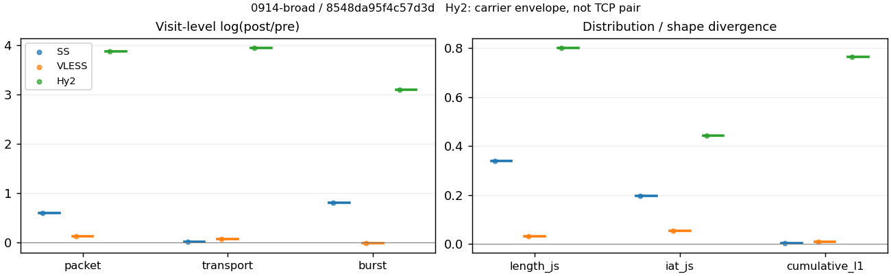
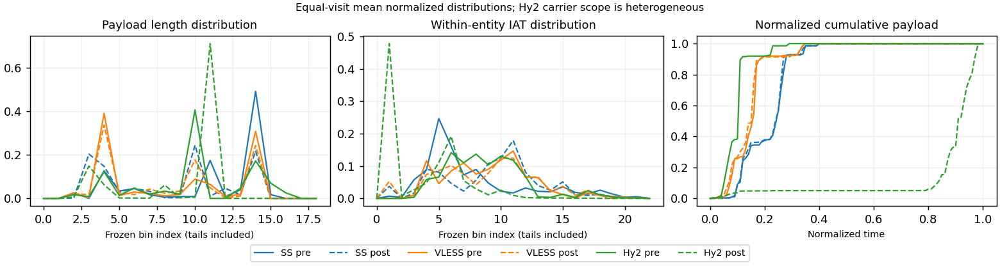

# 0914-broad · 条目 014 · arxiv.org

目标：https://arxiv.org/abs/1706.03762

活动标签：arxiv.org::page_load。选定访问 3 次。

[返回总索引](../../README.md) · [统计口径](../../methods.md)

## 覆盖与资格（每次访问均保留）

| 部署 | 重复 | 主请求路由 | 活动状态 | 代理比较 | DIRECT pre | 请求 proxy/direct/unresolved | 错误 |
| --- | --- | --- | --- | --- | --- | --- | --- |
| Hy2 | 1 | proxy | passed | 1 | 0 | 35/0/0 | [] |
| SS | 1 | proxy | passed | 1 | 0 | 35/0/0 | [] |
| VLESS | 1 | proxy | passed | 1 | 0 | 35/0/0 | [] |

主请求非 proxy 的统计仅解释为已索引的辅助代理连接或 DIRECT 观测，不代表目标业务经代理传输。播放确认与配对资格是两道不同的门。

图中散点为单次访问，短线为重复中位数；Hy2 是共享载体包络，不能与 TCP 配对作等范围因果对比。

形态图先逐访问归一化，再对访问等权平均；实线 pre，虚线 post。分箱序号及边界见 methods，不将分箱索引误解为长度或时间。

## 每次访问的关键观测

### SS

范围：`exclusive_page`。每格 pre → post；空值为不可观测/不适用。

| 重复 | 包数 | 载荷字节 | burst | TCP FR | IAT中位µs | length JS | IAT JS |
| --- | --- | --- | --- | --- | --- | --- | --- |
| 1 | 599 → 1086 | 6.6937e+05 → 6.772e+05 | 365 → 821 | 54 → 58 | 31.989 → 634.71 | 0.33851 | 0.19559 |

完整标量统计：中位数 [min,max]；Δ 为重复内逐访问变换的中位数，MAD 未缩放。n 为可用变换数；DIRECT-only 的 nΔ=0 不代表 pre 不可用。

| scope | 特征 | pre | post | Δ | IQRΔ | MADΔ | nΔ |
| --- | --- | --- | --- | --- | --- | --- | --- |
| exclusive_page | active_span_sum_s_1000ms | 12.967 [12.967, 12.967] | 13.099 [13.099, 13.099] | 0.010133 | — | — | 1 |
| exclusive_page | active_span_sum_s_100ms | 2.0485 [2.0485, 2.0485] | 4.111 [4.111, 4.111] | 0.69654 | — | — | 1 |
| exclusive_page | active_span_sum_s_500ms | 7.3475 [7.3475, 7.3475] | 9.6134 [9.6134, 9.6134] | 0.26879 | — | — | 1 |
| exclusive_page | burst_bytes_iqr | 2896 [2896, 2896] | 1428 [1428, 1428] | -0.70706 | — | — | 1 |
| exclusive_page | burst_bytes_mad | 64 [64, 64] | 34 [34, 34] | -0.63252 | — | — | 1 |
| exclusive_page | burst_bytes_max | 20480 [20480, 20480] | 5786 [5786, 5786] | -1.264 | — | — | 1 |
| exclusive_page | burst_bytes_mean | 1833.9 [1833.9, 1833.9] | 824.85 [824.85, 824.85] | -0.79899 | — | — | 1 |
| exclusive_page | burst_bytes_median | 64 [64, 64] | 34 [34, 34] | -0.63252 | — | — | 1 |
| exclusive_page | burst_bytes_min | 0 [0, 0] | 0 [0, 0] | — | — | — | 0 |
| exclusive_page | burst_bytes_p95 | 8854.4 [8854.4, 8854.4] | 2930 [2930, 2930] | -1.1059 | — | — | 1 |
| exclusive_page | burst_bytes_q25 | 0 [0, 0] | 0 [0, 0] | — | — | — | 0 |
| exclusive_page | burst_bytes_q75 | 2896 [2896, 2896] | 1428 [1428, 1428] | -0.70706 | — | — | 1 |
| exclusive_page | burst_bytes_std | 3285.7 [3285.7, 3285.7] | 1197.8 [1197.8, 1197.8] | -1.0091 | — | — | 1 |
| exclusive_page | burst_count | 365 [365, 365] | 821 [821, 821] | 0.81063 | — | — | 1 |
| exclusive_page | burst_duration_ms_iqr | 0.067728 [0.067728, 0.067728] | 0 [0, 0] | — | — | — | 0 |
| exclusive_page | burst_duration_ms_mad | 0 [0, 0] | 0 [0, 0] | — | — | — | 0 |
| exclusive_page | burst_duration_ms_max | 13162 [13162, 13162] | 13164 [13164, 13164] | 8.8958e-05 | — | — | 1 |
| exclusive_page | burst_duration_ms_mean | 133.22 [133.22, 133.22] | 55.447 [55.447, 55.447] | -0.87659 | — | — | 1 |
| exclusive_page | burst_duration_ms_median | 0 [0, 0] | 0 [0, 0] | — | — | — | 0 |
| exclusive_page | burst_duration_ms_min | 0 [0, 0] | 0 [0, 0] | — | — | — | 0 |
| exclusive_page | burst_duration_ms_p95 | 212.52 [212.52, 212.52] | 8.1568 [8.1568, 8.1568] | -3.2602 | — | — | 1 |
| exclusive_page | burst_duration_ms_q25 | 0 [0, 0] | 0 [0, 0] | — | — | — | 0 |
| exclusive_page | burst_duration_ms_q75 | 0.067728 [0.067728, 0.067728] | 0 [0, 0] | — | — | — | 0 |
| exclusive_page | burst_duration_ms_std | 1105.3 [1105.3, 1105.3] | 737.31 [737.31, 737.31] | -0.40489 | — | — | 1 |
| exclusive_page | burst_packets_iqr | 1 [1, 1] | 0 [0, 0] | — | — | — | 0 |
| exclusive_page | burst_packets_mad | 0 [0, 0] | 0 [0, 0] | — | — | — | 0 |
| exclusive_page | burst_packets_max | 9 [9, 9] | 8 [8, 8] | -0.11778 | — | — | 1 |
| exclusive_page | burst_packets_mean | 1.6411 [1.6411, 1.6411] | 1.3228 [1.3228, 1.3228] | -0.21563 | — | — | 1 |
| exclusive_page | burst_packets_median | 1 [1, 1] | 1 [1, 1] | 0 | — | — | 1 |
| exclusive_page | burst_packets_min | 1 [1, 1] | 1 [1, 1] | 0 | — | — | 1 |
| exclusive_page | burst_packets_p95 | 4 [4, 4] | 3 [3, 3] | -0.28768 | — | — | 1 |
| exclusive_page | burst_packets_q25 | 1 [1, 1] | 1 [1, 1] | 0 | — | — | 1 |
| exclusive_page | burst_packets_q75 | 2 [2, 2] | 1 [1, 1] | -0.69315 | — | — | 1 |
| exclusive_page | burst_packets_std | 1.1515 [1.1515, 1.1515] | 0.75134 [0.75134, 0.75134] | -0.42697 | — | — | 1 |
| exclusive_page | connection_span_concurrency_max | 4 [4, 4] | 4 [4, 4] | 0 | — | — | 1 |
| exclusive_page | cumulative_l1 | — | — | 0.0042364 | — | — | 1 |
| exclusive_page | cumulative_max | — | — | 0.091102 | — | — | 1 |
| exclusive_page | direction_entropy | 0.6734 [0.6734, 0.6734] | 0.52487 [0.52487, 0.52487] | -0.14853 | — | — | 1 |
| exclusive_page | down_burst_count | 179 [179, 179] | 407 [407, 407] | 0.82143 | — | — | 1 |
| exclusive_page | down_ip_bytes | 6.6837e+05 [6.6837e+05, 6.6837e+05] | 6.8447e+05 [6.8447e+05, 6.8447e+05] | 0.023795 | — | — | 1 |
| exclusive_page | down_packets | 369 [369, 369] | 588 [588, 588] | 0.46593 | — | — | 1 |
| exclusive_page | down_transport_bytes | 6.4913e+05 [6.4913e+05, 6.4913e+05] | 6.538e+05 [6.538e+05, 6.538e+05] | 0.0071761 | — | — | 1 |
| exclusive_page | duration_s | 18.094 [18.094, 18.094] | 18.091 [18.091, 18.091] | -0.0001691 | — | — | 1 |
| exclusive_page | entity_count | 7 [7, 7] | 7 [7, 7] | 0 | — | — | 1 |
| exclusive_page | fr_runs | 54 [54, 54] | 58 [58, 58] | 0.071459 | — | — | 1 |
| exclusive_page | fr_runs_per_packet | 0.15169 [0.15169, 0.15169] | 0.098139 [0.098139, 0.098139] | -0.053547 | — | — | 1 |
| exclusive_page | fr_switches | 47 [47, 47] | 51 [51, 51] | 0.081678 | — | — | 1 |
| exclusive_page | fr_switches_per_possible_transition | 0.13467 [0.13467, 0.13467] | 0.087329 [0.087329, 0.087329] | -0.047342 | — | — | 1 |
| exclusive_page | full_retransmission_fraction | 0.0033389 [0.0033389, 0.0033389] | 0.0046041 [0.0046041, 0.0046041] | 0.0012652 | — | — | 1 |
| exclusive_page | full_retransmission_packets | 2 [2, 2] | 5 [5, 5] | 0.91629 | — | — | 1 |
| exclusive_page | iat_count | 592 [592, 592] | 1079 [1079, 1079] | 0.60028 | — | — | 1 |
| exclusive_page | iat_js | — | — | 0.19559 | — | — | 1 |
| exclusive_page | iat_ks | — | — | 0.37831 | — | — | 1 |
| exclusive_page | iat_median_us | 31.989 [31.989, 31.989] | 634.71 [634.71, 634.71] | 2.9878 | — | — | 1 |
| exclusive_page | iat_us_iqr | 348.75 [348.75, 348.75] | 1812.5 [1812.5, 1812.5] | 1.6481 | — | — | 1 |
| exclusive_page | iat_us_mad | 25.73 [25.73, 25.73] | 617.64 [617.64, 617.64] | 3.1782 | — | — | 1 |
| exclusive_page | iat_us_max | 1.3162e+07 [1.3162e+07, 1.3162e+07] | 1.3164e+07 [1.3164e+07, 1.3164e+07] | 8.8958e-05 | — | — | 1 |
| exclusive_page | iat_us_mean | 87726 [87726, 87726] | 47881 [47881, 47881] | -0.60551 | — | — | 1 |
| exclusive_page | iat_us_median | 31.989 [31.989, 31.989] | 634.71 [634.71, 634.71] | 2.9878 | — | — | 1 |
| exclusive_page | iat_us_min | 0.182 [0.182, 0.182] | 0.042 [0.042, 0.042] | -1.4663 | — | — | 1 |
| exclusive_page | iat_us_p95 | 1.3407e+05 [1.3407e+05, 1.3407e+05] | 40631 [40631, 40631] | -1.1939 | — | — | 1 |
| exclusive_page | iat_us_q25 | 13.361 [13.361, 13.361] | 27.304 [27.304, 27.304] | 0.71471 | — | — | 1 |
| exclusive_page | iat_us_q75 | 362.11 [362.11, 362.11] | 1839.8 [1839.8, 1839.8] | 1.6255 | — | — | 1 |
| exclusive_page | iat_us_std | 8.7081e+05 [8.7081e+05, 8.7081e+05] | 6.4402e+05 [6.4402e+05, 6.4402e+05] | -0.3017 | — | — | 1 |
| exclusive_page | iat_wasserstein_log1p_us | — | — | 1.4848 | — | — | 1 |
| exclusive_page | idle_gap_count_1000ms | 5 [5, 5] | 5 [5, 5] | 0 | — | — | 1 |
| exclusive_page | idle_gap_count_100ms | 36 [36, 36] | 34 [34, 34] | -0.057158 | — | — | 1 |
| exclusive_page | idle_gap_count_500ms | 13 [13, 13] | 10 [10, 10] | -0.26236 | — | — | 1 |
| exclusive_page | idle_gap_sum_s_1000ms | 38.967 [38.967, 38.967] | 38.564 [38.564, 38.564] | -0.010394 | — | — | 1 |
| exclusive_page | idle_gap_sum_s_100ms | 49.886 [49.886, 49.886] | 47.552 [47.552, 47.552] | -0.047902 | — | — | 1 |
| exclusive_page | idle_gap_sum_s_500ms | 44.586 [44.586, 44.586] | 42.05 [42.05, 42.05] | -0.058577 | — | — | 1 |
| exclusive_page | ip_bytes | 7.0066e+05 [7.0066e+05, 7.0066e+05] | 7.4065e+05 [7.4065e+05, 7.4065e+05] | 0.055507 | — | — | 1 |
| exclusive_page | length_iqr | 2057.5 [2057.5, 2057.5] | 1408 [1408, 1408] | -0.37932 | — | — | 1 |
| exclusive_page | length_js | — | — | 0.33851 | — | — | 1 |
| exclusive_page | length_ks | — | — | 0.4601 | — | — | 1 |
| exclusive_page | length_mad | 787.5 [787.5, 787.5] | 1354 [1354, 1354] | 0.54196 | — | — | 1 |
| exclusive_page | length_max | 4096 [4096, 4096] | 2930 [2930, 2930] | -0.33501 | — | — | 1 |
| exclusive_page | length_mean | 1880.3 [1880.3, 1880.3] | 1145.9 [1145.9, 1145.9] | -0.49525 | — | — | 1 |
| exclusive_page | length_median | 2108.5 [2108.5, 2108.5] | 1428 [1428, 1428] | -0.3897 | — | — | 1 |
| exclusive_page | length_min | 5 [5, 5] | 20 [20, 20] | 1.3863 | — | — | 1 |
| exclusive_page | length_p95 | 2896 [2896, 2896] | 2856 [2856, 2856] | -0.013908 | — | — | 1 |
| exclusive_page | length_q25 | 838.5 [838.5, 838.5] | 74 [74, 74] | -2.4275 | — | — | 1 |
| exclusive_page | length_q75 | 2896 [2896, 2896] | 1482 [1482, 1482] | -0.66994 | — | — | 1 |
| exclusive_page | length_std | 1150.9 [1150.9, 1150.9] | 1068 [1068, 1068] | -0.074757 | — | — | 1 |
| exclusive_page | length_wasserstein_bytes | — | — | 734.65 | — | — | 1 |
| exclusive_page | nonempty_entity_count | 7 [7, 7] | 7 [7, 7] | 0 | — | — | 1 |
| exclusive_page | nonempty_packets | 356 [356, 356] | 591 [591, 591] | 0.50689 | — | — | 1 |
| exclusive_page | offload_suspect_fraction | 0.33055 [0.33055, 0.33055] | 0.15193 [0.15193, 0.15193] | -0.17862 | — | — | 1 |
| exclusive_page | packet_count | 599 [599, 599] | 1086 [1086, 1086] | 0.59499 | — | — | 1 |
| exclusive_page | rtt_median_ms | 0.07487 [0.07487, 0.07487] | 32.39 [32.39, 32.39] | 6.0698 | — | — | 1 |
| exclusive_page | rtt_sample_count | 228 [228, 228] | 206 [206, 206] | -0.10147 | — | — | 1 |
| exclusive_page | tcp_ack_count | 592 [592, 592] | 1078 [1078, 1078] | 0.59936 | — | — | 1 |
| exclusive_page | tcp_fin_count | 14 [14, 14] | 14 [14, 14] | 0 | — | — | 1 |
| exclusive_page | tcp_packet_count | 599 [599, 599] | 1086 [1086, 1086] | 0.59499 | — | — | 1 |
| exclusive_page | tcp_rst_count | 0 [0, 0] | 0 [0, 0] | — | — | — | 0 |
| exclusive_page | tcp_syn_count | 14 [14, 14] | 16 [16, 16] | 0.13353 | — | — | 1 |
| exclusive_page | tcp_window_raw_median | 65535 [65535, 65535] | 137 [137, 137] | -6.1704 | — | — | 1 |
| exclusive_page | transition_entropy | 0.4775 [0.4775, 0.4775] | 0.34174 [0.34174, 0.34174] | -0.13577 | — | — | 1 |
| exclusive_page | transition_n_mm | 266 [266, 266] | 492 [492, 492] | 0.61498 | — | — | 1 |
| exclusive_page | transition_n_mp | 20 [20, 20] | 22 [22, 22] | 0.09531 | — | — | 1 |
| exclusive_page | transition_n_pm | 27 [27, 27] | 29 [29, 29] | 0.071459 | — | — | 1 |
| exclusive_page | transition_n_pp | 36 [36, 36] | 41 [41, 41] | 0.13005 | — | — | 1 |
| exclusive_page | transition_p_mm | 0.93007 [0.93007, 0.93007] | 0.9572 [0.9572, 0.9572] | 0.027129 | — | — | 1 |
| exclusive_page | transition_p_mp | 0.06993 [0.06993, 0.06993] | 0.042802 [0.042802, 0.042802] | -0.027129 | — | — | 1 |
| exclusive_page | transition_p_pm | 0.42857 [0.42857, 0.42857] | 0.41429 [0.41429, 0.41429] | -0.014286 | — | — | 1 |
| exclusive_page | transition_p_pp | 0.57143 [0.57143, 0.57143] | 0.58571 [0.58571, 0.58571] | 0.014286 | — | — | 1 |
| exclusive_page | transport_bytes | 6.6937e+05 [6.6937e+05, 6.6937e+05] | 6.772e+05 [6.772e+05, 6.772e+05] | 0.011631 | — | — | 1 |
| exclusive_page | up_burst_count | 186 [186, 186] | 414 [414, 414] | 0.80012 | — | — | 1 |
| exclusive_page | up_byte_fraction | 0.030242 [0.030242, 0.030242] | 0.034552 [0.034552, 0.034552] | 0.0043106 | — | — | 1 |
| exclusive_page | up_ip_bytes | 32283 [32283, 32283] | 56179 [56179, 56179] | 0.554 | — | — | 1 |
| exclusive_page | up_packets | 230 [230, 230] | 498 [498, 498] | 0.77252 | — | — | 1 |
| exclusive_page | up_transport_bytes | 20243 [20243, 20243] | 23399 [23399, 23399] | 0.14488 | — | — | 1 |
| exclusive_page | zero_iat_count | 0 [0, 0] | 0 [0, 0] | — | — | — | 0 |
| exclusive_page | zero_iat_fraction | 0 [0, 0] | 0 [0, 0] | 0 | — | — | 1 |

### VLESS

范围：`exclusive_page`。每格 pre → post；空值为不可观测/不适用。

| 重复 | 包数 | 载荷字节 | burst | TCP FR | IAT中位µs | length JS | IAT JS |
| --- | --- | --- | --- | --- | --- | --- | --- |
| 1 | 928 → 1059 | 6.5862e+05 → 7.1059e+05 | 674 → 670 | 62 → 74 | 414.94 → 460.41 | 0.030021 | 0.052945 |

完整标量统计：中位数 [min,max]；Δ 为重复内逐访问变换的中位数，MAD 未缩放。n 为可用变换数；DIRECT-only 的 nΔ=0 不代表 pre 不可用。

| scope | 特征 | pre | post | Δ | IQRΔ | MADΔ | nΔ |
| --- | --- | --- | --- | --- | --- | --- | --- |
| exclusive_page | active_span_sum_s_1000ms | 11.488 [11.488, 11.488] | 10.51 [10.51, 10.51] | -0.089001 | — | — | 1 |
| exclusive_page | active_span_sum_s_100ms | 1.7883 [1.7883, 1.7883] | 3.7948 [3.7948, 3.7948] | 0.75237 | — | — | 1 |
| exclusive_page | active_span_sum_s_500ms | 6.8463 [6.8463, 6.8463] | 10.51 [10.51, 10.51] | 0.42862 | — | — | 1 |
| exclusive_page | burst_bytes_iqr | 2824 [2824, 2824] | 2338.5 [2338.5, 2338.5] | -0.18864 | — | — | 1 |
| exclusive_page | burst_bytes_mad | 64 [64, 64] | 88 [88, 88] | 0.31845 | — | — | 1 |
| exclusive_page | burst_bytes_max | 5792 [5792, 5792] | 4832 [4832, 4832] | -0.18122 | — | — | 1 |
| exclusive_page | burst_bytes_mean | 977.17 [977.17, 977.17] | 1060.6 [1060.6, 1060.6] | 0.081912 | — | — | 1 |
| exclusive_page | burst_bytes_median | 64 [64, 64] | 88 [88, 88] | 0.31845 | — | — | 1 |
| exclusive_page | burst_bytes_min | 0 [0, 0] | 0 [0, 0] | — | — | — | 0 |
| exclusive_page | burst_bytes_p95 | 2896 [2896, 2896] | 2896 [2896, 2896] | 0 | — | — | 1 |
| exclusive_page | burst_bytes_q25 | 0 [0, 0] | 0 [0, 0] | — | — | — | 0 |
| exclusive_page | burst_bytes_q75 | 2824 [2824, 2824] | 2338.5 [2338.5, 2338.5] | -0.18864 | — | — | 1 |
| exclusive_page | burst_bytes_std | 1318.1 [1318.1, 1318.1] | 1228.3 [1228.3, 1228.3] | -0.070594 | — | — | 1 |
| exclusive_page | burst_count | 674 [674, 674] | 670 [670, 670] | -0.0059524 | — | — | 1 |
| exclusive_page | burst_duration_ms_iqr | 0.50702 [0.50702, 0.50702] | 1.4557 [1.4557, 1.4557] | 1.0547 | — | — | 1 |
| exclusive_page | burst_duration_ms_mad | 0 [0, 0] | 0 [0, 0] | — | — | — | 0 |
| exclusive_page | burst_duration_ms_max | 9617.9 [9617.9, 9617.9] | 9618.1 [9618.1, 9618.1] | 2.5901e-05 | — | — | 1 |
| exclusive_page | burst_duration_ms_mean | 35.078 [35.078, 35.078] | 29.198 [29.198, 29.198] | -0.18349 | — | — | 1 |
| exclusive_page | burst_duration_ms_median | 0 [0, 0] | 0 [0, 0] | — | — | — | 0 |
| exclusive_page | burst_duration_ms_min | 0 [0, 0] | 0 [0, 0] | — | — | — | 0 |
| exclusive_page | burst_duration_ms_p95 | 32.946 [32.946, 32.946] | 115.38 [115.38, 115.38] | 1.2533 | — | — | 1 |
| exclusive_page | burst_duration_ms_q25 | 0 [0, 0] | 0 [0, 0] | — | — | — | 0 |
| exclusive_page | burst_duration_ms_q75 | 0.50702 [0.50702, 0.50702] | 1.4557 [1.4557, 1.4557] | 1.0547 | — | — | 1 |
| exclusive_page | burst_duration_ms_std | 388.02 [388.02, 388.02] | 378.7 [378.7, 378.7] | -0.0243 | — | — | 1 |
| exclusive_page | burst_packets_iqr | 1 [1, 1] | 1 [1, 1] | 0 | — | — | 1 |
| exclusive_page | burst_packets_mad | 0 [0, 0] | 0 [0, 0] | — | — | — | 0 |
| exclusive_page | burst_packets_max | 4 [4, 4] | 8 [8, 8] | 0.69315 | — | — | 1 |
| exclusive_page | burst_packets_mean | 1.3769 [1.3769, 1.3769] | 1.5806 [1.5806, 1.5806] | 0.138 | — | — | 1 |
| exclusive_page | burst_packets_median | 1 [1, 1] | 1 [1, 1] | 0 | — | — | 1 |
| exclusive_page | burst_packets_min | 1 [1, 1] | 1 [1, 1] | 0 | — | — | 1 |
| exclusive_page | burst_packets_p95 | 2 [2, 2] | 3 [3, 3] | 0.40547 | — | — | 1 |
| exclusive_page | burst_packets_q25 | 1 [1, 1] | 1 [1, 1] | 0 | — | — | 1 |
| exclusive_page | burst_packets_q75 | 2 [2, 2] | 2 [2, 2] | 0 | — | — | 1 |
| exclusive_page | burst_packets_std | 0.53689 [0.53689, 0.53689] | 0.88364 [0.88364, 0.88364] | 0.49826 | — | — | 1 |
| exclusive_page | connection_span_concurrency_max | 5 [5, 5] | 5 [5, 5] | 0 | — | — | 1 |
| exclusive_page | cumulative_l1 | — | — | 0.0075393 | — | — | 1 |
| exclusive_page | cumulative_max | — | — | 0.20602 | — | — | 1 |
| exclusive_page | direction_entropy | 0.49585 [0.49585, 0.49585] | 0.5097 [0.5097, 0.5097] | 0.013849 | — | — | 1 |
| exclusive_page | down_burst_count | 334 [334, 334] | 332 [332, 332] | -0.006006 | — | — | 1 |
| exclusive_page | down_ip_bytes | 6.7007e+05 [6.7007e+05, 6.7007e+05] | 7.1424e+05 [7.1424e+05, 7.1424e+05] | 0.06384 | — | — | 1 |
| exclusive_page | down_packets | 556 [556, 556] | 628 [628, 628] | 0.12177 | — | — | 1 |
| exclusive_page | down_transport_bytes | 6.4111e+05 [6.4111e+05, 6.4111e+05] | 6.8154e+05 [6.8154e+05, 6.8154e+05] | 0.061151 | — | — | 1 |
| exclusive_page | duration_s | 15.31 [15.31, 15.31] | 15.22 [15.22, 15.22] | -0.0059055 | — | — | 1 |
| exclusive_page | entity_count | 6 [6, 6] | 6 [6, 6] | 0 | — | — | 1 |
| exclusive_page | fr_runs | 62 [62, 62] | 74 [74, 74] | 0.17693 | — | — | 1 |
| exclusive_page | fr_runs_per_packet | 0.11418 [0.11418, 0.11418] | 0.11974 [0.11974, 0.11974] | 0.0055606 | — | — | 1 |
| exclusive_page | fr_switches | 56 [56, 56] | 68 [68, 68] | 0.19416 | — | — | 1 |
| exclusive_page | fr_switches_per_possible_transition | 0.10428 [0.10428, 0.10428] | 0.11111 [0.11111, 0.11111] | 0.0068281 | — | — | 1 |
| exclusive_page | full_retransmission_fraction | 0 [0, 0] | 0 [0, 0] | 0 | — | — | 1 |
| exclusive_page | full_retransmission_packets | 0 [0, 0] | 0 [0, 0] | — | — | — | 0 |
| exclusive_page | iat_count | 922 [922, 922] | 1053 [1053, 1053] | 0.13285 | — | — | 1 |
| exclusive_page | iat_js | — | — | 0.052945 | — | — | 1 |
| exclusive_page | iat_ks | — | — | 0.070046 | — | — | 1 |
| exclusive_page | iat_median_us | 414.94 [414.94, 414.94] | 460.41 [460.41, 460.41] | 0.10396 | — | — | 1 |
| exclusive_page | iat_us_iqr | 1458.6 [1458.6, 1458.6] | 1706.6 [1706.6, 1706.6] | 0.15702 | — | — | 1 |
| exclusive_page | iat_us_mad | 405.7 [405.7, 405.7] | 451.4 [451.4, 451.4] | 0.10674 | — | — | 1 |
| exclusive_page | iat_us_max | 9.6179e+06 [9.6179e+06, 9.6179e+06] | 9.6181e+06 [9.6181e+06, 9.6181e+06] | 2.5901e-05 | — | — | 1 |
| exclusive_page | iat_us_mean | 27022 [27022, 27022] | 22732 [22732, 22732] | -0.17288 | — | — | 1 |
| exclusive_page | iat_us_median | 414.94 [414.94, 414.94] | 460.41 [460.41, 460.41] | 0.10396 | — | — | 1 |
| exclusive_page | iat_us_min | 3.332 [3.332, 3.332] | 0.04 [0.04, 0.04] | -4.4224 | — | — | 1 |
| exclusive_page | iat_us_p95 | 19169 [19169, 19169] | 45243 [45243, 45243] | 0.85875 | — | — | 1 |
| exclusive_page | iat_us_q25 | 48.377 [48.377, 48.377] | 24.912 [24.912, 24.912] | -0.66368 | — | — | 1 |
| exclusive_page | iat_us_q75 | 1507 [1507, 1507] | 1731.5 [1731.5, 1731.5] | 0.13889 | — | — | 1 |
| exclusive_page | iat_us_std | 3.3208e+05 [3.3208e+05, 3.3208e+05] | 3.0595e+05 [3.0595e+05, 3.0595e+05] | -0.08196 | — | — | 1 |
| exclusive_page | iat_wasserstein_log1p_us | — | — | 0.37861 | — | — | 1 |
| exclusive_page | idle_gap_count_1000ms | 4 [4, 4] | 4 [4, 4] | 0 | — | — | 1 |
| exclusive_page | idle_gap_count_100ms | 34 [34, 34] | 40 [40, 40] | 0.16252 | — | — | 1 |
| exclusive_page | idle_gap_count_500ms | 10 [10, 10] | 4 [4, 4] | -0.91629 | — | — | 1 |
| exclusive_page | idle_gap_sum_s_1000ms | 13.426 [13.426, 13.426] | 13.427 [13.427, 13.427] | 6.1067e-05 | — | — | 1 |
| exclusive_page | idle_gap_sum_s_100ms | 23.126 [23.126, 23.126] | 20.142 [20.142, 20.142] | -0.13815 | — | — | 1 |
| exclusive_page | idle_gap_sum_s_500ms | 18.068 [18.068, 18.068] | 13.427 [13.427, 13.427] | -0.29688 | — | — | 1 |
| exclusive_page | ip_bytes | 7.0682e+05 [7.0682e+05, 7.0682e+05] | 7.6634e+05 [7.6634e+05, 7.6634e+05] | 0.080851 | — | — | 1 |
| exclusive_page | length_iqr | 2752 [2752, 2752] | 1582 [1582, 1582] | -0.55364 | — | — | 1 |
| exclusive_page | length_js | — | — | 0.030021 | — | — | 1 |
| exclusive_page | length_ks | — | — | 0.095425 | — | — | 1 |
| exclusive_page | length_mad | 1091 [1091, 1091] | 1128 [1128, 1128] | 0.033351 | — | — | 1 |
| exclusive_page | length_max | 3107 [3107, 3107] | 2824 [2824, 2824] | -0.095503 | — | — | 1 |
| exclusive_page | length_mean | 1212.9 [1212.9, 1212.9] | 1149.8 [1149.8, 1149.8] | -0.05342 | — | — | 1 |
| exclusive_page | length_median | 1163 [1163, 1163] | 1200 [1200, 1200] | 0.031319 | — | — | 1 |
| exclusive_page | length_min | 24 [24, 24] | 4 [4, 4] | -1.7918 | — | — | 1 |
| exclusive_page | length_p95 | 2824 [2824, 2824] | 2824 [2824, 2824] | 0 | — | — | 1 |
| exclusive_page | length_q25 | 72 [72, 72] | 72 [72, 72] | 0 | — | — | 1 |
| exclusive_page | length_q75 | 2824 [2824, 2824] | 1654 [1654, 1654] | -0.53496 | — | — | 1 |
| exclusive_page | length_std | 1175.5 [1175.5, 1175.5] | 1084.6 [1084.6, 1084.6] | -0.080493 | — | — | 1 |
| exclusive_page | length_wasserstein_bytes | — | — | 122.67 | — | — | 1 |
| exclusive_page | nonempty_entity_count | 6 [6, 6] | 6 [6, 6] | 0 | — | — | 1 |
| exclusive_page | nonempty_packets | 543 [543, 543] | 618 [618, 618] | 0.12938 | — | — | 1 |
| exclusive_page | offload_suspect_fraction | 0.19612 [0.19612, 0.19612] | 0.1492 [0.1492, 0.1492] | -0.046923 | — | — | 1 |
| exclusive_page | packet_count | 928 [928, 928] | 1059 [1059, 1059] | 0.13205 | — | — | 1 |
| exclusive_page | rtt_median_ms | 0.28511 [0.28511, 0.28511] | 1.432 [1.432, 1.432] | 1.6139 | — | — | 1 |
| exclusive_page | rtt_sample_count | 366 [366, 366] | 423 [423, 423] | 0.14474 | — | — | 1 |
| exclusive_page | tcp_ack_count | 910 [910, 910] | 1053 [1053, 1053] | 0.14595 | — | — | 1 |
| exclusive_page | tcp_fin_count | 12 [12, 12] | 12 [12, 12] | 0 | — | — | 1 |
| exclusive_page | tcp_packet_count | 928 [928, 928] | 1059 [1059, 1059] | 0.13205 | — | — | 1 |
| exclusive_page | tcp_rst_count | 12 [12, 12] | 0 [0, 0] | — | — | — | 0 |
| exclusive_page | tcp_syn_count | 12 [12, 12] | 12 [12, 12] | 0 | — | — | 1 |
| exclusive_page | tcp_window_raw_median | 65535 [65535, 65535] | 154 [154, 154] | -6.0534 | — | — | 1 |
| exclusive_page | transition_entropy | 0.37323 [0.37323, 0.37323] | 0.39415 [0.39415, 0.39415] | 0.020926 | — | — | 1 |
| exclusive_page | transition_n_mm | 453 [453, 453] | 511 [511, 511] | 0.12048 | — | — | 1 |
| exclusive_page | transition_n_mp | 25 [25, 25] | 31 [31, 31] | 0.21511 | — | — | 1 |
| exclusive_page | transition_n_pm | 31 [31, 31] | 37 [37, 37] | 0.17693 | — | — | 1 |
| exclusive_page | transition_n_pp | 28 [28, 28] | 33 [33, 33] | 0.1643 | — | — | 1 |
| exclusive_page | transition_p_mm | 0.9477 [0.9477, 0.9477] | 0.9428 [0.9428, 0.9428] | -0.0048943 | — | — | 1 |
| exclusive_page | transition_p_mp | 0.052301 [0.052301, 0.052301] | 0.057196 [0.057196, 0.057196] | 0.0048943 | — | — | 1 |
| exclusive_page | transition_p_pm | 0.52542 [0.52542, 0.52542] | 0.52857 [0.52857, 0.52857] | 0.0031477 | — | — | 1 |
| exclusive_page | transition_p_pp | 0.47458 [0.47458, 0.47458] | 0.47143 [0.47143, 0.47143] | -0.0031477 | — | — | 1 |
| exclusive_page | transport_bytes | 6.5862e+05 [6.5862e+05, 6.5862e+05] | 7.1059e+05 [7.1059e+05, 7.1059e+05] | 0.075959 | — | — | 1 |
| exclusive_page | up_burst_count | 340 [340, 340] | 338 [338, 338] | -0.0058997 | — | — | 1 |
| exclusive_page | up_byte_fraction | 0.026579 [0.026579, 0.026579] | 0.040887 [0.040887, 0.040887] | 0.014309 | — | — | 1 |
| exclusive_page | up_ip_bytes | 36753 [36753, 36753] | 52102 [52102, 52102] | 0.34898 | — | — | 1 |
| exclusive_page | up_packets | 372 [372, 372] | 431 [431, 431] | 0.14721 | — | — | 1 |
| exclusive_page | up_transport_bytes | 17505 [17505, 17505] | 29054 [29054, 29054] | 0.50667 | — | — | 1 |
| exclusive_page | zero_iat_count | 0 [0, 0] | 0 [0, 0] | — | — | — | 0 |
| exclusive_page | zero_iat_fraction | 0 [0, 0] | 0 [0, 0] | 0 | — | — | 1 |

### Hy2

范围：`carrier_context_envelope`。每格 pre → post；空值为不可观测/不适用。

| 重复 | 包数 | 载荷字节 | burst | TCP FR | IAT中位µs | length JS | IAT JS |
| --- | --- | --- | --- | --- | --- | --- | --- |
| 1 | 643 → 30821 | 6.575e+05 → 3.3856e+07 | 464 → 10291 | — | 187.43 → 3.5555 | 0.7997 | 0.44265 |

完整标量统计：中位数 [min,max]；Δ 为重复内逐访问变换的中位数，MAD 未缩放。n 为可用变换数；DIRECT-only 的 nΔ=0 不代表 pre 不可用。

| scope | 特征 | pre | post | Δ | IQRΔ | MADΔ | nΔ |
| --- | --- | --- | --- | --- | --- | --- | --- |
| carrier_context_envelope | active_span_sum_s_1000ms | 7.8877 [7.8877, 7.8877] | 8.1115 [8.1115, 8.1115] | 0.027977 | — | — | 1 |
| carrier_context_envelope | active_span_sum_s_100ms | 0.83184 [0.83184, 0.83184] | 4.6855 [4.6855, 4.6855] | 1.7286 | — | — | 1 |
| carrier_context_envelope | active_span_sum_s_500ms | 5.5615 [5.5615, 5.5615] | 8.1115 [8.1115, 8.1115] | 0.37741 | — | — | 1 |
| carrier_context_envelope | burst_bytes_iqr | 1417 [1417, 1417] | 5131 [5131, 5131] | 1.2868 | — | — | 1 |
| carrier_context_envelope | burst_bytes_mad | 71 [71, 71] | 336 [336, 336] | 1.5544 | — | — | 1 |
| carrier_context_envelope | burst_bytes_max | 20241 [20241, 20241] | 2.0552e+05 [2.0552e+05, 2.0552e+05] | 2.3178 | — | — | 1 |
| carrier_context_envelope | burst_bytes_mean | 1417 [1417, 1417] | 3289.9 [3289.9, 3289.9] | 0.8423 | — | — | 1 |
| carrier_context_envelope | burst_bytes_median | 71 [71, 71] | 369 [369, 369] | 1.6481 | — | — | 1 |
| carrier_context_envelope | burst_bytes_min | 0 [0, 0] | 22 [22, 22] | — | — | — | 0 |
| carrier_context_envelope | burst_bytes_p95 | 7602 [7602, 7602] | 10932 [10932, 10932] | 0.36328 | — | — | 1 |
| carrier_context_envelope | burst_bytes_q25 | 0 [0, 0] | 37 [37, 37] | — | — | — | 0 |
| carrier_context_envelope | burst_bytes_q75 | 1417 [1417, 1417] | 5168 [5168, 5168] | 1.2939 | — | — | 1 |
| carrier_context_envelope | burst_bytes_std | 2570.1 [2570.1, 2570.1] | 7296.4 [7296.4, 7296.4] | 1.0434 | — | — | 1 |
| carrier_context_envelope | burst_count | 464 [464, 464] | 10291 [10291, 10291] | 3.0991 | — | — | 1 |
| carrier_context_envelope | burst_duration_ms_iqr | 0.14306 [0.14306, 0.14306] | 0.02597 [0.02597, 0.02597] | -1.7063 | — | — | 1 |
| carrier_context_envelope | burst_duration_ms_mad | 0 [0, 0] | 4.8e-05 [4.8e-05, 4.8e-05] | — | — | — | 0 |
| carrier_context_envelope | burst_duration_ms_max | 10232 [10232, 10232] | 4838.4 [4838.4, 4838.4] | -0.74896 | — | — | 1 |
| carrier_context_envelope | burst_duration_ms_mean | 39.443 [39.443, 39.443] | 0.68745 [0.68745, 0.68745] | -4.0496 | — | — | 1 |
| carrier_context_envelope | burst_duration_ms_median | 0 [0, 0] | 4.8e-05 [4.8e-05, 4.8e-05] | — | — | — | 0 |
| carrier_context_envelope | burst_duration_ms_min | 0 [0, 0] | 0 [0, 0] | — | — | — | 0 |
| carrier_context_envelope | burst_duration_ms_p95 | 139.56 [139.56, 139.56] | 0.14748 [0.14748, 0.14748] | -6.8525 | — | — | 1 |
| carrier_context_envelope | burst_duration_ms_q25 | 0 [0, 0] | 0 [0, 0] | — | — | — | 0 |
| carrier_context_envelope | burst_duration_ms_q75 | 0.14306 [0.14306, 0.14306] | 0.02597 [0.02597, 0.02597] | -1.7063 | — | — | 1 |
| carrier_context_envelope | burst_duration_ms_std | 482.88 [482.88, 482.88] | 47.828 [47.828, 47.828] | -2.3121 | — | — | 1 |
| carrier_context_envelope | burst_packets_iqr | 1 [1, 1] | 3 [3, 3] | 1.0986 | — | — | 1 |
| carrier_context_envelope | burst_packets_mad | 0 [0, 0] | 1 [1, 1] | — | — | — | 0 |
| carrier_context_envelope | burst_packets_max | 6 [6, 6] | 148 [148, 148] | 3.2055 | — | — | 1 |
| carrier_context_envelope | burst_packets_mean | 1.3858 [1.3858, 1.3858] | 2.9949 [2.9949, 2.9949] | 0.77067 | — | — | 1 |
| carrier_context_envelope | burst_packets_median | 1 [1, 1] | 2 [2, 2] | 0.69315 | — | — | 1 |
| carrier_context_envelope | burst_packets_min | 1 [1, 1] | 1 [1, 1] | 0 | — | — | 1 |
| carrier_context_envelope | burst_packets_p95 | 3 [3, 3] | 8 [8, 8] | 0.98083 | — | — | 1 |
| carrier_context_envelope | burst_packets_q25 | 1 [1, 1] | 1 [1, 1] | 0 | — | — | 1 |
| carrier_context_envelope | burst_packets_q75 | 2 [2, 2] | 4 [4, 4] | 0.69315 | — | — | 1 |
| carrier_context_envelope | burst_packets_std | 0.68535 [0.68535, 0.68535] | 5.0836 [5.0836, 5.0836] | 2.0038 | — | — | 1 |
| carrier_context_envelope | connection_span_concurrency_max | 5 [5, 5] | 1 [1, 1] | -1.6094 | — | — | 1 |
| carrier_context_envelope | cumulative_l1 | — | — | 0.76507 | — | — | 1 |
| carrier_context_envelope | cumulative_max | — | — | 0.94987 | — | — | 1 |
| carrier_context_envelope | direction_entropy | 0.65643 [0.65643, 0.65643] | 0.74121 [0.74121, 0.74121] | 0.084777 | — | — | 1 |
| carrier_context_envelope | direction_run_analog_runs | 56 [56, 56] | 10291 [10291, 10291] | 5.2137 | — | — | 1 |
| carrier_context_envelope | direction_run_analog_runs_per_packet | 0.15556 [0.15556, 0.15556] | 0.3339 [0.3339, 0.3339] | 0.17834 | — | — | 1 |
| carrier_context_envelope | direction_run_analog_switches | 50 [50, 50] | 10290 [10290, 10290] | 5.3269 | — | — | 1 |
| carrier_context_envelope | direction_run_analog_switches_per_possible_transition | 0.14124 [0.14124, 0.14124] | 0.33387 [0.33387, 0.33387] | 0.19263 | — | — | 1 |
| carrier_context_envelope | down_burst_count | 229 [229, 229] | 5145 [5145, 5145] | 3.1121 | — | — | 1 |
| carrier_context_envelope | down_ip_bytes | 6.5915e+05 [6.5915e+05, 6.5915e+05] | 3.4139e+07 [3.4139e+07, 3.4139e+07] | 3.9472 | — | — | 1 |
| carrier_context_envelope | down_packets | 367 [367, 367] | 24353 [24353, 24353] | 4.195 | — | — | 1 |
| carrier_context_envelope | down_transport_bytes | 6.4002e+05 [6.4002e+05, 6.4002e+05] | 3.3457e+07 [3.3457e+07, 3.3457e+07] | 3.9565 | — | — | 1 |
| carrier_context_envelope | duration_s | 14.311 [14.311, 14.311] | 14.309 [14.309, 14.309] | -8.8614e-05 | — | — | 1 |
| carrier_context_envelope | entity_count | 6 [6, 6] | 1 [1, 1] | -1.7918 | — | — | 1 |
| carrier_context_envelope | full_retransmission_fraction | 0.0015552 [0.0015552, 0.0015552] | — | — | — | — | 0 |
| carrier_context_envelope | full_retransmission_packets | 1 [1, 1] | — | — | — | — | 0 |
| carrier_context_envelope | iat_count | 637 [637, 637] | 30820 [30820, 30820] | 3.8791 | — | — | 1 |
| carrier_context_envelope | iat_js | — | — | 0.44265 | — | — | 1 |
| carrier_context_envelope | iat_ks | — | — | 0.62273 | — | — | 1 |
| carrier_context_envelope | iat_median_us | 187.43 [187.43, 187.43] | 3.5555 [3.5555, 3.5555] | -3.9649 | — | — | 1 |
| carrier_context_envelope | iat_us_iqr | 955.24 [955.24, 955.24] | 26.601 [26.601, 26.601] | -3.581 | — | — | 1 |
| carrier_context_envelope | iat_us_mad | 174.57 [174.57, 174.57] | 3.5195 [3.5195, 3.5195] | -3.904 | — | — | 1 |
| carrier_context_envelope | iat_us_max | 1.0232e+07 [1.0232e+07, 1.0232e+07] | 4.8384e+06 [4.8384e+06, 4.8384e+06] | -0.74896 | — | — | 1 |
| carrier_context_envelope | iat_us_mean | 30165 [30165, 30165] | 464.29 [464.29, 464.29] | -4.1739 | — | — | 1 |
| carrier_context_envelope | iat_us_median | 187.43 [187.43, 187.43] | 3.5555 [3.5555, 3.5555] | -3.9649 | — | — | 1 |
| carrier_context_envelope | iat_us_min | 3.636 [3.636, 3.636] | 0.002 [0.002, 0.002] | -7.5055 | — | — | 1 |
| carrier_context_envelope | iat_us_p95 | 40861 [40861, 40861] | 243.56 [243.56, 243.56] | -5.1226 | — | — | 1 |
| carrier_context_envelope | iat_us_q25 | 47.693 [47.693, 47.693] | 0.05 [0.05, 0.05] | -6.8605 | — | — | 1 |
| carrier_context_envelope | iat_us_q75 | 1002.9 [1002.9, 1002.9] | 26.651 [26.651, 26.651] | -3.6278 | — | — | 1 |
| carrier_context_envelope | iat_us_std | 4.1251e+05 [4.1251e+05, 4.1251e+05] | 29002 [29002, 29002] | -2.6549 | — | — | 1 |
| carrier_context_envelope | iat_wasserstein_log1p_us | — | — | 3.689 | — | — | 1 |
| carrier_context_envelope | idle_gap_count_1000ms | 2 [2, 2] | 2 [2, 2] | 0 | — | — | 1 |
| carrier_context_envelope | idle_gap_count_100ms | 27 [27, 27] | 24 [24, 24] | -0.11778 | — | — | 1 |
| carrier_context_envelope | idle_gap_count_500ms | 5 [5, 5] | 2 [2, 2] | -0.91629 | — | — | 1 |
| carrier_context_envelope | idle_gap_sum_s_1000ms | 11.327 [11.327, 11.327] | 6.1978 [6.1978, 6.1978] | -0.60302 | — | — | 1 |
| carrier_context_envelope | idle_gap_sum_s_100ms | 18.383 [18.383, 18.383] | 9.6239 [9.6239, 9.6239] | -0.64719 | — | — | 1 |
| carrier_context_envelope | idle_gap_sum_s_500ms | 13.654 [13.654, 13.654] | 6.1978 [6.1978, 6.1978] | -0.7898 | — | — | 1 |
| carrier_context_envelope | ip_bytes | 6.9104e+05 [6.9104e+05, 6.9104e+05] | 3.4719e+07 [3.4719e+07, 3.4719e+07] | 3.9169 | — | — | 1 |
| carrier_context_envelope | length_iqr | 1325 [1325, 1325] | 596 [596, 596] | -0.79893 | — | — | 1 |
| carrier_context_envelope | length_js | — | — | 0.7997 | — | — | 1 |
| carrier_context_envelope | length_ks | — | — | 0.39725 | — | — | 1 |
| carrier_context_envelope | length_mad | 608 [608, 608] | 0 [0, 0] | — | — | — | 0 |
| carrier_context_envelope | length_max | 8920 [8920, 8920] | 1441 [1441, 1441] | -1.823 | — | — | 1 |
| carrier_context_envelope | length_mean | 1826.4 [1826.4, 1826.4] | 1098.5 [1098.5, 1098.5] | -0.50841 | — | — | 1 |
| carrier_context_envelope | length_median | 1415 [1415, 1415] | 1441 [1441, 1441] | 0.018208 | — | — | 1 |
| carrier_context_envelope | length_min | 31 [31, 31] | 22 [22, 22] | -0.34294 | — | — | 1 |
| carrier_context_envelope | length_p95 | 5660 [5660, 5660] | 1441 [1441, 1441] | -1.3681 | — | — | 1 |
| carrier_context_envelope | length_q25 | 957.25 [957.25, 957.25] | 845 [845, 845] | -0.12473 | — | — | 1 |
| carrier_context_envelope | length_q75 | 2282.2 [2282.2, 2282.2] | 1441 [1441, 1441] | -0.45982 | — | — | 1 |
| carrier_context_envelope | length_std | 1746 [1746, 1746] | 571.69 [571.69, 571.69] | -1.1165 | — | — | 1 |
| carrier_context_envelope | length_wasserstein_bytes | — | — | 752.48 | — | — | 1 |
| carrier_context_envelope | nonempty_entity_count | 6 [6, 6] | 1 [1, 1] | -1.7918 | — | — | 1 |
| carrier_context_envelope | nonempty_packets | 360 [360, 360] | 30821 [30821, 30821] | 4.4498 | — | — | 1 |
| carrier_context_envelope | offload_suspect_fraction | 0.17574 [0.17574, 0.17574] | 0 [0, 0] | -0.17574 | — | — | 1 |
| carrier_context_envelope | packet_count | 643 [643, 643] | 30821 [30821, 30821] | 3.8698 | — | — | 1 |
| carrier_context_envelope | rtt_median_ms | 0.10767 [0.10767, 0.10767] | — | — | — | — | 0 |
| carrier_context_envelope | rtt_sample_count | 272 [272, 272] | 0 [0, 0] | — | — | — | 0 |
| carrier_context_envelope | tcp_ack_count | 637 [637, 637] | — | — | — | — | 0 |
| carrier_context_envelope | tcp_fin_count | 12 [12, 12] | — | — | — | — | 0 |
| carrier_context_envelope | tcp_packet_count | 643 [643, 643] | 0 [0, 0] | — | — | — | 0 |
| carrier_context_envelope | tcp_rst_count | 0 [0, 0] | — | — | — | — | 0 |
| carrier_context_envelope | tcp_syn_count | 12 [12, 12] | — | — | — | — | 0 |
| carrier_context_envelope | tcp_window_raw_median | 65535 [65535, 65535] | — | — | — | — | 0 |
| carrier_context_envelope | transition_entropy | 0.48982 [0.48982, 0.48982] | 0.74113 [0.74113, 0.74113] | 0.2513 | — | — | 1 |
| carrier_context_envelope | transition_n_mm | 271 [271, 271] | 19208 [19208, 19208] | 4.261 | — | — | 1 |
| carrier_context_envelope | transition_n_mp | 22 [22, 22] | 5145 [5145, 5145] | 5.4547 | — | — | 1 |
| carrier_context_envelope | transition_n_pm | 28 [28, 28] | 5145 [5145, 5145] | 5.2136 | — | — | 1 |
| carrier_context_envelope | transition_n_pp | 33 [33, 33] | 1322 [1322, 1322] | 3.6904 | — | — | 1 |
| carrier_context_envelope | transition_p_mm | 0.92491 [0.92491, 0.92491] | 0.78873 [0.78873, 0.78873] | -0.13618 | — | — | 1 |
| carrier_context_envelope | transition_p_mp | 0.075085 [0.075085, 0.075085] | 0.21127 [0.21127, 0.21127] | 0.13618 | — | — | 1 |
| carrier_context_envelope | transition_p_pm | 0.45902 [0.45902, 0.45902] | 0.79558 [0.79558, 0.79558] | 0.33656 | — | — | 1 |
| carrier_context_envelope | transition_p_pp | 0.54098 [0.54098, 0.54098] | 0.20442 [0.20442, 0.20442] | -0.33656 | — | — | 1 |
| carrier_context_envelope | transport_bytes | 6.575e+05 [6.575e+05, 6.575e+05] | 3.3856e+07 [3.3856e+07, 3.3856e+07] | 3.9414 | — | — | 1 |
| carrier_context_envelope | up_burst_count | 235 [235, 235] | 5146 [5146, 5146] | 3.0864 | — | — | 1 |
| carrier_context_envelope | up_byte_fraction | 0.026587 [0.026587, 0.026587] | 0.011793 [0.011793, 0.011793] | -0.014794 | — | — | 1 |
| carrier_context_envelope | up_ip_bytes | 31893 [31893, 31893] | 5.8038e+05 [5.8038e+05, 5.8038e+05] | 2.9013 | — | — | 1 |
| carrier_context_envelope | up_packets | 276 [276, 276] | 6468 [6468, 6468] | 3.1542 | — | — | 1 |
| carrier_context_envelope | up_transport_bytes | 17481 [17481, 17481] | 3.9928e+05 [3.9928e+05, 3.9928e+05] | 3.1285 | — | — | 1 |
| carrier_context_envelope | zero_iat_count | 0 [0, 0] | 0 [0, 0] | — | — | — | 0 |
| carrier_context_envelope | zero_iat_fraction | 0 [0, 0] | 0 [0, 0] | 0 | — | — | 1 |

## 不同部署对比

以下是各部署自身重复中位数的差异，不按重复编号强行配对。跨 TCP/Hy2 的行标记异质观测范围。

| 视角 | 特征 | 部署A | 部署B | A中位 | B中位 | B−A | 比较口径 |
| --- | --- | --- | --- | --- | --- | --- | --- |
| pre | burst_count | SS | VLESS | 365 | 674 | 309 | same_scope_unpaired_visits |
| pre | burst_count | SS | Hy2 | 365 | 464 | 99 | heterogeneous_scope_descriptive_only |
| pre | burst_count | VLESS | Hy2 | 674 | 464 | -210 | heterogeneous_scope_descriptive_only |
| pre | connection_span_concurrency_max | SS | VLESS | 4 | 5 | 1 | same_scope_unpaired_visits |
| pre | connection_span_concurrency_max | SS | Hy2 | 4 | 5 | 1 | heterogeneous_scope_descriptive_only |
| pre | connection_span_concurrency_max | VLESS | Hy2 | 5 | 5 | 0 | heterogeneous_scope_descriptive_only |
| pre | direction_entropy | SS | VLESS | 0.6734 | 0.49585 | -0.17755 | same_scope_unpaired_visits |
| pre | direction_entropy | SS | Hy2 | 0.6734 | 0.65643 | -0.016963 | heterogeneous_scope_descriptive_only |
| pre | direction_entropy | VLESS | Hy2 | 0.49585 | 0.65643 | 0.16058 | heterogeneous_scope_descriptive_only |
| pre | down_transport_bytes | SS | VLESS | 6.4913e+05 | 6.4111e+05 | -8019 | same_scope_unpaired_visits |
| pre | down_transport_bytes | SS | Hy2 | 6.4913e+05 | 6.4002e+05 | -9112 | heterogeneous_scope_descriptive_only |
| pre | down_transport_bytes | VLESS | Hy2 | 6.4111e+05 | 6.4002e+05 | -1093 | heterogeneous_scope_descriptive_only |
| pre | duration_s | SS | VLESS | 18.094 | 15.31 | -2.7835 | same_scope_unpaired_visits |
| pre | duration_s | SS | Hy2 | 18.094 | 14.311 | -3.7831 | heterogeneous_scope_descriptive_only |
| pre | duration_s | VLESS | Hy2 | 15.31 | 14.311 | -0.99954 | heterogeneous_scope_descriptive_only |
| pre | entity_count | SS | VLESS | 7 | 6 | -1 | same_scope_unpaired_visits |
| pre | entity_count | SS | Hy2 | 7 | 6 | -1 | heterogeneous_scope_descriptive_only |
| pre | entity_count | VLESS | Hy2 | 6 | 6 | 0 | heterogeneous_scope_descriptive_only |
| pre | fr_runs | SS | VLESS | 54 | 62 | 8 | same_scope_unpaired_visits |
| pre | fr_runs_per_packet | SS | VLESS | 0.15169 | 0.11418 | -0.037505 | same_scope_unpaired_visits |
| pre | fr_switches | SS | VLESS | 47 | 56 | 9 | same_scope_unpaired_visits |
| pre | fr_switches_per_possible_transition | SS | VLESS | 0.13467 | 0.10428 | -0.030387 | same_scope_unpaired_visits |
| pre | full_retransmission_fraction | SS | VLESS | 0.0033389 | 0 | -0.0033389 | same_scope_unpaired_visits |
| pre | full_retransmission_fraction | SS | Hy2 | 0.0033389 | 0.0015552 | -0.0017837 | heterogeneous_scope_descriptive_only |
| pre | full_retransmission_fraction | VLESS | Hy2 | 0 | 0.0015552 | 0.0015552 | heterogeneous_scope_descriptive_only |
| pre | iat_median_us | SS | VLESS | 31.989 | 414.94 | 382.96 | same_scope_unpaired_visits |
| pre | iat_median_us | SS | Hy2 | 31.989 | 187.43 | 155.44 | heterogeneous_scope_descriptive_only |
| pre | iat_median_us | VLESS | Hy2 | 414.94 | 187.43 | -227.52 | heterogeneous_scope_descriptive_only |
| pre | iat_us_p95 | SS | VLESS | 1.3407e+05 | 19169 | -1.149e+05 | same_scope_unpaired_visits |
| pre | iat_us_p95 | SS | Hy2 | 1.3407e+05 | 40861 | -93212 | heterogeneous_scope_descriptive_only |
| pre | iat_us_p95 | VLESS | Hy2 | 19169 | 40861 | 21692 | heterogeneous_scope_descriptive_only |
| pre | ip_bytes | SS | VLESS | 7.0066e+05 | 7.0682e+05 | 6167 | same_scope_unpaired_visits |
| pre | ip_bytes | SS | Hy2 | 7.0066e+05 | 6.9104e+05 | -9614 | heterogeneous_scope_descriptive_only |
| pre | ip_bytes | VLESS | Hy2 | 7.0682e+05 | 6.9104e+05 | -15781 | heterogeneous_scope_descriptive_only |
| pre | length_median | SS | VLESS | 2108.5 | 1163 | -945.5 | same_scope_unpaired_visits |
| pre | length_median | SS | Hy2 | 2108.5 | 1415 | -693.5 | heterogeneous_scope_descriptive_only |
| pre | length_median | VLESS | Hy2 | 1163 | 1415 | 252 | heterogeneous_scope_descriptive_only |
| pre | length_p95 | SS | VLESS | 2896 | 2824 | -72 | same_scope_unpaired_visits |
| pre | length_p95 | SS | Hy2 | 2896 | 5660 | 2764 | heterogeneous_scope_descriptive_only |
| pre | length_p95 | VLESS | Hy2 | 2824 | 5660 | 2836 | heterogeneous_scope_descriptive_only |
| pre | nonempty_packets | SS | VLESS | 356 | 543 | 187 | same_scope_unpaired_visits |
| pre | nonempty_packets | SS | Hy2 | 356 | 360 | 4 | heterogeneous_scope_descriptive_only |
| pre | nonempty_packets | VLESS | Hy2 | 543 | 360 | -183 | heterogeneous_scope_descriptive_only |
| pre | offload_suspect_fraction | SS | VLESS | 0.33055 | 0.19612 | -0.13443 | same_scope_unpaired_visits |
| pre | offload_suspect_fraction | SS | Hy2 | 0.33055 | 0.17574 | -0.15481 | heterogeneous_scope_descriptive_only |
| pre | offload_suspect_fraction | VLESS | Hy2 | 0.19612 | 0.17574 | -0.020382 | heterogeneous_scope_descriptive_only |
| pre | packet_count | SS | VLESS | 599 | 928 | 329 | same_scope_unpaired_visits |
| pre | packet_count | SS | Hy2 | 599 | 643 | 44 | heterogeneous_scope_descriptive_only |
| pre | packet_count | VLESS | Hy2 | 928 | 643 | -285 | heterogeneous_scope_descriptive_only |
| pre | rtt_median_ms | SS | VLESS | 0.07487 | 0.28511 | 0.21024 | same_scope_unpaired_visits |
| pre | rtt_median_ms | SS | Hy2 | 0.07487 | 0.10767 | 0.032796 | heterogeneous_scope_descriptive_only |
| pre | rtt_median_ms | VLESS | Hy2 | 0.28511 | 0.10767 | -0.17744 | heterogeneous_scope_descriptive_only |
| pre | transition_entropy | SS | VLESS | 0.4775 | 0.37323 | -0.10428 | same_scope_unpaired_visits |
| pre | transition_entropy | SS | Hy2 | 0.4775 | 0.48982 | 0.012321 | heterogeneous_scope_descriptive_only |
| pre | transition_entropy | VLESS | Hy2 | 0.37323 | 0.48982 | 0.1166 | heterogeneous_scope_descriptive_only |
| pre | transport_bytes | SS | VLESS | 6.6937e+05 | 6.5862e+05 | -10757 | same_scope_unpaired_visits |
| pre | transport_bytes | SS | Hy2 | 6.6937e+05 | 6.575e+05 | -11874 | heterogeneous_scope_descriptive_only |
| pre | transport_bytes | VLESS | Hy2 | 6.5862e+05 | 6.575e+05 | -1117 | heterogeneous_scope_descriptive_only |
| pre | up_byte_fraction | SS | VLESS | 0.030242 | 0.026579 | -0.0036633 | same_scope_unpaired_visits |
| pre | up_byte_fraction | SS | Hy2 | 0.030242 | 0.026587 | -0.0036546 | heterogeneous_scope_descriptive_only |
| pre | up_byte_fraction | VLESS | Hy2 | 0.026579 | 0.026587 | 8.6513e-06 | heterogeneous_scope_descriptive_only |
| pre | up_transport_bytes | SS | VLESS | 20243 | 17505 | -2738 | same_scope_unpaired_visits |
| pre | up_transport_bytes | SS | Hy2 | 20243 | 17481 | -2762 | heterogeneous_scope_descriptive_only |
| pre | up_transport_bytes | VLESS | Hy2 | 17505 | 17481 | -24 | heterogeneous_scope_descriptive_only |
| post | burst_count | SS | VLESS | 821 | 670 | -151 | same_scope_unpaired_visits |
| post | burst_count | SS | Hy2 | 821 | 10291 | 9470 | heterogeneous_scope_descriptive_only |
| post | burst_count | VLESS | Hy2 | 670 | 10291 | 9621 | heterogeneous_scope_descriptive_only |
| post | connection_span_concurrency_max | SS | VLESS | 4 | 5 | 1 | same_scope_unpaired_visits |
| post | connection_span_concurrency_max | SS | Hy2 | 4 | 1 | -3 | heterogeneous_scope_descriptive_only |
| post | connection_span_concurrency_max | VLESS | Hy2 | 5 | 1 | -4 | heterogeneous_scope_descriptive_only |
| post | direction_entropy | SS | VLESS | 0.52487 | 0.5097 | -0.015173 | same_scope_unpaired_visits |
| post | direction_entropy | SS | Hy2 | 0.52487 | 0.74121 | 0.21634 | heterogeneous_scope_descriptive_only |
| post | direction_entropy | VLESS | Hy2 | 0.5097 | 0.74121 | 0.23151 | heterogeneous_scope_descriptive_only |
| post | down_transport_bytes | SS | VLESS | 6.538e+05 | 6.8154e+05 | 27734 | same_scope_unpaired_visits |
| post | down_transport_bytes | SS | Hy2 | 6.538e+05 | 3.3457e+07 | 3.2803e+07 | heterogeneous_scope_descriptive_only |
| post | down_transport_bytes | VLESS | Hy2 | 6.8154e+05 | 3.3457e+07 | 3.2776e+07 | heterogeneous_scope_descriptive_only |
| post | duration_s | SS | VLESS | 18.091 | 15.22 | -2.8706 | same_scope_unpaired_visits |
| post | duration_s | SS | Hy2 | 18.091 | 14.309 | -3.7813 | heterogeneous_scope_descriptive_only |
| post | duration_s | VLESS | Hy2 | 15.22 | 14.309 | -0.91066 | heterogeneous_scope_descriptive_only |
| post | entity_count | SS | VLESS | 7 | 6 | -1 | same_scope_unpaired_visits |
| post | entity_count | SS | Hy2 | 7 | 1 | -6 | heterogeneous_scope_descriptive_only |
| post | entity_count | VLESS | Hy2 | 6 | 1 | -5 | heterogeneous_scope_descriptive_only |
| post | fr_runs | SS | VLESS | 58 | 74 | 16 | same_scope_unpaired_visits |
| post | fr_runs_per_packet | SS | VLESS | 0.098139 | 0.11974 | 0.021602 | same_scope_unpaired_visits |
| post | fr_switches | SS | VLESS | 51 | 68 | 17 | same_scope_unpaired_visits |
| post | fr_switches_per_possible_transition | SS | VLESS | 0.087329 | 0.11111 | 0.023782 | same_scope_unpaired_visits |
| post | full_retransmission_fraction | SS | VLESS | 0.0046041 | 0 | -0.0046041 | same_scope_unpaired_visits |
| post | iat_median_us | SS | VLESS | 634.71 | 460.41 | -174.3 | same_scope_unpaired_visits |
| post | iat_median_us | SS | Hy2 | 634.71 | 3.5555 | -631.15 | heterogeneous_scope_descriptive_only |
| post | iat_median_us | VLESS | Hy2 | 460.41 | 3.5555 | -456.85 | heterogeneous_scope_descriptive_only |
| post | iat_us_p95 | SS | VLESS | 40631 | 45243 | 4612 | same_scope_unpaired_visits |
| post | iat_us_p95 | SS | Hy2 | 40631 | 243.56 | -40387 | heterogeneous_scope_descriptive_only |
| post | iat_us_p95 | VLESS | Hy2 | 45243 | 243.56 | -44999 | heterogeneous_scope_descriptive_only |
| post | ip_bytes | SS | VLESS | 7.4065e+05 | 7.6634e+05 | 25697 | same_scope_unpaired_visits |
| post | ip_bytes | SS | Hy2 | 7.4065e+05 | 3.4719e+07 | 3.3979e+07 | heterogeneous_scope_descriptive_only |
| post | ip_bytes | VLESS | Hy2 | 7.6634e+05 | 3.4719e+07 | 3.3953e+07 | heterogeneous_scope_descriptive_only |
| post | length_median | SS | VLESS | 1428 | 1200 | -228 | same_scope_unpaired_visits |
| post | length_median | SS | Hy2 | 1428 | 1441 | 13 | heterogeneous_scope_descriptive_only |
| post | length_median | VLESS | Hy2 | 1200 | 1441 | 241 | heterogeneous_scope_descriptive_only |
| post | length_p95 | SS | VLESS | 2856 | 2824 | -32 | same_scope_unpaired_visits |
| post | length_p95 | SS | Hy2 | 2856 | 1441 | -1415 | heterogeneous_scope_descriptive_only |
| post | length_p95 | VLESS | Hy2 | 2824 | 1441 | -1383 | heterogeneous_scope_descriptive_only |
| post | nonempty_packets | SS | VLESS | 591 | 618 | 27 | same_scope_unpaired_visits |
| post | nonempty_packets | SS | Hy2 | 591 | 30821 | 30230 | heterogeneous_scope_descriptive_only |
| post | nonempty_packets | VLESS | Hy2 | 618 | 30821 | 30203 | heterogeneous_scope_descriptive_only |
| post | offload_suspect_fraction | SS | VLESS | 0.15193 | 0.1492 | -0.0027363 | same_scope_unpaired_visits |
| post | offload_suspect_fraction | SS | Hy2 | 0.15193 | 0 | -0.15193 | heterogeneous_scope_descriptive_only |
| post | offload_suspect_fraction | VLESS | Hy2 | 0.1492 | 0 | -0.1492 | heterogeneous_scope_descriptive_only |
| post | packet_count | SS | VLESS | 1086 | 1059 | -27 | same_scope_unpaired_visits |
| post | packet_count | SS | Hy2 | 1086 | 30821 | 29735 | heterogeneous_scope_descriptive_only |
| post | packet_count | VLESS | Hy2 | 1059 | 30821 | 29762 | heterogeneous_scope_descriptive_only |
| post | rtt_median_ms | SS | VLESS | 32.39 | 1.432 | -30.958 | same_scope_unpaired_visits |
| post | transition_entropy | SS | VLESS | 0.34174 | 0.39415 | 0.052414 | same_scope_unpaired_visits |
| post | transition_entropy | SS | Hy2 | 0.34174 | 0.74113 | 0.39939 | heterogeneous_scope_descriptive_only |
| post | transition_entropy | VLESS | Hy2 | 0.39415 | 0.74113 | 0.34697 | heterogeneous_scope_descriptive_only |
| post | transport_bytes | SS | VLESS | 6.772e+05 | 7.1059e+05 | 33389 | same_scope_unpaired_visits |
| post | transport_bytes | SS | Hy2 | 6.772e+05 | 3.3856e+07 | 3.3179e+07 | heterogeneous_scope_descriptive_only |
| post | transport_bytes | VLESS | Hy2 | 7.1059e+05 | 3.3856e+07 | 3.3146e+07 | heterogeneous_scope_descriptive_only |
| post | up_byte_fraction | SS | VLESS | 0.034552 | 0.040887 | 0.0063346 | same_scope_unpaired_visits |
| post | up_byte_fraction | SS | Hy2 | 0.034552 | 0.011793 | -0.022759 | heterogeneous_scope_descriptive_only |
| post | up_byte_fraction | VLESS | Hy2 | 0.040887 | 0.011793 | -0.029094 | heterogeneous_scope_descriptive_only |
| post | up_transport_bytes | SS | VLESS | 23399 | 29054 | 5655 | same_scope_unpaired_visits |
| post | up_transport_bytes | SS | Hy2 | 23399 | 3.9928e+05 | 3.7588e+05 | heterogeneous_scope_descriptive_only |
| post | up_transport_bytes | VLESS | Hy2 | 29054 | 3.9928e+05 | 3.7022e+05 | heterogeneous_scope_descriptive_only |
| transformation | burst_count | SS | VLESS | 0.81063 | -0.0059524 | -0.81658 | same_scope_unpaired_visits |
| transformation | burst_count | SS | Hy2 | 0.81063 | 3.0991 | 2.2885 | heterogeneous_scope_descriptive_only |
| transformation | burst_count | VLESS | Hy2 | -0.0059524 | 3.0991 | 3.1051 | heterogeneous_scope_descriptive_only |
| transformation | connection_span_concurrency_max | SS | VLESS | 0 | 0 | 0 | same_scope_unpaired_visits |
| transformation | connection_span_concurrency_max | SS | Hy2 | 0 | -1.6094 | -1.6094 | heterogeneous_scope_descriptive_only |
| transformation | connection_span_concurrency_max | VLESS | Hy2 | 0 | -1.6094 | -1.6094 | heterogeneous_scope_descriptive_only |
| transformation | direction_entropy | SS | VLESS | -0.14853 | 0.013849 | 0.16238 | same_scope_unpaired_visits |
| transformation | direction_entropy | SS | Hy2 | -0.14853 | 0.084777 | 0.2333 | heterogeneous_scope_descriptive_only |
| transformation | direction_entropy | VLESS | Hy2 | 0.013849 | 0.084777 | 0.070927 | heterogeneous_scope_descriptive_only |
| transformation | down_transport_bytes | SS | VLESS | 0.0071761 | 0.061151 | 0.053975 | same_scope_unpaired_visits |
| transformation | down_transport_bytes | SS | Hy2 | 0.0071761 | 3.9565 | 3.9493 | heterogeneous_scope_descriptive_only |
| transformation | down_transport_bytes | VLESS | Hy2 | 0.061151 | 3.9565 | 3.8954 | heterogeneous_scope_descriptive_only |
| transformation | duration_s | SS | VLESS | -0.0001691 | -0.0059055 | -0.0057364 | same_scope_unpaired_visits |
| transformation | duration_s | SS | Hy2 | -0.0001691 | -8.8614e-05 | 8.0484e-05 | heterogeneous_scope_descriptive_only |
| transformation | duration_s | VLESS | Hy2 | -0.0059055 | -8.8614e-05 | 0.0058169 | heterogeneous_scope_descriptive_only |
| transformation | entity_count | SS | VLESS | 0 | 0 | 0 | same_scope_unpaired_visits |
| transformation | entity_count | SS | Hy2 | 0 | -1.7918 | -1.7918 | heterogeneous_scope_descriptive_only |
| transformation | entity_count | VLESS | Hy2 | 0 | -1.7918 | -1.7918 | heterogeneous_scope_descriptive_only |
| transformation | fr_runs | SS | VLESS | 0.071459 | 0.17693 | 0.10547 | same_scope_unpaired_visits |
| transformation | fr_runs_per_packet | SS | VLESS | -0.053547 | 0.0055606 | 0.059107 | same_scope_unpaired_visits |
| transformation | fr_switches | SS | VLESS | 0.081678 | 0.19416 | 0.11248 | same_scope_unpaired_visits |
| transformation | fr_switches_per_possible_transition | SS | VLESS | -0.047342 | 0.0068281 | 0.05417 | same_scope_unpaired_visits |
| transformation | full_retransmission_fraction | SS | VLESS | 0.0012652 | 0 | -0.0012652 | same_scope_unpaired_visits |
| transformation | iat_median_us | SS | VLESS | 2.9878 | 0.10396 | -2.8838 | same_scope_unpaired_visits |
| transformation | iat_median_us | SS | Hy2 | 2.9878 | -3.9649 | -6.9526 | heterogeneous_scope_descriptive_only |
| transformation | iat_median_us | VLESS | Hy2 | 0.10396 | -3.9649 | -4.0689 | heterogeneous_scope_descriptive_only |
| transformation | iat_us_p95 | SS | VLESS | -1.1939 | 0.85875 | 2.0526 | same_scope_unpaired_visits |
| transformation | iat_us_p95 | SS | Hy2 | -1.1939 | -5.1226 | -3.9287 | heterogeneous_scope_descriptive_only |
| transformation | iat_us_p95 | VLESS | Hy2 | 0.85875 | -5.1226 | -5.9813 | heterogeneous_scope_descriptive_only |
| transformation | ip_bytes | SS | VLESS | 0.055507 | 0.080851 | 0.025344 | same_scope_unpaired_visits |
| transformation | ip_bytes | SS | Hy2 | 0.055507 | 3.9169 | 3.8613 | heterogeneous_scope_descriptive_only |
| transformation | ip_bytes | VLESS | Hy2 | 0.080851 | 3.9169 | 3.836 | heterogeneous_scope_descriptive_only |
| transformation | length_median | SS | VLESS | -0.3897 | 0.031319 | 0.42102 | same_scope_unpaired_visits |
| transformation | length_median | SS | Hy2 | -0.3897 | 0.018208 | 0.40791 | heterogeneous_scope_descriptive_only |
| transformation | length_median | VLESS | Hy2 | 0.031319 | 0.018208 | -0.013111 | heterogeneous_scope_descriptive_only |
| transformation | length_p95 | SS | VLESS | -0.013908 | 0 | 0.013908 | same_scope_unpaired_visits |
| transformation | length_p95 | SS | Hy2 | -0.013908 | -1.3681 | -1.3542 | heterogeneous_scope_descriptive_only |
| transformation | length_p95 | VLESS | Hy2 | 0 | -1.3681 | -1.3681 | heterogeneous_scope_descriptive_only |
| transformation | nonempty_packets | SS | VLESS | 0.50689 | 0.12938 | -0.37751 | same_scope_unpaired_visits |
| transformation | nonempty_packets | SS | Hy2 | 0.50689 | 4.4498 | 3.943 | heterogeneous_scope_descriptive_only |
| transformation | nonempty_packets | VLESS | Hy2 | 0.12938 | 4.4498 | 4.3205 | heterogeneous_scope_descriptive_only |
| transformation | offload_suspect_fraction | SS | VLESS | -0.17862 | -0.046923 | 0.13169 | same_scope_unpaired_visits |
| transformation | offload_suspect_fraction | SS | Hy2 | -0.17862 | -0.17574 | 0.0028785 | heterogeneous_scope_descriptive_only |
| transformation | offload_suspect_fraction | VLESS | Hy2 | -0.046923 | -0.17574 | -0.12882 | heterogeneous_scope_descriptive_only |
| transformation | packet_count | SS | VLESS | 0.59499 | 0.13205 | -0.46295 | same_scope_unpaired_visits |
| transformation | packet_count | SS | Hy2 | 0.59499 | 3.8698 | 3.2748 | heterogeneous_scope_descriptive_only |
| transformation | packet_count | VLESS | Hy2 | 0.13205 | 3.8698 | 3.7378 | heterogeneous_scope_descriptive_only |
| transformation | rtt_median_ms | SS | VLESS | 6.0698 | 1.6139 | -4.4559 | same_scope_unpaired_visits |
| transformation | transition_entropy | SS | VLESS | -0.13577 | 0.020926 | 0.15669 | same_scope_unpaired_visits |
| transformation | transition_entropy | SS | Hy2 | -0.13577 | 0.2513 | 0.38707 | heterogeneous_scope_descriptive_only |
| transformation | transition_entropy | VLESS | Hy2 | 0.020926 | 0.2513 | 0.23038 | heterogeneous_scope_descriptive_only |
| transformation | transport_bytes | SS | VLESS | 0.011631 | 0.075959 | 0.064328 | same_scope_unpaired_visits |
| transformation | transport_bytes | SS | Hy2 | 0.011631 | 3.9414 | 3.9298 | heterogeneous_scope_descriptive_only |
| transformation | transport_bytes | VLESS | Hy2 | 0.075959 | 3.9414 | 3.8655 | heterogeneous_scope_descriptive_only |
| transformation | up_byte_fraction | SS | VLESS | 0.0043106 | 0.014309 | 0.0099979 | same_scope_unpaired_visits |
| transformation | up_byte_fraction | SS | Hy2 | 0.0043106 | -0.014794 | -0.019105 | heterogeneous_scope_descriptive_only |
| transformation | up_byte_fraction | VLESS | Hy2 | 0.014309 | -0.014794 | -0.029102 | heterogeneous_scope_descriptive_only |
| transformation | up_transport_bytes | SS | VLESS | 0.14488 | 0.50667 | 0.36179 | same_scope_unpaired_visits |
| transformation | up_transport_bytes | SS | Hy2 | 0.14488 | 3.1285 | 2.9837 | heterogeneous_scope_descriptive_only |
| transformation | up_transport_bytes | VLESS | Hy2 | 0.50667 | 3.1285 | 2.6219 | heterogeneous_scope_descriptive_only |
| transformation | length_js | SS | VLESS | 0.33851 | 0.030021 | -0.30849 | same_scope_unpaired_visits |
| transformation | length_js | SS | Hy2 | 0.33851 | 0.7997 | 0.4612 | heterogeneous_scope_descriptive_only |
| transformation | length_js | VLESS | Hy2 | 0.030021 | 0.7997 | 0.76968 | heterogeneous_scope_descriptive_only |
| transformation | length_ks | SS | VLESS | 0.4601 | 0.095425 | -0.36467 | same_scope_unpaired_visits |
| transformation | length_ks | SS | Hy2 | 0.4601 | 0.39725 | -0.062849 | heterogeneous_scope_descriptive_only |
| transformation | length_ks | VLESS | Hy2 | 0.095425 | 0.39725 | 0.30183 | heterogeneous_scope_descriptive_only |
| transformation | length_wasserstein_bytes | SS | VLESS | 734.65 | 122.67 | -611.98 | same_scope_unpaired_visits |
| transformation | length_wasserstein_bytes | SS | Hy2 | 734.65 | 752.48 | 17.826 | heterogeneous_scope_descriptive_only |
| transformation | length_wasserstein_bytes | VLESS | Hy2 | 122.67 | 752.48 | 629.8 | heterogeneous_scope_descriptive_only |
| transformation | iat_js | SS | VLESS | 0.19559 | 0.052945 | -0.14264 | same_scope_unpaired_visits |
| transformation | iat_js | SS | Hy2 | 0.19559 | 0.44265 | 0.24706 | heterogeneous_scope_descriptive_only |
| transformation | iat_js | VLESS | Hy2 | 0.052945 | 0.44265 | 0.3897 | heterogeneous_scope_descriptive_only |
| transformation | iat_ks | SS | VLESS | 0.37831 | 0.070046 | -0.30827 | same_scope_unpaired_visits |
| transformation | iat_ks | SS | Hy2 | 0.37831 | 0.62273 | 0.24442 | heterogeneous_scope_descriptive_only |
| transformation | iat_ks | VLESS | Hy2 | 0.070046 | 0.62273 | 0.55269 | heterogeneous_scope_descriptive_only |
| transformation | iat_wasserstein_log1p_us | SS | VLESS | 1.4848 | 0.37861 | -1.1062 | same_scope_unpaired_visits |
| transformation | iat_wasserstein_log1p_us | SS | Hy2 | 1.4848 | 3.689 | 2.2042 | heterogeneous_scope_descriptive_only |
| transformation | iat_wasserstein_log1p_us | VLESS | Hy2 | 0.37861 | 3.689 | 3.3104 | heterogeneous_scope_descriptive_only |
| transformation | cumulative_l1 | SS | VLESS | 0.0042364 | 0.0075393 | 0.003303 | same_scope_unpaired_visits |
| transformation | cumulative_l1 | SS | Hy2 | 0.0042364 | 0.76507 | 0.76083 | heterogeneous_scope_descriptive_only |
| transformation | cumulative_l1 | VLESS | Hy2 | 0.0075393 | 0.76507 | 0.75753 | heterogeneous_scope_descriptive_only |

## 可复核的访问标识

| 部署 | 重复 | session_id |
| --- | --- | --- |
| SS | 1 | 81a80e33-198b-41cb-bd00-7b1a56950d6f |
| VLESS | 1 | fad4e2f2-f959-4997-98d8-94a4f3d43fcc |
| Hy2 | 1 | 364c4997-d91c-4164-9aa4-7d297cd8e8b6 |

全量三种 packet selection、Hy2 full 范围、Q25/Q75、直方图与曲线见机器可读产物；本页只显示 observed 主范围。
