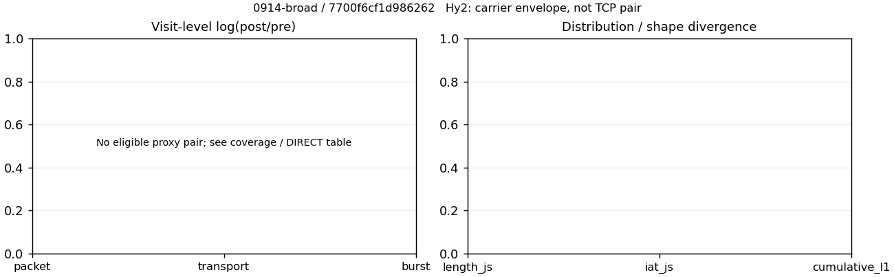

# 0914-broad · 条目 015 · gov.cn

目标：https://www.gov.cn/

活动标签：gov.cn::page_load。选定访问 3 次。

[返回总索引](../../README.md) · [统计口径](../../methods.md)

## 覆盖与资格（每次访问均保留）

| 部署 | 重复 | 主请求路由 | 活动状态 | 代理比较 | DIRECT pre | 请求 proxy/direct/unresolved | 错误 |
| --- | --- | --- | --- | --- | --- | --- | --- |
| Hy2 | 1 | direct | passed | 0 | 1 | 0/86/0 | [] |
| SS | 1 | direct | passed | 0 | 1 | 0/86/0 | [] |
| VLESS | 1 | direct | passed | 0 | 1 | 0/86/0 | [] |

主请求非 proxy 的统计仅解释为已索引的辅助代理连接或 DIRECT 观测，不代表目标业务经代理传输。播放确认与配对资格是两道不同的门。

图中散点为单次访问，短线为重复中位数；Hy2 是共享载体包络，不能与 TCP 配对作等范围因果对比。

形态图先逐访问归一化，再对访问等权平均；实线 pre，虚线 post。分箱序号及边界见 methods，不将分箱索引误解为长度或时间。

## 每次访问的关键观测

### SS

范围：`direct_pre_only`。每格 pre → post；空值为不可观测/不适用。

| 重复 | 包数 | 载荷字节 | burst | TCP FR | IAT中位µs | length JS | IAT JS |
| --- | --- | --- | --- | --- | --- | --- | --- |
| 1 | 1244 → — | 1.9332e+06 → — | 765 → — | 204 → — | 519.05 → — | — | — |

完整标量统计：中位数 [min,max]；Δ 为重复内逐访问变换的中位数，MAD 未缩放。n 为可用变换数；DIRECT-only 的 nΔ=0 不代表 pre 不可用。

| scope | 特征 | pre | post | Δ | IQRΔ | MADΔ | nΔ |
| --- | --- | --- | --- | --- | --- | --- | --- |
| direct_pre_only | active_span_sum_s_1000ms | 7.587 [7.587, 7.587] | — | — | — | — | 0 |
| direct_pre_only | active_span_sum_s_100ms | 5.6754 [5.6754, 5.6754] | — | — | — | — | 0 |
| direct_pre_only | active_span_sum_s_500ms | 7.587 [7.587, 7.587] | — | — | — | — | 0 |
| direct_pre_only | burst_bytes_iqr | 4703 [4703, 4703] | — | — | — | — | 0 |
| direct_pre_only | burst_bytes_mad | 645 [645, 645] | — | — | — | — | 0 |
| direct_pre_only | burst_bytes_max | 20480 [20480, 20480] | — | — | — | — | 0 |
| direct_pre_only | burst_bytes_mean | 2527 [2527, 2527] | — | — | — | — | 0 |
| direct_pre_only | burst_bytes_median | 645 [645, 645] | — | — | — | — | 0 |
| direct_pre_only | burst_bytes_min | 0 [0, 0] | — | — | — | — | 0 |
| direct_pre_only | burst_bytes_p95 | 8640 [8640, 8640] | — | — | — | — | 0 |
| direct_pre_only | burst_bytes_q25 | 0 [0, 0] | — | — | — | — | 0 |
| direct_pre_only | burst_bytes_q75 | 4703 [4703, 4703] | — | — | — | — | 0 |
| direct_pre_only | burst_bytes_std | 3619.7 [3619.7, 3619.7] | — | — | — | — | 0 |
| direct_pre_only | burst_count | 765 [765, 765] | — | — | — | — | 0 |
| direct_pre_only | burst_duration_ms_iqr | 1.8838 [1.8838, 1.8838] | — | — | — | — | 0 |
| direct_pre_only | burst_duration_ms_mad | 0.022371 [0.022371, 0.022371] | — | — | — | — | 0 |
| direct_pre_only | burst_duration_ms_max | 13107 [13107, 13107] | — | — | — | — | 0 |
| direct_pre_only | burst_duration_ms_mean | 42.921 [42.921, 42.921] | — | — | — | — | 0 |
| direct_pre_only | burst_duration_ms_median | 0.022371 [0.022371, 0.022371] | — | — | — | — | 0 |
| direct_pre_only | burst_duration_ms_min | 0 [0, 0] | — | — | — | — | 0 |
| direct_pre_only | burst_duration_ms_p95 | 37.972 [37.972, 37.972] | — | — | — | — | 0 |
| direct_pre_only | burst_duration_ms_q25 | 0 [0, 0] | — | — | — | — | 0 |
| direct_pre_only | burst_duration_ms_q75 | 1.8838 [1.8838, 1.8838] | — | — | — | — | 0 |
| direct_pre_only | burst_duration_ms_std | 665.6 [665.6, 665.6] | — | — | — | — | 0 |
| direct_pre_only | burst_packets_iqr | 1 [1, 1] | — | — | — | — | 0 |
| direct_pre_only | burst_packets_mad | 1 [1, 1] | — | — | — | — | 0 |
| direct_pre_only | burst_packets_max | 7 [7, 7] | — | — | — | — | 0 |
| direct_pre_only | burst_packets_mean | 1.6261 [1.6261, 1.6261] | — | — | — | — | 0 |
| direct_pre_only | burst_packets_median | 2 [2, 2] | — | — | — | — | 0 |
| direct_pre_only | burst_packets_min | 1 [1, 1] | — | — | — | — | 0 |
| direct_pre_only | burst_packets_p95 | 3 [3, 3] | — | — | — | — | 0 |
| direct_pre_only | burst_packets_q25 | 1 [1, 1] | — | — | — | — | 0 |
| direct_pre_only | burst_packets_q75 | 2 [2, 2] | — | — | — | — | 0 |
| direct_pre_only | burst_packets_std | 0.74542 [0.74542, 0.74542] | — | — | — | — | 0 |
| direct_pre_only | connection_span_concurrency_max | 12 [12, 12] | — | — | — | — | 0 |
| direct_pre_only | direction_entropy | 0.62649 [0.62649, 0.62649] | — | — | — | — | 0 |
| direct_pre_only | down_burst_count | 375 [375, 375] | — | — | — | — | 0 |
| direct_pre_only | down_ip_bytes | 1.8882e+06 [1.8882e+06, 1.8882e+06] | — | — | — | — | 0 |
| direct_pre_only | down_packets | 785 [785, 785] | — | — | — | — | 0 |
| direct_pre_only | down_transport_bytes | 1.8472e+06 [1.8472e+06, 1.8472e+06] | — | — | — | — | 0 |
| direct_pre_only | duration_s | 14.383 [14.383, 14.383] | — | — | — | — | 0 |
| direct_pre_only | entity_count | 15 [15, 15] | — | — | — | — | 0 |
| direct_pre_only | fr_runs | 204 [204, 204] | — | — | — | — | 0 |
| direct_pre_only | fr_runs_per_packet | 0.27568 [0.27568, 0.27568] | — | — | — | — | 0 |
| direct_pre_only | fr_switches | 189 [189, 189] | — | — | — | — | 0 |
| direct_pre_only | fr_switches_per_possible_transition | 0.26069 [0.26069, 0.26069] | — | — | — | — | 0 |
| direct_pre_only | full_retransmission_fraction | 0 [0, 0] | — | — | — | — | 0 |
| direct_pre_only | full_retransmission_packets | 0 [0, 0] | — | — | — | — | 0 |
| direct_pre_only | iat_count | 1229 [1229, 1229] | — | — | — | — | 0 |
| direct_pre_only | iat_median_us | 519.05 [519.05, 519.05] | — | — | — | — | 0 |
| direct_pre_only | iat_us_iqr | 1705.7 [1705.7, 1705.7] | — | — | — | — | 0 |
| direct_pre_only | iat_us_mad | 500.51 [500.51, 500.51] | — | — | — | — | 0 |
| direct_pre_only | iat_us_max | 1.3107e+07 [1.3107e+07, 1.3107e+07] | — | — | — | — | 0 |
| direct_pre_only | iat_us_mean | 27380 [27380, 27380] | — | — | — | — | 0 |
| direct_pre_only | iat_us_median | 519.05 [519.05, 519.05] | — | — | — | — | 0 |
| direct_pre_only | iat_us_min | 0.007 [0.007, 0.007] | — | — | — | — | 0 |
| direct_pre_only | iat_us_p95 | 36027 [36027, 36027] | — | — | — | — | 0 |
| direct_pre_only | iat_us_q25 | 57.249 [57.249, 57.249] | — | — | — | — | 0 |
| direct_pre_only | iat_us_q75 | 1763 [1763, 1763] | — | — | — | — | 0 |
| direct_pre_only | iat_us_std | 5.2552e+05 [5.2552e+05, 5.2552e+05] | — | — | — | — | 0 |
| direct_pre_only | idle_gap_count_1000ms | 2 [2, 2] | — | — | — | — | 0 |
| direct_pre_only | idle_gap_count_100ms | 11 [11, 11] | — | — | — | — | 0 |
| direct_pre_only | idle_gap_count_500ms | 2 [2, 2] | — | — | — | — | 0 |
| direct_pre_only | idle_gap_sum_s_1000ms | 26.063 [26.063, 26.063] | — | — | — | — | 0 |
| direct_pre_only | idle_gap_sum_s_100ms | 27.975 [27.975, 27.975] | — | — | — | — | 0 |
| direct_pre_only | idle_gap_sum_s_500ms | 26.063 [26.063, 26.063] | — | — | — | — | 0 |
| direct_pre_only | ip_bytes | 1.9981e+06 [1.9981e+06, 1.9981e+06] | — | — | — | — | 0 |
| direct_pre_only | length_iqr | 1440 [1440, 1440] | — | — | — | — | 0 |
| direct_pre_only | length_mad | 821.5 [821.5, 821.5] | — | — | — | — | 0 |
| direct_pre_only | length_max | 8920 [8920, 8920] | — | — | — | — | 0 |
| direct_pre_only | length_mean | 2612.4 [2612.4, 2612.4] | — | — | — | — | 0 |
| direct_pre_only | length_median | 2880 [2880, 2880] | — | — | — | — | 0 |
| direct_pre_only | length_min | 80 [80, 80] | — | — | — | — | 0 |
| direct_pre_only | length_p95 | 5760 [5760, 5760] | — | — | — | — | 0 |
| direct_pre_only | length_q25 | 1440 [1440, 1440] | — | — | — | — | 0 |
| direct_pre_only | length_q75 | 2880 [2880, 2880] | — | — | — | — | 0 |
| direct_pre_only | length_std | 1729.3 [1729.3, 1729.3] | — | — | — | — | 0 |
| direct_pre_only | nonempty_entity_count | 15 [15, 15] | — | — | — | — | 0 |
| direct_pre_only | nonempty_packets | 740 [740, 740] | — | — | — | — | 0 |
| direct_pre_only | offload_suspect_fraction | 0.40354 [0.40354, 0.40354] | — | — | — | — | 0 |
| direct_pre_only | packet_count | 1244 [1244, 1244] | — | — | — | — | 0 |
| direct_pre_only | rtt_median_ms | 0.45371 [0.45371, 0.45371] | — | — | — | — | 0 |
| direct_pre_only | rtt_sample_count | 507 [507, 507] | — | — | — | — | 0 |
| direct_pre_only | tcp_ack_count | 1229 [1229, 1229] | — | — | — | — | 0 |
| direct_pre_only | tcp_fin_count | 30 [30, 30] | — | — | — | — | 0 |
| direct_pre_only | tcp_packet_count | 1244 [1244, 1244] | — | — | — | — | 0 |
| direct_pre_only | tcp_rst_count | 0 [0, 0] | — | — | — | — | 0 |
| direct_pre_only | tcp_syn_count | 30 [30, 30] | — | — | — | — | 0 |
| direct_pre_only | tcp_window_raw_median | 65535 [65535, 65535] | — | — | — | — | 0 |
| direct_pre_only | transition_entropy | 0.58202 [0.58202, 0.58202] | — | — | — | — | 0 |
| direct_pre_only | transition_n_mm | 522 [522, 522] | — | — | — | — | 0 |
| direct_pre_only | transition_n_mp | 87 [87, 87] | — | — | — | — | 0 |
| direct_pre_only | transition_n_pm | 102 [102, 102] | — | — | — | — | 0 |
| direct_pre_only | transition_n_pp | 14 [14, 14] | — | — | — | — | 0 |
| direct_pre_only | transition_p_mm | 0.85714 [0.85714, 0.85714] | — | — | — | — | 0 |
| direct_pre_only | transition_p_mp | 0.14286 [0.14286, 0.14286] | — | — | — | — | 0 |
| direct_pre_only | transition_p_pm | 0.87931 [0.87931, 0.87931] | — | — | — | — | 0 |
| direct_pre_only | transition_p_pp | 0.12069 [0.12069, 0.12069] | — | — | — | — | 0 |
| direct_pre_only | transport_bytes | 1.9332e+06 [1.9332e+06, 1.9332e+06] | — | — | — | — | 0 |
| direct_pre_only | up_burst_count | 390 [390, 390] | — | — | — | — | 0 |
| direct_pre_only | up_byte_fraction | 0.044459 [0.044459, 0.044459] | — | — | — | — | 0 |
| direct_pre_only | up_ip_bytes | 1.0993e+05 [1.0993e+05, 1.0993e+05] | — | — | — | — | 0 |
| direct_pre_only | up_packets | 459 [459, 459] | — | — | — | — | 0 |
| direct_pre_only | up_transport_bytes | 85946 [85946, 85946] | — | — | — | — | 0 |
| direct_pre_only | zero_iat_count | 0 [0, 0] | — | — | — | — | 0 |
| direct_pre_only | zero_iat_fraction | 0 [0, 0] | — | — | — | — | 0 |

### VLESS

范围：`direct_pre_only`。每格 pre → post；空值为不可观测/不适用。

| 重复 | 包数 | 载荷字节 | burst | TCP FR | IAT中位µs | length JS | IAT JS |
| --- | --- | --- | --- | --- | --- | --- | --- |
| 1 | 962 → — | 1.9342e+06 → — | 557 → — | 194 → — | 156.84 → — | — | — |

完整标量统计：中位数 [min,max]；Δ 为重复内逐访问变换的中位数，MAD 未缩放。n 为可用变换数；DIRECT-only 的 nΔ=0 不代表 pre 不可用。

| scope | 特征 | pre | post | Δ | IQRΔ | MADΔ | nΔ |
| --- | --- | --- | --- | --- | --- | --- | --- |
| direct_pre_only | active_span_sum_s_1000ms | 6.5567 [6.5567, 6.5567] | — | — | — | — | 0 |
| direct_pre_only | active_span_sum_s_100ms | 3.0248 [3.0248, 3.0248] | — | — | — | — | 0 |
| direct_pre_only | active_span_sum_s_500ms | 6.0049 [6.0049, 6.0049] | — | — | — | — | 0 |
| direct_pre_only | burst_bytes_iqr | 4096 [4096, 4096] | — | — | — | — | 0 |
| direct_pre_only | burst_bytes_mad | 649 [649, 649] | — | — | — | — | 0 |
| direct_pre_only | burst_bytes_max | 22766 [22766, 22766] | — | — | — | — | 0 |
| direct_pre_only | burst_bytes_mean | 3472.5 [3472.5, 3472.5] | — | — | — | — | 0 |
| direct_pre_only | burst_bytes_median | 649 [649, 649] | — | — | — | — | 0 |
| direct_pre_only | burst_bytes_min | 0 [0, 0] | — | — | — | — | 0 |
| direct_pre_only | burst_bytes_p95 | 20480 [20480, 20480] | — | — | — | — | 0 |
| direct_pre_only | burst_bytes_q25 | 0 [0, 0] | — | — | — | — | 0 |
| direct_pre_only | burst_bytes_q75 | 4096 [4096, 4096] | — | — | — | — | 0 |
| direct_pre_only | burst_bytes_std | 5708.5 [5708.5, 5708.5] | — | — | — | — | 0 |
| direct_pre_only | burst_count | 557 [557, 557] | — | — | — | — | 0 |
| direct_pre_only | burst_duration_ms_iqr | 4.743 [4.743, 4.743] | — | — | — | — | 0 |
| direct_pre_only | burst_duration_ms_mad | 0 [0, 0] | — | — | — | — | 0 |
| direct_pre_only | burst_duration_ms_max | 2196.4 [2196.4, 2196.4] | — | — | — | — | 0 |
| direct_pre_only | burst_duration_ms_mean | 19.881 [19.881, 19.881] | — | — | — | — | 0 |
| direct_pre_only | burst_duration_ms_median | 0 [0, 0] | — | — | — | — | 0 |
| direct_pre_only | burst_duration_ms_min | 0 [0, 0] | — | — | — | — | 0 |
| direct_pre_only | burst_duration_ms_p95 | 28.23 [28.23, 28.23] | — | — | — | — | 0 |
| direct_pre_only | burst_duration_ms_q25 | 0 [0, 0] | — | — | — | — | 0 |
| direct_pre_only | burst_duration_ms_q75 | 4.743 [4.743, 4.743] | — | — | — | — | 0 |
| direct_pre_only | burst_duration_ms_std | 142.78 [142.78, 142.78] | — | — | — | — | 0 |
| direct_pre_only | burst_packets_iqr | 1 [1, 1] | — | — | — | — | 0 |
| direct_pre_only | burst_packets_mad | 0 [0, 0] | — | — | — | — | 0 |
| direct_pre_only | burst_packets_max | 8 [8, 8] | — | — | — | — | 0 |
| direct_pre_only | burst_packets_mean | 1.7271 [1.7271, 1.7271] | — | — | — | — | 0 |
| direct_pre_only | burst_packets_median | 1 [1, 1] | — | — | — | — | 0 |
| direct_pre_only | burst_packets_min | 1 [1, 1] | — | — | — | — | 0 |
| direct_pre_only | burst_packets_p95 | 4 [4, 4] | — | — | — | — | 0 |
| direct_pre_only | burst_packets_q25 | 1 [1, 1] | — | — | — | — | 0 |
| direct_pre_only | burst_packets_q75 | 2 [2, 2] | — | — | — | — | 0 |
| direct_pre_only | burst_packets_std | 1.0349 [1.0349, 1.0349] | — | — | — | — | 0 |
| direct_pre_only | connection_span_concurrency_max | 10 [10, 10] | — | — | — | — | 0 |
| direct_pre_only | direction_entropy | 0.69552 [0.69552, 0.69552] | — | — | — | — | 0 |
| direct_pre_only | down_burst_count | 273 [273, 273] | — | — | — | — | 0 |
| direct_pre_only | down_ip_bytes | 1.8885e+06 [1.8885e+06, 1.8885e+06] | — | — | — | — | 0 |
| direct_pre_only | down_packets | 610 [610, 610] | — | — | — | — | 0 |
| direct_pre_only | down_transport_bytes | 1.8567e+06 [1.8567e+06, 1.8567e+06] | — | — | — | — | 0 |
| direct_pre_only | duration_s | 4.4926 [4.4926, 4.4926] | — | — | — | — | 0 |
| direct_pre_only | entity_count | 11 [11, 11] | — | — | — | — | 0 |
| direct_pre_only | fr_runs | 194 [194, 194] | — | — | — | — | 0 |
| direct_pre_only | fr_runs_per_packet | 0.33622 [0.33622, 0.33622] | — | — | — | — | 0 |
| direct_pre_only | fr_switches | 183 [183, 183] | — | — | — | — | 0 |
| direct_pre_only | fr_switches_per_possible_transition | 0.32332 [0.32332, 0.32332] | — | — | — | — | 0 |
| direct_pre_only | full_retransmission_fraction | 0.004158 [0.004158, 0.004158] | — | — | — | — | 0 |
| direct_pre_only | full_retransmission_packets | 4 [4, 4] | — | — | — | — | 0 |
| direct_pre_only | iat_count | 951 [951, 951] | — | — | — | — | 0 |
| direct_pre_only | iat_median_us | 156.84 [156.84, 156.84] | — | — | — | — | 0 |
| direct_pre_only | iat_us_iqr | 1696.6 [1696.6, 1696.6] | — | — | — | — | 0 |
| direct_pre_only | iat_us_mad | 147.33 [147.33, 147.33] | — | — | — | — | 0 |
| direct_pre_only | iat_us_max | 2.1964e+06 [2.1964e+06, 2.1964e+06] | — | — | — | — | 0 |
| direct_pre_only | iat_us_mean | 12695 [12695, 12695] | — | — | — | — | 0 |
| direct_pre_only | iat_us_median | 156.84 [156.84, 156.84] | — | — | — | — | 0 |
| direct_pre_only | iat_us_min | 0.056 [0.056, 0.056] | — | — | — | — | 0 |
| direct_pre_only | iat_us_p95 | 19373 [19373, 19373] | — | — | — | — | 0 |
| direct_pre_only | iat_us_q25 | 30.578 [30.578, 30.578] | — | — | — | — | 0 |
| direct_pre_only | iat_us_q75 | 1727.2 [1727.2, 1727.2] | — | — | — | — | 0 |
| direct_pre_only | iat_us_std | 1.0975e+05 [1.0975e+05, 1.0975e+05] | — | — | — | — | 0 |
| direct_pre_only | idle_gap_count_1000ms | 3 [3, 3] | — | — | — | — | 0 |
| direct_pre_only | idle_gap_count_100ms | 16 [16, 16] | — | — | — | — | 0 |
| direct_pre_only | idle_gap_count_500ms | 4 [4, 4] | — | — | — | — | 0 |
| direct_pre_only | idle_gap_sum_s_1000ms | 5.5161 [5.5161, 5.5161] | — | — | — | — | 0 |
| direct_pre_only | idle_gap_sum_s_100ms | 9.0481 [9.0481, 9.0481] | — | — | — | — | 0 |
| direct_pre_only | idle_gap_sum_s_500ms | 6.068 [6.068, 6.068] | — | — | — | — | 0 |
| direct_pre_only | ip_bytes | 1.9844e+06 [1.9844e+06, 1.9844e+06] | — | — | — | — | 0 |
| direct_pre_only | length_iqr | 4099 [4099, 4099] | — | — | — | — | 0 |
| direct_pre_only | length_mad | 1937 [1937, 1937] | — | — | — | — | 0 |
| direct_pre_only | length_max | 8920 [8920, 8920] | — | — | — | — | 0 |
| direct_pre_only | length_mean | 3352.1 [3352.1, 3352.1] | — | — | — | — | 0 |
| direct_pre_only | length_median | 2880 [2880, 2880] | — | — | — | — | 0 |
| direct_pre_only | length_min | 40 [40, 40] | — | — | — | — | 0 |
| direct_pre_only | length_p95 | 8920 [8920, 8920] | — | — | — | — | 0 |
| direct_pre_only | length_q25 | 955 [955, 955] | — | — | — | — | 0 |
| direct_pre_only | length_q75 | 5054 [5054, 5054] | — | — | — | — | 0 |
| direct_pre_only | length_std | 2813.7 [2813.7, 2813.7] | — | — | — | — | 0 |
| direct_pre_only | nonempty_entity_count | 11 [11, 11] | — | — | — | — | 0 |
| direct_pre_only | nonempty_packets | 577 [577, 577] | — | — | — | — | 0 |
| direct_pre_only | offload_suspect_fraction | 0.38358 [0.38358, 0.38358] | — | — | — | — | 0 |
| direct_pre_only | packet_count | 962 [962, 962] | — | — | — | — | 0 |
| direct_pre_only | rtt_median_ms | 0.1574 [0.1574, 0.1574] | — | — | — | — | 0 |
| direct_pre_only | rtt_sample_count | 392 [392, 392] | — | — | — | — | 0 |
| direct_pre_only | tcp_ack_count | 951 [951, 951] | — | — | — | — | 0 |
| direct_pre_only | tcp_fin_count | 22 [22, 22] | — | — | — | — | 0 |
| direct_pre_only | tcp_packet_count | 962 [962, 962] | — | — | — | — | 0 |
| direct_pre_only | tcp_rst_count | 0 [0, 0] | — | — | — | — | 0 |
| direct_pre_only | tcp_syn_count | 22 [22, 22] | — | — | — | — | 0 |
| direct_pre_only | tcp_window_raw_median | 65535 [65535, 65535] | — | — | — | — | 0 |
| direct_pre_only | transition_entropy | 0.65444 [0.65444, 0.65444] | — | — | — | — | 0 |
| direct_pre_only | transition_n_mm | 372 [372, 372] | — | — | — | — | 0 |
| direct_pre_only | transition_n_mp | 86 [86, 86] | — | — | — | — | 0 |
| direct_pre_only | transition_n_pm | 97 [97, 97] | — | — | — | — | 0 |
| direct_pre_only | transition_n_pp | 11 [11, 11] | — | — | — | — | 0 |
| direct_pre_only | transition_p_mm | 0.81223 [0.81223, 0.81223] | — | — | — | — | 0 |
| direct_pre_only | transition_p_mp | 0.18777 [0.18777, 0.18777] | — | — | — | — | 0 |
| direct_pre_only | transition_p_pm | 0.89815 [0.89815, 0.89815] | — | — | — | — | 0 |
| direct_pre_only | transition_p_pp | 0.10185 [0.10185, 0.10185] | — | — | — | — | 0 |
| direct_pre_only | transport_bytes | 1.9342e+06 [1.9342e+06, 1.9342e+06] | — | — | — | — | 0 |
| direct_pre_only | up_burst_count | 284 [284, 284] | — | — | — | — | 0 |
| direct_pre_only | up_byte_fraction | 0.040056 [0.040056, 0.040056] | — | — | — | — | 0 |
| direct_pre_only | up_ip_bytes | 95915 [95915, 95915] | — | — | — | — | 0 |
| direct_pre_only | up_packets | 352 [352, 352] | — | — | — | — | 0 |
| direct_pre_only | up_transport_bytes | 77475 [77475, 77475] | — | — | — | — | 0 |
| direct_pre_only | zero_iat_count | 0 [0, 0] | — | — | — | — | 0 |
| direct_pre_only | zero_iat_fraction | 0 [0, 0] | — | — | — | — | 0 |

### Hy2

范围：`direct_pre_only`。每格 pre → post；空值为不可观测/不适用。

| 重复 | 包数 | 载荷字节 | burst | TCP FR | IAT中位µs | length JS | IAT JS |
| --- | --- | --- | --- | --- | --- | --- | --- |
| 1 | 910 → — | 1.9181e+06 → — | 514 → — | 194 → — | 132.94 → — | — | — |

完整标量统计：中位数 [min,max]；Δ 为重复内逐访问变换的中位数，MAD 未缩放。n 为可用变换数；DIRECT-only 的 nΔ=0 不代表 pre 不可用。

| scope | 特征 | pre | post | Δ | IQRΔ | MADΔ | nΔ |
| --- | --- | --- | --- | --- | --- | --- | --- |
| direct_pre_only | active_span_sum_s_1000ms | 10.379 [10.379, 10.379] | — | — | — | — | 0 |
| direct_pre_only | active_span_sum_s_100ms | 2.6245 [2.6245, 2.6245] | — | — | — | — | 0 |
| direct_pre_only | active_span_sum_s_500ms | 5.927 [5.927, 5.927] | — | — | — | — | 0 |
| direct_pre_only | burst_bytes_iqr | 4394.2 [4394.2, 4394.2] | — | — | — | — | 0 |
| direct_pre_only | burst_bytes_mad | 651.5 [651.5, 651.5] | — | — | — | — | 0 |
| direct_pre_only | burst_bytes_max | 20480 [20480, 20480] | — | — | — | — | 0 |
| direct_pre_only | burst_bytes_mean | 3731.6 [3731.6, 3731.6] | — | — | — | — | 0 |
| direct_pre_only | burst_bytes_median | 651.5 [651.5, 651.5] | — | — | — | — | 0 |
| direct_pre_only | burst_bytes_min | 0 [0, 0] | — | — | — | — | 0 |
| direct_pre_only | burst_bytes_p95 | 20480 [20480, 20480] | — | — | — | — | 0 |
| direct_pre_only | burst_bytes_q25 | 0 [0, 0] | — | — | — | — | 0 |
| direct_pre_only | burst_bytes_q75 | 4394.2 [4394.2, 4394.2] | — | — | — | — | 0 |
| direct_pre_only | burst_bytes_std | 5904.8 [5904.8, 5904.8] | — | — | — | — | 0 |
| direct_pre_only | burst_count | 514 [514, 514] | — | — | — | — | 0 |
| direct_pre_only | burst_duration_ms_iqr | 2.9278 [2.9278, 2.9278] | — | — | — | — | 0 |
| direct_pre_only | burst_duration_ms_mad | 0.020754 [0.020754, 0.020754] | — | — | — | — | 0 |
| direct_pre_only | burst_duration_ms_max | 828.53 [828.53, 828.53] | — | — | — | — | 0 |
| direct_pre_only | burst_duration_ms_mean | 18.32 [18.32, 18.32] | — | — | — | — | 0 |
| direct_pre_only | burst_duration_ms_median | 0.020754 [0.020754, 0.020754] | — | — | — | — | 0 |
| direct_pre_only | burst_duration_ms_min | 0 [0, 0] | — | — | — | — | 0 |
| direct_pre_only | burst_duration_ms_p95 | 47.632 [47.632, 47.632] | — | — | — | — | 0 |
| direct_pre_only | burst_duration_ms_q25 | 0 [0, 0] | — | — | — | — | 0 |
| direct_pre_only | burst_duration_ms_q75 | 2.9278 [2.9278, 2.9278] | — | — | — | — | 0 |
| direct_pre_only | burst_duration_ms_std | 89.872 [89.872, 89.872] | — | — | — | — | 0 |
| direct_pre_only | burst_packets_iqr | 1 [1, 1] | — | — | — | — | 0 |
| direct_pre_only | burst_packets_mad | 1 [1, 1] | — | — | — | — | 0 |
| direct_pre_only | burst_packets_max | 7 [7, 7] | — | — | — | — | 0 |
| direct_pre_only | burst_packets_mean | 1.7704 [1.7704, 1.7704] | — | — | — | — | 0 |
| direct_pre_only | burst_packets_median | 2 [2, 2] | — | — | — | — | 0 |
| direct_pre_only | burst_packets_min | 1 [1, 1] | — | — | — | — | 0 |
| direct_pre_only | burst_packets_p95 | 3 [3, 3] | — | — | — | — | 0 |
| direct_pre_only | burst_packets_q25 | 1 [1, 1] | — | — | — | — | 0 |
| direct_pre_only | burst_packets_q75 | 2 [2, 2] | — | — | — | — | 0 |
| direct_pre_only | burst_packets_std | 0.94283 [0.94283, 0.94283] | — | — | — | — | 0 |
| direct_pre_only | connection_span_concurrency_max | 10 [10, 10] | — | — | — | — | 0 |
| direct_pre_only | direction_entropy | 0.70714 [0.70714, 0.70714] | — | — | — | — | 0 |
| direct_pre_only | down_burst_count | 252 [252, 252] | — | — | — | — | 0 |
| direct_pre_only | down_ip_bytes | 1.8728e+06 [1.8728e+06, 1.8728e+06] | — | — | — | — | 0 |
| direct_pre_only | down_packets | 580 [580, 580] | — | — | — | — | 0 |
| direct_pre_only | down_transport_bytes | 1.8425e+06 [1.8425e+06, 1.8425e+06] | — | — | — | — | 0 |
| direct_pre_only | duration_s | 1.241 [1.241, 1.241] | — | — | — | — | 0 |
| direct_pre_only | entity_count | 10 [10, 10] | — | — | — | — | 0 |
| direct_pre_only | fr_runs | 194 [194, 194] | — | — | — | — | 0 |
| direct_pre_only | fr_runs_per_packet | 0.35273 [0.35273, 0.35273] | — | — | — | — | 0 |
| direct_pre_only | fr_switches | 184 [184, 184] | — | — | — | — | 0 |
| direct_pre_only | fr_switches_per_possible_transition | 0.34074 [0.34074, 0.34074] | — | — | — | — | 0 |
| direct_pre_only | full_retransmission_fraction | 0.0010989 [0.0010989, 0.0010989] | — | — | — | — | 0 |
| direct_pre_only | full_retransmission_packets | 1 [1, 1] | — | — | — | — | 0 |
| direct_pre_only | iat_count | 900 [900, 900] | — | — | — | — | 0 |
| direct_pre_only | iat_median_us | 132.94 [132.94, 132.94] | — | — | — | — | 0 |
| direct_pre_only | iat_us_iqr | 1974.2 [1974.2, 1974.2] | — | — | — | — | 0 |
| direct_pre_only | iat_us_mad | 123.56 [123.56, 123.56] | — | — | — | — | 0 |
| direct_pre_only | iat_us_max | 8.2853e+05 [8.2853e+05, 8.2853e+05] | — | — | — | — | 0 |
| direct_pre_only | iat_us_mean | 11533 [11533, 11533] | — | — | — | — | 0 |
| direct_pre_only | iat_us_median | 132.94 [132.94, 132.94] | — | — | — | — | 0 |
| direct_pre_only | iat_us_min | 2.143 [2.143, 2.143] | — | — | — | — | 0 |
| direct_pre_only | iat_us_p95 | 30123 [30123, 30123] | — | — | — | — | 0 |
| direct_pre_only | iat_us_q25 | 27.147 [27.147, 27.147] | — | — | — | — | 0 |
| direct_pre_only | iat_us_q75 | 2001.4 [2001.4, 2001.4] | — | — | — | — | 0 |
| direct_pre_only | iat_us_std | 68544 [68544, 68544] | — | — | — | — | 0 |
| direct_pre_only | idle_gap_count_1000ms | 0 [0, 0] | — | — | — | — | 0 |
| direct_pre_only | idle_gap_count_100ms | 19 [19, 19] | — | — | — | — | 0 |
| direct_pre_only | idle_gap_count_500ms | 6 [6, 6] | — | — | — | — | 0 |
| direct_pre_only | idle_gap_sum_s_1000ms | 0 [0, 0] | — | — | — | — | 0 |
| direct_pre_only | idle_gap_sum_s_100ms | 7.7549 [7.7549, 7.7549] | — | — | — | — | 0 |
| direct_pre_only | idle_gap_sum_s_500ms | 4.4524 [4.4524, 4.4524] | — | — | — | — | 0 |
| direct_pre_only | ip_bytes | 1.9656e+06 [1.9656e+06, 1.9656e+06] | — | — | — | — | 0 |
| direct_pre_only | length_iqr | 4608.8 [4608.8, 4608.8] | — | — | — | — | 0 |
| direct_pre_only | length_mad | 2143 [2143, 2143] | — | — | — | — | 0 |
| direct_pre_only | length_max | 8920 [8920, 8920] | — | — | — | — | 0 |
| direct_pre_only | length_mean | 3487.4 [3487.4, 3487.4] | — | — | — | — | 0 |
| direct_pre_only | length_median | 2880 [2880, 2880] | — | — | — | — | 0 |
| direct_pre_only | length_min | 80 [80, 80] | — | — | — | — | 0 |
| direct_pre_only | length_p95 | 8920 [8920, 8920] | — | — | — | — | 0 |
| direct_pre_only | length_q25 | 1151.2 [1151.2, 1151.2] | — | — | — | — | 0 |
| direct_pre_only | length_q75 | 5760 [5760, 5760] | — | — | — | — | 0 |
| direct_pre_only | length_std | 2820.1 [2820.1, 2820.1] | — | — | — | — | 0 |
| direct_pre_only | nonempty_entity_count | 10 [10, 10] | — | — | — | — | 0 |
| direct_pre_only | nonempty_packets | 550 [550, 550] | — | — | — | — | 0 |
| direct_pre_only | offload_suspect_fraction | 0.4 [0.4, 0.4] | — | — | — | — | 0 |
| direct_pre_only | packet_count | 910 [910, 910] | — | — | — | — | 0 |
| direct_pre_only | rtt_median_ms | 0.14115 [0.14115, 0.14115] | — | — | — | — | 0 |
| direct_pre_only | rtt_sample_count | 369 [369, 369] | — | — | — | — | 0 |
| direct_pre_only | tcp_ack_count | 900 [900, 900] | — | — | — | — | 0 |
| direct_pre_only | tcp_fin_count | 20 [20, 20] | — | — | — | — | 0 |
| direct_pre_only | tcp_packet_count | 910 [910, 910] | — | — | — | — | 0 |
| direct_pre_only | tcp_rst_count | 0 [0, 0] | — | — | — | — | 0 |
| direct_pre_only | tcp_syn_count | 20 [20, 20] | — | — | — | — | 0 |
| direct_pre_only | tcp_window_raw_median | 65535 [65535, 65535] | — | — | — | — | 0 |
| direct_pre_only | transition_entropy | 0.66325 [0.66325, 0.66325] | — | — | — | — | 0 |
| direct_pre_only | transition_n_mm | 347 [347, 347] | — | — | — | — | 0 |
| direct_pre_only | transition_n_mp | 87 [87, 87] | — | — | — | — | 0 |
| direct_pre_only | transition_n_pm | 97 [97, 97] | — | — | — | — | 0 |
| direct_pre_only | transition_n_pp | 9 [9, 9] | — | — | — | — | 0 |
| direct_pre_only | transition_p_mm | 0.79954 [0.79954, 0.79954] | — | — | — | — | 0 |
| direct_pre_only | transition_p_mp | 0.20046 [0.20046, 0.20046] | — | — | — | — | 0 |
| direct_pre_only | transition_p_pm | 0.91509 [0.91509, 0.91509] | — | — | — | — | 0 |
| direct_pre_only | transition_p_pp | 0.084906 [0.084906, 0.084906] | — | — | — | — | 0 |
| direct_pre_only | transport_bytes | 1.9181e+06 [1.9181e+06, 1.9181e+06] | — | — | — | — | 0 |
| direct_pre_only | up_burst_count | 262 [262, 262] | — | — | — | — | 0 |
| direct_pre_only | up_byte_fraction | 0.039379 [0.039379, 0.039379] | — | — | — | — | 0 |
| direct_pre_only | up_ip_bytes | 92783 [92783, 92783] | — | — | — | — | 0 |
| direct_pre_only | up_packets | 330 [330, 330] | — | — | — | — | 0 |
| direct_pre_only | up_transport_bytes | 75531 [75531, 75531] | — | — | — | — | 0 |
| direct_pre_only | zero_iat_count | 0 [0, 0] | — | — | — | — | 0 |
| direct_pre_only | zero_iat_fraction | 0 [0, 0] | — | — | — | — | 0 |

## 不同部署对比

以下是各部署自身重复中位数的差异，不按重复编号强行配对。跨 TCP/Hy2 的行标记异质观测范围。

| 视角 | 特征 | 部署A | 部署B | A中位 | B中位 | B−A | 比较口径 |
| --- | --- | --- | --- | --- | --- | --- | --- |
| pre | burst_count | SS | VLESS | 765 | 557 | -208 | same_scope_unpaired_visits |
| pre | burst_count | SS | Hy2 | 765 | 514 | -251 | same_scope_unpaired_visits |
| pre | burst_count | VLESS | Hy2 | 557 | 514 | -43 | same_scope_unpaired_visits |
| pre | connection_span_concurrency_max | SS | VLESS | 12 | 10 | -2 | same_scope_unpaired_visits |
| pre | connection_span_concurrency_max | SS | Hy2 | 12 | 10 | -2 | same_scope_unpaired_visits |
| pre | connection_span_concurrency_max | VLESS | Hy2 | 10 | 10 | 0 | same_scope_unpaired_visits |
| pre | direction_entropy | SS | VLESS | 0.62649 | 0.69552 | 0.06903 | same_scope_unpaired_visits |
| pre | direction_entropy | SS | Hy2 | 0.62649 | 0.70714 | 0.080648 | same_scope_unpaired_visits |
| pre | direction_entropy | VLESS | Hy2 | 0.69552 | 0.70714 | 0.011618 | same_scope_unpaired_visits |
| pre | down_transport_bytes | SS | VLESS | 1.8472e+06 | 1.8567e+06 | 9500 | same_scope_unpaired_visits |
| pre | down_transport_bytes | SS | Hy2 | 1.8472e+06 | 1.8425e+06 | -4677 | same_scope_unpaired_visits |
| pre | down_transport_bytes | VLESS | Hy2 | 1.8567e+06 | 1.8425e+06 | -14177 | same_scope_unpaired_visits |
| pre | duration_s | SS | VLESS | 14.383 | 4.4926 | -9.8908 | same_scope_unpaired_visits |
| pre | duration_s | SS | Hy2 | 14.383 | 1.241 | -13.142 | same_scope_unpaired_visits |
| pre | duration_s | VLESS | Hy2 | 4.4926 | 1.241 | -3.2516 | same_scope_unpaired_visits |
| pre | entity_count | SS | VLESS | 15 | 11 | -4 | same_scope_unpaired_visits |
| pre | entity_count | SS | Hy2 | 15 | 10 | -5 | same_scope_unpaired_visits |
| pre | entity_count | VLESS | Hy2 | 11 | 10 | -1 | same_scope_unpaired_visits |
| pre | fr_runs | SS | VLESS | 204 | 194 | -10 | same_scope_unpaired_visits |
| pre | fr_runs | SS | Hy2 | 204 | 194 | -10 | same_scope_unpaired_visits |
| pre | fr_runs | VLESS | Hy2 | 194 | 194 | 0 | same_scope_unpaired_visits |
| pre | fr_runs_per_packet | SS | VLESS | 0.27568 | 0.33622 | 0.060546 | same_scope_unpaired_visits |
| pre | fr_runs_per_packet | SS | Hy2 | 0.27568 | 0.35273 | 0.077052 | same_scope_unpaired_visits |
| pre | fr_runs_per_packet | VLESS | Hy2 | 0.33622 | 0.35273 | 0.016505 | same_scope_unpaired_visits |
| pre | fr_switches | SS | VLESS | 189 | 183 | -6 | same_scope_unpaired_visits |
| pre | fr_switches | SS | Hy2 | 189 | 184 | -5 | same_scope_unpaired_visits |
| pre | fr_switches | VLESS | Hy2 | 183 | 184 | 1 | same_scope_unpaired_visits |
| pre | fr_switches_per_possible_transition | SS | VLESS | 0.26069 | 0.32332 | 0.062632 | same_scope_unpaired_visits |
| pre | fr_switches_per_possible_transition | SS | Hy2 | 0.26069 | 0.34074 | 0.080051 | same_scope_unpaired_visits |
| pre | fr_switches_per_possible_transition | VLESS | Hy2 | 0.32332 | 0.34074 | 0.017419 | same_scope_unpaired_visits |
| pre | full_retransmission_fraction | SS | VLESS | 0 | 0.004158 | 0.004158 | same_scope_unpaired_visits |
| pre | full_retransmission_fraction | SS | Hy2 | 0 | 0.0010989 | 0.0010989 | same_scope_unpaired_visits |
| pre | full_retransmission_fraction | VLESS | Hy2 | 0.004158 | 0.0010989 | -0.0030591 | same_scope_unpaired_visits |
| pre | iat_median_us | SS | VLESS | 519.05 | 156.84 | -362.21 | same_scope_unpaired_visits |
| pre | iat_median_us | SS | Hy2 | 519.05 | 132.94 | -386.11 | same_scope_unpaired_visits |
| pre | iat_median_us | VLESS | Hy2 | 156.84 | 132.94 | -23.9 | same_scope_unpaired_visits |
| pre | iat_us_p95 | SS | VLESS | 36027 | 19373 | -16654 | same_scope_unpaired_visits |
| pre | iat_us_p95 | SS | Hy2 | 36027 | 30123 | -5904.1 | same_scope_unpaired_visits |
| pre | iat_us_p95 | VLESS | Hy2 | 19373 | 30123 | 10750 | same_scope_unpaired_visits |
| pre | ip_bytes | SS | VLESS | 1.9981e+06 | 1.9844e+06 | -13651 | same_scope_unpaired_visits |
| pre | ip_bytes | SS | Hy2 | 1.9981e+06 | 1.9656e+06 | -32528 | same_scope_unpaired_visits |
| pre | ip_bytes | VLESS | Hy2 | 1.9844e+06 | 1.9656e+06 | -18877 | same_scope_unpaired_visits |
| pre | length_median | SS | VLESS | 2880 | 2880 | 0 | same_scope_unpaired_visits |
| pre | length_median | SS | Hy2 | 2880 | 2880 | 0 | same_scope_unpaired_visits |
| pre | length_median | VLESS | Hy2 | 2880 | 2880 | 0 | same_scope_unpaired_visits |
| pre | length_p95 | SS | VLESS | 5760 | 8920 | 3160 | same_scope_unpaired_visits |
| pre | length_p95 | SS | Hy2 | 5760 | 8920 | 3160 | same_scope_unpaired_visits |
| pre | length_p95 | VLESS | Hy2 | 8920 | 8920 | 0 | same_scope_unpaired_visits |
| pre | nonempty_packets | SS | VLESS | 740 | 577 | -163 | same_scope_unpaired_visits |
| pre | nonempty_packets | SS | Hy2 | 740 | 550 | -190 | same_scope_unpaired_visits |
| pre | nonempty_packets | VLESS | Hy2 | 577 | 550 | -27 | same_scope_unpaired_visits |
| pre | offload_suspect_fraction | SS | VLESS | 0.40354 | 0.38358 | -0.019961 | same_scope_unpaired_visits |
| pre | offload_suspect_fraction | SS | Hy2 | 0.40354 | 0.4 | -0.003537 | same_scope_unpaired_visits |
| pre | offload_suspect_fraction | VLESS | Hy2 | 0.38358 | 0.4 | 0.016424 | same_scope_unpaired_visits |
| pre | packet_count | SS | VLESS | 1244 | 962 | -282 | same_scope_unpaired_visits |
| pre | packet_count | SS | Hy2 | 1244 | 910 | -334 | same_scope_unpaired_visits |
| pre | packet_count | VLESS | Hy2 | 962 | 910 | -52 | same_scope_unpaired_visits |
| pre | rtt_median_ms | SS | VLESS | 0.45371 | 0.1574 | -0.29632 | same_scope_unpaired_visits |
| pre | rtt_median_ms | SS | Hy2 | 0.45371 | 0.14115 | -0.31256 | same_scope_unpaired_visits |
| pre | rtt_median_ms | VLESS | Hy2 | 0.1574 | 0.14115 | -0.016243 | same_scope_unpaired_visits |
| pre | transition_entropy | SS | VLESS | 0.58202 | 0.65444 | 0.072419 | same_scope_unpaired_visits |
| pre | transition_entropy | SS | Hy2 | 0.58202 | 0.66325 | 0.081231 | same_scope_unpaired_visits |
| pre | transition_entropy | VLESS | Hy2 | 0.65444 | 0.66325 | 0.0088119 | same_scope_unpaired_visits |
| pre | transport_bytes | SS | VLESS | 1.9332e+06 | 1.9342e+06 | 1029 | same_scope_unpaired_visits |
| pre | transport_bytes | SS | Hy2 | 1.9332e+06 | 1.9181e+06 | -15092 | same_scope_unpaired_visits |
| pre | transport_bytes | VLESS | Hy2 | 1.9342e+06 | 1.9181e+06 | -16121 | same_scope_unpaired_visits |
| pre | up_byte_fraction | SS | VLESS | 0.044459 | 0.040056 | -0.0044033 | same_scope_unpaired_visits |
| pre | up_byte_fraction | SS | Hy2 | 0.044459 | 0.039379 | -0.0050801 | same_scope_unpaired_visits |
| pre | up_byte_fraction | VLESS | Hy2 | 0.040056 | 0.039379 | -0.00067686 | same_scope_unpaired_visits |
| pre | up_transport_bytes | SS | VLESS | 85946 | 77475 | -8471 | same_scope_unpaired_visits |
| pre | up_transport_bytes | SS | Hy2 | 85946 | 75531 | -10415 | same_scope_unpaired_visits |
| pre | up_transport_bytes | VLESS | Hy2 | 77475 | 75531 | -1944 | same_scope_unpaired_visits |

## 可复核的访问标识

| 部署 | 重复 | session_id |
| --- | --- | --- |
| SS | 1 | e4a5499f-a610-480c-b371-6cfec215399f |
| VLESS | 1 | 54742382-f781-4410-b08c-5d1b2ddda152 |
| Hy2 | 1 | f6ede75b-a208-4cb6-ab6e-8719e5321d9a |

全量三种 packet selection、Hy2 full 范围、Q25/Q75、直方图与曲线见机器可读产物；本页只显示 observed 主范围。
