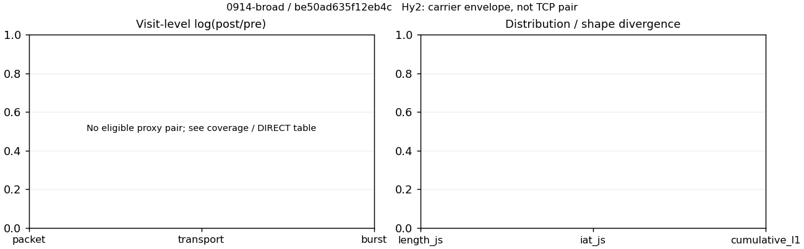

# 0914-broad · 条目 016 · baidu.com

目标：https://www.baidu.com/

活动标签：baidu.com::page_load。选定访问 3 次。

[返回总索引](../../README.md) · [统计口径](../../methods.md)

## 覆盖与资格（每次访问均保留）

| 部署 | 重复 | 主请求路由 | 活动状态 | 代理比较 | DIRECT pre | 请求 proxy/direct/unresolved | 错误 |
| --- | --- | --- | --- | --- | --- | --- | --- |
| Hy2 | 1 | direct | passed | 0 | 1 | 0/77/0 | [] |
| SS | 1 | direct | passed | 0 | 1 | 0/77/0 | [] |
| VLESS | 1 | direct | passed | 0 | 1 | 0/78/0 | [] |

主请求非 proxy 的统计仅解释为已索引的辅助代理连接或 DIRECT 观测，不代表目标业务经代理传输。播放确认与配对资格是两道不同的门。

图中散点为单次访问，短线为重复中位数；Hy2 是共享载体包络，不能与 TCP 配对作等范围因果对比。

形态图先逐访问归一化，再对访问等权平均；实线 pre，虚线 post。分箱序号及边界见 methods，不将分箱索引误解为长度或时间。

## 每次访问的关键观测

### SS

范围：`direct_pre_only`。每格 pre → post；空值为不可观测/不适用。

| 重复 | 包数 | 载荷字节 | burst | TCP FR | IAT中位µs | length JS | IAT JS |
| --- | --- | --- | --- | --- | --- | --- | --- |
| 1 | 1512 → — | 2.8335e+06 → — | 1021 → — | 132 → — | 91.169 → — | — | — |

完整标量统计：中位数 [min,max]；Δ 为重复内逐访问变换的中位数，MAD 未缩放。n 为可用变换数；DIRECT-only 的 nΔ=0 不代表 pre 不可用。

| scope | 特征 | pre | post | Δ | IQRΔ | MADΔ | nΔ |
| --- | --- | --- | --- | --- | --- | --- | --- |
| direct_pre_only | active_span_sum_s_1000ms | 7.8487 [7.8487, 7.8487] | — | — | — | — | 0 |
| direct_pre_only | active_span_sum_s_100ms | 3.3747 [3.3747, 3.3747] | — | — | — | — | 0 |
| direct_pre_only | active_span_sum_s_500ms | 6.6599 [6.6599, 6.6599] | — | — | — | — | 0 |
| direct_pre_only | burst_bytes_iqr | 4188 [4188, 4188] | — | — | — | — | 0 |
| direct_pre_only | burst_bytes_mad | 31 [31, 31] | — | — | — | — | 0 |
| direct_pre_only | burst_bytes_max | 23081 [23081, 23081] | — | — | — | — | 0 |
| direct_pre_only | burst_bytes_mean | 2775.2 [2775.2, 2775.2] | — | — | — | — | 0 |
| direct_pre_only | burst_bytes_median | 31 [31, 31] | — | — | — | — | 0 |
| direct_pre_only | burst_bytes_min | 0 [0, 0] | — | — | — | — | 0 |
| direct_pre_only | burst_bytes_p95 | 13016 [13016, 13016] | — | — | — | — | 0 |
| direct_pre_only | burst_bytes_q25 | 0 [0, 0] | — | — | — | — | 0 |
| direct_pre_only | burst_bytes_q75 | 4188 [4188, 4188] | — | — | — | — | 0 |
| direct_pre_only | burst_bytes_std | 4759.7 [4759.7, 4759.7] | — | — | — | — | 0 |
| direct_pre_only | burst_count | 1021 [1021, 1021] | — | — | — | — | 0 |
| direct_pre_only | burst_duration_ms_iqr | 0.31045 [0.31045, 0.31045] | — | — | — | — | 0 |
| direct_pre_only | burst_duration_ms_mad | 0 [0, 0] | — | — | — | — | 0 |
| direct_pre_only | burst_duration_ms_max | 2321.6 [2321.6, 2321.6] | — | — | — | — | 0 |
| direct_pre_only | burst_duration_ms_mean | 33.462 [33.462, 33.462] | — | — | — | — | 0 |
| direct_pre_only | burst_duration_ms_median | 0 [0, 0] | — | — | — | — | 0 |
| direct_pre_only | burst_duration_ms_min | 0 [0, 0] | — | — | — | — | 0 |
| direct_pre_only | burst_duration_ms_p95 | 33.603 [33.603, 33.603] | — | — | — | — | 0 |
| direct_pre_only | burst_duration_ms_q25 | 0 [0, 0] | — | — | — | — | 0 |
| direct_pre_only | burst_duration_ms_q75 | 0.31045 [0.31045, 0.31045] | — | — | — | — | 0 |
| direct_pre_only | burst_duration_ms_std | 225.38 [225.38, 225.38] | — | — | — | — | 0 |
| direct_pre_only | burst_packets_iqr | 1 [1, 1] | — | — | — | — | 0 |
| direct_pre_only | burst_packets_mad | 0 [0, 0] | — | — | — | — | 0 |
| direct_pre_only | burst_packets_max | 8 [8, 8] | — | — | — | — | 0 |
| direct_pre_only | burst_packets_mean | 1.4809 [1.4809, 1.4809] | — | — | — | — | 0 |
| direct_pre_only | burst_packets_median | 1 [1, 1] | — | — | — | — | 0 |
| direct_pre_only | burst_packets_min | 1 [1, 1] | — | — | — | — | 0 |
| direct_pre_only | burst_packets_p95 | 3 [3, 3] | — | — | — | — | 0 |
| direct_pre_only | burst_packets_q25 | 1 [1, 1] | — | — | — | — | 0 |
| direct_pre_only | burst_packets_q75 | 2 [2, 2] | — | — | — | — | 0 |
| direct_pre_only | burst_packets_std | 0.77351 [0.77351, 0.77351] | — | — | — | — | 0 |
| direct_pre_only | connection_span_concurrency_max | 17 [17, 17] | — | — | — | — | 0 |
| direct_pre_only | direction_entropy | 0.63284 [0.63284, 0.63284] | — | — | — | — | 0 |
| direct_pre_only | down_burst_count | 500 [500, 500] | — | — | — | — | 0 |
| direct_pre_only | down_ip_bytes | 2.7909e+06 [2.7909e+06, 2.7909e+06] | — | — | — | — | 0 |
| direct_pre_only | down_packets | 892 [892, 892] | — | — | — | — | 0 |
| direct_pre_only | down_transport_bytes | 2.7443e+06 [2.7443e+06, 2.7443e+06] | — | — | — | — | 0 |
| direct_pre_only | duration_s | 2.9814 [2.9814, 2.9814] | — | — | — | — | 0 |
| direct_pre_only | entity_count | 21 [21, 21] | — | — | — | — | 0 |
| direct_pre_only | fr_runs | 132 [132, 132] | — | — | — | — | 0 |
| direct_pre_only | fr_runs_per_packet | 0.15584 [0.15584, 0.15584] | — | — | — | — | 0 |
| direct_pre_only | fr_switches | 111 [111, 111] | — | — | — | — | 0 |
| direct_pre_only | fr_switches_per_possible_transition | 0.13438 [0.13438, 0.13438] | — | — | — | — | 0 |
| direct_pre_only | full_retransmission_fraction | 0.0046296 [0.0046296, 0.0046296] | — | — | — | — | 0 |
| direct_pre_only | full_retransmission_packets | 7 [7, 7] | — | — | — | — | 0 |
| direct_pre_only | iat_count | 1491 [1491, 1491] | — | — | — | — | 0 |
| direct_pre_only | iat_median_us | 91.169 [91.169, 91.169] | — | — | — | — | 0 |
| direct_pre_only | iat_us_iqr | 687.55 [687.55, 687.55] | — | — | — | — | 0 |
| direct_pre_only | iat_us_mad | 83.371 [83.371, 83.371] | — | — | — | — | 0 |
| direct_pre_only | iat_us_max | 2.3216e+06 [2.3216e+06, 2.3216e+06] | — | — | — | — | 0 |
| direct_pre_only | iat_us_mean | 23495 [23495, 23495] | — | — | — | — | 0 |
| direct_pre_only | iat_us_median | 91.169 [91.169, 91.169] | — | — | — | — | 0 |
| direct_pre_only | iat_us_min | 0.756 [0.756, 0.756] | — | — | — | — | 0 |
| direct_pre_only | iat_us_p95 | 26884 [26884, 26884] | — | — | — | — | 0 |
| direct_pre_only | iat_us_q25 | 19.799 [19.799, 19.799] | — | — | — | — | 0 |
| direct_pre_only | iat_us_q75 | 707.35 [707.35, 707.35] | — | — | — | — | 0 |
| direct_pre_only | iat_us_std | 1.8711e+05 [1.8711e+05, 1.8711e+05] | — | — | — | — | 0 |
| direct_pre_only | idle_gap_count_1000ms | 15 [15, 15] | — | — | — | — | 0 |
| direct_pre_only | idle_gap_count_100ms | 32 [32, 32] | — | — | — | — | 0 |
| direct_pre_only | idle_gap_count_500ms | 17 [17, 17] | — | — | — | — | 0 |
| direct_pre_only | idle_gap_sum_s_1000ms | 27.183 [27.183, 27.183] | — | — | — | — | 0 |
| direct_pre_only | idle_gap_sum_s_100ms | 31.656 [31.656, 31.656] | — | — | — | — | 0 |
| direct_pre_only | idle_gap_sum_s_500ms | 28.371 [28.371, 28.371] | — | — | — | — | 0 |
| direct_pre_only | ip_bytes | 2.9122e+06 [2.9122e+06, 2.9122e+06] | — | — | — | — | 0 |
| direct_pre_only | length_iqr | 3435 [3435, 3435] | — | — | — | — | 0 |
| direct_pre_only | length_mad | 1574 [1574, 1574] | — | — | — | — | 0 |
| direct_pre_only | length_max | 8948 [8948, 8948] | — | — | — | — | 0 |
| direct_pre_only | length_mean | 3345.3 [3345.3, 3345.3] | — | — | — | — | 0 |
| direct_pre_only | length_median | 2824 [2824, 2824] | — | — | — | — | 0 |
| direct_pre_only | length_min | 31 [31, 31] | — | — | — | — | 0 |
| direct_pre_only | length_p95 | 8920 [8920, 8920] | — | — | — | — | 0 |
| direct_pre_only | length_q25 | 1389 [1389, 1389] | — | — | — | — | 0 |
| direct_pre_only | length_q75 | 4824 [4824, 4824] | — | — | — | — | 0 |
| direct_pre_only | length_std | 2728.1 [2728.1, 2728.1] | — | — | — | — | 0 |
| direct_pre_only | nonempty_entity_count | 21 [21, 21] | — | — | — | — | 0 |
| direct_pre_only | nonempty_packets | 847 [847, 847] | — | — | — | — | 0 |
| direct_pre_only | offload_suspect_fraction | 0.38029 [0.38029, 0.38029] | — | — | — | — | 0 |
| direct_pre_only | packet_count | 1512 [1512, 1512] | — | — | — | — | 0 |
| direct_pre_only | rtt_median_ms | 0.087885 [0.087885, 0.087885] | — | — | — | — | 0 |
| direct_pre_only | rtt_sample_count | 581 [581, 581] | — | — | — | — | 0 |
| direct_pre_only | tcp_ack_count | 1463 [1463, 1463] | — | — | — | — | 0 |
| direct_pre_only | tcp_fin_count | 40 [40, 40] | — | — | — | — | 0 |
| direct_pre_only | tcp_packet_count | 1512 [1512, 1512] | — | — | — | — | 0 |
| direct_pre_only | tcp_rst_count | 28 [28, 28] | — | — | — | — | 0 |
| direct_pre_only | tcp_syn_count | 42 [42, 42] | — | — | — | — | 0 |
| direct_pre_only | tcp_window_raw_median | 65535 [65535, 65535] | — | — | — | — | 0 |
| direct_pre_only | transition_entropy | 0.45405 [0.45405, 0.45405] | — | — | — | — | 0 |
| direct_pre_only | transition_n_mm | 646 [646, 646] | — | — | — | — | 0 |
| direct_pre_only | transition_n_mp | 45 [45, 45] | — | — | — | — | 0 |
| direct_pre_only | transition_n_pm | 66 [66, 66] | — | — | — | — | 0 |
| direct_pre_only | transition_n_pp | 69 [69, 69] | — | — | — | — | 0 |
| direct_pre_only | transition_p_mm | 0.93488 [0.93488, 0.93488] | — | — | — | — | 0 |
| direct_pre_only | transition_p_mp | 0.065123 [0.065123, 0.065123] | — | — | — | — | 0 |
| direct_pre_only | transition_p_pm | 0.48889 [0.48889, 0.48889] | — | — | — | — | 0 |
| direct_pre_only | transition_p_pp | 0.51111 [0.51111, 0.51111] | — | — | — | — | 0 |
| direct_pre_only | transport_bytes | 2.8335e+06 [2.8335e+06, 2.8335e+06] | — | — | — | — | 0 |
| direct_pre_only | up_burst_count | 521 [521, 521] | — | — | — | — | 0 |
| direct_pre_only | up_byte_fraction | 0.031468 [0.031468, 0.031468] | — | — | — | — | 0 |
| direct_pre_only | up_ip_bytes | 1.2132e+05 [1.2132e+05, 1.2132e+05] | — | — | — | — | 0 |
| direct_pre_only | up_packets | 620 [620, 620] | — | — | — | — | 0 |
| direct_pre_only | up_transport_bytes | 89164 [89164, 89164] | — | — | — | — | 0 |
| direct_pre_only | zero_iat_count | 0 [0, 0] | — | — | — | — | 0 |
| direct_pre_only | zero_iat_fraction | 0 [0, 0] | — | — | — | — | 0 |

### VLESS

范围：`direct_pre_only`。每格 pre → post；空值为不可观测/不适用。

| 重复 | 包数 | 载荷字节 | burst | TCP FR | IAT中位µs | length JS | IAT JS |
| --- | --- | --- | --- | --- | --- | --- | --- |
| 1 | 1591 → — | 2.6628e+06 → — | 1007 → — | 146 → — | 118.95 → — | — | — |

完整标量统计：中位数 [min,max]；Δ 为重复内逐访问变换的中位数，MAD 未缩放。n 为可用变换数；DIRECT-only 的 nΔ=0 不代表 pre 不可用。

| scope | 特征 | pre | post | Δ | IQRΔ | MADΔ | nΔ |
| --- | --- | --- | --- | --- | --- | --- | --- |
| direct_pre_only | active_span_sum_s_1000ms | 10.592 [10.592, 10.592] | — | — | — | — | 0 |
| direct_pre_only | active_span_sum_s_100ms | 4.7429 [4.7429, 4.7429] | — | — | — | — | 0 |
| direct_pre_only | active_span_sum_s_500ms | 8.2268 [8.2268, 8.2268] | — | — | — | — | 0 |
| direct_pre_only | burst_bytes_iqr | 3942 [3942, 3942] | — | — | — | — | 0 |
| direct_pre_only | burst_bytes_mad | 31 [31, 31] | — | — | — | — | 0 |
| direct_pre_only | burst_bytes_max | 24016 [24016, 24016] | — | — | — | — | 0 |
| direct_pre_only | burst_bytes_mean | 2644.3 [2644.3, 2644.3] | — | — | — | — | 0 |
| direct_pre_only | burst_bytes_median | 31 [31, 31] | — | — | — | — | 0 |
| direct_pre_only | burst_bytes_min | 0 [0, 0] | — | — | — | — | 0 |
| direct_pre_only | burst_bytes_p95 | 13215 [13215, 13215] | — | — | — | — | 0 |
| direct_pre_only | burst_bytes_q25 | 0 [0, 0] | — | — | — | — | 0 |
| direct_pre_only | burst_bytes_q75 | 3942 [3942, 3942] | — | — | — | — | 0 |
| direct_pre_only | burst_bytes_std | 4713.7 [4713.7, 4713.7] | — | — | — | — | 0 |
| direct_pre_only | burst_count | 1007 [1007, 1007] | — | — | — | — | 0 |
| direct_pre_only | burst_duration_ms_iqr | 0.49302 [0.49302, 0.49302] | — | — | — | — | 0 |
| direct_pre_only | burst_duration_ms_mad | 0 [0, 0] | — | — | — | — | 0 |
| direct_pre_only | burst_duration_ms_max | 3097.7 [3097.7, 3097.7] | — | — | — | — | 0 |
| direct_pre_only | burst_duration_ms_mean | 18.32 [18.32, 18.32] | — | — | — | — | 0 |
| direct_pre_only | burst_duration_ms_median | 0 [0, 0] | — | — | — | — | 0 |
| direct_pre_only | burst_duration_ms_min | 0 [0, 0] | — | — | — | — | 0 |
| direct_pre_only | burst_duration_ms_p95 | 34.837 [34.837, 34.837] | — | — | — | — | 0 |
| direct_pre_only | burst_duration_ms_q25 | 0 [0, 0] | — | — | — | — | 0 |
| direct_pre_only | burst_duration_ms_q75 | 0.49302 [0.49302, 0.49302] | — | — | — | — | 0 |
| direct_pre_only | burst_duration_ms_std | 165.49 [165.49, 165.49] | — | — | — | — | 0 |
| direct_pre_only | burst_packets_iqr | 1 [1, 1] | — | — | — | — | 0 |
| direct_pre_only | burst_packets_mad | 0 [0, 0] | — | — | — | — | 0 |
| direct_pre_only | burst_packets_max | 7 [7, 7] | — | — | — | — | 0 |
| direct_pre_only | burst_packets_mean | 1.5799 [1.5799, 1.5799] | — | — | — | — | 0 |
| direct_pre_only | burst_packets_median | 1 [1, 1] | — | — | — | — | 0 |
| direct_pre_only | burst_packets_min | 1 [1, 1] | — | — | — | — | 0 |
| direct_pre_only | burst_packets_p95 | 3 [3, 3] | — | — | — | — | 0 |
| direct_pre_only | burst_packets_q25 | 1 [1, 1] | — | — | — | — | 0 |
| direct_pre_only | burst_packets_q75 | 2 [2, 2] | — | — | — | — | 0 |
| direct_pre_only | burst_packets_std | 0.86262 [0.86262, 0.86262] | — | — | — | — | 0 |
| direct_pre_only | connection_span_concurrency_max | 18 [18, 18] | — | — | — | — | 0 |
| direct_pre_only | direction_entropy | 0.63536 [0.63536, 0.63536] | — | — | — | — | 0 |
| direct_pre_only | down_burst_count | 491 [491, 491] | — | — | — | — | 0 |
| direct_pre_only | down_ip_bytes | 2.6088e+06 [2.6088e+06, 2.6088e+06] | — | — | — | — | 0 |
| direct_pre_only | down_packets | 953 [953, 953] | — | — | — | — | 0 |
| direct_pre_only | down_transport_bytes | 2.559e+06 [2.559e+06, 2.559e+06] | — | — | — | — | 0 |
| direct_pre_only | duration_s | 4.5638 [4.5638, 4.5638] | — | — | — | — | 0 |
| direct_pre_only | entity_count | 25 [25, 25] | — | — | — | — | 0 |
| direct_pre_only | fr_runs | 146 [146, 146] | — | — | — | — | 0 |
| direct_pre_only | fr_runs_per_packet | 0.16044 [0.16044, 0.16044] | — | — | — | — | 0 |
| direct_pre_only | fr_switches | 121 [121, 121] | — | — | — | — | 0 |
| direct_pre_only | fr_switches_per_possible_transition | 0.13672 [0.13672, 0.13672] | — | — | — | — | 0 |
| direct_pre_only | full_retransmission_fraction | 0.0012571 [0.0012571, 0.0012571] | — | — | — | — | 0 |
| direct_pre_only | full_retransmission_packets | 2 [2, 2] | — | — | — | — | 0 |
| direct_pre_only | iat_count | 1566 [1566, 1566] | — | — | — | — | 0 |
| direct_pre_only | iat_median_us | 118.95 [118.95, 118.95] | — | — | — | — | 0 |
| direct_pre_only | iat_us_iqr | 752.56 [752.56, 752.56] | — | — | — | — | 0 |
| direct_pre_only | iat_us_mad | 109.08 [109.08, 109.08] | — | — | — | — | 0 |
| direct_pre_only | iat_us_max | 3.0977e+06 [3.0977e+06, 3.0977e+06] | — | — | — | — | 0 |
| direct_pre_only | iat_us_mean | 12325 [12325, 12325] | — | — | — | — | 0 |
| direct_pre_only | iat_us_median | 118.95 [118.95, 118.95] | — | — | — | — | 0 |
| direct_pre_only | iat_us_min | 1.255 [1.255, 1.255] | — | — | — | — | 0 |
| direct_pre_only | iat_us_p95 | 28817 [28817, 28817] | — | — | — | — | 0 |
| direct_pre_only | iat_us_q25 | 25.302 [25.302, 25.302] | — | — | — | — | 0 |
| direct_pre_only | iat_us_q75 | 777.86 [777.86, 777.86] | — | — | — | — | 0 |
| direct_pre_only | iat_us_std | 1.3299e+05 [1.3299e+05, 1.3299e+05] | — | — | — | — | 0 |
| direct_pre_only | idle_gap_count_1000ms | 3 [3, 3] | — | — | — | — | 0 |
| direct_pre_only | idle_gap_count_100ms | 22 [22, 22] | — | — | — | — | 0 |
| direct_pre_only | idle_gap_count_500ms | 7 [7, 7] | — | — | — | — | 0 |
| direct_pre_only | idle_gap_sum_s_1000ms | 8.7093 [8.7093, 8.7093] | — | — | — | — | 0 |
| direct_pre_only | idle_gap_sum_s_100ms | 14.558 [14.558, 14.558] | — | — | — | — | 0 |
| direct_pre_only | idle_gap_sum_s_500ms | 11.074 [11.074, 11.074] | — | — | — | — | 0 |
| direct_pre_only | ip_bytes | 2.7456e+06 [2.7456e+06, 2.7456e+06] | — | — | — | — | 0 |
| direct_pre_only | length_iqr | 1676 [1676, 1676] | — | — | — | — | 0 |
| direct_pre_only | length_mad | 1412 [1412, 1412] | — | — | — | — | 0 |
| direct_pre_only | length_max | 8948 [8948, 8948] | — | — | — | — | 0 |
| direct_pre_only | length_mean | 2926.2 [2926.2, 2926.2] | — | — | — | — | 0 |
| direct_pre_only | length_median | 2824 [2824, 2824] | — | — | — | — | 0 |
| direct_pre_only | length_min | 12 [12, 12] | — | — | — | — | 0 |
| direct_pre_only | length_p95 | 8920 [8920, 8920] | — | — | — | — | 0 |
| direct_pre_only | length_q25 | 1412 [1412, 1412] | — | — | — | — | 0 |
| direct_pre_only | length_q75 | 3088 [3088, 3088] | — | — | — | — | 0 |
| direct_pre_only | length_std | 2467 [2467, 2467] | — | — | — | — | 0 |
| direct_pre_only | nonempty_entity_count | 25 [25, 25] | — | — | — | — | 0 |
| direct_pre_only | nonempty_packets | 910 [910, 910] | — | — | — | — | 0 |
| direct_pre_only | offload_suspect_fraction | 0.38781 [0.38781, 0.38781] | — | — | — | — | 0 |
| direct_pre_only | packet_count | 1591 [1591, 1591] | — | — | — | — | 0 |
| direct_pre_only | rtt_median_ms | 0.13583 [0.13583, 0.13583] | — | — | — | — | 0 |
| direct_pre_only | rtt_sample_count | 586 [586, 586] | — | — | — | — | 0 |
| direct_pre_only | tcp_ack_count | 1533 [1533, 1533] | — | — | — | — | 0 |
| direct_pre_only | tcp_fin_count | 49 [49, 49] | — | — | — | — | 0 |
| direct_pre_only | tcp_packet_count | 1591 [1591, 1591] | — | — | — | — | 0 |
| direct_pre_only | tcp_rst_count | 33 [33, 33] | — | — | — | — | 0 |
| direct_pre_only | tcp_syn_count | 50 [50, 50] | — | — | — | — | 0 |
| direct_pre_only | tcp_window_raw_median | 65535 [65535, 65535] | — | — | — | — | 0 |
| direct_pre_only | transition_entropy | 0.45456 [0.45456, 0.45456] | — | — | — | — | 0 |
| direct_pre_only | transition_n_mm | 691 [691, 691] | — | — | — | — | 0 |
| direct_pre_only | transition_n_mp | 48 [48, 48] | — | — | — | — | 0 |
| direct_pre_only | transition_n_pm | 73 [73, 73] | — | — | — | — | 0 |
| direct_pre_only | transition_n_pp | 73 [73, 73] | — | — | — | — | 0 |
| direct_pre_only | transition_p_mm | 0.93505 [0.93505, 0.93505] | — | — | — | — | 0 |
| direct_pre_only | transition_p_mp | 0.064953 [0.064953, 0.064953] | — | — | — | — | 0 |
| direct_pre_only | transition_p_pm | 0.5 [0.5, 0.5] | — | — | — | — | 0 |
| direct_pre_only | transition_p_pp | 0.5 [0.5, 0.5] | — | — | — | — | 0 |
| direct_pre_only | transport_bytes | 2.6628e+06 [2.6628e+06, 2.6628e+06] | — | — | — | — | 0 |
| direct_pre_only | up_burst_count | 516 [516, 516] | — | — | — | — | 0 |
| direct_pre_only | up_byte_fraction | 0.03898 [0.03898, 0.03898] | — | — | — | — | 0 |
| direct_pre_only | up_ip_bytes | 1.368e+05 [1.368e+05, 1.368e+05] | — | — | — | — | 0 |
| direct_pre_only | up_packets | 638 [638, 638] | — | — | — | — | 0 |
| direct_pre_only | up_transport_bytes | 1.038e+05 [1.038e+05, 1.038e+05] | — | — | — | — | 0 |
| direct_pre_only | zero_iat_count | 0 [0, 0] | — | — | — | — | 0 |
| direct_pre_only | zero_iat_fraction | 0 [0, 0] | — | — | — | — | 0 |

### Hy2

范围：`direct_pre_only`。每格 pre → post；空值为不可观测/不适用。

| 重复 | 包数 | 载荷字节 | burst | TCP FR | IAT中位µs | length JS | IAT JS |
| --- | --- | --- | --- | --- | --- | --- | --- |
| 1 | 1736 → — | 2.8181e+06 → — | 1124 → — | 144 → — | 156.79 → — | — | — |

完整标量统计：中位数 [min,max]；Δ 为重复内逐访问变换的中位数，MAD 未缩放。n 为可用变换数；DIRECT-only 的 nΔ=0 不代表 pre 不可用。

| scope | 特征 | pre | post | Δ | IQRΔ | MADΔ | nΔ |
| --- | --- | --- | --- | --- | --- | --- | --- |
| direct_pre_only | active_span_sum_s_1000ms | 8.4931 [8.4931, 8.4931] | — | — | — | — | 0 |
| direct_pre_only | active_span_sum_s_100ms | 4.3267 [4.3267, 4.3267] | — | — | — | — | 0 |
| direct_pre_only | active_span_sum_s_500ms | 7.8175 [7.8175, 7.8175] | — | — | — | — | 0 |
| direct_pre_only | burst_bytes_iqr | 4236 [4236, 4236] | — | — | — | — | 0 |
| direct_pre_only | burst_bytes_mad | 31 [31, 31] | — | — | — | — | 0 |
| direct_pre_only | burst_bytes_max | 20480 [20480, 20480] | — | — | — | — | 0 |
| direct_pre_only | burst_bytes_mean | 2507.2 [2507.2, 2507.2] | — | — | — | — | 0 |
| direct_pre_only | burst_bytes_median | 31 [31, 31] | — | — | — | — | 0 |
| direct_pre_only | burst_bytes_min | 0 [0, 0] | — | — | — | — | 0 |
| direct_pre_only | burst_bytes_p95 | 10821 [10821, 10821] | — | — | — | — | 0 |
| direct_pre_only | burst_bytes_q25 | 0 [0, 0] | — | — | — | — | 0 |
| direct_pre_only | burst_bytes_q75 | 4236 [4236, 4236] | — | — | — | — | 0 |
| direct_pre_only | burst_bytes_std | 4220.8 [4220.8, 4220.8] | — | — | — | — | 0 |
| direct_pre_only | burst_count | 1124 [1124, 1124] | — | — | — | — | 0 |
| direct_pre_only | burst_duration_ms_iqr | 0.72103 [0.72103, 0.72103] | — | — | — | — | 0 |
| direct_pre_only | burst_duration_ms_mad | 0 [0, 0] | — | — | — | — | 0 |
| direct_pre_only | burst_duration_ms_max | 12582 [12582, 12582] | — | — | — | — | 0 |
| direct_pre_only | burst_duration_ms_mean | 83.004 [83.004, 83.004] | — | — | — | — | 0 |
| direct_pre_only | burst_duration_ms_median | 0 [0, 0] | — | — | — | — | 0 |
| direct_pre_only | burst_duration_ms_min | 0 [0, 0] | — | — | — | — | 0 |
| direct_pre_only | burst_duration_ms_p95 | 31.752 [31.752, 31.752] | — | — | — | — | 0 |
| direct_pre_only | burst_duration_ms_q25 | 0 [0, 0] | — | — | — | — | 0 |
| direct_pre_only | burst_duration_ms_q75 | 0.72103 [0.72103, 0.72103] | — | — | — | — | 0 |
| direct_pre_only | burst_duration_ms_std | 962.82 [962.82, 962.82] | — | — | — | — | 0 |
| direct_pre_only | burst_packets_iqr | 1 [1, 1] | — | — | — | — | 0 |
| direct_pre_only | burst_packets_mad | 0 [0, 0] | — | — | — | — | 0 |
| direct_pre_only | burst_packets_max | 8 [8, 8] | — | — | — | — | 0 |
| direct_pre_only | burst_packets_mean | 1.5445 [1.5445, 1.5445] | — | — | — | — | 0 |
| direct_pre_only | burst_packets_median | 1 [1, 1] | — | — | — | — | 0 |
| direct_pre_only | burst_packets_min | 1 [1, 1] | — | — | — | — | 0 |
| direct_pre_only | burst_packets_p95 | 3 [3, 3] | — | — | — | — | 0 |
| direct_pre_only | burst_packets_q25 | 1 [1, 1] | — | — | — | — | 0 |
| direct_pre_only | burst_packets_q75 | 2 [2, 2] | — | — | — | — | 0 |
| direct_pre_only | burst_packets_std | 0.76905 [0.76905, 0.76905] | — | — | — | — | 0 |
| direct_pre_only | connection_span_concurrency_max | 12 [12, 12] | — | — | — | — | 0 |
| direct_pre_only | direction_entropy | 0.57654 [0.57654, 0.57654] | — | — | — | — | 0 |
| direct_pre_only | down_burst_count | 551 [551, 551] | — | — | — | — | 0 |
| direct_pre_only | down_ip_bytes | 2.7815e+06 [2.7815e+06, 2.7815e+06] | — | — | — | — | 0 |
| direct_pre_only | down_packets | 1067 [1067, 1067] | — | — | — | — | 0 |
| direct_pre_only | down_transport_bytes | 2.7258e+06 [2.7258e+06, 2.7258e+06] | — | — | — | — | 0 |
| direct_pre_only | duration_s | 13.711 [13.711, 13.711] | — | — | — | — | 0 |
| direct_pre_only | entity_count | 22 [22, 22] | — | — | — | — | 0 |
| direct_pre_only | fr_runs | 144 [144, 144] | — | — | — | — | 0 |
| direct_pre_only | fr_runs_per_packet | 0.14201 [0.14201, 0.14201] | — | — | — | — | 0 |
| direct_pre_only | fr_switches | 122 [122, 122] | — | — | — | — | 0 |
| direct_pre_only | fr_switches_per_possible_transition | 0.12298 [0.12298, 0.12298] | — | — | — | — | 0 |
| direct_pre_only | full_retransmission_fraction | 0.0011521 [0.0011521, 0.0011521] | — | — | — | — | 0 |
| direct_pre_only | full_retransmission_packets | 2 [2, 2] | — | — | — | — | 0 |
| direct_pre_only | iat_count | 1714 [1714, 1714] | — | — | — | — | 0 |
| direct_pre_only | iat_median_us | 156.79 [156.79, 156.79] | — | — | — | — | 0 |
| direct_pre_only | iat_us_iqr | 778.47 [778.47, 778.47] | — | — | — | — | 0 |
| direct_pre_only | iat_us_mad | 144.12 [144.12, 144.12] | — | — | — | — | 0 |
| direct_pre_only | iat_us_max | 1.2582e+07 [1.2582e+07, 1.2582e+07] | — | — | — | — | 0 |
| direct_pre_only | iat_us_mean | 54917 [54917, 54917] | — | — | — | — | 0 |
| direct_pre_only | iat_us_median | 156.79 [156.79, 156.79] | — | — | — | — | 0 |
| direct_pre_only | iat_us_min | 0.373 [0.373, 0.373] | — | — | — | — | 0 |
| direct_pre_only | iat_us_p95 | 22615 [22615, 22615] | — | — | — | — | 0 |
| direct_pre_only | iat_us_q25 | 35.364 [35.364, 35.364] | — | — | — | — | 0 |
| direct_pre_only | iat_us_q75 | 813.83 [813.83, 813.83] | — | — | — | — | 0 |
| direct_pre_only | iat_us_std | 7.8066e+05 [7.8066e+05, 7.8066e+05] | — | — | — | — | 0 |
| direct_pre_only | idle_gap_count_1000ms | 7 [7, 7] | — | — | — | — | 0 |
| direct_pre_only | idle_gap_count_100ms | 21 [21, 21] | — | — | — | — | 0 |
| direct_pre_only | idle_gap_count_500ms | 8 [8, 8] | — | — | — | — | 0 |
| direct_pre_only | idle_gap_sum_s_1000ms | 85.634 [85.634, 85.634] | — | — | — | — | 0 |
| direct_pre_only | idle_gap_sum_s_100ms | 89.801 [89.801, 89.801] | — | — | — | — | 0 |
| direct_pre_only | idle_gap_sum_s_500ms | 86.31 [86.31, 86.31] | — | — | — | — | 0 |
| direct_pre_only | ip_bytes | 2.9084e+06 [2.9084e+06, 2.9084e+06] | — | — | — | — | 0 |
| direct_pre_only | length_iqr | 1468 [1468, 1468] | — | — | — | — | 0 |
| direct_pre_only | length_mad | 1412 [1412, 1412] | — | — | — | — | 0 |
| direct_pre_only | length_max | 8948 [8948, 8948] | — | — | — | — | 0 |
| direct_pre_only | length_mean | 2779.2 [2779.2, 2779.2] | — | — | — | — | 0 |
| direct_pre_only | length_median | 2824 [2824, 2824] | — | — | — | — | 0 |
| direct_pre_only | length_min | 31 [31, 31] | — | — | — | — | 0 |
| direct_pre_only | length_p95 | 8472 [8472, 8472] | — | — | — | — | 0 |
| direct_pre_only | length_q25 | 1412 [1412, 1412] | — | — | — | — | 0 |
| direct_pre_only | length_q75 | 2880 [2880, 2880] | — | — | — | — | 0 |
| direct_pre_only | length_std | 2234.4 [2234.4, 2234.4] | — | — | — | — | 0 |
| direct_pre_only | nonempty_entity_count | 22 [22, 22] | — | — | — | — | 0 |
| direct_pre_only | nonempty_packets | 1014 [1014, 1014] | — | — | — | — | 0 |
| direct_pre_only | offload_suspect_fraction | 0.38998 [0.38998, 0.38998] | — | — | — | — | 0 |
| direct_pre_only | packet_count | 1736 [1736, 1736] | — | — | — | — | 0 |
| direct_pre_only | rtt_median_ms | 0.18064 [0.18064, 0.18064] | — | — | — | — | 0 |
| direct_pre_only | rtt_sample_count | 646 [646, 646] | — | — | — | — | 0 |
| direct_pre_only | tcp_ack_count | 1690 [1690, 1690] | — | — | — | — | 0 |
| direct_pre_only | tcp_fin_count | 42 [42, 42] | — | — | — | — | 0 |
| direct_pre_only | tcp_packet_count | 1736 [1736, 1736] | — | — | — | — | 0 |
| direct_pre_only | tcp_rst_count | 24 [24, 24] | — | — | — | — | 0 |
| direct_pre_only | tcp_syn_count | 44 [44, 44] | — | — | — | — | 0 |
| direct_pre_only | tcp_window_raw_median | 65535 [65535, 65535] | — | — | — | — | 0 |
| direct_pre_only | transition_entropy | 0.41681 [0.41681, 0.41681] | — | — | — | — | 0 |
| direct_pre_only | transition_n_mm | 803 [803, 803] | — | — | — | — | 0 |
| direct_pre_only | transition_n_mp | 50 [50, 50] | — | — | — | — | 0 |
| direct_pre_only | transition_n_pm | 72 [72, 72] | — | — | — | — | 0 |
| direct_pre_only | transition_n_pp | 67 [67, 67] | — | — | — | — | 0 |
| direct_pre_only | transition_p_mm | 0.94138 [0.94138, 0.94138] | — | — | — | — | 0 |
| direct_pre_only | transition_p_mp | 0.058617 [0.058617, 0.058617] | — | — | — | — | 0 |
| direct_pre_only | transition_p_pm | 0.51799 [0.51799, 0.51799] | — | — | — | — | 0 |
| direct_pre_only | transition_p_pp | 0.48201 [0.48201, 0.48201] | — | — | — | — | 0 |
| direct_pre_only | transport_bytes | 2.8181e+06 [2.8181e+06, 2.8181e+06] | — | — | — | — | 0 |
| direct_pre_only | up_burst_count | 573 [573, 573] | — | — | — | — | 0 |
| direct_pre_only | up_byte_fraction | 0.032736 [0.032736, 0.032736] | — | — | — | — | 0 |
| direct_pre_only | up_ip_bytes | 1.2695e+05 [1.2695e+05, 1.2695e+05] | — | — | — | — | 0 |
| direct_pre_only | up_packets | 669 [669, 669] | — | — | — | — | 0 |
| direct_pre_only | up_transport_bytes | 92253 [92253, 92253] | — | — | — | — | 0 |
| direct_pre_only | zero_iat_count | 0 [0, 0] | — | — | — | — | 0 |
| direct_pre_only | zero_iat_fraction | 0 [0, 0] | — | — | — | — | 0 |

## 不同部署对比

以下是各部署自身重复中位数的差异，不按重复编号强行配对。跨 TCP/Hy2 的行标记异质观测范围。

| 视角 | 特征 | 部署A | 部署B | A中位 | B中位 | B−A | 比较口径 |
| --- | --- | --- | --- | --- | --- | --- | --- |
| pre | burst_count | SS | VLESS | 1021 | 1007 | -14 | same_scope_unpaired_visits |
| pre | burst_count | SS | Hy2 | 1021 | 1124 | 103 | same_scope_unpaired_visits |
| pre | burst_count | VLESS | Hy2 | 1007 | 1124 | 117 | same_scope_unpaired_visits |
| pre | connection_span_concurrency_max | SS | VLESS | 17 | 18 | 1 | same_scope_unpaired_visits |
| pre | connection_span_concurrency_max | SS | Hy2 | 17 | 12 | -5 | same_scope_unpaired_visits |
| pre | connection_span_concurrency_max | VLESS | Hy2 | 18 | 12 | -6 | same_scope_unpaired_visits |
| pre | direction_entropy | SS | VLESS | 0.63284 | 0.63536 | 0.0025213 | same_scope_unpaired_visits |
| pre | direction_entropy | SS | Hy2 | 0.63284 | 0.57654 | -0.056296 | same_scope_unpaired_visits |
| pre | direction_entropy | VLESS | Hy2 | 0.63536 | 0.57654 | -0.058818 | same_scope_unpaired_visits |
| pre | down_transport_bytes | SS | VLESS | 2.7443e+06 | 2.559e+06 | -1.853e+05 | same_scope_unpaired_visits |
| pre | down_transport_bytes | SS | Hy2 | 2.7443e+06 | 2.7258e+06 | -18484 | same_scope_unpaired_visits |
| pre | down_transport_bytes | VLESS | Hy2 | 2.559e+06 | 2.7258e+06 | 1.6682e+05 | same_scope_unpaired_visits |
| pre | duration_s | SS | VLESS | 2.9814 | 4.5638 | 1.5825 | same_scope_unpaired_visits |
| pre | duration_s | SS | Hy2 | 2.9814 | 13.711 | 10.73 | same_scope_unpaired_visits |
| pre | duration_s | VLESS | Hy2 | 4.5638 | 13.711 | 9.1477 | same_scope_unpaired_visits |
| pre | entity_count | SS | VLESS | 21 | 25 | 4 | same_scope_unpaired_visits |
| pre | entity_count | SS | Hy2 | 21 | 22 | 1 | same_scope_unpaired_visits |
| pre | entity_count | VLESS | Hy2 | 25 | 22 | -3 | same_scope_unpaired_visits |
| pre | fr_runs | SS | VLESS | 132 | 146 | 14 | same_scope_unpaired_visits |
| pre | fr_runs | SS | Hy2 | 132 | 144 | 12 | same_scope_unpaired_visits |
| pre | fr_runs | VLESS | Hy2 | 146 | 144 | -2 | same_scope_unpaired_visits |
| pre | fr_runs_per_packet | SS | VLESS | 0.15584 | 0.16044 | 0.0045954 | same_scope_unpaired_visits |
| pre | fr_runs_per_packet | SS | Hy2 | 0.15584 | 0.14201 | -0.013832 | same_scope_unpaired_visits |
| pre | fr_runs_per_packet | VLESS | Hy2 | 0.16044 | 0.14201 | -0.018428 | same_scope_unpaired_visits |
| pre | fr_switches | SS | VLESS | 111 | 121 | 10 | same_scope_unpaired_visits |
| pre | fr_switches | SS | Hy2 | 111 | 122 | 11 | same_scope_unpaired_visits |
| pre | fr_switches | VLESS | Hy2 | 121 | 122 | 1 | same_scope_unpaired_visits |
| pre | fr_switches_per_possible_transition | SS | VLESS | 0.13438 | 0.13672 | 0.0023406 | same_scope_unpaired_visits |
| pre | fr_switches_per_possible_transition | SS | Hy2 | 0.13438 | 0.12298 | -0.011399 | same_scope_unpaired_visits |
| pre | fr_switches_per_possible_transition | VLESS | Hy2 | 0.13672 | 0.12298 | -0.013739 | same_scope_unpaired_visits |
| pre | full_retransmission_fraction | SS | VLESS | 0.0046296 | 0.0012571 | -0.0033726 | same_scope_unpaired_visits |
| pre | full_retransmission_fraction | SS | Hy2 | 0.0046296 | 0.0011521 | -0.0034776 | same_scope_unpaired_visits |
| pre | full_retransmission_fraction | VLESS | Hy2 | 0.0012571 | 0.0011521 | -0.000105 | same_scope_unpaired_visits |
| pre | iat_median_us | SS | VLESS | 91.169 | 118.95 | 27.782 | same_scope_unpaired_visits |
| pre | iat_median_us | SS | Hy2 | 91.169 | 156.79 | 65.623 | same_scope_unpaired_visits |
| pre | iat_median_us | VLESS | Hy2 | 118.95 | 156.79 | 37.842 | same_scope_unpaired_visits |
| pre | iat_us_p95 | SS | VLESS | 26884 | 28817 | 1932.9 | same_scope_unpaired_visits |
| pre | iat_us_p95 | SS | Hy2 | 26884 | 22615 | -4268.6 | same_scope_unpaired_visits |
| pre | iat_us_p95 | VLESS | Hy2 | 28817 | 22615 | -6201.5 | same_scope_unpaired_visits |
| pre | ip_bytes | SS | VLESS | 2.9122e+06 | 2.7456e+06 | -1.6662e+05 | same_scope_unpaired_visits |
| pre | ip_bytes | SS | Hy2 | 2.9122e+06 | 2.9084e+06 | -3743 | same_scope_unpaired_visits |
| pre | ip_bytes | VLESS | Hy2 | 2.7456e+06 | 2.9084e+06 | 1.6287e+05 | same_scope_unpaired_visits |
| pre | length_median | SS | VLESS | 2824 | 2824 | 0 | same_scope_unpaired_visits |
| pre | length_median | SS | Hy2 | 2824 | 2824 | 0 | same_scope_unpaired_visits |
| pre | length_median | VLESS | Hy2 | 2824 | 2824 | 0 | same_scope_unpaired_visits |
| pre | length_p95 | SS | VLESS | 8920 | 8920 | 0 | same_scope_unpaired_visits |
| pre | length_p95 | SS | Hy2 | 8920 | 8472 | -448 | same_scope_unpaired_visits |
| pre | length_p95 | VLESS | Hy2 | 8920 | 8472 | -448 | same_scope_unpaired_visits |
| pre | nonempty_packets | SS | VLESS | 847 | 910 | 63 | same_scope_unpaired_visits |
| pre | nonempty_packets | SS | Hy2 | 847 | 1014 | 167 | same_scope_unpaired_visits |
| pre | nonempty_packets | VLESS | Hy2 | 910 | 1014 | 104 | same_scope_unpaired_visits |
| pre | offload_suspect_fraction | SS | VLESS | 0.38029 | 0.38781 | 0.0075154 | same_scope_unpaired_visits |
| pre | offload_suspect_fraction | SS | Hy2 | 0.38029 | 0.38998 | 0.009686 | same_scope_unpaired_visits |
| pre | offload_suspect_fraction | VLESS | Hy2 | 0.38781 | 0.38998 | 0.0021705 | same_scope_unpaired_visits |
| pre | packet_count | SS | VLESS | 1512 | 1591 | 79 | same_scope_unpaired_visits |
| pre | packet_count | SS | Hy2 | 1512 | 1736 | 224 | same_scope_unpaired_visits |
| pre | packet_count | VLESS | Hy2 | 1591 | 1736 | 145 | same_scope_unpaired_visits |
| pre | rtt_median_ms | SS | VLESS | 0.087885 | 0.13583 | 0.047948 | same_scope_unpaired_visits |
| pre | rtt_median_ms | SS | Hy2 | 0.087885 | 0.18064 | 0.092755 | same_scope_unpaired_visits |
| pre | rtt_median_ms | VLESS | Hy2 | 0.13583 | 0.18064 | 0.044808 | same_scope_unpaired_visits |
| pre | transition_entropy | SS | VLESS | 0.45405 | 0.45456 | 0.00051181 | same_scope_unpaired_visits |
| pre | transition_entropy | SS | Hy2 | 0.45405 | 0.41681 | -0.037237 | same_scope_unpaired_visits |
| pre | transition_entropy | VLESS | Hy2 | 0.45456 | 0.41681 | -0.037749 | same_scope_unpaired_visits |
| pre | transport_bytes | SS | VLESS | 2.8335e+06 | 2.6628e+06 | -1.7067e+05 | same_scope_unpaired_visits |
| pre | transport_bytes | SS | Hy2 | 2.8335e+06 | 2.8181e+06 | -15395 | same_scope_unpaired_visits |
| pre | transport_bytes | VLESS | Hy2 | 2.6628e+06 | 2.8181e+06 | 1.5527e+05 | same_scope_unpaired_visits |
| pre | up_byte_fraction | SS | VLESS | 0.031468 | 0.03898 | 0.0075122 | same_scope_unpaired_visits |
| pre | up_byte_fraction | SS | Hy2 | 0.031468 | 0.032736 | 0.001268 | same_scope_unpaired_visits |
| pre | up_byte_fraction | VLESS | Hy2 | 0.03898 | 0.032736 | -0.0062442 | same_scope_unpaired_visits |
| pre | up_transport_bytes | SS | VLESS | 89164 | 1.038e+05 | 14633 | same_scope_unpaired_visits |
| pre | up_transport_bytes | SS | Hy2 | 89164 | 92253 | 3089 | same_scope_unpaired_visits |
| pre | up_transport_bytes | VLESS | Hy2 | 1.038e+05 | 92253 | -11544 | same_scope_unpaired_visits |

## 可复核的访问标识

| 部署 | 重复 | session_id |
| --- | --- | --- |
| SS | 1 | 3b02e4f4-d0b4-4d05-a9e4-089ee30ab677 |
| VLESS | 1 | 79f2f375-a066-4b8b-a1ab-0e9c887d3403 |
| Hy2 | 1 | 5c286619-9127-43ea-a221-8bf59b5a4501 |

全量三种 packet selection、Hy2 full 范围、Q25/Q75、直方图与曲线见机器可读产物；本页只显示 observed 主范围。
