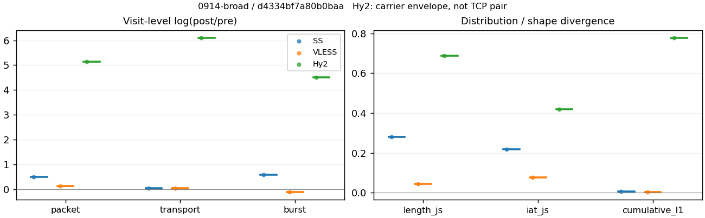
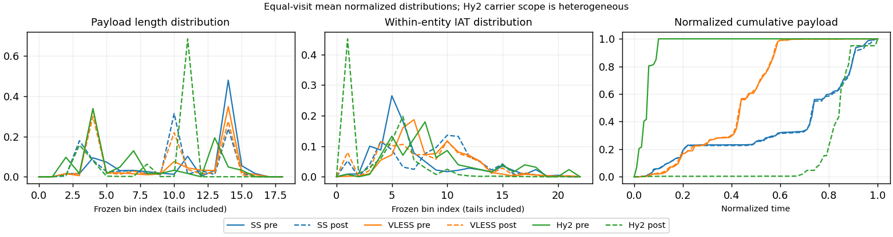

# 0914-broad · 条目 017 · bing.com

目标：https://www.bing.com/

活动标签：bing.com::page_load。选定访问 3 次。

[返回总索引](../../README.md) · [统计口径](../../methods.md)

## 覆盖与资格（每次访问均保留）

| 部署 | 重复 | 主请求路由 | 活动状态 | 代理比较 | DIRECT pre | 请求 proxy/direct/unresolved | 错误 |
| --- | --- | --- | --- | --- | --- | --- | --- |
| Hy2 | 1 | direct | passed | 1 | 1 | 17/238/0 | [] |
| SS | 1 | proxy | passed | 1 | 0 | 288/0/5 | [] |
| VLESS | 1 | proxy | passed | 1 | 0 | 294/0/0 | [] |

主请求非 proxy 的统计仅解释为已索引的辅助代理连接或 DIRECT 观测，不代表目标业务经代理传输。播放确认与配对资格是两道不同的门。

图中散点为单次访问，短线为重复中位数；Hy2 是共享载体包络，不能与 TCP 配对作等范围因果对比。

形态图先逐访问归一化，再对访问等权平均；实线 pre，虚线 post。分箱序号及边界见 methods，不将分箱索引误解为长度或时间。

## 每次访问的关键观测

### SS

范围：`exclusive_page`。每格 pre → post；空值为不可观测/不适用。

| 重复 | 包数 | 载荷字节 | burst | TCP FR | IAT中位µs | length JS | IAT JS |
| --- | --- | --- | --- | --- | --- | --- | --- |
| 1 | 3874 → 6432 | 4.9589e+06 → 5.15e+06 | 2603 → 4647 | 259 → 271 | 22.595 → 422.35 | 0.28115 | 0.21816 |

完整标量统计：中位数 [min,max]；Δ 为重复内逐访问变换的中位数，MAD 未缩放。n 为可用变换数；DIRECT-only 的 nΔ=0 不代表 pre 不可用。

| scope | 特征 | pre | post | Δ | IQRΔ | MADΔ | nΔ |
| --- | --- | --- | --- | --- | --- | --- | --- |
| exclusive_page | active_span_sum_s_1000ms | 48.041 [48.041, 48.041] | 48.493 [48.493, 48.493] | 0.0093565 | — | — | 1 |
| exclusive_page | active_span_sum_s_100ms | 12.539 [12.539, 12.539] | 19.959 [19.959, 19.959] | 0.46483 | — | — | 1 |
| exclusive_page | active_span_sum_s_500ms | 40.152 [40.152, 40.152] | 42.346 [42.346, 42.346] | 0.053213 | — | — | 1 |
| exclusive_page | burst_bytes_iqr | 2896 [2896, 2896] | 1494 [1494, 1494] | -0.66187 | — | — | 1 |
| exclusive_page | burst_bytes_mad | 85 [85, 85] | 34 [34, 34] | -0.91629 | — | — | 1 |
| exclusive_page | burst_bytes_max | 21982 [21982, 21982] | 19992 [19992, 19992] | -0.094892 | — | — | 1 |
| exclusive_page | burst_bytes_mean | 1905.1 [1905.1, 1905.1] | 1108.2 [1108.2, 1108.2] | -0.54174 | — | — | 1 |
| exclusive_page | burst_bytes_median | 85 [85, 85] | 34 [34, 34] | -0.91629 | — | — | 1 |
| exclusive_page | burst_bytes_min | 0 [0, 0] | 0 [0, 0] | — | — | — | 0 |
| exclusive_page | burst_bytes_p95 | 8688 [8688, 8688] | 4284 [4284, 4284] | -0.70706 | — | — | 1 |
| exclusive_page | burst_bytes_q25 | 0 [0, 0] | 0 [0, 0] | — | — | — | 0 |
| exclusive_page | burst_bytes_q75 | 2896 [2896, 2896] | 1494 [1494, 1494] | -0.66187 | — | — | 1 |
| exclusive_page | burst_bytes_std | 3404.6 [3404.6, 3404.6] | 1773.2 [1773.2, 1773.2] | -0.65233 | — | — | 1 |
| exclusive_page | burst_count | 2603 [2603, 2603] | 4647 [4647, 4647] | 0.57956 | — | — | 1 |
| exclusive_page | burst_duration_ms_iqr | 0.015768 [0.015768, 0.015768] | 3.6e-05 [3.6e-05, 3.6e-05] | -6.0823 | — | — | 1 |
| exclusive_page | burst_duration_ms_mad | 0 [0, 0] | 0 [0, 0] | — | — | — | 0 |
| exclusive_page | burst_duration_ms_max | 5333 [5333, 5333] | 5333.2 [5333.2, 5333.2] | 3.7739e-05 | — | — | 1 |
| exclusive_page | burst_duration_ms_mean | 28.705 [28.705, 28.705] | 13.276 [13.276, 13.276] | -0.77109 | — | — | 1 |
| exclusive_page | burst_duration_ms_median | 0 [0, 0] | 0 [0, 0] | — | — | — | 0 |
| exclusive_page | burst_duration_ms_min | 0 [0, 0] | 0 [0, 0] | — | — | — | 0 |
| exclusive_page | burst_duration_ms_p95 | 96.058 [96.058, 96.058] | 4.0868 [4.0868, 4.0868] | -3.1572 | — | — | 1 |
| exclusive_page | burst_duration_ms_q25 | 0 [0, 0] | 0 [0, 0] | — | — | — | 0 |
| exclusive_page | burst_duration_ms_q75 | 0.015768 [0.015768, 0.015768] | 3.6e-05 [3.6e-05, 3.6e-05] | -6.0823 | — | — | 1 |
| exclusive_page | burst_duration_ms_std | 215.43 [215.43, 215.43] | 153.81 [153.81, 153.81] | -0.33695 | — | — | 1 |
| exclusive_page | burst_packets_iqr | 1 [1, 1] | 1 [1, 1] | 0 | — | — | 1 |
| exclusive_page | burst_packets_mad | 0 [0, 0] | 0 [0, 0] | — | — | — | 0 |
| exclusive_page | burst_packets_max | 11 [11, 11] | 12 [12, 12] | 0.087011 | — | — | 1 |
| exclusive_page | burst_packets_mean | 1.4883 [1.4883, 1.4883] | 1.3841 [1.3841, 1.3841] | -0.072559 | — | — | 1 |
| exclusive_page | burst_packets_median | 1 [1, 1] | 1 [1, 1] | 0 | — | — | 1 |
| exclusive_page | burst_packets_min | 1 [1, 1] | 1 [1, 1] | 0 | — | — | 1 |
| exclusive_page | burst_packets_p95 | 4 [4, 4] | 3 [3, 3] | -0.28768 | — | — | 1 |
| exclusive_page | burst_packets_q25 | 1 [1, 1] | 1 [1, 1] | 0 | — | — | 1 |
| exclusive_page | burst_packets_q75 | 2 [2, 2] | 2 [2, 2] | 0 | — | — | 1 |
| exclusive_page | burst_packets_std | 1.0822 [1.0822, 1.0822] | 0.84618 [0.84618, 0.84618] | -0.246 | — | — | 1 |
| exclusive_page | connection_span_concurrency_max | 16 [16, 16] | 16 [16, 16] | 0 | — | — | 1 |
| exclusive_page | cumulative_l1 | — | — | 0.0068585 | — | — | 1 |
| exclusive_page | cumulative_max | — | — | 0.042891 | — | — | 1 |
| exclusive_page | direction_entropy | 0.66129 [0.66129, 0.66129] | 0.46359 [0.46359, 0.46359] | -0.1977 | — | — | 1 |
| exclusive_page | down_burst_count | 1292 [1292, 1292] | 2314 [2314, 2314] | 0.58279 | — | — | 1 |
| exclusive_page | down_ip_bytes | 4.9125e+06 [4.9125e+06, 4.9125e+06] | 5.158e+06 [5.158e+06, 5.158e+06] | 0.048766 | — | — | 1 |
| exclusive_page | down_packets | 2307 [2307, 2307] | 3645 [3645, 3645] | 0.45741 | — | — | 1 |
| exclusive_page | down_transport_bytes | 4.7924e+06 [4.7924e+06, 4.7924e+06] | 4.9682e+06 [4.9682e+06, 4.9682e+06] | 0.036026 | — | — | 1 |
| exclusive_page | duration_s | 17.045 [17.045, 17.045] | 17.045 [17.045, 17.045] | -3.4559e-05 | — | — | 1 |
| exclusive_page | entity_count | 19 [19, 19] | 19 [19, 19] | 0 | — | — | 1 |
| exclusive_page | fr_runs | 259 [259, 259] | 271 [271, 271] | 0.045291 | — | — | 1 |
| exclusive_page | fr_runs_per_packet | 0.11054 [0.11054, 0.11054] | 0.072987 [0.072987, 0.072987] | -0.037555 | — | — | 1 |
| exclusive_page | fr_switches | 240 [240, 240] | 252 [252, 252] | 0.04879 | — | — | 1 |
| exclusive_page | fr_switches_per_possible_transition | 0.10327 [0.10327, 0.10327] | 0.068219 [0.068219, 0.068219] | -0.035051 | — | — | 1 |
| exclusive_page | full_retransmission_fraction | 0.0015488 [0.0015488, 0.0015488] | 0.0023321 [0.0023321, 0.0023321] | 0.0007833 | — | — | 1 |
| exclusive_page | full_retransmission_packets | 6 [6, 6] | 15 [15, 15] | 0.91629 | — | — | 1 |
| exclusive_page | iat_count | 3855 [3855, 3855] | 6413 [6413, 6413] | 0.50896 | — | — | 1 |
| exclusive_page | iat_js | — | — | 0.21816 | — | — | 1 |
| exclusive_page | iat_ks | — | — | 0.38272 | — | — | 1 |
| exclusive_page | iat_median_us | 22.595 [22.595, 22.595] | 422.35 [422.35, 422.35] | 2.9281 | — | — | 1 |
| exclusive_page | iat_us_iqr | 112.95 [112.95, 112.95] | 1241.8 [1241.8, 1241.8] | 2.3974 | — | — | 1 |
| exclusive_page | iat_us_mad | 17.6 [17.6, 17.6] | 415.83 [415.83, 415.83] | 3.1624 | — | — | 1 |
| exclusive_page | iat_us_max | 5.333e+06 [5.333e+06, 5.333e+06] | 5.3332e+06 [5.3332e+06, 5.3332e+06] | 3.7739e-05 | — | — | 1 |
| exclusive_page | iat_us_mean | 23344 [23344, 23344] | 13977 [13977, 13977] | -0.51292 | — | — | 1 |
| exclusive_page | iat_us_median | 22.595 [22.595, 22.595] | 422.35 [422.35, 422.35] | 2.9281 | — | — | 1 |
| exclusive_page | iat_us_min | 0.116 [0.116, 0.116] | 0.034 [0.034, 0.034] | -1.2272 | — | — | 1 |
| exclusive_page | iat_us_p95 | 69747 [69747, 69747] | 31898 [31898, 31898] | -0.78232 | — | — | 1 |
| exclusive_page | iat_us_q25 | 12.143 [12.143, 12.143] | 12.809 [12.809, 12.809] | 0.053395 | — | — | 1 |
| exclusive_page | iat_us_q75 | 125.09 [125.09, 125.09] | 1254.6 [1254.6, 1254.6] | 2.3056 | — | — | 1 |
| exclusive_page | iat_us_std | 1.8094e+05 [1.8094e+05, 1.8094e+05] | 1.3749e+05 [1.3749e+05, 1.3749e+05] | -0.27464 | — | — | 1 |
| exclusive_page | iat_wasserstein_log1p_us | — | — | 1.4364 | — | — | 1 |
| exclusive_page | idle_gap_count_1000ms | 20 [20, 20] | 20 [20, 20] | 0 | — | — | 1 |
| exclusive_page | idle_gap_count_100ms | 150 [150, 150] | 139 [139, 139] | -0.076161 | — | — | 1 |
| exclusive_page | idle_gap_count_500ms | 31 [31, 31] | 29 [29, 29] | -0.066691 | — | — | 1 |
| exclusive_page | idle_gap_sum_s_1000ms | 41.95 [41.95, 41.95] | 41.143 [41.143, 41.143] | -0.019435 | — | — | 1 |
| exclusive_page | idle_gap_sum_s_100ms | 77.452 [77.452, 77.452] | 69.677 [69.677, 69.677] | -0.1058 | — | — | 1 |
| exclusive_page | idle_gap_sum_s_500ms | 49.839 [49.839, 49.839] | 47.289 [47.289, 47.289] | -0.052527 | — | — | 1 |
| exclusive_page | ip_bytes | 5.1606e+06 [5.1606e+06, 5.1606e+06] | 5.5342e+06 [5.5342e+06, 5.5342e+06] | 0.069887 | — | — | 1 |
| exclusive_page | length_iqr | 2266 [2266, 2266] | 2597 [2597, 2597] | 0.13634 | — | — | 1 |
| exclusive_page | length_js | — | — | 0.28115 | — | — | 1 |
| exclusive_page | length_ks | — | — | 0.47003 | — | — | 1 |
| exclusive_page | length_mad | 1200 [1200, 1200] | 1310 [1310, 1310] | 0.087706 | — | — | 1 |
| exclusive_page | length_max | 8948 [8948, 8948] | 8568 [8568, 8568] | -0.043396 | — | — | 1 |
| exclusive_page | length_mean | 2116.5 [2116.5, 2116.5] | 1387 [1387, 1387] | -0.42259 | — | — | 1 |
| exclusive_page | length_median | 2896 [2896, 2896] | 1428 [1428, 1428] | -0.70706 | — | — | 1 |
| exclusive_page | length_min | 12 [12, 12] | 7 [7, 7] | -0.539 | — | — | 1 |
| exclusive_page | length_p95 | 4096 [4096, 4096] | 2856 [2856, 2856] | -0.36059 | — | — | 1 |
| exclusive_page | length_q25 | 630 [630, 630] | 118 [118, 118] | -1.675 | — | — | 1 |
| exclusive_page | length_q75 | 2896 [2896, 2896] | 2715 [2715, 2715] | -0.064539 | — | — | 1 |
| exclusive_page | length_std | 1602.6 [1602.6, 1602.6] | 1193 [1193, 1193] | -0.29516 | — | — | 1 |
| exclusive_page | length_wasserstein_bytes | — | — | 729.53 | — | — | 1 |
| exclusive_page | nonempty_entity_count | 19 [19, 19] | 19 [19, 19] | 0 | — | — | 1 |
| exclusive_page | nonempty_packets | 2343 [2343, 2343] | 3713 [3713, 3713] | 0.46041 | — | — | 1 |
| exclusive_page | offload_suspect_fraction | 0.35312 [0.35312, 0.35312] | 0.17226 [0.17226, 0.17226] | -0.18086 | — | — | 1 |
| exclusive_page | packet_count | 3874 [3874, 3874] | 6432 [6432, 6432] | 0.507 | — | — | 1 |
| exclusive_page | rtt_median_ms | 0.042225 [0.042225, 0.042225] | 32.537 [32.537, 32.537] | 6.6471 | — | — | 1 |
| exclusive_page | rtt_sample_count | 1489 [1489, 1489] | 962 [962, 962] | -0.43685 | — | — | 1 |
| exclusive_page | tcp_ack_count | 3847 [3847, 3847] | 6412 [6412, 6412] | 0.51088 | — | — | 1 |
| exclusive_page | tcp_fin_count | 37 [37, 37] | 37 [37, 37] | 0 | — | — | 1 |
| exclusive_page | tcp_packet_count | 3874 [3874, 3874] | 6432 [6432, 6432] | 0.507 | — | — | 1 |
| exclusive_page | tcp_rst_count | 8 [8, 8] | 1 [1, 1] | -2.0794 | — | — | 1 |
| exclusive_page | tcp_syn_count | 38 [38, 38] | 40 [40, 40] | 0.051293 | — | — | 1 |
| exclusive_page | tcp_window_raw_median | 65535 [65535, 65535] | 149 [149, 149] | -6.0864 | — | — | 1 |
| exclusive_page | transition_entropy | 0.42063 [0.42063, 0.42063] | 0.29239 [0.29239, 0.29239] | -0.12824 | — | — | 1 |
| exclusive_page | transition_n_mm | 1813 [1813, 1813] | 3214 [3214, 3214] | 0.57253 | — | — | 1 |
| exclusive_page | transition_n_mp | 112 [112, 112] | 118 [118, 118] | 0.052186 | — | — | 1 |
| exclusive_page | transition_n_pm | 128 [128, 128] | 134 [134, 134] | 0.04581 | — | — | 1 |
| exclusive_page | transition_n_pp | 271 [271, 271] | 228 [228, 228] | -0.17277 | — | — | 1 |
| exclusive_page | transition_p_mm | 0.94182 [0.94182, 0.94182] | 0.96459 [0.96459, 0.96459] | 0.022768 | — | — | 1 |
| exclusive_page | transition_p_mp | 0.058182 [0.058182, 0.058182] | 0.035414 [0.035414, 0.035414] | -0.022768 | — | — | 1 |
| exclusive_page | transition_p_pm | 0.3208 [0.3208, 0.3208] | 0.37017 [0.37017, 0.37017] | 0.049364 | — | — | 1 |
| exclusive_page | transition_p_pp | 0.6792 [0.6792, 0.6792] | 0.62983 [0.62983, 0.62983] | -0.049364 | — | — | 1 |
| exclusive_page | transport_bytes | 4.9589e+06 [4.9589e+06, 4.9589e+06] | 5.15e+06 [5.15e+06, 5.15e+06] | 0.037817 | — | — | 1 |
| exclusive_page | up_burst_count | 1311 [1311, 1311] | 2333 [2333, 2333] | 0.57636 | — | — | 1 |
| exclusive_page | up_byte_fraction | 0.033583 [0.033583, 0.033583] | 0.035313 [0.035313, 0.035313] | 0.00173 | — | — | 1 |
| exclusive_page | up_ip_bytes | 2.4815e+05 [2.4815e+05, 2.4815e+05] | 3.7621e+05 [3.7621e+05, 3.7621e+05] | 0.41613 | — | — | 1 |
| exclusive_page | up_packets | 1567 [1567, 1567] | 2787 [2787, 2787] | 0.5758 | — | — | 1 |
| exclusive_page | up_transport_bytes | 1.6653e+05 [1.6653e+05, 1.6653e+05] | 1.8186e+05 [1.8186e+05, 1.8186e+05] | 0.088049 | — | — | 1 |
| exclusive_page | zero_iat_count | 0 [0, 0] | 0 [0, 0] | — | — | — | 0 |
| exclusive_page | zero_iat_fraction | 0 [0, 0] | 0 [0, 0] | 0 | — | — | 1 |

### VLESS

范围：`exclusive_page`。每格 pre → post；空值为不可观测/不适用。

| 重复 | 包数 | 载荷字节 | burst | TCP FR | IAT中位µs | length JS | IAT JS |
| --- | --- | --- | --- | --- | --- | --- | --- |
| 1 | 4712 → 5390 | 4.0394e+06 → 4.1892e+06 | 3846 → 3486 | 168 → 206 | 109.74 → 105.19 | 0.044696 | 0.076979 |

完整标量统计：中位数 [min,max]；Δ 为重复内逐访问变换的中位数，MAD 未缩放。n 为可用变换数；DIRECT-only 的 nΔ=0 不代表 pre 不可用。

| scope | 特征 | pre | post | Δ | IQRΔ | MADΔ | nΔ |
| --- | --- | --- | --- | --- | --- | --- | --- |
| exclusive_page | active_span_sum_s_1000ms | 32.892 [32.892, 32.892] | 32.549 [32.549, 32.549] | -0.010484 | — | — | 1 |
| exclusive_page | active_span_sum_s_100ms | 6.9873 [6.9873, 6.9873] | 13.232 [13.232, 13.232] | 0.63854 | — | — | 1 |
| exclusive_page | active_span_sum_s_500ms | 20.626 [20.626, 20.626] | 31.937 [31.937, 31.937] | 0.43722 | — | — | 1 |
| exclusive_page | burst_bytes_iqr | 1823.8 [1823.8, 1823.8] | 2824 [2824, 2824] | 0.43726 | — | — | 1 |
| exclusive_page | burst_bytes_mad | 36 [36, 36] | 72 [72, 72] | 0.69315 | — | — | 1 |
| exclusive_page | burst_bytes_max | 22344 [22344, 22344] | 14900 [14900, 14900] | -0.4052 | — | — | 1 |
| exclusive_page | burst_bytes_mean | 1050.3 [1050.3, 1050.3] | 1201.7 [1201.7, 1201.7] | 0.1347 | — | — | 1 |
| exclusive_page | burst_bytes_median | 36 [36, 36] | 72 [72, 72] | 0.69315 | — | — | 1 |
| exclusive_page | burst_bytes_min | 0 [0, 0] | 0 [0, 0] | — | — | — | 0 |
| exclusive_page | burst_bytes_p95 | 2896 [2896, 2896] | 2896 [2896, 2896] | 0 | — | — | 1 |
| exclusive_page | burst_bytes_q25 | 0 [0, 0] | 0 [0, 0] | — | — | — | 0 |
| exclusive_page | burst_bytes_q75 | 1823.8 [1823.8, 1823.8] | 2824 [2824, 2824] | 0.43726 | — | — | 1 |
| exclusive_page | burst_bytes_std | 2037.1 [2037.1, 2037.1] | 1559 [1559, 1559] | -0.26752 | — | — | 1 |
| exclusive_page | burst_count | 3846 [3846, 3846] | 3486 [3486, 3486] | -0.098279 | — | — | 1 |
| exclusive_page | burst_duration_ms_iqr | 0 [0, 0] | 0.34712 [0.34712, 0.34712] | — | — | — | 0 |
| exclusive_page | burst_duration_ms_mad | 0 [0, 0] | 0 [0, 0] | — | — | — | 0 |
| exclusive_page | burst_duration_ms_max | 12380 [12380, 12380] | 12380 [12380, 12380] | 2.2885e-05 | — | — | 1 |
| exclusive_page | burst_duration_ms_mean | 40.669 [40.669, 40.669] | 40.2 [40.2, 40.2] | -0.011591 | — | — | 1 |
| exclusive_page | burst_duration_ms_median | 0 [0, 0] | 0 [0, 0] | — | — | — | 0 |
| exclusive_page | burst_duration_ms_min | 0 [0, 0] | 0 [0, 0] | — | — | — | 0 |
| exclusive_page | burst_duration_ms_p95 | 5.1934 [5.1934, 5.1934] | 9.8356 [9.8356, 9.8356] | 0.63862 | — | — | 1 |
| exclusive_page | burst_duration_ms_q25 | 0 [0, 0] | 0 [0, 0] | — | — | — | 0 |
| exclusive_page | burst_duration_ms_q75 | 0 [0, 0] | 0.34712 [0.34712, 0.34712] | — | — | — | 0 |
| exclusive_page | burst_duration_ms_std | 523.48 [523.48, 523.48] | 530.36 [530.36, 530.36] | 0.013055 | — | — | 1 |
| exclusive_page | burst_packets_iqr | 0 [0, 0] | 1 [1, 1] | — | — | — | 0 |
| exclusive_page | burst_packets_mad | 0 [0, 0] | 0 [0, 0] | — | — | — | 0 |
| exclusive_page | burst_packets_max | 15 [15, 15] | 11 [11, 11] | -0.31015 | — | — | 1 |
| exclusive_page | burst_packets_mean | 1.2252 [1.2252, 1.2252] | 1.5462 [1.5462, 1.5462] | 0.23271 | — | — | 1 |
| exclusive_page | burst_packets_median | 1 [1, 1] | 1 [1, 1] | 0 | — | — | 1 |
| exclusive_page | burst_packets_min | 1 [1, 1] | 1 [1, 1] | 0 | — | — | 1 |
| exclusive_page | burst_packets_p95 | 2 [2, 2] | 3 [3, 3] | 0.40547 | — | — | 1 |
| exclusive_page | burst_packets_q25 | 1 [1, 1] | 1 [1, 1] | 0 | — | — | 1 |
| exclusive_page | burst_packets_q75 | 1 [1, 1] | 2 [2, 2] | 0.69315 | — | — | 1 |
| exclusive_page | burst_packets_std | 0.58828 [0.58828, 0.58828] | 0.94666 [0.94666, 0.94666] | 0.47574 | — | — | 1 |
| exclusive_page | connection_span_concurrency_max | 15 [15, 15] | 15 [15, 15] | 0 | — | — | 1 |
| exclusive_page | cumulative_l1 | — | — | 0.0045675 | — | — | 1 |
| exclusive_page | cumulative_max | — | — | 0.045256 | — | — | 1 |
| exclusive_page | direction_entropy | 0.49904 [0.49904, 0.49904] | 0.41723 [0.41723, 0.41723] | -0.081812 | — | — | 1 |
| exclusive_page | down_burst_count | 1914 [1914, 1914] | 1735 [1735, 1735] | -0.098188 | — | — | 1 |
| exclusive_page | down_ip_bytes | 4.048e+06 [4.048e+06, 4.048e+06] | 4.1928e+06 [4.1928e+06, 4.1928e+06] | 0.035151 | — | — | 1 |
| exclusive_page | down_packets | 2617 [2617, 2617] | 3146 [3146, 3146] | 0.1841 | — | — | 1 |
| exclusive_page | down_transport_bytes | 3.9118e+06 [3.9118e+06, 3.9118e+06] | 4.0291e+06 [4.0291e+06, 4.0291e+06] | 0.029552 | — | — | 1 |
| exclusive_page | duration_s | 18.266 [18.266, 18.266] | 18.224 [18.224, 18.224] | -0.0022688 | — | — | 1 |
| exclusive_page | entity_count | 18 [18, 18] | 18 [18, 18] | 0 | — | — | 1 |
| exclusive_page | fr_runs | 168 [168, 168] | 206 [206, 206] | 0.20391 | — | — | 1 |
| exclusive_page | fr_runs_per_packet | 0.06422 [0.06422, 0.06422] | 0.066047 [0.066047, 0.066047] | 0.0018266 | — | — | 1 |
| exclusive_page | fr_switches | 150 [150, 150] | 188 [188, 188] | 0.22581 | — | — | 1 |
| exclusive_page | fr_switches_per_possible_transition | 0.057737 [0.057737, 0.057737] | 0.060626 [0.060626, 0.060626] | 0.0028889 | — | — | 1 |
| exclusive_page | full_retransmission_fraction | 0.00042445 [0.00042445, 0.00042445] | 0 [0, 0] | -0.00042445 | — | — | 1 |
| exclusive_page | full_retransmission_packets | 2 [2, 2] | 0 [0, 0] | — | — | — | 0 |
| exclusive_page | iat_count | 4694 [4694, 4694] | 5372 [5372, 5372] | 0.13492 | — | — | 1 |
| exclusive_page | iat_js | — | — | 0.076979 | — | — | 1 |
| exclusive_page | iat_ks | — | — | 0.18256 | — | — | 1 |
| exclusive_page | iat_median_us | 109.74 [109.74, 109.74] | 105.19 [105.19, 105.19] | -0.042313 | — | — | 1 |
| exclusive_page | iat_us_iqr | 942.67 [942.67, 942.67] | 1038.3 [1038.3, 1038.3] | 0.096653 | — | — | 1 |
| exclusive_page | iat_us_mad | 100.21 [100.21, 100.21] | 104.83 [104.83, 104.83] | 0.045076 | — | — | 1 |
| exclusive_page | iat_us_max | 1.238e+07 [1.238e+07, 1.238e+07] | 1.238e+07 [1.238e+07, 1.238e+07] | 2.2885e-05 | — | — | 1 |
| exclusive_page | iat_us_mean | 34711 [34711, 34711] | 29848 [29848, 29848] | -0.15092 | — | — | 1 |
| exclusive_page | iat_us_median | 109.74 [109.74, 109.74] | 105.19 [105.19, 105.19] | -0.042313 | — | — | 1 |
| exclusive_page | iat_us_min | 0.075 [0.075, 0.075] | 0.002 [0.002, 0.002] | -3.6243 | — | — | 1 |
| exclusive_page | iat_us_p95 | 9871.6 [9871.6, 9871.6] | 34942 [34942, 34942] | 1.264 | — | — | 1 |
| exclusive_page | iat_us_q25 | 37.846 [37.846, 37.846] | 12.614 [12.614, 12.614] | -1.0987 | — | — | 1 |
| exclusive_page | iat_us_q75 | 980.51 [980.51, 980.51] | 1050.9 [1050.9, 1050.9] | 0.069366 | — | — | 1 |
| exclusive_page | iat_us_std | 4.7408e+05 [4.7408e+05, 4.7408e+05] | 4.414e+05 [4.414e+05, 4.414e+05] | -0.071425 | — | — | 1 |
| exclusive_page | iat_wasserstein_log1p_us | — | — | 0.57307 | — | — | 1 |
| exclusive_page | idle_gap_count_1000ms | 22 [22, 22] | 20 [20, 20] | -0.09531 | — | — | 1 |
| exclusive_page | idle_gap_count_100ms | 104 [104, 104] | 121 [121, 121] | 0.1514 | — | — | 1 |
| exclusive_page | idle_gap_count_500ms | 39 [39, 39] | 21 [21, 21] | -0.61904 | — | — | 1 |
| exclusive_page | idle_gap_sum_s_1000ms | 130.04 [130.04, 130.04] | 127.8 [127.8, 127.8] | -0.017401 | — | — | 1 |
| exclusive_page | idle_gap_sum_s_100ms | 155.94 [155.94, 155.94] | 147.11 [147.11, 147.11] | -0.058296 | — | — | 1 |
| exclusive_page | idle_gap_sum_s_500ms | 142.31 [142.31, 142.31] | 128.41 [128.41, 128.41] | -0.10276 | — | — | 1 |
| exclusive_page | ip_bytes | 4.2843e+06 [4.2843e+06, 4.2843e+06] | 4.4739e+06 [4.4739e+06, 4.4739e+06] | 0.043296 | — | — | 1 |
| exclusive_page | length_iqr | 2752 [2752, 2752] | 2752 [2752, 2752] | 0 | — | — | 1 |
| exclusive_page | length_js | — | — | 0.044696 | — | — | 1 |
| exclusive_page | length_ks | — | — | 0.13213 | — | — | 1 |
| exclusive_page | length_mad | 1340 [1340, 1340] | 1340 [1340, 1340] | 0 | — | — | 1 |
| exclusive_page | length_max | 8948 [8948, 8948] | 8688 [8688, 8688] | -0.029487 | — | — | 1 |
| exclusive_page | length_mean | 1544.1 [1544.1, 1544.1] | 1343.1 [1343.1, 1343.1] | -0.13945 | — | — | 1 |
| exclusive_page | length_median | 1412 [1412, 1412] | 1412 [1412, 1412] | 0 | — | — | 1 |
| exclusive_page | length_min | 24 [24, 24] | 24 [24, 24] | 0 | — | — | 1 |
| exclusive_page | length_p95 | 2896 [2896, 2896] | 2824 [2824, 2824] | -0.025176 | — | — | 1 |
| exclusive_page | length_q25 | 72 [72, 72] | 72 [72, 72] | 0 | — | — | 1 |
| exclusive_page | length_q75 | 2824 [2824, 2824] | 2824 [2824, 2824] | 0 | — | — | 1 |
| exclusive_page | length_std | 1542.6 [1542.6, 1542.6] | 1188.5 [1188.5, 1188.5] | -0.26072 | — | — | 1 |
| exclusive_page | length_wasserstein_bytes | — | — | 269.56 | — | — | 1 |
| exclusive_page | nonempty_entity_count | 18 [18, 18] | 18 [18, 18] | 0 | — | — | 1 |
| exclusive_page | nonempty_packets | 2616 [2616, 2616] | 3119 [3119, 3119] | 0.17587 | — | — | 1 |
| exclusive_page | offload_suspect_fraction | 0.24724 [0.24724, 0.24724] | 0.1859 [0.1859, 0.1859] | -0.061341 | — | — | 1 |
| exclusive_page | packet_count | 4712 [4712, 4712] | 5390 [5390, 5390] | 0.13443 | — | — | 1 |
| exclusive_page | rtt_median_ms | 0.058564 [0.058564, 0.058564] | 0.2904 [0.2904, 0.2904] | 1.6012 | — | — | 1 |
| exclusive_page | rtt_sample_count | 2022 [2022, 2022] | 2103 [2103, 2103] | 0.039278 | — | — | 1 |
| exclusive_page | tcp_ack_count | 4660 [4660, 4660] | 5371 [5371, 5371] | 0.142 | — | — | 1 |
| exclusive_page | tcp_fin_count | 36 [36, 36] | 36 [36, 36] | 0 | — | — | 1 |
| exclusive_page | tcp_packet_count | 4712 [4712, 4712] | 5390 [5390, 5390] | 0.13443 | — | — | 1 |
| exclusive_page | tcp_rst_count | 34 [34, 34] | 1 [1, 1] | -3.5264 | — | — | 1 |
| exclusive_page | tcp_syn_count | 36 [36, 36] | 36 [36, 36] | 0 | — | — | 1 |
| exclusive_page | tcp_window_raw_median | 65535 [65535, 65535] | 179 [179, 179] | -5.903 | — | — | 1 |
| exclusive_page | transition_entropy | 0.26279 [0.26279, 0.26279] | 0.25959 [0.25959, 0.25959] | -0.0031969 | — | — | 1 |
| exclusive_page | transition_n_mm | 2245 [2245, 2245] | 2753 [2753, 2753] | 0.20399 | — | — | 1 |
| exclusive_page | transition_n_mp | 66 [66, 66] | 85 [85, 85] | 0.253 | — | — | 1 |
| exclusive_page | transition_n_pm | 84 [84, 84] | 103 [103, 103] | 0.20391 | — | — | 1 |
| exclusive_page | transition_n_pp | 203 [203, 203] | 160 [160, 160] | -0.23803 | — | — | 1 |
| exclusive_page | transition_p_mm | 0.97144 [0.97144, 0.97144] | 0.97005 [0.97005, 0.97005] | -0.0013916 | — | — | 1 |
| exclusive_page | transition_p_mp | 0.028559 [0.028559, 0.028559] | 0.029951 [0.029951, 0.029951] | 0.0013916 | — | — | 1 |
| exclusive_page | transition_p_pm | 0.29268 [0.29268, 0.29268] | 0.39163 [0.39163, 0.39163] | 0.098952 | — | — | 1 |
| exclusive_page | transition_p_pp | 0.70732 [0.70732, 0.70732] | 0.60837 [0.60837, 0.60837] | -0.098952 | — | — | 1 |
| exclusive_page | transport_bytes | 4.0394e+06 [4.0394e+06, 4.0394e+06] | 4.1892e+06 [4.1892e+06, 4.1892e+06] | 0.03642 | — | — | 1 |
| exclusive_page | up_burst_count | 1932 [1932, 1932] | 1751 [1751, 1751] | -0.098369 | — | — | 1 |
| exclusive_page | up_byte_fraction | 0.031591 [0.031591, 0.031591] | 0.038219 [0.038219, 0.038219] | 0.0066277 | — | — | 1 |
| exclusive_page | up_ip_bytes | 2.3631e+05 [2.3631e+05, 2.3631e+05] | 2.8106e+05 [2.8106e+05, 2.8106e+05] | 0.17341 | — | — | 1 |
| exclusive_page | up_packets | 2095 [2095, 2095] | 2244 [2244, 2244] | 0.068706 | — | — | 1 |
| exclusive_page | up_transport_bytes | 1.2761e+05 [1.2761e+05, 1.2761e+05] | 1.6011e+05 [1.6011e+05, 1.6011e+05] | 0.22687 | — | — | 1 |
| exclusive_page | zero_iat_count | 0 [0, 0] | 0 [0, 0] | — | — | — | 0 |
| exclusive_page | zero_iat_fraction | 0 [0, 0] | 0 [0, 0] | 0 | — | — | 1 |

### Hy2

范围：`carrier_context_envelope`。每格 pre → post；空值为不可观测/不适用。

| 重复 | 包数 | 载荷字节 | burst | TCP FR | IAT中位µs | length JS | IAT JS |
| --- | --- | --- | --- | --- | --- | --- | --- |
| 1 | 131 → 22451 | 53687 → 2.3774e+07 | 91 → 8263 | — | 143.15 → 5.627 | 0.68814 | 0.41809 |

范围：`direct_pre_only`。每格 pre → post；空值为不可观测/不适用。

| 重复 | 包数 | 载荷字节 | burst | TCP FR | IAT中位µs | length JS | IAT JS |
| --- | --- | --- | --- | --- | --- | --- | --- |
| 1 | 1991 → — | 4.0264e+06 → — | 1230 → — | 255 → — | 67.822 → — | — | — |

完整标量统计：中位数 [min,max]；Δ 为重复内逐访问变换的中位数，MAD 未缩放。n 为可用变换数；DIRECT-only 的 nΔ=0 不代表 pre 不可用。

| scope | 特征 | pre | post | Δ | IQRΔ | MADΔ | nΔ |
| --- | --- | --- | --- | --- | --- | --- | --- |
| carrier_context_envelope | active_span_sum_s_1000ms | 2.2555 [2.2555, 2.2555] | 7.2838 [7.2838, 7.2838] | 1.1723 | — | — | 1 |
| carrier_context_envelope | active_span_sum_s_100ms | 0.362 [0.362, 0.362] | 4.0469 [4.0469, 4.0469] | 2.414 | — | — | 1 |
| carrier_context_envelope | active_span_sum_s_500ms | 2.2555 [2.2555, 2.2555] | 7.2838 [7.2838, 7.2838] | 1.1723 | — | — | 1 |
| carrier_context_envelope | burst_bytes_iqr | 508.5 [508.5, 508.5] | 4282 [4282, 4282] | 2.1307 | — | — | 1 |
| carrier_context_envelope | burst_bytes_mad | 31 [31, 31] | 266 [266, 266] | 2.1495 | — | — | 1 |
| carrier_context_envelope | burst_bytes_max | 6005 [6005, 6005] | 1.7501e+05 [1.7501e+05, 1.7501e+05] | 3.3723 | — | — | 1 |
| carrier_context_envelope | burst_bytes_mean | 589.97 [589.97, 589.97] | 2877.2 [2877.2, 2877.2] | 1.5845 | — | — | 1 |
| carrier_context_envelope | burst_bytes_median | 31 [31, 31] | 299 [299, 299] | 2.2665 | — | — | 1 |
| carrier_context_envelope | burst_bytes_min | 0 [0, 0] | 25 [25, 25] | — | — | — | 0 |
| carrier_context_envelope | burst_bytes_p95 | 3197.5 [3197.5, 3197.5] | 10932 [10932, 10932] | 1.2293 | — | — | 1 |
| carrier_context_envelope | burst_bytes_q25 | 0 [0, 0] | 41 [41, 41] | — | — | — | 0 |
| carrier_context_envelope | burst_bytes_q75 | 508.5 [508.5, 508.5] | 4323 [4323, 4323] | 2.1402 | — | — | 1 |
| carrier_context_envelope | burst_bytes_std | 1278.6 [1278.6, 1278.6] | 4994 [4994, 4994] | 1.3625 | — | — | 1 |
| carrier_context_envelope | burst_count | 91 [91, 91] | 8263 [8263, 8263] | 4.5087 | — | — | 1 |
| carrier_context_envelope | burst_duration_ms_iqr | 0.23057 [0.23057, 0.23057] | 0.023386 [0.023386, 0.023386] | -2.2884 | — | — | 1 |
| carrier_context_envelope | burst_duration_ms_mad | 0 [0, 0] | 4.3e-05 [4.3e-05, 4.3e-05] | — | — | — | 0 |
| carrier_context_envelope | burst_duration_ms_max | 13130 [13130, 13130] | 2474.4 [2474.4, 2474.4] | -1.6689 | — | — | 1 |
| carrier_context_envelope | burst_duration_ms_mean | 298.23 [298.23, 298.23] | 0.8901 [0.8901, 0.8901] | -5.8143 | — | — | 1 |
| carrier_context_envelope | burst_duration_ms_median | 0 [0, 0] | 4.3e-05 [4.3e-05, 4.3e-05] | — | — | — | 0 |
| carrier_context_envelope | burst_duration_ms_min | 0 [0, 0] | 0 [0, 0] | — | — | — | 0 |
| carrier_context_envelope | burst_duration_ms_p95 | 221.45 [221.45, 221.45] | 0.077092 [0.077092, 0.077092] | -7.963 | — | — | 1 |
| carrier_context_envelope | burst_duration_ms_q25 | 0 [0, 0] | 0 [0, 0] | — | — | — | 0 |
| carrier_context_envelope | burst_duration_ms_q75 | 0.23057 [0.23057, 0.23057] | 0.023386 [0.023386, 0.023386] | -2.2884 | — | — | 1 |
| carrier_context_envelope | burst_duration_ms_std | 1864.2 [1864.2, 1864.2] | 38.939 [38.939, 38.939] | -3.8686 | — | — | 1 |
| carrier_context_envelope | burst_packets_iqr | 1 [1, 1] | 2 [2, 2] | 0.69315 | — | — | 1 |
| carrier_context_envelope | burst_packets_mad | 0 [0, 0] | 1 [1, 1] | — | — | — | 0 |
| carrier_context_envelope | burst_packets_max | 5 [5, 5] | 126 [126, 126] | 3.2268 | — | — | 1 |
| carrier_context_envelope | burst_packets_mean | 1.4396 [1.4396, 1.4396] | 2.7171 [2.7171, 2.7171] | 0.63521 | — | — | 1 |
| carrier_context_envelope | burst_packets_median | 1 [1, 1] | 2 [2, 2] | 0.69315 | — | — | 1 |
| carrier_context_envelope | burst_packets_min | 1 [1, 1] | 1 [1, 1] | 0 | — | — | 1 |
| carrier_context_envelope | burst_packets_p95 | 2.5 [2.5, 2.5] | 8 [8, 8] | 1.1632 | — | — | 1 |
| carrier_context_envelope | burst_packets_q25 | 1 [1, 1] | 1 [1, 1] | 0 | — | — | 1 |
| carrier_context_envelope | burst_packets_q75 | 2 [2, 2] | 3 [3, 3] | 0.40547 | — | — | 1 |
| carrier_context_envelope | burst_packets_std | 0.7142 [0.7142, 0.7142] | 3.3544 [3.3544, 3.3544] | 1.5469 | — | — | 1 |
| carrier_context_envelope | connection_span_concurrency_max | 3 [3, 3] | 1 [1, 1] | -1.0986 | — | — | 1 |
| carrier_context_envelope | cumulative_l1 | — | — | 0.77664 | — | — | 1 |
| carrier_context_envelope | cumulative_max | — | — | 0.99662 | — | — | 1 |
| carrier_context_envelope | direction_entropy | 0.99925 [0.99925, 0.99925] | 0.79092 [0.79092, 0.79092] | -0.20832 | — | — | 1 |
| carrier_context_envelope | direction_run_analog_runs | 21 [21, 21] | 8263 [8263, 8263] | 5.975 | — | — | 1 |
| carrier_context_envelope | direction_run_analog_runs_per_packet | 0.33871 [0.33871, 0.33871] | 0.36805 [0.36805, 0.36805] | 0.029336 | — | — | 1 |
| carrier_context_envelope | direction_run_analog_switches | 18 [18, 18] | 8262 [8262, 8262] | 6.1291 | — | — | 1 |
| carrier_context_envelope | direction_run_analog_switches_per_possible_transition | 0.30508 [0.30508, 0.30508] | 0.36802 [0.36802, 0.36802] | 0.062933 | — | — | 1 |
| carrier_context_envelope | down_burst_count | 44 [44, 44] | 4131 [4131, 4131] | 4.5421 | — | — | 1 |
| carrier_context_envelope | down_ip_bytes | 48447 [48447, 48447] | 2.3922e+07 [2.3922e+07, 2.3922e+07] | 6.2021 | — | — | 1 |
| carrier_context_envelope | down_packets | 69 [69, 69] | 17118 [17118, 17118] | 5.5138 | — | — | 1 |
| carrier_context_envelope | down_transport_bytes | 44835 [44835, 44835] | 2.3443e+07 [2.3443e+07, 2.3443e+07] | 6.2593 | — | — | 1 |
| carrier_context_envelope | duration_s | 13.574 [13.574, 13.574] | 13.567 [13.567, 13.567] | -0.00048548 | — | — | 1 |
| carrier_context_envelope | entity_count | 3 [3, 3] | 1 [1, 1] | -1.0986 | — | — | 1 |
| carrier_context_envelope | full_retransmission_fraction | 0.015267 [0.015267, 0.015267] | — | — | — | — | 0 |
| carrier_context_envelope | full_retransmission_packets | 2 [2, 2] | — | — | — | — | 0 |
| carrier_context_envelope | iat_count | 128 [128, 128] | 22450 [22450, 22450] | 5.167 | — | — | 1 |
| carrier_context_envelope | iat_js | — | — | 0.41809 | — | — | 1 |
| carrier_context_envelope | iat_ks | — | — | 0.59493 | — | — | 1 |
| carrier_context_envelope | iat_median_us | 143.15 [143.15, 143.15] | 5.627 [5.627, 5.627] | -3.2363 | — | — | 1 |
| carrier_context_envelope | iat_us_iqr | 1326.9 [1326.9, 1326.9] | 25.971 [25.971, 25.971] | -3.9336 | — | — | 1 |
| carrier_context_envelope | iat_us_mad | 131.38 [131.38, 131.38] | 5.59 [5.59, 5.59] | -3.1571 | — | — | 1 |
| carrier_context_envelope | iat_us_max | 1.313e+07 [1.313e+07, 1.313e+07] | 2.4612e+06 [2.4612e+06, 2.4612e+06] | -1.6742 | — | — | 1 |
| carrier_context_envelope | iat_us_mean | 3.163e+05 [3.163e+05, 3.163e+05] | 604.32 [604.32, 604.32] | -6.2603 | — | — | 1 |
| carrier_context_envelope | iat_us_median | 143.15 [143.15, 143.15] | 5.627 [5.627, 5.627] | -3.2363 | — | — | 1 |
| carrier_context_envelope | iat_us_min | 0.996 [0.996, 0.996] | 0 [0, 0] | — | — | — | 0 |
| carrier_context_envelope | iat_us_p95 | 1.9468e+05 [1.9468e+05, 1.9468e+05] | 167.66 [167.66, 167.66] | -7.0572 | — | — | 1 |
| carrier_context_envelope | iat_us_q25 | 32.277 [32.277, 32.277] | 0.044 [0.044, 0.044] | -6.5979 | — | — | 1 |
| carrier_context_envelope | iat_us_q75 | 1359.2 [1359.2, 1359.2] | 26.015 [26.015, 26.015] | -3.956 | — | — | 1 |
| carrier_context_envelope | iat_us_std | 1.9269e+06 [1.9269e+06, 1.9269e+06] | 25679 [25679, 25679] | -4.318 | — | — | 1 |
| carrier_context_envelope | iat_wasserstein_log1p_us | — | — | 3.8972 | — | — | 1 |
| carrier_context_envelope | idle_gap_count_1000ms | 3 [3, 3] | 3 [3, 3] | 0 | — | — | 1 |
| carrier_context_envelope | idle_gap_count_100ms | 12 [12, 12] | 19 [19, 19] | 0.45953 | — | — | 1 |
| carrier_context_envelope | idle_gap_count_500ms | 3 [3, 3] | 3 [3, 3] | 0 | — | — | 1 |
| carrier_context_envelope | idle_gap_sum_s_1000ms | 38.23 [38.23, 38.23] | 6.2833 [6.2833, 6.2833] | -1.8057 | — | — | 1 |
| carrier_context_envelope | idle_gap_sum_s_100ms | 40.124 [40.124, 40.124] | 9.5202 [9.5202, 9.5202] | -1.4386 | — | — | 1 |
| carrier_context_envelope | idle_gap_sum_s_500ms | 38.23 [38.23, 38.23] | 6.2833 [6.2833, 6.2833] | -1.8057 | — | — | 1 |
| carrier_context_envelope | ip_bytes | 60571 [60571, 60571] | 2.4403e+07 [2.4403e+07, 2.4403e+07] | 5.9986 | — | — | 1 |
| carrier_context_envelope | length_iqr | 1552.8 [1552.8, 1552.8] | 737 [737, 737] | -0.74519 | — | — | 1 |
| carrier_context_envelope | length_js | — | — | 0.68814 | — | — | 1 |
| carrier_context_envelope | length_ks | — | — | 0.39579 | — | — | 1 |
| carrier_context_envelope | length_mad | 432.5 [432.5, 432.5] | 0 [0, 0] | — | — | — | 0 |
| carrier_context_envelope | length_max | 5039 [5039, 5039] | 1441 [1441, 1441] | -1.2519 | — | — | 1 |
| carrier_context_envelope | length_mean | 865.92 [865.92, 865.92] | 1058.9 [1058.9, 1058.9] | 0.20123 | — | — | 1 |
| carrier_context_envelope | length_median | 504.5 [504.5, 504.5] | 1441 [1441, 1441] | 1.0495 | — | — | 1 |
| carrier_context_envelope | length_min | 31 [31, 31] | 22 [22, 22] | -0.34294 | — | — | 1 |
| carrier_context_envelope | length_p95 | 2288.2 [2288.2, 2288.2] | 1441 [1441, 1441] | -0.46241 | — | — | 1 |
| carrier_context_envelope | length_q25 | 104 [104, 104] | 704 [704, 704] | 1.9124 | — | — | 1 |
| carrier_context_envelope | length_q75 | 1656.8 [1656.8, 1656.8] | 1441 [1441, 1441] | -0.13952 | — | — | 1 |
| carrier_context_envelope | length_std | 1078 [1078, 1078] | 593.37 [593.37, 593.37] | -0.59707 | — | — | 1 |
| carrier_context_envelope | length_wasserstein_bytes | — | — | 659.55 | — | — | 1 |
| carrier_context_envelope | nonempty_entity_count | 3 [3, 3] | 1 [1, 1] | -1.0986 | — | — | 1 |
| carrier_context_envelope | nonempty_packets | 62 [62, 62] | 22451 [22451, 22451] | 5.892 | — | — | 1 |
| carrier_context_envelope | offload_suspect_fraction | 0.1374 [0.1374, 0.1374] | 0 [0, 0] | -0.1374 | — | — | 1 |
| carrier_context_envelope | packet_count | 131 [131, 131] | 22451 [22451, 22451] | 5.1439 | — | — | 1 |
| carrier_context_envelope | rtt_median_ms | 0.08569 [0.08569, 0.08569] | — | — | — | — | 0 |
| carrier_context_envelope | rtt_sample_count | 62 [62, 62] | 0 [0, 0] | — | — | — | 0 |
| carrier_context_envelope | tcp_ack_count | 128 [128, 128] | — | — | — | — | 0 |
| carrier_context_envelope | tcp_fin_count | 6 [6, 6] | — | — | — | — | 0 |
| carrier_context_envelope | tcp_packet_count | 131 [131, 131] | 0 [0, 0] | — | — | — | 0 |
| carrier_context_envelope | tcp_rst_count | 0 [0, 0] | — | — | — | — | 0 |
| carrier_context_envelope | tcp_syn_count | 6 [6, 6] | — | — | — | — | 0 |
| carrier_context_envelope | tcp_window_raw_median | 65223 [65223, 65223] | — | — | — | — | 0 |
| carrier_context_envelope | transition_entropy | 0.88222 [0.88222, 0.88222] | 0.79068 [0.79068, 0.79068] | -0.091537 | — | — | 1 |
| carrier_context_envelope | transition_n_mm | 22 [22, 22] | 12987 [12987, 12987] | 6.3807 | — | — | 1 |
| carrier_context_envelope | transition_n_mp | 8 [8, 8] | 4131 [4131, 4131] | 6.2468 | — | — | 1 |
| carrier_context_envelope | transition_n_pm | 10 [10, 10] | 4131 [4131, 4131] | 6.0237 | — | — | 1 |
| carrier_context_envelope | transition_n_pp | 19 [19, 19] | 1201 [1201, 1201] | 4.1465 | — | — | 1 |
| carrier_context_envelope | transition_p_mm | 0.73333 [0.73333, 0.73333] | 0.75868 [0.75868, 0.75868] | 0.025342 | — | — | 1 |
| carrier_context_envelope | transition_p_mp | 0.26667 [0.26667, 0.26667] | 0.24132 [0.24132, 0.24132] | -0.025342 | — | — | 1 |
| carrier_context_envelope | transition_p_pm | 0.34483 [0.34483, 0.34483] | 0.77476 [0.77476, 0.77476] | 0.42993 | — | — | 1 |
| carrier_context_envelope | transition_p_pp | 0.65517 [0.65517, 0.65517] | 0.22524 [0.22524, 0.22524] | -0.42993 | — | — | 1 |
| carrier_context_envelope | transport_bytes | 53687 [53687, 53687] | 2.3774e+07 [2.3774e+07, 2.3774e+07] | 6.0932 | — | — | 1 |
| carrier_context_envelope | up_burst_count | 47 [47, 47] | 4132 [4132, 4132] | 4.4764 | — | — | 1 |
| carrier_context_envelope | up_byte_fraction | 0.16488 [0.16488, 0.16488] | 0.013926 [0.013926, 0.013926] | -0.15096 | — | — | 1 |
| carrier_context_envelope | up_ip_bytes | 12124 [12124, 12124] | 4.8041e+05 [4.8041e+05, 4.8041e+05] | 3.6795 | — | — | 1 |
| carrier_context_envelope | up_packets | 62 [62, 62] | 5333 [5333, 5333] | 4.4545 | — | — | 1 |
| carrier_context_envelope | up_transport_bytes | 8852 [8852, 8852] | 3.3108e+05 [3.3108e+05, 3.3108e+05] | 3.6217 | — | — | 1 |
| carrier_context_envelope | zero_iat_count | 0 [0, 0] | 1 [1, 1] | — | — | — | 0 |
| carrier_context_envelope | zero_iat_fraction | 0 [0, 0] | 4.4543e-05 [4.4543e-05, 4.4543e-05] | 4.4543e-05 | — | — | 1 |
| direct_pre_only | active_span_sum_s_1000ms | 17.483 [17.483, 17.483] | — | — | — | — | 0 |
| direct_pre_only | active_span_sum_s_100ms | 5.6805 [5.6805, 5.6805] | — | — | — | — | 0 |
| direct_pre_only | active_span_sum_s_500ms | 13.496 [13.496, 13.496] | — | — | — | — | 0 |
| direct_pre_only | burst_bytes_iqr | 3342 [3342, 3342] | — | — | — | — | 0 |
| direct_pre_only | burst_bytes_mad | 110 [110, 110] | — | — | — | — | 0 |
| direct_pre_only | burst_bytes_max | 26600 [26600, 26600] | — | — | — | — | 0 |
| direct_pre_only | burst_bytes_mean | 3273.5 [3273.5, 3273.5] | — | — | — | — | 0 |
| direct_pre_only | burst_bytes_median | 110 [110, 110] | — | — | — | — | 0 |
| direct_pre_only | burst_bytes_min | 0 [0, 0] | — | — | — | — | 0 |
| direct_pre_only | burst_bytes_p95 | 20301 [20301, 20301] | — | — | — | — | 0 |
| direct_pre_only | burst_bytes_q25 | 0 [0, 0] | — | — | — | — | 0 |
| direct_pre_only | burst_bytes_q75 | 3342 [3342, 3342] | — | — | — | — | 0 |
| direct_pre_only | burst_bytes_std | 5836.3 [5836.3, 5836.3] | — | — | — | — | 0 |
| direct_pre_only | burst_count | 1230 [1230, 1230] | — | — | — | — | 0 |
| direct_pre_only | burst_duration_ms_iqr | 0.14218 [0.14218, 0.14218] | — | — | — | — | 0 |
| direct_pre_only | burst_duration_ms_mad | 0 [0, 0] | — | — | — | — | 0 |
| direct_pre_only | burst_duration_ms_max | 14126 [14126, 14126] | — | — | — | — | 0 |
| direct_pre_only | burst_duration_ms_mean | 137.54 [137.54, 137.54] | — | — | — | — | 0 |
| direct_pre_only | burst_duration_ms_median | 0 [0, 0] | — | — | — | — | 0 |
| direct_pre_only | burst_duration_ms_min | 0 [0, 0] | — | — | — | — | 0 |
| direct_pre_only | burst_duration_ms_p95 | 84.681 [84.681, 84.681] | — | — | — | — | 0 |
| direct_pre_only | burst_duration_ms_q25 | 0 [0, 0] | — | — | — | — | 0 |
| direct_pre_only | burst_duration_ms_q75 | 0.14218 [0.14218, 0.14218] | — | — | — | — | 0 |
| direct_pre_only | burst_duration_ms_std | 1195.8 [1195.8, 1195.8] | — | — | — | — | 0 |
| direct_pre_only | burst_packets_iqr | 1 [1, 1] | — | — | — | — | 0 |
| direct_pre_only | burst_packets_mad | 0 [0, 0] | — | — | — | — | 0 |
| direct_pre_only | burst_packets_max | 8 [8, 8] | — | — | — | — | 0 |
| direct_pre_only | burst_packets_mean | 1.6187 [1.6187, 1.6187] | — | — | — | — | 0 |
| direct_pre_only | burst_packets_median | 1 [1, 1] | — | — | — | — | 0 |
| direct_pre_only | burst_packets_min | 1 [1, 1] | — | — | — | — | 0 |
| direct_pre_only | burst_packets_p95 | 3 [3, 3] | — | — | — | — | 0 |
| direct_pre_only | burst_packets_q25 | 1 [1, 1] | — | — | — | — | 0 |
| direct_pre_only | burst_packets_q75 | 2 [2, 2] | — | — | — | — | 0 |
| direct_pre_only | burst_packets_std | 0.9787 [0.9787, 0.9787] | — | — | — | — | 0 |
| direct_pre_only | connection_span_concurrency_max | 13 [13, 13] | — | — | — | — | 0 |
| direct_pre_only | direction_entropy | 0.80519 [0.80519, 0.80519] | — | — | — | — | 0 |
| direct_pre_only | down_burst_count | 606 [606, 606] | — | — | — | — | 0 |
| direct_pre_only | down_ip_bytes | 3.9372e+06 [3.9372e+06, 3.9372e+06] | — | — | — | — | 0 |
| direct_pre_only | down_packets | 1191 [1191, 1191] | — | — | — | — | 0 |
| direct_pre_only | down_transport_bytes | 3.8751e+06 [3.8751e+06, 3.8751e+06] | — | — | — | — | 0 |
| direct_pre_only | duration_s | 16.318 [16.318, 16.318] | — | — | — | — | 0 |
| direct_pre_only | entity_count | 18 [18, 18] | — | — | — | — | 0 |
| direct_pre_only | fr_runs | 255 [255, 255] | — | — | — | — | 0 |
| direct_pre_only | fr_runs_per_packet | 0.21574 [0.21574, 0.21574] | — | — | — | — | 0 |
| direct_pre_only | fr_switches | 237 [237, 237] | — | — | — | — | 0 |
| direct_pre_only | fr_switches_per_possible_transition | 0.20361 [0.20361, 0.20361] | — | — | — | — | 0 |
| direct_pre_only | full_retransmission_fraction | 0.0035158 [0.0035158, 0.0035158] | — | — | — | — | 0 |
| direct_pre_only | full_retransmission_packets | 7 [7, 7] | — | — | — | — | 0 |
| direct_pre_only | iat_count | 1973 [1973, 1973] | — | — | — | — | 0 |
| direct_pre_only | iat_median_us | 67.822 [67.822, 67.822] | — | — | — | — | 0 |
| direct_pre_only | iat_us_iqr | 438.69 [438.69, 438.69] | — | — | — | — | 0 |
| direct_pre_only | iat_us_mad | 59.146 [59.146, 59.146] | — | — | — | — | 0 |
| direct_pre_only | iat_us_max | 1.4126e+07 [1.4126e+07, 1.4126e+07] | — | — | — | — | 0 |
| direct_pre_only | iat_us_mean | 87068 [87068, 87068] | — | — | — | — | 0 |
| direct_pre_only | iat_us_median | 67.822 [67.822, 67.822] | — | — | — | — | 0 |
| direct_pre_only | iat_us_min | 1.128 [1.128, 1.128] | — | — | — | — | 0 |
| direct_pre_only | iat_us_p95 | 40478 [40478, 40478] | — | — | — | — | 0 |
| direct_pre_only | iat_us_q25 | 17.496 [17.496, 17.496] | — | — | — | — | 0 |
| direct_pre_only | iat_us_q75 | 456.19 [456.19, 456.19] | — | — | — | — | 0 |
| direct_pre_only | iat_us_std | 9.4649e+05 [9.4649e+05, 9.4649e+05] | — | — | — | — | 0 |
| direct_pre_only | idle_gap_count_1000ms | 17 [17, 17] | — | — | — | — | 0 |
| direct_pre_only | idle_gap_count_100ms | 63 [63, 63] | — | — | — | — | 0 |
| direct_pre_only | idle_gap_count_500ms | 22 [22, 22] | — | — | — | — | 0 |
| direct_pre_only | idle_gap_sum_s_1000ms | 154.3 [154.3, 154.3] | — | — | — | — | 0 |
| direct_pre_only | idle_gap_sum_s_100ms | 166.1 [166.1, 166.1] | — | — | — | — | 0 |
| direct_pre_only | idle_gap_sum_s_500ms | 158.29 [158.29, 158.29] | — | — | — | — | 0 |
| direct_pre_only | ip_bytes | 4.1303e+06 [4.1303e+06, 4.1303e+06] | — | — | — | — | 0 |
| direct_pre_only | length_iqr | 5440 [5440, 5440] | — | — | — | — | 0 |
| direct_pre_only | length_mad | 2503 [2503, 2503] | — | — | — | — | 0 |
| direct_pre_only | length_max | 8948 [8948, 8948] | — | — | — | — | 0 |
| direct_pre_only | length_mean | 3406.5 [3406.5, 3406.5] | — | — | — | — | 0 |
| direct_pre_only | length_median | 2640 [2640, 2640] | — | — | — | — | 0 |
| direct_pre_only | length_min | 24 [24, 24] | — | — | — | — | 0 |
| direct_pre_only | length_p95 | 8920 [8920, 8920] | — | — | — | — | 0 |
| direct_pre_only | length_q25 | 320 [320, 320] | — | — | — | — | 0 |
| direct_pre_only | length_q75 | 5760 [5760, 5760] | — | — | — | — | 0 |
| direct_pre_only | length_std | 3258.1 [3258.1, 3258.1] | — | — | — | — | 0 |
| direct_pre_only | nonempty_entity_count | 18 [18, 18] | — | — | — | — | 0 |
| direct_pre_only | nonempty_packets | 1182 [1182, 1182] | — | — | — | — | 0 |
| direct_pre_only | offload_suspect_fraction | 0.3556 [0.3556, 0.3556] | — | — | — | — | 0 |
| direct_pre_only | packet_count | 1991 [1991, 1991] | — | — | — | — | 0 |
| direct_pre_only | rtt_median_ms | 0.088958 [0.088958, 0.088958] | — | — | — | — | 0 |
| direct_pre_only | rtt_sample_count | 780 [780, 780] | — | — | — | — | 0 |
| direct_pre_only | tcp_ack_count | 1970 [1970, 1970] | — | — | — | — | 0 |
| direct_pre_only | tcp_fin_count | 35 [35, 35] | — | — | — | — | 0 |
| direct_pre_only | tcp_packet_count | 1991 [1991, 1991] | — | — | — | — | 0 |
| direct_pre_only | tcp_rst_count | 3 [3, 3] | — | — | — | — | 0 |
| direct_pre_only | tcp_syn_count | 36 [36, 36] | — | — | — | — | 0 |
| direct_pre_only | tcp_window_raw_median | 65535 [65535, 65535] | — | — | — | — | 0 |
| direct_pre_only | transition_entropy | 0.65631 [0.65631, 0.65631] | — | — | — | — | 0 |
| direct_pre_only | transition_n_mm | 764 [764, 764] | — | — | — | — | 0 |
| direct_pre_only | transition_n_mp | 110 [110, 110] | — | — | — | — | 0 |
| direct_pre_only | transition_n_pm | 127 [127, 127] | — | — | — | — | 0 |
| direct_pre_only | transition_n_pp | 163 [163, 163] | — | — | — | — | 0 |
| direct_pre_only | transition_p_mm | 0.87414 [0.87414, 0.87414] | — | — | — | — | 0 |
| direct_pre_only | transition_p_mp | 0.12586 [0.12586, 0.12586] | — | — | — | — | 0 |
| direct_pre_only | transition_p_pm | 0.43793 [0.43793, 0.43793] | — | — | — | — | 0 |
| direct_pre_only | transition_p_pp | 0.56207 [0.56207, 0.56207] | — | — | — | — | 0 |
| direct_pre_only | transport_bytes | 4.0264e+06 [4.0264e+06, 4.0264e+06] | — | — | — | — | 0 |
| direct_pre_only | up_burst_count | 624 [624, 624] | — | — | — | — | 0 |
| direct_pre_only | up_byte_fraction | 0.037584 [0.037584, 0.037584] | — | — | — | — | 0 |
| direct_pre_only | up_ip_bytes | 1.9311e+05 [1.9311e+05, 1.9311e+05] | — | — | — | — | 0 |
| direct_pre_only | up_packets | 800 [800, 800] | — | — | — | — | 0 |
| direct_pre_only | up_transport_bytes | 1.5133e+05 [1.5133e+05, 1.5133e+05] | — | — | — | — | 0 |
| direct_pre_only | zero_iat_count | 0 [0, 0] | — | — | — | — | 0 |
| direct_pre_only | zero_iat_fraction | 0 [0, 0] | — | — | — | — | 0 |

## 不同部署对比

以下是各部署自身重复中位数的差异，不按重复编号强行配对。跨 TCP/Hy2 的行标记异质观测范围。

| 视角 | 特征 | 部署A | 部署B | A中位 | B中位 | B−A | 比较口径 |
| --- | --- | --- | --- | --- | --- | --- | --- |
| pre | burst_count | SS | VLESS | 2603 | 3846 | 1243 | same_scope_unpaired_visits |
| pre | burst_count | SS | Hy2 | 2603 | 91 | -2512 | heterogeneous_scope_descriptive_only |
| pre | burst_count | VLESS | Hy2 | 3846 | 91 | -3755 | heterogeneous_scope_descriptive_only |
| pre | connection_span_concurrency_max | SS | VLESS | 16 | 15 | -1 | same_scope_unpaired_visits |
| pre | connection_span_concurrency_max | SS | Hy2 | 16 | 3 | -13 | heterogeneous_scope_descriptive_only |
| pre | connection_span_concurrency_max | VLESS | Hy2 | 15 | 3 | -12 | heterogeneous_scope_descriptive_only |
| pre | direction_entropy | SS | VLESS | 0.66129 | 0.49904 | -0.16226 | same_scope_unpaired_visits |
| pre | direction_entropy | SS | Hy2 | 0.66129 | 0.99925 | 0.33795 | heterogeneous_scope_descriptive_only |
| pre | direction_entropy | VLESS | Hy2 | 0.49904 | 0.99925 | 0.50021 | heterogeneous_scope_descriptive_only |
| pre | down_transport_bytes | SS | VLESS | 4.7924e+06 | 3.9118e+06 | -8.806e+05 | same_scope_unpaired_visits |
| pre | down_transport_bytes | SS | Hy2 | 4.7924e+06 | 44835 | -4.7475e+06 | heterogeneous_scope_descriptive_only |
| pre | down_transport_bytes | VLESS | Hy2 | 3.9118e+06 | 44835 | -3.8669e+06 | heterogeneous_scope_descriptive_only |
| pre | duration_s | SS | VLESS | 17.045 | 18.266 | 1.2204 | same_scope_unpaired_visits |
| pre | duration_s | SS | Hy2 | 17.045 | 13.574 | -3.4716 | heterogeneous_scope_descriptive_only |
| pre | duration_s | VLESS | Hy2 | 18.266 | 13.574 | -4.692 | heterogeneous_scope_descriptive_only |
| pre | entity_count | SS | VLESS | 19 | 18 | -1 | same_scope_unpaired_visits |
| pre | entity_count | SS | Hy2 | 19 | 3 | -16 | heterogeneous_scope_descriptive_only |
| pre | entity_count | VLESS | Hy2 | 18 | 3 | -15 | heterogeneous_scope_descriptive_only |
| pre | fr_runs | SS | VLESS | 259 | 168 | -91 | same_scope_unpaired_visits |
| pre | fr_runs_per_packet | SS | VLESS | 0.11054 | 0.06422 | -0.046322 | same_scope_unpaired_visits |
| pre | fr_switches | SS | VLESS | 240 | 150 | -90 | same_scope_unpaired_visits |
| pre | fr_switches_per_possible_transition | SS | VLESS | 0.10327 | 0.057737 | -0.045534 | same_scope_unpaired_visits |
| pre | full_retransmission_fraction | SS | VLESS | 0.0015488 | 0.00042445 | -0.0011243 | same_scope_unpaired_visits |
| pre | full_retransmission_fraction | SS | Hy2 | 0.0015488 | 0.015267 | 0.013718 | heterogeneous_scope_descriptive_only |
| pre | full_retransmission_fraction | VLESS | Hy2 | 0.00042445 | 0.015267 | 0.014843 | heterogeneous_scope_descriptive_only |
| pre | iat_median_us | SS | VLESS | 22.595 | 109.74 | 87.144 | same_scope_unpaired_visits |
| pre | iat_median_us | SS | Hy2 | 22.595 | 143.15 | 120.55 | heterogeneous_scope_descriptive_only |
| pre | iat_median_us | VLESS | Hy2 | 109.74 | 143.15 | 33.407 | heterogeneous_scope_descriptive_only |
| pre | iat_us_p95 | SS | VLESS | 69747 | 9871.6 | -59875 | same_scope_unpaired_visits |
| pre | iat_us_p95 | SS | Hy2 | 69747 | 1.9468e+05 | 1.2494e+05 | heterogeneous_scope_descriptive_only |
| pre | iat_us_p95 | VLESS | Hy2 | 9871.6 | 1.9468e+05 | 1.8481e+05 | heterogeneous_scope_descriptive_only |
| pre | ip_bytes | SS | VLESS | 5.1606e+06 | 4.2843e+06 | -8.7632e+05 | same_scope_unpaired_visits |
| pre | ip_bytes | SS | Hy2 | 5.1606e+06 | 60571 | -5.1001e+06 | heterogeneous_scope_descriptive_only |
| pre | ip_bytes | VLESS | Hy2 | 4.2843e+06 | 60571 | -4.2237e+06 | heterogeneous_scope_descriptive_only |
| pre | length_median | SS | VLESS | 2896 | 1412 | -1484 | same_scope_unpaired_visits |
| pre | length_median | SS | Hy2 | 2896 | 504.5 | -2391.5 | heterogeneous_scope_descriptive_only |
| pre | length_median | VLESS | Hy2 | 1412 | 504.5 | -907.5 | heterogeneous_scope_descriptive_only |
| pre | length_p95 | SS | VLESS | 4096 | 2896 | -1200 | same_scope_unpaired_visits |
| pre | length_p95 | SS | Hy2 | 4096 | 2288.2 | -1807.8 | heterogeneous_scope_descriptive_only |
| pre | length_p95 | VLESS | Hy2 | 2896 | 2288.2 | -607.85 | heterogeneous_scope_descriptive_only |
| pre | nonempty_packets | SS | VLESS | 2343 | 2616 | 273 | same_scope_unpaired_visits |
| pre | nonempty_packets | SS | Hy2 | 2343 | 62 | -2281 | heterogeneous_scope_descriptive_only |
| pre | nonempty_packets | VLESS | Hy2 | 2616 | 62 | -2554 | heterogeneous_scope_descriptive_only |
| pre | offload_suspect_fraction | SS | VLESS | 0.35312 | 0.24724 | -0.10588 | same_scope_unpaired_visits |
| pre | offload_suspect_fraction | SS | Hy2 | 0.35312 | 0.1374 | -0.21572 | heterogeneous_scope_descriptive_only |
| pre | offload_suspect_fraction | VLESS | Hy2 | 0.24724 | 0.1374 | -0.10984 | heterogeneous_scope_descriptive_only |
| pre | packet_count | SS | VLESS | 3874 | 4712 | 838 | same_scope_unpaired_visits |
| pre | packet_count | SS | Hy2 | 3874 | 131 | -3743 | heterogeneous_scope_descriptive_only |
| pre | packet_count | VLESS | Hy2 | 4712 | 131 | -4581 | heterogeneous_scope_descriptive_only |
| pre | rtt_median_ms | SS | VLESS | 0.042225 | 0.058564 | 0.016339 | same_scope_unpaired_visits |
| pre | rtt_median_ms | SS | Hy2 | 0.042225 | 0.08569 | 0.043465 | heterogeneous_scope_descriptive_only |
| pre | rtt_median_ms | VLESS | Hy2 | 0.058564 | 0.08569 | 0.027126 | heterogeneous_scope_descriptive_only |
| pre | transition_entropy | SS | VLESS | 0.42063 | 0.26279 | -0.15784 | same_scope_unpaired_visits |
| pre | transition_entropy | SS | Hy2 | 0.42063 | 0.88222 | 0.46158 | heterogeneous_scope_descriptive_only |
| pre | transition_entropy | VLESS | Hy2 | 0.26279 | 0.88222 | 0.61943 | heterogeneous_scope_descriptive_only |
| pre | transport_bytes | SS | VLESS | 4.9589e+06 | 4.0394e+06 | -9.1952e+05 | same_scope_unpaired_visits |
| pre | transport_bytes | SS | Hy2 | 4.9589e+06 | 53687 | -4.9052e+06 | heterogeneous_scope_descriptive_only |
| pre | transport_bytes | VLESS | Hy2 | 4.0394e+06 | 53687 | -3.9857e+06 | heterogeneous_scope_descriptive_only |
| pre | up_byte_fraction | SS | VLESS | 0.033583 | 0.031591 | -0.0019916 | same_scope_unpaired_visits |
| pre | up_byte_fraction | SS | Hy2 | 0.033583 | 0.16488 | 0.1313 | heterogeneous_scope_descriptive_only |
| pre | up_byte_fraction | VLESS | Hy2 | 0.031591 | 0.16488 | 0.13329 | heterogeneous_scope_descriptive_only |
| pre | up_transport_bytes | SS | VLESS | 1.6653e+05 | 1.2761e+05 | -38925 | same_scope_unpaired_visits |
| pre | up_transport_bytes | SS | Hy2 | 1.6653e+05 | 8852 | -1.5768e+05 | heterogeneous_scope_descriptive_only |
| pre | up_transport_bytes | VLESS | Hy2 | 1.2761e+05 | 8852 | -1.1876e+05 | heterogeneous_scope_descriptive_only |
| post | burst_count | SS | VLESS | 4647 | 3486 | -1161 | same_scope_unpaired_visits |
| post | burst_count | SS | Hy2 | 4647 | 8263 | 3616 | heterogeneous_scope_descriptive_only |
| post | burst_count | VLESS | Hy2 | 3486 | 8263 | 4777 | heterogeneous_scope_descriptive_only |
| post | connection_span_concurrency_max | SS | VLESS | 16 | 15 | -1 | same_scope_unpaired_visits |
| post | connection_span_concurrency_max | SS | Hy2 | 16 | 1 | -15 | heterogeneous_scope_descriptive_only |
| post | connection_span_concurrency_max | VLESS | Hy2 | 15 | 1 | -14 | heterogeneous_scope_descriptive_only |
| post | direction_entropy | SS | VLESS | 0.46359 | 0.41723 | -0.046366 | same_scope_unpaired_visits |
| post | direction_entropy | SS | Hy2 | 0.46359 | 0.79092 | 0.32733 | heterogeneous_scope_descriptive_only |
| post | direction_entropy | VLESS | Hy2 | 0.41723 | 0.79092 | 0.3737 | heterogeneous_scope_descriptive_only |
| post | down_transport_bytes | SS | VLESS | 4.9682e+06 | 4.0291e+06 | -9.3907e+05 | same_scope_unpaired_visits |
| post | down_transport_bytes | SS | Hy2 | 4.9682e+06 | 2.3443e+07 | 1.8475e+07 | heterogeneous_scope_descriptive_only |
| post | down_transport_bytes | VLESS | Hy2 | 4.0291e+06 | 2.3443e+07 | 1.9414e+07 | heterogeneous_scope_descriptive_only |
| post | duration_s | SS | VLESS | 17.045 | 18.224 | 1.1796 | same_scope_unpaired_visits |
| post | duration_s | SS | Hy2 | 17.045 | 13.567 | -3.4776 | heterogeneous_scope_descriptive_only |
| post | duration_s | VLESS | Hy2 | 18.224 | 13.567 | -4.6572 | heterogeneous_scope_descriptive_only |
| post | entity_count | SS | VLESS | 19 | 18 | -1 | same_scope_unpaired_visits |
| post | entity_count | SS | Hy2 | 19 | 1 | -18 | heterogeneous_scope_descriptive_only |
| post | entity_count | VLESS | Hy2 | 18 | 1 | -17 | heterogeneous_scope_descriptive_only |
| post | fr_runs | SS | VLESS | 271 | 206 | -65 | same_scope_unpaired_visits |
| post | fr_runs_per_packet | SS | VLESS | 0.072987 | 0.066047 | -0.00694 | same_scope_unpaired_visits |
| post | fr_switches | SS | VLESS | 252 | 188 | -64 | same_scope_unpaired_visits |
| post | fr_switches_per_possible_transition | SS | VLESS | 0.068219 | 0.060626 | -0.0075931 | same_scope_unpaired_visits |
| post | full_retransmission_fraction | SS | VLESS | 0.0023321 | 0 | -0.0023321 | same_scope_unpaired_visits |
| post | iat_median_us | SS | VLESS | 422.35 | 105.19 | -317.16 | same_scope_unpaired_visits |
| post | iat_median_us | SS | Hy2 | 422.35 | 5.627 | -416.72 | heterogeneous_scope_descriptive_only |
| post | iat_median_us | VLESS | Hy2 | 105.19 | 5.627 | -99.565 | heterogeneous_scope_descriptive_only |
| post | iat_us_p95 | SS | VLESS | 31898 | 34942 | 3043.4 | same_scope_unpaired_visits |
| post | iat_us_p95 | SS | Hy2 | 31898 | 167.66 | -31730 | heterogeneous_scope_descriptive_only |
| post | iat_us_p95 | VLESS | Hy2 | 34942 | 167.66 | -34774 | heterogeneous_scope_descriptive_only |
| post | ip_bytes | SS | VLESS | 5.5342e+06 | 4.4739e+06 | -1.0603e+06 | same_scope_unpaired_visits |
| post | ip_bytes | SS | Hy2 | 5.5342e+06 | 2.4403e+07 | 1.8869e+07 | heterogeneous_scope_descriptive_only |
| post | ip_bytes | VLESS | Hy2 | 4.4739e+06 | 2.4403e+07 | 1.9929e+07 | heterogeneous_scope_descriptive_only |
| post | length_median | SS | VLESS | 1428 | 1412 | -16 | same_scope_unpaired_visits |
| post | length_median | SS | Hy2 | 1428 | 1441 | 13 | heterogeneous_scope_descriptive_only |
| post | length_median | VLESS | Hy2 | 1412 | 1441 | 29 | heterogeneous_scope_descriptive_only |
| post | length_p95 | SS | VLESS | 2856 | 2824 | -32 | same_scope_unpaired_visits |
| post | length_p95 | SS | Hy2 | 2856 | 1441 | -1415 | heterogeneous_scope_descriptive_only |
| post | length_p95 | VLESS | Hy2 | 2824 | 1441 | -1383 | heterogeneous_scope_descriptive_only |
| post | nonempty_packets | SS | VLESS | 3713 | 3119 | -594 | same_scope_unpaired_visits |
| post | nonempty_packets | SS | Hy2 | 3713 | 22451 | 18738 | heterogeneous_scope_descriptive_only |
| post | nonempty_packets | VLESS | Hy2 | 3119 | 22451 | 19332 | heterogeneous_scope_descriptive_only |
| post | offload_suspect_fraction | SS | VLESS | 0.17226 | 0.1859 | 0.013636 | same_scope_unpaired_visits |
| post | offload_suspect_fraction | SS | Hy2 | 0.17226 | 0 | -0.17226 | heterogeneous_scope_descriptive_only |
| post | offload_suspect_fraction | VLESS | Hy2 | 0.1859 | 0 | -0.1859 | heterogeneous_scope_descriptive_only |
| post | packet_count | SS | VLESS | 6432 | 5390 | -1042 | same_scope_unpaired_visits |
| post | packet_count | SS | Hy2 | 6432 | 22451 | 16019 | heterogeneous_scope_descriptive_only |
| post | packet_count | VLESS | Hy2 | 5390 | 22451 | 17061 | heterogeneous_scope_descriptive_only |
| post | rtt_median_ms | SS | VLESS | 32.537 | 0.2904 | -32.247 | same_scope_unpaired_visits |
| post | transition_entropy | SS | VLESS | 0.29239 | 0.25959 | -0.032794 | same_scope_unpaired_visits |
| post | transition_entropy | SS | Hy2 | 0.29239 | 0.79068 | 0.49829 | heterogeneous_scope_descriptive_only |
| post | transition_entropy | VLESS | Hy2 | 0.25959 | 0.79068 | 0.53109 | heterogeneous_scope_descriptive_only |
| post | transport_bytes | SS | VLESS | 5.15e+06 | 4.1892e+06 | -9.6082e+05 | same_scope_unpaired_visits |
| post | transport_bytes | SS | Hy2 | 5.15e+06 | 2.3774e+07 | 1.8624e+07 | heterogeneous_scope_descriptive_only |
| post | transport_bytes | VLESS | Hy2 | 4.1892e+06 | 2.3774e+07 | 1.9585e+07 | heterogeneous_scope_descriptive_only |
| post | up_byte_fraction | SS | VLESS | 0.035313 | 0.038219 | 0.0029061 | same_scope_unpaired_visits |
| post | up_byte_fraction | SS | Hy2 | 0.035313 | 0.013926 | -0.021387 | heterogeneous_scope_descriptive_only |
| post | up_byte_fraction | VLESS | Hy2 | 0.038219 | 0.013926 | -0.024293 | heterogeneous_scope_descriptive_only |
| post | up_transport_bytes | SS | VLESS | 1.8186e+05 | 1.6011e+05 | -21755 | same_scope_unpaired_visits |
| post | up_transport_bytes | SS | Hy2 | 1.8186e+05 | 3.3108e+05 | 1.4922e+05 | heterogeneous_scope_descriptive_only |
| post | up_transport_bytes | VLESS | Hy2 | 1.6011e+05 | 3.3108e+05 | 1.7098e+05 | heterogeneous_scope_descriptive_only |
| transformation | burst_count | SS | VLESS | 0.57956 | -0.098279 | -0.67784 | same_scope_unpaired_visits |
| transformation | burst_count | SS | Hy2 | 0.57956 | 4.5087 | 3.9291 | heterogeneous_scope_descriptive_only |
| transformation | burst_count | VLESS | Hy2 | -0.098279 | 4.5087 | 4.607 | heterogeneous_scope_descriptive_only |
| transformation | connection_span_concurrency_max | SS | VLESS | 0 | 0 | 0 | same_scope_unpaired_visits |
| transformation | connection_span_concurrency_max | SS | Hy2 | 0 | -1.0986 | -1.0986 | heterogeneous_scope_descriptive_only |
| transformation | connection_span_concurrency_max | VLESS | Hy2 | 0 | -1.0986 | -1.0986 | heterogeneous_scope_descriptive_only |
| transformation | direction_entropy | SS | VLESS | -0.1977 | -0.081812 | 0.11589 | same_scope_unpaired_visits |
| transformation | direction_entropy | SS | Hy2 | -0.1977 | -0.20832 | -0.010624 | heterogeneous_scope_descriptive_only |
| transformation | direction_entropy | VLESS | Hy2 | -0.081812 | -0.20832 | -0.12651 | heterogeneous_scope_descriptive_only |
| transformation | down_transport_bytes | SS | VLESS | 0.036026 | 0.029552 | -0.0064736 | same_scope_unpaired_visits |
| transformation | down_transport_bytes | SS | Hy2 | 0.036026 | 6.2593 | 6.2233 | heterogeneous_scope_descriptive_only |
| transformation | down_transport_bytes | VLESS | Hy2 | 0.029552 | 6.2593 | 6.2298 | heterogeneous_scope_descriptive_only |
| transformation | duration_s | SS | VLESS | -3.4559e-05 | -0.0022688 | -0.0022342 | same_scope_unpaired_visits |
| transformation | duration_s | SS | Hy2 | -3.4559e-05 | -0.00048548 | -0.00045092 | heterogeneous_scope_descriptive_only |
| transformation | duration_s | VLESS | Hy2 | -0.0022688 | -0.00048548 | 0.0017833 | heterogeneous_scope_descriptive_only |
| transformation | entity_count | SS | VLESS | 0 | 0 | 0 | same_scope_unpaired_visits |
| transformation | entity_count | SS | Hy2 | 0 | -1.0986 | -1.0986 | heterogeneous_scope_descriptive_only |
| transformation | entity_count | VLESS | Hy2 | 0 | -1.0986 | -1.0986 | heterogeneous_scope_descriptive_only |
| transformation | fr_runs | SS | VLESS | 0.045291 | 0.20391 | 0.15862 | same_scope_unpaired_visits |
| transformation | fr_runs_per_packet | SS | VLESS | -0.037555 | 0.0018266 | 0.039382 | same_scope_unpaired_visits |
| transformation | fr_switches | SS | VLESS | 0.04879 | 0.22581 | 0.17702 | same_scope_unpaired_visits |
| transformation | fr_switches_per_possible_transition | SS | VLESS | -0.035051 | 0.0028889 | 0.03794 | same_scope_unpaired_visits |
| transformation | full_retransmission_fraction | SS | VLESS | 0.0007833 | -0.00042445 | -0.0012078 | same_scope_unpaired_visits |
| transformation | iat_median_us | SS | VLESS | 2.9281 | -0.042313 | -2.9704 | same_scope_unpaired_visits |
| transformation | iat_median_us | SS | Hy2 | 2.9281 | -3.2363 | -6.1644 | heterogeneous_scope_descriptive_only |
| transformation | iat_median_us | VLESS | Hy2 | -0.042313 | -3.2363 | -3.194 | heterogeneous_scope_descriptive_only |
| transformation | iat_us_p95 | SS | VLESS | -0.78232 | 1.264 | 2.0463 | same_scope_unpaired_visits |
| transformation | iat_us_p95 | SS | Hy2 | -0.78232 | -7.0572 | -6.2749 | heterogeneous_scope_descriptive_only |
| transformation | iat_us_p95 | VLESS | Hy2 | 1.264 | -7.0572 | -8.3212 | heterogeneous_scope_descriptive_only |
| transformation | ip_bytes | SS | VLESS | 0.069887 | 0.043296 | -0.026591 | same_scope_unpaired_visits |
| transformation | ip_bytes | SS | Hy2 | 0.069887 | 5.9986 | 5.9288 | heterogeneous_scope_descriptive_only |
| transformation | ip_bytes | VLESS | Hy2 | 0.043296 | 5.9986 | 5.9553 | heterogeneous_scope_descriptive_only |
| transformation | length_median | SS | VLESS | -0.70706 | 0 | 0.70706 | same_scope_unpaired_visits |
| transformation | length_median | SS | Hy2 | -0.70706 | 1.0495 | 1.7566 | heterogeneous_scope_descriptive_only |
| transformation | length_median | VLESS | Hy2 | 0 | 1.0495 | 1.0495 | heterogeneous_scope_descriptive_only |
| transformation | length_p95 | SS | VLESS | -0.36059 | -0.025176 | 0.33541 | same_scope_unpaired_visits |
| transformation | length_p95 | SS | Hy2 | -0.36059 | -0.46241 | -0.10182 | heterogeneous_scope_descriptive_only |
| transformation | length_p95 | VLESS | Hy2 | -0.025176 | -0.46241 | -0.43723 | heterogeneous_scope_descriptive_only |
| transformation | nonempty_packets | SS | VLESS | 0.46041 | 0.17587 | -0.28454 | same_scope_unpaired_visits |
| transformation | nonempty_packets | SS | Hy2 | 0.46041 | 5.892 | 5.4315 | heterogeneous_scope_descriptive_only |
| transformation | nonempty_packets | VLESS | Hy2 | 0.17587 | 5.892 | 5.7161 | heterogeneous_scope_descriptive_only |
| transformation | offload_suspect_fraction | SS | VLESS | -0.18086 | -0.061341 | 0.11952 | same_scope_unpaired_visits |
| transformation | offload_suspect_fraction | SS | Hy2 | -0.18086 | -0.1374 | 0.043455 | heterogeneous_scope_descriptive_only |
| transformation | offload_suspect_fraction | VLESS | Hy2 | -0.061341 | -0.1374 | -0.076063 | heterogeneous_scope_descriptive_only |
| transformation | packet_count | SS | VLESS | 0.507 | 0.13443 | -0.37257 | same_scope_unpaired_visits |
| transformation | packet_count | SS | Hy2 | 0.507 | 5.1439 | 4.6369 | heterogeneous_scope_descriptive_only |
| transformation | packet_count | VLESS | Hy2 | 0.13443 | 5.1439 | 5.0095 | heterogeneous_scope_descriptive_only |
| transformation | rtt_median_ms | SS | VLESS | 6.6471 | 1.6012 | -5.046 | same_scope_unpaired_visits |
| transformation | transition_entropy | SS | VLESS | -0.12824 | -0.0031969 | 0.12505 | same_scope_unpaired_visits |
| transformation | transition_entropy | SS | Hy2 | -0.12824 | -0.091537 | 0.036708 | heterogeneous_scope_descriptive_only |
| transformation | transition_entropy | VLESS | Hy2 | -0.0031969 | -0.091537 | -0.08834 | heterogeneous_scope_descriptive_only |
| transformation | transport_bytes | SS | VLESS | 0.037817 | 0.03642 | -0.0013979 | same_scope_unpaired_visits |
| transformation | transport_bytes | SS | Hy2 | 0.037817 | 6.0932 | 6.0554 | heterogeneous_scope_descriptive_only |
| transformation | transport_bytes | VLESS | Hy2 | 0.03642 | 6.0932 | 6.0568 | heterogeneous_scope_descriptive_only |
| transformation | up_byte_fraction | SS | VLESS | 0.00173 | 0.0066277 | 0.0048977 | same_scope_unpaired_visits |
| transformation | up_byte_fraction | SS | Hy2 | 0.00173 | -0.15096 | -0.15269 | heterogeneous_scope_descriptive_only |
| transformation | up_byte_fraction | VLESS | Hy2 | 0.0066277 | -0.15096 | -0.15758 | heterogeneous_scope_descriptive_only |
| transformation | up_transport_bytes | SS | VLESS | 0.088049 | 0.22687 | 0.13882 | same_scope_unpaired_visits |
| transformation | up_transport_bytes | SS | Hy2 | 0.088049 | 3.6217 | 3.5337 | heterogeneous_scope_descriptive_only |
| transformation | up_transport_bytes | VLESS | Hy2 | 0.22687 | 3.6217 | 3.3949 | heterogeneous_scope_descriptive_only |
| transformation | length_js | SS | VLESS | 0.28115 | 0.044696 | -0.23645 | same_scope_unpaired_visits |
| transformation | length_js | SS | Hy2 | 0.28115 | 0.68814 | 0.40699 | heterogeneous_scope_descriptive_only |
| transformation | length_js | VLESS | Hy2 | 0.044696 | 0.68814 | 0.64345 | heterogeneous_scope_descriptive_only |
| transformation | length_ks | SS | VLESS | 0.47003 | 0.13213 | -0.3379 | same_scope_unpaired_visits |
| transformation | length_ks | SS | Hy2 | 0.47003 | 0.39579 | -0.074239 | heterogeneous_scope_descriptive_only |
| transformation | length_ks | VLESS | Hy2 | 0.13213 | 0.39579 | 0.26366 | heterogeneous_scope_descriptive_only |
| transformation | length_wasserstein_bytes | SS | VLESS | 729.53 | 269.56 | -459.97 | same_scope_unpaired_visits |
| transformation | length_wasserstein_bytes | SS | Hy2 | 729.53 | 659.55 | -69.982 | heterogeneous_scope_descriptive_only |
| transformation | length_wasserstein_bytes | VLESS | Hy2 | 269.56 | 659.55 | 389.99 | heterogeneous_scope_descriptive_only |
| transformation | iat_js | SS | VLESS | 0.21816 | 0.076979 | -0.14118 | same_scope_unpaired_visits |
| transformation | iat_js | SS | Hy2 | 0.21816 | 0.41809 | 0.19993 | heterogeneous_scope_descriptive_only |
| transformation | iat_js | VLESS | Hy2 | 0.076979 | 0.41809 | 0.34111 | heterogeneous_scope_descriptive_only |
| transformation | iat_ks | SS | VLESS | 0.38272 | 0.18256 | -0.20016 | same_scope_unpaired_visits |
| transformation | iat_ks | SS | Hy2 | 0.38272 | 0.59493 | 0.21221 | heterogeneous_scope_descriptive_only |
| transformation | iat_ks | VLESS | Hy2 | 0.18256 | 0.59493 | 0.41236 | heterogeneous_scope_descriptive_only |
| transformation | iat_wasserstein_log1p_us | SS | VLESS | 1.4364 | 0.57307 | -0.86329 | same_scope_unpaired_visits |
| transformation | iat_wasserstein_log1p_us | SS | Hy2 | 1.4364 | 3.8972 | 2.4608 | heterogeneous_scope_descriptive_only |
| transformation | iat_wasserstein_log1p_us | VLESS | Hy2 | 0.57307 | 3.8972 | 3.3241 | heterogeneous_scope_descriptive_only |
| transformation | cumulative_l1 | SS | VLESS | 0.0068585 | 0.0045675 | -0.002291 | same_scope_unpaired_visits |
| transformation | cumulative_l1 | SS | Hy2 | 0.0068585 | 0.77664 | 0.76978 | heterogeneous_scope_descriptive_only |
| transformation | cumulative_l1 | VLESS | Hy2 | 0.0045675 | 0.77664 | 0.77207 | heterogeneous_scope_descriptive_only |

## 可复核的访问标识

| 部署 | 重复 | session_id |
| --- | --- | --- |
| SS | 1 | e7f3ad41-915d-46d8-baa5-269ceb3e9da8 |
| VLESS | 1 | 5856e2b4-9580-4f64-bb9f-36d827f1fd4c |
| Hy2 | 1 | 8aa5a1ed-f0a4-414f-9c14-8b0111a8f7bf |

全量三种 packet selection、Hy2 full 范围、Q25/Q75、直方图与曲线见机器可读产物；本页只显示 observed 主范围。
