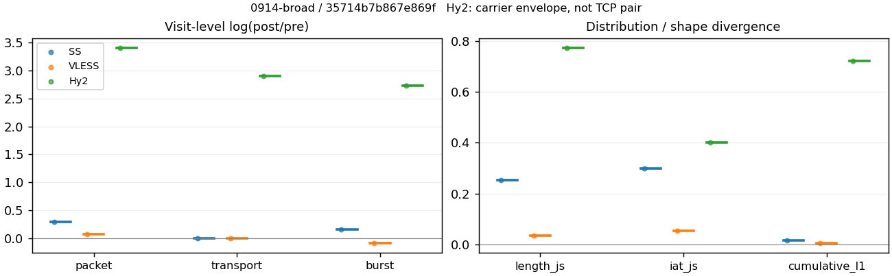
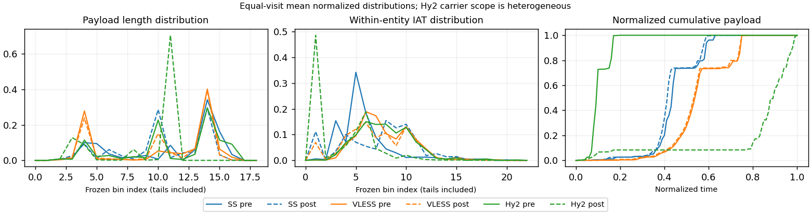

# 0914-broad · 条目 018 · duckduckgo.com

目标：https://duckduckgo.com/

活动标签：duckduckgo.com::page_load。选定访问 3 次。

[返回总索引](../../README.md) · [统计口径](../../methods.md)

## 覆盖与资格（每次访问均保留）

| 部署 | 重复 | 主请求路由 | 活动状态 | 代理比较 | DIRECT pre | 请求 proxy/direct/unresolved | 错误 |
| --- | --- | --- | --- | --- | --- | --- | --- |
| Hy2 | 1 | proxy | passed | 1 | 0 | 95/0/0 | [] |
| SS | 1 | proxy | passed | 1 | 0 | 95/0/0 | [] |
| VLESS | 1 | proxy | passed | 1 | 0 | 95/0/0 | [] |

主请求非 proxy 的统计仅解释为已索引的辅助代理连接或 DIRECT 观测，不代表目标业务经代理传输。播放确认与配对资格是两道不同的门。

图中散点为单次访问，短线为重复中位数；Hy2 是共享载体包络，不能与 TCP 配对作等范围因果对比。

形态图先逐访问归一化，再对访问等权平均；实线 pre，虚线 post。分箱序号及边界见 methods，不将分箱索引误解为长度或时间。

## 每次访问的关键观测

### SS

范围：`exclusive_page`。每格 pre → post；空值为不可观测/不适用。

| 重复 | 包数 | 载荷字节 | burst | TCP FR | IAT中位µs | length JS | IAT JS |
| --- | --- | --- | --- | --- | --- | --- | --- |
| 1 | 1451 → 1931 | 2.1623e+06 → 2.1689e+06 | 991 → 1153 | 24 → 29 | 16.027 → 154.1 | 0.25283 | 0.29772 |

完整标量统计：中位数 [min,max]；Δ 为重复内逐访问变换的中位数，MAD 未缩放。n 为可用变换数；DIRECT-only 的 nΔ=0 不代表 pre 不可用。

| scope | 特征 | pre | post | Δ | IQRΔ | MADΔ | nΔ |
| --- | --- | --- | --- | --- | --- | --- | --- |
| exclusive_page | active_span_sum_s_1000ms | 4.5203 [4.5203, 4.5203] | 4.7596 [4.7596, 4.7596] | 0.051586 | — | — | 1 |
| exclusive_page | active_span_sum_s_100ms | 1.4072 [1.4072, 1.4072] | 2.8567 [2.8567, 2.8567] | 0.70806 | — | — | 1 |
| exclusive_page | active_span_sum_s_500ms | 4.5203 [4.5203, 4.5203] | 4.7596 [4.7596, 4.7596] | 0.051586 | — | — | 1 |
| exclusive_page | burst_bytes_iqr | 2896 [2896, 2896] | 2856 [2856, 2856] | -0.013908 | — | — | 1 |
| exclusive_page | burst_bytes_mad | 31 [31, 31] | 40 [40, 40] | 0.25489 | — | — | 1 |
| exclusive_page | burst_bytes_max | 25032 [25032, 25032] | 21420 [21420, 21420] | -0.15583 | — | — | 1 |
| exclusive_page | burst_bytes_mean | 2182 [2182, 2182] | 1881.1 [1881.1, 1881.1] | -0.14838 | — | — | 1 |
| exclusive_page | burst_bytes_median | 31 [31, 31] | 40 [40, 40] | 0.25489 | — | — | 1 |
| exclusive_page | burst_bytes_min | 0 [0, 0] | 0 [0, 0] | — | — | — | 0 |
| exclusive_page | burst_bytes_p95 | 11584 [11584, 11584] | 7301.6 [7301.6, 7301.6] | -0.46153 | — | — | 1 |
| exclusive_page | burst_bytes_q25 | 0 [0, 0] | 0 [0, 0] | — | — | — | 0 |
| exclusive_page | burst_bytes_q75 | 2896 [2896, 2896] | 2856 [2856, 2856] | -0.013908 | — | — | 1 |
| exclusive_page | burst_bytes_std | 4205.8 [4205.8, 4205.8] | 2942.8 [2942.8, 2942.8] | -0.35708 | — | — | 1 |
| exclusive_page | burst_count | 991 [991, 991] | 1153 [1153, 1153] | 0.15141 | — | — | 1 |
| exclusive_page | burst_duration_ms_iqr | 0 [0, 0] | 0.030576 [0.030576, 0.030576] | — | — | — | 0 |
| exclusive_page | burst_duration_ms_mad | 0 [0, 0] | 0 [0, 0] | — | — | — | 0 |
| exclusive_page | burst_duration_ms_max | 2203.7 [2203.7, 2203.7] | 2014.6 [2014.6, 2014.6] | -0.089757 | — | — | 1 |
| exclusive_page | burst_duration_ms_mean | 6.959 [6.959, 6.959] | 3.7231 [3.7231, 3.7231] | -0.62548 | — | — | 1 |
| exclusive_page | burst_duration_ms_median | 0 [0, 0] | 0 [0, 0] | — | — | — | 0 |
| exclusive_page | burst_duration_ms_min | 0 [0, 0] | 0 [0, 0] | — | — | — | 0 |
| exclusive_page | burst_duration_ms_p95 | 0.12869 [0.12869, 0.12869] | 0.92542 [0.92542, 0.92542] | 1.9728 | — | — | 1 |
| exclusive_page | burst_duration_ms_q25 | 0 [0, 0] | 0 [0, 0] | — | — | — | 0 |
| exclusive_page | burst_duration_ms_q75 | 0 [0, 0] | 0.030576 [0.030576, 0.030576] | — | — | — | 0 |
| exclusive_page | burst_duration_ms_std | 98.523 [98.523, 98.523] | 62.502 [62.502, 62.502] | -0.45509 | — | — | 1 |
| exclusive_page | burst_packets_iqr | 0 [0, 0] | 1 [1, 1] | — | — | — | 0 |
| exclusive_page | burst_packets_mad | 0 [0, 0] | 0 [0, 0] | — | — | — | 0 |
| exclusive_page | burst_packets_max | 10 [10, 10] | 11 [11, 11] | 0.09531 | — | — | 1 |
| exclusive_page | burst_packets_mean | 1.4642 [1.4642, 1.4642] | 1.6748 [1.6748, 1.6748] | 0.13438 | — | — | 1 |
| exclusive_page | burst_packets_median | 1 [1, 1] | 1 [1, 1] | 0 | — | — | 1 |
| exclusive_page | burst_packets_min | 1 [1, 1] | 1 [1, 1] | 0 | — | — | 1 |
| exclusive_page | burst_packets_p95 | 4 [4, 4] | 4 [4, 4] | 0 | — | — | 1 |
| exclusive_page | burst_packets_q25 | 1 [1, 1] | 1 [1, 1] | 0 | — | — | 1 |
| exclusive_page | burst_packets_q75 | 1 [1, 1] | 2 [2, 2] | 0.69315 | — | — | 1 |
| exclusive_page | burst_packets_std | 1.3856 [1.3856, 1.3856] | 1.2498 [1.2498, 1.2498] | -0.1031 | — | — | 1 |
| exclusive_page | connection_span_concurrency_max | 2 [2, 2] | 2 [2, 2] | 0 | — | — | 1 |
| exclusive_page | cumulative_l1 | — | — | 0.016436 | — | — | 1 |
| exclusive_page | cumulative_max | — | — | 0.29564 | — | — | 1 |
| exclusive_page | direction_entropy | 0.55614 [0.55614, 0.55614] | 0.26552 [0.26552, 0.26552] | -0.29062 | — | — | 1 |
| exclusive_page | down_burst_count | 494 [494, 494] | 575 [575, 575] | 0.15183 | — | — | 1 |
| exclusive_page | down_ip_bytes | 2.1916e+06 [2.1916e+06, 2.1916e+06] | 2.2134e+06 [2.2134e+06, 2.2134e+06] | 0.0099134 | — | — | 1 |
| exclusive_page | down_packets | 890 [890, 890] | 1267 [1267, 1267] | 0.35319 | — | — | 1 |
| exclusive_page | down_transport_bytes | 2.1453e+06 [2.1453e+06, 2.1453e+06] | 2.1475e+06 [2.1475e+06, 2.1475e+06] | 0.0010222 | — | — | 1 |
| exclusive_page | duration_s | 5.6918 [5.6918, 5.6918] | 5.6913 [5.6913, 5.6913] | -9.4339e-05 | — | — | 1 |
| exclusive_page | entity_count | 3 [3, 3] | 3 [3, 3] | 0 | — | — | 1 |
| exclusive_page | fr_runs | 24 [24, 24] | 29 [29, 29] | 0.18924 | — | — | 1 |
| exclusive_page | fr_runs_per_packet | 0.026345 [0.026345, 0.026345] | 0.022586 [0.022586, 0.022586] | -0.003759 | — | — | 1 |
| exclusive_page | fr_switches | 21 [21, 21] | 26 [26, 26] | 0.21357 | — | — | 1 |
| exclusive_page | fr_switches_per_possible_transition | 0.023128 [0.023128, 0.023128] | 0.020297 [0.020297, 0.020297] | -0.0028311 | — | — | 1 |
| exclusive_page | full_retransmission_fraction | 0.0048243 [0.0048243, 0.0048243] | 0.0025893 [0.0025893, 0.0025893] | -0.0022349 | — | — | 1 |
| exclusive_page | full_retransmission_packets | 7 [7, 7] | 5 [5, 5] | -0.33647 | — | — | 1 |
| exclusive_page | iat_count | 1448 [1448, 1448] | 1928 [1928, 1928] | 0.2863 | — | — | 1 |
| exclusive_page | iat_js | — | — | 0.29772 | — | — | 1 |
| exclusive_page | iat_ks | — | — | 0.43657 | — | — | 1 |
| exclusive_page | iat_median_us | 16.027 [16.027, 16.027] | 154.1 [154.1, 154.1] | 2.2633 | — | — | 1 |
| exclusive_page | iat_us_iqr | 37.912 [37.912, 37.912] | 658.47 [658.47, 658.47] | 2.8546 | — | — | 1 |
| exclusive_page | iat_us_mad | 11.352 [11.352, 11.352] | 149.73 [149.73, 149.73] | 2.5794 | — | — | 1 |
| exclusive_page | iat_us_max | 2.2037e+06 [2.2037e+06, 2.2037e+06] | 2.0146e+06 [2.0146e+06, 2.0146e+06] | -0.08976 | — | — | 1 |
| exclusive_page | iat_us_mean | 6032.8 [6032.8, 6032.8] | 4529.9 [4529.9, 4529.9] | -0.28653 | — | — | 1 |
| exclusive_page | iat_us_median | 16.027 [16.027, 16.027] | 154.1 [154.1, 154.1] | 2.2633 | — | — | 1 |
| exclusive_page | iat_us_min | 0.096 [0.096, 0.096] | 0.032 [0.032, 0.032] | -1.0986 | — | — | 1 |
| exclusive_page | iat_us_p95 | 2397.2 [2397.2, 2397.2] | 7107.7 [7107.7, 7107.7] | 1.0869 | — | — | 1 |
| exclusive_page | iat_us_q25 | 10.714 [10.714, 10.714] | 10.147 [10.147, 10.147] | -0.05435 | — | — | 1 |
| exclusive_page | iat_us_q75 | 48.626 [48.626, 48.626] | 668.62 [668.62, 668.62] | 2.621 | — | — | 1 |
| exclusive_page | iat_us_std | 82241 [82241, 82241] | 66009 [66009, 66009] | -0.21985 | — | — | 1 |
| exclusive_page | iat_wasserstein_log1p_us | — | — | 1.5089 | — | — | 1 |
| exclusive_page | idle_gap_count_1000ms | 2 [2, 2] | 2 [2, 2] | 0 | — | — | 1 |
| exclusive_page | idle_gap_count_100ms | 16 [16, 16] | 11 [11, 11] | -0.37469 | — | — | 1 |
| exclusive_page | idle_gap_count_500ms | 2 [2, 2] | 2 [2, 2] | 0 | — | — | 1 |
| exclusive_page | idle_gap_sum_s_1000ms | 4.2153 [4.2153, 4.2153] | 3.974 [3.974, 3.974] | -0.058943 | — | — | 1 |
| exclusive_page | idle_gap_sum_s_100ms | 7.3284 [7.3284, 7.3284] | 5.8769 [5.8769, 5.8769] | -0.22072 | — | — | 1 |
| exclusive_page | idle_gap_sum_s_500ms | 4.2153 [4.2153, 4.2153] | 3.974 [3.974, 3.974] | -0.058943 | — | — | 1 |
| exclusive_page | ip_bytes | 2.2379e+06 [2.2379e+06, 2.2379e+06] | 2.2847e+06 [2.2847e+06, 2.2847e+06] | 0.020693 | — | — | 1 |
| exclusive_page | length_iqr | 2385.5 [2385.5, 2385.5] | 1582 [1582, 1582] | -0.41072 | — | — | 1 |
| exclusive_page | length_js | — | — | 0.25283 | — | — | 1 |
| exclusive_page | length_ks | — | — | 0.41916 | — | — | 1 |
| exclusive_page | length_mad | 1408 [1408, 1408] | 1086 [1086, 1086] | -0.25967 | — | — | 1 |
| exclusive_page | length_max | 8920 [8920, 8920] | 8568 [8568, 8568] | -0.040262 | — | — | 1 |
| exclusive_page | length_mean | 2373.6 [2373.6, 2373.6] | 1689.2 [1689.2, 1689.2] | -0.34017 | — | — | 1 |
| exclusive_page | length_median | 2688 [2688, 2688] | 1428 [1428, 1428] | -0.63252 | — | — | 1 |
| exclusive_page | length_min | 2 [2, 2] | 20 [20, 20] | 2.3026 | — | — | 1 |
| exclusive_page | length_p95 | 6717.5 [6717.5, 6717.5] | 2930 [2930, 2930] | -0.82971 | — | — | 1 |
| exclusive_page | length_q25 | 510.5 [510.5, 510.5] | 1274 [1274, 1274] | 0.91453 | — | — | 1 |
| exclusive_page | length_q75 | 2896 [2896, 2896] | 2856 [2856, 2856] | -0.013908 | — | — | 1 |
| exclusive_page | length_std | 1943.3 [1943.3, 1943.3] | 1165.8 [1165.8, 1165.8] | -0.51102 | — | — | 1 |
| exclusive_page | length_wasserstein_bytes | — | — | 790.84 | — | — | 1 |
| exclusive_page | nonempty_entity_count | 3 [3, 3] | 3 [3, 3] | 0 | — | — | 1 |
| exclusive_page | nonempty_packets | 911 [911, 911] | 1284 [1284, 1284] | 0.34319 | — | — | 1 |
| exclusive_page | offload_suspect_fraction | 0.37629 [0.37629, 0.37629] | 0.27602 [0.27602, 0.27602] | -0.10027 | — | — | 1 |
| exclusive_page | packet_count | 1451 [1451, 1451] | 1931 [1931, 1931] | 0.28579 | — | — | 1 |
| exclusive_page | rtt_median_ms | 0.010516 [0.010516, 0.010516] | 38.305 [38.305, 38.305] | 8.2005 | — | — | 1 |
| exclusive_page | rtt_sample_count | 530 [530, 530] | 128 [128, 128] | -1.4208 | — | — | 1 |
| exclusive_page | tcp_ack_count | 1448 [1448, 1448] | 1928 [1928, 1928] | 0.2863 | — | — | 1 |
| exclusive_page | tcp_fin_count | 6 [6, 6] | 6 [6, 6] | 0 | — | — | 1 |
| exclusive_page | tcp_packet_count | 1451 [1451, 1451] | 1931 [1931, 1931] | 0.28579 | — | — | 1 |
| exclusive_page | tcp_rst_count | 0 [0, 0] | 0 [0, 0] | — | — | — | 0 |
| exclusive_page | tcp_syn_count | 6 [6, 6] | 6 [6, 6] | 0 | — | — | 1 |
| exclusive_page | tcp_window_raw_median | 65535 [65535, 65535] | 158 [158, 158] | -6.0277 | — | — | 1 |
| exclusive_page | transition_entropy | 0.13985 [0.13985, 0.13985] | 0.11174 [0.11174, 0.11174] | -0.028111 | — | — | 1 |
| exclusive_page | transition_n_mm | 781 [781, 781] | 1212 [1212, 1212] | 0.43945 | — | — | 1 |
| exclusive_page | transition_n_mp | 9 [9, 9] | 12 [12, 12] | 0.28768 | — | — | 1 |
| exclusive_page | transition_n_pm | 12 [12, 12] | 14 [14, 14] | 0.15415 | — | — | 1 |
| exclusive_page | transition_n_pp | 106 [106, 106] | 43 [43, 43] | -0.90224 | — | — | 1 |
| exclusive_page | transition_p_mm | 0.98861 [0.98861, 0.98861] | 0.9902 [0.9902, 0.9902] | 0.0015885 | — | — | 1 |
| exclusive_page | transition_p_mp | 0.011392 [0.011392, 0.011392] | 0.0098039 [0.0098039, 0.0098039] | -0.0015885 | — | — | 1 |
| exclusive_page | transition_p_pm | 0.10169 [0.10169, 0.10169] | 0.24561 [0.24561, 0.24561] | 0.14392 | — | — | 1 |
| exclusive_page | transition_p_pp | 0.89831 [0.89831, 0.89831] | 0.75439 [0.75439, 0.75439] | -0.14392 | — | — | 1 |
| exclusive_page | transport_bytes | 2.1623e+06 [2.1623e+06, 2.1623e+06] | 2.1689e+06 [2.1689e+06, 2.1689e+06] | 0.0030269 | — | — | 1 |
| exclusive_page | up_burst_count | 497 [497, 497] | 578 [578, 578] | 0.15098 | — | — | 1 |
| exclusive_page | up_byte_fraction | 0.007886 [0.007886, 0.007886] | 0.0098728 [0.0098728, 0.0098728] | 0.0019869 | — | — | 1 |
| exclusive_page | up_ip_bytes | 46332 [46332, 46332] | 71289 [71289, 71289] | 0.43091 | — | — | 1 |
| exclusive_page | up_packets | 561 [561, 561] | 664 [664, 664] | 0.16856 | — | — | 1 |
| exclusive_page | up_transport_bytes | 17052 [17052, 17052] | 21413 [21413, 21413] | 0.22773 | — | — | 1 |
| exclusive_page | zero_iat_count | 0 [0, 0] | 0 [0, 0] | — | — | — | 0 |
| exclusive_page | zero_iat_fraction | 0 [0, 0] | 0 [0, 0] | 0 | — | — | 1 |

### VLESS

范围：`exclusive_page`。每格 pre → post；空值为不可观测/不适用。

| 重复 | 包数 | 载荷字节 | burst | TCP FR | IAT中位µs | length JS | IAT JS |
| --- | --- | --- | --- | --- | --- | --- | --- |
| 1 | 1929 → 2078 | 2.1436e+06 → 2.1477e+06 | 1612 → 1484 | 26 → 30 | 82.034 → 64.37 | 0.034122 | 0.054432 |

完整标量统计：中位数 [min,max]；Δ 为重复内逐访问变换的中位数，MAD 未缩放。n 为可用变换数；DIRECT-only 的 nΔ=0 不代表 pre 不可用。

| scope | 特征 | pre | post | Δ | IQRΔ | MADΔ | nΔ |
| --- | --- | --- | --- | --- | --- | --- | --- |
| exclusive_page | active_span_sum_s_1000ms | 5.3989 [5.3989, 5.3989] | 5.3454 [5.3454, 5.3454] | -0.0099451 | — | — | 1 |
| exclusive_page | active_span_sum_s_100ms | 1.8353 [1.8353, 1.8353] | 2.5792 [2.5792, 2.5792] | 0.34027 | — | — | 1 |
| exclusive_page | active_span_sum_s_500ms | 2.8234 [2.8234, 2.8234] | 4.1508 [4.1508, 4.1508] | 0.38537 | — | — | 1 |
| exclusive_page | burst_bytes_iqr | 2824 [2824, 2824] | 2824 [2824, 2824] | 0 | — | — | 1 |
| exclusive_page | burst_bytes_mad | 72 [72, 72] | 180 [180, 180] | 0.91629 | — | — | 1 |
| exclusive_page | burst_bytes_max | 26032 [26032, 26032] | 42884 [42884, 42884] | 0.49917 | — | — | 1 |
| exclusive_page | burst_bytes_mean | 1329.8 [1329.8, 1329.8] | 1447.2 [1447.2, 1447.2] | 0.084641 | — | — | 1 |
| exclusive_page | burst_bytes_median | 72 [72, 72] | 180 [180, 180] | 0.91629 | — | — | 1 |
| exclusive_page | burst_bytes_min | 0 [0, 0] | 0 [0, 0] | — | — | — | 0 |
| exclusive_page | burst_bytes_p95 | 4344 [4344, 4344] | 4333.2 [4333.2, 4333.2] | -0.0024893 | — | — | 1 |
| exclusive_page | burst_bytes_q25 | 0 [0, 0] | 0 [0, 0] | — | — | — | 0 |
| exclusive_page | burst_bytes_q75 | 2824 [2824, 2824] | 2824 [2824, 2824] | 0 | — | — | 1 |
| exclusive_page | burst_bytes_std | 2572.7 [2572.7, 2572.7] | 2251.2 [2251.2, 2251.2] | -0.13351 | — | — | 1 |
| exclusive_page | burst_count | 1612 [1612, 1612] | 1484 [1484, 1484] | -0.082734 | — | — | 1 |
| exclusive_page | burst_duration_ms_iqr | 0 [0, 0] | 0.0001735 [0.0001735, 0.0001735] | — | — | — | 0 |
| exclusive_page | burst_duration_ms_mad | 0 [0, 0] | 0 [0, 0] | — | — | — | 0 |
| exclusive_page | burst_duration_ms_max | 695.74 [695.74, 695.74] | 601.36 [601.36, 601.36] | -0.14579 | — | — | 1 |
| exclusive_page | burst_duration_ms_mean | 2.3908 [2.3908, 2.3908] | 2.2957 [2.2957, 2.2957] | -0.040619 | — | — | 1 |
| exclusive_page | burst_duration_ms_median | 0 [0, 0] | 0 [0, 0] | — | — | — | 0 |
| exclusive_page | burst_duration_ms_min | 0 [0, 0] | 0 [0, 0] | — | — | — | 0 |
| exclusive_page | burst_duration_ms_p95 | 0.57314 [0.57314, 0.57314] | 3.1471 [3.1471, 3.1471] | 1.7031 | — | — | 1 |
| exclusive_page | burst_duration_ms_q25 | 0 [0, 0] | 0 [0, 0] | — | — | — | 0 |
| exclusive_page | burst_duration_ms_q75 | 0 [0, 0] | 0.0001735 [0.0001735, 0.0001735] | — | — | — | 0 |
| exclusive_page | burst_duration_ms_std | 33.619 [33.619, 33.619] | 26.367 [26.367, 26.367] | -0.24298 | — | — | 1 |
| exclusive_page | burst_packets_iqr | 0 [0, 0] | 1 [1, 1] | — | — | — | 0 |
| exclusive_page | burst_packets_mad | 0 [0, 0] | 0 [0, 0] | — | — | — | 0 |
| exclusive_page | burst_packets_max | 9 [9, 9] | 11 [11, 11] | 0.20067 | — | — | 1 |
| exclusive_page | burst_packets_mean | 1.1967 [1.1967, 1.1967] | 1.4003 [1.4003, 1.4003] | 0.15714 | — | — | 1 |
| exclusive_page | burst_packets_median | 1 [1, 1] | 1 [1, 1] | 0 | — | — | 1 |
| exclusive_page | burst_packets_min | 1 [1, 1] | 1 [1, 1] | 0 | — | — | 1 |
| exclusive_page | burst_packets_p95 | 2 [2, 2] | 3 [3, 3] | 0.40547 | — | — | 1 |
| exclusive_page | burst_packets_q25 | 1 [1, 1] | 1 [1, 1] | 0 | — | — | 1 |
| exclusive_page | burst_packets_q75 | 1 [1, 1] | 2 [2, 2] | 0.69315 | — | — | 1 |
| exclusive_page | burst_packets_std | 0.64598 [0.64598, 0.64598] | 0.81852 [0.81852, 0.81852] | 0.23674 | — | — | 1 |
| exclusive_page | connection_span_concurrency_max | 2 [2, 2] | 2 [2, 2] | 0 | — | — | 1 |
| exclusive_page | cumulative_l1 | — | — | 0.0070903 | — | — | 1 |
| exclusive_page | cumulative_max | — | — | 0.045859 | — | — | 1 |
| exclusive_page | direction_entropy | 0.48278 [0.48278, 0.48278] | 0.24805 [0.24805, 0.24805] | -0.23473 | — | — | 1 |
| exclusive_page | down_burst_count | 805 [805, 805] | 741 [741, 741] | -0.082842 | — | — | 1 |
| exclusive_page | down_ip_bytes | 2.1844e+06 [2.1844e+06, 2.1844e+06] | 2.1927e+06 [2.1927e+06, 2.1927e+06] | 0.0037993 | — | — | 1 |
| exclusive_page | down_packets | 1064 [1064, 1064] | 1223 [1223, 1223] | 0.13927 | — | — | 1 |
| exclusive_page | down_transport_bytes | 2.1291e+06 [2.1291e+06, 2.1291e+06] | 2.1291e+06 [2.1291e+06, 2.1291e+06] | 2.2075e-05 | — | — | 1 |
| exclusive_page | duration_s | 3.493 [3.493, 3.493] | 3.4577 [3.4577, 3.4577] | -0.010171 | — | — | 1 |
| exclusive_page | entity_count | 2 [2, 2] | 2 [2, 2] | 0 | — | — | 1 |
| exclusive_page | fr_runs | 26 [26, 26] | 30 [30, 30] | 0.1431 | — | — | 1 |
| exclusive_page | fr_runs_per_packet | 0.02381 [0.02381, 0.02381] | 0.024272 [0.024272, 0.024272] | 0.00046232 | — | — | 1 |
| exclusive_page | fr_switches | 24 [24, 24] | 28 [28, 28] | 0.15415 | — | — | 1 |
| exclusive_page | fr_switches_per_possible_transition | 0.022018 [0.022018, 0.022018] | 0.02269 [0.02269, 0.02269] | 0.00067209 | — | — | 1 |
| exclusive_page | full_retransmission_fraction | 0.002592 [0.002592, 0.002592] | 0 [0, 0] | -0.002592 | — | — | 1 |
| exclusive_page | full_retransmission_packets | 5 [5, 5] | 0 [0, 0] | — | — | — | 0 |
| exclusive_page | iat_count | 1927 [1927, 1927] | 2076 [2076, 2076] | 0.074479 | — | — | 1 |
| exclusive_page | iat_js | — | — | 0.054432 | — | — | 1 |
| exclusive_page | iat_ks | — | — | 0.14954 | — | — | 1 |
| exclusive_page | iat_median_us | 82.034 [82.034, 82.034] | 64.37 [64.37, 64.37] | -0.24248 | — | — | 1 |
| exclusive_page | iat_us_iqr | 569.39 [569.39, 569.39] | 629.54 [629.54, 629.54] | 0.10044 | — | — | 1 |
| exclusive_page | iat_us_mad | 68.135 [68.135, 68.135] | 60.093 [60.093, 60.093] | -0.1256 | — | — | 1 |
| exclusive_page | iat_us_max | 6.9574e+05 [6.9574e+05, 6.9574e+05] | 6.0136e+05 [6.0136e+05, 6.0136e+05] | -0.14579 | — | — | 1 |
| exclusive_page | iat_us_mean | 2801.7 [2801.7, 2801.7] | 2574.9 [2574.9, 2574.9] | -0.084424 | — | — | 1 |
| exclusive_page | iat_us_median | 82.034 [82.034, 82.034] | 64.37 [64.37, 64.37] | -0.24248 | — | — | 1 |
| exclusive_page | iat_us_min | 0.089 [0.089, 0.089] | 0.032 [0.032, 0.032] | -1.0229 | — | — | 1 |
| exclusive_page | iat_us_p95 | 3173.4 [3173.4, 3173.4] | 3974.3 [3974.3, 3974.3] | 0.22503 | — | — | 1 |
| exclusive_page | iat_us_q25 | 29.414 [29.414, 29.414] | 14.033 [14.033, 14.033] | -0.74011 | — | — | 1 |
| exclusive_page | iat_us_q75 | 598.8 [598.8, 598.8] | 643.58 [643.58, 643.58] | 0.072111 | — | — | 1 |
| exclusive_page | iat_us_std | 31247 [31247, 31247] | 23219 [23219, 23219] | -0.29695 | — | — | 1 |
| exclusive_page | iat_wasserstein_log1p_us | — | — | 0.46815 | — | — | 1 |
| exclusive_page | idle_gap_count_1000ms | 0 [0, 0] | 0 [0, 0] | — | — | — | 0 |
| exclusive_page | idle_gap_count_100ms | 10 [10, 10] | 11 [11, 11] | 0.09531 | — | — | 1 |
| exclusive_page | idle_gap_count_500ms | 4 [4, 4] | 2 [2, 2] | -0.69315 | — | — | 1 |
| exclusive_page | idle_gap_sum_s_1000ms | 0 [0, 0] | 0 [0, 0] | — | — | — | 0 |
| exclusive_page | idle_gap_sum_s_100ms | 3.5636 [3.5636, 3.5636] | 2.7662 [2.7662, 2.7662] | -0.25327 | — | — | 1 |
| exclusive_page | idle_gap_sum_s_500ms | 2.5755 [2.5755, 2.5755] | 1.1946 [1.1946, 1.1946] | -0.76821 | — | — | 1 |
| exclusive_page | ip_bytes | 2.244e+06 [2.244e+06, 2.244e+06] | 2.2568e+06 [2.2568e+06, 2.2568e+06] | 0.0056875 | — | — | 1 |
| exclusive_page | length_iqr | 2738 [2738, 2738] | 2718.5 [2718.5, 2718.5] | -0.0071475 | — | — | 1 |
| exclusive_page | length_js | — | — | 0.034122 | — | — | 1 |
| exclusive_page | length_ks | — | — | 0.080577 | — | — | 1 |
| exclusive_page | length_mad | 1304 [1304, 1304] | 1340 [1340, 1340] | 0.027233 | — | — | 1 |
| exclusive_page | length_max | 8920 [8920, 8920] | 11296 [11296, 11296] | 0.23615 | — | — | 1 |
| exclusive_page | length_mean | 1963 [1963, 1963] | 1737.6 [1737.6, 1737.6] | -0.12196 | — | — | 1 |
| exclusive_page | length_median | 1520 [1520, 1520] | 1484 [1484, 1484] | -0.023969 | — | — | 1 |
| exclusive_page | length_min | 24 [24, 24] | 24 [24, 24] | 0 | — | — | 1 |
| exclusive_page | length_p95 | 5238.2 [5238.2, 5238.2] | 2968 [2968, 2968] | -0.56808 | — | — | 1 |
| exclusive_page | length_q25 | 86 [86, 86] | 105.5 [105.5, 105.5] | 0.20436 | — | — | 1 |
| exclusive_page | length_q75 | 2824 [2824, 2824] | 2824 [2824, 2824] | 0 | — | — | 1 |
| exclusive_page | length_std | 1748.8 [1748.8, 1748.8] | 1361.8 [1361.8, 1361.8] | -0.25013 | — | — | 1 |
| exclusive_page | length_wasserstein_bytes | — | — | 296.13 | — | — | 1 |
| exclusive_page | nonempty_entity_count | 2 [2, 2] | 2 [2, 2] | 0 | — | — | 1 |
| exclusive_page | nonempty_packets | 1092 [1092, 1092] | 1236 [1236, 1236] | 0.12387 | — | — | 1 |
| exclusive_page | offload_suspect_fraction | 0.33126 [0.33126, 0.33126] | 0.30077 [0.30077, 0.30077] | -0.03049 | — | — | 1 |
| exclusive_page | packet_count | 1929 [1929, 1929] | 2078 [2078, 2078] | 0.074404 | — | — | 1 |
| exclusive_page | rtt_median_ms | 0.052411 [0.052411, 0.052411] | 0.047364 [0.047364, 0.047364] | -0.10125 | — | — | 1 |
| exclusive_page | rtt_sample_count | 830 [830, 830] | 802 [802, 802] | -0.034317 | — | — | 1 |
| exclusive_page | tcp_ack_count | 1923 [1923, 1923] | 2076 [2076, 2076] | 0.076556 | — | — | 1 |
| exclusive_page | tcp_fin_count | 4 [4, 4] | 4 [4, 4] | 0 | — | — | 1 |
| exclusive_page | tcp_packet_count | 1929 [1929, 1929] | 2078 [2078, 2078] | 0.074404 | — | — | 1 |
| exclusive_page | tcp_rst_count | 4 [4, 4] | 0 [0, 0] | — | — | — | 0 |
| exclusive_page | tcp_syn_count | 4 [4, 4] | 4 [4, 4] | 0 | — | — | 1 |
| exclusive_page | tcp_window_raw_median | 65535 [65535, 65535] | 202 [202, 202] | -5.7821 | — | — | 1 |
| exclusive_page | transition_entropy | 0.13333 [0.13333, 0.13333] | 0.11979 [0.11979, 0.11979] | -0.013535 | — | — | 1 |
| exclusive_page | transition_n_mm | 965 [965, 965] | 1170 [1170, 1170] | 0.19263 | — | — | 1 |
| exclusive_page | transition_n_mp | 11 [11, 11] | 13 [13, 13] | 0.16705 | — | — | 1 |
| exclusive_page | transition_n_pm | 13 [13, 13] | 15 [15, 15] | 0.1431 | — | — | 1 |
| exclusive_page | transition_n_pp | 101 [101, 101] | 36 [36, 36] | -1.0316 | — | — | 1 |
| exclusive_page | transition_p_mm | 0.98873 [0.98873, 0.98873] | 0.98901 [0.98901, 0.98901] | 0.00028148 | — | — | 1 |
| exclusive_page | transition_p_mp | 0.01127 [0.01127, 0.01127] | 0.010989 [0.010989, 0.010989] | -0.00028148 | — | — | 1 |
| exclusive_page | transition_p_pm | 0.11404 [0.11404, 0.11404] | 0.29412 [0.29412, 0.29412] | 0.18008 | — | — | 1 |
| exclusive_page | transition_p_pp | 0.88596 [0.88596, 0.88596] | 0.70588 [0.70588, 0.70588] | -0.18008 | — | — | 1 |
| exclusive_page | transport_bytes | 2.1436e+06 [2.1436e+06, 2.1436e+06] | 2.1477e+06 [2.1477e+06, 2.1477e+06] | 0.0019066 | — | — | 1 |
| exclusive_page | up_burst_count | 807 [807, 807] | 743 [743, 743] | -0.082628 | — | — | 1 |
| exclusive_page | up_byte_fraction | 0.0067834 [0.0067834, 0.0067834] | 0.0086534 [0.0086534, 0.0086534] | 0.00187 | — | — | 1 |
| exclusive_page | up_ip_bytes | 59549 [59549, 59549] | 64033 [64033, 64033] | 0.072599 | — | — | 1 |
| exclusive_page | up_packets | 865 [865, 865] | 855 [855, 855] | -0.011628 | — | — | 1 |
| exclusive_page | up_transport_bytes | 14541 [14541, 14541] | 18585 [18585, 18585] | 0.24538 | — | — | 1 |
| exclusive_page | zero_iat_count | 0 [0, 0] | 0 [0, 0] | — | — | — | 0 |
| exclusive_page | zero_iat_fraction | 0 [0, 0] | 0 [0, 0] | 0 | — | — | 1 |

### Hy2

范围：`carrier_context_envelope`。每格 pre → post；空值为不可观测/不适用。

| 重复 | 包数 | 载荷字节 | burst | TCP FR | IAT中位µs | length JS | IAT JS |
| --- | --- | --- | --- | --- | --- | --- | --- |
| 1 | 1202 → 36024 | 2.1693e+06 → 3.9284e+07 | 785 → 11983 | — | 110.42 → 2.462 | 0.77099 | 0.39987 |

完整标量统计：中位数 [min,max]；Δ 为重复内逐访问变换的中位数，MAD 未缩放。n 为可用变换数；DIRECT-only 的 nΔ=0 不代表 pre 不可用。

| scope | 特征 | pre | post | Δ | IQRΔ | MADΔ | nΔ |
| --- | --- | --- | --- | --- | --- | --- | --- |
| carrier_context_envelope | active_span_sum_s_1000ms | 3.7395 [3.7395, 3.7395] | 7.4324 [7.4324, 7.4324] | 0.68689 | — | — | 1 |
| carrier_context_envelope | active_span_sum_s_100ms | 0.99949 [0.99949, 0.99949] | 4.9732 [4.9732, 4.9732] | 1.6046 | — | — | 1 |
| carrier_context_envelope | active_span_sum_s_500ms | 3.0671 [3.0671, 3.0671] | 7.4324 [7.4324, 7.4324] | 0.88511 | — | — | 1 |
| carrier_context_envelope | burst_bytes_iqr | 3649 [3649, 3649] | 4253.5 [4253.5, 4253.5] | 0.15329 | — | — | 1 |
| carrier_context_envelope | burst_bytes_mad | 64 [64, 64] | 264 [264, 264] | 1.4171 | — | — | 1 |
| carrier_context_envelope | burst_bytes_max | 29352 [29352, 29352] | 4.1452e+05 [4.1452e+05, 4.1452e+05] | 2.6478 | — | — | 1 |
| carrier_context_envelope | burst_bytes_mean | 2763.4 [2763.4, 2763.4] | 3278.3 [3278.3, 3278.3] | 0.17087 | — | — | 1 |
| carrier_context_envelope | burst_bytes_median | 64 [64, 64] | 297 [297, 297] | 1.5348 | — | — | 1 |
| carrier_context_envelope | burst_bytes_min | 0 [0, 0] | 22 [22, 22] | — | — | — | 0 |
| carrier_context_envelope | burst_bytes_p95 | 14110 [14110, 14110] | 10932 [10932, 10932] | -0.25519 | — | — | 1 |
| carrier_context_envelope | burst_bytes_q25 | 0 [0, 0] | 69.5 [69.5, 69.5] | — | — | — | 0 |
| carrier_context_envelope | burst_bytes_q75 | 3649 [3649, 3649] | 4323 [4323, 4323] | 0.1695 | — | — | 1 |
| carrier_context_envelope | burst_bytes_std | 4901.8 [4901.8, 4901.8] | 8925.3 [8925.3, 8925.3] | 0.59928 | — | — | 1 |
| carrier_context_envelope | burst_count | 785 [785, 785] | 11983 [11983, 11983] | 2.7256 | — | — | 1 |
| carrier_context_envelope | burst_duration_ms_iqr | 0.11762 [0.11762, 0.11762] | 0.023716 [0.023716, 0.023716] | -1.6013 | — | — | 1 |
| carrier_context_envelope | burst_duration_ms_mad | 0 [0, 0] | 4.4e-05 [4.4e-05, 4.4e-05] | — | — | — | 0 |
| carrier_context_envelope | burst_duration_ms_max | 12146 [12146, 12146] | 5801.6 [5801.6, 5801.6] | -0.7389 | — | — | 1 |
| carrier_context_envelope | burst_duration_ms_mean | 33.833 [33.833, 33.833] | 0.65486 [0.65486, 0.65486] | -3.9448 | — | — | 1 |
| carrier_context_envelope | burst_duration_ms_median | 0 [0, 0] | 4.4e-05 [4.4e-05, 4.4e-05] | — | — | — | 0 |
| carrier_context_envelope | burst_duration_ms_min | 0 [0, 0] | 0 [0, 0] | — | — | — | 0 |
| carrier_context_envelope | burst_duration_ms_p95 | 2.5609 [2.5609, 2.5609] | 0.10136 [0.10136, 0.10136] | -3.2294 | — | — | 1 |
| carrier_context_envelope | burst_duration_ms_q25 | 0 [0, 0] | 0 [0, 0] | — | — | — | 0 |
| carrier_context_envelope | burst_duration_ms_q75 | 0.11762 [0.11762, 0.11762] | 0.023716 [0.023716, 0.023716] | -1.6013 | — | — | 1 |
| carrier_context_envelope | burst_duration_ms_std | 601.57 [601.57, 601.57] | 53.061 [53.061, 53.061] | -2.4281 | — | — | 1 |
| carrier_context_envelope | burst_packets_iqr | 1 [1, 1] | 2 [2, 2] | 0.69315 | — | — | 1 |
| carrier_context_envelope | burst_packets_mad | 0 [0, 0] | 1 [1, 1] | — | — | — | 0 |
| carrier_context_envelope | burst_packets_max | 10 [10, 10] | 298 [298, 298] | 3.3945 | — | — | 1 |
| carrier_context_envelope | burst_packets_mean | 1.5312 [1.5312, 1.5312] | 3.0063 [3.0063, 3.0063] | 0.67464 | — | — | 1 |
| carrier_context_envelope | burst_packets_median | 1 [1, 1] | 2 [2, 2] | 0.69315 | — | — | 1 |
| carrier_context_envelope | burst_packets_min | 1 [1, 1] | 1 [1, 1] | 0 | — | — | 1 |
| carrier_context_envelope | burst_packets_p95 | 3 [3, 3] | 8 [8, 8] | 0.98083 | — | — | 1 |
| carrier_context_envelope | burst_packets_q25 | 1 [1, 1] | 1 [1, 1] | 0 | — | — | 1 |
| carrier_context_envelope | burst_packets_q75 | 2 [2, 2] | 3 [3, 3] | 0.40547 | — | — | 1 |
| carrier_context_envelope | burst_packets_std | 0.94934 [0.94934, 0.94934] | 6.2875 [6.2875, 6.2875] | 1.8906 | — | — | 1 |
| carrier_context_envelope | connection_span_concurrency_max | 2 [2, 2] | 1 [1, 1] | -0.69315 | — | — | 1 |
| carrier_context_envelope | cumulative_l1 | — | — | 0.71967 | — | — | 1 |
| carrier_context_envelope | cumulative_max | — | — | 0.91713 | — | — | 1 |
| carrier_context_envelope | direction_entropy | 0.59356 [0.59356, 0.59356] | 0.74973 [0.74973, 0.74973] | 0.15617 | — | — | 1 |
| carrier_context_envelope | direction_run_analog_runs | 28 [28, 28] | 11983 [11983, 11983] | 6.059 | — | — | 1 |
| carrier_context_envelope | direction_run_analog_runs_per_packet | 0.035897 [0.035897, 0.035897] | 0.33264 [0.33264, 0.33264] | 0.29674 | — | — | 1 |
| carrier_context_envelope | direction_run_analog_switches | 25 [25, 25] | 11982 [11982, 11982] | 6.1723 | — | — | 1 |
| carrier_context_envelope | direction_run_analog_switches_per_possible_transition | 0.032175 [0.032175, 0.032175] | 0.33262 [0.33262, 0.33262] | 0.30045 | — | — | 1 |
| carrier_context_envelope | down_burst_count | 391 [391, 391] | 5991 [5991, 5991] | 2.7293 | — | — | 1 |
| carrier_context_envelope | down_ip_bytes | 2.1924e+06 [2.1924e+06, 2.1924e+06] | 3.9545e+07 [3.9545e+07, 3.9545e+07] | 2.8924 | — | — | 1 |
| carrier_context_envelope | down_packets | 771 [771, 771] | 28302 [28302, 28302] | 3.603 | — | — | 1 |
| carrier_context_envelope | down_transport_bytes | 2.1523e+06 [2.1523e+06, 2.1523e+06] | 3.8752e+07 [3.8752e+07, 3.8752e+07] | 2.8907 | — | — | 1 |
| carrier_context_envelope | duration_s | 14.579 [14.579, 14.579] | 14.579 [14.579, 14.579] | -2.7051e-06 | — | — | 1 |
| carrier_context_envelope | entity_count | 3 [3, 3] | 1 [1, 1] | -1.0986 | — | — | 1 |
| carrier_context_envelope | full_retransmission_fraction | 0.0058236 [0.0058236, 0.0058236] | — | — | — | — | 0 |
| carrier_context_envelope | full_retransmission_packets | 7 [7, 7] | — | — | — | — | 0 |
| carrier_context_envelope | iat_count | 1199 [1199, 1199] | 36023 [36023, 36023] | 3.4027 | — | — | 1 |
| carrier_context_envelope | iat_js | — | — | 0.39987 | — | — | 1 |
| carrier_context_envelope | iat_ks | — | — | 0.57526 | — | — | 1 |
| carrier_context_envelope | iat_median_us | 110.42 [110.42, 110.42] | 2.462 [2.462, 2.462] | -3.8033 | — | — | 1 |
| carrier_context_envelope | iat_us_iqr | 563.41 [563.41, 563.41] | 24.567 [24.567, 24.567] | -3.1326 | — | — | 1 |
| carrier_context_envelope | iat_us_mad | 97.516 [97.516, 97.516] | 2.426 [2.426, 2.426] | -3.6938 | — | — | 1 |
| carrier_context_envelope | iat_us_max | 1.2146e+07 [1.2146e+07, 1.2146e+07] | 5.8016e+06 [5.8016e+06, 5.8016e+06] | -0.7389 | — | — | 1 |
| carrier_context_envelope | iat_us_mean | 22994 [22994, 22994] | 404.71 [404.71, 404.71] | -4.0398 | — | — | 1 |
| carrier_context_envelope | iat_us_median | 110.42 [110.42, 110.42] | 2.462 [2.462, 2.462] | -3.8033 | — | — | 1 |
| carrier_context_envelope | iat_us_min | 0.26 [0.26, 0.26] | 0.003 [0.003, 0.003] | -4.4621 | — | — | 1 |
| carrier_context_envelope | iat_us_p95 | 2861.6 [2861.6, 2861.6] | 159.67 [159.67, 159.67] | -2.886 | — | — | 1 |
| carrier_context_envelope | iat_us_q25 | 31.151 [31.151, 31.151] | 0.048 [0.048, 0.048] | -6.4754 | — | — | 1 |
| carrier_context_envelope | iat_us_q75 | 594.56 [594.56, 594.56] | 24.615 [24.615, 24.615] | -3.1845 | — | — | 1 |
| carrier_context_envelope | iat_us_std | 4.8704e+05 [4.8704e+05, 4.8704e+05] | 31590 [31590, 31590] | -2.7355 | — | — | 1 |
| carrier_context_envelope | iat_wasserstein_log1p_us | — | — | 3.1134 | — | — | 1 |
| carrier_context_envelope | idle_gap_count_1000ms | 2 [2, 2] | 2 [2, 2] | 0 | — | — | 1 |
| carrier_context_envelope | idle_gap_count_100ms | 12 [12, 12] | 18 [18, 18] | 0.40547 | — | — | 1 |
| carrier_context_envelope | idle_gap_count_500ms | 3 [3, 3] | 2 [2, 2] | -0.40547 | — | — | 1 |
| carrier_context_envelope | idle_gap_sum_s_1000ms | 23.83 [23.83, 23.83] | 7.1464 [7.1464, 7.1464] | -1.2044 | — | — | 1 |
| carrier_context_envelope | idle_gap_sum_s_100ms | 26.57 [26.57, 26.57] | 9.6055 [9.6055, 9.6055] | -1.0175 | — | — | 1 |
| carrier_context_envelope | idle_gap_sum_s_500ms | 24.503 [24.503, 24.503] | 7.1464 [7.1464, 7.1464] | -1.2322 | — | — | 1 |
| carrier_context_envelope | ip_bytes | 2.2319e+06 [2.2319e+06, 2.2319e+06] | 4.0293e+07 [4.0293e+07, 4.0293e+07] | 2.8933 | — | — | 1 |
| carrier_context_envelope | length_iqr | 1415 [1415, 1415] | 596 [596, 596] | -0.86464 | — | — | 1 |
| carrier_context_envelope | length_js | — | — | 0.77099 | — | — | 1 |
| carrier_context_envelope | length_ks | — | — | 0.55128 | — | — | 1 |
| carrier_context_envelope | length_mad | 752 [752, 752] | 0 [0, 0] | — | — | — | 0 |
| carrier_context_envelope | length_max | 8920 [8920, 8920] | 1441 [1441, 1441] | -1.823 | — | — | 1 |
| carrier_context_envelope | length_mean | 2781.1 [2781.1, 2781.1] | 1090.5 [1090.5, 1090.5] | -0.93621 | — | — | 1 |
| carrier_context_envelope | length_median | 2078 [2078, 2078] | 1441 [1441, 1441] | -0.36607 | — | — | 1 |
| carrier_context_envelope | length_min | 31 [31, 31] | 22 [22, 22] | -0.34294 | — | — | 1 |
| carrier_context_envelope | length_p95 | 8920 [8920, 8920] | 1441 [1441, 1441] | -1.823 | — | — | 1 |
| carrier_context_envelope | length_q25 | 1415 [1415, 1415] | 845 [845, 845] | -0.51555 | — | — | 1 |
| carrier_context_envelope | length_q75 | 2830 [2830, 2830] | 1441 [1441, 1441] | -0.67494 | — | — | 1 |
| carrier_context_envelope | length_std | 2557.6 [2557.6, 2557.6] | 575.1 [575.1, 575.1] | -1.4923 | — | — | 1 |
| carrier_context_envelope | length_wasserstein_bytes | — | — | 1698.7 | — | — | 1 |
| carrier_context_envelope | nonempty_entity_count | 3 [3, 3] | 1 [1, 1] | -1.0986 | — | — | 1 |
| carrier_context_envelope | nonempty_packets | 780 [780, 780] | 36024 [36024, 36024] | 3.8326 | — | — | 1 |
| carrier_context_envelope | offload_suspect_fraction | 0.35108 [0.35108, 0.35108] | 0 [0, 0] | -0.35108 | — | — | 1 |
| carrier_context_envelope | packet_count | 1202 [1202, 1202] | 36024 [36024, 36024] | 3.4002 | — | — | 1 |
| carrier_context_envelope | rtt_median_ms | 0.1822 [0.1822, 0.1822] | — | — | — | — | 0 |
| carrier_context_envelope | rtt_sample_count | 417 [417, 417] | 0 [0, 0] | — | — | — | 0 |
| carrier_context_envelope | tcp_ack_count | 1199 [1199, 1199] | — | — | — | — | 0 |
| carrier_context_envelope | tcp_fin_count | 6 [6, 6] | — | — | — | — | 0 |
| carrier_context_envelope | tcp_packet_count | 1202 [1202, 1202] | 0 [0, 0] | — | — | — | 0 |
| carrier_context_envelope | tcp_rst_count | 0 [0, 0] | — | — | — | — | 0 |
| carrier_context_envelope | tcp_syn_count | 6 [6, 6] | — | — | — | — | 0 |
| carrier_context_envelope | tcp_window_raw_median | 65535 [65535, 65535] | — | — | — | — | 0 |
| carrier_context_envelope | transition_entropy | 0.18238 [0.18238, 0.18238] | 0.74958 [0.74958, 0.74958] | 0.56719 | — | — | 1 |
| carrier_context_envelope | transition_n_mm | 654 [654, 654] | 22311 [22311, 22311] | 3.5297 | — | — | 1 |
| carrier_context_envelope | transition_n_mp | 11 [11, 11] | 5991 [5991, 5991] | 6.3001 | — | — | 1 |
| carrier_context_envelope | transition_n_pm | 14 [14, 14] | 5991 [5991, 5991] | 6.059 | — | — | 1 |
| carrier_context_envelope | transition_n_pp | 98 [98, 98] | 1730 [1730, 1730] | 2.8709 | — | — | 1 |
| carrier_context_envelope | transition_p_mm | 0.98346 [0.98346, 0.98346] | 0.78832 [0.78832, 0.78832] | -0.19514 | — | — | 1 |
| carrier_context_envelope | transition_p_mp | 0.016541 [0.016541, 0.016541] | 0.21168 [0.21168, 0.21168] | 0.19514 | — | — | 1 |
| carrier_context_envelope | transition_p_pm | 0.125 [0.125, 0.125] | 0.77594 [0.77594, 0.77594] | 0.65094 | — | — | 1 |
| carrier_context_envelope | transition_p_pp | 0.875 [0.875, 0.875] | 0.22406 [0.22406, 0.22406] | -0.65094 | — | — | 1 |
| carrier_context_envelope | transport_bytes | 2.1693e+06 [2.1693e+06, 2.1693e+06] | 3.9284e+07 [3.9284e+07, 3.9284e+07] | 2.8964 | — | — | 1 |
| carrier_context_envelope | up_burst_count | 394 [394, 394] | 5992 [5992, 5992] | 2.7218 | — | — | 1 |
| carrier_context_envelope | up_byte_fraction | 0.0078316 [0.0078316, 0.0078316] | 0.013546 [0.013546, 0.013546] | 0.0057144 | — | — | 1 |
| carrier_context_envelope | up_ip_bytes | 39509 [39509, 39509] | 7.4836e+05 [7.4836e+05, 7.4836e+05] | 2.9414 | — | — | 1 |
| carrier_context_envelope | up_packets | 431 [431, 431] | 7722 [7722, 7722] | 2.8857 | — | — | 1 |
| carrier_context_envelope | up_transport_bytes | 16989 [16989, 16989] | 5.3215e+05 [5.3215e+05, 5.3215e+05] | 3.4444 | — | — | 1 |
| carrier_context_envelope | zero_iat_count | 0 [0, 0] | 0 [0, 0] | — | — | — | 0 |
| carrier_context_envelope | zero_iat_fraction | 0 [0, 0] | 0 [0, 0] | 0 | — | — | 1 |

## 不同部署对比

以下是各部署自身重复中位数的差异，不按重复编号强行配对。跨 TCP/Hy2 的行标记异质观测范围。

| 视角 | 特征 | 部署A | 部署B | A中位 | B中位 | B−A | 比较口径 |
| --- | --- | --- | --- | --- | --- | --- | --- |
| pre | burst_count | SS | VLESS | 991 | 1612 | 621 | same_scope_unpaired_visits |
| pre | burst_count | SS | Hy2 | 991 | 785 | -206 | heterogeneous_scope_descriptive_only |
| pre | burst_count | VLESS | Hy2 | 1612 | 785 | -827 | heterogeneous_scope_descriptive_only |
| pre | connection_span_concurrency_max | SS | VLESS | 2 | 2 | 0 | same_scope_unpaired_visits |
| pre | connection_span_concurrency_max | SS | Hy2 | 2 | 2 | 0 | heterogeneous_scope_descriptive_only |
| pre | connection_span_concurrency_max | VLESS | Hy2 | 2 | 2 | 0 | heterogeneous_scope_descriptive_only |
| pre | direction_entropy | SS | VLESS | 0.55614 | 0.48278 | -0.073366 | same_scope_unpaired_visits |
| pre | direction_entropy | SS | Hy2 | 0.55614 | 0.59356 | 0.037421 | heterogeneous_scope_descriptive_only |
| pre | direction_entropy | VLESS | Hy2 | 0.48278 | 0.59356 | 0.11079 | heterogeneous_scope_descriptive_only |
| pre | down_transport_bytes | SS | VLESS | 2.1453e+06 | 2.1291e+06 | -16198 | same_scope_unpaired_visits |
| pre | down_transport_bytes | SS | Hy2 | 2.1453e+06 | 2.1523e+06 | 7020 | heterogeneous_scope_descriptive_only |
| pre | down_transport_bytes | VLESS | Hy2 | 2.1291e+06 | 2.1523e+06 | 23218 | heterogeneous_scope_descriptive_only |
| pre | duration_s | SS | VLESS | 5.6918 | 3.493 | -2.1988 | same_scope_unpaired_visits |
| pre | duration_s | SS | Hy2 | 5.6918 | 14.579 | 8.887 | heterogeneous_scope_descriptive_only |
| pre | duration_s | VLESS | Hy2 | 3.493 | 14.579 | 11.086 | heterogeneous_scope_descriptive_only |
| pre | entity_count | SS | VLESS | 3 | 2 | -1 | same_scope_unpaired_visits |
| pre | entity_count | SS | Hy2 | 3 | 3 | 0 | heterogeneous_scope_descriptive_only |
| pre | entity_count | VLESS | Hy2 | 2 | 3 | 1 | heterogeneous_scope_descriptive_only |
| pre | fr_runs | SS | VLESS | 24 | 26 | 2 | same_scope_unpaired_visits |
| pre | fr_runs_per_packet | SS | VLESS | 0.026345 | 0.02381 | -0.0025352 | same_scope_unpaired_visits |
| pre | fr_switches | SS | VLESS | 21 | 24 | 3 | same_scope_unpaired_visits |
| pre | fr_switches_per_possible_transition | SS | VLESS | 0.023128 | 0.022018 | -0.0011094 | same_scope_unpaired_visits |
| pre | full_retransmission_fraction | SS | VLESS | 0.0048243 | 0.002592 | -0.0022322 | same_scope_unpaired_visits |
| pre | full_retransmission_fraction | SS | Hy2 | 0.0048243 | 0.0058236 | 0.00099937 | heterogeneous_scope_descriptive_only |
| pre | full_retransmission_fraction | VLESS | Hy2 | 0.002592 | 0.0058236 | 0.0032316 | heterogeneous_scope_descriptive_only |
| pre | iat_median_us | SS | VLESS | 16.027 | 82.034 | 66.007 | same_scope_unpaired_visits |
| pre | iat_median_us | SS | Hy2 | 16.027 | 110.42 | 94.388 | heterogeneous_scope_descriptive_only |
| pre | iat_median_us | VLESS | Hy2 | 82.034 | 110.42 | 28.382 | heterogeneous_scope_descriptive_only |
| pre | iat_us_p95 | SS | VLESS | 2397.2 | 3173.4 | 776.23 | same_scope_unpaired_visits |
| pre | iat_us_p95 | SS | Hy2 | 2397.2 | 2861.6 | 464.38 | heterogeneous_scope_descriptive_only |
| pre | iat_us_p95 | VLESS | Hy2 | 3173.4 | 2861.6 | -311.85 | heterogeneous_scope_descriptive_only |
| pre | ip_bytes | SS | VLESS | 2.2379e+06 | 2.244e+06 | 6059 | same_scope_unpaired_visits |
| pre | ip_bytes | SS | Hy2 | 2.2379e+06 | 2.2319e+06 | -5991 | heterogeneous_scope_descriptive_only |
| pre | ip_bytes | VLESS | Hy2 | 2.244e+06 | 2.2319e+06 | -12050 | heterogeneous_scope_descriptive_only |
| pre | length_median | SS | VLESS | 2688 | 1520 | -1168 | same_scope_unpaired_visits |
| pre | length_median | SS | Hy2 | 2688 | 2078 | -610 | heterogeneous_scope_descriptive_only |
| pre | length_median | VLESS | Hy2 | 1520 | 2078 | 558 | heterogeneous_scope_descriptive_only |
| pre | length_p95 | SS | VLESS | 6717.5 | 5238.2 | -1479.3 | same_scope_unpaired_visits |
| pre | length_p95 | SS | Hy2 | 6717.5 | 8920 | 2202.5 | heterogeneous_scope_descriptive_only |
| pre | length_p95 | VLESS | Hy2 | 5238.2 | 8920 | 3681.8 | heterogeneous_scope_descriptive_only |
| pre | nonempty_packets | SS | VLESS | 911 | 1092 | 181 | same_scope_unpaired_visits |
| pre | nonempty_packets | SS | Hy2 | 911 | 780 | -131 | heterogeneous_scope_descriptive_only |
| pre | nonempty_packets | VLESS | Hy2 | 1092 | 780 | -312 | heterogeneous_scope_descriptive_only |
| pre | offload_suspect_fraction | SS | VLESS | 0.37629 | 0.33126 | -0.045032 | same_scope_unpaired_visits |
| pre | offload_suspect_fraction | SS | Hy2 | 0.37629 | 0.35108 | -0.025211 | heterogeneous_scope_descriptive_only |
| pre | offload_suspect_fraction | VLESS | Hy2 | 0.33126 | 0.35108 | 0.019822 | heterogeneous_scope_descriptive_only |
| pre | packet_count | SS | VLESS | 1451 | 1929 | 478 | same_scope_unpaired_visits |
| pre | packet_count | SS | Hy2 | 1451 | 1202 | -249 | heterogeneous_scope_descriptive_only |
| pre | packet_count | VLESS | Hy2 | 1929 | 1202 | -727 | heterogeneous_scope_descriptive_only |
| pre | rtt_median_ms | SS | VLESS | 0.010516 | 0.052411 | 0.041896 | same_scope_unpaired_visits |
| pre | rtt_median_ms | SS | Hy2 | 0.010516 | 0.1822 | 0.17168 | heterogeneous_scope_descriptive_only |
| pre | rtt_median_ms | VLESS | Hy2 | 0.052411 | 0.1822 | 0.12979 | heterogeneous_scope_descriptive_only |
| pre | transition_entropy | SS | VLESS | 0.13985 | 0.13333 | -0.0065221 | same_scope_unpaired_visits |
| pre | transition_entropy | SS | Hy2 | 0.13985 | 0.18238 | 0.042533 | heterogeneous_scope_descriptive_only |
| pre | transition_entropy | VLESS | Hy2 | 0.13333 | 0.18238 | 0.049055 | heterogeneous_scope_descriptive_only |
| pre | transport_bytes | SS | VLESS | 2.1623e+06 | 2.1436e+06 | -18709 | same_scope_unpaired_visits |
| pre | transport_bytes | SS | Hy2 | 2.1623e+06 | 2.1693e+06 | 6957 | heterogeneous_scope_descriptive_only |
| pre | transport_bytes | VLESS | Hy2 | 2.1436e+06 | 2.1693e+06 | 25666 | heterogeneous_scope_descriptive_only |
| pre | up_byte_fraction | SS | VLESS | 0.007886 | 0.0067834 | -0.0011026 | same_scope_unpaired_visits |
| pre | up_byte_fraction | SS | Hy2 | 0.007886 | 0.0078316 | -5.4333e-05 | heterogeneous_scope_descriptive_only |
| pre | up_byte_fraction | VLESS | Hy2 | 0.0067834 | 0.0078316 | 0.0010482 | heterogeneous_scope_descriptive_only |
| pre | up_transport_bytes | SS | VLESS | 17052 | 14541 | -2511 | same_scope_unpaired_visits |
| pre | up_transport_bytes | SS | Hy2 | 17052 | 16989 | -63 | heterogeneous_scope_descriptive_only |
| pre | up_transport_bytes | VLESS | Hy2 | 14541 | 16989 | 2448 | heterogeneous_scope_descriptive_only |
| post | burst_count | SS | VLESS | 1153 | 1484 | 331 | same_scope_unpaired_visits |
| post | burst_count | SS | Hy2 | 1153 | 11983 | 10830 | heterogeneous_scope_descriptive_only |
| post | burst_count | VLESS | Hy2 | 1484 | 11983 | 10499 | heterogeneous_scope_descriptive_only |
| post | connection_span_concurrency_max | SS | VLESS | 2 | 2 | 0 | same_scope_unpaired_visits |
| post | connection_span_concurrency_max | SS | Hy2 | 2 | 1 | -1 | heterogeneous_scope_descriptive_only |
| post | connection_span_concurrency_max | VLESS | Hy2 | 2 | 1 | -1 | heterogeneous_scope_descriptive_only |
| post | direction_entropy | SS | VLESS | 0.26552 | 0.24805 | -0.01747 | same_scope_unpaired_visits |
| post | direction_entropy | SS | Hy2 | 0.26552 | 0.74973 | 0.48421 | heterogeneous_scope_descriptive_only |
| post | direction_entropy | VLESS | Hy2 | 0.24805 | 0.74973 | 0.50168 | heterogeneous_scope_descriptive_only |
| post | down_transport_bytes | SS | VLESS | 2.1475e+06 | 2.1291e+06 | -18345 | same_scope_unpaired_visits |
| post | down_transport_bytes | SS | Hy2 | 2.1475e+06 | 3.8752e+07 | 3.6605e+07 | heterogeneous_scope_descriptive_only |
| post | down_transport_bytes | VLESS | Hy2 | 2.1291e+06 | 3.8752e+07 | 3.6623e+07 | heterogeneous_scope_descriptive_only |
| post | duration_s | SS | VLESS | 5.6913 | 3.4577 | -2.2336 | same_scope_unpaired_visits |
| post | duration_s | SS | Hy2 | 5.6913 | 14.579 | 8.8875 | heterogeneous_scope_descriptive_only |
| post | duration_s | VLESS | Hy2 | 3.4577 | 14.579 | 11.121 | heterogeneous_scope_descriptive_only |
| post | entity_count | SS | VLESS | 3 | 2 | -1 | same_scope_unpaired_visits |
| post | entity_count | SS | Hy2 | 3 | 1 | -2 | heterogeneous_scope_descriptive_only |
| post | entity_count | VLESS | Hy2 | 2 | 1 | -1 | heterogeneous_scope_descriptive_only |
| post | fr_runs | SS | VLESS | 29 | 30 | 1 | same_scope_unpaired_visits |
| post | fr_runs_per_packet | SS | VLESS | 0.022586 | 0.024272 | 0.0016862 | same_scope_unpaired_visits |
| post | fr_switches | SS | VLESS | 26 | 28 | 2 | same_scope_unpaired_visits |
| post | fr_switches_per_possible_transition | SS | VLESS | 0.020297 | 0.02269 | 0.0023938 | same_scope_unpaired_visits |
| post | full_retransmission_fraction | SS | VLESS | 0.0025893 | 0 | -0.0025893 | same_scope_unpaired_visits |
| post | iat_median_us | SS | VLESS | 154.1 | 64.37 | -89.73 | same_scope_unpaired_visits |
| post | iat_median_us | SS | Hy2 | 154.1 | 2.462 | -151.64 | heterogeneous_scope_descriptive_only |
| post | iat_median_us | VLESS | Hy2 | 64.37 | 2.462 | -61.908 | heterogeneous_scope_descriptive_only |
| post | iat_us_p95 | SS | VLESS | 7107.7 | 3974.3 | -3133.5 | same_scope_unpaired_visits |
| post | iat_us_p95 | SS | Hy2 | 7107.7 | 159.67 | -6948.1 | heterogeneous_scope_descriptive_only |
| post | iat_us_p95 | VLESS | Hy2 | 3974.3 | 159.67 | -3814.6 | heterogeneous_scope_descriptive_only |
| post | ip_bytes | SS | VLESS | 2.2847e+06 | 2.2568e+06 | -27933 | same_scope_unpaired_visits |
| post | ip_bytes | SS | Hy2 | 2.2847e+06 | 4.0293e+07 | 3.8008e+07 | heterogeneous_scope_descriptive_only |
| post | ip_bytes | VLESS | Hy2 | 2.2568e+06 | 4.0293e+07 | 3.8036e+07 | heterogeneous_scope_descriptive_only |
| post | length_median | SS | VLESS | 1428 | 1484 | 56 | same_scope_unpaired_visits |
| post | length_median | SS | Hy2 | 1428 | 1441 | 13 | heterogeneous_scope_descriptive_only |
| post | length_median | VLESS | Hy2 | 1484 | 1441 | -43 | heterogeneous_scope_descriptive_only |
| post | length_p95 | SS | VLESS | 2930 | 2968 | 38 | same_scope_unpaired_visits |
| post | length_p95 | SS | Hy2 | 2930 | 1441 | -1489 | heterogeneous_scope_descriptive_only |
| post | length_p95 | VLESS | Hy2 | 2968 | 1441 | -1527 | heterogeneous_scope_descriptive_only |
| post | nonempty_packets | SS | VLESS | 1284 | 1236 | -48 | same_scope_unpaired_visits |
| post | nonempty_packets | SS | Hy2 | 1284 | 36024 | 34740 | heterogeneous_scope_descriptive_only |
| post | nonempty_packets | VLESS | Hy2 | 1236 | 36024 | 34788 | heterogeneous_scope_descriptive_only |
| post | offload_suspect_fraction | SS | VLESS | 0.27602 | 0.30077 | 0.024747 | same_scope_unpaired_visits |
| post | offload_suspect_fraction | SS | Hy2 | 0.27602 | 0 | -0.27602 | heterogeneous_scope_descriptive_only |
| post | offload_suspect_fraction | VLESS | Hy2 | 0.30077 | 0 | -0.30077 | heterogeneous_scope_descriptive_only |
| post | packet_count | SS | VLESS | 1931 | 2078 | 147 | same_scope_unpaired_visits |
| post | packet_count | SS | Hy2 | 1931 | 36024 | 34093 | heterogeneous_scope_descriptive_only |
| post | packet_count | VLESS | Hy2 | 2078 | 36024 | 33946 | heterogeneous_scope_descriptive_only |
| post | rtt_median_ms | SS | VLESS | 38.305 | 0.047364 | -38.258 | same_scope_unpaired_visits |
| post | transition_entropy | SS | VLESS | 0.11174 | 0.11979 | 0.0080543 | same_scope_unpaired_visits |
| post | transition_entropy | SS | Hy2 | 0.11174 | 0.74958 | 0.63784 | heterogeneous_scope_descriptive_only |
| post | transition_entropy | VLESS | Hy2 | 0.11979 | 0.74958 | 0.62978 | heterogeneous_scope_descriptive_only |
| post | transport_bytes | SS | VLESS | 2.1689e+06 | 2.1477e+06 | -21173 | same_scope_unpaired_visits |
| post | transport_bytes | SS | Hy2 | 2.1689e+06 | 3.9284e+07 | 3.7116e+07 | heterogeneous_scope_descriptive_only |
| post | transport_bytes | VLESS | Hy2 | 2.1477e+06 | 3.9284e+07 | 3.7137e+07 | heterogeneous_scope_descriptive_only |
| post | up_byte_fraction | SS | VLESS | 0.0098728 | 0.0086534 | -0.0012194 | same_scope_unpaired_visits |
| post | up_byte_fraction | SS | Hy2 | 0.0098728 | 0.013546 | 0.0036731 | heterogeneous_scope_descriptive_only |
| post | up_byte_fraction | VLESS | Hy2 | 0.0086534 | 0.013546 | 0.0048926 | heterogeneous_scope_descriptive_only |
| post | up_transport_bytes | SS | VLESS | 21413 | 18585 | -2828 | same_scope_unpaired_visits |
| post | up_transport_bytes | SS | Hy2 | 21413 | 5.3215e+05 | 5.1073e+05 | heterogeneous_scope_descriptive_only |
| post | up_transport_bytes | VLESS | Hy2 | 18585 | 5.3215e+05 | 5.1356e+05 | heterogeneous_scope_descriptive_only |
| transformation | burst_count | SS | VLESS | 0.15141 | -0.082734 | -0.23414 | same_scope_unpaired_visits |
| transformation | burst_count | SS | Hy2 | 0.15141 | 2.7256 | 2.5742 | heterogeneous_scope_descriptive_only |
| transformation | burst_count | VLESS | Hy2 | -0.082734 | 2.7256 | 2.8083 | heterogeneous_scope_descriptive_only |
| transformation | connection_span_concurrency_max | SS | VLESS | 0 | 0 | 0 | same_scope_unpaired_visits |
| transformation | connection_span_concurrency_max | SS | Hy2 | 0 | -0.69315 | -0.69315 | heterogeneous_scope_descriptive_only |
| transformation | connection_span_concurrency_max | VLESS | Hy2 | 0 | -0.69315 | -0.69315 | heterogeneous_scope_descriptive_only |
| transformation | direction_entropy | SS | VLESS | -0.29062 | -0.23473 | 0.055896 | same_scope_unpaired_visits |
| transformation | direction_entropy | SS | Hy2 | -0.29062 | 0.15617 | 0.44679 | heterogeneous_scope_descriptive_only |
| transformation | direction_entropy | VLESS | Hy2 | -0.23473 | 0.15617 | 0.39089 | heterogeneous_scope_descriptive_only |
| transformation | down_transport_bytes | SS | VLESS | 0.0010222 | 2.2075e-05 | -0.0010001 | same_scope_unpaired_visits |
| transformation | down_transport_bytes | SS | Hy2 | 0.0010222 | 2.8907 | 2.8896 | heterogeneous_scope_descriptive_only |
| transformation | down_transport_bytes | VLESS | Hy2 | 2.2075e-05 | 2.8907 | 2.8906 | heterogeneous_scope_descriptive_only |
| transformation | duration_s | SS | VLESS | -9.4339e-05 | -0.010171 | -0.010077 | same_scope_unpaired_visits |
| transformation | duration_s | SS | Hy2 | -9.4339e-05 | -2.7051e-06 | 9.1634e-05 | heterogeneous_scope_descriptive_only |
| transformation | duration_s | VLESS | Hy2 | -0.010171 | -2.7051e-06 | 0.010169 | heterogeneous_scope_descriptive_only |
| transformation | entity_count | SS | VLESS | 0 | 0 | 0 | same_scope_unpaired_visits |
| transformation | entity_count | SS | Hy2 | 0 | -1.0986 | -1.0986 | heterogeneous_scope_descriptive_only |
| transformation | entity_count | VLESS | Hy2 | 0 | -1.0986 | -1.0986 | heterogeneous_scope_descriptive_only |
| transformation | fr_runs | SS | VLESS | 0.18924 | 0.1431 | -0.046141 | same_scope_unpaired_visits |
| transformation | fr_runs_per_packet | SS | VLESS | -0.003759 | 0.00046232 | 0.0042213 | same_scope_unpaired_visits |
| transformation | fr_switches | SS | VLESS | 0.21357 | 0.15415 | -0.059423 | same_scope_unpaired_visits |
| transformation | fr_switches_per_possible_transition | SS | VLESS | -0.0028311 | 0.00067209 | 0.0035032 | same_scope_unpaired_visits |
| transformation | full_retransmission_fraction | SS | VLESS | -0.0022349 | -0.002592 | -0.00035709 | same_scope_unpaired_visits |
| transformation | iat_median_us | SS | VLESS | 2.2633 | -0.24248 | -2.5058 | same_scope_unpaired_visits |
| transformation | iat_median_us | SS | Hy2 | 2.2633 | -3.8033 | -6.0666 | heterogeneous_scope_descriptive_only |
| transformation | iat_median_us | VLESS | Hy2 | -0.24248 | -3.8033 | -3.5608 | heterogeneous_scope_descriptive_only |
| transformation | iat_us_p95 | SS | VLESS | 1.0869 | 0.22503 | -0.86186 | same_scope_unpaired_visits |
| transformation | iat_us_p95 | SS | Hy2 | 1.0869 | -2.886 | -3.9729 | heterogeneous_scope_descriptive_only |
| transformation | iat_us_p95 | VLESS | Hy2 | 0.22503 | -2.886 | -3.1111 | heterogeneous_scope_descriptive_only |
| transformation | ip_bytes | SS | VLESS | 0.020693 | 0.0056875 | -0.015005 | same_scope_unpaired_visits |
| transformation | ip_bytes | SS | Hy2 | 0.020693 | 2.8933 | 2.8726 | heterogeneous_scope_descriptive_only |
| transformation | ip_bytes | VLESS | Hy2 | 0.0056875 | 2.8933 | 2.8876 | heterogeneous_scope_descriptive_only |
| transformation | length_median | SS | VLESS | -0.63252 | -0.023969 | 0.60855 | same_scope_unpaired_visits |
| transformation | length_median | SS | Hy2 | -0.63252 | -0.36607 | 0.26645 | heterogeneous_scope_descriptive_only |
| transformation | length_median | VLESS | Hy2 | -0.023969 | -0.36607 | -0.3421 | heterogeneous_scope_descriptive_only |
| transformation | length_p95 | SS | VLESS | -0.82971 | -0.56808 | 0.26163 | same_scope_unpaired_visits |
| transformation | length_p95 | SS | Hy2 | -0.82971 | -1.823 | -0.99324 | heterogeneous_scope_descriptive_only |
| transformation | length_p95 | VLESS | Hy2 | -0.56808 | -1.823 | -1.2549 | heterogeneous_scope_descriptive_only |
| transformation | nonempty_packets | SS | VLESS | 0.34319 | 0.12387 | -0.21932 | same_scope_unpaired_visits |
| transformation | nonempty_packets | SS | Hy2 | 0.34319 | 3.8326 | 3.4895 | heterogeneous_scope_descriptive_only |
| transformation | nonempty_packets | VLESS | Hy2 | 0.12387 | 3.8326 | 3.7088 | heterogeneous_scope_descriptive_only |
| transformation | offload_suspect_fraction | SS | VLESS | -0.10027 | -0.03049 | 0.06978 | same_scope_unpaired_visits |
| transformation | offload_suspect_fraction | SS | Hy2 | -0.10027 | -0.35108 | -0.25081 | heterogeneous_scope_descriptive_only |
| transformation | offload_suspect_fraction | VLESS | Hy2 | -0.03049 | -0.35108 | -0.32059 | heterogeneous_scope_descriptive_only |
| transformation | packet_count | SS | VLESS | 0.28579 | 0.074404 | -0.21138 | same_scope_unpaired_visits |
| transformation | packet_count | SS | Hy2 | 0.28579 | 3.4002 | 3.1144 | heterogeneous_scope_descriptive_only |
| transformation | packet_count | VLESS | Hy2 | 0.074404 | 3.4002 | 3.3258 | heterogeneous_scope_descriptive_only |
| transformation | rtt_median_ms | SS | VLESS | 8.2005 | -0.10125 | -8.3017 | same_scope_unpaired_visits |
| transformation | transition_entropy | SS | VLESS | -0.028111 | -0.013535 | 0.014576 | same_scope_unpaired_visits |
| transformation | transition_entropy | SS | Hy2 | -0.028111 | 0.56719 | 0.59531 | heterogeneous_scope_descriptive_only |
| transformation | transition_entropy | VLESS | Hy2 | -0.013535 | 0.56719 | 0.58073 | heterogeneous_scope_descriptive_only |
| transformation | transport_bytes | SS | VLESS | 0.0030269 | 0.0019066 | -0.0011202 | same_scope_unpaired_visits |
| transformation | transport_bytes | SS | Hy2 | 0.0030269 | 2.8964 | 2.8934 | heterogeneous_scope_descriptive_only |
| transformation | transport_bytes | VLESS | Hy2 | 0.0019066 | 2.8964 | 2.8945 | heterogeneous_scope_descriptive_only |
| transformation | up_byte_fraction | SS | VLESS | 0.0019869 | 0.00187 | -0.00011686 | same_scope_unpaired_visits |
| transformation | up_byte_fraction | SS | Hy2 | 0.0019869 | 0.0057144 | 0.0037275 | heterogeneous_scope_descriptive_only |
| transformation | up_byte_fraction | VLESS | Hy2 | 0.00187 | 0.0057144 | 0.0038443 | heterogeneous_scope_descriptive_only |
| transformation | up_transport_bytes | SS | VLESS | 0.22773 | 0.24538 | 0.017652 | same_scope_unpaired_visits |
| transformation | up_transport_bytes | SS | Hy2 | 0.22773 | 3.4444 | 3.2166 | heterogeneous_scope_descriptive_only |
| transformation | up_transport_bytes | VLESS | Hy2 | 0.24538 | 3.4444 | 3.199 | heterogeneous_scope_descriptive_only |
| transformation | length_js | SS | VLESS | 0.25283 | 0.034122 | -0.21871 | same_scope_unpaired_visits |
| transformation | length_js | SS | Hy2 | 0.25283 | 0.77099 | 0.51816 | heterogeneous_scope_descriptive_only |
| transformation | length_js | VLESS | Hy2 | 0.034122 | 0.77099 | 0.73687 | heterogeneous_scope_descriptive_only |
| transformation | length_ks | SS | VLESS | 0.41916 | 0.080577 | -0.33858 | same_scope_unpaired_visits |
| transformation | length_ks | SS | Hy2 | 0.41916 | 0.55128 | 0.13212 | heterogeneous_scope_descriptive_only |
| transformation | length_ks | VLESS | Hy2 | 0.080577 | 0.55128 | 0.4707 | heterogeneous_scope_descriptive_only |
| transformation | length_wasserstein_bytes | SS | VLESS | 790.84 | 296.13 | -494.71 | same_scope_unpaired_visits |
| transformation | length_wasserstein_bytes | SS | Hy2 | 790.84 | 1698.7 | 907.86 | heterogeneous_scope_descriptive_only |
| transformation | length_wasserstein_bytes | VLESS | Hy2 | 296.13 | 1698.7 | 1402.6 | heterogeneous_scope_descriptive_only |
| transformation | iat_js | SS | VLESS | 0.29772 | 0.054432 | -0.24329 | same_scope_unpaired_visits |
| transformation | iat_js | SS | Hy2 | 0.29772 | 0.39987 | 0.10215 | heterogeneous_scope_descriptive_only |
| transformation | iat_js | VLESS | Hy2 | 0.054432 | 0.39987 | 0.34544 | heterogeneous_scope_descriptive_only |
| transformation | iat_ks | SS | VLESS | 0.43657 | 0.14954 | -0.28703 | same_scope_unpaired_visits |
| transformation | iat_ks | SS | Hy2 | 0.43657 | 0.57526 | 0.13869 | heterogeneous_scope_descriptive_only |
| transformation | iat_ks | VLESS | Hy2 | 0.14954 | 0.57526 | 0.42571 | heterogeneous_scope_descriptive_only |
| transformation | iat_wasserstein_log1p_us | SS | VLESS | 1.5089 | 0.46815 | -1.0407 | same_scope_unpaired_visits |
| transformation | iat_wasserstein_log1p_us | SS | Hy2 | 1.5089 | 3.1134 | 1.6046 | heterogeneous_scope_descriptive_only |
| transformation | iat_wasserstein_log1p_us | VLESS | Hy2 | 0.46815 | 3.1134 | 2.6453 | heterogeneous_scope_descriptive_only |
| transformation | cumulative_l1 | SS | VLESS | 0.016436 | 0.0070903 | -0.0093456 | same_scope_unpaired_visits |
| transformation | cumulative_l1 | SS | Hy2 | 0.016436 | 0.71967 | 0.70324 | heterogeneous_scope_descriptive_only |
| transformation | cumulative_l1 | VLESS | Hy2 | 0.0070903 | 0.71967 | 0.71258 | heterogeneous_scope_descriptive_only |

## 可复核的访问标识

| 部署 | 重复 | session_id |
| --- | --- | --- |
| SS | 1 | 807cbe75-2db1-422e-a8fa-b2dc05fdd8f3 |
| VLESS | 1 | c6f5fdb9-8d47-4d05-92fe-c441067e2ecf |
| Hy2 | 1 | 557238db-e2a8-4902-a972-3db6ab02516d |

全量三种 packet selection、Hy2 full 范围、Q25/Q75、直方图与曲线见机器可读产物；本页只显示 observed 主范围。
