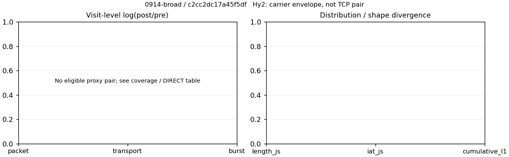

# 0914-broad · 条目 019 · 12306.cn

目标：https://www.12306.cn/index/

活动标签：12306.cn::page_load。选定访问 3 次。

[返回总索引](../../README.md) · [统计口径](../../methods.md)

## 覆盖与资格（每次访问均保留）

| 部署 | 重复 | 主请求路由 | 活动状态 | 代理比较 | DIRECT pre | 请求 proxy/direct/unresolved | 错误 |
| --- | --- | --- | --- | --- | --- | --- | --- |
| Hy2 | 1 | direct | passed | 0 | 1 | 0/89/0 | [] |
| SS | 1 | direct | passed | 0 | 1 | 0/89/0 | [] |
| VLESS | 1 | direct | passed | 0 | 1 | 0/89/0 | [] |

主请求非 proxy 的统计仅解释为已索引的辅助代理连接或 DIRECT 观测，不代表目标业务经代理传输。播放确认与配对资格是两道不同的门。

图中散点为单次访问，短线为重复中位数；Hy2 是共享载体包络，不能与 TCP 配对作等范围因果对比。

形态图先逐访问归一化，再对访问等权平均；实线 pre，虚线 post。分箱序号及边界见 methods，不将分箱索引误解为长度或时间。

## 每次访问的关键观测

### SS

范围：`direct_pre_only`。每格 pre → post；空值为不可观测/不适用。

| 重复 | 包数 | 载荷字节 | burst | TCP FR | IAT中位µs | length JS | IAT JS |
| --- | --- | --- | --- | --- | --- | --- | --- |
| 1 | 2462 → — | 6.4687e+06 → — | 1567 → — | 218 → — | 50.164 → — | — | — |

完整标量统计：中位数 [min,max]；Δ 为重复内逐访问变换的中位数，MAD 未缩放。n 为可用变换数；DIRECT-only 的 nΔ=0 不代表 pre 不可用。

| scope | 特征 | pre | post | Δ | IQRΔ | MADΔ | nΔ |
| --- | --- | --- | --- | --- | --- | --- | --- |
| direct_pre_only | active_span_sum_s_1000ms | 19.301 [19.301, 19.301] | — | — | — | — | 0 |
| direct_pre_only | active_span_sum_s_100ms | 4.2428 [4.2428, 4.2428] | — | — | — | — | 0 |
| direct_pre_only | active_span_sum_s_500ms | 7.6761 [7.6761, 7.6761] | — | — | — | — | 0 |
| direct_pre_only | burst_bytes_iqr | 7200 [7200, 7200] | — | — | — | — | 0 |
| direct_pre_only | burst_bytes_mad | 614 [614, 614] | — | — | — | — | 0 |
| direct_pre_only | burst_bytes_max | 28672 [28672, 28672] | — | — | — | — | 0 |
| direct_pre_only | burst_bytes_mean | 4128.1 [4128.1, 4128.1] | — | — | — | — | 0 |
| direct_pre_only | burst_bytes_median | 614 [614, 614] | — | — | — | — | 0 |
| direct_pre_only | burst_bytes_min | 0 [0, 0] | — | — | — | — | 0 |
| direct_pre_only | burst_bytes_p95 | 20480 [20480, 20480] | — | — | — | — | 0 |
| direct_pre_only | burst_bytes_q25 | 0 [0, 0] | — | — | — | — | 0 |
| direct_pre_only | burst_bytes_q75 | 7200 [7200, 7200] | — | — | — | — | 0 |
| direct_pre_only | burst_bytes_std | 6231.7 [6231.7, 6231.7] | — | — | — | — | 0 |
| direct_pre_only | burst_count | 1567 [1567, 1567] | — | — | — | — | 0 |
| direct_pre_only | burst_duration_ms_iqr | 0.064934 [0.064934, 0.064934] | — | — | — | — | 0 |
| direct_pre_only | burst_duration_ms_mad | 0 [0, 0] | — | — | — | — | 0 |
| direct_pre_only | burst_duration_ms_max | 14441 [14441, 14441] | — | — | — | — | 0 |
| direct_pre_only | burst_duration_ms_mean | 24.267 [24.267, 24.267] | — | — | — | — | 0 |
| direct_pre_only | burst_duration_ms_median | 0 [0, 0] | — | — | — | — | 0 |
| direct_pre_only | burst_duration_ms_min | 0 [0, 0] | — | — | — | — | 0 |
| direct_pre_only | burst_duration_ms_p95 | 14.612 [14.612, 14.612] | — | — | — | — | 0 |
| direct_pre_only | burst_duration_ms_q25 | 0 [0, 0] | — | — | — | — | 0 |
| direct_pre_only | burst_duration_ms_q75 | 0.064934 [0.064934, 0.064934] | — | — | — | — | 0 |
| direct_pre_only | burst_duration_ms_std | 378.63 [378.63, 378.63] | — | — | — | — | 0 |
| direct_pre_only | burst_packets_iqr | 1 [1, 1] | — | — | — | — | 0 |
| direct_pre_only | burst_packets_mad | 0 [0, 0] | — | — | — | — | 0 |
| direct_pre_only | burst_packets_max | 9 [9, 9] | — | — | — | — | 0 |
| direct_pre_only | burst_packets_mean | 1.5712 [1.5712, 1.5712] | — | — | — | — | 0 |
| direct_pre_only | burst_packets_median | 1 [1, 1] | — | — | — | — | 0 |
| direct_pre_only | burst_packets_min | 1 [1, 1] | — | — | — | — | 0 |
| direct_pre_only | burst_packets_p95 | 4 [4, 4] | — | — | — | — | 0 |
| direct_pre_only | burst_packets_q25 | 1 [1, 1] | — | — | — | — | 0 |
| direct_pre_only | burst_packets_q75 | 2 [2, 2] | — | — | — | — | 0 |
| direct_pre_only | burst_packets_std | 1.0788 [1.0788, 1.0788] | — | — | — | — | 0 |
| direct_pre_only | connection_span_concurrency_max | 19 [19, 19] | — | — | — | — | 0 |
| direct_pre_only | direction_entropy | 0.41745 [0.41745, 0.41745] | — | — | — | — | 0 |
| direct_pre_only | down_burst_count | 774 [774, 774] | — | — | — | — | 0 |
| direct_pre_only | down_ip_bytes | 6.4489e+06 [6.4489e+06, 6.4489e+06] | — | — | — | — | 0 |
| direct_pre_only | down_packets | 1564 [1564, 1564] | — | — | — | — | 0 |
| direct_pre_only | down_transport_bytes | 6.3674e+06 [6.3674e+06, 6.3674e+06] | — | — | — | — | 0 |
| direct_pre_only | duration_s | 45.419 [45.419, 45.419] | — | — | — | — | 0 |
| direct_pre_only | entity_count | 19 [19, 19] | — | — | — | — | 0 |
| direct_pre_only | fr_runs | 218 [218, 218] | — | — | — | — | 0 |
| direct_pre_only | fr_runs_per_packet | 0.14485 [0.14485, 0.14485] | — | — | — | — | 0 |
| direct_pre_only | fr_switches | 199 [199, 199] | — | — | — | — | 0 |
| direct_pre_only | fr_switches_per_possible_transition | 0.13392 [0.13392, 0.13392] | — | — | — | — | 0 |
| direct_pre_only | full_retransmission_fraction | 0.011779 [0.011779, 0.011779] | — | — | — | — | 0 |
| direct_pre_only | full_retransmission_packets | 29 [29, 29] | — | — | — | — | 0 |
| direct_pre_only | iat_count | 2443 [2443, 2443] | — | — | — | — | 0 |
| direct_pre_only | iat_median_us | 50.164 [50.164, 50.164] | — | — | — | — | 0 |
| direct_pre_only | iat_us_iqr | 241.45 [241.45, 241.45] | — | — | — | — | 0 |
| direct_pre_only | iat_us_mad | 43.553 [43.553, 43.553] | — | — | — | — | 0 |
| direct_pre_only | iat_us_max | 1.5001e+07 [1.5001e+07, 1.5001e+07] | — | — | — | — | 0 |
| direct_pre_only | iat_us_mean | 28668 [28668, 28668] | — | — | — | — | 0 |
| direct_pre_only | iat_us_median | 50.164 [50.164, 50.164] | — | — | — | — | 0 |
| direct_pre_only | iat_us_min | 0.58 [0.58, 0.58] | — | — | — | — | 0 |
| direct_pre_only | iat_us_p95 | 13035 [13035, 13035] | — | — | — | — | 0 |
| direct_pre_only | iat_us_q25 | 13.069 [13.069, 13.069] | — | — | — | — | 0 |
| direct_pre_only | iat_us_q75 | 254.52 [254.52, 254.52] | — | — | — | — | 0 |
| direct_pre_only | iat_us_std | 5.2526e+05 [5.2526e+05, 5.2526e+05] | — | — | — | — | 0 |
| direct_pre_only | idle_gap_count_1000ms | 9 [9, 9] | — | — | — | — | 0 |
| direct_pre_only | idle_gap_count_100ms | 42 [42, 42] | — | — | — | — | 0 |
| direct_pre_only | idle_gap_count_500ms | 23 [23, 23] | — | — | — | — | 0 |
| direct_pre_only | idle_gap_sum_s_1000ms | 50.735 [50.735, 50.735] | — | — | — | — | 0 |
| direct_pre_only | idle_gap_sum_s_100ms | 65.794 [65.794, 65.794] | — | — | — | — | 0 |
| direct_pre_only | idle_gap_sum_s_500ms | 62.361 [62.361, 62.361] | — | — | — | — | 0 |
| direct_pre_only | ip_bytes | 6.5973e+06 [6.5973e+06, 6.5973e+06] | — | — | — | — | 0 |
| direct_pre_only | length_iqr | 5344 [5344, 5344] | — | — | — | — | 0 |
| direct_pre_only | length_mad | 2043 [2043, 2043] | — | — | — | — | 0 |
| direct_pre_only | length_max | 8920 [8920, 8920] | — | — | — | — | 0 |
| direct_pre_only | length_mean | 4298.1 [4298.1, 4298.1] | — | — | — | — | 0 |
| direct_pre_only | length_median | 2880 [2880, 2880] | — | — | — | — | 0 |
| direct_pre_only | length_min | 13 [13, 13] | — | — | — | — | 0 |
| direct_pre_only | length_p95 | 8920 [8920, 8920] | — | — | — | — | 0 |
| direct_pre_only | length_q25 | 1827 [1827, 1827] | — | — | — | — | 0 |
| direct_pre_only | length_q75 | 7171 [7171, 7171] | — | — | — | — | 0 |
| direct_pre_only | length_std | 2956.7 [2956.7, 2956.7] | — | — | — | — | 0 |
| direct_pre_only | nonempty_entity_count | 19 [19, 19] | — | — | — | — | 0 |
| direct_pre_only | nonempty_packets | 1505 [1505, 1505] | — | — | — | — | 0 |
| direct_pre_only | offload_suspect_fraction | 0.48213 [0.48213, 0.48213] | — | — | — | — | 0 |
| direct_pre_only | packet_count | 2462 [2462, 2462] | — | — | — | — | 0 |
| direct_pre_only | rtt_median_ms | 0.064376 [0.064376, 0.064376] | — | — | — | — | 0 |
| direct_pre_only | rtt_sample_count | 916 [916, 916] | — | — | — | — | 0 |
| direct_pre_only | tcp_ack_count | 2441 [2441, 2441] | — | — | — | — | 0 |
| direct_pre_only | tcp_fin_count | 38 [38, 38] | — | — | — | — | 0 |
| direct_pre_only | tcp_packet_count | 2462 [2462, 2462] | — | — | — | — | 0 |
| direct_pre_only | tcp_rst_count | 2 [2, 2] | — | — | — | — | 0 |
| direct_pre_only | tcp_syn_count | 38 [38, 38] | — | — | — | — | 0 |
| direct_pre_only | tcp_window_raw_median | 65535 [65535, 65535] | — | — | — | — | 0 |
| direct_pre_only | transition_entropy | 0.37194 [0.37194, 0.37194] | — | — | — | — | 0 |
| direct_pre_only | transition_n_mm | 1269 [1269, 1269] | — | — | — | — | 0 |
| direct_pre_only | transition_n_mp | 90 [90, 90] | — | — | — | — | 0 |
| direct_pre_only | transition_n_pm | 109 [109, 109] | — | — | — | — | 0 |
| direct_pre_only | transition_n_pp | 18 [18, 18] | — | — | — | — | 0 |
| direct_pre_only | transition_p_mm | 0.93377 [0.93377, 0.93377] | — | — | — | — | 0 |
| direct_pre_only | transition_p_mp | 0.066225 [0.066225, 0.066225] | — | — | — | — | 0 |
| direct_pre_only | transition_p_pm | 0.85827 [0.85827, 0.85827] | — | — | — | — | 0 |
| direct_pre_only | transition_p_pp | 0.14173 [0.14173, 0.14173] | — | — | — | — | 0 |
| direct_pre_only | transport_bytes | 6.4687e+06 [6.4687e+06, 6.4687e+06] | — | — | — | — | 0 |
| direct_pre_only | up_burst_count | 793 [793, 793] | — | — | — | — | 0 |
| direct_pre_only | up_byte_fraction | 0.015654 [0.015654, 0.015654] | — | — | — | — | 0 |
| direct_pre_only | up_ip_bytes | 1.4843e+05 [1.4843e+05, 1.4843e+05] | — | — | — | — | 0 |
| direct_pre_only | up_packets | 898 [898, 898] | — | — | — | — | 0 |
| direct_pre_only | up_transport_bytes | 1.0126e+05 [1.0126e+05, 1.0126e+05] | — | — | — | — | 0 |
| direct_pre_only | zero_iat_count | 0 [0, 0] | — | — | — | — | 0 |
| direct_pre_only | zero_iat_fraction | 0 [0, 0] | — | — | — | — | 0 |

### VLESS

范围：`direct_pre_only`。每格 pre → post；空值为不可观测/不适用。

| 重复 | 包数 | 载荷字节 | burst | TCP FR | IAT中位µs | length JS | IAT JS |
| --- | --- | --- | --- | --- | --- | --- | --- |
| 1 | 2655 → — | 6.5198e+06 → — | 1746 → — | 248 → — | 55.743 → — | — | — |

完整标量统计：中位数 [min,max]；Δ 为重复内逐访问变换的中位数，MAD 未缩放。n 为可用变换数；DIRECT-only 的 nΔ=0 不代表 pre 不可用。

| scope | 特征 | pre | post | Δ | IQRΔ | MADΔ | nΔ |
| --- | --- | --- | --- | --- | --- | --- | --- |
| direct_pre_only | active_span_sum_s_1000ms | 7.7794 [7.7794, 7.7794] | — | — | — | — | 0 |
| direct_pre_only | active_span_sum_s_100ms | 5.4548 [5.4548, 5.4548] | — | — | — | — | 0 |
| direct_pre_only | active_span_sum_s_500ms | 7.7794 [7.7794, 7.7794] | — | — | — | — | 0 |
| direct_pre_only | burst_bytes_iqr | 5760 [5760, 5760] | — | — | — | — | 0 |
| direct_pre_only | burst_bytes_mad | 85 [85, 85] | — | — | — | — | 0 |
| direct_pre_only | burst_bytes_max | 29371 [29371, 29371] | — | — | — | — | 0 |
| direct_pre_only | burst_bytes_mean | 3734.2 [3734.2, 3734.2] | — | — | — | — | 0 |
| direct_pre_only | burst_bytes_median | 85 [85, 85] | — | — | — | — | 0 |
| direct_pre_only | burst_bytes_min | 0 [0, 0] | — | — | — | — | 0 |
| direct_pre_only | burst_bytes_p95 | 19990 [19990, 19990] | — | — | — | — | 0 |
| direct_pre_only | burst_bytes_q25 | 0 [0, 0] | — | — | — | — | 0 |
| direct_pre_only | burst_bytes_q75 | 5760 [5760, 5760] | — | — | — | — | 0 |
| direct_pre_only | burst_bytes_std | 5910.4 [5910.4, 5910.4] | — | — | — | — | 0 |
| direct_pre_only | burst_count | 1746 [1746, 1746] | — | — | — | — | 0 |
| direct_pre_only | burst_duration_ms_iqr | 0.061355 [0.061355, 0.061355] | — | — | — | — | 0 |
| direct_pre_only | burst_duration_ms_mad | 0 [0, 0] | — | — | — | — | 0 |
| direct_pre_only | burst_duration_ms_max | 3090.2 [3090.2, 3090.2] | — | — | — | — | 0 |
| direct_pre_only | burst_duration_ms_mean | 33.788 [33.788, 33.788] | — | — | — | — | 0 |
| direct_pre_only | burst_duration_ms_median | 0 [0, 0] | — | — | — | — | 0 |
| direct_pre_only | burst_duration_ms_min | 0 [0, 0] | — | — | — | — | 0 |
| direct_pre_only | burst_duration_ms_p95 | 14.177 [14.177, 14.177] | — | — | — | — | 0 |
| direct_pre_only | burst_duration_ms_q25 | 0 [0, 0] | — | — | — | — | 0 |
| direct_pre_only | burst_duration_ms_q75 | 0.061355 [0.061355, 0.061355] | — | — | — | — | 0 |
| direct_pre_only | burst_duration_ms_std | 296.01 [296.01, 296.01] | — | — | — | — | 0 |
| direct_pre_only | burst_packets_iqr | 1 [1, 1] | — | — | — | — | 0 |
| direct_pre_only | burst_packets_mad | 0 [0, 0] | — | — | — | — | 0 |
| direct_pre_only | burst_packets_max | 8 [8, 8] | — | — | — | — | 0 |
| direct_pre_only | burst_packets_mean | 1.5206 [1.5206, 1.5206] | — | — | — | — | 0 |
| direct_pre_only | burst_packets_median | 1 [1, 1] | — | — | — | — | 0 |
| direct_pre_only | burst_packets_min | 1 [1, 1] | — | — | — | — | 0 |
| direct_pre_only | burst_packets_p95 | 3 [3, 3] | — | — | — | — | 0 |
| direct_pre_only | burst_packets_q25 | 1 [1, 1] | — | — | — | — | 0 |
| direct_pre_only | burst_packets_q75 | 2 [2, 2] | — | — | — | — | 0 |
| direct_pre_only | burst_packets_std | 0.9518 [0.9518, 0.9518] | — | — | — | — | 0 |
| direct_pre_only | connection_span_concurrency_max | 19 [19, 19] | — | — | — | — | 0 |
| direct_pre_only | direction_entropy | 0.47891 [0.47891, 0.47891] | — | — | — | — | 0 |
| direct_pre_only | down_burst_count | 856 [856, 856] | — | — | — | — | 0 |
| direct_pre_only | down_ip_bytes | 6.4729e+06 [6.4729e+06, 6.4729e+06] | — | — | — | — | 0 |
| direct_pre_only | down_packets | 1627 [1627, 1627] | — | — | — | — | 0 |
| direct_pre_only | down_transport_bytes | 6.388e+06 [6.388e+06, 6.388e+06] | — | — | — | — | 0 |
| direct_pre_only | duration_s | 46.085 [46.085, 46.085] | — | — | — | — | 0 |
| direct_pre_only | entity_count | 34 [34, 34] | — | — | — | — | 0 |
| direct_pre_only | fr_runs | 248 [248, 248] | — | — | — | — | 0 |
| direct_pre_only | fr_runs_per_packet | 0.16294 [0.16294, 0.16294] | — | — | — | — | 0 |
| direct_pre_only | fr_switches | 214 [214, 214] | — | — | — | — | 0 |
| direct_pre_only | fr_switches_per_possible_transition | 0.14382 [0.14382, 0.14382] | — | — | — | — | 0 |
| direct_pre_only | full_retransmission_fraction | 0.012429 [0.012429, 0.012429] | — | — | — | — | 0 |
| direct_pre_only | full_retransmission_packets | 33 [33, 33] | — | — | — | — | 0 |
| direct_pre_only | iat_count | 2621 [2621, 2621] | — | — | — | — | 0 |
| direct_pre_only | iat_median_us | 55.743 [55.743, 55.743] | — | — | — | — | 0 |
| direct_pre_only | iat_us_iqr | 475.96 [475.96, 475.96] | — | — | — | — | 0 |
| direct_pre_only | iat_us_mad | 50.664 [50.664, 50.664] | — | — | — | — | 0 |
| direct_pre_only | iat_us_max | 1.5001e+07 [1.5001e+07, 1.5001e+07] | — | — | — | — | 0 |
| direct_pre_only | iat_us_mean | 40220 [40220, 40220] | — | — | — | — | 0 |
| direct_pre_only | iat_us_median | 55.743 [55.743, 55.743] | — | — | — | — | 0 |
| direct_pre_only | iat_us_min | 0.151 [0.151, 0.151] | — | — | — | — | 0 |
| direct_pre_only | iat_us_p95 | 12456 [12456, 12456] | — | — | — | — | 0 |
| direct_pre_only | iat_us_q25 | 11.545 [11.545, 11.545] | — | — | — | — | 0 |
| direct_pre_only | iat_us_q75 | 487.5 [487.5, 487.5] | — | — | — | — | 0 |
| direct_pre_only | iat_us_std | 5.6132e+05 [5.6132e+05, 5.6132e+05] | — | — | — | — | 0 |
| direct_pre_only | idle_gap_count_1000ms | 21 [21, 21] | — | — | — | — | 0 |
| direct_pre_only | idle_gap_count_100ms | 32 [32, 32] | — | — | — | — | 0 |
| direct_pre_only | idle_gap_count_500ms | 21 [21, 21] | — | — | — | — | 0 |
| direct_pre_only | idle_gap_sum_s_1000ms | 97.637 [97.637, 97.637] | — | — | — | — | 0 |
| direct_pre_only | idle_gap_sum_s_100ms | 99.962 [99.962, 99.962] | — | — | — | — | 0 |
| direct_pre_only | idle_gap_sum_s_500ms | 97.637 [97.637, 97.637] | — | — | — | — | 0 |
| direct_pre_only | ip_bytes | 6.6588e+06 [6.6588e+06, 6.6588e+06] | — | — | — | — | 0 |
| direct_pre_only | length_iqr | 5491 [5491, 5491] | — | — | — | — | 0 |
| direct_pre_only | length_mad | 2129.5 [2129.5, 2129.5] | — | — | — | — | 0 |
| direct_pre_only | length_max | 8920 [8920, 8920] | — | — | — | — | 0 |
| direct_pre_only | length_mean | 4283.7 [4283.7, 4283.7] | — | — | — | — | 0 |
| direct_pre_only | length_median | 2880 [2880, 2880] | — | — | — | — | 0 |
| direct_pre_only | length_min | 12 [12, 12] | — | — | — | — | 0 |
| direct_pre_only | length_p95 | 8920 [8920, 8920] | — | — | — | — | 0 |
| direct_pre_only | length_q25 | 1749 [1749, 1749] | — | — | — | — | 0 |
| direct_pre_only | length_q75 | 7240 [7240, 7240] | — | — | — | — | 0 |
| direct_pre_only | length_std | 3050.7 [3050.7, 3050.7] | — | — | — | — | 0 |
| direct_pre_only | nonempty_entity_count | 34 [34, 34] | — | — | — | — | 0 |
| direct_pre_only | nonempty_packets | 1522 [1522, 1522] | — | — | — | — | 0 |
| direct_pre_only | offload_suspect_fraction | 0.43955 [0.43955, 0.43955] | — | — | — | — | 0 |
| direct_pre_only | packet_count | 2655 [2655, 2655] | — | — | — | — | 0 |
| direct_pre_only | rtt_median_ms | 0.056225 [0.056225, 0.056225] | — | — | — | — | 0 |
| direct_pre_only | rtt_sample_count | 1030 [1030, 1030] | — | — | — | — | 0 |
| direct_pre_only | tcp_ack_count | 2619 [2619, 2619] | — | — | — | — | 0 |
| direct_pre_only | tcp_fin_count | 68 [68, 68] | — | — | — | — | 0 |
| direct_pre_only | tcp_packet_count | 2655 [2655, 2655] | — | — | — | — | 0 |
| direct_pre_only | tcp_rst_count | 2 [2, 2] | — | — | — | — | 0 |
| direct_pre_only | tcp_syn_count | 68 [68, 68] | — | — | — | — | 0 |
| direct_pre_only | tcp_window_raw_median | 65535 [65535, 65535] | — | — | — | — | 0 |
| direct_pre_only | transition_entropy | 0.39758 [0.39758, 0.39758] | — | — | — | — | 0 |
| direct_pre_only | transition_n_mm | 1241 [1241, 1241] | — | — | — | — | 0 |
| direct_pre_only | transition_n_mp | 90 [90, 90] | — | — | — | — | 0 |
| direct_pre_only | transition_n_pm | 124 [124, 124] | — | — | — | — | 0 |
| direct_pre_only | transition_n_pp | 33 [33, 33] | — | — | — | — | 0 |
| direct_pre_only | transition_p_mm | 0.93238 [0.93238, 0.93238] | — | — | — | — | 0 |
| direct_pre_only | transition_p_mp | 0.067618 [0.067618, 0.067618] | — | — | — | — | 0 |
| direct_pre_only | transition_p_pm | 0.78981 [0.78981, 0.78981] | — | — | — | — | 0 |
| direct_pre_only | transition_p_pp | 0.21019 [0.21019, 0.21019] | — | — | — | — | 0 |
| direct_pre_only | transport_bytes | 6.5198e+06 [6.5198e+06, 6.5198e+06] | — | — | — | — | 0 |
| direct_pre_only | up_burst_count | 890 [890, 890] | — | — | — | — | 0 |
| direct_pre_only | up_byte_fraction | 0.020222 [0.020222, 0.020222] | — | — | — | — | 0 |
| direct_pre_only | up_ip_bytes | 1.8594e+05 [1.8594e+05, 1.8594e+05] | — | — | — | — | 0 |
| direct_pre_only | up_packets | 1028 [1028, 1028] | — | — | — | — | 0 |
| direct_pre_only | up_transport_bytes | 1.3184e+05 [1.3184e+05, 1.3184e+05] | — | — | — | — | 0 |
| direct_pre_only | zero_iat_count | 0 [0, 0] | — | — | — | — | 0 |
| direct_pre_only | zero_iat_fraction | 0 [0, 0] | — | — | — | — | 0 |

### Hy2

范围：`direct_pre_only`。每格 pre → post；空值为不可观测/不适用。

| 重复 | 包数 | 载荷字节 | burst | TCP FR | IAT中位µs | length JS | IAT JS |
| --- | --- | --- | --- | --- | --- | --- | --- |
| 1 | 2323 → — | 6.437e+06 → — | 1545 → — | 224 → — | 51.245 → — | — | — |

完整标量统计：中位数 [min,max]；Δ 为重复内逐访问变换的中位数，MAD 未缩放。n 为可用变换数；DIRECT-only 的 nΔ=0 不代表 pre 不可用。

| scope | 特征 | pre | post | Δ | IQRΔ | MADΔ | nΔ |
| --- | --- | --- | --- | --- | --- | --- | --- |
| direct_pre_only | active_span_sum_s_1000ms | 22.167 [22.167, 22.167] | — | — | — | — | 0 |
| direct_pre_only | active_span_sum_s_100ms | 4.7539 [4.7539, 4.7539] | — | — | — | — | 0 |
| direct_pre_only | active_span_sum_s_500ms | 7.2489 [7.2489, 7.2489] | — | — | — | — | 0 |
| direct_pre_only | burst_bytes_iqr | 8192 [8192, 8192] | — | — | — | — | 0 |
| direct_pre_only | burst_bytes_mad | 657 [657, 657] | — | — | — | — | 0 |
| direct_pre_only | burst_bytes_max | 28875 [28875, 28875] | — | — | — | — | 0 |
| direct_pre_only | burst_bytes_mean | 4166.4 [4166.4, 4166.4] | — | — | — | — | 0 |
| direct_pre_only | burst_bytes_median | 657 [657, 657] | — | — | — | — | 0 |
| direct_pre_only | burst_bytes_min | 0 [0, 0] | — | — | — | — | 0 |
| direct_pre_only | burst_bytes_p95 | 20480 [20480, 20480] | — | — | — | — | 0 |
| direct_pre_only | burst_bytes_q25 | 0 [0, 0] | — | — | — | — | 0 |
| direct_pre_only | burst_bytes_q75 | 8192 [8192, 8192] | — | — | — | — | 0 |
| direct_pre_only | burst_bytes_std | 6130.7 [6130.7, 6130.7] | — | — | — | — | 0 |
| direct_pre_only | burst_count | 1545 [1545, 1545] | — | — | — | — | 0 |
| direct_pre_only | burst_duration_ms_iqr | 0.039438 [0.039438, 0.039438] | — | — | — | — | 0 |
| direct_pre_only | burst_duration_ms_mad | 0 [0, 0] | — | — | — | — | 0 |
| direct_pre_only | burst_duration_ms_max | 14334 [14334, 14334] | — | — | — | — | 0 |
| direct_pre_only | burst_duration_ms_mean | 21.915 [21.915, 21.915] | — | — | — | — | 0 |
| direct_pre_only | burst_duration_ms_median | 0 [0, 0] | — | — | — | — | 0 |
| direct_pre_only | burst_duration_ms_min | 0 [0, 0] | — | — | — | — | 0 |
| direct_pre_only | burst_duration_ms_p95 | 16.821 [16.821, 16.821] | — | — | — | — | 0 |
| direct_pre_only | burst_duration_ms_q25 | 0 [0, 0] | — | — | — | — | 0 |
| direct_pre_only | burst_duration_ms_q75 | 0.039438 [0.039438, 0.039438] | — | — | — | — | 0 |
| direct_pre_only | burst_duration_ms_std | 373.02 [373.02, 373.02] | — | — | — | — | 0 |
| direct_pre_only | burst_packets_iqr | 1 [1, 1] | — | — | — | — | 0 |
| direct_pre_only | burst_packets_mad | 0 [0, 0] | — | — | — | — | 0 |
| direct_pre_only | burst_packets_max | 8 [8, 8] | — | — | — | — | 0 |
| direct_pre_only | burst_packets_mean | 1.5036 [1.5036, 1.5036] | — | — | — | — | 0 |
| direct_pre_only | burst_packets_median | 1 [1, 1] | — | — | — | — | 0 |
| direct_pre_only | burst_packets_min | 1 [1, 1] | — | — | — | — | 0 |
| direct_pre_only | burst_packets_p95 | 3 [3, 3] | — | — | — | — | 0 |
| direct_pre_only | burst_packets_q25 | 1 [1, 1] | — | — | — | — | 0 |
| direct_pre_only | burst_packets_q75 | 2 [2, 2] | — | — | — | — | 0 |
| direct_pre_only | burst_packets_std | 0.9438 [0.9438, 0.9438] | — | — | — | — | 0 |
| direct_pre_only | connection_span_concurrency_max | 19 [19, 19] | — | — | — | — | 0 |
| direct_pre_only | direction_entropy | 0.44409 [0.44409, 0.44409] | — | — | — | — | 0 |
| direct_pre_only | down_burst_count | 763 [763, 763] | — | — | — | — | 0 |
| direct_pre_only | down_ip_bytes | 6.4103e+06 [6.4103e+06, 6.4103e+06] | — | — | — | — | 0 |
| direct_pre_only | down_packets | 1435 [1435, 1435] | — | — | — | — | 0 |
| direct_pre_only | down_transport_bytes | 6.3355e+06 [6.3355e+06, 6.3355e+06] | — | — | — | — | 0 |
| direct_pre_only | duration_s | 45.35 [45.35, 45.35] | — | — | — | — | 0 |
| direct_pre_only | entity_count | 19 [19, 19] | — | — | — | — | 0 |
| direct_pre_only | fr_runs | 224 [224, 224] | — | — | — | — | 0 |
| direct_pre_only | fr_runs_per_packet | 0.16279 [0.16279, 0.16279] | — | — | — | — | 0 |
| direct_pre_only | fr_switches | 205 [205, 205] | — | — | — | — | 0 |
| direct_pre_only | fr_switches_per_possible_transition | 0.15107 [0.15107, 0.15107] | — | — | — | — | 0 |
| direct_pre_only | full_retransmission_fraction | 0.011192 [0.011192, 0.011192] | — | — | — | — | 0 |
| direct_pre_only | full_retransmission_packets | 26 [26, 26] | — | — | — | — | 0 |
| direct_pre_only | iat_count | 2304 [2304, 2304] | — | — | — | — | 0 |
| direct_pre_only | iat_median_us | 51.245 [51.245, 51.245] | — | — | — | — | 0 |
| direct_pre_only | iat_us_iqr | 387.82 [387.82, 387.82] | — | — | — | — | 0 |
| direct_pre_only | iat_us_mad | 46.053 [46.053, 46.053] | — | — | — | — | 0 |
| direct_pre_only | iat_us_max | 1.5001e+07 [1.5001e+07, 1.5001e+07] | — | — | — | — | 0 |
| direct_pre_only | iat_us_mean | 28864 [28864, 28864] | — | — | — | — | 0 |
| direct_pre_only | iat_us_median | 51.245 [51.245, 51.245] | — | — | — | — | 0 |
| direct_pre_only | iat_us_min | 0.106 [0.106, 0.106] | — | — | — | — | 0 |
| direct_pre_only | iat_us_p95 | 15343 [15343, 15343] | — | — | — | — | 0 |
| direct_pre_only | iat_us_q25 | 10.528 [10.528, 10.528] | — | — | — | — | 0 |
| direct_pre_only | iat_us_q75 | 398.35 [398.35, 398.35] | — | — | — | — | 0 |
| direct_pre_only | iat_us_std | 5.3707e+05 [5.3707e+05, 5.3707e+05] | — | — | — | — | 0 |
| direct_pre_only | idle_gap_count_1000ms | 3 [3, 3] | — | — | — | — | 0 |
| direct_pre_only | idle_gap_count_100ms | 40 [40, 40] | — | — | — | — | 0 |
| direct_pre_only | idle_gap_count_500ms | 25 [25, 25] | — | — | — | — | 0 |
| direct_pre_only | idle_gap_sum_s_1000ms | 44.337 [44.337, 44.337] | — | — | — | — | 0 |
| direct_pre_only | idle_gap_sum_s_100ms | 61.75 [61.75, 61.75] | — | — | — | — | 0 |
| direct_pre_only | idle_gap_sum_s_500ms | 59.254 [59.254, 59.254] | — | — | — | — | 0 |
| direct_pre_only | ip_bytes | 6.5584e+06 [6.5584e+06, 6.5584e+06] | — | — | — | — | 0 |
| direct_pre_only | length_iqr | 6607.2 [6607.2, 6607.2] | — | — | — | — | 0 |
| direct_pre_only | length_mad | 2657.5 [2657.5, 2657.5] | — | — | — | — | 0 |
| direct_pre_only | length_max | 8920 [8920, 8920] | — | — | — | — | 0 |
| direct_pre_only | length_mean | 4678.1 [4678.1, 4678.1] | — | — | — | — | 0 |
| direct_pre_only | length_median | 3777.5 [3777.5, 3777.5] | — | — | — | — | 0 |
| direct_pre_only | length_min | 10 [10, 10] | — | — | — | — | 0 |
| direct_pre_only | length_p95 | 8920 [8920, 8920] | — | — | — | — | 0 |
| direct_pre_only | length_q25 | 2032.8 [2032.8, 2032.8] | — | — | — | — | 0 |
| direct_pre_only | length_q75 | 8640 [8640, 8640] | — | — | — | — | 0 |
| direct_pre_only | length_std | 3153.9 [3153.9, 3153.9] | — | — | — | — | 0 |
| direct_pre_only | nonempty_entity_count | 19 [19, 19] | — | — | — | — | 0 |
| direct_pre_only | nonempty_packets | 1376 [1376, 1376] | — | — | — | — | 0 |
| direct_pre_only | offload_suspect_fraction | 0.4731 [0.4731, 0.4731] | — | — | — | — | 0 |
| direct_pre_only | packet_count | 2323 [2323, 2323] | — | — | — | — | 0 |
| direct_pre_only | rtt_median_ms | 0.046839 [0.046839, 0.046839] | — | — | — | — | 0 |
| direct_pre_only | rtt_sample_count | 906 [906, 906] | — | — | — | — | 0 |
| direct_pre_only | tcp_ack_count | 2302 [2302, 2302] | — | — | — | — | 0 |
| direct_pre_only | tcp_fin_count | 38 [38, 38] | — | — | — | — | 0 |
| direct_pre_only | tcp_packet_count | 2323 [2323, 2323] | — | — | — | — | 0 |
| direct_pre_only | tcp_rst_count | 2 [2, 2] | — | — | — | — | 0 |
| direct_pre_only | tcp_syn_count | 38 [38, 38] | — | — | — | — | 0 |
| direct_pre_only | tcp_window_raw_median | 65535 [65535, 65535] | — | — | — | — | 0 |
| direct_pre_only | transition_entropy | 0.39938 [0.39938, 0.39938] | — | — | — | — | 0 |
| direct_pre_only | transition_n_mm | 1137 [1137, 1137] | — | — | — | — | 0 |
| direct_pre_only | transition_n_mp | 93 [93, 93] | — | — | — | — | 0 |
| direct_pre_only | transition_n_pm | 112 [112, 112] | — | — | — | — | 0 |
| direct_pre_only | transition_n_pp | 15 [15, 15] | — | — | — | — | 0 |
| direct_pre_only | transition_p_mm | 0.92439 [0.92439, 0.92439] | — | — | — | — | 0 |
| direct_pre_only | transition_p_mp | 0.07561 [0.07561, 0.07561] | — | — | — | — | 0 |
| direct_pre_only | transition_p_pm | 0.88189 [0.88189, 0.88189] | — | — | — | — | 0 |
| direct_pre_only | transition_p_pp | 0.11811 [0.11811, 0.11811] | — | — | — | — | 0 |
| direct_pre_only | transport_bytes | 6.437e+06 [6.437e+06, 6.437e+06] | — | — | — | — | 0 |
| direct_pre_only | up_burst_count | 782 [782, 782] | — | — | — | — | 0 |
| direct_pre_only | up_byte_fraction | 0.015765 [0.015765, 0.015765] | — | — | — | — | 0 |
| direct_pre_only | up_ip_bytes | 1.4808e+05 [1.4808e+05, 1.4808e+05] | — | — | — | — | 0 |
| direct_pre_only | up_packets | 888 [888, 888] | — | — | — | — | 0 |
| direct_pre_only | up_transport_bytes | 1.0148e+05 [1.0148e+05, 1.0148e+05] | — | — | — | — | 0 |
| direct_pre_only | zero_iat_count | 0 [0, 0] | — | — | — | — | 0 |
| direct_pre_only | zero_iat_fraction | 0 [0, 0] | — | — | — | — | 0 |

## 不同部署对比

以下是各部署自身重复中位数的差异，不按重复编号强行配对。跨 TCP/Hy2 的行标记异质观测范围。

| 视角 | 特征 | 部署A | 部署B | A中位 | B中位 | B−A | 比较口径 |
| --- | --- | --- | --- | --- | --- | --- | --- |
| pre | burst_count | SS | VLESS | 1567 | 1746 | 179 | same_scope_unpaired_visits |
| pre | burst_count | SS | Hy2 | 1567 | 1545 | -22 | same_scope_unpaired_visits |
| pre | burst_count | VLESS | Hy2 | 1746 | 1545 | -201 | same_scope_unpaired_visits |
| pre | connection_span_concurrency_max | SS | VLESS | 19 | 19 | 0 | same_scope_unpaired_visits |
| pre | connection_span_concurrency_max | SS | Hy2 | 19 | 19 | 0 | same_scope_unpaired_visits |
| pre | connection_span_concurrency_max | VLESS | Hy2 | 19 | 19 | 0 | same_scope_unpaired_visits |
| pre | direction_entropy | SS | VLESS | 0.41745 | 0.47891 | 0.061468 | same_scope_unpaired_visits |
| pre | direction_entropy | SS | Hy2 | 0.41745 | 0.44409 | 0.026643 | same_scope_unpaired_visits |
| pre | direction_entropy | VLESS | Hy2 | 0.47891 | 0.44409 | -0.034825 | same_scope_unpaired_visits |
| pre | down_transport_bytes | SS | VLESS | 6.3674e+06 | 6.388e+06 | 20586 | same_scope_unpaired_visits |
| pre | down_transport_bytes | SS | Hy2 | 6.3674e+06 | 6.3355e+06 | -31881 | same_scope_unpaired_visits |
| pre | down_transport_bytes | VLESS | Hy2 | 6.388e+06 | 6.3355e+06 | -52467 | same_scope_unpaired_visits |
| pre | duration_s | SS | VLESS | 45.419 | 46.085 | 0.66561 | same_scope_unpaired_visits |
| pre | duration_s | SS | Hy2 | 45.419 | 45.35 | -0.069036 | same_scope_unpaired_visits |
| pre | duration_s | VLESS | Hy2 | 46.085 | 45.35 | -0.73465 | same_scope_unpaired_visits |
| pre | entity_count | SS | VLESS | 19 | 34 | 15 | same_scope_unpaired_visits |
| pre | entity_count | SS | Hy2 | 19 | 19 | 0 | same_scope_unpaired_visits |
| pre | entity_count | VLESS | Hy2 | 34 | 19 | -15 | same_scope_unpaired_visits |
| pre | fr_runs | SS | VLESS | 218 | 248 | 30 | same_scope_unpaired_visits |
| pre | fr_runs | SS | Hy2 | 218 | 224 | 6 | same_scope_unpaired_visits |
| pre | fr_runs | VLESS | Hy2 | 248 | 224 | -24 | same_scope_unpaired_visits |
| pre | fr_runs_per_packet | SS | VLESS | 0.14485 | 0.16294 | 0.018093 | same_scope_unpaired_visits |
| pre | fr_runs_per_packet | SS | Hy2 | 0.14485 | 0.16279 | 0.01794 | same_scope_unpaired_visits |
| pre | fr_runs_per_packet | VLESS | Hy2 | 0.16294 | 0.16279 | -0.0001528 | same_scope_unpaired_visits |
| pre | fr_switches | SS | VLESS | 199 | 214 | 15 | same_scope_unpaired_visits |
| pre | fr_switches | SS | Hy2 | 199 | 205 | 6 | same_scope_unpaired_visits |
| pre | fr_switches | VLESS | Hy2 | 214 | 205 | -9 | same_scope_unpaired_visits |
| pre | fr_switches_per_possible_transition | SS | VLESS | 0.13392 | 0.14382 | 0.0099006 | same_scope_unpaired_visits |
| pre | fr_switches_per_possible_transition | SS | Hy2 | 0.13392 | 0.15107 | 0.017152 | same_scope_unpaired_visits |
| pre | fr_switches_per_possible_transition | VLESS | Hy2 | 0.14382 | 0.15107 | 0.0072513 | same_scope_unpaired_visits |
| pre | full_retransmission_fraction | SS | VLESS | 0.011779 | 0.012429 | 0.00065034 | same_scope_unpaired_visits |
| pre | full_retransmission_fraction | SS | Hy2 | 0.011779 | 0.011192 | -0.00058662 | same_scope_unpaired_visits |
| pre | full_retransmission_fraction | VLESS | Hy2 | 0.012429 | 0.011192 | -0.001237 | same_scope_unpaired_visits |
| pre | iat_median_us | SS | VLESS | 50.164 | 55.743 | 5.579 | same_scope_unpaired_visits |
| pre | iat_median_us | SS | Hy2 | 50.164 | 51.245 | 1.0805 | same_scope_unpaired_visits |
| pre | iat_median_us | VLESS | Hy2 | 55.743 | 51.245 | -4.4985 | same_scope_unpaired_visits |
| pre | iat_us_p95 | SS | VLESS | 13035 | 12456 | -579.15 | same_scope_unpaired_visits |
| pre | iat_us_p95 | SS | Hy2 | 13035 | 15343 | 2308 | same_scope_unpaired_visits |
| pre | iat_us_p95 | VLESS | Hy2 | 12456 | 15343 | 2887.2 | same_scope_unpaired_visits |
| pre | ip_bytes | SS | VLESS | 6.5973e+06 | 6.6588e+06 | 61493 | same_scope_unpaired_visits |
| pre | ip_bytes | SS | Hy2 | 6.5973e+06 | 6.5584e+06 | -38935 | same_scope_unpaired_visits |
| pre | ip_bytes | VLESS | Hy2 | 6.6588e+06 | 6.5584e+06 | -1.0043e+05 | same_scope_unpaired_visits |
| pre | length_median | SS | VLESS | 2880 | 2880 | 0 | same_scope_unpaired_visits |
| pre | length_median | SS | Hy2 | 2880 | 3777.5 | 897.5 | same_scope_unpaired_visits |
| pre | length_median | VLESS | Hy2 | 2880 | 3777.5 | 897.5 | same_scope_unpaired_visits |
| pre | length_p95 | SS | VLESS | 8920 | 8920 | 0 | same_scope_unpaired_visits |
| pre | length_p95 | SS | Hy2 | 8920 | 8920 | 0 | same_scope_unpaired_visits |
| pre | length_p95 | VLESS | Hy2 | 8920 | 8920 | 0 | same_scope_unpaired_visits |
| pre | nonempty_packets | SS | VLESS | 1505 | 1522 | 17 | same_scope_unpaired_visits |
| pre | nonempty_packets | SS | Hy2 | 1505 | 1376 | -129 | same_scope_unpaired_visits |
| pre | nonempty_packets | VLESS | Hy2 | 1522 | 1376 | -146 | same_scope_unpaired_visits |
| pre | offload_suspect_fraction | SS | VLESS | 0.48213 | 0.43955 | -0.04258 | same_scope_unpaired_visits |
| pre | offload_suspect_fraction | SS | Hy2 | 0.48213 | 0.4731 | -0.0090332 | same_scope_unpaired_visits |
| pre | offload_suspect_fraction | VLESS | Hy2 | 0.43955 | 0.4731 | 0.033547 | same_scope_unpaired_visits |
| pre | packet_count | SS | VLESS | 2462 | 2655 | 193 | same_scope_unpaired_visits |
| pre | packet_count | SS | Hy2 | 2462 | 2323 | -139 | same_scope_unpaired_visits |
| pre | packet_count | VLESS | Hy2 | 2655 | 2323 | -332 | same_scope_unpaired_visits |
| pre | rtt_median_ms | SS | VLESS | 0.064376 | 0.056225 | -0.00815 | same_scope_unpaired_visits |
| pre | rtt_median_ms | SS | Hy2 | 0.064376 | 0.046839 | -0.017537 | same_scope_unpaired_visits |
| pre | rtt_median_ms | VLESS | Hy2 | 0.056225 | 0.046839 | -0.0093865 | same_scope_unpaired_visits |
| pre | transition_entropy | SS | VLESS | 0.37194 | 0.39758 | 0.025643 | same_scope_unpaired_visits |
| pre | transition_entropy | SS | Hy2 | 0.37194 | 0.39938 | 0.027437 | same_scope_unpaired_visits |
| pre | transition_entropy | VLESS | Hy2 | 0.39758 | 0.39938 | 0.0017949 | same_scope_unpaired_visits |
| pre | transport_bytes | SS | VLESS | 6.4687e+06 | 6.5198e+06 | 51169 | same_scope_unpaired_visits |
| pre | transport_bytes | SS | Hy2 | 6.4687e+06 | 6.437e+06 | -31659 | same_scope_unpaired_visits |
| pre | transport_bytes | VLESS | Hy2 | 6.5198e+06 | 6.437e+06 | -82828 | same_scope_unpaired_visits |
| pre | up_byte_fraction | SS | VLESS | 0.015654 | 0.020222 | 0.0045679 | same_scope_unpaired_visits |
| pre | up_byte_fraction | SS | Hy2 | 0.015654 | 0.015765 | 0.00011148 | same_scope_unpaired_visits |
| pre | up_byte_fraction | VLESS | Hy2 | 0.020222 | 0.015765 | -0.0044564 | same_scope_unpaired_visits |
| pre | up_transport_bytes | SS | VLESS | 1.0126e+05 | 1.3184e+05 | 30583 | same_scope_unpaired_visits |
| pre | up_transport_bytes | SS | Hy2 | 1.0126e+05 | 1.0148e+05 | 222 | same_scope_unpaired_visits |
| pre | up_transport_bytes | VLESS | Hy2 | 1.3184e+05 | 1.0148e+05 | -30361 | same_scope_unpaired_visits |

## 可复核的访问标识

| 部署 | 重复 | session_id |
| --- | --- | --- |
| SS | 1 | c82347b4-c8a1-448c-a953-a0d9de86e28f |
| VLESS | 1 | 345cb906-44da-48f7-a8ed-b21ee6c7cd98 |
| Hy2 | 1 | 06849d75-6cf1-47a9-a2f0-d368ae6d702d |

全量三种 packet selection、Hy2 full 范围、Q25/Q75、直方图与曲线见机器可读产物；本页只显示 observed 主范围。
