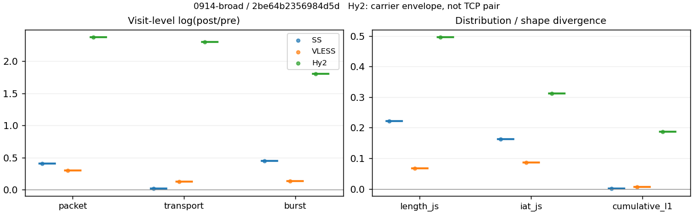
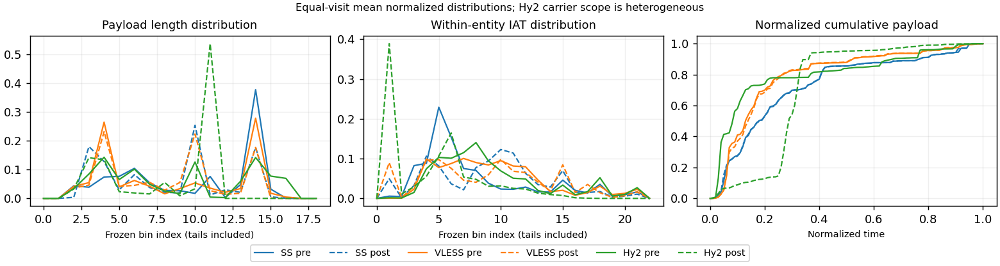

# 0914-broad · 条目 020 · yahoo.com

目标：https://www.yahoo.com/

活动标签：yahoo.com::page_load。选定访问 3 次。

[返回总索引](../../README.md) · [统计口径](../../methods.md)

## 覆盖与资格（每次访问均保留）

| 部署 | 重复 | 主请求路由 | 活动状态 | 代理比较 | DIRECT pre | 请求 proxy/direct/unresolved | 错误 |
| --- | --- | --- | --- | --- | --- | --- | --- |
| Hy2 | 1 | proxy | passed | 1 | 1 | 424/13/1 | [] |
| SS | 1 | proxy | passed | 1 | 0 | 521/0/8 | [] |
| VLESS | 1 | proxy | passed | 1 | 0 | 560/0/1 | [] |

主请求非 proxy 的统计仅解释为已索引的辅助代理连接或 DIRECT 观测，不代表目标业务经代理传输。播放确认与配对资格是两道不同的门。

图中散点为单次访问，短线为重复中位数；Hy2 是共享载体包络，不能与 TCP 配对作等范围因果对比。

形态图先逐访问归一化，再对访问等权平均；实线 pre，虚线 post。分箱序号及边界见 methods，不将分箱索引误解为长度或时间。

## 每次访问的关键观测

### SS

范围：`exclusive_page`。每格 pre → post；空值为不可观测/不适用。

| 重复 | 包数 | 载荷字节 | burst | TCP FR | IAT中位µs | length JS | IAT JS |
| --- | --- | --- | --- | --- | --- | --- | --- |
| 1 | 10626 → 16004 | 9.7712e+06 → 9.9745e+06 | 7042 → 11048 | 1121 → 1146 | 32.212 → 497.68 | 0.2211 | 0.16281 |

完整标量统计：中位数 [min,max]；Δ 为重复内逐访问变换的中位数，MAD 未缩放。n 为可用变换数；DIRECT-only 的 nΔ=0 不代表 pre 不可用。

| scope | 特征 | pre | post | Δ | IQRΔ | MADΔ | nΔ |
| --- | --- | --- | --- | --- | --- | --- | --- |
| exclusive_page | active_span_sum_s_1000ms | 204.13 [204.13, 204.13] | 226.08 [226.08, 226.08] | 0.10213 | — | — | 1 |
| exclusive_page | active_span_sum_s_100ms | 39.089 [39.089, 39.089] | 72.137 [72.137, 72.137] | 0.61272 | — | — | 1 |
| exclusive_page | active_span_sum_s_500ms | 164.6 [164.6, 164.6] | 185.27 [185.27, 185.27] | 0.11826 | — | — | 1 |
| exclusive_page | burst_bytes_iqr | 1665 [1665, 1665] | 1428 [1428, 1428] | -0.15355 | — | — | 1 |
| exclusive_page | burst_bytes_mad | 39 [39, 39] | 34 [34, 34] | -0.1372 | — | — | 1 |
| exclusive_page | burst_bytes_max | 26592 [26592, 26592] | 22848 [22848, 22848] | -0.15175 | — | — | 1 |
| exclusive_page | burst_bytes_mean | 1387.6 [1387.6, 1387.6] | 902.83 [902.83, 902.83] | -0.42976 | — | — | 1 |
| exclusive_page | burst_bytes_median | 39 [39, 39] | 34 [34, 34] | -0.1372 | — | — | 1 |
| exclusive_page | burst_bytes_min | 0 [0, 0] | 0 [0, 0] | — | — | — | 0 |
| exclusive_page | burst_bytes_p95 | 5792 [5792, 5792] | 2964 [2964, 2964] | -0.66994 | — | — | 1 |
| exclusive_page | burst_bytes_q25 | 0 [0, 0] | 0 [0, 0] | — | — | — | 0 |
| exclusive_page | burst_bytes_q75 | 1665 [1665, 1665] | 1428 [1428, 1428] | -0.15355 | — | — | 1 |
| exclusive_page | burst_bytes_std | 2859 [2859, 2859] | 1541.7 [1541.7, 1541.7] | -0.6176 | — | — | 1 |
| exclusive_page | burst_count | 7042 [7042, 7042] | 11048 [11048, 11048] | 0.45036 | — | — | 1 |
| exclusive_page | burst_duration_ms_iqr | 0.035512 [0.035512, 0.035512] | 0.00016725 [0.00016725, 0.00016725] | -5.3581 | — | — | 1 |
| exclusive_page | burst_duration_ms_mad | 0 [0, 0] | 0 [0, 0] | — | — | — | 0 |
| exclusive_page | burst_duration_ms_max | 15001 [15001, 15001] | 38519 [38519, 38519] | 0.94303 | — | — | 1 |
| exclusive_page | burst_duration_ms_mean | 180.25 [180.25, 180.25] | 114.08 [114.08, 114.08] | -0.45747 | — | — | 1 |
| exclusive_page | burst_duration_ms_median | 0 [0, 0] | 0 [0, 0] | — | — | — | 0 |
| exclusive_page | burst_duration_ms_min | 0 [0, 0] | 0 [0, 0] | — | — | — | 0 |
| exclusive_page | burst_duration_ms_p95 | 286.02 [286.02, 286.02] | 124.65 [124.65, 124.65] | -0.83055 | — | — | 1 |
| exclusive_page | burst_duration_ms_q25 | 0 [0, 0] | 0 [0, 0] | — | — | — | 0 |
| exclusive_page | burst_duration_ms_q75 | 0.035512 [0.035512, 0.035512] | 0.00016725 [0.00016725, 0.00016725] | -5.3581 | — | — | 1 |
| exclusive_page | burst_duration_ms_std | 1209.3 [1209.3, 1209.3] | 1289.2 [1289.2, 1289.2] | 0.063951 | — | — | 1 |
| exclusive_page | burst_packets_iqr | 1 [1, 1] | 1 [1, 1] | 0 | — | — | 1 |
| exclusive_page | burst_packets_mad | 0 [0, 0] | 0 [0, 0] | — | — | — | 0 |
| exclusive_page | burst_packets_max | 13 [13, 13] | 12 [12, 12] | -0.080043 | — | — | 1 |
| exclusive_page | burst_packets_mean | 1.5089 [1.5089, 1.5089] | 1.4486 [1.4486, 1.4486] | -0.040822 | — | — | 1 |
| exclusive_page | burst_packets_median | 1 [1, 1] | 1 [1, 1] | 0 | — | — | 1 |
| exclusive_page | burst_packets_min | 1 [1, 1] | 1 [1, 1] | 0 | — | — | 1 |
| exclusive_page | burst_packets_p95 | 3 [3, 3] | 3 [3, 3] | 0 | — | — | 1 |
| exclusive_page | burst_packets_q25 | 1 [1, 1] | 1 [1, 1] | 0 | — | — | 1 |
| exclusive_page | burst_packets_q75 | 2 [2, 2] | 2 [2, 2] | 0 | — | — | 1 |
| exclusive_page | burst_packets_std | 1.0987 [1.0987, 1.0987] | 0.96812 [0.96812, 0.96812] | -0.12648 | — | — | 1 |
| exclusive_page | connection_span_concurrency_max | 65 [65, 65] | 65 [65, 65] | 0 | — | — | 1 |
| exclusive_page | cumulative_l1 | — | — | 0.0019306 | — | — | 1 |
| exclusive_page | cumulative_max | — | — | 0.039842 | — | — | 1 |
| exclusive_page | direction_entropy | 0.7899 [0.7899, 0.7899] | 0.67322 [0.67322, 0.67322] | -0.11668 | — | — | 1 |
| exclusive_page | down_burst_count | 3483 [3483, 3483] | 5486 [5486, 5486] | 0.45431 | — | — | 1 |
| exclusive_page | down_ip_bytes | 9.172e+06 [9.172e+06, 9.172e+06] | 9.4406e+06 [9.4406e+06, 9.4406e+06] | 0.028855 | — | — | 1 |
| exclusive_page | down_packets | 6135 [6135, 6135] | 8775 [8775, 8775] | 0.3579 | — | — | 1 |
| exclusive_page | down_transport_bytes | 8.8524e+06 [8.8524e+06, 8.8524e+06] | 8.9831e+06 [8.9831e+06, 8.9831e+06] | 0.014649 | — | — | 1 |
| exclusive_page | duration_s | 46.803 [46.803, 46.803] | 46.802 [46.802, 46.802] | -2.2915e-05 | — | — | 1 |
| exclusive_page | entity_count | 76 [76, 76] | 76 [76, 76] | 0 | — | — | 1 |
| exclusive_page | fr_runs | 1121 [1121, 1121] | 1146 [1146, 1146] | 0.022056 | — | — | 1 |
| exclusive_page | fr_runs_per_packet | 0.18431 [0.18431, 0.18431] | 0.12685 [0.12685, 0.12685] | -0.05746 | — | — | 1 |
| exclusive_page | fr_switches | 1045 [1045, 1045] | 1070 [1070, 1070] | 0.023642 | — | — | 1 |
| exclusive_page | fr_switches_per_possible_transition | 0.17399 [0.17399, 0.17399] | 0.11945 [0.11945, 0.11945] | -0.054546 | — | — | 1 |
| exclusive_page | full_retransmission_fraction | 0.0022586 [0.0022586, 0.0022586] | 0.0045614 [0.0045614, 0.0045614] | 0.0023027 | — | — | 1 |
| exclusive_page | full_retransmission_packets | 24 [24, 24] | 73 [73, 73] | 1.1124 | — | — | 1 |
| exclusive_page | iat_count | 10550 [10550, 10550] | 15928 [15928, 15928] | 0.41195 | — | — | 1 |
| exclusive_page | iat_js | — | — | 0.16281 | — | — | 1 |
| exclusive_page | iat_ks | — | — | 0.31625 | — | — | 1 |
| exclusive_page | iat_median_us | 32.212 [32.212, 32.212] | 497.68 [497.68, 497.68] | 2.7376 | — | — | 1 |
| exclusive_page | iat_us_iqr | 527.18 [527.18, 527.18] | 2353.3 [2353.3, 2353.3] | 1.496 | — | — | 1 |
| exclusive_page | iat_us_mad | 27.82 [27.82, 27.82] | 490.63 [490.63, 490.63] | 2.8699 | — | — | 1 |
| exclusive_page | iat_us_max | 1.5001e+07 [1.5001e+07, 1.5001e+07] | 1.5488e+07 [1.5488e+07, 1.5488e+07] | 0.031916 | — | — | 1 |
| exclusive_page | iat_us_mean | 2.3264e+05 [2.3264e+05, 2.3264e+05] | 1.5384e+05 [1.5384e+05, 1.5384e+05] | -0.41355 | — | — | 1 |
| exclusive_page | iat_us_median | 32.212 [32.212, 32.212] | 497.68 [497.68, 497.68] | 2.7376 | — | — | 1 |
| exclusive_page | iat_us_min | 0.01 [0.01, 0.01] | 0.031 [0.031, 0.031] | 1.1314 | — | — | 1 |
| exclusive_page | iat_us_p95 | 2.6304e+05 [2.6304e+05, 2.6304e+05] | 1.162e+05 [1.162e+05, 1.162e+05] | -0.81696 | — | — | 1 |
| exclusive_page | iat_us_q25 | 12.716 [12.716, 12.716] | 16.437 [16.437, 16.437] | 0.2567 | — | — | 1 |
| exclusive_page | iat_us_q75 | 539.89 [539.89, 539.89] | 2369.7 [2369.7, 2369.7] | 1.4792 | — | — | 1 |
| exclusive_page | iat_us_std | 1.5797e+06 [1.5797e+06, 1.5797e+06] | 1.2903e+06 [1.2903e+06, 1.2903e+06] | -0.20237 | — | — | 1 |
| exclusive_page | iat_wasserstein_log1p_us | — | — | 1.2872 | — | — | 1 |
| exclusive_page | idle_gap_count_1000ms | 268 [268, 268] | 257 [257, 257] | -0.041911 | — | — | 1 |
| exclusive_page | idle_gap_count_100ms | 840 [840, 840] | 822 [822, 822] | -0.021661 | — | — | 1 |
| exclusive_page | idle_gap_count_500ms | 326 [326, 326] | 313 [313, 313] | -0.040694 | — | — | 1 |
| exclusive_page | idle_gap_sum_s_1000ms | 2250.2 [2250.2, 2250.2] | 2224.4 [2224.4, 2224.4] | -0.01156 | — | — | 1 |
| exclusive_page | idle_gap_sum_s_100ms | 2415.3 [2415.3, 2415.3] | 2378.3 [2378.3, 2378.3] | -0.015421 | — | — | 1 |
| exclusive_page | idle_gap_sum_s_500ms | 2289.7 [2289.7, 2289.7] | 2265.2 [2265.2, 2265.2] | -0.010791 | — | — | 1 |
| exclusive_page | ip_bytes | 1.0325e+07 [1.0325e+07, 1.0325e+07] | 1.0904e+07 [1.0904e+07, 1.0904e+07] | 0.054551 | — | — | 1 |
| exclusive_page | length_iqr | 2622 [2622, 2622] | 1354 [1354, 1354] | -0.66087 | — | — | 1 |
| exclusive_page | length_js | — | — | 0.2211 | — | — | 1 |
| exclusive_page | length_ks | — | — | 0.34833 | — | — | 1 |
| exclusive_page | length_mad | 1348.5 [1348.5, 1348.5] | 1127 [1127, 1127] | -0.17943 | — | — | 1 |
| exclusive_page | length_max | 8948 [8948, 8948] | 8568 [8568, 8568] | -0.043396 | — | — | 1 |
| exclusive_page | length_mean | 1606.6 [1606.6, 1606.6] | 1104.1 [1104.1, 1104.1] | -0.37507 | — | — | 1 |
| exclusive_page | length_median | 1448 [1448, 1448] | 1274 [1274, 1274] | -0.12802 | — | — | 1 |
| exclusive_page | length_min | 13 [13, 13] | 3 [3, 3] | -1.4663 | — | — | 1 |
| exclusive_page | length_p95 | 2896 [2896, 2896] | 2856 [2856, 2856] | -0.013908 | — | — | 1 |
| exclusive_page | length_q25 | 274 [274, 274] | 74 [74, 74] | -1.3091 | — | — | 1 |
| exclusive_page | length_q75 | 2896 [2896, 2896] | 1428 [1428, 1428] | -0.70706 | — | — | 1 |
| exclusive_page | length_std | 1302.8 [1302.8, 1302.8] | 1041.9 [1041.9, 1041.9] | -0.22348 | — | — | 1 |
| exclusive_page | length_wasserstein_bytes | — | — | 502.71 | — | — | 1 |
| exclusive_page | nonempty_entity_count | 76 [76, 76] | 76 [76, 76] | 0 | — | — | 1 |
| exclusive_page | nonempty_packets | 6082 [6082, 6082] | 9034 [9034, 9034] | 0.39566 | — | — | 1 |
| exclusive_page | offload_suspect_fraction | 0.26435 [0.26435, 0.26435] | 0.13159 [0.13159, 0.13159] | -0.13276 | — | — | 1 |
| exclusive_page | packet_count | 10626 [10626, 10626] | 16004 [16004, 16004] | 0.40953 | — | — | 1 |
| exclusive_page | rtt_median_ms | 0.050825 [0.050825, 0.050825] | 32.099 [32.099, 32.099] | 6.4482 | — | — | 1 |
| exclusive_page | rtt_sample_count | 4226 [4226, 4226] | 3209 [3209, 3209] | -0.2753 | — | — | 1 |
| exclusive_page | tcp_ack_count | 10550 [10550, 10550] | 15922 [15922, 15922] | 0.41158 | — | — | 1 |
| exclusive_page | tcp_fin_count | 152 [152, 152] | 154 [154, 154] | 0.013072 | — | — | 1 |
| exclusive_page | tcp_packet_count | 10626 [10626, 10626] | 16004 [16004, 16004] | 0.40953 | — | — | 1 |
| exclusive_page | tcp_rst_count | 0 [0, 0] | 0 [0, 0] | — | — | — | 0 |
| exclusive_page | tcp_syn_count | 152 [152, 152] | 159 [159, 159] | 0.045024 | — | — | 1 |
| exclusive_page | tcp_window_raw_median | 65535 [65535, 65535] | 149 [149, 149] | -6.0864 | — | — | 1 |
| exclusive_page | transition_entropy | 0.60442 [0.60442, 0.60442] | 0.46324 [0.46324, 0.46324] | -0.14119 | — | — | 1 |
| exclusive_page | transition_n_mm | 4090 [4090, 4090] | 6874 [6874, 6874] | 0.5192 | — | — | 1 |
| exclusive_page | transition_n_mp | 494 [494, 494] | 508 [508, 508] | 0.027946 | — | — | 1 |
| exclusive_page | transition_n_pm | 551 [551, 551] | 562 [562, 562] | 0.019767 | — | — | 1 |
| exclusive_page | transition_n_pp | 871 [871, 871] | 1014 [1014, 1014] | 0.15202 | — | — | 1 |
| exclusive_page | transition_p_mm | 0.89223 [0.89223, 0.89223] | 0.93118 [0.93118, 0.93118] | 0.03895 | — | — | 1 |
| exclusive_page | transition_p_mp | 0.10777 [0.10777, 0.10777] | 0.068816 [0.068816, 0.068816] | -0.03895 | — | — | 1 |
| exclusive_page | transition_p_pm | 0.38748 [0.38748, 0.38748] | 0.3566 [0.3566, 0.3566] | -0.030883 | — | — | 1 |
| exclusive_page | transition_p_pp | 0.61252 [0.61252, 0.61252] | 0.6434 [0.6434, 0.6434] | 0.030883 | — | — | 1 |
| exclusive_page | transport_bytes | 9.7712e+06 [9.7712e+06, 9.7712e+06] | 9.9745e+06 [9.9745e+06, 9.9745e+06] | 0.020594 | — | — | 1 |
| exclusive_page | up_burst_count | 3559 [3559, 3559] | 5562 [5562, 5562] | 0.44648 | — | — | 1 |
| exclusive_page | up_byte_fraction | 0.094028 [0.094028, 0.094028] | 0.099398 [0.099398, 0.099398] | 0.0053697 | — | — | 1 |
| exclusive_page | up_ip_bytes | 1.1532e+06 [1.1532e+06, 1.1532e+06] | 1.4636e+06 [1.4636e+06, 1.4636e+06] | 0.23835 | — | — | 1 |
| exclusive_page | up_packets | 4491 [4491, 4491] | 7229 [7229, 7229] | 0.47603 | — | — | 1 |
| exclusive_page | up_transport_bytes | 9.1876e+05 [9.1876e+05, 9.1876e+05] | 9.9144e+05 [9.9144e+05, 9.9144e+05] | 0.07613 | — | — | 1 |
| exclusive_page | zero_iat_count | 0 [0, 0] | 0 [0, 0] | — | — | — | 0 |
| exclusive_page | zero_iat_fraction | 0 [0, 0] | 0 [0, 0] | 0 | — | — | 1 |

### VLESS

范围：`exclusive_page`。每格 pre → post；空值为不可观测/不适用。

| 重复 | 包数 | 载荷字节 | burst | TCP FR | IAT中位µs | length JS | IAT JS |
| --- | --- | --- | --- | --- | --- | --- | --- |
| 1 | 11859 → 15916 | 7.9887e+06 → 9.0241e+06 | 8550 → 9738 | 1367 → 1644 | 253.49 → 351.9 | 0.066549 | 0.086027 |

完整标量统计：中位数 [min,max]；Δ 为重复内逐访问变换的中位数，MAD 未缩放。n 为可用变换数；DIRECT-only 的 nΔ=0 不代表 pre 不可用。

| scope | 特征 | pre | post | Δ | IQRΔ | MADΔ | nΔ |
| --- | --- | --- | --- | --- | --- | --- | --- |
| exclusive_page | active_span_sum_s_1000ms | 230.82 [230.82, 230.82] | 264.21 [264.21, 264.21] | 0.1351 | — | — | 1 |
| exclusive_page | active_span_sum_s_100ms | 28.099 [28.099, 28.099] | 87.673 [87.673, 87.673] | 1.1379 | — | — | 1 |
| exclusive_page | active_span_sum_s_500ms | 142.57 [142.57, 142.57] | 235.53 [235.53, 235.53] | 0.50204 | — | — | 1 |
| exclusive_page | burst_bytes_iqr | 1448 [1448, 1448] | 1556 [1556, 1556] | 0.071935 | — | — | 1 |
| exclusive_page | burst_bytes_mad | 31 [31, 31] | 39 [39, 39] | 0.22957 | — | — | 1 |
| exclusive_page | burst_bytes_max | 26536 [26536, 26536] | 13878 [13878, 13878] | -0.6482 | — | — | 1 |
| exclusive_page | burst_bytes_mean | 934.35 [934.35, 934.35] | 926.69 [926.69, 926.69] | -0.0082308 | — | — | 1 |
| exclusive_page | burst_bytes_median | 31 [31, 31] | 39 [39, 39] | 0.22957 | — | — | 1 |
| exclusive_page | burst_bytes_min | 0 [0, 0] | 0 [0, 0] | — | — | — | 0 |
| exclusive_page | burst_bytes_p95 | 3238.1 [3238.1, 3238.1] | 2896 [2896, 2896] | -0.11166 | — | — | 1 |
| exclusive_page | burst_bytes_q25 | 0 [0, 0] | 0 [0, 0] | — | — | — | 0 |
| exclusive_page | burst_bytes_q75 | 1448 [1448, 1448] | 1556 [1556, 1556] | 0.071935 | — | — | 1 |
| exclusive_page | burst_bytes_std | 1821.9 [1821.9, 1821.9] | 1330.7 [1330.7, 1330.7] | -0.31423 | — | — | 1 |
| exclusive_page | burst_count | 8550 [8550, 8550] | 9738 [9738, 9738] | 0.1301 | — | — | 1 |
| exclusive_page | burst_duration_ms_iqr | 0.4456 [0.4456, 0.4456] | 0.38525 [0.38525, 0.38525] | -0.14553 | — | — | 1 |
| exclusive_page | burst_duration_ms_mad | 0 [0, 0] | 0 [0, 0] | — | — | — | 0 |
| exclusive_page | burst_duration_ms_max | 15003 [15003, 15003] | 15465 [15465, 15465] | 0.030348 | — | — | 1 |
| exclusive_page | burst_duration_ms_mean | 188.72 [188.72, 188.72] | 136.62 [136.62, 136.62] | -0.32306 | — | — | 1 |
| exclusive_page | burst_duration_ms_median | 0 [0, 0] | 0 [0, 0] | — | — | — | 0 |
| exclusive_page | burst_duration_ms_min | 0 [0, 0] | 0 [0, 0] | — | — | — | 0 |
| exclusive_page | burst_duration_ms_p95 | 247.14 [247.14, 247.14] | 171.93 [171.93, 171.93] | -0.36286 | — | — | 1 |
| exclusive_page | burst_duration_ms_q25 | 0 [0, 0] | 0 [0, 0] | — | — | — | 0 |
| exclusive_page | burst_duration_ms_q75 | 0.4456 [0.4456, 0.4456] | 0.38525 [0.38525, 0.38525] | -0.14553 | — | — | 1 |
| exclusive_page | burst_duration_ms_std | 1259.2 [1259.2, 1259.2] | 1213.9 [1213.9, 1213.9] | -0.036667 | — | — | 1 |
| exclusive_page | burst_packets_iqr | 1 [1, 1] | 1 [1, 1] | 0 | — | — | 1 |
| exclusive_page | burst_packets_mad | 0 [0, 0] | 0 [0, 0] | — | — | — | 0 |
| exclusive_page | burst_packets_max | 12 [12, 12] | 11 [11, 11] | -0.087011 | — | — | 1 |
| exclusive_page | burst_packets_mean | 1.387 [1.387, 1.387] | 1.6344 [1.6344, 1.6344] | 0.16413 | — | — | 1 |
| exclusive_page | burst_packets_median | 1 [1, 1] | 1 [1, 1] | 0 | — | — | 1 |
| exclusive_page | burst_packets_min | 1 [1, 1] | 1 [1, 1] | 0 | — | — | 1 |
| exclusive_page | burst_packets_p95 | 3 [3, 3] | 4 [4, 4] | 0.28768 | — | — | 1 |
| exclusive_page | burst_packets_q25 | 1 [1, 1] | 1 [1, 1] | 0 | — | — | 1 |
| exclusive_page | burst_packets_q75 | 2 [2, 2] | 2 [2, 2] | 0 | — | — | 1 |
| exclusive_page | burst_packets_std | 0.7284 [0.7284, 0.7284] | 1.0977 [1.0977, 1.0977] | 0.41015 | — | — | 1 |
| exclusive_page | connection_span_concurrency_max | 100 [100, 100] | 98 [98, 98] | -0.020203 | — | — | 1 |
| exclusive_page | cumulative_l1 | — | — | 0.0055234 | — | — | 1 |
| exclusive_page | cumulative_max | — | — | 0.039525 | — | — | 1 |
| exclusive_page | direction_entropy | 0.78684 [0.78684, 0.78684] | 0.73529 [0.73529, 0.73529] | -0.051548 | — | — | 1 |
| exclusive_page | down_burst_count | 4212 [4212, 4212] | 4817 [4817, 4817] | 0.13421 | — | — | 1 |
| exclusive_page | down_ip_bytes | 7.5126e+06 [7.5126e+06, 7.5126e+06] | 8.4169e+06 [8.4169e+06, 8.4169e+06] | 0.11367 | — | — | 1 |
| exclusive_page | down_packets | 6558 [6558, 6558] | 8720 [8720, 8720] | 0.28493 | — | — | 1 |
| exclusive_page | down_transport_bytes | 7.1705e+06 [7.1705e+06, 7.1705e+06] | 7.9624e+06 [7.9624e+06, 7.9624e+06] | 0.10475 | — | — | 1 |
| exclusive_page | duration_s | 47.949 [47.949, 47.949] | 47.979 [47.979, 47.979] | 0.00062946 | — | — | 1 |
| exclusive_page | entity_count | 126 [126, 126] | 126 [126, 126] | 0 | — | — | 1 |
| exclusive_page | fr_runs | 1367 [1367, 1367] | 1644 [1644, 1644] | 0.18451 | — | — | 1 |
| exclusive_page | fr_runs_per_packet | 0.21747 [0.21747, 0.21747] | 0.19708 [0.19708, 0.19708] | -0.020392 | — | — | 1 |
| exclusive_page | fr_switches | 1241 [1241, 1241] | 1518 [1518, 1518] | 0.20148 | — | — | 1 |
| exclusive_page | fr_switches_per_possible_transition | 0.20146 [0.20146, 0.20146] | 0.18476 [0.18476, 0.18476] | -0.0167 | — | — | 1 |
| exclusive_page | full_retransmission_fraction | 0.0034573 [0.0034573, 0.0034573] | 6.283e-05 [6.283e-05, 6.283e-05] | -0.0033945 | — | — | 1 |
| exclusive_page | full_retransmission_packets | 41 [41, 41] | 1 [1, 1] | -3.7136 | — | — | 1 |
| exclusive_page | iat_count | 11733 [11733, 11733] | 15790 [15790, 15790] | 0.29697 | — | — | 1 |
| exclusive_page | iat_js | — | — | 0.086027 | — | — | 1 |
| exclusive_page | iat_ks | — | — | 0.12069 | — | — | 1 |
| exclusive_page | iat_median_us | 253.49 [253.49, 253.49] | 351.9 [351.9, 351.9] | 0.32803 | — | — | 1 |
| exclusive_page | iat_us_iqr | 2212.5 [2212.5, 2212.5] | 3962.2 [3962.2, 3962.2] | 0.58267 | — | — | 1 |
| exclusive_page | iat_us_mad | 246.37 [246.37, 246.37] | 351.43 [351.43, 351.43] | 0.35515 | — | — | 1 |
| exclusive_page | iat_us_max | 1.5015e+07 [1.5015e+07, 1.5015e+07] | 1.5503e+07 [1.5503e+07, 1.5503e+07] | 0.031987 | — | — | 1 |
| exclusive_page | iat_us_mean | 3.3028e+05 [3.3028e+05, 3.3028e+05] | 2.3864e+05 [2.3864e+05, 2.3864e+05] | -0.32497 | — | — | 1 |
| exclusive_page | iat_us_median | 253.49 [253.49, 253.49] | 351.9 [351.9, 351.9] | 0.32803 | — | — | 1 |
| exclusive_page | iat_us_min | 0.008 [0.008, 0.008] | 0.031 [0.031, 0.031] | 1.3545 | — | — | 1 |
| exclusive_page | iat_us_p95 | 2.6042e+05 [2.6042e+05, 2.6042e+05] | 1.6128e+05 [1.6128e+05, 1.6128e+05] | -0.47918 | — | — | 1 |
| exclusive_page | iat_us_q25 | 36.238 [36.238, 36.238] | 12.398 [12.398, 12.398] | -1.0726 | — | — | 1 |
| exclusive_page | iat_us_q75 | 2248.8 [2248.8, 2248.8] | 3974.6 [3974.6, 3974.6] | 0.56954 | — | — | 1 |
| exclusive_page | iat_us_std | 1.9418e+06 [1.9418e+06, 1.9418e+06] | 1.6617e+06 [1.6617e+06, 1.6617e+06] | -0.15578 | — | — | 1 |
| exclusive_page | iat_wasserstein_log1p_us | — | — | 0.73095 | — | — | 1 |
| exclusive_page | idle_gap_count_1000ms | 416 [416, 416] | 364 [364, 364] | -0.13353 | — | — | 1 |
| exclusive_page | idle_gap_count_100ms | 1063 [1063, 1063] | 1179 [1179, 1179] | 0.10357 | — | — | 1 |
| exclusive_page | idle_gap_count_500ms | 531 [531, 531] | 402 [402, 402] | -0.27831 | — | — | 1 |
| exclusive_page | idle_gap_sum_s_1000ms | 3644.3 [3644.3, 3644.3] | 3503.9 [3503.9, 3503.9] | -0.039287 | — | — | 1 |
| exclusive_page | idle_gap_sum_s_100ms | 3847 [3847, 3847] | 3680.4 [3680.4, 3680.4] | -0.044267 | — | — | 1 |
| exclusive_page | idle_gap_sum_s_500ms | 3732.6 [3732.6, 3732.6] | 3532.6 [3532.6, 3532.6] | -0.055064 | — | — | 1 |
| exclusive_page | ip_bytes | 8.6052e+06 [8.6052e+06, 8.6052e+06] | 9.8657e+06 [9.8657e+06, 9.8657e+06] | 0.1367 | — | — | 1 |
| exclusive_page | length_iqr | 2752 [2752, 2752] | 1340 [1340, 1340] | -0.71966 | — | — | 1 |
| exclusive_page | length_js | — | — | 0.066549 | — | — | 1 |
| exclusive_page | length_ks | — | — | 0.15507 | — | — | 1 |
| exclusive_page | length_mad | 662 [662, 662] | 980 [980, 980] | 0.39229 | — | — | 1 |
| exclusive_page | length_max | 8948 [8948, 8948] | 5648 [5648, 5648] | -0.46013 | — | — | 1 |
| exclusive_page | length_mean | 1270.9 [1270.9, 1270.9] | 1081.8 [1081.8, 1081.8] | -0.1611 | — | — | 1 |
| exclusive_page | length_median | 698 [698, 698] | 1144.5 [1144.5, 1144.5] | 0.4945 | — | — | 1 |
| exclusive_page | length_min | 2 [2, 2] | 1 [1, 1] | -0.69315 | — | — | 1 |
| exclusive_page | length_p95 | 2896 [2896, 2896] | 2824 [2824, 2824] | -0.025176 | — | — | 1 |
| exclusive_page | length_q25 | 72 [72, 72] | 72 [72, 72] | 0 | — | — | 1 |
| exclusive_page | length_q75 | 2824 [2824, 2824] | 1412 [1412, 1412] | -0.69315 | — | — | 1 |
| exclusive_page | length_std | 1382 [1382, 1382] | 989.95 [989.95, 989.95] | -0.33363 | — | — | 1 |
| exclusive_page | length_wasserstein_bytes | — | — | 308.12 | — | — | 1 |
| exclusive_page | nonempty_entity_count | 126 [126, 126] | 126 [126, 126] | 0 | — | — | 1 |
| exclusive_page | nonempty_packets | 6286 [6286, 6286] | 8342 [8342, 8342] | 0.28298 | — | — | 1 |
| exclusive_page | offload_suspect_fraction | 0.18872 [0.18872, 0.18872] | 0.10983 [0.10983, 0.10983] | -0.078891 | — | — | 1 |
| exclusive_page | packet_count | 11859 [11859, 11859] | 15916 [15916, 15916] | 0.29424 | — | — | 1 |
| exclusive_page | rtt_median_ms | 0.11291 [0.11291, 0.11291] | 0.64329 [0.64329, 0.64329] | 1.74 | — | — | 1 |
| exclusive_page | rtt_sample_count | 4820 [4820, 4820] | 6478 [6478, 6478] | 0.29564 | — | — | 1 |
| exclusive_page | tcp_ack_count | 11528 [11528, 11528] | 15784 [15784, 15784] | 0.31422 | — | — | 1 |
| exclusive_page | tcp_fin_count | 247 [247, 247] | 251 [251, 251] | 0.016065 | — | — | 1 |
| exclusive_page | tcp_packet_count | 11859 [11859, 11859] | 15916 [15916, 15916] | 0.29424 | — | — | 1 |
| exclusive_page | tcp_rst_count | 206 [206, 206] | 5 [5, 5] | -3.7184 | — | — | 1 |
| exclusive_page | tcp_syn_count | 252 [252, 252] | 253 [253, 253] | 0.0039604 | — | — | 1 |
| exclusive_page | tcp_window_raw_median | 65500 [65500, 65500] | 152 [152, 152] | -6.0659 | — | — | 1 |
| exclusive_page | transition_entropy | 0.63998 [0.63998, 0.63998] | 0.59809 [0.59809, 0.59809] | -0.041894 | — | — | 1 |
| exclusive_page | transition_n_mm | 4128 [4128, 4128] | 5796 [5796, 5796] | 0.33937 | — | — | 1 |
| exclusive_page | transition_n_mp | 561 [561, 561] | 697 [697, 697] | 0.21706 | — | — | 1 |
| exclusive_page | transition_n_pm | 680 [680, 680] | 821 [821, 821] | 0.18843 | — | — | 1 |
| exclusive_page | transition_n_pp | 791 [791, 791] | 902 [902, 902] | 0.13132 | — | — | 1 |
| exclusive_page | transition_p_mm | 0.88036 [0.88036, 0.88036] | 0.89265 [0.89265, 0.89265] | 0.012295 | — | — | 1 |
| exclusive_page | transition_p_mp | 0.11964 [0.11964, 0.11964] | 0.10735 [0.10735, 0.10735] | -0.012295 | — | — | 1 |
| exclusive_page | transition_p_pm | 0.46227 [0.46227, 0.46227] | 0.47649 [0.47649, 0.47649] | 0.014224 | — | — | 1 |
| exclusive_page | transition_p_pp | 0.53773 [0.53773, 0.53773] | 0.52351 [0.52351, 0.52351] | -0.014224 | — | — | 1 |
| exclusive_page | transport_bytes | 7.9887e+06 [7.9887e+06, 7.9887e+06] | 9.0241e+06 [9.0241e+06, 9.0241e+06] | 0.12187 | — | — | 1 |
| exclusive_page | up_burst_count | 4338 [4338, 4338] | 4921 [4921, 4921] | 0.1261 | — | — | 1 |
| exclusive_page | up_byte_fraction | 0.10241 [0.10241, 0.10241] | 0.11765 [0.11765, 0.11765] | 0.015235 | — | — | 1 |
| exclusive_page | up_ip_bytes | 1.0927e+06 [1.0927e+06, 1.0927e+06] | 1.4488e+06 [1.4488e+06, 1.4488e+06] | 0.28212 | — | — | 1 |
| exclusive_page | up_packets | 5301 [5301, 5301] | 7196 [7196, 7196] | 0.30563 | — | — | 1 |
| exclusive_page | up_transport_bytes | 8.1815e+05 [8.1815e+05, 8.1815e+05] | 1.0617e+06 [1.0617e+06, 1.0617e+06] | 0.26056 | — | — | 1 |
| exclusive_page | zero_iat_count | 0 [0, 0] | 0 [0, 0] | — | — | — | 0 |
| exclusive_page | zero_iat_fraction | 0 [0, 0] | 0 [0, 0] | 0 | — | — | 1 |

### Hy2

范围：`carrier_context_envelope`。每格 pre → post；空值为不可观测/不适用。

| 重复 | 包数 | 载荷字节 | burst | TCP FR | IAT中位µs | length JS | IAT JS |
| --- | --- | --- | --- | --- | --- | --- | --- |
| 1 | 5711 → 61240 | 5.6244e+06 → 5.6338e+07 | 3764 → 22791 | — | 153.08 → 11.421 | 0.49557 | 0.31261 |

范围：`direct_pre_only`。每格 pre → post；空值为不可观测/不适用。

| 重复 | 包数 | 载荷字节 | burst | TCP FR | IAT中位µs | length JS | IAT JS |
| --- | --- | --- | --- | --- | --- | --- | --- |
| 1 | 685 → — | 8.3463e+05 → — | 423 → — | 103 → — | 184.59 → — | — | — |

完整标量统计：中位数 [min,max]；Δ 为重复内逐访问变换的中位数，MAD 未缩放。n 为可用变换数；DIRECT-only 的 nΔ=0 不代表 pre 不可用。

| scope | 特征 | pre | post | Δ | IQRΔ | MADΔ | nΔ |
| --- | --- | --- | --- | --- | --- | --- | --- |
| carrier_context_envelope | active_span_sum_s_1000ms | 128.31 [128.31, 128.31] | 47.296 [47.296, 47.296] | -0.99802 | — | — | 1 |
| carrier_context_envelope | active_span_sum_s_100ms | 13.963 [13.963, 13.963] | 43.038 [43.038, 43.038] | 1.1257 | — | — | 1 |
| carrier_context_envelope | active_span_sum_s_500ms | 106.36 [106.36, 106.36] | 47.296 [47.296, 47.296] | -0.81039 | — | — | 1 |
| carrier_context_envelope | burst_bytes_iqr | 1211.2 [1211.2, 1211.2] | 2788 [2788, 2788] | 0.83367 | — | — | 1 |
| carrier_context_envelope | burst_bytes_mad | 39 [39, 39] | 257 [257, 257] | 1.8855 | — | — | 1 |
| carrier_context_envelope | burst_bytes_max | 28672 [28672, 28672] | 2.3146e+05 [2.3146e+05, 2.3146e+05] | 2.0885 | — | — | 1 |
| carrier_context_envelope | burst_bytes_mean | 1494.3 [1494.3, 1494.3] | 2471.9 [2471.9, 2471.9] | 0.50336 | — | — | 1 |
| carrier_context_envelope | burst_bytes_median | 39 [39, 39] | 291 [291, 291] | 2.0098 | — | — | 1 |
| carrier_context_envelope | burst_bytes_min | 0 [0, 0] | 22 [22, 22] | — | — | — | 0 |
| carrier_context_envelope | burst_bytes_p95 | 8918.8 [8918.8, 8918.8] | 8646 [8646, 8646] | -0.031065 | — | — | 1 |
| carrier_context_envelope | burst_bytes_q25 | 0 [0, 0] | 94 [94, 94] | — | — | — | 0 |
| carrier_context_envelope | burst_bytes_q75 | 1211.2 [1211.2, 1211.2] | 2882 [2882, 2882] | 0.86683 | — | — | 1 |
| carrier_context_envelope | burst_bytes_std | 3737.5 [3737.5, 3737.5] | 5164 [5164, 5164] | 0.3233 | — | — | 1 |
| carrier_context_envelope | burst_count | 3764 [3764, 3764] | 22791 [22791, 22791] | 1.8009 | — | — | 1 |
| carrier_context_envelope | burst_duration_ms_iqr | 0.48984 [0.48984, 0.48984] | 0.028294 [0.028294, 0.028294] | -2.8514 | — | — | 1 |
| carrier_context_envelope | burst_duration_ms_mad | 0 [0, 0] | 4.5e-05 [4.5e-05, 4.5e-05] | — | — | — | 0 |
| carrier_context_envelope | burst_duration_ms_max | 15001 [15001, 15001] | 192.66 [192.66, 192.66] | -4.3549 | — | — | 1 |
| carrier_context_envelope | burst_duration_ms_mean | 257.67 [257.67, 257.67] | 0.80212 [0.80212, 0.80212] | -5.7722 | — | — | 1 |
| carrier_context_envelope | burst_duration_ms_median | 0 [0, 0] | 4.5e-05 [4.5e-05, 4.5e-05] | — | — | — | 0 |
| carrier_context_envelope | burst_duration_ms_min | 0 [0, 0] | 0 [0, 0] | — | — | — | 0 |
| carrier_context_envelope | burst_duration_ms_p95 | 323.05 [323.05, 323.05] | 2.38 [2.38, 2.38] | -4.9107 | — | — | 1 |
| carrier_context_envelope | burst_duration_ms_q25 | 0 [0, 0] | 0 [0, 0] | — | — | — | 0 |
| carrier_context_envelope | burst_duration_ms_q75 | 0.48984 [0.48984, 0.48984] | 0.028294 [0.028294, 0.028294] | -2.8514 | — | — | 1 |
| carrier_context_envelope | burst_duration_ms_std | 1569.3 [1569.3, 1569.3] | 5.6181 [5.6181, 5.6181] | -5.6324 | — | — | 1 |
| carrier_context_envelope | burst_packets_iqr | 1 [1, 1] | 2 [2, 2] | 0.69315 | — | — | 1 |
| carrier_context_envelope | burst_packets_mad | 0 [0, 0] | 1 [1, 1] | — | — | — | 0 |
| carrier_context_envelope | burst_packets_max | 11 [11, 11] | 175 [175, 175] | 2.7669 | — | — | 1 |
| carrier_context_envelope | burst_packets_mean | 1.5173 [1.5173, 1.5173] | 2.687 [2.687, 2.687] | 0.57152 | — | — | 1 |
| carrier_context_envelope | burst_packets_median | 1 [1, 1] | 2 [2, 2] | 0.69315 | — | — | 1 |
| carrier_context_envelope | burst_packets_min | 1 [1, 1] | 1 [1, 1] | 0 | — | — | 1 |
| carrier_context_envelope | burst_packets_p95 | 3 [3, 3] | 8 [8, 8] | 0.98083 | — | — | 1 |
| carrier_context_envelope | burst_packets_q25 | 1 [1, 1] | 1 [1, 1] | 0 | — | — | 1 |
| carrier_context_envelope | burst_packets_q75 | 2 [2, 2] | 3 [3, 3] | 0.40547 | — | — | 1 |
| carrier_context_envelope | burst_packets_std | 0.81789 [0.81789, 0.81789] | 3.7726 [3.7726, 3.7726] | 1.5288 | — | — | 1 |
| carrier_context_envelope | connection_span_concurrency_max | 58 [58, 58] | 1 [1, 1] | -4.0604 | — | — | 1 |
| carrier_context_envelope | cumulative_l1 | — | — | 0.18758 | — | — | 1 |
| carrier_context_envelope | cumulative_max | — | — | 0.64079 | — | — | 1 |
| carrier_context_envelope | direction_entropy | 0.93528 [0.93528, 0.93528] | 0.86073 [0.86073, 0.86073] | -0.074546 | — | — | 1 |
| carrier_context_envelope | direction_run_analog_runs | 909 [909, 909] | 22791 [22791, 22791] | 3.2218 | — | — | 1 |
| carrier_context_envelope | direction_run_analog_runs_per_packet | 0.30534 [0.30534, 0.30534] | 0.37216 [0.37216, 0.37216] | 0.066818 | — | — | 1 |
| carrier_context_envelope | direction_run_analog_switches | 829 [829, 829] | 22790 [22790, 22790] | 3.3139 | — | — | 1 |
| carrier_context_envelope | direction_run_analog_switches_per_possible_transition | 0.28616 [0.28616, 0.28616] | 0.37215 [0.37215, 0.37215] | 0.08599 | — | — | 1 |
| carrier_context_envelope | down_burst_count | 1843 [1843, 1843] | 11395 [11395, 11395] | 1.8218 | — | — | 1 |
| carrier_context_envelope | down_ip_bytes | 5.3184e+06 [5.3184e+06, 5.3184e+06] | 5.4879e+07 [5.4879e+07, 5.4879e+07] | 2.334 | — | — | 1 |
| carrier_context_envelope | down_packets | 3121 [3121, 3121] | 43853 [43853, 43853] | 2.6427 | — | — | 1 |
| carrier_context_envelope | down_transport_bytes | 5.1555e+06 [5.1555e+06, 5.1555e+06] | 5.3651e+07 [5.3651e+07, 5.3651e+07] | 2.3424 | — | — | 1 |
| carrier_context_envelope | duration_s | 47.456 [47.456, 47.456] | 47.296 [47.296, 47.296] | -0.0033757 | — | — | 1 |
| carrier_context_envelope | entity_count | 80 [80, 80] | 1 [1, 1] | -4.382 | — | — | 1 |
| carrier_context_envelope | full_retransmission_fraction | 0.0042024 [0.0042024, 0.0042024] | — | — | — | — | 0 |
| carrier_context_envelope | full_retransmission_packets | 24 [24, 24] | — | — | — | — | 0 |
| carrier_context_envelope | iat_count | 5631 [5631, 5631] | 61239 [61239, 61239] | 2.3865 | — | — | 1 |
| carrier_context_envelope | iat_js | — | — | 0.31261 | — | — | 1 |
| carrier_context_envelope | iat_ks | — | — | 0.47256 | — | — | 1 |
| carrier_context_envelope | iat_median_us | 153.08 [153.08, 153.08] | 11.421 [11.421, 11.421] | -2.5955 | — | — | 1 |
| carrier_context_envelope | iat_us_iqr | 1567.2 [1567.2, 1567.2] | 46.322 [46.322, 46.322] | -3.5214 | — | — | 1 |
| carrier_context_envelope | iat_us_mad | 142.36 [142.36, 142.36] | 11.383 [11.383, 11.383] | -2.5262 | — | — | 1 |
| carrier_context_envelope | iat_us_max | 1.5003e+07 [1.5003e+07, 1.5003e+07] | 3.671e+05 [3.671e+05, 3.671e+05] | -3.7104 | — | — | 1 |
| carrier_context_envelope | iat_us_mean | 3.8448e+05 [3.8448e+05, 3.8448e+05] | 772.32 [772.32, 772.32] | -6.2103 | — | — | 1 |
| carrier_context_envelope | iat_us_median | 153.08 [153.08, 153.08] | 11.421 [11.421, 11.421] | -2.5955 | — | — | 1 |
| carrier_context_envelope | iat_us_min | 0.285 [0.285, 0.285] | 0 [0, 0] | — | — | — | 0 |
| carrier_context_envelope | iat_us_p95 | 3.5244e+05 [3.5244e+05, 3.5244e+05] | 2417.3 [2417.3, 2417.3] | -4.9822 | — | — | 1 |
| carrier_context_envelope | iat_us_q25 | 34.297 [34.297, 34.297] | 0.046 [0.046, 0.046] | -6.6142 | — | — | 1 |
| carrier_context_envelope | iat_us_q75 | 1601.5 [1601.5, 1601.5] | 46.367 [46.367, 46.367] | -3.5421 | — | — | 1 |
| carrier_context_envelope | iat_us_std | 2.1043e+06 [2.1043e+06, 2.1043e+06] | 5269.9 [5269.9, 5269.9] | -5.9897 | — | — | 1 |
| carrier_context_envelope | iat_wasserstein_log1p_us | — | — | 3.4423 | — | — | 1 |
| carrier_context_envelope | idle_gap_count_1000ms | 207 [207, 207] | 0 [0, 0] | — | — | — | 0 |
| carrier_context_envelope | idle_gap_count_100ms | 628 [628, 628] | 29 [29, 29] | -3.0752 | — | — | 1 |
| carrier_context_envelope | idle_gap_count_500ms | 241 [241, 241] | 0 [0, 0] | — | — | — | 0 |
| carrier_context_envelope | idle_gap_sum_s_1000ms | 2036.7 [2036.7, 2036.7] | 0 [0, 0] | — | — | — | 0 |
| carrier_context_envelope | idle_gap_sum_s_100ms | 2151.1 [2151.1, 2151.1] | 4.2582 [4.2582, 4.2582] | -6.2249 | — | — | 1 |
| carrier_context_envelope | idle_gap_sum_s_500ms | 2058.7 [2058.7, 2058.7] | 0 [0, 0] | — | — | — | 0 |
| carrier_context_envelope | ip_bytes | 5.9229e+06 [5.9229e+06, 5.9229e+06] | 5.8052e+07 [5.8052e+07, 5.8052e+07] | 2.2825 | — | — | 1 |
| carrier_context_envelope | length_iqr | 2524 [2524, 2524] | 1343 [1343, 1343] | -0.63094 | — | — | 1 |
| carrier_context_envelope | length_js | — | — | 0.49557 | — | — | 1 |
| carrier_context_envelope | length_ks | — | — | 0.35438 | — | — | 1 |
| carrier_context_envelope | length_mad | 888 [888, 888] | 0 [0, 0] | — | — | — | 0 |
| carrier_context_envelope | length_max | 8948 [8948, 8948] | 1441 [1441, 1441] | -1.8261 | — | — | 1 |
| carrier_context_envelope | length_mean | 1889.3 [1889.3, 1889.3] | 919.95 [919.95, 919.95] | -0.71964 | — | — | 1 |
| carrier_context_envelope | length_median | 988 [988, 988] | 1441 [1441, 1441] | 0.37741 | — | — | 1 |
| carrier_context_envelope | length_min | 20 [20, 20] | 22 [22, 22] | 0.09531 | — | — | 1 |
| carrier_context_envelope | length_p95 | 8920 [8920, 8920] | 1441 [1441, 1441] | -1.823 | — | — | 1 |
| carrier_context_envelope | length_q25 | 116 [116, 116] | 98 [98, 98] | -0.16862 | — | — | 1 |
| carrier_context_envelope | length_q75 | 2640 [2640, 2640] | 1441 [1441, 1441] | -0.60544 | — | — | 1 |
| carrier_context_envelope | length_std | 2495 [2495, 2495] | 632.84 [632.84, 632.84] | -1.3718 | — | — | 1 |
| carrier_context_envelope | length_wasserstein_bytes | — | — | 1168.4 | — | — | 1 |
| carrier_context_envelope | nonempty_entity_count | 80 [80, 80] | 1 [1, 1] | -4.382 | — | — | 1 |
| carrier_context_envelope | nonempty_packets | 2977 [2977, 2977] | 61240 [61240, 61240] | 3.0239 | — | — | 1 |
| carrier_context_envelope | offload_suspect_fraction | 0.18351 [0.18351, 0.18351] | 0 [0, 0] | -0.18351 | — | — | 1 |
| carrier_context_envelope | packet_count | 5711 [5711, 5711] | 61240 [61240, 61240] | 2.3724 | — | — | 1 |
| carrier_context_envelope | rtt_median_ms | 0.11986 [0.11986, 0.11986] | — | — | — | — | 0 |
| carrier_context_envelope | rtt_sample_count | 2423 [2423, 2423] | 0 [0, 0] | — | — | — | 0 |
| carrier_context_envelope | tcp_ack_count | 5627 [5627, 5627] | — | — | — | — | 0 |
| carrier_context_envelope | tcp_fin_count | 160 [160, 160] | — | — | — | — | 0 |
| carrier_context_envelope | tcp_packet_count | 5711 [5711, 5711] | 0 [0, 0] | — | — | — | 0 |
| carrier_context_envelope | tcp_rst_count | 4 [4, 4] | — | — | — | — | 0 |
| carrier_context_envelope | tcp_syn_count | 160 [160, 160] | — | — | — | — | 0 |
| carrier_context_envelope | tcp_window_raw_median | 65409 [65409, 65409] | — | — | — | — | 0 |
| carrier_context_envelope | transition_entropy | 0.82337 [0.82337, 0.82337] | 0.85565 [0.85565, 0.85565] | 0.032279 | — | — | 1 |
| carrier_context_envelope | transition_n_mm | 1489 [1489, 1489] | 32458 [32458, 32458] | 3.0818 | — | — | 1 |
| carrier_context_envelope | transition_n_mp | 387 [387, 387] | 11395 [11395, 11395] | 3.3825 | — | — | 1 |
| carrier_context_envelope | transition_n_pm | 442 [442, 442] | 11395 [11395, 11395] | 3.2496 | — | — | 1 |
| carrier_context_envelope | transition_n_pp | 579 [579, 579] | 5991 [5991, 5991] | 2.3367 | — | — | 1 |
| carrier_context_envelope | transition_p_mm | 0.79371 [0.79371, 0.79371] | 0.74015 [0.74015, 0.74015] | -0.053555 | — | — | 1 |
| carrier_context_envelope | transition_p_mp | 0.20629 [0.20629, 0.20629] | 0.25985 [0.25985, 0.25985] | 0.053555 | — | — | 1 |
| carrier_context_envelope | transition_p_pm | 0.43291 [0.43291, 0.43291] | 0.65541 [0.65541, 0.65541] | 0.2225 | — | — | 1 |
| carrier_context_envelope | transition_p_pp | 0.56709 [0.56709, 0.56709] | 0.34459 [0.34459, 0.34459] | -0.2225 | — | — | 1 |
| carrier_context_envelope | transport_bytes | 5.6244e+06 [5.6244e+06, 5.6244e+06] | 5.6338e+07 [5.6338e+07, 5.6338e+07] | 2.3042 | — | — | 1 |
| carrier_context_envelope | up_burst_count | 1921 [1921, 1921] | 11396 [11396, 11396] | 1.7804 | — | — | 1 |
| carrier_context_envelope | up_byte_fraction | 0.083378 [0.083378, 0.083378] | 0.047684 [0.047684, 0.047684] | -0.035694 | — | — | 1 |
| carrier_context_envelope | up_ip_bytes | 6.0448e+05 [6.0448e+05, 6.0448e+05] | 3.1732e+06 [3.1732e+06, 3.1732e+06] | 1.6581 | — | — | 1 |
| carrier_context_envelope | up_packets | 2590 [2590, 2590] | 17387 [17387, 17387] | 1.9041 | — | — | 1 |
| carrier_context_envelope | up_transport_bytes | 4.6896e+05 [4.6896e+05, 4.6896e+05] | 2.6864e+06 [2.6864e+06, 2.6864e+06] | 1.7454 | — | — | 1 |
| carrier_context_envelope | zero_iat_count | 0 [0, 0] | 1 [1, 1] | — | — | — | 0 |
| carrier_context_envelope | zero_iat_fraction | 0 [0, 0] | 1.6329e-05 [1.6329e-05, 1.6329e-05] | 1.6329e-05 | — | — | 1 |
| direct_pre_only | active_span_sum_s_1000ms | 11.364 [11.364, 11.364] | — | — | — | — | 0 |
| direct_pre_only | active_span_sum_s_100ms | 2.9514 [2.9514, 2.9514] | — | — | — | — | 0 |
| direct_pre_only | active_span_sum_s_500ms | 6.8933 [6.8933, 6.8933] | — | — | — | — | 0 |
| direct_pre_only | burst_bytes_iqr | 1789 [1789, 1789] | — | — | — | — | 0 |
| direct_pre_only | burst_bytes_mad | 39 [39, 39] | — | — | — | — | 0 |
| direct_pre_only | burst_bytes_max | 24680 [24680, 24680] | — | — | — | — | 0 |
| direct_pre_only | burst_bytes_mean | 1973.1 [1973.1, 1973.1] | — | — | — | — | 0 |
| direct_pre_only | burst_bytes_median | 39 [39, 39] | — | — | — | — | 0 |
| direct_pre_only | burst_bytes_min | 0 [0, 0] | — | — | — | — | 0 |
| direct_pre_only | burst_bytes_p95 | 11054 [11054, 11054] | — | — | — | — | 0 |
| direct_pre_only | burst_bytes_q25 | 0 [0, 0] | — | — | — | — | 0 |
| direct_pre_only | burst_bytes_q75 | 1789 [1789, 1789] | — | — | — | — | 0 |
| direct_pre_only | burst_bytes_std | 4027 [4027, 4027] | — | — | — | — | 0 |
| direct_pre_only | burst_count | 423 [423, 423] | — | — | — | — | 0 |
| direct_pre_only | burst_duration_ms_iqr | 1.2805 [1.2805, 1.2805] | — | — | — | — | 0 |
| direct_pre_only | burst_duration_ms_mad | 0 [0, 0] | — | — | — | — | 0 |
| direct_pre_only | burst_duration_ms_max | 15000 [15000, 15000] | — | — | — | — | 0 |
| direct_pre_only | burst_duration_ms_mean | 280.88 [280.88, 280.88] | — | — | — | — | 0 |
| direct_pre_only | burst_duration_ms_median | 0 [0, 0] | — | — | — | — | 0 |
| direct_pre_only | burst_duration_ms_min | 0 [0, 0] | — | — | — | — | 0 |
| direct_pre_only | burst_duration_ms_p95 | 70.7 [70.7, 70.7] | — | — | — | — | 0 |
| direct_pre_only | burst_duration_ms_q25 | 0 [0, 0] | — | — | — | — | 0 |
| direct_pre_only | burst_duration_ms_q75 | 1.2805 [1.2805, 1.2805] | — | — | — | — | 0 |
| direct_pre_only | burst_duration_ms_std | 1918.9 [1918.9, 1918.9] | — | — | — | — | 0 |
| direct_pre_only | burst_packets_iqr | 1 [1, 1] | — | — | — | — | 0 |
| direct_pre_only | burst_packets_mad | 0 [0, 0] | — | — | — | — | 0 |
| direct_pre_only | burst_packets_max | 7 [7, 7] | — | — | — | — | 0 |
| direct_pre_only | burst_packets_mean | 1.6194 [1.6194, 1.6194] | — | — | — | — | 0 |
| direct_pre_only | burst_packets_median | 1 [1, 1] | — | — | — | — | 0 |
| direct_pre_only | burst_packets_min | 1 [1, 1] | — | — | — | — | 0 |
| direct_pre_only | burst_packets_p95 | 3 [3, 3] | — | — | — | — | 0 |
| direct_pre_only | burst_packets_q25 | 1 [1, 1] | — | — | — | — | 0 |
| direct_pre_only | burst_packets_q75 | 2 [2, 2] | — | — | — | — | 0 |
| direct_pre_only | burst_packets_std | 0.92729 [0.92729, 0.92729] | — | — | — | — | 0 |
| direct_pre_only | connection_span_concurrency_max | 6 [6, 6] | — | — | — | — | 0 |
| direct_pre_only | direction_entropy | 0.87286 [0.87286, 0.87286] | — | — | — | — | 0 |
| direct_pre_only | down_burst_count | 208 [208, 208] | — | — | — | — | 0 |
| direct_pre_only | down_ip_bytes | 8.2269e+05 [8.2269e+05, 8.2269e+05] | — | — | — | — | 0 |
| direct_pre_only | down_packets | 412 [412, 412] | — | — | — | — | 0 |
| direct_pre_only | down_transport_bytes | 8.0121e+05 [8.0121e+05, 8.0121e+05] | — | — | — | — | 0 |
| direct_pre_only | duration_s | 45.834 [45.834, 45.834] | — | — | — | — | 0 |
| direct_pre_only | entity_count | 7 [7, 7] | — | — | — | — | 0 |
| direct_pre_only | fr_runs | 103 [103, 103] | — | — | — | — | 0 |
| direct_pre_only | fr_runs_per_packet | 0.25815 [0.25815, 0.25815] | — | — | — | — | 0 |
| direct_pre_only | fr_switches | 96 [96, 96] | — | — | — | — | 0 |
| direct_pre_only | fr_switches_per_possible_transition | 0.2449 [0.2449, 0.2449] | — | — | — | — | 0 |
| direct_pre_only | full_retransmission_fraction | 0.0087591 [0.0087591, 0.0087591] | — | — | — | — | 0 |
| direct_pre_only | full_retransmission_packets | 6 [6, 6] | — | — | — | — | 0 |
| direct_pre_only | iat_count | 678 [678, 678] | — | — | — | — | 0 |
| direct_pre_only | iat_median_us | 184.59 [184.59, 184.59] | — | — | — | — | 0 |
| direct_pre_only | iat_us_iqr | 1620.9 [1620.9, 1620.9] | — | — | — | — | 0 |
| direct_pre_only | iat_us_mad | 174.94 [174.94, 174.94] | — | — | — | — | 0 |
| direct_pre_only | iat_us_max | 1.5001e+07 [1.5001e+07, 1.5001e+07] | — | — | — | — | 0 |
| direct_pre_only | iat_us_mean | 3.3305e+05 [3.3305e+05, 3.3305e+05] | — | — | — | — | 0 |
| direct_pre_only | iat_us_median | 184.59 [184.59, 184.59] | — | — | — | — | 0 |
| direct_pre_only | iat_us_min | 0.688 [0.688, 0.688] | — | — | — | — | 0 |
| direct_pre_only | iat_us_p95 | 2.8554e+05 [2.8554e+05, 2.8554e+05] | — | — | — | — | 0 |
| direct_pre_only | iat_us_q25 | 51.753 [51.753, 51.753] | — | — | — | — | 0 |
| direct_pre_only | iat_us_q75 | 1672.6 [1672.6, 1672.6] | — | — | — | — | 0 |
| direct_pre_only | iat_us_std | 1.9503e+06 [1.9503e+06, 1.9503e+06] | — | — | — | — | 0 |
| direct_pre_only | idle_gap_count_1000ms | 23 [23, 23] | — | — | — | — | 0 |
| direct_pre_only | idle_gap_count_100ms | 43 [43, 43] | — | — | — | — | 0 |
| direct_pre_only | idle_gap_count_500ms | 29 [29, 29] | — | — | — | — | 0 |
| direct_pre_only | idle_gap_sum_s_1000ms | 214.44 [214.44, 214.44] | — | — | — | — | 0 |
| direct_pre_only | idle_gap_sum_s_100ms | 222.85 [222.85, 222.85] | — | — | — | — | 0 |
| direct_pre_only | idle_gap_sum_s_500ms | 218.91 [218.91, 218.91] | — | — | — | — | 0 |
| direct_pre_only | ip_bytes | 8.7043e+05 [8.7043e+05, 8.7043e+05] | — | — | — | — | 0 |
| direct_pre_only | length_iqr | 2692 [2692, 2692] | — | — | — | — | 0 |
| direct_pre_only | length_mad | 1373 [1373, 1373] | — | — | — | — | 0 |
| direct_pre_only | length_max | 8920 [8920, 8920] | — | — | — | — | 0 |
| direct_pre_only | length_mean | 2091.8 [2091.8, 2091.8] | — | — | — | — | 0 |
| direct_pre_only | length_median | 1412 [1412, 1412] | — | — | — | — | 0 |
| direct_pre_only | length_min | 31 [31, 31] | — | — | — | — | 0 |
| direct_pre_only | length_p95 | 8040.8 [8040.8, 8040.8] | — | — | — | — | 0 |
| direct_pre_only | length_q25 | 132 [132, 132] | — | — | — | — | 0 |
| direct_pre_only | length_q75 | 2824 [2824, 2824] | — | — | — | — | 0 |
| direct_pre_only | length_std | 2241.3 [2241.3, 2241.3] | — | — | — | — | 0 |
| direct_pre_only | nonempty_entity_count | 7 [7, 7] | — | — | — | — | 0 |
| direct_pre_only | nonempty_packets | 399 [399, 399] | — | — | — | — | 0 |
| direct_pre_only | offload_suspect_fraction | 0.28321 [0.28321, 0.28321] | — | — | — | — | 0 |
| direct_pre_only | packet_count | 685 [685, 685] | — | — | — | — | 0 |
| direct_pre_only | rtt_median_ms | 0.17686 [0.17686, 0.17686] | — | — | — | — | 0 |
| direct_pre_only | rtt_sample_count | 268 [268, 268] | — | — | — | — | 0 |
| direct_pre_only | tcp_ack_count | 678 [678, 678] | — | — | — | — | 0 |
| direct_pre_only | tcp_fin_count | 14 [14, 14] | — | — | — | — | 0 |
| direct_pre_only | tcp_packet_count | 685 [685, 685] | — | — | — | — | 0 |
| direct_pre_only | tcp_rst_count | 0 [0, 0] | — | — | — | — | 0 |
| direct_pre_only | tcp_syn_count | 14 [14, 14] | — | — | — | — | 0 |
| direct_pre_only | tcp_window_raw_median | 65500 [65500, 65500] | — | — | — | — | 0 |
| direct_pre_only | transition_entropy | 0.75082 [0.75082, 0.75082] | — | — | — | — | 0 |
| direct_pre_only | transition_n_mm | 234 [234, 234] | — | — | — | — | 0 |
| direct_pre_only | transition_n_mp | 48 [48, 48] | — | — | — | — | 0 |
| direct_pre_only | transition_n_pm | 48 [48, 48] | — | — | — | — | 0 |
| direct_pre_only | transition_n_pp | 62 [62, 62] | — | — | — | — | 0 |
| direct_pre_only | transition_p_mm | 0.82979 [0.82979, 0.82979] | — | — | — | — | 0 |
| direct_pre_only | transition_p_mp | 0.17021 [0.17021, 0.17021] | — | — | — | — | 0 |
| direct_pre_only | transition_p_pm | 0.43636 [0.43636, 0.43636] | — | — | — | — | 0 |
| direct_pre_only | transition_p_pp | 0.56364 [0.56364, 0.56364] | — | — | — | — | 0 |
| direct_pre_only | transport_bytes | 8.3463e+05 [8.3463e+05, 8.3463e+05] | — | — | — | — | 0 |
| direct_pre_only | up_burst_count | 215 [215, 215] | — | — | — | — | 0 |
| direct_pre_only | up_byte_fraction | 0.040036 [0.040036, 0.040036] | — | — | — | — | 0 |
| direct_pre_only | up_ip_bytes | 47739 [47739, 47739] | — | — | — | — | 0 |
| direct_pre_only | up_packets | 273 [273, 273] | — | — | — | — | 0 |
| direct_pre_only | up_transport_bytes | 33415 [33415, 33415] | — | — | — | — | 0 |
| direct_pre_only | zero_iat_count | 0 [0, 0] | — | — | — | — | 0 |
| direct_pre_only | zero_iat_fraction | 0 [0, 0] | — | — | — | — | 0 |

## 不同部署对比

以下是各部署自身重复中位数的差异，不按重复编号强行配对。跨 TCP/Hy2 的行标记异质观测范围。

| 视角 | 特征 | 部署A | 部署B | A中位 | B中位 | B−A | 比较口径 |
| --- | --- | --- | --- | --- | --- | --- | --- |
| pre | burst_count | SS | VLESS | 7042 | 8550 | 1508 | same_scope_unpaired_visits |
| pre | burst_count | SS | Hy2 | 7042 | 3764 | -3278 | heterogeneous_scope_descriptive_only |
| pre | burst_count | VLESS | Hy2 | 8550 | 3764 | -4786 | heterogeneous_scope_descriptive_only |
| pre | connection_span_concurrency_max | SS | VLESS | 65 | 100 | 35 | same_scope_unpaired_visits |
| pre | connection_span_concurrency_max | SS | Hy2 | 65 | 58 | -7 | heterogeneous_scope_descriptive_only |
| pre | connection_span_concurrency_max | VLESS | Hy2 | 100 | 58 | -42 | heterogeneous_scope_descriptive_only |
| pre | direction_entropy | SS | VLESS | 0.7899 | 0.78684 | -0.0030553 | same_scope_unpaired_visits |
| pre | direction_entropy | SS | Hy2 | 0.7899 | 0.93528 | 0.14538 | heterogeneous_scope_descriptive_only |
| pre | direction_entropy | VLESS | Hy2 | 0.78684 | 0.93528 | 0.14844 | heterogeneous_scope_descriptive_only |
| pre | down_transport_bytes | SS | VLESS | 8.8524e+06 | 7.1705e+06 | -1.6819e+06 | same_scope_unpaired_visits |
| pre | down_transport_bytes | SS | Hy2 | 8.8524e+06 | 5.1555e+06 | -3.6969e+06 | heterogeneous_scope_descriptive_only |
| pre | down_transport_bytes | VLESS | Hy2 | 7.1705e+06 | 5.1555e+06 | -2.0151e+06 | heterogeneous_scope_descriptive_only |
| pre | duration_s | SS | VLESS | 46.803 | 47.949 | 1.1463 | same_scope_unpaired_visits |
| pre | duration_s | SS | Hy2 | 46.803 | 47.456 | 0.6533 | heterogeneous_scope_descriptive_only |
| pre | duration_s | VLESS | Hy2 | 47.949 | 47.456 | -0.49301 | heterogeneous_scope_descriptive_only |
| pre | entity_count | SS | VLESS | 76 | 126 | 50 | same_scope_unpaired_visits |
| pre | entity_count | SS | Hy2 | 76 | 80 | 4 | heterogeneous_scope_descriptive_only |
| pre | entity_count | VLESS | Hy2 | 126 | 80 | -46 | heterogeneous_scope_descriptive_only |
| pre | fr_runs | SS | VLESS | 1121 | 1367 | 246 | same_scope_unpaired_visits |
| pre | fr_runs_per_packet | SS | VLESS | 0.18431 | 0.21747 | 0.033153 | same_scope_unpaired_visits |
| pre | fr_switches | SS | VLESS | 1045 | 1241 | 196 | same_scope_unpaired_visits |
| pre | fr_switches_per_possible_transition | SS | VLESS | 0.17399 | 0.20146 | 0.027468 | same_scope_unpaired_visits |
| pre | full_retransmission_fraction | SS | VLESS | 0.0022586 | 0.0034573 | 0.0011987 | same_scope_unpaired_visits |
| pre | full_retransmission_fraction | SS | Hy2 | 0.0022586 | 0.0042024 | 0.0019438 | heterogeneous_scope_descriptive_only |
| pre | full_retransmission_fraction | VLESS | Hy2 | 0.0034573 | 0.0042024 | 0.00074513 | heterogeneous_scope_descriptive_only |
| pre | iat_median_us | SS | VLESS | 32.212 | 253.49 | 221.27 | same_scope_unpaired_visits |
| pre | iat_median_us | SS | Hy2 | 32.212 | 153.08 | 120.87 | heterogeneous_scope_descriptive_only |
| pre | iat_median_us | VLESS | Hy2 | 253.49 | 153.08 | -100.41 | heterogeneous_scope_descriptive_only |
| pre | iat_us_p95 | SS | VLESS | 2.6304e+05 | 2.6042e+05 | -2618.7 | same_scope_unpaired_visits |
| pre | iat_us_p95 | SS | Hy2 | 2.6304e+05 | 3.5244e+05 | 89404 | heterogeneous_scope_descriptive_only |
| pre | iat_us_p95 | VLESS | Hy2 | 2.6042e+05 | 3.5244e+05 | 92022 | heterogeneous_scope_descriptive_only |
| pre | ip_bytes | SS | VLESS | 1.0325e+07 | 8.6052e+06 | -1.72e+06 | same_scope_unpaired_visits |
| pre | ip_bytes | SS | Hy2 | 1.0325e+07 | 5.9229e+06 | -4.4024e+06 | heterogeneous_scope_descriptive_only |
| pre | ip_bytes | VLESS | Hy2 | 8.6052e+06 | 5.9229e+06 | -2.6823e+06 | heterogeneous_scope_descriptive_only |
| pre | length_median | SS | VLESS | 1448 | 698 | -750 | same_scope_unpaired_visits |
| pre | length_median | SS | Hy2 | 1448 | 988 | -460 | heterogeneous_scope_descriptive_only |
| pre | length_median | VLESS | Hy2 | 698 | 988 | 290 | heterogeneous_scope_descriptive_only |
| pre | length_p95 | SS | VLESS | 2896 | 2896 | 0 | same_scope_unpaired_visits |
| pre | length_p95 | SS | Hy2 | 2896 | 8920 | 6024 | heterogeneous_scope_descriptive_only |
| pre | length_p95 | VLESS | Hy2 | 2896 | 8920 | 6024 | heterogeneous_scope_descriptive_only |
| pre | nonempty_packets | SS | VLESS | 6082 | 6286 | 204 | same_scope_unpaired_visits |
| pre | nonempty_packets | SS | Hy2 | 6082 | 2977 | -3105 | heterogeneous_scope_descriptive_only |
| pre | nonempty_packets | VLESS | Hy2 | 6286 | 2977 | -3309 | heterogeneous_scope_descriptive_only |
| pre | offload_suspect_fraction | SS | VLESS | 0.26435 | 0.18872 | -0.075634 | same_scope_unpaired_visits |
| pre | offload_suspect_fraction | SS | Hy2 | 0.26435 | 0.18351 | -0.080846 | heterogeneous_scope_descriptive_only |
| pre | offload_suspect_fraction | VLESS | Hy2 | 0.18872 | 0.18351 | -0.0052119 | heterogeneous_scope_descriptive_only |
| pre | packet_count | SS | VLESS | 10626 | 11859 | 1233 | same_scope_unpaired_visits |
| pre | packet_count | SS | Hy2 | 10626 | 5711 | -4915 | heterogeneous_scope_descriptive_only |
| pre | packet_count | VLESS | Hy2 | 11859 | 5711 | -6148 | heterogeneous_scope_descriptive_only |
| pre | rtt_median_ms | SS | VLESS | 0.050825 | 0.11291 | 0.062088 | same_scope_unpaired_visits |
| pre | rtt_median_ms | SS | Hy2 | 0.050825 | 0.11986 | 0.069034 | heterogeneous_scope_descriptive_only |
| pre | rtt_median_ms | VLESS | Hy2 | 0.11291 | 0.11986 | 0.0069465 | heterogeneous_scope_descriptive_only |
| pre | transition_entropy | SS | VLESS | 0.60442 | 0.63998 | 0.035559 | same_scope_unpaired_visits |
| pre | transition_entropy | SS | Hy2 | 0.60442 | 0.82337 | 0.21895 | heterogeneous_scope_descriptive_only |
| pre | transition_entropy | VLESS | Hy2 | 0.63998 | 0.82337 | 0.18339 | heterogeneous_scope_descriptive_only |
| pre | transport_bytes | SS | VLESS | 9.7712e+06 | 7.9887e+06 | -1.7825e+06 | same_scope_unpaired_visits |
| pre | transport_bytes | SS | Hy2 | 9.7712e+06 | 5.6244e+06 | -4.1468e+06 | heterogeneous_scope_descriptive_only |
| pre | transport_bytes | VLESS | Hy2 | 7.9887e+06 | 5.6244e+06 | -2.3642e+06 | heterogeneous_scope_descriptive_only |
| pre | up_byte_fraction | SS | VLESS | 0.094028 | 0.10241 | 0.0083858 | same_scope_unpaired_visits |
| pre | up_byte_fraction | SS | Hy2 | 0.094028 | 0.083378 | -0.01065 | heterogeneous_scope_descriptive_only |
| pre | up_byte_fraction | VLESS | Hy2 | 0.10241 | 0.083378 | -0.019035 | heterogeneous_scope_descriptive_only |
| pre | up_transport_bytes | SS | VLESS | 9.1876e+05 | 8.1815e+05 | -1.0061e+05 | same_scope_unpaired_visits |
| pre | up_transport_bytes | SS | Hy2 | 9.1876e+05 | 4.6896e+05 | -4.4981e+05 | heterogeneous_scope_descriptive_only |
| pre | up_transport_bytes | VLESS | Hy2 | 8.1815e+05 | 4.6896e+05 | -3.492e+05 | heterogeneous_scope_descriptive_only |
| post | burst_count | SS | VLESS | 11048 | 9738 | -1310 | same_scope_unpaired_visits |
| post | burst_count | SS | Hy2 | 11048 | 22791 | 11743 | heterogeneous_scope_descriptive_only |
| post | burst_count | VLESS | Hy2 | 9738 | 22791 | 13053 | heterogeneous_scope_descriptive_only |
| post | connection_span_concurrency_max | SS | VLESS | 65 | 98 | 33 | same_scope_unpaired_visits |
| post | connection_span_concurrency_max | SS | Hy2 | 65 | 1 | -64 | heterogeneous_scope_descriptive_only |
| post | connection_span_concurrency_max | VLESS | Hy2 | 98 | 1 | -97 | heterogeneous_scope_descriptive_only |
| post | direction_entropy | SS | VLESS | 0.67322 | 0.73529 | 0.062072 | same_scope_unpaired_visits |
| post | direction_entropy | SS | Hy2 | 0.67322 | 0.86073 | 0.18751 | heterogeneous_scope_descriptive_only |
| post | direction_entropy | VLESS | Hy2 | 0.73529 | 0.86073 | 0.12544 | heterogeneous_scope_descriptive_only |
| post | down_transport_bytes | SS | VLESS | 8.9831e+06 | 7.9624e+06 | -1.0206e+06 | same_scope_unpaired_visits |
| post | down_transport_bytes | SS | Hy2 | 8.9831e+06 | 5.3651e+07 | 4.4668e+07 | heterogeneous_scope_descriptive_only |
| post | down_transport_bytes | VLESS | Hy2 | 7.9624e+06 | 5.3651e+07 | 4.5689e+07 | heterogeneous_scope_descriptive_only |
| post | duration_s | SS | VLESS | 46.802 | 47.979 | 1.1776 | same_scope_unpaired_visits |
| post | duration_s | SS | Hy2 | 46.802 | 47.296 | 0.49444 | heterogeneous_scope_descriptive_only |
| post | duration_s | VLESS | Hy2 | 47.979 | 47.296 | -0.68313 | heterogeneous_scope_descriptive_only |
| post | entity_count | SS | VLESS | 76 | 126 | 50 | same_scope_unpaired_visits |
| post | entity_count | SS | Hy2 | 76 | 1 | -75 | heterogeneous_scope_descriptive_only |
| post | entity_count | VLESS | Hy2 | 126 | 1 | -125 | heterogeneous_scope_descriptive_only |
| post | fr_runs | SS | VLESS | 1146 | 1644 | 498 | same_scope_unpaired_visits |
| post | fr_runs_per_packet | SS | VLESS | 0.12685 | 0.19708 | 0.070221 | same_scope_unpaired_visits |
| post | fr_switches | SS | VLESS | 1070 | 1518 | 448 | same_scope_unpaired_visits |
| post | fr_switches_per_possible_transition | SS | VLESS | 0.11945 | 0.18476 | 0.065315 | same_scope_unpaired_visits |
| post | full_retransmission_fraction | SS | VLESS | 0.0045614 | 6.283e-05 | -0.0044985 | same_scope_unpaired_visits |
| post | iat_median_us | SS | VLESS | 497.68 | 351.9 | -145.78 | same_scope_unpaired_visits |
| post | iat_median_us | SS | Hy2 | 497.68 | 11.421 | -486.26 | heterogeneous_scope_descriptive_only |
| post | iat_median_us | VLESS | Hy2 | 351.9 | 11.421 | -340.48 | heterogeneous_scope_descriptive_only |
| post | iat_us_p95 | SS | VLESS | 1.162e+05 | 1.6128e+05 | 45073 | same_scope_unpaired_visits |
| post | iat_us_p95 | SS | Hy2 | 1.162e+05 | 2417.3 | -1.1379e+05 | heterogeneous_scope_descriptive_only |
| post | iat_us_p95 | VLESS | Hy2 | 1.6128e+05 | 2417.3 | -1.5886e+05 | heterogeneous_scope_descriptive_only |
| post | ip_bytes | SS | VLESS | 1.0904e+07 | 9.8657e+06 | -1.0384e+06 | same_scope_unpaired_visits |
| post | ip_bytes | SS | Hy2 | 1.0904e+07 | 5.8052e+07 | 4.7148e+07 | heterogeneous_scope_descriptive_only |
| post | ip_bytes | VLESS | Hy2 | 9.8657e+06 | 5.8052e+07 | 4.8187e+07 | heterogeneous_scope_descriptive_only |
| post | length_median | SS | VLESS | 1274 | 1144.5 | -129.5 | same_scope_unpaired_visits |
| post | length_median | SS | Hy2 | 1274 | 1441 | 167 | heterogeneous_scope_descriptive_only |
| post | length_median | VLESS | Hy2 | 1144.5 | 1441 | 296.5 | heterogeneous_scope_descriptive_only |
| post | length_p95 | SS | VLESS | 2856 | 2824 | -32 | same_scope_unpaired_visits |
| post | length_p95 | SS | Hy2 | 2856 | 1441 | -1415 | heterogeneous_scope_descriptive_only |
| post | length_p95 | VLESS | Hy2 | 2824 | 1441 | -1383 | heterogeneous_scope_descriptive_only |
| post | nonempty_packets | SS | VLESS | 9034 | 8342 | -692 | same_scope_unpaired_visits |
| post | nonempty_packets | SS | Hy2 | 9034 | 61240 | 52206 | heterogeneous_scope_descriptive_only |
| post | nonempty_packets | VLESS | Hy2 | 8342 | 61240 | 52898 | heterogeneous_scope_descriptive_only |
| post | offload_suspect_fraction | SS | VLESS | 0.13159 | 0.10983 | -0.021766 | same_scope_unpaired_visits |
| post | offload_suspect_fraction | SS | Hy2 | 0.13159 | 0 | -0.13159 | heterogeneous_scope_descriptive_only |
| post | offload_suspect_fraction | VLESS | Hy2 | 0.10983 | 0 | -0.10983 | heterogeneous_scope_descriptive_only |
| post | packet_count | SS | VLESS | 16004 | 15916 | -88 | same_scope_unpaired_visits |
| post | packet_count | SS | Hy2 | 16004 | 61240 | 45236 | heterogeneous_scope_descriptive_only |
| post | packet_count | VLESS | Hy2 | 15916 | 61240 | 45324 | heterogeneous_scope_descriptive_only |
| post | rtt_median_ms | SS | VLESS | 32.099 | 0.64329 | -31.456 | same_scope_unpaired_visits |
| post | transition_entropy | SS | VLESS | 0.46324 | 0.59809 | 0.13485 | same_scope_unpaired_visits |
| post | transition_entropy | SS | Hy2 | 0.46324 | 0.85565 | 0.39241 | heterogeneous_scope_descriptive_only |
| post | transition_entropy | VLESS | Hy2 | 0.59809 | 0.85565 | 0.25756 | heterogeneous_scope_descriptive_only |
| post | transport_bytes | SS | VLESS | 9.9745e+06 | 9.0241e+06 | -9.5039e+05 | same_scope_unpaired_visits |
| post | transport_bytes | SS | Hy2 | 9.9745e+06 | 5.6338e+07 | 4.6363e+07 | heterogeneous_scope_descriptive_only |
| post | transport_bytes | VLESS | Hy2 | 9.0241e+06 | 5.6338e+07 | 4.7313e+07 | heterogeneous_scope_descriptive_only |
| post | up_byte_fraction | SS | VLESS | 0.099398 | 0.11765 | 0.018251 | same_scope_unpaired_visits |
| post | up_byte_fraction | SS | Hy2 | 0.099398 | 0.047684 | -0.051714 | heterogeneous_scope_descriptive_only |
| post | up_byte_fraction | VLESS | Hy2 | 0.11765 | 0.047684 | -0.069965 | heterogeneous_scope_descriptive_only |
| post | up_transport_bytes | SS | VLESS | 9.9144e+05 | 1.0617e+06 | 70237 | same_scope_unpaired_visits |
| post | up_transport_bytes | SS | Hy2 | 9.9144e+05 | 2.6864e+06 | 1.695e+06 | heterogeneous_scope_descriptive_only |
| post | up_transport_bytes | VLESS | Hy2 | 1.0617e+06 | 2.6864e+06 | 1.6247e+06 | heterogeneous_scope_descriptive_only |
| transformation | burst_count | SS | VLESS | 0.45036 | 0.1301 | -0.32025 | same_scope_unpaired_visits |
| transformation | burst_count | SS | Hy2 | 0.45036 | 1.8009 | 1.3505 | heterogeneous_scope_descriptive_only |
| transformation | burst_count | VLESS | Hy2 | 0.1301 | 1.8009 | 1.6708 | heterogeneous_scope_descriptive_only |
| transformation | connection_span_concurrency_max | SS | VLESS | 0 | -0.020203 | -0.020203 | same_scope_unpaired_visits |
| transformation | connection_span_concurrency_max | SS | Hy2 | 0 | -4.0604 | -4.0604 | heterogeneous_scope_descriptive_only |
| transformation | connection_span_concurrency_max | VLESS | Hy2 | -0.020203 | -4.0604 | -4.0402 | heterogeneous_scope_descriptive_only |
| transformation | direction_entropy | SS | VLESS | -0.11668 | -0.051548 | 0.065127 | same_scope_unpaired_visits |
| transformation | direction_entropy | SS | Hy2 | -0.11668 | -0.074546 | 0.04213 | heterogeneous_scope_descriptive_only |
| transformation | direction_entropy | VLESS | Hy2 | -0.051548 | -0.074546 | -0.022998 | heterogeneous_scope_descriptive_only |
| transformation | down_transport_bytes | SS | VLESS | 0.014649 | 0.10475 | 0.090105 | same_scope_unpaired_visits |
| transformation | down_transport_bytes | SS | Hy2 | 0.014649 | 2.3424 | 2.3278 | heterogeneous_scope_descriptive_only |
| transformation | down_transport_bytes | VLESS | Hy2 | 0.10475 | 2.3424 | 2.2377 | heterogeneous_scope_descriptive_only |
| transformation | duration_s | SS | VLESS | -2.2915e-05 | 0.00062946 | 0.00065237 | same_scope_unpaired_visits |
| transformation | duration_s | SS | Hy2 | -2.2915e-05 | -0.0033757 | -0.0033528 | heterogeneous_scope_descriptive_only |
| transformation | duration_s | VLESS | Hy2 | 0.00062946 | -0.0033757 | -0.0040052 | heterogeneous_scope_descriptive_only |
| transformation | entity_count | SS | VLESS | 0 | 0 | 0 | same_scope_unpaired_visits |
| transformation | entity_count | SS | Hy2 | 0 | -4.382 | -4.382 | heterogeneous_scope_descriptive_only |
| transformation | entity_count | VLESS | Hy2 | 0 | -4.382 | -4.382 | heterogeneous_scope_descriptive_only |
| transformation | fr_runs | SS | VLESS | 0.022056 | 0.18451 | 0.16246 | same_scope_unpaired_visits |
| transformation | fr_runs_per_packet | SS | VLESS | -0.05746 | -0.020392 | 0.037068 | same_scope_unpaired_visits |
| transformation | fr_switches | SS | VLESS | 0.023642 | 0.20148 | 0.17783 | same_scope_unpaired_visits |
| transformation | fr_switches_per_possible_transition | SS | VLESS | -0.054546 | -0.0167 | 0.037847 | same_scope_unpaired_visits |
| transformation | full_retransmission_fraction | SS | VLESS | 0.0023027 | -0.0033945 | -0.0056972 | same_scope_unpaired_visits |
| transformation | iat_median_us | SS | VLESS | 2.7376 | 0.32803 | -2.4096 | same_scope_unpaired_visits |
| transformation | iat_median_us | SS | Hy2 | 2.7376 | -2.5955 | -5.3331 | heterogeneous_scope_descriptive_only |
| transformation | iat_median_us | VLESS | Hy2 | 0.32803 | -2.5955 | -2.9235 | heterogeneous_scope_descriptive_only |
| transformation | iat_us_p95 | SS | VLESS | -0.81696 | -0.47918 | 0.33778 | same_scope_unpaired_visits |
| transformation | iat_us_p95 | SS | Hy2 | -0.81696 | -4.9822 | -4.1653 | heterogeneous_scope_descriptive_only |
| transformation | iat_us_p95 | VLESS | Hy2 | -0.47918 | -4.9822 | -4.5031 | heterogeneous_scope_descriptive_only |
| transformation | ip_bytes | SS | VLESS | 0.054551 | 0.1367 | 0.082145 | same_scope_unpaired_visits |
| transformation | ip_bytes | SS | Hy2 | 0.054551 | 2.2825 | 2.228 | heterogeneous_scope_descriptive_only |
| transformation | ip_bytes | VLESS | Hy2 | 0.1367 | 2.2825 | 2.1458 | heterogeneous_scope_descriptive_only |
| transformation | length_median | SS | VLESS | -0.12802 | 0.4945 | 0.62253 | same_scope_unpaired_visits |
| transformation | length_median | SS | Hy2 | -0.12802 | 0.37741 | 0.50543 | heterogeneous_scope_descriptive_only |
| transformation | length_median | VLESS | Hy2 | 0.4945 | 0.37741 | -0.11709 | heterogeneous_scope_descriptive_only |
| transformation | length_p95 | SS | VLESS | -0.013908 | -0.025176 | -0.011268 | same_scope_unpaired_visits |
| transformation | length_p95 | SS | Hy2 | -0.013908 | -1.823 | -1.8091 | heterogeneous_scope_descriptive_only |
| transformation | length_p95 | VLESS | Hy2 | -0.025176 | -1.823 | -1.7978 | heterogeneous_scope_descriptive_only |
| transformation | nonempty_packets | SS | VLESS | 0.39566 | 0.28298 | -0.11268 | same_scope_unpaired_visits |
| transformation | nonempty_packets | SS | Hy2 | 0.39566 | 3.0239 | 2.6282 | heterogeneous_scope_descriptive_only |
| transformation | nonempty_packets | VLESS | Hy2 | 0.28298 | 3.0239 | 2.7409 | heterogeneous_scope_descriptive_only |
| transformation | offload_suspect_fraction | SS | VLESS | -0.13276 | -0.078891 | 0.053869 | same_scope_unpaired_visits |
| transformation | offload_suspect_fraction | SS | Hy2 | -0.13276 | -0.18351 | -0.050746 | heterogeneous_scope_descriptive_only |
| transformation | offload_suspect_fraction | VLESS | Hy2 | -0.078891 | -0.18351 | -0.10461 | heterogeneous_scope_descriptive_only |
| transformation | packet_count | SS | VLESS | 0.40953 | 0.29424 | -0.1153 | same_scope_unpaired_visits |
| transformation | packet_count | SS | Hy2 | 0.40953 | 2.3724 | 1.9629 | heterogeneous_scope_descriptive_only |
| transformation | packet_count | VLESS | Hy2 | 0.29424 | 2.3724 | 2.0782 | heterogeneous_scope_descriptive_only |
| transformation | rtt_median_ms | SS | VLESS | 6.4482 | 1.74 | -4.7082 | same_scope_unpaired_visits |
| transformation | transition_entropy | SS | VLESS | -0.14119 | -0.041894 | 0.099292 | same_scope_unpaired_visits |
| transformation | transition_entropy | SS | Hy2 | -0.14119 | 0.032279 | 0.17346 | heterogeneous_scope_descriptive_only |
| transformation | transition_entropy | VLESS | Hy2 | -0.041894 | 0.032279 | 0.074173 | heterogeneous_scope_descriptive_only |
| transformation | transport_bytes | SS | VLESS | 0.020594 | 0.12187 | 0.10128 | same_scope_unpaired_visits |
| transformation | transport_bytes | SS | Hy2 | 0.020594 | 2.3042 | 2.2836 | heterogeneous_scope_descriptive_only |
| transformation | transport_bytes | VLESS | Hy2 | 0.12187 | 2.3042 | 2.1824 | heterogeneous_scope_descriptive_only |
| transformation | up_byte_fraction | SS | VLESS | 0.0053697 | 0.015235 | 0.0098656 | same_scope_unpaired_visits |
| transformation | up_byte_fraction | SS | Hy2 | 0.0053697 | -0.035694 | -0.041064 | heterogeneous_scope_descriptive_only |
| transformation | up_byte_fraction | VLESS | Hy2 | 0.015235 | -0.035694 | -0.05093 | heterogeneous_scope_descriptive_only |
| transformation | up_transport_bytes | SS | VLESS | 0.07613 | 0.26056 | 0.18443 | same_scope_unpaired_visits |
| transformation | up_transport_bytes | SS | Hy2 | 0.07613 | 1.7454 | 1.6693 | heterogeneous_scope_descriptive_only |
| transformation | up_transport_bytes | VLESS | Hy2 | 0.26056 | 1.7454 | 1.4849 | heterogeneous_scope_descriptive_only |
| transformation | length_js | SS | VLESS | 0.2211 | 0.066549 | -0.15456 | same_scope_unpaired_visits |
| transformation | length_js | SS | Hy2 | 0.2211 | 0.49557 | 0.27446 | heterogeneous_scope_descriptive_only |
| transformation | length_js | VLESS | Hy2 | 0.066549 | 0.49557 | 0.42902 | heterogeneous_scope_descriptive_only |
| transformation | length_ks | SS | VLESS | 0.34833 | 0.15507 | -0.19326 | same_scope_unpaired_visits |
| transformation | length_ks | SS | Hy2 | 0.34833 | 0.35438 | 0.0060557 | heterogeneous_scope_descriptive_only |
| transformation | length_ks | VLESS | Hy2 | 0.15507 | 0.35438 | 0.19931 | heterogeneous_scope_descriptive_only |
| transformation | length_wasserstein_bytes | SS | VLESS | 502.71 | 308.12 | -194.59 | same_scope_unpaired_visits |
| transformation | length_wasserstein_bytes | SS | Hy2 | 502.71 | 1168.4 | 665.65 | heterogeneous_scope_descriptive_only |
| transformation | length_wasserstein_bytes | VLESS | Hy2 | 308.12 | 1168.4 | 860.24 | heterogeneous_scope_descriptive_only |
| transformation | iat_js | SS | VLESS | 0.16281 | 0.086027 | -0.076786 | same_scope_unpaired_visits |
| transformation | iat_js | SS | Hy2 | 0.16281 | 0.31261 | 0.1498 | heterogeneous_scope_descriptive_only |
| transformation | iat_js | VLESS | Hy2 | 0.086027 | 0.31261 | 0.22659 | heterogeneous_scope_descriptive_only |
| transformation | iat_ks | SS | VLESS | 0.31625 | 0.12069 | -0.19556 | same_scope_unpaired_visits |
| transformation | iat_ks | SS | Hy2 | 0.31625 | 0.47256 | 0.15631 | heterogeneous_scope_descriptive_only |
| transformation | iat_ks | VLESS | Hy2 | 0.12069 | 0.47256 | 0.35187 | heterogeneous_scope_descriptive_only |
| transformation | iat_wasserstein_log1p_us | SS | VLESS | 1.2872 | 0.73095 | -0.55622 | same_scope_unpaired_visits |
| transformation | iat_wasserstein_log1p_us | SS | Hy2 | 1.2872 | 3.4423 | 2.1551 | heterogeneous_scope_descriptive_only |
| transformation | iat_wasserstein_log1p_us | VLESS | Hy2 | 0.73095 | 3.4423 | 2.7113 | heterogeneous_scope_descriptive_only |
| transformation | cumulative_l1 | SS | VLESS | 0.0019306 | 0.0055234 | 0.0035928 | same_scope_unpaired_visits |
| transformation | cumulative_l1 | SS | Hy2 | 0.0019306 | 0.18758 | 0.18565 | heterogeneous_scope_descriptive_only |
| transformation | cumulative_l1 | VLESS | Hy2 | 0.0055234 | 0.18758 | 0.18205 | heterogeneous_scope_descriptive_only |

## 可复核的访问标识

| 部署 | 重复 | session_id |
| --- | --- | --- |
| SS | 1 | e98db60b-f797-4a9a-bc97-bf2e1c7df885 |
| VLESS | 1 | 06722851-152a-4ff5-8872-9abb25443080 |
| Hy2 | 1 | f8b2ffc6-f90c-4b85-94d5-fc0254fa79a4 |

全量三种 packet selection、Hy2 full 范围、Q25/Q75、直方图与曲线见机器可读产物；本页只显示 observed 主范围。
