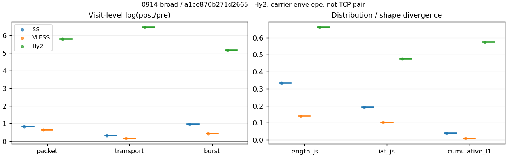
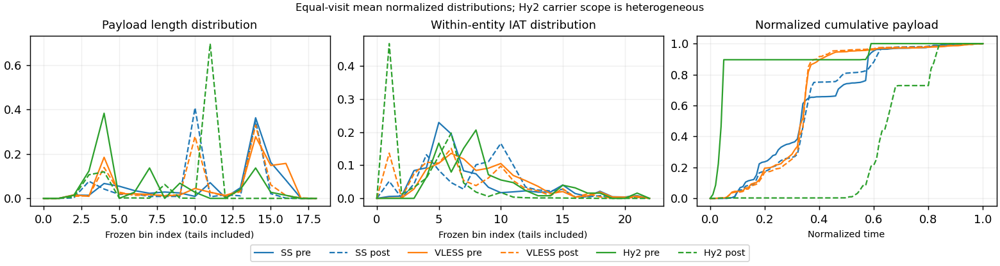

# 0914-broad · 条目 021 · msn.com

目标：https://www.msn.com/

活动标签：msn.com::page_load。选定访问 3 次。

[返回总索引](../../README.md) · [统计口径](../../methods.md)

## 覆盖与资格（每次访问均保留）

| 部署 | 重复 | 主请求路由 | 活动状态 | 代理比较 | DIRECT pre | 请求 proxy/direct/unresolved | 错误 |
| --- | --- | --- | --- | --- | --- | --- | --- |
| Hy2 | 1 | direct | passed | 1 | 1 | 26/693/0 | [] |
| SS | 1 | proxy | passed | 1 | 1 | 403/8/0 | [] |
| VLESS | 1 | proxy | passed | 1 | 0 | 533/0/0 | [] |

主请求非 proxy 的统计仅解释为已索引的辅助代理连接或 DIRECT 观测，不代表目标业务经代理传输。播放确认与配对资格是两道不同的门。

图中散点为单次访问，短线为重复中位数；Hy2 是共享载体包络，不能与 TCP 配对作等范围因果对比。

形态图先逐访问归一化，再对访问等权平均；实线 pre，虚线 post。分箱序号及边界见 methods，不将分箱索引误解为长度或时间。

## 每次访问的关键观测

### SS

范围：`exclusive_page`。每格 pre → post；空值为不可观测/不适用。

| 重复 | 包数 | 载荷字节 | burst | TCP FR | IAT中位µs | length JS | IAT JS |
| --- | --- | --- | --- | --- | --- | --- | --- |
| 1 | 8944 → 20645 | 1.5805e+07 → 2.1687e+07 | 5818 → 15100 | 526 → 536 | 27.511 → 216.23 | 0.3338 | 0.19115 |

范围：`direct_pre_only`。每格 pre → post；空值为不可观测/不适用。

| 重复 | 包数 | 载荷字节 | burst | TCP FR | IAT中位µs | length JS | IAT JS |
| --- | --- | --- | --- | --- | --- | --- | --- |
| 1 | 93 → — | 62747 → — | 58 → — | 25 → — | 242.64 → — | — | — |

完整标量统计：中位数 [min,max]；Δ 为重复内逐访问变换的中位数，MAD 未缩放。n 为可用变换数；DIRECT-only 的 nΔ=0 不代表 pre 不可用。

| scope | 特征 | pre | post | Δ | IQRΔ | MADΔ | nΔ |
| --- | --- | --- | --- | --- | --- | --- | --- |
| direct_pre_only | active_span_sum_s_1000ms | 5.2129 [5.2129, 5.2129] | — | — | — | — | 0 |
| direct_pre_only | active_span_sum_s_100ms | 0.11245 [0.11245, 0.11245] | — | — | — | — | 0 |
| direct_pre_only | active_span_sum_s_500ms | 4.6084 [4.6084, 4.6084] | — | — | — | — | 0 |
| direct_pre_only | burst_bytes_iqr | 386.75 [386.75, 386.75] | — | — | — | — | 0 |
| direct_pre_only | burst_bytes_mad | 74.5 [74.5, 74.5] | — | — | — | — | 0 |
| direct_pre_only | burst_bytes_max | 16704 [16704, 16704] | — | — | — | — | 0 |
| direct_pre_only | burst_bytes_mean | 1081.8 [1081.8, 1081.8] | — | — | — | — | 0 |
| direct_pre_only | burst_bytes_median | 74.5 [74.5, 74.5] | — | — | — | — | 0 |
| direct_pre_only | burst_bytes_min | 0 [0, 0] | — | — | — | — | 0 |
| direct_pre_only | burst_bytes_p95 | 7663.3 [7663.3, 7663.3] | — | — | — | — | 0 |
| direct_pre_only | burst_bytes_q25 | 0 [0, 0] | — | — | — | — | 0 |
| direct_pre_only | burst_bytes_q75 | 386.75 [386.75, 386.75] | — | — | — | — | 0 |
| direct_pre_only | burst_bytes_std | 2910.9 [2910.9, 2910.9] | — | — | — | — | 0 |
| direct_pre_only | burst_count | 58 [58, 58] | — | — | — | — | 0 |
| direct_pre_only | burst_duration_ms_iqr | 238.13 [238.13, 238.13] | — | — | — | — | 0 |
| direct_pre_only | burst_duration_ms_mad | 0.036445 [0.036445, 0.036445] | — | — | — | — | 0 |
| direct_pre_only | burst_duration_ms_max | 12897 [12897, 12897] | — | — | — | — | 0 |
| direct_pre_only | burst_duration_ms_mean | 548.03 [548.03, 548.03] | — | — | — | — | 0 |
| direct_pre_only | burst_duration_ms_median | 0.036445 [0.036445, 0.036445] | — | — | — | — | 0 |
| direct_pre_only | burst_duration_ms_min | 0 [0, 0] | — | — | — | — | 0 |
| direct_pre_only | burst_duration_ms_p95 | 2994.3 [2994.3, 2994.3] | — | — | — | — | 0 |
| direct_pre_only | burst_duration_ms_q25 | 0 [0, 0] | — | — | — | — | 0 |
| direct_pre_only | burst_duration_ms_q75 | 238.13 [238.13, 238.13] | — | — | — | — | 0 |
| direct_pre_only | burst_duration_ms_std | 1941.2 [1941.2, 1941.2] | — | — | — | — | 0 |
| direct_pre_only | burst_packets_iqr | 1 [1, 1] | — | — | — | — | 0 |
| direct_pre_only | burst_packets_mad | 0.5 [0.5, 0.5] | — | — | — | — | 0 |
| direct_pre_only | burst_packets_max | 4 [4, 4] | — | — | — | — | 0 |
| direct_pre_only | burst_packets_mean | 1.6034 [1.6034, 1.6034] | — | — | — | — | 0 |
| direct_pre_only | burst_packets_median | 1.5 [1.5, 1.5] | — | — | — | — | 0 |
| direct_pre_only | burst_packets_min | 1 [1, 1] | — | — | — | — | 0 |
| direct_pre_only | burst_packets_p95 | 3 [3, 3] | — | — | — | — | 0 |
| direct_pre_only | burst_packets_q25 | 1 [1, 1] | — | — | — | — | 0 |
| direct_pre_only | burst_packets_q75 | 2 [2, 2] | — | — | — | — | 0 |
| direct_pre_only | burst_packets_std | 0.69331 [0.69331, 0.69331] | — | — | — | — | 0 |
| direct_pre_only | connection_span_concurrency_max | 2 [2, 2] | — | — | — | — | 0 |
| direct_pre_only | direction_entropy | 0.9808 [0.9808, 0.9808] | — | — | — | — | 0 |
| direct_pre_only | down_burst_count | 28 [28, 28] | — | — | — | — | 0 |
| direct_pre_only | down_ip_bytes | 22562 [22562, 22562] | — | — | — | — | 0 |
| direct_pre_only | down_packets | 46 [46, 46] | — | — | — | — | 0 |
| direct_pre_only | down_transport_bytes | 20154 [20154, 20154] | — | — | — | — | 0 |
| direct_pre_only | duration_s | 23.469 [23.469, 23.469] | — | — | — | — | 0 |
| direct_pre_only | entity_count | 2 [2, 2] | — | — | — | — | 0 |
| direct_pre_only | fr_runs | 25 [25, 25] | — | — | — | — | 0 |
| direct_pre_only | fr_runs_per_packet | 0.5814 [0.5814, 0.5814] | — | — | — | — | 0 |
| direct_pre_only | fr_switches | 23 [23, 23] | — | — | — | — | 0 |
| direct_pre_only | fr_switches_per_possible_transition | 0.56098 [0.56098, 0.56098] | — | — | — | — | 0 |
| direct_pre_only | full_retransmission_fraction | 0 [0, 0] | — | — | — | — | 0 |
| direct_pre_only | full_retransmission_packets | 0 [0, 0] | — | — | — | — | 0 |
| direct_pre_only | iat_count | 91 [91, 91] | — | — | — | — | 0 |
| direct_pre_only | iat_median_us | 242.64 [242.64, 242.64] | — | — | — | — | 0 |
| direct_pre_only | iat_us_iqr | 99201 [99201, 99201] | — | — | — | — | 0 |
| direct_pre_only | iat_us_mad | 228.97 [228.97, 228.97] | — | — | — | — | 0 |
| direct_pre_only | iat_us_max | 1.2897e+07 [1.2897e+07, 1.2897e+07] | — | — | — | — | 0 |
| direct_pre_only | iat_us_mean | 5.0085e+05 [5.0085e+05, 5.0085e+05] | — | — | — | — | 0 |
| direct_pre_only | iat_us_median | 242.64 [242.64, 242.64] | — | — | — | — | 0 |
| direct_pre_only | iat_us_min | 7.001 [7.001, 7.001] | — | — | — | — | 0 |
| direct_pre_only | iat_us_p95 | 2.1023e+06 [2.1023e+06, 2.1023e+06] | — | — | — | — | 0 |
| direct_pre_only | iat_us_q25 | 71.557 [71.557, 71.557] | — | — | — | — | 0 |
| direct_pre_only | iat_us_q75 | 99273 [99273, 99273] | — | — | — | — | 0 |
| direct_pre_only | iat_us_std | 2.0095e+06 [2.0095e+06, 2.0095e+06] | — | — | — | — | 0 |
| direct_pre_only | idle_gap_count_1000ms | 6 [6, 6] | — | — | — | — | 0 |
| direct_pre_only | idle_gap_count_100ms | 23 [23, 23] | — | — | — | — | 0 |
| direct_pre_only | idle_gap_count_500ms | 7 [7, 7] | — | — | — | — | 0 |
| direct_pre_only | idle_gap_sum_s_1000ms | 40.365 [40.365, 40.365] | — | — | — | — | 0 |
| direct_pre_only | idle_gap_sum_s_100ms | 45.465 [45.465, 45.465] | — | — | — | — | 0 |
| direct_pre_only | idle_gap_sum_s_500ms | 40.969 [40.969, 40.969] | — | — | — | — | 0 |
| direct_pre_only | ip_bytes | 67615 [67615, 67615] | — | — | — | — | 0 |
| direct_pre_only | length_iqr | 1037 [1037, 1037] | — | — | — | — | 0 |
| direct_pre_only | length_mad | 231 [231, 231] | — | — | — | — | 0 |
| direct_pre_only | length_max | 8948 [8948, 8948] | — | — | — | — | 0 |
| direct_pre_only | length_mean | 1459.2 [1459.2, 1459.2] | — | — | — | — | 0 |
| direct_pre_only | length_median | 305 [305, 305] | — | — | — | — | 0 |
| direct_pre_only | length_min | 31 [31, 31] | — | — | — | — | 0 |
| direct_pre_only | length_p95 | 7196.6 [7196.6, 7196.6] | — | — | — | — | 0 |
| direct_pre_only | length_q25 | 92 [92, 92] | — | — | — | — | 0 |
| direct_pre_only | length_q75 | 1129 [1129, 1129] | — | — | — | — | 0 |
| direct_pre_only | length_std | 2507.6 [2507.6, 2507.6] | — | — | — | — | 0 |
| direct_pre_only | nonempty_entity_count | 2 [2, 2] | — | — | — | — | 0 |
| direct_pre_only | nonempty_packets | 43 [43, 43] | — | — | — | — | 0 |
| direct_pre_only | offload_suspect_fraction | 0.096774 [0.096774, 0.096774] | — | — | — | — | 0 |
| direct_pre_only | packet_count | 93 [93, 93] | — | — | — | — | 0 |
| direct_pre_only | rtt_median_ms | 0.1411 [0.1411, 0.1411] | — | — | — | — | 0 |
| direct_pre_only | rtt_sample_count | 46 [46, 46] | — | — | — | — | 0 |
| direct_pre_only | tcp_ack_count | 91 [91, 91] | — | — | — | — | 0 |
| direct_pre_only | tcp_fin_count | 4 [4, 4] | — | — | — | — | 0 |
| direct_pre_only | tcp_packet_count | 93 [93, 93] | — | — | — | — | 0 |
| direct_pre_only | tcp_rst_count | 0 [0, 0] | — | — | — | — | 0 |
| direct_pre_only | tcp_syn_count | 4 [4, 4] | — | — | — | — | 0 |
| direct_pre_only | tcp_window_raw_median | 62720 [62720, 62720] | — | — | — | — | 0 |
| direct_pre_only | transition_entropy | 0.97374 [0.97374, 0.97374] | — | — | — | — | 0 |
| direct_pre_only | transition_n_mm | 6 [6, 6] | — | — | — | — | 0 |
| direct_pre_only | transition_n_mp | 11 [11, 11] | — | — | — | — | 0 |
| direct_pre_only | transition_n_pm | 12 [12, 12] | — | — | — | — | 0 |
| direct_pre_only | transition_n_pp | 12 [12, 12] | — | — | — | — | 0 |
| direct_pre_only | transition_p_mm | 0.35294 [0.35294, 0.35294] | — | — | — | — | 0 |
| direct_pre_only | transition_p_mp | 0.64706 [0.64706, 0.64706] | — | — | — | — | 0 |
| direct_pre_only | transition_p_pm | 0.5 [0.5, 0.5] | — | — | — | — | 0 |
| direct_pre_only | transition_p_pp | 0.5 [0.5, 0.5] | — | — | — | — | 0 |
| direct_pre_only | transport_bytes | 62747 [62747, 62747] | — | — | — | — | 0 |
| direct_pre_only | up_burst_count | 30 [30, 30] | — | — | — | — | 0 |
| direct_pre_only | up_byte_fraction | 0.67881 [0.67881, 0.67881] | — | — | — | — | 0 |
| direct_pre_only | up_ip_bytes | 45053 [45053, 45053] | — | — | — | — | 0 |
| direct_pre_only | up_packets | 47 [47, 47] | — | — | — | — | 0 |
| direct_pre_only | up_transport_bytes | 42593 [42593, 42593] | — | — | — | — | 0 |
| direct_pre_only | zero_iat_count | 0 [0, 0] | — | — | — | — | 0 |
| direct_pre_only | zero_iat_fraction | 0 [0, 0] | — | — | — | — | 0 |
| exclusive_page | active_span_sum_s_1000ms | 117.78 [117.78, 117.78] | 126.91 [126.91, 126.91] | 0.074675 | — | — | 1 |
| exclusive_page | active_span_sum_s_100ms | 27.576 [27.576, 27.576] | 43.123 [43.123, 43.123] | 0.44711 | — | — | 1 |
| exclusive_page | active_span_sum_s_500ms | 88.183 [88.183, 88.183] | 104.76 [104.76, 104.76] | 0.1723 | — | — | 1 |
| exclusive_page | burst_bytes_iqr | 2896 [2896, 2896] | 2856 [2856, 2856] | -0.013908 | — | — | 1 |
| exclusive_page | burst_bytes_mad | 74 [74, 74] | 34 [34, 34] | -0.7777 | — | — | 1 |
| exclusive_page | burst_bytes_max | 28840 [28840, 28840] | 28560 [28560, 28560] | -0.0097562 | — | — | 1 |
| exclusive_page | burst_bytes_mean | 2716.5 [2716.5, 2716.5] | 1436.2 [1436.2, 1436.2] | -0.63735 | — | — | 1 |
| exclusive_page | burst_bytes_median | 74 [74, 74] | 34 [34, 34] | -0.7777 | — | — | 1 |
| exclusive_page | burst_bytes_min | 0 [0, 0] | 0 [0, 0] | — | — | — | 0 |
| exclusive_page | burst_bytes_p95 | 14572 [14572, 14572] | 5712 [5712, 5712] | -0.93653 | — | — | 1 |
| exclusive_page | burst_bytes_q25 | 0 [0, 0] | 0 [0, 0] | — | — | — | 0 |
| exclusive_page | burst_bytes_q75 | 2896 [2896, 2896] | 2856 [2856, 2856] | -0.013908 | — | — | 1 |
| exclusive_page | burst_bytes_std | 4994.4 [4994.4, 4994.4] | 2158.4 [2158.4, 2158.4] | -0.83896 | — | — | 1 |
| exclusive_page | burst_count | 5818 [5818, 5818] | 15100 [15100, 15100] | 0.95374 | — | — | 1 |
| exclusive_page | burst_duration_ms_iqr | 0.019711 [0.019711, 0.019711] | 0 [0, 0] | — | — | — | 0 |
| exclusive_page | burst_duration_ms_mad | 0 [0, 0] | 0 [0, 0] | — | — | — | 0 |
| exclusive_page | burst_duration_ms_max | 15001 [15001, 15001] | 29845 [29845, 29845] | 0.6879 | — | — | 1 |
| exclusive_page | burst_duration_ms_mean | 106.9 [106.9, 106.9] | 38.376 [38.376, 38.376] | -1.0245 | — | — | 1 |
| exclusive_page | burst_duration_ms_median | 0 [0, 0] | 0 [0, 0] | — | — | — | 0 |
| exclusive_page | burst_duration_ms_min | 0 [0, 0] | 0 [0, 0] | — | — | — | 0 |
| exclusive_page | burst_duration_ms_p95 | 98.112 [98.112, 98.112] | 0.97233 [0.97233, 0.97233] | -4.6142 | — | — | 1 |
| exclusive_page | burst_duration_ms_q25 | 0 [0, 0] | 0 [0, 0] | — | — | — | 0 |
| exclusive_page | burst_duration_ms_q75 | 0.019711 [0.019711, 0.019711] | 0 [0, 0] | — | — | — | 0 |
| exclusive_page | burst_duration_ms_std | 1006.4 [1006.4, 1006.4] | 736.54 [736.54, 736.54] | -0.31217 | — | — | 1 |
| exclusive_page | burst_packets_iqr | 1 [1, 1] | 0 [0, 0] | — | — | — | 0 |
| exclusive_page | burst_packets_mad | 0 [0, 0] | 0 [0, 0] | — | — | — | 0 |
| exclusive_page | burst_packets_max | 11 [11, 11] | 11 [11, 11] | 0 | — | — | 1 |
| exclusive_page | burst_packets_mean | 1.5373 [1.5373, 1.5373] | 1.3672 [1.3672, 1.3672] | -0.11725 | — | — | 1 |
| exclusive_page | burst_packets_median | 1 [1, 1] | 1 [1, 1] | 0 | — | — | 1 |
| exclusive_page | burst_packets_min | 1 [1, 1] | 1 [1, 1] | 0 | — | — | 1 |
| exclusive_page | burst_packets_p95 | 4 [4, 4] | 3 [3, 3] | -0.28768 | — | — | 1 |
| exclusive_page | burst_packets_q25 | 1 [1, 1] | 1 [1, 1] | 0 | — | — | 1 |
| exclusive_page | burst_packets_q75 | 2 [2, 2] | 1 [1, 1] | -0.69315 | — | — | 1 |
| exclusive_page | burst_packets_std | 1.2069 [1.2069, 1.2069] | 0.82264 [0.82264, 0.82264] | -0.38328 | — | — | 1 |
| exclusive_page | connection_span_concurrency_max | 39 [39, 39] | 39 [39, 39] | 0 | — | — | 1 |
| exclusive_page | cumulative_l1 | — | — | 0.037962 | — | — | 1 |
| exclusive_page | cumulative_max | — | — | 0.14974 | — | — | 1 |
| exclusive_page | direction_entropy | 0.53045 [0.53045, 0.53045] | 0.33733 [0.33733, 0.33733] | -0.19312 | — | — | 1 |
| exclusive_page | down_burst_count | 2885 [2885, 2885] | 7526 [7526, 7526] | 0.95884 | — | — | 1 |
| exclusive_page | down_ip_bytes | 1.5646e+07 [1.5646e+07, 1.5646e+07] | 2.1832e+07 [2.1832e+07, 2.1832e+07] | 0.33313 | — | — | 1 |
| exclusive_page | down_packets | 5533 [5533, 5533] | 12025 [12025, 12025] | 0.77626 | — | — | 1 |
| exclusive_page | down_transport_bytes | 1.5358e+07 [1.5358e+07, 1.5358e+07] | 2.1206e+07 [2.1206e+07, 2.1206e+07] | 0.32263 | — | — | 1 |
| exclusive_page | duration_s | 36.678 [36.678, 36.678] | 36.675 [36.675, 36.675] | -6.2601e-05 | — | — | 1 |
| exclusive_page | entity_count | 48 [48, 48] | 48 [48, 48] | 0 | — | — | 1 |
| exclusive_page | fr_runs | 526 [526, 526] | 536 [536, 536] | 0.018833 | — | — | 1 |
| exclusive_page | fr_runs_per_packet | 0.095793 [0.095793, 0.095793] | 0.044261 [0.044261, 0.044261] | -0.051532 | — | — | 1 |
| exclusive_page | fr_switches | 478 [478, 478] | 488 [488, 488] | 0.020705 | — | — | 1 |
| exclusive_page | fr_switches_per_possible_transition | 0.087819 [0.087819, 0.087819] | 0.040458 [0.040458, 0.040458] | -0.047362 | — | — | 1 |
| exclusive_page | full_retransmission_fraction | 0.00928 [0.00928, 0.00928] | 0.0014047 [0.0014047, 0.0014047] | -0.0078753 | — | — | 1 |
| exclusive_page | full_retransmission_packets | 83 [83, 83] | 29 [29, 29] | -1.0515 | — | — | 1 |
| exclusive_page | iat_count | 8896 [8896, 8896] | 20597 [20597, 20597] | 0.83954 | — | — | 1 |
| exclusive_page | iat_js | — | — | 0.19115 | — | — | 1 |
| exclusive_page | iat_ks | — | — | 0.3134 | — | — | 1 |
| exclusive_page | iat_median_us | 27.511 [27.511, 27.511] | 216.23 [216.23, 216.23] | 2.0617 | — | — | 1 |
| exclusive_page | iat_us_iqr | 148.23 [148.23, 148.23] | 923.99 [923.99, 923.99] | 1.8299 | — | — | 1 |
| exclusive_page | iat_us_mad | 21.777 [21.777, 21.777] | 212.21 [212.21, 212.21] | 2.2767 | — | — | 1 |
| exclusive_page | iat_us_max | 1.5001e+07 [1.5001e+07, 1.5001e+07] | 1.5358e+07 [1.5358e+07, 1.5358e+07] | 0.023484 | — | — | 1 |
| exclusive_page | iat_us_mean | 1.2269e+05 [1.2269e+05, 1.2269e+05] | 52805 [52805, 52805] | -0.84302 | — | — | 1 |
| exclusive_page | iat_us_median | 27.511 [27.511, 27.511] | 216.23 [216.23, 216.23] | 2.0617 | — | — | 1 |
| exclusive_page | iat_us_min | 0.004 [0.004, 0.004] | 0.032 [0.032, 0.032] | 2.0794 | — | — | 1 |
| exclusive_page | iat_us_p95 | 82309 [82309, 82309] | 21791 [21791, 21791] | -1.329 | — | — | 1 |
| exclusive_page | iat_us_q25 | 12.723 [12.723, 12.723] | 11.278 [11.278, 11.278] | -0.1206 | — | — | 1 |
| exclusive_page | iat_us_q75 | 160.95 [160.95, 160.95] | 935.26 [935.26, 935.26] | 1.7597 | — | — | 1 |
| exclusive_page | iat_us_std | 1.1523e+06 [1.1523e+06, 1.1523e+06] | 7.5753e+05 [7.5753e+05, 7.5753e+05] | -0.41947 | — | — | 1 |
| exclusive_page | iat_wasserstein_log1p_us | — | — | 1.2046 | — | — | 1 |
| exclusive_page | idle_gap_count_1000ms | 109 [109, 109] | 104 [104, 104] | -0.046957 | — | — | 1 |
| exclusive_page | idle_gap_count_100ms | 394 [394, 394] | 398 [398, 398] | 0.010101 | — | — | 1 |
| exclusive_page | idle_gap_count_500ms | 152 [152, 152] | 134 [134, 134] | -0.12604 | — | — | 1 |
| exclusive_page | idle_gap_sum_s_1000ms | 973.63 [973.63, 973.63] | 960.71 [960.71, 960.71] | -0.013357 | — | — | 1 |
| exclusive_page | idle_gap_sum_s_100ms | 1063.8 [1063.8, 1063.8] | 1044.5 [1044.5, 1044.5] | -0.018341 | — | — | 1 |
| exclusive_page | idle_gap_sum_s_500ms | 1003.2 [1003.2, 1003.2] | 982.86 [982.86, 982.86] | -0.020511 | — | — | 1 |
| exclusive_page | ip_bytes | 1.6272e+07 [1.6272e+07, 1.6272e+07] | 2.2937e+07 [2.2937e+07, 2.2937e+07] | 0.34334 | — | — | 1 |
| exclusive_page | length_iqr | 2672 [2672, 2672] | 1428 [1428, 1428] | -0.62655 | — | — | 1 |
| exclusive_page | length_js | — | — | 0.3338 | — | — | 1 |
| exclusive_page | length_ks | — | — | 0.52966 | — | — | 1 |
| exclusive_page | length_mad | 1448 [1448, 1448] | 1254 [1254, 1254] | -0.14384 | — | — | 1 |
| exclusive_page | length_max | 8948 [8948, 8948] | 12852 [12852, 12852] | 0.36207 | — | — | 1 |
| exclusive_page | length_mean | 2878.3 [2878.3, 2878.3] | 1790.8 [1790.8, 1790.8] | -0.47454 | — | — | 1 |
| exclusive_page | length_median | 2896 [2896, 2896] | 1428 [1428, 1428] | -0.70706 | — | — | 1 |
| exclusive_page | length_min | 1 [1, 1] | 8 [8, 8] | 2.0794 | — | — | 1 |
| exclusive_page | length_p95 | 8192 [8192, 8192] | 2856 [2856, 2856] | -1.0537 | — | — | 1 |
| exclusive_page | length_q25 | 1216 [1216, 1216] | 1428 [1428, 1428] | 0.16071 | — | — | 1 |
| exclusive_page | length_q75 | 3888 [3888, 3888] | 2856 [2856, 2856] | -0.30847 | — | — | 1 |
| exclusive_page | length_std | 2339.4 [2339.4, 2339.4] | 1123.6 [1123.6, 1123.6] | -0.73334 | — | — | 1 |
| exclusive_page | length_wasserstein_bytes | — | — | 1199.8 | — | — | 1 |
| exclusive_page | nonempty_entity_count | 48 [48, 48] | 48 [48, 48] | 0 | — | — | 1 |
| exclusive_page | nonempty_packets | 5491 [5491, 5491] | 12110 [12110, 12110] | 0.79092 | — | — | 1 |
| exclusive_page | offload_suspect_fraction | 0.40474 [0.40474, 0.40474] | 0.23376 [0.23376, 0.23376] | -0.17098 | — | — | 1 |
| exclusive_page | packet_count | 8944 [8944, 8944] | 20645 [20645, 20645] | 0.83649 | — | — | 1 |
| exclusive_page | rtt_median_ms | 0.044759 [0.044759, 0.044759] | 28.874 [28.874, 28.874] | 6.4694 | — | — | 1 |
| exclusive_page | rtt_sample_count | 3266 [3266, 3266] | 2323 [2323, 2323] | -0.34071 | — | — | 1 |
| exclusive_page | tcp_ack_count | 8895 [8895, 8895] | 20592 [20592, 20592] | 0.83941 | — | — | 1 |
| exclusive_page | tcp_fin_count | 93 [93, 93] | 98 [98, 98] | 0.052368 | — | — | 1 |
| exclusive_page | tcp_packet_count | 8944 [8944, 8944] | 20645 [20645, 20645] | 0.83649 | — | — | 1 |
| exclusive_page | tcp_rst_count | 2 [2, 2] | 3 [3, 3] | 0.40547 | — | — | 1 |
| exclusive_page | tcp_syn_count | 96 [96, 96] | 99 [99, 99] | 0.030772 | — | — | 1 |
| exclusive_page | tcp_window_raw_median | 65535 [65535, 65535] | 138 [138, 138] | -6.1631 | — | — | 1 |
| exclusive_page | transition_entropy | 0.35338 [0.35338, 0.35338] | 0.19062 [0.19062, 0.19062] | -0.16276 | — | — | 1 |
| exclusive_page | transition_n_mm | 4574 [4574, 4574] | 11092 [11092, 11092] | 0.88584 | — | — | 1 |
| exclusive_page | transition_n_mp | 222 [222, 222] | 227 [227, 227] | 0.022273 | — | — | 1 |
| exclusive_page | transition_n_pm | 256 [256, 256] | 261 [261, 261] | 0.019343 | — | — | 1 |
| exclusive_page | transition_n_pp | 391 [391, 391] | 482 [482, 482] | 0.20924 | — | — | 1 |
| exclusive_page | transition_p_mm | 0.95371 [0.95371, 0.95371] | 0.97995 [0.97995, 0.97995] | 0.026234 | — | — | 1 |
| exclusive_page | transition_p_mp | 0.046289 [0.046289, 0.046289] | 0.020055 [0.020055, 0.020055] | -0.026234 | — | — | 1 |
| exclusive_page | transition_p_pm | 0.39567 [0.39567, 0.39567] | 0.35128 [0.35128, 0.35128] | -0.044394 | — | — | 1 |
| exclusive_page | transition_p_pp | 0.60433 [0.60433, 0.60433] | 0.64872 [0.64872, 0.64872] | 0.044394 | — | — | 1 |
| exclusive_page | transport_bytes | 1.5805e+07 [1.5805e+07, 1.5805e+07] | 2.1687e+07 [2.1687e+07, 2.1687e+07] | 0.31639 | — | — | 1 |
| exclusive_page | up_burst_count | 2933 [2933, 2933] | 7574 [7574, 7574] | 0.9487 | — | — | 1 |
| exclusive_page | up_byte_fraction | 0.028247 [0.028247, 0.028247] | 0.022164 [0.022164, 0.022164] | -0.0060832 | — | — | 1 |
| exclusive_page | up_ip_bytes | 6.2518e+05 [6.2518e+05, 6.2518e+05] | 1.1053e+06 [1.1053e+06, 1.1053e+06] | 0.56981 | — | — | 1 |
| exclusive_page | up_packets | 3411 [3411, 3411] | 8620 [8620, 8620] | 0.92708 | — | — | 1 |
| exclusive_page | up_transport_bytes | 4.4644e+05 [4.4644e+05, 4.4644e+05] | 4.8065e+05 [4.8065e+05, 4.8065e+05] | 0.073854 | — | — | 1 |
| exclusive_page | zero_iat_count | 0 [0, 0] | 0 [0, 0] | — | — | — | 0 |
| exclusive_page | zero_iat_fraction | 0 [0, 0] | 0 [0, 0] | 0 | — | — | 1 |

### VLESS

范围：`exclusive_page`。每格 pre → post；空值为不可观测/不适用。

| 重复 | 包数 | 载荷字节 | burst | TCP FR | IAT中位µs | length JS | IAT JS |
| --- | --- | --- | --- | --- | --- | --- | --- |
| 1 | 13939 → 26873 | 2.673e+07 → 3.1927e+07 | 10550 → 16185 | 817 → 955 | 116.1 → 28.357 | 0.14045 | 0.10249 |

完整标量统计：中位数 [min,max]；Δ 为重复内逐访问变换的中位数，MAD 未缩放。n 为可用变换数；DIRECT-only 的 nΔ=0 不代表 pre 不可用。

| scope | 特征 | pre | post | Δ | IQRΔ | MADΔ | nΔ |
| --- | --- | --- | --- | --- | --- | --- | --- |
| exclusive_page | active_span_sum_s_1000ms | 153.34 [153.34, 153.34] | 160.23 [160.23, 160.23] | 0.043954 | — | — | 1 |
| exclusive_page | active_span_sum_s_100ms | 25.668 [25.668, 25.668] | 52.804 [52.804, 52.804] | 0.72134 | — | — | 1 |
| exclusive_page | active_span_sum_s_500ms | 106.91 [106.91, 106.91] | 146.91 [146.91, 146.91] | 0.31777 | — | — | 1 |
| exclusive_page | burst_bytes_iqr | 2896 [2896, 2896] | 2824 [2824, 2824] | -0.025176 | — | — | 1 |
| exclusive_page | burst_bytes_mad | 72 [72, 72] | 72 [72, 72] | 0 | — | — | 1 |
| exclusive_page | burst_bytes_max | 28672 [28672, 28672] | 1.5462e+05 [1.5462e+05, 1.5462e+05] | 1.6851 | — | — | 1 |
| exclusive_page | burst_bytes_mean | 2533.6 [2533.6, 2533.6] | 1972.6 [1972.6, 1972.6] | -0.25029 | — | — | 1 |
| exclusive_page | burst_bytes_median | 72 [72, 72] | 72 [72, 72] | 0 | — | — | 1 |
| exclusive_page | burst_bytes_min | 0 [0, 0] | 0 [0, 0] | — | — | — | 0 |
| exclusive_page | burst_bytes_p95 | 16384 [16384, 16384] | 7168 [7168, 7168] | -0.82668 | — | — | 1 |
| exclusive_page | burst_bytes_q25 | 0 [0, 0] | 0 [0, 0] | — | — | — | 0 |
| exclusive_page | burst_bytes_q75 | 2896 [2896, 2896] | 2824 [2824, 2824] | -0.025176 | — | — | 1 |
| exclusive_page | burst_bytes_std | 4751.3 [4751.3, 4751.3] | 5353.3 [5353.3, 5353.3] | 0.1193 | — | — | 1 |
| exclusive_page | burst_count | 10550 [10550, 10550] | 16185 [16185, 16185] | 0.42796 | — | — | 1 |
| exclusive_page | burst_duration_ms_iqr | 0 [0, 0] | 0.000163 [0.000163, 0.000163] | — | — | — | 0 |
| exclusive_page | burst_duration_ms_mad | 0 [0, 0] | 0 [0, 0] | — | — | — | 0 |
| exclusive_page | burst_duration_ms_max | 15001 [15001, 15001] | 15458 [15458, 15458] | 0.030019 | — | — | 1 |
| exclusive_page | burst_duration_ms_mean | 67.579 [67.579, 67.579] | 39.438 [39.438, 39.438] | -0.53858 | — | — | 1 |
| exclusive_page | burst_duration_ms_median | 0 [0, 0] | 0 [0, 0] | — | — | — | 0 |
| exclusive_page | burst_duration_ms_min | 0 [0, 0] | 0 [0, 0] | — | — | — | 0 |
| exclusive_page | burst_duration_ms_p95 | 33.12 [33.12, 33.12] | 9.1984 [9.1984, 9.1984] | -1.2811 | — | — | 1 |
| exclusive_page | burst_duration_ms_q25 | 0 [0, 0] | 0 [0, 0] | — | — | — | 0 |
| exclusive_page | burst_duration_ms_q75 | 0 [0, 0] | 0.000163 [0.000163, 0.000163] | — | — | — | 0 |
| exclusive_page | burst_duration_ms_std | 776.42 [776.42, 776.42] | 655.1 [655.1, 655.1] | -0.1699 | — | — | 1 |
| exclusive_page | burst_packets_iqr | 0 [0, 0] | 1 [1, 1] | — | — | — | 0 |
| exclusive_page | burst_packets_mad | 0 [0, 0] | 0 [0, 0] | — | — | — | 0 |
| exclusive_page | burst_packets_max | 8 [8, 8] | 67 [67, 67] | 2.1253 | — | — | 1 |
| exclusive_page | burst_packets_mean | 1.3212 [1.3212, 1.3212] | 1.6604 [1.6604, 1.6604] | 0.22847 | — | — | 1 |
| exclusive_page | burst_packets_median | 1 [1, 1] | 1 [1, 1] | 0 | — | — | 1 |
| exclusive_page | burst_packets_min | 1 [1, 1] | 1 [1, 1] | 0 | — | — | 1 |
| exclusive_page | burst_packets_p95 | 3 [3, 3] | 4 [4, 4] | 0.28768 | — | — | 1 |
| exclusive_page | burst_packets_q25 | 1 [1, 1] | 1 [1, 1] | 0 | — | — | 1 |
| exclusive_page | burst_packets_q75 | 1 [1, 1] | 2 [2, 2] | 0.69315 | — | — | 1 |
| exclusive_page | burst_packets_std | 0.67088 [0.67088, 0.67088] | 1.7389 [1.7389, 1.7389] | 0.9524 | — | — | 1 |
| exclusive_page | connection_span_concurrency_max | 48 [48, 48] | 48 [48, 48] | 0 | — | — | 1 |
| exclusive_page | cumulative_l1 | — | — | 0.010301 | — | — | 1 |
| exclusive_page | cumulative_max | — | — | 0.062902 | — | — | 1 |
| exclusive_page | direction_entropy | 0.48386 [0.48386, 0.48386] | 0.3532 [0.3532, 0.3532] | -0.13066 | — | — | 1 |
| exclusive_page | down_burst_count | 5246 [5246, 5246] | 8070 [8070, 8070] | 0.43069 | — | — | 1 |
| exclusive_page | down_ip_bytes | 2.6576e+07 [2.6576e+07, 2.6576e+07] | 3.2082e+07 [3.2082e+07, 3.2082e+07] | 0.18829 | — | — | 1 |
| exclusive_page | down_packets | 8101 [8101, 8101] | 16073 [16073, 16073] | 0.68515 | — | — | 1 |
| exclusive_page | down_transport_bytes | 2.6154e+07 [2.6154e+07, 2.6154e+07] | 3.1246e+07 [3.1246e+07, 3.1246e+07] | 0.17788 | — | — | 1 |
| exclusive_page | duration_s | 39.442 [39.442, 39.442] | 39.454 [39.454, 39.454] | 0.00030722 | — | — | 1 |
| exclusive_page | entity_count | 58 [58, 58] | 58 [58, 58] | 0 | — | — | 1 |
| exclusive_page | fr_runs | 817 [817, 817] | 955 [955, 955] | 0.15607 | — | — | 1 |
| exclusive_page | fr_runs_per_packet | 0.102 [0.102, 0.102] | 0.059744 [0.059744, 0.059744] | -0.042254 | — | — | 1 |
| exclusive_page | fr_switches | 759 [759, 759] | 897 [897, 897] | 0.16705 | — | — | 1 |
| exclusive_page | fr_switches_per_possible_transition | 0.095448 [0.095448, 0.095448] | 0.056319 [0.056319, 0.056319] | -0.039128 | — | — | 1 |
| exclusive_page | full_retransmission_fraction | 0.005811 [0.005811, 0.005811] | 3.7212e-05 [3.7212e-05, 3.7212e-05] | -0.0057738 | — | — | 1 |
| exclusive_page | full_retransmission_packets | 81 [81, 81] | 1 [1, 1] | -4.3944 | — | — | 1 |
| exclusive_page | iat_count | 13881 [13881, 13881] | 26815 [26815, 26815] | 0.65844 | — | — | 1 |
| exclusive_page | iat_js | — | — | 0.10249 | — | — | 1 |
| exclusive_page | iat_ks | — | — | 0.22737 | — | — | 1 |
| exclusive_page | iat_median_us | 116.1 [116.1, 116.1] | 28.357 [28.357, 28.357] | -1.4096 | — | — | 1 |
| exclusive_page | iat_us_iqr | 905.88 [905.88, 905.88] | 573.29 [573.29, 573.29] | -0.45751 | — | — | 1 |
| exclusive_page | iat_us_mad | 108.44 [108.44, 108.44] | 28.25 [28.25, 28.25] | -1.3451 | — | — | 1 |
| exclusive_page | iat_us_max | 1.5002e+07 [1.5002e+07, 1.5002e+07] | 1.5458e+07 [1.5458e+07, 1.5458e+07] | 0.029952 | — | — | 1 |
| exclusive_page | iat_us_mean | 1.0572e+05 [1.0572e+05, 1.0572e+05] | 53675 [53675, 53675] | -0.67783 | — | — | 1 |
| exclusive_page | iat_us_median | 116.1 [116.1, 116.1] | 28.357 [28.357, 28.357] | -1.4096 | — | — | 1 |
| exclusive_page | iat_us_min | 0.351 [0.351, 0.351] | 0.001 [0.001, 0.001] | -5.8608 | — | — | 1 |
| exclusive_page | iat_us_p95 | 40860 [40860, 40860] | 36159 [36159, 36159] | -0.12223 | — | — | 1 |
| exclusive_page | iat_us_q25 | 23.538 [23.538, 23.538] | 6.765 [6.765, 6.765] | -1.2469 | — | — | 1 |
| exclusive_page | iat_us_q75 | 929.42 [929.42, 929.42] | 580.06 [580.06, 580.06] | -0.47143 | — | — | 1 |
| exclusive_page | iat_us_std | 1.099e+06 [1.099e+06, 1.099e+06] | 7.8607e+05 [7.8607e+05, 7.8607e+05] | -0.33515 | — | — | 1 |
| exclusive_page | iat_wasserstein_log1p_us | — | — | 1.1964 | — | — | 1 |
| exclusive_page | idle_gap_count_1000ms | 141 [141, 141] | 125 [125, 125] | -0.12045 | — | — | 1 |
| exclusive_page | idle_gap_count_100ms | 574 [574, 574] | 633 [633, 633] | 0.097841 | — | — | 1 |
| exclusive_page | idle_gap_count_500ms | 200 [200, 200] | 143 [143, 143] | -0.33547 | — | — | 1 |
| exclusive_page | idle_gap_sum_s_1000ms | 1314.1 [1314.1, 1314.1] | 1279.1 [1279.1, 1279.1] | -0.027047 | — | — | 1 |
| exclusive_page | idle_gap_sum_s_100ms | 1441.8 [1441.8, 1441.8] | 1386.5 [1386.5, 1386.5] | -0.039118 | — | — | 1 |
| exclusive_page | idle_gap_sum_s_500ms | 1360.5 [1360.5, 1360.5] | 1292.4 [1292.4, 1292.4] | -0.051402 | — | — | 1 |
| exclusive_page | ip_bytes | 2.7455e+07 [2.7455e+07, 2.7455e+07] | 3.3364e+07 [3.3364e+07, 3.3364e+07] | 0.19493 | — | — | 1 |
| exclusive_page | length_iqr | 5174 [5174, 5174] | 1461 [1461, 1461] | -1.2645 | — | — | 1 |
| exclusive_page | length_js | — | — | 0.14045 | — | — | 1 |
| exclusive_page | length_ks | — | — | 0.26101 | — | — | 1 |
| exclusive_page | length_mad | 2448.5 [2448.5, 2448.5] | 1340 [1340, 1340] | -0.60281 | — | — | 1 |
| exclusive_page | length_max | 8948 [8948, 8948] | 48008 [48008, 48008] | 1.6799 | — | — | 1 |
| exclusive_page | length_mean | 3337.1 [3337.1, 3337.1] | 1997.3 [1997.3, 1997.3] | -0.51329 | — | — | 1 |
| exclusive_page | length_median | 2824 [2824, 2824] | 1412 [1412, 1412] | -0.69315 | — | — | 1 |
| exclusive_page | length_min | 1 [1, 1] | 2 [2, 2] | 0.69315 | — | — | 1 |
| exclusive_page | length_p95 | 8920 [8920, 8920] | 4488 [4488, 4488] | -0.68689 | — | — | 1 |
| exclusive_page | length_q25 | 474 [474, 474] | 1363 [1363, 1363] | 1.0562 | — | — | 1 |
| exclusive_page | length_q75 | 5648 [5648, 5648] | 2824 [2824, 2824] | -0.69315 | — | — | 1 |
| exclusive_page | length_std | 3094.6 [3094.6, 3094.6] | 1941.7 [1941.7, 1941.7] | -0.46606 | — | — | 1 |
| exclusive_page | length_wasserstein_bytes | — | — | 1570.2 | — | — | 1 |
| exclusive_page | nonempty_entity_count | 58 [58, 58] | 58 [58, 58] | 0 | — | — | 1 |
| exclusive_page | nonempty_packets | 8010 [8010, 8010] | 15985 [15985, 15985] | 0.69096 | — | — | 1 |
| exclusive_page | offload_suspect_fraction | 0.36387 [0.36387, 0.36387] | 0.26584 [0.26584, 0.26584] | -0.098028 | — | — | 1 |
| exclusive_page | packet_count | 13939 [13939, 13939] | 26873 [26873, 26873] | 0.65643 | — | — | 1 |
| exclusive_page | rtt_median_ms | 0.063319 [0.063319, 0.063319] | 0.0337 [0.0337, 0.0337] | -0.6307 | — | — | 1 |
| exclusive_page | rtt_sample_count | 5655 [5655, 5655] | 8894 [8894, 8894] | 0.45284 | — | — | 1 |
| exclusive_page | tcp_ack_count | 13795 [13795, 13795] | 26810 [26810, 26810] | 0.66447 | — | — | 1 |
| exclusive_page | tcp_fin_count | 108 [108, 108] | 113 [113, 113] | 0.045257 | — | — | 1 |
| exclusive_page | tcp_packet_count | 13939 [13939, 13939] | 26873 [26873, 26873] | 0.65643 | — | — | 1 |
| exclusive_page | tcp_rst_count | 89 [89, 89] | 7 [7, 7] | -2.5427 | — | — | 1 |
| exclusive_page | tcp_syn_count | 116 [116, 116] | 116 [116, 116] | 0 | — | — | 1 |
| exclusive_page | tcp_window_raw_median | 65535 [65535, 65535] | 158 [158, 158] | -6.0277 | — | — | 1 |
| exclusive_page | transition_entropy | 0.35903 [0.35903, 0.35903] | 0.23947 [0.23947, 0.23947] | -0.11956 | — | — | 1 |
| exclusive_page | transition_n_mm | 6763 [6763, 6763] | 14443 [14443, 14443] | 0.75874 | — | — | 1 |
| exclusive_page | transition_n_mp | 351 [351, 351] | 420 [420, 420] | 0.17947 | — | — | 1 |
| exclusive_page | transition_n_pm | 408 [408, 408] | 477 [477, 477] | 0.15625 | — | — | 1 |
| exclusive_page | transition_n_pp | 430 [430, 430] | 587 [587, 587] | 0.31124 | — | — | 1 |
| exclusive_page | transition_p_mm | 0.95066 [0.95066, 0.95066] | 0.97174 [0.97174, 0.97174] | 0.021081 | — | — | 1 |
| exclusive_page | transition_p_mp | 0.049339 [0.049339, 0.049339] | 0.028258 [0.028258, 0.028258] | -0.021081 | — | — | 1 |
| exclusive_page | transition_p_pm | 0.48687 [0.48687, 0.48687] | 0.44831 [0.44831, 0.44831] | -0.038565 | — | — | 1 |
| exclusive_page | transition_p_pp | 0.51313 [0.51313, 0.51313] | 0.55169 [0.55169, 0.55169] | 0.038565 | — | — | 1 |
| exclusive_page | transport_bytes | 2.673e+07 [2.673e+07, 2.673e+07] | 3.1927e+07 [3.1927e+07, 3.1927e+07] | 0.17767 | — | — | 1 |
| exclusive_page | up_burst_count | 5304 [5304, 5304] | 8115 [8115, 8115] | 0.42525 | — | — | 1 |
| exclusive_page | up_byte_fraction | 0.021525 [0.021525, 0.021525] | 0.021324 [0.021324, 0.021324] | -0.0002006 | — | — | 1 |
| exclusive_page | up_ip_bytes | 8.7927e+05 [8.7927e+05, 8.7927e+05] | 1.282e+06 [1.282e+06, 1.282e+06] | 0.37707 | — | — | 1 |
| exclusive_page | up_packets | 5838 [5838, 5838] | 10800 [10800, 10800] | 0.61516 | — | — | 1 |
| exclusive_page | up_transport_bytes | 5.7535e+05 [5.7535e+05, 5.7535e+05] | 6.8081e+05 [6.8081e+05, 6.8081e+05] | 0.16831 | — | — | 1 |
| exclusive_page | zero_iat_count | 0 [0, 0] | 0 [0, 0] | — | — | — | 0 |
| exclusive_page | zero_iat_fraction | 0 [0, 0] | 0 [0, 0] | 0 | — | — | 1 |

### Hy2

范围：`carrier_context_envelope`。每格 pre → post；空值为不可观测/不适用。

| 重复 | 包数 | 载荷字节 | burst | TCP FR | IAT中位µs | length JS | IAT JS |
| --- | --- | --- | --- | --- | --- | --- | --- |
| 1 | 127 → 41455 | 70568 → 4.4698e+07 | 83 → 14338 | — | 110.14 → 3.7195 | 0.66006 | 0.47574 |

范围：`direct_pre_only`。每格 pre → post；空值为不可观测/不适用。

| 重复 | 包数 | 载荷字节 | burst | TCP FR | IAT中位µs | length JS | IAT JS |
| --- | --- | --- | --- | --- | --- | --- | --- |
| 1 | 6024 → — | 1.1814e+07 → — | 2914 → — | 1179 → — | 144.94 → — | — | — |

完整标量统计：中位数 [min,max]；Δ 为重复内逐访问变换的中位数，MAD 未缩放。n 为可用变换数；DIRECT-only 的 nΔ=0 不代表 pre 不可用。

| scope | 特征 | pre | post | Δ | IQRΔ | MADΔ | nΔ |
| --- | --- | --- | --- | --- | --- | --- | --- |
| carrier_context_envelope | active_span_sum_s_1000ms | 1.3263 [1.3263, 1.3263] | 10.131 [10.131, 10.131] | 2.0332 | — | — | 1 |
| carrier_context_envelope | active_span_sum_s_100ms | 0.50051 [0.50051, 0.50051] | 5.7205 [5.7205, 5.7205] | 2.4362 | — | — | 1 |
| carrier_context_envelope | active_span_sum_s_500ms | 1.3263 [1.3263, 1.3263] | 9.3949 [9.3949, 9.3949] | 1.9577 | — | — | 1 |
| carrier_context_envelope | burst_bytes_iqr | 571 [571, 571] | 4235 [4235, 4235] | 2.0037 | — | — | 1 |
| carrier_context_envelope | burst_bytes_mad | 92 [92, 92] | 268 [268, 268] | 1.0692 | — | — | 1 |
| carrier_context_envelope | burst_bytes_max | 8920 [8920, 8920] | 1.8942e+05 [1.8942e+05, 1.8942e+05] | 3.0557 | — | — | 1 |
| carrier_context_envelope | burst_bytes_mean | 850.22 [850.22, 850.22] | 3117.4 [3117.4, 3117.4] | 1.2993 | — | — | 1 |
| carrier_context_envelope | burst_bytes_median | 92 [92, 92] | 301 [301, 301] | 1.1853 | — | — | 1 |
| carrier_context_envelope | burst_bytes_min | 0 [0, 0] | 22 [22, 22] | — | — | — | 0 |
| carrier_context_envelope | burst_bytes_p95 | 5112.7 [5112.7, 5112.7] | 10932 [10932, 10932] | 0.75997 | — | — | 1 |
| carrier_context_envelope | burst_bytes_q25 | 0 [0, 0] | 88 [88, 88] | — | — | — | 0 |
| carrier_context_envelope | burst_bytes_q75 | 571 [571, 571] | 4323 [4323, 4323] | 2.0243 | — | — | 1 |
| carrier_context_envelope | burst_bytes_std | 1848.3 [1848.3, 1848.3] | 6139.5 [6139.5, 6139.5] | 1.2005 | — | — | 1 |
| carrier_context_envelope | burst_count | 83 [83, 83] | 14338 [14338, 14338] | 5.1518 | — | — | 1 |
| carrier_context_envelope | burst_duration_ms_iqr | 0.062683 [0.062683, 0.062683] | 0.024493 [0.024493, 0.024493] | -0.9397 | — | — | 1 |
| carrier_context_envelope | burst_duration_ms_mad | 0 [0, 0] | 4.4e-05 [4.4e-05, 4.4e-05] | — | — | — | 0 |
| carrier_context_envelope | burst_duration_ms_max | 9144 [9144, 9144] | 3003.1 [3003.1, 3003.1] | -1.1134 | — | — | 1 |
| carrier_context_envelope | burst_duration_ms_mean | 211.32 [211.32, 211.32] | 0.44979 [0.44979, 0.44979] | -6.1523 | — | — | 1 |
| carrier_context_envelope | burst_duration_ms_median | 0 [0, 0] | 4.4e-05 [4.4e-05, 4.4e-05] | — | — | — | 0 |
| carrier_context_envelope | burst_duration_ms_min | 0 [0, 0] | 0 [0, 0] | — | — | — | 0 |
| carrier_context_envelope | burst_duration_ms_p95 | 158.96 [158.96, 158.96] | 0.085311 [0.085311, 0.085311] | -7.5301 | — | — | 1 |
| carrier_context_envelope | burst_duration_ms_q25 | 0 [0, 0] | 0 [0, 0] | — | — | — | 0 |
| carrier_context_envelope | burst_duration_ms_q75 | 0.062683 [0.062683, 0.062683] | 0.024493 [0.024493, 0.024493] | -0.9397 | — | — | 1 |
| carrier_context_envelope | burst_duration_ms_std | 1279.2 [1279.2, 1279.2] | 25.51 [25.51, 25.51] | -3.9149 | — | — | 1 |
| carrier_context_envelope | burst_packets_iqr | 1 [1, 1] | 3 [3, 3] | 1.0986 | — | — | 1 |
| carrier_context_envelope | burst_packets_mad | 0 [0, 0] | 1 [1, 1] | — | — | — | 0 |
| carrier_context_envelope | burst_packets_max | 8 [8, 8] | 136 [136, 136] | 2.8332 | — | — | 1 |
| carrier_context_envelope | burst_packets_mean | 1.5301 [1.5301, 1.5301] | 2.8913 [2.8913, 2.8913] | 0.63635 | — | — | 1 |
| carrier_context_envelope | burst_packets_median | 1 [1, 1] | 2 [2, 2] | 0.69315 | — | — | 1 |
| carrier_context_envelope | burst_packets_min | 1 [1, 1] | 1 [1, 1] | 0 | — | — | 1 |
| carrier_context_envelope | burst_packets_p95 | 4 [4, 4] | 8 [8, 8] | 0.69315 | — | — | 1 |
| carrier_context_envelope | burst_packets_q25 | 1 [1, 1] | 1 [1, 1] | 0 | — | — | 1 |
| carrier_context_envelope | burst_packets_q75 | 2 [2, 2] | 4 [4, 4] | 0.69315 | — | — | 1 |
| carrier_context_envelope | burst_packets_std | 1.1122 [1.1122, 1.1122] | 4.1908 [4.1908, 4.1908] | 1.3265 | — | — | 1 |
| carrier_context_envelope | connection_span_concurrency_max | 1 [1, 1] | 1 [1, 1] | 0 | — | — | 1 |
| carrier_context_envelope | cumulative_l1 | — | — | 0.57288 | — | — | 1 |
| carrier_context_envelope | cumulative_max | — | — | 0.89354 | — | — | 1 |
| carrier_context_envelope | direction_entropy | 0.99661 [0.99661, 0.99661] | 0.76939 [0.76939, 0.76939] | -0.22722 | — | — | 1 |
| carrier_context_envelope | direction_run_analog_runs | 12 [12, 12] | 14338 [14338, 14338] | 7.0858 | — | — | 1 |
| carrier_context_envelope | direction_run_analog_runs_per_packet | 0.16438 [0.16438, 0.16438] | 0.34587 [0.34587, 0.34587] | 0.18149 | — | — | 1 |
| carrier_context_envelope | direction_run_analog_switches | 11 [11, 11] | 14337 [14337, 14337] | 7.1727 | — | — | 1 |
| carrier_context_envelope | direction_run_analog_switches_per_possible_transition | 0.15278 [0.15278, 0.15278] | 0.34585 [0.34585, 0.34585] | 0.19308 | — | — | 1 |
| carrier_context_envelope | down_burst_count | 41 [41, 41] | 7169 [7169, 7169] | 5.1639 | — | — | 1 |
| carrier_context_envelope | down_ip_bytes | 68507 [68507, 68507] | 4.4924e+07 [4.4924e+07, 4.4924e+07] | 6.4858 | — | — | 1 |
| carrier_context_envelope | down_packets | 63 [63, 63] | 32123 [32123, 32123] | 6.2342 | — | — | 1 |
| carrier_context_envelope | down_transport_bytes | 65223 [65223, 65223] | 4.4024e+07 [4.4024e+07, 4.4024e+07] | 6.5147 | — | — | 1 |
| carrier_context_envelope | duration_s | 17.938 [17.938, 17.938] | 17.937 [17.937, 17.937] | -4.4957e-05 | — | — | 1 |
| carrier_context_envelope | entity_count | 1 [1, 1] | 1 [1, 1] | 0 | — | — | 1 |
| carrier_context_envelope | full_retransmission_fraction | 0 [0, 0] | — | — | — | — | 0 |
| carrier_context_envelope | full_retransmission_packets | 0 [0, 0] | — | — | — | — | 0 |
| carrier_context_envelope | iat_count | 126 [126, 126] | 41454 [41454, 41454] | 5.7961 | — | — | 1 |
| carrier_context_envelope | iat_js | — | — | 0.47574 | — | — | 1 |
| carrier_context_envelope | iat_ks | — | — | 0.60715 | — | — | 1 |
| carrier_context_envelope | iat_median_us | 110.14 [110.14, 110.14] | 3.7195 [3.7195, 3.7195] | -3.3882 | — | — | 1 |
| carrier_context_envelope | iat_us_iqr | 539.22 [539.22, 539.22] | 23.675 [23.675, 23.675] | -3.1257 | — | — | 1 |
| carrier_context_envelope | iat_us_mad | 96.091 [96.091, 96.091] | 3.6835 [3.6835, 3.6835] | -3.2614 | — | — | 1 |
| carrier_context_envelope | iat_us_max | 9.144e+06 [9.144e+06, 9.144e+06] | 3.0031e+06 [3.0031e+06, 3.0031e+06] | -1.1134 | — | — | 1 |
| carrier_context_envelope | iat_us_mean | 1.4236e+05 [1.4236e+05, 1.4236e+05] | 432.69 [432.69, 432.69] | -5.7961 | — | — | 1 |
| carrier_context_envelope | iat_us_median | 110.14 [110.14, 110.14] | 3.7195 [3.7195, 3.7195] | -3.3882 | — | — | 1 |
| carrier_context_envelope | iat_us_min | 5.391 [5.391, 5.391] | 0.001 [0.001, 0.001] | -8.5925 | — | — | 1 |
| carrier_context_envelope | iat_us_p95 | 79262 [79262, 79262] | 109.76 [109.76, 109.76] | -6.5822 | — | — | 1 |
| carrier_context_envelope | iat_us_q25 | 25.965 [25.965, 25.965] | 0.043 [0.043, 0.043] | -6.4033 | — | — | 1 |
| carrier_context_envelope | iat_us_q75 | 565.18 [565.18, 565.18] | 23.718 [23.718, 23.718] | -3.1709 | — | — | 1 |
| carrier_context_envelope | iat_us_std | 1.0428e+06 [1.0428e+06, 1.0428e+06] | 21506 [21506, 21506] | -3.8813 | — | — | 1 |
| carrier_context_envelope | iat_wasserstein_log1p_us | — | — | 3.6193 | — | — | 1 |
| carrier_context_envelope | idle_gap_count_1000ms | 2 [2, 2] | 4 [4, 4] | 0.69315 | — | — | 1 |
| carrier_context_envelope | idle_gap_count_100ms | 6 [6, 6] | 27 [27, 27] | 1.5041 | — | — | 1 |
| carrier_context_envelope | idle_gap_count_500ms | 2 [2, 2] | 5 [5, 5] | 0.91629 | — | — | 1 |
| carrier_context_envelope | idle_gap_sum_s_1000ms | 16.611 [16.611, 16.611] | 7.8055 [7.8055, 7.8055] | -0.75526 | — | — | 1 |
| carrier_context_envelope | idle_gap_sum_s_100ms | 17.437 [17.437, 17.437] | 12.216 [12.216, 12.216] | -0.35583 | — | — | 1 |
| carrier_context_envelope | idle_gap_sum_s_500ms | 16.611 [16.611, 16.611] | 8.542 [8.542, 8.542] | -0.66509 | — | — | 1 |
| carrier_context_envelope | ip_bytes | 77188 [77188, 77188] | 4.5858e+07 [4.5858e+07, 4.5858e+07] | 6.3871 | — | — | 1 |
| carrier_context_envelope | length_iqr | 1165 [1165, 1165] | 596 [596, 596] | -0.67024 | — | — | 1 |
| carrier_context_envelope | length_js | — | — | 0.66006 | — | — | 1 |
| carrier_context_envelope | length_ks | — | — | 0.47864 | — | — | 1 |
| carrier_context_envelope | length_mad | 69 [69, 69] | 0 [0, 0] | — | — | — | 0 |
| carrier_context_envelope | length_max | 8920 [8920, 8920] | 1441 [1441, 1441] | -1.823 | — | — | 1 |
| carrier_context_envelope | length_mean | 966.68 [966.68, 966.68] | 1078.2 [1078.2, 1078.2] | 0.1092 | — | — | 1 |
| carrier_context_envelope | length_median | 104 [104, 104] | 1441 [1441, 1441] | 2.6287 | — | — | 1 |
| carrier_context_envelope | length_min | 31 [31, 31] | 22 [22, 22] | -0.34294 | — | — | 1 |
| carrier_context_envelope | length_p95 | 3331 [3331, 3331] | 1441 [1441, 1441] | -0.83794 | — | — | 1 |
| carrier_context_envelope | length_q25 | 100 [100, 100] | 845 [845, 845] | 2.1342 | — | — | 1 |
| carrier_context_envelope | length_q75 | 1265 [1265, 1265] | 1441 [1441, 1441] | 0.13027 | — | — | 1 |
| carrier_context_envelope | length_std | 1487.5 [1487.5, 1487.5] | 579.61 [579.61, 579.61] | -0.94251 | — | — | 1 |
| carrier_context_envelope | length_wasserstein_bytes | — | — | 906.31 | — | — | 1 |
| carrier_context_envelope | nonempty_entity_count | 1 [1, 1] | 1 [1, 1] | 0 | — | — | 1 |
| carrier_context_envelope | nonempty_packets | 73 [73, 73] | 41455 [41455, 41455] | 6.3419 | — | — | 1 |
| carrier_context_envelope | offload_suspect_fraction | 0.12598 [0.12598, 0.12598] | 0 [0, 0] | -0.12598 | — | — | 1 |
| carrier_context_envelope | packet_count | 127 [127, 127] | 41455 [41455, 41455] | 5.7882 | — | — | 1 |
| carrier_context_envelope | rtt_median_ms | 0.10675 [0.10675, 0.10675] | — | — | — | — | 0 |
| carrier_context_envelope | rtt_sample_count | 51 [51, 51] | 0 [0, 0] | — | — | — | 0 |
| carrier_context_envelope | tcp_ack_count | 126 [126, 126] | — | — | — | — | 0 |
| carrier_context_envelope | tcp_fin_count | 2 [2, 2] | — | — | — | — | 0 |
| carrier_context_envelope | tcp_packet_count | 127 [127, 127] | 0 [0, 0] | — | — | — | 0 |
| carrier_context_envelope | tcp_rst_count | 0 [0, 0] | — | — | — | — | 0 |
| carrier_context_envelope | tcp_syn_count | 2 [2, 2] | — | — | — | — | 0 |
| carrier_context_envelope | tcp_window_raw_median | 62720 [62720, 62720] | — | — | — | — | 0 |
| carrier_context_envelope | transition_entropy | 0.61674 [0.61674, 0.61674] | 0.76935 [0.76935, 0.76935] | 0.15261 | — | — | 1 |
| carrier_context_envelope | transition_n_mm | 28 [28, 28] | 24954 [24954, 24954] | 6.7926 | — | — | 1 |
| carrier_context_envelope | transition_n_mp | 5 [5, 5] | 7169 [7169, 7169] | 7.2681 | — | — | 1 |
| carrier_context_envelope | transition_n_pm | 6 [6, 6] | 7168 [7168, 7168] | 7.0856 | — | — | 1 |
| carrier_context_envelope | transition_n_pp | 33 [33, 33] | 2163 [2163, 2163] | 4.1827 | — | — | 1 |
| carrier_context_envelope | transition_p_mm | 0.84848 [0.84848, 0.84848] | 0.77683 [0.77683, 0.77683] | -0.071658 | — | — | 1 |
| carrier_context_envelope | transition_p_mp | 0.15152 [0.15152, 0.15152] | 0.22317 [0.22317, 0.22317] | 0.071658 | — | — | 1 |
| carrier_context_envelope | transition_p_pm | 0.15385 [0.15385, 0.15385] | 0.76819 [0.76819, 0.76819] | 0.61435 | — | — | 1 |
| carrier_context_envelope | transition_p_pp | 0.84615 [0.84615, 0.84615] | 0.23181 [0.23181, 0.23181] | -0.61435 | — | — | 1 |
| carrier_context_envelope | transport_bytes | 70568 [70568, 70568] | 4.4698e+07 [4.4698e+07, 4.4698e+07] | 6.4511 | — | — | 1 |
| carrier_context_envelope | up_burst_count | 42 [42, 42] | 7169 [7169, 7169] | 5.1399 | — | — | 1 |
| carrier_context_envelope | up_byte_fraction | 0.075743 [0.075743, 0.075743] | 0.015067 [0.015067, 0.015067] | -0.060675 | — | — | 1 |
| carrier_context_envelope | up_ip_bytes | 8681 [8681, 8681] | 9.3478e+05 [9.3478e+05, 9.3478e+05] | 4.6792 | — | — | 1 |
| carrier_context_envelope | up_packets | 64 [64, 64] | 9332 [9332, 9332] | 4.9823 | — | — | 1 |
| carrier_context_envelope | up_transport_bytes | 5345 [5345, 5345] | 6.7348e+05 [6.7348e+05, 6.7348e+05] | 4.8363 | — | — | 1 |
| carrier_context_envelope | zero_iat_count | 0 [0, 0] | 0 [0, 0] | — | — | — | 0 |
| carrier_context_envelope | zero_iat_fraction | 0 [0, 0] | 0 [0, 0] | 0 | — | — | 1 |
| direct_pre_only | active_span_sum_s_1000ms | 39.888 [39.888, 39.888] | — | — | — | — | 0 |
| direct_pre_only | active_span_sum_s_100ms | 19.767 [19.767, 19.767] | — | — | — | — | 0 |
| direct_pre_only | active_span_sum_s_500ms | 32.637 [32.637, 32.637] | — | — | — | — | 0 |
| direct_pre_only | burst_bytes_iqr | 5760 [5760, 5760] | — | — | — | — | 0 |
| direct_pre_only | burst_bytes_mad | 137 [137, 137] | — | — | — | — | 0 |
| direct_pre_only | burst_bytes_max | 35044 [35044, 35044] | — | — | — | — | 0 |
| direct_pre_only | burst_bytes_mean | 4054.1 [4054.1, 4054.1] | — | — | — | — | 0 |
| direct_pre_only | burst_bytes_median | 137 [137, 137] | — | — | — | — | 0 |
| direct_pre_only | burst_bytes_min | 0 [0, 0] | — | — | — | — | 0 |
| direct_pre_only | burst_bytes_p95 | 20480 [20480, 20480] | — | — | — | — | 0 |
| direct_pre_only | burst_bytes_q25 | 0 [0, 0] | — | — | — | — | 0 |
| direct_pre_only | burst_bytes_q75 | 5760 [5760, 5760] | — | — | — | — | 0 |
| direct_pre_only | burst_bytes_std | 6546.7 [6546.7, 6546.7] | — | — | — | — | 0 |
| direct_pre_only | burst_count | 2914 [2914, 2914] | — | — | — | — | 0 |
| direct_pre_only | burst_duration_ms_iqr | 10.24 [10.24, 10.24] | — | — | — | — | 0 |
| direct_pre_only | burst_duration_ms_mad | 0.034434 [0.034434, 0.034434] | — | — | — | — | 0 |
| direct_pre_only | burst_duration_ms_max | 13250 [13250, 13250] | — | — | — | — | 0 |
| direct_pre_only | burst_duration_ms_mean | 39.268 [39.268, 39.268] | — | — | — | — | 0 |
| direct_pre_only | burst_duration_ms_median | 0.034434 [0.034434, 0.034434] | — | — | — | — | 0 |
| direct_pre_only | burst_duration_ms_min | 0 [0, 0] | — | — | — | — | 0 |
| direct_pre_only | burst_duration_ms_p95 | 33.838 [33.838, 33.838] | — | — | — | — | 0 |
| direct_pre_only | burst_duration_ms_q25 | 0 [0, 0] | — | — | — | — | 0 |
| direct_pre_only | burst_duration_ms_q75 | 10.24 [10.24, 10.24] | — | — | — | — | 0 |
| direct_pre_only | burst_duration_ms_std | 434.57 [434.57, 434.57] | — | — | — | — | 0 |
| direct_pre_only | burst_packets_iqr | 2 [2, 2] | — | — | — | — | 0 |
| direct_pre_only | burst_packets_mad | 1 [1, 1] | — | — | — | — | 0 |
| direct_pre_only | burst_packets_max | 10 [10, 10] | — | — | — | — | 0 |
| direct_pre_only | burst_packets_mean | 2.0673 [2.0673, 2.0673] | — | — | — | — | 0 |
| direct_pre_only | burst_packets_median | 2 [2, 2] | — | — | — | — | 0 |
| direct_pre_only | burst_packets_min | 1 [1, 1] | — | — | — | — | 0 |
| direct_pre_only | burst_packets_p95 | 5 [5, 5] | — | — | — | — | 0 |
| direct_pre_only | burst_packets_q25 | 1 [1, 1] | — | — | — | — | 0 |
| direct_pre_only | burst_packets_q75 | 3 [3, 3] | — | — | — | — | 0 |
| direct_pre_only | burst_packets_std | 1.4136 [1.4136, 1.4136] | — | — | — | — | 0 |
| direct_pre_only | connection_span_concurrency_max | 18 [18, 18] | — | — | — | — | 0 |
| direct_pre_only | direction_entropy | 0.71344 [0.71344, 0.71344] | — | — | — | — | 0 |
| direct_pre_only | down_burst_count | 1445 [1445, 1445] | — | — | — | — | 0 |
| direct_pre_only | down_ip_bytes | 1.1721e+07 [1.1721e+07, 1.1721e+07] | — | — | — | — | 0 |
| direct_pre_only | down_packets | 3966 [3966, 3966] | — | — | — | — | 0 |
| direct_pre_only | down_transport_bytes | 1.1515e+07 [1.1515e+07, 1.1515e+07] | — | — | — | — | 0 |
| direct_pre_only | duration_s | 20.545 [20.545, 20.545] | — | — | — | — | 0 |
| direct_pre_only | entity_count | 24 [24, 24] | — | — | — | — | 0 |
| direct_pre_only | fr_runs | 1179 [1179, 1179] | — | — | — | — | 0 |
| direct_pre_only | fr_runs_per_packet | 0.29863 [0.29863, 0.29863] | — | — | — | — | 0 |
| direct_pre_only | fr_switches | 1155 [1155, 1155] | — | — | — | — | 0 |
| direct_pre_only | fr_switches_per_possible_transition | 0.29434 [0.29434, 0.29434] | — | — | — | — | 0 |
| direct_pre_only | full_retransmission_fraction | 0.0034861 [0.0034861, 0.0034861] | — | — | — | — | 0 |
| direct_pre_only | full_retransmission_packets | 21 [21, 21] | — | — | — | — | 0 |
| direct_pre_only | iat_count | 6000 [6000, 6000] | — | — | — | — | 0 |
| direct_pre_only | iat_median_us | 144.94 [144.94, 144.94] | — | — | — | — | 0 |
| direct_pre_only | iat_us_iqr | 1030.5 [1030.5, 1030.5] | — | — | — | — | 0 |
| direct_pre_only | iat_us_mad | 130.73 [130.73, 130.73] | — | — | — | — | 0 |
| direct_pre_only | iat_us_max | 1.5001e+07 [1.5001e+07, 1.5001e+07] | — | — | — | — | 0 |
| direct_pre_only | iat_us_mean | 52810 [52810, 52810] | — | — | — | — | 0 |
| direct_pre_only | iat_us_median | 144.94 [144.94, 144.94] | — | — | — | — | 0 |
| direct_pre_only | iat_us_min | 0.102 [0.102, 0.102] | — | — | — | — | 0 |
| direct_pre_only | iat_us_p95 | 20620 [20620, 20620] | — | — | — | — | 0 |
| direct_pre_only | iat_us_q25 | 34.706 [34.706, 34.706] | — | — | — | — | 0 |
| direct_pre_only | iat_us_q75 | 1065.2 [1065.2, 1065.2] | — | — | — | — | 0 |
| direct_pre_only | iat_us_std | 7.5991e+05 [7.5991e+05, 7.5991e+05] | — | — | — | — | 0 |
| direct_pre_only | idle_gap_count_1000ms | 36 [36, 36] | — | — | — | — | 0 |
| direct_pre_only | idle_gap_count_100ms | 110 [110, 110] | — | — | — | — | 0 |
| direct_pre_only | idle_gap_count_500ms | 47 [47, 47] | — | — | — | — | 0 |
| direct_pre_only | idle_gap_sum_s_1000ms | 276.97 [276.97, 276.97] | — | — | — | — | 0 |
| direct_pre_only | idle_gap_sum_s_100ms | 297.1 [297.1, 297.1] | — | — | — | — | 0 |
| direct_pre_only | idle_gap_sum_s_500ms | 284.23 [284.23, 284.23] | — | — | — | — | 0 |
| direct_pre_only | ip_bytes | 1.2128e+07 [1.2128e+07, 1.2128e+07] | — | — | — | — | 0 |
| direct_pre_only | length_iqr | 4416 [4416, 4416] | — | — | — | — | 0 |
| direct_pre_only | length_mad | 2070 [2070, 2070] | — | — | — | — | 0 |
| direct_pre_only | length_max | 8948 [8948, 8948] | — | — | — | — | 0 |
| direct_pre_only | length_mean | 2992.3 [2992.3, 2992.3] | — | — | — | — | 0 |
| direct_pre_only | length_median | 2374 [2374, 2374] | — | — | — | — | 0 |
| direct_pre_only | length_min | 2 [2, 2] | — | — | — | — | 0 |
| direct_pre_only | length_p95 | 8920 [8920, 8920] | — | — | — | — | 0 |
| direct_pre_only | length_q25 | 304 [304, 304] | — | — | — | — | 0 |
| direct_pre_only | length_q75 | 4720 [4720, 4720] | — | — | — | — | 0 |
| direct_pre_only | length_std | 3027 [3027, 3027] | — | — | — | — | 0 |
| direct_pre_only | nonempty_entity_count | 24 [24, 24] | — | — | — | — | 0 |
| direct_pre_only | nonempty_packets | 3948 [3948, 3948] | — | — | — | — | 0 |
| direct_pre_only | offload_suspect_fraction | 0.37052 [0.37052, 0.37052] | — | — | — | — | 0 |
| direct_pre_only | packet_count | 6024 [6024, 6024] | — | — | — | — | 0 |
| direct_pre_only | rtt_median_ms | 0.15609 [0.15609, 0.15609] | — | — | — | — | 0 |
| direct_pre_only | rtt_sample_count | 2077 [2077, 2077] | — | — | — | — | 0 |
| direct_pre_only | tcp_ack_count | 5994 [5994, 5994] | — | — | — | — | 0 |
| direct_pre_only | tcp_fin_count | 44 [44, 44] | — | — | — | — | 0 |
| direct_pre_only | tcp_packet_count | 6024 [6024, 6024] | — | — | — | — | 0 |
| direct_pre_only | tcp_rst_count | 6 [6, 6] | — | — | — | — | 0 |
| direct_pre_only | tcp_syn_count | 48 [48, 48] | — | — | — | — | 0 |
| direct_pre_only | tcp_window_raw_median | 65535 [65535, 65535] | — | — | — | — | 0 |
| direct_pre_only | transition_entropy | 0.70096 [0.70096, 0.70096] | — | — | — | — | 0 |
| direct_pre_only | transition_n_mm | 2586 [2586, 2586] | — | — | — | — | 0 |
| direct_pre_only | transition_n_mp | 566 [566, 566] | — | — | — | — | 0 |
| direct_pre_only | transition_n_pm | 589 [589, 589] | — | — | — | — | 0 |
| direct_pre_only | transition_n_pp | 183 [183, 183] | — | — | — | — | 0 |
| direct_pre_only | transition_p_mm | 0.82043 [0.82043, 0.82043] | — | — | — | — | 0 |
| direct_pre_only | transition_p_mp | 0.17957 [0.17957, 0.17957] | — | — | — | — | 0 |
| direct_pre_only | transition_p_pm | 0.76295 [0.76295, 0.76295] | — | — | — | — | 0 |
| direct_pre_only | transition_p_pp | 0.23705 [0.23705, 0.23705] | — | — | — | — | 0 |
| direct_pre_only | transport_bytes | 1.1814e+07 [1.1814e+07, 1.1814e+07] | — | — | — | — | 0 |
| direct_pre_only | up_burst_count | 1469 [1469, 1469] | — | — | — | — | 0 |
| direct_pre_only | up_byte_fraction | 0.025301 [0.025301, 0.025301] | — | — | — | — | 0 |
| direct_pre_only | up_ip_bytes | 4.0629e+05 [4.0629e+05, 4.0629e+05] | — | — | — | — | 0 |
| direct_pre_only | up_packets | 2058 [2058, 2058] | — | — | — | — | 0 |
| direct_pre_only | up_transport_bytes | 2.989e+05 [2.989e+05, 2.989e+05] | — | — | — | — | 0 |
| direct_pre_only | zero_iat_count | 0 [0, 0] | — | — | — | — | 0 |
| direct_pre_only | zero_iat_fraction | 0 [0, 0] | — | — | — | — | 0 |

## 不同部署对比

以下是各部署自身重复中位数的差异，不按重复编号强行配对。跨 TCP/Hy2 的行标记异质观测范围。

| 视角 | 特征 | 部署A | 部署B | A中位 | B中位 | B−A | 比较口径 |
| --- | --- | --- | --- | --- | --- | --- | --- |
| pre | burst_count | SS | VLESS | 5818 | 10550 | 4732 | same_scope_unpaired_visits |
| pre | burst_count | SS | Hy2 | 5818 | 83 | -5735 | heterogeneous_scope_descriptive_only |
| pre | burst_count | SS | Hy2 | 58 | 2914 | 2856 | same_scope_unpaired_visits |
| pre | burst_count | VLESS | Hy2 | 10550 | 83 | -10467 | heterogeneous_scope_descriptive_only |
| pre | connection_span_concurrency_max | SS | VLESS | 39 | 48 | 9 | same_scope_unpaired_visits |
| pre | connection_span_concurrency_max | SS | Hy2 | 39 | 1 | -38 | heterogeneous_scope_descriptive_only |
| pre | connection_span_concurrency_max | SS | Hy2 | 2 | 18 | 16 | same_scope_unpaired_visits |
| pre | connection_span_concurrency_max | VLESS | Hy2 | 48 | 1 | -47 | heterogeneous_scope_descriptive_only |
| pre | direction_entropy | SS | VLESS | 0.53045 | 0.48386 | -0.046593 | same_scope_unpaired_visits |
| pre | direction_entropy | SS | Hy2 | 0.53045 | 0.99661 | 0.46616 | heterogeneous_scope_descriptive_only |
| pre | direction_entropy | SS | Hy2 | 0.9808 | 0.71344 | -0.26736 | same_scope_unpaired_visits |
| pre | direction_entropy | VLESS | Hy2 | 0.48386 | 0.99661 | 0.51276 | heterogeneous_scope_descriptive_only |
| pre | down_transport_bytes | SS | VLESS | 1.5358e+07 | 2.6154e+07 | 1.0796e+07 | same_scope_unpaired_visits |
| pre | down_transport_bytes | SS | Hy2 | 1.5358e+07 | 65223 | -1.5293e+07 | heterogeneous_scope_descriptive_only |
| pre | down_transport_bytes | SS | Hy2 | 20154 | 1.1515e+07 | 1.1495e+07 | same_scope_unpaired_visits |
| pre | down_transport_bytes | VLESS | Hy2 | 2.6154e+07 | 65223 | -2.6089e+07 | heterogeneous_scope_descriptive_only |
| pre | duration_s | SS | VLESS | 36.678 | 39.442 | 2.764 | same_scope_unpaired_visits |
| pre | duration_s | SS | Hy2 | 36.678 | 17.938 | -18.74 | heterogeneous_scope_descriptive_only |
| pre | duration_s | SS | Hy2 | 23.469 | 20.545 | -2.9239 | same_scope_unpaired_visits |
| pre | duration_s | VLESS | Hy2 | 39.442 | 17.938 | -21.504 | heterogeneous_scope_descriptive_only |
| pre | entity_count | SS | VLESS | 48 | 58 | 10 | same_scope_unpaired_visits |
| pre | entity_count | SS | Hy2 | 48 | 1 | -47 | heterogeneous_scope_descriptive_only |
| pre | entity_count | SS | Hy2 | 2 | 24 | 22 | same_scope_unpaired_visits |
| pre | entity_count | VLESS | Hy2 | 58 | 1 | -57 | heterogeneous_scope_descriptive_only |
| pre | fr_runs | SS | VLESS | 526 | 817 | 291 | same_scope_unpaired_visits |
| pre | fr_runs | SS | Hy2 | 25 | 1179 | 1154 | same_scope_unpaired_visits |
| pre | fr_runs_per_packet | SS | VLESS | 0.095793 | 0.102 | 0.0062044 | same_scope_unpaired_visits |
| pre | fr_runs_per_packet | SS | Hy2 | 0.5814 | 0.29863 | -0.28276 | same_scope_unpaired_visits |
| pre | fr_switches | SS | VLESS | 478 | 759 | 281 | same_scope_unpaired_visits |
| pre | fr_switches | SS | Hy2 | 23 | 1155 | 1132 | same_scope_unpaired_visits |
| pre | fr_switches_per_possible_transition | SS | VLESS | 0.087819 | 0.095448 | 0.0076285 | same_scope_unpaired_visits |
| pre | fr_switches_per_possible_transition | SS | Hy2 | 0.56098 | 0.29434 | -0.26663 | same_scope_unpaired_visits |
| pre | full_retransmission_fraction | SS | VLESS | 0.00928 | 0.005811 | -0.0034689 | same_scope_unpaired_visits |
| pre | full_retransmission_fraction | SS | Hy2 | 0.00928 | 0 | -0.00928 | heterogeneous_scope_descriptive_only |
| pre | full_retransmission_fraction | SS | Hy2 | 0 | 0.0034861 | 0.0034861 | same_scope_unpaired_visits |
| pre | full_retransmission_fraction | VLESS | Hy2 | 0.005811 | 0 | -0.005811 | heterogeneous_scope_descriptive_only |
| pre | iat_median_us | SS | VLESS | 27.511 | 116.1 | 88.588 | same_scope_unpaired_visits |
| pre | iat_median_us | SS | Hy2 | 27.511 | 110.14 | 82.63 | heterogeneous_scope_descriptive_only |
| pre | iat_median_us | SS | Hy2 | 242.64 | 144.94 | -97.692 | same_scope_unpaired_visits |
| pre | iat_median_us | VLESS | Hy2 | 116.1 | 110.14 | -5.9575 | heterogeneous_scope_descriptive_only |
| pre | iat_us_p95 | SS | VLESS | 82309 | 40860 | -41450 | same_scope_unpaired_visits |
| pre | iat_us_p95 | SS | Hy2 | 82309 | 79262 | -3047.7 | heterogeneous_scope_descriptive_only |
| pre | iat_us_p95 | SS | Hy2 | 2.1023e+06 | 20620 | -2.0817e+06 | same_scope_unpaired_visits |
| pre | iat_us_p95 | VLESS | Hy2 | 40860 | 79262 | 38402 | heterogeneous_scope_descriptive_only |
| pre | ip_bytes | SS | VLESS | 1.6272e+07 | 2.7455e+07 | 1.1184e+07 | same_scope_unpaired_visits |
| pre | ip_bytes | SS | Hy2 | 1.6272e+07 | 77188 | -1.6194e+07 | heterogeneous_scope_descriptive_only |
| pre | ip_bytes | SS | Hy2 | 67615 | 1.2128e+07 | 1.206e+07 | same_scope_unpaired_visits |
| pre | ip_bytes | VLESS | Hy2 | 2.7455e+07 | 77188 | -2.7378e+07 | heterogeneous_scope_descriptive_only |
| pre | length_median | SS | VLESS | 2896 | 2824 | -72 | same_scope_unpaired_visits |
| pre | length_median | SS | Hy2 | 2896 | 104 | -2792 | heterogeneous_scope_descriptive_only |
| pre | length_median | SS | Hy2 | 305 | 2374 | 2069 | same_scope_unpaired_visits |
| pre | length_median | VLESS | Hy2 | 2824 | 104 | -2720 | heterogeneous_scope_descriptive_only |
| pre | length_p95 | SS | VLESS | 8192 | 8920 | 728 | same_scope_unpaired_visits |
| pre | length_p95 | SS | Hy2 | 8192 | 3331 | -4861 | heterogeneous_scope_descriptive_only |
| pre | length_p95 | SS | Hy2 | 7196.6 | 8920 | 1723.4 | same_scope_unpaired_visits |
| pre | length_p95 | VLESS | Hy2 | 8920 | 3331 | -5589 | heterogeneous_scope_descriptive_only |
| pre | nonempty_packets | SS | VLESS | 5491 | 8010 | 2519 | same_scope_unpaired_visits |
| pre | nonempty_packets | SS | Hy2 | 5491 | 73 | -5418 | heterogeneous_scope_descriptive_only |
| pre | nonempty_packets | SS | Hy2 | 43 | 3948 | 3905 | same_scope_unpaired_visits |
| pre | nonempty_packets | VLESS | Hy2 | 8010 | 73 | -7937 | heterogeneous_scope_descriptive_only |
| pre | offload_suspect_fraction | SS | VLESS | 0.40474 | 0.36387 | -0.040869 | same_scope_unpaired_visits |
| pre | offload_suspect_fraction | SS | Hy2 | 0.40474 | 0.12598 | -0.27876 | heterogeneous_scope_descriptive_only |
| pre | offload_suspect_fraction | SS | Hy2 | 0.096774 | 0.37052 | 0.27374 | same_scope_unpaired_visits |
| pre | offload_suspect_fraction | VLESS | Hy2 | 0.36387 | 0.12598 | -0.23789 | heterogeneous_scope_descriptive_only |
| pre | packet_count | SS | VLESS | 8944 | 13939 | 4995 | same_scope_unpaired_visits |
| pre | packet_count | SS | Hy2 | 8944 | 127 | -8817 | heterogeneous_scope_descriptive_only |
| pre | packet_count | SS | Hy2 | 93 | 6024 | 5931 | same_scope_unpaired_visits |
| pre | packet_count | VLESS | Hy2 | 13939 | 127 | -13812 | heterogeneous_scope_descriptive_only |
| pre | rtt_median_ms | SS | VLESS | 0.044759 | 0.063319 | 0.01856 | same_scope_unpaired_visits |
| pre | rtt_median_ms | SS | Hy2 | 0.044759 | 0.10675 | 0.061986 | heterogeneous_scope_descriptive_only |
| pre | rtt_median_ms | SS | Hy2 | 0.1411 | 0.15609 | 0.014987 | same_scope_unpaired_visits |
| pre | rtt_median_ms | VLESS | Hy2 | 0.063319 | 0.10675 | 0.043426 | heterogeneous_scope_descriptive_only |
| pre | transition_entropy | SS | VLESS | 0.35338 | 0.35903 | 0.0056486 | same_scope_unpaired_visits |
| pre | transition_entropy | SS | Hy2 | 0.35338 | 0.61674 | 0.26336 | heterogeneous_scope_descriptive_only |
| pre | transition_entropy | SS | Hy2 | 0.97374 | 0.70096 | -0.27278 | same_scope_unpaired_visits |
| pre | transition_entropy | VLESS | Hy2 | 0.35903 | 0.61674 | 0.25771 | heterogeneous_scope_descriptive_only |
| pre | transport_bytes | SS | VLESS | 1.5805e+07 | 2.673e+07 | 1.0925e+07 | same_scope_unpaired_visits |
| pre | transport_bytes | SS | Hy2 | 1.5805e+07 | 70568 | -1.5734e+07 | heterogeneous_scope_descriptive_only |
| pre | transport_bytes | SS | Hy2 | 62747 | 1.1814e+07 | 1.1751e+07 | same_scope_unpaired_visits |
| pre | transport_bytes | VLESS | Hy2 | 2.673e+07 | 70568 | -2.6659e+07 | heterogeneous_scope_descriptive_only |
| pre | up_byte_fraction | SS | VLESS | 0.028247 | 0.021525 | -0.0067221 | same_scope_unpaired_visits |
| pre | up_byte_fraction | SS | Hy2 | 0.028247 | 0.075743 | 0.047496 | heterogeneous_scope_descriptive_only |
| pre | up_byte_fraction | SS | Hy2 | 0.67881 | 0.025301 | -0.6535 | same_scope_unpaired_visits |
| pre | up_byte_fraction | VLESS | Hy2 | 0.021525 | 0.075743 | 0.054218 | heterogeneous_scope_descriptive_only |
| pre | up_transport_bytes | SS | VLESS | 4.4644e+05 | 5.7535e+05 | 1.2892e+05 | same_scope_unpaired_visits |
| pre | up_transport_bytes | SS | Hy2 | 4.4644e+05 | 5345 | -4.4109e+05 | heterogeneous_scope_descriptive_only |
| pre | up_transport_bytes | SS | Hy2 | 42593 | 2.989e+05 | 2.5631e+05 | same_scope_unpaired_visits |
| pre | up_transport_bytes | VLESS | Hy2 | 5.7535e+05 | 5345 | -5.7001e+05 | heterogeneous_scope_descriptive_only |
| post | burst_count | SS | VLESS | 15100 | 16185 | 1085 | same_scope_unpaired_visits |
| post | burst_count | SS | Hy2 | 15100 | 14338 | -762 | heterogeneous_scope_descriptive_only |
| post | burst_count | VLESS | Hy2 | 16185 | 14338 | -1847 | heterogeneous_scope_descriptive_only |
| post | connection_span_concurrency_max | SS | VLESS | 39 | 48 | 9 | same_scope_unpaired_visits |
| post | connection_span_concurrency_max | SS | Hy2 | 39 | 1 | -38 | heterogeneous_scope_descriptive_only |
| post | connection_span_concurrency_max | VLESS | Hy2 | 48 | 1 | -47 | heterogeneous_scope_descriptive_only |
| post | direction_entropy | SS | VLESS | 0.33733 | 0.3532 | 0.01587 | same_scope_unpaired_visits |
| post | direction_entropy | SS | Hy2 | 0.33733 | 0.76939 | 0.43206 | heterogeneous_scope_descriptive_only |
| post | direction_entropy | VLESS | Hy2 | 0.3532 | 0.76939 | 0.41619 | heterogeneous_scope_descriptive_only |
| post | down_transport_bytes | SS | VLESS | 2.1206e+07 | 3.1246e+07 | 1.004e+07 | same_scope_unpaired_visits |
| post | down_transport_bytes | SS | Hy2 | 2.1206e+07 | 4.4024e+07 | 2.2818e+07 | heterogeneous_scope_descriptive_only |
| post | down_transport_bytes | VLESS | Hy2 | 3.1246e+07 | 4.4024e+07 | 1.2778e+07 | heterogeneous_scope_descriptive_only |
| post | duration_s | SS | VLESS | 36.675 | 39.454 | 2.7785 | same_scope_unpaired_visits |
| post | duration_s | SS | Hy2 | 36.675 | 17.937 | -18.738 | heterogeneous_scope_descriptive_only |
| post | duration_s | VLESS | Hy2 | 39.454 | 17.937 | -21.517 | heterogeneous_scope_descriptive_only |
| post | entity_count | SS | VLESS | 48 | 58 | 10 | same_scope_unpaired_visits |
| post | entity_count | SS | Hy2 | 48 | 1 | -47 | heterogeneous_scope_descriptive_only |
| post | entity_count | VLESS | Hy2 | 58 | 1 | -57 | heterogeneous_scope_descriptive_only |
| post | fr_runs | SS | VLESS | 536 | 955 | 419 | same_scope_unpaired_visits |
| post | fr_runs_per_packet | SS | VLESS | 0.044261 | 0.059744 | 0.015483 | same_scope_unpaired_visits |
| post | fr_switches | SS | VLESS | 488 | 897 | 409 | same_scope_unpaired_visits |
| post | fr_switches_per_possible_transition | SS | VLESS | 0.040458 | 0.056319 | 0.015862 | same_scope_unpaired_visits |
| post | full_retransmission_fraction | SS | VLESS | 0.0014047 | 3.7212e-05 | -0.0013675 | same_scope_unpaired_visits |
| post | iat_median_us | SS | VLESS | 216.23 | 28.357 | -187.87 | same_scope_unpaired_visits |
| post | iat_median_us | SS | Hy2 | 216.23 | 3.7195 | -212.51 | heterogeneous_scope_descriptive_only |
| post | iat_median_us | VLESS | Hy2 | 28.357 | 3.7195 | -24.637 | heterogeneous_scope_descriptive_only |
| post | iat_us_p95 | SS | VLESS | 21791 | 36159 | 14368 | same_scope_unpaired_visits |
| post | iat_us_p95 | SS | Hy2 | 21791 | 109.76 | -21681 | heterogeneous_scope_descriptive_only |
| post | iat_us_p95 | VLESS | Hy2 | 36159 | 109.76 | -36049 | heterogeneous_scope_descriptive_only |
| post | ip_bytes | SS | VLESS | 2.2937e+07 | 3.3364e+07 | 1.0427e+07 | same_scope_unpaired_visits |
| post | ip_bytes | SS | Hy2 | 2.2937e+07 | 4.5858e+07 | 2.2921e+07 | heterogeneous_scope_descriptive_only |
| post | ip_bytes | VLESS | Hy2 | 3.3364e+07 | 4.5858e+07 | 1.2494e+07 | heterogeneous_scope_descriptive_only |
| post | length_median | SS | VLESS | 1428 | 1412 | -16 | same_scope_unpaired_visits |
| post | length_median | SS | Hy2 | 1428 | 1441 | 13 | heterogeneous_scope_descriptive_only |
| post | length_median | VLESS | Hy2 | 1412 | 1441 | 29 | heterogeneous_scope_descriptive_only |
| post | length_p95 | SS | VLESS | 2856 | 4488 | 1632 | same_scope_unpaired_visits |
| post | length_p95 | SS | Hy2 | 2856 | 1441 | -1415 | heterogeneous_scope_descriptive_only |
| post | length_p95 | VLESS | Hy2 | 4488 | 1441 | -3047 | heterogeneous_scope_descriptive_only |
| post | nonempty_packets | SS | VLESS | 12110 | 15985 | 3875 | same_scope_unpaired_visits |
| post | nonempty_packets | SS | Hy2 | 12110 | 41455 | 29345 | heterogeneous_scope_descriptive_only |
| post | nonempty_packets | VLESS | Hy2 | 15985 | 41455 | 25470 | heterogeneous_scope_descriptive_only |
| post | offload_suspect_fraction | SS | VLESS | 0.23376 | 0.26584 | 0.032082 | same_scope_unpaired_visits |
| post | offload_suspect_fraction | SS | Hy2 | 0.23376 | 0 | -0.23376 | heterogeneous_scope_descriptive_only |
| post | offload_suspect_fraction | VLESS | Hy2 | 0.26584 | 0 | -0.26584 | heterogeneous_scope_descriptive_only |
| post | packet_count | SS | VLESS | 20645 | 26873 | 6228 | same_scope_unpaired_visits |
| post | packet_count | SS | Hy2 | 20645 | 41455 | 20810 | heterogeneous_scope_descriptive_only |
| post | packet_count | VLESS | Hy2 | 26873 | 41455 | 14582 | heterogeneous_scope_descriptive_only |
| post | rtt_median_ms | SS | VLESS | 28.874 | 0.0337 | -28.84 | same_scope_unpaired_visits |
| post | transition_entropy | SS | VLESS | 0.19062 | 0.23947 | 0.048847 | same_scope_unpaired_visits |
| post | transition_entropy | SS | Hy2 | 0.19062 | 0.76935 | 0.57872 | heterogeneous_scope_descriptive_only |
| post | transition_entropy | VLESS | Hy2 | 0.23947 | 0.76935 | 0.52988 | heterogeneous_scope_descriptive_only |
| post | transport_bytes | SS | VLESS | 2.1687e+07 | 3.1927e+07 | 1.024e+07 | same_scope_unpaired_visits |
| post | transport_bytes | SS | Hy2 | 2.1687e+07 | 4.4698e+07 | 2.3011e+07 | heterogeneous_scope_descriptive_only |
| post | transport_bytes | VLESS | Hy2 | 3.1927e+07 | 4.4698e+07 | 1.2771e+07 | heterogeneous_scope_descriptive_only |
| post | up_byte_fraction | SS | VLESS | 0.022164 | 0.021324 | -0.00083943 | same_scope_unpaired_visits |
| post | up_byte_fraction | SS | Hy2 | 0.022164 | 0.015067 | -0.0070961 | heterogeneous_scope_descriptive_only |
| post | up_byte_fraction | VLESS | Hy2 | 0.021324 | 0.015067 | -0.0062566 | heterogeneous_scope_descriptive_only |
| post | up_transport_bytes | SS | VLESS | 4.8065e+05 | 6.8081e+05 | 2.0016e+05 | same_scope_unpaired_visits |
| post | up_transport_bytes | SS | Hy2 | 4.8065e+05 | 6.7348e+05 | 1.9283e+05 | heterogeneous_scope_descriptive_only |
| post | up_transport_bytes | VLESS | Hy2 | 6.8081e+05 | 6.7348e+05 | -7333 | heterogeneous_scope_descriptive_only |
| transformation | burst_count | SS | VLESS | 0.95374 | 0.42796 | -0.52578 | same_scope_unpaired_visits |
| transformation | burst_count | SS | Hy2 | 0.95374 | 5.1518 | 4.1981 | heterogeneous_scope_descriptive_only |
| transformation | burst_count | VLESS | Hy2 | 0.42796 | 5.1518 | 4.7239 | heterogeneous_scope_descriptive_only |
| transformation | connection_span_concurrency_max | SS | VLESS | 0 | 0 | 0 | same_scope_unpaired_visits |
| transformation | connection_span_concurrency_max | SS | Hy2 | 0 | 0 | 0 | heterogeneous_scope_descriptive_only |
| transformation | connection_span_concurrency_max | VLESS | Hy2 | 0 | 0 | 0 | heterogeneous_scope_descriptive_only |
| transformation | direction_entropy | SS | VLESS | -0.19312 | -0.13066 | 0.062463 | same_scope_unpaired_visits |
| transformation | direction_entropy | SS | Hy2 | -0.19312 | -0.22722 | -0.034103 | heterogeneous_scope_descriptive_only |
| transformation | direction_entropy | VLESS | Hy2 | -0.13066 | -0.22722 | -0.096566 | heterogeneous_scope_descriptive_only |
| transformation | down_transport_bytes | SS | VLESS | 0.32263 | 0.17788 | -0.14475 | same_scope_unpaired_visits |
| transformation | down_transport_bytes | SS | Hy2 | 0.32263 | 6.5147 | 6.1921 | heterogeneous_scope_descriptive_only |
| transformation | down_transport_bytes | VLESS | Hy2 | 0.17788 | 6.5147 | 6.3368 | heterogeneous_scope_descriptive_only |
| transformation | duration_s | SS | VLESS | -6.2601e-05 | 0.00030722 | 0.00036982 | same_scope_unpaired_visits |
| transformation | duration_s | SS | Hy2 | -6.2601e-05 | -4.4957e-05 | 1.7645e-05 | heterogeneous_scope_descriptive_only |
| transformation | duration_s | VLESS | Hy2 | 0.00030722 | -4.4957e-05 | -0.00035217 | heterogeneous_scope_descriptive_only |
| transformation | entity_count | SS | VLESS | 0 | 0 | 0 | same_scope_unpaired_visits |
| transformation | entity_count | SS | Hy2 | 0 | 0 | 0 | heterogeneous_scope_descriptive_only |
| transformation | entity_count | VLESS | Hy2 | 0 | 0 | 0 | heterogeneous_scope_descriptive_only |
| transformation | fr_runs | SS | VLESS | 0.018833 | 0.15607 | 0.13724 | same_scope_unpaired_visits |
| transformation | fr_runs_per_packet | SS | VLESS | -0.051532 | -0.042254 | 0.0092782 | same_scope_unpaired_visits |
| transformation | fr_switches | SS | VLESS | 0.020705 | 0.16705 | 0.14635 | same_scope_unpaired_visits |
| transformation | fr_switches_per_possible_transition | SS | VLESS | -0.047362 | -0.039128 | 0.0082334 | same_scope_unpaired_visits |
| transformation | full_retransmission_fraction | SS | VLESS | -0.0078753 | -0.0057738 | 0.0021014 | same_scope_unpaired_visits |
| transformation | iat_median_us | SS | VLESS | 2.0617 | -1.4096 | -3.4713 | same_scope_unpaired_visits |
| transformation | iat_median_us | SS | Hy2 | 2.0617 | -3.3882 | -5.4499 | heterogeneous_scope_descriptive_only |
| transformation | iat_median_us | VLESS | Hy2 | -1.4096 | -3.3882 | -1.9786 | heterogeneous_scope_descriptive_only |
| transformation | iat_us_p95 | SS | VLESS | -1.329 | -0.12223 | 1.2068 | same_scope_unpaired_visits |
| transformation | iat_us_p95 | SS | Hy2 | -1.329 | -6.5822 | -5.2532 | heterogeneous_scope_descriptive_only |
| transformation | iat_us_p95 | VLESS | Hy2 | -0.12223 | -6.5822 | -6.46 | heterogeneous_scope_descriptive_only |
| transformation | ip_bytes | SS | VLESS | 0.34334 | 0.19493 | -0.14841 | same_scope_unpaired_visits |
| transformation | ip_bytes | SS | Hy2 | 0.34334 | 6.3871 | 6.0437 | heterogeneous_scope_descriptive_only |
| transformation | ip_bytes | VLESS | Hy2 | 0.19493 | 6.3871 | 6.1921 | heterogeneous_scope_descriptive_only |
| transformation | length_median | SS | VLESS | -0.70706 | -0.69315 | 0.013908 | same_scope_unpaired_visits |
| transformation | length_median | SS | Hy2 | -0.70706 | 2.6287 | 3.3358 | heterogeneous_scope_descriptive_only |
| transformation | length_median | VLESS | Hy2 | -0.69315 | 2.6287 | 3.3218 | heterogeneous_scope_descriptive_only |
| transformation | length_p95 | SS | VLESS | -1.0537 | -0.68689 | 0.36685 | same_scope_unpaired_visits |
| transformation | length_p95 | SS | Hy2 | -1.0537 | -0.83794 | 0.2158 | heterogeneous_scope_descriptive_only |
| transformation | length_p95 | VLESS | Hy2 | -0.68689 | -0.83794 | -0.15105 | heterogeneous_scope_descriptive_only |
| transformation | nonempty_packets | SS | VLESS | 0.79092 | 0.69096 | -0.099961 | same_scope_unpaired_visits |
| transformation | nonempty_packets | SS | Hy2 | 0.79092 | 6.3419 | 5.551 | heterogeneous_scope_descriptive_only |
| transformation | nonempty_packets | VLESS | Hy2 | 0.69096 | 6.3419 | 5.6509 | heterogeneous_scope_descriptive_only |
| transformation | offload_suspect_fraction | SS | VLESS | -0.17098 | -0.098028 | 0.072951 | same_scope_unpaired_visits |
| transformation | offload_suspect_fraction | SS | Hy2 | -0.17098 | -0.12598 | 0.044995 | heterogeneous_scope_descriptive_only |
| transformation | offload_suspect_fraction | VLESS | Hy2 | -0.098028 | -0.12598 | -0.027956 | heterogeneous_scope_descriptive_only |
| transformation | packet_count | SS | VLESS | 0.83649 | 0.65643 | -0.18006 | same_scope_unpaired_visits |
| transformation | packet_count | SS | Hy2 | 0.83649 | 5.7882 | 4.9517 | heterogeneous_scope_descriptive_only |
| transformation | packet_count | VLESS | Hy2 | 0.65643 | 5.7882 | 5.1317 | heterogeneous_scope_descriptive_only |
| transformation | rtt_median_ms | SS | VLESS | 6.4694 | -0.6307 | -7.1001 | same_scope_unpaired_visits |
| transformation | transition_entropy | SS | VLESS | -0.16276 | -0.11956 | 0.043199 | same_scope_unpaired_visits |
| transformation | transition_entropy | SS | Hy2 | -0.16276 | 0.15261 | 0.31536 | heterogeneous_scope_descriptive_only |
| transformation | transition_entropy | VLESS | Hy2 | -0.11956 | 0.15261 | 0.27217 | heterogeneous_scope_descriptive_only |
| transformation | transport_bytes | SS | VLESS | 0.31639 | 0.17767 | -0.13871 | same_scope_unpaired_visits |
| transformation | transport_bytes | SS | Hy2 | 0.31639 | 6.4511 | 6.1347 | heterogeneous_scope_descriptive_only |
| transformation | transport_bytes | VLESS | Hy2 | 0.17767 | 6.4511 | 6.2734 | heterogeneous_scope_descriptive_only |
| transformation | up_byte_fraction | SS | VLESS | -0.0060832 | -0.0002006 | 0.0058826 | same_scope_unpaired_visits |
| transformation | up_byte_fraction | SS | Hy2 | -0.0060832 | -0.060675 | -0.054592 | heterogeneous_scope_descriptive_only |
| transformation | up_byte_fraction | VLESS | Hy2 | -0.0002006 | -0.060675 | -0.060474 | heterogeneous_scope_descriptive_only |
| transformation | up_transport_bytes | SS | VLESS | 0.073854 | 0.16831 | 0.094455 | same_scope_unpaired_visits |
| transformation | up_transport_bytes | SS | Hy2 | 0.073854 | 4.8363 | 4.7624 | heterogeneous_scope_descriptive_only |
| transformation | up_transport_bytes | VLESS | Hy2 | 0.16831 | 4.8363 | 4.668 | heterogeneous_scope_descriptive_only |
| transformation | length_js | SS | VLESS | 0.3338 | 0.14045 | -0.19335 | same_scope_unpaired_visits |
| transformation | length_js | SS | Hy2 | 0.3338 | 0.66006 | 0.32627 | heterogeneous_scope_descriptive_only |
| transformation | length_js | VLESS | Hy2 | 0.14045 | 0.66006 | 0.51962 | heterogeneous_scope_descriptive_only |
| transformation | length_ks | SS | VLESS | 0.52966 | 0.26101 | -0.26864 | same_scope_unpaired_visits |
| transformation | length_ks | SS | Hy2 | 0.52966 | 0.47864 | -0.051017 | heterogeneous_scope_descriptive_only |
| transformation | length_ks | VLESS | Hy2 | 0.26101 | 0.47864 | 0.21763 | heterogeneous_scope_descriptive_only |
| transformation | length_wasserstein_bytes | SS | VLESS | 1199.8 | 1570.2 | 370.4 | same_scope_unpaired_visits |
| transformation | length_wasserstein_bytes | SS | Hy2 | 1199.8 | 906.31 | -293.47 | heterogeneous_scope_descriptive_only |
| transformation | length_wasserstein_bytes | VLESS | Hy2 | 1570.2 | 906.31 | -663.87 | heterogeneous_scope_descriptive_only |
| transformation | iat_js | SS | VLESS | 0.19115 | 0.10249 | -0.088662 | same_scope_unpaired_visits |
| transformation | iat_js | SS | Hy2 | 0.19115 | 0.47574 | 0.2846 | heterogeneous_scope_descriptive_only |
| transformation | iat_js | VLESS | Hy2 | 0.10249 | 0.47574 | 0.37326 | heterogeneous_scope_descriptive_only |
| transformation | iat_ks | SS | VLESS | 0.3134 | 0.22737 | -0.086028 | same_scope_unpaired_visits |
| transformation | iat_ks | SS | Hy2 | 0.3134 | 0.60715 | 0.29375 | heterogeneous_scope_descriptive_only |
| transformation | iat_ks | VLESS | Hy2 | 0.22737 | 0.60715 | 0.37978 | heterogeneous_scope_descriptive_only |
| transformation | iat_wasserstein_log1p_us | SS | VLESS | 1.2046 | 1.1964 | -0.0081928 | same_scope_unpaired_visits |
| transformation | iat_wasserstein_log1p_us | SS | Hy2 | 1.2046 | 3.6193 | 2.4147 | heterogeneous_scope_descriptive_only |
| transformation | iat_wasserstein_log1p_us | VLESS | Hy2 | 1.1964 | 3.6193 | 2.4229 | heterogeneous_scope_descriptive_only |
| transformation | cumulative_l1 | SS | VLESS | 0.037962 | 0.010301 | -0.027661 | same_scope_unpaired_visits |
| transformation | cumulative_l1 | SS | Hy2 | 0.037962 | 0.57288 | 0.53492 | heterogeneous_scope_descriptive_only |
| transformation | cumulative_l1 | VLESS | Hy2 | 0.010301 | 0.57288 | 0.56258 | heterogeneous_scope_descriptive_only |

## 可复核的访问标识

| 部署 | 重复 | session_id |
| --- | --- | --- |
| SS | 1 | 68ef7e7b-de1c-4e9c-b12e-1257c4c756a0 |
| VLESS | 1 | ab70ba68-58d2-4168-ab8f-7d56fc740caa |
| Hy2 | 1 | 1883a30f-4cea-4003-8d7c-0a8a30da428a |

全量三种 packet selection、Hy2 full 范围、Q25/Q75、直方图与曲线见机器可读产物；本页只显示 observed 主范围。
