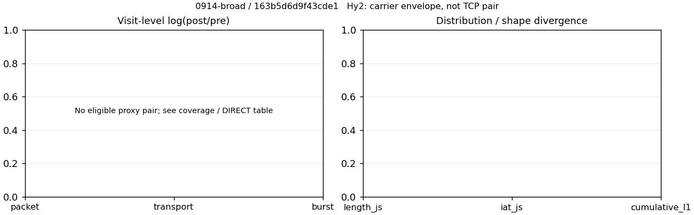

# 0914-broad · 条目 022 · baidu.com

目标：https://map.baidu.com/

活动标签：baidu.com::page_load。选定访问 3 次。

[返回总索引](../../README.md) · [统计口径](../../methods.md)

## 覆盖与资格（每次访问均保留）

| 部署 | 重复 | 主请求路由 | 活动状态 | 代理比较 | DIRECT pre | 请求 proxy/direct/unresolved | 错误 |
| --- | --- | --- | --- | --- | --- | --- | --- |
| Hy2 | 1 | direct | passed | 0 | 1 | 0/134/0 | [] |
| SS | 1 | direct | passed | 0 | 1 | 0/132/0 | [] |
| VLESS | 1 | direct | passed | 0 | 1 | 0/131/0 | [] |

主请求非 proxy 的统计仅解释为已索引的辅助代理连接或 DIRECT 观测，不代表目标业务经代理传输。播放确认与配对资格是两道不同的门。

图中散点为单次访问，短线为重复中位数；Hy2 是共享载体包络，不能与 TCP 配对作等范围因果对比。

形态图先逐访问归一化，再对访问等权平均；实线 pre，虚线 post。分箱序号及边界见 methods，不将分箱索引误解为长度或时间。

## 每次访问的关键观测

### SS

范围：`direct_pre_only`。每格 pre → post；空值为不可观测/不适用。

| 重复 | 包数 | 载荷字节 | burst | TCP FR | IAT中位µs | length JS | IAT JS |
| --- | --- | --- | --- | --- | --- | --- | --- |
| 1 | 2178 → — | 3.4346e+06 → — | 1352 → — | 362 → — | 142.74 → — | — | — |

完整标量统计：中位数 [min,max]；Δ 为重复内逐访问变换的中位数，MAD 未缩放。n 为可用变换数；DIRECT-only 的 nΔ=0 不代表 pre 不可用。

| scope | 特征 | pre | post | Δ | IQRΔ | MADΔ | nΔ |
| --- | --- | --- | --- | --- | --- | --- | --- |
| direct_pre_only | active_span_sum_s_1000ms | 17.641 [17.641, 17.641] | — | — | — | — | 0 |
| direct_pre_only | active_span_sum_s_100ms | 8.9437 [8.9437, 8.9437] | — | — | — | — | 0 |
| direct_pre_only | active_span_sum_s_500ms | 16.959 [16.959, 16.959] | — | — | — | — | 0 |
| direct_pre_only | burst_bytes_iqr | 1933.5 [1933.5, 1933.5] | — | — | — | — | 0 |
| direct_pre_only | burst_bytes_mad | 80 [80, 80] | — | — | — | — | 0 |
| direct_pre_only | burst_bytes_max | 21716 [21716, 21716] | — | — | — | — | 0 |
| direct_pre_only | burst_bytes_mean | 2540.4 [2540.4, 2540.4] | — | — | — | — | 0 |
| direct_pre_only | burst_bytes_median | 80 [80, 80] | — | — | — | — | 0 |
| direct_pre_only | burst_bytes_min | 0 [0, 0] | — | — | — | — | 0 |
| direct_pre_only | burst_bytes_p95 | 14631 [14631, 14631] | — | — | — | — | 0 |
| direct_pre_only | burst_bytes_q25 | 0 [0, 0] | — | — | — | — | 0 |
| direct_pre_only | burst_bytes_q75 | 1933.5 [1933.5, 1933.5] | — | — | — | — | 0 |
| direct_pre_only | burst_bytes_std | 4827.3 [4827.3, 4827.3] | — | — | — | — | 0 |
| direct_pre_only | burst_count | 1352 [1352, 1352] | — | — | — | — | 0 |
| direct_pre_only | burst_duration_ms_iqr | 3.3792 [3.3792, 3.3792] | — | — | — | — | 0 |
| direct_pre_only | burst_duration_ms_mad | 0 [0, 0] | — | — | — | — | 0 |
| direct_pre_only | burst_duration_ms_max | 4888.6 [4888.6, 4888.6] | — | — | — | — | 0 |
| direct_pre_only | burst_duration_ms_mean | 79.893 [79.893, 79.893] | — | — | — | — | 0 |
| direct_pre_only | burst_duration_ms_median | 0 [0, 0] | — | — | — | — | 0 |
| direct_pre_only | burst_duration_ms_min | 0 [0, 0] | — | — | — | — | 0 |
| direct_pre_only | burst_duration_ms_p95 | 132.09 [132.09, 132.09] | — | — | — | — | 0 |
| direct_pre_only | burst_duration_ms_q25 | 0 [0, 0] | — | — | — | — | 0 |
| direct_pre_only | burst_duration_ms_q75 | 3.3792 [3.3792, 3.3792] | — | — | — | — | 0 |
| direct_pre_only | burst_duration_ms_std | 429.94 [429.94, 429.94] | — | — | — | — | 0 |
| direct_pre_only | burst_packets_iqr | 1 [1, 1] | — | — | — | — | 0 |
| direct_pre_only | burst_packets_mad | 0 [0, 0] | — | — | — | — | 0 |
| direct_pre_only | burst_packets_max | 8 [8, 8] | — | — | — | — | 0 |
| direct_pre_only | burst_packets_mean | 1.6109 [1.6109, 1.6109] | — | — | — | — | 0 |
| direct_pre_only | burst_packets_median | 1 [1, 1] | — | — | — | — | 0 |
| direct_pre_only | burst_packets_min | 1 [1, 1] | — | — | — | — | 0 |
| direct_pre_only | burst_packets_p95 | 3 [3, 3] | — | — | — | — | 0 |
| direct_pre_only | burst_packets_q25 | 1 [1, 1] | — | — | — | — | 0 |
| direct_pre_only | burst_packets_q75 | 2 [2, 2] | — | — | — | — | 0 |
| direct_pre_only | burst_packets_std | 0.83708 [0.83708, 0.83708] | — | — | — | — | 0 |
| direct_pre_only | connection_span_concurrency_max | 34 [34, 34] | — | — | — | — | 0 |
| direct_pre_only | direction_entropy | 0.74141 [0.74141, 0.74141] | — | — | — | — | 0 |
| direct_pre_only | down_burst_count | 651 [651, 651] | — | — | — | — | 0 |
| direct_pre_only | down_ip_bytes | 3.2925e+06 [3.2925e+06, 3.2925e+06] | — | — | — | — | 0 |
| direct_pre_only | down_packets | 1268 [1268, 1268] | — | — | — | — | 0 |
| direct_pre_only | down_transport_bytes | 3.2262e+06 [3.2262e+06, 3.2262e+06] | — | — | — | — | 0 |
| direct_pre_only | duration_s | 21.799 [21.799, 21.799] | — | — | — | — | 0 |
| direct_pre_only | entity_count | 50 [50, 50] | — | — | — | — | 0 |
| direct_pre_only | fr_runs | 362 [362, 362] | — | — | — | — | 0 |
| direct_pre_only | fr_runs_per_packet | 0.32206 [0.32206, 0.32206] | — | — | — | — | 0 |
| direct_pre_only | fr_switches | 312 [312, 312] | — | — | — | — | 0 |
| direct_pre_only | fr_switches_per_possible_transition | 0.2905 [0.2905, 0.2905] | — | — | — | — | 0 |
| direct_pre_only | full_retransmission_fraction | 0.0041322 [0.0041322, 0.0041322] | — | — | — | — | 0 |
| direct_pre_only | full_retransmission_packets | 9 [9, 9] | — | — | — | — | 0 |
| direct_pre_only | iat_count | 2128 [2128, 2128] | — | — | — | — | 0 |
| direct_pre_only | iat_median_us | 142.74 [142.74, 142.74] | — | — | — | — | 0 |
| direct_pre_only | iat_us_iqr | 1309.6 [1309.6, 1309.6] | — | — | — | — | 0 |
| direct_pre_only | iat_us_mad | 135.32 [135.32, 135.32] | — | — | — | — | 0 |
| direct_pre_only | iat_us_max | 1.5001e+07 [1.5001e+07, 1.5001e+07] | — | — | — | — | 0 |
| direct_pre_only | iat_us_mean | 66017 [66017, 66017] | — | — | — | — | 0 |
| direct_pre_only | iat_us_median | 142.74 [142.74, 142.74] | — | — | — | — | 0 |
| direct_pre_only | iat_us_min | 0.258 [0.258, 0.258] | — | — | — | — | 0 |
| direct_pre_only | iat_us_p95 | 53174 [53174, 53174] | — | — | — | — | 0 |
| direct_pre_only | iat_us_q25 | 19.436 [19.436, 19.436] | — | — | — | — | 0 |
| direct_pre_only | iat_us_q75 | 1329.1 [1329.1, 1329.1] | — | — | — | — | 0 |
| direct_pre_only | iat_us_std | 5.7335e+05 [5.7335e+05, 5.7335e+05] | — | — | — | — | 0 |
| direct_pre_only | idle_gap_count_1000ms | 39 [39, 39] | — | — | — | — | 0 |
| direct_pre_only | idle_gap_count_100ms | 83 [83, 83] | — | — | — | — | 0 |
| direct_pre_only | idle_gap_count_500ms | 40 [40, 40] | — | — | — | — | 0 |
| direct_pre_only | idle_gap_sum_s_1000ms | 122.84 [122.84, 122.84] | — | — | — | — | 0 |
| direct_pre_only | idle_gap_sum_s_100ms | 131.54 [131.54, 131.54] | — | — | — | — | 0 |
| direct_pre_only | idle_gap_sum_s_500ms | 123.53 [123.53, 123.53] | — | — | — | — | 0 |
| direct_pre_only | ip_bytes | 3.5482e+06 [3.5482e+06, 3.5482e+06] | — | — | — | — | 0 |
| direct_pre_only | length_iqr | 3820 [3820, 3820] | — | — | — | — | 0 |
| direct_pre_only | length_mad | 1466 [1466, 1466] | — | — | — | — | 0 |
| direct_pre_only | length_max | 8920 [8920, 8920] | — | — | — | — | 0 |
| direct_pre_only | length_mean | 3055.7 [3055.7, 3055.7] | — | — | — | — | 0 |
| direct_pre_only | length_median | 2144.5 [2144.5, 2144.5] | — | — | — | — | 0 |
| direct_pre_only | length_min | 24 [24, 24] | — | — | — | — | 0 |
| direct_pre_only | length_p95 | 8920 [8920, 8920] | — | — | — | — | 0 |
| direct_pre_only | length_q25 | 753.25 [753.25, 753.25] | — | — | — | — | 0 |
| direct_pre_only | length_q75 | 4573.2 [4573.2, 4573.2] | — | — | — | — | 0 |
| direct_pre_only | length_std | 2802.9 [2802.9, 2802.9] | — | — | — | — | 0 |
| direct_pre_only | nonempty_entity_count | 50 [50, 50] | — | — | — | — | 0 |
| direct_pre_only | nonempty_packets | 1124 [1124, 1124] | — | — | — | — | 0 |
| direct_pre_only | offload_suspect_fraction | 0.30257 [0.30257, 0.30257] | — | — | — | — | 0 |
| direct_pre_only | packet_count | 2178 [2178, 2178] | — | — | — | — | 0 |
| direct_pre_only | rtt_median_ms | 0.10937 [0.10937, 0.10937] | — | — | — | — | 0 |
| direct_pre_only | rtt_sample_count | 879 [879, 879] | — | — | — | — | 0 |
| direct_pre_only | tcp_ack_count | 2081 [2081, 2081] | — | — | — | — | 0 |
| direct_pre_only | tcp_fin_count | 95 [95, 95] | — | — | — | — | 0 |
| direct_pre_only | tcp_packet_count | 2178 [2178, 2178] | — | — | — | — | 0 |
| direct_pre_only | tcp_rst_count | 47 [47, 47] | — | — | — | — | 0 |
| direct_pre_only | tcp_syn_count | 100 [100, 100] | — | — | — | — | 0 |
| direct_pre_only | tcp_window_raw_median | 65535 [65535, 65535] | — | — | — | — | 0 |
| direct_pre_only | transition_entropy | 0.66013 [0.66013, 0.66013] | — | — | — | — | 0 |
| direct_pre_only | transition_n_mm | 707 [707, 707] | — | — | — | — | 0 |
| direct_pre_only | transition_n_mp | 131 [131, 131] | — | — | — | — | 0 |
| direct_pre_only | transition_n_pm | 181 [181, 181] | — | — | — | — | 0 |
| direct_pre_only | transition_n_pp | 55 [55, 55] | — | — | — | — | 0 |
| direct_pre_only | transition_p_mm | 0.84368 [0.84368, 0.84368] | — | — | — | — | 0 |
| direct_pre_only | transition_p_mp | 0.15632 [0.15632, 0.15632] | — | — | — | — | 0 |
| direct_pre_only | transition_p_pm | 0.76695 [0.76695, 0.76695] | — | — | — | — | 0 |
| direct_pre_only | transition_p_pp | 0.23305 [0.23305, 0.23305] | — | — | — | — | 0 |
| direct_pre_only | transport_bytes | 3.4346e+06 [3.4346e+06, 3.4346e+06] | — | — | — | — | 0 |
| direct_pre_only | up_burst_count | 701 [701, 701] | — | — | — | — | 0 |
| direct_pre_only | up_byte_fraction | 0.0607 [0.0607, 0.0607] | — | — | — | — | 0 |
| direct_pre_only | up_ip_bytes | 2.5575e+05 [2.5575e+05, 2.5575e+05] | — | — | — | — | 0 |
| direct_pre_only | up_packets | 910 [910, 910] | — | — | — | — | 0 |
| direct_pre_only | up_transport_bytes | 2.0848e+05 [2.0848e+05, 2.0848e+05] | — | — | — | — | 0 |
| direct_pre_only | zero_iat_count | 0 [0, 0] | — | — | — | — | 0 |
| direct_pre_only | zero_iat_fraction | 0 [0, 0] | — | — | — | — | 0 |

### VLESS

范围：`direct_pre_only`。每格 pre → post；空值为不可观测/不适用。

| 重复 | 包数 | 载荷字节 | burst | TCP FR | IAT中位µs | length JS | IAT JS |
| --- | --- | --- | --- | --- | --- | --- | --- |
| 1 | 1867 → — | 3.1279e+06 → — | 1154 → — | 336 → — | 153.53 → — | — | — |

完整标量统计：中位数 [min,max]；Δ 为重复内逐访问变换的中位数，MAD 未缩放。n 为可用变换数；DIRECT-only 的 nΔ=0 不代表 pre 不可用。

| scope | 特征 | pre | post | Δ | IQRΔ | MADΔ | nΔ |
| --- | --- | --- | --- | --- | --- | --- | --- |
| direct_pre_only | active_span_sum_s_1000ms | 13.381 [13.381, 13.381] | — | — | — | — | 0 |
| direct_pre_only | active_span_sum_s_100ms | 6.8488 [6.8488, 6.8488] | — | — | — | — | 0 |
| direct_pre_only | active_span_sum_s_500ms | 11.405 [11.405, 11.405] | — | — | — | — | 0 |
| direct_pre_only | burst_bytes_iqr | 2684 [2684, 2684] | — | — | — | — | 0 |
| direct_pre_only | burst_bytes_mad | 162 [162, 162] | — | — | — | — | 0 |
| direct_pre_only | burst_bytes_max | 20480 [20480, 20480] | — | — | — | — | 0 |
| direct_pre_only | burst_bytes_mean | 2710.5 [2710.5, 2710.5] | — | — | — | — | 0 |
| direct_pre_only | burst_bytes_median | 162 [162, 162] | — | — | — | — | 0 |
| direct_pre_only | burst_bytes_min | 0 [0, 0] | — | — | — | — | 0 |
| direct_pre_only | burst_bytes_p95 | 14972 [14972, 14972] | — | — | — | — | 0 |
| direct_pre_only | burst_bytes_q25 | 0 [0, 0] | — | — | — | — | 0 |
| direct_pre_only | burst_bytes_q75 | 2684 [2684, 2684] | — | — | — | — | 0 |
| direct_pre_only | burst_bytes_std | 5005.1 [5005.1, 5005.1] | — | — | — | — | 0 |
| direct_pre_only | burst_count | 1154 [1154, 1154] | — | — | — | — | 0 |
| direct_pre_only | burst_duration_ms_iqr | 5.9544 [5.9544, 5.9544] | — | — | — | — | 0 |
| direct_pre_only | burst_duration_ms_mad | 0 [0, 0] | — | — | — | — | 0 |
| direct_pre_only | burst_duration_ms_max | 4927.2 [4927.2, 4927.2] | — | — | — | — | 0 |
| direct_pre_only | burst_duration_ms_mean | 79.401 [79.401, 79.401] | — | — | — | — | 0 |
| direct_pre_only | burst_duration_ms_median | 0 [0, 0] | — | — | — | — | 0 |
| direct_pre_only | burst_duration_ms_min | 0 [0, 0] | — | — | — | — | 0 |
| direct_pre_only | burst_duration_ms_p95 | 100.46 [100.46, 100.46] | — | — | — | — | 0 |
| direct_pre_only | burst_duration_ms_q25 | 0 [0, 0] | — | — | — | — | 0 |
| direct_pre_only | burst_duration_ms_q75 | 5.9544 [5.9544, 5.9544] | — | — | — | — | 0 |
| direct_pre_only | burst_duration_ms_std | 450.95 [450.95, 450.95] | — | — | — | — | 0 |
| direct_pre_only | burst_packets_iqr | 1 [1, 1] | — | — | — | — | 0 |
| direct_pre_only | burst_packets_mad | 0 [0, 0] | — | — | — | — | 0 |
| direct_pre_only | burst_packets_max | 8 [8, 8] | — | — | — | — | 0 |
| direct_pre_only | burst_packets_mean | 1.6179 [1.6179, 1.6179] | — | — | — | — | 0 |
| direct_pre_only | burst_packets_median | 1 [1, 1] | — | — | — | — | 0 |
| direct_pre_only | burst_packets_min | 1 [1, 1] | — | — | — | — | 0 |
| direct_pre_only | burst_packets_p95 | 3 [3, 3] | — | — | — | — | 0 |
| direct_pre_only | burst_packets_q25 | 1 [1, 1] | — | — | — | — | 0 |
| direct_pre_only | burst_packets_q75 | 2 [2, 2] | — | — | — | — | 0 |
| direct_pre_only | burst_packets_std | 0.85948 [0.85948, 0.85948] | — | — | — | — | 0 |
| direct_pre_only | connection_span_concurrency_max | 27 [27, 27] | — | — | — | — | 0 |
| direct_pre_only | direction_entropy | 0.75628 [0.75628, 0.75628] | — | — | — | — | 0 |
| direct_pre_only | down_burst_count | 558 [558, 558] | — | — | — | — | 0 |
| direct_pre_only | down_ip_bytes | 3.0003e+06 [3.0003e+06, 3.0003e+06] | — | — | — | — | 0 |
| direct_pre_only | down_packets | 1085 [1085, 1085] | — | — | — | — | 0 |
| direct_pre_only | down_transport_bytes | 2.9436e+06 [2.9436e+06, 2.9436e+06] | — | — | — | — | 0 |
| direct_pre_only | duration_s | 21.759 [21.759, 21.759] | — | — | — | — | 0 |
| direct_pre_only | entity_count | 38 [38, 38] | — | — | — | — | 0 |
| direct_pre_only | fr_runs | 336 [336, 336] | — | — | — | — | 0 |
| direct_pre_only | fr_runs_per_packet | 0.34532 [0.34532, 0.34532] | — | — | — | — | 0 |
| direct_pre_only | fr_switches | 298 [298, 298] | — | — | — | — | 0 |
| direct_pre_only | fr_switches_per_possible_transition | 0.31872 [0.31872, 0.31872] | — | — | — | — | 0 |
| direct_pre_only | full_retransmission_fraction | 0.0026781 [0.0026781, 0.0026781] | — | — | — | — | 0 |
| direct_pre_only | full_retransmission_packets | 5 [5, 5] | — | — | — | — | 0 |
| direct_pre_only | iat_count | 1829 [1829, 1829] | — | — | — | — | 0 |
| direct_pre_only | iat_median_us | 153.53 [153.53, 153.53] | — | — | — | — | 0 |
| direct_pre_only | iat_us_iqr | 1862.3 [1862.3, 1862.3] | — | — | — | — | 0 |
| direct_pre_only | iat_us_mad | 146.27 [146.27, 146.27] | — | — | — | — | 0 |
| direct_pre_only | iat_us_max | 1.5001e+07 [1.5001e+07, 1.5001e+07] | — | — | — | — | 0 |
| direct_pre_only | iat_us_mean | 68877 [68877, 68877] | — | — | — | — | 0 |
| direct_pre_only | iat_us_median | 153.53 [153.53, 153.53] | — | — | — | — | 0 |
| direct_pre_only | iat_us_min | 0.996 [0.996, 0.996] | — | — | — | — | 0 |
| direct_pre_only | iat_us_p95 | 45224 [45224, 45224] | — | — | — | — | 0 |
| direct_pre_only | iat_us_q25 | 21.333 [21.333, 21.333] | — | — | — | — | 0 |
| direct_pre_only | iat_us_q75 | 1883.6 [1883.6, 1883.6] | — | — | — | — | 0 |
| direct_pre_only | iat_us_std | 6.14e+05 [6.14e+05, 6.14e+05] | — | — | — | — | 0 |
| direct_pre_only | idle_gap_count_1000ms | 32 [32, 32] | — | — | — | — | 0 |
| direct_pre_only | idle_gap_count_100ms | 63 [63, 63] | — | — | — | — | 0 |
| direct_pre_only | idle_gap_count_500ms | 35 [35, 35] | — | — | — | — | 0 |
| direct_pre_only | idle_gap_sum_s_1000ms | 112.6 [112.6, 112.6] | — | — | — | — | 0 |
| direct_pre_only | idle_gap_sum_s_100ms | 119.13 [119.13, 119.13] | — | — | — | — | 0 |
| direct_pre_only | idle_gap_sum_s_500ms | 114.57 [114.57, 114.57] | — | — | — | — | 0 |
| direct_pre_only | ip_bytes | 3.2252e+06 [3.2252e+06, 3.2252e+06] | — | — | — | — | 0 |
| direct_pre_only | length_iqr | 4339 [4339, 4339] | — | — | — | — | 0 |
| direct_pre_only | length_mad | 1592 [1592, 1592] | — | — | — | — | 0 |
| direct_pre_only | length_max | 8920 [8920, 8920] | — | — | — | — | 0 |
| direct_pre_only | length_mean | 3214.7 [3214.7, 3214.7] | — | — | — | — | 0 |
| direct_pre_only | length_median | 2293 [2293, 2293] | — | — | — | — | 0 |
| direct_pre_only | length_min | 24 [24, 24] | — | — | — | — | 0 |
| direct_pre_only | length_p95 | 8920 [8920, 8920] | — | — | — | — | 0 |
| direct_pre_only | length_q25 | 766 [766, 766] | — | — | — | — | 0 |
| direct_pre_only | length_q75 | 5105 [5105, 5105] | — | — | — | — | 0 |
| direct_pre_only | length_std | 2924.1 [2924.1, 2924.1] | — | — | — | — | 0 |
| direct_pre_only | nonempty_entity_count | 38 [38, 38] | — | — | — | — | 0 |
| direct_pre_only | nonempty_packets | 973 [973, 973] | — | — | — | — | 0 |
| direct_pre_only | offload_suspect_fraction | 0.30959 [0.30959, 0.30959] | — | — | — | — | 0 |
| direct_pre_only | packet_count | 1867 [1867, 1867] | — | — | — | — | 0 |
| direct_pre_only | rtt_median_ms | 0.12966 [0.12966, 0.12966] | — | — | — | — | 0 |
| direct_pre_only | rtt_sample_count | 757 [757, 757] | — | — | — | — | 0 |
| direct_pre_only | tcp_ack_count | 1791 [1791, 1791] | — | — | — | — | 0 |
| direct_pre_only | tcp_fin_count | 74 [74, 74] | — | — | — | — | 0 |
| direct_pre_only | tcp_packet_count | 1867 [1867, 1867] | — | — | — | — | 0 |
| direct_pre_only | tcp_rst_count | 38 [38, 38] | — | — | — | — | 0 |
| direct_pre_only | tcp_syn_count | 76 [76, 76] | — | — | — | — | 0 |
| direct_pre_only | tcp_window_raw_median | 65535 [65535, 65535] | — | — | — | — | 0 |
| direct_pre_only | transition_entropy | 0.69276 [0.69276, 0.69276] | — | — | — | — | 0 |
| direct_pre_only | transition_n_mm | 594 [594, 594] | — | — | — | — | 0 |
| direct_pre_only | transition_n_mp | 131 [131, 131] | — | — | — | — | 0 |
| direct_pre_only | transition_n_pm | 167 [167, 167] | — | — | — | — | 0 |
| direct_pre_only | transition_n_pp | 43 [43, 43] | — | — | — | — | 0 |
| direct_pre_only | transition_p_mm | 0.81931 [0.81931, 0.81931] | — | — | — | — | 0 |
| direct_pre_only | transition_p_mp | 0.18069 [0.18069, 0.18069] | — | — | — | — | 0 |
| direct_pre_only | transition_p_pm | 0.79524 [0.79524, 0.79524] | — | — | — | — | 0 |
| direct_pre_only | transition_p_pp | 0.20476 [0.20476, 0.20476] | — | — | — | — | 0 |
| direct_pre_only | transport_bytes | 3.1279e+06 [3.1279e+06, 3.1279e+06] | — | — | — | — | 0 |
| direct_pre_only | up_burst_count | 596 [596, 596] | — | — | — | — | 0 |
| direct_pre_only | up_byte_fraction | 0.058934 [0.058934, 0.058934] | — | — | — | — | 0 |
| direct_pre_only | up_ip_bytes | 2.2492e+05 [2.2492e+05, 2.2492e+05] | — | — | — | — | 0 |
| direct_pre_only | up_packets | 782 [782, 782] | — | — | — | — | 0 |
| direct_pre_only | up_transport_bytes | 1.8434e+05 [1.8434e+05, 1.8434e+05] | — | — | — | — | 0 |
| direct_pre_only | zero_iat_count | 0 [0, 0] | — | — | — | — | 0 |
| direct_pre_only | zero_iat_fraction | 0 [0, 0] | — | — | — | — | 0 |

### Hy2

范围：`direct_pre_only`。每格 pre → post；空值为不可观测/不适用。

| 重复 | 包数 | 载荷字节 | burst | TCP FR | IAT中位µs | length JS | IAT JS |
| --- | --- | --- | --- | --- | --- | --- | --- |
| 1 | 2142 → — | 3.39e+06 → — | 1331 → — | 346 → — | 129.99 → — | — | — |

完整标量统计：中位数 [min,max]；Δ 为重复内逐访问变换的中位数，MAD 未缩放。n 为可用变换数；DIRECT-only 的 nΔ=0 不代表 pre 不可用。

| scope | 特征 | pre | post | Δ | IQRΔ | MADΔ | nΔ |
| --- | --- | --- | --- | --- | --- | --- | --- |
| direct_pre_only | active_span_sum_s_1000ms | 17.873 [17.873, 17.873] | — | — | — | — | 0 |
| direct_pre_only | active_span_sum_s_100ms | 9.2253 [9.2253, 9.2253] | — | — | — | — | 0 |
| direct_pre_only | active_span_sum_s_500ms | 13.429 [13.429, 13.429] | — | — | — | — | 0 |
| direct_pre_only | burst_bytes_iqr | 2824 [2824, 2824] | — | — | — | — | 0 |
| direct_pre_only | burst_bytes_mad | 92 [92, 92] | — | — | — | — | 0 |
| direct_pre_only | burst_bytes_max | 24779 [24779, 24779] | — | — | — | — | 0 |
| direct_pre_only | burst_bytes_mean | 2546.9 [2546.9, 2546.9] | — | — | — | — | 0 |
| direct_pre_only | burst_bytes_median | 92 [92, 92] | — | — | — | — | 0 |
| direct_pre_only | burst_bytes_min | 0 [0, 0] | — | — | — | — | 0 |
| direct_pre_only | burst_bytes_p95 | 14724 [14724, 14724] | — | — | — | — | 0 |
| direct_pre_only | burst_bytes_q25 | 0 [0, 0] | — | — | — | — | 0 |
| direct_pre_only | burst_bytes_q75 | 2824 [2824, 2824] | — | — | — | — | 0 |
| direct_pre_only | burst_bytes_std | 4757.5 [4757.5, 4757.5] | — | — | — | — | 0 |
| direct_pre_only | burst_count | 1331 [1331, 1331] | — | — | — | — | 0 |
| direct_pre_only | burst_duration_ms_iqr | 2.0843 [2.0843, 2.0843] | — | — | — | — | 0 |
| direct_pre_only | burst_duration_ms_mad | 0 [0, 0] | — | — | — | — | 0 |
| direct_pre_only | burst_duration_ms_max | 6806.9 [6806.9, 6806.9] | — | — | — | — | 0 |
| direct_pre_only | burst_duration_ms_mean | 180.99 [180.99, 180.99] | — | — | — | — | 0 |
| direct_pre_only | burst_duration_ms_median | 0 [0, 0] | — | — | — | — | 0 |
| direct_pre_only | burst_duration_ms_min | 0 [0, 0] | — | — | — | — | 0 |
| direct_pre_only | burst_duration_ms_p95 | 116.52 [116.52, 116.52] | — | — | — | — | 0 |
| direct_pre_only | burst_duration_ms_q25 | 0 [0, 0] | — | — | — | — | 0 |
| direct_pre_only | burst_duration_ms_q75 | 2.0843 [2.0843, 2.0843] | — | — | — | — | 0 |
| direct_pre_only | burst_duration_ms_std | 985.47 [985.47, 985.47] | — | — | — | — | 0 |
| direct_pre_only | burst_packets_iqr | 1 [1, 1] | — | — | — | — | 0 |
| direct_pre_only | burst_packets_mad | 0 [0, 0] | — | — | — | — | 0 |
| direct_pre_only | burst_packets_max | 6 [6, 6] | — | — | — | — | 0 |
| direct_pre_only | burst_packets_mean | 1.6093 [1.6093, 1.6093] | — | — | — | — | 0 |
| direct_pre_only | burst_packets_median | 1 [1, 1] | — | — | — | — | 0 |
| direct_pre_only | burst_packets_min | 1 [1, 1] | — | — | — | — | 0 |
| direct_pre_only | burst_packets_p95 | 3 [3, 3] | — | — | — | — | 0 |
| direct_pre_only | burst_packets_q25 | 1 [1, 1] | — | — | — | — | 0 |
| direct_pre_only | burst_packets_q75 | 2 [2, 2] | — | — | — | — | 0 |
| direct_pre_only | burst_packets_std | 0.85844 [0.85844, 0.85844] | — | — | — | — | 0 |
| direct_pre_only | connection_span_concurrency_max | 36 [36, 36] | — | — | — | — | 0 |
| direct_pre_only | direction_entropy | 0.69226 [0.69226, 0.69226] | — | — | — | — | 0 |
| direct_pre_only | down_burst_count | 647 [647, 647] | — | — | — | — | 0 |
| direct_pre_only | down_ip_bytes | 3.27e+06 [3.27e+06, 3.27e+06] | — | — | — | — | 0 |
| direct_pre_only | down_packets | 1277 [1277, 1277] | — | — | — | — | 0 |
| direct_pre_only | down_transport_bytes | 3.2033e+06 [3.2033e+06, 3.2033e+06] | — | — | — | — | 0 |
| direct_pre_only | duration_s | 22.292 [22.292, 22.292] | — | — | — | — | 0 |
| direct_pre_only | entity_count | 37 [37, 37] | — | — | — | — | 0 |
| direct_pre_only | fr_runs | 346 [346, 346] | — | — | — | — | 0 |
| direct_pre_only | fr_runs_per_packet | 0.30298 [0.30298, 0.30298] | — | — | — | — | 0 |
| direct_pre_only | fr_switches | 309 [309, 309] | — | — | — | — | 0 |
| direct_pre_only | fr_switches_per_possible_transition | 0.27964 [0.27964, 0.27964] | — | — | — | — | 0 |
| direct_pre_only | full_retransmission_fraction | 0.00046685 [0.00046685, 0.00046685] | — | — | — | — | 0 |
| direct_pre_only | full_retransmission_packets | 1 [1, 1] | — | — | — | — | 0 |
| direct_pre_only | iat_count | 2105 [2105, 2105] | — | — | — | — | 0 |
| direct_pre_only | iat_median_us | 129.99 [129.99, 129.99] | — | — | — | — | 0 |
| direct_pre_only | iat_us_iqr | 1298.9 [1298.9, 1298.9] | — | — | — | — | 0 |
| direct_pre_only | iat_us_mad | 120.93 [120.93, 120.93] | — | — | — | — | 0 |
| direct_pre_only | iat_us_max | 1.5001e+07 [1.5001e+07, 1.5001e+07] | — | — | — | — | 0 |
| direct_pre_only | iat_us_mean | 3.5789e+05 [3.5789e+05, 3.5789e+05] | — | — | — | — | 0 |
| direct_pre_only | iat_us_median | 129.99 [129.99, 129.99] | — | — | — | — | 0 |
| direct_pre_only | iat_us_min | 0.12 [0.12, 0.12] | — | — | — | — | 0 |
| direct_pre_only | iat_us_p95 | 1.1006e+05 [1.1006e+05, 1.1006e+05] | — | — | — | — | 0 |
| direct_pre_only | iat_us_q25 | 22.093 [22.093, 22.093] | — | — | — | — | 0 |
| direct_pre_only | iat_us_q75 | 1321 [1321, 1321] | — | — | — | — | 0 |
| direct_pre_only | iat_us_std | 2.035e+06 [2.035e+06, 2.035e+06] | — | — | — | — | 0 |
| direct_pre_only | idle_gap_count_1000ms | 73 [73, 73] | — | — | — | — | 0 |
| direct_pre_only | idle_gap_count_100ms | 106 [106, 106] | — | — | — | — | 0 |
| direct_pre_only | idle_gap_count_500ms | 80 [80, 80] | — | — | — | — | 0 |
| direct_pre_only | idle_gap_sum_s_1000ms | 735.48 [735.48, 735.48] | — | — | — | — | 0 |
| direct_pre_only | idle_gap_sum_s_100ms | 744.13 [744.13, 744.13] | — | — | — | — | 0 |
| direct_pre_only | idle_gap_sum_s_500ms | 739.92 [739.92, 739.92] | — | — | — | — | 0 |
| direct_pre_only | ip_bytes | 3.5017e+06 [3.5017e+06, 3.5017e+06] | — | — | — | — | 0 |
| direct_pre_only | length_iqr | 3175.5 [3175.5, 3175.5] | — | — | — | — | 0 |
| direct_pre_only | length_mad | 1636.5 [1636.5, 1636.5] | — | — | — | — | 0 |
| direct_pre_only | length_max | 8920 [8920, 8920] | — | — | — | — | 0 |
| direct_pre_only | length_mean | 2968.5 [2968.5, 2968.5] | — | — | — | — | 0 |
| direct_pre_only | length_median | 2723.5 [2723.5, 2723.5] | — | — | — | — | 0 |
| direct_pre_only | length_min | 24 [24, 24] | — | — | — | — | 0 |
| direct_pre_only | length_p95 | 8920 [8920, 8920] | — | — | — | — | 0 |
| direct_pre_only | length_q25 | 920.5 [920.5, 920.5] | — | — | — | — | 0 |
| direct_pre_only | length_q75 | 4096 [4096, 4096] | — | — | — | — | 0 |
| direct_pre_only | length_std | 2613.8 [2613.8, 2613.8] | — | — | — | — | 0 |
| direct_pre_only | nonempty_entity_count | 37 [37, 37] | — | — | — | — | 0 |
| direct_pre_only | nonempty_packets | 1142 [1142, 1142] | — | — | — | — | 0 |
| direct_pre_only | offload_suspect_fraction | 0.3254 [0.3254, 0.3254] | — | — | — | — | 0 |
| direct_pre_only | packet_count | 2142 [2142, 2142] | — | — | — | — | 0 |
| direct_pre_only | rtt_median_ms | 0.11704 [0.11704, 0.11704] | — | — | — | — | 0 |
| direct_pre_only | rtt_sample_count | 840 [840, 840] | — | — | — | — | 0 |
| direct_pre_only | tcp_ack_count | 2085 [2085, 2085] | — | — | — | — | 0 |
| direct_pre_only | tcp_fin_count | 64 [64, 64] | — | — | — | — | 0 |
| direct_pre_only | tcp_packet_count | 2142 [2142, 2142] | — | — | — | — | 0 |
| direct_pre_only | tcp_rst_count | 20 [20, 20] | — | — | — | — | 0 |
| direct_pre_only | tcp_syn_count | 74 [74, 74] | — | — | — | — | 0 |
| direct_pre_only | tcp_window_raw_median | 65535 [65535, 65535] | — | — | — | — | 0 |
| direct_pre_only | transition_entropy | 0.62958 [0.62958, 0.62958] | — | — | — | — | 0 |
| direct_pre_only | transition_n_mm | 757 [757, 757] | — | — | — | — | 0 |
| direct_pre_only | transition_n_mp | 136 [136, 136] | — | — | — | — | 0 |
| direct_pre_only | transition_n_pm | 173 [173, 173] | — | — | — | — | 0 |
| direct_pre_only | transition_n_pp | 39 [39, 39] | — | — | — | — | 0 |
| direct_pre_only | transition_p_mm | 0.8477 [0.8477, 0.8477] | — | — | — | — | 0 |
| direct_pre_only | transition_p_mp | 0.1523 [0.1523, 0.1523] | — | — | — | — | 0 |
| direct_pre_only | transition_p_pm | 0.81604 [0.81604, 0.81604] | — | — | — | — | 0 |
| direct_pre_only | transition_p_pp | 0.18396 [0.18396, 0.18396] | — | — | — | — | 0 |
| direct_pre_only | transport_bytes | 3.39e+06 [3.39e+06, 3.39e+06] | — | — | — | — | 0 |
| direct_pre_only | up_burst_count | 684 [684, 684] | — | — | — | — | 0 |
| direct_pre_only | up_byte_fraction | 0.05507 [0.05507, 0.05507] | — | — | — | — | 0 |
| direct_pre_only | up_ip_bytes | 2.3173e+05 [2.3173e+05, 2.3173e+05] | — | — | — | — | 0 |
| direct_pre_only | up_packets | 865 [865, 865] | — | — | — | — | 0 |
| direct_pre_only | up_transport_bytes | 1.8668e+05 [1.8668e+05, 1.8668e+05] | — | — | — | — | 0 |
| direct_pre_only | zero_iat_count | 0 [0, 0] | — | — | — | — | 0 |
| direct_pre_only | zero_iat_fraction | 0 [0, 0] | — | — | — | — | 0 |

## 不同部署对比

以下是各部署自身重复中位数的差异，不按重复编号强行配对。跨 TCP/Hy2 的行标记异质观测范围。

| 视角 | 特征 | 部署A | 部署B | A中位 | B中位 | B−A | 比较口径 |
| --- | --- | --- | --- | --- | --- | --- | --- |
| pre | burst_count | SS | VLESS | 1352 | 1154 | -198 | same_scope_unpaired_visits |
| pre | burst_count | SS | Hy2 | 1352 | 1331 | -21 | same_scope_unpaired_visits |
| pre | burst_count | VLESS | Hy2 | 1154 | 1331 | 177 | same_scope_unpaired_visits |
| pre | connection_span_concurrency_max | SS | VLESS | 34 | 27 | -7 | same_scope_unpaired_visits |
| pre | connection_span_concurrency_max | SS | Hy2 | 34 | 36 | 2 | same_scope_unpaired_visits |
| pre | connection_span_concurrency_max | VLESS | Hy2 | 27 | 36 | 9 | same_scope_unpaired_visits |
| pre | direction_entropy | SS | VLESS | 0.74141 | 0.75628 | 0.014868 | same_scope_unpaired_visits |
| pre | direction_entropy | SS | Hy2 | 0.74141 | 0.69226 | -0.049155 | same_scope_unpaired_visits |
| pre | direction_entropy | VLESS | Hy2 | 0.75628 | 0.69226 | -0.064023 | same_scope_unpaired_visits |
| pre | down_transport_bytes | SS | VLESS | 3.2262e+06 | 2.9436e+06 | -2.8257e+05 | same_scope_unpaired_visits |
| pre | down_transport_bytes | SS | Hy2 | 3.2262e+06 | 3.2033e+06 | -22872 | same_scope_unpaired_visits |
| pre | down_transport_bytes | VLESS | Hy2 | 2.9436e+06 | 3.2033e+06 | 2.597e+05 | same_scope_unpaired_visits |
| pre | duration_s | SS | VLESS | 21.799 | 21.759 | -0.0408 | same_scope_unpaired_visits |
| pre | duration_s | SS | Hy2 | 21.799 | 22.292 | 0.49239 | same_scope_unpaired_visits |
| pre | duration_s | VLESS | Hy2 | 21.759 | 22.292 | 0.53319 | same_scope_unpaired_visits |
| pre | entity_count | SS | VLESS | 50 | 38 | -12 | same_scope_unpaired_visits |
| pre | entity_count | SS | Hy2 | 50 | 37 | -13 | same_scope_unpaired_visits |
| pre | entity_count | VLESS | Hy2 | 38 | 37 | -1 | same_scope_unpaired_visits |
| pre | fr_runs | SS | VLESS | 362 | 336 | -26 | same_scope_unpaired_visits |
| pre | fr_runs | SS | Hy2 | 362 | 346 | -16 | same_scope_unpaired_visits |
| pre | fr_runs | VLESS | Hy2 | 336 | 346 | 10 | same_scope_unpaired_visits |
| pre | fr_runs_per_packet | SS | VLESS | 0.32206 | 0.34532 | 0.02326 | same_scope_unpaired_visits |
| pre | fr_runs_per_packet | SS | Hy2 | 0.32206 | 0.30298 | -0.019087 | same_scope_unpaired_visits |
| pre | fr_runs_per_packet | VLESS | Hy2 | 0.34532 | 0.30298 | -0.042347 | same_scope_unpaired_visits |
| pre | fr_switches | SS | VLESS | 312 | 298 | -14 | same_scope_unpaired_visits |
| pre | fr_switches | SS | Hy2 | 312 | 309 | -3 | same_scope_unpaired_visits |
| pre | fr_switches | VLESS | Hy2 | 298 | 309 | 11 | same_scope_unpaired_visits |
| pre | fr_switches_per_possible_transition | SS | VLESS | 0.2905 | 0.31872 | 0.028214 | same_scope_unpaired_visits |
| pre | fr_switches_per_possible_transition | SS | Hy2 | 0.2905 | 0.27964 | -0.010865 | same_scope_unpaired_visits |
| pre | fr_switches_per_possible_transition | VLESS | Hy2 | 0.31872 | 0.27964 | -0.039079 | same_scope_unpaired_visits |
| pre | full_retransmission_fraction | SS | VLESS | 0.0041322 | 0.0026781 | -0.0014541 | same_scope_unpaired_visits |
| pre | full_retransmission_fraction | SS | Hy2 | 0.0041322 | 0.00046685 | -0.0036654 | same_scope_unpaired_visits |
| pre | full_retransmission_fraction | VLESS | Hy2 | 0.0026781 | 0.00046685 | -0.0022112 | same_scope_unpaired_visits |
| pre | iat_median_us | SS | VLESS | 142.74 | 153.53 | 10.796 | same_scope_unpaired_visits |
| pre | iat_median_us | SS | Hy2 | 142.74 | 129.99 | -12.745 | same_scope_unpaired_visits |
| pre | iat_median_us | VLESS | Hy2 | 153.53 | 129.99 | -23.541 | same_scope_unpaired_visits |
| pre | iat_us_p95 | SS | VLESS | 53174 | 45224 | -7949.4 | same_scope_unpaired_visits |
| pre | iat_us_p95 | SS | Hy2 | 53174 | 1.1006e+05 | 56882 | same_scope_unpaired_visits |
| pre | iat_us_p95 | VLESS | Hy2 | 45224 | 1.1006e+05 | 64832 | same_scope_unpaired_visits |
| pre | ip_bytes | SS | VLESS | 3.5482e+06 | 3.2252e+06 | -3.2301e+05 | same_scope_unpaired_visits |
| pre | ip_bytes | SS | Hy2 | 3.5482e+06 | 3.5017e+06 | -46521 | same_scope_unpaired_visits |
| pre | ip_bytes | VLESS | Hy2 | 3.2252e+06 | 3.5017e+06 | 2.7649e+05 | same_scope_unpaired_visits |
| pre | length_median | SS | VLESS | 2144.5 | 2293 | 148.5 | same_scope_unpaired_visits |
| pre | length_median | SS | Hy2 | 2144.5 | 2723.5 | 579 | same_scope_unpaired_visits |
| pre | length_median | VLESS | Hy2 | 2293 | 2723.5 | 430.5 | same_scope_unpaired_visits |
| pre | length_p95 | SS | VLESS | 8920 | 8920 | 0 | same_scope_unpaired_visits |
| pre | length_p95 | SS | Hy2 | 8920 | 8920 | 0 | same_scope_unpaired_visits |
| pre | length_p95 | VLESS | Hy2 | 8920 | 8920 | 0 | same_scope_unpaired_visits |
| pre | nonempty_packets | SS | VLESS | 1124 | 973 | -151 | same_scope_unpaired_visits |
| pre | nonempty_packets | SS | Hy2 | 1124 | 1142 | 18 | same_scope_unpaired_visits |
| pre | nonempty_packets | VLESS | Hy2 | 973 | 1142 | 169 | same_scope_unpaired_visits |
| pre | offload_suspect_fraction | SS | VLESS | 0.30257 | 0.30959 | 0.0070164 | same_scope_unpaired_visits |
| pre | offload_suspect_fraction | SS | Hy2 | 0.30257 | 0.3254 | 0.022826 | same_scope_unpaired_visits |
| pre | offload_suspect_fraction | VLESS | Hy2 | 0.30959 | 0.3254 | 0.015809 | same_scope_unpaired_visits |
| pre | packet_count | SS | VLESS | 2178 | 1867 | -311 | same_scope_unpaired_visits |
| pre | packet_count | SS | Hy2 | 2178 | 2142 | -36 | same_scope_unpaired_visits |
| pre | packet_count | VLESS | Hy2 | 1867 | 2142 | 275 | same_scope_unpaired_visits |
| pre | rtt_median_ms | SS | VLESS | 0.10937 | 0.12966 | 0.020292 | same_scope_unpaired_visits |
| pre | rtt_median_ms | SS | Hy2 | 0.10937 | 0.11704 | 0.0076715 | same_scope_unpaired_visits |
| pre | rtt_median_ms | VLESS | Hy2 | 0.12966 | 0.11704 | -0.012621 | same_scope_unpaired_visits |
| pre | transition_entropy | SS | VLESS | 0.66013 | 0.69276 | 0.032632 | same_scope_unpaired_visits |
| pre | transition_entropy | SS | Hy2 | 0.66013 | 0.62958 | -0.030547 | same_scope_unpaired_visits |
| pre | transition_entropy | VLESS | Hy2 | 0.69276 | 0.62958 | -0.063178 | same_scope_unpaired_visits |
| pre | transport_bytes | SS | VLESS | 3.4346e+06 | 3.1279e+06 | -3.0671e+05 | same_scope_unpaired_visits |
| pre | transport_bytes | SS | Hy2 | 3.4346e+06 | 3.39e+06 | -44669 | same_scope_unpaired_visits |
| pre | transport_bytes | VLESS | Hy2 | 3.1279e+06 | 3.39e+06 | 2.6204e+05 | same_scope_unpaired_visits |
| pre | up_byte_fraction | SS | VLESS | 0.0607 | 0.058934 | -0.0017654 | same_scope_unpaired_visits |
| pre | up_byte_fraction | SS | Hy2 | 0.0607 | 0.05507 | -0.00563 | same_scope_unpaired_visits |
| pre | up_byte_fraction | VLESS | Hy2 | 0.058934 | 0.05507 | -0.0038647 | same_scope_unpaired_visits |
| pre | up_transport_bytes | SS | VLESS | 2.0848e+05 | 1.8434e+05 | -24139 | same_scope_unpaired_visits |
| pre | up_transport_bytes | SS | Hy2 | 2.0848e+05 | 1.8668e+05 | -21797 | same_scope_unpaired_visits |
| pre | up_transport_bytes | VLESS | Hy2 | 1.8434e+05 | 1.8668e+05 | 2342 | same_scope_unpaired_visits |

## 可复核的访问标识

| 部署 | 重复 | session_id |
| --- | --- | --- |
| SS | 1 | e3669a46-6bdc-4ec9-90ad-acb59cd2c601 |
| VLESS | 1 | 01074139-6ce1-4bf7-99c6-6483885494ff |
| Hy2 | 1 | c0e300d4-a25c-4f5f-985c-1a86d4b36d6f |

全量三种 packet selection、Hy2 full 范围、Q25/Q75、直方图与曲线见机器可读产物；本页只显示 observed 主范围。
