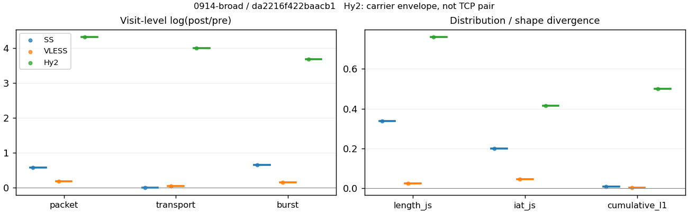
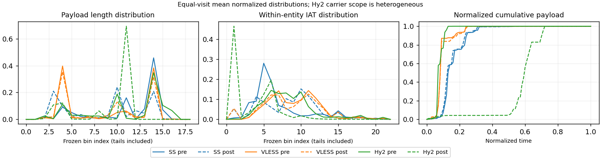

# 0914-broad · 条目 023 · openstreetmap.org

目标：https://www.openstreetmap.org/

活动标签：openstreetmap.org::page_load。选定访问 3 次。

[返回总索引](../../README.md) · [统计口径](../../methods.md)

## 覆盖与资格（每次访问均保留）

| 部署 | 重复 | 主请求路由 | 活动状态 | 代理比较 | DIRECT pre | 请求 proxy/direct/unresolved | 错误 |
| --- | --- | --- | --- | --- | --- | --- | --- |
| Hy2 | 1 | proxy | passed | 1 | 0 | 36/0/0 | [] |
| SS | 1 | proxy | passed | 1 | 0 | 36/0/0 | [] |
| VLESS | 1 | proxy | passed | 1 | 0 | 36/0/0 | [] |

主请求非 proxy 的统计仅解释为已索引的辅助代理连接或 DIRECT 观测，不代表目标业务经代理传输。播放确认与配对资格是两道不同的门。

图中散点为单次访问，短线为重复中位数；Hy2 是共享载体包络，不能与 TCP 配对作等范围因果对比。

形态图先逐访问归一化，再对访问等权平均；实线 pre，虚线 post。分箱序号及边界见 methods，不将分箱索引误解为长度或时间。

## 每次访问的关键观测

### SS

范围：`exclusive_page`。每格 pre → post；空值为不可观测/不适用。

| 重复 | 包数 | 载荷字节 | burst | TCP FR | IAT中位µs | length JS | IAT JS |
| --- | --- | --- | --- | --- | --- | --- | --- |
| 1 | 711 → 1272 | 9.0848e+05 → 9.2049e+05 | 471 → 905 | 40 → 41 | 22.38 → 285.38 | 0.33771 | 0.19928 |

完整标量统计：中位数 [min,max]；Δ 为重复内逐访问变换的中位数，MAD 未缩放。n 为可用变换数；DIRECT-only 的 nΔ=0 不代表 pre 不可用。

| scope | 特征 | pre | post | Δ | IQRΔ | MADΔ | nΔ |
| --- | --- | --- | --- | --- | --- | --- | --- |
| exclusive_page | active_span_sum_s_1000ms | 6.7742 [6.7742, 6.7742] | 8.5 [8.5, 8.5] | 0.22694 | — | — | 1 |
| exclusive_page | active_span_sum_s_100ms | 2.0718 [2.0718, 2.0718] | 3.017 [3.017, 3.017] | 0.37584 | — | — | 1 |
| exclusive_page | active_span_sum_s_500ms | 6.0084 [6.0084, 6.0084] | 6.9444 [6.9444, 6.9444] | 0.14477 | — | — | 1 |
| exclusive_page | burst_bytes_iqr | 2896 [2896, 2896] | 1482 [1482, 1482] | -0.66994 | — | — | 1 |
| exclusive_page | burst_bytes_mad | 64 [64, 64] | 34 [34, 34] | -0.63252 | — | — | 1 |
| exclusive_page | burst_bytes_max | 20480 [20480, 20480] | 9990 [9990, 9990] | -0.71786 | — | — | 1 |
| exclusive_page | burst_bytes_mean | 1928.8 [1928.8, 1928.8] | 1017.1 [1017.1, 1017.1] | -0.63994 | — | — | 1 |
| exclusive_page | burst_bytes_median | 64 [64, 64] | 34 [34, 34] | -0.63252 | — | — | 1 |
| exclusive_page | burst_bytes_min | 0 [0, 0] | 0 [0, 0] | — | — | — | 0 |
| exclusive_page | burst_bytes_p95 | 8688 [8688, 8688] | 3581.6 [3581.6, 3581.6] | -0.88613 | — | — | 1 |
| exclusive_page | burst_bytes_q25 | 0 [0, 0] | 0 [0, 0] | — | — | — | 0 |
| exclusive_page | burst_bytes_q75 | 2896 [2896, 2896] | 1482 [1482, 1482] | -0.66994 | — | — | 1 |
| exclusive_page | burst_bytes_std | 3169.7 [3169.7, 3169.7] | 1527.3 [1527.3, 1527.3] | -0.73013 | — | — | 1 |
| exclusive_page | burst_count | 471 [471, 471] | 905 [905, 905] | 0.65308 | — | — | 1 |
| exclusive_page | burst_duration_ms_iqr | 0.019314 [0.019314, 0.019314] | 0 [0, 0] | — | — | — | 0 |
| exclusive_page | burst_duration_ms_mad | 0 [0, 0] | 0 [0, 0] | — | — | — | 0 |
| exclusive_page | burst_duration_ms_max | 2201.1 [2201.1, 2201.1] | 1437.4 [1437.4, 1437.4] | -0.42611 | — | — | 1 |
| exclusive_page | burst_duration_ms_mean | 25.269 [25.269, 25.269] | 9.2749 [9.2749, 9.2749] | -1.0023 | — | — | 1 |
| exclusive_page | burst_duration_ms_median | 0 [0, 0] | 0 [0, 0] | — | — | — | 0 |
| exclusive_page | burst_duration_ms_min | 0 [0, 0] | 0 [0, 0] | — | — | — | 0 |
| exclusive_page | burst_duration_ms_p95 | 51.699 [51.699, 51.699] | 1.0254 [1.0254, 1.0254] | -3.9204 | — | — | 1 |
| exclusive_page | burst_duration_ms_q25 | 0 [0, 0] | 0 [0, 0] | — | — | — | 0 |
| exclusive_page | burst_duration_ms_q75 | 0.019314 [0.019314, 0.019314] | 0 [0, 0] | — | — | — | 0 |
| exclusive_page | burst_duration_ms_std | 167.56 [167.56, 167.56] | 77.354 [77.354, 77.354] | -0.77295 | — | — | 1 |
| exclusive_page | burst_packets_iqr | 1 [1, 1] | 0 [0, 0] | — | — | — | 0 |
| exclusive_page | burst_packets_mad | 0 [0, 0] | 0 [0, 0] | — | — | — | 0 |
| exclusive_page | burst_packets_max | 10 [10, 10] | 8 [8, 8] | -0.22314 | — | — | 1 |
| exclusive_page | burst_packets_mean | 1.5096 [1.5096, 1.5096] | 1.4055 [1.4055, 1.4055] | -0.071404 | — | — | 1 |
| exclusive_page | burst_packets_median | 1 [1, 1] | 1 [1, 1] | 0 | — | — | 1 |
| exclusive_page | burst_packets_min | 1 [1, 1] | 1 [1, 1] | 0 | — | — | 1 |
| exclusive_page | burst_packets_p95 | 3 [3, 3] | 3 [3, 3] | 0 | — | — | 1 |
| exclusive_page | burst_packets_q25 | 1 [1, 1] | 1 [1, 1] | 0 | — | — | 1 |
| exclusive_page | burst_packets_q75 | 2 [2, 2] | 1 [1, 1] | -0.69315 | — | — | 1 |
| exclusive_page | burst_packets_std | 0.99437 [0.99437, 0.99437] | 0.89082 [0.89082, 0.89082] | -0.10996 | — | — | 1 |
| exclusive_page | connection_span_concurrency_max | 4 [4, 4] | 4 [4, 4] | 0 | — | — | 1 |
| exclusive_page | cumulative_l1 | — | — | 0.0074478 | — | — | 1 |
| exclusive_page | cumulative_max | — | — | 0.15671 | — | — | 1 |
| exclusive_page | direction_entropy | 0.55863 [0.55863, 0.55863] | 0.37765 [0.37765, 0.37765] | -0.18098 | — | — | 1 |
| exclusive_page | down_burst_count | 233 [233, 233] | 450 [450, 450] | 0.65821 | — | — | 1 |
| exclusive_page | down_ip_bytes | 9.1481e+05 [9.1481e+05, 9.1481e+05] | 9.4016e+05 [9.4016e+05, 9.4016e+05] | 0.027336 | — | — | 1 |
| exclusive_page | down_packets | 445 [445, 445] | 746 [746, 746] | 0.51665 | — | — | 1 |
| exclusive_page | down_transport_bytes | 8.9163e+05 [8.9163e+05, 8.9163e+05] | 9.0131e+05 [9.0131e+05, 9.0131e+05] | 0.010807 | — | — | 1 |
| exclusive_page | duration_s | 11.865 [11.865, 11.865] | 12.187 [12.187, 12.187] | 0.026763 | — | — | 1 |
| exclusive_page | entity_count | 5 [5, 5] | 5 [5, 5] | 0 | — | — | 1 |
| exclusive_page | fr_runs | 40 [40, 40] | 41 [41, 41] | 0.024693 | — | — | 1 |
| exclusive_page | fr_runs_per_packet | 0.091533 [0.091533, 0.091533] | 0.055556 [0.055556, 0.055556] | -0.035978 | — | — | 1 |
| exclusive_page | fr_switches | 35 [35, 35] | 36 [36, 36] | 0.028171 | — | — | 1 |
| exclusive_page | fr_switches_per_possible_transition | 0.081019 [0.081019, 0.081019] | 0.049113 [0.049113, 0.049113] | -0.031905 | — | — | 1 |
| exclusive_page | full_retransmission_fraction | 0.0028129 [0.0028129, 0.0028129] | 0.0023585 [0.0023585, 0.0023585] | -0.00045445 | — | — | 1 |
| exclusive_page | full_retransmission_packets | 2 [2, 2] | 3 [3, 3] | 0.40547 | — | — | 1 |
| exclusive_page | iat_count | 706 [706, 706] | 1267 [1267, 1267] | 0.58479 | — | — | 1 |
| exclusive_page | iat_js | — | — | 0.19928 | — | — | 1 |
| exclusive_page | iat_ks | — | — | 0.36409 | — | — | 1 |
| exclusive_page | iat_median_us | 22.38 [22.38, 22.38] | 285.38 [285.38, 285.38] | 2.5456 | — | — | 1 |
| exclusive_page | iat_us_iqr | 105.12 [105.12, 105.12] | 1029.3 [1029.3, 1029.3] | 2.2815 | — | — | 1 |
| exclusive_page | iat_us_mad | 16.218 [16.218, 16.218] | 280.05 [280.05, 280.05] | 2.8488 | — | — | 1 |
| exclusive_page | iat_us_max | 5.0285e+06 [5.0285e+06, 5.0285e+06] | 5.0284e+06 [5.0284e+06, 5.0284e+06] | -2.1851e-05 | — | — | 1 |
| exclusive_page | iat_us_mean | 26190 [26190, 26190] | 14844 [14844, 14844] | -0.5678 | — | — | 1 |
| exclusive_page | iat_us_median | 22.38 [22.38, 22.38] | 285.38 [285.38, 285.38] | 2.5456 | — | — | 1 |
| exclusive_page | iat_us_min | 0.286 [0.286, 0.286] | 0.041 [0.041, 0.041] | -1.9424 | — | — | 1 |
| exclusive_page | iat_us_p95 | 41557 [41557, 41557] | 23767 [23767, 23767] | -0.55879 | — | — | 1 |
| exclusive_page | iat_us_q25 | 12.288 [12.288, 12.288] | 16.307 [16.307, 16.307] | 0.28295 | — | — | 1 |
| exclusive_page | iat_us_q75 | 117.41 [117.41, 117.41] | 1045.6 [1045.6, 1045.6] | 2.1867 | — | — | 1 |
| exclusive_page | iat_us_std | 2.333e+05 [2.333e+05, 2.333e+05] | 1.6518e+05 [1.6518e+05, 1.6518e+05] | -0.34528 | — | — | 1 |
| exclusive_page | iat_wasserstein_log1p_us | — | — | 1.3659 | — | — | 1 |
| exclusive_page | idle_gap_count_1000ms | 5 [5, 5] | 5 [5, 5] | 0 | — | — | 1 |
| exclusive_page | idle_gap_count_100ms | 21 [21, 21] | 24 [24, 24] | 0.13353 | — | — | 1 |
| exclusive_page | idle_gap_count_500ms | 6 [6, 6] | 7 [7, 7] | 0.15415 | — | — | 1 |
| exclusive_page | idle_gap_sum_s_1000ms | 11.716 [11.716, 11.716] | 10.307 [10.307, 10.307] | -0.12811 | — | — | 1 |
| exclusive_page | idle_gap_sum_s_100ms | 16.418 [16.418, 16.418] | 15.79 [15.79, 15.79] | -0.039016 | — | — | 1 |
| exclusive_page | idle_gap_sum_s_500ms | 12.482 [12.482, 12.482] | 11.863 [11.863, 11.863] | -0.050866 | — | — | 1 |
| exclusive_page | ip_bytes | 9.4554e+05 [9.4554e+05, 9.4554e+05] | 9.9656e+05 [9.9656e+05, 9.9656e+05] | 0.052551 | — | — | 1 |
| exclusive_page | length_iqr | 1448 [1448, 1448] | 1428 [1428, 1428] | -0.013908 | — | — | 1 |
| exclusive_page | length_js | — | — | 0.33771 | — | — | 1 |
| exclusive_page | length_ks | — | — | 0.45863 | — | — | 1 |
| exclusive_page | length_mad | 992 [992, 992] | 1330 [1330, 1330] | 0.29321 | — | — | 1 |
| exclusive_page | length_max | 8688 [8688, 8688] | 5860 [5860, 5860] | -0.39379 | — | — | 1 |
| exclusive_page | length_mean | 2078.9 [2078.9, 2078.9] | 1247.3 [1247.3, 1247.3] | -0.51087 | — | — | 1 |
| exclusive_page | length_median | 2688 [2688, 2688] | 1428 [1428, 1428] | -0.63252 | — | — | 1 |
| exclusive_page | length_min | 24 [24, 24] | 20 [20, 20] | -0.18232 | — | — | 1 |
| exclusive_page | length_p95 | 4096 [4096, 4096] | 2856 [2856, 2856] | -0.36059 | — | — | 1 |
| exclusive_page | length_q25 | 1448 [1448, 1448] | 74 [74, 74] | -2.9739 | — | — | 1 |
| exclusive_page | length_q75 | 2896 [2896, 2896] | 1502 [1502, 1502] | -0.65653 | — | — | 1 |
| exclusive_page | length_std | 1255.6 [1255.6, 1255.6] | 1061.5 [1061.5, 1061.5] | -0.16799 | — | — | 1 |
| exclusive_page | length_wasserstein_bytes | — | — | 831.67 | — | — | 1 |
| exclusive_page | nonempty_entity_count | 5 [5, 5] | 5 [5, 5] | 0 | — | — | 1 |
| exclusive_page | nonempty_packets | 437 [437, 437] | 738 [738, 738] | 0.52401 | — | — | 1 |
| exclusive_page | offload_suspect_fraction | 0.37412 [0.37412, 0.37412] | 0.18868 [0.18868, 0.18868] | -0.18544 | — | — | 1 |
| exclusive_page | packet_count | 711 [711, 711] | 1272 [1272, 1272] | 0.58167 | — | — | 1 |
| exclusive_page | rtt_median_ms | 0.046919 [0.046919, 0.046919] | 27.473 [27.473, 27.473] | 6.3725 | — | — | 1 |
| exclusive_page | rtt_sample_count | 262 [262, 262] | 191 [191, 191] | -0.31607 | — | — | 1 |
| exclusive_page | tcp_ack_count | 705 [705, 705] | 1267 [1267, 1267] | 0.58621 | — | — | 1 |
| exclusive_page | tcp_fin_count | 9 [9, 9] | 10 [10, 10] | 0.10536 | — | — | 1 |
| exclusive_page | tcp_packet_count | 711 [711, 711] | 1272 [1272, 1272] | 0.58167 | — | — | 1 |
| exclusive_page | tcp_rst_count | 1 [1, 1] | 0 [0, 0] | — | — | — | 0 |
| exclusive_page | tcp_syn_count | 10 [10, 10] | 10 [10, 10] | 0 | — | — | 1 |
| exclusive_page | tcp_window_raw_median | 65535 [65535, 65535] | 149 [149, 149] | -6.0864 | — | — | 1 |
| exclusive_page | transition_entropy | 0.33367 [0.33367, 0.33367] | 0.21833 [0.21833, 0.21833] | -0.11534 | — | — | 1 |
| exclusive_page | transition_n_mm | 360 [360, 360] | 664 [664, 664] | 0.61218 | — | — | 1 |
| exclusive_page | transition_n_mp | 15 [15, 15] | 16 [16, 16] | 0.064539 | — | — | 1 |
| exclusive_page | transition_n_pm | 20 [20, 20] | 20 [20, 20] | 0 | — | — | 1 |
| exclusive_page | transition_n_pp | 37 [37, 37] | 33 [33, 33] | -0.11441 | — | — | 1 |
| exclusive_page | transition_p_mm | 0.96 [0.96, 0.96] | 0.97647 [0.97647, 0.97647] | 0.016471 | — | — | 1 |
| exclusive_page | transition_p_mp | 0.04 [0.04, 0.04] | 0.023529 [0.023529, 0.023529] | -0.016471 | — | — | 1 |
| exclusive_page | transition_p_pm | 0.35088 [0.35088, 0.35088] | 0.37736 [0.37736, 0.37736] | 0.026481 | — | — | 1 |
| exclusive_page | transition_p_pp | 0.64912 [0.64912, 0.64912] | 0.62264 [0.62264, 0.62264] | -0.026481 | — | — | 1 |
| exclusive_page | transport_bytes | 9.0848e+05 [9.0848e+05, 9.0848e+05] | 9.2049e+05 [9.2049e+05, 9.2049e+05] | 0.013138 | — | — | 1 |
| exclusive_page | up_burst_count | 238 [238, 238] | 455 [455, 455] | 0.64803 | — | — | 1 |
| exclusive_page | up_byte_fraction | 0.018551 [0.018551, 0.018551] | 0.020836 [0.020836, 0.020836] | 0.0022848 | — | — | 1 |
| exclusive_page | up_ip_bytes | 30737 [30737, 30737] | 56403 [56403, 56403] | 0.60706 | — | — | 1 |
| exclusive_page | up_packets | 266 [266, 266] | 526 [526, 526] | 0.6818 | — | — | 1 |
| exclusive_page | up_transport_bytes | 16853 [16853, 16853] | 19179 [19179, 19179] | 0.12929 | — | — | 1 |
| exclusive_page | zero_iat_count | 0 [0, 0] | 0 [0, 0] | — | — | — | 0 |
| exclusive_page | zero_iat_fraction | 0 [0, 0] | 0 [0, 0] | 0 | — | — | 1 |

### VLESS

范围：`exclusive_page`。每格 pre → post；空值为不可观测/不适用。

| 重复 | 包数 | 载荷字节 | burst | TCP FR | IAT中位µs | length JS | IAT JS |
| --- | --- | --- | --- | --- | --- | --- | --- |
| 1 | 685 → 825 | 5.8901e+05 → 6.2251e+05 | 458 → 533 | 29 → 38 | 386.01 → 239.79 | 0.025397 | 0.046429 |

完整标量统计：中位数 [min,max]；Δ 为重复内逐访问变换的中位数，MAD 未缩放。n 为可用变换数；DIRECT-only 的 nΔ=0 不代表 pre 不可用。

| scope | 特征 | pre | post | Δ | IQRΔ | MADΔ | nΔ |
| --- | --- | --- | --- | --- | --- | --- | --- |
| exclusive_page | active_span_sum_s_1000ms | 7.0942 [7.0942, 7.0942] | 7.0224 [7.0224, 7.0224] | -0.010173 | — | — | 1 |
| exclusive_page | active_span_sum_s_100ms | 1.1915 [1.1915, 1.1915] | 2.3219 [2.3219, 2.3219] | 0.66716 | — | — | 1 |
| exclusive_page | active_span_sum_s_500ms | 4.2967 [4.2967, 4.2967] | 7.0224 [7.0224, 7.0224] | 0.49126 | — | — | 1 |
| exclusive_page | burst_bytes_iqr | 2896 [2896, 2896] | 2824 [2824, 2824] | -0.025176 | — | — | 1 |
| exclusive_page | burst_bytes_mad | 27.5 [27.5, 27.5] | 72 [72, 72] | 0.96248 | — | — | 1 |
| exclusive_page | burst_bytes_max | 8760 [8760, 8760] | 8760 [8760, 8760] | 0 | — | — | 1 |
| exclusive_page | burst_bytes_mean | 1286 [1286, 1286] | 1167.9 [1167.9, 1167.9] | -0.096331 | — | — | 1 |
| exclusive_page | burst_bytes_median | 27.5 [27.5, 27.5] | 72 [72, 72] | 0.96248 | — | — | 1 |
| exclusive_page | burst_bytes_min | 0 [0, 0] | 0 [0, 0] | — | — | — | 0 |
| exclusive_page | burst_bytes_p95 | 2968 [2968, 2968] | 2896 [2896, 2896] | -0.024558 | — | — | 1 |
| exclusive_page | burst_bytes_q25 | 0 [0, 0] | 0 [0, 0] | — | — | — | 0 |
| exclusive_page | burst_bytes_q75 | 2896 [2896, 2896] | 2824 [2824, 2824] | -0.025176 | — | — | 1 |
| exclusive_page | burst_bytes_std | 1569.1 [1569.1, 1569.1] | 1347.4 [1347.4, 1347.4] | -0.15233 | — | — | 1 |
| exclusive_page | burst_count | 458 [458, 458] | 533 [533, 533] | 0.15165 | — | — | 1 |
| exclusive_page | burst_duration_ms_iqr | 1.3569 [1.3569, 1.3569] | 1.6428 [1.6428, 1.6428] | 0.19121 | — | — | 1 |
| exclusive_page | burst_duration_ms_mad | 0 [0, 0] | 0 [0, 0] | — | — | — | 0 |
| exclusive_page | burst_duration_ms_max | 15000 [15000, 15000] | 15026 [15026, 15026] | 0.0016754 | — | — | 1 |
| exclusive_page | burst_duration_ms_mean | 57.687 [57.687, 57.687] | 39.883 [39.883, 39.883] | -0.36908 | — | — | 1 |
| exclusive_page | burst_duration_ms_median | 0 [0, 0] | 0 [0, 0] | — | — | — | 0 |
| exclusive_page | burst_duration_ms_min | 0 [0, 0] | 0 [0, 0] | — | — | — | 0 |
| exclusive_page | burst_duration_ms_p95 | 10.257 [10.257, 10.257] | 10.074 [10.074, 10.074] | -0.017981 | — | — | 1 |
| exclusive_page | burst_duration_ms_q25 | 0 [0, 0] | 0 [0, 0] | — | — | — | 0 |
| exclusive_page | burst_duration_ms_q75 | 1.3569 [1.3569, 1.3569] | 1.6428 [1.6428, 1.6428] | 0.19121 | — | — | 1 |
| exclusive_page | burst_duration_ms_std | 728.15 [728.15, 728.15] | 653.09 [653.09, 653.09] | -0.10879 | — | — | 1 |
| exclusive_page | burst_packets_iqr | 1 [1, 1] | 1 [1, 1] | 0 | — | — | 1 |
| exclusive_page | burst_packets_mad | 0 [0, 0] | 0 [0, 0] | — | — | — | 0 |
| exclusive_page | burst_packets_max | 3 [3, 3] | 7 [7, 7] | 0.8473 | — | — | 1 |
| exclusive_page | burst_packets_mean | 1.4956 [1.4956, 1.4956] | 1.5478 [1.5478, 1.5478] | 0.034312 | — | — | 1 |
| exclusive_page | burst_packets_median | 1 [1, 1] | 1 [1, 1] | 0 | — | — | 1 |
| exclusive_page | burst_packets_min | 1 [1, 1] | 1 [1, 1] | 0 | — | — | 1 |
| exclusive_page | burst_packets_p95 | 2 [2, 2] | 3 [3, 3] | 0.40547 | — | — | 1 |
| exclusive_page | burst_packets_q25 | 1 [1, 1] | 1 [1, 1] | 0 | — | — | 1 |
| exclusive_page | burst_packets_q75 | 2 [2, 2] | 2 [2, 2] | 0 | — | — | 1 |
| exclusive_page | burst_packets_std | 0.55778 [0.55778, 0.55778] | 0.87065 [0.87065, 0.87065] | 0.44528 | — | — | 1 |
| exclusive_page | connection_span_concurrency_max | 3 [3, 3] | 3 [3, 3] | 0 | — | — | 1 |
| exclusive_page | cumulative_l1 | — | — | 0.0042046 | — | — | 1 |
| exclusive_page | cumulative_max | — | — | 0.038815 | — | — | 1 |
| exclusive_page | direction_entropy | 0.3587 [0.3587, 0.3587] | 0.37505 [0.37505, 0.37505] | 0.016352 | — | — | 1 |
| exclusive_page | down_burst_count | 227 [227, 227] | 265 [265, 265] | 0.15478 | — | — | 1 |
| exclusive_page | down_ip_bytes | 5.9965e+05 [5.9965e+05, 5.9965e+05] | 6.2849e+05 [6.2849e+05, 6.2849e+05] | 0.046967 | — | — | 1 |
| exclusive_page | down_packets | 436 [436, 436] | 498 [498, 498] | 0.13296 | — | — | 1 |
| exclusive_page | down_transport_bytes | 5.7695e+05 [5.7695e+05, 5.7695e+05] | 6.0256e+05 [6.0256e+05, 6.0256e+05] | 0.043435 | — | — | 1 |
| exclusive_page | duration_s | 25.894 [25.894, 25.894] | 25.227 [25.227, 25.227] | -0.026099 | — | — | 1 |
| exclusive_page | entity_count | 4 [4, 4] | 4 [4, 4] | 0 | — | — | 1 |
| exclusive_page | fr_runs | 29 [29, 29] | 38 [38, 38] | 0.27029 | — | — | 1 |
| exclusive_page | fr_runs_per_packet | 0.068075 [0.068075, 0.068075] | 0.078675 [0.078675, 0.078675] | 0.0106 | — | — | 1 |
| exclusive_page | fr_switches | 25 [25, 25] | 34 [34, 34] | 0.30748 | — | — | 1 |
| exclusive_page | fr_switches_per_possible_transition | 0.059242 [0.059242, 0.059242] | 0.070981 [0.070981, 0.070981] | 0.01174 | — | — | 1 |
| exclusive_page | full_retransmission_fraction | 0 [0, 0] | 0 [0, 0] | 0 | — | — | 1 |
| exclusive_page | full_retransmission_packets | 0 [0, 0] | 0 [0, 0] | — | — | — | 0 |
| exclusive_page | iat_count | 681 [681, 681] | 821 [821, 821] | 0.18696 | — | — | 1 |
| exclusive_page | iat_js | — | — | 0.046429 | — | — | 1 |
| exclusive_page | iat_ks | — | — | 0.091232 | — | — | 1 |
| exclusive_page | iat_median_us | 386.01 [386.01, 386.01] | 239.79 [239.79, 239.79] | -0.47611 | — | — | 1 |
| exclusive_page | iat_us_iqr | 1523.2 [1523.2, 1523.2] | 1571.1 [1571.1, 1571.1] | 0.030954 | — | — | 1 |
| exclusive_page | iat_us_mad | 370.86 [370.86, 370.86] | 239.45 [239.45, 239.45] | -0.43747 | — | — | 1 |
| exclusive_page | iat_us_max | 1.5001e+07 [1.5001e+07, 1.5001e+07] | 1.5026e+07 [1.5026e+07, 1.5026e+07] | 0.001638 | — | — | 1 |
| exclusive_page | iat_us_mean | 69077 [69077, 69077] | 38935 [38935, 38935] | -0.57334 | — | — | 1 |
| exclusive_page | iat_us_median | 386.01 [386.01, 386.01] | 239.79 [239.79, 239.79] | -0.47611 | — | — | 1 |
| exclusive_page | iat_us_min | 2.605 [2.605, 2.605] | 0.036 [0.036, 0.036] | -4.2817 | — | — | 1 |
| exclusive_page | iat_us_p95 | 10077 [10077, 10077] | 40968 [40968, 40968] | 1.4026 | — | — | 1 |
| exclusive_page | iat_us_q25 | 54.355 [54.355, 54.355] | 32.303 [32.303, 32.303] | -0.52038 | — | — | 1 |
| exclusive_page | iat_us_q75 | 1577.5 [1577.5, 1577.5] | 1603.4 [1603.4, 1603.4] | 0.016243 | — | — | 1 |
| exclusive_page | iat_us_std | 8.4929e+05 [8.4929e+05, 8.4929e+05] | 5.7008e+05 [5.7008e+05, 5.7008e+05] | -0.39862 | — | — | 1 |
| exclusive_page | iat_wasserstein_log1p_us | — | — | 0.43605 | — | — | 1 |
| exclusive_page | idle_gap_count_1000ms | 5 [5, 5] | 4 [4, 4] | -0.22314 | — | — | 1 |
| exclusive_page | idle_gap_count_100ms | 20 [20, 20] | 24 [24, 24] | 0.18232 | — | — | 1 |
| exclusive_page | idle_gap_count_500ms | 9 [9, 9] | 4 [4, 4] | -0.81093 | — | — | 1 |
| exclusive_page | idle_gap_sum_s_1000ms | 39.947 [39.947, 39.947] | 24.943 [24.943, 24.943] | -0.47097 | — | — | 1 |
| exclusive_page | idle_gap_sum_s_100ms | 45.85 [45.85, 45.85] | 29.643 [29.643, 29.643] | -0.43613 | — | — | 1 |
| exclusive_page | idle_gap_sum_s_500ms | 42.745 [42.745, 42.745] | 24.943 [24.943, 24.943] | -0.53865 | — | — | 1 |
| exclusive_page | ip_bytes | 6.2463e+05 [6.2463e+05, 6.2463e+05] | 6.6587e+05 [6.6587e+05, 6.6587e+05] | 0.063933 | — | — | 1 |
| exclusive_page | length_iqr | 2752 [2752, 2752] | 2752 [2752, 2752] | 0 | — | — | 1 |
| exclusive_page | length_js | — | — | 0.025397 | — | — | 1 |
| exclusive_page | length_ks | — | — | 0.087846 | — | — | 1 |
| exclusive_page | length_mad | 1340 [1340, 1340] | 1340 [1340, 1340] | 0 | — | — | 1 |
| exclusive_page | length_max | 8688 [8688, 8688] | 2896 [2896, 2896] | -1.0986 | — | — | 1 |
| exclusive_page | length_mean | 1382.7 [1382.7, 1382.7] | 1288.8 [1288.8, 1288.8] | -0.070256 | — | — | 1 |
| exclusive_page | length_median | 1412 [1412, 1412] | 1412 [1412, 1412] | 0 | — | — | 1 |
| exclusive_page | length_min | 24 [24, 24] | 24 [24, 24] | 0 | — | — | 1 |
| exclusive_page | length_p95 | 2824 [2824, 2824] | 2824 [2824, 2824] | 0 | — | — | 1 |
| exclusive_page | length_q25 | 72 [72, 72] | 72 [72, 72] | 0 | — | — | 1 |
| exclusive_page | length_q75 | 2824 [2824, 2824] | 2824 [2824, 2824] | 0 | — | — | 1 |
| exclusive_page | length_std | 1290.1 [1290.1, 1290.1] | 1173 [1173, 1173] | -0.095211 | — | — | 1 |
| exclusive_page | length_wasserstein_bytes | — | — | 125.62 | — | — | 1 |
| exclusive_page | nonempty_entity_count | 4 [4, 4] | 4 [4, 4] | 0 | — | — | 1 |
| exclusive_page | nonempty_packets | 426 [426, 426] | 483 [483, 483] | 0.12558 | — | — | 1 |
| exclusive_page | offload_suspect_fraction | 0.26131 [0.26131, 0.26131] | 0.2 [0.2, 0.2] | -0.061314 | — | — | 1 |
| exclusive_page | packet_count | 685 [685, 685] | 825 [825, 825] | 0.18596 | — | — | 1 |
| exclusive_page | rtt_median_ms | 0.94486 [0.94486, 0.94486] | 1.6111 [1.6111, 1.6111] | 0.53364 | — | — | 1 |
| exclusive_page | rtt_sample_count | 245 [245, 245] | 314 [314, 314] | 0.24813 | — | — | 1 |
| exclusive_page | tcp_ack_count | 676 [676, 676] | 821 [821, 821] | 0.19433 | — | — | 1 |
| exclusive_page | tcp_fin_count | 8 [8, 8] | 8 [8, 8] | 0 | — | — | 1 |
| exclusive_page | tcp_packet_count | 685 [685, 685] | 825 [825, 825] | 0.18596 | — | — | 1 |
| exclusive_page | tcp_rst_count | 5 [5, 5] | 0 [0, 0] | — | — | — | 0 |
| exclusive_page | tcp_syn_count | 8 [8, 8] | 8 [8, 8] | 0 | — | — | 1 |
| exclusive_page | tcp_window_raw_median | 65535 [65535, 65535] | 171 [171, 171] | -5.9487 | — | — | 1 |
| exclusive_page | transition_entropy | 0.238 [0.238, 0.238] | 0.27014 [0.27014, 0.27014] | 0.032144 | — | — | 1 |
| exclusive_page | transition_n_mm | 383 [383, 383] | 429 [429, 429] | 0.11342 | — | — | 1 |
| exclusive_page | transition_n_mp | 11 [11, 11] | 15 [15, 15] | 0.31015 | — | — | 1 |
| exclusive_page | transition_n_pm | 14 [14, 14] | 19 [19, 19] | 0.30538 | — | — | 1 |
| exclusive_page | transition_n_pp | 14 [14, 14] | 16 [16, 16] | 0.13353 | — | — | 1 |
| exclusive_page | transition_p_mm | 0.97208 [0.97208, 0.97208] | 0.96622 [0.96622, 0.96622] | -0.005865 | — | — | 1 |
| exclusive_page | transition_p_mp | 0.027919 [0.027919, 0.027919] | 0.033784 [0.033784, 0.033784] | 0.005865 | — | — | 1 |
| exclusive_page | transition_p_pm | 0.5 [0.5, 0.5] | 0.54286 [0.54286, 0.54286] | 0.042857 | — | — | 1 |
| exclusive_page | transition_p_pp | 0.5 [0.5, 0.5] | 0.45714 [0.45714, 0.45714] | -0.042857 | — | — | 1 |
| exclusive_page | transport_bytes | 5.8901e+05 [5.8901e+05, 5.8901e+05] | 6.2251e+05 [6.2251e+05, 6.2251e+05] | 0.055321 | — | — | 1 |
| exclusive_page | up_burst_count | 231 [231, 231] | 268 [268, 268] | 0.14857 | — | — | 1 |
| exclusive_page | up_byte_fraction | 0.020477 [0.020477, 0.020477] | 0.032051 [0.032051, 0.032051] | 0.011574 | — | — | 1 |
| exclusive_page | up_ip_bytes | 24981 [24981, 24981] | 37384 [37384, 37384] | 0.40313 | — | — | 1 |
| exclusive_page | up_packets | 249 [249, 249] | 327 [327, 327] | 0.27251 | — | — | 1 |
| exclusive_page | up_transport_bytes | 12061 [12061, 12061] | 19952 [19952, 19952] | 0.50335 | — | — | 1 |
| exclusive_page | zero_iat_count | 0 [0, 0] | 0 [0, 0] | — | — | — | 0 |
| exclusive_page | zero_iat_fraction | 0 [0, 0] | 0 [0, 0] | 0 | — | — | 1 |

### Hy2

范围：`carrier_context_envelope`。每格 pre → post；空值为不可观测/不适用。

| 重复 | 包数 | 载荷字节 | burst | TCP FR | IAT中位µs | length JS | IAT JS |
| --- | --- | --- | --- | --- | --- | --- | --- |
| 1 | 620 → 46056 | 9.0932e+05 → 4.955e+07 | 410 → 16097 | — | 123.53 → 4.015 | 0.75936 | 0.41534 |

完整标量统计：中位数 [min,max]；Δ 为重复内逐访问变换的中位数，MAD 未缩放。n 为可用变换数；DIRECT-only 的 nΔ=0 不代表 pre 不可用。

| scope | 特征 | pre | post | Δ | IQRΔ | MADΔ | nΔ |
| --- | --- | --- | --- | --- | --- | --- | --- |
| carrier_context_envelope | active_span_sum_s_1000ms | 6.6951 [6.6951, 6.6951] | 12.779 [12.779, 12.779] | 0.64643 | — | — | 1 |
| carrier_context_envelope | active_span_sum_s_100ms | 0.98276 [0.98276, 0.98276] | 6.3745 [6.3745, 6.3745] | 1.8697 | — | — | 1 |
| carrier_context_envelope | active_span_sum_s_500ms | 5.6669 [5.6669, 5.6669] | 12.219 [12.219, 12.219] | 0.76832 | — | — | 1 |
| carrier_context_envelope | burst_bytes_iqr | 3381.5 [3381.5, 3381.5] | 4227 [4227, 4227] | 0.22317 | — | — | 1 |
| carrier_context_envelope | burst_bytes_mad | 31 [31, 31] | 263 [263, 263] | 2.1382 | — | — | 1 |
| carrier_context_envelope | burst_bytes_max | 20480 [20480, 20480] | 2.1188e+05 [2.1188e+05, 2.1188e+05] | 2.3366 | — | — | 1 |
| carrier_context_envelope | burst_bytes_mean | 2217.9 [2217.9, 2217.9] | 3078.2 [3078.2, 3078.2] | 0.32781 | — | — | 1 |
| carrier_context_envelope | burst_bytes_median | 31 [31, 31] | 296 [296, 296] | 2.2564 | — | — | 1 |
| carrier_context_envelope | burst_bytes_min | 0 [0, 0] | 22 [22, 22] | — | — | — | 0 |
| carrier_context_envelope | burst_bytes_p95 | 9715.2 [9715.2, 9715.2] | 10932 [10932, 10932] | 0.118 | — | — | 1 |
| carrier_context_envelope | burst_bytes_q25 | 0 [0, 0] | 96 [96, 96] | — | — | — | 0 |
| carrier_context_envelope | burst_bytes_q75 | 3381.5 [3381.5, 3381.5] | 4323 [4323, 4323] | 0.24563 | — | — | 1 |
| carrier_context_envelope | burst_bytes_std | 4227.9 [4227.9, 4227.9] | 6091.3 [6091.3, 6091.3] | 0.36517 | — | — | 1 |
| carrier_context_envelope | burst_count | 410 [410, 410] | 16097 [16097, 16097] | 3.6702 | — | — | 1 |
| carrier_context_envelope | burst_duration_ms_iqr | 0.13195 [0.13195, 0.13195] | 0.024289 [0.024289, 0.024289] | -1.6924 | — | — | 1 |
| carrier_context_envelope | burst_duration_ms_mad | 0 [0, 0] | 4.4e-05 [4.4e-05, 4.4e-05] | — | — | — | 0 |
| carrier_context_envelope | burst_duration_ms_max | 15001 [15001, 15001] | 3956.2 [3956.2, 3956.2] | -1.3328 | — | — | 1 |
| carrier_context_envelope | burst_duration_ms_mean | 79.933 [79.933, 79.933] | 0.47787 [0.47787, 0.47787] | -5.1196 | — | — | 1 |
| carrier_context_envelope | burst_duration_ms_median | 0 [0, 0] | 4.4e-05 [4.4e-05, 4.4e-05] | — | — | — | 0 |
| carrier_context_envelope | burst_duration_ms_min | 0 [0, 0] | 0 [0, 0] | — | — | — | 0 |
| carrier_context_envelope | burst_duration_ms_p95 | 147.41 [147.41, 147.41] | 0.090485 [0.090485, 0.090485] | -7.3958 | — | — | 1 |
| carrier_context_envelope | burst_duration_ms_q25 | 0 [0, 0] | 0 [0, 0] | — | — | — | 0 |
| carrier_context_envelope | burst_duration_ms_q75 | 0.13195 [0.13195, 0.13195] | 0.024289 [0.024289, 0.024289] | -1.6924 | — | — | 1 |
| carrier_context_envelope | burst_duration_ms_std | 854.47 [854.47, 854.47] | 31.707 [31.707, 31.707] | -3.2939 | — | — | 1 |
| carrier_context_envelope | burst_packets_iqr | 1 [1, 1] | 3 [3, 3] | 1.0986 | — | — | 1 |
| carrier_context_envelope | burst_packets_mad | 0 [0, 0] | 1 [1, 1] | — | — | — | 0 |
| carrier_context_envelope | burst_packets_max | 8 [8, 8] | 152 [152, 152] | 2.9444 | — | — | 1 |
| carrier_context_envelope | burst_packets_mean | 1.5122 [1.5122, 1.5122] | 2.8612 [2.8612, 2.8612] | 0.63766 | — | — | 1 |
| carrier_context_envelope | burst_packets_median | 1 [1, 1] | 2 [2, 2] | 0.69315 | — | — | 1 |
| carrier_context_envelope | burst_packets_min | 1 [1, 1] | 1 [1, 1] | 0 | — | — | 1 |
| carrier_context_envelope | burst_packets_p95 | 3 [3, 3] | 8 [8, 8] | 0.98083 | — | — | 1 |
| carrier_context_envelope | burst_packets_q25 | 1 [1, 1] | 1 [1, 1] | 0 | — | — | 1 |
| carrier_context_envelope | burst_packets_q75 | 2 [2, 2] | 4 [4, 4] | 0.69315 | — | — | 1 |
| carrier_context_envelope | burst_packets_std | 0.86453 [0.86453, 0.86453] | 4.1877 [4.1877, 4.1877] | 1.5777 | — | — | 1 |
| carrier_context_envelope | connection_span_concurrency_max | 4 [4, 4] | 1 [1, 1] | -1.3863 | — | — | 1 |
| carrier_context_envelope | cumulative_l1 | — | — | 0.50045 | — | — | 1 |
| carrier_context_envelope | cumulative_max | — | — | 0.95802 | — | — | 1 |
| carrier_context_envelope | direction_entropy | 0.65002 [0.65002, 0.65002] | 0.776 [0.776, 0.776] | 0.12598 | — | — | 1 |
| carrier_context_envelope | direction_run_analog_runs | 46 [46, 46] | 16097 [16097, 16097] | 5.8577 | — | — | 1 |
| carrier_context_envelope | direction_run_analog_runs_per_packet | 0.12568 [0.12568, 0.12568] | 0.34951 [0.34951, 0.34951] | 0.22383 | — | — | 1 |
| carrier_context_envelope | direction_run_analog_switches | 40 [40, 40] | 16096 [16096, 16096] | 5.9974 | — | — | 1 |
| carrier_context_envelope | direction_run_analog_switches_per_possible_transition | 0.11111 [0.11111, 0.11111] | 0.3495 [0.3495, 0.3495] | 0.23838 | — | — | 1 |
| carrier_context_envelope | down_burst_count | 202 [202, 202] | 8048 [8048, 8048] | 3.6849 | — | — | 1 |
| carrier_context_envelope | down_ip_bytes | 9.098e+05 [9.098e+05, 9.098e+05] | 4.9736e+07 [4.9736e+07, 4.9736e+07] | 4.0013 | — | — | 1 |
| carrier_context_envelope | down_packets | 383 [383, 383] | 35516 [35516, 35516] | 4.5297 | — | — | 1 |
| carrier_context_envelope | down_transport_bytes | 8.8984e+05 [8.8984e+05, 8.8984e+05] | 4.8741e+07 [4.8741e+07, 4.8741e+07] | 4.0032 | — | — | 1 |
| carrier_context_envelope | duration_s | 24.002 [24.002, 24.002] | 23.897 [23.897, 23.897] | -0.0043817 | — | — | 1 |
| carrier_context_envelope | entity_count | 6 [6, 6] | 1 [1, 1] | -1.7918 | — | — | 1 |
| carrier_context_envelope | full_retransmission_fraction | 0 [0, 0] | — | — | — | — | 0 |
| carrier_context_envelope | full_retransmission_packets | 0 [0, 0] | — | — | — | — | 0 |
| carrier_context_envelope | iat_count | 614 [614, 614] | 46055 [46055, 46055] | 4.3176 | — | — | 1 |
| carrier_context_envelope | iat_js | — | — | 0.41534 | — | — | 1 |
| carrier_context_envelope | iat_ks | — | — | 0.60121 | — | — | 1 |
| carrier_context_envelope | iat_median_us | 123.53 [123.53, 123.53] | 4.015 [4.015, 4.015] | -3.4265 | — | — | 1 |
| carrier_context_envelope | iat_us_iqr | 702.63 [702.63, 702.63] | 23.733 [23.733, 23.733] | -3.388 | — | — | 1 |
| carrier_context_envelope | iat_us_mad | 111.05 [111.05, 111.05] | 3.979 [3.979, 3.979] | -3.329 | — | — | 1 |
| carrier_context_envelope | iat_us_max | 1.5001e+07 [1.5001e+07, 1.5001e+07] | 5.8054e+06 [5.8054e+06, 5.8054e+06] | -0.94933 | — | — | 1 |
| carrier_context_envelope | iat_us_mean | 1.1235e+05 [1.1235e+05, 1.1235e+05] | 518.87 [518.87, 518.87] | -5.3777 | — | — | 1 |
| carrier_context_envelope | iat_us_median | 123.53 [123.53, 123.53] | 4.015 [4.015, 4.015] | -3.4265 | — | — | 1 |
| carrier_context_envelope | iat_us_min | 0.902 [0.902, 0.902] | 0 [0, 0] | — | — | — | 0 |
| carrier_context_envelope | iat_us_p95 | 44955 [44955, 44955] | 143.27 [143.27, 143.27] | -5.7487 | — | — | 1 |
| carrier_context_envelope | iat_us_q25 | 33.028 [33.028, 33.028] | 0.043 [0.043, 0.043] | -6.6439 | — | — | 1 |
| carrier_context_envelope | iat_us_q75 | 735.66 [735.66, 735.66] | 23.776 [23.776, 23.776] | -3.4321 | — | — | 1 |
| carrier_context_envelope | iat_us_std | 1.1197e+06 [1.1197e+06, 1.1197e+06] | 33903 [33903, 33903] | -3.4973 | — | — | 1 |
| carrier_context_envelope | iat_wasserstein_log1p_us | — | — | 3.4853 | — | — | 1 |
| carrier_context_envelope | idle_gap_count_1000ms | 6 [6, 6] | 3 [3, 3] | -0.69315 | — | — | 1 |
| carrier_context_envelope | idle_gap_count_100ms | 26 [26, 26] | 36 [36, 36] | 0.32542 | — | — | 1 |
| carrier_context_envelope | idle_gap_count_500ms | 8 [8, 8] | 4 [4, 4] | -0.69315 | — | — | 1 |
| carrier_context_envelope | idle_gap_sum_s_1000ms | 62.286 [62.286, 62.286] | 11.118 [11.118, 11.118] | -1.7232 | — | — | 1 |
| carrier_context_envelope | idle_gap_sum_s_100ms | 67.999 [67.999, 67.999] | 17.522 [17.522, 17.522] | -1.356 | — | — | 1 |
| carrier_context_envelope | idle_gap_sum_s_500ms | 63.314 [63.314, 63.314] | 11.678 [11.678, 11.678] | -1.6904 | — | — | 1 |
| carrier_context_envelope | ip_bytes | 9.4164e+05 [9.4164e+05, 9.4164e+05] | 5.084e+07 [5.084e+07, 5.084e+07] | 3.9888 | — | — | 1 |
| carrier_context_envelope | length_iqr | 1782 [1782, 1782] | 596 [596, 596] | -1.0953 | — | — | 1 |
| carrier_context_envelope | length_js | — | — | 0.75936 | — | — | 1 |
| carrier_context_envelope | length_ks | — | — | 0.54918 | — | — | 1 |
| carrier_context_envelope | length_mad | 819 [819, 819] | 0 [0, 0] | — | — | — | 0 |
| carrier_context_envelope | length_max | 8920 [8920, 8920] | 1441 [1441, 1441] | -1.823 | — | — | 1 |
| carrier_context_envelope | length_mean | 2484.5 [2484.5, 2484.5] | 1075.9 [1075.9, 1075.9] | -0.83694 | — | — | 1 |
| carrier_context_envelope | length_median | 2234 [2234, 2234] | 1441 [1441, 1441] | -0.43846 | — | — | 1 |
| carrier_context_envelope | length_min | 5 [5, 5] | 22 [22, 22] | 1.4816 | — | — | 1 |
| carrier_context_envelope | length_p95 | 8544.5 [8544.5, 8544.5] | 1441 [1441, 1441] | -1.78 | — | — | 1 |
| carrier_context_envelope | length_q25 | 1048 [1048, 1048] | 845 [845, 845] | -0.2153 | — | — | 1 |
| carrier_context_envelope | length_q75 | 2830 [2830, 2830] | 1441 [1441, 1441] | -0.67494 | — | — | 1 |
| carrier_context_envelope | length_std | 2247 [2247, 2247] | 581.24 [581.24, 581.24] | -1.3522 | — | — | 1 |
| carrier_context_envelope | length_wasserstein_bytes | — | — | 1416.3 | — | — | 1 |
| carrier_context_envelope | nonempty_entity_count | 6 [6, 6] | 1 [1, 1] | -1.7918 | — | — | 1 |
| carrier_context_envelope | nonempty_packets | 366 [366, 366] | 46056 [46056, 46056] | 4.835 | — | — | 1 |
| carrier_context_envelope | offload_suspect_fraction | 0.32258 [0.32258, 0.32258] | 0 [0, 0] | -0.32258 | — | — | 1 |
| carrier_context_envelope | packet_count | 620 [620, 620] | 46056 [46056, 46056] | 4.3079 | — | — | 1 |
| carrier_context_envelope | rtt_median_ms | 0.13012 [0.13012, 0.13012] | — | — | — | — | 0 |
| carrier_context_envelope | rtt_sample_count | 239 [239, 239] | 0 [0, 0] | — | — | — | 0 |
| carrier_context_envelope | tcp_ack_count | 613 [613, 613] | — | — | — | — | 0 |
| carrier_context_envelope | tcp_fin_count | 12 [12, 12] | — | — | — | — | 0 |
| carrier_context_envelope | tcp_packet_count | 620 [620, 620] | 0 [0, 0] | — | — | — | 0 |
| carrier_context_envelope | tcp_rst_count | 1 [1, 1] | — | — | — | — | 0 |
| carrier_context_envelope | tcp_syn_count | 12 [12, 12] | — | — | — | — | 0 |
| carrier_context_envelope | tcp_window_raw_median | 65535 [65535, 65535] | — | — | — | — | 0 |
| carrier_context_envelope | transition_entropy | 0.42347 [0.42347, 0.42347] | 0.77591 [0.77591, 0.77591] | 0.35244 | — | — | 1 |
| carrier_context_envelope | transition_n_mm | 282 [282, 282] | 27468 [27468, 27468] | 4.5789 | — | — | 1 |
| carrier_context_envelope | transition_n_mp | 17 [17, 17] | 8048 [8048, 8048] | 6.16 | — | — | 1 |
| carrier_context_envelope | transition_n_pm | 23 [23, 23] | 8048 [8048, 8048] | 5.8577 | — | — | 1 |
| carrier_context_envelope | transition_n_pp | 38 [38, 38] | 2491 [2491, 2491] | 4.1829 | — | — | 1 |
| carrier_context_envelope | transition_p_mm | 0.94314 [0.94314, 0.94314] | 0.7734 [0.7734, 0.7734] | -0.16975 | — | — | 1 |
| carrier_context_envelope | transition_p_mp | 0.056856 [0.056856, 0.056856] | 0.2266 [0.2266, 0.2266] | 0.16975 | — | — | 1 |
| carrier_context_envelope | transition_p_pm | 0.37705 [0.37705, 0.37705] | 0.76364 [0.76364, 0.76364] | 0.38659 | — | — | 1 |
| carrier_context_envelope | transition_p_pp | 0.62295 [0.62295, 0.62295] | 0.23636 [0.23636, 0.23636] | -0.38659 | — | — | 1 |
| carrier_context_envelope | transport_bytes | 9.0932e+05 [9.0932e+05, 9.0932e+05] | 4.955e+07 [4.955e+07, 4.955e+07] | 3.998 | — | — | 1 |
| carrier_context_envelope | up_burst_count | 208 [208, 208] | 8049 [8049, 8049] | 3.6558 | — | — | 1 |
| carrier_context_envelope | up_byte_fraction | 0.021423 [0.021423, 0.021423] | 0.016324 [0.016324, 0.016324] | -0.0050982 | — | — | 1 |
| carrier_context_envelope | up_ip_bytes | 31840 [31840, 31840] | 1.104e+06 [1.104e+06, 1.104e+06] | 3.546 | — | — | 1 |
| carrier_context_envelope | up_packets | 237 [237, 237] | 10540 [10540, 10540] | 3.7949 | — | — | 1 |
| carrier_context_envelope | up_transport_bytes | 19480 [19480, 19480] | 8.0888e+05 [8.0888e+05, 8.0888e+05] | 3.7263 | — | — | 1 |
| carrier_context_envelope | zero_iat_count | 0 [0, 0] | 1 [1, 1] | — | — | — | 0 |
| carrier_context_envelope | zero_iat_fraction | 0 [0, 0] | 2.1713e-05 [2.1713e-05, 2.1713e-05] | 2.1713e-05 | — | — | 1 |

## 不同部署对比

以下是各部署自身重复中位数的差异，不按重复编号强行配对。跨 TCP/Hy2 的行标记异质观测范围。

| 视角 | 特征 | 部署A | 部署B | A中位 | B中位 | B−A | 比较口径 |
| --- | --- | --- | --- | --- | --- | --- | --- |
| pre | burst_count | SS | VLESS | 471 | 458 | -13 | same_scope_unpaired_visits |
| pre | burst_count | SS | Hy2 | 471 | 410 | -61 | heterogeneous_scope_descriptive_only |
| pre | burst_count | VLESS | Hy2 | 458 | 410 | -48 | heterogeneous_scope_descriptive_only |
| pre | connection_span_concurrency_max | SS | VLESS | 4 | 3 | -1 | same_scope_unpaired_visits |
| pre | connection_span_concurrency_max | SS | Hy2 | 4 | 4 | 0 | heterogeneous_scope_descriptive_only |
| pre | connection_span_concurrency_max | VLESS | Hy2 | 3 | 4 | 1 | heterogeneous_scope_descriptive_only |
| pre | direction_entropy | SS | VLESS | 0.55863 | 0.3587 | -0.19993 | same_scope_unpaired_visits |
| pre | direction_entropy | SS | Hy2 | 0.55863 | 0.65002 | 0.091393 | heterogeneous_scope_descriptive_only |
| pre | direction_entropy | VLESS | Hy2 | 0.3587 | 0.65002 | 0.29132 | heterogeneous_scope_descriptive_only |
| pre | down_transport_bytes | SS | VLESS | 8.9163e+05 | 5.7695e+05 | -3.1468e+05 | same_scope_unpaired_visits |
| pre | down_transport_bytes | SS | Hy2 | 8.9163e+05 | 8.8984e+05 | -1787 | heterogeneous_scope_descriptive_only |
| pre | down_transport_bytes | VLESS | Hy2 | 5.7695e+05 | 8.8984e+05 | 3.1289e+05 | heterogeneous_scope_descriptive_only |
| pre | duration_s | SS | VLESS | 11.865 | 25.894 | 14.029 | same_scope_unpaired_visits |
| pre | duration_s | SS | Hy2 | 11.865 | 24.002 | 12.137 | heterogeneous_scope_descriptive_only |
| pre | duration_s | VLESS | Hy2 | 25.894 | 24.002 | -1.8928 | heterogeneous_scope_descriptive_only |
| pre | entity_count | SS | VLESS | 5 | 4 | -1 | same_scope_unpaired_visits |
| pre | entity_count | SS | Hy2 | 5 | 6 | 1 | heterogeneous_scope_descriptive_only |
| pre | entity_count | VLESS | Hy2 | 4 | 6 | 2 | heterogeneous_scope_descriptive_only |
| pre | fr_runs | SS | VLESS | 40 | 29 | -11 | same_scope_unpaired_visits |
| pre | fr_runs_per_packet | SS | VLESS | 0.091533 | 0.068075 | -0.023458 | same_scope_unpaired_visits |
| pre | fr_switches | SS | VLESS | 35 | 25 | -10 | same_scope_unpaired_visits |
| pre | fr_switches_per_possible_transition | SS | VLESS | 0.081019 | 0.059242 | -0.021777 | same_scope_unpaired_visits |
| pre | full_retransmission_fraction | SS | VLESS | 0.0028129 | 0 | -0.0028129 | same_scope_unpaired_visits |
| pre | full_retransmission_fraction | SS | Hy2 | 0.0028129 | 0 | -0.0028129 | heterogeneous_scope_descriptive_only |
| pre | full_retransmission_fraction | VLESS | Hy2 | 0 | 0 | 0 | heterogeneous_scope_descriptive_only |
| pre | iat_median_us | SS | VLESS | 22.38 | 386.01 | 363.63 | same_scope_unpaired_visits |
| pre | iat_median_us | SS | Hy2 | 22.38 | 123.53 | 101.15 | heterogeneous_scope_descriptive_only |
| pre | iat_median_us | VLESS | Hy2 | 386.01 | 123.53 | -262.48 | heterogeneous_scope_descriptive_only |
| pre | iat_us_p95 | SS | VLESS | 41557 | 10077 | -31480 | same_scope_unpaired_visits |
| pre | iat_us_p95 | SS | Hy2 | 41557 | 44955 | 3398.3 | heterogeneous_scope_descriptive_only |
| pre | iat_us_p95 | VLESS | Hy2 | 10077 | 44955 | 34879 | heterogeneous_scope_descriptive_only |
| pre | ip_bytes | SS | VLESS | 9.4554e+05 | 6.2463e+05 | -3.2091e+05 | same_scope_unpaired_visits |
| pre | ip_bytes | SS | Hy2 | 9.4554e+05 | 9.4164e+05 | -3900 | heterogeneous_scope_descriptive_only |
| pre | ip_bytes | VLESS | Hy2 | 6.2463e+05 | 9.4164e+05 | 3.1701e+05 | heterogeneous_scope_descriptive_only |
| pre | length_median | SS | VLESS | 2688 | 1412 | -1276 | same_scope_unpaired_visits |
| pre | length_median | SS | Hy2 | 2688 | 2234 | -454 | heterogeneous_scope_descriptive_only |
| pre | length_median | VLESS | Hy2 | 1412 | 2234 | 822 | heterogeneous_scope_descriptive_only |
| pre | length_p95 | SS | VLESS | 4096 | 2824 | -1272 | same_scope_unpaired_visits |
| pre | length_p95 | SS | Hy2 | 4096 | 8544.5 | 4448.5 | heterogeneous_scope_descriptive_only |
| pre | length_p95 | VLESS | Hy2 | 2824 | 8544.5 | 5720.5 | heterogeneous_scope_descriptive_only |
| pre | nonempty_packets | SS | VLESS | 437 | 426 | -11 | same_scope_unpaired_visits |
| pre | nonempty_packets | SS | Hy2 | 437 | 366 | -71 | heterogeneous_scope_descriptive_only |
| pre | nonempty_packets | VLESS | Hy2 | 426 | 366 | -60 | heterogeneous_scope_descriptive_only |
| pre | offload_suspect_fraction | SS | VLESS | 0.37412 | 0.26131 | -0.11281 | same_scope_unpaired_visits |
| pre | offload_suspect_fraction | SS | Hy2 | 0.37412 | 0.32258 | -0.05154 | heterogeneous_scope_descriptive_only |
| pre | offload_suspect_fraction | VLESS | Hy2 | 0.26131 | 0.32258 | 0.061267 | heterogeneous_scope_descriptive_only |
| pre | packet_count | SS | VLESS | 711 | 685 | -26 | same_scope_unpaired_visits |
| pre | packet_count | SS | Hy2 | 711 | 620 | -91 | heterogeneous_scope_descriptive_only |
| pre | packet_count | VLESS | Hy2 | 685 | 620 | -65 | heterogeneous_scope_descriptive_only |
| pre | rtt_median_ms | SS | VLESS | 0.046919 | 0.94486 | 0.89794 | same_scope_unpaired_visits |
| pre | rtt_median_ms | SS | Hy2 | 0.046919 | 0.13012 | 0.0832 | heterogeneous_scope_descriptive_only |
| pre | rtt_median_ms | VLESS | Hy2 | 0.94486 | 0.13012 | -0.81474 | heterogeneous_scope_descriptive_only |
| pre | transition_entropy | SS | VLESS | 0.33367 | 0.238 | -0.095674 | same_scope_unpaired_visits |
| pre | transition_entropy | SS | Hy2 | 0.33367 | 0.42347 | 0.089795 | heterogeneous_scope_descriptive_only |
| pre | transition_entropy | VLESS | Hy2 | 0.238 | 0.42347 | 0.18547 | heterogeneous_scope_descriptive_only |
| pre | transport_bytes | SS | VLESS | 9.0848e+05 | 5.8901e+05 | -3.1947e+05 | same_scope_unpaired_visits |
| pre | transport_bytes | SS | Hy2 | 9.0848e+05 | 9.0932e+05 | 840 | heterogeneous_scope_descriptive_only |
| pre | transport_bytes | VLESS | Hy2 | 5.8901e+05 | 9.0932e+05 | 3.2031e+05 | heterogeneous_scope_descriptive_only |
| pre | up_byte_fraction | SS | VLESS | 0.018551 | 0.020477 | 0.001926 | same_scope_unpaired_visits |
| pre | up_byte_fraction | SS | Hy2 | 0.018551 | 0.021423 | 0.0028718 | heterogeneous_scope_descriptive_only |
| pre | up_byte_fraction | VLESS | Hy2 | 0.020477 | 0.021423 | 0.00094586 | heterogeneous_scope_descriptive_only |
| pre | up_transport_bytes | SS | VLESS | 16853 | 12061 | -4792 | same_scope_unpaired_visits |
| pre | up_transport_bytes | SS | Hy2 | 16853 | 19480 | 2627 | heterogeneous_scope_descriptive_only |
| pre | up_transport_bytes | VLESS | Hy2 | 12061 | 19480 | 7419 | heterogeneous_scope_descriptive_only |
| post | burst_count | SS | VLESS | 905 | 533 | -372 | same_scope_unpaired_visits |
| post | burst_count | SS | Hy2 | 905 | 16097 | 15192 | heterogeneous_scope_descriptive_only |
| post | burst_count | VLESS | Hy2 | 533 | 16097 | 15564 | heterogeneous_scope_descriptive_only |
| post | connection_span_concurrency_max | SS | VLESS | 4 | 3 | -1 | same_scope_unpaired_visits |
| post | connection_span_concurrency_max | SS | Hy2 | 4 | 1 | -3 | heterogeneous_scope_descriptive_only |
| post | connection_span_concurrency_max | VLESS | Hy2 | 3 | 1 | -2 | heterogeneous_scope_descriptive_only |
| post | direction_entropy | SS | VLESS | 0.37765 | 0.37505 | -0.0025949 | same_scope_unpaired_visits |
| post | direction_entropy | SS | Hy2 | 0.37765 | 0.776 | 0.39836 | heterogeneous_scope_descriptive_only |
| post | direction_entropy | VLESS | Hy2 | 0.37505 | 0.776 | 0.40095 | heterogeneous_scope_descriptive_only |
| post | down_transport_bytes | SS | VLESS | 9.0131e+05 | 6.0256e+05 | -2.9875e+05 | same_scope_unpaired_visits |
| post | down_transport_bytes | SS | Hy2 | 9.0131e+05 | 4.8741e+07 | 4.784e+07 | heterogeneous_scope_descriptive_only |
| post | down_transport_bytes | VLESS | Hy2 | 6.0256e+05 | 4.8741e+07 | 4.8139e+07 | heterogeneous_scope_descriptive_only |
| post | duration_s | SS | VLESS | 12.187 | 25.227 | 13.04 | same_scope_unpaired_visits |
| post | duration_s | SS | Hy2 | 12.187 | 23.897 | 11.71 | heterogeneous_scope_descriptive_only |
| post | duration_s | VLESS | Hy2 | 25.227 | 23.897 | -1.3306 | heterogeneous_scope_descriptive_only |
| post | entity_count | SS | VLESS | 5 | 4 | -1 | same_scope_unpaired_visits |
| post | entity_count | SS | Hy2 | 5 | 1 | -4 | heterogeneous_scope_descriptive_only |
| post | entity_count | VLESS | Hy2 | 4 | 1 | -3 | heterogeneous_scope_descriptive_only |
| post | fr_runs | SS | VLESS | 41 | 38 | -3 | same_scope_unpaired_visits |
| post | fr_runs_per_packet | SS | VLESS | 0.055556 | 0.078675 | 0.023119 | same_scope_unpaired_visits |
| post | fr_switches | SS | VLESS | 36 | 34 | -2 | same_scope_unpaired_visits |
| post | fr_switches_per_possible_transition | SS | VLESS | 0.049113 | 0.070981 | 0.021868 | same_scope_unpaired_visits |
| post | full_retransmission_fraction | SS | VLESS | 0.0023585 | 0 | -0.0023585 | same_scope_unpaired_visits |
| post | iat_median_us | SS | VLESS | 285.38 | 239.79 | -45.596 | same_scope_unpaired_visits |
| post | iat_median_us | SS | Hy2 | 285.38 | 4.015 | -281.37 | heterogeneous_scope_descriptive_only |
| post | iat_median_us | VLESS | Hy2 | 239.79 | 4.015 | -235.77 | heterogeneous_scope_descriptive_only |
| post | iat_us_p95 | SS | VLESS | 23767 | 40968 | 17201 | same_scope_unpaired_visits |
| post | iat_us_p95 | SS | Hy2 | 23767 | 143.27 | -23623 | heterogeneous_scope_descriptive_only |
| post | iat_us_p95 | VLESS | Hy2 | 40968 | 143.27 | -40824 | heterogeneous_scope_descriptive_only |
| post | ip_bytes | SS | VLESS | 9.9656e+05 | 6.6587e+05 | -3.3069e+05 | same_scope_unpaired_visits |
| post | ip_bytes | SS | Hy2 | 9.9656e+05 | 5.084e+07 | 4.9843e+07 | heterogeneous_scope_descriptive_only |
| post | ip_bytes | VLESS | Hy2 | 6.6587e+05 | 5.084e+07 | 5.0174e+07 | heterogeneous_scope_descriptive_only |
| post | length_median | SS | VLESS | 1428 | 1412 | -16 | same_scope_unpaired_visits |
| post | length_median | SS | Hy2 | 1428 | 1441 | 13 | heterogeneous_scope_descriptive_only |
| post | length_median | VLESS | Hy2 | 1412 | 1441 | 29 | heterogeneous_scope_descriptive_only |
| post | length_p95 | SS | VLESS | 2856 | 2824 | -32 | same_scope_unpaired_visits |
| post | length_p95 | SS | Hy2 | 2856 | 1441 | -1415 | heterogeneous_scope_descriptive_only |
| post | length_p95 | VLESS | Hy2 | 2824 | 1441 | -1383 | heterogeneous_scope_descriptive_only |
| post | nonempty_packets | SS | VLESS | 738 | 483 | -255 | same_scope_unpaired_visits |
| post | nonempty_packets | SS | Hy2 | 738 | 46056 | 45318 | heterogeneous_scope_descriptive_only |
| post | nonempty_packets | VLESS | Hy2 | 483 | 46056 | 45573 | heterogeneous_scope_descriptive_only |
| post | offload_suspect_fraction | SS | VLESS | 0.18868 | 0.2 | 0.011321 | same_scope_unpaired_visits |
| post | offload_suspect_fraction | SS | Hy2 | 0.18868 | 0 | -0.18868 | heterogeneous_scope_descriptive_only |
| post | offload_suspect_fraction | VLESS | Hy2 | 0.2 | 0 | -0.2 | heterogeneous_scope_descriptive_only |
| post | packet_count | SS | VLESS | 1272 | 825 | -447 | same_scope_unpaired_visits |
| post | packet_count | SS | Hy2 | 1272 | 46056 | 44784 | heterogeneous_scope_descriptive_only |
| post | packet_count | VLESS | Hy2 | 825 | 46056 | 45231 | heterogeneous_scope_descriptive_only |
| post | rtt_median_ms | SS | VLESS | 27.473 | 1.6111 | -25.862 | same_scope_unpaired_visits |
| post | transition_entropy | SS | VLESS | 0.21833 | 0.27014 | 0.051812 | same_scope_unpaired_visits |
| post | transition_entropy | SS | Hy2 | 0.21833 | 0.77591 | 0.55758 | heterogeneous_scope_descriptive_only |
| post | transition_entropy | VLESS | Hy2 | 0.27014 | 0.77591 | 0.50577 | heterogeneous_scope_descriptive_only |
| post | transport_bytes | SS | VLESS | 9.2049e+05 | 6.2251e+05 | -2.9798e+05 | same_scope_unpaired_visits |
| post | transport_bytes | SS | Hy2 | 9.2049e+05 | 4.955e+07 | 4.863e+07 | heterogeneous_scope_descriptive_only |
| post | transport_bytes | VLESS | Hy2 | 6.2251e+05 | 4.955e+07 | 4.8928e+07 | heterogeneous_scope_descriptive_only |
| post | up_byte_fraction | SS | VLESS | 0.020836 | 0.032051 | 0.011215 | same_scope_unpaired_visits |
| post | up_byte_fraction | SS | Hy2 | 0.020836 | 0.016324 | -0.0045112 | heterogeneous_scope_descriptive_only |
| post | up_byte_fraction | VLESS | Hy2 | 0.032051 | 0.016324 | -0.015726 | heterogeneous_scope_descriptive_only |
| post | up_transport_bytes | SS | VLESS | 19179 | 19952 | 773 | same_scope_unpaired_visits |
| post | up_transport_bytes | SS | Hy2 | 19179 | 8.0888e+05 | 7.897e+05 | heterogeneous_scope_descriptive_only |
| post | up_transport_bytes | VLESS | Hy2 | 19952 | 8.0888e+05 | 7.8892e+05 | heterogeneous_scope_descriptive_only |
| transformation | burst_count | SS | VLESS | 0.65308 | 0.15165 | -0.50142 | same_scope_unpaired_visits |
| transformation | burst_count | SS | Hy2 | 0.65308 | 3.6702 | 3.0172 | heterogeneous_scope_descriptive_only |
| transformation | burst_count | VLESS | Hy2 | 0.15165 | 3.6702 | 3.5186 | heterogeneous_scope_descriptive_only |
| transformation | connection_span_concurrency_max | SS | VLESS | 0 | 0 | 0 | same_scope_unpaired_visits |
| transformation | connection_span_concurrency_max | SS | Hy2 | 0 | -1.3863 | -1.3863 | heterogeneous_scope_descriptive_only |
| transformation | connection_span_concurrency_max | VLESS | Hy2 | 0 | -1.3863 | -1.3863 | heterogeneous_scope_descriptive_only |
| transformation | direction_entropy | SS | VLESS | -0.18098 | 0.016352 | 0.19734 | same_scope_unpaired_visits |
| transformation | direction_entropy | SS | Hy2 | -0.18098 | 0.12598 | 0.30697 | heterogeneous_scope_descriptive_only |
| transformation | direction_entropy | VLESS | Hy2 | 0.016352 | 0.12598 | 0.10963 | heterogeneous_scope_descriptive_only |
| transformation | down_transport_bytes | SS | VLESS | 0.010807 | 0.043435 | 0.032628 | same_scope_unpaired_visits |
| transformation | down_transport_bytes | SS | Hy2 | 0.010807 | 4.0032 | 3.9924 | heterogeneous_scope_descriptive_only |
| transformation | down_transport_bytes | VLESS | Hy2 | 0.043435 | 4.0032 | 3.9598 | heterogeneous_scope_descriptive_only |
| transformation | duration_s | SS | VLESS | 0.026763 | -0.026099 | -0.052862 | same_scope_unpaired_visits |
| transformation | duration_s | SS | Hy2 | 0.026763 | -0.0043817 | -0.031144 | heterogeneous_scope_descriptive_only |
| transformation | duration_s | VLESS | Hy2 | -0.026099 | -0.0043817 | 0.021718 | heterogeneous_scope_descriptive_only |
| transformation | entity_count | SS | VLESS | 0 | 0 | 0 | same_scope_unpaired_visits |
| transformation | entity_count | SS | Hy2 | 0 | -1.7918 | -1.7918 | heterogeneous_scope_descriptive_only |
| transformation | entity_count | VLESS | Hy2 | 0 | -1.7918 | -1.7918 | heterogeneous_scope_descriptive_only |
| transformation | fr_runs | SS | VLESS | 0.024693 | 0.27029 | 0.2456 | same_scope_unpaired_visits |
| transformation | fr_runs_per_packet | SS | VLESS | -0.035978 | 0.0106 | 0.046577 | same_scope_unpaired_visits |
| transformation | fr_switches | SS | VLESS | 0.028171 | 0.30748 | 0.27931 | same_scope_unpaired_visits |
| transformation | fr_switches_per_possible_transition | SS | VLESS | -0.031905 | 0.01174 | 0.043645 | same_scope_unpaired_visits |
| transformation | full_retransmission_fraction | SS | VLESS | -0.00045445 | 0 | 0.00045445 | same_scope_unpaired_visits |
| transformation | iat_median_us | SS | VLESS | 2.5456 | -0.47611 | -3.0217 | same_scope_unpaired_visits |
| transformation | iat_median_us | SS | Hy2 | 2.5456 | -3.4265 | -5.9721 | heterogeneous_scope_descriptive_only |
| transformation | iat_median_us | VLESS | Hy2 | -0.47611 | -3.4265 | -2.9503 | heterogeneous_scope_descriptive_only |
| transformation | iat_us_p95 | SS | VLESS | -0.55879 | 1.4026 | 1.9613 | same_scope_unpaired_visits |
| transformation | iat_us_p95 | SS | Hy2 | -0.55879 | -5.7487 | -5.1899 | heterogeneous_scope_descriptive_only |
| transformation | iat_us_p95 | VLESS | Hy2 | 1.4026 | -5.7487 | -7.1512 | heterogeneous_scope_descriptive_only |
| transformation | ip_bytes | SS | VLESS | 0.052551 | 0.063933 | 0.011382 | same_scope_unpaired_visits |
| transformation | ip_bytes | SS | Hy2 | 0.052551 | 3.9888 | 3.9363 | heterogeneous_scope_descriptive_only |
| transformation | ip_bytes | VLESS | Hy2 | 0.063933 | 3.9888 | 3.9249 | heterogeneous_scope_descriptive_only |
| transformation | length_median | SS | VLESS | -0.63252 | 0 | 0.63252 | same_scope_unpaired_visits |
| transformation | length_median | SS | Hy2 | -0.63252 | -0.43846 | 0.19407 | heterogeneous_scope_descriptive_only |
| transformation | length_median | VLESS | Hy2 | 0 | -0.43846 | -0.43846 | heterogeneous_scope_descriptive_only |
| transformation | length_p95 | SS | VLESS | -0.36059 | 0 | 0.36059 | same_scope_unpaired_visits |
| transformation | length_p95 | SS | Hy2 | -0.36059 | -1.78 | -1.4194 | heterogeneous_scope_descriptive_only |
| transformation | length_p95 | VLESS | Hy2 | 0 | -1.78 | -1.78 | heterogeneous_scope_descriptive_only |
| transformation | nonempty_packets | SS | VLESS | 0.52401 | 0.12558 | -0.39843 | same_scope_unpaired_visits |
| transformation | nonempty_packets | SS | Hy2 | 0.52401 | 4.835 | 4.311 | heterogeneous_scope_descriptive_only |
| transformation | nonempty_packets | VLESS | Hy2 | 0.12558 | 4.835 | 4.7094 | heterogeneous_scope_descriptive_only |
| transformation | offload_suspect_fraction | SS | VLESS | -0.18544 | -0.061314 | 0.12413 | same_scope_unpaired_visits |
| transformation | offload_suspect_fraction | SS | Hy2 | -0.18544 | -0.32258 | -0.13714 | heterogeneous_scope_descriptive_only |
| transformation | offload_suspect_fraction | VLESS | Hy2 | -0.061314 | -0.32258 | -0.26127 | heterogeneous_scope_descriptive_only |
| transformation | packet_count | SS | VLESS | 0.58167 | 0.18596 | -0.39571 | same_scope_unpaired_visits |
| transformation | packet_count | SS | Hy2 | 0.58167 | 4.3079 | 3.7262 | heterogeneous_scope_descriptive_only |
| transformation | packet_count | VLESS | Hy2 | 0.18596 | 4.3079 | 4.1219 | heterogeneous_scope_descriptive_only |
| transformation | rtt_median_ms | SS | VLESS | 6.3725 | 0.53364 | -5.8389 | same_scope_unpaired_visits |
| transformation | transition_entropy | SS | VLESS | -0.11534 | 0.032144 | 0.14749 | same_scope_unpaired_visits |
| transformation | transition_entropy | SS | Hy2 | -0.11534 | 0.35244 | 0.46778 | heterogeneous_scope_descriptive_only |
| transformation | transition_entropy | VLESS | Hy2 | 0.032144 | 0.35244 | 0.3203 | heterogeneous_scope_descriptive_only |
| transformation | transport_bytes | SS | VLESS | 0.013138 | 0.055321 | 0.042184 | same_scope_unpaired_visits |
| transformation | transport_bytes | SS | Hy2 | 0.013138 | 3.998 | 3.9849 | heterogeneous_scope_descriptive_only |
| transformation | transport_bytes | VLESS | Hy2 | 0.055321 | 3.998 | 3.9427 | heterogeneous_scope_descriptive_only |
| transformation | up_byte_fraction | SS | VLESS | 0.0022848 | 0.011574 | 0.0092892 | same_scope_unpaired_visits |
| transformation | up_byte_fraction | SS | Hy2 | 0.0022848 | -0.0050982 | -0.007383 | heterogeneous_scope_descriptive_only |
| transformation | up_byte_fraction | VLESS | Hy2 | 0.011574 | -0.0050982 | -0.016672 | heterogeneous_scope_descriptive_only |
| transformation | up_transport_bytes | SS | VLESS | 0.12929 | 0.50335 | 0.37407 | same_scope_unpaired_visits |
| transformation | up_transport_bytes | SS | Hy2 | 0.12929 | 3.7263 | 3.597 | heterogeneous_scope_descriptive_only |
| transformation | up_transport_bytes | VLESS | Hy2 | 0.50335 | 3.7263 | 3.2229 | heterogeneous_scope_descriptive_only |
| transformation | length_js | SS | VLESS | 0.33771 | 0.025397 | -0.31231 | same_scope_unpaired_visits |
| transformation | length_js | SS | Hy2 | 0.33771 | 0.75936 | 0.42166 | heterogeneous_scope_descriptive_only |
| transformation | length_js | VLESS | Hy2 | 0.025397 | 0.75936 | 0.73396 | heterogeneous_scope_descriptive_only |
| transformation | length_ks | SS | VLESS | 0.45863 | 0.087846 | -0.37078 | same_scope_unpaired_visits |
| transformation | length_ks | SS | Hy2 | 0.45863 | 0.54918 | 0.090553 | heterogeneous_scope_descriptive_only |
| transformation | length_ks | VLESS | Hy2 | 0.087846 | 0.54918 | 0.46133 | heterogeneous_scope_descriptive_only |
| transformation | length_wasserstein_bytes | SS | VLESS | 831.67 | 125.62 | -706.06 | same_scope_unpaired_visits |
| transformation | length_wasserstein_bytes | SS | Hy2 | 831.67 | 1416.3 | 584.66 | heterogeneous_scope_descriptive_only |
| transformation | length_wasserstein_bytes | VLESS | Hy2 | 125.62 | 1416.3 | 1290.7 | heterogeneous_scope_descriptive_only |
| transformation | iat_js | SS | VLESS | 0.19928 | 0.046429 | -0.15286 | same_scope_unpaired_visits |
| transformation | iat_js | SS | Hy2 | 0.19928 | 0.41534 | 0.21606 | heterogeneous_scope_descriptive_only |
| transformation | iat_js | VLESS | Hy2 | 0.046429 | 0.41534 | 0.36892 | heterogeneous_scope_descriptive_only |
| transformation | iat_ks | SS | VLESS | 0.36409 | 0.091232 | -0.27286 | same_scope_unpaired_visits |
| transformation | iat_ks | SS | Hy2 | 0.36409 | 0.60121 | 0.23712 | heterogeneous_scope_descriptive_only |
| transformation | iat_ks | VLESS | Hy2 | 0.091232 | 0.60121 | 0.50998 | heterogeneous_scope_descriptive_only |
| transformation | iat_wasserstein_log1p_us | SS | VLESS | 1.3659 | 0.43605 | -0.92986 | same_scope_unpaired_visits |
| transformation | iat_wasserstein_log1p_us | SS | Hy2 | 1.3659 | 3.4853 | 2.1194 | heterogeneous_scope_descriptive_only |
| transformation | iat_wasserstein_log1p_us | VLESS | Hy2 | 0.43605 | 3.4853 | 3.0492 | heterogeneous_scope_descriptive_only |
| transformation | cumulative_l1 | SS | VLESS | 0.0074478 | 0.0042046 | -0.0032432 | same_scope_unpaired_visits |
| transformation | cumulative_l1 | SS | Hy2 | 0.0074478 | 0.50045 | 0.493 | heterogeneous_scope_descriptive_only |
| transformation | cumulative_l1 | VLESS | Hy2 | 0.0042046 | 0.50045 | 0.49624 | heterogeneous_scope_descriptive_only |

## 可复核的访问标识

| 部署 | 重复 | session_id |
| --- | --- | --- |
| SS | 1 | 009af560-f871-40e1-9da7-5e3f4cf17eeb |
| VLESS | 1 | 0ec19755-0f58-40cf-8920-3abd3b0582da |
| Hy2 | 1 | 97f99fe0-3eed-4a2d-ae81-801aa8a1a5d2 |

全量三种 packet selection、Hy2 full 范围、Q25/Q75、直方图与曲线见机器可读产物；本页只显示 observed 主范围。
