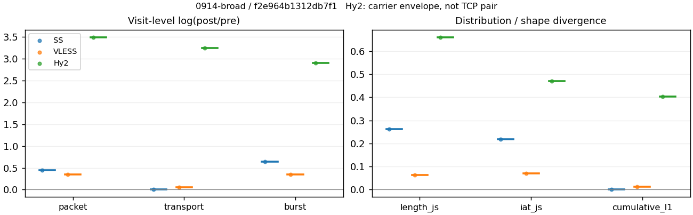
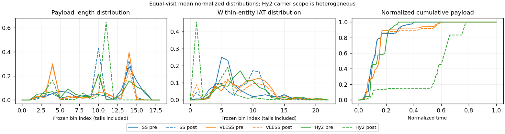

# 0914-broad · 条目 024 · google.com

目标：https://www.google.com/maps/

活动标签：google.com::page_load。选定访问 3 次。

[返回总索引](../../README.md) · [统计口径](../../methods.md)

## 覆盖与资格（每次访问均保留）

| 部署 | 重复 | 主请求路由 | 活动状态 | 代理比较 | DIRECT pre | 请求 proxy/direct/unresolved | 错误 |
| --- | --- | --- | --- | --- | --- | --- | --- |
| Hy2 | 1 | proxy | passed | 1 | 0 | 84/0/0 | [] |
| SS | 1 | proxy | passed | 1 | 0 | 97/0/0 | [] |
| VLESS | 1 | proxy | passed | 1 | 0 | 83/0/0 | [] |

主请求非 proxy 的统计仅解释为已索引的辅助代理连接或 DIRECT 观测，不代表目标业务经代理传输。播放确认与配对资格是两道不同的门。

图中散点为单次访问，短线为重复中位数；Hy2 是共享载体包络，不能与 TCP 配对作等范围因果对比。

形态图先逐访问归一化，再对访问等权平均；实线 pre，虚线 post。分箱序号及边界见 methods，不将分箱索引误解为长度或时间。

## 每次访问的关键观测

### SS

范围：`exclusive_page`。每格 pre → post；空值为不可观测/不适用。

| 重复 | 包数 | 载荷字节 | burst | TCP FR | IAT中位µs | length JS | IAT JS |
| --- | --- | --- | --- | --- | --- | --- | --- |
| 1 | 2856 → 4483 | 4.4659e+06 → 4.5189e+06 | 1737 → 3301 | 154 → 163 | 26.649 → 467.75 | 0.26301 | 0.21776 |

完整标量统计：中位数 [min,max]；Δ 为重复内逐访问变换的中位数，MAD 未缩放。n 为可用变换数；DIRECT-only 的 nΔ=0 不代表 pre 不可用。

| scope | 特征 | pre | post | Δ | IQRΔ | MADΔ | nΔ |
| --- | --- | --- | --- | --- | --- | --- | --- |
| exclusive_page | active_span_sum_s_1000ms | 19.439 [19.439, 19.439] | 20.797 [20.797, 20.797] | 0.067523 | — | — | 1 |
| exclusive_page | active_span_sum_s_100ms | 7.4473 [7.4473, 7.4473] | 11.691 [11.691, 11.691] | 0.45098 | — | — | 1 |
| exclusive_page | active_span_sum_s_500ms | 17.393 [17.393, 17.393] | 19.98 [19.98, 19.98] | 0.13867 | — | — | 1 |
| exclusive_page | burst_bytes_iqr | 3680 [3680, 3680] | 2856 [2856, 2856] | -0.25349 | — | — | 1 |
| exclusive_page | burst_bytes_mad | 39 [39, 39] | 40 [40, 40] | 0.025318 | — | — | 1 |
| exclusive_page | burst_bytes_max | 20480 [20480, 20480] | 18564 [18564, 18564] | -0.098225 | — | — | 1 |
| exclusive_page | burst_bytes_mean | 2571 [2571, 2571] | 1369 [1369, 1369] | -0.63025 | — | — | 1 |
| exclusive_page | burst_bytes_median | 39 [39, 39] | 40 [40, 40] | 0.025318 | — | — | 1 |
| exclusive_page | burst_bytes_min | 0 [0, 0] | 0 [0, 0] | — | — | — | 0 |
| exclusive_page | burst_bytes_p95 | 13056 [13056, 13056] | 5712 [5712, 5712] | -0.82668 | — | — | 1 |
| exclusive_page | burst_bytes_q25 | 0 [0, 0] | 0 [0, 0] | — | — | — | 0 |
| exclusive_page | burst_bytes_q75 | 3680 [3680, 3680] | 2856 [2856, 2856] | -0.25349 | — | — | 1 |
| exclusive_page | burst_bytes_std | 4668.8 [4668.8, 4668.8] | 1941.8 [1941.8, 1941.8] | -0.87727 | — | — | 1 |
| exclusive_page | burst_count | 1737 [1737, 1737] | 3301 [3301, 3301] | 0.64207 | — | — | 1 |
| exclusive_page | burst_duration_ms_iqr | 0.034515 [0.034515, 0.034515] | 0 [0, 0] | — | — | — | 0 |
| exclusive_page | burst_duration_ms_mad | 0 [0, 0] | 0 [0, 0] | — | — | — | 0 |
| exclusive_page | burst_duration_ms_max | 15000 [15000, 15000] | 15011 [15011, 15011] | 0.0006854 | — | — | 1 |
| exclusive_page | burst_duration_ms_mean | 23.118 [23.118, 23.118] | 9.882 [9.882, 9.882] | -0.8499 | — | — | 1 |
| exclusive_page | burst_duration_ms_median | 0 [0, 0] | 0 [0, 0] | — | — | — | 0 |
| exclusive_page | burst_duration_ms_min | 0 [0, 0] | 0 [0, 0] | — | — | — | 0 |
| exclusive_page | burst_duration_ms_p95 | 28.475 [28.475, 28.475] | 1.0064 [1.0064, 1.0064] | -3.3426 | — | — | 1 |
| exclusive_page | burst_duration_ms_q25 | 0 [0, 0] | 0 [0, 0] | — | — | — | 0 |
| exclusive_page | burst_duration_ms_q75 | 0.034515 [0.034515, 0.034515] | 0 [0, 0] | — | — | — | 0 |
| exclusive_page | burst_duration_ms_std | 380.18 [380.18, 380.18] | 272.51 [272.51, 272.51] | -0.33298 | — | — | 1 |
| exclusive_page | burst_packets_iqr | 1 [1, 1] | 0 [0, 0] | — | — | — | 0 |
| exclusive_page | burst_packets_mad | 0 [0, 0] | 0 [0, 0] | — | — | — | 0 |
| exclusive_page | burst_packets_max | 11 [11, 11] | 10 [10, 10] | -0.09531 | — | — | 1 |
| exclusive_page | burst_packets_mean | 1.6442 [1.6442, 1.6442] | 1.3581 [1.3581, 1.3581] | -0.1912 | — | — | 1 |
| exclusive_page | burst_packets_median | 1 [1, 1] | 1 [1, 1] | 0 | — | — | 1 |
| exclusive_page | burst_packets_min | 1 [1, 1] | 1 [1, 1] | 0 | — | — | 1 |
| exclusive_page | burst_packets_p95 | 4 [4, 4] | 3 [3, 3] | -0.28768 | — | — | 1 |
| exclusive_page | burst_packets_q25 | 1 [1, 1] | 1 [1, 1] | 0 | — | — | 1 |
| exclusive_page | burst_packets_q75 | 2 [2, 2] | 1 [1, 1] | -0.69315 | — | — | 1 |
| exclusive_page | burst_packets_std | 1.3277 [1.3277, 1.3277] | 0.80191 [0.80191, 0.80191] | -0.50423 | — | — | 1 |
| exclusive_page | connection_span_concurrency_max | 9 [9, 9] | 9 [9, 9] | 0 | — | — | 1 |
| exclusive_page | cumulative_l1 | — | — | 0.001817 | — | — | 1 |
| exclusive_page | cumulative_max | — | — | 0.032794 | — | — | 1 |
| exclusive_page | direction_entropy | 0.5554 [0.5554, 0.5554] | 0.41125 [0.41125, 0.41125] | -0.14415 | — | — | 1 |
| exclusive_page | down_burst_count | 862 [862, 862] | 1644 [1644, 1644] | 0.64563 | — | — | 1 |
| exclusive_page | down_ip_bytes | 4.4697e+06 [4.4697e+06, 4.4697e+06] | 4.5485e+06 [4.5485e+06, 4.5485e+06] | 0.01747 | — | — | 1 |
| exclusive_page | down_packets | 1849 [1849, 1849] | 2567 [2567, 2567] | 0.32809 | — | — | 1 |
| exclusive_page | down_transport_bytes | 4.3735e+06 [4.3735e+06, 4.3735e+06] | 4.4149e+06 [4.4149e+06, 4.4149e+06] | 0.0094175 | — | — | 1 |
| exclusive_page | duration_s | 23.589 [23.589, 23.589] | 23.588 [23.588, 23.588] | -3.9918e-05 | — | — | 1 |
| exclusive_page | entity_count | 13 [13, 13] | 13 [13, 13] | 0 | — | — | 1 |
| exclusive_page | fr_runs | 154 [154, 154] | 163 [163, 163] | 0.056798 | — | — | 1 |
| exclusive_page | fr_runs_per_packet | 0.083288 [0.083288, 0.083288] | 0.06291 [0.06291, 0.06291] | -0.020378 | — | — | 1 |
| exclusive_page | fr_switches | 141 [141, 141] | 150 [150, 150] | 0.061875 | — | — | 1 |
| exclusive_page | fr_switches_per_possible_transition | 0.076797 [0.076797, 0.076797] | 0.058185 [0.058185, 0.058185] | -0.018613 | — | — | 1 |
| exclusive_page | full_retransmission_fraction | 0.0017507 [0.0017507, 0.0017507] | 0.0024537 [0.0024537, 0.0024537] | 0.00070301 | — | — | 1 |
| exclusive_page | full_retransmission_packets | 5 [5, 5] | 11 [11, 11] | 0.78846 | — | — | 1 |
| exclusive_page | iat_count | 2843 [2843, 2843] | 4470 [4470, 4470] | 0.45253 | — | — | 1 |
| exclusive_page | iat_js | — | — | 0.21776 | — | — | 1 |
| exclusive_page | iat_ks | — | — | 0.40625 | — | — | 1 |
| exclusive_page | iat_median_us | 26.649 [26.649, 26.649] | 467.75 [467.75, 467.75] | 2.8652 | — | — | 1 |
| exclusive_page | iat_us_iqr | 109.05 [109.05, 109.05] | 1030.3 [1030.3, 1030.3] | 2.2457 | — | — | 1 |
| exclusive_page | iat_us_mad | 18.664 [18.664, 18.664] | 457.47 [457.47, 457.47] | 3.1991 | — | — | 1 |
| exclusive_page | iat_us_max | 1.5001e+07 [1.5001e+07, 1.5001e+07] | 1.5011e+07 [1.5011e+07, 1.5011e+07] | 0.00067163 | — | — | 1 |
| exclusive_page | iat_us_mean | 55875 [55875, 55875] | 35535 [35535, 35535] | -0.4526 | — | — | 1 |
| exclusive_page | iat_us_median | 26.649 [26.649, 26.649] | 467.75 [467.75, 467.75] | 2.8652 | — | — | 1 |
| exclusive_page | iat_us_min | 0.082 [0.082, 0.082] | 0.035 [0.035, 0.035] | -0.85137 | — | — | 1 |
| exclusive_page | iat_us_p95 | 34703 [34703, 34703] | 22380 [22380, 22380] | -0.43865 | — | — | 1 |
| exclusive_page | iat_us_q25 | 13.322 [13.322, 13.322] | 19.638 [19.638, 19.638] | 0.38806 | — | — | 1 |
| exclusive_page | iat_us_q75 | 122.38 [122.38, 122.38] | 1049.9 [1049.9, 1049.9] | 2.1493 | — | — | 1 |
| exclusive_page | iat_us_std | 7.6696e+05 [7.6696e+05, 7.6696e+05] | 6.0871e+05 [6.0871e+05, 6.0871e+05] | -0.2311 | — | — | 1 |
| exclusive_page | iat_wasserstein_log1p_us | — | — | 1.4575 | — | — | 1 |
| exclusive_page | idle_gap_count_1000ms | 18 [18, 18] | 19 [19, 19] | 0.054067 | — | — | 1 |
| exclusive_page | idle_gap_count_100ms | 64 [64, 64] | 59 [59, 59] | -0.081346 | — | — | 1 |
| exclusive_page | idle_gap_count_500ms | 21 [21, 21] | 20 [20, 20] | -0.04879 | — | — | 1 |
| exclusive_page | idle_gap_sum_s_1000ms | 139.41 [139.41, 139.41] | 138.04 [138.04, 138.04] | -0.0098692 | — | — | 1 |
| exclusive_page | idle_gap_sum_s_100ms | 151.41 [151.41, 151.41] | 147.15 [147.15, 147.15] | -0.028507 | — | — | 1 |
| exclusive_page | idle_gap_sum_s_500ms | 141.46 [141.46, 141.46] | 138.86 [138.86, 138.86] | -0.018538 | — | — | 1 |
| exclusive_page | ip_bytes | 4.6147e+06 [4.6147e+06, 4.6147e+06] | 4.7906e+06 [4.7906e+06, 4.7906e+06] | 0.037413 | — | — | 1 |
| exclusive_page | length_iqr | 2304 [2304, 2304] | 1428 [1428, 1428] | -0.47837 | — | — | 1 |
| exclusive_page | length_js | — | — | 0.26301 | — | — | 1 |
| exclusive_page | length_ks | — | — | 0.35017 | — | — | 1 |
| exclusive_page | length_mad | 1174 [1174, 1174] | 791 [791, 791] | -0.39487 | — | — | 1 |
| exclusive_page | length_max | 8920 [8920, 8920] | 7140 [7140, 7140] | -0.22258 | — | — | 1 |
| exclusive_page | length_mean | 2415.3 [2415.3, 2415.3] | 1744.1 [1744.1, 1744.1] | -0.32559 | — | — | 1 |
| exclusive_page | length_median | 1920 [1920, 1920] | 1428 [1428, 1428] | -0.29605 | — | — | 1 |
| exclusive_page | length_min | 10 [10, 10] | 6 [6, 6] | -0.51083 | — | — | 1 |
| exclusive_page | length_p95 | 8192 [8192, 8192] | 2856 [2856, 2856] | -1.0537 | — | — | 1 |
| exclusive_page | length_q25 | 592 [592, 592] | 1428 [1428, 1428] | 0.88052 | — | — | 1 |
| exclusive_page | length_q75 | 2896 [2896, 2896] | 2856 [2856, 2856] | -0.013908 | — | — | 1 |
| exclusive_page | length_std | 2172.4 [2172.4, 2172.4] | 1016.1 [1016.1, 1016.1] | -0.75988 | — | — | 1 |
| exclusive_page | length_wasserstein_bytes | — | — | 937.28 | — | — | 1 |
| exclusive_page | nonempty_entity_count | 13 [13, 13] | 13 [13, 13] | 0 | — | — | 1 |
| exclusive_page | nonempty_packets | 1849 [1849, 1849] | 2591 [2591, 2591] | 0.3374 | — | — | 1 |
| exclusive_page | offload_suspect_fraction | 0.3743 [0.3743, 0.3743] | 0.21347 [0.21347, 0.21347] | -0.16083 | — | — | 1 |
| exclusive_page | packet_count | 2856 [2856, 2856] | 4483 [4483, 4483] | 0.45087 | — | — | 1 |
| exclusive_page | rtt_median_ms | 0.061797 [0.061797, 0.061797] | 29.16 [29.16, 29.16] | 6.1567 | — | — | 1 |
| exclusive_page | rtt_sample_count | 979 [979, 979] | 625 [625, 625] | -0.44878 | — | — | 1 |
| exclusive_page | tcp_ack_count | 2843 [2843, 2843] | 4466 [4466, 4466] | 0.45163 | — | — | 1 |
| exclusive_page | tcp_fin_count | 26 [26, 26] | 26 [26, 26] | 0 | — | — | 1 |
| exclusive_page | tcp_packet_count | 2856 [2856, 2856] | 4483 [4483, 4483] | 0.45087 | — | — | 1 |
| exclusive_page | tcp_rst_count | 0 [0, 0] | 0 [0, 0] | — | — | — | 0 |
| exclusive_page | tcp_syn_count | 26 [26, 26] | 31 [31, 31] | 0.17589 | — | — | 1 |
| exclusive_page | tcp_window_raw_median | 65535 [65535, 65535] | 165 [165, 165] | -5.9844 | — | — | 1 |
| exclusive_page | transition_entropy | 0.33444 [0.33444, 0.33444] | 0.25837 [0.25837, 0.25837] | -0.076069 | — | — | 1 |
| exclusive_page | transition_n_mm | 1537 [1537, 1537] | 2300 [2300, 2300] | 0.40308 | — | — | 1 |
| exclusive_page | transition_n_mp | 68 [68, 68] | 73 [73, 73] | 0.070952 | — | — | 1 |
| exclusive_page | transition_n_pm | 73 [73, 73] | 77 [77, 77] | 0.053346 | — | — | 1 |
| exclusive_page | transition_n_pp | 158 [158, 158] | 128 [128, 128] | -0.21056 | — | — | 1 |
| exclusive_page | transition_p_mm | 0.95763 [0.95763, 0.95763] | 0.96924 [0.96924, 0.96924] | 0.011605 | — | — | 1 |
| exclusive_page | transition_p_mp | 0.042368 [0.042368, 0.042368] | 0.030763 [0.030763, 0.030763] | -0.011605 | — | — | 1 |
| exclusive_page | transition_p_pm | 0.31602 [0.31602, 0.31602] | 0.37561 [0.37561, 0.37561] | 0.059592 | — | — | 1 |
| exclusive_page | transition_p_pp | 0.68398 [0.68398, 0.68398] | 0.62439 [0.62439, 0.62439] | -0.059592 | — | — | 1 |
| exclusive_page | transport_bytes | 4.4659e+06 [4.4659e+06, 4.4659e+06] | 4.5189e+06 [4.5189e+06, 4.5189e+06] | 0.011812 | — | — | 1 |
| exclusive_page | up_burst_count | 875 [875, 875] | 1657 [1657, 1657] | 0.63854 | — | — | 1 |
| exclusive_page | up_byte_fraction | 0.02069 [0.02069, 0.02069] | 0.023033 [0.023033, 0.023033] | 0.0023426 | — | — | 1 |
| exclusive_page | up_ip_bytes | 1.4493e+05 [1.4493e+05, 1.4493e+05] | 2.4207e+05 [2.4207e+05, 2.4207e+05] | 0.513 | — | — | 1 |
| exclusive_page | up_packets | 1007 [1007, 1007] | 1916 [1916, 1916] | 0.64326 | — | — | 1 |
| exclusive_page | up_transport_bytes | 92401 [92401, 92401] | 1.0408e+05 [1.0408e+05, 1.0408e+05] | 0.11907 | — | — | 1 |
| exclusive_page | zero_iat_count | 0 [0, 0] | 0 [0, 0] | — | — | — | 0 |
| exclusive_page | zero_iat_fraction | 0 [0, 0] | 0 [0, 0] | 0 | — | — | 1 |

### VLESS

范围：`exclusive_page`。每格 pre → post；空值为不可观测/不适用。

| 重复 | 包数 | 载荷字节 | burst | TCP FR | IAT中位µs | length JS | IAT JS |
| --- | --- | --- | --- | --- | --- | --- | --- |
| 1 | 1790 → 2530 | 1.6197e+06 → 1.719e+06 | 1207 → 1715 | 108 → 134 | 424.01 → 119.03 | 0.063374 | 0.071144 |

完整标量统计：中位数 [min,max]；Δ 为重复内逐访问变换的中位数，MAD 未缩放。n 为可用变换数；DIRECT-only 的 nΔ=0 不代表 pre 不可用。

| scope | 特征 | pre | post | Δ | IQRΔ | MADΔ | nΔ |
| --- | --- | --- | --- | --- | --- | --- | --- |
| exclusive_page | active_span_sum_s_1000ms | 17.022 [17.022, 17.022] | 17.267 [17.267, 17.267] | 0.014277 | — | — | 1 |
| exclusive_page | active_span_sum_s_100ms | 2.9417 [2.9417, 2.9417] | 7.04 [7.04, 7.04] | 0.87262 | — | — | 1 |
| exclusive_page | active_span_sum_s_500ms | 8.2608 [8.2608, 8.2608] | 16.679 [16.679, 16.679] | 0.70263 | — | — | 1 |
| exclusive_page | burst_bytes_iqr | 2896 [2896, 2896] | 2824 [2824, 2824] | -0.025176 | — | — | 1 |
| exclusive_page | burst_bytes_mad | 31 [31, 31] | 53 [53, 53] | 0.5363 | — | — | 1 |
| exclusive_page | burst_bytes_max | 14480 [14480, 14480] | 5792 [5792, 5792] | -0.91629 | — | — | 1 |
| exclusive_page | burst_bytes_mean | 1341.9 [1341.9, 1341.9] | 1002.3 [1002.3, 1002.3] | -0.29181 | — | — | 1 |
| exclusive_page | burst_bytes_median | 31 [31, 31] | 53 [53, 53] | 0.5363 | — | — | 1 |
| exclusive_page | burst_bytes_min | 0 [0, 0] | 0 [0, 0] | — | — | — | 0 |
| exclusive_page | burst_bytes_p95 | 5720 [5720, 5720] | 2896 [2896, 2896] | -0.68064 | — | — | 1 |
| exclusive_page | burst_bytes_q25 | 0 [0, 0] | 0 [0, 0] | — | — | — | 0 |
| exclusive_page | burst_bytes_q75 | 2896 [2896, 2896] | 2824 [2824, 2824] | -0.025176 | — | — | 1 |
| exclusive_page | burst_bytes_std | 1879.3 [1879.3, 1879.3] | 1274.4 [1274.4, 1274.4] | -0.38841 | — | — | 1 |
| exclusive_page | burst_count | 1207 [1207, 1207] | 1715 [1715, 1715] | 0.35128 | — | — | 1 |
| exclusive_page | burst_duration_ms_iqr | 0.98798 [0.98798, 0.98798] | 0.0057825 [0.0057825, 0.0057825] | -5.1408 | — | — | 1 |
| exclusive_page | burst_duration_ms_mad | 0 [0, 0] | 0 [0, 0] | — | — | — | 0 |
| exclusive_page | burst_duration_ms_max | 15001 [15001, 15001] | 13237 [13237, 13237] | -0.12512 | — | — | 1 |
| exclusive_page | burst_duration_ms_mean | 63.454 [63.454, 63.454] | 21.734 [21.734, 21.734] | -1.0714 | — | — | 1 |
| exclusive_page | burst_duration_ms_median | 0 [0, 0] | 0 [0, 0] | — | — | — | 0 |
| exclusive_page | burst_duration_ms_min | 0 [0, 0] | 0 [0, 0] | — | — | — | 0 |
| exclusive_page | burst_duration_ms_p95 | 10.301 [10.301, 10.301] | 9.5026 [9.5026, 9.5026] | -0.080714 | — | — | 1 |
| exclusive_page | burst_duration_ms_q25 | 0 [0, 0] | 0 [0, 0] | — | — | — | 0 |
| exclusive_page | burst_duration_ms_q75 | 0.98798 [0.98798, 0.98798] | 0.0057825 [0.0057825, 0.0057825] | -5.1408 | — | — | 1 |
| exclusive_page | burst_duration_ms_std | 792.98 [792.98, 792.98] | 411.63 [411.63, 411.63] | -0.65569 | — | — | 1 |
| exclusive_page | burst_packets_iqr | 1 [1, 1] | 1 [1, 1] | 0 | — | — | 1 |
| exclusive_page | burst_packets_mad | 0 [0, 0] | 0 [0, 0] | — | — | — | 0 |
| exclusive_page | burst_packets_max | 5 [5, 5] | 9 [9, 9] | 0.58779 | — | — | 1 |
| exclusive_page | burst_packets_mean | 1.483 [1.483, 1.483] | 1.4752 [1.4752, 1.4752] | -0.0052715 | — | — | 1 |
| exclusive_page | burst_packets_median | 1 [1, 1] | 1 [1, 1] | 0 | — | — | 1 |
| exclusive_page | burst_packets_min | 1 [1, 1] | 1 [1, 1] | 0 | — | — | 1 |
| exclusive_page | burst_packets_p95 | 2 [2, 2] | 3 [3, 3] | 0.40547 | — | — | 1 |
| exclusive_page | burst_packets_q25 | 1 [1, 1] | 1 [1, 1] | 0 | — | — | 1 |
| exclusive_page | burst_packets_q75 | 2 [2, 2] | 2 [2, 2] | 0 | — | — | 1 |
| exclusive_page | burst_packets_std | 0.60061 [0.60061, 0.60061] | 0.88647 [0.88647, 0.88647] | 0.3893 | — | — | 1 |
| exclusive_page | connection_span_concurrency_max | 9 [9, 9] | 9 [9, 9] | 0 | — | — | 1 |
| exclusive_page | cumulative_l1 | — | — | 0.011774 | — | — | 1 |
| exclusive_page | cumulative_max | — | — | 0.035912 | — | — | 1 |
| exclusive_page | direction_entropy | 0.52037 [0.52037, 0.52037] | 0.4526 [0.4526, 0.4526] | -0.067766 | — | — | 1 |
| exclusive_page | down_burst_count | 597 [597, 597] | 851 [851, 851] | 0.3545 | — | — | 1 |
| exclusive_page | down_ip_bytes | 1.626e+06 [1.626e+06, 1.626e+06] | 1.7147e+06 [1.7147e+06, 1.7147e+06] | 0.053118 | — | — | 1 |
| exclusive_page | down_packets | 1117 [1117, 1117] | 1428 [1428, 1428] | 0.24563 | — | — | 1 |
| exclusive_page | down_transport_bytes | 1.5678e+06 [1.5678e+06, 1.5678e+06] | 1.6403e+06 [1.6403e+06, 1.6403e+06] | 0.045218 | — | — | 1 |
| exclusive_page | duration_s | 24.542 [24.542, 24.542] | 24.501 [24.501, 24.501] | -0.0016595 | — | — | 1 |
| exclusive_page | entity_count | 13 [13, 13] | 13 [13, 13] | 0 | — | — | 1 |
| exclusive_page | fr_runs | 108 [108, 108] | 134 [134, 134] | 0.21571 | — | — | 1 |
| exclusive_page | fr_runs_per_packet | 0.09863 [0.09863, 0.09863] | 0.096334 [0.096334, 0.096334] | -0.0022966 | — | — | 1 |
| exclusive_page | fr_switches | 95 [95, 95] | 121 [121, 121] | 0.24191 | — | — | 1 |
| exclusive_page | fr_switches_per_possible_transition | 0.0878 [0.0878, 0.0878] | 0.087808 [0.087808, 0.087808] | 8.0483e-06 | — | — | 1 |
| exclusive_page | full_retransmission_fraction | 0 [0, 0] | 0 [0, 0] | 0 | — | — | 1 |
| exclusive_page | full_retransmission_packets | 0 [0, 0] | 0 [0, 0] | — | — | — | 0 |
| exclusive_page | iat_count | 1777 [1777, 1777] | 2517 [2517, 2517] | 0.34814 | — | — | 1 |
| exclusive_page | iat_js | — | — | 0.071144 | — | — | 1 |
| exclusive_page | iat_ks | — | — | 0.16223 | — | — | 1 |
| exclusive_page | iat_median_us | 424.01 [424.01, 424.01] | 119.03 [119.03, 119.03] | -1.2704 | — | — | 1 |
| exclusive_page | iat_us_iqr | 1665.8 [1665.8, 1665.8] | 1377.3 [1377.3, 1377.3] | -0.19013 | — | — | 1 |
| exclusive_page | iat_us_mad | 410.77 [410.77, 410.77] | 118.93 [118.93, 118.93] | -1.2395 | — | — | 1 |
| exclusive_page | iat_us_max | 1.5001e+07 [1.5001e+07, 1.5001e+07] | 1.5007e+07 [1.5007e+07, 1.5007e+07] | 0.00042606 | — | — | 1 |
| exclusive_page | iat_us_mean | 72779 [72779, 72779] | 51263 [51263, 51263] | -0.35045 | — | — | 1 |
| exclusive_page | iat_us_median | 424.01 [424.01, 424.01] | 119.03 [119.03, 119.03] | -1.2704 | — | — | 1 |
| exclusive_page | iat_us_min | 0.198 [0.198, 0.198] | 0.035 [0.035, 0.035] | -1.7329 | — | — | 1 |
| exclusive_page | iat_us_p95 | 9750.2 [9750.2, 9750.2] | 40505 [40505, 40505] | 1.4241 | — | — | 1 |
| exclusive_page | iat_us_q25 | 47.592 [47.592, 47.592] | 15.369 [15.369, 15.369] | -1.1303 | — | — | 1 |
| exclusive_page | iat_us_q75 | 1713.4 [1713.4, 1713.4] | 1392.7 [1392.7, 1392.7] | -0.2072 | — | — | 1 |
| exclusive_page | iat_us_std | 8.3868e+05 [8.3868e+05, 8.3868e+05] | 7.0257e+05 [7.0257e+05, 7.0257e+05] | -0.17709 | — | — | 1 |
| exclusive_page | iat_wasserstein_log1p_us | — | — | 0.84794 | — | — | 1 |
| exclusive_page | idle_gap_count_1000ms | 13 [13, 13] | 13 [13, 13] | 0 | — | — | 1 |
| exclusive_page | idle_gap_count_100ms | 54 [54, 54] | 67 [67, 67] | 0.21571 | — | — | 1 |
| exclusive_page | idle_gap_count_500ms | 27 [27, 27] | 14 [14, 14] | -0.65678 | — | — | 1 |
| exclusive_page | idle_gap_sum_s_1000ms | 112.31 [112.31, 112.31] | 111.76 [111.76, 111.76] | -0.0048497 | — | — | 1 |
| exclusive_page | idle_gap_sum_s_100ms | 126.39 [126.39, 126.39] | 121.99 [121.99, 121.99] | -0.035408 | — | — | 1 |
| exclusive_page | idle_gap_sum_s_500ms | 121.07 [121.07, 121.07] | 112.35 [112.35, 112.35] | -0.074723 | — | — | 1 |
| exclusive_page | ip_bytes | 1.7127e+06 [1.7127e+06, 1.7127e+06] | 1.8528e+06 [1.8528e+06, 1.8528e+06] | 0.078624 | — | — | 1 |
| exclusive_page | length_iqr | 2752 [2752, 2752] | 1864 [1864, 1864] | -0.3896 | — | — | 1 |
| exclusive_page | length_js | — | — | 0.063374 | — | — | 1 |
| exclusive_page | length_ks | — | — | 0.16754 | — | — | 1 |
| exclusive_page | length_mad | 1340 [1340, 1340] | 1340 [1340, 1340] | 0 | — | — | 1 |
| exclusive_page | length_max | 8920 [8920, 8920] | 2896 [2896, 2896] | -1.125 | — | — | 1 |
| exclusive_page | length_mean | 1479.2 [1479.2, 1479.2] | 1235.8 [1235.8, 1235.8] | -0.1798 | — | — | 1 |
| exclusive_page | length_median | 1412 [1412, 1412] | 1412 [1412, 1412] | 0 | — | — | 1 |
| exclusive_page | length_min | 24 [24, 24] | 23 [23, 23] | -0.04256 | — | — | 1 |
| exclusive_page | length_p95 | 2896 [2896, 2896] | 2824 [2824, 2824] | -0.025176 | — | — | 1 |
| exclusive_page | length_q25 | 72 [72, 72] | 72 [72, 72] | 0 | — | — | 1 |
| exclusive_page | length_q75 | 2824 [2824, 2824] | 1936 [1936, 1936] | -0.37753 | — | — | 1 |
| exclusive_page | length_std | 1280 [1280, 1280] | 1074.1 [1074.1, 1074.1] | -0.1754 | — | — | 1 |
| exclusive_page | length_wasserstein_bytes | — | — | 255.22 | — | — | 1 |
| exclusive_page | nonempty_entity_count | 13 [13, 13] | 13 [13, 13] | 0 | — | — | 1 |
| exclusive_page | nonempty_packets | 1095 [1095, 1095] | 1391 [1391, 1391] | 0.23927 | — | — | 1 |
| exclusive_page | offload_suspect_fraction | 0.27039 [0.27039, 0.27039] | 0.15652 [0.15652, 0.15652] | -0.11387 | — | — | 1 |
| exclusive_page | packet_count | 1790 [1790, 1790] | 2530 [2530, 2530] | 0.346 | — | — | 1 |
| exclusive_page | rtt_median_ms | 0.66785 [0.66785, 0.66785] | 0.093924 [0.093924, 0.093924] | -1.9616 | — | — | 1 |
| exclusive_page | rtt_sample_count | 648 [648, 648] | 1024 [1024, 1024] | 0.45758 | — | — | 1 |
| exclusive_page | tcp_ack_count | 1752 [1752, 1752] | 2517 [2517, 2517] | 0.36231 | — | — | 1 |
| exclusive_page | tcp_fin_count | 25 [25, 25] | 26 [26, 26] | 0.039221 | — | — | 1 |
| exclusive_page | tcp_packet_count | 1790 [1790, 1790] | 2530 [2530, 2530] | 0.346 | — | — | 1 |
| exclusive_page | tcp_rst_count | 25 [25, 25] | 0 [0, 0] | — | — | — | 0 |
| exclusive_page | tcp_syn_count | 26 [26, 26] | 26 [26, 26] | 0 | — | — | 1 |
| exclusive_page | tcp_window_raw_median | 65535 [65535, 65535] | 151 [151, 151] | -6.0731 | — | — | 1 |
| exclusive_page | transition_entropy | 0.34173 [0.34173, 0.34173] | 0.32851 [0.32851, 0.32851] | -0.013213 | — | — | 1 |
| exclusive_page | transition_n_mm | 913 [913, 913] | 1192 [1192, 1192] | 0.26665 | — | — | 1 |
| exclusive_page | transition_n_mp | 41 [41, 41] | 54 [54, 54] | 0.27541 | — | — | 1 |
| exclusive_page | transition_n_pm | 54 [54, 54] | 67 [67, 67] | 0.21571 | — | — | 1 |
| exclusive_page | transition_n_pp | 74 [74, 74] | 65 [65, 65] | -0.12968 | — | — | 1 |
| exclusive_page | transition_p_mm | 0.95702 [0.95702, 0.95702] | 0.95666 [0.95666, 0.95666] | -0.00036174 | — | — | 1 |
| exclusive_page | transition_p_mp | 0.042977 [0.042977, 0.042977] | 0.043339 [0.043339, 0.043339] | 0.00036174 | — | — | 1 |
| exclusive_page | transition_p_pm | 0.42188 [0.42188, 0.42188] | 0.50758 [0.50758, 0.50758] | 0.085701 | — | — | 1 |
| exclusive_page | transition_p_pp | 0.57812 [0.57812, 0.57812] | 0.49242 [0.49242, 0.49242] | -0.085701 | — | — | 1 |
| exclusive_page | transport_bytes | 1.6197e+06 [1.6197e+06, 1.6197e+06] | 1.719e+06 [1.719e+06, 1.719e+06] | 0.059466 | — | — | 1 |
| exclusive_page | up_burst_count | 610 [610, 610] | 864 [864, 864] | 0.34811 | — | — | 1 |
| exclusive_page | up_byte_fraction | 0.032056 [0.032056, 0.032056] | 0.045749 [0.045749, 0.045749] | 0.013694 | — | — | 1 |
| exclusive_page | up_ip_bytes | 86722 [86722, 86722] | 1.3811e+05 [1.3811e+05, 1.3811e+05] | 0.46537 | — | — | 1 |
| exclusive_page | up_packets | 673 [673, 673] | 1102 [1102, 1102] | 0.49314 | — | — | 1 |
| exclusive_page | up_transport_bytes | 51922 [51922, 51922] | 78642 [78642, 78642] | 0.41516 | — | — | 1 |
| exclusive_page | zero_iat_count | 0 [0, 0] | 0 [0, 0] | — | — | — | 0 |
| exclusive_page | zero_iat_fraction | 0 [0, 0] | 0 [0, 0] | 0 | — | — | 1 |

### Hy2

范围：`carrier_context_envelope`。每格 pre → post；空值为不可观测/不适用。

| 重复 | 包数 | 载荷字节 | burst | TCP FR | IAT中位µs | length JS | IAT JS |
| --- | --- | --- | --- | --- | --- | --- | --- |
| 1 | 1525 → 49738 | 2.0413e+06 → 5.2621e+07 | 998 → 18092 | — | 153.48 → 4.377 | 0.65931 | 0.46944 |

完整标量统计：中位数 [min,max]；Δ 为重复内逐访问变换的中位数，MAD 未缩放。n 为可用变换数；DIRECT-only 的 nΔ=0 不代表 pre 不可用。

| scope | 特征 | pre | post | Δ | IQRΔ | MADΔ | nΔ |
| --- | --- | --- | --- | --- | --- | --- | --- |
| carrier_context_envelope | active_span_sum_s_1000ms | 14.626 [14.626, 14.626] | 15.749 [15.749, 15.749] | 0.073981 | — | — | 1 |
| carrier_context_envelope | active_span_sum_s_100ms | 2.3284 [2.3284, 2.3284] | 8.6093 [8.6093, 8.6093] | 1.3077 | — | — | 1 |
| carrier_context_envelope | active_span_sum_s_500ms | 12.47 [12.47, 12.47] | 14.065 [14.065, 14.065] | 0.1204 | — | — | 1 |
| carrier_context_envelope | burst_bytes_iqr | 1797 [1797, 1797] | 2784 [2784, 2784] | 0.43777 | — | — | 1 |
| carrier_context_envelope | burst_bytes_mad | 39 [39, 39] | 354.5 [354.5, 354.5] | 2.2071 | — | — | 1 |
| carrier_context_envelope | burst_bytes_max | 27914 [27914, 27914] | 2.095e+05 [2.095e+05, 2.095e+05] | 2.0156 | — | — | 1 |
| carrier_context_envelope | burst_bytes_mean | 2045.4 [2045.4, 2045.4] | 2908.5 [2908.5, 2908.5] | 0.35204 | — | — | 1 |
| carrier_context_envelope | burst_bytes_median | 39 [39, 39] | 387.5 [387.5, 387.5] | 2.2962 | — | — | 1 |
| carrier_context_envelope | burst_bytes_min | 0 [0, 0] | 22 [22, 22] | — | — | — | 0 |
| carrier_context_envelope | burst_bytes_p95 | 12386 [12386, 12386] | 10087 [10087, 10087] | -0.2053 | — | — | 1 |
| carrier_context_envelope | burst_bytes_q25 | 0 [0, 0] | 98 [98, 98] | — | — | — | 0 |
| carrier_context_envelope | burst_bytes_q75 | 1797 [1797, 1797] | 2882 [2882, 2882] | 0.47237 | — | — | 1 |
| carrier_context_envelope | burst_bytes_std | 4472 [4472, 4472] | 5978.2 [5978.2, 5978.2] | 0.29027 | — | — | 1 |
| carrier_context_envelope | burst_count | 998 [998, 998] | 18092 [18092, 18092] | 2.8975 | — | — | 1 |
| carrier_context_envelope | burst_duration_ms_iqr | 0.13462 [0.13462, 0.13462] | 0.023233 [0.023233, 0.023233] | -1.7569 | — | — | 1 |
| carrier_context_envelope | burst_duration_ms_mad | 0 [0, 0] | 4.3e-05 [4.3e-05, 4.3e-05] | — | — | — | 0 |
| carrier_context_envelope | burst_duration_ms_max | 15001 [15001, 15001] | 221.46 [221.46, 221.46] | -4.2157 | — | — | 1 |
| carrier_context_envelope | burst_duration_ms_mean | 140.78 [140.78, 140.78] | 0.27535 [0.27535, 0.27535] | -6.237 | — | — | 1 |
| carrier_context_envelope | burst_duration_ms_median | 0 [0, 0] | 4.3e-05 [4.3e-05, 4.3e-05] | — | — | — | 0 |
| carrier_context_envelope | burst_duration_ms_min | 0 [0, 0] | 0 [0, 0] | — | — | — | 0 |
| carrier_context_envelope | burst_duration_ms_p95 | 194.44 [194.44, 194.44] | 0.085304 [0.085304, 0.085304] | -7.7317 | — | — | 1 |
| carrier_context_envelope | burst_duration_ms_q25 | 0 [0, 0] | 0 [0, 0] | — | — | — | 0 |
| carrier_context_envelope | burst_duration_ms_q75 | 0.13462 [0.13462, 0.13462] | 0.023233 [0.023233, 0.023233] | -1.7569 | — | — | 1 |
| carrier_context_envelope | burst_duration_ms_std | 1275.3 [1275.3, 1275.3] | 4.7694 [4.7694, 4.7694] | -5.5887 | — | — | 1 |
| carrier_context_envelope | burst_packets_iqr | 1 [1, 1] | 2 [2, 2] | 0.69315 | — | — | 1 |
| carrier_context_envelope | burst_packets_mad | 0 [0, 0] | 1 [1, 1] | — | — | — | 0 |
| carrier_context_envelope | burst_packets_max | 14 [14, 14] | 152 [152, 152] | 2.3848 | — | — | 1 |
| carrier_context_envelope | burst_packets_mean | 1.5281 [1.5281, 1.5281] | 2.7492 [2.7492, 2.7492] | 0.5873 | — | — | 1 |
| carrier_context_envelope | burst_packets_median | 1 [1, 1] | 2 [2, 2] | 0.69315 | — | — | 1 |
| carrier_context_envelope | burst_packets_min | 1 [1, 1] | 1 [1, 1] | 0 | — | — | 1 |
| carrier_context_envelope | burst_packets_p95 | 3 [3, 3] | 8 [8, 8] | 0.98083 | — | — | 1 |
| carrier_context_envelope | burst_packets_q25 | 1 [1, 1] | 1 [1, 1] | 0 | — | — | 1 |
| carrier_context_envelope | burst_packets_q75 | 2 [2, 2] | 3 [3, 3] | 0.40547 | — | — | 1 |
| carrier_context_envelope | burst_packets_std | 1.0923 [1.0923, 1.0923] | 4.126 [4.126, 4.126] | 1.329 | — | — | 1 |
| carrier_context_envelope | connection_span_concurrency_max | 10 [10, 10] | 1 [1, 1] | -2.3026 | — | — | 1 |
| carrier_context_envelope | cumulative_l1 | — | — | 0.40258 | — | — | 1 |
| carrier_context_envelope | cumulative_max | — | — | 0.84943 | — | — | 1 |
| carrier_context_envelope | direction_entropy | 0.76037 [0.76037, 0.76037] | 0.79597 [0.79597, 0.79597] | 0.0356 | — | — | 1 |
| carrier_context_envelope | direction_run_analog_runs | 148 [148, 148] | 18092 [18092, 18092] | 4.806 | — | — | 1 |
| carrier_context_envelope | direction_run_analog_runs_per_packet | 0.16536 [0.16536, 0.16536] | 0.36375 [0.36375, 0.36375] | 0.19838 | — | — | 1 |
| carrier_context_envelope | direction_run_analog_switches | 134 [134, 134] | 18091 [18091, 18091] | 4.9053 | — | — | 1 |
| carrier_context_envelope | direction_run_analog_switches_per_possible_transition | 0.1521 [0.1521, 0.1521] | 0.36373 [0.36373, 0.36373] | 0.21163 | — | — | 1 |
| carrier_context_envelope | down_burst_count | 492 [492, 492] | 9046 [9046, 9046] | 2.9116 | — | — | 1 |
| carrier_context_envelope | down_ip_bytes | 2.0118e+06 [2.0118e+06, 2.0118e+06] | 5.2597e+07 [5.2597e+07, 5.2597e+07] | 3.2637 | — | — | 1 |
| carrier_context_envelope | down_packets | 924 [924, 924] | 37773 [37773, 37773] | 3.7106 | — | — | 1 |
| carrier_context_envelope | down_transport_bytes | 1.9636e+06 [1.9636e+06, 1.9636e+06] | 5.154e+07 [5.154e+07, 5.154e+07] | 3.2676 | — | — | 1 |
| carrier_context_envelope | duration_s | 22.994 [22.994, 22.994] | 22.992 [22.992, 22.992] | -8.4524e-05 | — | — | 1 |
| carrier_context_envelope | entity_count | 14 [14, 14] | 1 [1, 1] | -2.6391 | — | — | 1 |
| carrier_context_envelope | full_retransmission_fraction | 0.0078689 [0.0078689, 0.0078689] | — | — | — | — | 0 |
| carrier_context_envelope | full_retransmission_packets | 12 [12, 12] | — | — | — | — | 0 |
| carrier_context_envelope | iat_count | 1511 [1511, 1511] | 49737 [49737, 49737] | 3.494 | — | — | 1 |
| carrier_context_envelope | iat_js | — | — | 0.46944 | — | — | 1 |
| carrier_context_envelope | iat_ks | — | — | 0.6602 | — | — | 1 |
| carrier_context_envelope | iat_median_us | 153.48 [153.48, 153.48] | 4.377 [4.377, 4.377] | -3.5572 | — | — | 1 |
| carrier_context_envelope | iat_us_iqr | 813.01 [813.01, 813.01] | 22.742 [22.742, 22.742] | -3.5765 | — | — | 1 |
| carrier_context_envelope | iat_us_mad | 140.82 [140.82, 140.82] | 4.341 [4.341, 4.341] | -3.4794 | — | — | 1 |
| carrier_context_envelope | iat_us_max | 1.5001e+07 [1.5001e+07, 1.5001e+07] | 4.638e+06 [4.638e+06, 4.638e+06] | -1.1739 | — | — | 1 |
| carrier_context_envelope | iat_us_mean | 1.2434e+05 [1.2434e+05, 1.2434e+05] | 462.27 [462.27, 462.27] | -5.5946 | — | — | 1 |
| carrier_context_envelope | iat_us_median | 153.48 [153.48, 153.48] | 4.377 [4.377, 4.377] | -3.5572 | — | — | 1 |
| carrier_context_envelope | iat_us_min | 1.873 [1.873, 1.873] | 0.001 [0.001, 0.001] | -7.5353 | — | — | 1 |
| carrier_context_envelope | iat_us_p95 | 71710 [71710, 71710] | 144.52 [144.52, 144.52] | -6.207 | — | — | 1 |
| carrier_context_envelope | iat_us_q25 | 51.165 [51.165, 51.165] | 0.042 [0.042, 0.042] | -7.1051 | — | — | 1 |
| carrier_context_envelope | iat_us_q75 | 864.17 [864.17, 864.17] | 22.784 [22.784, 22.784] | -3.6357 | — | — | 1 |
| carrier_context_envelope | iat_us_std | 1.2149e+06 [1.2149e+06, 1.2149e+06] | 24961 [24961, 24961] | -3.8851 | — | — | 1 |
| carrier_context_envelope | iat_wasserstein_log1p_us | — | — | 3.707 | — | — | 1 |
| carrier_context_envelope | idle_gap_count_1000ms | 21 [21, 21] | 2 [2, 2] | -2.3514 | — | — | 1 |
| carrier_context_envelope | idle_gap_count_100ms | 72 [72, 72] | 35 [35, 35] | -0.72132 | — | — | 1 |
| carrier_context_envelope | idle_gap_count_500ms | 24 [24, 24] | 4 [4, 4] | -1.7918 | — | — | 1 |
| carrier_context_envelope | idle_gap_sum_s_1000ms | 173.25 [173.25, 173.25] | 7.2433 [7.2433, 7.2433] | -3.1747 | — | — | 1 |
| carrier_context_envelope | idle_gap_sum_s_100ms | 185.55 [185.55, 185.55] | 14.383 [14.383, 14.383] | -2.5573 | — | — | 1 |
| carrier_context_envelope | idle_gap_sum_s_500ms | 175.41 [175.41, 175.41] | 8.9267 [8.9267, 8.9267] | -2.9781 | — | — | 1 |
| carrier_context_envelope | ip_bytes | 2.121e+06 [2.121e+06, 2.121e+06] | 5.4013e+07 [5.4013e+07, 5.4013e+07] | 3.2373 | — | — | 1 |
| carrier_context_envelope | length_iqr | 2457 [2457, 2457] | 1173 [1173, 1173] | -0.73938 | — | — | 1 |
| carrier_context_envelope | length_js | — | — | 0.65931 | — | — | 1 |
| carrier_context_envelope | length_ks | — | — | 0.40112 | — | — | 1 |
| carrier_context_envelope | length_mad | 1123 [1123, 1123] | 0 [0, 0] | — | — | — | 0 |
| carrier_context_envelope | length_max | 8920 [8920, 8920] | 1441 [1441, 1441] | -1.823 | — | — | 1 |
| carrier_context_envelope | length_mean | 2280.8 [2280.8, 2280.8] | 1058 [1058, 1058] | -0.76819 | — | — | 1 |
| carrier_context_envelope | length_median | 1404 [1404, 1404] | 1441 [1441, 1441] | 0.026012 | — | — | 1 |
| carrier_context_envelope | length_min | 10 [10, 10] | 22 [22, 22] | 0.78846 | — | — | 1 |
| carrier_context_envelope | length_p95 | 8920 [8920, 8920] | 1441 [1441, 1441] | -1.823 | — | — | 1 |
| carrier_context_envelope | length_q25 | 373 [373, 373] | 268 [268, 268] | -0.33059 | — | — | 1 |
| carrier_context_envelope | length_q75 | 2830 [2830, 2830] | 1441 [1441, 1441] | -0.67494 | — | — | 1 |
| carrier_context_envelope | length_std | 2546.5 [2546.5, 2546.5] | 586.9 [586.9, 586.9] | -1.4676 | — | — | 1 |
| carrier_context_envelope | length_wasserstein_bytes | — | — | 1345.8 | — | — | 1 |
| carrier_context_envelope | nonempty_entity_count | 14 [14, 14] | 1 [1, 1] | -2.6391 | — | — | 1 |
| carrier_context_envelope | nonempty_packets | 895 [895, 895] | 49738 [49738, 49738] | 4.0177 | — | — | 1 |
| carrier_context_envelope | offload_suspect_fraction | 0.23541 [0.23541, 0.23541] | 0 [0, 0] | -0.23541 | — | — | 1 |
| carrier_context_envelope | packet_count | 1525 [1525, 1525] | 49738 [49738, 49738] | 3.4848 | — | — | 1 |
| carrier_context_envelope | rtt_median_ms | 0.12314 [0.12314, 0.12314] | — | — | — | — | 0 |
| carrier_context_envelope | rtt_sample_count | 589 [589, 589] | 0 [0, 0] | — | — | — | 0 |
| carrier_context_envelope | tcp_ack_count | 1511 [1511, 1511] | — | — | — | — | 0 |
| carrier_context_envelope | tcp_fin_count | 28 [28, 28] | — | — | — | — | 0 |
| carrier_context_envelope | tcp_packet_count | 1525 [1525, 1525] | 0 [0, 0] | — | — | — | 0 |
| carrier_context_envelope | tcp_rst_count | 0 [0, 0] | — | — | — | — | 0 |
| carrier_context_envelope | tcp_syn_count | 28 [28, 28] | — | — | — | — | 0 |
| carrier_context_envelope | tcp_window_raw_median | 65535 [65535, 65535] | — | — | — | — | 0 |
| carrier_context_envelope | transition_entropy | 0.55498 [0.55498, 0.55498] | 0.79596 [0.79596, 0.79596] | 0.24099 | — | — | 1 |
| carrier_context_envelope | transition_n_mm | 629 [629, 629] | 28727 [28727, 28727] | 3.8215 | — | — | 1 |
| carrier_context_envelope | transition_n_mp | 65 [65, 65] | 9046 [9046, 9046] | 4.9357 | — | — | 1 |
| carrier_context_envelope | transition_n_pm | 69 [69, 69] | 9045 [9045, 9045] | 4.8759 | — | — | 1 |
| carrier_context_envelope | transition_n_pp | 118 [118, 118] | 2919 [2919, 2919] | 3.2083 | — | — | 1 |
| carrier_context_envelope | transition_p_mm | 0.90634 [0.90634, 0.90634] | 0.76052 [0.76052, 0.76052] | -0.14582 | — | — | 1 |
| carrier_context_envelope | transition_p_mp | 0.09366 [0.09366, 0.09366] | 0.23948 [0.23948, 0.23948] | 0.14582 | — | — | 1 |
| carrier_context_envelope | transition_p_pm | 0.36898 [0.36898, 0.36898] | 0.75602 [0.75602, 0.75602] | 0.38703 | — | — | 1 |
| carrier_context_envelope | transition_p_pp | 0.63102 [0.63102, 0.63102] | 0.24398 [0.24398, 0.24398] | -0.38703 | — | — | 1 |
| carrier_context_envelope | transport_bytes | 2.0413e+06 [2.0413e+06, 2.0413e+06] | 5.2621e+07 [5.2621e+07, 5.2621e+07] | 3.2495 | — | — | 1 |
| carrier_context_envelope | up_burst_count | 506 [506, 506] | 9046 [9046, 9046] | 2.8835 | — | — | 1 |
| carrier_context_envelope | up_byte_fraction | 0.038066 [0.038066, 0.038066] | 0.020538 [0.020538, 0.020538] | -0.017528 | — | — | 1 |
| carrier_context_envelope | up_ip_bytes | 1.0921e+05 [1.0921e+05, 1.0921e+05] | 1.4157e+06 [1.4157e+06, 1.4157e+06] | 2.5621 | — | — | 1 |
| carrier_context_envelope | up_packets | 601 [601, 601] | 11965 [11965, 11965] | 2.9911 | — | — | 1 |
| carrier_context_envelope | up_transport_bytes | 77704 [77704, 77704] | 1.0807e+06 [1.0807e+06, 1.0807e+06] | 2.6325 | — | — | 1 |
| carrier_context_envelope | zero_iat_count | 0 [0, 0] | 0 [0, 0] | — | — | — | 0 |
| carrier_context_envelope | zero_iat_fraction | 0 [0, 0] | 0 [0, 0] | 0 | — | — | 1 |

## 不同部署对比

以下是各部署自身重复中位数的差异，不按重复编号强行配对。跨 TCP/Hy2 的行标记异质观测范围。

| 视角 | 特征 | 部署A | 部署B | A中位 | B中位 | B−A | 比较口径 |
| --- | --- | --- | --- | --- | --- | --- | --- |
| pre | burst_count | SS | VLESS | 1737 | 1207 | -530 | same_scope_unpaired_visits |
| pre | burst_count | SS | Hy2 | 1737 | 998 | -739 | heterogeneous_scope_descriptive_only |
| pre | burst_count | VLESS | Hy2 | 1207 | 998 | -209 | heterogeneous_scope_descriptive_only |
| pre | connection_span_concurrency_max | SS | VLESS | 9 | 9 | 0 | same_scope_unpaired_visits |
| pre | connection_span_concurrency_max | SS | Hy2 | 9 | 10 | 1 | heterogeneous_scope_descriptive_only |
| pre | connection_span_concurrency_max | VLESS | Hy2 | 9 | 10 | 1 | heterogeneous_scope_descriptive_only |
| pre | direction_entropy | SS | VLESS | 0.5554 | 0.52037 | -0.035033 | same_scope_unpaired_visits |
| pre | direction_entropy | SS | Hy2 | 0.5554 | 0.76037 | 0.20497 | heterogeneous_scope_descriptive_only |
| pre | direction_entropy | VLESS | Hy2 | 0.52037 | 0.76037 | 0.24 | heterogeneous_scope_descriptive_only |
| pre | down_transport_bytes | SS | VLESS | 4.3735e+06 | 1.5678e+06 | -2.8057e+06 | same_scope_unpaired_visits |
| pre | down_transport_bytes | SS | Hy2 | 4.3735e+06 | 1.9636e+06 | -2.4099e+06 | heterogeneous_scope_descriptive_only |
| pre | down_transport_bytes | VLESS | Hy2 | 1.5678e+06 | 1.9636e+06 | 3.9581e+05 | heterogeneous_scope_descriptive_only |
| pre | duration_s | SS | VLESS | 23.589 | 24.542 | 0.95249 | same_scope_unpaired_visits |
| pre | duration_s | SS | Hy2 | 23.589 | 22.994 | -0.59549 | heterogeneous_scope_descriptive_only |
| pre | duration_s | VLESS | Hy2 | 24.542 | 22.994 | -1.548 | heterogeneous_scope_descriptive_only |
| pre | entity_count | SS | VLESS | 13 | 13 | 0 | same_scope_unpaired_visits |
| pre | entity_count | SS | Hy2 | 13 | 14 | 1 | heterogeneous_scope_descriptive_only |
| pre | entity_count | VLESS | Hy2 | 13 | 14 | 1 | heterogeneous_scope_descriptive_only |
| pre | fr_runs | SS | VLESS | 154 | 108 | -46 | same_scope_unpaired_visits |
| pre | fr_runs_per_packet | SS | VLESS | 0.083288 | 0.09863 | 0.015342 | same_scope_unpaired_visits |
| pre | fr_switches | SS | VLESS | 141 | 95 | -46 | same_scope_unpaired_visits |
| pre | fr_switches_per_possible_transition | SS | VLESS | 0.076797 | 0.0878 | 0.011003 | same_scope_unpaired_visits |
| pre | full_retransmission_fraction | SS | VLESS | 0.0017507 | 0 | -0.0017507 | same_scope_unpaired_visits |
| pre | full_retransmission_fraction | SS | Hy2 | 0.0017507 | 0.0078689 | 0.0061182 | heterogeneous_scope_descriptive_only |
| pre | full_retransmission_fraction | VLESS | Hy2 | 0 | 0.0078689 | 0.0078689 | heterogeneous_scope_descriptive_only |
| pre | iat_median_us | SS | VLESS | 26.649 | 424.01 | 397.36 | same_scope_unpaired_visits |
| pre | iat_median_us | SS | Hy2 | 26.649 | 153.48 | 126.83 | heterogeneous_scope_descriptive_only |
| pre | iat_median_us | VLESS | Hy2 | 424.01 | 153.48 | -270.53 | heterogeneous_scope_descriptive_only |
| pre | iat_us_p95 | SS | VLESS | 34703 | 9750.2 | -24952 | same_scope_unpaired_visits |
| pre | iat_us_p95 | SS | Hy2 | 34703 | 71710 | 37008 | heterogeneous_scope_descriptive_only |
| pre | iat_us_p95 | VLESS | Hy2 | 9750.2 | 71710 | 61960 | heterogeneous_scope_descriptive_only |
| pre | ip_bytes | SS | VLESS | 4.6147e+06 | 1.7127e+06 | -2.9019e+06 | same_scope_unpaired_visits |
| pre | ip_bytes | SS | Hy2 | 4.6147e+06 | 2.121e+06 | -2.4937e+06 | heterogeneous_scope_descriptive_only |
| pre | ip_bytes | VLESS | Hy2 | 1.7127e+06 | 2.121e+06 | 4.0827e+05 | heterogeneous_scope_descriptive_only |
| pre | length_median | SS | VLESS | 1920 | 1412 | -508 | same_scope_unpaired_visits |
| pre | length_median | SS | Hy2 | 1920 | 1404 | -516 | heterogeneous_scope_descriptive_only |
| pre | length_median | VLESS | Hy2 | 1412 | 1404 | -8 | heterogeneous_scope_descriptive_only |
| pre | length_p95 | SS | VLESS | 8192 | 2896 | -5296 | same_scope_unpaired_visits |
| pre | length_p95 | SS | Hy2 | 8192 | 8920 | 728 | heterogeneous_scope_descriptive_only |
| pre | length_p95 | VLESS | Hy2 | 2896 | 8920 | 6024 | heterogeneous_scope_descriptive_only |
| pre | nonempty_packets | SS | VLESS | 1849 | 1095 | -754 | same_scope_unpaired_visits |
| pre | nonempty_packets | SS | Hy2 | 1849 | 895 | -954 | heterogeneous_scope_descriptive_only |
| pre | nonempty_packets | VLESS | Hy2 | 1095 | 895 | -200 | heterogeneous_scope_descriptive_only |
| pre | offload_suspect_fraction | SS | VLESS | 0.3743 | 0.27039 | -0.10391 | same_scope_unpaired_visits |
| pre | offload_suspect_fraction | SS | Hy2 | 0.3743 | 0.23541 | -0.13889 | heterogeneous_scope_descriptive_only |
| pre | offload_suspect_fraction | VLESS | Hy2 | 0.27039 | 0.23541 | -0.034981 | heterogeneous_scope_descriptive_only |
| pre | packet_count | SS | VLESS | 2856 | 1790 | -1066 | same_scope_unpaired_visits |
| pre | packet_count | SS | Hy2 | 2856 | 1525 | -1331 | heterogeneous_scope_descriptive_only |
| pre | packet_count | VLESS | Hy2 | 1790 | 1525 | -265 | heterogeneous_scope_descriptive_only |
| pre | rtt_median_ms | SS | VLESS | 0.061797 | 0.66785 | 0.60605 | same_scope_unpaired_visits |
| pre | rtt_median_ms | SS | Hy2 | 0.061797 | 0.12314 | 0.06134 | heterogeneous_scope_descriptive_only |
| pre | rtt_median_ms | VLESS | Hy2 | 0.66785 | 0.12314 | -0.54471 | heterogeneous_scope_descriptive_only |
| pre | transition_entropy | SS | VLESS | 0.33444 | 0.34173 | 0.0072858 | same_scope_unpaired_visits |
| pre | transition_entropy | SS | Hy2 | 0.33444 | 0.55498 | 0.22054 | heterogeneous_scope_descriptive_only |
| pre | transition_entropy | VLESS | Hy2 | 0.34173 | 0.55498 | 0.21325 | heterogeneous_scope_descriptive_only |
| pre | transport_bytes | SS | VLESS | 4.4659e+06 | 1.6197e+06 | -2.8462e+06 | same_scope_unpaired_visits |
| pre | transport_bytes | SS | Hy2 | 4.4659e+06 | 2.0413e+06 | -2.4246e+06 | heterogeneous_scope_descriptive_only |
| pre | transport_bytes | VLESS | Hy2 | 1.6197e+06 | 2.0413e+06 | 4.2159e+05 | heterogeneous_scope_descriptive_only |
| pre | up_byte_fraction | SS | VLESS | 0.02069 | 0.032056 | 0.011365 | same_scope_unpaired_visits |
| pre | up_byte_fraction | SS | Hy2 | 0.02069 | 0.038066 | 0.017375 | heterogeneous_scope_descriptive_only |
| pre | up_byte_fraction | VLESS | Hy2 | 0.032056 | 0.038066 | 0.0060096 | heterogeneous_scope_descriptive_only |
| pre | up_transport_bytes | SS | VLESS | 92401 | 51922 | -40479 | same_scope_unpaired_visits |
| pre | up_transport_bytes | SS | Hy2 | 92401 | 77704 | -14697 | heterogeneous_scope_descriptive_only |
| pre | up_transport_bytes | VLESS | Hy2 | 51922 | 77704 | 25782 | heterogeneous_scope_descriptive_only |
| post | burst_count | SS | VLESS | 3301 | 1715 | -1586 | same_scope_unpaired_visits |
| post | burst_count | SS | Hy2 | 3301 | 18092 | 14791 | heterogeneous_scope_descriptive_only |
| post | burst_count | VLESS | Hy2 | 1715 | 18092 | 16377 | heterogeneous_scope_descriptive_only |
| post | connection_span_concurrency_max | SS | VLESS | 9 | 9 | 0 | same_scope_unpaired_visits |
| post | connection_span_concurrency_max | SS | Hy2 | 9 | 1 | -8 | heterogeneous_scope_descriptive_only |
| post | connection_span_concurrency_max | VLESS | Hy2 | 9 | 1 | -8 | heterogeneous_scope_descriptive_only |
| post | direction_entropy | SS | VLESS | 0.41125 | 0.4526 | 0.041351 | same_scope_unpaired_visits |
| post | direction_entropy | SS | Hy2 | 0.41125 | 0.79597 | 0.38472 | heterogeneous_scope_descriptive_only |
| post | direction_entropy | VLESS | Hy2 | 0.4526 | 0.79597 | 0.34337 | heterogeneous_scope_descriptive_only |
| post | down_transport_bytes | SS | VLESS | 4.4149e+06 | 1.6403e+06 | -2.7745e+06 | same_scope_unpaired_visits |
| post | down_transport_bytes | SS | Hy2 | 4.4149e+06 | 5.154e+07 | 4.7125e+07 | heterogeneous_scope_descriptive_only |
| post | down_transport_bytes | VLESS | Hy2 | 1.6403e+06 | 5.154e+07 | 4.99e+07 | heterogeneous_scope_descriptive_only |
| post | duration_s | SS | VLESS | 23.588 | 24.501 | 0.91274 | same_scope_unpaired_visits |
| post | duration_s | SS | Hy2 | 23.588 | 22.992 | -0.5965 | heterogeneous_scope_descriptive_only |
| post | duration_s | VLESS | Hy2 | 24.501 | 22.992 | -1.5092 | heterogeneous_scope_descriptive_only |
| post | entity_count | SS | VLESS | 13 | 13 | 0 | same_scope_unpaired_visits |
| post | entity_count | SS | Hy2 | 13 | 1 | -12 | heterogeneous_scope_descriptive_only |
| post | entity_count | VLESS | Hy2 | 13 | 1 | -12 | heterogeneous_scope_descriptive_only |
| post | fr_runs | SS | VLESS | 163 | 134 | -29 | same_scope_unpaired_visits |
| post | fr_runs_per_packet | SS | VLESS | 0.06291 | 0.096334 | 0.033423 | same_scope_unpaired_visits |
| post | fr_switches | SS | VLESS | 150 | 121 | -29 | same_scope_unpaired_visits |
| post | fr_switches_per_possible_transition | SS | VLESS | 0.058185 | 0.087808 | 0.029624 | same_scope_unpaired_visits |
| post | full_retransmission_fraction | SS | VLESS | 0.0024537 | 0 | -0.0024537 | same_scope_unpaired_visits |
| post | iat_median_us | SS | VLESS | 467.75 | 119.03 | -348.72 | same_scope_unpaired_visits |
| post | iat_median_us | SS | Hy2 | 467.75 | 4.377 | -463.37 | heterogeneous_scope_descriptive_only |
| post | iat_median_us | VLESS | Hy2 | 119.03 | 4.377 | -114.65 | heterogeneous_scope_descriptive_only |
| post | iat_us_p95 | SS | VLESS | 22380 | 40505 | 18125 | same_scope_unpaired_visits |
| post | iat_us_p95 | SS | Hy2 | 22380 | 144.52 | -22235 | heterogeneous_scope_descriptive_only |
| post | iat_us_p95 | VLESS | Hy2 | 40505 | 144.52 | -40361 | heterogeneous_scope_descriptive_only |
| post | ip_bytes | SS | VLESS | 4.7906e+06 | 1.8528e+06 | -2.9378e+06 | same_scope_unpaired_visits |
| post | ip_bytes | SS | Hy2 | 4.7906e+06 | 5.4013e+07 | 4.9223e+07 | heterogeneous_scope_descriptive_only |
| post | ip_bytes | VLESS | Hy2 | 1.8528e+06 | 5.4013e+07 | 5.216e+07 | heterogeneous_scope_descriptive_only |
| post | length_median | SS | VLESS | 1428 | 1412 | -16 | same_scope_unpaired_visits |
| post | length_median | SS | Hy2 | 1428 | 1441 | 13 | heterogeneous_scope_descriptive_only |
| post | length_median | VLESS | Hy2 | 1412 | 1441 | 29 | heterogeneous_scope_descriptive_only |
| post | length_p95 | SS | VLESS | 2856 | 2824 | -32 | same_scope_unpaired_visits |
| post | length_p95 | SS | Hy2 | 2856 | 1441 | -1415 | heterogeneous_scope_descriptive_only |
| post | length_p95 | VLESS | Hy2 | 2824 | 1441 | -1383 | heterogeneous_scope_descriptive_only |
| post | nonempty_packets | SS | VLESS | 2591 | 1391 | -1200 | same_scope_unpaired_visits |
| post | nonempty_packets | SS | Hy2 | 2591 | 49738 | 47147 | heterogeneous_scope_descriptive_only |
| post | nonempty_packets | VLESS | Hy2 | 1391 | 49738 | 48347 | heterogeneous_scope_descriptive_only |
| post | offload_suspect_fraction | SS | VLESS | 0.21347 | 0.15652 | -0.056951 | same_scope_unpaired_visits |
| post | offload_suspect_fraction | SS | Hy2 | 0.21347 | 0 | -0.21347 | heterogeneous_scope_descriptive_only |
| post | offload_suspect_fraction | VLESS | Hy2 | 0.15652 | 0 | -0.15652 | heterogeneous_scope_descriptive_only |
| post | packet_count | SS | VLESS | 4483 | 2530 | -1953 | same_scope_unpaired_visits |
| post | packet_count | SS | Hy2 | 4483 | 49738 | 45255 | heterogeneous_scope_descriptive_only |
| post | packet_count | VLESS | Hy2 | 2530 | 49738 | 47208 | heterogeneous_scope_descriptive_only |
| post | rtt_median_ms | SS | VLESS | 29.16 | 0.093924 | -29.066 | same_scope_unpaired_visits |
| post | transition_entropy | SS | VLESS | 0.25837 | 0.32851 | 0.070142 | same_scope_unpaired_visits |
| post | transition_entropy | SS | Hy2 | 0.25837 | 0.79596 | 0.53759 | heterogeneous_scope_descriptive_only |
| post | transition_entropy | VLESS | Hy2 | 0.32851 | 0.79596 | 0.46745 | heterogeneous_scope_descriptive_only |
| post | transport_bytes | SS | VLESS | 4.5189e+06 | 1.719e+06 | -2.8e+06 | same_scope_unpaired_visits |
| post | transport_bytes | SS | Hy2 | 4.5189e+06 | 5.2621e+07 | 4.8102e+07 | heterogeneous_scope_descriptive_only |
| post | transport_bytes | VLESS | Hy2 | 1.719e+06 | 5.2621e+07 | 5.0902e+07 | heterogeneous_scope_descriptive_only |
| post | up_byte_fraction | SS | VLESS | 0.023033 | 0.045749 | 0.022716 | same_scope_unpaired_visits |
| post | up_byte_fraction | SS | Hy2 | 0.023033 | 0.020538 | -0.0024951 | heterogeneous_scope_descriptive_only |
| post | up_byte_fraction | VLESS | Hy2 | 0.045749 | 0.020538 | -0.025212 | heterogeneous_scope_descriptive_only |
| post | up_transport_bytes | SS | VLESS | 1.0408e+05 | 78642 | -25443 | same_scope_unpaired_visits |
| post | up_transport_bytes | SS | Hy2 | 1.0408e+05 | 1.0807e+06 | 9.7663e+05 | heterogeneous_scope_descriptive_only |
| post | up_transport_bytes | VLESS | Hy2 | 78642 | 1.0807e+06 | 1.0021e+06 | heterogeneous_scope_descriptive_only |
| transformation | burst_count | SS | VLESS | 0.64207 | 0.35128 | -0.29079 | same_scope_unpaired_visits |
| transformation | burst_count | SS | Hy2 | 0.64207 | 2.8975 | 2.2554 | heterogeneous_scope_descriptive_only |
| transformation | burst_count | VLESS | Hy2 | 0.35128 | 2.8975 | 2.5462 | heterogeneous_scope_descriptive_only |
| transformation | connection_span_concurrency_max | SS | VLESS | 0 | 0 | 0 | same_scope_unpaired_visits |
| transformation | connection_span_concurrency_max | SS | Hy2 | 0 | -2.3026 | -2.3026 | heterogeneous_scope_descriptive_only |
| transformation | connection_span_concurrency_max | VLESS | Hy2 | 0 | -2.3026 | -2.3026 | heterogeneous_scope_descriptive_only |
| transformation | direction_entropy | SS | VLESS | -0.14415 | -0.067766 | 0.076384 | same_scope_unpaired_visits |
| transformation | direction_entropy | SS | Hy2 | -0.14415 | 0.0356 | 0.17975 | heterogeneous_scope_descriptive_only |
| transformation | direction_entropy | VLESS | Hy2 | -0.067766 | 0.0356 | 0.10337 | heterogeneous_scope_descriptive_only |
| transformation | down_transport_bytes | SS | VLESS | 0.0094175 | 0.045218 | 0.0358 | same_scope_unpaired_visits |
| transformation | down_transport_bytes | SS | Hy2 | 0.0094175 | 3.2676 | 3.2581 | heterogeneous_scope_descriptive_only |
| transformation | down_transport_bytes | VLESS | Hy2 | 0.045218 | 3.2676 | 3.2223 | heterogeneous_scope_descriptive_only |
| transformation | duration_s | SS | VLESS | -3.9918e-05 | -0.0016595 | -0.0016196 | same_scope_unpaired_visits |
| transformation | duration_s | SS | Hy2 | -3.9918e-05 | -8.4524e-05 | -4.4606e-05 | heterogeneous_scope_descriptive_only |
| transformation | duration_s | VLESS | Hy2 | -0.0016595 | -8.4524e-05 | 0.0015749 | heterogeneous_scope_descriptive_only |
| transformation | entity_count | SS | VLESS | 0 | 0 | 0 | same_scope_unpaired_visits |
| transformation | entity_count | SS | Hy2 | 0 | -2.6391 | -2.6391 | heterogeneous_scope_descriptive_only |
| transformation | entity_count | VLESS | Hy2 | 0 | -2.6391 | -2.6391 | heterogeneous_scope_descriptive_only |
| transformation | fr_runs | SS | VLESS | 0.056798 | 0.21571 | 0.15891 | same_scope_unpaired_visits |
| transformation | fr_runs_per_packet | SS | VLESS | -0.020378 | -0.0022966 | 0.018082 | same_scope_unpaired_visits |
| transformation | fr_switches | SS | VLESS | 0.061875 | 0.24191 | 0.18004 | same_scope_unpaired_visits |
| transformation | fr_switches_per_possible_transition | SS | VLESS | -0.018613 | 8.0483e-06 | 0.018621 | same_scope_unpaired_visits |
| transformation | full_retransmission_fraction | SS | VLESS | 0.00070301 | 0 | -0.00070301 | same_scope_unpaired_visits |
| transformation | iat_median_us | SS | VLESS | 2.8652 | -1.2704 | -4.1356 | same_scope_unpaired_visits |
| transformation | iat_median_us | SS | Hy2 | 2.8652 | -3.5572 | -6.4224 | heterogeneous_scope_descriptive_only |
| transformation | iat_median_us | VLESS | Hy2 | -1.2704 | -3.5572 | -2.2868 | heterogeneous_scope_descriptive_only |
| transformation | iat_us_p95 | SS | VLESS | -0.43865 | 1.4241 | 1.8628 | same_scope_unpaired_visits |
| transformation | iat_us_p95 | SS | Hy2 | -0.43865 | -6.207 | -5.7683 | heterogeneous_scope_descriptive_only |
| transformation | iat_us_p95 | VLESS | Hy2 | 1.4241 | -6.207 | -7.6311 | heterogeneous_scope_descriptive_only |
| transformation | ip_bytes | SS | VLESS | 0.037413 | 0.078624 | 0.041211 | same_scope_unpaired_visits |
| transformation | ip_bytes | SS | Hy2 | 0.037413 | 3.2373 | 3.1999 | heterogeneous_scope_descriptive_only |
| transformation | ip_bytes | VLESS | Hy2 | 0.078624 | 3.2373 | 3.1587 | heterogeneous_scope_descriptive_only |
| transformation | length_median | SS | VLESS | -0.29605 | 0 | 0.29605 | same_scope_unpaired_visits |
| transformation | length_median | SS | Hy2 | -0.29605 | 0.026012 | 0.32206 | heterogeneous_scope_descriptive_only |
| transformation | length_median | VLESS | Hy2 | 0 | 0.026012 | 0.026012 | heterogeneous_scope_descriptive_only |
| transformation | length_p95 | SS | VLESS | -1.0537 | -0.025176 | 1.0286 | same_scope_unpaired_visits |
| transformation | length_p95 | SS | Hy2 | -1.0537 | -1.823 | -0.76922 | heterogeneous_scope_descriptive_only |
| transformation | length_p95 | VLESS | Hy2 | -0.025176 | -1.823 | -1.7978 | heterogeneous_scope_descriptive_only |
| transformation | nonempty_packets | SS | VLESS | 0.3374 | 0.23927 | -0.09813 | same_scope_unpaired_visits |
| transformation | nonempty_packets | SS | Hy2 | 0.3374 | 4.0177 | 3.6803 | heterogeneous_scope_descriptive_only |
| transformation | nonempty_packets | VLESS | Hy2 | 0.23927 | 4.0177 | 3.7784 | heterogeneous_scope_descriptive_only |
| transformation | offload_suspect_fraction | SS | VLESS | -0.16083 | -0.11387 | 0.046957 | same_scope_unpaired_visits |
| transformation | offload_suspect_fraction | SS | Hy2 | -0.16083 | -0.23541 | -0.074583 | heterogeneous_scope_descriptive_only |
| transformation | offload_suspect_fraction | VLESS | Hy2 | -0.11387 | -0.23541 | -0.12154 | heterogeneous_scope_descriptive_only |
| transformation | packet_count | SS | VLESS | 0.45087 | 0.346 | -0.10487 | same_scope_unpaired_visits |
| transformation | packet_count | SS | Hy2 | 0.45087 | 3.4848 | 3.0339 | heterogeneous_scope_descriptive_only |
| transformation | packet_count | VLESS | Hy2 | 0.346 | 3.4848 | 3.1388 | heterogeneous_scope_descriptive_only |
| transformation | rtt_median_ms | SS | VLESS | 6.1567 | -1.9616 | -8.1183 | same_scope_unpaired_visits |
| transformation | transition_entropy | SS | VLESS | -0.076069 | -0.013213 | 0.062856 | same_scope_unpaired_visits |
| transformation | transition_entropy | SS | Hy2 | -0.076069 | 0.24099 | 0.31705 | heterogeneous_scope_descriptive_only |
| transformation | transition_entropy | VLESS | Hy2 | -0.013213 | 0.24099 | 0.2542 | heterogeneous_scope_descriptive_only |
| transformation | transport_bytes | SS | VLESS | 0.011812 | 0.059466 | 0.047653 | same_scope_unpaired_visits |
| transformation | transport_bytes | SS | Hy2 | 0.011812 | 3.2495 | 3.2377 | heterogeneous_scope_descriptive_only |
| transformation | transport_bytes | VLESS | Hy2 | 0.059466 | 3.2495 | 3.19 | heterogeneous_scope_descriptive_only |
| transformation | up_byte_fraction | SS | VLESS | 0.0023426 | 0.013694 | 0.011351 | same_scope_unpaired_visits |
| transformation | up_byte_fraction | SS | Hy2 | 0.0023426 | -0.017528 | -0.01987 | heterogeneous_scope_descriptive_only |
| transformation | up_byte_fraction | VLESS | Hy2 | 0.013694 | -0.017528 | -0.031221 | heterogeneous_scope_descriptive_only |
| transformation | up_transport_bytes | SS | VLESS | 0.11907 | 0.41516 | 0.29609 | same_scope_unpaired_visits |
| transformation | up_transport_bytes | SS | Hy2 | 0.11907 | 2.6325 | 2.5134 | heterogeneous_scope_descriptive_only |
| transformation | up_transport_bytes | VLESS | Hy2 | 0.41516 | 2.6325 | 2.2173 | heterogeneous_scope_descriptive_only |
| transformation | length_js | SS | VLESS | 0.26301 | 0.063374 | -0.19963 | same_scope_unpaired_visits |
| transformation | length_js | SS | Hy2 | 0.26301 | 0.65931 | 0.3963 | heterogeneous_scope_descriptive_only |
| transformation | length_js | VLESS | Hy2 | 0.063374 | 0.65931 | 0.59594 | heterogeneous_scope_descriptive_only |
| transformation | length_ks | SS | VLESS | 0.35017 | 0.16754 | -0.18263 | same_scope_unpaired_visits |
| transformation | length_ks | SS | Hy2 | 0.35017 | 0.40112 | 0.050947 | heterogeneous_scope_descriptive_only |
| transformation | length_ks | VLESS | Hy2 | 0.16754 | 0.40112 | 0.23357 | heterogeneous_scope_descriptive_only |
| transformation | length_wasserstein_bytes | SS | VLESS | 937.28 | 255.22 | -682.06 | same_scope_unpaired_visits |
| transformation | length_wasserstein_bytes | SS | Hy2 | 937.28 | 1345.8 | 408.49 | heterogeneous_scope_descriptive_only |
| transformation | length_wasserstein_bytes | VLESS | Hy2 | 255.22 | 1345.8 | 1090.6 | heterogeneous_scope_descriptive_only |
| transformation | iat_js | SS | VLESS | 0.21776 | 0.071144 | -0.14661 | same_scope_unpaired_visits |
| transformation | iat_js | SS | Hy2 | 0.21776 | 0.46944 | 0.25168 | heterogeneous_scope_descriptive_only |
| transformation | iat_js | VLESS | Hy2 | 0.071144 | 0.46944 | 0.39829 | heterogeneous_scope_descriptive_only |
| transformation | iat_ks | SS | VLESS | 0.40625 | 0.16223 | -0.24402 | same_scope_unpaired_visits |
| transformation | iat_ks | SS | Hy2 | 0.40625 | 0.6602 | 0.25394 | heterogeneous_scope_descriptive_only |
| transformation | iat_ks | VLESS | Hy2 | 0.16223 | 0.6602 | 0.49797 | heterogeneous_scope_descriptive_only |
| transformation | iat_wasserstein_log1p_us | SS | VLESS | 1.4575 | 0.84794 | -0.60961 | same_scope_unpaired_visits |
| transformation | iat_wasserstein_log1p_us | SS | Hy2 | 1.4575 | 3.707 | 2.2495 | heterogeneous_scope_descriptive_only |
| transformation | iat_wasserstein_log1p_us | VLESS | Hy2 | 0.84794 | 3.707 | 2.8591 | heterogeneous_scope_descriptive_only |
| transformation | cumulative_l1 | SS | VLESS | 0.001817 | 0.011774 | 0.0099573 | same_scope_unpaired_visits |
| transformation | cumulative_l1 | SS | Hy2 | 0.001817 | 0.40258 | 0.40077 | heterogeneous_scope_descriptive_only |
| transformation | cumulative_l1 | VLESS | Hy2 | 0.011774 | 0.40258 | 0.39081 | heterogeneous_scope_descriptive_only |

## 可复核的访问标识

| 部署 | 重复 | session_id |
| --- | --- | --- |
| SS | 1 | f5e098e5-0547-4f8c-a7c2-e09202747ac3 |
| VLESS | 1 | 0a6458cd-34e4-4b12-8213-027551d4b855 |
| Hy2 | 1 | 20f4fdfc-61c5-4f82-93d1-b09ad306fb13 |

全量三种 packet selection、Hy2 full 范围、Q25/Q75、直方图与曲线见机器可读产物；本页只显示 observed 主范围。
