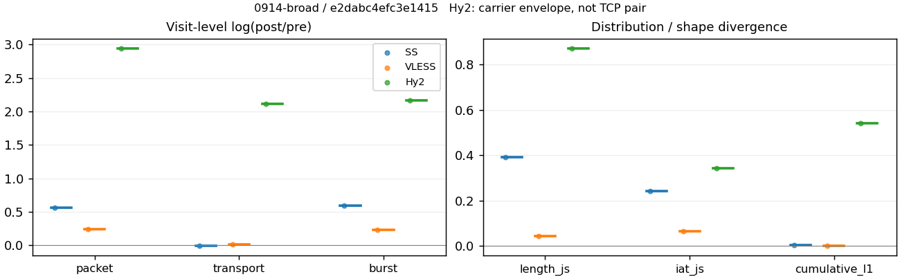
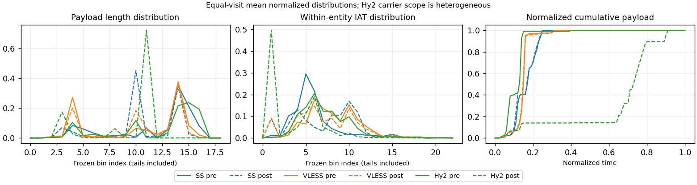

# 0914-broad · 条目 025 · github.com

目标：https://github.com/

活动标签：github.com::page_load。选定访问 3 次。

[返回总索引](../../README.md) · [统计口径](../../methods.md)

## 覆盖与资格（每次访问均保留）

| 部署 | 重复 | 主请求路由 | 活动状态 | 代理比较 | DIRECT pre | 请求 proxy/direct/unresolved | 错误 |
| --- | --- | --- | --- | --- | --- | --- | --- |
| Hy2 | 1 | proxy | passed | 1 | 0 | 156/0/0 | [] |
| SS | 1 | proxy | passed | 1 | 0 | 157/0/0 | [] |
| VLESS | 1 | proxy | passed | 1 | 0 | 156/0/0 | [] |

主请求非 proxy 的统计仅解释为已索引的辅助代理连接或 DIRECT 观测，不代表目标业务经代理传输。播放确认与配对资格是两道不同的门。

图中散点为单次访问，短线为重复中位数；Hy2 是共享载体包络，不能与 TCP 配对作等范围因果对比。

形态图先逐访问归一化，再对访问等权平均；实线 pre，虚线 post。分箱序号及边界见 methods，不将分箱索引误解为长度或时间。

## 每次访问的关键观测

### SS

范围：`exclusive_page`。每格 pre → post；空值为不可观测/不适用。

| 重复 | 包数 | 载荷字节 | burst | TCP FR | IAT中位µs | length JS | IAT JS |
| --- | --- | --- | --- | --- | --- | --- | --- |
| 1 | 3229 → 5652 | 6.2896e+06 → 6.287e+06 | 2209 → 3995 | 61 → 61 | 17.761 → 149.94 | 0.39262 | 0.2436 |

完整标量统计：中位数 [min,max]；Δ 为重复内逐访问变换的中位数，MAD 未缩放。n 为可用变换数；DIRECT-only 的 nΔ=0 不代表 pre 不可用。

| scope | 特征 | pre | post | Δ | IQRΔ | MADΔ | nΔ |
| --- | --- | --- | --- | --- | --- | --- | --- |
| exclusive_page | active_span_sum_s_1000ms | 9.8548 [9.8548, 9.8548] | 9.919 [9.919, 9.919] | 0.0064918 | — | — | 1 |
| exclusive_page | active_span_sum_s_100ms | 4.1202 [4.1202, 4.1202] | 5.8628 [5.8628, 5.8628] | 0.35273 | — | — | 1 |
| exclusive_page | active_span_sum_s_500ms | 9.152 [9.152, 9.152] | 9.919 [9.919, 9.919] | 0.08048 | — | — | 1 |
| exclusive_page | burst_bytes_iqr | 4096 [4096, 4096] | 2856 [2856, 2856] | -0.36059 | — | — | 1 |
| exclusive_page | burst_bytes_mad | 64 [64, 64] | 34 [34, 34] | -0.63252 | — | — | 1 |
| exclusive_page | burst_bytes_max | 32905 [32905, 32905] | 24276 [24276, 24276] | -0.30414 | — | — | 1 |
| exclusive_page | burst_bytes_mean | 2847.3 [2847.3, 2847.3] | 1573.7 [1573.7, 1573.7] | -0.59292 | — | — | 1 |
| exclusive_page | burst_bytes_median | 64 [64, 64] | 34 [34, 34] | -0.63252 | — | — | 1 |
| exclusive_page | burst_bytes_min | 0 [0, 0] | 0 [0, 0] | — | — | — | 0 |
| exclusive_page | burst_bytes_p95 | 14480 [14480, 14480] | 5712 [5712, 5712] | -0.9302 | — | — | 1 |
| exclusive_page | burst_bytes_q25 | 0 [0, 0] | 0 [0, 0] | — | — | — | 0 |
| exclusive_page | burst_bytes_q75 | 4096 [4096, 4096] | 2856 [2856, 2856] | -0.36059 | — | — | 1 |
| exclusive_page | burst_bytes_std | 4917.4 [4917.4, 4917.4] | 2347.5 [2347.5, 2347.5] | -0.73943 | — | — | 1 |
| exclusive_page | burst_count | 2209 [2209, 2209] | 3995 [3995, 3995] | 0.5925 | — | — | 1 |
| exclusive_page | burst_duration_ms_iqr | 0 [0, 0] | 6.8e-05 [6.8e-05, 6.8e-05] | — | — | — | 0 |
| exclusive_page | burst_duration_ms_mad | 0 [0, 0] | 0 [0, 0] | — | — | — | 0 |
| exclusive_page | burst_duration_ms_max | 9088.6 [9088.6, 9088.6] | 9088.9 [9088.9, 9088.9] | 2.9478e-05 | — | — | 1 |
| exclusive_page | burst_duration_ms_mean | 9.4237 [9.4237, 9.4237] | 4.7597 [4.7597, 4.7597] | -0.68305 | — | — | 1 |
| exclusive_page | burst_duration_ms_median | 0 [0, 0] | 0 [0, 0] | — | — | — | 0 |
| exclusive_page | burst_duration_ms_min | 0 [0, 0] | 0 [0, 0] | — | — | — | 0 |
| exclusive_page | burst_duration_ms_p95 | 0.13886 [0.13886, 0.13886] | 0.85284 [0.85284, 0.85284] | 1.8151 | — | — | 1 |
| exclusive_page | burst_duration_ms_q25 | 0 [0, 0] | 0 [0, 0] | — | — | — | 0 |
| exclusive_page | burst_duration_ms_q75 | 0 [0, 0] | 6.8e-05 [6.8e-05, 6.8e-05] | — | — | — | 0 |
| exclusive_page | burst_duration_ms_std | 219.5 [219.5, 219.5] | 162.54 [162.54, 162.54] | -0.30043 | — | — | 1 |
| exclusive_page | burst_packets_iqr | 0 [0, 0] | 1 [1, 1] | — | — | — | 0 |
| exclusive_page | burst_packets_mad | 0 [0, 0] | 0 [0, 0] | — | — | — | 0 |
| exclusive_page | burst_packets_max | 11 [11, 11] | 14 [14, 14] | 0.24116 | — | — | 1 |
| exclusive_page | burst_packets_mean | 1.4617 [1.4617, 1.4617] | 1.4148 [1.4148, 1.4148] | -0.032667 | — | — | 1 |
| exclusive_page | burst_packets_median | 1 [1, 1] | 1 [1, 1] | 0 | — | — | 1 |
| exclusive_page | burst_packets_min | 1 [1, 1] | 1 [1, 1] | 0 | — | — | 1 |
| exclusive_page | burst_packets_p95 | 4 [4, 4] | 3 [3, 3] | -0.28768 | — | — | 1 |
| exclusive_page | burst_packets_q25 | 1 [1, 1] | 1 [1, 1] | 0 | — | — | 1 |
| exclusive_page | burst_packets_q75 | 1 [1, 1] | 2 [2, 2] | 0.69315 | — | — | 1 |
| exclusive_page | burst_packets_std | 1.1139 [1.1139, 1.1139] | 0.9124 [0.9124, 0.9124] | -0.19957 | — | — | 1 |
| exclusive_page | connection_span_concurrency_max | 5 [5, 5] | 5 [5, 5] | 0 | — | — | 1 |
| exclusive_page | cumulative_l1 | — | — | 0.0033896 | — | — | 1 |
| exclusive_page | cumulative_max | — | — | 0.088727 | — | — | 1 |
| exclusive_page | direction_entropy | 0.4569 [0.4569, 0.4569] | 0.24899 [0.24899, 0.24899] | -0.20791 | — | — | 1 |
| exclusive_page | down_burst_count | 1102 [1102, 1102] | 1995 [1995, 1995] | 0.59352 | — | — | 1 |
| exclusive_page | down_ip_bytes | 6.3016e+06 [6.3016e+06, 6.3016e+06] | 6.3624e+06 [6.3624e+06, 6.3624e+06] | 0.0095935 | — | — | 1 |
| exclusive_page | down_packets | 2000 [2000, 2000] | 3330 [3330, 3330] | 0.50983 | — | — | 1 |
| exclusive_page | down_transport_bytes | 6.1976e+06 [6.1976e+06, 6.1976e+06] | 6.1892e+06 [6.1892e+06, 6.1892e+06] | -0.0013624 | — | — | 1 |
| exclusive_page | duration_s | 18.209 [18.209, 18.209] | 18.208 [18.208, 18.208] | -4.9108e-05 | — | — | 1 |
| exclusive_page | entity_count | 5 [5, 5] | 5 [5, 5] | 0 | — | — | 1 |
| exclusive_page | fr_runs | 61 [61, 61] | 61 [61, 61] | 0 | — | — | 1 |
| exclusive_page | fr_runs_per_packet | 0.029946 [0.029946, 0.029946] | 0.018069 [0.018069, 0.018069] | -0.011877 | — | — | 1 |
| exclusive_page | fr_switches | 56 [56, 56] | 56 [56, 56] | 0 | — | — | 1 |
| exclusive_page | fr_switches_per_possible_transition | 0.027559 [0.027559, 0.027559] | 0.016612 [0.016612, 0.016612] | -0.010947 | — | — | 1 |
| exclusive_page | full_retransmission_fraction | 0.0055745 [0.0055745, 0.0055745] | 0.00017693 [0.00017693, 0.00017693] | -0.0053976 | — | — | 1 |
| exclusive_page | full_retransmission_packets | 18 [18, 18] | 1 [1, 1] | -2.8904 | — | — | 1 |
| exclusive_page | iat_count | 3224 [3224, 3224] | 5647 [5647, 5647] | 0.5605 | — | — | 1 |
| exclusive_page | iat_js | — | — | 0.2436 | — | — | 1 |
| exclusive_page | iat_ks | — | — | 0.39016 | — | — | 1 |
| exclusive_page | iat_median_us | 17.761 [17.761, 17.761] | 149.94 [149.94, 149.94] | 2.1333 | — | — | 1 |
| exclusive_page | iat_us_iqr | 37.501 [37.501, 37.501] | 737.21 [737.21, 737.21] | 2.9785 | — | — | 1 |
| exclusive_page | iat_us_mad | 11.997 [11.997, 11.997] | 148.49 [148.49, 148.49] | 2.5159 | — | — | 1 |
| exclusive_page | iat_us_max | 1.414e+07 [1.414e+07, 1.414e+07] | 1.4072e+07 [1.4072e+07, 1.4072e+07] | -0.0048345 | — | — | 1 |
| exclusive_page | iat_us_mean | 12064 [12064, 12064] | 6887 [6887, 6887] | -0.56058 | — | — | 1 |
| exclusive_page | iat_us_median | 17.761 [17.761, 17.761] | 149.94 [149.94, 149.94] | 2.1333 | — | — | 1 |
| exclusive_page | iat_us_min | 0.022 [0.022, 0.022] | 0.032 [0.032, 0.032] | 0.37469 | — | — | 1 |
| exclusive_page | iat_us_p95 | 4741.4 [4741.4, 4741.4] | 2274.1 [2274.1, 2274.1] | -0.73473 | — | — | 1 |
| exclusive_page | iat_us_q25 | 10.064 [10.064, 10.064] | 8.073 [8.073, 8.073] | -0.22049 | — | — | 1 |
| exclusive_page | iat_us_q75 | 47.565 [47.565, 47.565] | 745.28 [745.28, 745.28] | 2.7517 | — | — | 1 |
| exclusive_page | iat_us_std | 3.0829e+05 [3.0829e+05, 3.0829e+05] | 2.3192e+05 [2.3192e+05, 2.3192e+05] | -0.28468 | — | — | 1 |
| exclusive_page | iat_wasserstein_log1p_us | — | — | 1.3734 | — | — | 1 |
| exclusive_page | idle_gap_count_1000ms | 4 [4, 4] | 4 [4, 4] | 0 | — | — | 1 |
| exclusive_page | idle_gap_count_100ms | 25 [25, 25] | 22 [22, 22] | -0.12783 | — | — | 1 |
| exclusive_page | idle_gap_count_500ms | 5 [5, 5] | 4 [4, 4] | -0.22314 | — | — | 1 |
| exclusive_page | idle_gap_sum_s_1000ms | 29.039 [29.039, 29.039] | 28.972 [28.972, 28.972] | -0.0023242 | — | — | 1 |
| exclusive_page | idle_gap_sum_s_100ms | 34.774 [34.774, 34.774] | 33.028 [33.028, 33.028] | -0.05151 | — | — | 1 |
| exclusive_page | idle_gap_sum_s_500ms | 29.742 [29.742, 29.742] | 28.972 [28.972, 28.972] | -0.026238 | — | — | 1 |
| exclusive_page | ip_bytes | 6.4578e+06 [6.4578e+06, 6.4578e+06] | 6.6387e+06 [6.6387e+06, 6.6387e+06] | 0.027628 | — | — | 1 |
| exclusive_page | length_iqr | 2648 [2648, 2648] | 1428 [1428, 1428] | -0.61753 | — | — | 1 |
| exclusive_page | length_js | — | — | 0.39262 | — | — | 1 |
| exclusive_page | length_ks | — | — | 0.5654 | — | — | 1 |
| exclusive_page | length_mad | 1448 [1448, 1448] | 912 [912, 912] | -0.4623 | — | — | 1 |
| exclusive_page | length_max | 8948 [8948, 8948] | 19992 [19992, 19992] | 0.8039 | — | — | 1 |
| exclusive_page | length_mean | 3087.7 [3087.7, 3087.7] | 1862.3 [1862.3, 1862.3] | -0.50563 | — | — | 1 |
| exclusive_page | length_median | 2896 [2896, 2896] | 1428 [1428, 1428] | -0.70706 | — | — | 1 |
| exclusive_page | length_min | 8 [8, 8] | 6 [6, 6] | -0.28768 | — | — | 1 |
| exclusive_page | length_p95 | 8192 [8192, 8192] | 2856 [2856, 2856] | -1.0537 | — | — | 1 |
| exclusive_page | length_q25 | 1448 [1448, 1448] | 1428 [1428, 1428] | -0.013908 | — | — | 1 |
| exclusive_page | length_q75 | 4096 [4096, 4096] | 2856 [2856, 2856] | -0.36059 | — | — | 1 |
| exclusive_page | length_std | 2359.7 [2359.7, 2359.7] | 1182.8 [1182.8, 1182.8] | -0.69061 | — | — | 1 |
| exclusive_page | length_wasserstein_bytes | — | — | 1386.8 | — | — | 1 |
| exclusive_page | nonempty_entity_count | 5 [5, 5] | 5 [5, 5] | 0 | — | — | 1 |
| exclusive_page | nonempty_packets | 2037 [2037, 2037] | 3376 [3376, 3376] | 0.50521 | — | — | 1 |
| exclusive_page | offload_suspect_fraction | 0.43915 [0.43915, 0.43915] | 0.23903 [0.23903, 0.23903] | -0.20011 | — | — | 1 |
| exclusive_page | packet_count | 3229 [3229, 3229] | 5652 [5652, 5652] | 0.55984 | — | — | 1 |
| exclusive_page | rtt_median_ms | 0.023278 [0.023278, 0.023278] | 35.164 [35.164, 35.164] | 7.3203 | — | — | 1 |
| exclusive_page | rtt_sample_count | 1173 [1173, 1173] | 389 [389, 389] | -1.1037 | — | — | 1 |
| exclusive_page | tcp_ack_count | 3224 [3224, 3224] | 5647 [5647, 5647] | 0.5605 | — | — | 1 |
| exclusive_page | tcp_fin_count | 10 [10, 10] | 10 [10, 10] | 0 | — | — | 1 |
| exclusive_page | tcp_packet_count | 3229 [3229, 3229] | 5652 [5652, 5652] | 0.55984 | — | — | 1 |
| exclusive_page | tcp_rst_count | 0 [0, 0] | 0 [0, 0] | — | — | — | 0 |
| exclusive_page | tcp_syn_count | 10 [10, 10] | 10 [10, 10] | 0 | — | — | 1 |
| exclusive_page | tcp_window_raw_median | 65535 [65535, 65535] | 150 [150, 150] | -6.0797 | — | — | 1 |
| exclusive_page | transition_entropy | 0.15636 [0.15636, 0.15636] | 0.095774 [0.095774, 0.095774] | -0.06059 | — | — | 1 |
| exclusive_page | transition_n_mm | 1811 [1811, 1811] | 3206 [3206, 3206] | 0.57114 | — | — | 1 |
| exclusive_page | transition_n_mp | 26 [26, 26] | 26 [26, 26] | 0 | — | — | 1 |
| exclusive_page | transition_n_pm | 30 [30, 30] | 30 [30, 30] | 0 | — | — | 1 |
| exclusive_page | transition_n_pp | 165 [165, 165] | 109 [109, 109] | -0.4146 | — | — | 1 |
| exclusive_page | transition_p_mm | 0.98585 [0.98585, 0.98585] | 0.99196 [0.99196, 0.99196] | 0.006109 | — | — | 1 |
| exclusive_page | transition_p_mp | 0.014154 [0.014154, 0.014154] | 0.0080446 [0.0080446, 0.0080446] | -0.006109 | — | — | 1 |
| exclusive_page | transition_p_pm | 0.15385 [0.15385, 0.15385] | 0.21583 [0.21583, 0.21583] | 0.061981 | — | — | 1 |
| exclusive_page | transition_p_pp | 0.84615 [0.84615, 0.84615] | 0.78417 [0.78417, 0.78417] | -0.061981 | — | — | 1 |
| exclusive_page | transport_bytes | 6.2896e+06 [6.2896e+06, 6.2896e+06] | 6.287e+06 [6.287e+06, 6.287e+06] | -0.00041824 | — | — | 1 |
| exclusive_page | up_burst_count | 1107 [1107, 1107] | 2000 [2000, 2000] | 0.59149 | — | — | 1 |
| exclusive_page | up_byte_fraction | 0.014633 [0.014633, 0.014633] | 0.015563 [0.015563, 0.015563] | 0.00092993 | — | — | 1 |
| exclusive_page | up_ip_bytes | 1.562e+05 [1.562e+05, 1.562e+05] | 2.7636e+05 [2.7636e+05, 2.7636e+05] | 0.57054 | — | — | 1 |
| exclusive_page | up_packets | 1229 [1229, 1229] | 2322 [2322, 2322] | 0.63623 | — | — | 1 |
| exclusive_page | up_transport_bytes | 92039 [92039, 92039] | 97847 [97847, 97847] | 0.061193 | — | — | 1 |
| exclusive_page | zero_iat_count | 0 [0, 0] | 0 [0, 0] | — | — | — | 0 |
| exclusive_page | zero_iat_fraction | 0 [0, 0] | 0 [0, 0] | 0 | — | — | 1 |

### VLESS

范围：`exclusive_page`。每格 pre → post；空值为不可观测/不适用。

| 重复 | 包数 | 载荷字节 | burst | TCP FR | IAT中位µs | length JS | IAT JS |
| --- | --- | --- | --- | --- | --- | --- | --- |
| 1 | 2030 → 2581 | 2.5915e+06 → 2.6315e+06 | 1423 → 1797 | 48 → 60 | 120.56 → 54.187 | 0.042902 | 0.065245 |

完整标量统计：中位数 [min,max]；Δ 为重复内逐访问变换的中位数，MAD 未缩放。n 为可用变换数；DIRECT-only 的 nΔ=0 不代表 pre 不可用。

| scope | 特征 | pre | post | Δ | IQRΔ | MADΔ | nΔ |
| --- | --- | --- | --- | --- | --- | --- | --- |
| exclusive_page | active_span_sum_s_1000ms | 7.7467 [7.7467, 7.7467] | 7.6313 [7.6313, 7.6313] | -0.015017 | — | — | 1 |
| exclusive_page | active_span_sum_s_100ms | 1.952 [1.952, 1.952] | 3.872 [3.872, 3.872] | 0.68494 | — | — | 1 |
| exclusive_page | active_span_sum_s_500ms | 4.3743 [4.3743, 4.3743] | 7.6313 [7.6313, 7.6313] | 0.5565 | — | — | 1 |
| exclusive_page | burst_bytes_iqr | 2896 [2896, 2896] | 2824 [2824, 2824] | -0.025176 | — | — | 1 |
| exclusive_page | burst_bytes_mad | 36 [36, 36] | 72 [72, 72] | 0.69315 | — | — | 1 |
| exclusive_page | burst_bytes_max | 32812 [32812, 32812] | 24688 [24688, 24688] | -0.28448 | — | — | 1 |
| exclusive_page | burst_bytes_mean | 1821.1 [1821.1, 1821.1] | 1464.4 [1464.4, 1464.4] | -0.21804 | — | — | 1 |
| exclusive_page | burst_bytes_median | 36 [36, 36] | 72 [72, 72] | 0.69315 | — | — | 1 |
| exclusive_page | burst_bytes_min | 0 [0, 0] | 0 [0, 0] | — | — | — | 0 |
| exclusive_page | burst_bytes_p95 | 8688 [8688, 8688] | 4416 [4416, 4416] | -0.67671 | — | — | 1 |
| exclusive_page | burst_bytes_q25 | 0 [0, 0] | 0 [0, 0] | — | — | — | 0 |
| exclusive_page | burst_bytes_q75 | 2896 [2896, 2896] | 2824 [2824, 2824] | -0.025176 | — | — | 1 |
| exclusive_page | burst_bytes_std | 3326.8 [3326.8, 3326.8] | 1928.7 [1928.7, 1928.7] | -0.54519 | — | — | 1 |
| exclusive_page | burst_count | 1423 [1423, 1423] | 1797 [1797, 1797] | 0.23335 | — | — | 1 |
| exclusive_page | burst_duration_ms_iqr | 0.079799 [0.079799, 0.079799] | 0.000225 [0.000225, 0.000225] | -5.8712 | — | — | 1 |
| exclusive_page | burst_duration_ms_mad | 0 [0, 0] | 0 [0, 0] | — | — | — | 0 |
| exclusive_page | burst_duration_ms_max | 12468 [12468, 12468] | 12469 [12469, 12469] | 2.3664e-05 | — | — | 1 |
| exclusive_page | burst_duration_ms_mean | 14.1 [14.1, 14.1] | 10.409 [10.409, 10.409] | -0.30353 | — | — | 1 |
| exclusive_page | burst_duration_ms_median | 0 [0, 0] | 0 [0, 0] | — | — | — | 0 |
| exclusive_page | burst_duration_ms_min | 0 [0, 0] | 0 [0, 0] | — | — | — | 0 |
| exclusive_page | burst_duration_ms_p95 | 1.716 [1.716, 1.716] | 4.0065 [4.0065, 4.0065] | 0.8479 | — | — | 1 |
| exclusive_page | burst_duration_ms_q25 | 0 [0, 0] | 0 [0, 0] | — | — | — | 0 |
| exclusive_page | burst_duration_ms_q75 | 0.079799 [0.079799, 0.079799] | 0.000225 [0.000225, 0.000225] | -5.8712 | — | — | 1 |
| exclusive_page | burst_duration_ms_std | 334.85 [334.85, 334.85] | 296.31 [296.31, 296.31] | -0.12229 | — | — | 1 |
| exclusive_page | burst_packets_iqr | 1 [1, 1] | 1 [1, 1] | 0 | — | — | 1 |
| exclusive_page | burst_packets_mad | 0 [0, 0] | 0 [0, 0] | — | — | — | 0 |
| exclusive_page | burst_packets_max | 10 [10, 10] | 14 [14, 14] | 0.33647 | — | — | 1 |
| exclusive_page | burst_packets_mean | 1.4266 [1.4266, 1.4266] | 1.4363 [1.4363, 1.4363] | 0.0067898 | — | — | 1 |
| exclusive_page | burst_packets_median | 1 [1, 1] | 1 [1, 1] | 0 | — | — | 1 |
| exclusive_page | burst_packets_min | 1 [1, 1] | 1 [1, 1] | 0 | — | — | 1 |
| exclusive_page | burst_packets_p95 | 3 [3, 3] | 3 [3, 3] | 0 | — | — | 1 |
| exclusive_page | burst_packets_q25 | 1 [1, 1] | 1 [1, 1] | 0 | — | — | 1 |
| exclusive_page | burst_packets_q75 | 2 [2, 2] | 2 [2, 2] | 0 | — | — | 1 |
| exclusive_page | burst_packets_std | 0.85163 [0.85163, 0.85163] | 0.94653 [0.94653, 0.94653] | 0.10564 | — | — | 1 |
| exclusive_page | connection_span_concurrency_max | 3 [3, 3] | 3 [3, 3] | 0 | — | — | 1 |
| exclusive_page | cumulative_l1 | — | — | 0.002614 | — | — | 1 |
| exclusive_page | cumulative_max | — | — | 0.077075 | — | — | 1 |
| exclusive_page | direction_entropy | 0.54963 [0.54963, 0.54963] | 0.38194 [0.38194, 0.38194] | -0.16769 | — | — | 1 |
| exclusive_page | down_burst_count | 709 [709, 709] | 896 [896, 896] | 0.23408 | — | — | 1 |
| exclusive_page | down_ip_bytes | 2.5741e+06 [2.5741e+06, 2.5741e+06] | 2.6163e+06 [2.6163e+06, 2.6163e+06] | 0.01626 | — | — | 1 |
| exclusive_page | down_packets | 1236 [1236, 1236] | 1475 [1475, 1475] | 0.17678 | — | — | 1 |
| exclusive_page | down_transport_bytes | 2.5098e+06 [2.5098e+06, 2.5098e+06] | 2.5395e+06 [2.5395e+06, 2.5395e+06] | 0.011791 | — | — | 1 |
| exclusive_page | duration_s | 18.935 [18.935, 18.935] | 18.893 [18.893, 18.893] | -0.0021997 | — | — | 1 |
| exclusive_page | entity_count | 5 [5, 5] | 5 [5, 5] | 0 | — | — | 1 |
| exclusive_page | fr_runs | 48 [48, 48] | 60 [60, 60] | 0.22314 | — | — | 1 |
| exclusive_page | fr_runs_per_packet | 0.037915 [0.037915, 0.037915] | 0.040188 [0.040188, 0.040188] | 0.0022728 | — | — | 1 |
| exclusive_page | fr_switches | 43 [43, 43] | 55 [55, 55] | 0.24613 | — | — | 1 |
| exclusive_page | fr_switches_per_possible_transition | 0.0341 [0.0341, 0.0341] | 0.036962 [0.036962, 0.036962] | 0.0028624 | — | — | 1 |
| exclusive_page | full_retransmission_fraction | 0.0029557 [0.0029557, 0.0029557] | 0 [0, 0] | -0.0029557 | — | — | 1 |
| exclusive_page | full_retransmission_packets | 6 [6, 6] | 0 [0, 0] | — | — | — | 0 |
| exclusive_page | iat_count | 2025 [2025, 2025] | 2576 [2576, 2576] | 0.24067 | — | — | 1 |
| exclusive_page | iat_js | — | — | 0.065245 | — | — | 1 |
| exclusive_page | iat_ks | — | — | 0.18854 | — | — | 1 |
| exclusive_page | iat_median_us | 120.56 [120.56, 120.56] | 54.187 [54.187, 54.187] | -0.79967 | — | — | 1 |
| exclusive_page | iat_us_iqr | 771.08 [771.08, 771.08] | 709.59 [709.59, 709.59] | -0.083099 | — | — | 1 |
| exclusive_page | iat_us_mad | 110.25 [110.25, 110.25] | 53.962 [53.962, 53.962] | -0.71444 | — | — | 1 |
| exclusive_page | iat_us_max | 1.2468e+07 [1.2468e+07, 1.2468e+07] | 1.2469e+07 [1.2469e+07, 1.2469e+07] | 2.3664e-05 | — | — | 1 |
| exclusive_page | iat_us_mean | 10605 [10605, 10605] | 8292.2 [8292.2, 8292.2] | -0.24602 | — | — | 1 |
| exclusive_page | iat_us_median | 120.56 [120.56, 120.56] | 54.187 [54.187, 54.187] | -0.79967 | — | — | 1 |
| exclusive_page | iat_us_min | 0.031 [0.031, 0.031] | 0.031 [0.031, 0.031] | 0 | — | — | 1 |
| exclusive_page | iat_us_p95 | 4548.5 [4548.5, 4548.5] | 6834.2 [6834.2, 6834.2] | 0.40715 | — | — | 1 |
| exclusive_page | iat_us_q25 | 32.34 [32.34, 32.34] | 11.768 [11.768, 11.768] | -1.0109 | — | — | 1 |
| exclusive_page | iat_us_q75 | 803.42 [803.42, 803.42] | 721.36 [721.36, 721.36] | -0.10774 | — | — | 1 |
| exclusive_page | iat_us_std | 2.8076e+05 [2.8076e+05, 2.8076e+05] | 2.4752e+05 [2.4752e+05, 2.4752e+05] | -0.12604 | — | — | 1 |
| exclusive_page | iat_wasserstein_log1p_us | — | — | 0.7179 | — | — | 1 |
| exclusive_page | idle_gap_count_1000ms | 2 [2, 2] | 2 [2, 2] | 0 | — | — | 1 |
| exclusive_page | idle_gap_count_100ms | 19 [19, 19] | 23 [23, 23] | 0.19106 | — | — | 1 |
| exclusive_page | idle_gap_count_500ms | 7 [7, 7] | 2 [2, 2] | -1.2528 | — | — | 1 |
| exclusive_page | idle_gap_sum_s_1000ms | 13.729 [13.729, 13.729] | 13.729 [13.729, 13.729] | 5.4154e-05 | — | — | 1 |
| exclusive_page | idle_gap_sum_s_100ms | 19.523 [19.523, 19.523] | 17.489 [17.489, 17.489] | -0.11006 | — | — | 1 |
| exclusive_page | idle_gap_sum_s_500ms | 17.101 [17.101, 17.101] | 13.729 [13.729, 13.729] | -0.2196 | — | — | 1 |
| exclusive_page | ip_bytes | 2.6971e+06 [2.6971e+06, 2.6971e+06] | 2.7669e+06 [2.7669e+06, 2.7669e+06] | 0.02557 | — | — | 1 |
| exclusive_page | length_iqr | 2739.8 [2739.8, 2739.8] | 2228 [2228, 2228] | -0.20676 | — | — | 1 |
| exclusive_page | length_js | — | — | 0.042902 | — | — | 1 |
| exclusive_page | length_ks | — | — | 0.088308 | — | — | 1 |
| exclusive_page | length_mad | 1340 [1340, 1340] | 1376 [1376, 1376] | 0.026511 | — | — | 1 |
| exclusive_page | length_max | 8948 [8948, 8948] | 10136 [10136, 10136] | 0.12466 | — | — | 1 |
| exclusive_page | length_mean | 2047 [2047, 2047] | 1762.5 [1762.5, 1762.5] | -0.14961 | — | — | 1 |
| exclusive_page | length_median | 1556 [1556, 1556] | 1448 [1448, 1448] | -0.071935 | — | — | 1 |
| exclusive_page | length_min | 24 [24, 24] | 11 [11, 11] | -0.78016 | — | — | 1 |
| exclusive_page | length_p95 | 5792 [5792, 5792] | 3004 [3004, 3004] | -0.65653 | — | — | 1 |
| exclusive_page | length_q25 | 84.25 [84.25, 84.25] | 596 [596, 596] | 1.9565 | — | — | 1 |
| exclusive_page | length_q75 | 2824 [2824, 2824] | 2824 [2824, 2824] | 0 | — | — | 1 |
| exclusive_page | length_std | 1877.6 [1877.6, 1877.6] | 1328.5 [1328.5, 1328.5] | -0.34594 | — | — | 1 |
| exclusive_page | length_wasserstein_bytes | — | — | 425.94 | — | — | 1 |
| exclusive_page | nonempty_entity_count | 5 [5, 5] | 5 [5, 5] | 0 | — | — | 1 |
| exclusive_page | nonempty_packets | 1266 [1266, 1266] | 1493 [1493, 1493] | 0.16493 | — | — | 1 |
| exclusive_page | offload_suspect_fraction | 0.35123 [0.35123, 0.35123] | 0.2747 [0.2747, 0.2747] | -0.076532 | — | — | 1 |
| exclusive_page | packet_count | 2030 [2030, 2030] | 2581 [2581, 2581] | 0.24014 | — | — | 1 |
| exclusive_page | rtt_median_ms | 0.12115 [0.12115, 0.12115] | 0.042484 [0.042484, 0.042484] | -1.0479 | — | — | 1 |
| exclusive_page | rtt_sample_count | 743 [743, 743] | 1040 [1040, 1040] | 0.33628 | — | — | 1 |
| exclusive_page | tcp_ack_count | 2015 [2015, 2015] | 2576 [2576, 2576] | 0.24562 | — | — | 1 |
| exclusive_page | tcp_fin_count | 10 [10, 10] | 10 [10, 10] | 0 | — | — | 1 |
| exclusive_page | tcp_packet_count | 2030 [2030, 2030] | 2581 [2581, 2581] | 0.24014 | — | — | 1 |
| exclusive_page | tcp_rst_count | 10 [10, 10] | 0 [0, 0] | — | — | — | 0 |
| exclusive_page | tcp_syn_count | 10 [10, 10] | 10 [10, 10] | 0 | — | — | 1 |
| exclusive_page | tcp_window_raw_median | 65535 [65535, 65535] | 206 [206, 206] | -5.7625 | — | — | 1 |
| exclusive_page | transition_entropy | 0.18734 [0.18734, 0.18734] | 0.18399 [0.18399, 0.18399] | -0.0033527 | — | — | 1 |
| exclusive_page | transition_n_mm | 1081 [1081, 1081] | 1352 [1352, 1352] | 0.2237 | — | — | 1 |
| exclusive_page | transition_n_mp | 19 [19, 19] | 25 [25, 25] | 0.27444 | — | — | 1 |
| exclusive_page | transition_n_pm | 24 [24, 24] | 30 [30, 30] | 0.22314 | — | — | 1 |
| exclusive_page | transition_n_pp | 137 [137, 137] | 81 [81, 81] | -0.52553 | — | — | 1 |
| exclusive_page | transition_p_mm | 0.98273 [0.98273, 0.98273] | 0.98184 [0.98184, 0.98184] | -0.00088268 | — | — | 1 |
| exclusive_page | transition_p_mp | 0.017273 [0.017273, 0.017273] | 0.018155 [0.018155, 0.018155] | 0.00088268 | — | — | 1 |
| exclusive_page | transition_p_pm | 0.14907 [0.14907, 0.14907] | 0.27027 [0.27027, 0.27027] | 0.1212 | — | — | 1 |
| exclusive_page | transition_p_pp | 0.85093 [0.85093, 0.85093] | 0.72973 [0.72973, 0.72973] | -0.1212 | — | — | 1 |
| exclusive_page | transport_bytes | 2.5915e+06 [2.5915e+06, 2.5915e+06] | 2.6315e+06 [2.6315e+06, 2.6315e+06] | 0.015313 | — | — | 1 |
| exclusive_page | up_burst_count | 714 [714, 714] | 901 [901, 901] | 0.23262 | — | — | 1 |
| exclusive_page | up_byte_fraction | 0.031531 [0.031531, 0.031531] | 0.034936 [0.034936, 0.034936] | 0.003405 | — | — | 1 |
| exclusive_page | up_ip_bytes | 1.2299e+05 [1.2299e+05, 1.2299e+05] | 1.5065e+05 [1.5065e+05, 1.5065e+05] | 0.20283 | — | — | 1 |
| exclusive_page | up_packets | 794 [794, 794] | 1106 [1106, 1106] | 0.33142 | — | — | 1 |
| exclusive_page | up_transport_bytes | 81712 [81712, 81712] | 91933 [91933, 91933] | 0.11786 | — | — | 1 |
| exclusive_page | zero_iat_count | 0 [0, 0] | 0 [0, 0] | — | — | — | 0 |
| exclusive_page | zero_iat_fraction | 0 [0, 0] | 0 [0, 0] | 0 | — | — | 1 |

### Hy2

范围：`carrier_context_envelope`。每格 pre → post；空值为不可观测/不适用。

| 重复 | 包数 | 载荷字节 | burst | TCP FR | IAT中位µs | length JS | IAT JS |
| --- | --- | --- | --- | --- | --- | --- | --- |
| 1 | 2489 → 46923 | 6.3101e+06 → 5.2068e+07 | 1668 → 14574 | — | 51.586 → 1.602 | 0.86991 | 0.34378 |

完整标量统计：中位数 [min,max]；Δ 为重复内逐访问变换的中位数，MAD 未缩放。n 为可用变换数；DIRECT-only 的 nΔ=0 不代表 pre 不可用。

| scope | 特征 | pre | post | Δ | IQRΔ | MADΔ | nΔ |
| --- | --- | --- | --- | --- | --- | --- | --- |
| carrier_context_envelope | active_span_sum_s_1000ms | 6.4725 [6.4725, 6.4725] | 9.7215 [9.7215, 9.7215] | 0.40678 | — | — | 1 |
| carrier_context_envelope | active_span_sum_s_100ms | 2.0508 [2.0508, 2.0508] | 6.296 [6.296, 6.296] | 1.1217 | — | — | 1 |
| carrier_context_envelope | active_span_sum_s_500ms | 6.4725 [6.4725, 6.4725] | 8.8986 [8.8986, 8.8986] | 0.31834 | — | — | 1 |
| carrier_context_envelope | burst_bytes_iqr | 5660 [5660, 5660] | 5724 [5724, 5724] | 0.011244 | — | — | 1 |
| carrier_context_envelope | burst_bytes_mad | 56 [56, 56] | 259.5 [259.5, 259.5] | 1.5334 | — | — | 1 |
| carrier_context_envelope | burst_bytes_max | 32812 [32812, 32812] | 2.084e+05 [2.084e+05, 2.084e+05] | 1.8487 | — | — | 1 |
| carrier_context_envelope | burst_bytes_mean | 3783 [3783, 3783] | 3572.7 [3572.7, 3572.7] | -0.057214 | — | — | 1 |
| carrier_context_envelope | burst_bytes_median | 56 [56, 56] | 289.5 [289.5, 289.5] | 1.6428 | — | — | 1 |
| carrier_context_envelope | burst_bytes_min | 0 [0, 0] | 25 [25, 25] | — | — | — | 0 |
| carrier_context_envelope | burst_bytes_p95 | 20480 [20480, 20480] | 12373 [12373, 12373] | -0.50393 | — | — | 1 |
| carrier_context_envelope | burst_bytes_q25 | 0 [0, 0] | 40 [40, 40] | — | — | — | 0 |
| carrier_context_envelope | burst_bytes_q75 | 5660 [5660, 5660] | 5764 [5764, 5764] | 0.018208 | — | — | 1 |
| carrier_context_envelope | burst_bytes_std | 6114.5 [6114.5, 6114.5] | 6895.2 [6895.2, 6895.2] | 0.12017 | — | — | 1 |
| carrier_context_envelope | burst_count | 1668 [1668, 1668] | 14574 [14574, 14574] | 2.1676 | — | — | 1 |
| carrier_context_envelope | burst_duration_ms_iqr | 0.018943 [0.018943, 0.018943] | 0.027386 [0.027386, 0.027386] | 0.36857 | — | — | 1 |
| carrier_context_envelope | burst_duration_ms_mad | 0 [0, 0] | 5.3e-05 [5.3e-05, 5.3e-05] | — | — | — | 0 |
| carrier_context_envelope | burst_duration_ms_max | 10225 [10225, 10225] | 1164.5 [1164.5, 1164.5] | -2.1725 | — | — | 1 |
| carrier_context_envelope | burst_duration_ms_mean | 11.579 [11.579, 11.579] | 0.31463 [0.31463, 0.31463] | -3.6055 | — | — | 1 |
| carrier_context_envelope | burst_duration_ms_median | 0 [0, 0] | 5.3e-05 [5.3e-05, 5.3e-05] | — | — | — | 0 |
| carrier_context_envelope | burst_duration_ms_min | 0 [0, 0] | 0 [0, 0] | — | — | — | 0 |
| carrier_context_envelope | burst_duration_ms_p95 | 0.97863 [0.97863, 0.97863] | 0.10241 [0.10241, 0.10241] | -2.2571 | — | — | 1 |
| carrier_context_envelope | burst_duration_ms_q25 | 0 [0, 0] | 0 [0, 0] | — | — | — | 0 |
| carrier_context_envelope | burst_duration_ms_q75 | 0.018943 [0.018943, 0.018943] | 0.027386 [0.027386, 0.027386] | 0.36857 | — | — | 1 |
| carrier_context_envelope | burst_duration_ms_std | 274.08 [274.08, 274.08] | 10.95 [10.95, 10.95] | -3.2201 | — | — | 1 |
| carrier_context_envelope | burst_packets_iqr | 1 [1, 1] | 3 [3, 3] | 1.0986 | — | — | 1 |
| carrier_context_envelope | burst_packets_mad | 0 [0, 0] | 1 [1, 1] | — | — | — | 0 |
| carrier_context_envelope | burst_packets_max | 9 [9, 9] | 150 [150, 150] | 2.8134 | — | — | 1 |
| carrier_context_envelope | burst_packets_mean | 1.4922 [1.4922, 1.4922] | 3.2196 [3.2196, 3.2196] | 0.76901 | — | — | 1 |
| carrier_context_envelope | burst_packets_median | 1 [1, 1] | 2 [2, 2] | 0.69315 | — | — | 1 |
| carrier_context_envelope | burst_packets_min | 1 [1, 1] | 1 [1, 1] | 0 | — | — | 1 |
| carrier_context_envelope | burst_packets_p95 | 3 [3, 3] | 9 [9, 9] | 1.0986 | — | — | 1 |
| carrier_context_envelope | burst_packets_q25 | 1 [1, 1] | 1 [1, 1] | 0 | — | — | 1 |
| carrier_context_envelope | burst_packets_q75 | 2 [2, 2] | 4 [4, 4] | 0.69315 | — | — | 1 |
| carrier_context_envelope | burst_packets_std | 0.94606 [0.94606, 0.94606] | 4.7473 [4.7473, 4.7473] | 1.613 | — | — | 1 |
| carrier_context_envelope | connection_span_concurrency_max | 4 [4, 4] | 1 [1, 1] | -1.3863 | — | — | 1 |
| carrier_context_envelope | cumulative_l1 | — | — | 0.54058 | — | — | 1 |
| carrier_context_envelope | cumulative_max | — | — | 0.86011 | — | — | 1 |
| carrier_context_envelope | direction_entropy | 0.53665 [0.53665, 0.53665] | 0.72657 [0.72657, 0.72657] | 0.18991 | — | — | 1 |
| carrier_context_envelope | direction_run_analog_runs | 59 [59, 59] | 14574 [14574, 14574] | 5.5095 | — | — | 1 |
| carrier_context_envelope | direction_run_analog_runs_per_packet | 0.037271 [0.037271, 0.037271] | 0.31059 [0.31059, 0.31059] | 0.27332 | — | — | 1 |
| carrier_context_envelope | direction_run_analog_switches | 53 [53, 53] | 14573 [14573, 14573] | 5.6166 | — | — | 1 |
| carrier_context_envelope | direction_run_analog_switches_per_possible_transition | 0.033608 [0.033608, 0.033608] | 0.31058 [0.31058, 0.31058] | 0.27697 | — | — | 1 |
| carrier_context_envelope | down_burst_count | 831 [831, 831] | 7287 [7287, 7287] | 2.1712 | — | — | 1 |
| carrier_context_envelope | down_ip_bytes | 6.3008e+06 [6.3008e+06, 6.3008e+06] | 5.2554e+07 [5.2554e+07, 5.2554e+07] | 2.1212 | — | — | 1 |
| carrier_context_envelope | down_packets | 1540 [1540, 1540] | 37429 [37429, 37429] | 3.1907 | — | — | 1 |
| carrier_context_envelope | down_transport_bytes | 6.2207e+06 [6.2207e+06, 6.2207e+06] | 5.1506e+07 [5.1506e+07, 5.1506e+07] | 2.1138 | — | — | 1 |
| carrier_context_envelope | duration_s | 17.803 [17.803, 17.803] | 17.796 [17.796, 17.796] | -0.00036428 | — | — | 1 |
| carrier_context_envelope | entity_count | 6 [6, 6] | 1 [1, 1] | -1.7918 | — | — | 1 |
| carrier_context_envelope | full_retransmission_fraction | 0.0088389 [0.0088389, 0.0088389] | — | — | — | — | 0 |
| carrier_context_envelope | full_retransmission_packets | 22 [22, 22] | — | — | — | — | 0 |
| carrier_context_envelope | iat_count | 2483 [2483, 2483] | 46922 [46922, 46922] | 2.939 | — | — | 1 |
| carrier_context_envelope | iat_js | — | — | 0.34378 | — | — | 1 |
| carrier_context_envelope | iat_ks | — | — | 0.49542 | — | — | 1 |
| carrier_context_envelope | iat_median_us | 51.586 [51.586, 51.586] | 1.602 [1.602, 1.602] | -3.472 | — | — | 1 |
| carrier_context_envelope | iat_us_iqr | 207.31 [207.31, 207.31] | 25.517 [25.517, 25.517] | -2.0949 | — | — | 1 |
| carrier_context_envelope | iat_us_mad | 43.497 [43.497, 43.497] | 1.569 [1.569, 1.569] | -3.3223 | — | — | 1 |
| carrier_context_envelope | iat_us_max | 1.5001e+07 [1.5001e+07, 1.5001e+07] | 4.0606e+06 [4.0606e+06, 4.0606e+06] | -1.3068 | — | — | 1 |
| carrier_context_envelope | iat_us_mean | 26640 [26640, 26640] | 379.27 [379.27, 379.27] | -4.2519 | — | — | 1 |
| carrier_context_envelope | iat_us_median | 51.586 [51.586, 51.586] | 1.602 [1.602, 1.602] | -3.472 | — | — | 1 |
| carrier_context_envelope | iat_us_min | 0.366 [0.366, 0.366] | 0.003 [0.003, 0.003] | -4.804 | — | — | 1 |
| carrier_context_envelope | iat_us_p95 | 1663.7 [1663.7, 1663.7] | 161.35 [161.35, 161.35] | -2.3332 | — | — | 1 |
| carrier_context_envelope | iat_us_q25 | 16.774 [16.774, 16.774] | 0.044 [0.044, 0.044] | -5.9434 | — | — | 1 |
| carrier_context_envelope | iat_us_q75 | 224.09 [224.09, 224.09] | 25.561 [25.561, 25.561] | -2.171 | — | — | 1 |
| carrier_context_envelope | iat_us_std | 5.6719e+05 [5.6719e+05, 5.6719e+05] | 22265 [22265, 22265] | -3.2377 | — | — | 1 |
| carrier_context_envelope | iat_wasserstein_log1p_us | — | — | 2.5555 | — | — | 1 |
| carrier_context_envelope | idle_gap_count_1000ms | 5 [5, 5] | 4 [4, 4] | -0.22314 | — | — | 1 |
| carrier_context_envelope | idle_gap_count_100ms | 23 [23, 23] | 20 [20, 20] | -0.13976 | — | — | 1 |
| carrier_context_envelope | idle_gap_count_500ms | 5 [5, 5] | 5 [5, 5] | 0 | — | — | 1 |
| carrier_context_envelope | idle_gap_sum_s_1000ms | 59.675 [59.675, 59.675] | 8.0748 [8.0748, 8.0748] | -2.0002 | — | — | 1 |
| carrier_context_envelope | idle_gap_sum_s_100ms | 64.097 [64.097, 64.097] | 11.5 [11.5, 11.5] | -1.718 | — | — | 1 |
| carrier_context_envelope | idle_gap_sum_s_500ms | 59.675 [59.675, 59.675] | 8.8977 [8.8977, 8.8977] | -1.9031 | — | — | 1 |
| carrier_context_envelope | ip_bytes | 6.4399e+06 [6.4399e+06, 6.4399e+06] | 5.3382e+07 [5.3382e+07, 5.3382e+07] | 2.115 | — | — | 1 |
| carrier_context_envelope | length_iqr | 5436.5 [5436.5, 5436.5] | 596 [596, 596] | -2.2107 | — | — | 1 |
| carrier_context_envelope | length_js | — | — | 0.86991 | — | — | 1 |
| carrier_context_envelope | length_ks | — | — | 0.68162 | — | — | 1 |
| carrier_context_envelope | length_mad | 2292 [2292, 2292] | 0 [0, 0] | — | — | — | 0 |
| carrier_context_envelope | length_max | 8948 [8948, 8948] | 1441 [1441, 1441] | -1.8261 | — | — | 1 |
| carrier_context_envelope | length_mean | 3986.2 [3986.2, 3986.2] | 1109.6 [1109.6, 1109.6] | -1.2788 | — | — | 1 |
| carrier_context_envelope | length_median | 2830 [2830, 2830] | 1441 [1441, 1441] | -0.67494 | — | — | 1 |
| carrier_context_envelope | length_min | 18 [18, 18] | 22 [22, 22] | 0.20067 | — | — | 1 |
| carrier_context_envelope | length_p95 | 8920 [8920, 8920] | 1441 [1441, 1441] | -1.823 | — | — | 1 |
| carrier_context_envelope | length_q25 | 1415 [1415, 1415] | 845 [845, 845] | -0.51555 | — | — | 1 |
| carrier_context_envelope | length_q75 | 6851.5 [6851.5, 6851.5] | 1441 [1441, 1441] | -1.5591 | — | — | 1 |
| carrier_context_envelope | length_std | 3105.4 [3105.4, 3105.4] | 566.41 [566.41, 566.41] | -1.7016 | — | — | 1 |
| carrier_context_envelope | length_wasserstein_bytes | — | — | 2878.5 | — | — | 1 |
| carrier_context_envelope | nonempty_entity_count | 6 [6, 6] | 1 [1, 1] | -1.7918 | — | — | 1 |
| carrier_context_envelope | nonempty_packets | 1583 [1583, 1583] | 46923 [46923, 46923] | 3.3892 | — | — | 1 |
| carrier_context_envelope | offload_suspect_fraction | 0.43351 [0.43351, 0.43351] | 0 [0, 0] | -0.43351 | — | — | 1 |
| carrier_context_envelope | packet_count | 2489 [2489, 2489] | 46923 [46923, 46923] | 2.9366 | — | — | 1 |
| carrier_context_envelope | rtt_median_ms | 0.063563 [0.063563, 0.063563] | — | — | — | — | 0 |
| carrier_context_envelope | rtt_sample_count | 887 [887, 887] | 0 [0, 0] | — | — | — | 0 |
| carrier_context_envelope | tcp_ack_count | 2483 [2483, 2483] | — | — | — | — | 0 |
| carrier_context_envelope | tcp_fin_count | 12 [12, 12] | — | — | — | — | 0 |
| carrier_context_envelope | tcp_packet_count | 2489 [2489, 2489] | 0 [0, 0] | — | — | — | 0 |
| carrier_context_envelope | tcp_rst_count | 0 [0, 0] | — | — | — | — | 0 |
| carrier_context_envelope | tcp_syn_count | 12 [12, 12] | — | — | — | — | 0 |
| carrier_context_envelope | tcp_window_raw_median | 65535 [65535, 65535] | — | — | — | — | 0 |
| carrier_context_envelope | transition_entropy | 0.1855 [0.1855, 0.1855] | 0.72557 [0.72557, 0.72557] | 0.54007 | — | — | 1 |
| carrier_context_envelope | transition_n_mm | 1360 [1360, 1360] | 30142 [30142, 30142] | 3.0984 | — | — | 1 |
| carrier_context_envelope | transition_n_mp | 24 [24, 24] | 7287 [7287, 7287] | 5.7158 | — | — | 1 |
| carrier_context_envelope | transition_n_pm | 29 [29, 29] | 7286 [7286, 7286] | 5.5264 | — | — | 1 |
| carrier_context_envelope | transition_n_pp | 164 [164, 164] | 2207 [2207, 2207] | 2.5995 | — | — | 1 |
| carrier_context_envelope | transition_p_mm | 0.98266 [0.98266, 0.98266] | 0.80531 [0.80531, 0.80531] | -0.17735 | — | — | 1 |
| carrier_context_envelope | transition_p_mp | 0.017341 [0.017341, 0.017341] | 0.19469 [0.19469, 0.19469] | 0.17735 | — | — | 1 |
| carrier_context_envelope | transition_p_pm | 0.15026 [0.15026, 0.15026] | 0.76751 [0.76751, 0.76751] | 0.61725 | — | — | 1 |
| carrier_context_envelope | transition_p_pp | 0.84974 [0.84974, 0.84974] | 0.23249 [0.23249, 0.23249] | -0.61725 | — | — | 1 |
| carrier_context_envelope | transport_bytes | 6.3101e+06 [6.3101e+06, 6.3101e+06] | 5.2068e+07 [5.2068e+07, 5.2068e+07] | 2.1104 | — | — | 1 |
| carrier_context_envelope | up_burst_count | 837 [837, 837] | 7287 [7287, 7287] | 2.164 | — | — | 1 |
| carrier_context_envelope | up_byte_fraction | 0.014164 [0.014164, 0.014164] | 0.010787 [0.010787, 0.010787] | -0.0033766 | — | — | 1 |
| carrier_context_envelope | up_ip_bytes | 1.3903e+05 [1.3903e+05, 1.3903e+05] | 8.2749e+05 [8.2749e+05, 8.2749e+05] | 1.7837 | — | — | 1 |
| carrier_context_envelope | up_packets | 949 [949, 949] | 9494 [9494, 9494] | 2.303 | — | — | 1 |
| carrier_context_envelope | up_transport_bytes | 89374 [89374, 89374] | 5.6166e+05 [5.6166e+05, 5.6166e+05] | 1.8381 | — | — | 1 |
| carrier_context_envelope | zero_iat_count | 0 [0, 0] | 0 [0, 0] | — | — | — | 0 |
| carrier_context_envelope | zero_iat_fraction | 0 [0, 0] | 0 [0, 0] | 0 | — | — | 1 |

## 不同部署对比

以下是各部署自身重复中位数的差异，不按重复编号强行配对。跨 TCP/Hy2 的行标记异质观测范围。

| 视角 | 特征 | 部署A | 部署B | A中位 | B中位 | B−A | 比较口径 |
| --- | --- | --- | --- | --- | --- | --- | --- |
| pre | burst_count | SS | VLESS | 2209 | 1423 | -786 | same_scope_unpaired_visits |
| pre | burst_count | SS | Hy2 | 2209 | 1668 | -541 | heterogeneous_scope_descriptive_only |
| pre | burst_count | VLESS | Hy2 | 1423 | 1668 | 245 | heterogeneous_scope_descriptive_only |
| pre | connection_span_concurrency_max | SS | VLESS | 5 | 3 | -2 | same_scope_unpaired_visits |
| pre | connection_span_concurrency_max | SS | Hy2 | 5 | 4 | -1 | heterogeneous_scope_descriptive_only |
| pre | connection_span_concurrency_max | VLESS | Hy2 | 3 | 4 | 1 | heterogeneous_scope_descriptive_only |
| pre | direction_entropy | SS | VLESS | 0.4569 | 0.54963 | 0.092734 | same_scope_unpaired_visits |
| pre | direction_entropy | SS | Hy2 | 0.4569 | 0.53665 | 0.079755 | heterogeneous_scope_descriptive_only |
| pre | direction_entropy | VLESS | Hy2 | 0.54963 | 0.53665 | -0.012979 | heterogeneous_scope_descriptive_only |
| pre | down_transport_bytes | SS | VLESS | 6.1976e+06 | 2.5098e+06 | -3.6878e+06 | same_scope_unpaired_visits |
| pre | down_transport_bytes | SS | Hy2 | 6.1976e+06 | 6.2207e+06 | 23118 | heterogeneous_scope_descriptive_only |
| pre | down_transport_bytes | VLESS | Hy2 | 2.5098e+06 | 6.2207e+06 | 3.711e+06 | heterogeneous_scope_descriptive_only |
| pre | duration_s | SS | VLESS | 18.209 | 18.935 | 0.72529 | same_scope_unpaired_visits |
| pre | duration_s | SS | Hy2 | 18.209 | 17.803 | -0.40655 | heterogeneous_scope_descriptive_only |
| pre | duration_s | VLESS | Hy2 | 18.935 | 17.803 | -1.1318 | heterogeneous_scope_descriptive_only |
| pre | entity_count | SS | VLESS | 5 | 5 | 0 | same_scope_unpaired_visits |
| pre | entity_count | SS | Hy2 | 5 | 6 | 1 | heterogeneous_scope_descriptive_only |
| pre | entity_count | VLESS | Hy2 | 5 | 6 | 1 | heterogeneous_scope_descriptive_only |
| pre | fr_runs | SS | VLESS | 61 | 48 | -13 | same_scope_unpaired_visits |
| pre | fr_runs_per_packet | SS | VLESS | 0.029946 | 0.037915 | 0.0079687 | same_scope_unpaired_visits |
| pre | fr_switches | SS | VLESS | 56 | 43 | -13 | same_scope_unpaired_visits |
| pre | fr_switches_per_possible_transition | SS | VLESS | 0.027559 | 0.0341 | 0.0065409 | same_scope_unpaired_visits |
| pre | full_retransmission_fraction | SS | VLESS | 0.0055745 | 0.0029557 | -0.0026188 | same_scope_unpaired_visits |
| pre | full_retransmission_fraction | SS | Hy2 | 0.0055745 | 0.0088389 | 0.0032644 | heterogeneous_scope_descriptive_only |
| pre | full_retransmission_fraction | VLESS | Hy2 | 0.0029557 | 0.0088389 | 0.0058832 | heterogeneous_scope_descriptive_only |
| pre | iat_median_us | SS | VLESS | 17.761 | 120.56 | 102.79 | same_scope_unpaired_visits |
| pre | iat_median_us | SS | Hy2 | 17.761 | 51.586 | 33.825 | heterogeneous_scope_descriptive_only |
| pre | iat_median_us | VLESS | Hy2 | 120.56 | 51.586 | -68.969 | heterogeneous_scope_descriptive_only |
| pre | iat_us_p95 | SS | VLESS | 4741.4 | 4548.5 | -192.87 | same_scope_unpaired_visits |
| pre | iat_us_p95 | SS | Hy2 | 4741.4 | 1663.7 | -3077.6 | heterogeneous_scope_descriptive_only |
| pre | iat_us_p95 | VLESS | Hy2 | 4548.5 | 1663.7 | -2884.7 | heterogeneous_scope_descriptive_only |
| pre | ip_bytes | SS | VLESS | 6.4578e+06 | 2.6971e+06 | -3.7608e+06 | same_scope_unpaired_visits |
| pre | ip_bytes | SS | Hy2 | 6.4578e+06 | 6.4399e+06 | -17963 | heterogeneous_scope_descriptive_only |
| pre | ip_bytes | VLESS | Hy2 | 2.6971e+06 | 6.4399e+06 | 3.7428e+06 | heterogeneous_scope_descriptive_only |
| pre | length_median | SS | VLESS | 2896 | 1556 | -1340 | same_scope_unpaired_visits |
| pre | length_median | SS | Hy2 | 2896 | 2830 | -66 | heterogeneous_scope_descriptive_only |
| pre | length_median | VLESS | Hy2 | 1556 | 2830 | 1274 | heterogeneous_scope_descriptive_only |
| pre | length_p95 | SS | VLESS | 8192 | 5792 | -2400 | same_scope_unpaired_visits |
| pre | length_p95 | SS | Hy2 | 8192 | 8920 | 728 | heterogeneous_scope_descriptive_only |
| pre | length_p95 | VLESS | Hy2 | 5792 | 8920 | 3128 | heterogeneous_scope_descriptive_only |
| pre | nonempty_packets | SS | VLESS | 2037 | 1266 | -771 | same_scope_unpaired_visits |
| pre | nonempty_packets | SS | Hy2 | 2037 | 1583 | -454 | heterogeneous_scope_descriptive_only |
| pre | nonempty_packets | VLESS | Hy2 | 1266 | 1583 | 317 | heterogeneous_scope_descriptive_only |
| pre | offload_suspect_fraction | SS | VLESS | 0.43915 | 0.35123 | -0.087914 | same_scope_unpaired_visits |
| pre | offload_suspect_fraction | SS | Hy2 | 0.43915 | 0.43351 | -0.0056378 | heterogeneous_scope_descriptive_only |
| pre | offload_suspect_fraction | VLESS | Hy2 | 0.35123 | 0.43351 | 0.082276 | heterogeneous_scope_descriptive_only |
| pre | packet_count | SS | VLESS | 3229 | 2030 | -1199 | same_scope_unpaired_visits |
| pre | packet_count | SS | Hy2 | 3229 | 2489 | -740 | heterogeneous_scope_descriptive_only |
| pre | packet_count | VLESS | Hy2 | 2030 | 2489 | 459 | heterogeneous_scope_descriptive_only |
| pre | rtt_median_ms | SS | VLESS | 0.023278 | 0.12115 | 0.097876 | same_scope_unpaired_visits |
| pre | rtt_median_ms | SS | Hy2 | 0.023278 | 0.063563 | 0.040285 | heterogeneous_scope_descriptive_only |
| pre | rtt_median_ms | VLESS | Hy2 | 0.12115 | 0.063563 | -0.057591 | heterogeneous_scope_descriptive_only |
| pre | transition_entropy | SS | VLESS | 0.15636 | 0.18734 | 0.030973 | same_scope_unpaired_visits |
| pre | transition_entropy | SS | Hy2 | 0.15636 | 0.1855 | 0.029139 | heterogeneous_scope_descriptive_only |
| pre | transition_entropy | VLESS | Hy2 | 0.18734 | 0.1855 | -0.0018344 | heterogeneous_scope_descriptive_only |
| pre | transport_bytes | SS | VLESS | 6.2896e+06 | 2.5915e+06 | -3.6982e+06 | same_scope_unpaired_visits |
| pre | transport_bytes | SS | Hy2 | 6.2896e+06 | 6.3101e+06 | 20453 | heterogeneous_scope_descriptive_only |
| pre | transport_bytes | VLESS | Hy2 | 2.5915e+06 | 6.3101e+06 | 3.7186e+06 | heterogeneous_scope_descriptive_only |
| pre | up_byte_fraction | SS | VLESS | 0.014633 | 0.031531 | 0.016898 | same_scope_unpaired_visits |
| pre | up_byte_fraction | SS | Hy2 | 0.014633 | 0.014164 | -0.00046977 | heterogeneous_scope_descriptive_only |
| pre | up_byte_fraction | VLESS | Hy2 | 0.031531 | 0.014164 | -0.017367 | heterogeneous_scope_descriptive_only |
| pre | up_transport_bytes | SS | VLESS | 92039 | 81712 | -10327 | same_scope_unpaired_visits |
| pre | up_transport_bytes | SS | Hy2 | 92039 | 89374 | -2665 | heterogeneous_scope_descriptive_only |
| pre | up_transport_bytes | VLESS | Hy2 | 81712 | 89374 | 7662 | heterogeneous_scope_descriptive_only |
| post | burst_count | SS | VLESS | 3995 | 1797 | -2198 | same_scope_unpaired_visits |
| post | burst_count | SS | Hy2 | 3995 | 14574 | 10579 | heterogeneous_scope_descriptive_only |
| post | burst_count | VLESS | Hy2 | 1797 | 14574 | 12777 | heterogeneous_scope_descriptive_only |
| post | connection_span_concurrency_max | SS | VLESS | 5 | 3 | -2 | same_scope_unpaired_visits |
| post | connection_span_concurrency_max | SS | Hy2 | 5 | 1 | -4 | heterogeneous_scope_descriptive_only |
| post | connection_span_concurrency_max | VLESS | Hy2 | 3 | 1 | -2 | heterogeneous_scope_descriptive_only |
| post | direction_entropy | SS | VLESS | 0.24899 | 0.38194 | 0.13295 | same_scope_unpaired_visits |
| post | direction_entropy | SS | Hy2 | 0.24899 | 0.72657 | 0.47758 | heterogeneous_scope_descriptive_only |
| post | direction_entropy | VLESS | Hy2 | 0.38194 | 0.72657 | 0.34463 | heterogeneous_scope_descriptive_only |
| post | down_transport_bytes | SS | VLESS | 6.1892e+06 | 2.5395e+06 | -3.6496e+06 | same_scope_unpaired_visits |
| post | down_transport_bytes | SS | Hy2 | 6.1892e+06 | 5.1506e+07 | 4.5317e+07 | heterogeneous_scope_descriptive_only |
| post | down_transport_bytes | VLESS | Hy2 | 2.5395e+06 | 5.1506e+07 | 4.8967e+07 | heterogeneous_scope_descriptive_only |
| post | duration_s | SS | VLESS | 18.208 | 18.893 | 0.68458 | same_scope_unpaired_visits |
| post | duration_s | SS | Hy2 | 18.208 | 17.796 | -0.41214 | heterogeneous_scope_descriptive_only |
| post | duration_s | VLESS | Hy2 | 18.893 | 17.796 | -1.0967 | heterogeneous_scope_descriptive_only |
| post | entity_count | SS | VLESS | 5 | 5 | 0 | same_scope_unpaired_visits |
| post | entity_count | SS | Hy2 | 5 | 1 | -4 | heterogeneous_scope_descriptive_only |
| post | entity_count | VLESS | Hy2 | 5 | 1 | -4 | heterogeneous_scope_descriptive_only |
| post | fr_runs | SS | VLESS | 61 | 60 | -1 | same_scope_unpaired_visits |
| post | fr_runs_per_packet | SS | VLESS | 0.018069 | 0.040188 | 0.022119 | same_scope_unpaired_visits |
| post | fr_switches | SS | VLESS | 56 | 55 | -1 | same_scope_unpaired_visits |
| post | fr_switches_per_possible_transition | SS | VLESS | 0.016612 | 0.036962 | 0.02035 | same_scope_unpaired_visits |
| post | full_retransmission_fraction | SS | VLESS | 0.00017693 | 0 | -0.00017693 | same_scope_unpaired_visits |
| post | iat_median_us | SS | VLESS | 149.94 | 54.187 | -95.756 | same_scope_unpaired_visits |
| post | iat_median_us | SS | Hy2 | 149.94 | 1.602 | -148.34 | heterogeneous_scope_descriptive_only |
| post | iat_median_us | VLESS | Hy2 | 54.187 | 1.602 | -52.585 | heterogeneous_scope_descriptive_only |
| post | iat_us_p95 | SS | VLESS | 2274.1 | 6834.2 | 4560.1 | same_scope_unpaired_visits |
| post | iat_us_p95 | SS | Hy2 | 2274.1 | 161.35 | -2112.8 | heterogeneous_scope_descriptive_only |
| post | iat_us_p95 | VLESS | Hy2 | 6834.2 | 161.35 | -6672.9 | heterogeneous_scope_descriptive_only |
| post | ip_bytes | SS | VLESS | 6.6387e+06 | 2.7669e+06 | -3.8718e+06 | same_scope_unpaired_visits |
| post | ip_bytes | SS | Hy2 | 6.6387e+06 | 5.3382e+07 | 4.6743e+07 | heterogeneous_scope_descriptive_only |
| post | ip_bytes | VLESS | Hy2 | 2.7669e+06 | 5.3382e+07 | 5.0615e+07 | heterogeneous_scope_descriptive_only |
| post | length_median | SS | VLESS | 1428 | 1448 | 20 | same_scope_unpaired_visits |
| post | length_median | SS | Hy2 | 1428 | 1441 | 13 | heterogeneous_scope_descriptive_only |
| post | length_median | VLESS | Hy2 | 1448 | 1441 | -7 | heterogeneous_scope_descriptive_only |
| post | length_p95 | SS | VLESS | 2856 | 3004 | 148 | same_scope_unpaired_visits |
| post | length_p95 | SS | Hy2 | 2856 | 1441 | -1415 | heterogeneous_scope_descriptive_only |
| post | length_p95 | VLESS | Hy2 | 3004 | 1441 | -1563 | heterogeneous_scope_descriptive_only |
| post | nonempty_packets | SS | VLESS | 3376 | 1493 | -1883 | same_scope_unpaired_visits |
| post | nonempty_packets | SS | Hy2 | 3376 | 46923 | 43547 | heterogeneous_scope_descriptive_only |
| post | nonempty_packets | VLESS | Hy2 | 1493 | 46923 | 45430 | heterogeneous_scope_descriptive_only |
| post | offload_suspect_fraction | SS | VLESS | 0.23903 | 0.2747 | 0.035669 | same_scope_unpaired_visits |
| post | offload_suspect_fraction | SS | Hy2 | 0.23903 | 0 | -0.23903 | heterogeneous_scope_descriptive_only |
| post | offload_suspect_fraction | VLESS | Hy2 | 0.2747 | 0 | -0.2747 | heterogeneous_scope_descriptive_only |
| post | packet_count | SS | VLESS | 5652 | 2581 | -3071 | same_scope_unpaired_visits |
| post | packet_count | SS | Hy2 | 5652 | 46923 | 41271 | heterogeneous_scope_descriptive_only |
| post | packet_count | VLESS | Hy2 | 2581 | 46923 | 44342 | heterogeneous_scope_descriptive_only |
| post | rtt_median_ms | SS | VLESS | 35.164 | 0.042484 | -35.122 | same_scope_unpaired_visits |
| post | transition_entropy | SS | VLESS | 0.095774 | 0.18399 | 0.088211 | same_scope_unpaired_visits |
| post | transition_entropy | SS | Hy2 | 0.095774 | 0.72557 | 0.6298 | heterogeneous_scope_descriptive_only |
| post | transition_entropy | VLESS | Hy2 | 0.18399 | 0.72557 | 0.54159 | heterogeneous_scope_descriptive_only |
| post | transport_bytes | SS | VLESS | 6.287e+06 | 2.6315e+06 | -3.6556e+06 | same_scope_unpaired_visits |
| post | transport_bytes | SS | Hy2 | 6.287e+06 | 5.2068e+07 | 4.5781e+07 | heterogeneous_scope_descriptive_only |
| post | transport_bytes | VLESS | Hy2 | 2.6315e+06 | 5.2068e+07 | 4.9437e+07 | heterogeneous_scope_descriptive_only |
| post | up_byte_fraction | SS | VLESS | 0.015563 | 0.034936 | 0.019373 | same_scope_unpaired_visits |
| post | up_byte_fraction | SS | Hy2 | 0.015563 | 0.010787 | -0.0047763 | heterogeneous_scope_descriptive_only |
| post | up_byte_fraction | VLESS | Hy2 | 0.034936 | 0.010787 | -0.024149 | heterogeneous_scope_descriptive_only |
| post | up_transport_bytes | SS | VLESS | 97847 | 91933 | -5914 | same_scope_unpaired_visits |
| post | up_transport_bytes | SS | Hy2 | 97847 | 5.6166e+05 | 4.6382e+05 | heterogeneous_scope_descriptive_only |
| post | up_transport_bytes | VLESS | Hy2 | 91933 | 5.6166e+05 | 4.6973e+05 | heterogeneous_scope_descriptive_only |
| transformation | burst_count | SS | VLESS | 0.5925 | 0.23335 | -0.35915 | same_scope_unpaired_visits |
| transformation | burst_count | SS | Hy2 | 0.5925 | 2.1676 | 1.5751 | heterogeneous_scope_descriptive_only |
| transformation | burst_count | VLESS | Hy2 | 0.23335 | 2.1676 | 1.9343 | heterogeneous_scope_descriptive_only |
| transformation | connection_span_concurrency_max | SS | VLESS | 0 | 0 | 0 | same_scope_unpaired_visits |
| transformation | connection_span_concurrency_max | SS | Hy2 | 0 | -1.3863 | -1.3863 | heterogeneous_scope_descriptive_only |
| transformation | connection_span_concurrency_max | VLESS | Hy2 | 0 | -1.3863 | -1.3863 | heterogeneous_scope_descriptive_only |
| transformation | direction_entropy | SS | VLESS | -0.20791 | -0.16769 | 0.040217 | same_scope_unpaired_visits |
| transformation | direction_entropy | SS | Hy2 | -0.20791 | 0.18991 | 0.39782 | heterogeneous_scope_descriptive_only |
| transformation | direction_entropy | VLESS | Hy2 | -0.16769 | 0.18991 | 0.35761 | heterogeneous_scope_descriptive_only |
| transformation | down_transport_bytes | SS | VLESS | -0.0013624 | 0.011791 | 0.013154 | same_scope_unpaired_visits |
| transformation | down_transport_bytes | SS | Hy2 | -0.0013624 | 2.1138 | 2.1152 | heterogeneous_scope_descriptive_only |
| transformation | down_transport_bytes | VLESS | Hy2 | 0.011791 | 2.1138 | 2.102 | heterogeneous_scope_descriptive_only |
| transformation | duration_s | SS | VLESS | -4.9108e-05 | -0.0021997 | -0.0021506 | same_scope_unpaired_visits |
| transformation | duration_s | SS | Hy2 | -4.9108e-05 | -0.00036428 | -0.00031517 | heterogeneous_scope_descriptive_only |
| transformation | duration_s | VLESS | Hy2 | -0.0021997 | -0.00036428 | 0.0018355 | heterogeneous_scope_descriptive_only |
| transformation | entity_count | SS | VLESS | 0 | 0 | 0 | same_scope_unpaired_visits |
| transformation | entity_count | SS | Hy2 | 0 | -1.7918 | -1.7918 | heterogeneous_scope_descriptive_only |
| transformation | entity_count | VLESS | Hy2 | 0 | -1.7918 | -1.7918 | heterogeneous_scope_descriptive_only |
| transformation | fr_runs | SS | VLESS | 0 | 0.22314 | 0.22314 | same_scope_unpaired_visits |
| transformation | fr_runs_per_packet | SS | VLESS | -0.011877 | 0.0022728 | 0.01415 | same_scope_unpaired_visits |
| transformation | fr_switches | SS | VLESS | 0 | 0.24613 | 0.24613 | same_scope_unpaired_visits |
| transformation | fr_switches_per_possible_transition | SS | VLESS | -0.010947 | 0.0028624 | 0.013809 | same_scope_unpaired_visits |
| transformation | full_retransmission_fraction | SS | VLESS | -0.0053976 | -0.0029557 | 0.0024419 | same_scope_unpaired_visits |
| transformation | iat_median_us | SS | VLESS | 2.1333 | -0.79967 | -2.9329 | same_scope_unpaired_visits |
| transformation | iat_median_us | SS | Hy2 | 2.1333 | -3.472 | -5.6052 | heterogeneous_scope_descriptive_only |
| transformation | iat_median_us | VLESS | Hy2 | -0.79967 | -3.472 | -2.6723 | heterogeneous_scope_descriptive_only |
| transformation | iat_us_p95 | SS | VLESS | -0.73473 | 0.40715 | 1.1419 | same_scope_unpaired_visits |
| transformation | iat_us_p95 | SS | Hy2 | -0.73473 | -2.3332 | -1.5985 | heterogeneous_scope_descriptive_only |
| transformation | iat_us_p95 | VLESS | Hy2 | 0.40715 | -2.3332 | -2.7404 | heterogeneous_scope_descriptive_only |
| transformation | ip_bytes | SS | VLESS | 0.027628 | 0.02557 | -0.0020576 | same_scope_unpaired_visits |
| transformation | ip_bytes | SS | Hy2 | 0.027628 | 2.115 | 2.0873 | heterogeneous_scope_descriptive_only |
| transformation | ip_bytes | VLESS | Hy2 | 0.02557 | 2.115 | 2.0894 | heterogeneous_scope_descriptive_only |
| transformation | length_median | SS | VLESS | -0.70706 | -0.071935 | 0.63512 | same_scope_unpaired_visits |
| transformation | length_median | SS | Hy2 | -0.70706 | -0.67494 | 0.032116 | heterogeneous_scope_descriptive_only |
| transformation | length_median | VLESS | Hy2 | -0.071935 | -0.67494 | -0.603 | heterogeneous_scope_descriptive_only |
| transformation | length_p95 | SS | VLESS | -1.0537 | -0.65653 | 0.3972 | same_scope_unpaired_visits |
| transformation | length_p95 | SS | Hy2 | -1.0537 | -1.823 | -0.76922 | heterogeneous_scope_descriptive_only |
| transformation | length_p95 | VLESS | Hy2 | -0.65653 | -1.823 | -1.1664 | heterogeneous_scope_descriptive_only |
| transformation | nonempty_packets | SS | VLESS | 0.50521 | 0.16493 | -0.34029 | same_scope_unpaired_visits |
| transformation | nonempty_packets | SS | Hy2 | 0.50521 | 3.3892 | 2.884 | heterogeneous_scope_descriptive_only |
| transformation | nonempty_packets | VLESS | Hy2 | 0.16493 | 3.3892 | 3.2243 | heterogeneous_scope_descriptive_only |
| transformation | offload_suspect_fraction | SS | VLESS | -0.20011 | -0.076532 | 0.12358 | same_scope_unpaired_visits |
| transformation | offload_suspect_fraction | SS | Hy2 | -0.20011 | -0.43351 | -0.23339 | heterogeneous_scope_descriptive_only |
| transformation | offload_suspect_fraction | VLESS | Hy2 | -0.076532 | -0.43351 | -0.35698 | heterogeneous_scope_descriptive_only |
| transformation | packet_count | SS | VLESS | 0.55984 | 0.24014 | -0.3197 | same_scope_unpaired_visits |
| transformation | packet_count | SS | Hy2 | 0.55984 | 2.9366 | 2.3768 | heterogeneous_scope_descriptive_only |
| transformation | packet_count | VLESS | Hy2 | 0.24014 | 2.9366 | 2.6965 | heterogeneous_scope_descriptive_only |
| transformation | rtt_median_ms | SS | VLESS | 7.3203 | -1.0479 | -8.3682 | same_scope_unpaired_visits |
| transformation | transition_entropy | SS | VLESS | -0.06059 | -0.0033527 | 0.057238 | same_scope_unpaired_visits |
| transformation | transition_entropy | SS | Hy2 | -0.06059 | 0.54007 | 0.60066 | heterogeneous_scope_descriptive_only |
| transformation | transition_entropy | VLESS | Hy2 | -0.0033527 | 0.54007 | 0.54342 | heterogeneous_scope_descriptive_only |
| transformation | transport_bytes | SS | VLESS | -0.00041824 | 0.015313 | 0.015731 | same_scope_unpaired_visits |
| transformation | transport_bytes | SS | Hy2 | -0.00041824 | 2.1104 | 2.1108 | heterogeneous_scope_descriptive_only |
| transformation | transport_bytes | VLESS | Hy2 | 0.015313 | 2.1104 | 2.0951 | heterogeneous_scope_descriptive_only |
| transformation | up_byte_fraction | SS | VLESS | 0.00092993 | 0.003405 | 0.0024751 | same_scope_unpaired_visits |
| transformation | up_byte_fraction | SS | Hy2 | 0.00092993 | -0.0033766 | -0.0043065 | heterogeneous_scope_descriptive_only |
| transformation | up_byte_fraction | VLESS | Hy2 | 0.003405 | -0.0033766 | -0.0067816 | heterogeneous_scope_descriptive_only |
| transformation | up_transport_bytes | SS | VLESS | 0.061193 | 0.11786 | 0.056667 | same_scope_unpaired_visits |
| transformation | up_transport_bytes | SS | Hy2 | 0.061193 | 1.8381 | 1.7769 | heterogeneous_scope_descriptive_only |
| transformation | up_transport_bytes | VLESS | Hy2 | 0.11786 | 1.8381 | 1.7202 | heterogeneous_scope_descriptive_only |
| transformation | length_js | SS | VLESS | 0.39262 | 0.042902 | -0.34972 | same_scope_unpaired_visits |
| transformation | length_js | SS | Hy2 | 0.39262 | 0.86991 | 0.47728 | heterogeneous_scope_descriptive_only |
| transformation | length_js | VLESS | Hy2 | 0.042902 | 0.86991 | 0.82701 | heterogeneous_scope_descriptive_only |
| transformation | length_ks | SS | VLESS | 0.5654 | 0.088308 | -0.47709 | same_scope_unpaired_visits |
| transformation | length_ks | SS | Hy2 | 0.5654 | 0.68162 | 0.11622 | heterogeneous_scope_descriptive_only |
| transformation | length_ks | VLESS | Hy2 | 0.088308 | 0.68162 | 0.59331 | heterogeneous_scope_descriptive_only |
| transformation | length_wasserstein_bytes | SS | VLESS | 1386.8 | 425.94 | -960.87 | same_scope_unpaired_visits |
| transformation | length_wasserstein_bytes | SS | Hy2 | 1386.8 | 2878.5 | 1491.7 | heterogeneous_scope_descriptive_only |
| transformation | length_wasserstein_bytes | VLESS | Hy2 | 425.94 | 2878.5 | 2452.6 | heterogeneous_scope_descriptive_only |
| transformation | iat_js | SS | VLESS | 0.2436 | 0.065245 | -0.17836 | same_scope_unpaired_visits |
| transformation | iat_js | SS | Hy2 | 0.2436 | 0.34378 | 0.10018 | heterogeneous_scope_descriptive_only |
| transformation | iat_js | VLESS | Hy2 | 0.065245 | 0.34378 | 0.27854 | heterogeneous_scope_descriptive_only |
| transformation | iat_ks | SS | VLESS | 0.39016 | 0.18854 | -0.20163 | same_scope_unpaired_visits |
| transformation | iat_ks | SS | Hy2 | 0.39016 | 0.49542 | 0.10525 | heterogeneous_scope_descriptive_only |
| transformation | iat_ks | VLESS | Hy2 | 0.18854 | 0.49542 | 0.30688 | heterogeneous_scope_descriptive_only |
| transformation | iat_wasserstein_log1p_us | SS | VLESS | 1.3734 | 0.7179 | -0.6555 | same_scope_unpaired_visits |
| transformation | iat_wasserstein_log1p_us | SS | Hy2 | 1.3734 | 2.5555 | 1.1821 | heterogeneous_scope_descriptive_only |
| transformation | iat_wasserstein_log1p_us | VLESS | Hy2 | 0.7179 | 2.5555 | 1.8376 | heterogeneous_scope_descriptive_only |
| transformation | cumulative_l1 | SS | VLESS | 0.0033896 | 0.002614 | -0.00077555 | same_scope_unpaired_visits |
| transformation | cumulative_l1 | SS | Hy2 | 0.0033896 | 0.54058 | 0.53719 | heterogeneous_scope_descriptive_only |
| transformation | cumulative_l1 | VLESS | Hy2 | 0.002614 | 0.54058 | 0.53797 | heterogeneous_scope_descriptive_only |

## 可复核的访问标识

| 部署 | 重复 | session_id |
| --- | --- | --- |
| SS | 1 | 4b49bb73-c689-4e7a-a025-2f79a74ae313 |
| VLESS | 1 | 73b03c5b-d54b-43f8-88e5-2da16620d7b2 |
| Hy2 | 1 | 5952b69f-f92a-448c-9779-396b9b3d379b |

全量三种 packet selection、Hy2 full 范围、Q25/Q75、直方图与曲线见机器可读产物；本页只显示 observed 主范围。
