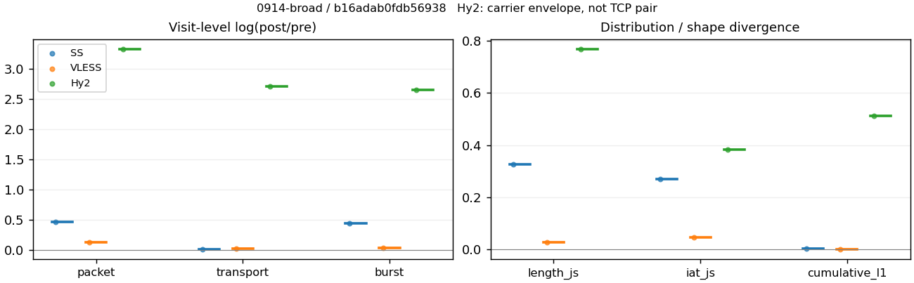
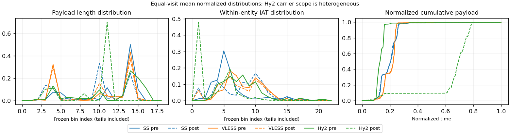

# 0914-broad · 条目 026 · github.com

目标：https://github.com/explore

活动标签：github.com::page_load。选定访问 3 次。

[返回总索引](../../README.md) · [统计口径](../../methods.md)

## 覆盖与资格（每次访问均保留）

| 部署 | 重复 | 主请求路由 | 活动状态 | 代理比较 | DIRECT pre | 请求 proxy/direct/unresolved | 错误 |
| --- | --- | --- | --- | --- | --- | --- | --- |
| Hy2 | 1 | proxy | passed | 1 | 0 | 110/0/0 | [] |
| SS | 1 | proxy | passed | 1 | 0 | 107/0/0 | [] |
| VLESS | 1 | proxy | passed | 1 | 0 | 110/0/0 | [] |

主请求非 proxy 的统计仅解释为已索引的辅助代理连接或 DIRECT 观测，不代表目标业务经代理传输。播放确认与配对资格是两道不同的门。

图中散点为单次访问，短线为重复中位数；Hy2 是共享载体包络，不能与 TCP 配对作等范围因果对比。

形态图先逐访问归一化，再对访问等权平均；实线 pre，虚线 post。分箱序号及边界见 methods，不将分箱索引误解为长度或时间。

## 每次访问的关键观测

### SS

范围：`exclusive_page`。每格 pre → post；空值为不可观测/不适用。

| 重复 | 包数 | 载荷字节 | burst | TCP FR | IAT中位µs | length JS | IAT JS |
| --- | --- | --- | --- | --- | --- | --- | --- |
| 1 | 2843 → 4524 | 3.9237e+06 → 3.9703e+06 | 1959 → 3045 | 94 → 92 | 15.803 → 222.79 | 0.32654 | 0.26861 |

完整标量统计：中位数 [min,max]；Δ 为重复内逐访问变换的中位数，MAD 未缩放。n 为可用变换数；DIRECT-only 的 nΔ=0 不代表 pre 不可用。

| scope | 特征 | pre | post | Δ | IQRΔ | MADΔ | nΔ |
| --- | --- | --- | --- | --- | --- | --- | --- |
| exclusive_page | active_span_sum_s_1000ms | 16.171 [16.171, 16.171] | 17.792 [17.792, 17.792] | 0.095495 | — | — | 1 |
| exclusive_page | active_span_sum_s_100ms | 5.6126 [5.6126, 5.6126] | 8.0824 [8.0824, 8.0824] | 0.36467 | — | — | 1 |
| exclusive_page | active_span_sum_s_500ms | 14.563 [14.563, 14.563] | 16.906 [16.906, 16.906] | 0.14918 | — | — | 1 |
| exclusive_page | burst_bytes_iqr | 2896 [2896, 2896] | 2856 [2856, 2856] | -0.013908 | — | — | 1 |
| exclusive_page | burst_bytes_mad | 39 [39, 39] | 34 [34, 34] | -0.1372 | — | — | 1 |
| exclusive_page | burst_bytes_max | 21728 [21728, 21728] | 15708 [15708, 15708] | -0.32443 | — | — | 1 |
| exclusive_page | burst_bytes_mean | 2002.9 [2002.9, 2002.9] | 1303.9 [1303.9, 1303.9] | -0.42926 | — | — | 1 |
| exclusive_page | burst_bytes_median | 39 [39, 39] | 34 [34, 34] | -0.1372 | — | — | 1 |
| exclusive_page | burst_bytes_min | 0 [0, 0] | 0 [0, 0] | — | — | — | 0 |
| exclusive_page | burst_bytes_p95 | 8688 [8688, 8688] | 5712 [5712, 5712] | -0.41937 | — | — | 1 |
| exclusive_page | burst_bytes_q25 | 0 [0, 0] | 0 [0, 0] | — | — | — | 0 |
| exclusive_page | burst_bytes_q75 | 2896 [2896, 2896] | 2856 [2856, 2856] | -0.013908 | — | — | 1 |
| exclusive_page | burst_bytes_std | 3589.9 [3589.9, 3589.9] | 1989.2 [1989.2, 1989.2] | -0.59042 | — | — | 1 |
| exclusive_page | burst_count | 1959 [1959, 1959] | 3045 [3045, 3045] | 0.44107 | — | — | 1 |
| exclusive_page | burst_duration_ms_iqr | 0 [0, 0] | 0.000298 [0.000298, 0.000298] | — | — | — | 0 |
| exclusive_page | burst_duration_ms_mad | 0 [0, 0] | 0 [0, 0] | — | — | — | 0 |
| exclusive_page | burst_duration_ms_max | 9573.1 [9573.1, 9573.1] | 16975 [16975, 16975] | 0.57279 | — | — | 1 |
| exclusive_page | burst_duration_ms_mean | 20.823 [20.823, 20.823] | 32.699 [32.699, 32.699] | 0.45128 | — | — | 1 |
| exclusive_page | burst_duration_ms_median | 0 [0, 0] | 0 [0, 0] | — | — | — | 0 |
| exclusive_page | burst_duration_ms_min | 0 [0, 0] | 0 [0, 0] | — | — | — | 0 |
| exclusive_page | burst_duration_ms_p95 | 1.6626 [1.6626, 1.6626] | 0.94596 [0.94596, 0.94596] | -0.56396 | — | — | 1 |
| exclusive_page | burst_duration_ms_q25 | 0 [0, 0] | 0 [0, 0] | — | — | — | 0 |
| exclusive_page | burst_duration_ms_q75 | 0 [0, 0] | 0.000298 [0.000298, 0.000298] | — | — | — | 0 |
| exclusive_page | burst_duration_ms_std | 271.74 [271.74, 271.74] | 650.11 [650.11, 650.11] | 0.8723 | — | — | 1 |
| exclusive_page | burst_packets_iqr | 0 [0, 0] | 1 [1, 1] | — | — | — | 0 |
| exclusive_page | burst_packets_mad | 0 [0, 0] | 0 [0, 0] | — | — | — | 0 |
| exclusive_page | burst_packets_max | 12 [12, 12] | 12 [12, 12] | 0 | — | — | 1 |
| exclusive_page | burst_packets_mean | 1.4513 [1.4513, 1.4513] | 1.4857 [1.4857, 1.4857] | 0.02347 | — | — | 1 |
| exclusive_page | burst_packets_median | 1 [1, 1] | 1 [1, 1] | 0 | — | — | 1 |
| exclusive_page | burst_packets_min | 1 [1, 1] | 1 [1, 1] | 0 | — | — | 1 |
| exclusive_page | burst_packets_p95 | 3 [3, 3] | 3 [3, 3] | 0 | — | — | 1 |
| exclusive_page | burst_packets_q25 | 1 [1, 1] | 1 [1, 1] | 0 | — | — | 1 |
| exclusive_page | burst_packets_q75 | 1 [1, 1] | 2 [2, 2] | 0.69315 | — | — | 1 |
| exclusive_page | burst_packets_std | 1.2361 [1.2361, 1.2361] | 0.94419 [0.94419, 0.94419] | -0.26936 | — | — | 1 |
| exclusive_page | connection_span_concurrency_max | 8 [8, 8] | 8 [8, 8] | 0 | — | — | 1 |
| exclusive_page | cumulative_l1 | — | — | 0.0025858 | — | — | 1 |
| exclusive_page | cumulative_max | — | — | 0.082113 | — | — | 1 |
| exclusive_page | direction_entropy | 0.48611 [0.48611, 0.48611] | 0.30913 [0.30913, 0.30913] | -0.17697 | — | — | 1 |
| exclusive_page | down_burst_count | 974 [974, 974] | 1517 [1517, 1517] | 0.44308 | — | — | 1 |
| exclusive_page | down_ip_bytes | 3.9268e+06 [3.9268e+06, 3.9268e+06] | 4.0163e+06 [4.0163e+06, 4.0163e+06] | 0.022549 | — | — | 1 |
| exclusive_page | down_packets | 1745 [1745, 1745] | 2762 [2762, 2762] | 0.4592 | — | — | 1 |
| exclusive_page | down_transport_bytes | 3.8359e+06 [3.8359e+06, 3.8359e+06] | 3.8725e+06 [3.8725e+06, 3.8725e+06] | 0.0094853 | — | — | 1 |
| exclusive_page | duration_s | 22.4 [22.4, 22.4] | 22.399 [22.399, 22.399] | -7.9142e-05 | — | — | 1 |
| exclusive_page | entity_count | 11 [11, 11] | 11 [11, 11] | 0 | — | — | 1 |
| exclusive_page | fr_runs | 94 [94, 94] | 92 [92, 92] | -0.021506 | — | — | 1 |
| exclusive_page | fr_runs_per_packet | 0.053592 [0.053592, 0.053592] | 0.033129 [0.033129, 0.033129] | -0.020463 | — | — | 1 |
| exclusive_page | fr_switches | 83 [83, 83] | 81 [81, 81] | -0.024391 | — | — | 1 |
| exclusive_page | fr_switches_per_possible_transition | 0.047619 [0.047619, 0.047619] | 0.029284 [0.029284, 0.029284] | -0.018335 | — | — | 1 |
| exclusive_page | full_retransmission_fraction | 0.0031657 [0.0031657, 0.0031657] | 0.0017683 [0.0017683, 0.0017683] | -0.0013973 | — | — | 1 |
| exclusive_page | full_retransmission_packets | 9 [9, 9] | 8 [8, 8] | -0.11778 | — | — | 1 |
| exclusive_page | iat_count | 2832 [2832, 2832] | 4513 [4513, 4513] | 0.46598 | — | — | 1 |
| exclusive_page | iat_js | — | — | 0.26861 | — | — | 1 |
| exclusive_page | iat_ks | — | — | 0.44417 | — | — | 1 |
| exclusive_page | iat_median_us | 15.803 [15.803, 15.803] | 222.79 [222.79, 222.79] | 2.646 | — | — | 1 |
| exclusive_page | iat_us_iqr | 37.746 [37.746, 37.746] | 926.2 [926.2, 926.2] | 3.2002 | — | — | 1 |
| exclusive_page | iat_us_mad | 10.886 [10.886, 10.886] | 220.93 [220.93, 220.93] | 3.0103 | — | — | 1 |
| exclusive_page | iat_us_max | 1.5001e+07 [1.5001e+07, 1.5001e+07] | 1.5054e+07 [1.5054e+07, 1.5054e+07] | 0.0035677 | — | — | 1 |
| exclusive_page | iat_us_mean | 53679 [53679, 53679] | 33683 [33683, 33683] | -0.46604 | — | — | 1 |
| exclusive_page | iat_us_median | 15.803 [15.803, 15.803] | 222.79 [222.79, 222.79] | 2.646 | — | — | 1 |
| exclusive_page | iat_us_min | 0.012 [0.012, 0.012] | 0.036 [0.036, 0.036] | 1.0986 | — | — | 1 |
| exclusive_page | iat_us_p95 | 28180 [28180, 28180] | 10767 [10767, 10767] | -0.96215 | — | — | 1 |
| exclusive_page | iat_us_q25 | 9.5433 [9.5433, 9.5433] | 11.55 [11.55, 11.55] | 0.19085 | — | — | 1 |
| exclusive_page | iat_us_q75 | 47.289 [47.289, 47.289] | 937.75 [937.75, 937.75] | 2.9872 | — | — | 1 |
| exclusive_page | iat_us_std | 7.5753e+05 [7.5753e+05, 7.5753e+05] | 5.9864e+05 [5.9864e+05, 5.9864e+05] | -0.23539 | — | — | 1 |
| exclusive_page | iat_wasserstein_log1p_us | — | — | 1.6195 | — | — | 1 |
| exclusive_page | idle_gap_count_1000ms | 20 [20, 20] | 20 [20, 20] | 0 | — | — | 1 |
| exclusive_page | idle_gap_count_100ms | 57 [57, 57] | 61 [61, 61] | 0.067823 | — | — | 1 |
| exclusive_page | idle_gap_count_500ms | 22 [22, 22] | 21 [21, 21] | -0.04652 | — | — | 1 |
| exclusive_page | idle_gap_sum_s_1000ms | 135.85 [135.85, 135.85] | 134.22 [134.22, 134.22] | -0.012064 | — | — | 1 |
| exclusive_page | idle_gap_sum_s_100ms | 146.41 [146.41, 146.41] | 143.93 [143.93, 143.93] | -0.017073 | — | — | 1 |
| exclusive_page | idle_gap_sum_s_500ms | 137.46 [137.46, 137.46] | 135.11 [135.11, 135.11] | -0.017255 | — | — | 1 |
| exclusive_page | ip_bytes | 4.0718e+06 [4.0718e+06, 4.0718e+06] | 4.2422e+06 [4.2422e+06, 4.2422e+06] | 0.040993 | — | — | 1 |
| exclusive_page | length_iqr | 1448 [1448, 1448] | 2748 [2748, 2748] | 0.64069 | — | — | 1 |
| exclusive_page | length_js | — | — | 0.32654 | — | — | 1 |
| exclusive_page | length_ks | — | — | 0.52784 | — | — | 1 |
| exclusive_page | length_mad | 855 [855, 855] | 1330 [1330, 1330] | 0.44183 | — | — | 1 |
| exclusive_page | length_max | 8948 [8948, 8948] | 5784 [5784, 5784] | -0.43633 | — | — | 1 |
| exclusive_page | length_mean | 2237 [2237, 2237] | 1429.7 [1429.7, 1429.7] | -0.44767 | — | — | 1 |
| exclusive_page | length_median | 2896 [2896, 2896] | 1428 [1428, 1428] | -0.70706 | — | — | 1 |
| exclusive_page | length_min | 31 [31, 31] | 15 [15, 15] | -0.72594 | — | — | 1 |
| exclusive_page | length_p95 | 4096 [4096, 4096] | 2856 [2856, 2856] | -0.36059 | — | — | 1 |
| exclusive_page | length_q25 | 1448 [1448, 1448] | 108 [108, 108] | -2.5958 | — | — | 1 |
| exclusive_page | length_q75 | 2896 [2896, 2896] | 2856 [2856, 2856] | -0.013908 | — | — | 1 |
| exclusive_page | length_std | 1319.8 [1319.8, 1319.8] | 1108.7 [1108.7, 1108.7] | -0.17432 | — | — | 1 |
| exclusive_page | length_wasserstein_bytes | — | — | 807.3 | — | — | 1 |
| exclusive_page | nonempty_entity_count | 11 [11, 11] | 11 [11, 11] | 0 | — | — | 1 |
| exclusive_page | nonempty_packets | 1754 [1754, 1754] | 2777 [2777, 2777] | 0.45947 | — | — | 1 |
| exclusive_page | offload_suspect_fraction | 0.40098 [0.40098, 0.40098] | 0.20292 [0.20292, 0.20292] | -0.19807 | — | — | 1 |
| exclusive_page | packet_count | 2843 [2843, 2843] | 4524 [4524, 4524] | 0.46454 | — | — | 1 |
| exclusive_page | rtt_median_ms | 0.018504 [0.018504, 0.018504] | 32.81 [32.81, 32.81] | 7.4805 | — | — | 1 |
| exclusive_page | rtt_sample_count | 1056 [1056, 1056] | 474 [474, 474] | -0.80104 | — | — | 1 |
| exclusive_page | tcp_ack_count | 2832 [2832, 2832] | 4511 [4511, 4511] | 0.46554 | — | — | 1 |
| exclusive_page | tcp_fin_count | 22 [22, 22] | 22 [22, 22] | 0 | — | — | 1 |
| exclusive_page | tcp_packet_count | 2843 [2843, 2843] | 4524 [4524, 4524] | 0.46454 | — | — | 1 |
| exclusive_page | tcp_rst_count | 0 [0, 0] | 0 [0, 0] | — | — | — | 0 |
| exclusive_page | tcp_syn_count | 22 [22, 22] | 24 [24, 24] | 0.087011 | — | — | 1 |
| exclusive_page | tcp_window_raw_median | 65535 [65535, 65535] | 140 [140, 140] | -6.1487 | — | — | 1 |
| exclusive_page | transition_entropy | 0.23025 [0.23025, 0.23025] | 0.14727 [0.14727, 0.14727] | -0.082978 | — | — | 1 |
| exclusive_page | transition_n_mm | 1523 [1523, 1523] | 2578 [2578, 2578] | 0.52633 | — | — | 1 |
| exclusive_page | transition_n_mp | 37 [37, 37] | 36 [36, 36] | -0.027399 | — | — | 1 |
| exclusive_page | transition_n_pm | 46 [46, 46] | 45 [45, 45] | -0.021979 | — | — | 1 |
| exclusive_page | transition_n_pp | 137 [137, 137] | 107 [107, 107] | -0.24715 | — | — | 1 |
| exclusive_page | transition_p_mm | 0.97628 [0.97628, 0.97628] | 0.98623 [0.98623, 0.98623] | 0.009946 | — | — | 1 |
| exclusive_page | transition_p_mp | 0.023718 [0.023718, 0.023718] | 0.013772 [0.013772, 0.013772] | -0.009946 | — | — | 1 |
| exclusive_page | transition_p_pm | 0.25137 [0.25137, 0.25137] | 0.29605 [0.29605, 0.29605] | 0.044687 | — | — | 1 |
| exclusive_page | transition_p_pp | 0.74863 [0.74863, 0.74863] | 0.70395 [0.70395, 0.70395] | -0.044687 | — | — | 1 |
| exclusive_page | transport_bytes | 3.9237e+06 [3.9237e+06, 3.9237e+06] | 3.9703e+06 [3.9703e+06, 3.9703e+06] | 0.011806 | — | — | 1 |
| exclusive_page | up_burst_count | 985 [985, 985] | 1528 [1528, 1528] | 0.43907 | — | — | 1 |
| exclusive_page | up_byte_fraction | 0.022372 [0.022372, 0.022372] | 0.024638 [0.024638, 0.024638] | 0.0022659 | — | — | 1 |
| exclusive_page | up_ip_bytes | 1.4507e+05 [1.4507e+05, 1.4507e+05] | 2.2591e+05 [2.2591e+05, 2.2591e+05] | 0.44289 | — | — | 1 |
| exclusive_page | up_packets | 1098 [1098, 1098] | 1762 [1762, 1762] | 0.47296 | — | — | 1 |
| exclusive_page | up_transport_bytes | 87782 [87782, 87782] | 97821 [97821, 97821] | 0.10828 | — | — | 1 |
| exclusive_page | zero_iat_count | 0 [0, 0] | 0 [0, 0] | — | — | — | 0 |
| exclusive_page | zero_iat_fraction | 0 [0, 0] | 0 [0, 0] | 0 | — | — | 1 |

### VLESS

范围：`exclusive_page`。每格 pre → post；空值为不可观测/不适用。

| 重复 | 包数 | 载荷字节 | burst | TCP FR | IAT中位µs | length JS | IAT JS |
| --- | --- | --- | --- | --- | --- | --- | --- |
| 1 | 4125 → 4673 | 3.8863e+06 → 3.9668e+06 | 3438 → 3556 | 78 → 100 | 124.7 → 87.282 | 0.02632 | 0.046216 |

完整标量统计：中位数 [min,max]；Δ 为重复内逐访问变换的中位数，MAD 未缩放。n 为可用变换数；DIRECT-only 的 nΔ=0 不代表 pre 不可用。

| scope | 特征 | pre | post | Δ | IQRΔ | MADΔ | nΔ |
| --- | --- | --- | --- | --- | --- | --- | --- |
| exclusive_page | active_span_sum_s_1000ms | 16.17 [16.17, 16.17] | 17.114 [17.114, 17.114] | 0.05676 | — | — | 1 |
| exclusive_page | active_span_sum_s_100ms | 4.21 [4.21, 4.21] | 7.6283 [7.6283, 7.6283] | 0.59439 | — | — | 1 |
| exclusive_page | active_span_sum_s_500ms | 9.6583 [9.6583, 9.6583] | 16.142 [16.142, 16.142] | 0.51361 | — | — | 1 |
| exclusive_page | burst_bytes_iqr | 2824 [2824, 2824] | 2824 [2824, 2824] | 0 | — | — | 1 |
| exclusive_page | burst_bytes_mad | 24 [24, 24] | 50.5 [50.5, 50.5] | 0.74392 | — | — | 1 |
| exclusive_page | burst_bytes_max | 20480 [20480, 20480] | 14552 [14552, 14552] | -0.34172 | — | — | 1 |
| exclusive_page | burst_bytes_mean | 1130.4 [1130.4, 1130.4] | 1115.5 [1115.5, 1115.5] | -0.013239 | — | — | 1 |
| exclusive_page | burst_bytes_median | 24 [24, 24] | 50.5 [50.5, 50.5] | 0.74392 | — | — | 1 |
| exclusive_page | burst_bytes_min | 0 [0, 0] | 0 [0, 0] | — | — | — | 0 |
| exclusive_page | burst_bytes_p95 | 2968 [2968, 2968] | 2896 [2896, 2896] | -0.024558 | — | — | 1 |
| exclusive_page | burst_bytes_q25 | 0 [0, 0] | 0 [0, 0] | — | — | — | 0 |
| exclusive_page | burst_bytes_q75 | 2824 [2824, 2824] | 2824 [2824, 2824] | 0 | — | — | 1 |
| exclusive_page | burst_bytes_std | 1857.6 [1857.6, 1857.6] | 1422.3 [1422.3, 1422.3] | -0.26705 | — | — | 1 |
| exclusive_page | burst_count | 3438 [3438, 3438] | 3556 [3556, 3556] | 0.033746 | — | — | 1 |
| exclusive_page | burst_duration_ms_iqr | 0 [0, 0] | 0 [0, 0] | — | — | — | 0 |
| exclusive_page | burst_duration_ms_mad | 0 [0, 0] | 0 [0, 0] | — | — | — | 0 |
| exclusive_page | burst_duration_ms_max | 10410 [10410, 10410] | 15039 [15039, 15039] | 0.36786 | — | — | 1 |
| exclusive_page | burst_duration_ms_mean | 10.999 [10.999, 10.999] | 20.235 [20.235, 20.235] | 0.60961 | — | — | 1 |
| exclusive_page | burst_duration_ms_median | 0 [0, 0] | 0 [0, 0] | — | — | — | 0 |
| exclusive_page | burst_duration_ms_min | 0 [0, 0] | 0 [0, 0] | — | — | — | 0 |
| exclusive_page | burst_duration_ms_p95 | 1.954 [1.954, 1.954] | 3.8936 [3.8936, 3.8936] | 0.68944 | — | — | 1 |
| exclusive_page | burst_duration_ms_q25 | 0 [0, 0] | 0 [0, 0] | — | — | — | 0 |
| exclusive_page | burst_duration_ms_q75 | 0 [0, 0] | 0 [0, 0] | — | — | — | 0 |
| exclusive_page | burst_duration_ms_std | 208.4 [208.4, 208.4] | 475.17 [475.17, 475.17] | 0.82421 | — | — | 1 |
| exclusive_page | burst_packets_iqr | 0 [0, 0] | 0 [0, 0] | — | — | — | 0 |
| exclusive_page | burst_packets_mad | 0 [0, 0] | 0 [0, 0] | — | — | — | 0 |
| exclusive_page | burst_packets_max | 16 [16, 16] | 11 [11, 11] | -0.37469 | — | — | 1 |
| exclusive_page | burst_packets_mean | 1.1998 [1.1998, 1.1998] | 1.3141 [1.3141, 1.3141] | 0.090989 | — | — | 1 |
| exclusive_page | burst_packets_median | 1 [1, 1] | 1 [1, 1] | 0 | — | — | 1 |
| exclusive_page | burst_packets_min | 1 [1, 1] | 1 [1, 1] | 0 | — | — | 1 |
| exclusive_page | burst_packets_p95 | 2 [2, 2] | 2 [2, 2] | 0 | — | — | 1 |
| exclusive_page | burst_packets_q25 | 1 [1, 1] | 1 [1, 1] | 0 | — | — | 1 |
| exclusive_page | burst_packets_q75 | 1 [1, 1] | 1 [1, 1] | 0 | — | — | 1 |
| exclusive_page | burst_packets_std | 0.62004 [0.62004, 0.62004] | 0.70951 [0.70951, 0.70951] | 0.1348 | — | — | 1 |
| exclusive_page | connection_span_concurrency_max | 6 [6, 6] | 6 [6, 6] | 0 | — | — | 1 |
| exclusive_page | cumulative_l1 | — | — | 0.001817 | — | — | 1 |
| exclusive_page | cumulative_max | — | — | 0.017907 | — | — | 1 |
| exclusive_page | direction_entropy | 0.3394 [0.3394, 0.3394] | 0.25846 [0.25846, 0.25846] | -0.080932 | — | — | 1 |
| exclusive_page | down_burst_count | 1714 [1714, 1714] | 1773 [1773, 1773] | 0.033843 | — | — | 1 |
| exclusive_page | down_ip_bytes | 3.9545e+06 [3.9545e+06, 3.9545e+06] | 4.0328e+06 [4.0328e+06, 4.0328e+06] | 0.019611 | — | — | 1 |
| exclusive_page | down_packets | 2324 [2324, 2324] | 2641 [2641, 2641] | 0.12787 | — | — | 1 |
| exclusive_page | down_transport_bytes | 3.8335e+06 [3.8335e+06, 3.8335e+06] | 3.8954e+06 [3.8954e+06, 3.8954e+06] | 0.016001 | — | — | 1 |
| exclusive_page | duration_s | 22.519 [22.519, 22.519] | 22.497 [22.497, 22.497] | -0.00096814 | — | — | 1 |
| exclusive_page | entity_count | 10 [10, 10] | 10 [10, 10] | 0 | — | — | 1 |
| exclusive_page | fr_runs | 78 [78, 78] | 100 [100, 100] | 0.24846 | — | — | 1 |
| exclusive_page | fr_runs_per_packet | 0.033679 [0.033679, 0.033679] | 0.038226 [0.038226, 0.038226] | 0.0045475 | — | — | 1 |
| exclusive_page | fr_switches | 68 [68, 68] | 90 [90, 90] | 0.2803 | — | — | 1 |
| exclusive_page | fr_switches_per_possible_transition | 0.029488 [0.029488, 0.029488] | 0.034536 [0.034536, 0.034536] | 0.0050474 | — | — | 1 |
| exclusive_page | full_retransmission_fraction | 0.0012121 [0.0012121, 0.0012121] | 0 [0, 0] | -0.0012121 | — | — | 1 |
| exclusive_page | full_retransmission_packets | 5 [5, 5] | 0 [0, 0] | — | — | — | 0 |
| exclusive_page | iat_count | 4115 [4115, 4115] | 4663 [4663, 4663] | 0.12502 | — | — | 1 |
| exclusive_page | iat_js | — | — | 0.046216 | — | — | 1 |
| exclusive_page | iat_ks | — | — | 0.14512 | — | — | 1 |
| exclusive_page | iat_median_us | 124.7 [124.7, 124.7] | 87.282 [87.282, 87.282] | -0.35677 | — | — | 1 |
| exclusive_page | iat_us_iqr | 867.48 [867.48, 867.48] | 872.72 [872.72, 872.72] | 0.0060212 | — | — | 1 |
| exclusive_page | iat_us_mad | 114.94 [114.94, 114.94] | 81.937 [81.937, 81.937] | -0.33848 | — | — | 1 |
| exclusive_page | iat_us_max | 1.5001e+07 [1.5001e+07, 1.5001e+07] | 1.5039e+07 [1.5039e+07, 1.5039e+07] | 0.0025162 | — | — | 1 |
| exclusive_page | iat_us_mean | 28128 [28128, 28128] | 24745 [24745, 24745] | -0.12816 | — | — | 1 |
| exclusive_page | iat_us_median | 124.7 [124.7, 124.7] | 87.282 [87.282, 87.282] | -0.35677 | — | — | 1 |
| exclusive_page | iat_us_min | 0.036 [0.036, 0.036] | 0.036 [0.036, 0.036] | 0 | — | — | 1 |
| exclusive_page | iat_us_p95 | 6834.5 [6834.5, 6834.5] | 8814.3 [8814.3, 8814.3] | 0.25439 | — | — | 1 |
| exclusive_page | iat_us_q25 | 35.019 [35.019, 35.019] | 17.325 [17.325, 17.325] | -0.70377 | — | — | 1 |
| exclusive_page | iat_us_q75 | 902.5 [902.5, 902.5] | 890.04 [890.04, 890.04] | -0.013897 | — | — | 1 |
| exclusive_page | iat_us_std | 5.5404e+05 [5.5404e+05, 5.5404e+05] | 5.1942e+05 [5.1942e+05, 5.1942e+05] | -0.064522 | — | — | 1 |
| exclusive_page | iat_wasserstein_log1p_us | — | — | 0.48886 | — | — | 1 |
| exclusive_page | idle_gap_count_1000ms | 13 [13, 13] | 12 [12, 12] | -0.080043 | — | — | 1 |
| exclusive_page | idle_gap_count_100ms | 49 [49, 49] | 57 [57, 57] | 0.15123 | — | — | 1 |
| exclusive_page | idle_gap_count_500ms | 23 [23, 23] | 13 [13, 13] | -0.57054 | — | — | 1 |
| exclusive_page | idle_gap_sum_s_1000ms | 99.577 [99.577, 99.577] | 98.27 [98.27, 98.27] | -0.013214 | — | — | 1 |
| exclusive_page | idle_gap_sum_s_100ms | 111.54 [111.54, 111.54] | 107.76 [107.76, 107.76] | -0.034487 | — | — | 1 |
| exclusive_page | idle_gap_sum_s_500ms | 106.09 [106.09, 106.09] | 99.243 [99.243, 99.243] | -0.066711 | — | — | 1 |
| exclusive_page | ip_bytes | 4.1008e+06 [4.1008e+06, 4.1008e+06] | 4.212e+06 [4.212e+06, 4.212e+06] | 0.026758 | — | — | 1 |
| exclusive_page | length_iqr | 2752 [2752, 2752] | 2752 [2752, 2752] | 0 | — | — | 1 |
| exclusive_page | length_js | — | — | 0.02632 | — | — | 1 |
| exclusive_page | length_ks | — | — | 0.10076 | — | — | 1 |
| exclusive_page | length_mad | 1376 [1376, 1376] | 1340 [1340, 1340] | -0.026511 | — | — | 1 |
| exclusive_page | length_max | 8948 [8948, 8948] | 6780 [6780, 6780] | -0.27745 | — | — | 1 |
| exclusive_page | length_mean | 1678 [1678, 1678] | 1516.4 [1516.4, 1516.4] | -0.1013 | — | — | 1 |
| exclusive_page | length_median | 1484 [1484, 1484] | 1412 [1412, 1412] | -0.049734 | — | — | 1 |
| exclusive_page | length_min | 24 [24, 24] | 24 [24, 24] | 0 | — | — | 1 |
| exclusive_page | length_p95 | 2896 [2896, 2896] | 2896 [2896, 2896] | 0 | — | — | 1 |
| exclusive_page | length_q25 | 72 [72, 72] | 72 [72, 72] | 0 | — | — | 1 |
| exclusive_page | length_q75 | 2824 [2824, 2824] | 2824 [2824, 2824] | 0 | — | — | 1 |
| exclusive_page | length_std | 1387 [1387, 1387] | 1197.9 [1197.9, 1197.9] | -0.14658 | — | — | 1 |
| exclusive_page | length_wasserstein_bytes | — | — | 181.66 | — | — | 1 |
| exclusive_page | nonempty_entity_count | 10 [10, 10] | 10 [10, 10] | 0 | — | — | 1 |
| exclusive_page | nonempty_packets | 2316 [2316, 2316] | 2616 [2616, 2616] | 0.1218 | — | — | 1 |
| exclusive_page | offload_suspect_fraction | 0.29867 [0.29867, 0.29867] | 0.2416 [0.2416, 0.2416] | -0.057066 | — | — | 1 |
| exclusive_page | packet_count | 4125 [4125, 4125] | 4673 [4673, 4673] | 0.12474 | — | — | 1 |
| exclusive_page | rtt_median_ms | 0.056469 [0.056469, 0.056469] | 0.047225 [0.047225, 0.047225] | -0.17877 | — | — | 1 |
| exclusive_page | rtt_sample_count | 1759 [1759, 1759] | 1959 [1959, 1959] | 0.10769 | — | — | 1 |
| exclusive_page | tcp_ack_count | 4095 [4095, 4095] | 4663 [4663, 4663] | 0.12989 | — | — | 1 |
| exclusive_page | tcp_fin_count | 20 [20, 20] | 20 [20, 20] | 0 | — | — | 1 |
| exclusive_page | tcp_packet_count | 4125 [4125, 4125] | 4673 [4673, 4673] | 0.12474 | — | — | 1 |
| exclusive_page | tcp_rst_count | 20 [20, 20] | 0 [0, 0] | — | — | — | 0 |
| exclusive_page | tcp_syn_count | 20 [20, 20] | 20 [20, 20] | 0 | — | — | 1 |
| exclusive_page | tcp_window_raw_median | 65535 [65535, 65535] | 161 [161, 161] | -6.0089 | — | — | 1 |
| exclusive_page | transition_entropy | 0.14924 [0.14924, 0.14924] | 0.15673 [0.15673, 0.15673] | 0.007492 | — | — | 1 |
| exclusive_page | transition_n_mm | 2131 [2131, 2131] | 2452 [2452, 2452] | 0.14031 | — | — | 1 |
| exclusive_page | transition_n_mp | 29 [29, 29] | 40 [40, 40] | 0.32158 | — | — | 1 |
| exclusive_page | transition_n_pm | 39 [39, 39] | 50 [50, 50] | 0.24846 | — | — | 1 |
| exclusive_page | transition_n_pp | 107 [107, 107] | 64 [64, 64] | -0.51395 | — | — | 1 |
| exclusive_page | transition_p_mm | 0.98657 [0.98657, 0.98657] | 0.98395 [0.98395, 0.98395] | -0.0026254 | — | — | 1 |
| exclusive_page | transition_p_mp | 0.013426 [0.013426, 0.013426] | 0.016051 [0.016051, 0.016051] | 0.0026254 | — | — | 1 |
| exclusive_page | transition_p_pm | 0.26712 [0.26712, 0.26712] | 0.4386 [0.4386, 0.4386] | 0.17147 | — | — | 1 |
| exclusive_page | transition_p_pp | 0.73288 [0.73288, 0.73288] | 0.5614 [0.5614, 0.5614] | -0.17147 | — | — | 1 |
| exclusive_page | transport_bytes | 3.8863e+06 [3.8863e+06, 3.8863e+06] | 3.9668e+06 [3.9668e+06, 3.9668e+06] | 0.020508 | — | — | 1 |
| exclusive_page | up_burst_count | 1724 [1724, 1724] | 1783 [1783, 1783] | 0.03365 | — | — | 1 |
| exclusive_page | up_byte_fraction | 0.013585 [0.013585, 0.013585] | 0.01802 [0.01802, 0.01802] | 0.0044353 | — | — | 1 |
| exclusive_page | up_ip_bytes | 1.4635e+05 [1.4635e+05, 1.4635e+05] | 1.7924e+05 [1.7924e+05, 1.7924e+05] | 0.20274 | — | — | 1 |
| exclusive_page | up_packets | 1801 [1801, 1801] | 2032 [2032, 2032] | 0.12068 | — | — | 1 |
| exclusive_page | up_transport_bytes | 52795 [52795, 52795] | 71483 [71483, 71483] | 0.30304 | — | — | 1 |
| exclusive_page | zero_iat_count | 0 [0, 0] | 0 [0, 0] | — | — | — | 0 |
| exclusive_page | zero_iat_fraction | 0 [0, 0] | 0 [0, 0] | 0 | — | — | 1 |

### Hy2

范围：`carrier_context_envelope`。每格 pre → post；空值为不可观测/不适用。

| 重复 | 包数 | 载荷字节 | burst | TCP FR | IAT中位µs | length JS | IAT JS |
| --- | --- | --- | --- | --- | --- | --- | --- |
| 1 | 1629 → 45082 | 3.2718e+06 → 4.9152e+07 | 1042 → 14693 | — | 96.057 → 3.198 | 0.76665 | 0.38152 |

完整标量统计：中位数 [min,max]；Δ 为重复内逐访问变换的中位数，MAD 未缩放。n 为可用变换数；DIRECT-only 的 nΔ=0 不代表 pre 不可用。

| scope | 特征 | pre | post | Δ | IQRΔ | MADΔ | nΔ |
| --- | --- | --- | --- | --- | --- | --- | --- |
| carrier_context_envelope | active_span_sum_s_1000ms | 9.0601 [9.0601, 9.0601] | 10.48 [10.48, 10.48] | 0.14558 | — | — | 1 |
| carrier_context_envelope | active_span_sum_s_100ms | 1.6354 [1.6354, 1.6354] | 7.2299 [7.2299, 7.2299] | 1.4864 | — | — | 1 |
| carrier_context_envelope | active_span_sum_s_500ms | 9.0601 [9.0601, 9.0601] | 10.48 [10.48, 10.48] | 0.14558 | — | — | 1 |
| carrier_context_envelope | burst_bytes_iqr | 4245 [4245, 4245] | 5094 [5094, 5094] | 0.18232 | — | — | 1 |
| carrier_context_envelope | burst_bytes_mad | 31 [31, 31] | 283 [283, 283] | 2.2115 | — | — | 1 |
| carrier_context_envelope | burst_bytes_max | 27724 [27724, 27724] | 2.3143e+05 [2.3143e+05, 2.3143e+05] | 2.122 | — | — | 1 |
| carrier_context_envelope | burst_bytes_mean | 3140 [3140, 3140] | 3345.3 [3345.3, 3345.3] | 0.063343 | — | — | 1 |
| carrier_context_envelope | burst_bytes_median | 31 [31, 31] | 316 [316, 316] | 2.3218 | — | — | 1 |
| carrier_context_envelope | burst_bytes_min | 0 [0, 0] | 22 [22, 22] | — | — | — | 0 |
| carrier_context_envelope | burst_bytes_p95 | 14969 [14969, 14969] | 11528 [11528, 11528] | -0.2612 | — | — | 1 |
| carrier_context_envelope | burst_bytes_q25 | 0 [0, 0] | 74 [74, 74] | — | — | — | 0 |
| carrier_context_envelope | burst_bytes_q75 | 4245 [4245, 4245] | 5168 [5168, 5168] | 0.19674 | — | — | 1 |
| carrier_context_envelope | burst_bytes_std | 5436.6 [5436.6, 5436.6] | 7034.4 [7034.4, 7034.4] | 0.25765 | — | — | 1 |
| carrier_context_envelope | burst_count | 1042 [1042, 1042] | 14693 [14693, 14693] | 2.6462 | — | — | 1 |
| carrier_context_envelope | burst_duration_ms_iqr | 0.07154 [0.07154, 0.07154] | 0.025012 [0.025012, 0.025012] | -1.0509 | — | — | 1 |
| carrier_context_envelope | burst_duration_ms_mad | 0 [0, 0] | 4.6e-05 [4.6e-05, 4.6e-05] | — | — | — | 0 |
| carrier_context_envelope | burst_duration_ms_max | 15000 [15000, 15000] | 184.29 [184.29, 184.29] | -4.3993 | — | — | 1 |
| carrier_context_envelope | burst_duration_ms_mean | 61.563 [61.563, 61.563] | 0.23619 [0.23619, 0.23619] | -5.5632 | — | — | 1 |
| carrier_context_envelope | burst_duration_ms_median | 0 [0, 0] | 4.6e-05 [4.6e-05, 4.6e-05] | — | — | — | 0 |
| carrier_context_envelope | burst_duration_ms_min | 0 [0, 0] | 0 [0, 0] | — | — | — | 0 |
| carrier_context_envelope | burst_duration_ms_p95 | 17.881 [17.881, 17.881] | 0.1313 [0.1313, 0.1313] | -4.914 | — | — | 1 |
| carrier_context_envelope | burst_duration_ms_q25 | 0 [0, 0] | 0 [0, 0] | — | — | — | 0 |
| carrier_context_envelope | burst_duration_ms_q75 | 0.07154 [0.07154, 0.07154] | 0.025012 [0.025012, 0.025012] | -1.0509 | — | — | 1 |
| carrier_context_envelope | burst_duration_ms_std | 749.68 [749.68, 749.68] | 4.2232 [4.2232, 4.2232] | -5.1791 | — | — | 1 |
| carrier_context_envelope | burst_packets_iqr | 1 [1, 1] | 3 [3, 3] | 1.0986 | — | — | 1 |
| carrier_context_envelope | burst_packets_mad | 0 [0, 0] | 1 [1, 1] | — | — | — | 0 |
| carrier_context_envelope | burst_packets_max | 12 [12, 12] | 167 [167, 167] | 2.6331 | — | — | 1 |
| carrier_context_envelope | burst_packets_mean | 1.5633 [1.5633, 1.5633] | 3.0683 [3.0683, 3.0683] | 0.67429 | — | — | 1 |
| carrier_context_envelope | burst_packets_median | 1 [1, 1] | 2 [2, 2] | 0.69315 | — | — | 1 |
| carrier_context_envelope | burst_packets_min | 1 [1, 1] | 1 [1, 1] | 0 | — | — | 1 |
| carrier_context_envelope | burst_packets_p95 | 3 [3, 3] | 8 [8, 8] | 0.98083 | — | — | 1 |
| carrier_context_envelope | burst_packets_q25 | 1 [1, 1] | 1 [1, 1] | 0 | — | — | 1 |
| carrier_context_envelope | burst_packets_q75 | 2 [2, 2] | 4 [4, 4] | 0.69315 | — | — | 1 |
| carrier_context_envelope | burst_packets_std | 1.1137 [1.1137, 1.1137] | 4.8989 [4.8989, 4.8989] | 1.4814 | — | — | 1 |
| carrier_context_envelope | connection_span_concurrency_max | 11 [11, 11] | 1 [1, 1] | -2.3979 | — | — | 1 |
| carrier_context_envelope | cumulative_l1 | — | — | 0.51154 | — | — | 1 |
| carrier_context_envelope | cumulative_max | — | — | 0.90289 | — | — | 1 |
| carrier_context_envelope | direction_entropy | 0.6905 [0.6905, 0.6905] | 0.75124 [0.75124, 0.75124] | 0.060739 | — | — | 1 |
| carrier_context_envelope | direction_run_analog_runs | 97 [97, 97] | 14693 [14693, 14693] | 5.0204 | — | — | 1 |
| carrier_context_envelope | direction_run_analog_runs_per_packet | 0.096903 [0.096903, 0.096903] | 0.32592 [0.32592, 0.32592] | 0.22901 | — | — | 1 |
| carrier_context_envelope | direction_run_analog_switches | 85 [85, 85] | 14692 [14692, 14692] | 5.1524 | — | — | 1 |
| carrier_context_envelope | direction_run_analog_switches_per_possible_transition | 0.085945 [0.085945, 0.085945] | 0.3259 [0.3259, 0.3259] | 0.23996 | — | — | 1 |
| carrier_context_envelope | down_burst_count | 515 [515, 515] | 7346 [7346, 7346] | 2.6577 | — | — | 1 |
| carrier_context_envelope | down_ip_bytes | 3.2438e+06 [3.2438e+06, 3.2438e+06] | 4.9337e+07 [4.9337e+07, 4.9337e+07] | 2.7219 | — | — | 1 |
| carrier_context_envelope | down_packets | 1003 [1003, 1003] | 35382 [35382, 35382] | 3.5632 | — | — | 1 |
| carrier_context_envelope | down_transport_bytes | 3.1915e+06 [3.1915e+06, 3.1915e+06] | 4.8346e+07 [4.8346e+07, 4.8346e+07] | 2.7179 | — | — | 1 |
| carrier_context_envelope | duration_s | 19.066 [19.066, 19.066] | 19.065 [19.065, 19.065] | -4.0252e-05 | — | — | 1 |
| carrier_context_envelope | entity_count | 12 [12, 12] | 1 [1, 1] | -2.4849 | — | — | 1 |
| carrier_context_envelope | full_retransmission_fraction | 0.0067526 [0.0067526, 0.0067526] | — | — | — | — | 0 |
| carrier_context_envelope | full_retransmission_packets | 11 [11, 11] | — | — | — | — | 0 |
| carrier_context_envelope | iat_count | 1617 [1617, 1617] | 45081 [45081, 45081] | 3.3279 | — | — | 1 |
| carrier_context_envelope | iat_js | — | — | 0.38152 | — | — | 1 |
| carrier_context_envelope | iat_ks | — | — | 0.51209 | — | — | 1 |
| carrier_context_envelope | iat_median_us | 96.057 [96.057, 96.057] | 3.198 [3.198, 3.198] | -3.4024 | — | — | 1 |
| carrier_context_envelope | iat_us_iqr | 453.89 [453.89, 453.89] | 25.292 [25.292, 25.292] | -2.8874 | — | — | 1 |
| carrier_context_envelope | iat_us_mad | 84.883 [84.883, 84.883] | 3.162 [3.162, 3.162] | -3.2901 | — | — | 1 |
| carrier_context_envelope | iat_us_max | 1.5001e+07 [1.5001e+07, 1.5001e+07] | 3.6438e+06 [3.6438e+06, 3.6438e+06] | -1.4151 | — | — | 1 |
| carrier_context_envelope | iat_us_mean | 1.1463e+05 [1.1463e+05, 1.1463e+05] | 422.91 [422.91, 422.91] | -5.6023 | — | — | 1 |
| carrier_context_envelope | iat_us_median | 96.057 [96.057, 96.057] | 3.198 [3.198, 3.198] | -3.4024 | — | — | 1 |
| carrier_context_envelope | iat_us_min | 0.235 [0.235, 0.235] | 0 [0, 0] | — | — | — | 0 |
| carrier_context_envelope | iat_us_p95 | 18402 [18402, 18402] | 162.9 [162.9, 162.9] | -4.7271 | — | — | 1 |
| carrier_context_envelope | iat_us_q25 | 20.796 [20.796, 20.796] | 0.049 [0.049, 0.049] | -6.0507 | — | — | 1 |
| carrier_context_envelope | iat_us_q75 | 474.68 [474.68, 474.68] | 25.341 [25.341, 25.341] | -2.9302 | — | — | 1 |
| carrier_context_envelope | iat_us_std | 1.193e+06 [1.193e+06, 1.193e+06] | 22163 [22163, 22163] | -3.9859 | — | — | 1 |
| carrier_context_envelope | iat_wasserstein_log1p_us | — | — | 3.0618 | — | — | 1 |
| carrier_context_envelope | idle_gap_count_1000ms | 21 [21, 21] | 4 [4, 4] | -1.6582 | — | — | 1 |
| carrier_context_envelope | idle_gap_count_100ms | 58 [58, 58] | 27 [27, 27] | -0.76461 | — | — | 1 |
| carrier_context_envelope | idle_gap_count_500ms | 21 [21, 21] | 4 [4, 4] | -1.6582 | — | — | 1 |
| carrier_context_envelope | idle_gap_sum_s_1000ms | 176.29 [176.29, 176.29] | 8.5854 [8.5854, 8.5854] | -3.0221 | — | — | 1 |
| carrier_context_envelope | idle_gap_sum_s_100ms | 183.72 [183.72, 183.72] | 11.835 [11.835, 11.835] | -2.7423 | — | — | 1 |
| carrier_context_envelope | idle_gap_sum_s_500ms | 176.29 [176.29, 176.29] | 8.5854 [8.5854, 8.5854] | -3.0221 | — | — | 1 |
| carrier_context_envelope | ip_bytes | 3.3569e+06 [3.3569e+06, 3.3569e+06] | 5.0415e+07 [5.0415e+07, 5.0415e+07] | 2.7093 | — | — | 1 |
| carrier_context_envelope | length_iqr | 4037 [4037, 4037] | 596 [596, 596] | -1.913 | — | — | 1 |
| carrier_context_envelope | length_js | — | — | 0.76665 | — | — | 1 |
| carrier_context_envelope | length_ks | — | — | 0.63237 | — | — | 1 |
| carrier_context_envelope | length_mad | 2091 [2091, 2091] | 0 [0, 0] | — | — | — | 0 |
| carrier_context_envelope | length_max | 8948 [8948, 8948] | 1441 [1441, 1441] | -1.8261 | — | — | 1 |
| carrier_context_envelope | length_mean | 3268.6 [3268.6, 3268.6] | 1090.3 [1090.3, 1090.3] | -1.0979 | — | — | 1 |
| carrier_context_envelope | length_median | 2830 [2830, 2830] | 1441 [1441, 1441] | -0.67494 | — | — | 1 |
| carrier_context_envelope | length_min | 14 [14, 14] | 22 [22, 22] | 0.45199 | — | — | 1 |
| carrier_context_envelope | length_p95 | 8920 [8920, 8920] | 1441 [1441, 1441] | -1.823 | — | — | 1 |
| carrier_context_envelope | length_q25 | 1027 [1027, 1027] | 845 [845, 845] | -0.19506 | — | — | 1 |
| carrier_context_envelope | length_q75 | 5064 [5064, 5064] | 1441 [1441, 1441] | -1.2568 | — | — | 1 |
| carrier_context_envelope | length_std | 2847.1 [2847.1, 2847.1] | 572.53 [572.53, 572.53] | -1.604 | — | — | 1 |
| carrier_context_envelope | length_wasserstein_bytes | — | — | 2182.8 | — | — | 1 |
| carrier_context_envelope | nonempty_entity_count | 12 [12, 12] | 1 [1, 1] | -2.4849 | — | — | 1 |
| carrier_context_envelope | nonempty_packets | 1001 [1001, 1001] | 45082 [45082, 45082] | 3.8075 | — | — | 1 |
| carrier_context_envelope | offload_suspect_fraction | 0.38797 [0.38797, 0.38797] | 0 [0, 0] | -0.38797 | — | — | 1 |
| carrier_context_envelope | packet_count | 1629 [1629, 1629] | 45082 [45082, 45082] | 3.3205 | — | — | 1 |
| carrier_context_envelope | rtt_median_ms | 0.0942 [0.0942, 0.0942] | — | — | — | — | 0 |
| carrier_context_envelope | rtt_sample_count | 589 [589, 589] | 0 [0, 0] | — | — | — | 0 |
| carrier_context_envelope | tcp_ack_count | 1617 [1617, 1617] | — | — | — | — | 0 |
| carrier_context_envelope | tcp_fin_count | 24 [24, 24] | — | — | — | — | 0 |
| carrier_context_envelope | tcp_packet_count | 1629 [1629, 1629] | 0 [0, 0] | — | — | — | 0 |
| carrier_context_envelope | tcp_rst_count | 0 [0, 0] | — | — | — | — | 0 |
| carrier_context_envelope | tcp_syn_count | 24 [24, 24] | — | — | — | — | 0 |
| carrier_context_envelope | tcp_window_raw_median | 65535 [65535, 65535] | — | — | — | — | 0 |
| carrier_context_envelope | transition_entropy | 0.37514 [0.37514, 0.37514] | 0.75034 [0.75034, 0.75034] | 0.3752 | — | — | 1 |
| carrier_context_envelope | transition_n_mm | 769 [769, 769] | 28036 [28036, 28036] | 3.5962 | — | — | 1 |
| carrier_context_envelope | transition_n_mp | 38 [38, 38] | 7346 [7346, 7346] | 5.2643 | — | — | 1 |
| carrier_context_envelope | transition_n_pm | 47 [47, 47] | 7346 [7346, 7346] | 5.0518 | — | — | 1 |
| carrier_context_envelope | transition_n_pp | 135 [135, 135] | 2353 [2353, 2353] | 2.8582 | — | — | 1 |
| carrier_context_envelope | transition_p_mm | 0.95291 [0.95291, 0.95291] | 0.79238 [0.79238, 0.79238] | -0.16053 | — | — | 1 |
| carrier_context_envelope | transition_p_mp | 0.047088 [0.047088, 0.047088] | 0.20762 [0.20762, 0.20762] | 0.16053 | — | — | 1 |
| carrier_context_envelope | transition_p_pm | 0.25824 [0.25824, 0.25824] | 0.7574 [0.7574, 0.7574] | 0.49916 | — | — | 1 |
| carrier_context_envelope | transition_p_pp | 0.74176 [0.74176, 0.74176] | 0.2426 [0.2426, 0.2426] | -0.49916 | — | — | 1 |
| carrier_context_envelope | transport_bytes | 3.2718e+06 [3.2718e+06, 3.2718e+06] | 4.9152e+07 [4.9152e+07, 4.9152e+07] | 2.7096 | — | — | 1 |
| carrier_context_envelope | up_burst_count | 527 [527, 527] | 7347 [7347, 7347] | 2.6348 | — | — | 1 |
| carrier_context_envelope | up_byte_fraction | 0.024549 [0.024549, 0.024549] | 0.016403 [0.016403, 0.016403] | -0.0081454 | — | — | 1 |
| carrier_context_envelope | up_ip_bytes | 1.131e+05 [1.131e+05, 1.131e+05] | 1.0779e+06 [1.0779e+06, 1.0779e+06] | 2.2545 | — | — | 1 |
| carrier_context_envelope | up_packets | 626 [626, 626] | 9700 [9700, 9700] | 2.7405 | — | — | 1 |
| carrier_context_envelope | up_transport_bytes | 80320 [80320, 80320] | 8.0627e+05 [8.0627e+05, 8.0627e+05] | 2.3064 | — | — | 1 |
| carrier_context_envelope | zero_iat_count | 0 [0, 0] | 1 [1, 1] | — | — | — | 0 |
| carrier_context_envelope | zero_iat_fraction | 0 [0, 0] | 2.2182e-05 [2.2182e-05, 2.2182e-05] | 2.2182e-05 | — | — | 1 |

## 不同部署对比

以下是各部署自身重复中位数的差异，不按重复编号强行配对。跨 TCP/Hy2 的行标记异质观测范围。

| 视角 | 特征 | 部署A | 部署B | A中位 | B中位 | B−A | 比较口径 |
| --- | --- | --- | --- | --- | --- | --- | --- |
| pre | burst_count | SS | VLESS | 1959 | 3438 | 1479 | same_scope_unpaired_visits |
| pre | burst_count | SS | Hy2 | 1959 | 1042 | -917 | heterogeneous_scope_descriptive_only |
| pre | burst_count | VLESS | Hy2 | 3438 | 1042 | -2396 | heterogeneous_scope_descriptive_only |
| pre | connection_span_concurrency_max | SS | VLESS | 8 | 6 | -2 | same_scope_unpaired_visits |
| pre | connection_span_concurrency_max | SS | Hy2 | 8 | 11 | 3 | heterogeneous_scope_descriptive_only |
| pre | connection_span_concurrency_max | VLESS | Hy2 | 6 | 11 | 5 | heterogeneous_scope_descriptive_only |
| pre | direction_entropy | SS | VLESS | 0.48611 | 0.3394 | -0.14671 | same_scope_unpaired_visits |
| pre | direction_entropy | SS | Hy2 | 0.48611 | 0.6905 | 0.20439 | heterogeneous_scope_descriptive_only |
| pre | direction_entropy | VLESS | Hy2 | 0.3394 | 0.6905 | 0.3511 | heterogeneous_scope_descriptive_only |
| pre | down_transport_bytes | SS | VLESS | 3.8359e+06 | 3.8335e+06 | -2409 | same_scope_unpaired_visits |
| pre | down_transport_bytes | SS | Hy2 | 3.8359e+06 | 3.1915e+06 | -6.4442e+05 | heterogeneous_scope_descriptive_only |
| pre | down_transport_bytes | VLESS | Hy2 | 3.8335e+06 | 3.1915e+06 | -6.4201e+05 | heterogeneous_scope_descriptive_only |
| pre | duration_s | SS | VLESS | 22.4 | 22.519 | 0.11848 | same_scope_unpaired_visits |
| pre | duration_s | SS | Hy2 | 22.4 | 19.066 | -3.3343 | heterogeneous_scope_descriptive_only |
| pre | duration_s | VLESS | Hy2 | 22.519 | 19.066 | -3.4527 | heterogeneous_scope_descriptive_only |
| pre | entity_count | SS | VLESS | 11 | 10 | -1 | same_scope_unpaired_visits |
| pre | entity_count | SS | Hy2 | 11 | 12 | 1 | heterogeneous_scope_descriptive_only |
| pre | entity_count | VLESS | Hy2 | 10 | 12 | 2 | heterogeneous_scope_descriptive_only |
| pre | fr_runs | SS | VLESS | 94 | 78 | -16 | same_scope_unpaired_visits |
| pre | fr_runs_per_packet | SS | VLESS | 0.053592 | 0.033679 | -0.019913 | same_scope_unpaired_visits |
| pre | fr_switches | SS | VLESS | 83 | 68 | -15 | same_scope_unpaired_visits |
| pre | fr_switches_per_possible_transition | SS | VLESS | 0.047619 | 0.029488 | -0.018131 | same_scope_unpaired_visits |
| pre | full_retransmission_fraction | SS | VLESS | 0.0031657 | 0.0012121 | -0.0019535 | same_scope_unpaired_visits |
| pre | full_retransmission_fraction | SS | Hy2 | 0.0031657 | 0.0067526 | 0.0035869 | heterogeneous_scope_descriptive_only |
| pre | full_retransmission_fraction | VLESS | Hy2 | 0.0012121 | 0.0067526 | 0.0055405 | heterogeneous_scope_descriptive_only |
| pre | iat_median_us | SS | VLESS | 15.803 | 124.7 | 108.9 | same_scope_unpaired_visits |
| pre | iat_median_us | SS | Hy2 | 15.803 | 96.057 | 80.254 | heterogeneous_scope_descriptive_only |
| pre | iat_median_us | VLESS | Hy2 | 124.7 | 96.057 | -28.644 | heterogeneous_scope_descriptive_only |
| pre | iat_us_p95 | SS | VLESS | 28180 | 6834.5 | -21346 | same_scope_unpaired_visits |
| pre | iat_us_p95 | SS | Hy2 | 28180 | 18402 | -9778.4 | heterogeneous_scope_descriptive_only |
| pre | iat_us_p95 | VLESS | Hy2 | 6834.5 | 18402 | 11567 | heterogeneous_scope_descriptive_only |
| pre | ip_bytes | SS | VLESS | 4.0718e+06 | 4.1008e+06 | 28964 | same_scope_unpaired_visits |
| pre | ip_bytes | SS | Hy2 | 4.0718e+06 | 3.3569e+06 | -7.1497e+05 | heterogeneous_scope_descriptive_only |
| pre | ip_bytes | VLESS | Hy2 | 4.1008e+06 | 3.3569e+06 | -7.4393e+05 | heterogeneous_scope_descriptive_only |
| pre | length_median | SS | VLESS | 2896 | 1484 | -1412 | same_scope_unpaired_visits |
| pre | length_median | SS | Hy2 | 2896 | 2830 | -66 | heterogeneous_scope_descriptive_only |
| pre | length_median | VLESS | Hy2 | 1484 | 2830 | 1346 | heterogeneous_scope_descriptive_only |
| pre | length_p95 | SS | VLESS | 4096 | 2896 | -1200 | same_scope_unpaired_visits |
| pre | length_p95 | SS | Hy2 | 4096 | 8920 | 4824 | heterogeneous_scope_descriptive_only |
| pre | length_p95 | VLESS | Hy2 | 2896 | 8920 | 6024 | heterogeneous_scope_descriptive_only |
| pre | nonempty_packets | SS | VLESS | 1754 | 2316 | 562 | same_scope_unpaired_visits |
| pre | nonempty_packets | SS | Hy2 | 1754 | 1001 | -753 | heterogeneous_scope_descriptive_only |
| pre | nonempty_packets | VLESS | Hy2 | 2316 | 1001 | -1315 | heterogeneous_scope_descriptive_only |
| pre | offload_suspect_fraction | SS | VLESS | 0.40098 | 0.29867 | -0.10232 | same_scope_unpaired_visits |
| pre | offload_suspect_fraction | SS | Hy2 | 0.40098 | 0.38797 | -0.013017 | heterogeneous_scope_descriptive_only |
| pre | offload_suspect_fraction | VLESS | Hy2 | 0.29867 | 0.38797 | 0.089301 | heterogeneous_scope_descriptive_only |
| pre | packet_count | SS | VLESS | 2843 | 4125 | 1282 | same_scope_unpaired_visits |
| pre | packet_count | SS | Hy2 | 2843 | 1629 | -1214 | heterogeneous_scope_descriptive_only |
| pre | packet_count | VLESS | Hy2 | 4125 | 1629 | -2496 | heterogeneous_scope_descriptive_only |
| pre | rtt_median_ms | SS | VLESS | 0.018504 | 0.056469 | 0.037965 | same_scope_unpaired_visits |
| pre | rtt_median_ms | SS | Hy2 | 0.018504 | 0.0942 | 0.075696 | heterogeneous_scope_descriptive_only |
| pre | rtt_median_ms | VLESS | Hy2 | 0.056469 | 0.0942 | 0.037731 | heterogeneous_scope_descriptive_only |
| pre | transition_entropy | SS | VLESS | 0.23025 | 0.14924 | -0.081007 | same_scope_unpaired_visits |
| pre | transition_entropy | SS | Hy2 | 0.23025 | 0.37514 | 0.1449 | heterogeneous_scope_descriptive_only |
| pre | transition_entropy | VLESS | Hy2 | 0.14924 | 0.37514 | 0.2259 | heterogeneous_scope_descriptive_only |
| pre | transport_bytes | SS | VLESS | 3.9237e+06 | 3.8863e+06 | -37396 | same_scope_unpaired_visits |
| pre | transport_bytes | SS | Hy2 | 3.9237e+06 | 3.2718e+06 | -6.5188e+05 | heterogeneous_scope_descriptive_only |
| pre | transport_bytes | VLESS | Hy2 | 3.8863e+06 | 3.2718e+06 | -6.1448e+05 | heterogeneous_scope_descriptive_only |
| pre | up_byte_fraction | SS | VLESS | 0.022372 | 0.013585 | -0.0087873 | same_scope_unpaired_visits |
| pre | up_byte_fraction | SS | Hy2 | 0.022372 | 0.024549 | 0.0021767 | heterogeneous_scope_descriptive_only |
| pre | up_byte_fraction | VLESS | Hy2 | 0.013585 | 0.024549 | 0.010964 | heterogeneous_scope_descriptive_only |
| pre | up_transport_bytes | SS | VLESS | 87782 | 52795 | -34987 | same_scope_unpaired_visits |
| pre | up_transport_bytes | SS | Hy2 | 87782 | 80320 | -7462 | heterogeneous_scope_descriptive_only |
| pre | up_transport_bytes | VLESS | Hy2 | 52795 | 80320 | 27525 | heterogeneous_scope_descriptive_only |
| post | burst_count | SS | VLESS | 3045 | 3556 | 511 | same_scope_unpaired_visits |
| post | burst_count | SS | Hy2 | 3045 | 14693 | 11648 | heterogeneous_scope_descriptive_only |
| post | burst_count | VLESS | Hy2 | 3556 | 14693 | 11137 | heterogeneous_scope_descriptive_only |
| post | connection_span_concurrency_max | SS | VLESS | 8 | 6 | -2 | same_scope_unpaired_visits |
| post | connection_span_concurrency_max | SS | Hy2 | 8 | 1 | -7 | heterogeneous_scope_descriptive_only |
| post | connection_span_concurrency_max | VLESS | Hy2 | 6 | 1 | -5 | heterogeneous_scope_descriptive_only |
| post | direction_entropy | SS | VLESS | 0.30913 | 0.25846 | -0.050671 | same_scope_unpaired_visits |
| post | direction_entropy | SS | Hy2 | 0.30913 | 0.75124 | 0.4421 | heterogeneous_scope_descriptive_only |
| post | direction_entropy | VLESS | Hy2 | 0.25846 | 0.75124 | 0.49277 | heterogeneous_scope_descriptive_only |
| post | down_transport_bytes | SS | VLESS | 3.8725e+06 | 3.8954e+06 | 22867 | same_scope_unpaired_visits |
| post | down_transport_bytes | SS | Hy2 | 3.8725e+06 | 4.8346e+07 | 4.4474e+07 | heterogeneous_scope_descriptive_only |
| post | down_transport_bytes | VLESS | Hy2 | 3.8954e+06 | 4.8346e+07 | 4.4451e+07 | heterogeneous_scope_descriptive_only |
| post | duration_s | SS | VLESS | 22.399 | 22.497 | 0.098464 | same_scope_unpaired_visits |
| post | duration_s | SS | Hy2 | 22.399 | 19.065 | -3.3333 | heterogeneous_scope_descriptive_only |
| post | duration_s | VLESS | Hy2 | 22.497 | 19.065 | -3.4317 | heterogeneous_scope_descriptive_only |
| post | entity_count | SS | VLESS | 11 | 10 | -1 | same_scope_unpaired_visits |
| post | entity_count | SS | Hy2 | 11 | 1 | -10 | heterogeneous_scope_descriptive_only |
| post | entity_count | VLESS | Hy2 | 10 | 1 | -9 | heterogeneous_scope_descriptive_only |
| post | fr_runs | SS | VLESS | 92 | 100 | 8 | same_scope_unpaired_visits |
| post | fr_runs_per_packet | SS | VLESS | 0.033129 | 0.038226 | 0.005097 | same_scope_unpaired_visits |
| post | fr_switches | SS | VLESS | 81 | 90 | 9 | same_scope_unpaired_visits |
| post | fr_switches_per_possible_transition | SS | VLESS | 0.029284 | 0.034536 | 0.0052515 | same_scope_unpaired_visits |
| post | full_retransmission_fraction | SS | VLESS | 0.0017683 | 0 | -0.0017683 | same_scope_unpaired_visits |
| post | iat_median_us | SS | VLESS | 222.79 | 87.282 | -135.51 | same_scope_unpaired_visits |
| post | iat_median_us | SS | Hy2 | 222.79 | 3.198 | -219.6 | heterogeneous_scope_descriptive_only |
| post | iat_median_us | VLESS | Hy2 | 87.282 | 3.198 | -84.084 | heterogeneous_scope_descriptive_only |
| post | iat_us_p95 | SS | VLESS | 10767 | 8814.3 | -1952.6 | same_scope_unpaired_visits |
| post | iat_us_p95 | SS | Hy2 | 10767 | 162.9 | -10604 | heterogeneous_scope_descriptive_only |
| post | iat_us_p95 | VLESS | Hy2 | 8814.3 | 162.9 | -8651.4 | heterogeneous_scope_descriptive_only |
| post | ip_bytes | SS | VLESS | 4.2422e+06 | 4.212e+06 | -30211 | same_scope_unpaired_visits |
| post | ip_bytes | SS | Hy2 | 4.2422e+06 | 5.0415e+07 | 4.6172e+07 | heterogeneous_scope_descriptive_only |
| post | ip_bytes | VLESS | Hy2 | 4.212e+06 | 5.0415e+07 | 4.6203e+07 | heterogeneous_scope_descriptive_only |
| post | length_median | SS | VLESS | 1428 | 1412 | -16 | same_scope_unpaired_visits |
| post | length_median | SS | Hy2 | 1428 | 1441 | 13 | heterogeneous_scope_descriptive_only |
| post | length_median | VLESS | Hy2 | 1412 | 1441 | 29 | heterogeneous_scope_descriptive_only |
| post | length_p95 | SS | VLESS | 2856 | 2896 | 40 | same_scope_unpaired_visits |
| post | length_p95 | SS | Hy2 | 2856 | 1441 | -1415 | heterogeneous_scope_descriptive_only |
| post | length_p95 | VLESS | Hy2 | 2896 | 1441 | -1455 | heterogeneous_scope_descriptive_only |
| post | nonempty_packets | SS | VLESS | 2777 | 2616 | -161 | same_scope_unpaired_visits |
| post | nonempty_packets | SS | Hy2 | 2777 | 45082 | 42305 | heterogeneous_scope_descriptive_only |
| post | nonempty_packets | VLESS | Hy2 | 2616 | 45082 | 42466 | heterogeneous_scope_descriptive_only |
| post | offload_suspect_fraction | SS | VLESS | 0.20292 | 0.2416 | 0.038683 | same_scope_unpaired_visits |
| post | offload_suspect_fraction | SS | Hy2 | 0.20292 | 0 | -0.20292 | heterogeneous_scope_descriptive_only |
| post | offload_suspect_fraction | VLESS | Hy2 | 0.2416 | 0 | -0.2416 | heterogeneous_scope_descriptive_only |
| post | packet_count | SS | VLESS | 4524 | 4673 | 149 | same_scope_unpaired_visits |
| post | packet_count | SS | Hy2 | 4524 | 45082 | 40558 | heterogeneous_scope_descriptive_only |
| post | packet_count | VLESS | Hy2 | 4673 | 45082 | 40409 | heterogeneous_scope_descriptive_only |
| post | rtt_median_ms | SS | VLESS | 32.81 | 0.047225 | -32.762 | same_scope_unpaired_visits |
| post | transition_entropy | SS | VLESS | 0.14727 | 0.15673 | 0.0094627 | same_scope_unpaired_visits |
| post | transition_entropy | SS | Hy2 | 0.14727 | 0.75034 | 0.60307 | heterogeneous_scope_descriptive_only |
| post | transition_entropy | VLESS | Hy2 | 0.15673 | 0.75034 | 0.59361 | heterogeneous_scope_descriptive_only |
| post | transport_bytes | SS | VLESS | 3.9703e+06 | 3.9668e+06 | -3471 | same_scope_unpaired_visits |
| post | transport_bytes | SS | Hy2 | 3.9703e+06 | 4.9152e+07 | 4.5182e+07 | heterogeneous_scope_descriptive_only |
| post | transport_bytes | VLESS | Hy2 | 3.9668e+06 | 4.9152e+07 | 4.5186e+07 | heterogeneous_scope_descriptive_only |
| post | up_byte_fraction | SS | VLESS | 0.024638 | 0.01802 | -0.006618 | same_scope_unpaired_visits |
| post | up_byte_fraction | SS | Hy2 | 0.024638 | 0.016403 | -0.0082346 | heterogeneous_scope_descriptive_only |
| post | up_byte_fraction | VLESS | Hy2 | 0.01802 | 0.016403 | -0.0016166 | heterogeneous_scope_descriptive_only |
| post | up_transport_bytes | SS | VLESS | 97821 | 71483 | -26338 | same_scope_unpaired_visits |
| post | up_transport_bytes | SS | Hy2 | 97821 | 8.0627e+05 | 7.0845e+05 | heterogeneous_scope_descriptive_only |
| post | up_transport_bytes | VLESS | Hy2 | 71483 | 8.0627e+05 | 7.3479e+05 | heterogeneous_scope_descriptive_only |
| transformation | burst_count | SS | VLESS | 0.44107 | 0.033746 | -0.40732 | same_scope_unpaired_visits |
| transformation | burst_count | SS | Hy2 | 0.44107 | 2.6462 | 2.2052 | heterogeneous_scope_descriptive_only |
| transformation | burst_count | VLESS | Hy2 | 0.033746 | 2.6462 | 2.6125 | heterogeneous_scope_descriptive_only |
| transformation | connection_span_concurrency_max | SS | VLESS | 0 | 0 | 0 | same_scope_unpaired_visits |
| transformation | connection_span_concurrency_max | SS | Hy2 | 0 | -2.3979 | -2.3979 | heterogeneous_scope_descriptive_only |
| transformation | connection_span_concurrency_max | VLESS | Hy2 | 0 | -2.3979 | -2.3979 | heterogeneous_scope_descriptive_only |
| transformation | direction_entropy | SS | VLESS | -0.17697 | -0.080932 | 0.096043 | same_scope_unpaired_visits |
| transformation | direction_entropy | SS | Hy2 | -0.17697 | 0.060739 | 0.23771 | heterogeneous_scope_descriptive_only |
| transformation | direction_entropy | VLESS | Hy2 | -0.080932 | 0.060739 | 0.14167 | heterogeneous_scope_descriptive_only |
| transformation | down_transport_bytes | SS | VLESS | 0.0094853 | 0.016001 | 0.0065158 | same_scope_unpaired_visits |
| transformation | down_transport_bytes | SS | Hy2 | 0.0094853 | 2.7179 | 2.7084 | heterogeneous_scope_descriptive_only |
| transformation | down_transport_bytes | VLESS | Hy2 | 0.016001 | 2.7179 | 2.7019 | heterogeneous_scope_descriptive_only |
| transformation | duration_s | SS | VLESS | -7.9142e-05 | -0.00096814 | -0.000889 | same_scope_unpaired_visits |
| transformation | duration_s | SS | Hy2 | -7.9142e-05 | -4.0252e-05 | 3.8889e-05 | heterogeneous_scope_descriptive_only |
| transformation | duration_s | VLESS | Hy2 | -0.00096814 | -4.0252e-05 | 0.00092789 | heterogeneous_scope_descriptive_only |
| transformation | entity_count | SS | VLESS | 0 | 0 | 0 | same_scope_unpaired_visits |
| transformation | entity_count | SS | Hy2 | 0 | -2.4849 | -2.4849 | heterogeneous_scope_descriptive_only |
| transformation | entity_count | VLESS | Hy2 | 0 | -2.4849 | -2.4849 | heterogeneous_scope_descriptive_only |
| transformation | fr_runs | SS | VLESS | -0.021506 | 0.24846 | 0.26997 | same_scope_unpaired_visits |
| transformation | fr_runs_per_packet | SS | VLESS | -0.020463 | 0.0045475 | 0.02501 | same_scope_unpaired_visits |
| transformation | fr_switches | SS | VLESS | -0.024391 | 0.2803 | 0.30469 | same_scope_unpaired_visits |
| transformation | fr_switches_per_possible_transition | SS | VLESS | -0.018335 | 0.0050474 | 0.023382 | same_scope_unpaired_visits |
| transformation | full_retransmission_fraction | SS | VLESS | -0.0013973 | -0.0012121 | 0.0001852 | same_scope_unpaired_visits |
| transformation | iat_median_us | SS | VLESS | 2.646 | -0.35677 | -3.0028 | same_scope_unpaired_visits |
| transformation | iat_median_us | SS | Hy2 | 2.646 | -3.4024 | -6.0484 | heterogeneous_scope_descriptive_only |
| transformation | iat_median_us | VLESS | Hy2 | -0.35677 | -3.4024 | -3.0456 | heterogeneous_scope_descriptive_only |
| transformation | iat_us_p95 | SS | VLESS | -0.96215 | 0.25439 | 1.2165 | same_scope_unpaired_visits |
| transformation | iat_us_p95 | SS | Hy2 | -0.96215 | -4.7271 | -3.7649 | heterogeneous_scope_descriptive_only |
| transformation | iat_us_p95 | VLESS | Hy2 | 0.25439 | -4.7271 | -4.9814 | heterogeneous_scope_descriptive_only |
| transformation | ip_bytes | SS | VLESS | 0.040993 | 0.026758 | -0.014235 | same_scope_unpaired_visits |
| transformation | ip_bytes | SS | Hy2 | 0.040993 | 2.7093 | 2.6683 | heterogeneous_scope_descriptive_only |
| transformation | ip_bytes | VLESS | Hy2 | 0.026758 | 2.7093 | 2.6825 | heterogeneous_scope_descriptive_only |
| transformation | length_median | SS | VLESS | -0.70706 | -0.049734 | 0.65732 | same_scope_unpaired_visits |
| transformation | length_median | SS | Hy2 | -0.70706 | -0.67494 | 0.032116 | heterogeneous_scope_descriptive_only |
| transformation | length_median | VLESS | Hy2 | -0.049734 | -0.67494 | -0.62521 | heterogeneous_scope_descriptive_only |
| transformation | length_p95 | SS | VLESS | -0.36059 | 0 | 0.36059 | same_scope_unpaired_visits |
| transformation | length_p95 | SS | Hy2 | -0.36059 | -1.823 | -1.4624 | heterogeneous_scope_descriptive_only |
| transformation | length_p95 | VLESS | Hy2 | 0 | -1.823 | -1.823 | heterogeneous_scope_descriptive_only |
| transformation | nonempty_packets | SS | VLESS | 0.45947 | 0.1218 | -0.33767 | same_scope_unpaired_visits |
| transformation | nonempty_packets | SS | Hy2 | 0.45947 | 3.8075 | 3.348 | heterogeneous_scope_descriptive_only |
| transformation | nonempty_packets | VLESS | Hy2 | 0.1218 | 3.8075 | 3.6857 | heterogeneous_scope_descriptive_only |
| transformation | offload_suspect_fraction | SS | VLESS | -0.19807 | -0.057066 | 0.141 | same_scope_unpaired_visits |
| transformation | offload_suspect_fraction | SS | Hy2 | -0.19807 | -0.38797 | -0.1899 | heterogeneous_scope_descriptive_only |
| transformation | offload_suspect_fraction | VLESS | Hy2 | -0.057066 | -0.38797 | -0.3309 | heterogeneous_scope_descriptive_only |
| transformation | packet_count | SS | VLESS | 0.46454 | 0.12474 | -0.3398 | same_scope_unpaired_visits |
| transformation | packet_count | SS | Hy2 | 0.46454 | 3.3205 | 2.856 | heterogeneous_scope_descriptive_only |
| transformation | packet_count | VLESS | Hy2 | 0.12474 | 3.3205 | 3.1958 | heterogeneous_scope_descriptive_only |
| transformation | rtt_median_ms | SS | VLESS | 7.4805 | -0.17877 | -7.6593 | same_scope_unpaired_visits |
| transformation | transition_entropy | SS | VLESS | -0.082978 | 0.007492 | 0.09047 | same_scope_unpaired_visits |
| transformation | transition_entropy | SS | Hy2 | -0.082978 | 0.3752 | 0.45817 | heterogeneous_scope_descriptive_only |
| transformation | transition_entropy | VLESS | Hy2 | 0.007492 | 0.3752 | 0.36771 | heterogeneous_scope_descriptive_only |
| transformation | transport_bytes | SS | VLESS | 0.011806 | 0.020508 | 0.0087018 | same_scope_unpaired_visits |
| transformation | transport_bytes | SS | Hy2 | 0.011806 | 2.7096 | 2.6978 | heterogeneous_scope_descriptive_only |
| transformation | transport_bytes | VLESS | Hy2 | 0.020508 | 2.7096 | 2.6891 | heterogeneous_scope_descriptive_only |
| transformation | up_byte_fraction | SS | VLESS | 0.0022659 | 0.0044353 | 0.0021693 | same_scope_unpaired_visits |
| transformation | up_byte_fraction | SS | Hy2 | 0.0022659 | -0.0081454 | -0.010411 | heterogeneous_scope_descriptive_only |
| transformation | up_byte_fraction | VLESS | Hy2 | 0.0044353 | -0.0081454 | -0.012581 | heterogeneous_scope_descriptive_only |
| transformation | up_transport_bytes | SS | VLESS | 0.10828 | 0.30304 | 0.19476 | same_scope_unpaired_visits |
| transformation | up_transport_bytes | SS | Hy2 | 0.10828 | 2.3064 | 2.1981 | heterogeneous_scope_descriptive_only |
| transformation | up_transport_bytes | VLESS | Hy2 | 0.30304 | 2.3064 | 2.0034 | heterogeneous_scope_descriptive_only |
| transformation | length_js | SS | VLESS | 0.32654 | 0.02632 | -0.30022 | same_scope_unpaired_visits |
| transformation | length_js | SS | Hy2 | 0.32654 | 0.76665 | 0.44011 | heterogeneous_scope_descriptive_only |
| transformation | length_js | VLESS | Hy2 | 0.02632 | 0.76665 | 0.74033 | heterogeneous_scope_descriptive_only |
| transformation | length_ks | SS | VLESS | 0.52784 | 0.10076 | -0.42708 | same_scope_unpaired_visits |
| transformation | length_ks | SS | Hy2 | 0.52784 | 0.63237 | 0.10452 | heterogeneous_scope_descriptive_only |
| transformation | length_ks | VLESS | Hy2 | 0.10076 | 0.63237 | 0.53161 | heterogeneous_scope_descriptive_only |
| transformation | length_wasserstein_bytes | SS | VLESS | 807.3 | 181.66 | -625.64 | same_scope_unpaired_visits |
| transformation | length_wasserstein_bytes | SS | Hy2 | 807.3 | 2182.8 | 1375.5 | heterogeneous_scope_descriptive_only |
| transformation | length_wasserstein_bytes | VLESS | Hy2 | 181.66 | 2182.8 | 2001.2 | heterogeneous_scope_descriptive_only |
| transformation | iat_js | SS | VLESS | 0.26861 | 0.046216 | -0.22239 | same_scope_unpaired_visits |
| transformation | iat_js | SS | Hy2 | 0.26861 | 0.38152 | 0.11291 | heterogeneous_scope_descriptive_only |
| transformation | iat_js | VLESS | Hy2 | 0.046216 | 0.38152 | 0.33531 | heterogeneous_scope_descriptive_only |
| transformation | iat_ks | SS | VLESS | 0.44417 | 0.14512 | -0.29905 | same_scope_unpaired_visits |
| transformation | iat_ks | SS | Hy2 | 0.44417 | 0.51209 | 0.067923 | heterogeneous_scope_descriptive_only |
| transformation | iat_ks | VLESS | Hy2 | 0.14512 | 0.51209 | 0.36697 | heterogeneous_scope_descriptive_only |
| transformation | iat_wasserstein_log1p_us | SS | VLESS | 1.6195 | 0.48886 | -1.1307 | same_scope_unpaired_visits |
| transformation | iat_wasserstein_log1p_us | SS | Hy2 | 1.6195 | 3.0618 | 1.4423 | heterogeneous_scope_descriptive_only |
| transformation | iat_wasserstein_log1p_us | VLESS | Hy2 | 0.48886 | 3.0618 | 2.573 | heterogeneous_scope_descriptive_only |
| transformation | cumulative_l1 | SS | VLESS | 0.0025858 | 0.001817 | -0.00076882 | same_scope_unpaired_visits |
| transformation | cumulative_l1 | SS | Hy2 | 0.0025858 | 0.51154 | 0.50895 | heterogeneous_scope_descriptive_only |
| transformation | cumulative_l1 | VLESS | Hy2 | 0.001817 | 0.51154 | 0.50972 | heterogeneous_scope_descriptive_only |

## 可复核的访问标识

| 部署 | 重复 | session_id |
| --- | --- | --- |
| SS | 1 | eff8f233-d2ff-4759-8696-6585d6b7bd5b |
| VLESS | 1 | 3944a62a-a982-4368-83ce-06713fd77c10 |
| Hy2 | 1 | 41c7c7ad-39c6-49da-8fdd-1dd561870eb9 |

全量三种 packet selection、Hy2 full 范围、Q25/Q75、直方图与曲线见机器可读产物；本页只显示 observed 主范围。
