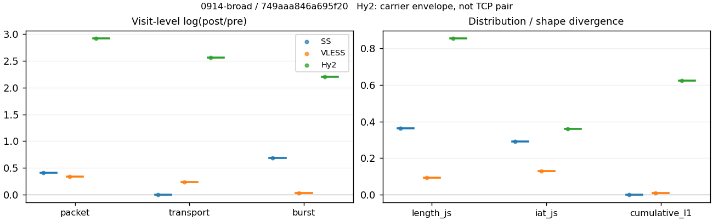
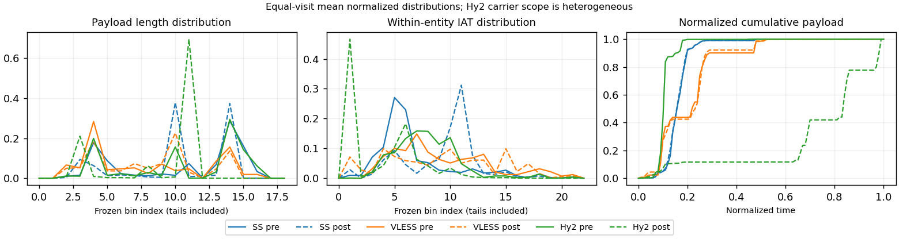

# 0914-broad · 条目 027 · github.com

目标：https://github.com/RakuLomis/TrafficTracer

活动标签：github.com::page_load。选定访问 3 次。

[返回总索引](../../README.md) · [统计口径](../../methods.md)

## 覆盖与资格（每次访问均保留）

| 部署 | 重复 | 主请求路由 | 活动状态 | 代理比较 | DIRECT pre | 请求 proxy/direct/unresolved | 错误 |
| --- | --- | --- | --- | --- | --- | --- | --- |
| Hy2 | 1 | proxy | passed | 1 | 0 | 168/0/0 | [] |
| SS | 1 | proxy | passed | 1 | 0 | 164/0/0 | [] |
| VLESS | 1 | proxy | passed | 1 | 0 | 165/0/0 | [] |

主请求非 proxy 的统计仅解释为已索引的辅助代理连接或 DIRECT 观测，不代表目标业务经代理传输。播放确认与配对资格是两道不同的门。

图中散点为单次访问，短线为重复中位数；Hy2 是共享载体包络，不能与 TCP 配对作等范围因果对比。

形态图先逐访问归一化，再对访问等权平均；实线 pre，虚线 post。分箱序号及边界见 methods，不将分箱索引误解为长度或时间。

## 每次访问的关键观测

### SS

范围：`exclusive_page`。每格 pre → post；空值为不可观测/不适用。

| 重复 | 包数 | 载荷字节 | burst | TCP FR | IAT中位µs | length JS | IAT JS |
| --- | --- | --- | --- | --- | --- | --- | --- |
| 1 | 1639 → 2467 | 2.2612e+06 → 2.2669e+06 | 1025 → 2029 | 87 → 91 | 23.239 → 904.33 | 0.36171 | 0.29024 |

完整标量统计：中位数 [min,max]；Δ 为重复内逐访问变换的中位数，MAD 未缩放。n 为可用变换数；DIRECT-only 的 nΔ=0 不代表 pre 不可用。

| scope | 特征 | pre | post | Δ | IQRΔ | MADΔ | nΔ |
| --- | --- | --- | --- | --- | --- | --- | --- |
| exclusive_page | active_span_sum_s_1000ms | 13.629 [13.629, 13.629] | 13.606 [13.606, 13.606] | -0.0017147 | — | — | 1 |
| exclusive_page | active_span_sum_s_100ms | 3.5803 [3.5803, 3.5803] | 5.2302 [5.2302, 5.2302] | 0.37902 | — | — | 1 |
| exclusive_page | active_span_sum_s_500ms | 10.901 [10.901, 10.901] | 12.734 [12.734, 12.734] | 0.15544 | — | — | 1 |
| exclusive_page | burst_bytes_iqr | 2896 [2896, 2896] | 2856 [2856, 2856] | -0.013908 | — | — | 1 |
| exclusive_page | burst_bytes_mad | 64 [64, 64] | 34 [34, 34] | -0.63252 | — | — | 1 |
| exclusive_page | burst_bytes_max | 32812 [32812, 32812] | 13440 [13440, 13440] | -0.89256 | — | — | 1 |
| exclusive_page | burst_bytes_mean | 2206 [2206, 2206] | 1117.2 [1117.2, 1117.2] | -0.68032 | — | — | 1 |
| exclusive_page | burst_bytes_median | 64 [64, 64] | 34 [34, 34] | -0.63252 | — | — | 1 |
| exclusive_page | burst_bytes_min | 0 [0, 0] | 0 [0, 0] | — | — | — | 0 |
| exclusive_page | burst_bytes_p95 | 11584 [11584, 11584] | 2856 [2856, 2856] | -1.4002 | — | — | 1 |
| exclusive_page | burst_bytes_q25 | 0 [0, 0] | 0 [0, 0] | — | — | — | 0 |
| exclusive_page | burst_bytes_q75 | 2896 [2896, 2896] | 2856 [2856, 2856] | -0.013908 | — | — | 1 |
| exclusive_page | burst_bytes_std | 4262.2 [4262.2, 4262.2] | 1511.5 [1511.5, 1511.5] | -1.0367 | — | — | 1 |
| exclusive_page | burst_count | 1025 [1025, 1025] | 2029 [2029, 2029] | 0.68285 | — | — | 1 |
| exclusive_page | burst_duration_ms_iqr | 0.027416 [0.027416, 0.027416] | 0 [0, 0] | — | — | — | 0 |
| exclusive_page | burst_duration_ms_mad | 0 [0, 0] | 0 [0, 0] | — | — | — | 0 |
| exclusive_page | burst_duration_ms_max | 14535 [14535, 14535] | 14429 [14429, 14429] | -0.0073035 | — | — | 1 |
| exclusive_page | burst_duration_ms_mean | 79.693 [79.693, 79.693] | 24.301 [24.301, 24.301] | -1.1877 | — | — | 1 |
| exclusive_page | burst_duration_ms_median | 0 [0, 0] | 0 [0, 0] | — | — | — | 0 |
| exclusive_page | burst_duration_ms_min | 0 [0, 0] | 0 [0, 0] | — | — | — | 0 |
| exclusive_page | burst_duration_ms_p95 | 14.856 [14.856, 14.856] | 0.85998 [0.85998, 0.85998] | -2.8493 | — | — | 1 |
| exclusive_page | burst_duration_ms_q25 | 0 [0, 0] | 0 [0, 0] | — | — | — | 0 |
| exclusive_page | burst_duration_ms_q75 | 0.027416 [0.027416, 0.027416] | 0 [0, 0] | — | — | — | 0 |
| exclusive_page | burst_duration_ms_std | 948.86 [948.86, 948.86] | 506.56 [506.56, 506.56] | -0.62763 | — | — | 1 |
| exclusive_page | burst_packets_iqr | 1 [1, 1] | 0 [0, 0] | — | — | — | 0 |
| exclusive_page | burst_packets_mad | 0 [0, 0] | 0 [0, 0] | — | — | — | 0 |
| exclusive_page | burst_packets_max | 11 [11, 11] | 13 [13, 13] | 0.16705 | — | — | 1 |
| exclusive_page | burst_packets_mean | 1.599 [1.599, 1.599] | 1.2159 [1.2159, 1.2159] | -0.27393 | — | — | 1 |
| exclusive_page | burst_packets_median | 1 [1, 1] | 1 [1, 1] | 0 | — | — | 1 |
| exclusive_page | burst_packets_min | 1 [1, 1] | 1 [1, 1] | 0 | — | — | 1 |
| exclusive_page | burst_packets_p95 | 4 [4, 4] | 2 [2, 2] | -0.69315 | — | — | 1 |
| exclusive_page | burst_packets_q25 | 1 [1, 1] | 1 [1, 1] | 0 | — | — | 1 |
| exclusive_page | burst_packets_q75 | 2 [2, 2] | 1 [1, 1] | -0.69315 | — | — | 1 |
| exclusive_page | burst_packets_std | 1.3186 [1.3186, 1.3186] | 0.77779 [0.77779, 0.77779] | -0.52788 | — | — | 1 |
| exclusive_page | connection_span_concurrency_max | 6 [6, 6] | 6 [6, 6] | 0 | — | — | 1 |
| exclusive_page | cumulative_l1 | — | — | 0.002133 | — | — | 1 |
| exclusive_page | cumulative_max | — | — | 0.048421 | — | — | 1 |
| exclusive_page | direction_entropy | 0.73782 [0.73782, 0.73782] | 0.50276 [0.50276, 0.50276] | -0.23506 | — | — | 1 |
| exclusive_page | down_burst_count | 508 [508, 508] | 1010 [1010, 1010] | 0.68722 | — | — | 1 |
| exclusive_page | down_ip_bytes | 2.2215e+06 [2.2215e+06, 2.2215e+06] | 2.2358e+06 [2.2358e+06, 2.2358e+06] | 0.006421 | — | — | 1 |
| exclusive_page | down_packets | 1005 [1005, 1005] | 1294 [1294, 1294] | 0.25275 | — | — | 1 |
| exclusive_page | down_transport_bytes | 2.1691e+06 [2.1691e+06, 2.1691e+06] | 2.1684e+06 [2.1684e+06, 2.1684e+06] | -0.00034213 | — | — | 1 |
| exclusive_page | duration_s | 19.658 [19.658, 19.658] | 19.657 [19.657, 19.657] | -5.0322e-05 | — | — | 1 |
| exclusive_page | entity_count | 9 [9, 9] | 9 [9, 9] | 0 | — | — | 1 |
| exclusive_page | fr_runs | 87 [87, 87] | 91 [91, 91] | 0.044951 | — | — | 1 |
| exclusive_page | fr_runs_per_packet | 0.083815 [0.083815, 0.083815] | 0.068216 [0.068216, 0.068216] | -0.015599 | — | — | 1 |
| exclusive_page | fr_switches | 78 [78, 78] | 82 [82, 82] | 0.05001 | — | — | 1 |
| exclusive_page | fr_switches_per_possible_transition | 0.075802 [0.075802, 0.075802] | 0.061887 [0.061887, 0.061887] | -0.013915 | — | — | 1 |
| exclusive_page | full_retransmission_fraction | 0.0067114 [0.0067114, 0.0067114] | 0.0008107 [0.0008107, 0.0008107] | -0.0059007 | — | — | 1 |
| exclusive_page | full_retransmission_packets | 11 [11, 11] | 2 [2, 2] | -1.7047 | — | — | 1 |
| exclusive_page | iat_count | 1630 [1630, 1630] | 2458 [2458, 2458] | 0.41077 | — | — | 1 |
| exclusive_page | iat_js | — | — | 0.29024 | — | — | 1 |
| exclusive_page | iat_ks | — | — | 0.50571 | — | — | 1 |
| exclusive_page | iat_median_us | 23.239 [23.239, 23.239] | 904.33 [904.33, 904.33] | 3.6614 | — | — | 1 |
| exclusive_page | iat_us_iqr | 84.539 [84.539, 84.539] | 1022 [1022, 1022] | 2.4923 | — | — | 1 |
| exclusive_page | iat_us_mad | 15.087 [15.087, 15.087] | 694.08 [694.08, 694.08] | 3.8287 | — | — | 1 |
| exclusive_page | iat_us_max | 1.4535e+07 [1.4535e+07, 1.4535e+07] | 1.4545e+07 [1.4545e+07, 1.4545e+07] | 0.00065614 | — | — | 1 |
| exclusive_page | iat_us_mean | 60835 [60835, 60835] | 40340 [40340, 40340] | -0.41084 | — | — | 1 |
| exclusive_page | iat_us_median | 23.239 [23.239, 23.239] | 904.33 [904.33, 904.33] | 3.6614 | — | — | 1 |
| exclusive_page | iat_us_min | 0.054 [0.054, 0.054] | 0.035 [0.035, 0.035] | -0.43364 | — | — | 1 |
| exclusive_page | iat_us_p95 | 29022 [29022, 29022] | 12575 [12575, 12575] | -0.83633 | — | — | 1 |
| exclusive_page | iat_us_q25 | 12.052 [12.052, 12.052] | 74.474 [74.474, 74.474] | 1.8213 | — | — | 1 |
| exclusive_page | iat_us_q75 | 96.591 [96.591, 96.591] | 1096.5 [1096.5, 1096.5] | 2.4294 | — | — | 1 |
| exclusive_page | iat_us_std | 8.3346e+05 [8.3346e+05, 8.3346e+05] | 6.7904e+05 [6.7904e+05, 6.7904e+05] | -0.20491 | — | — | 1 |
| exclusive_page | iat_wasserstein_log1p_us | — | — | 2.0308 | — | — | 1 |
| exclusive_page | idle_gap_count_1000ms | 7 [7, 7] | 7 [7, 7] | 0 | — | — | 1 |
| exclusive_page | idle_gap_count_100ms | 36 [36, 36] | 38 [38, 38] | 0.054067 | — | — | 1 |
| exclusive_page | idle_gap_count_500ms | 11 [11, 11] | 8 [8, 8] | -0.31845 | — | — | 1 |
| exclusive_page | idle_gap_sum_s_1000ms | 85.532 [85.532, 85.532] | 85.549 [85.549, 85.549] | 0.00019263 | — | — | 1 |
| exclusive_page | idle_gap_sum_s_100ms | 95.582 [95.582, 95.582] | 93.925 [93.925, 93.925] | -0.017486 | — | — | 1 |
| exclusive_page | idle_gap_sum_s_500ms | 88.261 [88.261, 88.261] | 86.421 [86.421, 86.421] | -0.021069 | — | — | 1 |
| exclusive_page | ip_bytes | 2.3467e+06 [2.3467e+06, 2.3467e+06] | 2.4199e+06 [2.4199e+06, 2.4199e+06] | 0.030746 | — | — | 1 |
| exclusive_page | length_iqr | 2648 [2648, 2648] | 1428 [1428, 1428] | -0.61753 | — | — | 1 |
| exclusive_page | length_js | — | — | 0.36171 | — | — | 1 |
| exclusive_page | length_ks | — | — | 0.44723 | — | — | 1 |
| exclusive_page | length_mad | 1342 [1342, 1342] | 1335 [1335, 1335] | -0.0052297 | — | — | 1 |
| exclusive_page | length_max | 8948 [8948, 8948] | 4284 [4284, 4284] | -0.73654 | — | — | 1 |
| exclusive_page | length_mean | 2178.4 [2178.4, 2178.4] | 1699.3 [1699.3, 1699.3] | -0.24836 | — | — | 1 |
| exclusive_page | length_median | 1837 [1837, 1837] | 1428 [1428, 1428] | -0.25186 | — | — | 1 |
| exclusive_page | length_min | 7 [7, 7] | 6 [6, 6] | -0.15415 | — | — | 1 |
| exclusive_page | length_p95 | 5792 [5792, 5792] | 2856 [2856, 2856] | -0.70706 | — | — | 1 |
| exclusive_page | length_q25 | 248 [248, 248] | 1428 [1428, 1428] | 1.7506 | — | — | 1 |
| exclusive_page | length_q75 | 2896 [2896, 2896] | 2856 [2856, 2856] | -0.013908 | — | — | 1 |
| exclusive_page | length_std | 1975.6 [1975.6, 1975.6] | 1022 [1022, 1022] | -0.6591 | — | — | 1 |
| exclusive_page | length_wasserstein_bytes | — | — | 797.43 | — | — | 1 |
| exclusive_page | nonempty_entity_count | 9 [9, 9] | 9 [9, 9] | 0 | — | — | 1 |
| exclusive_page | nonempty_packets | 1038 [1038, 1038] | 1334 [1334, 1334] | 0.25089 | — | — | 1 |
| exclusive_page | offload_suspect_fraction | 0.34838 [0.34838, 0.34838] | 0.21889 [0.21889, 0.21889] | -0.12949 | — | — | 1 |
| exclusive_page | packet_count | 1639 [1639, 1639] | 2467 [2467, 2467] | 0.40892 | — | — | 1 |
| exclusive_page | rtt_median_ms | 0.051162 [0.051162, 0.051162] | 33.309 [33.309, 33.309] | 6.4786 | — | — | 1 |
| exclusive_page | rtt_sample_count | 579 [579, 579] | 331 [331, 331] | -0.55918 | — | — | 1 |
| exclusive_page | tcp_ack_count | 1630 [1630, 1630] | 2458 [2458, 2458] | 0.41077 | — | — | 1 |
| exclusive_page | tcp_fin_count | 18 [18, 18] | 18 [18, 18] | 0 | — | — | 1 |
| exclusive_page | tcp_packet_count | 1639 [1639, 1639] | 2467 [2467, 2467] | 0.40892 | — | — | 1 |
| exclusive_page | tcp_rst_count | 0 [0, 0] | 0 [0, 0] | — | — | — | 0 |
| exclusive_page | tcp_syn_count | 18 [18, 18] | 18 [18, 18] | 0 | — | — | 1 |
| exclusive_page | tcp_window_raw_median | 65535 [65535, 65535] | 150 [150, 150] | -6.0797 | — | — | 1 |
| exclusive_page | transition_entropy | 0.35325 [0.35325, 0.35325] | 0.27765 [0.27765, 0.27765] | -0.075595 | — | — | 1 |
| exclusive_page | transition_n_mm | 779 [779, 779] | 1141 [1141, 1141] | 0.38165 | — | — | 1 |
| exclusive_page | transition_n_mp | 35 [35, 35] | 37 [37, 37] | 0.05557 | — | — | 1 |
| exclusive_page | transition_n_pm | 43 [43, 43] | 45 [45, 45] | 0.045462 | — | — | 1 |
| exclusive_page | transition_n_pp | 172 [172, 172] | 102 [102, 102] | -0.52252 | — | — | 1 |
| exclusive_page | transition_p_mm | 0.957 [0.957, 0.957] | 0.96859 [0.96859, 0.96859] | 0.011588 | — | — | 1 |
| exclusive_page | transition_p_mp | 0.042998 [0.042998, 0.042998] | 0.031409 [0.031409, 0.031409] | -0.011588 | — | — | 1 |
| exclusive_page | transition_p_pm | 0.2 [0.2, 0.2] | 0.30612 [0.30612, 0.30612] | 0.10612 | — | — | 1 |
| exclusive_page | transition_p_pp | 0.8 [0.8, 0.8] | 0.69388 [0.69388, 0.69388] | -0.10612 | — | — | 1 |
| exclusive_page | transport_bytes | 2.2612e+06 [2.2612e+06, 2.2612e+06] | 2.2669e+06 [2.2669e+06, 2.2669e+06] | 0.0025291 | — | — | 1 |
| exclusive_page | up_burst_count | 517 [517, 517] | 1019 [1019, 1019] | 0.67853 | — | — | 1 |
| exclusive_page | up_byte_fraction | 0.040698 [0.040698, 0.040698] | 0.043448 [0.043448, 0.043448] | 0.0027505 | — | — | 1 |
| exclusive_page | up_ip_bytes | 1.252e+05 [1.252e+05, 1.252e+05] | 1.8416e+05 [1.8416e+05, 1.8416e+05] | 0.3859 | — | — | 1 |
| exclusive_page | up_packets | 634 [634, 634] | 1173 [1173, 1173] | 0.61527 | — | — | 1 |
| exclusive_page | up_transport_bytes | 92024 [92024, 92024] | 98492 [98492, 98492] | 0.067926 | — | — | 1 |
| exclusive_page | zero_iat_count | 0 [0, 0] | 0 [0, 0] | — | — | — | 0 |
| exclusive_page | zero_iat_fraction | 0 [0, 0] | 0 [0, 0] | 0 | — | — | 1 |

### VLESS

范围：`exclusive_page`。每格 pre → post；空值为不可观测/不适用。

| 重复 | 包数 | 载荷字节 | burst | TCP FR | IAT中位µs | length JS | IAT JS |
| --- | --- | --- | --- | --- | --- | --- | --- |
| 1 | 419 → 584 | 2.5076e+05 → 3.1679e+05 | 294 → 302 | 55 → 72 | 149.41 → 439.57 | 0.093779 | 0.12932 |

完整标量统计：中位数 [min,max]；Δ 为重复内逐访问变换的中位数，MAD 未缩放。n 为可用变换数；DIRECT-only 的 nΔ=0 不代表 pre 不可用。

| scope | 特征 | pre | post | Δ | IQRΔ | MADΔ | nΔ |
| --- | --- | --- | --- | --- | --- | --- | --- |
| exclusive_page | active_span_sum_s_1000ms | 11.595 [11.595, 11.595] | 11.578 [11.578, 11.578] | -0.0014949 | — | — | 1 |
| exclusive_page | active_span_sum_s_100ms | 1.0921 [1.0921, 1.0921] | 4.0222 [4.0222, 4.0222] | 1.3037 | — | — | 1 |
| exclusive_page | active_span_sum_s_500ms | 5.4941 [5.4941, 5.4941] | 10.759 [10.759, 10.759] | 0.67206 | — | — | 1 |
| exclusive_page | burst_bytes_iqr | 1163 [1163, 1163] | 1824.5 [1824.5, 1824.5] | 0.4503 | — | — | 1 |
| exclusive_page | burst_bytes_mad | 31 [31, 31] | 48 [48, 48] | 0.43721 | — | — | 1 |
| exclusive_page | burst_bytes_max | 17476 [17476, 17476] | 12841 [12841, 12841] | -0.30819 | — | — | 1 |
| exclusive_page | burst_bytes_mean | 852.93 [852.93, 852.93] | 1049 [1049, 1049] | 0.20689 | — | — | 1 |
| exclusive_page | burst_bytes_median | 31 [31, 31] | 48 [48, 48] | 0.43721 | — | — | 1 |
| exclusive_page | burst_bytes_min | 0 [0, 0] | 0 [0, 0] | — | — | — | 0 |
| exclusive_page | burst_bytes_p95 | 2896 [2896, 2896] | 2896 [2896, 2896] | 0 | — | — | 1 |
| exclusive_page | burst_bytes_q25 | 0 [0, 0] | 0 [0, 0] | — | — | — | 0 |
| exclusive_page | burst_bytes_q75 | 1163 [1163, 1163] | 1824.5 [1824.5, 1824.5] | 0.4503 | — | — | 1 |
| exclusive_page | burst_bytes_std | 1963.5 [1963.5, 1963.5] | 1785.7 [1785.7, 1785.7] | -0.094921 | — | — | 1 |
| exclusive_page | burst_count | 294 [294, 294] | 302 [302, 302] | 0.026847 | — | — | 1 |
| exclusive_page | burst_duration_ms_iqr | 1.5517 [1.5517, 1.5517] | 3.8898 [3.8898, 3.8898] | 0.919 | — | — | 1 |
| exclusive_page | burst_duration_ms_mad | 0 [0, 0] | 0 [0, 0] | — | — | — | 0 |
| exclusive_page | burst_duration_ms_max | 14558 [14558, 14558] | 14558 [14558, 14558] | 1.214e-05 | — | — | 1 |
| exclusive_page | burst_duration_ms_mean | 234.63 [234.63, 234.63] | 168.15 [168.15, 168.15] | -0.33319 | — | — | 1 |
| exclusive_page | burst_duration_ms_median | 0 [0, 0] | 0 [0, 0] | — | — | — | 0 |
| exclusive_page | burst_duration_ms_min | 0 [0, 0] | 0 [0, 0] | — | — | — | 0 |
| exclusive_page | burst_duration_ms_p95 | 415.05 [415.05, 415.05] | 172.85 [172.85, 172.85] | -0.87595 | — | — | 1 |
| exclusive_page | burst_duration_ms_q25 | 0 [0, 0] | 0 [0, 0] | — | — | — | 0 |
| exclusive_page | burst_duration_ms_q75 | 1.5517 [1.5517, 1.5517] | 3.8898 [3.8898, 3.8898] | 0.919 | — | — | 1 |
| exclusive_page | burst_duration_ms_std | 1570.4 [1570.4, 1570.4] | 1322.1 [1322.1, 1322.1] | -0.17211 | — | — | 1 |
| exclusive_page | burst_packets_iqr | 1 [1, 1] | 1 [1, 1] | 0 | — | — | 1 |
| exclusive_page | burst_packets_mad | 0 [0, 0] | 0 [0, 0] | — | — | — | 0 |
| exclusive_page | burst_packets_max | 4 [4, 4] | 13 [13, 13] | 1.1787 | — | — | 1 |
| exclusive_page | burst_packets_mean | 1.4252 [1.4252, 1.4252] | 1.9338 [1.9338, 1.9338] | 0.30518 | — | — | 1 |
| exclusive_page | burst_packets_median | 1 [1, 1] | 1 [1, 1] | 0 | — | — | 1 |
| exclusive_page | burst_packets_min | 1 [1, 1] | 1 [1, 1] | 0 | — | — | 1 |
| exclusive_page | burst_packets_p95 | 2 [2, 2] | 5 [5, 5] | 0.91629 | — | — | 1 |
| exclusive_page | burst_packets_q25 | 1 [1, 1] | 1 [1, 1] | 0 | — | — | 1 |
| exclusive_page | burst_packets_q75 | 2 [2, 2] | 2 [2, 2] | 0 | — | — | 1 |
| exclusive_page | burst_packets_std | 0.59434 [0.59434, 0.59434] | 1.6465 [1.6465, 1.6465] | 1.0189 | — | — | 1 |
| exclusive_page | connection_span_concurrency_max | 5 [5, 5] | 5 [5, 5] | 0 | — | — | 1 |
| exclusive_page | cumulative_l1 | — | — | 0.0098173 | — | — | 1 |
| exclusive_page | cumulative_max | — | — | 0.075039 | — | — | 1 |
| exclusive_page | direction_entropy | 0.8778 [0.8778, 0.8778] | 0.96396 [0.96396, 0.96396] | 0.086155 | — | — | 1 |
| exclusive_page | down_burst_count | 143 [143, 143] | 147 [147, 147] | 0.027588 | — | — | 1 |
| exclusive_page | down_ip_bytes | 1.7342e+05 [1.7342e+05, 1.7342e+05] | 2.2816e+05 [2.2816e+05, 2.2816e+05] | 0.27433 | — | — | 1 |
| exclusive_page | down_packets | 227 [227, 227] | 305 [305, 305] | 0.29536 | — | — | 1 |
| exclusive_page | down_transport_bytes | 1.6155e+05 [1.6155e+05, 1.6155e+05] | 2.1224e+05 [2.1224e+05, 2.1224e+05] | 0.27288 | — | — | 1 |
| exclusive_page | duration_s | 20.173 [20.173, 20.173] | 20.156 [20.156, 20.156] | -0.00083224 | — | — | 1 |
| exclusive_page | entity_count | 8 [8, 8] | 8 [8, 8] | 0 | — | — | 1 |
| exclusive_page | fr_runs | 55 [55, 55] | 72 [72, 72] | 0.26933 | — | — | 1 |
| exclusive_page | fr_runs_per_packet | 0.25943 [0.25943, 0.25943] | 0.2392 [0.2392, 0.2392] | -0.020231 | — | — | 1 |
| exclusive_page | fr_switches | 47 [47, 47] | 64 [64, 64] | 0.30874 | — | — | 1 |
| exclusive_page | fr_switches_per_possible_transition | 0.23039 [0.23039, 0.23039] | 0.21843 [0.21843, 0.21843] | -0.011962 | — | — | 1 |
| exclusive_page | full_retransmission_fraction | 0 [0, 0] | 0 [0, 0] | 0 | — | — | 1 |
| exclusive_page | full_retransmission_packets | 0 [0, 0] | 0 [0, 0] | — | — | — | 0 |
| exclusive_page | iat_count | 411 [411, 411] | 576 [576, 576] | 0.33751 | — | — | 1 |
| exclusive_page | iat_js | — | — | 0.12932 | — | — | 1 |
| exclusive_page | iat_ks | — | — | 0.11728 | — | — | 1 |
| exclusive_page | iat_median_us | 149.41 [149.41, 149.41] | 439.57 [439.57, 439.57] | 1.0791 | — | — | 1 |
| exclusive_page | iat_us_iqr | 4015.4 [4015.4, 4015.4] | 7806.5 [7806.5, 7806.5] | 0.66483 | — | — | 1 |
| exclusive_page | iat_us_mad | 141.68 [141.68, 141.68] | 437.42 [437.42, 437.42] | 1.1273 | — | — | 1 |
| exclusive_page | iat_us_max | 1.4558e+07 [1.4558e+07, 1.4558e+07] | 1.4558e+07 [1.4558e+07, 1.4558e+07] | 1.214e-05 | — | — | 1 |
| exclusive_page | iat_us_mean | 2.0514e+05 [2.0514e+05, 2.0514e+05] | 1.4602e+05 [1.4602e+05, 1.4602e+05] | -0.33996 | — | — | 1 |
| exclusive_page | iat_us_median | 149.41 [149.41, 149.41] | 439.57 [439.57, 439.57] | 1.0791 | — | — | 1 |
| exclusive_page | iat_us_min | 3.176 [3.176, 3.176] | 0.034 [0.034, 0.034] | -4.537 | — | — | 1 |
| exclusive_page | iat_us_p95 | 2.1529e+05 [2.1529e+05, 2.1529e+05] | 1.5365e+05 [1.5365e+05, 1.5365e+05] | -0.33729 | — | — | 1 |
| exclusive_page | iat_us_q25 | 33.9 [33.9, 33.9] | 13.722 [13.722, 13.722] | -0.90445 | — | — | 1 |
| exclusive_page | iat_us_q75 | 4049.3 [4049.3, 4049.3] | 7820.2 [7820.2, 7820.2] | 0.65817 | — | — | 1 |
| exclusive_page | iat_us_std | 1.4255e+06 [1.4255e+06, 1.4255e+06] | 1.2038e+06 [1.2038e+06, 1.2038e+06] | -0.16907 | — | — | 1 |
| exclusive_page | iat_wasserstein_log1p_us | — | — | 0.80185 | — | — | 1 |
| exclusive_page | idle_gap_count_1000ms | 8 [8, 8] | 8 [8, 8] | 0 | — | — | 1 |
| exclusive_page | idle_gap_count_100ms | 39 [39, 39] | 46 [46, 46] | 0.16508 | — | — | 1 |
| exclusive_page | idle_gap_count_500ms | 17 [17, 17] | 9 [9, 9] | -0.63599 | — | — | 1 |
| exclusive_page | idle_gap_sum_s_1000ms | 72.719 [72.719, 72.719] | 72.531 [72.531, 72.531] | -0.0025924 | — | — | 1 |
| exclusive_page | idle_gap_sum_s_100ms | 83.222 [83.222, 83.222] | 80.086 [80.086, 80.086] | -0.038407 | — | — | 1 |
| exclusive_page | idle_gap_sum_s_500ms | 78.82 [78.82, 78.82] | 73.349 [73.349, 73.349] | -0.071931 | — | — | 1 |
| exclusive_page | ip_bytes | 2.7253e+05 [2.7253e+05, 2.7253e+05] | 3.4749e+05 [3.4749e+05, 3.4749e+05] | 0.24297 | — | — | 1 |
| exclusive_page | length_iqr | 1696.8 [1696.8, 1696.8] | 1340 [1340, 1340] | -0.23605 | — | — | 1 |
| exclusive_page | length_js | — | — | 0.093779 | — | — | 1 |
| exclusive_page | length_ks | — | — | 0.14624 | — | — | 1 |
| exclusive_page | length_mad | 482 [482, 482] | 751 [751, 751] | 0.44346 | — | — | 1 |
| exclusive_page | length_max | 8948 [8948, 8948] | 2824 [2824, 2824] | -1.1533 | — | — | 1 |
| exclusive_page | length_mean | 1182.8 [1182.8, 1182.8] | 1052.4 [1052.4, 1052.4] | -0.11679 | — | — | 1 |
| exclusive_page | length_median | 515 [515, 515] | 1122 [1122, 1122] | 0.7787 | — | — | 1 |
| exclusive_page | length_min | 24 [24, 24] | 24 [24, 24] | 0 | — | — | 1 |
| exclusive_page | length_p95 | 2824 [2824, 2824] | 2824 [2824, 2824] | 0 | — | — | 1 |
| exclusive_page | length_q25 | 72 [72, 72] | 72 [72, 72] | 0 | — | — | 1 |
| exclusive_page | length_q75 | 1768.8 [1768.8, 1768.8] | 1412 [1412, 1412] | -0.22527 | — | — | 1 |
| exclusive_page | length_std | 1664.3 [1664.3, 1664.3] | 911.37 [911.37, 911.37] | -0.60223 | — | — | 1 |
| exclusive_page | length_wasserstein_bytes | — | — | 416.02 | — | — | 1 |
| exclusive_page | nonempty_entity_count | 8 [8, 8] | 8 [8, 8] | 0 | — | — | 1 |
| exclusive_page | nonempty_packets | 212 [212, 212] | 301 [301, 301] | 0.35052 | — | — | 1 |
| exclusive_page | offload_suspect_fraction | 0.14081 [0.14081, 0.14081] | 0.09589 [0.09589, 0.09589] | -0.044921 | — | — | 1 |
| exclusive_page | packet_count | 419 [419, 419] | 584 [584, 584] | 0.33203 | — | — | 1 |
| exclusive_page | rtt_median_ms | 0.1118 [0.1118, 0.1118] | 9.1667 [9.1667, 9.1667] | 4.4067 | — | — | 1 |
| exclusive_page | rtt_sample_count | 175 [175, 175] | 252 [252, 252] | 0.36464 | — | — | 1 |
| exclusive_page | tcp_ack_count | 399 [399, 399] | 576 [576, 576] | 0.36715 | — | — | 1 |
| exclusive_page | tcp_fin_count | 14 [14, 14] | 16 [16, 16] | 0.13353 | — | — | 1 |
| exclusive_page | tcp_packet_count | 419 [419, 419] | 584 [584, 584] | 0.33203 | — | — | 1 |
| exclusive_page | tcp_rst_count | 12 [12, 12] | 0 [0, 0] | — | — | — | 0 |
| exclusive_page | tcp_syn_count | 16 [16, 16] | 16 [16, 16] | 0 | — | — | 1 |
| exclusive_page | tcp_window_raw_median | 65471 [65471, 65471] | 137 [137, 137] | -6.1694 | — | — | 1 |
| exclusive_page | transition_entropy | 0.70847 [0.70847, 0.70847] | 0.7353 [0.7353, 0.7353] | 0.026824 | — | — | 1 |
| exclusive_page | transition_n_mm | 122 [122, 122] | 148 [148, 148] | 0.19319 | — | — | 1 |
| exclusive_page | transition_n_mp | 20 [20, 20] | 28 [28, 28] | 0.33647 | — | — | 1 |
| exclusive_page | transition_n_pm | 27 [27, 27] | 36 [36, 36] | 0.28768 | — | — | 1 |
| exclusive_page | transition_n_pp | 35 [35, 35] | 81 [81, 81] | 0.8391 | — | — | 1 |
| exclusive_page | transition_p_mm | 0.85915 [0.85915, 0.85915] | 0.84091 [0.84091, 0.84091] | -0.018246 | — | — | 1 |
| exclusive_page | transition_p_mp | 0.14085 [0.14085, 0.14085] | 0.15909 [0.15909, 0.15909] | 0.018246 | — | — | 1 |
| exclusive_page | transition_p_pm | 0.43548 [0.43548, 0.43548] | 0.30769 [0.30769, 0.30769] | -0.12779 | — | — | 1 |
| exclusive_page | transition_p_pp | 0.56452 [0.56452, 0.56452] | 0.69231 [0.69231, 0.69231] | 0.12779 | — | — | 1 |
| exclusive_page | transport_bytes | 2.5076e+05 [2.5076e+05, 2.5076e+05] | 3.1679e+05 [3.1679e+05, 3.1679e+05] | 0.23373 | — | — | 1 |
| exclusive_page | up_burst_count | 151 [151, 151] | 155 [155, 155] | 0.026145 | — | — | 1 |
| exclusive_page | up_byte_fraction | 0.35575 [0.35575, 0.35575] | 0.33003 [0.33003, 0.33003] | -0.025717 | — | — | 1 |
| exclusive_page | up_ip_bytes | 99111 [99111, 99111] | 1.1932e+05 [1.1932e+05, 1.1932e+05] | 0.18561 | — | — | 1 |
| exclusive_page | up_packets | 192 [192, 192] | 279 [279, 279] | 0.37372 | — | — | 1 |
| exclusive_page | up_transport_bytes | 89207 [89207, 89207] | 1.0455e+05 [1.0455e+05, 1.0455e+05] | 0.1587 | — | — | 1 |
| exclusive_page | zero_iat_count | 0 [0, 0] | 0 [0, 0] | — | — | — | 0 |
| exclusive_page | zero_iat_fraction | 0 [0, 0] | 0 [0, 0] | 0 | — | — | 1 |

### Hy2

范围：`carrier_context_envelope`。每格 pre → post；空值为不可观测/不适用。

| 重复 | 包数 | 载荷字节 | burst | TCP FR | IAT中位µs | length JS | IAT JS |
| --- | --- | --- | --- | --- | --- | --- | --- |
| 1 | 1465 → 27139 | 2.2534e+06 → 2.9233e+07 | 1014 → 9166 | — | 106.75 → 6.153 | 0.85269 | 0.36096 |

完整标量统计：中位数 [min,max]；Δ 为重复内逐访问变换的中位数，MAD 未缩放。n 为可用变换数；DIRECT-only 的 nΔ=0 不代表 pre 不可用。

| scope | 特征 | pre | post | Δ | IQRΔ | MADΔ | nΔ |
| --- | --- | --- | --- | --- | --- | --- | --- |
| carrier_context_envelope | active_span_sum_s_1000ms | 7.3867 [7.3867, 7.3867] | 12.641 [12.641, 12.641] | 0.53729 | — | — | 1 |
| carrier_context_envelope | active_span_sum_s_100ms | 1.3009 [1.3009, 1.3009] | 5.6347 [5.6347, 5.6347] | 1.4659 | — | — | 1 |
| carrier_context_envelope | active_span_sum_s_500ms | 7.3867 [7.3867, 7.3867] | 10.164 [10.164, 10.164] | 0.31912 | — | — | 1 |
| carrier_context_envelope | burst_bytes_iqr | 2830 [2830, 2830] | 5132 [5132, 5132] | 0.59522 | — | — | 1 |
| carrier_context_envelope | burst_bytes_mad | 64 [64, 64] | 424 [424, 424] | 1.8909 | — | — | 1 |
| carrier_context_envelope | burst_bytes_max | 32812 [32812, 32812] | 1.7789e+05 [1.7789e+05, 1.7789e+05] | 1.6904 | — | — | 1 |
| carrier_context_envelope | burst_bytes_mean | 2222.3 [2222.3, 2222.3] | 3189.3 [3189.3, 3189.3] | 0.36127 | — | — | 1 |
| carrier_context_envelope | burst_bytes_median | 64 [64, 64] | 457 [457, 457] | 1.9658 | — | — | 1 |
| carrier_context_envelope | burst_bytes_min | 0 [0, 0] | 22 [22, 22] | — | — | — | 0 |
| carrier_context_envelope | burst_bytes_p95 | 11147 [11147, 11147] | 11528 [11528, 11528] | 0.033599 | — | — | 1 |
| carrier_context_envelope | burst_bytes_q25 | 0 [0, 0] | 36 [36, 36] | — | — | — | 0 |
| carrier_context_envelope | burst_bytes_q75 | 2830 [2830, 2830] | 5168 [5168, 5168] | 0.60221 | — | — | 1 |
| carrier_context_envelope | burst_bytes_std | 4506.6 [4506.6, 4506.6] | 5586.2 [5586.2, 5586.2] | 0.21476 | — | — | 1 |
| carrier_context_envelope | burst_count | 1014 [1014, 1014] | 9166 [9166, 9166] | 2.2016 | — | — | 1 |
| carrier_context_envelope | burst_duration_ms_iqr | 0 [0, 0] | 0.028231 [0.028231, 0.028231] | — | — | — | 0 |
| carrier_context_envelope | burst_duration_ms_mad | 0 [0, 0] | 5.9e-05 [5.9e-05, 5.9e-05] | — | — | — | 0 |
| carrier_context_envelope | burst_duration_ms_max | 14957 [14957, 14957] | 4136 [4136, 4136] | -1.2855 | — | — | 1 |
| carrier_context_envelope | burst_duration_ms_mean | 77.976 [77.976, 77.976] | 1.1281 [1.1281, 1.1281] | -4.2358 | — | — | 1 |
| carrier_context_envelope | burst_duration_ms_median | 0 [0, 0] | 5.9e-05 [5.9e-05, 5.9e-05] | — | — | — | 0 |
| carrier_context_envelope | burst_duration_ms_min | 0 [0, 0] | 0 [0, 0] | — | — | — | 0 |
| carrier_context_envelope | burst_duration_ms_p95 | 3.3833 [3.3833, 3.3833] | 0.25593 [0.25593, 0.25593] | -2.5817 | — | — | 1 |
| carrier_context_envelope | burst_duration_ms_q25 | 0 [0, 0] | 0 [0, 0] | — | — | — | 0 |
| carrier_context_envelope | burst_duration_ms_q75 | 0 [0, 0] | 0.028231 [0.028231, 0.028231] | — | — | — | 0 |
| carrier_context_envelope | burst_duration_ms_std | 982.3 [982.3, 982.3] | 46.562 [46.562, 46.562] | -3.0491 | — | — | 1 |
| carrier_context_envelope | burst_packets_iqr | 0 [0, 0] | 3 [3, 3] | — | — | — | 0 |
| carrier_context_envelope | burst_packets_mad | 0 [0, 0] | 1 [1, 1] | — | — | — | 0 |
| carrier_context_envelope | burst_packets_max | 11 [11, 11] | 128 [128, 128] | 2.4541 | — | — | 1 |
| carrier_context_envelope | burst_packets_mean | 1.4448 [1.4448, 1.4448] | 2.9608 [2.9608, 2.9608] | 0.71752 | — | — | 1 |
| carrier_context_envelope | burst_packets_median | 1 [1, 1] | 2 [2, 2] | 0.69315 | — | — | 1 |
| carrier_context_envelope | burst_packets_min | 1 [1, 1] | 1 [1, 1] | 0 | — | — | 1 |
| carrier_context_envelope | burst_packets_p95 | 4 [4, 4] | 8 [8, 8] | 0.69315 | — | — | 1 |
| carrier_context_envelope | burst_packets_q25 | 1 [1, 1] | 1 [1, 1] | 0 | — | — | 1 |
| carrier_context_envelope | burst_packets_q75 | 1 [1, 1] | 4 [4, 4] | 1.3863 | — | — | 1 |
| carrier_context_envelope | burst_packets_std | 1.1351 [1.1351, 1.1351] | 3.7922 [3.7922, 3.7922] | 1.2062 | — | — | 1 |
| carrier_context_envelope | connection_span_concurrency_max | 6 [6, 6] | 1 [1, 1] | -1.7918 | — | — | 1 |
| carrier_context_envelope | cumulative_l1 | — | — | 0.62273 | — | — | 1 |
| carrier_context_envelope | cumulative_max | — | — | 0.88361 | — | — | 1 |
| carrier_context_envelope | direction_entropy | 0.78131 [0.78131, 0.78131] | 0.76328 [0.76328, 0.76328] | -0.018031 | — | — | 1 |
| carrier_context_envelope | direction_run_analog_runs | 83 [83, 83] | 9166 [9166, 9166] | 4.7044 | — | — | 1 |
| carrier_context_envelope | direction_run_analog_runs_per_packet | 0.093891 [0.093891, 0.093891] | 0.33774 [0.33774, 0.33774] | 0.24385 | — | — | 1 |
| carrier_context_envelope | direction_run_analog_switches | 75 [75, 75] | 9165 [9165, 9165] | 4.8057 | — | — | 1 |
| carrier_context_envelope | direction_run_analog_switches_per_possible_transition | 0.085616 [0.085616, 0.085616] | 0.33772 [0.33772, 0.33772] | 0.2521 | — | — | 1 |
| carrier_context_envelope | down_burst_count | 503 [503, 503] | 4583 [4583, 4583] | 2.2095 | — | — | 1 |
| carrier_context_envelope | down_ip_bytes | 2.2211e+06 [2.2211e+06, 2.2211e+06] | 2.9468e+07 [2.9468e+07, 2.9468e+07] | 2.5853 | — | — | 1 |
| carrier_context_envelope | down_packets | 885 [885, 885] | 21122 [21122, 21122] | 3.1725 | — | — | 1 |
| carrier_context_envelope | down_transport_bytes | 2.175e+06 [2.175e+06, 2.175e+06] | 2.8876e+07 [2.8876e+07, 2.8876e+07] | 2.586 | — | — | 1 |
| carrier_context_envelope | duration_s | 18.077 [18.077, 18.077] | 18.073 [18.073, 18.073] | -0.00024681 | — | — | 1 |
| carrier_context_envelope | entity_count | 8 [8, 8] | 1 [1, 1] | -2.0794 | — | — | 1 |
| carrier_context_envelope | full_retransmission_fraction | 0.0081911 [0.0081911, 0.0081911] | — | — | — | — | 0 |
| carrier_context_envelope | full_retransmission_packets | 12 [12, 12] | — | — | — | — | 0 |
| carrier_context_envelope | iat_count | 1457 [1457, 1457] | 27138 [27138, 27138] | 2.9246 | — | — | 1 |
| carrier_context_envelope | iat_js | — | — | 0.36096 | — | — | 1 |
| carrier_context_envelope | iat_ks | — | — | 0.53112 | — | — | 1 |
| carrier_context_envelope | iat_median_us | 106.75 [106.75, 106.75] | 6.153 [6.153, 6.153] | -2.8535 | — | — | 1 |
| carrier_context_envelope | iat_us_iqr | 474.07 [474.07, 474.07] | 31.387 [31.387, 31.387] | -2.715 | — | — | 1 |
| carrier_context_envelope | iat_us_mad | 93.459 [93.459, 93.459] | 6.117 [6.117, 6.117] | -2.7265 | — | — | 1 |
| carrier_context_envelope | iat_us_max | 1.4957e+07 [1.4957e+07, 1.4957e+07] | 4.136e+06 [4.136e+06, 4.136e+06] | -1.2855 | — | — | 1 |
| carrier_context_envelope | iat_us_mean | 65338 [65338, 65338] | 665.95 [665.95, 665.95] | -4.5861 | — | — | 1 |
| carrier_context_envelope | iat_us_median | 106.75 [106.75, 106.75] | 6.153 [6.153, 6.153] | -2.8535 | — | — | 1 |
| carrier_context_envelope | iat_us_min | 0.071 [0.071, 0.071] | 0.001 [0.001, 0.001] | -4.2627 | — | — | 1 |
| carrier_context_envelope | iat_us_p95 | 3297.7 [3297.7, 3297.7] | 625.96 [625.96, 625.96] | -1.6617 | — | — | 1 |
| carrier_context_envelope | iat_us_q25 | 37.193 [37.193, 37.193] | 0.044 [0.044, 0.044] | -6.7397 | — | — | 1 |
| carrier_context_envelope | iat_us_q75 | 511.26 [511.26, 511.26] | 31.431 [31.431, 31.431] | -2.7891 | — | — | 1 |
| carrier_context_envelope | iat_us_std | 9.0501e+05 [9.0501e+05, 9.0501e+05] | 28559 [28559, 28559] | -3.456 | — | — | 1 |
| carrier_context_envelope | iat_wasserstein_log1p_us | — | — | 2.8878 | — | — | 1 |
| carrier_context_envelope | idle_gap_count_1000ms | 7 [7, 7] | 2 [2, 2] | -1.2528 | — | — | 1 |
| carrier_context_envelope | idle_gap_count_100ms | 32 [32, 32] | 26 [26, 26] | -0.20764 | — | — | 1 |
| carrier_context_envelope | idle_gap_count_500ms | 7 [7, 7] | 5 [5, 5] | -0.33647 | — | — | 1 |
| carrier_context_envelope | idle_gap_sum_s_1000ms | 87.81 [87.81, 87.81] | 5.4311 [5.4311, 5.4311] | -2.783 | — | — | 1 |
| carrier_context_envelope | idle_gap_sum_s_100ms | 93.896 [93.896, 93.896] | 12.438 [12.438, 12.438] | -2.0214 | — | — | 1 |
| carrier_context_envelope | idle_gap_sum_s_500ms | 87.81 [87.81, 87.81] | 7.909 [7.909, 7.909] | -2.4072 | — | — | 1 |
| carrier_context_envelope | ip_bytes | 2.3298e+06 [2.3298e+06, 2.3298e+06] | 2.9993e+07 [2.9993e+07, 2.9993e+07] | 2.5552 | — | — | 1 |
| carrier_context_envelope | length_iqr | 2373 [2373, 2373] | 596 [596, 596] | -1.3817 | — | — | 1 |
| carrier_context_envelope | length_js | — | — | 0.85269 | — | — | 1 |
| carrier_context_envelope | length_ks | — | — | 0.53054 | — | — | 1 |
| carrier_context_envelope | length_mad | 1118 [1118, 1118] | 0 [0, 0] | — | — | — | 0 |
| carrier_context_envelope | length_max | 8948 [8948, 8948] | 1441 [1441, 1441] | -1.8261 | — | — | 1 |
| carrier_context_envelope | length_mean | 2549.1 [2549.1, 2549.1] | 1077.2 [1077.2, 1077.2] | -0.8614 | — | — | 1 |
| carrier_context_envelope | length_median | 1930.5 [1930.5, 1930.5] | 1441 [1441, 1441] | -0.29244 | — | — | 1 |
| carrier_context_envelope | length_min | 9 [9, 9] | 22 [22, 22] | 0.89382 | — | — | 1 |
| carrier_context_envelope | length_p95 | 8490 [8490, 8490] | 1441 [1441, 1441] | -1.7736 | — | — | 1 |
| carrier_context_envelope | length_q25 | 457 [457, 457] | 845 [845, 845] | 0.61465 | — | — | 1 |
| carrier_context_envelope | length_q75 | 2830 [2830, 2830] | 1441 [1441, 1441] | -0.67494 | — | — | 1 |
| carrier_context_envelope | length_std | 2469.7 [2469.7, 2469.7] | 586.89 [586.89, 586.89] | -1.437 | — | — | 1 |
| carrier_context_envelope | length_wasserstein_bytes | — | — | 1518.4 | — | — | 1 |
| carrier_context_envelope | nonempty_entity_count | 8 [8, 8] | 1 [1, 1] | -2.0794 | — | — | 1 |
| carrier_context_envelope | nonempty_packets | 884 [884, 884] | 27139 [27139, 27139] | 3.4243 | — | — | 1 |
| carrier_context_envelope | offload_suspect_fraction | 0.32014 [0.32014, 0.32014] | 0 [0, 0] | -0.32014 | — | — | 1 |
| carrier_context_envelope | packet_count | 1465 [1465, 1465] | 27139 [27139, 27139] | 2.9191 | — | — | 1 |
| carrier_context_envelope | rtt_median_ms | 0.070311 [0.070311, 0.070311] | — | — | — | — | 0 |
| carrier_context_envelope | rtt_sample_count | 572 [572, 572] | 0 [0, 0] | — | — | — | 0 |
| carrier_context_envelope | tcp_ack_count | 1457 [1457, 1457] | — | — | — | — | 0 |
| carrier_context_envelope | tcp_fin_count | 16 [16, 16] | — | — | — | — | 0 |
| carrier_context_envelope | tcp_packet_count | 1465 [1465, 1465] | 0 [0, 0] | — | — | — | 0 |
| carrier_context_envelope | tcp_rst_count | 0 [0, 0] | — | — | — | — | 0 |
| carrier_context_envelope | tcp_syn_count | 16 [16, 16] | — | — | — | — | 0 |
| carrier_context_envelope | tcp_window_raw_median | 65535 [65535, 65535] | — | — | — | — | 0 |
| carrier_context_envelope | transition_entropy | 0.39021 [0.39021, 0.39021] | 0.76297 [0.76297, 0.76297] | 0.37275 | — | — | 1 |
| carrier_context_envelope | transition_n_mm | 638 [638, 638] | 16539 [16539, 16539] | 3.2551 | — | — | 1 |
| carrier_context_envelope | transition_n_mp | 34 [34, 34] | 4583 [4583, 4583] | 4.9037 | — | — | 1 |
| carrier_context_envelope | transition_n_pm | 41 [41, 41] | 4582 [4582, 4582] | 4.7163 | — | — | 1 |
| carrier_context_envelope | transition_n_pp | 163 [163, 163] | 1434 [1434, 1434] | 2.1745 | — | — | 1 |
| carrier_context_envelope | transition_p_mm | 0.9494 [0.9494, 0.9494] | 0.78302 [0.78302, 0.78302] | -0.16638 | — | — | 1 |
| carrier_context_envelope | transition_p_mp | 0.050595 [0.050595, 0.050595] | 0.21698 [0.21698, 0.21698] | 0.16638 | — | — | 1 |
| carrier_context_envelope | transition_p_pm | 0.20098 [0.20098, 0.20098] | 0.76164 [0.76164, 0.76164] | 0.56066 | — | — | 1 |
| carrier_context_envelope | transition_p_pp | 0.79902 [0.79902, 0.79902] | 0.23836 [0.23836, 0.23836] | -0.56066 | — | — | 1 |
| carrier_context_envelope | transport_bytes | 2.2534e+06 [2.2534e+06, 2.2534e+06] | 2.9233e+07 [2.9233e+07, 2.9233e+07] | 2.5629 | — | — | 1 |
| carrier_context_envelope | up_burst_count | 511 [511, 511] | 4583 [4583, 4583] | 2.1937 | — | — | 1 |
| carrier_context_envelope | up_byte_fraction | 0.034777 [0.034777, 0.034777] | 0.012204 [0.012204, 0.012204] | -0.022573 | — | — | 1 |
| carrier_context_envelope | up_ip_bytes | 1.0872e+05 [1.0872e+05, 1.0872e+05] | 5.2525e+05 [5.2525e+05, 5.2525e+05] | 1.5751 | — | — | 1 |
| carrier_context_envelope | up_packets | 580 [580, 580] | 6017 [6017, 6017] | 2.3393 | — | — | 1 |
| carrier_context_envelope | up_transport_bytes | 78366 [78366, 78366] | 3.5678e+05 [3.5678e+05, 3.5678e+05] | 1.5157 | — | — | 1 |
| carrier_context_envelope | zero_iat_count | 0 [0, 0] | 0 [0, 0] | — | — | — | 0 |
| carrier_context_envelope | zero_iat_fraction | 0 [0, 0] | 0 [0, 0] | 0 | — | — | 1 |

## 不同部署对比

以下是各部署自身重复中位数的差异，不按重复编号强行配对。跨 TCP/Hy2 的行标记异质观测范围。

| 视角 | 特征 | 部署A | 部署B | A中位 | B中位 | B−A | 比较口径 |
| --- | --- | --- | --- | --- | --- | --- | --- |
| pre | burst_count | SS | VLESS | 1025 | 294 | -731 | same_scope_unpaired_visits |
| pre | burst_count | SS | Hy2 | 1025 | 1014 | -11 | heterogeneous_scope_descriptive_only |
| pre | burst_count | VLESS | Hy2 | 294 | 1014 | 720 | heterogeneous_scope_descriptive_only |
| pre | connection_span_concurrency_max | SS | VLESS | 6 | 5 | -1 | same_scope_unpaired_visits |
| pre | connection_span_concurrency_max | SS | Hy2 | 6 | 6 | 0 | heterogeneous_scope_descriptive_only |
| pre | connection_span_concurrency_max | VLESS | Hy2 | 5 | 6 | 1 | heterogeneous_scope_descriptive_only |
| pre | direction_entropy | SS | VLESS | 0.73782 | 0.8778 | 0.13998 | same_scope_unpaired_visits |
| pre | direction_entropy | SS | Hy2 | 0.73782 | 0.78131 | 0.043489 | heterogeneous_scope_descriptive_only |
| pre | direction_entropy | VLESS | Hy2 | 0.8778 | 0.78131 | -0.096494 | heterogeneous_scope_descriptive_only |
| pre | down_transport_bytes | SS | VLESS | 2.1691e+06 | 1.6155e+05 | -2.0076e+06 | same_scope_unpaired_visits |
| pre | down_transport_bytes | SS | Hy2 | 2.1691e+06 | 2.175e+06 | 5889 | heterogeneous_scope_descriptive_only |
| pre | down_transport_bytes | VLESS | Hy2 | 1.6155e+05 | 2.175e+06 | 2.0135e+06 | heterogeneous_scope_descriptive_only |
| pre | duration_s | SS | VLESS | 19.658 | 20.173 | 0.51504 | same_scope_unpaired_visits |
| pre | duration_s | SS | Hy2 | 19.658 | 18.077 | -1.5812 | heterogeneous_scope_descriptive_only |
| pre | duration_s | VLESS | Hy2 | 20.173 | 18.077 | -2.0962 | heterogeneous_scope_descriptive_only |
| pre | entity_count | SS | VLESS | 9 | 8 | -1 | same_scope_unpaired_visits |
| pre | entity_count | SS | Hy2 | 9 | 8 | -1 | heterogeneous_scope_descriptive_only |
| pre | entity_count | VLESS | Hy2 | 8 | 8 | 0 | heterogeneous_scope_descriptive_only |
| pre | fr_runs | SS | VLESS | 87 | 55 | -32 | same_scope_unpaired_visits |
| pre | fr_runs_per_packet | SS | VLESS | 0.083815 | 0.25943 | 0.17562 | same_scope_unpaired_visits |
| pre | fr_switches | SS | VLESS | 78 | 47 | -31 | same_scope_unpaired_visits |
| pre | fr_switches_per_possible_transition | SS | VLESS | 0.075802 | 0.23039 | 0.15459 | same_scope_unpaired_visits |
| pre | full_retransmission_fraction | SS | VLESS | 0.0067114 | 0 | -0.0067114 | same_scope_unpaired_visits |
| pre | full_retransmission_fraction | SS | Hy2 | 0.0067114 | 0.0081911 | 0.0014797 | heterogeneous_scope_descriptive_only |
| pre | full_retransmission_fraction | VLESS | Hy2 | 0 | 0.0081911 | 0.0081911 | heterogeneous_scope_descriptive_only |
| pre | iat_median_us | SS | VLESS | 23.239 | 149.41 | 126.18 | same_scope_unpaired_visits |
| pre | iat_median_us | SS | Hy2 | 23.239 | 106.75 | 83.511 | heterogeneous_scope_descriptive_only |
| pre | iat_median_us | VLESS | Hy2 | 149.41 | 106.75 | -42.665 | heterogeneous_scope_descriptive_only |
| pre | iat_us_p95 | SS | VLESS | 29022 | 2.1529e+05 | 1.8627e+05 | same_scope_unpaired_visits |
| pre | iat_us_p95 | SS | Hy2 | 29022 | 3297.7 | -25724 | heterogeneous_scope_descriptive_only |
| pre | iat_us_p95 | VLESS | Hy2 | 2.1529e+05 | 3297.7 | -2.1199e+05 | heterogeneous_scope_descriptive_only |
| pre | ip_bytes | SS | VLESS | 2.3467e+06 | 2.7253e+05 | -2.0741e+06 | same_scope_unpaired_visits |
| pre | ip_bytes | SS | Hy2 | 2.3467e+06 | 2.3298e+06 | -16833 | heterogeneous_scope_descriptive_only |
| pre | ip_bytes | VLESS | Hy2 | 2.7253e+05 | 2.3298e+06 | 2.0573e+06 | heterogeneous_scope_descriptive_only |
| pre | length_median | SS | VLESS | 1837 | 515 | -1322 | same_scope_unpaired_visits |
| pre | length_median | SS | Hy2 | 1837 | 1930.5 | 93.5 | heterogeneous_scope_descriptive_only |
| pre | length_median | VLESS | Hy2 | 515 | 1930.5 | 1415.5 | heterogeneous_scope_descriptive_only |
| pre | length_p95 | SS | VLESS | 5792 | 2824 | -2968 | same_scope_unpaired_visits |
| pre | length_p95 | SS | Hy2 | 5792 | 8490 | 2698 | heterogeneous_scope_descriptive_only |
| pre | length_p95 | VLESS | Hy2 | 2824 | 8490 | 5666 | heterogeneous_scope_descriptive_only |
| pre | nonempty_packets | SS | VLESS | 1038 | 212 | -826 | same_scope_unpaired_visits |
| pre | nonempty_packets | SS | Hy2 | 1038 | 884 | -154 | heterogeneous_scope_descriptive_only |
| pre | nonempty_packets | VLESS | Hy2 | 212 | 884 | 672 | heterogeneous_scope_descriptive_only |
| pre | offload_suspect_fraction | SS | VLESS | 0.34838 | 0.14081 | -0.20757 | same_scope_unpaired_visits |
| pre | offload_suspect_fraction | SS | Hy2 | 0.34838 | 0.32014 | -0.028247 | heterogeneous_scope_descriptive_only |
| pre | offload_suspect_fraction | VLESS | Hy2 | 0.14081 | 0.32014 | 0.17933 | heterogeneous_scope_descriptive_only |
| pre | packet_count | SS | VLESS | 1639 | 419 | -1220 | same_scope_unpaired_visits |
| pre | packet_count | SS | Hy2 | 1639 | 1465 | -174 | heterogeneous_scope_descriptive_only |
| pre | packet_count | VLESS | Hy2 | 419 | 1465 | 1046 | heterogeneous_scope_descriptive_only |
| pre | rtt_median_ms | SS | VLESS | 0.051162 | 0.1118 | 0.060633 | same_scope_unpaired_visits |
| pre | rtt_median_ms | SS | Hy2 | 0.051162 | 0.070311 | 0.019149 | heterogeneous_scope_descriptive_only |
| pre | rtt_median_ms | VLESS | Hy2 | 0.1118 | 0.070311 | -0.041484 | heterogeneous_scope_descriptive_only |
| pre | transition_entropy | SS | VLESS | 0.35325 | 0.70847 | 0.35523 | same_scope_unpaired_visits |
| pre | transition_entropy | SS | Hy2 | 0.35325 | 0.39021 | 0.036964 | heterogeneous_scope_descriptive_only |
| pre | transition_entropy | VLESS | Hy2 | 0.70847 | 0.39021 | -0.31826 | heterogeneous_scope_descriptive_only |
| pre | transport_bytes | SS | VLESS | 2.2612e+06 | 2.5076e+05 | -2.0104e+06 | same_scope_unpaired_visits |
| pre | transport_bytes | SS | Hy2 | 2.2612e+06 | 2.2534e+06 | -7769 | heterogeneous_scope_descriptive_only |
| pre | transport_bytes | VLESS | Hy2 | 2.5076e+05 | 2.2534e+06 | 2.0026e+06 | heterogeneous_scope_descriptive_only |
| pre | up_byte_fraction | SS | VLESS | 0.040698 | 0.35575 | 0.31505 | same_scope_unpaired_visits |
| pre | up_byte_fraction | SS | Hy2 | 0.040698 | 0.034777 | -0.0059208 | heterogeneous_scope_descriptive_only |
| pre | up_byte_fraction | VLESS | Hy2 | 0.35575 | 0.034777 | -0.32097 | heterogeneous_scope_descriptive_only |
| pre | up_transport_bytes | SS | VLESS | 92024 | 89207 | -2817 | same_scope_unpaired_visits |
| pre | up_transport_bytes | SS | Hy2 | 92024 | 78366 | -13658 | heterogeneous_scope_descriptive_only |
| pre | up_transport_bytes | VLESS | Hy2 | 89207 | 78366 | -10841 | heterogeneous_scope_descriptive_only |
| post | burst_count | SS | VLESS | 2029 | 302 | -1727 | same_scope_unpaired_visits |
| post | burst_count | SS | Hy2 | 2029 | 9166 | 7137 | heterogeneous_scope_descriptive_only |
| post | burst_count | VLESS | Hy2 | 302 | 9166 | 8864 | heterogeneous_scope_descriptive_only |
| post | connection_span_concurrency_max | SS | VLESS | 6 | 5 | -1 | same_scope_unpaired_visits |
| post | connection_span_concurrency_max | SS | Hy2 | 6 | 1 | -5 | heterogeneous_scope_descriptive_only |
| post | connection_span_concurrency_max | VLESS | Hy2 | 5 | 1 | -4 | heterogeneous_scope_descriptive_only |
| post | direction_entropy | SS | VLESS | 0.50276 | 0.96396 | 0.4612 | same_scope_unpaired_visits |
| post | direction_entropy | SS | Hy2 | 0.50276 | 0.76328 | 0.26052 | heterogeneous_scope_descriptive_only |
| post | direction_entropy | VLESS | Hy2 | 0.96396 | 0.76328 | -0.20068 | heterogeneous_scope_descriptive_only |
| post | down_transport_bytes | SS | VLESS | 2.1684e+06 | 2.1224e+05 | -1.9562e+06 | same_scope_unpaired_visits |
| post | down_transport_bytes | SS | Hy2 | 2.1684e+06 | 2.8876e+07 | 2.6708e+07 | heterogeneous_scope_descriptive_only |
| post | down_transport_bytes | VLESS | Hy2 | 2.1224e+05 | 2.8876e+07 | 2.8664e+07 | heterogeneous_scope_descriptive_only |
| post | duration_s | SS | VLESS | 19.657 | 20.156 | 0.49925 | same_scope_unpaired_visits |
| post | duration_s | SS | Hy2 | 19.657 | 18.073 | -1.5846 | heterogeneous_scope_descriptive_only |
| post | duration_s | VLESS | Hy2 | 20.156 | 18.073 | -2.0839 | heterogeneous_scope_descriptive_only |
| post | entity_count | SS | VLESS | 9 | 8 | -1 | same_scope_unpaired_visits |
| post | entity_count | SS | Hy2 | 9 | 1 | -8 | heterogeneous_scope_descriptive_only |
| post | entity_count | VLESS | Hy2 | 8 | 1 | -7 | heterogeneous_scope_descriptive_only |
| post | fr_runs | SS | VLESS | 91 | 72 | -19 | same_scope_unpaired_visits |
| post | fr_runs_per_packet | SS | VLESS | 0.068216 | 0.2392 | 0.17099 | same_scope_unpaired_visits |
| post | fr_switches | SS | VLESS | 82 | 64 | -18 | same_scope_unpaired_visits |
| post | fr_switches_per_possible_transition | SS | VLESS | 0.061887 | 0.21843 | 0.15654 | same_scope_unpaired_visits |
| post | full_retransmission_fraction | SS | VLESS | 0.0008107 | 0 | -0.0008107 | same_scope_unpaired_visits |
| post | iat_median_us | SS | VLESS | 904.33 | 439.57 | -464.75 | same_scope_unpaired_visits |
| post | iat_median_us | SS | Hy2 | 904.33 | 6.153 | -898.17 | heterogeneous_scope_descriptive_only |
| post | iat_median_us | VLESS | Hy2 | 439.57 | 6.153 | -433.42 | heterogeneous_scope_descriptive_only |
| post | iat_us_p95 | SS | VLESS | 12575 | 1.5365e+05 | 1.4108e+05 | same_scope_unpaired_visits |
| post | iat_us_p95 | SS | Hy2 | 12575 | 625.96 | -11949 | heterogeneous_scope_descriptive_only |
| post | iat_us_p95 | VLESS | Hy2 | 1.5365e+05 | 625.96 | -1.5303e+05 | heterogeneous_scope_descriptive_only |
| post | ip_bytes | SS | VLESS | 2.4199e+06 | 3.4749e+05 | -2.0724e+06 | same_scope_unpaired_visits |
| post | ip_bytes | SS | Hy2 | 2.4199e+06 | 2.9993e+07 | 2.7573e+07 | heterogeneous_scope_descriptive_only |
| post | ip_bytes | VLESS | Hy2 | 3.4749e+05 | 2.9993e+07 | 2.9646e+07 | heterogeneous_scope_descriptive_only |
| post | length_median | SS | VLESS | 1428 | 1122 | -306 | same_scope_unpaired_visits |
| post | length_median | SS | Hy2 | 1428 | 1441 | 13 | heterogeneous_scope_descriptive_only |
| post | length_median | VLESS | Hy2 | 1122 | 1441 | 319 | heterogeneous_scope_descriptive_only |
| post | length_p95 | SS | VLESS | 2856 | 2824 | -32 | same_scope_unpaired_visits |
| post | length_p95 | SS | Hy2 | 2856 | 1441 | -1415 | heterogeneous_scope_descriptive_only |
| post | length_p95 | VLESS | Hy2 | 2824 | 1441 | -1383 | heterogeneous_scope_descriptive_only |
| post | nonempty_packets | SS | VLESS | 1334 | 301 | -1033 | same_scope_unpaired_visits |
| post | nonempty_packets | SS | Hy2 | 1334 | 27139 | 25805 | heterogeneous_scope_descriptive_only |
| post | nonempty_packets | VLESS | Hy2 | 301 | 27139 | 26838 | heterogeneous_scope_descriptive_only |
| post | offload_suspect_fraction | SS | VLESS | 0.21889 | 0.09589 | -0.123 | same_scope_unpaired_visits |
| post | offload_suspect_fraction | SS | Hy2 | 0.21889 | 0 | -0.21889 | heterogeneous_scope_descriptive_only |
| post | offload_suspect_fraction | VLESS | Hy2 | 0.09589 | 0 | -0.09589 | heterogeneous_scope_descriptive_only |
| post | packet_count | SS | VLESS | 2467 | 584 | -1883 | same_scope_unpaired_visits |
| post | packet_count | SS | Hy2 | 2467 | 27139 | 24672 | heterogeneous_scope_descriptive_only |
| post | packet_count | VLESS | Hy2 | 584 | 27139 | 26555 | heterogeneous_scope_descriptive_only |
| post | rtt_median_ms | SS | VLESS | 33.309 | 9.1667 | -24.142 | same_scope_unpaired_visits |
| post | transition_entropy | SS | VLESS | 0.27765 | 0.7353 | 0.45764 | same_scope_unpaired_visits |
| post | transition_entropy | SS | Hy2 | 0.27765 | 0.76297 | 0.48531 | heterogeneous_scope_descriptive_only |
| post | transition_entropy | VLESS | Hy2 | 0.7353 | 0.76297 | 0.027669 | heterogeneous_scope_descriptive_only |
| post | transport_bytes | SS | VLESS | 2.2669e+06 | 3.1679e+05 | -1.9501e+06 | same_scope_unpaired_visits |
| post | transport_bytes | SS | Hy2 | 2.2669e+06 | 2.9233e+07 | 2.6966e+07 | heterogeneous_scope_descriptive_only |
| post | transport_bytes | VLESS | Hy2 | 3.1679e+05 | 2.9233e+07 | 2.8916e+07 | heterogeneous_scope_descriptive_only |
| post | up_byte_fraction | SS | VLESS | 0.043448 | 0.33003 | 0.28658 | same_scope_unpaired_visits |
| post | up_byte_fraction | SS | Hy2 | 0.043448 | 0.012204 | -0.031244 | heterogeneous_scope_descriptive_only |
| post | up_byte_fraction | VLESS | Hy2 | 0.33003 | 0.012204 | -0.31782 | heterogeneous_scope_descriptive_only |
| post | up_transport_bytes | SS | VLESS | 98492 | 1.0455e+05 | 6057 | same_scope_unpaired_visits |
| post | up_transport_bytes | SS | Hy2 | 98492 | 3.5678e+05 | 2.5828e+05 | heterogeneous_scope_descriptive_only |
| post | up_transport_bytes | VLESS | Hy2 | 1.0455e+05 | 3.5678e+05 | 2.5223e+05 | heterogeneous_scope_descriptive_only |
| transformation | burst_count | SS | VLESS | 0.68285 | 0.026847 | -0.656 | same_scope_unpaired_visits |
| transformation | burst_count | SS | Hy2 | 0.68285 | 2.2016 | 1.5187 | heterogeneous_scope_descriptive_only |
| transformation | burst_count | VLESS | Hy2 | 0.026847 | 2.2016 | 2.1748 | heterogeneous_scope_descriptive_only |
| transformation | connection_span_concurrency_max | SS | VLESS | 0 | 0 | 0 | same_scope_unpaired_visits |
| transformation | connection_span_concurrency_max | SS | Hy2 | 0 | -1.7918 | -1.7918 | heterogeneous_scope_descriptive_only |
| transformation | connection_span_concurrency_max | VLESS | Hy2 | 0 | -1.7918 | -1.7918 | heterogeneous_scope_descriptive_only |
| transformation | direction_entropy | SS | VLESS | -0.23506 | 0.086155 | 0.32122 | same_scope_unpaired_visits |
| transformation | direction_entropy | SS | Hy2 | -0.23506 | -0.018031 | 0.21703 | heterogeneous_scope_descriptive_only |
| transformation | direction_entropy | VLESS | Hy2 | 0.086155 | -0.018031 | -0.10419 | heterogeneous_scope_descriptive_only |
| transformation | down_transport_bytes | SS | VLESS | -0.00034213 | 0.27288 | 0.27322 | same_scope_unpaired_visits |
| transformation | down_transport_bytes | SS | Hy2 | -0.00034213 | 2.586 | 2.5863 | heterogeneous_scope_descriptive_only |
| transformation | down_transport_bytes | VLESS | Hy2 | 0.27288 | 2.586 | 2.3131 | heterogeneous_scope_descriptive_only |
| transformation | duration_s | SS | VLESS | -5.0322e-05 | -0.00083224 | -0.00078191 | same_scope_unpaired_visits |
| transformation | duration_s | SS | Hy2 | -5.0322e-05 | -0.00024681 | -0.00019648 | heterogeneous_scope_descriptive_only |
| transformation | duration_s | VLESS | Hy2 | -0.00083224 | -0.00024681 | 0.00058543 | heterogeneous_scope_descriptive_only |
| transformation | entity_count | SS | VLESS | 0 | 0 | 0 | same_scope_unpaired_visits |
| transformation | entity_count | SS | Hy2 | 0 | -2.0794 | -2.0794 | heterogeneous_scope_descriptive_only |
| transformation | entity_count | VLESS | Hy2 | 0 | -2.0794 | -2.0794 | heterogeneous_scope_descriptive_only |
| transformation | fr_runs | SS | VLESS | 0.044951 | 0.26933 | 0.22438 | same_scope_unpaired_visits |
| transformation | fr_runs_per_packet | SS | VLESS | -0.015599 | -0.020231 | -0.0046322 | same_scope_unpaired_visits |
| transformation | fr_switches | SS | VLESS | 0.05001 | 0.30874 | 0.25873 | same_scope_unpaired_visits |
| transformation | fr_switches_per_possible_transition | SS | VLESS | -0.013915 | -0.011962 | 0.0019528 | same_scope_unpaired_visits |
| transformation | full_retransmission_fraction | SS | VLESS | -0.0059007 | 0 | 0.0059007 | same_scope_unpaired_visits |
| transformation | iat_median_us | SS | VLESS | 3.6614 | 1.0791 | -2.5823 | same_scope_unpaired_visits |
| transformation | iat_median_us | SS | Hy2 | 3.6614 | -2.8535 | -6.5149 | heterogeneous_scope_descriptive_only |
| transformation | iat_median_us | VLESS | Hy2 | 1.0791 | -2.8535 | -3.9326 | heterogeneous_scope_descriptive_only |
| transformation | iat_us_p95 | SS | VLESS | -0.83633 | -0.33729 | 0.49903 | same_scope_unpaired_visits |
| transformation | iat_us_p95 | SS | Hy2 | -0.83633 | -1.6617 | -0.82538 | heterogeneous_scope_descriptive_only |
| transformation | iat_us_p95 | VLESS | Hy2 | -0.33729 | -1.6617 | -1.3244 | heterogeneous_scope_descriptive_only |
| transformation | ip_bytes | SS | VLESS | 0.030746 | 0.24297 | 0.21223 | same_scope_unpaired_visits |
| transformation | ip_bytes | SS | Hy2 | 0.030746 | 2.5552 | 2.5244 | heterogeneous_scope_descriptive_only |
| transformation | ip_bytes | VLESS | Hy2 | 0.24297 | 2.5552 | 2.3122 | heterogeneous_scope_descriptive_only |
| transformation | length_median | SS | VLESS | -0.25186 | 0.7787 | 1.0306 | same_scope_unpaired_visits |
| transformation | length_median | SS | Hy2 | -0.25186 | -0.29244 | -0.040583 | heterogeneous_scope_descriptive_only |
| transformation | length_median | VLESS | Hy2 | 0.7787 | -0.29244 | -1.0711 | heterogeneous_scope_descriptive_only |
| transformation | length_p95 | SS | VLESS | -0.70706 | 0 | 0.70706 | same_scope_unpaired_visits |
| transformation | length_p95 | SS | Hy2 | -0.70706 | -1.7736 | -1.0665 | heterogeneous_scope_descriptive_only |
| transformation | length_p95 | VLESS | Hy2 | 0 | -1.7736 | -1.7736 | heterogeneous_scope_descriptive_only |
| transformation | nonempty_packets | SS | VLESS | 0.25089 | 0.35052 | 0.099638 | same_scope_unpaired_visits |
| transformation | nonempty_packets | SS | Hy2 | 0.25089 | 3.4243 | 3.1734 | heterogeneous_scope_descriptive_only |
| transformation | nonempty_packets | VLESS | Hy2 | 0.35052 | 3.4243 | 3.0737 | heterogeneous_scope_descriptive_only |
| transformation | offload_suspect_fraction | SS | VLESS | -0.12949 | -0.044921 | 0.084573 | same_scope_unpaired_visits |
| transformation | offload_suspect_fraction | SS | Hy2 | -0.12949 | -0.32014 | -0.19064 | heterogeneous_scope_descriptive_only |
| transformation | offload_suspect_fraction | VLESS | Hy2 | -0.044921 | -0.32014 | -0.27522 | heterogeneous_scope_descriptive_only |
| transformation | packet_count | SS | VLESS | 0.40892 | 0.33203 | -0.076886 | same_scope_unpaired_visits |
| transformation | packet_count | SS | Hy2 | 0.40892 | 2.9191 | 2.5102 | heterogeneous_scope_descriptive_only |
| transformation | packet_count | VLESS | Hy2 | 0.33203 | 2.9191 | 2.5871 | heterogeneous_scope_descriptive_only |
| transformation | rtt_median_ms | SS | VLESS | 6.4786 | 4.4067 | -2.0719 | same_scope_unpaired_visits |
| transformation | transition_entropy | SS | VLESS | -0.075595 | 0.026824 | 0.10242 | same_scope_unpaired_visits |
| transformation | transition_entropy | SS | Hy2 | -0.075595 | 0.37275 | 0.44835 | heterogeneous_scope_descriptive_only |
| transformation | transition_entropy | VLESS | Hy2 | 0.026824 | 0.37275 | 0.34593 | heterogeneous_scope_descriptive_only |
| transformation | transport_bytes | SS | VLESS | 0.0025291 | 0.23373 | 0.2312 | same_scope_unpaired_visits |
| transformation | transport_bytes | SS | Hy2 | 0.0025291 | 2.5629 | 2.5603 | heterogeneous_scope_descriptive_only |
| transformation | transport_bytes | VLESS | Hy2 | 0.23373 | 2.5629 | 2.3291 | heterogeneous_scope_descriptive_only |
| transformation | up_byte_fraction | SS | VLESS | 0.0027505 | -0.025717 | -0.028468 | same_scope_unpaired_visits |
| transformation | up_byte_fraction | SS | Hy2 | 0.0027505 | -0.022573 | -0.025323 | heterogeneous_scope_descriptive_only |
| transformation | up_byte_fraction | VLESS | Hy2 | -0.025717 | -0.022573 | 0.0031447 | heterogeneous_scope_descriptive_only |
| transformation | up_transport_bytes | SS | VLESS | 0.067926 | 0.1587 | 0.09077 | same_scope_unpaired_visits |
| transformation | up_transport_bytes | SS | Hy2 | 0.067926 | 1.5157 | 1.4478 | heterogeneous_scope_descriptive_only |
| transformation | up_transport_bytes | VLESS | Hy2 | 0.1587 | 1.5157 | 1.357 | heterogeneous_scope_descriptive_only |
| transformation | length_js | SS | VLESS | 0.36171 | 0.093779 | -0.26793 | same_scope_unpaired_visits |
| transformation | length_js | SS | Hy2 | 0.36171 | 0.85269 | 0.49098 | heterogeneous_scope_descriptive_only |
| transformation | length_js | VLESS | Hy2 | 0.093779 | 0.85269 | 0.75891 | heterogeneous_scope_descriptive_only |
| transformation | length_ks | SS | VLESS | 0.44723 | 0.14624 | -0.30099 | same_scope_unpaired_visits |
| transformation | length_ks | SS | Hy2 | 0.44723 | 0.53054 | 0.083316 | heterogeneous_scope_descriptive_only |
| transformation | length_ks | VLESS | Hy2 | 0.14624 | 0.53054 | 0.3843 | heterogeneous_scope_descriptive_only |
| transformation | length_wasserstein_bytes | SS | VLESS | 797.43 | 416.02 | -381.41 | same_scope_unpaired_visits |
| transformation | length_wasserstein_bytes | SS | Hy2 | 797.43 | 1518.4 | 720.93 | heterogeneous_scope_descriptive_only |
| transformation | length_wasserstein_bytes | VLESS | Hy2 | 416.02 | 1518.4 | 1102.3 | heterogeneous_scope_descriptive_only |
| transformation | iat_js | SS | VLESS | 0.29024 | 0.12932 | -0.16092 | same_scope_unpaired_visits |
| transformation | iat_js | SS | Hy2 | 0.29024 | 0.36096 | 0.070721 | heterogeneous_scope_descriptive_only |
| transformation | iat_js | VLESS | Hy2 | 0.12932 | 0.36096 | 0.23164 | heterogeneous_scope_descriptive_only |
| transformation | iat_ks | SS | VLESS | 0.50571 | 0.11728 | -0.38843 | same_scope_unpaired_visits |
| transformation | iat_ks | SS | Hy2 | 0.50571 | 0.53112 | 0.025406 | heterogeneous_scope_descriptive_only |
| transformation | iat_ks | VLESS | Hy2 | 0.11728 | 0.53112 | 0.41383 | heterogeneous_scope_descriptive_only |
| transformation | iat_wasserstein_log1p_us | SS | VLESS | 2.0308 | 0.80185 | -1.2289 | same_scope_unpaired_visits |
| transformation | iat_wasserstein_log1p_us | SS | Hy2 | 2.0308 | 2.8878 | 0.85703 | heterogeneous_scope_descriptive_only |
| transformation | iat_wasserstein_log1p_us | VLESS | Hy2 | 0.80185 | 2.8878 | 2.0859 | heterogeneous_scope_descriptive_only |
| transformation | cumulative_l1 | SS | VLESS | 0.002133 | 0.0098173 | 0.0076843 | same_scope_unpaired_visits |
| transformation | cumulative_l1 | SS | Hy2 | 0.002133 | 0.62273 | 0.62059 | heterogeneous_scope_descriptive_only |
| transformation | cumulative_l1 | VLESS | Hy2 | 0.0098173 | 0.62273 | 0.61291 | heterogeneous_scope_descriptive_only |

## 可复核的访问标识

| 部署 | 重复 | session_id |
| --- | --- | --- |
| SS | 1 | d77eaaa2-405a-49e5-aff1-4bbfe5cdbcc9 |
| VLESS | 1 | 5878798c-7f09-468c-b809-52d8e76f1992 |
| Hy2 | 1 | 22b41efe-ab04-4b7a-8b3a-0f072ea7e93f |

全量三种 packet selection、Hy2 full 范围、Q25/Q75、直方图与曲线见机器可读产物；本页只显示 observed 主范围。
