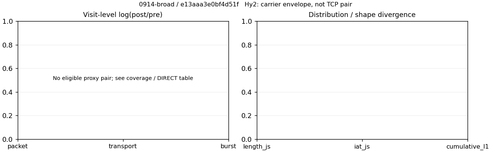

# 0914-broad · 条目 028 · gitee.com

目标：https://gitee.com/

活动标签：gitee.com::page_load。选定访问 3 次。

[返回总索引](../../README.md) · [统计口径](../../methods.md)

## 覆盖与资格（每次访问均保留）

| 部署 | 重复 | 主请求路由 | 活动状态 | 代理比较 | DIRECT pre | 请求 proxy/direct/unresolved | 错误 |
| --- | --- | --- | --- | --- | --- | --- | --- |
| Hy2 | 1 | direct | passed | 0 | 1 | 0/148/0 | [] |
| SS | 1 | direct | passed | 0 | 1 | 0/148/0 | [] |
| VLESS | 1 | direct | passed | 0 | 1 | 0/148/0 | [] |

主请求非 proxy 的统计仅解释为已索引的辅助代理连接或 DIRECT 观测，不代表目标业务经代理传输。播放确认与配对资格是两道不同的门。

图中散点为单次访问，短线为重复中位数；Hy2 是共享载体包络，不能与 TCP 配对作等范围因果对比。

形态图先逐访问归一化，再对访问等权平均；实线 pre，虚线 post。分箱序号及边界见 methods，不将分箱索引误解为长度或时间。

## 每次访问的关键观测

### SS

范围：`direct_pre_only`。每格 pre → post；空值为不可观测/不适用。

| 重复 | 包数 | 载荷字节 | burst | TCP FR | IAT中位µs | length JS | IAT JS |
| --- | --- | --- | --- | --- | --- | --- | --- |
| 1 | 3090 → — | 1.07e+07 → — | 1770 → — | 102 → — | 37.51 → — | — | — |

完整标量统计：中位数 [min,max]；Δ 为重复内逐访问变换的中位数，MAD 未缩放。n 为可用变换数；DIRECT-only 的 nΔ=0 不代表 pre 不可用。

| scope | 特征 | pre | post | Δ | IQRΔ | MADΔ | nΔ |
| --- | --- | --- | --- | --- | --- | --- | --- |
| direct_pre_only | active_span_sum_s_1000ms | 7.2686 [7.2686, 7.2686] | — | — | — | — | 0 |
| direct_pre_only | active_span_sum_s_100ms | 2.8983 [2.8983, 2.8983] | — | — | — | — | 0 |
| direct_pre_only | active_span_sum_s_500ms | 5.9853 [5.9853, 5.9853] | — | — | — | — | 0 |
| direct_pre_only | burst_bytes_iqr | 12288 [12288, 12288] | — | — | — | — | 0 |
| direct_pre_only | burst_bytes_mad | 74 [74, 74] | — | — | — | — | 0 |
| direct_pre_only | burst_bytes_max | 29400 [29400, 29400] | — | — | — | — | 0 |
| direct_pre_only | burst_bytes_mean | 6045 [6045, 6045] | — | — | — | — | 0 |
| direct_pre_only | burst_bytes_median | 74 [74, 74] | — | — | — | — | 0 |
| direct_pre_only | burst_bytes_min | 0 [0, 0] | — | — | — | — | 0 |
| direct_pre_only | burst_bytes_p95 | 20480 [20480, 20480] | — | — | — | — | 0 |
| direct_pre_only | burst_bytes_q25 | 0 [0, 0] | — | — | — | — | 0 |
| direct_pre_only | burst_bytes_q75 | 12288 [12288, 12288] | — | — | — | — | 0 |
| direct_pre_only | burst_bytes_std | 8401.4 [8401.4, 8401.4] | — | — | — | — | 0 |
| direct_pre_only | burst_count | 1770 [1770, 1770] | — | — | — | — | 0 |
| direct_pre_only | burst_duration_ms_iqr | 0.039804 [0.039804, 0.039804] | — | — | — | — | 0 |
| direct_pre_only | burst_duration_ms_mad | 0 [0, 0] | — | — | — | — | 0 |
| direct_pre_only | burst_duration_ms_max | 9717.7 [9717.7, 9717.7] | — | — | — | — | 0 |
| direct_pre_only | burst_duration_ms_mean | 32.844 [32.844, 32.844] | — | — | — | — | 0 |
| direct_pre_only | burst_duration_ms_median | 0 [0, 0] | — | — | — | — | 0 |
| direct_pre_only | burst_duration_ms_min | 0 [0, 0] | — | — | — | — | 0 |
| direct_pre_only | burst_duration_ms_p95 | 4.2972 [4.2972, 4.2972] | — | — | — | — | 0 |
| direct_pre_only | burst_duration_ms_q25 | 0 [0, 0] | — | — | — | — | 0 |
| direct_pre_only | burst_duration_ms_q75 | 0.039804 [0.039804, 0.039804] | — | — | — | — | 0 |
| direct_pre_only | burst_duration_ms_std | 376.28 [376.28, 376.28] | — | — | — | — | 0 |
| direct_pre_only | burst_packets_iqr | 1 [1, 1] | — | — | — | — | 0 |
| direct_pre_only | burst_packets_mad | 0 [0, 0] | — | — | — | — | 0 |
| direct_pre_only | burst_packets_max | 9 [9, 9] | — | — | — | — | 0 |
| direct_pre_only | burst_packets_mean | 1.7458 [1.7458, 1.7458] | — | — | — | — | 0 |
| direct_pre_only | burst_packets_median | 1 [1, 1] | — | — | — | — | 0 |
| direct_pre_only | burst_packets_min | 1 [1, 1] | — | — | — | — | 0 |
| direct_pre_only | burst_packets_p95 | 4 [4, 4] | — | — | — | — | 0 |
| direct_pre_only | burst_packets_q25 | 1 [1, 1] | — | — | — | — | 0 |
| direct_pre_only | burst_packets_q75 | 2 [2, 2] | — | — | — | — | 0 |
| direct_pre_only | burst_packets_std | 1.0398 [1.0398, 1.0398] | — | — | — | — | 0 |
| direct_pre_only | connection_span_concurrency_max | 10 [10, 10] | — | — | — | — | 0 |
| direct_pre_only | direction_entropy | 0.47442 [0.47442, 0.47442] | — | — | — | — | 0 |
| direct_pre_only | down_burst_count | 879 [879, 879] | — | — | — | — | 0 |
| direct_pre_only | down_ip_bytes | 1.0747e+07 [1.0747e+07, 1.0747e+07] | — | — | — | — | 0 |
| direct_pre_only | down_packets | 2081 [2081, 2081] | — | — | — | — | 0 |
| direct_pre_only | down_transport_bytes | 1.0639e+07 [1.0639e+07, 1.0639e+07] | — | — | — | — | 0 |
| direct_pre_only | duration_s | 17.725 [17.725, 17.725] | — | — | — | — | 0 |
| direct_pre_only | entity_count | 12 [12, 12] | — | — | — | — | 0 |
| direct_pre_only | fr_runs | 102 [102, 102] | — | — | — | — | 0 |
| direct_pre_only | fr_runs_per_packet | 0.048711 [0.048711, 0.048711] | — | — | — | — | 0 |
| direct_pre_only | fr_switches | 90 [90, 90] | — | — | — | — | 0 |
| direct_pre_only | fr_switches_per_possible_transition | 0.043228 [0.043228, 0.043228] | — | — | — | — | 0 |
| direct_pre_only | full_retransmission_fraction | 0.014887 [0.014887, 0.014887] | — | — | — | — | 0 |
| direct_pre_only | full_retransmission_packets | 46 [46, 46] | — | — | — | — | 0 |
| direct_pre_only | iat_count | 3078 [3078, 3078] | — | — | — | — | 0 |
| direct_pre_only | iat_median_us | 37.51 [37.51, 37.51] | — | — | — | — | 0 |
| direct_pre_only | iat_us_iqr | 126.19 [126.19, 126.19] | — | — | — | — | 0 |
| direct_pre_only | iat_us_mad | 29.398 [29.398, 29.398] | — | — | — | — | 0 |
| direct_pre_only | iat_us_max | 9.7177e+06 [9.7177e+06, 9.7177e+06] | — | — | — | — | 0 |
| direct_pre_only | iat_us_mean | 20747 [20747, 20747] | — | — | — | — | 0 |
| direct_pre_only | iat_us_median | 37.51 [37.51, 37.51] | — | — | — | — | 0 |
| direct_pre_only | iat_us_min | 0.1 [0.1, 0.1] | — | — | — | — | 0 |
| direct_pre_only | iat_us_p95 | 3119.4 [3119.4, 3119.4] | — | — | — | — | 0 |
| direct_pre_only | iat_us_q25 | 11.84 [11.84, 11.84] | — | — | — | — | 0 |
| direct_pre_only | iat_us_q75 | 138.03 [138.03, 138.03] | — | — | — | — | 0 |
| direct_pre_only | iat_us_std | 2.9252e+05 [2.9252e+05, 2.9252e+05] | — | — | — | — | 0 |
| direct_pre_only | idle_gap_count_1000ms | 15 [15, 15] | — | — | — | — | 0 |
| direct_pre_only | idle_gap_count_100ms | 30 [30, 30] | — | — | — | — | 0 |
| direct_pre_only | idle_gap_count_500ms | 17 [17, 17] | — | — | — | — | 0 |
| direct_pre_only | idle_gap_sum_s_1000ms | 56.59 [56.59, 56.59] | — | — | — | — | 0 |
| direct_pre_only | idle_gap_sum_s_100ms | 60.96 [60.96, 60.96] | — | — | — | — | 0 |
| direct_pre_only | idle_gap_sum_s_500ms | 57.873 [57.873, 57.873] | — | — | — | — | 0 |
| direct_pre_only | ip_bytes | 1.0861e+07 [1.0861e+07, 1.0861e+07] | — | — | — | — | 0 |
| direct_pre_only | length_iqr | 6280 [6280, 6280] | — | — | — | — | 0 |
| direct_pre_only | length_mad | 3599.5 [3599.5, 3599.5] | — | — | — | — | 0 |
| direct_pre_only | length_max | 8920 [8920, 8920] | — | — | — | — | 0 |
| direct_pre_only | length_mean | 5109.6 [5109.6, 5109.6] | — | — | — | — | 0 |
| direct_pre_only | length_median | 4824 [4824, 4824] | — | — | — | — | 0 |
| direct_pre_only | length_min | 12 [12, 12] | — | — | — | — | 0 |
| direct_pre_only | length_p95 | 8920 [8920, 8920] | — | — | — | — | 0 |
| direct_pre_only | length_q25 | 2640 [2640, 2640] | — | — | — | — | 0 |
| direct_pre_only | length_q75 | 8920 [8920, 8920] | — | — | — | — | 0 |
| direct_pre_only | length_std | 3338.4 [3338.4, 3338.4] | — | — | — | — | 0 |
| direct_pre_only | nonempty_entity_count | 12 [12, 12] | — | — | — | — | 0 |
| direct_pre_only | nonempty_packets | 2094 [2094, 2094] | — | — | — | — | 0 |
| direct_pre_only | offload_suspect_fraction | 0.55405 [0.55405, 0.55405] | — | — | — | — | 0 |
| direct_pre_only | packet_count | 3090 [3090, 3090] | — | — | — | — | 0 |
| direct_pre_only | rtt_median_ms | 0.10704 [0.10704, 0.10704] | — | — | — | — | 0 |
| direct_pre_only | rtt_sample_count | 956 [956, 956] | — | — | — | — | 0 |
| direct_pre_only | tcp_ack_count | 3076 [3076, 3076] | — | — | — | — | 0 |
| direct_pre_only | tcp_fin_count | 24 [24, 24] | — | — | — | — | 0 |
| direct_pre_only | tcp_packet_count | 3090 [3090, 3090] | — | — | — | — | 0 |
| direct_pre_only | tcp_rst_count | 2 [2, 2] | — | — | — | — | 0 |
| direct_pre_only | tcp_syn_count | 24 [24, 24] | — | — | — | — | 0 |
| direct_pre_only | tcp_window_raw_median | 65535 [65535, 65535] | — | — | — | — | 0 |
| direct_pre_only | transition_entropy | 0.21406 [0.21406, 0.21406] | — | — | — | — | 0 |
| direct_pre_only | transition_n_mm | 1831 [1831, 1831] | — | — | — | — | 0 |
| direct_pre_only | transition_n_mp | 40 [40, 40] | — | — | — | — | 0 |
| direct_pre_only | transition_n_pm | 50 [50, 50] | — | — | — | — | 0 |
| direct_pre_only | transition_n_pp | 161 [161, 161] | — | — | — | — | 0 |
| direct_pre_only | transition_p_mm | 0.97862 [0.97862, 0.97862] | — | — | — | — | 0 |
| direct_pre_only | transition_p_mp | 0.021379 [0.021379, 0.021379] | — | — | — | — | 0 |
| direct_pre_only | transition_p_pm | 0.23697 [0.23697, 0.23697] | — | — | — | — | 0 |
| direct_pre_only | transition_p_pp | 0.76303 [0.76303, 0.76303] | — | — | — | — | 0 |
| direct_pre_only | transport_bytes | 1.07e+07 [1.07e+07, 1.07e+07] | — | — | — | — | 0 |
| direct_pre_only | up_burst_count | 891 [891, 891] | — | — | — | — | 0 |
| direct_pre_only | up_byte_fraction | 0.0057065 [0.0057065, 0.0057065] | — | — | — | — | 0 |
| direct_pre_only | up_ip_bytes | 1.1415e+05 [1.1415e+05, 1.1415e+05] | — | — | — | — | 0 |
| direct_pre_only | up_packets | 1009 [1009, 1009] | — | — | — | — | 0 |
| direct_pre_only | up_transport_bytes | 61057 [61057, 61057] | — | — | — | — | 0 |
| direct_pre_only | zero_iat_count | 0 [0, 0] | — | — | — | — | 0 |
| direct_pre_only | zero_iat_fraction | 0 [0, 0] | — | — | — | — | 0 |

### VLESS

范围：`direct_pre_only`。每格 pre → post；空值为不可观测/不适用。

| 重复 | 包数 | 载荷字节 | burst | TCP FR | IAT中位µs | length JS | IAT JS |
| --- | --- | --- | --- | --- | --- | --- | --- |
| 1 | 3041 → — | 1.0707e+07 → — | 1845 → — | 108 → — | 40.023 → — | — | — |

完整标量统计：中位数 [min,max]；Δ 为重复内逐访问变换的中位数，MAD 未缩放。n 为可用变换数；DIRECT-only 的 nΔ=0 不代表 pre 不可用。

| scope | 特征 | pre | post | Δ | IQRΔ | MADΔ | nΔ |
| --- | --- | --- | --- | --- | --- | --- | --- |
| direct_pre_only | active_span_sum_s_1000ms | 7.6666 [7.6666, 7.6666] | — | — | — | — | 0 |
| direct_pre_only | active_span_sum_s_100ms | 2.6604 [2.6604, 2.6604] | — | — | — | — | 0 |
| direct_pre_only | active_span_sum_s_500ms | 7.6666 [7.6666, 7.6666] | — | — | — | — | 0 |
| direct_pre_only | burst_bytes_iqr | 10758 [10758, 10758] | — | — | — | — | 0 |
| direct_pre_only | burst_bytes_mad | 74 [74, 74] | — | — | — | — | 0 |
| direct_pre_only | burst_bytes_max | 29400 [29400, 29400] | — | — | — | — | 0 |
| direct_pre_only | burst_bytes_mean | 5803.1 [5803.1, 5803.1] | — | — | — | — | 0 |
| direct_pre_only | burst_bytes_median | 74 [74, 74] | — | — | — | — | 0 |
| direct_pre_only | burst_bytes_min | 0 [0, 0] | — | — | — | — | 0 |
| direct_pre_only | burst_bytes_p95 | 20480 [20480, 20480] | — | — | — | — | 0 |
| direct_pre_only | burst_bytes_q25 | 0 [0, 0] | — | — | — | — | 0 |
| direct_pre_only | burst_bytes_q75 | 10758 [10758, 10758] | — | — | — | — | 0 |
| direct_pre_only | burst_bytes_std | 8197.3 [8197.3, 8197.3] | — | — | — | — | 0 |
| direct_pre_only | burst_count | 1845 [1845, 1845] | — | — | — | — | 0 |
| direct_pre_only | burst_duration_ms_iqr | 0.034828 [0.034828, 0.034828] | — | — | — | — | 0 |
| direct_pre_only | burst_duration_ms_mad | 0 [0, 0] | — | — | — | — | 0 |
| direct_pre_only | burst_duration_ms_max | 9468.1 [9468.1, 9468.1] | — | — | — | — | 0 |
| direct_pre_only | burst_duration_ms_mean | 20.743 [20.743, 20.743] | — | — | — | — | 0 |
| direct_pre_only | burst_duration_ms_median | 0 [0, 0] | — | — | — | — | 0 |
| direct_pre_only | burst_duration_ms_min | 0 [0, 0] | — | — | — | — | 0 |
| direct_pre_only | burst_duration_ms_p95 | 4.5409 [4.5409, 4.5409] | — | — | — | — | 0 |
| direct_pre_only | burst_duration_ms_q25 | 0 [0, 0] | — | — | — | — | 0 |
| direct_pre_only | burst_duration_ms_q75 | 0.034828 [0.034828, 0.034828] | — | — | — | — | 0 |
| direct_pre_only | burst_duration_ms_std | 293.01 [293.01, 293.01] | — | — | — | — | 0 |
| direct_pre_only | burst_packets_iqr | 1 [1, 1] | — | — | — | — | 0 |
| direct_pre_only | burst_packets_mad | 0 [0, 0] | — | — | — | — | 0 |
| direct_pre_only | burst_packets_max | 8 [8, 8] | — | — | — | — | 0 |
| direct_pre_only | burst_packets_mean | 1.6482 [1.6482, 1.6482] | — | — | — | — | 0 |
| direct_pre_only | burst_packets_median | 1 [1, 1] | — | — | — | — | 0 |
| direct_pre_only | burst_packets_min | 1 [1, 1] | — | — | — | — | 0 |
| direct_pre_only | burst_packets_p95 | 4 [4, 4] | — | — | — | — | 0 |
| direct_pre_only | burst_packets_q25 | 1 [1, 1] | — | — | — | — | 0 |
| direct_pre_only | burst_packets_q75 | 2 [2, 2] | — | — | — | — | 0 |
| direct_pre_only | burst_packets_std | 1.0107 [1.0107, 1.0107] | — | — | — | — | 0 |
| direct_pre_only | connection_span_concurrency_max | 9 [9, 9] | — | — | — | — | 0 |
| direct_pre_only | direction_entropy | 0.48074 [0.48074, 0.48074] | — | — | — | — | 0 |
| direct_pre_only | down_burst_count | 916 [916, 916] | — | — | — | — | 0 |
| direct_pre_only | down_ip_bytes | 1.0747e+07 [1.0747e+07, 1.0747e+07] | — | — | — | — | 0 |
| direct_pre_only | down_packets | 1978 [1978, 1978] | — | — | — | — | 0 |
| direct_pre_only | down_transport_bytes | 1.0644e+07 [1.0644e+07, 1.0644e+07] | — | — | — | — | 0 |
| direct_pre_only | duration_s | 17.925 [17.925, 17.925] | — | — | — | — | 0 |
| direct_pre_only | entity_count | 13 [13, 13] | — | — | — | — | 0 |
| direct_pre_only | fr_runs | 108 [108, 108] | — | — | — | — | 0 |
| direct_pre_only | fr_runs_per_packet | 0.053865 [0.053865, 0.053865] | — | — | — | — | 0 |
| direct_pre_only | fr_switches | 95 [95, 95] | — | — | — | — | 0 |
| direct_pre_only | fr_switches_per_possible_transition | 0.047691 [0.047691, 0.047691] | — | — | — | — | 0 |
| direct_pre_only | full_retransmission_fraction | 0.018415 [0.018415, 0.018415] | — | — | — | — | 0 |
| direct_pre_only | full_retransmission_packets | 56 [56, 56] | — | — | — | — | 0 |
| direct_pre_only | iat_count | 3028 [3028, 3028] | — | — | — | — | 0 |
| direct_pre_only | iat_median_us | 40.023 [40.023, 40.023] | — | — | — | — | 0 |
| direct_pre_only | iat_us_iqr | 129.18 [129.18, 129.18] | — | — | — | — | 0 |
| direct_pre_only | iat_us_mad | 32.816 [32.816, 32.816] | — | — | — | — | 0 |
| direct_pre_only | iat_us_max | 9.4681e+06 [9.4681e+06, 9.4681e+06] | — | — | — | — | 0 |
| direct_pre_only | iat_us_mean | 13659 [13659, 13659] | — | — | — | — | 0 |
| direct_pre_only | iat_us_median | 40.023 [40.023, 40.023] | — | — | — | — | 0 |
| direct_pre_only | iat_us_min | 0.244 [0.244, 0.244] | — | — | — | — | 0 |
| direct_pre_only | iat_us_p95 | 3452.6 [3452.6, 3452.6] | — | — | — | — | 0 |
| direct_pre_only | iat_us_q25 | 10.573 [10.573, 10.573] | — | — | — | — | 0 |
| direct_pre_only | iat_us_q75 | 139.75 [139.75, 139.75] | — | — | — | — | 0 |
| direct_pre_only | iat_us_std | 2.3084e+05 [2.3084e+05, 2.3084e+05] | — | — | — | — | 0 |
| direct_pre_only | idle_gap_count_1000ms | 12 [12, 12] | — | — | — | — | 0 |
| direct_pre_only | idle_gap_count_100ms | 31 [31, 31] | — | — | — | — | 0 |
| direct_pre_only | idle_gap_count_500ms | 12 [12, 12] | — | — | — | — | 0 |
| direct_pre_only | idle_gap_sum_s_1000ms | 33.694 [33.694, 33.694] | — | — | — | — | 0 |
| direct_pre_only | idle_gap_sum_s_100ms | 38.7 [38.7, 38.7] | — | — | — | — | 0 |
| direct_pre_only | idle_gap_sum_s_500ms | 33.694 [33.694, 33.694] | — | — | — | — | 0 |
| direct_pre_only | ip_bytes | 1.0866e+07 [1.0866e+07, 1.0866e+07] | — | — | — | — | 0 |
| direct_pre_only | length_iqr | 6280 [6280, 6280] | — | — | — | — | 0 |
| direct_pre_only | length_mad | 3272 [3272, 3272] | — | — | — | — | 0 |
| direct_pre_only | length_max | 8920 [8920, 8920] | — | — | — | — | 0 |
| direct_pre_only | length_mean | 5340 [5340, 5340] | — | — | — | — | 0 |
| direct_pre_only | length_median | 5648 [5648, 5648] | — | — | — | — | 0 |
| direct_pre_only | length_min | 31 [31, 31] | — | — | — | — | 0 |
| direct_pre_only | length_p95 | 8920 [8920, 8920] | — | — | — | — | 0 |
| direct_pre_only | length_q25 | 2640 [2640, 2640] | — | — | — | — | 0 |
| direct_pre_only | length_q75 | 8920 [8920, 8920] | — | — | — | — | 0 |
| direct_pre_only | length_std | 3361.9 [3361.9, 3361.9] | — | — | — | — | 0 |
| direct_pre_only | nonempty_entity_count | 13 [13, 13] | — | — | — | — | 0 |
| direct_pre_only | nonempty_packets | 2005 [2005, 2005] | — | — | — | — | 0 |
| direct_pre_only | offload_suspect_fraction | 0.54719 [0.54719, 0.54719] | — | — | — | — | 0 |
| direct_pre_only | packet_count | 3041 [3041, 3041] | — | — | — | — | 0 |
| direct_pre_only | rtt_median_ms | 0.081266 [0.081266, 0.081266] | — | — | — | — | 0 |
| direct_pre_only | rtt_sample_count | 993 [993, 993] | — | — | — | — | 0 |
| direct_pre_only | tcp_ack_count | 3026 [3026, 3026] | — | — | — | — | 0 |
| direct_pre_only | tcp_fin_count | 26 [26, 26] | — | — | — | — | 0 |
| direct_pre_only | tcp_packet_count | 3041 [3041, 3041] | — | — | — | — | 0 |
| direct_pre_only | tcp_rst_count | 2 [2, 2] | — | — | — | — | 0 |
| direct_pre_only | tcp_syn_count | 26 [26, 26] | — | — | — | — | 0 |
| direct_pre_only | tcp_window_raw_median | 65535 [65535, 65535] | — | — | — | — | 0 |
| direct_pre_only | transition_entropy | 0.2292 [0.2292, 0.2292] | — | — | — | — | 0 |
| direct_pre_only | transition_n_mm | 1744 [1744, 1744] | — | — | — | — | 0 |
| direct_pre_only | transition_n_mp | 42 [42, 42] | — | — | — | — | 0 |
| direct_pre_only | transition_n_pm | 53 [53, 53] | — | — | — | — | 0 |
| direct_pre_only | transition_n_pp | 153 [153, 153] | — | — | — | — | 0 |
| direct_pre_only | transition_p_mm | 0.97648 [0.97648, 0.97648] | — | — | — | — | 0 |
| direct_pre_only | transition_p_mp | 0.023516 [0.023516, 0.023516] | — | — | — | — | 0 |
| direct_pre_only | transition_p_pm | 0.25728 [0.25728, 0.25728] | — | — | — | — | 0 |
| direct_pre_only | transition_p_pp | 0.74272 [0.74272, 0.74272] | — | — | — | — | 0 |
| direct_pre_only | transport_bytes | 1.0707e+07 [1.0707e+07, 1.0707e+07] | — | — | — | — | 0 |
| direct_pre_only | up_burst_count | 929 [929, 929] | — | — | — | — | 0 |
| direct_pre_only | up_byte_fraction | 0.0059057 [0.0059057, 0.0059057] | — | — | — | — | 0 |
| direct_pre_only | up_ip_bytes | 1.1926e+05 [1.1926e+05, 1.1926e+05] | — | — | — | — | 0 |
| direct_pre_only | up_packets | 1063 [1063, 1063] | — | — | — | — | 0 |
| direct_pre_only | up_transport_bytes | 63231 [63231, 63231] | — | — | — | — | 0 |
| direct_pre_only | zero_iat_count | 0 [0, 0] | — | — | — | — | 0 |
| direct_pre_only | zero_iat_fraction | 0 [0, 0] | — | — | — | — | 0 |

### Hy2

范围：`direct_pre_only`。每格 pre → post；空值为不可观测/不适用。

| 重复 | 包数 | 载荷字节 | burst | TCP FR | IAT中位µs | length JS | IAT JS |
| --- | --- | --- | --- | --- | --- | --- | --- |
| 1 | 2244 → — | 7.5815e+06 → — | 1323 → — | 106 → — | 45.634 → — | — | — |

完整标量统计：中位数 [min,max]；Δ 为重复内逐访问变换的中位数，MAD 未缩放。n 为可用变换数；DIRECT-only 的 nΔ=0 不代表 pre 不可用。

| scope | 特征 | pre | post | Δ | IQRΔ | MADΔ | nΔ |
| --- | --- | --- | --- | --- | --- | --- | --- |
| direct_pre_only | active_span_sum_s_1000ms | 6.3247 [6.3247, 6.3247] | — | — | — | — | 0 |
| direct_pre_only | active_span_sum_s_100ms | 2.7991 [2.7991, 2.7991] | — | — | — | — | 0 |
| direct_pre_only | active_span_sum_s_500ms | 6.3247 [6.3247, 6.3247] | — | — | — | — | 0 |
| direct_pre_only | burst_bytes_iqr | 12036 [12036, 12036] | — | — | — | — | 0 |
| direct_pre_only | burst_bytes_mad | 74 [74, 74] | — | — | — | — | 0 |
| direct_pre_only | burst_bytes_max | 24576 [24576, 24576] | — | — | — | — | 0 |
| direct_pre_only | burst_bytes_mean | 5730.5 [5730.5, 5730.5] | — | — | — | — | 0 |
| direct_pre_only | burst_bytes_median | 74 [74, 74] | — | — | — | — | 0 |
| direct_pre_only | burst_bytes_min | 0 [0, 0] | — | — | — | — | 0 |
| direct_pre_only | burst_bytes_p95 | 20480 [20480, 20480] | — | — | — | — | 0 |
| direct_pre_only | burst_bytes_q25 | 0 [0, 0] | — | — | — | — | 0 |
| direct_pre_only | burst_bytes_q75 | 12036 [12036, 12036] | — | — | — | — | 0 |
| direct_pre_only | burst_bytes_std | 7846.9 [7846.9, 7846.9] | — | — | — | — | 0 |
| direct_pre_only | burst_count | 1323 [1323, 1323] | — | — | — | — | 0 |
| direct_pre_only | burst_duration_ms_iqr | 0.040146 [0.040146, 0.040146] | — | — | — | — | 0 |
| direct_pre_only | burst_duration_ms_mad | 0 [0, 0] | — | — | — | — | 0 |
| direct_pre_only | burst_duration_ms_max | 14705 [14705, 14705] | — | — | — | — | 0 |
| direct_pre_only | burst_duration_ms_mean | 74.355 [74.355, 74.355] | — | — | — | — | 0 |
| direct_pre_only | burst_duration_ms_median | 0 [0, 0] | — | — | — | — | 0 |
| direct_pre_only | burst_duration_ms_min | 0 [0, 0] | — | — | — | — | 0 |
| direct_pre_only | burst_duration_ms_p95 | 14.933 [14.933, 14.933] | — | — | — | — | 0 |
| direct_pre_only | burst_duration_ms_q25 | 0 [0, 0] | — | — | — | — | 0 |
| direct_pre_only | burst_duration_ms_q75 | 0.040146 [0.040146, 0.040146] | — | — | — | — | 0 |
| direct_pre_only | burst_duration_ms_std | 932.5 [932.5, 932.5] | — | — | — | — | 0 |
| direct_pre_only | burst_packets_iqr | 1 [1, 1] | — | — | — | — | 0 |
| direct_pre_only | burst_packets_mad | 0 [0, 0] | — | — | — | — | 0 |
| direct_pre_only | burst_packets_max | 9 [9, 9] | — | — | — | — | 0 |
| direct_pre_only | burst_packets_mean | 1.6961 [1.6961, 1.6961] | — | — | — | — | 0 |
| direct_pre_only | burst_packets_median | 1 [1, 1] | — | — | — | — | 0 |
| direct_pre_only | burst_packets_min | 1 [1, 1] | — | — | — | — | 0 |
| direct_pre_only | burst_packets_p95 | 3 [3, 3] | — | — | — | — | 0 |
| direct_pre_only | burst_packets_q25 | 1 [1, 1] | — | — | — | — | 0 |
| direct_pre_only | burst_packets_q75 | 2 [2, 2] | — | — | — | — | 0 |
| direct_pre_only | burst_packets_std | 0.92003 [0.92003, 0.92003] | — | — | — | — | 0 |
| direct_pre_only | connection_span_concurrency_max | 10 [10, 10] | — | — | — | — | 0 |
| direct_pre_only | direction_entropy | 0.39663 [0.39663, 0.39663] | — | — | — | — | 0 |
| direct_pre_only | down_burst_count | 655 [655, 655] | — | — | — | — | 0 |
| direct_pre_only | down_ip_bytes | 7.6038e+06 [7.6038e+06, 7.6038e+06] | — | — | — | — | 0 |
| direct_pre_only | down_packets | 1487 [1487, 1487] | — | — | — | — | 0 |
| direct_pre_only | down_transport_bytes | 7.5264e+06 [7.5264e+06, 7.5264e+06] | — | — | — | — | 0 |
| direct_pre_only | duration_s | 17.281 [17.281, 17.281] | — | — | — | — | 0 |
| direct_pre_only | entity_count | 13 [13, 13] | — | — | — | — | 0 |
| direct_pre_only | fr_runs | 106 [106, 106] | — | — | — | — | 0 |
| direct_pre_only | fr_runs_per_packet | 0.07167 [0.07167, 0.07167] | — | — | — | — | 0 |
| direct_pre_only | fr_switches | 93 [93, 93] | — | — | — | — | 0 |
| direct_pre_only | fr_switches_per_possible_transition | 0.063438 [0.063438, 0.063438] | — | — | — | — | 0 |
| direct_pre_only | full_retransmission_fraction | 0.00089127 [0.00089127, 0.00089127] | — | — | — | — | 0 |
| direct_pre_only | full_retransmission_packets | 2 [2, 2] | — | — | — | — | 0 |
| direct_pre_only | iat_count | 2231 [2231, 2231] | — | — | — | — | 0 |
| direct_pre_only | iat_median_us | 45.634 [45.634, 45.634] | — | — | — | — | 0 |
| direct_pre_only | iat_us_iqr | 144.83 [144.83, 144.83] | — | — | — | — | 0 |
| direct_pre_only | iat_us_mad | 37.389 [37.389, 37.389] | — | — | — | — | 0 |
| direct_pre_only | iat_us_max | 1.5002e+07 [1.5002e+07, 1.5002e+07] | — | — | — | — | 0 |
| direct_pre_only | iat_us_mean | 68699 [68699, 68699] | — | — | — | — | 0 |
| direct_pre_only | iat_us_median | 45.634 [45.634, 45.634] | — | — | — | — | 0 |
| direct_pre_only | iat_us_min | 0.037 [0.037, 0.037] | — | — | — | — | 0 |
| direct_pre_only | iat_us_p95 | 8004.4 [8004.4, 8004.4] | — | — | — | — | 0 |
| direct_pre_only | iat_us_q25 | 12.407 [12.407, 12.407] | — | — | — | — | 0 |
| direct_pre_only | iat_us_q75 | 157.24 [157.24, 157.24] | — | — | — | — | 0 |
| direct_pre_only | iat_us_std | 8.9828e+05 [8.9828e+05, 8.9828e+05] | — | — | — | — | 0 |
| direct_pre_only | idle_gap_count_1000ms | 15 [15, 15] | — | — | — | — | 0 |
| direct_pre_only | idle_gap_count_100ms | 28 [28, 28] | — | — | — | — | 0 |
| direct_pre_only | idle_gap_count_500ms | 15 [15, 15] | — | — | — | — | 0 |
| direct_pre_only | idle_gap_sum_s_1000ms | 146.94 [146.94, 146.94] | — | — | — | — | 0 |
| direct_pre_only | idle_gap_sum_s_100ms | 150.47 [150.47, 150.47] | — | — | — | — | 0 |
| direct_pre_only | idle_gap_sum_s_500ms | 146.94 [146.94, 146.94] | — | — | — | — | 0 |
| direct_pre_only | ip_bytes | 7.6983e+06 [7.6983e+06, 7.6983e+06] | — | — | — | — | 0 |
| direct_pre_only | length_iqr | 6280 [6280, 6280] | — | — | — | — | 0 |
| direct_pre_only | length_mad | 3264 [3264, 3264] | — | — | — | — | 0 |
| direct_pre_only | length_max | 8920 [8920, 8920] | — | — | — | — | 0 |
| direct_pre_only | length_mean | 5126.1 [5126.1, 5126.1] | — | — | — | — | 0 |
| direct_pre_only | length_median | 4200 [4200, 4200] | — | — | — | — | 0 |
| direct_pre_only | length_min | 6 [6, 6] | — | — | — | — | 0 |
| direct_pre_only | length_p95 | 8920 [8920, 8920] | — | — | — | — | 0 |
| direct_pre_only | length_q25 | 2640 [2640, 2640] | — | — | — | — | 0 |
| direct_pre_only | length_q75 | 8920 [8920, 8920] | — | — | — | — | 0 |
| direct_pre_only | length_std | 3245.9 [3245.9, 3245.9] | — | — | — | — | 0 |
| direct_pre_only | nonempty_entity_count | 13 [13, 13] | — | — | — | — | 0 |
| direct_pre_only | nonempty_packets | 1479 [1479, 1479] | — | — | — | — | 0 |
| direct_pre_only | offload_suspect_fraction | 0.54902 [0.54902, 0.54902] | — | — | — | — | 0 |
| direct_pre_only | packet_count | 2244 [2244, 2244] | — | — | — | — | 0 |
| direct_pre_only | rtt_median_ms | 0.10571 [0.10571, 0.10571] | — | — | — | — | 0 |
| direct_pre_only | rtt_sample_count | 727 [727, 727] | — | — | — | — | 0 |
| direct_pre_only | tcp_ack_count | 2228 [2228, 2228] | — | — | — | — | 0 |
| direct_pre_only | tcp_fin_count | 24 [24, 24] | — | — | — | — | 0 |
| direct_pre_only | tcp_packet_count | 2244 [2244, 2244] | — | — | — | — | 0 |
| direct_pre_only | tcp_rst_count | 4 [4, 4] | — | — | — | — | 0 |
| direct_pre_only | tcp_syn_count | 26 [26, 26] | — | — | — | — | 0 |
| direct_pre_only | tcp_window_raw_median | 65535 [65535, 65535] | — | — | — | — | 0 |
| direct_pre_only | transition_entropy | 0.25811 [0.25811, 0.25811] | — | — | — | — | 0 |
| direct_pre_only | transition_n_mm | 1311 [1311, 1311] | — | — | — | — | 0 |
| direct_pre_only | transition_n_mp | 41 [41, 41] | — | — | — | — | 0 |
| direct_pre_only | transition_n_pm | 52 [52, 52] | — | — | — | — | 0 |
| direct_pre_only | transition_n_pp | 62 [62, 62] | — | — | — | — | 0 |
| direct_pre_only | transition_p_mm | 0.96967 [0.96967, 0.96967] | — | — | — | — | 0 |
| direct_pre_only | transition_p_mp | 0.030325 [0.030325, 0.030325] | — | — | — | — | 0 |
| direct_pre_only | transition_p_pm | 0.45614 [0.45614, 0.45614] | — | — | — | — | 0 |
| direct_pre_only | transition_p_pp | 0.54386 [0.54386, 0.54386] | — | — | — | — | 0 |
| direct_pre_only | transport_bytes | 7.5815e+06 [7.5815e+06, 7.5815e+06] | — | — | — | — | 0 |
| direct_pre_only | up_burst_count | 668 [668, 668] | — | — | — | — | 0 |
| direct_pre_only | up_byte_fraction | 0.0072692 [0.0072692, 0.0072692] | — | — | — | — | 0 |
| direct_pre_only | up_ip_bytes | 94567 [94567, 94567] | — | — | — | — | 0 |
| direct_pre_only | up_packets | 757 [757, 757] | — | — | — | — | 0 |
| direct_pre_only | up_transport_bytes | 55111 [55111, 55111] | — | — | — | — | 0 |
| direct_pre_only | zero_iat_count | 0 [0, 0] | — | — | — | — | 0 |
| direct_pre_only | zero_iat_fraction | 0 [0, 0] | — | — | — | — | 0 |

## 不同部署对比

以下是各部署自身重复中位数的差异，不按重复编号强行配对。跨 TCP/Hy2 的行标记异质观测范围。

| 视角 | 特征 | 部署A | 部署B | A中位 | B中位 | B−A | 比较口径 |
| --- | --- | --- | --- | --- | --- | --- | --- |
| pre | burst_count | SS | VLESS | 1770 | 1845 | 75 | same_scope_unpaired_visits |
| pre | burst_count | SS | Hy2 | 1770 | 1323 | -447 | same_scope_unpaired_visits |
| pre | burst_count | VLESS | Hy2 | 1845 | 1323 | -522 | same_scope_unpaired_visits |
| pre | connection_span_concurrency_max | SS | VLESS | 10 | 9 | -1 | same_scope_unpaired_visits |
| pre | connection_span_concurrency_max | SS | Hy2 | 10 | 10 | 0 | same_scope_unpaired_visits |
| pre | connection_span_concurrency_max | VLESS | Hy2 | 9 | 10 | 1 | same_scope_unpaired_visits |
| pre | direction_entropy | SS | VLESS | 0.47442 | 0.48074 | 0.0063205 | same_scope_unpaired_visits |
| pre | direction_entropy | SS | Hy2 | 0.47442 | 0.39663 | -0.077794 | same_scope_unpaired_visits |
| pre | direction_entropy | VLESS | Hy2 | 0.48074 | 0.39663 | -0.084114 | same_scope_unpaired_visits |
| pre | down_transport_bytes | SS | VLESS | 1.0639e+07 | 1.0644e+07 | 5054 | same_scope_unpaired_visits |
| pre | down_transport_bytes | SS | Hy2 | 1.0639e+07 | 7.5264e+06 | -3.1122e+06 | same_scope_unpaired_visits |
| pre | down_transport_bytes | VLESS | Hy2 | 1.0644e+07 | 7.5264e+06 | -3.1172e+06 | same_scope_unpaired_visits |
| pre | duration_s | SS | VLESS | 17.725 | 17.925 | 0.20015 | same_scope_unpaired_visits |
| pre | duration_s | SS | Hy2 | 17.725 | 17.281 | -0.44362 | same_scope_unpaired_visits |
| pre | duration_s | VLESS | Hy2 | 17.925 | 17.281 | -0.64377 | same_scope_unpaired_visits |
| pre | entity_count | SS | VLESS | 12 | 13 | 1 | same_scope_unpaired_visits |
| pre | entity_count | SS | Hy2 | 12 | 13 | 1 | same_scope_unpaired_visits |
| pre | entity_count | VLESS | Hy2 | 13 | 13 | 0 | same_scope_unpaired_visits |
| pre | fr_runs | SS | VLESS | 102 | 108 | 6 | same_scope_unpaired_visits |
| pre | fr_runs | SS | Hy2 | 102 | 106 | 4 | same_scope_unpaired_visits |
| pre | fr_runs | VLESS | Hy2 | 108 | 106 | -2 | same_scope_unpaired_visits |
| pre | fr_runs_per_packet | SS | VLESS | 0.048711 | 0.053865 | 0.0051547 | same_scope_unpaired_visits |
| pre | fr_runs_per_packet | SS | Hy2 | 0.048711 | 0.07167 | 0.022959 | same_scope_unpaired_visits |
| pre | fr_runs_per_packet | VLESS | Hy2 | 0.053865 | 0.07167 | 0.017805 | same_scope_unpaired_visits |
| pre | fr_switches | SS | VLESS | 90 | 95 | 5 | same_scope_unpaired_visits |
| pre | fr_switches | SS | Hy2 | 90 | 93 | 3 | same_scope_unpaired_visits |
| pre | fr_switches | VLESS | Hy2 | 95 | 93 | -2 | same_scope_unpaired_visits |
| pre | fr_switches_per_possible_transition | SS | VLESS | 0.043228 | 0.047691 | 0.0044631 | same_scope_unpaired_visits |
| pre | fr_switches_per_possible_transition | SS | Hy2 | 0.043228 | 0.063438 | 0.02021 | same_scope_unpaired_visits |
| pre | fr_switches_per_possible_transition | VLESS | Hy2 | 0.047691 | 0.063438 | 0.015747 | same_scope_unpaired_visits |
| pre | full_retransmission_fraction | SS | VLESS | 0.014887 | 0.018415 | 0.0035283 | same_scope_unpaired_visits |
| pre | full_retransmission_fraction | SS | Hy2 | 0.014887 | 0.00089127 | -0.013995 | same_scope_unpaired_visits |
| pre | full_retransmission_fraction | VLESS | Hy2 | 0.018415 | 0.00089127 | -0.017524 | same_scope_unpaired_visits |
| pre | iat_median_us | SS | VLESS | 37.51 | 40.023 | 2.513 | same_scope_unpaired_visits |
| pre | iat_median_us | SS | Hy2 | 37.51 | 45.634 | 8.124 | same_scope_unpaired_visits |
| pre | iat_median_us | VLESS | Hy2 | 40.023 | 45.634 | 5.611 | same_scope_unpaired_visits |
| pre | iat_us_p95 | SS | VLESS | 3119.4 | 3452.6 | 333.19 | same_scope_unpaired_visits |
| pre | iat_us_p95 | SS | Hy2 | 3119.4 | 8004.4 | 4884.9 | same_scope_unpaired_visits |
| pre | iat_us_p95 | VLESS | Hy2 | 3452.6 | 8004.4 | 4551.7 | same_scope_unpaired_visits |
| pre | ip_bytes | SS | VLESS | 1.0861e+07 | 1.0866e+07 | 4816 | same_scope_unpaired_visits |
| pre | ip_bytes | SS | Hy2 | 1.0861e+07 | 7.6983e+06 | -3.1626e+06 | same_scope_unpaired_visits |
| pre | ip_bytes | VLESS | Hy2 | 1.0866e+07 | 7.6983e+06 | -3.1674e+06 | same_scope_unpaired_visits |
| pre | length_median | SS | VLESS | 4824 | 5648 | 824 | same_scope_unpaired_visits |
| pre | length_median | SS | Hy2 | 4824 | 4200 | -624 | same_scope_unpaired_visits |
| pre | length_median | VLESS | Hy2 | 5648 | 4200 | -1448 | same_scope_unpaired_visits |
| pre | length_p95 | SS | VLESS | 8920 | 8920 | 0 | same_scope_unpaired_visits |
| pre | length_p95 | SS | Hy2 | 8920 | 8920 | 0 | same_scope_unpaired_visits |
| pre | length_p95 | VLESS | Hy2 | 8920 | 8920 | 0 | same_scope_unpaired_visits |
| pre | nonempty_packets | SS | VLESS | 2094 | 2005 | -89 | same_scope_unpaired_visits |
| pre | nonempty_packets | SS | Hy2 | 2094 | 1479 | -615 | same_scope_unpaired_visits |
| pre | nonempty_packets | VLESS | Hy2 | 2005 | 1479 | -526 | same_scope_unpaired_visits |
| pre | offload_suspect_fraction | SS | VLESS | 0.55405 | 0.54719 | -0.0068569 | same_scope_unpaired_visits |
| pre | offload_suspect_fraction | SS | Hy2 | 0.55405 | 0.54902 | -0.0050257 | same_scope_unpaired_visits |
| pre | offload_suspect_fraction | VLESS | Hy2 | 0.54719 | 0.54902 | 0.0018312 | same_scope_unpaired_visits |
| pre | packet_count | SS | VLESS | 3090 | 3041 | -49 | same_scope_unpaired_visits |
| pre | packet_count | SS | Hy2 | 3090 | 2244 | -846 | same_scope_unpaired_visits |
| pre | packet_count | VLESS | Hy2 | 3041 | 2244 | -797 | same_scope_unpaired_visits |
| pre | rtt_median_ms | SS | VLESS | 0.10704 | 0.081266 | -0.025772 | same_scope_unpaired_visits |
| pre | rtt_median_ms | SS | Hy2 | 0.10704 | 0.10571 | -0.0013305 | same_scope_unpaired_visits |
| pre | rtt_median_ms | VLESS | Hy2 | 0.081266 | 0.10571 | 0.024442 | same_scope_unpaired_visits |
| pre | transition_entropy | SS | VLESS | 0.21406 | 0.2292 | 0.015137 | same_scope_unpaired_visits |
| pre | transition_entropy | SS | Hy2 | 0.21406 | 0.25811 | 0.044048 | same_scope_unpaired_visits |
| pre | transition_entropy | VLESS | Hy2 | 0.2292 | 0.25811 | 0.028911 | same_scope_unpaired_visits |
| pre | transport_bytes | SS | VLESS | 1.07e+07 | 1.0707e+07 | 7228 | same_scope_unpaired_visits |
| pre | transport_bytes | SS | Hy2 | 1.07e+07 | 7.5815e+06 | -3.1181e+06 | same_scope_unpaired_visits |
| pre | transport_bytes | VLESS | Hy2 | 1.0707e+07 | 7.5815e+06 | -3.1253e+06 | same_scope_unpaired_visits |
| pre | up_byte_fraction | SS | VLESS | 0.0057065 | 0.0059057 | 0.0001992 | same_scope_unpaired_visits |
| pre | up_byte_fraction | SS | Hy2 | 0.0057065 | 0.0072692 | 0.0015627 | same_scope_unpaired_visits |
| pre | up_byte_fraction | VLESS | Hy2 | 0.0059057 | 0.0072692 | 0.0013635 | same_scope_unpaired_visits |
| pre | up_transport_bytes | SS | VLESS | 61057 | 63231 | 2174 | same_scope_unpaired_visits |
| pre | up_transport_bytes | SS | Hy2 | 61057 | 55111 | -5946 | same_scope_unpaired_visits |
| pre | up_transport_bytes | VLESS | Hy2 | 63231 | 55111 | -8120 | same_scope_unpaired_visits |

## 可复核的访问标识

| 部署 | 重复 | session_id |
| --- | --- | --- |
| SS | 1 | 6b7df47d-bffe-4e2d-85c9-1269820cc45c |
| VLESS | 1 | 71046613-d894-4638-94a4-3a8af200fa6b |
| Hy2 | 1 | da7ca022-0f9d-416d-9c6f-9a05b599a543 |

全量三种 packet selection、Hy2 full 范围、Q25/Q75、直方图与曲线见机器可读产物；本页只显示 observed 主范围。
