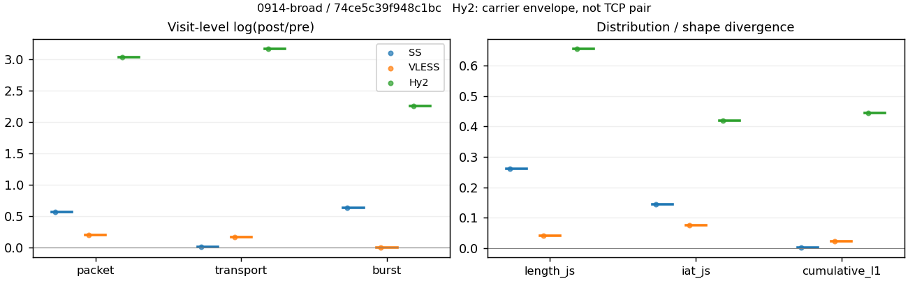
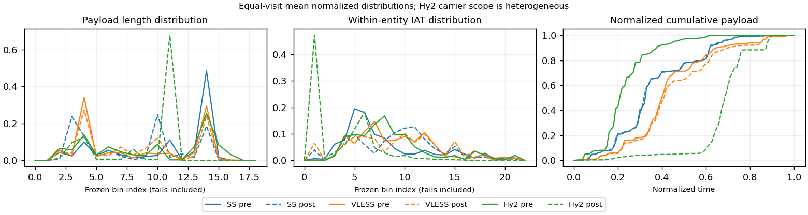

# 0914-broad · 条目 029 · stackoverflow.com

目标：https://stackoverflow.com/questions

活动标签：stackoverflow.com::page_load。选定访问 3 次。

[返回总索引](../../README.md) · [统计口径](../../methods.md)

## 覆盖与资格（每次访问均保留）

| 部署 | 重复 | 主请求路由 | 活动状态 | 代理比较 | DIRECT pre | 请求 proxy/direct/unresolved | 错误 |
| --- | --- | --- | --- | --- | --- | --- | --- |
| Hy2 | 1 | proxy | passed | 1 | 1 | 130/15/4 | [] |
| SS | 1 | proxy | passed | 1 | 0 | 104/0/2 | [] |
| VLESS | 1 | proxy | passed | 1 | 0 | 158/0/0 | [] |

主请求非 proxy 的统计仅解释为已索引的辅助代理连接或 DIRECT 观测，不代表目标业务经代理传输。播放确认与配对资格是两道不同的门。

图中散点为单次访问，短线为重复中位数；Hy2 是共享载体包络，不能与 TCP 配对作等范围因果对比。

形态图先逐访问归一化，再对访问等权平均；实线 pre，虚线 post。分箱序号及边界见 methods，不将分箱索引误解为长度或时间。

## 每次访问的关键观测

### SS

范围：`exclusive_page`。每格 pre → post；空值为不可观测/不适用。

| 重复 | 包数 | 载荷字节 | burst | TCP FR | IAT中位µs | length JS | IAT JS |
| --- | --- | --- | --- | --- | --- | --- | --- |
| 1 | 2108 → 3743 | 2.1741e+06 → 2.2164e+06 | 1429 → 2711 | 216 → 227 | 43.434 → 485.81 | 0.26081 | 0.14458 |

完整标量统计：中位数 [min,max]；Δ 为重复内逐访问变换的中位数，MAD 未缩放。n 为可用变换数；DIRECT-only 的 nΔ=0 不代表 pre 不可用。

| scope | 特征 | pre | post | Δ | IQRΔ | MADΔ | nΔ |
| --- | --- | --- | --- | --- | --- | --- | --- |
| exclusive_page | active_span_sum_s_1000ms | 35.302 [35.302, 35.302] | 42.102 [42.102, 42.102] | 0.17616 | — | — | 1 |
| exclusive_page | active_span_sum_s_100ms | 8.2555 [8.2555, 8.2555] | 14.304 [14.304, 14.304] | 0.54964 | — | — | 1 |
| exclusive_page | active_span_sum_s_500ms | 27.36 [27.36, 27.36] | 34.512 [34.512, 34.512] | 0.23224 | — | — | 1 |
| exclusive_page | burst_bytes_iqr | 2856 [2856, 2856] | 1428 [1428, 1428] | -0.69315 | — | — | 1 |
| exclusive_page | burst_bytes_mad | 35 [35, 35] | 34 [34, 34] | -0.028988 | — | — | 1 |
| exclusive_page | burst_bytes_max | 20480 [20480, 20480] | 13757 [13757, 13757] | -0.3979 | — | — | 1 |
| exclusive_page | burst_bytes_mean | 1521.4 [1521.4, 1521.4] | 817.57 [817.57, 817.57] | -0.62105 | — | — | 1 |
| exclusive_page | burst_bytes_median | 35 [35, 35] | 34 [34, 34] | -0.028988 | — | — | 1 |
| exclusive_page | burst_bytes_min | 0 [0, 0] | 0 [0, 0] | — | — | — | 0 |
| exclusive_page | burst_bytes_p95 | 5792 [5792, 5792] | 2930 [2930, 2930] | -0.68148 | — | — | 1 |
| exclusive_page | burst_bytes_q25 | 0 [0, 0] | 0 [0, 0] | — | — | — | 0 |
| exclusive_page | burst_bytes_q75 | 2856 [2856, 2856] | 1428 [1428, 1428] | -0.69315 | — | — | 1 |
| exclusive_page | burst_bytes_std | 2735.3 [2735.3, 2735.3] | 1326.4 [1326.4, 1326.4] | -0.72379 | — | — | 1 |
| exclusive_page | burst_count | 1429 [1429, 1429] | 2711 [2711, 2711] | 0.64034 | — | — | 1 |
| exclusive_page | burst_duration_ms_iqr | 0.039683 [0.039683, 0.039683] | 0 [0, 0] | — | — | — | 0 |
| exclusive_page | burst_duration_ms_mad | 0 [0, 0] | 0 [0, 0] | — | — | — | 0 |
| exclusive_page | burst_duration_ms_max | 12078 [12078, 12078] | 12078 [12078, 12078] | 1.4785e-05 | — | — | 1 |
| exclusive_page | burst_duration_ms_mean | 112.83 [112.83, 112.83] | 50.003 [50.003, 50.003] | -0.81381 | — | — | 1 |
| exclusive_page | burst_duration_ms_median | 0 [0, 0] | 0 [0, 0] | — | — | — | 0 |
| exclusive_page | burst_duration_ms_min | 0 [0, 0] | 0 [0, 0] | — | — | — | 0 |
| exclusive_page | burst_duration_ms_p95 | 239.63 [239.63, 239.63] | 18.14 [18.14, 18.14] | -2.581 | — | — | 1 |
| exclusive_page | burst_duration_ms_q25 | 0 [0, 0] | 0 [0, 0] | — | — | — | 0 |
| exclusive_page | burst_duration_ms_q75 | 0.039683 [0.039683, 0.039683] | 0 [0, 0] | — | — | — | 0 |
| exclusive_page | burst_duration_ms_std | 775.74 [775.74, 775.74] | 536.03 [536.03, 536.03] | -0.36964 | — | — | 1 |
| exclusive_page | burst_packets_iqr | 1 [1, 1] | 0 [0, 0] | — | — | — | 0 |
| exclusive_page | burst_packets_mad | 0 [0, 0] | 0 [0, 0] | — | — | — | 0 |
| exclusive_page | burst_packets_max | 10 [10, 10] | 11 [11, 11] | 0.09531 | — | — | 1 |
| exclusive_page | burst_packets_mean | 1.4752 [1.4752, 1.4752] | 1.3807 [1.3807, 1.3807] | -0.066195 | — | — | 1 |
| exclusive_page | burst_packets_median | 1 [1, 1] | 1 [1, 1] | 0 | — | — | 1 |
| exclusive_page | burst_packets_min | 1 [1, 1] | 1 [1, 1] | 0 | — | — | 1 |
| exclusive_page | burst_packets_p95 | 3 [3, 3] | 3 [3, 3] | 0 | — | — | 1 |
| exclusive_page | burst_packets_q25 | 1 [1, 1] | 1 [1, 1] | 0 | — | — | 1 |
| exclusive_page | burst_packets_q75 | 2 [2, 2] | 1 [1, 1] | -0.69315 | — | — | 1 |
| exclusive_page | burst_packets_std | 0.92412 [0.92412, 0.92412] | 0.833 [0.833, 0.833] | -0.10381 | — | — | 1 |
| exclusive_page | connection_span_concurrency_max | 25 [25, 25] | 25 [25, 25] | 0 | — | — | 1 |
| exclusive_page | cumulative_l1 | — | — | 0.0030788 | — | — | 1 |
| exclusive_page | cumulative_max | — | — | 0.065687 | — | — | 1 |
| exclusive_page | direction_entropy | 0.7116 [0.7116, 0.7116] | 0.58047 [0.58047, 0.58047] | -0.13113 | — | — | 1 |
| exclusive_page | down_burst_count | 701 [701, 701] | 1342 [1342, 1342] | 0.64941 | — | — | 1 |
| exclusive_page | down_ip_bytes | 2.1276e+06 [2.1276e+06, 2.1276e+06] | 2.1988e+06 [2.1988e+06, 2.1988e+06] | 0.032941 | — | — | 1 |
| exclusive_page | down_packets | 1233 [1233, 1233] | 2057 [2057, 2057] | 0.5118 | — | — | 1 |
| exclusive_page | down_transport_bytes | 2.0632e+06 [2.0632e+06, 2.0632e+06] | 2.0915e+06 [2.0915e+06, 2.0915e+06] | 0.01362 | — | — | 1 |
| exclusive_page | duration_s | 17.847 [17.847, 17.847] | 17.846 [17.846, 17.846] | -8.4866e-05 | — | — | 1 |
| exclusive_page | entity_count | 27 [27, 27] | 27 [27, 27] | 0 | — | — | 1 |
| exclusive_page | fr_runs | 216 [216, 216] | 227 [227, 227] | 0.049672 | — | — | 1 |
| exclusive_page | fr_runs_per_packet | 0.18383 [0.18383, 0.18383] | 0.10998 [0.10998, 0.10998] | -0.073849 | — | — | 1 |
| exclusive_page | fr_switches | 189 [189, 189] | 200 [200, 200] | 0.05657 | — | — | 1 |
| exclusive_page | fr_switches_per_possible_transition | 0.16463 [0.16463, 0.16463] | 0.098184 [0.098184, 0.098184] | -0.066451 | — | — | 1 |
| exclusive_page | full_retransmission_fraction | 0.00094877 [0.00094877, 0.00094877] | 0.0053433 [0.0053433, 0.0053433] | 0.0043945 | — | — | 1 |
| exclusive_page | full_retransmission_packets | 2 [2, 2] | 20 [20, 20] | 2.3026 | — | — | 1 |
| exclusive_page | iat_count | 2081 [2081, 2081] | 3716 [3716, 3716] | 0.5798 | — | — | 1 |
| exclusive_page | iat_js | — | — | 0.14458 | — | — | 1 |
| exclusive_page | iat_ks | — | — | 0.31123 | — | — | 1 |
| exclusive_page | iat_median_us | 43.434 [43.434, 43.434] | 485.81 [485.81, 485.81] | 2.4146 | — | — | 1 |
| exclusive_page | iat_us_iqr | 503.19 [503.19, 503.19] | 1963.3 [1963.3, 1963.3] | 1.3614 | — | — | 1 |
| exclusive_page | iat_us_mad | 36.912 [36.912, 36.912] | 477.21 [477.21, 477.21] | 2.5594 | — | — | 1 |
| exclusive_page | iat_us_max | 1.2795e+07 [1.2795e+07, 1.2795e+07] | 1.2726e+07 [1.2726e+07, 1.2726e+07] | -0.0053642 | — | — | 1 |
| exclusive_page | iat_us_mean | 1.1787e+05 [1.1787e+05, 1.1787e+05] | 65535 [65535, 65535] | -0.58695 | — | — | 1 |
| exclusive_page | iat_us_median | 43.434 [43.434, 43.434] | 485.81 [485.81, 485.81] | 2.4146 | — | — | 1 |
| exclusive_page | iat_us_min | 0.059 [0.059, 0.059] | 0.036 [0.036, 0.036] | -0.49402 | — | — | 1 |
| exclusive_page | iat_us_p95 | 2.0024e+05 [2.0024e+05, 2.0024e+05] | 47460 [47460, 47460] | -1.4396 | — | — | 1 |
| exclusive_page | iat_us_q25 | 14.228 [14.228, 14.228] | 21.717 [21.717, 21.717] | 0.42287 | — | — | 1 |
| exclusive_page | iat_us_q75 | 517.42 [517.42, 517.42] | 1985 [1985, 1985] | 1.3445 | — | — | 1 |
| exclusive_page | iat_us_std | 8.8256e+05 [8.8256e+05, 8.8256e+05] | 6.5602e+05 [6.5602e+05, 6.5602e+05] | -0.29663 | — | — | 1 |
| exclusive_page | iat_wasserstein_log1p_us | — | — | 1.2046 | — | — | 1 |
| exclusive_page | idle_gap_count_1000ms | 39 [39, 39] | 36 [36, 36] | -0.080043 | — | — | 1 |
| exclusive_page | idle_gap_count_100ms | 123 [123, 123] | 137 [137, 137] | 0.1078 | — | — | 1 |
| exclusive_page | idle_gap_count_500ms | 50 [50, 50] | 46 [46, 46] | -0.083382 | — | — | 1 |
| exclusive_page | idle_gap_sum_s_1000ms | 209.98 [209.98, 209.98] | 201.43 [201.43, 201.43] | -0.041566 | — | — | 1 |
| exclusive_page | idle_gap_sum_s_100ms | 237.02 [237.02, 237.02] | 229.23 [229.23, 229.23] | -0.033449 | — | — | 1 |
| exclusive_page | idle_gap_sum_s_500ms | 217.92 [217.92, 217.92] | 209.02 [209.02, 209.02] | -0.041704 | — | — | 1 |
| exclusive_page | ip_bytes | 2.2841e+06 [2.2841e+06, 2.2841e+06] | 2.4348e+06 [2.4348e+06, 2.4348e+06] | 0.063882 | — | — | 1 |
| exclusive_page | length_iqr | 2384 [2384, 2384] | 1383 [1383, 1383] | -0.54452 | — | — | 1 |
| exclusive_page | length_js | — | — | 0.26081 | — | — | 1 |
| exclusive_page | length_ks | — | — | 0.45599 | — | — | 1 |
| exclusive_page | length_mad | 846 [846, 846] | 1274 [1274, 1274] | 0.4094 | — | — | 1 |
| exclusive_page | length_max | 8948 [8948, 8948] | 4284 [4284, 4284] | -0.73654 | — | — | 1 |
| exclusive_page | length_mean | 1850.3 [1850.3, 1850.3] | 1073.8 [1073.8, 1073.8] | -0.54409 | — | — | 1 |
| exclusive_page | length_median | 2050 [2050, 2050] | 1348 [1348, 1348] | -0.41922 | — | — | 1 |
| exclusive_page | length_min | 16 [16, 16] | 6 [6, 6] | -0.98083 | — | — | 1 |
| exclusive_page | length_p95 | 2896 [2896, 2896] | 2856 [2856, 2856] | -0.013908 | — | — | 1 |
| exclusive_page | length_q25 | 512 [512, 512] | 65 [65, 65] | -2.0639 | — | — | 1 |
| exclusive_page | length_q75 | 2896 [2896, 2896] | 1448 [1448, 1448] | -0.69315 | — | — | 1 |
| exclusive_page | length_std | 1213.2 [1213.2, 1213.2] | 1044.6 [1044.6, 1044.6] | -0.1496 | — | — | 1 |
| exclusive_page | length_wasserstein_bytes | — | — | 776.64 | — | — | 1 |
| exclusive_page | nonempty_entity_count | 27 [27, 27] | 27 [27, 27] | 0 | — | — | 1 |
| exclusive_page | nonempty_packets | 1175 [1175, 1175] | 2064 [2064, 2064] | 0.56338 | — | — | 1 |
| exclusive_page | offload_suspect_fraction | 0.30787 [0.30787, 0.30787] | 0.13171 [0.13171, 0.13171] | -0.17616 | — | — | 1 |
| exclusive_page | packet_count | 2108 [2108, 2108] | 3743 [3743, 3743] | 0.57415 | — | — | 1 |
| exclusive_page | rtt_median_ms | 0.059389 [0.059389, 0.059389] | 30.003 [30.003, 30.003] | 6.2249 | — | — | 1 |
| exclusive_page | rtt_sample_count | 872 [872, 872] | 773 [773, 773] | -0.12051 | — | — | 1 |
| exclusive_page | tcp_ack_count | 2079 [2079, 2079] | 3711 [3711, 3711] | 0.57941 | — | — | 1 |
| exclusive_page | tcp_fin_count | 53 [53, 53] | 53 [53, 53] | 0 | — | — | 1 |
| exclusive_page | tcp_packet_count | 2108 [2108, 2108] | 3743 [3743, 3743] | 0.57415 | — | — | 1 |
| exclusive_page | tcp_rst_count | 2 [2, 2] | 1 [1, 1] | -0.69315 | — | — | 1 |
| exclusive_page | tcp_syn_count | 54 [54, 54] | 59 [59, 59] | 0.088553 | — | — | 1 |
| exclusive_page | tcp_window_raw_median | 65535 [65535, 65535] | 135 [135, 135] | -6.1851 | — | — | 1 |
| exclusive_page | transition_entropy | 0.54902 [0.54902, 0.54902] | 0.38517 [0.38517, 0.38517] | -0.16385 | — | — | 1 |
| exclusive_page | transition_n_mm | 842 [842, 842] | 1669 [1669, 1669] | 0.6842 | — | — | 1 |
| exclusive_page | transition_n_mp | 85 [85, 85] | 91 [91, 91] | 0.068208 | — | — | 1 |
| exclusive_page | transition_n_pm | 104 [104, 104] | 109 [109, 109] | 0.046957 | — | — | 1 |
| exclusive_page | transition_n_pp | 117 [117, 117] | 168 [168, 168] | 0.36179 | — | — | 1 |
| exclusive_page | transition_p_mm | 0.90831 [0.90831, 0.90831] | 0.9483 [0.9483, 0.9483] | 0.039989 | — | — | 1 |
| exclusive_page | transition_p_mp | 0.091694 [0.091694, 0.091694] | 0.051705 [0.051705, 0.051705] | -0.039989 | — | — | 1 |
| exclusive_page | transition_p_pm | 0.47059 [0.47059, 0.47059] | 0.3935 [0.3935, 0.3935] | -0.077086 | — | — | 1 |
| exclusive_page | transition_p_pp | 0.52941 [0.52941, 0.52941] | 0.6065 [0.6065, 0.6065] | 0.077086 | — | — | 1 |
| exclusive_page | transport_bytes | 2.1741e+06 [2.1741e+06, 2.1741e+06] | 2.2164e+06 [2.2164e+06, 2.2164e+06] | 0.019288 | — | — | 1 |
| exclusive_page | up_burst_count | 728 [728, 728] | 1369 [1369, 1369] | 0.63153 | — | — | 1 |
| exclusive_page | up_byte_fraction | 0.05099 [0.05099, 0.05099] | 0.056354 [0.056354, 0.056354] | 0.0053636 | — | — | 1 |
| exclusive_page | up_ip_bytes | 1.5657e+05 [1.5657e+05, 1.5657e+05] | 2.36e+05 [2.36e+05, 2.36e+05] | 0.41031 | — | — | 1 |
| exclusive_page | up_packets | 875 [875, 875] | 1686 [1686, 1686] | 0.65589 | — | — | 1 |
| exclusive_page | up_transport_bytes | 1.1086e+05 [1.1086e+05, 1.1086e+05] | 1.249e+05 [1.249e+05, 1.249e+05] | 0.1193 | — | — | 1 |
| exclusive_page | zero_iat_count | 0 [0, 0] | 0 [0, 0] | — | — | — | 0 |
| exclusive_page | zero_iat_fraction | 0 [0, 0] | 0 [0, 0] | 0 | — | — | 1 |

### VLESS

范围：`exclusive_page`。每格 pre → post；空值为不可观测/不适用。

| 重复 | 包数 | 载荷字节 | burst | TCP FR | IAT中位µs | length JS | IAT JS |
| --- | --- | --- | --- | --- | --- | --- | --- |
| 1 | 4671 → 5720 | 2.8734e+06 → 3.3944e+06 | 3575 → 3606 | 452 → 592 | 190.71 → 466.78 | 0.040087 | 0.07457 |

完整标量统计：中位数 [min,max]；Δ 为重复内逐访问变换的中位数，MAD 未缩放。n 为可用变换数；DIRECT-only 的 nΔ=0 不代表 pre 不可用。

| scope | 特征 | pre | post | Δ | IQRΔ | MADΔ | nΔ |
| --- | --- | --- | --- | --- | --- | --- | --- |
| exclusive_page | active_span_sum_s_1000ms | 72.439 [72.439, 72.439] | 85.442 [85.442, 85.442] | 0.16509 | — | — | 1 |
| exclusive_page | active_span_sum_s_100ms | 9.5996 [9.5996, 9.5996] | 29.711 [29.711, 29.711] | 1.1298 | — | — | 1 |
| exclusive_page | active_span_sum_s_500ms | 43.427 [43.427, 43.427] | 84.62 [84.62, 84.62] | 0.66709 | — | — | 1 |
| exclusive_page | burst_bytes_iqr | 1484 [1484, 1484] | 2005.2 [2005.2, 2005.2] | 0.30103 | — | — | 1 |
| exclusive_page | burst_bytes_mad | 31 [31, 31] | 61 [61, 61] | 0.67689 | — | — | 1 |
| exclusive_page | burst_bytes_max | 17190 [17190, 17190] | 13503 [13503, 13503] | -0.24142 | — | — | 1 |
| exclusive_page | burst_bytes_mean | 803.74 [803.74, 803.74] | 941.32 [941.32, 941.32] | 0.158 | — | — | 1 |
| exclusive_page | burst_bytes_median | 31 [31, 31] | 61 [61, 61] | 0.67689 | — | — | 1 |
| exclusive_page | burst_bytes_min | 0 [0, 0] | 0 [0, 0] | — | — | — | 0 |
| exclusive_page | burst_bytes_p95 | 2896 [2896, 2896] | 2896 [2896, 2896] | 0 | — | — | 1 |
| exclusive_page | burst_bytes_q25 | 0 [0, 0] | 0 [0, 0] | — | — | — | 0 |
| exclusive_page | burst_bytes_q75 | 1484 [1484, 1484] | 2005.2 [2005.2, 2005.2] | 0.30103 | — | — | 1 |
| exclusive_page | burst_bytes_std | 1295.8 [1295.8, 1295.8] | 1279.8 [1279.8, 1279.8] | -0.012377 | — | — | 1 |
| exclusive_page | burst_count | 3575 [3575, 3575] | 3606 [3606, 3606] | 0.0086339 | — | — | 1 |
| exclusive_page | burst_duration_ms_iqr | 0.20846 [0.20846, 0.20846] | 0.9129 [0.9129, 0.9129] | 1.4769 | — | — | 1 |
| exclusive_page | burst_duration_ms_mad | 0 [0, 0] | 0 [0, 0] | — | — | — | 0 |
| exclusive_page | burst_duration_ms_max | 11613 [11613, 11613] | 11613 [11613, 11613] | 1.641e-05 | — | — | 1 |
| exclusive_page | burst_duration_ms_mean | 96.082 [96.082, 96.082] | 71.136 [71.136, 71.136] | -0.3006 | — | — | 1 |
| exclusive_page | burst_duration_ms_median | 0 [0, 0] | 0 [0, 0] | — | — | — | 0 |
| exclusive_page | burst_duration_ms_min | 0 [0, 0] | 0 [0, 0] | — | — | — | 0 |
| exclusive_page | burst_duration_ms_p95 | 205.9 [205.9, 205.9] | 158.93 [158.93, 158.93] | -0.25893 | — | — | 1 |
| exclusive_page | burst_duration_ms_q25 | 0 [0, 0] | 0 [0, 0] | — | — | — | 0 |
| exclusive_page | burst_duration_ms_q75 | 0.20846 [0.20846, 0.20846] | 0.9129 [0.9129, 0.9129] | 1.4769 | — | — | 1 |
| exclusive_page | burst_duration_ms_std | 710.46 [710.46, 710.46] | 618.56 [618.56, 618.56] | -0.13852 | — | — | 1 |
| exclusive_page | burst_packets_iqr | 1 [1, 1] | 1 [1, 1] | 0 | — | — | 1 |
| exclusive_page | burst_packets_mad | 0 [0, 0] | 0 [0, 0] | — | — | — | 0 |
| exclusive_page | burst_packets_max | 5 [5, 5] | 11 [11, 11] | 0.78846 | — | — | 1 |
| exclusive_page | burst_packets_mean | 1.3066 [1.3066, 1.3066] | 1.5862 [1.5862, 1.5862] | 0.19396 | — | — | 1 |
| exclusive_page | burst_packets_median | 1 [1, 1] | 1 [1, 1] | 0 | — | — | 1 |
| exclusive_page | burst_packets_min | 1 [1, 1] | 1 [1, 1] | 0 | — | — | 1 |
| exclusive_page | burst_packets_p95 | 2 [2, 2] | 4 [4, 4] | 0.69315 | — | — | 1 |
| exclusive_page | burst_packets_q25 | 1 [1, 1] | 1 [1, 1] | 0 | — | — | 1 |
| exclusive_page | burst_packets_q75 | 2 [2, 2] | 2 [2, 2] | 0 | — | — | 1 |
| exclusive_page | burst_packets_std | 0.52783 [0.52783, 0.52783] | 1.0773 [1.0773, 1.0773] | 0.7134 | — | — | 1 |
| exclusive_page | connection_span_concurrency_max | 54 [54, 54] | 54 [54, 54] | 0 | — | — | 1 |
| exclusive_page | cumulative_l1 | — | — | 0.02248 | — | — | 1 |
| exclusive_page | cumulative_max | — | — | 0.07567 | — | — | 1 |
| exclusive_page | direction_entropy | 0.66934 [0.66934, 0.66934] | 0.70649 [0.70649, 0.70649] | 0.037149 | — | — | 1 |
| exclusive_page | down_burst_count | 1757 [1757, 1757] | 1777 [1777, 1777] | 0.011319 | — | — | 1 |
| exclusive_page | down_ip_bytes | 2.7728e+06 [2.7728e+06, 2.7728e+06] | 3.199e+06 [3.199e+06, 3.199e+06] | 0.143 | — | — | 1 |
| exclusive_page | down_packets | 2597 [2597, 2597] | 3195 [3195, 3195] | 0.20723 | — | — | 1 |
| exclusive_page | down_transport_bytes | 2.6372e+06 [2.6372e+06, 2.6372e+06] | 3.0324e+06 [3.0324e+06, 3.0324e+06] | 0.13961 | — | — | 1 |
| exclusive_page | duration_s | 18.89 [18.89, 18.89] | 18.92 [18.92, 18.92] | 0.0015923 | — | — | 1 |
| exclusive_page | entity_count | 62 [62, 62] | 62 [62, 62] | 0 | — | — | 1 |
| exclusive_page | fr_runs | 452 [452, 452] | 592 [592, 592] | 0.26982 | — | — | 1 |
| exclusive_page | fr_runs_per_packet | 0.1854 [0.1854, 0.1854] | 0.19707 [0.19707, 0.19707] | 0.011673 | — | — | 1 |
| exclusive_page | fr_switches | 390 [390, 390] | 530 [530, 530] | 0.30673 | — | — | 1 |
| exclusive_page | fr_switches_per_possible_transition | 0.16414 [0.16414, 0.16414] | 0.18015 [0.18015, 0.18015] | 0.016008 | — | — | 1 |
| exclusive_page | full_retransmission_fraction | 0.0012845 [0.0012845, 0.0012845] | 0 [0, 0] | -0.0012845 | — | — | 1 |
| exclusive_page | full_retransmission_packets | 6 [6, 6] | 0 [0, 0] | — | — | — | 0 |
| exclusive_page | iat_count | 4609 [4609, 4609] | 5658 [5658, 5658] | 0.20506 | — | — | 1 |
| exclusive_page | iat_js | — | — | 0.07457 | — | — | 1 |
| exclusive_page | iat_ks | — | — | 0.076594 | — | — | 1 |
| exclusive_page | iat_median_us | 190.71 [190.71, 190.71] | 466.78 [466.78, 466.78] | 0.89509 | — | — | 1 |
| exclusive_page | iat_us_iqr | 2240.7 [2240.7, 2240.7] | 3872 [3872, 3872] | 0.547 | — | — | 1 |
| exclusive_page | iat_us_mad | 184.16 [184.16, 184.16] | 459.81 [459.81, 459.81] | 0.91499 | — | — | 1 |
| exclusive_page | iat_us_max | 1.3322e+07 [1.3322e+07, 1.3322e+07] | 1.323e+07 [1.323e+07, 1.323e+07] | -0.0069378 | — | — | 1 |
| exclusive_page | iat_us_mean | 1.0143e+05 [1.0143e+05, 1.0143e+05] | 81193 [81193, 81193] | -0.22252 | — | — | 1 |
| exclusive_page | iat_us_median | 190.71 [190.71, 190.71] | 466.78 [466.78, 466.78] | 0.89509 | — | — | 1 |
| exclusive_page | iat_us_min | 0.354 [0.354, 0.354] | 0.033 [0.033, 0.033] | -2.3728 | — | — | 1 |
| exclusive_page | iat_us_p95 | 1.9917e+05 [1.9917e+05, 1.9917e+05] | 1.4605e+05 [1.4605e+05, 1.4605e+05] | -0.31016 | — | — | 1 |
| exclusive_page | iat_us_q25 | 39.05 [39.05, 39.05] | 22.133 [22.133, 22.133] | -0.5678 | — | — | 1 |
| exclusive_page | iat_us_q75 | 2279.7 [2279.7, 2279.7] | 3894.1 [3894.1, 3894.1] | 0.53542 | — | — | 1 |
| exclusive_page | iat_us_std | 7.8201e+05 [7.8201e+05, 7.8201e+05] | 7.0929e+05 [7.0929e+05, 7.0929e+05] | -0.0976 | — | — | 1 |
| exclusive_page | iat_wasserstein_log1p_us | — | — | 0.63919 | — | — | 1 |
| exclusive_page | idle_gap_count_1000ms | 87 [87, 87] | 63 [63, 63] | -0.32277 | — | — | 1 |
| exclusive_page | idle_gap_count_100ms | 284 [284, 284] | 354 [354, 354] | 0.22032 | — | — | 1 |
| exclusive_page | idle_gap_count_500ms | 125 [125, 125] | 64 [64, 64] | -0.66943 | — | — | 1 |
| exclusive_page | idle_gap_sum_s_1000ms | 395.04 [395.04, 395.04] | 373.95 [373.95, 373.95] | -0.054881 | — | — | 1 |
| exclusive_page | idle_gap_sum_s_100ms | 457.88 [457.88, 457.88] | 429.68 [429.68, 429.68] | -0.063578 | — | — | 1 |
| exclusive_page | idle_gap_sum_s_500ms | 424.06 [424.06, 424.06] | 374.77 [374.77, 374.77] | -0.12356 | — | — | 1 |
| exclusive_page | ip_bytes | 3.1161e+06 [3.1161e+06, 3.1161e+06] | 3.6949e+06 [3.6949e+06, 3.6949e+06] | 0.17035 | — | — | 1 |
| exclusive_page | length_iqr | 2752 [2752, 2752] | 1909 [1909, 1909] | -0.36575 | — | — | 1 |
| exclusive_page | length_js | — | — | 0.040087 | — | — | 1 |
| exclusive_page | length_ks | — | — | 0.089421 | — | — | 1 |
| exclusive_page | length_mad | 530 [530, 530] | 847 [847, 847] | 0.46882 | — | — | 1 |
| exclusive_page | length_max | 8948 [8948, 8948] | 2896 [2896, 2896] | -1.1281 | — | — | 1 |
| exclusive_page | length_mean | 1178.6 [1178.6, 1178.6] | 1130 [1130, 1130] | -0.04213 | — | — | 1 |
| exclusive_page | length_median | 561 [561, 561] | 919 [919, 919] | 0.49357 | — | — | 1 |
| exclusive_page | length_min | 6 [6, 6] | 3 [3, 3] | -0.69315 | — | — | 1 |
| exclusive_page | length_p95 | 2824 [2824, 2824] | 2824 [2824, 2824] | 0 | — | — | 1 |
| exclusive_page | length_q25 | 72 [72, 72] | 72 [72, 72] | 0 | — | — | 1 |
| exclusive_page | length_q75 | 2824 [2824, 2824] | 1981 [1981, 1981] | -0.35455 | — | — | 1 |
| exclusive_page | length_std | 1238 [1238, 1238] | 1086.2 [1086.2, 1086.2] | -0.13081 | — | — | 1 |
| exclusive_page | length_wasserstein_bytes | — | — | 154.98 | — | — | 1 |
| exclusive_page | nonempty_entity_count | 62 [62, 62] | 62 [62, 62] | 0 | — | — | 1 |
| exclusive_page | nonempty_packets | 2438 [2438, 2438] | 3004 [3004, 3004] | 0.20877 | — | — | 1 |
| exclusive_page | offload_suspect_fraction | 0.18262 [0.18262, 0.18262] | 0.14003 [0.14003, 0.14003] | -0.042581 | — | — | 1 |
| exclusive_page | packet_count | 4671 [4671, 4671] | 5720 [5720, 5720] | 0.2026 | — | — | 1 |
| exclusive_page | rtt_median_ms | 0.083999 [0.083999, 0.083999] | 1.3647 [1.3647, 1.3647] | 2.7879 | — | — | 1 |
| exclusive_page | rtt_sample_count | 2008 [2008, 2008] | 2476 [2476, 2476] | 0.20951 | — | — | 1 |
| exclusive_page | tcp_ack_count | 4510 [4510, 4510] | 5652 [5652, 5652] | 0.22571 | — | — | 1 |
| exclusive_page | tcp_fin_count | 123 [123, 123] | 125 [125, 125] | 0.016129 | — | — | 1 |
| exclusive_page | tcp_packet_count | 4671 [4671, 4671] | 5720 [5720, 5720] | 0.2026 | — | — | 1 |
| exclusive_page | tcp_rst_count | 100 [100, 100] | 5 [5, 5] | -2.9957 | — | — | 1 |
| exclusive_page | tcp_syn_count | 124 [124, 124] | 126 [126, 126] | 0.016 | — | — | 1 |
| exclusive_page | tcp_window_raw_median | 65504 [65504, 65504] | 150 [150, 150] | -6.0792 | — | — | 1 |
| exclusive_page | transition_entropy | 0.52244 [0.52244, 0.52244] | 0.57064 [0.57064, 0.57064] | 0.048207 | — | — | 1 |
| exclusive_page | transition_n_mm | 1787 [1787, 1787] | 2130 [2130, 2130] | 0.17558 | — | — | 1 |
| exclusive_page | transition_n_mp | 166 [166, 166] | 234 [234, 234] | 0.34333 | — | — | 1 |
| exclusive_page | transition_n_pm | 224 [224, 224] | 296 [296, 296] | 0.27871 | — | — | 1 |
| exclusive_page | transition_n_pp | 199 [199, 199] | 282 [282, 282] | 0.3486 | — | — | 1 |
| exclusive_page | transition_p_mm | 0.915 [0.915, 0.915] | 0.90102 [0.90102, 0.90102] | -0.013987 | — | — | 1 |
| exclusive_page | transition_p_mp | 0.084997 [0.084997, 0.084997] | 0.098985 [0.098985, 0.098985] | 0.013987 | — | — | 1 |
| exclusive_page | transition_p_pm | 0.52955 [0.52955, 0.52955] | 0.51211 [0.51211, 0.51211] | -0.01744 | — | — | 1 |
| exclusive_page | transition_p_pp | 0.47045 [0.47045, 0.47045] | 0.48789 [0.48789, 0.48789] | 0.01744 | — | — | 1 |
| exclusive_page | transport_bytes | 2.8734e+06 [2.8734e+06, 2.8734e+06] | 3.3944e+06 [3.3944e+06, 3.3944e+06] | 0.16664 | — | — | 1 |
| exclusive_page | up_burst_count | 1818 [1818, 1818] | 1829 [1829, 1829] | 0.0060324 | — | — | 1 |
| exclusive_page | up_byte_fraction | 0.082182 [0.082182, 0.082182] | 0.10665 [0.10665, 0.10665] | 0.024472 | — | — | 1 |
| exclusive_page | up_ip_bytes | 3.4334e+05 [3.4334e+05, 3.4334e+05] | 4.9583e+05 [4.9583e+05, 4.9583e+05] | 0.3675 | — | — | 1 |
| exclusive_page | up_packets | 2074 [2074, 2074] | 2525 [2525, 2525] | 0.19676 | — | — | 1 |
| exclusive_page | up_transport_bytes | 2.3614e+05 [2.3614e+05, 2.3614e+05] | 3.6202e+05 [3.6202e+05, 3.6202e+05] | 0.42729 | — | — | 1 |
| exclusive_page | zero_iat_count | 0 [0, 0] | 0 [0, 0] | — | — | — | 0 |
| exclusive_page | zero_iat_fraction | 0 [0, 0] | 0 [0, 0] | 0 | — | — | 1 |

### Hy2

范围：`carrier_context_envelope`。每格 pre → post；空值为不可观测/不适用。

| 重复 | 包数 | 载荷字节 | burst | TCP FR | IAT中位µs | length JS | IAT JS |
| --- | --- | --- | --- | --- | --- | --- | --- |
| 1 | 2163 → 45040 | 2.0314e+06 → 4.7919e+07 | 1524 → 14585 | — | 130.79 → 3.821 | 0.65435 | 0.41818 |

范围：`direct_pre_only`。每格 pre → post；空值为不可观测/不适用。

| 重复 | 包数 | 载荷字节 | burst | TCP FR | IAT中位µs | length JS | IAT JS |
| --- | --- | --- | --- | --- | --- | --- | --- |
| 1 | 461 → — | 5.4187e+05 → — | 332 → — | 51 → — | 149.39 → — | — | — |

完整标量统计：中位数 [min,max]；Δ 为重复内逐访问变换的中位数，MAD 未缩放。n 为可用变换数；DIRECT-only 的 nΔ=0 不代表 pre 不可用。

| scope | 特征 | pre | post | Δ | IQRΔ | MADΔ | nΔ |
| --- | --- | --- | --- | --- | --- | --- | --- |
| carrier_context_envelope | active_span_sum_s_1000ms | 36.95 [36.95, 36.95] | 16.182 [16.182, 16.182] | -0.82564 | — | — | 1 |
| carrier_context_envelope | active_span_sum_s_100ms | 3.0793 [3.0793, 3.0793] | 12.072 [12.072, 12.072] | 1.3662 | — | — | 1 |
| carrier_context_envelope | active_span_sum_s_500ms | 28.855 [28.855, 28.855] | 16.182 [16.182, 16.182] | -0.57835 | — | — | 1 |
| carrier_context_envelope | burst_bytes_iqr | 1417 [1417, 1417] | 3654 [3654, 3654] | 0.94728 | — | — | 1 |
| carrier_context_envelope | burst_bytes_mad | 31 [31, 31] | 319 [319, 319] | 2.3312 | — | — | 1 |
| carrier_context_envelope | burst_bytes_max | 23421 [23421, 23421] | 1.9747e+05 [1.9747e+05, 1.9747e+05] | 2.132 | — | — | 1 |
| carrier_context_envelope | burst_bytes_mean | 1332.9 [1332.9, 1332.9] | 3285.5 [3285.5, 3285.5] | 0.90213 | — | — | 1 |
| carrier_context_envelope | burst_bytes_median | 31 [31, 31] | 352 [352, 352] | 2.4296 | — | — | 1 |
| carrier_context_envelope | burst_bytes_min | 0 [0, 0] | 22 [22, 22] | — | — | — | 0 |
| carrier_context_envelope | burst_bytes_p95 | 6479 [6479, 6479] | 11255 [11255, 11255] | 0.55226 | — | — | 1 |
| carrier_context_envelope | burst_bytes_q25 | 0 [0, 0] | 100 [100, 100] | — | — | — | 0 |
| carrier_context_envelope | burst_bytes_q75 | 1417 [1417, 1417] | 3754 [3754, 3754] | 0.97428 | — | — | 1 |
| carrier_context_envelope | burst_bytes_std | 2772.9 [2772.9, 2772.9] | 7296.9 [7296.9, 7296.9] | 0.96753 | — | — | 1 |
| carrier_context_envelope | burst_count | 1524 [1524, 1524] | 14585 [14585, 14585] | 2.2587 | — | — | 1 |
| carrier_context_envelope | burst_duration_ms_iqr | 0.18651 [0.18651, 0.18651] | 0.02525 [0.02525, 0.02525] | -1.9997 | — | — | 1 |
| carrier_context_envelope | burst_duration_ms_mad | 0 [0, 0] | 4.5e-05 [4.5e-05, 4.5e-05] | — | — | — | 0 |
| carrier_context_envelope | burst_duration_ms_max | 12945 [12945, 12945] | 424.01 [424.01, 424.01] | -3.4187 | — | — | 1 |
| carrier_context_envelope | burst_duration_ms_mean | 156.55 [156.55, 156.55] | 0.42945 [0.42945, 0.42945] | -5.8986 | — | — | 1 |
| carrier_context_envelope | burst_duration_ms_median | 0 [0, 0] | 4.5e-05 [4.5e-05, 4.5e-05] | — | — | — | 0 |
| carrier_context_envelope | burst_duration_ms_min | 0 [0, 0] | 0 [0, 0] | — | — | — | 0 |
| carrier_context_envelope | burst_duration_ms_p95 | 191.19 [191.19, 191.19] | 0.19722 [0.19722, 0.19722] | -6.8767 | — | — | 1 |
| carrier_context_envelope | burst_duration_ms_q25 | 0 [0, 0] | 0 [0, 0] | — | — | — | 0 |
| carrier_context_envelope | burst_duration_ms_q75 | 0.18651 [0.18651, 0.18651] | 0.02525 [0.02525, 0.02525] | -1.9997 | — | — | 1 |
| carrier_context_envelope | burst_duration_ms_std | 1195.6 [1195.6, 1195.6] | 5.605 [5.605, 5.605] | -5.3627 | — | — | 1 |
| carrier_context_envelope | burst_packets_iqr | 1 [1, 1] | 3 [3, 3] | 1.0986 | — | — | 1 |
| carrier_context_envelope | burst_packets_mad | 0 [0, 0] | 1 [1, 1] | — | — | — | 0 |
| carrier_context_envelope | burst_packets_max | 12 [12, 12] | 142 [142, 142] | 2.4709 | — | — | 1 |
| carrier_context_envelope | burst_packets_mean | 1.4193 [1.4193, 1.4193] | 3.0881 [3.0881, 3.0881] | 0.7774 | — | — | 1 |
| carrier_context_envelope | burst_packets_median | 1 [1, 1] | 2 [2, 2] | 0.69315 | — | — | 1 |
| carrier_context_envelope | burst_packets_min | 1 [1, 1] | 1 [1, 1] | 0 | — | — | 1 |
| carrier_context_envelope | burst_packets_p95 | 3 [3, 3] | 8 [8, 8] | 0.98083 | — | — | 1 |
| carrier_context_envelope | burst_packets_q25 | 1 [1, 1] | 1 [1, 1] | 0 | — | — | 1 |
| carrier_context_envelope | burst_packets_q75 | 2 [2, 2] | 4 [4, 4] | 0.69315 | — | — | 1 |
| carrier_context_envelope | burst_packets_std | 0.75341 [0.75341, 0.75341] | 5.0734 [5.0734, 5.0734] | 1.9071 | — | — | 1 |
| carrier_context_envelope | connection_span_concurrency_max | 40 [40, 40] | 1 [1, 1] | -3.6889 | — | — | 1 |
| carrier_context_envelope | cumulative_l1 | — | — | 0.44319 | — | — | 1 |
| carrier_context_envelope | cumulative_max | — | — | 0.92318 | — | — | 1 |
| carrier_context_envelope | direction_entropy | 0.88342 [0.88342, 0.88342] | 0.76852 [0.76852, 0.76852] | -0.1149 | — | — | 1 |
| carrier_context_envelope | direction_run_analog_runs | 314 [314, 314] | 14585 [14585, 14585] | 3.8384 | — | — | 1 |
| carrier_context_envelope | direction_run_analog_runs_per_packet | 0.28887 [0.28887, 0.28887] | 0.32382 [0.32382, 0.32382] | 0.034955 | — | — | 1 |
| carrier_context_envelope | direction_run_analog_switches | 271 [271, 271] | 14584 [14584, 14584] | 3.9856 | — | — | 1 |
| carrier_context_envelope | direction_run_analog_switches_per_possible_transition | 0.25958 [0.25958, 0.25958] | 0.32381 [0.32381, 0.32381] | 0.06423 | — | — | 1 |
| carrier_context_envelope | down_burst_count | 744 [744, 744] | 7292 [7292, 7292] | 2.2825 | — | — | 1 |
| carrier_context_envelope | down_ip_bytes | 1.9234e+06 [1.9234e+06, 1.9234e+06] | 4.7828e+07 [4.7828e+07, 4.7828e+07] | 3.2135 | — | — | 1 |
| carrier_context_envelope | down_packets | 1183 [1183, 1183] | 34923 [34923, 34923] | 3.3851 | — | — | 1 |
| carrier_context_envelope | down_transport_bytes | 1.8616e+06 [1.8616e+06, 1.8616e+06] | 4.6851e+07 [4.6851e+07, 4.6851e+07] | 3.2255 | — | — | 1 |
| carrier_context_envelope | duration_s | 16.189 [16.189, 16.189] | 16.182 [16.182, 16.182] | -0.00039866 | — | — | 1 |
| carrier_context_envelope | entity_count | 43 [43, 43] | 1 [1, 1] | -3.7612 | — | — | 1 |
| carrier_context_envelope | full_retransmission_fraction | 0.0027739 [0.0027739, 0.0027739] | — | — | — | — | 0 |
| carrier_context_envelope | full_retransmission_packets | 6 [6, 6] | — | — | — | — | 0 |
| carrier_context_envelope | iat_count | 2120 [2120, 2120] | 45039 [45039, 45039] | 3.0561 | — | — | 1 |
| carrier_context_envelope | iat_js | — | — | 0.41818 | — | — | 1 |
| carrier_context_envelope | iat_ks | — | — | 0.58199 | — | — | 1 |
| carrier_context_envelope | iat_median_us | 130.79 [130.79, 130.79] | 3.821 [3.821, 3.821] | -3.5331 | — | — | 1 |
| carrier_context_envelope | iat_us_iqr | 776.4 [776.4, 776.4] | 25.216 [25.216, 25.216] | -3.4272 | — | — | 1 |
| carrier_context_envelope | iat_us_mad | 118.66 [118.66, 118.66] | 3.785 [3.785, 3.785] | -3.4452 | — | — | 1 |
| carrier_context_envelope | iat_us_max | 1.3484e+07 [1.3484e+07, 1.3484e+07] | 4.2399e+05 [4.2399e+05, 4.2399e+05] | -3.4596 | — | — | 1 |
| carrier_context_envelope | iat_us_mean | 1.9977e+05 [1.9977e+05, 1.9977e+05] | 359.3 [359.3, 359.3] | -6.3208 | — | — | 1 |
| carrier_context_envelope | iat_us_median | 130.79 [130.79, 130.79] | 3.821 [3.821, 3.821] | -3.5331 | — | — | 1 |
| carrier_context_envelope | iat_us_min | 0.427 [0.427, 0.427] | 0.002 [0.002, 0.002] | -5.3636 | — | — | 1 |
| carrier_context_envelope | iat_us_p95 | 1.9076e+05 [1.9076e+05, 1.9076e+05] | 312.25 [312.25, 312.25] | -6.415 | — | — | 1 |
| carrier_context_envelope | iat_us_q25 | 33.348 [33.348, 33.348] | 0.047 [0.047, 0.047] | -6.5646 | — | — | 1 |
| carrier_context_envelope | iat_us_q75 | 809.75 [809.75, 809.75] | 25.263 [25.263, 25.263] | -3.4674 | — | — | 1 |
| carrier_context_envelope | iat_us_std | 1.3342e+06 [1.3342e+06, 1.3342e+06] | 5076.1 [5076.1, 5076.1] | -5.5715 | — | — | 1 |
| carrier_context_envelope | iat_wasserstein_log1p_us | — | — | 3.635 | — | — | 1 |
| carrier_context_envelope | idle_gap_count_1000ms | 44 [44, 44] | 0 [0, 0] | — | — | — | 0 |
| carrier_context_envelope | idle_gap_count_100ms | 171 [171, 171] | 23 [23, 23] | -2.0062 | — | — | 1 |
| carrier_context_envelope | idle_gap_count_500ms | 56 [56, 56] | 0 [0, 0] | — | — | — | 0 |
| carrier_context_envelope | idle_gap_sum_s_1000ms | 386.56 [386.56, 386.56] | 0 [0, 0] | — | — | — | 0 |
| carrier_context_envelope | idle_gap_sum_s_100ms | 420.43 [420.43, 420.43] | 4.1104 [4.1104, 4.1104] | -4.6278 | — | — | 1 |
| carrier_context_envelope | idle_gap_sum_s_500ms | 394.66 [394.66, 394.66] | 0 [0, 0] | — | — | — | 0 |
| carrier_context_envelope | ip_bytes | 2.1446e+06 [2.1446e+06, 2.1446e+06] | 4.918e+07 [4.918e+07, 4.918e+07] | 3.1325 | — | — | 1 |
| carrier_context_envelope | length_iqr | 2713 [2713, 2713] | 774.5 [774.5, 774.5] | -1.2536 | — | — | 1 |
| carrier_context_envelope | length_js | — | — | 0.65435 | — | — | 1 |
| carrier_context_envelope | length_ks | — | — | 0.44894 | — | — | 1 |
| carrier_context_envelope | length_mad | 1323 [1323, 1323] | 0 [0, 0] | — | — | — | 0 |
| carrier_context_envelope | length_max | 8948 [8948, 8948] | 1441 [1441, 1441] | -1.8261 | — | — | 1 |
| carrier_context_envelope | length_mean | 1868.8 [1868.8, 1868.8] | 1063.9 [1063.9, 1063.9] | -0.56334 | — | — | 1 |
| carrier_context_envelope | length_median | 1415 [1415, 1415] | 1441 [1441, 1441] | 0.018208 | — | — | 1 |
| carrier_context_envelope | length_min | 11 [11, 11] | 22 [22, 22] | 0.69315 | — | — | 1 |
| carrier_context_envelope | length_p95 | 6479 [6479, 6479] | 1441 [1441, 1441] | -1.5032 | — | — | 1 |
| carrier_context_envelope | length_q25 | 117 [117, 117] | 666.5 [666.5, 666.5] | 1.7399 | — | — | 1 |
| carrier_context_envelope | length_q75 | 2830 [2830, 2830] | 1441 [1441, 1441] | -0.67494 | — | — | 1 |
| carrier_context_envelope | length_std | 2080.9 [2080.9, 2080.9] | 583.35 [583.35, 583.35] | -1.2718 | — | — | 1 |
| carrier_context_envelope | length_wasserstein_bytes | — | — | 1121.9 | — | — | 1 |
| carrier_context_envelope | nonempty_entity_count | 43 [43, 43] | 1 [1, 1] | -3.7612 | — | — | 1 |
| carrier_context_envelope | nonempty_packets | 1087 [1087, 1087] | 45040 [45040, 45040] | 3.7241 | — | — | 1 |
| carrier_context_envelope | offload_suspect_fraction | 0.22515 [0.22515, 0.22515] | 0 [0, 0] | -0.22515 | — | — | 1 |
| carrier_context_envelope | packet_count | 2163 [2163, 2163] | 45040 [45040, 45040] | 3.0361 | — | — | 1 |
| carrier_context_envelope | rtt_median_ms | 0.094195 [0.094195, 0.094195] | — | — | — | — | 0 |
| carrier_context_envelope | rtt_sample_count | 982 [982, 982] | 0 [0, 0] | — | — | — | 0 |
| carrier_context_envelope | tcp_ack_count | 2120 [2120, 2120] | — | — | — | — | 0 |
| carrier_context_envelope | tcp_fin_count | 85 [85, 85] | — | — | — | — | 0 |
| carrier_context_envelope | tcp_packet_count | 2163 [2163, 2163] | 0 [0, 0] | — | — | — | 0 |
| carrier_context_envelope | tcp_rst_count | 1 [1, 1] | — | — | — | — | 0 |
| carrier_context_envelope | tcp_syn_count | 86 [86, 86] | — | — | — | — | 0 |
| carrier_context_envelope | tcp_window_raw_median | 65445 [65445, 65445] | — | — | — | — | 0 |
| carrier_context_envelope | transition_entropy | 0.75418 [0.75418, 0.75418] | 0.76504 [0.76504, 0.76504] | 0.010864 | — | — | 1 |
| carrier_context_envelope | transition_n_mm | 610 [610, 610] | 27631 [27631, 27631] | 3.8132 | — | — | 1 |
| carrier_context_envelope | transition_n_mp | 122 [122, 122] | 7292 [7292, 7292] | 4.0905 | — | — | 1 |
| carrier_context_envelope | transition_n_pm | 149 [149, 149] | 7292 [7292, 7292] | 3.8906 | — | — | 1 |
| carrier_context_envelope | transition_n_pp | 163 [163, 163] | 2824 [2824, 2824] | 2.8522 | — | — | 1 |
| carrier_context_envelope | transition_p_mm | 0.83333 [0.83333, 0.83333] | 0.7912 [0.7912, 0.7912] | -0.042136 | — | — | 1 |
| carrier_context_envelope | transition_p_mp | 0.16667 [0.16667, 0.16667] | 0.2088 [0.2088, 0.2088] | 0.042136 | — | — | 1 |
| carrier_context_envelope | transition_p_pm | 0.47756 [0.47756, 0.47756] | 0.72084 [0.72084, 0.72084] | 0.24327 | — | — | 1 |
| carrier_context_envelope | transition_p_pp | 0.52244 [0.52244, 0.52244] | 0.27916 [0.27916, 0.27916] | -0.24327 | — | — | 1 |
| carrier_context_envelope | transport_bytes | 2.0314e+06 [2.0314e+06, 2.0314e+06] | 4.7919e+07 [4.7919e+07, 4.7919e+07] | 3.1608 | — | — | 1 |
| carrier_context_envelope | up_burst_count | 780 [780, 780] | 7293 [7293, 7293] | 2.2354 | — | — | 1 |
| carrier_context_envelope | up_byte_fraction | 0.083598 [0.083598, 0.083598] | 0.02229 [0.02229, 0.02229] | -0.061308 | — | — | 1 |
| carrier_context_envelope | up_ip_bytes | 2.212e+05 [2.212e+05, 2.212e+05] | 1.3514e+06 [1.3514e+06, 1.3514e+06] | 1.8098 | — | — | 1 |
| carrier_context_envelope | up_packets | 980 [980, 980] | 10117 [10117, 10117] | 2.3344 | — | — | 1 |
| carrier_context_envelope | up_transport_bytes | 1.6982e+05 [1.6982e+05, 1.6982e+05] | 1.0681e+06 [1.0681e+06, 1.0681e+06] | 1.8389 | — | — | 1 |
| carrier_context_envelope | zero_iat_count | 0 [0, 0] | 0 [0, 0] | — | — | — | 0 |
| carrier_context_envelope | zero_iat_fraction | 0 [0, 0] | 0 [0, 0] | 0 | — | — | 1 |
| direct_pre_only | active_span_sum_s_1000ms | 6.2249 [6.2249, 6.2249] | — | — | — | — | 0 |
| direct_pre_only | active_span_sum_s_100ms | 1.5245 [1.5245, 1.5245] | — | — | — | — | 0 |
| direct_pre_only | active_span_sum_s_500ms | 3.5539 [3.5539, 3.5539] | — | — | — | — | 0 |
| direct_pre_only | burst_bytes_iqr | 2824 [2824, 2824] | — | — | — | — | 0 |
| direct_pre_only | burst_bytes_mad | 39 [39, 39] | — | — | — | — | 0 |
| direct_pre_only | burst_bytes_max | 16800 [16800, 16800] | — | — | — | — | 0 |
| direct_pre_only | burst_bytes_mean | 1632.1 [1632.1, 1632.1] | — | — | — | — | 0 |
| direct_pre_only | burst_bytes_median | 39 [39, 39] | — | — | — | — | 0 |
| direct_pre_only | burst_bytes_min | 0 [0, 0] | — | — | — | — | 0 |
| direct_pre_only | burst_bytes_p95 | 5648 [5648, 5648] | — | — | — | — | 0 |
| direct_pre_only | burst_bytes_q25 | 0 [0, 0] | — | — | — | — | 0 |
| direct_pre_only | burst_bytes_q75 | 2824 [2824, 2824] | — | — | — | — | 0 |
| direct_pre_only | burst_bytes_std | 2567.3 [2567.3, 2567.3] | — | — | — | — | 0 |
| direct_pre_only | burst_count | 332 [332, 332] | — | — | — | — | 0 |
| direct_pre_only | burst_duration_ms_iqr | 0.13685 [0.13685, 0.13685] | — | — | — | — | 0 |
| direct_pre_only | burst_duration_ms_mad | 0 [0, 0] | — | — | — | — | 0 |
| direct_pre_only | burst_duration_ms_max | 12548 [12548, 12548] | — | — | — | — | 0 |
| direct_pre_only | burst_duration_ms_mean | 51.223 [51.223, 51.223] | — | — | — | — | 0 |
| direct_pre_only | burst_duration_ms_median | 0 [0, 0] | — | — | — | — | 0 |
| direct_pre_only | burst_duration_ms_min | 0 [0, 0] | — | — | — | — | 0 |
| direct_pre_only | burst_duration_ms_p95 | 65.606 [65.606, 65.606] | — | — | — | — | 0 |
| direct_pre_only | burst_duration_ms_q25 | 0 [0, 0] | — | — | — | — | 0 |
| direct_pre_only | burst_duration_ms_q75 | 0.13685 [0.13685, 0.13685] | — | — | — | — | 0 |
| direct_pre_only | burst_duration_ms_std | 691.34 [691.34, 691.34] | — | — | — | — | 0 |
| direct_pre_only | burst_packets_iqr | 1 [1, 1] | — | — | — | — | 0 |
| direct_pre_only | burst_packets_mad | 0 [0, 0] | — | — | — | — | 0 |
| direct_pre_only | burst_packets_max | 6 [6, 6] | — | — | — | — | 0 |
| direct_pre_only | burst_packets_mean | 1.3886 [1.3886, 1.3886] | — | — | — | — | 0 |
| direct_pre_only | burst_packets_median | 1 [1, 1] | — | — | — | — | 0 |
| direct_pre_only | burst_packets_min | 1 [1, 1] | — | — | — | — | 0 |
| direct_pre_only | burst_packets_p95 | 2 [2, 2] | — | — | — | — | 0 |
| direct_pre_only | burst_packets_q25 | 1 [1, 1] | — | — | — | — | 0 |
| direct_pre_only | burst_packets_q75 | 2 [2, 2] | — | — | — | — | 0 |
| direct_pre_only | burst_packets_std | 0.67858 [0.67858, 0.67858] | — | — | — | — | 0 |
| direct_pre_only | connection_span_concurrency_max | 4 [4, 4] | — | — | — | — | 0 |
| direct_pre_only | direction_entropy | 0.73981 [0.73981, 0.73981] | — | — | — | — | 0 |
| direct_pre_only | down_burst_count | 164 [164, 164] | — | — | — | — | 0 |
| direct_pre_only | down_ip_bytes | 5.3812e+05 [5.3812e+05, 5.3812e+05] | — | — | — | — | 0 |
| direct_pre_only | down_packets | 269 [269, 269] | — | — | — | — | 0 |
| direct_pre_only | down_transport_bytes | 5.241e+05 [5.241e+05, 5.241e+05] | — | — | — | — | 0 |
| direct_pre_only | duration_s | 13.318 [13.318, 13.318] | — | — | — | — | 0 |
| direct_pre_only | entity_count | 4 [4, 4] | — | — | — | — | 0 |
| direct_pre_only | fr_runs | 51 [51, 51] | — | — | — | — | 0 |
| direct_pre_only | fr_runs_per_packet | 0.19392 [0.19392, 0.19392] | — | — | — | — | 0 |
| direct_pre_only | fr_switches | 47 [47, 47] | — | — | — | — | 0 |
| direct_pre_only | fr_switches_per_possible_transition | 0.18147 [0.18147, 0.18147] | — | — | — | — | 0 |
| direct_pre_only | full_retransmission_fraction | 0 [0, 0] | — | — | — | — | 0 |
| direct_pre_only | full_retransmission_packets | 0 [0, 0] | — | — | — | — | 0 |
| direct_pre_only | iat_count | 457 [457, 457] | — | — | — | — | 0 |
| direct_pre_only | iat_median_us | 149.39 [149.39, 149.39] | — | — | — | — | 0 |
| direct_pre_only | iat_us_iqr | 1138.4 [1138.4, 1138.4] | — | — | — | — | 0 |
| direct_pre_only | iat_us_mad | 137.27 [137.27, 137.27] | — | — | — | — | 0 |
| direct_pre_only | iat_us_max | 1.2548e+07 [1.2548e+07, 1.2548e+07] | — | — | — | — | 0 |
| direct_pre_only | iat_us_mean | 1.0896e+05 [1.0896e+05, 1.0896e+05] | — | — | — | — | 0 |
| direct_pre_only | iat_us_median | 149.39 [149.39, 149.39] | — | — | — | — | 0 |
| direct_pre_only | iat_us_min | 2.114 [2.114, 2.114] | — | — | — | — | 0 |
| direct_pre_only | iat_us_p95 | 76566 [76566, 76566] | — | — | — | — | 0 |
| direct_pre_only | iat_us_q25 | 50.78 [50.78, 50.78] | — | — | — | — | 0 |
| direct_pre_only | iat_us_q75 | 1189.2 [1189.2, 1189.2] | — | — | — | — | 0 |
| direct_pre_only | iat_us_std | 8.9334e+05 [8.9334e+05, 8.9334e+05] | — | — | — | — | 0 |
| direct_pre_only | idle_gap_count_1000ms | 7 [7, 7] | — | — | — | — | 0 |
| direct_pre_only | idle_gap_count_100ms | 19 [19, 19] | — | — | — | — | 0 |
| direct_pre_only | idle_gap_count_500ms | 11 [11, 11] | — | — | — | — | 0 |
| direct_pre_only | idle_gap_sum_s_1000ms | 43.572 [43.572, 43.572] | — | — | — | — | 0 |
| direct_pre_only | idle_gap_sum_s_100ms | 48.272 [48.272, 48.272] | — | — | — | — | 0 |
| direct_pre_only | idle_gap_sum_s_500ms | 46.243 [46.243, 46.243] | — | — | — | — | 0 |
| direct_pre_only | ip_bytes | 5.659e+05 [5.659e+05, 5.659e+05] | — | — | — | — | 0 |
| direct_pre_only | length_iqr | 2338.5 [2338.5, 2338.5] | — | — | — | — | 0 |
| direct_pre_only | length_mad | 24 [24, 24] | — | — | — | — | 0 |
| direct_pre_only | length_max | 8920 [8920, 8920] | — | — | — | — | 0 |
| direct_pre_only | length_mean | 2060.3 [2060.3, 2060.3] | — | — | — | — | 0 |
| direct_pre_only | length_median | 2800 [2800, 2800] | — | — | — | — | 0 |
| direct_pre_only | length_min | 31 [31, 31] | — | — | — | — | 0 |
| direct_pre_only | length_p95 | 4314.9 [4314.9, 4314.9] | — | — | — | — | 0 |
| direct_pre_only | length_q25 | 485.5 [485.5, 485.5] | — | — | — | — | 0 |
| direct_pre_only | length_q75 | 2824 [2824, 2824] | — | — | — | — | 0 |
| direct_pre_only | length_std | 1516.7 [1516.7, 1516.7] | — | — | — | — | 0 |
| direct_pre_only | nonempty_entity_count | 4 [4, 4] | — | — | — | — | 0 |
| direct_pre_only | nonempty_packets | 263 [263, 263] | — | — | — | — | 0 |
| direct_pre_only | offload_suspect_fraction | 0.35141 [0.35141, 0.35141] | — | — | — | — | 0 |
| direct_pre_only | packet_count | 461 [461, 461] | — | — | — | — | 0 |
| direct_pre_only | rtt_median_ms | 0.11593 [0.11593, 0.11593] | — | — | — | — | 0 |
| direct_pre_only | rtt_sample_count | 197 [197, 197] | — | — | — | — | 0 |
| direct_pre_only | tcp_ack_count | 457 [457, 457] | — | — | — | — | 0 |
| direct_pre_only | tcp_fin_count | 8 [8, 8] | — | — | — | — | 0 |
| direct_pre_only | tcp_packet_count | 461 [461, 461] | — | — | — | — | 0 |
| direct_pre_only | tcp_rst_count | 0 [0, 0] | — | — | — | — | 0 |
| direct_pre_only | tcp_syn_count | 8 [8, 8] | — | — | — | — | 0 |
| direct_pre_only | tcp_window_raw_median | 65535 [65535, 65535] | — | — | — | — | 0 |
| direct_pre_only | transition_entropy | 0.60213 [0.60213, 0.60213] | — | — | — | — | 0 |
| direct_pre_only | transition_n_mm | 184 [184, 184] | — | — | — | — | 0 |
| direct_pre_only | transition_n_mp | 23 [23, 23] | — | — | — | — | 0 |
| direct_pre_only | transition_n_pm | 24 [24, 24] | — | — | — | — | 0 |
| direct_pre_only | transition_n_pp | 28 [28, 28] | — | — | — | — | 0 |
| direct_pre_only | transition_p_mm | 0.88889 [0.88889, 0.88889] | — | — | — | — | 0 |
| direct_pre_only | transition_p_mp | 0.11111 [0.11111, 0.11111] | — | — | — | — | 0 |
| direct_pre_only | transition_p_pm | 0.46154 [0.46154, 0.46154] | — | — | — | — | 0 |
| direct_pre_only | transition_p_pp | 0.53846 [0.53846, 0.53846] | — | — | — | — | 0 |
| direct_pre_only | transport_bytes | 5.4187e+05 [5.4187e+05, 5.4187e+05] | — | — | — | — | 0 |
| direct_pre_only | up_burst_count | 168 [168, 168] | — | — | — | — | 0 |
| direct_pre_only | up_byte_fraction | 0.032781 [0.032781, 0.032781] | — | — | — | — | 0 |
| direct_pre_only | up_ip_bytes | 27779 [27779, 27779] | — | — | — | — | 0 |
| direct_pre_only | up_packets | 192 [192, 192] | — | — | — | — | 0 |
| direct_pre_only | up_transport_bytes | 17763 [17763, 17763] | — | — | — | — | 0 |
| direct_pre_only | zero_iat_count | 0 [0, 0] | — | — | — | — | 0 |
| direct_pre_only | zero_iat_fraction | 0 [0, 0] | — | — | — | — | 0 |

## 不同部署对比

以下是各部署自身重复中位数的差异，不按重复编号强行配对。跨 TCP/Hy2 的行标记异质观测范围。

| 视角 | 特征 | 部署A | 部署B | A中位 | B中位 | B−A | 比较口径 |
| --- | --- | --- | --- | --- | --- | --- | --- |
| pre | burst_count | SS | VLESS | 1429 | 3575 | 2146 | same_scope_unpaired_visits |
| pre | burst_count | SS | Hy2 | 1429 | 1524 | 95 | heterogeneous_scope_descriptive_only |
| pre | burst_count | VLESS | Hy2 | 3575 | 1524 | -2051 | heterogeneous_scope_descriptive_only |
| pre | connection_span_concurrency_max | SS | VLESS | 25 | 54 | 29 | same_scope_unpaired_visits |
| pre | connection_span_concurrency_max | SS | Hy2 | 25 | 40 | 15 | heterogeneous_scope_descriptive_only |
| pre | connection_span_concurrency_max | VLESS | Hy2 | 54 | 40 | -14 | heterogeneous_scope_descriptive_only |
| pre | direction_entropy | SS | VLESS | 0.7116 | 0.66934 | -0.04226 | same_scope_unpaired_visits |
| pre | direction_entropy | SS | Hy2 | 0.7116 | 0.88342 | 0.17182 | heterogeneous_scope_descriptive_only |
| pre | direction_entropy | VLESS | Hy2 | 0.66934 | 0.88342 | 0.21408 | heterogeneous_scope_descriptive_only |
| pre | down_transport_bytes | SS | VLESS | 2.0632e+06 | 2.6372e+06 | 5.7401e+05 | same_scope_unpaired_visits |
| pre | down_transport_bytes | SS | Hy2 | 2.0632e+06 | 1.8616e+06 | -2.0166e+05 | heterogeneous_scope_descriptive_only |
| pre | down_transport_bytes | VLESS | Hy2 | 2.6372e+06 | 1.8616e+06 | -7.7567e+05 | heterogeneous_scope_descriptive_only |
| pre | duration_s | SS | VLESS | 17.847 | 18.89 | 1.0429 | same_scope_unpaired_visits |
| pre | duration_s | SS | Hy2 | 17.847 | 16.189 | -1.6582 | heterogeneous_scope_descriptive_only |
| pre | duration_s | VLESS | Hy2 | 18.89 | 16.189 | -2.7011 | heterogeneous_scope_descriptive_only |
| pre | entity_count | SS | VLESS | 27 | 62 | 35 | same_scope_unpaired_visits |
| pre | entity_count | SS | Hy2 | 27 | 43 | 16 | heterogeneous_scope_descriptive_only |
| pre | entity_count | VLESS | Hy2 | 62 | 43 | -19 | heterogeneous_scope_descriptive_only |
| pre | fr_runs | SS | VLESS | 216 | 452 | 236 | same_scope_unpaired_visits |
| pre | fr_runs_per_packet | SS | VLESS | 0.18383 | 0.1854 | 0.0015681 | same_scope_unpaired_visits |
| pre | fr_switches | SS | VLESS | 189 | 390 | 201 | same_scope_unpaired_visits |
| pre | fr_switches_per_possible_transition | SS | VLESS | 0.16463 | 0.16414 | -0.00049273 | same_scope_unpaired_visits |
| pre | full_retransmission_fraction | SS | VLESS | 0.00094877 | 0.0012845 | 0.00033575 | same_scope_unpaired_visits |
| pre | full_retransmission_fraction | SS | Hy2 | 0.00094877 | 0.0027739 | 0.0018252 | heterogeneous_scope_descriptive_only |
| pre | full_retransmission_fraction | VLESS | Hy2 | 0.0012845 | 0.0027739 | 0.0014894 | heterogeneous_scope_descriptive_only |
| pre | iat_median_us | SS | VLESS | 43.434 | 190.71 | 147.28 | same_scope_unpaired_visits |
| pre | iat_median_us | SS | Hy2 | 43.434 | 130.79 | 87.352 | heterogeneous_scope_descriptive_only |
| pre | iat_median_us | VLESS | Hy2 | 190.71 | 130.79 | -59.925 | heterogeneous_scope_descriptive_only |
| pre | iat_us_p95 | SS | VLESS | 2.0024e+05 | 1.9917e+05 | -1072.6 | same_scope_unpaired_visits |
| pre | iat_us_p95 | SS | Hy2 | 2.0024e+05 | 1.9076e+05 | -9481.2 | heterogeneous_scope_descriptive_only |
| pre | iat_us_p95 | VLESS | Hy2 | 1.9917e+05 | 1.9076e+05 | -8408.7 | heterogeneous_scope_descriptive_only |
| pre | ip_bytes | SS | VLESS | 2.2841e+06 | 3.1161e+06 | 8.3199e+05 | same_scope_unpaired_visits |
| pre | ip_bytes | SS | Hy2 | 2.2841e+06 | 2.1446e+06 | -1.3951e+05 | heterogeneous_scope_descriptive_only |
| pre | ip_bytes | VLESS | Hy2 | 3.1161e+06 | 2.1446e+06 | -9.715e+05 | heterogeneous_scope_descriptive_only |
| pre | length_median | SS | VLESS | 2050 | 561 | -1489 | same_scope_unpaired_visits |
| pre | length_median | SS | Hy2 | 2050 | 1415 | -635 | heterogeneous_scope_descriptive_only |
| pre | length_median | VLESS | Hy2 | 561 | 1415 | 854 | heterogeneous_scope_descriptive_only |
| pre | length_p95 | SS | VLESS | 2896 | 2824 | -72 | same_scope_unpaired_visits |
| pre | length_p95 | SS | Hy2 | 2896 | 6479 | 3583 | heterogeneous_scope_descriptive_only |
| pre | length_p95 | VLESS | Hy2 | 2824 | 6479 | 3655 | heterogeneous_scope_descriptive_only |
| pre | nonempty_packets | SS | VLESS | 1175 | 2438 | 1263 | same_scope_unpaired_visits |
| pre | nonempty_packets | SS | Hy2 | 1175 | 1087 | -88 | heterogeneous_scope_descriptive_only |
| pre | nonempty_packets | VLESS | Hy2 | 2438 | 1087 | -1351 | heterogeneous_scope_descriptive_only |
| pre | offload_suspect_fraction | SS | VLESS | 0.30787 | 0.18262 | -0.12526 | same_scope_unpaired_visits |
| pre | offload_suspect_fraction | SS | Hy2 | 0.30787 | 0.22515 | -0.082725 | heterogeneous_scope_descriptive_only |
| pre | offload_suspect_fraction | VLESS | Hy2 | 0.18262 | 0.22515 | 0.042534 | heterogeneous_scope_descriptive_only |
| pre | packet_count | SS | VLESS | 2108 | 4671 | 2563 | same_scope_unpaired_visits |
| pre | packet_count | SS | Hy2 | 2108 | 2163 | 55 | heterogeneous_scope_descriptive_only |
| pre | packet_count | VLESS | Hy2 | 4671 | 2163 | -2508 | heterogeneous_scope_descriptive_only |
| pre | rtt_median_ms | SS | VLESS | 0.059389 | 0.083999 | 0.024609 | same_scope_unpaired_visits |
| pre | rtt_median_ms | SS | Hy2 | 0.059389 | 0.094195 | 0.034806 | heterogeneous_scope_descriptive_only |
| pre | rtt_median_ms | VLESS | Hy2 | 0.083999 | 0.094195 | 0.010196 | heterogeneous_scope_descriptive_only |
| pre | transition_entropy | SS | VLESS | 0.54902 | 0.52244 | -0.026581 | same_scope_unpaired_visits |
| pre | transition_entropy | SS | Hy2 | 0.54902 | 0.75418 | 0.20516 | heterogeneous_scope_descriptive_only |
| pre | transition_entropy | VLESS | Hy2 | 0.52244 | 0.75418 | 0.23174 | heterogeneous_scope_descriptive_only |
| pre | transport_bytes | SS | VLESS | 2.1741e+06 | 2.8734e+06 | 6.9929e+05 | same_scope_unpaired_visits |
| pre | transport_bytes | SS | Hy2 | 2.1741e+06 | 2.0314e+06 | -1.427e+05 | heterogeneous_scope_descriptive_only |
| pre | transport_bytes | VLESS | Hy2 | 2.8734e+06 | 2.0314e+06 | -8.4199e+05 | heterogeneous_scope_descriptive_only |
| pre | up_byte_fraction | SS | VLESS | 0.05099 | 0.082182 | 0.031192 | same_scope_unpaired_visits |
| pre | up_byte_fraction | SS | Hy2 | 0.05099 | 0.083598 | 0.032607 | heterogeneous_scope_descriptive_only |
| pre | up_byte_fraction | VLESS | Hy2 | 0.082182 | 0.083598 | 0.0014155 | heterogeneous_scope_descriptive_only |
| pre | up_transport_bytes | SS | VLESS | 1.1086e+05 | 2.3614e+05 | 1.2528e+05 | same_scope_unpaired_visits |
| pre | up_transport_bytes | SS | Hy2 | 1.1086e+05 | 1.6982e+05 | 58962 | heterogeneous_scope_descriptive_only |
| pre | up_transport_bytes | VLESS | Hy2 | 2.3614e+05 | 1.6982e+05 | -66321 | heterogeneous_scope_descriptive_only |
| post | burst_count | SS | VLESS | 2711 | 3606 | 895 | same_scope_unpaired_visits |
| post | burst_count | SS | Hy2 | 2711 | 14585 | 11874 | heterogeneous_scope_descriptive_only |
| post | burst_count | VLESS | Hy2 | 3606 | 14585 | 10979 | heterogeneous_scope_descriptive_only |
| post | connection_span_concurrency_max | SS | VLESS | 25 | 54 | 29 | same_scope_unpaired_visits |
| post | connection_span_concurrency_max | SS | Hy2 | 25 | 1 | -24 | heterogeneous_scope_descriptive_only |
| post | connection_span_concurrency_max | VLESS | Hy2 | 54 | 1 | -53 | heterogeneous_scope_descriptive_only |
| post | direction_entropy | SS | VLESS | 0.58047 | 0.70649 | 0.12602 | same_scope_unpaired_visits |
| post | direction_entropy | SS | Hy2 | 0.58047 | 0.76852 | 0.18805 | heterogeneous_scope_descriptive_only |
| post | direction_entropy | VLESS | Hy2 | 0.70649 | 0.76852 | 0.062033 | heterogeneous_scope_descriptive_only |
| post | down_transport_bytes | SS | VLESS | 2.0915e+06 | 3.0324e+06 | 9.4085e+05 | same_scope_unpaired_visits |
| post | down_transport_bytes | SS | Hy2 | 2.0915e+06 | 4.6851e+07 | 4.4759e+07 | heterogeneous_scope_descriptive_only |
| post | down_transport_bytes | VLESS | Hy2 | 3.0324e+06 | 4.6851e+07 | 4.3818e+07 | heterogeneous_scope_descriptive_only |
| post | duration_s | SS | VLESS | 17.846 | 18.92 | 1.0745 | same_scope_unpaired_visits |
| post | duration_s | SS | Hy2 | 17.846 | 16.182 | -1.6631 | heterogeneous_scope_descriptive_only |
| post | duration_s | VLESS | Hy2 | 18.92 | 16.182 | -2.7376 | heterogeneous_scope_descriptive_only |
| post | entity_count | SS | VLESS | 27 | 62 | 35 | same_scope_unpaired_visits |
| post | entity_count | SS | Hy2 | 27 | 1 | -26 | heterogeneous_scope_descriptive_only |
| post | entity_count | VLESS | Hy2 | 62 | 1 | -61 | heterogeneous_scope_descriptive_only |
| post | fr_runs | SS | VLESS | 227 | 592 | 365 | same_scope_unpaired_visits |
| post | fr_runs_per_packet | SS | VLESS | 0.10998 | 0.19707 | 0.08709 | same_scope_unpaired_visits |
| post | fr_switches | SS | VLESS | 200 | 530 | 330 | same_scope_unpaired_visits |
| post | fr_switches_per_possible_transition | SS | VLESS | 0.098184 | 0.18015 | 0.081966 | same_scope_unpaired_visits |
| post | full_retransmission_fraction | SS | VLESS | 0.0053433 | 0 | -0.0053433 | same_scope_unpaired_visits |
| post | iat_median_us | SS | VLESS | 485.81 | 466.78 | -19.026 | same_scope_unpaired_visits |
| post | iat_median_us | SS | Hy2 | 485.81 | 3.821 | -481.98 | heterogeneous_scope_descriptive_only |
| post | iat_median_us | VLESS | Hy2 | 466.78 | 3.821 | -462.96 | heterogeneous_scope_descriptive_only |
| post | iat_us_p95 | SS | VLESS | 47460 | 1.4605e+05 | 98594 | same_scope_unpaired_visits |
| post | iat_us_p95 | SS | Hy2 | 47460 | 312.25 | -47148 | heterogeneous_scope_descriptive_only |
| post | iat_us_p95 | VLESS | Hy2 | 1.4605e+05 | 312.25 | -1.4574e+05 | heterogeneous_scope_descriptive_only |
| post | ip_bytes | SS | VLESS | 2.4348e+06 | 3.6949e+06 | 1.26e+06 | same_scope_unpaired_visits |
| post | ip_bytes | SS | Hy2 | 2.4348e+06 | 4.918e+07 | 4.6745e+07 | heterogeneous_scope_descriptive_only |
| post | ip_bytes | VLESS | Hy2 | 3.6949e+06 | 4.918e+07 | 4.5485e+07 | heterogeneous_scope_descriptive_only |
| post | length_median | SS | VLESS | 1348 | 919 | -429 | same_scope_unpaired_visits |
| post | length_median | SS | Hy2 | 1348 | 1441 | 93 | heterogeneous_scope_descriptive_only |
| post | length_median | VLESS | Hy2 | 919 | 1441 | 522 | heterogeneous_scope_descriptive_only |
| post | length_p95 | SS | VLESS | 2856 | 2824 | -32 | same_scope_unpaired_visits |
| post | length_p95 | SS | Hy2 | 2856 | 1441 | -1415 | heterogeneous_scope_descriptive_only |
| post | length_p95 | VLESS | Hy2 | 2824 | 1441 | -1383 | heterogeneous_scope_descriptive_only |
| post | nonempty_packets | SS | VLESS | 2064 | 3004 | 940 | same_scope_unpaired_visits |
| post | nonempty_packets | SS | Hy2 | 2064 | 45040 | 42976 | heterogeneous_scope_descriptive_only |
| post | nonempty_packets | VLESS | Hy2 | 3004 | 45040 | 42036 | heterogeneous_scope_descriptive_only |
| post | offload_suspect_fraction | SS | VLESS | 0.13171 | 0.14003 | 0.0083224 | same_scope_unpaired_visits |
| post | offload_suspect_fraction | SS | Hy2 | 0.13171 | 0 | -0.13171 | heterogeneous_scope_descriptive_only |
| post | offload_suspect_fraction | VLESS | Hy2 | 0.14003 | 0 | -0.14003 | heterogeneous_scope_descriptive_only |
| post | packet_count | SS | VLESS | 3743 | 5720 | 1977 | same_scope_unpaired_visits |
| post | packet_count | SS | Hy2 | 3743 | 45040 | 41297 | heterogeneous_scope_descriptive_only |
| post | packet_count | VLESS | Hy2 | 5720 | 45040 | 39320 | heterogeneous_scope_descriptive_only |
| post | rtt_median_ms | SS | VLESS | 30.003 | 1.3647 | -28.639 | same_scope_unpaired_visits |
| post | transition_entropy | SS | VLESS | 0.38517 | 0.57064 | 0.18547 | same_scope_unpaired_visits |
| post | transition_entropy | SS | Hy2 | 0.38517 | 0.76504 | 0.37987 | heterogeneous_scope_descriptive_only |
| post | transition_entropy | VLESS | Hy2 | 0.57064 | 0.76504 | 0.1944 | heterogeneous_scope_descriptive_only |
| post | transport_bytes | SS | VLESS | 2.2164e+06 | 3.3944e+06 | 1.178e+06 | same_scope_unpaired_visits |
| post | transport_bytes | SS | Hy2 | 2.2164e+06 | 4.7919e+07 | 4.5702e+07 | heterogeneous_scope_descriptive_only |
| post | transport_bytes | VLESS | Hy2 | 3.3944e+06 | 4.7919e+07 | 4.4524e+07 | heterogeneous_scope_descriptive_only |
| post | up_byte_fraction | SS | VLESS | 0.056354 | 0.10665 | 0.0503 | same_scope_unpaired_visits |
| post | up_byte_fraction | SS | Hy2 | 0.056354 | 0.02229 | -0.034064 | heterogeneous_scope_descriptive_only |
| post | up_byte_fraction | VLESS | Hy2 | 0.10665 | 0.02229 | -0.084364 | heterogeneous_scope_descriptive_only |
| post | up_transport_bytes | SS | VLESS | 1.249e+05 | 3.6202e+05 | 2.3712e+05 | same_scope_unpaired_visits |
| post | up_transport_bytes | SS | Hy2 | 1.249e+05 | 1.0681e+06 | 9.432e+05 | heterogeneous_scope_descriptive_only |
| post | up_transport_bytes | VLESS | Hy2 | 3.6202e+05 | 1.0681e+06 | 7.0608e+05 | heterogeneous_scope_descriptive_only |
| transformation | burst_count | SS | VLESS | 0.64034 | 0.0086339 | -0.63171 | same_scope_unpaired_visits |
| transformation | burst_count | SS | Hy2 | 0.64034 | 2.2587 | 1.6183 | heterogeneous_scope_descriptive_only |
| transformation | burst_count | VLESS | Hy2 | 0.0086339 | 2.2587 | 2.25 | heterogeneous_scope_descriptive_only |
| transformation | connection_span_concurrency_max | SS | VLESS | 0 | 0 | 0 | same_scope_unpaired_visits |
| transformation | connection_span_concurrency_max | SS | Hy2 | 0 | -3.6889 | -3.6889 | heterogeneous_scope_descriptive_only |
| transformation | connection_span_concurrency_max | VLESS | Hy2 | 0 | -3.6889 | -3.6889 | heterogeneous_scope_descriptive_only |
| transformation | direction_entropy | SS | VLESS | -0.13113 | 0.037149 | 0.16828 | same_scope_unpaired_visits |
| transformation | direction_entropy | SS | Hy2 | -0.13113 | -0.1149 | 0.016228 | heterogeneous_scope_descriptive_only |
| transformation | direction_entropy | VLESS | Hy2 | 0.037149 | -0.1149 | -0.15205 | heterogeneous_scope_descriptive_only |
| transformation | down_transport_bytes | SS | VLESS | 0.01362 | 0.13961 | 0.12599 | same_scope_unpaired_visits |
| transformation | down_transport_bytes | SS | Hy2 | 0.01362 | 3.2255 | 3.2119 | heterogeneous_scope_descriptive_only |
| transformation | down_transport_bytes | VLESS | Hy2 | 0.13961 | 3.2255 | 3.0859 | heterogeneous_scope_descriptive_only |
| transformation | duration_s | SS | VLESS | -8.4866e-05 | 0.0015923 | 0.0016772 | same_scope_unpaired_visits |
| transformation | duration_s | SS | Hy2 | -8.4866e-05 | -0.00039866 | -0.00031379 | heterogeneous_scope_descriptive_only |
| transformation | duration_s | VLESS | Hy2 | 0.0015923 | -0.00039866 | -0.001991 | heterogeneous_scope_descriptive_only |
| transformation | entity_count | SS | VLESS | 0 | 0 | 0 | same_scope_unpaired_visits |
| transformation | entity_count | SS | Hy2 | 0 | -3.7612 | -3.7612 | heterogeneous_scope_descriptive_only |
| transformation | entity_count | VLESS | Hy2 | 0 | -3.7612 | -3.7612 | heterogeneous_scope_descriptive_only |
| transformation | fr_runs | SS | VLESS | 0.049672 | 0.26982 | 0.22015 | same_scope_unpaired_visits |
| transformation | fr_runs_per_packet | SS | VLESS | -0.073849 | 0.011673 | 0.085522 | same_scope_unpaired_visits |
| transformation | fr_switches | SS | VLESS | 0.05657 | 0.30673 | 0.25016 | same_scope_unpaired_visits |
| transformation | fr_switches_per_possible_transition | SS | VLESS | -0.066451 | 0.016008 | 0.082459 | same_scope_unpaired_visits |
| transformation | full_retransmission_fraction | SS | VLESS | 0.0043945 | -0.0012845 | -0.0056791 | same_scope_unpaired_visits |
| transformation | iat_median_us | SS | VLESS | 2.4146 | 0.89509 | -1.5195 | same_scope_unpaired_visits |
| transformation | iat_median_us | SS | Hy2 | 2.4146 | -3.5331 | -5.9476 | heterogeneous_scope_descriptive_only |
| transformation | iat_median_us | VLESS | Hy2 | 0.89509 | -3.5331 | -4.4281 | heterogeneous_scope_descriptive_only |
| transformation | iat_us_p95 | SS | VLESS | -1.4396 | -0.31016 | 1.1295 | same_scope_unpaired_visits |
| transformation | iat_us_p95 | SS | Hy2 | -1.4396 | -6.415 | -4.9753 | heterogeneous_scope_descriptive_only |
| transformation | iat_us_p95 | VLESS | Hy2 | -0.31016 | -6.415 | -6.1048 | heterogeneous_scope_descriptive_only |
| transformation | ip_bytes | SS | VLESS | 0.063882 | 0.17035 | 0.10647 | same_scope_unpaired_visits |
| transformation | ip_bytes | SS | Hy2 | 0.063882 | 3.1325 | 3.0686 | heterogeneous_scope_descriptive_only |
| transformation | ip_bytes | VLESS | Hy2 | 0.17035 | 3.1325 | 2.9622 | heterogeneous_scope_descriptive_only |
| transformation | length_median | SS | VLESS | -0.41922 | 0.49357 | 0.91278 | same_scope_unpaired_visits |
| transformation | length_median | SS | Hy2 | -0.41922 | 0.018208 | 0.43743 | heterogeneous_scope_descriptive_only |
| transformation | length_median | VLESS | Hy2 | 0.49357 | 0.018208 | -0.47536 | heterogeneous_scope_descriptive_only |
| transformation | length_p95 | SS | VLESS | -0.013908 | 0 | 0.013908 | same_scope_unpaired_visits |
| transformation | length_p95 | SS | Hy2 | -0.013908 | -1.5032 | -1.4893 | heterogeneous_scope_descriptive_only |
| transformation | length_p95 | VLESS | Hy2 | 0 | -1.5032 | -1.5032 | heterogeneous_scope_descriptive_only |
| transformation | nonempty_packets | SS | VLESS | 0.56338 | 0.20877 | -0.35461 | same_scope_unpaired_visits |
| transformation | nonempty_packets | SS | Hy2 | 0.56338 | 3.7241 | 3.1608 | heterogeneous_scope_descriptive_only |
| transformation | nonempty_packets | VLESS | Hy2 | 0.20877 | 3.7241 | 3.5154 | heterogeneous_scope_descriptive_only |
| transformation | offload_suspect_fraction | SS | VLESS | -0.17616 | -0.042581 | 0.13358 | same_scope_unpaired_visits |
| transformation | offload_suspect_fraction | SS | Hy2 | -0.17616 | -0.22515 | -0.048988 | heterogeneous_scope_descriptive_only |
| transformation | offload_suspect_fraction | VLESS | Hy2 | -0.042581 | -0.22515 | -0.18257 | heterogeneous_scope_descriptive_only |
| transformation | packet_count | SS | VLESS | 0.57415 | 0.2026 | -0.37155 | same_scope_unpaired_visits |
| transformation | packet_count | SS | Hy2 | 0.57415 | 3.0361 | 2.4619 | heterogeneous_scope_descriptive_only |
| transformation | packet_count | VLESS | Hy2 | 0.2026 | 3.0361 | 2.8335 | heterogeneous_scope_descriptive_only |
| transformation | rtt_median_ms | SS | VLESS | 6.2249 | 2.7879 | -3.4371 | same_scope_unpaired_visits |
| transformation | transition_entropy | SS | VLESS | -0.16385 | 0.048207 | 0.21205 | same_scope_unpaired_visits |
| transformation | transition_entropy | SS | Hy2 | -0.16385 | 0.010864 | 0.17471 | heterogeneous_scope_descriptive_only |
| transformation | transition_entropy | VLESS | Hy2 | 0.048207 | 0.010864 | -0.037343 | heterogeneous_scope_descriptive_only |
| transformation | transport_bytes | SS | VLESS | 0.019288 | 0.16664 | 0.14735 | same_scope_unpaired_visits |
| transformation | transport_bytes | SS | Hy2 | 0.019288 | 3.1608 | 3.1415 | heterogeneous_scope_descriptive_only |
| transformation | transport_bytes | VLESS | Hy2 | 0.16664 | 3.1608 | 2.9942 | heterogeneous_scope_descriptive_only |
| transformation | up_byte_fraction | SS | VLESS | 0.0053636 | 0.024472 | 0.019108 | same_scope_unpaired_visits |
| transformation | up_byte_fraction | SS | Hy2 | 0.0053636 | -0.061308 | -0.066671 | heterogeneous_scope_descriptive_only |
| transformation | up_byte_fraction | VLESS | Hy2 | 0.024472 | -0.061308 | -0.08578 | heterogeneous_scope_descriptive_only |
| transformation | up_transport_bytes | SS | VLESS | 0.1193 | 0.42729 | 0.30798 | same_scope_unpaired_visits |
| transformation | up_transport_bytes | SS | Hy2 | 0.1193 | 1.8389 | 1.7196 | heterogeneous_scope_descriptive_only |
| transformation | up_transport_bytes | VLESS | Hy2 | 0.42729 | 1.8389 | 1.4116 | heterogeneous_scope_descriptive_only |
| transformation | length_js | SS | VLESS | 0.26081 | 0.040087 | -0.22072 | same_scope_unpaired_visits |
| transformation | length_js | SS | Hy2 | 0.26081 | 0.65435 | 0.39354 | heterogeneous_scope_descriptive_only |
| transformation | length_js | VLESS | Hy2 | 0.040087 | 0.65435 | 0.61426 | heterogeneous_scope_descriptive_only |
| transformation | length_ks | SS | VLESS | 0.45599 | 0.089421 | -0.36656 | same_scope_unpaired_visits |
| transformation | length_ks | SS | Hy2 | 0.45599 | 0.44894 | -0.0070434 | heterogeneous_scope_descriptive_only |
| transformation | length_ks | VLESS | Hy2 | 0.089421 | 0.44894 | 0.35952 | heterogeneous_scope_descriptive_only |
| transformation | length_wasserstein_bytes | SS | VLESS | 776.64 | 154.98 | -621.65 | same_scope_unpaired_visits |
| transformation | length_wasserstein_bytes | SS | Hy2 | 776.64 | 1121.9 | 345.25 | heterogeneous_scope_descriptive_only |
| transformation | length_wasserstein_bytes | VLESS | Hy2 | 154.98 | 1121.9 | 966.91 | heterogeneous_scope_descriptive_only |
| transformation | iat_js | SS | VLESS | 0.14458 | 0.07457 | -0.07001 | same_scope_unpaired_visits |
| transformation | iat_js | SS | Hy2 | 0.14458 | 0.41818 | 0.2736 | heterogeneous_scope_descriptive_only |
| transformation | iat_js | VLESS | Hy2 | 0.07457 | 0.41818 | 0.34361 | heterogeneous_scope_descriptive_only |
| transformation | iat_ks | SS | VLESS | 0.31123 | 0.076594 | -0.23463 | same_scope_unpaired_visits |
| transformation | iat_ks | SS | Hy2 | 0.31123 | 0.58199 | 0.27076 | heterogeneous_scope_descriptive_only |
| transformation | iat_ks | VLESS | Hy2 | 0.076594 | 0.58199 | 0.5054 | heterogeneous_scope_descriptive_only |
| transformation | iat_wasserstein_log1p_us | SS | VLESS | 1.2046 | 0.63919 | -0.56543 | same_scope_unpaired_visits |
| transformation | iat_wasserstein_log1p_us | SS | Hy2 | 1.2046 | 3.635 | 2.4304 | heterogeneous_scope_descriptive_only |
| transformation | iat_wasserstein_log1p_us | VLESS | Hy2 | 0.63919 | 3.635 | 2.9958 | heterogeneous_scope_descriptive_only |
| transformation | cumulative_l1 | SS | VLESS | 0.0030788 | 0.02248 | 0.019401 | same_scope_unpaired_visits |
| transformation | cumulative_l1 | SS | Hy2 | 0.0030788 | 0.44319 | 0.44011 | heterogeneous_scope_descriptive_only |
| transformation | cumulative_l1 | VLESS | Hy2 | 0.02248 | 0.44319 | 0.42071 | heterogeneous_scope_descriptive_only |

## 可复核的访问标识

| 部署 | 重复 | session_id |
| --- | --- | --- |
| SS | 1 | e92aee4a-1d0f-4ed6-af7f-8ffa1417679d |
| VLESS | 1 | c4f378cc-9217-4541-9b15-56d88bf33c5e |
| Hy2 | 1 | 42741dbf-b3ac-4dc4-919e-3ebc9fa66128 |

全量三种 packet selection、Hy2 full 范围、Q25/Q75、直方图与曲线见机器可读产物；本页只显示 observed 主范围。
