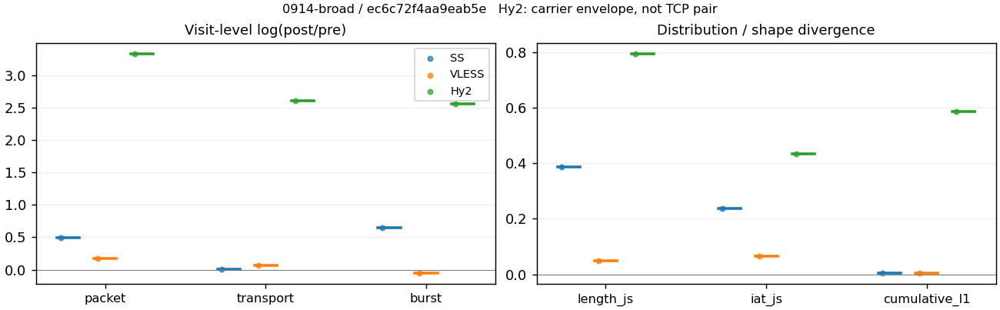
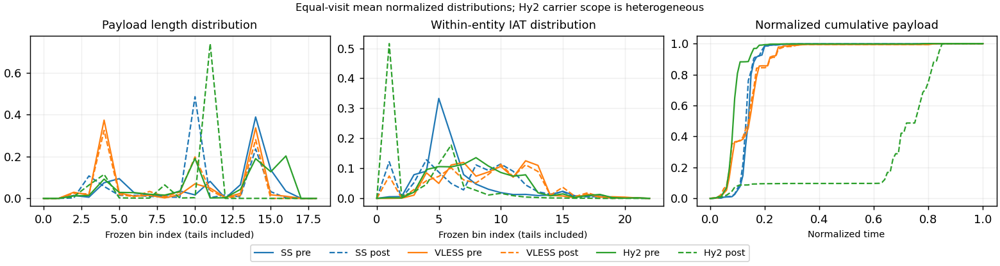

# 0914-broad · 条目 030 · huggingface.co

目标：https://huggingface.co/

活动标签：huggingface.co::page_load。选定访问 3 次。

[返回总索引](../../README.md) · [统计口径](../../methods.md)

## 覆盖与资格（每次访问均保留）

| 部署 | 重复 | 主请求路由 | 活动状态 | 代理比较 | DIRECT pre | 请求 proxy/direct/unresolved | 错误 |
| --- | --- | --- | --- | --- | --- | --- | --- |
| Hy2 | 1 | proxy | passed | 1 | 0 | 99/0/0 | [] |
| SS | 1 | proxy | passed | 1 | 0 | 99/0/0 | [] |
| VLESS | 1 | proxy | passed | 1 | 0 | 99/0/0 | [] |

主请求非 proxy 的统计仅解释为已索引的辅助代理连接或 DIRECT 观测，不代表目标业务经代理传输。播放确认与配对资格是两道不同的门。

图中散点为单次访问，短线为重复中位数；Hy2 是共享载体包络，不能与 TCP 配对作等范围因果对比。

形态图先逐访问归一化，再对访问等权平均；实线 pre，虚线 post。分箱序号及边界见 methods，不将分箱索引误解为长度或时间。

## 每次访问的关键观测

### SS

范围：`exclusive_page`。每格 pre → post；空值为不可观测/不适用。

| 重复 | 包数 | 载荷字节 | burst | TCP FR | IAT中位µs | length JS | IAT JS |
| --- | --- | --- | --- | --- | --- | --- | --- |
| 1 | 2051 → 3348 | 3.3602e+06 → 3.399e+06 | 1127 → 2148 | 90 → 96 | 19.186 → 126.74 | 0.38721 | 0.23818 |

完整标量统计：中位数 [min,max]；Δ 为重复内逐访问变换的中位数，MAD 未缩放。n 为可用变换数；DIRECT-only 的 nΔ=0 不代表 pre 不可用。

| scope | 特征 | pre | post | Δ | IQRΔ | MADΔ | nΔ |
| --- | --- | --- | --- | --- | --- | --- | --- |
| exclusive_page | active_span_sum_s_1000ms | 15.179 [15.179, 15.179] | 15.116 [15.116, 15.116] | -0.0041114 | — | — | 1 |
| exclusive_page | active_span_sum_s_100ms | 3.5268 [3.5268, 3.5268] | 6.0842 [6.0842, 6.0842] | 0.54531 | — | — | 1 |
| exclusive_page | active_span_sum_s_500ms | 13.407 [13.407, 13.407] | 14.395 [14.395, 14.395] | 0.071126 | — | — | 1 |
| exclusive_page | burst_bytes_iqr | 4290 [4290, 4290] | 2856 [2856, 2856] | -0.40686 | — | — | 1 |
| exclusive_page | burst_bytes_mad | 64 [64, 64] | 34 [34, 34] | -0.63252 | — | — | 1 |
| exclusive_page | burst_bytes_max | 22344 [22344, 22344] | 31416 [31416, 31416] | 0.34076 | — | — | 1 |
| exclusive_page | burst_bytes_mean | 2981.5 [2981.5, 2981.5] | 1582.4 [1582.4, 1582.4] | -0.63349 | — | — | 1 |
| exclusive_page | burst_bytes_median | 64 [64, 64] | 34 [34, 34] | -0.63252 | — | — | 1 |
| exclusive_page | burst_bytes_min | 0 [0, 0] | 0 [0, 0] | — | — | — | 0 |
| exclusive_page | burst_bytes_p95 | 14480 [14480, 14480] | 7140 [7140, 7140] | -0.70706 | — | — | 1 |
| exclusive_page | burst_bytes_q25 | 0 [0, 0] | 0 [0, 0] | — | — | — | 0 |
| exclusive_page | burst_bytes_q75 | 4290 [4290, 4290] | 2856 [2856, 2856] | -0.40686 | — | — | 1 |
| exclusive_page | burst_bytes_std | 5060.9 [5060.9, 5060.9] | 2694.9 [2694.9, 2694.9] | -0.63019 | — | — | 1 |
| exclusive_page | burst_count | 1127 [1127, 1127] | 2148 [2148, 2148] | 0.64498 | — | — | 1 |
| exclusive_page | burst_duration_ms_iqr | 0.036071 [0.036071, 0.036071] | 0.0002305 [0.0002305, 0.0002305] | -5.053 | — | — | 1 |
| exclusive_page | burst_duration_ms_mad | 0 [0, 0] | 0 [0, 0] | — | — | — | 0 |
| exclusive_page | burst_duration_ms_max | 13663 [13663, 13663] | 13665 [13665, 13665] | 9.8229e-05 | — | — | 1 |
| exclusive_page | burst_duration_ms_mean | 39.091 [39.091, 39.091] | 18.724 [18.724, 18.724] | -0.73608 | — | — | 1 |
| exclusive_page | burst_duration_ms_median | 0 [0, 0] | 0 [0, 0] | — | — | — | 0 |
| exclusive_page | burst_duration_ms_min | 0 [0, 0] | 0 [0, 0] | — | — | — | 0 |
| exclusive_page | burst_duration_ms_p95 | 29.891 [29.891, 29.891] | 0.96705 [0.96705, 0.96705] | -3.4311 | — | — | 1 |
| exclusive_page | burst_duration_ms_q25 | 0 [0, 0] | 0 [0, 0] | — | — | — | 0 |
| exclusive_page | burst_duration_ms_q75 | 0.036071 [0.036071, 0.036071] | 0.0002305 [0.0002305, 0.0002305] | -5.053 | — | — | 1 |
| exclusive_page | burst_duration_ms_std | 510.14 [510.14, 510.14] | 370.11 [370.11, 370.11] | -0.32088 | — | — | 1 |
| exclusive_page | burst_packets_iqr | 1 [1, 1] | 1 [1, 1] | 0 | — | — | 1 |
| exclusive_page | burst_packets_mad | 0 [0, 0] | 0 [0, 0] | — | — | — | 0 |
| exclusive_page | burst_packets_max | 14 [14, 14] | 11 [11, 11] | -0.24116 | — | — | 1 |
| exclusive_page | burst_packets_mean | 1.8199 [1.8199, 1.8199] | 1.5587 [1.5587, 1.5587] | -0.15494 | — | — | 1 |
| exclusive_page | burst_packets_median | 1 [1, 1] | 1 [1, 1] | 0 | — | — | 1 |
| exclusive_page | burst_packets_min | 1 [1, 1] | 1 [1, 1] | 0 | — | — | 1 |
| exclusive_page | burst_packets_p95 | 5 [5, 5] | 4 [4, 4] | -0.22314 | — | — | 1 |
| exclusive_page | burst_packets_q25 | 1 [1, 1] | 1 [1, 1] | 0 | — | — | 1 |
| exclusive_page | burst_packets_q75 | 2 [2, 2] | 2 [2, 2] | 0 | — | — | 1 |
| exclusive_page | burst_packets_std | 1.6349 [1.6349, 1.6349] | 1.0234 [1.0234, 1.0234] | -0.46849 | — | — | 1 |
| exclusive_page | connection_span_concurrency_max | 7 [7, 7] | 7 [7, 7] | 0 | — | — | 1 |
| exclusive_page | cumulative_l1 | — | — | 0.0058435 | — | — | 1 |
| exclusive_page | cumulative_max | — | — | 0.2648 | — | — | 1 |
| exclusive_page | direction_entropy | 0.48896 [0.48896, 0.48896] | 0.3115 [0.3115, 0.3115] | -0.17746 | — | — | 1 |
| exclusive_page | down_burst_count | 559 [559, 559] | 1070 [1070, 1070] | 0.64926 | — | — | 1 |
| exclusive_page | down_ip_bytes | 3.3833e+06 [3.3833e+06, 3.3833e+06] | 3.451e+06 [3.451e+06, 3.451e+06] | 0.01981 | — | — | 1 |
| exclusive_page | down_packets | 1388 [1388, 1388] | 2071 [2071, 2071] | 0.40017 | — | — | 1 |
| exclusive_page | down_transport_bytes | 3.311e+06 [3.311e+06, 3.311e+06] | 3.3432e+06 [3.3432e+06, 3.3432e+06] | 0.0096602 | — | — | 1 |
| exclusive_page | duration_s | 19.199 [19.199, 19.199] | 19.198 [19.198, 19.198] | -2.6716e-05 | — | — | 1 |
| exclusive_page | entity_count | 9 [9, 9] | 9 [9, 9] | 0 | — | — | 1 |
| exclusive_page | fr_runs | 90 [90, 90] | 96 [96, 96] | 0.064539 | — | — | 1 |
| exclusive_page | fr_runs_per_packet | 0.064702 [0.064702, 0.064702] | 0.045977 [0.045977, 0.045977] | -0.018725 | — | — | 1 |
| exclusive_page | fr_switches | 81 [81, 81] | 87 [87, 87] | 0.071459 | — | — | 1 |
| exclusive_page | fr_switches_per_possible_transition | 0.058611 [0.058611, 0.058611] | 0.041847 [0.041847, 0.041847] | -0.016764 | — | — | 1 |
| exclusive_page | full_retransmission_fraction | 0.0014627 [0.0014627, 0.0014627] | 0.0020908 [0.0020908, 0.0020908] | 0.0006281 | — | — | 1 |
| exclusive_page | full_retransmission_packets | 3 [3, 3] | 7 [7, 7] | 0.8473 | — | — | 1 |
| exclusive_page | iat_count | 2042 [2042, 2042] | 3339 [3339, 3339] | 0.49174 | — | — | 1 |
| exclusive_page | iat_js | — | — | 0.23818 | — | — | 1 |
| exclusive_page | iat_ks | — | — | 0.33168 | — | — | 1 |
| exclusive_page | iat_median_us | 19.186 [19.186, 19.186] | 126.74 [126.74, 126.74] | 1.888 | — | — | 1 |
| exclusive_page | iat_us_iqr | 52.712 [52.712, 52.712] | 803.82 [803.82, 803.82] | 2.7245 | — | — | 1 |
| exclusive_page | iat_us_mad | 11.763 [11.763, 11.763] | 126.61 [126.61, 126.61] | 2.3761 | — | — | 1 |
| exclusive_page | iat_us_max | 1.3663e+07 [1.3663e+07, 1.3663e+07] | 1.3665e+07 [1.3665e+07, 1.3665e+07] | 9.8229e-05 | — | — | 1 |
| exclusive_page | iat_us_mean | 23800 [23800, 23800] | 14526 [14526, 14526] | -0.49378 | — | — | 1 |
| exclusive_page | iat_us_median | 19.186 [19.186, 19.186] | 126.74 [126.74, 126.74] | 1.888 | — | — | 1 |
| exclusive_page | iat_us_min | 0.058 [0.058, 0.058] | 0.033 [0.033, 0.033] | -0.56394 | — | — | 1 |
| exclusive_page | iat_us_p95 | 28656 [28656, 28656] | 12983 [12983, 12983] | -0.79175 | — | — | 1 |
| exclusive_page | iat_us_q25 | 12.215 [12.215, 12.215] | 7.9075 [7.9075, 7.9075] | -0.43483 | — | — | 1 |
| exclusive_page | iat_us_q75 | 64.927 [64.927, 64.927] | 811.73 [811.73, 811.73] | 2.5259 | — | — | 1 |
| exclusive_page | iat_us_std | 3.7998e+05 [3.7998e+05, 3.7998e+05] | 2.9657e+05 [2.9657e+05, 2.9657e+05] | -0.24783 | — | — | 1 |
| exclusive_page | iat_wasserstein_log1p_us | — | — | 1.336 | — | — | 1 |
| exclusive_page | idle_gap_count_1000ms | 7 [7, 7] | 7 [7, 7] | 0 | — | — | 1 |
| exclusive_page | idle_gap_count_100ms | 49 [49, 49] | 45 [45, 45] | -0.085158 | — | — | 1 |
| exclusive_page | idle_gap_count_500ms | 10 [10, 10] | 8 [8, 8] | -0.22314 | — | — | 1 |
| exclusive_page | idle_gap_sum_s_1000ms | 33.422 [33.422, 33.422] | 33.385 [33.385, 33.385] | -0.0010964 | — | — | 1 |
| exclusive_page | idle_gap_sum_s_100ms | 45.074 [45.074, 45.074] | 42.417 [42.417, 42.417] | -0.060741 | — | — | 1 |
| exclusive_page | idle_gap_sum_s_500ms | 35.193 [35.193, 35.193] | 34.106 [34.106, 34.106] | -0.03138 | — | — | 1 |
| exclusive_page | ip_bytes | 3.467e+06 [3.467e+06, 3.467e+06] | 3.6005e+06 [3.6005e+06, 3.6005e+06] | 0.037793 | — | — | 1 |
| exclusive_page | length_iqr | 1776.5 [1776.5, 1776.5] | 1428 [1428, 1428] | -0.21837 | — | — | 1 |
| exclusive_page | length_js | — | — | 0.38721 | — | — | 1 |
| exclusive_page | length_ks | — | — | 0.47379 | — | — | 1 |
| exclusive_page | length_mad | 1200 [1200, 1200] | 54 [54, 54] | -3.1011 | — | — | 1 |
| exclusive_page | length_max | 8948 [8948, 8948] | 15708 [15708, 15708] | 0.56274 | — | — | 1 |
| exclusive_page | length_mean | 2415.7 [2415.7, 2415.7] | 1627.9 [1627.9, 1627.9] | -0.39469 | — | — | 1 |
| exclusive_page | length_median | 2896 [2896, 2896] | 1428 [1428, 1428] | -0.70706 | — | — | 1 |
| exclusive_page | length_min | 23 [23, 23] | 4 [4, 4] | -1.7492 | — | — | 1 |
| exclusive_page | length_p95 | 6000 [6000, 6000] | 2856 [2856, 2856] | -0.74234 | — | — | 1 |
| exclusive_page | length_q25 | 1119.5 [1119.5, 1119.5] | 1428 [1428, 1428] | 0.24339 | — | — | 1 |
| exclusive_page | length_q75 | 2896 [2896, 2896] | 2856 [2856, 2856] | -0.013908 | — | — | 1 |
| exclusive_page | length_std | 1866.3 [1866.3, 1866.3] | 1205.5 [1205.5, 1205.5] | -0.43704 | — | — | 1 |
| exclusive_page | length_wasserstein_bytes | — | — | 863.02 | — | — | 1 |
| exclusive_page | nonempty_entity_count | 9 [9, 9] | 9 [9, 9] | 0 | — | — | 1 |
| exclusive_page | nonempty_packets | 1391 [1391, 1391] | 2088 [2088, 2088] | 0.40618 | — | — | 1 |
| exclusive_page | offload_suspect_fraction | 0.42467 [0.42467, 0.42467] | 0.18399 [0.18399, 0.18399] | -0.24068 | — | — | 1 |
| exclusive_page | packet_count | 2051 [2051, 2051] | 3348 [3348, 3348] | 0.49004 | — | — | 1 |
| exclusive_page | rtt_median_ms | 0.052286 [0.052286, 0.052286] | 28.272 [28.272, 28.272] | 6.2929 | — | — | 1 |
| exclusive_page | rtt_sample_count | 645 [645, 645] | 332 [332, 332] | -0.66412 | — | — | 1 |
| exclusive_page | tcp_ack_count | 2042 [2042, 2042] | 3339 [3339, 3339] | 0.49174 | — | — | 1 |
| exclusive_page | tcp_fin_count | 18 [18, 18] | 21 [21, 21] | 0.15415 | — | — | 1 |
| exclusive_page | tcp_packet_count | 2051 [2051, 2051] | 3348 [3348, 3348] | 0.49004 | — | — | 1 |
| exclusive_page | tcp_rst_count | 0 [0, 0] | 0 [0, 0] | — | — | — | 0 |
| exclusive_page | tcp_syn_count | 18 [18, 18] | 18 [18, 18] | 0 | — | — | 1 |
| exclusive_page | tcp_window_raw_median | 65535 [65535, 65535] | 154 [154, 154] | -6.0534 | — | — | 1 |
| exclusive_page | transition_entropy | 0.26476 [0.26476, 0.26476] | 0.18779 [0.18779, 0.18779] | -0.076967 | — | — | 1 |
| exclusive_page | transition_n_mm | 1198 [1198, 1198] | 1923 [1923, 1923] | 0.47323 | — | — | 1 |
| exclusive_page | transition_n_mp | 36 [36, 36] | 39 [39, 39] | 0.080043 | — | — | 1 |
| exclusive_page | transition_n_pm | 45 [45, 45] | 48 [48, 48] | 0.064539 | — | — | 1 |
| exclusive_page | transition_n_pp | 103 [103, 103] | 69 [69, 69] | -0.40062 | — | — | 1 |
| exclusive_page | transition_p_mm | 0.97083 [0.97083, 0.97083] | 0.98012 [0.98012, 0.98012] | 0.0092957 | — | — | 1 |
| exclusive_page | transition_p_mp | 0.029173 [0.029173, 0.029173] | 0.019878 [0.019878, 0.019878] | -0.0092957 | — | — | 1 |
| exclusive_page | transition_p_pm | 0.30405 [0.30405, 0.30405] | 0.41026 [0.41026, 0.41026] | 0.1062 | — | — | 1 |
| exclusive_page | transition_p_pp | 0.69595 [0.69595, 0.69595] | 0.58974 [0.58974, 0.58974] | -0.1062 | — | — | 1 |
| exclusive_page | transport_bytes | 3.3602e+06 [3.3602e+06, 3.3602e+06] | 3.399e+06 [3.399e+06, 3.399e+06] | 0.011492 | — | — | 1 |
| exclusive_page | up_burst_count | 568 [568, 568] | 1078 [1078, 1078] | 0.64074 | — | — | 1 |
| exclusive_page | up_byte_fraction | 0.014627 [0.014627, 0.014627] | 0.01643 [0.01643, 0.01643] | 0.0018032 | — | — | 1 |
| exclusive_page | up_ip_bytes | 83732 [83732, 83732] | 1.4958e+05 [1.4958e+05, 1.4958e+05] | 0.58019 | — | — | 1 |
| exclusive_page | up_packets | 663 [663, 663] | 1277 [1277, 1277] | 0.65549 | — | — | 1 |
| exclusive_page | up_transport_bytes | 49148 [49148, 49148] | 55845 [55845, 55845] | 0.12774 | — | — | 1 |
| exclusive_page | zero_iat_count | 0 [0, 0] | 0 [0, 0] | — | — | — | 0 |
| exclusive_page | zero_iat_fraction | 0 [0, 0] | 0 [0, 0] | 0 | — | — | 1 |

### VLESS

范围：`exclusive_page`。每格 pre → post；空值为不可观测/不适用。

| 重复 | 包数 | 载荷字节 | burst | TCP FR | IAT中位µs | length JS | IAT JS |
| --- | --- | --- | --- | --- | --- | --- | --- |
| 1 | 1511 → 1797 | 1.2786e+06 → 1.361e+06 | 1103 → 1052 | 70 → 88 | 400.66 → 420.87 | 0.048222 | 0.064815 |

完整标量统计：中位数 [min,max]；Δ 为重复内逐访问变换的中位数，MAD 未缩放。n 为可用变换数；DIRECT-only 的 nΔ=0 不代表 pre 不可用。

| scope | 特征 | pre | post | Δ | IQRΔ | MADΔ | nΔ |
| --- | --- | --- | --- | --- | --- | --- | --- |
| exclusive_page | active_span_sum_s_1000ms | 13.512 [13.512, 13.512] | 13.798 [13.798, 13.798] | 0.020943 | — | — | 1 |
| exclusive_page | active_span_sum_s_100ms | 3.0038 [3.0038, 3.0038] | 6.0032 [6.0032, 6.0032] | 0.69242 | — | — | 1 |
| exclusive_page | active_span_sum_s_500ms | 8.3362 [8.3362, 8.3362] | 13.798 [13.798, 13.798] | 0.50395 | — | — | 1 |
| exclusive_page | burst_bytes_iqr | 2824 [2824, 2824] | 2824 [2824, 2824] | 0 | — | — | 1 |
| exclusive_page | burst_bytes_mad | 31 [31, 31] | 70 [70, 70] | 0.81451 | — | — | 1 |
| exclusive_page | burst_bytes_max | 57396 [57396, 57396] | 39819 [39819, 39819] | -0.36563 | — | — | 1 |
| exclusive_page | burst_bytes_mean | 1159.2 [1159.2, 1159.2] | 1293.7 [1293.7, 1293.7] | 0.10979 | — | — | 1 |
| exclusive_page | burst_bytes_median | 31 [31, 31] | 70 [70, 70] | 0.81451 | — | — | 1 |
| exclusive_page | burst_bytes_min | 0 [0, 0] | 0 [0, 0] | — | — | — | 0 |
| exclusive_page | burst_bytes_p95 | 2896 [2896, 2896] | 2896 [2896, 2896] | 0 | — | — | 1 |
| exclusive_page | burst_bytes_q25 | 0 [0, 0] | 0 [0, 0] | — | — | — | 0 |
| exclusive_page | burst_bytes_q75 | 2824 [2824, 2824] | 2824 [2824, 2824] | 0 | — | — | 1 |
| exclusive_page | burst_bytes_std | 2543.2 [2543.2, 2543.2] | 1992.5 [1992.5, 1992.5] | -0.24404 | — | — | 1 |
| exclusive_page | burst_count | 1103 [1103, 1103] | 1052 [1052, 1052] | -0.047341 | — | — | 1 |
| exclusive_page | burst_duration_ms_iqr | 0.52461 [0.52461, 0.52461] | 3.2805 [3.2805, 3.2805] | 1.8331 | — | — | 1 |
| exclusive_page | burst_duration_ms_mad | 0 [0, 0] | 0 [0, 0] | — | — | — | 0 |
| exclusive_page | burst_duration_ms_max | 13401 [13401, 13401] | 13402 [13402, 13402] | 1.8272e-05 | — | — | 1 |
| exclusive_page | burst_duration_ms_mean | 40.588 [40.588, 40.588] | 40.037 [40.037, 40.037] | -0.013671 | — | — | 1 |
| exclusive_page | burst_duration_ms_median | 0 [0, 0] | 0 [0, 0] | — | — | — | 0 |
| exclusive_page | burst_duration_ms_min | 0 [0, 0] | 0 [0, 0] | — | — | — | 0 |
| exclusive_page | burst_duration_ms_p95 | 10.275 [10.275, 10.275] | 36.928 [36.928, 36.928] | 1.2793 | — | — | 1 |
| exclusive_page | burst_duration_ms_q25 | 0 [0, 0] | 0 [0, 0] | — | — | — | 0 |
| exclusive_page | burst_duration_ms_q75 | 0.52461 [0.52461, 0.52461] | 3.2805 [3.2805, 3.2805] | 1.8331 | — | — | 1 |
| exclusive_page | burst_duration_ms_std | 506.33 [506.33, 506.33] | 515.14 [515.14, 515.14] | 0.017249 | — | — | 1 |
| exclusive_page | burst_packets_iqr | 1 [1, 1] | 1 [1, 1] | 0 | — | — | 1 |
| exclusive_page | burst_packets_mad | 0 [0, 0] | 0 [0, 0] | — | — | — | 0 |
| exclusive_page | burst_packets_max | 7 [7, 7] | 29 [29, 29] | 1.4214 | — | — | 1 |
| exclusive_page | burst_packets_mean | 1.3699 [1.3699, 1.3699] | 1.7082 [1.7082, 1.7082] | 0.22069 | — | — | 1 |
| exclusive_page | burst_packets_median | 1 [1, 1] | 1 [1, 1] | 0 | — | — | 1 |
| exclusive_page | burst_packets_min | 1 [1, 1] | 1 [1, 1] | 0 | — | — | 1 |
| exclusive_page | burst_packets_p95 | 2 [2, 2] | 4 [4, 4] | 0.69315 | — | — | 1 |
| exclusive_page | burst_packets_q25 | 1 [1, 1] | 1 [1, 1] | 0 | — | — | 1 |
| exclusive_page | burst_packets_q75 | 2 [2, 2] | 2 [2, 2] | 0 | — | — | 1 |
| exclusive_page | burst_packets_std | 0.56578 [0.56578, 0.56578] | 1.5165 [1.5165, 1.5165] | 0.98596 | — | — | 1 |
| exclusive_page | connection_span_concurrency_max | 6 [6, 6] | 6 [6, 6] | 0 | — | — | 1 |
| exclusive_page | cumulative_l1 | — | — | 0.0059018 | — | — | 1 |
| exclusive_page | cumulative_max | — | — | 0.097185 | — | — | 1 |
| exclusive_page | direction_entropy | 0.47923 [0.47923, 0.47923] | 0.67968 [0.67968, 0.67968] | 0.20045 | — | — | 1 |
| exclusive_page | down_burst_count | 547 [547, 547] | 522 [522, 522] | -0.046781 | — | — | 1 |
| exclusive_page | down_ip_bytes | 1.1469e+06 [1.1469e+06, 1.1469e+06] | 1.2203e+06 [1.2203e+06, 1.2203e+06] | 0.062078 | — | — | 1 |
| exclusive_page | down_packets | 896 [896, 896] | 1062 [1062, 1062] | 0.16997 | — | — | 1 |
| exclusive_page | down_transport_bytes | 1.1002e+06 [1.1002e+06, 1.1002e+06] | 1.165e+06 [1.165e+06, 1.165e+06] | 0.057235 | — | — | 1 |
| exclusive_page | duration_s | 19.192 [19.192, 19.192] | 19.109 [19.109, 19.109] | -0.0043497 | — | — | 1 |
| exclusive_page | entity_count | 9 [9, 9] | 9 [9, 9] | 0 | — | — | 1 |
| exclusive_page | fr_runs | 70 [70, 70] | 88 [88, 88] | 0.22884 | — | — | 1 |
| exclusive_page | fr_runs_per_packet | 0.078563 [0.078563, 0.078563] | 0.080734 [0.080734, 0.080734] | 0.0021705 | — | — | 1 |
| exclusive_page | fr_switches | 61 [61, 61] | 79 [79, 79] | 0.25857 | — | — | 1 |
| exclusive_page | fr_switches_per_possible_transition | 0.069161 [0.069161, 0.069161] | 0.07308 [0.07308, 0.07308] | 0.0039195 | — | — | 1 |
| exclusive_page | full_retransmission_fraction | 0 [0, 0] | 0 [0, 0] | 0 | — | — | 1 |
| exclusive_page | full_retransmission_packets | 0 [0, 0] | 0 [0, 0] | — | — | — | 0 |
| exclusive_page | iat_count | 1502 [1502, 1502] | 1788 [1788, 1788] | 0.1743 | — | — | 1 |
| exclusive_page | iat_js | — | — | 0.064815 | — | — | 1 |
| exclusive_page | iat_ks | — | — | 0.10177 | — | — | 1 |
| exclusive_page | iat_median_us | 400.66 [400.66, 400.66] | 420.87 [420.87, 420.87] | 0.049207 | — | — | 1 |
| exclusive_page | iat_us_iqr | 2360.3 [2360.3, 2360.3] | 2445.1 [2445.1, 2445.1] | 0.035302 | — | — | 1 |
| exclusive_page | iat_us_mad | 386.64 [386.64, 386.64] | 414.53 [414.53, 414.53] | 0.069642 | — | — | 1 |
| exclusive_page | iat_us_max | 1.3401e+07 [1.3401e+07, 1.3401e+07] | 1.3402e+07 [1.3402e+07, 1.3402e+07] | 1.8272e-05 | — | — | 1 |
| exclusive_page | iat_us_mean | 31146 [31146, 31146] | 25729 [25729, 25729] | -0.19105 | — | — | 1 |
| exclusive_page | iat_us_median | 400.66 [400.66, 400.66] | 420.87 [420.87, 420.87] | 0.049207 | — | — | 1 |
| exclusive_page | iat_us_min | 1.687 [1.687, 1.687] | 0.037 [0.037, 0.037] | -3.8198 | — | — | 1 |
| exclusive_page | iat_us_p95 | 9961.1 [9961.1, 9961.1] | 40785 [40785, 40785] | 1.4096 | — | — | 1 |
| exclusive_page | iat_us_q25 | 46.716 [46.716, 46.716] | 21.928 [21.928, 21.928] | -0.75629 | — | — | 1 |
| exclusive_page | iat_us_q75 | 2407 [2407, 2407] | 2467.1 [2467.1, 2467.1] | 0.024631 | — | — | 1 |
| exclusive_page | iat_us_std | 4.342e+05 [4.342e+05, 4.342e+05] | 3.9559e+05 [3.9559e+05, 3.9559e+05] | -0.093123 | — | — | 1 |
| exclusive_page | iat_wasserstein_log1p_us | — | — | 0.43381 | — | — | 1 |
| exclusive_page | idle_gap_count_1000ms | 8 [8, 8] | 7 [7, 7] | -0.13353 | — | — | 1 |
| exclusive_page | idle_gap_count_100ms | 43 [43, 43] | 50 [50, 50] | 0.15082 | — | — | 1 |
| exclusive_page | idle_gap_count_500ms | 16 [16, 16] | 7 [7, 7] | -0.82668 | — | — | 1 |
| exclusive_page | idle_gap_sum_s_1000ms | 33.269 [33.269, 33.269] | 32.205 [32.205, 32.205] | -0.032476 | — | — | 1 |
| exclusive_page | idle_gap_sum_s_100ms | 43.777 [43.777, 43.777] | 40.001 [40.001, 40.001] | -0.090216 | — | — | 1 |
| exclusive_page | idle_gap_sum_s_500ms | 38.445 [38.445, 38.445] | 32.205 [32.205, 32.205] | -0.17709 | — | — | 1 |
| exclusive_page | ip_bytes | 1.3571e+06 [1.3571e+06, 1.3571e+06] | 1.455e+06 [1.455e+06, 1.455e+06] | 0.06959 | — | — | 1 |
| exclusive_page | length_iqr | 2752 [2752, 2752] | 2752 [2752, 2752] | 0 | — | — | 1 |
| exclusive_page | length_js | — | — | 0.048222 | — | — | 1 |
| exclusive_page | length_ks | — | — | 0.10825 | — | — | 1 |
| exclusive_page | length_mad | 1340 [1340, 1340] | 1340 [1340, 1340] | 0 | — | — | 1 |
| exclusive_page | length_max | 8948 [8948, 8948] | 2824 [2824, 2824] | -1.1533 | — | — | 1 |
| exclusive_page | length_mean | 1435 [1435, 1435] | 1248.6 [1248.6, 1248.6] | -0.13914 | — | — | 1 |
| exclusive_page | length_median | 1412 [1412, 1412] | 1412 [1412, 1412] | 0 | — | — | 1 |
| exclusive_page | length_min | 24 [24, 24] | 13 [13, 13] | -0.6131 | — | — | 1 |
| exclusive_page | length_p95 | 2824 [2824, 2824] | 2824 [2824, 2824] | 0 | — | — | 1 |
| exclusive_page | length_q25 | 72 [72, 72] | 72 [72, 72] | 0 | — | — | 1 |
| exclusive_page | length_q75 | 2824 [2824, 2824] | 2824 [2824, 2824] | 0 | — | — | 1 |
| exclusive_page | length_std | 1589.7 [1589.7, 1589.7] | 1121.7 [1121.7, 1121.7] | -0.34875 | — | — | 1 |
| exclusive_page | length_wasserstein_bytes | — | — | 300.27 | — | — | 1 |
| exclusive_page | nonempty_entity_count | 9 [9, 9] | 9 [9, 9] | 0 | — | — | 1 |
| exclusive_page | nonempty_packets | 891 [891, 891] | 1090 [1090, 1090] | 0.20159 | — | — | 1 |
| exclusive_page | offload_suspect_fraction | 0.23097 [0.23097, 0.23097] | 0.17919 [0.17919, 0.17919] | -0.051785 | — | — | 1 |
| exclusive_page | packet_count | 1511 [1511, 1511] | 1797 [1797, 1797] | 0.17335 | — | — | 1 |
| exclusive_page | rtt_median_ms | 0.41934 [0.41934, 0.41934] | 3.8817 [3.8817, 3.8817] | 2.2253 | — | — | 1 |
| exclusive_page | rtt_sample_count | 586 [586, 586] | 668 [668, 668] | 0.13097 | — | — | 1 |
| exclusive_page | tcp_ack_count | 1486 [1486, 1486] | 1787 [1787, 1787] | 0.18445 | — | — | 1 |
| exclusive_page | tcp_fin_count | 16 [16, 16] | 18 [18, 18] | 0.11778 | — | — | 1 |
| exclusive_page | tcp_packet_count | 1511 [1511, 1511] | 1797 [1797, 1797] | 0.17335 | — | — | 1 |
| exclusive_page | tcp_rst_count | 16 [16, 16] | 1 [1, 1] | -2.7726 | — | — | 1 |
| exclusive_page | tcp_syn_count | 18 [18, 18] | 18 [18, 18] | 0 | — | — | 1 |
| exclusive_page | tcp_window_raw_median | 65535 [65535, 65535] | 153 [153, 153] | -6.0599 | — | — | 1 |
| exclusive_page | transition_entropy | 0.28697 [0.28697, 0.28697] | 0.33596 [0.33596, 0.33596] | 0.048988 | — | — | 1 |
| exclusive_page | transition_n_mm | 764 [764, 764] | 850 [850, 850] | 0.10667 | — | — | 1 |
| exclusive_page | transition_n_mp | 26 [26, 26] | 35 [35, 35] | 0.29725 | — | — | 1 |
| exclusive_page | transition_n_pm | 35 [35, 35] | 44 [44, 44] | 0.22884 | — | — | 1 |
| exclusive_page | transition_n_pp | 57 [57, 57] | 152 [152, 152] | 0.98083 | — | — | 1 |
| exclusive_page | transition_p_mm | 0.96709 [0.96709, 0.96709] | 0.96045 [0.96045, 0.96045] | -0.0066366 | — | — | 1 |
| exclusive_page | transition_p_mp | 0.032911 [0.032911, 0.032911] | 0.039548 [0.039548, 0.039548] | 0.0066366 | — | — | 1 |
| exclusive_page | transition_p_pm | 0.38043 [0.38043, 0.38043] | 0.22449 [0.22449, 0.22449] | -0.15594 | — | — | 1 |
| exclusive_page | transition_p_pp | 0.61957 [0.61957, 0.61957] | 0.77551 [0.77551, 0.77551] | 0.15594 | — | — | 1 |
| exclusive_page | transport_bytes | 1.2786e+06 [1.2786e+06, 1.2786e+06] | 1.361e+06 [1.361e+06, 1.361e+06] | 0.062449 | — | — | 1 |
| exclusive_page | up_burst_count | 556 [556, 556] | 530 [530, 530] | -0.047891 | — | — | 1 |
| exclusive_page | up_byte_fraction | 0.13952 [0.13952, 0.13952] | 0.14399 [0.14399, 0.14399] | 0.0044749 | — | — | 1 |
| exclusive_page | up_ip_bytes | 2.1025e+05 [2.1025e+05, 2.1025e+05] | 2.346e+05 [2.346e+05, 2.346e+05] | 0.1096 | — | — | 1 |
| exclusive_page | up_packets | 615 [615, 615] | 735 [735, 735] | 0.17825 | — | — | 1 |
| exclusive_page | up_transport_bytes | 1.7839e+05 [1.7839e+05, 1.7839e+05] | 1.9598e+05 [1.9598e+05, 1.9598e+05] | 0.09402 | — | — | 1 |
| exclusive_page | zero_iat_count | 0 [0, 0] | 0 [0, 0] | — | — | — | 0 |
| exclusive_page | zero_iat_fraction | 0 [0, 0] | 0 [0, 0] | 0 | — | — | 1 |

### Hy2

范围：`carrier_context_envelope`。每格 pre → post；空值为不可观测/不适用。

| 重复 | 包数 | 载荷字节 | burst | TCP FR | IAT中位µs | length JS | IAT JS |
| --- | --- | --- | --- | --- | --- | --- | --- |
| 1 | 1549 → 43021 | 3.617e+06 → 4.9106e+07 | 904 → 11685 | — | 135.26 → 0.1305 | 0.79283 | 0.43233 |

完整标量统计：中位数 [min,max]；Δ 为重复内逐访问变换的中位数，MAD 未缩放。n 为可用变换数；DIRECT-only 的 nΔ=0 不代表 pre 不可用。

| scope | 特征 | pre | post | Δ | IQRΔ | MADΔ | nΔ |
| --- | --- | --- | --- | --- | --- | --- | --- |
| carrier_context_envelope | active_span_sum_s_1000ms | 12.411 [12.411, 12.411] | 11.364 [11.364, 11.364] | -0.088123 | — | — | 1 |
| carrier_context_envelope | active_span_sum_s_100ms | 2.1872 [2.1872, 2.1872] | 6.9093 [6.9093, 6.9093] | 1.1503 | — | — | 1 |
| carrier_context_envelope | active_span_sum_s_500ms | 9.5644 [9.5644, 9.5644] | 11.364 [11.364, 11.364] | 0.17238 | — | — | 1 |
| carrier_context_envelope | burst_bytes_iqr | 3957.8 [3957.8, 3957.8] | 5072 [5072, 5072] | 0.24806 | — | — | 1 |
| carrier_context_envelope | burst_bytes_mad | 64 [64, 64] | 375 [375, 375] | 1.768 | — | — | 1 |
| carrier_context_envelope | burst_bytes_max | 49218 [49218, 49218] | 3.5578e+05 [3.5578e+05, 3.5578e+05] | 1.9781 | — | — | 1 |
| carrier_context_envelope | burst_bytes_mean | 4001.1 [4001.1, 4001.1] | 4202.5 [4202.5, 4202.5] | 0.04912 | — | — | 1 |
| carrier_context_envelope | burst_bytes_median | 64 [64, 64] | 408 [408, 408] | 1.8524 | — | — | 1 |
| carrier_context_envelope | burst_bytes_min | 0 [0, 0] | 22 [22, 22] | — | — | — | 0 |
| carrier_context_envelope | burst_bytes_p95 | 20480 [20480, 20480] | 14410 [14410, 14410] | -0.35153 | — | — | 1 |
| carrier_context_envelope | burst_bytes_q25 | 0 [0, 0] | 96 [96, 96] | — | — | — | 0 |
| carrier_context_envelope | burst_bytes_q75 | 3957.8 [3957.8, 3957.8] | 5168 [5168, 5168] | 0.26681 | — | — | 1 |
| carrier_context_envelope | burst_bytes_std | 7100.5 [7100.5, 7100.5] | 11369 [11369, 11369] | 0.47071 | — | — | 1 |
| carrier_context_envelope | burst_count | 904 [904, 904] | 11685 [11685, 11685] | 2.5592 | — | — | 1 |
| carrier_context_envelope | burst_duration_ms_iqr | 0.097212 [0.097212, 0.097212] | 0.027982 [0.027982, 0.027982] | -1.2453 | — | — | 1 |
| carrier_context_envelope | burst_duration_ms_mad | 0 [0, 0] | 4.5e-05 [4.5e-05, 4.5e-05] | — | — | — | 0 |
| carrier_context_envelope | burst_duration_ms_max | 14057 [14057, 14057] | 220.13 [220.13, 220.13] | -4.1566 | — | — | 1 |
| carrier_context_envelope | burst_duration_ms_mean | 54.938 [54.938, 54.938] | 0.41897 [0.41897, 0.41897] | -4.8762 | — | — | 1 |
| carrier_context_envelope | burst_duration_ms_median | 0 [0, 0] | 4.5e-05 [4.5e-05, 4.5e-05] | — | — | — | 0 |
| carrier_context_envelope | burst_duration_ms_min | 0 [0, 0] | 0 [0, 0] | — | — | — | 0 |
| carrier_context_envelope | burst_duration_ms_p95 | 12.258 [12.258, 12.258] | 0.22396 [0.22396, 0.22396] | -4.0025 | — | — | 1 |
| carrier_context_envelope | burst_duration_ms_q25 | 0 [0, 0] | 0 [0, 0] | — | — | — | 0 |
| carrier_context_envelope | burst_duration_ms_q75 | 0.097212 [0.097212, 0.097212] | 0.027982 [0.027982, 0.027982] | -1.2453 | — | — | 1 |
| carrier_context_envelope | burst_duration_ms_std | 728.7 [728.7, 728.7] | 6.2134 [6.2134, 6.2134] | -4.7645 | — | — | 1 |
| carrier_context_envelope | burst_packets_iqr | 1 [1, 1] | 3 [3, 3] | 1.0986 | — | — | 1 |
| carrier_context_envelope | burst_packets_mad | 0 [0, 0] | 1 [1, 1] | — | — | — | 0 |
| carrier_context_envelope | burst_packets_max | 12 [12, 12] | 256 [256, 256] | 3.0603 | — | — | 1 |
| carrier_context_envelope | burst_packets_mean | 1.7135 [1.7135, 1.7135] | 3.6817 [3.6817, 3.6817] | 0.76485 | — | — | 1 |
| carrier_context_envelope | burst_packets_median | 1 [1, 1] | 2 [2, 2] | 0.69315 | — | — | 1 |
| carrier_context_envelope | burst_packets_min | 1 [1, 1] | 1 [1, 1] | 0 | — | — | 1 |
| carrier_context_envelope | burst_packets_p95 | 4 [4, 4] | 10 [10, 10] | 0.91629 | — | — | 1 |
| carrier_context_envelope | burst_packets_q25 | 1 [1, 1] | 1 [1, 1] | 0 | — | — | 1 |
| carrier_context_envelope | burst_packets_q75 | 2 [2, 2] | 4 [4, 4] | 0.69315 | — | — | 1 |
| carrier_context_envelope | burst_packets_std | 1.3357 [1.3357, 1.3357] | 8.015 [8.015, 8.015] | 1.7919 | — | — | 1 |
| carrier_context_envelope | connection_span_concurrency_max | 5 [5, 5] | 1 [1, 1] | -1.6094 | — | — | 1 |
| carrier_context_envelope | cumulative_l1 | — | — | 0.58543 | — | — | 1 |
| carrier_context_envelope | cumulative_max | — | — | 0.90186 | — | — | 1 |
| carrier_context_envelope | direction_entropy | 0.61641 [0.61641, 0.61641] | 0.68207 [0.68207, 0.68207] | 0.065655 | — | — | 1 |
| carrier_context_envelope | direction_run_analog_runs | 93 [93, 93] | 11685 [11685, 11685] | 4.8335 | — | — | 1 |
| carrier_context_envelope | direction_run_analog_runs_per_packet | 0.090998 [0.090998, 0.090998] | 0.27161 [0.27161, 0.27161] | 0.18061 | — | — | 1 |
| carrier_context_envelope | direction_run_analog_switches | 85 [85, 85] | 11684 [11684, 11684] | 4.9233 | — | — | 1 |
| carrier_context_envelope | direction_run_analog_switches_per_possible_transition | 0.083826 [0.083826, 0.083826] | 0.27159 [0.27159, 0.27159] | 0.18777 | — | — | 1 |
| carrier_context_envelope | down_burst_count | 448 [448, 448] | 5842 [5842, 5842] | 2.568 | — | — | 1 |
| carrier_context_envelope | down_ip_bytes | 3.4858e+06 [3.4858e+06, 3.4858e+06] | 4.9317e+07 [4.9317e+07, 4.9317e+07] | 2.6496 | — | — | 1 |
| carrier_context_envelope | down_packets | 1004 [1004, 1004] | 35238 [35238, 35238] | 3.5581 | — | — | 1 |
| carrier_context_envelope | down_transport_bytes | 3.4336e+06 [3.4336e+06, 3.4336e+06] | 4.8331e+07 [4.8331e+07, 4.8331e+07] | 2.6445 | — | — | 1 |
| carrier_context_envelope | duration_s | 17.875 [17.875, 17.875] | 17.874 [17.874, 17.874] | -4.2851e-05 | — | — | 1 |
| carrier_context_envelope | entity_count | 8 [8, 8] | 1 [1, 1] | -2.0794 | — | — | 1 |
| carrier_context_envelope | full_retransmission_fraction | 0.020013 [0.020013, 0.020013] | — | — | — | — | 0 |
| carrier_context_envelope | full_retransmission_packets | 31 [31, 31] | — | — | — | — | 0 |
| carrier_context_envelope | iat_count | 1541 [1541, 1541] | 43020 [43020, 43020] | 3.3292 | — | — | 1 |
| carrier_context_envelope | iat_js | — | — | 0.43233 | — | — | 1 |
| carrier_context_envelope | iat_ks | — | — | 0.57043 | — | — | 1 |
| carrier_context_envelope | iat_median_us | 135.26 [135.26, 135.26] | 0.1305 [0.1305, 0.1305] | -6.9436 | — | — | 1 |
| carrier_context_envelope | iat_us_iqr | 862.08 [862.08, 862.08] | 23.982 [23.982, 23.982] | -3.5821 | — | — | 1 |
| carrier_context_envelope | iat_us_mad | 125.17 [125.17, 125.17] | 0.0985 [0.0985, 0.0985] | -7.1473 | — | — | 1 |
| carrier_context_envelope | iat_us_max | 1.4057e+07 [1.4057e+07, 1.4057e+07] | 2.9288e+06 [2.9288e+06, 2.9288e+06] | -1.5685 | — | — | 1 |
| carrier_context_envelope | iat_us_mean | 34280 [34280, 34280] | 415.48 [415.48, 415.48] | -4.4129 | — | — | 1 |
| carrier_context_envelope | iat_us_median | 135.26 [135.26, 135.26] | 0.1305 [0.1305, 0.1305] | -6.9436 | — | — | 1 |
| carrier_context_envelope | iat_us_min | 0.077 [0.077, 0.077] | 0.006 [0.006, 0.006] | -2.552 | — | — | 1 |
| carrier_context_envelope | iat_us_p95 | 12922 [12922, 12922] | 180.06 [180.06, 180.06] | -4.2734 | — | — | 1 |
| carrier_context_envelope | iat_us_q25 | 25.099 [25.099, 25.099] | 0.038 [0.038, 0.038] | -6.493 | — | — | 1 |
| carrier_context_envelope | iat_us_q75 | 887.18 [887.18, 887.18] | 24.02 [24.02, 24.02] | -3.6092 | — | — | 1 |
| carrier_context_envelope | iat_us_std | 5.5932e+05 [5.5932e+05, 5.5932e+05] | 19448 [19448, 19448] | -3.359 | — | — | 1 |
| carrier_context_envelope | iat_wasserstein_log1p_us | — | — | 3.4599 | — | — | 1 |
| carrier_context_envelope | idle_gap_count_1000ms | 4 [4, 4] | 3 [3, 3] | -0.28768 | — | — | 1 |
| carrier_context_envelope | idle_gap_count_100ms | 43 [43, 43] | 32 [32, 32] | -0.29546 | — | — | 1 |
| carrier_context_envelope | idle_gap_count_500ms | 8 [8, 8] | 3 [3, 3] | -0.98083 | — | — | 1 |
| carrier_context_envelope | idle_gap_sum_s_1000ms | 40.415 [40.415, 40.415] | 6.5103 [6.5103, 6.5103] | -1.8258 | — | — | 1 |
| carrier_context_envelope | idle_gap_sum_s_100ms | 50.638 [50.638, 50.638] | 10.965 [10.965, 10.965] | -1.53 | — | — | 1 |
| carrier_context_envelope | idle_gap_sum_s_500ms | 43.261 [43.261, 43.261] | 6.5103 [6.5103, 6.5103] | -1.8939 | — | — | 1 |
| carrier_context_envelope | ip_bytes | 3.698e+06 [3.698e+06, 3.698e+06] | 5.0311e+07 [5.0311e+07, 5.0311e+07] | 2.6104 | — | — | 1 |
| carrier_context_envelope | length_iqr | 5379.5 [5379.5, 5379.5] | 596 [596, 596] | -2.2001 | — | — | 1 |
| carrier_context_envelope | length_js | — | — | 0.79283 | — | — | 1 |
| carrier_context_envelope | length_ks | — | — | 0.56751 | — | — | 1 |
| carrier_context_envelope | length_mad | 1752 [1752, 1752] | 0 [0, 0] | — | — | — | 0 |
| carrier_context_envelope | length_max | 8948 [8948, 8948] | 1441 [1441, 1441] | -1.8261 | — | — | 1 |
| carrier_context_envelope | length_mean | 3539.1 [3539.1, 3539.1] | 1141.4 [1141.4, 1141.4] | -1.1316 | — | — | 1 |
| carrier_context_envelope | length_median | 2357 [2357, 2357] | 1441 [1441, 1441] | -0.49205 | — | — | 1 |
| carrier_context_envelope | length_min | 3 [3, 3] | 22 [22, 22] | 1.9924 | — | — | 1 |
| carrier_context_envelope | length_p95 | 8920 [8920, 8920] | 1441 [1441, 1441] | -1.823 | — | — | 1 |
| carrier_context_envelope | length_q25 | 1356.5 [1356.5, 1356.5] | 845 [845, 845] | -0.47333 | — | — | 1 |
| carrier_context_envelope | length_q75 | 6736 [6736, 6736] | 1441 [1441, 1441] | -1.5421 | — | — | 1 |
| carrier_context_envelope | length_std | 3209.6 [3209.6, 3209.6] | 538.23 [538.23, 538.23] | -1.7856 | — | — | 1 |
| carrier_context_envelope | length_wasserstein_bytes | — | — | 2407.6 | — | — | 1 |
| carrier_context_envelope | nonempty_entity_count | 8 [8, 8] | 1 [1, 1] | -2.0794 | — | — | 1 |
| carrier_context_envelope | nonempty_packets | 1022 [1022, 1022] | 43021 [43021, 43021] | 3.7399 | — | — | 1 |
| carrier_context_envelope | offload_suspect_fraction | 0.37444 [0.37444, 0.37444] | 0 [0, 0] | -0.37444 | — | — | 1 |
| carrier_context_envelope | packet_count | 1549 [1549, 1549] | 43021 [43021, 43021] | 3.3241 | — | — | 1 |
| carrier_context_envelope | rtt_median_ms | 0.16449 [0.16449, 0.16449] | — | — | — | — | 0 |
| carrier_context_envelope | rtt_sample_count | 512 [512, 512] | 0 [0, 0] | — | — | — | 0 |
| carrier_context_envelope | tcp_ack_count | 1541 [1541, 1541] | — | — | — | — | 0 |
| carrier_context_envelope | tcp_fin_count | 16 [16, 16] | — | — | — | — | 0 |
| carrier_context_envelope | tcp_packet_count | 1549 [1549, 1549] | 0 [0, 0] | — | — | — | 0 |
| carrier_context_envelope | tcp_rst_count | 0 [0, 0] | — | — | — | — | 0 |
| carrier_context_envelope | tcp_syn_count | 16 [16, 16] | — | — | — | — | 0 |
| carrier_context_envelope | tcp_window_raw_median | 65535 [65535, 65535] | — | — | — | — | 0 |
| carrier_context_envelope | transition_entropy | 0.36211 [0.36211, 0.36211] | 0.67731 [0.67731, 0.67731] | 0.3152 | — | — | 1 |
| carrier_context_envelope | transition_n_mm | 821 [821, 821] | 29396 [29396, 29396] | 3.5781 | — | — | 1 |
| carrier_context_envelope | transition_n_mp | 40 [40, 40] | 5842 [5842, 5842] | 4.9839 | — | — | 1 |
| carrier_context_envelope | transition_n_pm | 45 [45, 45] | 5842 [5842, 5842] | 4.8662 | — | — | 1 |
| carrier_context_envelope | transition_n_pp | 108 [108, 108] | 1940 [1940, 1940] | 2.8883 | — | — | 1 |
| carrier_context_envelope | transition_p_mm | 0.95354 [0.95354, 0.95354] | 0.83421 [0.83421, 0.83421] | -0.11933 | — | — | 1 |
| carrier_context_envelope | transition_p_mp | 0.046458 [0.046458, 0.046458] | 0.16579 [0.16579, 0.16579] | 0.11933 | — | — | 1 |
| carrier_context_envelope | transition_p_pm | 0.29412 [0.29412, 0.29412] | 0.75071 [0.75071, 0.75071] | 0.45659 | — | — | 1 |
| carrier_context_envelope | transition_p_pp | 0.70588 [0.70588, 0.70588] | 0.24929 [0.24929, 0.24929] | -0.45659 | — | — | 1 |
| carrier_context_envelope | transport_bytes | 3.617e+06 [3.617e+06, 3.617e+06] | 4.9106e+07 [4.9106e+07, 4.9106e+07] | 2.6084 | — | — | 1 |
| carrier_context_envelope | up_burst_count | 456 [456, 456] | 5843 [5843, 5843] | 2.5505 | — | — | 1 |
| carrier_context_envelope | up_byte_fraction | 0.050702 [0.050702, 0.050702] | 0.015791 [0.015791, 0.015791] | -0.034911 | — | — | 1 |
| carrier_context_envelope | up_ip_bytes | 2.1216e+05 [2.1216e+05, 2.1216e+05] | 9.9335e+05 [9.9335e+05, 9.9335e+05] | 1.5437 | — | — | 1 |
| carrier_context_envelope | up_packets | 545 [545, 545] | 7783 [7783, 7783] | 2.6589 | — | — | 1 |
| carrier_context_envelope | up_transport_bytes | 1.8339e+05 [1.8339e+05, 1.8339e+05] | 7.7542e+05 [7.7542e+05, 7.7542e+05] | 1.4418 | — | — | 1 |
| carrier_context_envelope | zero_iat_count | 0 [0, 0] | 0 [0, 0] | — | — | — | 0 |
| carrier_context_envelope | zero_iat_fraction | 0 [0, 0] | 0 [0, 0] | 0 | — | — | 1 |

## 不同部署对比

以下是各部署自身重复中位数的差异，不按重复编号强行配对。跨 TCP/Hy2 的行标记异质观测范围。

| 视角 | 特征 | 部署A | 部署B | A中位 | B中位 | B−A | 比较口径 |
| --- | --- | --- | --- | --- | --- | --- | --- |
| pre | burst_count | SS | VLESS | 1127 | 1103 | -24 | same_scope_unpaired_visits |
| pre | burst_count | SS | Hy2 | 1127 | 904 | -223 | heterogeneous_scope_descriptive_only |
| pre | burst_count | VLESS | Hy2 | 1103 | 904 | -199 | heterogeneous_scope_descriptive_only |
| pre | connection_span_concurrency_max | SS | VLESS | 7 | 6 | -1 | same_scope_unpaired_visits |
| pre | connection_span_concurrency_max | SS | Hy2 | 7 | 5 | -2 | heterogeneous_scope_descriptive_only |
| pre | connection_span_concurrency_max | VLESS | Hy2 | 6 | 5 | -1 | heterogeneous_scope_descriptive_only |
| pre | direction_entropy | SS | VLESS | 0.48896 | 0.47923 | -0.0097267 | same_scope_unpaired_visits |
| pre | direction_entropy | SS | Hy2 | 0.48896 | 0.61641 | 0.12746 | heterogeneous_scope_descriptive_only |
| pre | direction_entropy | VLESS | Hy2 | 0.47923 | 0.61641 | 0.13718 | heterogeneous_scope_descriptive_only |
| pre | down_transport_bytes | SS | VLESS | 3.311e+06 | 1.1002e+06 | -2.2108e+06 | same_scope_unpaired_visits |
| pre | down_transport_bytes | SS | Hy2 | 3.311e+06 | 3.4336e+06 | 1.2255e+05 | heterogeneous_scope_descriptive_only |
| pre | down_transport_bytes | VLESS | Hy2 | 1.1002e+06 | 3.4336e+06 | 2.3333e+06 | heterogeneous_scope_descriptive_only |
| pre | duration_s | SS | VLESS | 19.199 | 19.192 | -0.0063812 | same_scope_unpaired_visits |
| pre | duration_s | SS | Hy2 | 19.199 | 17.875 | -1.3239 | heterogeneous_scope_descriptive_only |
| pre | duration_s | VLESS | Hy2 | 19.192 | 17.875 | -1.3175 | heterogeneous_scope_descriptive_only |
| pre | entity_count | SS | VLESS | 9 | 9 | 0 | same_scope_unpaired_visits |
| pre | entity_count | SS | Hy2 | 9 | 8 | -1 | heterogeneous_scope_descriptive_only |
| pre | entity_count | VLESS | Hy2 | 9 | 8 | -1 | heterogeneous_scope_descriptive_only |
| pre | fr_runs | SS | VLESS | 90 | 70 | -20 | same_scope_unpaired_visits |
| pre | fr_runs_per_packet | SS | VLESS | 0.064702 | 0.078563 | 0.013862 | same_scope_unpaired_visits |
| pre | fr_switches | SS | VLESS | 81 | 61 | -20 | same_scope_unpaired_visits |
| pre | fr_switches_per_possible_transition | SS | VLESS | 0.058611 | 0.069161 | 0.01055 | same_scope_unpaired_visits |
| pre | full_retransmission_fraction | SS | VLESS | 0.0014627 | 0 | -0.0014627 | same_scope_unpaired_visits |
| pre | full_retransmission_fraction | SS | Hy2 | 0.0014627 | 0.020013 | 0.01855 | heterogeneous_scope_descriptive_only |
| pre | full_retransmission_fraction | VLESS | Hy2 | 0 | 0.020013 | 0.020013 | heterogeneous_scope_descriptive_only |
| pre | iat_median_us | SS | VLESS | 19.186 | 400.66 | 381.47 | same_scope_unpaired_visits |
| pre | iat_median_us | SS | Hy2 | 19.186 | 135.26 | 116.07 | heterogeneous_scope_descriptive_only |
| pre | iat_median_us | VLESS | Hy2 | 400.66 | 135.26 | -265.4 | heterogeneous_scope_descriptive_only |
| pre | iat_us_p95 | SS | VLESS | 28656 | 9961.1 | -18695 | same_scope_unpaired_visits |
| pre | iat_us_p95 | SS | Hy2 | 28656 | 12922 | -15734 | heterogeneous_scope_descriptive_only |
| pre | iat_us_p95 | VLESS | Hy2 | 9961.1 | 12922 | 2961.3 | heterogeneous_scope_descriptive_only |
| pre | ip_bytes | SS | VLESS | 3.467e+06 | 1.3571e+06 | -2.1099e+06 | same_scope_unpaired_visits |
| pre | ip_bytes | SS | Hy2 | 3.467e+06 | 3.698e+06 | 2.31e+05 | heterogeneous_scope_descriptive_only |
| pre | ip_bytes | VLESS | Hy2 | 1.3571e+06 | 3.698e+06 | 2.3409e+06 | heterogeneous_scope_descriptive_only |
| pre | length_median | SS | VLESS | 2896 | 1412 | -1484 | same_scope_unpaired_visits |
| pre | length_median | SS | Hy2 | 2896 | 2357 | -539 | heterogeneous_scope_descriptive_only |
| pre | length_median | VLESS | Hy2 | 1412 | 2357 | 945 | heterogeneous_scope_descriptive_only |
| pre | length_p95 | SS | VLESS | 6000 | 2824 | -3176 | same_scope_unpaired_visits |
| pre | length_p95 | SS | Hy2 | 6000 | 8920 | 2920 | heterogeneous_scope_descriptive_only |
| pre | length_p95 | VLESS | Hy2 | 2824 | 8920 | 6096 | heterogeneous_scope_descriptive_only |
| pre | nonempty_packets | SS | VLESS | 1391 | 891 | -500 | same_scope_unpaired_visits |
| pre | nonempty_packets | SS | Hy2 | 1391 | 1022 | -369 | heterogeneous_scope_descriptive_only |
| pre | nonempty_packets | VLESS | Hy2 | 891 | 1022 | 131 | heterogeneous_scope_descriptive_only |
| pre | offload_suspect_fraction | SS | VLESS | 0.42467 | 0.23097 | -0.1937 | same_scope_unpaired_visits |
| pre | offload_suspect_fraction | SS | Hy2 | 0.42467 | 0.37444 | -0.050236 | heterogeneous_scope_descriptive_only |
| pre | offload_suspect_fraction | VLESS | Hy2 | 0.23097 | 0.37444 | 0.14346 | heterogeneous_scope_descriptive_only |
| pre | packet_count | SS | VLESS | 2051 | 1511 | -540 | same_scope_unpaired_visits |
| pre | packet_count | SS | Hy2 | 2051 | 1549 | -502 | heterogeneous_scope_descriptive_only |
| pre | packet_count | VLESS | Hy2 | 1511 | 1549 | 38 | heterogeneous_scope_descriptive_only |
| pre | rtt_median_ms | SS | VLESS | 0.052286 | 0.41934 | 0.36706 | same_scope_unpaired_visits |
| pre | rtt_median_ms | SS | Hy2 | 0.052286 | 0.16449 | 0.11221 | heterogeneous_scope_descriptive_only |
| pre | rtt_median_ms | VLESS | Hy2 | 0.41934 | 0.16449 | -0.25485 | heterogeneous_scope_descriptive_only |
| pre | transition_entropy | SS | VLESS | 0.26476 | 0.28697 | 0.022213 | same_scope_unpaired_visits |
| pre | transition_entropy | SS | Hy2 | 0.26476 | 0.36211 | 0.097352 | heterogeneous_scope_descriptive_only |
| pre | transition_entropy | VLESS | Hy2 | 0.28697 | 0.36211 | 0.075139 | heterogeneous_scope_descriptive_only |
| pre | transport_bytes | SS | VLESS | 3.3602e+06 | 1.2786e+06 | -2.0816e+06 | same_scope_unpaired_visits |
| pre | transport_bytes | SS | Hy2 | 3.3602e+06 | 3.617e+06 | 2.5679e+05 | heterogeneous_scope_descriptive_only |
| pre | transport_bytes | VLESS | Hy2 | 1.2786e+06 | 3.617e+06 | 2.3383e+06 | heterogeneous_scope_descriptive_only |
| pre | up_byte_fraction | SS | VLESS | 0.014627 | 0.13952 | 0.12489 | same_scope_unpaired_visits |
| pre | up_byte_fraction | SS | Hy2 | 0.014627 | 0.050702 | 0.036075 | heterogeneous_scope_descriptive_only |
| pre | up_byte_fraction | VLESS | Hy2 | 0.13952 | 0.050702 | -0.088816 | heterogeneous_scope_descriptive_only |
| pre | up_transport_bytes | SS | VLESS | 49148 | 1.7839e+05 | 1.2924e+05 | same_scope_unpaired_visits |
| pre | up_transport_bytes | SS | Hy2 | 49148 | 1.8339e+05 | 1.3424e+05 | heterogeneous_scope_descriptive_only |
| pre | up_transport_bytes | VLESS | Hy2 | 1.7839e+05 | 1.8339e+05 | 4996 | heterogeneous_scope_descriptive_only |
| post | burst_count | SS | VLESS | 2148 | 1052 | -1096 | same_scope_unpaired_visits |
| post | burst_count | SS | Hy2 | 2148 | 11685 | 9537 | heterogeneous_scope_descriptive_only |
| post | burst_count | VLESS | Hy2 | 1052 | 11685 | 10633 | heterogeneous_scope_descriptive_only |
| post | connection_span_concurrency_max | SS | VLESS | 7 | 6 | -1 | same_scope_unpaired_visits |
| post | connection_span_concurrency_max | SS | Hy2 | 7 | 1 | -6 | heterogeneous_scope_descriptive_only |
| post | connection_span_concurrency_max | VLESS | Hy2 | 6 | 1 | -5 | heterogeneous_scope_descriptive_only |
| post | direction_entropy | SS | VLESS | 0.3115 | 0.67968 | 0.36818 | same_scope_unpaired_visits |
| post | direction_entropy | SS | Hy2 | 0.3115 | 0.68207 | 0.37057 | heterogeneous_scope_descriptive_only |
| post | direction_entropy | VLESS | Hy2 | 0.67968 | 0.68207 | 0.0023919 | heterogeneous_scope_descriptive_only |
| post | down_transport_bytes | SS | VLESS | 3.3432e+06 | 1.165e+06 | -2.1781e+06 | same_scope_unpaired_visits |
| post | down_transport_bytes | SS | Hy2 | 3.3432e+06 | 4.8331e+07 | 4.4988e+07 | heterogeneous_scope_descriptive_only |
| post | down_transport_bytes | VLESS | Hy2 | 1.165e+06 | 4.8331e+07 | 4.7166e+07 | heterogeneous_scope_descriptive_only |
| post | duration_s | SS | VLESS | 19.198 | 19.109 | -0.089167 | same_scope_unpaired_visits |
| post | duration_s | SS | Hy2 | 19.198 | 17.874 | -1.3242 | heterogeneous_scope_descriptive_only |
| post | duration_s | VLESS | Hy2 | 19.109 | 17.874 | -1.235 | heterogeneous_scope_descriptive_only |
| post | entity_count | SS | VLESS | 9 | 9 | 0 | same_scope_unpaired_visits |
| post | entity_count | SS | Hy2 | 9 | 1 | -8 | heterogeneous_scope_descriptive_only |
| post | entity_count | VLESS | Hy2 | 9 | 1 | -8 | heterogeneous_scope_descriptive_only |
| post | fr_runs | SS | VLESS | 96 | 88 | -8 | same_scope_unpaired_visits |
| post | fr_runs_per_packet | SS | VLESS | 0.045977 | 0.080734 | 0.034757 | same_scope_unpaired_visits |
| post | fr_switches | SS | VLESS | 87 | 79 | -8 | same_scope_unpaired_visits |
| post | fr_switches_per_possible_transition | SS | VLESS | 0.041847 | 0.07308 | 0.031233 | same_scope_unpaired_visits |
| post | full_retransmission_fraction | SS | VLESS | 0.0020908 | 0 | -0.0020908 | same_scope_unpaired_visits |
| post | iat_median_us | SS | VLESS | 126.74 | 420.87 | 294.12 | same_scope_unpaired_visits |
| post | iat_median_us | SS | Hy2 | 126.74 | 0.1305 | -126.61 | heterogeneous_scope_descriptive_only |
| post | iat_median_us | VLESS | Hy2 | 420.87 | 0.1305 | -420.74 | heterogeneous_scope_descriptive_only |
| post | iat_us_p95 | SS | VLESS | 12983 | 40785 | 27802 | same_scope_unpaired_visits |
| post | iat_us_p95 | SS | Hy2 | 12983 | 180.06 | -12803 | heterogeneous_scope_descriptive_only |
| post | iat_us_p95 | VLESS | Hy2 | 40785 | 180.06 | -40604 | heterogeneous_scope_descriptive_only |
| post | ip_bytes | SS | VLESS | 3.6005e+06 | 1.455e+06 | -2.1456e+06 | same_scope_unpaired_visits |
| post | ip_bytes | SS | Hy2 | 3.6005e+06 | 5.0311e+07 | 4.671e+07 | heterogeneous_scope_descriptive_only |
| post | ip_bytes | VLESS | Hy2 | 1.455e+06 | 5.0311e+07 | 4.8856e+07 | heterogeneous_scope_descriptive_only |
| post | length_median | SS | VLESS | 1428 | 1412 | -16 | same_scope_unpaired_visits |
| post | length_median | SS | Hy2 | 1428 | 1441 | 13 | heterogeneous_scope_descriptive_only |
| post | length_median | VLESS | Hy2 | 1412 | 1441 | 29 | heterogeneous_scope_descriptive_only |
| post | length_p95 | SS | VLESS | 2856 | 2824 | -32 | same_scope_unpaired_visits |
| post | length_p95 | SS | Hy2 | 2856 | 1441 | -1415 | heterogeneous_scope_descriptive_only |
| post | length_p95 | VLESS | Hy2 | 2824 | 1441 | -1383 | heterogeneous_scope_descriptive_only |
| post | nonempty_packets | SS | VLESS | 2088 | 1090 | -998 | same_scope_unpaired_visits |
| post | nonempty_packets | SS | Hy2 | 2088 | 43021 | 40933 | heterogeneous_scope_descriptive_only |
| post | nonempty_packets | VLESS | Hy2 | 1090 | 43021 | 41931 | heterogeneous_scope_descriptive_only |
| post | offload_suspect_fraction | SS | VLESS | 0.18399 | 0.17919 | -0.0048029 | same_scope_unpaired_visits |
| post | offload_suspect_fraction | SS | Hy2 | 0.18399 | 0 | -0.18399 | heterogeneous_scope_descriptive_only |
| post | offload_suspect_fraction | VLESS | Hy2 | 0.17919 | 0 | -0.17919 | heterogeneous_scope_descriptive_only |
| post | packet_count | SS | VLESS | 3348 | 1797 | -1551 | same_scope_unpaired_visits |
| post | packet_count | SS | Hy2 | 3348 | 43021 | 39673 | heterogeneous_scope_descriptive_only |
| post | packet_count | VLESS | Hy2 | 1797 | 43021 | 41224 | heterogeneous_scope_descriptive_only |
| post | rtt_median_ms | SS | VLESS | 28.272 | 3.8817 | -24.39 | same_scope_unpaired_visits |
| post | transition_entropy | SS | VLESS | 0.18779 | 0.33596 | 0.14817 | same_scope_unpaired_visits |
| post | transition_entropy | SS | Hy2 | 0.18779 | 0.67731 | 0.48952 | heterogeneous_scope_descriptive_only |
| post | transition_entropy | VLESS | Hy2 | 0.33596 | 0.67731 | 0.34135 | heterogeneous_scope_descriptive_only |
| post | transport_bytes | SS | VLESS | 3.399e+06 | 1.361e+06 | -2.038e+06 | same_scope_unpaired_visits |
| post | transport_bytes | SS | Hy2 | 3.399e+06 | 4.9106e+07 | 4.5707e+07 | heterogeneous_scope_descriptive_only |
| post | transport_bytes | VLESS | Hy2 | 1.361e+06 | 4.9106e+07 | 4.7745e+07 | heterogeneous_scope_descriptive_only |
| post | up_byte_fraction | SS | VLESS | 0.01643 | 0.14399 | 0.12756 | same_scope_unpaired_visits |
| post | up_byte_fraction | SS | Hy2 | 0.01643 | 0.015791 | -0.00063901 | heterogeneous_scope_descriptive_only |
| post | up_byte_fraction | VLESS | Hy2 | 0.14399 | 0.015791 | -0.1282 | heterogeneous_scope_descriptive_only |
| post | up_transport_bytes | SS | VLESS | 55845 | 1.9598e+05 | 1.4013e+05 | same_scope_unpaired_visits |
| post | up_transport_bytes | SS | Hy2 | 55845 | 7.7542e+05 | 7.1958e+05 | heterogeneous_scope_descriptive_only |
| post | up_transport_bytes | VLESS | Hy2 | 1.9598e+05 | 7.7542e+05 | 5.7945e+05 | heterogeneous_scope_descriptive_only |
| transformation | burst_count | SS | VLESS | 0.64498 | -0.047341 | -0.69232 | same_scope_unpaired_visits |
| transformation | burst_count | SS | Hy2 | 0.64498 | 2.5592 | 1.9143 | heterogeneous_scope_descriptive_only |
| transformation | burst_count | VLESS | Hy2 | -0.047341 | 2.5592 | 2.6066 | heterogeneous_scope_descriptive_only |
| transformation | connection_span_concurrency_max | SS | VLESS | 0 | 0 | 0 | same_scope_unpaired_visits |
| transformation | connection_span_concurrency_max | SS | Hy2 | 0 | -1.6094 | -1.6094 | heterogeneous_scope_descriptive_only |
| transformation | connection_span_concurrency_max | VLESS | Hy2 | 0 | -1.6094 | -1.6094 | heterogeneous_scope_descriptive_only |
| transformation | direction_entropy | SS | VLESS | -0.17746 | 0.20045 | 0.3779 | same_scope_unpaired_visits |
| transformation | direction_entropy | SS | Hy2 | -0.17746 | 0.065655 | 0.24311 | heterogeneous_scope_descriptive_only |
| transformation | direction_entropy | VLESS | Hy2 | 0.20045 | 0.065655 | -0.13479 | heterogeneous_scope_descriptive_only |
| transformation | down_transport_bytes | SS | VLESS | 0.0096602 | 0.057235 | 0.047575 | same_scope_unpaired_visits |
| transformation | down_transport_bytes | SS | Hy2 | 0.0096602 | 2.6445 | 2.6348 | heterogeneous_scope_descriptive_only |
| transformation | down_transport_bytes | VLESS | Hy2 | 0.057235 | 2.6445 | 2.5872 | heterogeneous_scope_descriptive_only |
| transformation | duration_s | SS | VLESS | -2.6716e-05 | -0.0043497 | -0.004323 | same_scope_unpaired_visits |
| transformation | duration_s | SS | Hy2 | -2.6716e-05 | -4.2851e-05 | -1.6135e-05 | heterogeneous_scope_descriptive_only |
| transformation | duration_s | VLESS | Hy2 | -0.0043497 | -4.2851e-05 | 0.0043068 | heterogeneous_scope_descriptive_only |
| transformation | entity_count | SS | VLESS | 0 | 0 | 0 | same_scope_unpaired_visits |
| transformation | entity_count | SS | Hy2 | 0 | -2.0794 | -2.0794 | heterogeneous_scope_descriptive_only |
| transformation | entity_count | VLESS | Hy2 | 0 | -2.0794 | -2.0794 | heterogeneous_scope_descriptive_only |
| transformation | fr_runs | SS | VLESS | 0.064539 | 0.22884 | 0.1643 | same_scope_unpaired_visits |
| transformation | fr_runs_per_packet | SS | VLESS | -0.018725 | 0.0021705 | 0.020895 | same_scope_unpaired_visits |
| transformation | fr_switches | SS | VLESS | 0.071459 | 0.25857 | 0.18712 | same_scope_unpaired_visits |
| transformation | fr_switches_per_possible_transition | SS | VLESS | -0.016764 | 0.0039195 | 0.020683 | same_scope_unpaired_visits |
| transformation | full_retransmission_fraction | SS | VLESS | 0.0006281 | 0 | -0.0006281 | same_scope_unpaired_visits |
| transformation | iat_median_us | SS | VLESS | 1.888 | 0.049207 | -1.8388 | same_scope_unpaired_visits |
| transformation | iat_median_us | SS | Hy2 | 1.888 | -6.9436 | -8.8316 | heterogeneous_scope_descriptive_only |
| transformation | iat_median_us | VLESS | Hy2 | 0.049207 | -6.9436 | -6.9928 | heterogeneous_scope_descriptive_only |
| transformation | iat_us_p95 | SS | VLESS | -0.79175 | 1.4096 | 2.2014 | same_scope_unpaired_visits |
| transformation | iat_us_p95 | SS | Hy2 | -0.79175 | -4.2734 | -3.4817 | heterogeneous_scope_descriptive_only |
| transformation | iat_us_p95 | VLESS | Hy2 | 1.4096 | -4.2734 | -5.6831 | heterogeneous_scope_descriptive_only |
| transformation | ip_bytes | SS | VLESS | 0.037793 | 0.06959 | 0.031796 | same_scope_unpaired_visits |
| transformation | ip_bytes | SS | Hy2 | 0.037793 | 2.6104 | 2.5726 | heterogeneous_scope_descriptive_only |
| transformation | ip_bytes | VLESS | Hy2 | 0.06959 | 2.6104 | 2.5408 | heterogeneous_scope_descriptive_only |
| transformation | length_median | SS | VLESS | -0.70706 | 0 | 0.70706 | same_scope_unpaired_visits |
| transformation | length_median | SS | Hy2 | -0.70706 | -0.49205 | 0.215 | heterogeneous_scope_descriptive_only |
| transformation | length_median | VLESS | Hy2 | 0 | -0.49205 | -0.49205 | heterogeneous_scope_descriptive_only |
| transformation | length_p95 | SS | VLESS | -0.74234 | 0 | 0.74234 | same_scope_unpaired_visits |
| transformation | length_p95 | SS | Hy2 | -0.74234 | -1.823 | -1.0806 | heterogeneous_scope_descriptive_only |
| transformation | length_p95 | VLESS | Hy2 | 0 | -1.823 | -1.823 | heterogeneous_scope_descriptive_only |
| transformation | nonempty_packets | SS | VLESS | 0.40618 | 0.20159 | -0.2046 | same_scope_unpaired_visits |
| transformation | nonempty_packets | SS | Hy2 | 0.40618 | 3.7399 | 3.3337 | heterogeneous_scope_descriptive_only |
| transformation | nonempty_packets | VLESS | Hy2 | 0.20159 | 3.7399 | 3.5383 | heterogeneous_scope_descriptive_only |
| transformation | offload_suspect_fraction | SS | VLESS | -0.24068 | -0.051785 | 0.1889 | same_scope_unpaired_visits |
| transformation | offload_suspect_fraction | SS | Hy2 | -0.24068 | -0.37444 | -0.13375 | heterogeneous_scope_descriptive_only |
| transformation | offload_suspect_fraction | VLESS | Hy2 | -0.051785 | -0.37444 | -0.32265 | heterogeneous_scope_descriptive_only |
| transformation | packet_count | SS | VLESS | 0.49004 | 0.17335 | -0.31669 | same_scope_unpaired_visits |
| transformation | packet_count | SS | Hy2 | 0.49004 | 3.3241 | 2.834 | heterogeneous_scope_descriptive_only |
| transformation | packet_count | VLESS | Hy2 | 0.17335 | 3.3241 | 3.1507 | heterogeneous_scope_descriptive_only |
| transformation | rtt_median_ms | SS | VLESS | 6.2929 | 2.2253 | -4.0676 | same_scope_unpaired_visits |
| transformation | transition_entropy | SS | VLESS | -0.076967 | 0.048988 | 0.12595 | same_scope_unpaired_visits |
| transformation | transition_entropy | SS | Hy2 | -0.076967 | 0.3152 | 0.39217 | heterogeneous_scope_descriptive_only |
| transformation | transition_entropy | VLESS | Hy2 | 0.048988 | 0.3152 | 0.26621 | heterogeneous_scope_descriptive_only |
| transformation | transport_bytes | SS | VLESS | 0.011492 | 0.062449 | 0.050958 | same_scope_unpaired_visits |
| transformation | transport_bytes | SS | Hy2 | 0.011492 | 2.6084 | 2.5969 | heterogeneous_scope_descriptive_only |
| transformation | transport_bytes | VLESS | Hy2 | 0.062449 | 2.6084 | 2.5459 | heterogeneous_scope_descriptive_only |
| transformation | up_byte_fraction | SS | VLESS | 0.0018032 | 0.0044749 | 0.0026718 | same_scope_unpaired_visits |
| transformation | up_byte_fraction | SS | Hy2 | 0.0018032 | -0.034911 | -0.036714 | heterogeneous_scope_descriptive_only |
| transformation | up_byte_fraction | VLESS | Hy2 | 0.0044749 | -0.034911 | -0.039386 | heterogeneous_scope_descriptive_only |
| transformation | up_transport_bytes | SS | VLESS | 0.12774 | 0.09402 | -0.033724 | same_scope_unpaired_visits |
| transformation | up_transport_bytes | SS | Hy2 | 0.12774 | 1.4418 | 1.3141 | heterogeneous_scope_descriptive_only |
| transformation | up_transport_bytes | VLESS | Hy2 | 0.09402 | 1.4418 | 1.3478 | heterogeneous_scope_descriptive_only |
| transformation | length_js | SS | VLESS | 0.38721 | 0.048222 | -0.33899 | same_scope_unpaired_visits |
| transformation | length_js | SS | Hy2 | 0.38721 | 0.79283 | 0.40562 | heterogeneous_scope_descriptive_only |
| transformation | length_js | VLESS | Hy2 | 0.048222 | 0.79283 | 0.74461 | heterogeneous_scope_descriptive_only |
| transformation | length_ks | SS | VLESS | 0.47379 | 0.10825 | -0.36553 | same_scope_unpaired_visits |
| transformation | length_ks | SS | Hy2 | 0.47379 | 0.56751 | 0.093727 | heterogeneous_scope_descriptive_only |
| transformation | length_ks | VLESS | Hy2 | 0.10825 | 0.56751 | 0.45926 | heterogeneous_scope_descriptive_only |
| transformation | length_wasserstein_bytes | SS | VLESS | 863.02 | 300.27 | -562.75 | same_scope_unpaired_visits |
| transformation | length_wasserstein_bytes | SS | Hy2 | 863.02 | 2407.6 | 1544.6 | heterogeneous_scope_descriptive_only |
| transformation | length_wasserstein_bytes | VLESS | Hy2 | 300.27 | 2407.6 | 2107.3 | heterogeneous_scope_descriptive_only |
| transformation | iat_js | SS | VLESS | 0.23818 | 0.064815 | -0.17336 | same_scope_unpaired_visits |
| transformation | iat_js | SS | Hy2 | 0.23818 | 0.43233 | 0.19415 | heterogeneous_scope_descriptive_only |
| transformation | iat_js | VLESS | Hy2 | 0.064815 | 0.43233 | 0.36751 | heterogeneous_scope_descriptive_only |
| transformation | iat_ks | SS | VLESS | 0.33168 | 0.10177 | -0.22991 | same_scope_unpaired_visits |
| transformation | iat_ks | SS | Hy2 | 0.33168 | 0.57043 | 0.23874 | heterogeneous_scope_descriptive_only |
| transformation | iat_ks | VLESS | Hy2 | 0.10177 | 0.57043 | 0.46865 | heterogeneous_scope_descriptive_only |
| transformation | iat_wasserstein_log1p_us | SS | VLESS | 1.336 | 0.43381 | -0.90221 | same_scope_unpaired_visits |
| transformation | iat_wasserstein_log1p_us | SS | Hy2 | 1.336 | 3.4599 | 2.1239 | heterogeneous_scope_descriptive_only |
| transformation | iat_wasserstein_log1p_us | VLESS | Hy2 | 0.43381 | 3.4599 | 3.0261 | heterogeneous_scope_descriptive_only |
| transformation | cumulative_l1 | SS | VLESS | 0.0058435 | 0.0059018 | 5.8235e-05 | same_scope_unpaired_visits |
| transformation | cumulative_l1 | SS | Hy2 | 0.0058435 | 0.58543 | 0.57959 | heterogeneous_scope_descriptive_only |
| transformation | cumulative_l1 | VLESS | Hy2 | 0.0059018 | 0.58543 | 0.57953 | heterogeneous_scope_descriptive_only |

## 可复核的访问标识

| 部署 | 重复 | session_id |
| --- | --- | --- |
| SS | 1 | dbd8e302-9b06-4037-9007-967d95e95574 |
| VLESS | 1 | b6a6d9c9-421e-425b-a543-065009be1099 |
| Hy2 | 1 | 30967008-e825-47e8-8241-64aca7f5ef8d |

全量三种 packet selection、Hy2 full 范围、Q25/Q75、直方图与曲线见机器可读产物；本页只显示 observed 主范围。
