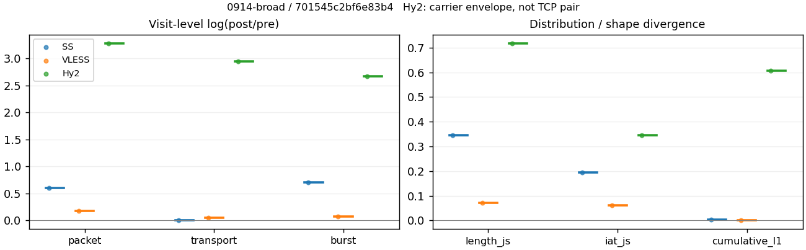
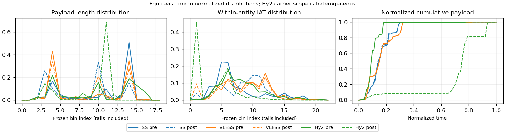

# 0914-broad · 条目 031 · huggingface.co

目标：https://huggingface.co/models

活动标签：huggingface.co::page_load。选定访问 3 次。

[返回总索引](../../README.md) · [统计口径](../../methods.md)

## 覆盖与资格（每次访问均保留）

| 部署 | 重复 | 主请求路由 | 活动状态 | 代理比较 | DIRECT pre | 请求 proxy/direct/unresolved | 错误 |
| --- | --- | --- | --- | --- | --- | --- | --- |
| Hy2 | 1 | proxy | passed | 1 | 0 | 168/0/0 | [] |
| SS | 1 | proxy | passed | 1 | 0 | 169/0/0 | [] |
| VLESS | 1 | proxy | passed | 1 | 0 | 168/0/0 | [] |

主请求非 proxy 的统计仅解释为已索引的辅助代理连接或 DIRECT 观测，不代表目标业务经代理传输。播放确认与配对资格是两道不同的门。

图中散点为单次访问，短线为重复中位数；Hy2 是共享载体包络，不能与 TCP 配对作等范围因果对比。

形态图先逐访问归一化，再对访问等权平均；实线 pre，虚线 post。分箱序号及边界见 methods，不将分箱索引误解为长度或时间。

## 每次访问的关键观测

### SS

范围：`exclusive_page`。每格 pre → post；空值为不可观测/不适用。

| 重复 | 包数 | 载荷字节 | burst | TCP FR | IAT中位µs | length JS | IAT JS |
| --- | --- | --- | --- | --- | --- | --- | --- |
| 1 | 1503 → 2728 | 1.6699e+06 → 1.6829e+06 | 986 → 1988 | 96 → 98 | 33.757 → 407.39 | 0.34455 | 0.19503 |

完整标量统计：中位数 [min,max]；Δ 为重复内逐访问变换的中位数，MAD 未缩放。n 为可用变换数；DIRECT-only 的 nΔ=0 不代表 pre 不可用。

| scope | 特征 | pre | post | Δ | IQRΔ | MADΔ | nΔ |
| --- | --- | --- | --- | --- | --- | --- | --- |
| exclusive_page | active_span_sum_s_1000ms | 17.719 [17.719, 17.719] | 18.912 [18.912, 18.912] | 0.065176 | — | — | 1 |
| exclusive_page | active_span_sum_s_100ms | 4.7056 [4.7056, 4.7056] | 7.1587 [7.1587, 7.1587] | 0.41957 | — | — | 1 |
| exclusive_page | active_span_sum_s_500ms | 16.144 [16.144, 16.144] | 17.125 [17.125, 17.125] | 0.059005 | — | — | 1 |
| exclusive_page | burst_bytes_iqr | 2896 [2896, 2896] | 1428 [1428, 1428] | -0.70706 | — | — | 1 |
| exclusive_page | burst_bytes_mad | 64 [64, 64] | 34 [34, 34] | -0.63252 | — | — | 1 |
| exclusive_page | burst_bytes_max | 21741 [21741, 21741] | 11525 [11525, 11525] | -0.63468 | — | — | 1 |
| exclusive_page | burst_bytes_mean | 1693.6 [1693.6, 1693.6] | 846.54 [846.54, 846.54] | -0.69344 | — | — | 1 |
| exclusive_page | burst_bytes_median | 64 [64, 64] | 34 [34, 34] | -0.63252 | — | — | 1 |
| exclusive_page | burst_bytes_min | 0 [0, 0] | 0 [0, 0] | — | — | — | 0 |
| exclusive_page | burst_bytes_p95 | 7426 [7426, 7426] | 2930 [2930, 2930] | -0.92998 | — | — | 1 |
| exclusive_page | burst_bytes_q25 | 0 [0, 0] | 0 [0, 0] | — | — | — | 0 |
| exclusive_page | burst_bytes_q75 | 2896 [2896, 2896] | 1428 [1428, 1428] | -0.70706 | — | — | 1 |
| exclusive_page | burst_bytes_std | 3141.4 [3141.4, 3141.4] | 1256.7 [1256.7, 1256.7] | -0.91614 | — | — | 1 |
| exclusive_page | burst_count | 986 [986, 986] | 1988 [1988, 1988] | 0.70123 | — | — | 1 |
| exclusive_page | burst_duration_ms_iqr | 0.026175 [0.026175, 0.026175] | 0 [0, 0] | — | — | — | 0 |
| exclusive_page | burst_duration_ms_mad | 0 [0, 0] | 0 [0, 0] | — | — | — | 0 |
| exclusive_page | burst_duration_ms_max | 14928 [14928, 14928] | 14929 [14929, 14929] | 6.5885e-05 | — | — | 1 |
| exclusive_page | burst_duration_ms_mean | 61.796 [61.796, 61.796] | 28.813 [28.813, 28.813] | -0.76301 | — | — | 1 |
| exclusive_page | burst_duration_ms_median | 0 [0, 0] | 0 [0, 0] | — | — | — | 0 |
| exclusive_page | burst_duration_ms_min | 0 [0, 0] | 0 [0, 0] | — | — | — | 0 |
| exclusive_page | burst_duration_ms_p95 | 93.059 [93.059, 93.059] | 1.0186 [1.0186, 1.0186] | -4.5148 | — | — | 1 |
| exclusive_page | burst_duration_ms_q25 | 0 [0, 0] | 0 [0, 0] | — | — | — | 0 |
| exclusive_page | burst_duration_ms_q75 | 0.026175 [0.026175, 0.026175] | 0 [0, 0] | — | — | — | 0 |
| exclusive_page | burst_duration_ms_std | 732.14 [732.14, 732.14] | 516.26 [516.26, 516.26] | -0.34937 | — | — | 1 |
| exclusive_page | burst_packets_iqr | 1 [1, 1] | 0 [0, 0] | — | — | — | 0 |
| exclusive_page | burst_packets_mad | 0 [0, 0] | 0 [0, 0] | — | — | — | 0 |
| exclusive_page | burst_packets_max | 10 [10, 10] | 14 [14, 14] | 0.33647 | — | — | 1 |
| exclusive_page | burst_packets_mean | 1.5243 [1.5243, 1.5243] | 1.3722 [1.3722, 1.3722] | -0.10512 | — | — | 1 |
| exclusive_page | burst_packets_median | 1 [1, 1] | 1 [1, 1] | 0 | — | — | 1 |
| exclusive_page | burst_packets_min | 1 [1, 1] | 1 [1, 1] | 0 | — | — | 1 |
| exclusive_page | burst_packets_p95 | 4 [4, 4] | 3 [3, 3] | -0.28768 | — | — | 1 |
| exclusive_page | burst_packets_q25 | 1 [1, 1] | 1 [1, 1] | 0 | — | — | 1 |
| exclusive_page | burst_packets_q75 | 2 [2, 2] | 1 [1, 1] | -0.69315 | — | — | 1 |
| exclusive_page | burst_packets_std | 1.1761 [1.1761, 1.1761] | 0.86123 [0.86123, 0.86123] | -0.31162 | — | — | 1 |
| exclusive_page | connection_span_concurrency_max | 7 [7, 7] | 7 [7, 7] | 0 | — | — | 1 |
| exclusive_page | cumulative_l1 | — | — | 0.0035103 | — | — | 1 |
| exclusive_page | cumulative_max | — | — | 0.044222 | — | — | 1 |
| exclusive_page | direction_entropy | 0.77082 [0.77082, 0.77082] | 0.43043 [0.43043, 0.43043] | -0.34039 | — | — | 1 |
| exclusive_page | down_burst_count | 488 [488, 488] | 989 [989, 989] | 0.70638 | — | — | 1 |
| exclusive_page | down_ip_bytes | 1.6565e+06 [1.6565e+06, 1.6565e+06] | 1.6976e+06 [1.6976e+06, 1.6976e+06] | 0.024509 | — | — | 1 |
| exclusive_page | down_packets | 865 [865, 865] | 1557 [1557, 1557] | 0.58779 | — | — | 1 |
| exclusive_page | down_transport_bytes | 1.6114e+06 [1.6114e+06, 1.6114e+06] | 1.6165e+06 [1.6165e+06, 1.6165e+06] | 0.0031178 | — | — | 1 |
| exclusive_page | duration_s | 21.26 [21.26, 21.26] | 21.259 [21.259, 21.259] | -5.7556e-05 | — | — | 1 |
| exclusive_page | entity_count | 10 [10, 10] | 10 [10, 10] | 0 | — | — | 1 |
| exclusive_page | fr_runs | 96 [96, 96] | 98 [98, 98] | 0.020619 | — | — | 1 |
| exclusive_page | fr_runs_per_packet | 0.10631 [0.10631, 0.10631] | 0.062183 [0.062183, 0.062183] | -0.04413 | — | — | 1 |
| exclusive_page | fr_switches | 86 [86, 86] | 88 [88, 88] | 0.02299 | — | — | 1 |
| exclusive_page | fr_switches_per_possible_transition | 0.096305 [0.096305, 0.096305] | 0.056194 [0.056194, 0.056194] | -0.04011 | — | — | 1 |
| exclusive_page | full_retransmission_fraction | 0.007984 [0.007984, 0.007984] | 0.0018328 [0.0018328, 0.0018328] | -0.0061512 | — | — | 1 |
| exclusive_page | full_retransmission_packets | 12 [12, 12] | 5 [5, 5] | -0.87547 | — | — | 1 |
| exclusive_page | iat_count | 1493 [1493, 1493] | 2718 [2718, 2718] | 0.59911 | — | — | 1 |
| exclusive_page | iat_js | — | — | 0.19503 | — | — | 1 |
| exclusive_page | iat_ks | — | — | 0.36841 | — | — | 1 |
| exclusive_page | iat_median_us | 33.757 [33.757, 33.757] | 407.39 [407.39, 407.39] | 2.4906 | — | — | 1 |
| exclusive_page | iat_us_iqr | 175.1 [175.1, 175.1] | 1108 [1108, 1108] | 1.845 | — | — | 1 |
| exclusive_page | iat_us_mad | 25.912 [25.912, 25.912] | 399.2 [399.2, 399.2] | 2.7348 | — | — | 1 |
| exclusive_page | iat_us_max | 1.4928e+07 [1.4928e+07, 1.4928e+07] | 1.4929e+07 [1.4929e+07, 1.4929e+07] | 3.5493e-05 | — | — | 1 |
| exclusive_page | iat_us_mean | 46371 [46371, 46371] | 25422 [25422, 25422] | -0.60104 | — | — | 1 |
| exclusive_page | iat_us_median | 33.757 [33.757, 33.757] | 407.39 [407.39, 407.39] | 2.4906 | — | — | 1 |
| exclusive_page | iat_us_min | 0.224 [0.224, 0.224] | 0.031 [0.031, 0.031] | -1.9777 | — | — | 1 |
| exclusive_page | iat_us_p95 | 62948 [62948, 62948] | 27089 [27089, 27089] | -0.84318 | — | — | 1 |
| exclusive_page | iat_us_q25 | 13.747 [13.747, 13.747] | 21.306 [21.306, 21.306] | 0.43816 | — | — | 1 |
| exclusive_page | iat_us_q75 | 188.85 [188.85, 188.85] | 1129.3 [1129.3, 1129.3] | 1.7884 | — | — | 1 |
| exclusive_page | iat_us_std | 5.988e+05 [5.988e+05, 5.988e+05] | 4.4364e+05 [4.4364e+05, 4.4364e+05] | -0.29991 | — | — | 1 |
| exclusive_page | iat_wasserstein_log1p_us | — | — | 1.3438 | — | — | 1 |
| exclusive_page | idle_gap_count_1000ms | 9 [9, 9] | 8 [8, 8] | -0.11778 | — | — | 1 |
| exclusive_page | idle_gap_count_100ms | 57 [57, 57] | 56 [56, 56] | -0.0177 | — | — | 1 |
| exclusive_page | idle_gap_count_500ms | 11 [11, 11] | 10 [10, 10] | -0.09531 | — | — | 1 |
| exclusive_page | idle_gap_sum_s_1000ms | 51.513 [51.513, 51.513] | 50.186 [50.186, 50.186] | -0.026095 | — | — | 1 |
| exclusive_page | idle_gap_sum_s_100ms | 64.526 [64.526, 64.526] | 61.94 [61.94, 61.94] | -0.040912 | — | — | 1 |
| exclusive_page | idle_gap_sum_s_500ms | 53.088 [53.088, 53.088] | 51.973 [51.973, 51.973] | -0.021221 | — | — | 1 |
| exclusive_page | ip_bytes | 1.7483e+06 [1.7483e+06, 1.7483e+06] | 1.8463e+06 [1.8463e+06, 1.8463e+06] | 0.05454 | — | — | 1 |
| exclusive_page | length_iqr | 2688 [2688, 2688] | 1388 [1388, 1388] | -0.66093 | — | — | 1 |
| exclusive_page | length_js | — | — | 0.34455 | — | — | 1 |
| exclusive_page | length_ks | — | — | 0.48835 | — | — | 1 |
| exclusive_page | length_mad | 128 [128, 128] | 1331 [1331, 1331] | 2.3417 | — | — | 1 |
| exclusive_page | length_max | 8948 [8948, 8948] | 4926 [4926, 4926] | -0.5969 | — | — | 1 |
| exclusive_page | length_mean | 1849.3 [1849.3, 1849.3] | 1067.8 [1067.8, 1067.8] | -0.54914 | — | — | 1 |
| exclusive_page | length_median | 2816 [2816, 2816] | 1428 [1428, 1428] | -0.67904 | — | — | 1 |
| exclusive_page | length_min | 3 [3, 3] | 2 [2, 2] | -0.40547 | — | — | 1 |
| exclusive_page | length_p95 | 2896 [2896, 2896] | 2856 [2856, 2856] | -0.013908 | — | — | 1 |
| exclusive_page | length_q25 | 208 [208, 208] | 40 [40, 40] | -1.6487 | — | — | 1 |
| exclusive_page | length_q75 | 2896 [2896, 2896] | 1428 [1428, 1428] | -0.70706 | — | — | 1 |
| exclusive_page | length_std | 1232.5 [1232.5, 1232.5] | 990.25 [990.25, 990.25] | -0.21881 | — | — | 1 |
| exclusive_page | length_wasserstein_bytes | — | — | 781.78 | — | — | 1 |
| exclusive_page | nonempty_entity_count | 10 [10, 10] | 10 [10, 10] | 0 | — | — | 1 |
| exclusive_page | nonempty_packets | 903 [903, 903] | 1576 [1576, 1576] | 0.55692 | — | — | 1 |
| exclusive_page | offload_suspect_fraction | 0.33932 [0.33932, 0.33932] | 0.12133 [0.12133, 0.12133] | -0.21799 | — | — | 1 |
| exclusive_page | packet_count | 1503 [1503, 1503] | 2728 [2728, 2728] | 0.59611 | — | — | 1 |
| exclusive_page | rtt_median_ms | 0.052556 [0.052556, 0.052556] | 29.481 [29.481, 29.481] | 6.3296 | — | — | 1 |
| exclusive_page | rtt_sample_count | 576 [576, 576] | 422 [422, 422] | -0.3111 | — | — | 1 |
| exclusive_page | tcp_ack_count | 1493 [1493, 1493] | 2718 [2718, 2718] | 0.59911 | — | — | 1 |
| exclusive_page | tcp_fin_count | 20 [20, 20] | 21 [21, 21] | 0.04879 | — | — | 1 |
| exclusive_page | tcp_packet_count | 1503 [1503, 1503] | 2728 [2728, 2728] | 0.59611 | — | — | 1 |
| exclusive_page | tcp_rst_count | 0 [0, 0] | 0 [0, 0] | — | — | — | 0 |
| exclusive_page | tcp_syn_count | 20 [20, 20] | 20 [20, 20] | 0 | — | — | 1 |
| exclusive_page | tcp_window_raw_median | 65535 [65535, 65535] | 135 [135, 135] | -6.1851 | — | — | 1 |
| exclusive_page | transition_entropy | 0.41935 [0.41935, 0.41935] | 0.24985 [0.24985, 0.24985] | -0.1695 | — | — | 1 |
| exclusive_page | transition_n_mm | 652 [652, 652] | 1389 [1389, 1389] | 0.75629 | — | — | 1 |
| exclusive_page | transition_n_mp | 39 [39, 39] | 40 [40, 40] | 0.025318 | — | — | 1 |
| exclusive_page | transition_n_pm | 47 [47, 47] | 48 [48, 48] | 0.021053 | — | — | 1 |
| exclusive_page | transition_n_pp | 155 [155, 155] | 89 [89, 89] | -0.55479 | — | — | 1 |
| exclusive_page | transition_p_mm | 0.94356 [0.94356, 0.94356] | 0.97201 [0.97201, 0.97201] | 0.028448 | — | — | 1 |
| exclusive_page | transition_p_mp | 0.05644 [0.05644, 0.05644] | 0.027992 [0.027992, 0.027992] | -0.028448 | — | — | 1 |
| exclusive_page | transition_p_pm | 0.23267 [0.23267, 0.23267] | 0.35036 [0.35036, 0.35036] | 0.11769 | — | — | 1 |
| exclusive_page | transition_p_pp | 0.76733 [0.76733, 0.76733] | 0.64964 [0.64964, 0.64964] | -0.11769 | — | — | 1 |
| exclusive_page | transport_bytes | 1.6699e+06 [1.6699e+06, 1.6699e+06] | 1.6829e+06 [1.6829e+06, 1.6829e+06] | 0.0077846 | — | — | 1 |
| exclusive_page | up_burst_count | 498 [498, 498] | 999 [999, 999] | 0.69615 | — | — | 1 |
| exclusive_page | up_byte_fraction | 0.035 [0.035, 0.035] | 0.039492 [0.039492, 0.039492] | 0.0044929 | — | — | 1 |
| exclusive_page | up_ip_bytes | 91845 [91845, 91845] | 1.4875e+05 [1.4875e+05, 1.4875e+05] | 0.48214 | — | — | 1 |
| exclusive_page | up_packets | 638 [638, 638] | 1171 [1171, 1171] | 0.60728 | — | — | 1 |
| exclusive_page | up_transport_bytes | 58445 [58445, 58445] | 66463 [66463, 66463] | 0.12856 | — | — | 1 |
| exclusive_page | zero_iat_count | 0 [0, 0] | 0 [0, 0] | — | — | — | 0 |
| exclusive_page | zero_iat_fraction | 0 [0, 0] | 0 [0, 0] | 0 | — | — | 1 |

### VLESS

范围：`exclusive_page`。每格 pre → post；空值为不可观测/不适用。

| 重复 | 包数 | 载荷字节 | burst | TCP FR | IAT中位µs | length JS | IAT JS |
| --- | --- | --- | --- | --- | --- | --- | --- |
| 1 | 2061 → 2448 | 1.6844e+06 → 1.7679e+06 | 1468 → 1580 | 82 → 102 | 397.56 → 264.93 | 0.070031 | 0.061519 |

完整标量统计：中位数 [min,max]；Δ 为重复内逐访问变换的中位数，MAD 未缩放。n 为可用变换数；DIRECT-only 的 nΔ=0 不代表 pre 不可用。

| scope | 特征 | pre | post | Δ | IQRΔ | MADΔ | nΔ |
| --- | --- | --- | --- | --- | --- | --- | --- |
| exclusive_page | active_span_sum_s_1000ms | 16.027 [16.027, 16.027] | 15.564 [15.564, 15.564] | -0.029276 | — | — | 1 |
| exclusive_page | active_span_sum_s_100ms | 3.7917 [3.7917, 3.7917] | 7.0997 [7.0997, 7.0997] | 0.62724 | — | — | 1 |
| exclusive_page | active_span_sum_s_500ms | 9.5486 [9.5486, 9.5486] | 15.564 [15.564, 15.564] | 0.4886 | — | — | 1 |
| exclusive_page | burst_bytes_iqr | 2824 [2824, 2824] | 2824 [2824, 2824] | 0 | — | — | 1 |
| exclusive_page | burst_bytes_mad | 31 [31, 31] | 72 [72, 72] | 0.84268 | — | — | 1 |
| exclusive_page | burst_bytes_max | 41107 [41107, 41107] | 40654 [40654, 40654] | -0.011081 | — | — | 1 |
| exclusive_page | burst_bytes_mean | 1147.4 [1147.4, 1147.4] | 1118.9 [1118.9, 1118.9] | -0.025116 | — | — | 1 |
| exclusive_page | burst_bytes_median | 31 [31, 31] | 72 [72, 72] | 0.84268 | — | — | 1 |
| exclusive_page | burst_bytes_min | 0 [0, 0] | 0 [0, 0] | — | — | — | 0 |
| exclusive_page | burst_bytes_p95 | 2896 [2896, 2896] | 2896 [2896, 2896] | 0 | — | — | 1 |
| exclusive_page | burst_bytes_q25 | 0 [0, 0] | 0 [0, 0] | — | — | — | 0 |
| exclusive_page | burst_bytes_q75 | 2824 [2824, 2824] | 2824 [2824, 2824] | 0 | — | — | 1 |
| exclusive_page | burst_bytes_std | 2101.3 [2101.3, 2101.3] | 1819.9 [1819.9, 1819.9] | -0.1438 | — | — | 1 |
| exclusive_page | burst_count | 1468 [1468, 1468] | 1580 [1580, 1580] | 0.073524 | — | — | 1 |
| exclusive_page | burst_duration_ms_iqr | 0.49152 [0.49152, 0.49152] | 0.42885 [0.42885, 0.42885] | -0.13638 | — | — | 1 |
| exclusive_page | burst_duration_ms_mad | 0 [0, 0] | 0 [0, 0] | — | — | — | 0 |
| exclusive_page | burst_duration_ms_max | 13409 [13409, 13409] | 13409 [13409, 13409] | -5.8804e-05 | — | — | 1 |
| exclusive_page | burst_duration_ms_mean | 39.784 [39.784, 39.784] | 34.954 [34.954, 34.954] | -0.12943 | — | — | 1 |
| exclusive_page | burst_duration_ms_median | 0 [0, 0] | 0 [0, 0] | — | — | — | 0 |
| exclusive_page | burst_duration_ms_min | 0 [0, 0] | 0 [0, 0] | — | — | — | 0 |
| exclusive_page | burst_duration_ms_p95 | 10.189 [10.189, 10.189] | 10.225 [10.225, 10.225] | 0.0035358 | — | — | 1 |
| exclusive_page | burst_duration_ms_q25 | 0 [0, 0] | 0 [0, 0] | — | — | — | 0 |
| exclusive_page | burst_duration_ms_q75 | 0.49152 [0.49152, 0.49152] | 0.42885 [0.42885, 0.42885] | -0.13638 | — | — | 1 |
| exclusive_page | burst_duration_ms_std | 549.61 [549.61, 549.61] | 528.58 [528.58, 528.58] | -0.039006 | — | — | 1 |
| exclusive_page | burst_packets_iqr | 1 [1, 1] | 1 [1, 1] | 0 | — | — | 1 |
| exclusive_page | burst_packets_mad | 0 [0, 0] | 0 [0, 0] | — | — | — | 0 |
| exclusive_page | burst_packets_max | 9 [9, 9] | 29 [29, 29] | 1.1701 | — | — | 1 |
| exclusive_page | burst_packets_mean | 1.404 [1.404, 1.404] | 1.5494 [1.5494, 1.5494] | 0.098556 | — | — | 1 |
| exclusive_page | burst_packets_median | 1 [1, 1] | 1 [1, 1] | 0 | — | — | 1 |
| exclusive_page | burst_packets_min | 1 [1, 1] | 1 [1, 1] | 0 | — | — | 1 |
| exclusive_page | burst_packets_p95 | 2 [2, 2] | 3 [3, 3] | 0.40547 | — | — | 1 |
| exclusive_page | burst_packets_q25 | 1 [1, 1] | 1 [1, 1] | 0 | — | — | 1 |
| exclusive_page | burst_packets_q75 | 2 [2, 2] | 2 [2, 2] | 0 | — | — | 1 |
| exclusive_page | burst_packets_std | 0.63367 [0.63367, 0.63367] | 1.3447 [1.3447, 1.3447] | 0.75243 | — | — | 1 |
| exclusive_page | connection_span_concurrency_max | 6 [6, 6] | 6 [6, 6] | 0 | — | — | 1 |
| exclusive_page | cumulative_l1 | — | — | 0.0020621 | — | — | 1 |
| exclusive_page | cumulative_max | — | — | 0.018019 | — | — | 1 |
| exclusive_page | direction_entropy | 0.60549 [0.60549, 0.60549] | 0.59991 [0.59991, 0.59991] | -0.0055769 | — | — | 1 |
| exclusive_page | down_burst_count | 729 [729, 729] | 785 [785, 785] | 0.07401 | — | — | 1 |
| exclusive_page | down_ip_bytes | 1.5583e+06 [1.5583e+06, 1.5583e+06] | 1.6322e+06 [1.6322e+06, 1.6322e+06] | 0.046354 | — | — | 1 |
| exclusive_page | down_packets | 1211 [1211, 1211] | 1401 [1401, 1401] | 0.14574 | — | — | 1 |
| exclusive_page | down_transport_bytes | 1.4952e+06 [1.4952e+06, 1.4952e+06] | 1.5593e+06 [1.5593e+06, 1.5593e+06] | 0.041946 | — | — | 1 |
| exclusive_page | duration_s | 19.098 [19.098, 19.098] | 19.078 [19.078, 19.078] | -0.0010408 | — | — | 1 |
| exclusive_page | entity_count | 10 [10, 10] | 10 [10, 10] | 0 | — | — | 1 |
| exclusive_page | fr_runs | 82 [82, 82] | 102 [102, 102] | 0.21825 | — | — | 1 |
| exclusive_page | fr_runs_per_packet | 0.066076 [0.066076, 0.066076] | 0.071629 [0.071629, 0.071629] | 0.0055535 | — | — | 1 |
| exclusive_page | fr_switches | 72 [72, 72] | 92 [92, 92] | 0.24512 | — | — | 1 |
| exclusive_page | fr_switches_per_possible_transition | 0.058489 [0.058489, 0.058489] | 0.065064 [0.065064, 0.065064] | 0.0065746 | — | — | 1 |
| exclusive_page | full_retransmission_fraction | 0.0014556 [0.0014556, 0.0014556] | 0 [0, 0] | -0.0014556 | — | — | 1 |
| exclusive_page | full_retransmission_packets | 3 [3, 3] | 0 [0, 0] | — | — | — | 0 |
| exclusive_page | iat_count | 2051 [2051, 2051] | 2438 [2438, 2438] | 0.17285 | — | — | 1 |
| exclusive_page | iat_js | — | — | 0.061519 | — | — | 1 |
| exclusive_page | iat_ks | — | — | 0.10566 | — | — | 1 |
| exclusive_page | iat_median_us | 397.56 [397.56, 397.56] | 264.93 [264.93, 264.93] | -0.40588 | — | — | 1 |
| exclusive_page | iat_us_iqr | 2367.6 [2367.6, 2367.6] | 2325.9 [2325.9, 2325.9] | -0.017752 | — | — | 1 |
| exclusive_page | iat_us_mad | 386.9 [386.9, 386.9] | 264.33 [264.33, 264.33] | -0.38094 | — | — | 1 |
| exclusive_page | iat_us_max | 1.3409e+07 [1.3409e+07, 1.3409e+07] | 1.3409e+07 [1.3409e+07, 1.3409e+07] | -5.8804e-05 | — | — | 1 |
| exclusive_page | iat_us_mean | 29582 [29582, 29582] | 24682 [24682, 24682] | -0.18109 | — | — | 1 |
| exclusive_page | iat_us_median | 397.56 [397.56, 397.56] | 264.93 [264.93, 264.93] | -0.40588 | — | — | 1 |
| exclusive_page | iat_us_min | 0.249 [0.249, 0.249] | 0.036 [0.036, 0.036] | -1.9339 | — | — | 1 |
| exclusive_page | iat_us_p95 | 10003 [10003, 10003] | 37132 [37132, 37132] | 1.3115 | — | — | 1 |
| exclusive_page | iat_us_q25 | 39.176 [39.176, 39.176] | 20.134 [20.134, 20.134] | -0.66563 | — | — | 1 |
| exclusive_page | iat_us_q75 | 2406.8 [2406.8, 2406.8] | 2346.1 [2346.1, 2346.1] | -0.025545 | — | — | 1 |
| exclusive_page | iat_us_std | 4.6526e+05 [4.6526e+05, 4.6526e+05] | 4.2581e+05 [4.2581e+05, 4.2581e+05] | -0.088616 | — | — | 1 |
| exclusive_page | iat_wasserstein_log1p_us | — | — | 0.49742 | — | — | 1 |
| exclusive_page | idle_gap_count_1000ms | 8 [8, 8] | 8 [8, 8] | 0 | — | — | 1 |
| exclusive_page | idle_gap_count_100ms | 47 [47, 47] | 55 [55, 55] | 0.15719 | — | — | 1 |
| exclusive_page | idle_gap_count_500ms | 18 [18, 18] | 8 [8, 8] | -0.81093 | — | — | 1 |
| exclusive_page | idle_gap_sum_s_1000ms | 44.646 [44.646, 44.646] | 44.61 [44.61, 44.61] | -0.000801 | — | — | 1 |
| exclusive_page | idle_gap_sum_s_100ms | 56.881 [56.881, 56.881] | 53.075 [53.075, 53.075] | -0.069258 | — | — | 1 |
| exclusive_page | idle_gap_sum_s_500ms | 51.124 [51.124, 51.124] | 44.61 [44.61, 44.61] | -0.1363 | — | — | 1 |
| exclusive_page | ip_bytes | 1.7915e+06 [1.7915e+06, 1.7915e+06] | 1.8963e+06 [1.8963e+06, 1.8963e+06] | 0.056867 | — | — | 1 |
| exclusive_page | length_iqr | 2752 [2752, 2752] | 2752 [2752, 2752] | 0 | — | — | 1 |
| exclusive_page | length_js | — | — | 0.070031 | — | — | 1 |
| exclusive_page | length_ks | — | — | 0.11852 | — | — | 1 |
| exclusive_page | length_mad | 740 [740, 740] | 1340 [1340, 1340] | 0.59377 | — | — | 1 |
| exclusive_page | length_max | 8948 [8948, 8948] | 2824 [2824, 2824] | -1.1533 | — | — | 1 |
| exclusive_page | length_mean | 1357.3 [1357.3, 1357.3] | 1241.5 [1241.5, 1241.5] | -0.089144 | — | — | 1 |
| exclusive_page | length_median | 812 [812, 812] | 1412 [1412, 1412] | 0.55326 | — | — | 1 |
| exclusive_page | length_min | 24 [24, 24] | 24 [24, 24] | 0 | — | — | 1 |
| exclusive_page | length_p95 | 2860 [2860, 2860] | 2824 [2824, 2824] | -0.012667 | — | — | 1 |
| exclusive_page | length_q25 | 72 [72, 72] | 72 [72, 72] | 0 | — | — | 1 |
| exclusive_page | length_q75 | 2824 [2824, 2824] | 2824 [2824, 2824] | 0 | — | — | 1 |
| exclusive_page | length_std | 1501.1 [1501.1, 1501.1] | 1127.3 [1127.3, 1127.3] | -0.28634 | — | — | 1 |
| exclusive_page | length_wasserstein_bytes | — | — | 297.81 | — | — | 1 |
| exclusive_page | nonempty_entity_count | 10 [10, 10] | 10 [10, 10] | 0 | — | — | 1 |
| exclusive_page | nonempty_packets | 1241 [1241, 1241] | 1424 [1424, 1424] | 0.13755 | — | — | 1 |
| exclusive_page | offload_suspect_fraction | 0.23775 [0.23775, 0.23775] | 0.16953 [0.16953, 0.16953] | -0.068223 | — | — | 1 |
| exclusive_page | packet_count | 2061 [2061, 2061] | 2448 [2448, 2448] | 0.17208 | — | — | 1 |
| exclusive_page | rtt_median_ms | 0.41305 [0.41305, 0.41305] | 1.7879 [1.7879, 1.7879] | 1.4652 | — | — | 1 |
| exclusive_page | rtt_sample_count | 779 [779, 779] | 969 [969, 969] | 0.21825 | — | — | 1 |
| exclusive_page | tcp_ack_count | 2032 [2032, 2032] | 2438 [2438, 2438] | 0.18216 | — | — | 1 |
| exclusive_page | tcp_fin_count | 19 [19, 19] | 20 [20, 20] | 0.051293 | — | — | 1 |
| exclusive_page | tcp_packet_count | 2061 [2061, 2061] | 2448 [2448, 2448] | 0.17208 | — | — | 1 |
| exclusive_page | tcp_rst_count | 19 [19, 19] | 0 [0, 0] | — | — | — | 0 |
| exclusive_page | tcp_syn_count | 20 [20, 20] | 20 [20, 20] | 0 | — | — | 1 |
| exclusive_page | tcp_window_raw_median | 65535 [65535, 65535] | 152 [152, 152] | -6.0665 | — | — | 1 |
| exclusive_page | transition_entropy | 0.27805 [0.27805, 0.27805] | 0.30077 [0.30077, 0.30077] | 0.022721 | — | — | 1 |
| exclusive_page | transition_n_mm | 1016 [1016, 1016] | 1165 [1165, 1165] | 0.13685 | — | — | 1 |
| exclusive_page | transition_n_mp | 31 [31, 31] | 41 [41, 41] | 0.27958 | — | — | 1 |
| exclusive_page | transition_n_pm | 41 [41, 41] | 51 [51, 51] | 0.21825 | — | — | 1 |
| exclusive_page | transition_n_pp | 143 [143, 143] | 157 [157, 157] | 0.093401 | — | — | 1 |
| exclusive_page | transition_p_mm | 0.97039 [0.97039, 0.97039] | 0.966 [0.966, 0.966] | -0.0043883 | — | — | 1 |
| exclusive_page | transition_p_mp | 0.029608 [0.029608, 0.029608] | 0.033997 [0.033997, 0.033997] | 0.0043883 | — | — | 1 |
| exclusive_page | transition_p_pm | 0.22283 [0.22283, 0.22283] | 0.24519 [0.24519, 0.24519] | 0.022366 | — | — | 1 |
| exclusive_page | transition_p_pp | 0.77717 [0.77717, 0.77717] | 0.75481 [0.75481, 0.75481] | -0.022366 | — | — | 1 |
| exclusive_page | transport_bytes | 1.6844e+06 [1.6844e+06, 1.6844e+06] | 1.7679e+06 [1.7679e+06, 1.7679e+06] | 0.048408 | — | — | 1 |
| exclusive_page | up_burst_count | 739 [739, 739] | 795 [795, 795] | 0.073044 | — | — | 1 |
| exclusive_page | up_byte_fraction | 0.11229 [0.11229, 0.11229] | 0.11801 [0.11801, 0.11801] | 0.0057181 | — | — | 1 |
| exclusive_page | up_ip_bytes | 2.3322e+05 [2.3322e+05, 2.3322e+05] | 2.6412e+05 [2.6412e+05, 2.6412e+05] | 0.12441 | — | — | 1 |
| exclusive_page | up_packets | 850 [850, 850] | 1047 [1047, 1047] | 0.20845 | — | — | 1 |
| exclusive_page | up_transport_bytes | 1.8914e+05 [1.8914e+05, 1.8914e+05] | 2.0863e+05 [2.0863e+05, 2.0863e+05] | 0.098077 | — | — | 1 |
| exclusive_page | zero_iat_count | 0 [0, 0] | 0 [0, 0] | — | — | — | 0 |
| exclusive_page | zero_iat_fraction | 0 [0, 0] | 0 [0, 0] | 0 | — | — | 1 |

### Hy2

范围：`carrier_context_envelope`。每格 pre → post；空值为不可观测/不适用。

| 重复 | 包数 | 载荷字节 | burst | TCP FR | IAT中位µs | length JS | IAT JS |
| --- | --- | --- | --- | --- | --- | --- | --- |
| 1 | 1257 → 33191 | 1.8646e+06 → 3.5481e+07 | 802 → 11616 | — | 101.84 → 5.3795 | 0.71608 | 0.3462 |

完整标量统计：中位数 [min,max]；Δ 为重复内逐访问变换的中位数，MAD 未缩放。n 为可用变换数；DIRECT-only 的 nΔ=0 不代表 pre 不可用。

| scope | 特征 | pre | post | Δ | IQRΔ | MADΔ | nΔ |
| --- | --- | --- | --- | --- | --- | --- | --- |
| carrier_context_envelope | active_span_sum_s_1000ms | 9.615 [9.615, 9.615] | 12.673 [12.673, 12.673] | 0.27616 | — | — | 1 |
| carrier_context_envelope | active_span_sum_s_100ms | 2.0227 [2.0227, 2.0227] | 6.8342 [6.8342, 6.8342] | 1.2175 | — | — | 1 |
| carrier_context_envelope | active_span_sum_s_500ms | 8.861 [8.861, 8.861] | 11.733 [11.733, 11.733] | 0.28071 | — | — | 1 |
| carrier_context_envelope | burst_bytes_iqr | 1940.5 [1940.5, 1940.5] | 5128 [5128, 5128] | 0.97177 | — | — | 1 |
| carrier_context_envelope | burst_bytes_mad | 64 [64, 64] | 451.5 [451.5, 451.5] | 1.9537 | — | — | 1 |
| carrier_context_envelope | burst_bytes_max | 57396 [57396, 57396] | 3.884e+05 [3.884e+05, 3.884e+05] | 1.9121 | — | — | 1 |
| carrier_context_envelope | burst_bytes_mean | 2324.9 [2324.9, 2324.9] | 3054.5 [3054.5, 3054.5] | 0.27293 | — | — | 1 |
| carrier_context_envelope | burst_bytes_median | 64 [64, 64] | 484.5 [484.5, 484.5] | 2.0242 | — | — | 1 |
| carrier_context_envelope | burst_bytes_min | 0 [0, 0] | 22 [22, 22] | — | — | — | 0 |
| carrier_context_envelope | burst_bytes_p95 | 13534 [13534, 13534] | 10932 [10932, 10932] | -0.21353 | — | — | 1 |
| carrier_context_envelope | burst_bytes_q25 | 0 [0, 0] | 40 [40, 40] | — | — | — | 0 |
| carrier_context_envelope | burst_bytes_q75 | 1940.5 [1940.5, 1940.5] | 5168 [5168, 5168] | 0.97954 | — | — | 1 |
| carrier_context_envelope | burst_bytes_std | 5128 [5128, 5128] | 6999 [6999, 6999] | 0.31104 | — | — | 1 |
| carrier_context_envelope | burst_count | 802 [802, 802] | 11616 [11616, 11616] | 2.673 | — | — | 1 |
| carrier_context_envelope | burst_duration_ms_iqr | 0.08352 [0.08352, 0.08352] | 0.024544 [0.024544, 0.024544] | -1.2246 | — | — | 1 |
| carrier_context_envelope | burst_duration_ms_mad | 0 [0, 0] | 4.4e-05 [4.4e-05, 4.4e-05] | — | — | — | 0 |
| carrier_context_envelope | burst_duration_ms_max | 14324 [14324, 14324] | 2123 [2123, 2123] | -1.9091 | — | — | 1 |
| carrier_context_envelope | burst_duration_ms_mean | 61.196 [61.196, 61.196] | 0.60373 [0.60373, 0.60373] | -4.6187 | — | — | 1 |
| carrier_context_envelope | burst_duration_ms_median | 0 [0, 0] | 4.4e-05 [4.4e-05, 4.4e-05] | — | — | — | 0 |
| carrier_context_envelope | burst_duration_ms_min | 0 [0, 0] | 0 [0, 0] | — | — | — | 0 |
| carrier_context_envelope | burst_duration_ms_p95 | 37.897 [37.897, 37.897] | 0.10125 [0.10125, 0.10125] | -5.9251 | — | — | 1 |
| carrier_context_envelope | burst_duration_ms_q25 | 0 [0, 0] | 0 [0, 0] | — | — | — | 0 |
| carrier_context_envelope | burst_duration_ms_q75 | 0.08352 [0.08352, 0.08352] | 0.024544 [0.024544, 0.024544] | -1.2246 | — | — | 1 |
| carrier_context_envelope | burst_duration_ms_std | 782.4 [782.4, 782.4] | 21.065 [21.065, 21.065] | -3.6148 | — | — | 1 |
| carrier_context_envelope | burst_packets_iqr | 1 [1, 1] | 3 [3, 3] | 1.0986 | — | — | 1 |
| carrier_context_envelope | burst_packets_mad | 0 [0, 0] | 1 [1, 1] | — | — | — | 0 |
| carrier_context_envelope | burst_packets_max | 13 [13, 13] | 280 [280, 280] | 3.0698 | — | — | 1 |
| carrier_context_envelope | burst_packets_mean | 1.5673 [1.5673, 1.5673] | 2.8574 [2.8574, 2.8574] | 0.60052 | — | — | 1 |
| carrier_context_envelope | burst_packets_median | 1 [1, 1] | 2 [2, 2] | 0.69315 | — | — | 1 |
| carrier_context_envelope | burst_packets_min | 1 [1, 1] | 1 [1, 1] | 0 | — | — | 1 |
| carrier_context_envelope | burst_packets_p95 | 3.95 [3.95, 3.95] | 8 [8, 8] | 0.70573 | — | — | 1 |
| carrier_context_envelope | burst_packets_q25 | 1 [1, 1] | 1 [1, 1] | 0 | — | — | 1 |
| carrier_context_envelope | burst_packets_q75 | 2 [2, 2] | 4 [4, 4] | 0.69315 | — | — | 1 |
| carrier_context_envelope | burst_packets_std | 1.149 [1.149, 1.149] | 4.8884 [4.8884, 4.8884] | 1.4479 | — | — | 1 |
| carrier_context_envelope | connection_span_concurrency_max | 5 [5, 5] | 1 [1, 1] | -1.6094 | — | — | 1 |
| carrier_context_envelope | cumulative_l1 | — | — | 0.60715 | — | — | 1 |
| carrier_context_envelope | cumulative_max | — | — | 0.91229 | — | — | 1 |
| carrier_context_envelope | direction_entropy | 0.88379 [0.88379, 0.88379] | 0.78001 [0.78001, 0.78001] | -0.10378 | — | — | 1 |
| carrier_context_envelope | direction_run_analog_runs | 83 [83, 83] | 11616 [11616, 11616] | 4.9413 | — | — | 1 |
| carrier_context_envelope | direction_run_analog_runs_per_packet | 0.10668 [0.10668, 0.10668] | 0.34997 [0.34997, 0.34997] | 0.24329 | — | — | 1 |
| carrier_context_envelope | direction_run_analog_switches | 75 [75, 75] | 11615 [11615, 11615] | 5.0426 | — | — | 1 |
| carrier_context_envelope | direction_run_analog_switches_per_possible_transition | 0.097403 [0.097403, 0.097403] | 0.34995 [0.34995, 0.34995] | 0.25255 | — | — | 1 |
| carrier_context_envelope | down_burst_count | 397 [397, 397] | 5808 [5808, 5808] | 2.6831 | — | — | 1 |
| carrier_context_envelope | down_ip_bytes | 1.7121e+06 [1.7121e+06, 1.7121e+06] | 3.5495e+07 [3.5495e+07, 3.5495e+07] | 3.0317 | — | — | 1 |
| carrier_context_envelope | down_packets | 724 [724, 724] | 25519 [25519, 25519] | 3.5624 | — | — | 1 |
| carrier_context_envelope | down_transport_bytes | 1.6743e+06 [1.6743e+06, 1.6743e+06] | 3.4781e+07 [3.4781e+07, 3.4781e+07] | 3.0336 | — | — | 1 |
| carrier_context_envelope | duration_s | 17.417 [17.417, 17.417] | 17.412 [17.412, 17.412] | -0.00026083 | — | — | 1 |
| carrier_context_envelope | entity_count | 8 [8, 8] | 1 [1, 1] | -2.0794 | — | — | 1 |
| carrier_context_envelope | full_retransmission_fraction | 0.0071599 [0.0071599, 0.0071599] | — | — | — | — | 0 |
| carrier_context_envelope | full_retransmission_packets | 9 [9, 9] | — | — | — | — | 0 |
| carrier_context_envelope | iat_count | 1249 [1249, 1249] | 33190 [33190, 33190] | 3.2799 | — | — | 1 |
| carrier_context_envelope | iat_js | — | — | 0.3462 | — | — | 1 |
| carrier_context_envelope | iat_ks | — | — | 0.53482 | — | — | 1 |
| carrier_context_envelope | iat_median_us | 101.84 [101.84, 101.84] | 5.3795 [5.3795, 5.3795] | -2.9408 | — | — | 1 |
| carrier_context_envelope | iat_us_iqr | 662.68 [662.68, 662.68] | 26.421 [26.421, 26.421] | -3.2221 | — | — | 1 |
| carrier_context_envelope | iat_us_mad | 91.819 [91.819, 91.819] | 5.3425 [5.3425, 5.3425] | -2.8441 | — | — | 1 |
| carrier_context_envelope | iat_us_max | 1.4324e+07 [1.4324e+07, 1.4324e+07] | 2.123e+06 [2.123e+06, 2.123e+06] | -1.9091 | — | — | 1 |
| carrier_context_envelope | iat_us_mean | 40287 [40287, 40287] | 524.62 [524.62, 524.62] | -4.3411 | — | — | 1 |
| carrier_context_envelope | iat_us_median | 101.84 [101.84, 101.84] | 5.3795 [5.3795, 5.3795] | -2.9408 | — | — | 1 |
| carrier_context_envelope | iat_us_min | 0.098 [0.098, 0.098] | 0.002 [0.002, 0.002] | -3.8918 | — | — | 1 |
| carrier_context_envelope | iat_us_p95 | 22764 [22764, 22764] | 375.64 [375.64, 375.64] | -4.1043 | — | — | 1 |
| carrier_context_envelope | iat_us_q25 | 28.193 [28.193, 28.193] | 0.045 [0.045, 0.045] | -6.4402 | — | — | 1 |
| carrier_context_envelope | iat_us_q75 | 690.87 [690.87, 690.87] | 26.466 [26.466, 26.466] | -3.2621 | — | — | 1 |
| carrier_context_envelope | iat_us_std | 6.276e+05 [6.276e+05, 6.276e+05] | 17448 [17448, 17448] | -3.5827 | — | — | 1 |
| carrier_context_envelope | iat_wasserstein_log1p_us | — | — | 3.1428 | — | — | 1 |
| carrier_context_envelope | idle_gap_count_1000ms | 4 [4, 4] | 3 [3, 3] | -0.28768 | — | — | 1 |
| carrier_context_envelope | idle_gap_count_100ms | 38 [38, 38] | 30 [30, 30] | -0.23639 | — | — | 1 |
| carrier_context_envelope | idle_gap_count_500ms | 5 [5, 5] | 4 [4, 4] | -0.22314 | — | — | 1 |
| carrier_context_envelope | idle_gap_sum_s_1000ms | 40.703 [40.703, 40.703] | 4.7389 [4.7389, 4.7389] | -2.1505 | — | — | 1 |
| carrier_context_envelope | idle_gap_sum_s_100ms | 48.295 [48.295, 48.295] | 10.578 [10.578, 10.578] | -1.5186 | — | — | 1 |
| carrier_context_envelope | idle_gap_sum_s_500ms | 41.457 [41.457, 41.457] | 5.6794 [5.6794, 5.6794] | -1.9878 | — | — | 1 |
| carrier_context_envelope | ip_bytes | 1.9302e+06 [1.9302e+06, 1.9302e+06] | 3.641e+07 [3.641e+07, 3.641e+07] | 2.9372 | — | — | 1 |
| carrier_context_envelope | length_iqr | 2720 [2720, 2720] | 596 [596, 596] | -1.5181 | — | — | 1 |
| carrier_context_envelope | length_js | — | — | 0.71608 | — | — | 1 |
| carrier_context_envelope | length_ks | — | — | 0.44859 | — | — | 1 |
| carrier_context_envelope | length_mad | 1322 [1322, 1322] | 0 [0, 0] | — | — | — | 0 |
| carrier_context_envelope | length_max | 8948 [8948, 8948] | 1441 [1441, 1441] | -1.8261 | — | — | 1 |
| carrier_context_envelope | length_mean | 2396.6 [2396.6, 2396.6] | 1069 [1069, 1069] | -0.80735 | — | — | 1 |
| carrier_context_envelope | length_median | 1415 [1415, 1415] | 1441 [1441, 1441] | 0.018208 | — | — | 1 |
| carrier_context_envelope | length_min | 3 [3, 3] | 22 [22, 22] | 1.9924 | — | — | 1 |
| carrier_context_envelope | length_p95 | 8920 [8920, 8920] | 1441 [1441, 1441] | -1.823 | — | — | 1 |
| carrier_context_envelope | length_q25 | 110 [110, 110] | 845 [845, 845] | 2.0389 | — | — | 1 |
| carrier_context_envelope | length_q75 | 2830 [2830, 2830] | 1441 [1441, 1441] | -0.67494 | — | — | 1 |
| carrier_context_envelope | length_std | 2669.6 [2669.6, 2669.6] | 586.68 [586.68, 586.68] | -1.5152 | — | — | 1 |
| carrier_context_envelope | length_wasserstein_bytes | — | — | 1547.6 | — | — | 1 |
| carrier_context_envelope | nonempty_entity_count | 8 [8, 8] | 1 [1, 1] | -2.0794 | — | — | 1 |
| carrier_context_envelope | nonempty_packets | 778 [778, 778] | 33191 [33191, 33191] | 3.7533 | — | — | 1 |
| carrier_context_envelope | offload_suspect_fraction | 0.27685 [0.27685, 0.27685] | 0 [0, 0] | -0.27685 | — | — | 1 |
| carrier_context_envelope | packet_count | 1257 [1257, 1257] | 33191 [33191, 33191] | 3.2736 | — | — | 1 |
| carrier_context_envelope | rtt_median_ms | 0.11756 [0.11756, 0.11756] | — | — | — | — | 0 |
| carrier_context_envelope | rtt_sample_count | 466 [466, 466] | 0 [0, 0] | — | — | — | 0 |
| carrier_context_envelope | tcp_ack_count | 1249 [1249, 1249] | — | — | — | — | 0 |
| carrier_context_envelope | tcp_fin_count | 16 [16, 16] | — | — | — | — | 0 |
| carrier_context_envelope | tcp_packet_count | 1257 [1257, 1257] | 0 [0, 0] | — | — | — | 0 |
| carrier_context_envelope | tcp_rst_count | 0 [0, 0] | — | — | — | — | 0 |
| carrier_context_envelope | tcp_syn_count | 16 [16, 16] | — | — | — | — | 0 |
| carrier_context_envelope | tcp_window_raw_median | 65535 [65535, 65535] | — | — | — | — | 0 |
| carrier_context_envelope | transition_entropy | 0.44077 [0.44077, 0.44077] | 0.77985 [0.77985, 0.77985] | 0.33907 | — | — | 1 |
| carrier_context_envelope | transition_n_mm | 502 [502, 502] | 19711 [19711, 19711] | 3.6703 | — | — | 1 |
| carrier_context_envelope | transition_n_mp | 34 [34, 34] | 5808 [5808, 5808] | 5.1406 | — | — | 1 |
| carrier_context_envelope | transition_n_pm | 41 [41, 41] | 5807 [5807, 5807] | 4.9532 | — | — | 1 |
| carrier_context_envelope | transition_n_pp | 193 [193, 193] | 1864 [1864, 1864] | 2.2678 | — | — | 1 |
| carrier_context_envelope | transition_p_mm | 0.93657 [0.93657, 0.93657] | 0.7724 [0.7724, 0.7724] | -0.16416 | — | — | 1 |
| carrier_context_envelope | transition_p_mp | 0.063433 [0.063433, 0.063433] | 0.2276 [0.2276, 0.2276] | 0.16416 | — | — | 1 |
| carrier_context_envelope | transition_p_pm | 0.17521 [0.17521, 0.17521] | 0.75701 [0.75701, 0.75701] | 0.58179 | — | — | 1 |
| carrier_context_envelope | transition_p_pp | 0.82479 [0.82479, 0.82479] | 0.24299 [0.24299, 0.24299] | -0.58179 | — | — | 1 |
| carrier_context_envelope | transport_bytes | 1.8646e+06 [1.8646e+06, 1.8646e+06] | 3.5481e+07 [3.5481e+07, 3.5481e+07] | 2.946 | — | — | 1 |
| carrier_context_envelope | up_burst_count | 405 [405, 405] | 5808 [5808, 5808] | 2.6631 | — | — | 1 |
| carrier_context_envelope | up_byte_fraction | 0.10203 [0.10203, 0.10203] | 0.019734 [0.019734, 0.019734] | -0.082299 | — | — | 1 |
| carrier_context_envelope | up_ip_bytes | 2.1814e+05 [2.1814e+05, 2.1814e+05] | 9.1501e+05 [9.1501e+05, 9.1501e+05] | 1.4338 | — | — | 1 |
| carrier_context_envelope | up_packets | 533 [533, 533] | 7672 [7672, 7672] | 2.6668 | — | — | 1 |
| carrier_context_envelope | up_transport_bytes | 1.9025e+05 [1.9025e+05, 1.9025e+05] | 7.0019e+05 [7.0019e+05, 7.0019e+05] | 1.303 | — | — | 1 |
| carrier_context_envelope | zero_iat_count | 0 [0, 0] | 0 [0, 0] | — | — | — | 0 |
| carrier_context_envelope | zero_iat_fraction | 0 [0, 0] | 0 [0, 0] | 0 | — | — | 1 |

## 不同部署对比

以下是各部署自身重复中位数的差异，不按重复编号强行配对。跨 TCP/Hy2 的行标记异质观测范围。

| 视角 | 特征 | 部署A | 部署B | A中位 | B中位 | B−A | 比较口径 |
| --- | --- | --- | --- | --- | --- | --- | --- |
| pre | burst_count | SS | VLESS | 986 | 1468 | 482 | same_scope_unpaired_visits |
| pre | burst_count | SS | Hy2 | 986 | 802 | -184 | heterogeneous_scope_descriptive_only |
| pre | burst_count | VLESS | Hy2 | 1468 | 802 | -666 | heterogeneous_scope_descriptive_only |
| pre | connection_span_concurrency_max | SS | VLESS | 7 | 6 | -1 | same_scope_unpaired_visits |
| pre | connection_span_concurrency_max | SS | Hy2 | 7 | 5 | -2 | heterogeneous_scope_descriptive_only |
| pre | connection_span_concurrency_max | VLESS | Hy2 | 6 | 5 | -1 | heterogeneous_scope_descriptive_only |
| pre | direction_entropy | SS | VLESS | 0.77082 | 0.60549 | -0.16533 | same_scope_unpaired_visits |
| pre | direction_entropy | SS | Hy2 | 0.77082 | 0.88379 | 0.11297 | heterogeneous_scope_descriptive_only |
| pre | direction_entropy | VLESS | Hy2 | 0.60549 | 0.88379 | 0.2783 | heterogeneous_scope_descriptive_only |
| pre | down_transport_bytes | SS | VLESS | 1.6114e+06 | 1.4952e+06 | -1.1619e+05 | same_scope_unpaired_visits |
| pre | down_transport_bytes | SS | Hy2 | 1.6114e+06 | 1.6743e+06 | 62906 | heterogeneous_scope_descriptive_only |
| pre | down_transport_bytes | VLESS | Hy2 | 1.4952e+06 | 1.6743e+06 | 1.791e+05 | heterogeneous_scope_descriptive_only |
| pre | duration_s | SS | VLESS | 21.26 | 19.098 | -2.162 | same_scope_unpaired_visits |
| pre | duration_s | SS | Hy2 | 21.26 | 17.417 | -3.8435 | heterogeneous_scope_descriptive_only |
| pre | duration_s | VLESS | Hy2 | 19.098 | 17.417 | -1.6815 | heterogeneous_scope_descriptive_only |
| pre | entity_count | SS | VLESS | 10 | 10 | 0 | same_scope_unpaired_visits |
| pre | entity_count | SS | Hy2 | 10 | 8 | -2 | heterogeneous_scope_descriptive_only |
| pre | entity_count | VLESS | Hy2 | 10 | 8 | -2 | heterogeneous_scope_descriptive_only |
| pre | fr_runs | SS | VLESS | 96 | 82 | -14 | same_scope_unpaired_visits |
| pre | fr_runs_per_packet | SS | VLESS | 0.10631 | 0.066076 | -0.040237 | same_scope_unpaired_visits |
| pre | fr_switches | SS | VLESS | 86 | 72 | -14 | same_scope_unpaired_visits |
| pre | fr_switches_per_possible_transition | SS | VLESS | 0.096305 | 0.058489 | -0.037816 | same_scope_unpaired_visits |
| pre | full_retransmission_fraction | SS | VLESS | 0.007984 | 0.0014556 | -0.0065284 | same_scope_unpaired_visits |
| pre | full_retransmission_fraction | SS | Hy2 | 0.007984 | 0.0071599 | -0.00082413 | heterogeneous_scope_descriptive_only |
| pre | full_retransmission_fraction | VLESS | Hy2 | 0.0014556 | 0.0071599 | 0.0057043 | heterogeneous_scope_descriptive_only |
| pre | iat_median_us | SS | VLESS | 33.757 | 397.56 | 363.81 | same_scope_unpaired_visits |
| pre | iat_median_us | SS | Hy2 | 33.757 | 101.84 | 68.084 | heterogeneous_scope_descriptive_only |
| pre | iat_median_us | VLESS | Hy2 | 397.56 | 101.84 | -295.72 | heterogeneous_scope_descriptive_only |
| pre | iat_us_p95 | SS | VLESS | 62948 | 10003 | -52944 | same_scope_unpaired_visits |
| pre | iat_us_p95 | SS | Hy2 | 62948 | 22764 | -40183 | heterogeneous_scope_descriptive_only |
| pre | iat_us_p95 | VLESS | Hy2 | 10003 | 22764 | 12761 | heterogeneous_scope_descriptive_only |
| pre | ip_bytes | SS | VLESS | 1.7483e+06 | 1.7915e+06 | 43177 | same_scope_unpaired_visits |
| pre | ip_bytes | SS | Hy2 | 1.7483e+06 | 1.9302e+06 | 1.8185e+05 | heterogeneous_scope_descriptive_only |
| pre | ip_bytes | VLESS | Hy2 | 1.7915e+06 | 1.9302e+06 | 1.3867e+05 | heterogeneous_scope_descriptive_only |
| pre | length_median | SS | VLESS | 2816 | 812 | -2004 | same_scope_unpaired_visits |
| pre | length_median | SS | Hy2 | 2816 | 1415 | -1401 | heterogeneous_scope_descriptive_only |
| pre | length_median | VLESS | Hy2 | 812 | 1415 | 603 | heterogeneous_scope_descriptive_only |
| pre | length_p95 | SS | VLESS | 2896 | 2860 | -36 | same_scope_unpaired_visits |
| pre | length_p95 | SS | Hy2 | 2896 | 8920 | 6024 | heterogeneous_scope_descriptive_only |
| pre | length_p95 | VLESS | Hy2 | 2860 | 8920 | 6060 | heterogeneous_scope_descriptive_only |
| pre | nonempty_packets | SS | VLESS | 903 | 1241 | 338 | same_scope_unpaired_visits |
| pre | nonempty_packets | SS | Hy2 | 903 | 778 | -125 | heterogeneous_scope_descriptive_only |
| pre | nonempty_packets | VLESS | Hy2 | 1241 | 778 | -463 | heterogeneous_scope_descriptive_only |
| pre | offload_suspect_fraction | SS | VLESS | 0.33932 | 0.23775 | -0.10157 | same_scope_unpaired_visits |
| pre | offload_suspect_fraction | SS | Hy2 | 0.33932 | 0.27685 | -0.062472 | heterogeneous_scope_descriptive_only |
| pre | offload_suspect_fraction | VLESS | Hy2 | 0.23775 | 0.27685 | 0.039101 | heterogeneous_scope_descriptive_only |
| pre | packet_count | SS | VLESS | 1503 | 2061 | 558 | same_scope_unpaired_visits |
| pre | packet_count | SS | Hy2 | 1503 | 1257 | -246 | heterogeneous_scope_descriptive_only |
| pre | packet_count | VLESS | Hy2 | 2061 | 1257 | -804 | heterogeneous_scope_descriptive_only |
| pre | rtt_median_ms | SS | VLESS | 0.052556 | 0.41305 | 0.3605 | same_scope_unpaired_visits |
| pre | rtt_median_ms | SS | Hy2 | 0.052556 | 0.11756 | 0.065 | heterogeneous_scope_descriptive_only |
| pre | rtt_median_ms | VLESS | Hy2 | 0.41305 | 0.11756 | -0.2955 | heterogeneous_scope_descriptive_only |
| pre | transition_entropy | SS | VLESS | 0.41935 | 0.27805 | -0.1413 | same_scope_unpaired_visits |
| pre | transition_entropy | SS | Hy2 | 0.41935 | 0.44077 | 0.021426 | heterogeneous_scope_descriptive_only |
| pre | transition_entropy | VLESS | Hy2 | 0.27805 | 0.44077 | 0.16272 | heterogeneous_scope_descriptive_only |
| pre | transport_bytes | SS | VLESS | 1.6699e+06 | 1.6844e+06 | 14497 | same_scope_unpaired_visits |
| pre | transport_bytes | SS | Hy2 | 1.6699e+06 | 1.8646e+06 | 1.9471e+05 | heterogeneous_scope_descriptive_only |
| pre | transport_bytes | VLESS | Hy2 | 1.6844e+06 | 1.8646e+06 | 1.8021e+05 | heterogeneous_scope_descriptive_only |
| pre | up_byte_fraction | SS | VLESS | 0.035 | 0.11229 | 0.077289 | same_scope_unpaired_visits |
| pre | up_byte_fraction | SS | Hy2 | 0.035 | 0.10203 | 0.067034 | heterogeneous_scope_descriptive_only |
| pre | up_byte_fraction | VLESS | Hy2 | 0.11229 | 0.10203 | -0.010255 | heterogeneous_scope_descriptive_only |
| pre | up_transport_bytes | SS | VLESS | 58445 | 1.8914e+05 | 1.3069e+05 | same_scope_unpaired_visits |
| pre | up_transport_bytes | SS | Hy2 | 58445 | 1.9025e+05 | 1.318e+05 | heterogeneous_scope_descriptive_only |
| pre | up_transport_bytes | VLESS | Hy2 | 1.8914e+05 | 1.9025e+05 | 1114 | heterogeneous_scope_descriptive_only |
| post | burst_count | SS | VLESS | 1988 | 1580 | -408 | same_scope_unpaired_visits |
| post | burst_count | SS | Hy2 | 1988 | 11616 | 9628 | heterogeneous_scope_descriptive_only |
| post | burst_count | VLESS | Hy2 | 1580 | 11616 | 10036 | heterogeneous_scope_descriptive_only |
| post | connection_span_concurrency_max | SS | VLESS | 7 | 6 | -1 | same_scope_unpaired_visits |
| post | connection_span_concurrency_max | SS | Hy2 | 7 | 1 | -6 | heterogeneous_scope_descriptive_only |
| post | connection_span_concurrency_max | VLESS | Hy2 | 6 | 1 | -5 | heterogeneous_scope_descriptive_only |
| post | direction_entropy | SS | VLESS | 0.43043 | 0.59991 | 0.16948 | same_scope_unpaired_visits |
| post | direction_entropy | SS | Hy2 | 0.43043 | 0.78001 | 0.34958 | heterogeneous_scope_descriptive_only |
| post | direction_entropy | VLESS | Hy2 | 0.59991 | 0.78001 | 0.18009 | heterogeneous_scope_descriptive_only |
| post | down_transport_bytes | SS | VLESS | 1.6165e+06 | 1.5593e+06 | -57173 | same_scope_unpaired_visits |
| post | down_transport_bytes | SS | Hy2 | 1.6165e+06 | 3.4781e+07 | 3.3164e+07 | heterogeneous_scope_descriptive_only |
| post | down_transport_bytes | VLESS | Hy2 | 1.5593e+06 | 3.4781e+07 | 3.3221e+07 | heterogeneous_scope_descriptive_only |
| post | duration_s | SS | VLESS | 21.259 | 19.078 | -2.1807 | same_scope_unpaired_visits |
| post | duration_s | SS | Hy2 | 21.259 | 17.412 | -3.8468 | heterogeneous_scope_descriptive_only |
| post | duration_s | VLESS | Hy2 | 19.078 | 17.412 | -1.6661 | heterogeneous_scope_descriptive_only |
| post | entity_count | SS | VLESS | 10 | 10 | 0 | same_scope_unpaired_visits |
| post | entity_count | SS | Hy2 | 10 | 1 | -9 | heterogeneous_scope_descriptive_only |
| post | entity_count | VLESS | Hy2 | 10 | 1 | -9 | heterogeneous_scope_descriptive_only |
| post | fr_runs | SS | VLESS | 98 | 102 | 4 | same_scope_unpaired_visits |
| post | fr_runs_per_packet | SS | VLESS | 0.062183 | 0.071629 | 0.0094465 | same_scope_unpaired_visits |
| post | fr_switches | SS | VLESS | 88 | 92 | 4 | same_scope_unpaired_visits |
| post | fr_switches_per_possible_transition | SS | VLESS | 0.056194 | 0.065064 | 0.0088695 | same_scope_unpaired_visits |
| post | full_retransmission_fraction | SS | VLESS | 0.0018328 | 0 | -0.0018328 | same_scope_unpaired_visits |
| post | iat_median_us | SS | VLESS | 407.39 | 264.93 | -142.46 | same_scope_unpaired_visits |
| post | iat_median_us | SS | Hy2 | 407.39 | 5.3795 | -402.01 | heterogeneous_scope_descriptive_only |
| post | iat_median_us | VLESS | Hy2 | 264.93 | 5.3795 | -259.55 | heterogeneous_scope_descriptive_only |
| post | iat_us_p95 | SS | VLESS | 27089 | 37132 | 10043 | same_scope_unpaired_visits |
| post | iat_us_p95 | SS | Hy2 | 27089 | 375.64 | -26713 | heterogeneous_scope_descriptive_only |
| post | iat_us_p95 | VLESS | Hy2 | 37132 | 375.64 | -36756 | heterogeneous_scope_descriptive_only |
| post | ip_bytes | SS | VLESS | 1.8463e+06 | 1.8963e+06 | 50006 | same_scope_unpaired_visits |
| post | ip_bytes | SS | Hy2 | 1.8463e+06 | 3.641e+07 | 3.4564e+07 | heterogeneous_scope_descriptive_only |
| post | ip_bytes | VLESS | Hy2 | 1.8963e+06 | 3.641e+07 | 3.4514e+07 | heterogeneous_scope_descriptive_only |
| post | length_median | SS | VLESS | 1428 | 1412 | -16 | same_scope_unpaired_visits |
| post | length_median | SS | Hy2 | 1428 | 1441 | 13 | heterogeneous_scope_descriptive_only |
| post | length_median | VLESS | Hy2 | 1412 | 1441 | 29 | heterogeneous_scope_descriptive_only |
| post | length_p95 | SS | VLESS | 2856 | 2824 | -32 | same_scope_unpaired_visits |
| post | length_p95 | SS | Hy2 | 2856 | 1441 | -1415 | heterogeneous_scope_descriptive_only |
| post | length_p95 | VLESS | Hy2 | 2824 | 1441 | -1383 | heterogeneous_scope_descriptive_only |
| post | nonempty_packets | SS | VLESS | 1576 | 1424 | -152 | same_scope_unpaired_visits |
| post | nonempty_packets | SS | Hy2 | 1576 | 33191 | 31615 | heterogeneous_scope_descriptive_only |
| post | nonempty_packets | VLESS | Hy2 | 1424 | 33191 | 31767 | heterogeneous_scope_descriptive_only |
| post | offload_suspect_fraction | SS | VLESS | 0.12133 | 0.16953 | 0.048192 | same_scope_unpaired_visits |
| post | offload_suspect_fraction | SS | Hy2 | 0.12133 | 0 | -0.12133 | heterogeneous_scope_descriptive_only |
| post | offload_suspect_fraction | VLESS | Hy2 | 0.16953 | 0 | -0.16953 | heterogeneous_scope_descriptive_only |
| post | packet_count | SS | VLESS | 2728 | 2448 | -280 | same_scope_unpaired_visits |
| post | packet_count | SS | Hy2 | 2728 | 33191 | 30463 | heterogeneous_scope_descriptive_only |
| post | packet_count | VLESS | Hy2 | 2448 | 33191 | 30743 | heterogeneous_scope_descriptive_only |
| post | rtt_median_ms | SS | VLESS | 29.481 | 1.7879 | -27.693 | same_scope_unpaired_visits |
| post | transition_entropy | SS | VLESS | 0.24985 | 0.30077 | 0.050927 | same_scope_unpaired_visits |
| post | transition_entropy | SS | Hy2 | 0.24985 | 0.77985 | 0.53 | heterogeneous_scope_descriptive_only |
| post | transition_entropy | VLESS | Hy2 | 0.30077 | 0.77985 | 0.47908 | heterogeneous_scope_descriptive_only |
| post | transport_bytes | SS | VLESS | 1.6829e+06 | 1.7679e+06 | 84990 | same_scope_unpaired_visits |
| post | transport_bytes | SS | Hy2 | 1.6829e+06 | 3.5481e+07 | 3.3798e+07 | heterogeneous_scope_descriptive_only |
| post | transport_bytes | VLESS | Hy2 | 1.7679e+06 | 3.5481e+07 | 3.3713e+07 | heterogeneous_scope_descriptive_only |
| post | up_byte_fraction | SS | VLESS | 0.039492 | 0.11801 | 0.078514 | same_scope_unpaired_visits |
| post | up_byte_fraction | SS | Hy2 | 0.039492 | 0.019734 | -0.019758 | heterogeneous_scope_descriptive_only |
| post | up_byte_fraction | VLESS | Hy2 | 0.11801 | 0.019734 | -0.098272 | heterogeneous_scope_descriptive_only |
| post | up_transport_bytes | SS | VLESS | 66463 | 2.0863e+05 | 1.4216e+05 | same_scope_unpaired_visits |
| post | up_transport_bytes | SS | Hy2 | 66463 | 7.0019e+05 | 6.3373e+05 | heterogeneous_scope_descriptive_only |
| post | up_transport_bytes | VLESS | Hy2 | 2.0863e+05 | 7.0019e+05 | 4.9157e+05 | heterogeneous_scope_descriptive_only |
| transformation | burst_count | SS | VLESS | 0.70123 | 0.073524 | -0.6277 | same_scope_unpaired_visits |
| transformation | burst_count | SS | Hy2 | 0.70123 | 2.673 | 1.9718 | heterogeneous_scope_descriptive_only |
| transformation | burst_count | VLESS | Hy2 | 0.073524 | 2.673 | 2.5995 | heterogeneous_scope_descriptive_only |
| transformation | connection_span_concurrency_max | SS | VLESS | 0 | 0 | 0 | same_scope_unpaired_visits |
| transformation | connection_span_concurrency_max | SS | Hy2 | 0 | -1.6094 | -1.6094 | heterogeneous_scope_descriptive_only |
| transformation | connection_span_concurrency_max | VLESS | Hy2 | 0 | -1.6094 | -1.6094 | heterogeneous_scope_descriptive_only |
| transformation | direction_entropy | SS | VLESS | -0.34039 | -0.0055769 | 0.33482 | same_scope_unpaired_visits |
| transformation | direction_entropy | SS | Hy2 | -0.34039 | -0.10378 | 0.23661 | heterogeneous_scope_descriptive_only |
| transformation | direction_entropy | VLESS | Hy2 | -0.0055769 | -0.10378 | -0.098208 | heterogeneous_scope_descriptive_only |
| transformation | down_transport_bytes | SS | VLESS | 0.0031178 | 0.041946 | 0.038828 | same_scope_unpaired_visits |
| transformation | down_transport_bytes | SS | Hy2 | 0.0031178 | 3.0336 | 3.0305 | heterogeneous_scope_descriptive_only |
| transformation | down_transport_bytes | VLESS | Hy2 | 0.041946 | 3.0336 | 2.9917 | heterogeneous_scope_descriptive_only |
| transformation | duration_s | SS | VLESS | -5.7556e-05 | -0.0010408 | -0.00098328 | same_scope_unpaired_visits |
| transformation | duration_s | SS | Hy2 | -5.7556e-05 | -0.00026083 | -0.00020327 | heterogeneous_scope_descriptive_only |
| transformation | duration_s | VLESS | Hy2 | -0.0010408 | -0.00026083 | 0.00078001 | heterogeneous_scope_descriptive_only |
| transformation | entity_count | SS | VLESS | 0 | 0 | 0 | same_scope_unpaired_visits |
| transformation | entity_count | SS | Hy2 | 0 | -2.0794 | -2.0794 | heterogeneous_scope_descriptive_only |
| transformation | entity_count | VLESS | Hy2 | 0 | -2.0794 | -2.0794 | heterogeneous_scope_descriptive_only |
| transformation | fr_runs | SS | VLESS | 0.020619 | 0.21825 | 0.19763 | same_scope_unpaired_visits |
| transformation | fr_runs_per_packet | SS | VLESS | -0.04413 | 0.0055535 | 0.049683 | same_scope_unpaired_visits |
| transformation | fr_switches | SS | VLESS | 0.02299 | 0.24512 | 0.22213 | same_scope_unpaired_visits |
| transformation | fr_switches_per_possible_transition | SS | VLESS | -0.04011 | 0.0065746 | 0.046685 | same_scope_unpaired_visits |
| transformation | full_retransmission_fraction | SS | VLESS | -0.0061512 | -0.0014556 | 0.0046956 | same_scope_unpaired_visits |
| transformation | iat_median_us | SS | VLESS | 2.4906 | -0.40588 | -2.8965 | same_scope_unpaired_visits |
| transformation | iat_median_us | SS | Hy2 | 2.4906 | -2.9408 | -5.4314 | heterogeneous_scope_descriptive_only |
| transformation | iat_median_us | VLESS | Hy2 | -0.40588 | -2.9408 | -2.5349 | heterogeneous_scope_descriptive_only |
| transformation | iat_us_p95 | SS | VLESS | -0.84318 | 1.3115 | 2.1547 | same_scope_unpaired_visits |
| transformation | iat_us_p95 | SS | Hy2 | -0.84318 | -4.1043 | -3.2611 | heterogeneous_scope_descriptive_only |
| transformation | iat_us_p95 | VLESS | Hy2 | 1.3115 | -4.1043 | -5.4159 | heterogeneous_scope_descriptive_only |
| transformation | ip_bytes | SS | VLESS | 0.05454 | 0.056867 | 0.0023276 | same_scope_unpaired_visits |
| transformation | ip_bytes | SS | Hy2 | 0.05454 | 2.9372 | 2.8827 | heterogeneous_scope_descriptive_only |
| transformation | ip_bytes | VLESS | Hy2 | 0.056867 | 2.9372 | 2.8804 | heterogeneous_scope_descriptive_only |
| transformation | length_median | SS | VLESS | -0.67904 | 0.55326 | 1.2323 | same_scope_unpaired_visits |
| transformation | length_median | SS | Hy2 | -0.67904 | 0.018208 | 0.69725 | heterogeneous_scope_descriptive_only |
| transformation | length_median | VLESS | Hy2 | 0.55326 | 0.018208 | -0.53505 | heterogeneous_scope_descriptive_only |
| transformation | length_p95 | SS | VLESS | -0.013908 | -0.012667 | 0.0012411 | same_scope_unpaired_visits |
| transformation | length_p95 | SS | Hy2 | -0.013908 | -1.823 | -1.8091 | heterogeneous_scope_descriptive_only |
| transformation | length_p95 | VLESS | Hy2 | -0.012667 | -1.823 | -1.8103 | heterogeneous_scope_descriptive_only |
| transformation | nonempty_packets | SS | VLESS | 0.55692 | 0.13755 | -0.41937 | same_scope_unpaired_visits |
| transformation | nonempty_packets | SS | Hy2 | 0.55692 | 3.7533 | 3.1964 | heterogeneous_scope_descriptive_only |
| transformation | nonempty_packets | VLESS | Hy2 | 0.13755 | 3.7533 | 3.6158 | heterogeneous_scope_descriptive_only |
| transformation | offload_suspect_fraction | SS | VLESS | -0.21799 | -0.068223 | 0.14976 | same_scope_unpaired_visits |
| transformation | offload_suspect_fraction | SS | Hy2 | -0.21799 | -0.27685 | -0.058863 | heterogeneous_scope_descriptive_only |
| transformation | offload_suspect_fraction | VLESS | Hy2 | -0.068223 | -0.27685 | -0.20863 | heterogeneous_scope_descriptive_only |
| transformation | packet_count | SS | VLESS | 0.59611 | 0.17208 | -0.42403 | same_scope_unpaired_visits |
| transformation | packet_count | SS | Hy2 | 0.59611 | 3.2736 | 2.6774 | heterogeneous_scope_descriptive_only |
| transformation | packet_count | VLESS | Hy2 | 0.17208 | 3.2736 | 3.1015 | heterogeneous_scope_descriptive_only |
| transformation | rtt_median_ms | SS | VLESS | 6.3296 | 1.4652 | -4.8644 | same_scope_unpaired_visits |
| transformation | transition_entropy | SS | VLESS | -0.1695 | 0.022721 | 0.19222 | same_scope_unpaired_visits |
| transformation | transition_entropy | SS | Hy2 | -0.1695 | 0.33907 | 0.50858 | heterogeneous_scope_descriptive_only |
| transformation | transition_entropy | VLESS | Hy2 | 0.022721 | 0.33907 | 0.31635 | heterogeneous_scope_descriptive_only |
| transformation | transport_bytes | SS | VLESS | 0.0077846 | 0.048408 | 0.040623 | same_scope_unpaired_visits |
| transformation | transport_bytes | SS | Hy2 | 0.0077846 | 2.946 | 2.9382 | heterogeneous_scope_descriptive_only |
| transformation | transport_bytes | VLESS | Hy2 | 0.048408 | 2.946 | 2.8975 | heterogeneous_scope_descriptive_only |
| transformation | up_byte_fraction | SS | VLESS | 0.0044929 | 0.0057181 | 0.0012252 | same_scope_unpaired_visits |
| transformation | up_byte_fraction | SS | Hy2 | 0.0044929 | -0.082299 | -0.086792 | heterogeneous_scope_descriptive_only |
| transformation | up_byte_fraction | VLESS | Hy2 | 0.0057181 | -0.082299 | -0.088017 | heterogeneous_scope_descriptive_only |
| transformation | up_transport_bytes | SS | VLESS | 0.12856 | 0.098077 | -0.030482 | same_scope_unpaired_visits |
| transformation | up_transport_bytes | SS | Hy2 | 0.12856 | 1.303 | 1.1745 | heterogeneous_scope_descriptive_only |
| transformation | up_transport_bytes | VLESS | Hy2 | 0.098077 | 1.303 | 1.2049 | heterogeneous_scope_descriptive_only |
| transformation | length_js | SS | VLESS | 0.34455 | 0.070031 | -0.27452 | same_scope_unpaired_visits |
| transformation | length_js | SS | Hy2 | 0.34455 | 0.71608 | 0.37152 | heterogeneous_scope_descriptive_only |
| transformation | length_js | VLESS | Hy2 | 0.070031 | 0.71608 | 0.64604 | heterogeneous_scope_descriptive_only |
| transformation | length_ks | SS | VLESS | 0.48835 | 0.11852 | -0.36983 | same_scope_unpaired_visits |
| transformation | length_ks | SS | Hy2 | 0.48835 | 0.44859 | -0.039762 | heterogeneous_scope_descriptive_only |
| transformation | length_ks | VLESS | Hy2 | 0.11852 | 0.44859 | 0.33006 | heterogeneous_scope_descriptive_only |
| transformation | length_wasserstein_bytes | SS | VLESS | 781.78 | 297.81 | -483.97 | same_scope_unpaired_visits |
| transformation | length_wasserstein_bytes | SS | Hy2 | 781.78 | 1547.6 | 765.82 | heterogeneous_scope_descriptive_only |
| transformation | length_wasserstein_bytes | VLESS | Hy2 | 297.81 | 1547.6 | 1249.8 | heterogeneous_scope_descriptive_only |
| transformation | iat_js | SS | VLESS | 0.19503 | 0.061519 | -0.13351 | same_scope_unpaired_visits |
| transformation | iat_js | SS | Hy2 | 0.19503 | 0.3462 | 0.15117 | heterogeneous_scope_descriptive_only |
| transformation | iat_js | VLESS | Hy2 | 0.061519 | 0.3462 | 0.28468 | heterogeneous_scope_descriptive_only |
| transformation | iat_ks | SS | VLESS | 0.36841 | 0.10566 | -0.26275 | same_scope_unpaired_visits |
| transformation | iat_ks | SS | Hy2 | 0.36841 | 0.53482 | 0.1664 | heterogeneous_scope_descriptive_only |
| transformation | iat_ks | VLESS | Hy2 | 0.10566 | 0.53482 | 0.42916 | heterogeneous_scope_descriptive_only |
| transformation | iat_wasserstein_log1p_us | SS | VLESS | 1.3438 | 0.49742 | -0.8464 | same_scope_unpaired_visits |
| transformation | iat_wasserstein_log1p_us | SS | Hy2 | 1.3438 | 3.1428 | 1.799 | heterogeneous_scope_descriptive_only |
| transformation | iat_wasserstein_log1p_us | VLESS | Hy2 | 0.49742 | 3.1428 | 2.6454 | heterogeneous_scope_descriptive_only |
| transformation | cumulative_l1 | SS | VLESS | 0.0035103 | 0.0020621 | -0.0014482 | same_scope_unpaired_visits |
| transformation | cumulative_l1 | SS | Hy2 | 0.0035103 | 0.60715 | 0.60364 | heterogeneous_scope_descriptive_only |
| transformation | cumulative_l1 | VLESS | Hy2 | 0.0020621 | 0.60715 | 0.60509 | heterogeneous_scope_descriptive_only |

## 可复核的访问标识

| 部署 | 重复 | session_id |
| --- | --- | --- |
| SS | 1 | 8266908a-2307-4b72-bbec-553dc44dc1af |
| VLESS | 1 | 15269bb7-303b-44e0-af3a-b6fb9f9bfeaf |
| Hy2 | 1 | ca508cc7-682d-4899-b6a5-082de9f0243a |

全量三种 packet selection、Hy2 full 范围、Q25/Q75、直方图与曲线见机器可读产物；本页只显示 observed 主范围。
