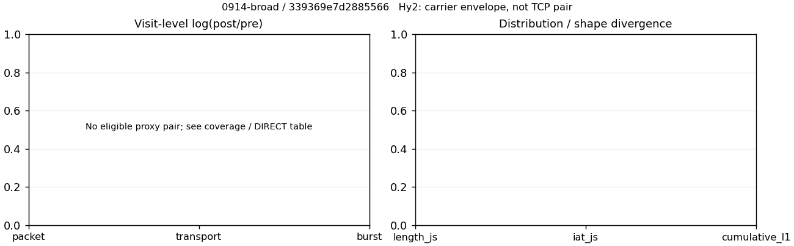

# 0914-broad · 条目 032 · csdn.net

目标：https://www.csdn.net/

活动标签：csdn.net::page_load。选定访问 3 次。

[返回总索引](../../README.md) · [统计口径](../../methods.md)

## 覆盖与资格（每次访问均保留）

| 部署 | 重复 | 主请求路由 | 活动状态 | 代理比较 | DIRECT pre | 请求 proxy/direct/unresolved | 错误 |
| --- | --- | --- | --- | --- | --- | --- | --- |
| Hy2 | 1 | direct | passed | 0 | 1 | 0/183/0 | [] |
| SS | 1 | direct | passed | 0 | 1 | 0/181/0 | [] |
| VLESS | 1 | direct | passed | 0 | 1 | 0/181/0 | [] |

主请求非 proxy 的统计仅解释为已索引的辅助代理连接或 DIRECT 观测，不代表目标业务经代理传输。播放确认与配对资格是两道不同的门。

图中散点为单次访问，短线为重复中位数；Hy2 是共享载体包络，不能与 TCP 配对作等范围因果对比。

形态图先逐访问归一化，再对访问等权平均；实线 pre，虚线 post。分箱序号及边界见 methods，不将分箱索引误解为长度或时间。

## 每次访问的关键观测

### SS

范围：`direct_pre_only`。每格 pre → post；空值为不可观测/不适用。

| 重复 | 包数 | 载荷字节 | burst | TCP FR | IAT中位µs | length JS | IAT JS |
| --- | --- | --- | --- | --- | --- | --- | --- |
| 1 | 2253 → — | 4.2851e+06 → — | 1400 → — | 242 → — | 128.13 → — | — | — |

完整标量统计：中位数 [min,max]；Δ 为重复内逐访问变换的中位数，MAD 未缩放。n 为可用变换数；DIRECT-only 的 nΔ=0 不代表 pre 不可用。

| scope | 特征 | pre | post | Δ | IQRΔ | MADΔ | nΔ |
| --- | --- | --- | --- | --- | --- | --- | --- |
| direct_pre_only | active_span_sum_s_1000ms | 15.81 [15.81, 15.81] | — | — | — | — | 0 |
| direct_pre_only | active_span_sum_s_100ms | 5.3798 [5.3798, 5.3798] | — | — | — | — | 0 |
| direct_pre_only | active_span_sum_s_500ms | 13.759 [13.759, 13.759] | — | — | — | — | 0 |
| direct_pre_only | burst_bytes_iqr | 3005.2 [3005.2, 3005.2] | — | — | — | — | 0 |
| direct_pre_only | burst_bytes_mad | 75 [75, 75] | — | — | — | — | 0 |
| direct_pre_only | burst_bytes_max | 28108 [28108, 28108] | — | — | — | — | 0 |
| direct_pre_only | burst_bytes_mean | 3060.8 [3060.8, 3060.8] | — | — | — | — | 0 |
| direct_pre_only | burst_bytes_median | 75 [75, 75] | — | — | — | — | 0 |
| direct_pre_only | burst_bytes_min | 0 [0, 0] | — | — | — | — | 0 |
| direct_pre_only | burst_bytes_p95 | 19939 [19939, 19939] | — | — | — | — | 0 |
| direct_pre_only | burst_bytes_q25 | 0 [0, 0] | — | — | — | — | 0 |
| direct_pre_only | burst_bytes_q75 | 3005.2 [3005.2, 3005.2] | — | — | — | — | 0 |
| direct_pre_only | burst_bytes_std | 5679 [5679, 5679] | — | — | — | — | 0 |
| direct_pre_only | burst_count | 1400 [1400, 1400] | — | — | — | — | 0 |
| direct_pre_only | burst_duration_ms_iqr | 0.80951 [0.80951, 0.80951] | — | — | — | — | 0 |
| direct_pre_only | burst_duration_ms_mad | 0 [0, 0] | — | — | — | — | 0 |
| direct_pre_only | burst_duration_ms_max | 15001 [15001, 15001] | — | — | — | — | 0 |
| direct_pre_only | burst_duration_ms_mean | 68.194 [68.194, 68.194] | — | — | — | — | 0 |
| direct_pre_only | burst_duration_ms_median | 0 [0, 0] | — | — | — | — | 0 |
| direct_pre_only | burst_duration_ms_min | 0 [0, 0] | — | — | — | — | 0 |
| direct_pre_only | burst_duration_ms_p95 | 78.205 [78.205, 78.205] | — | — | — | — | 0 |
| direct_pre_only | burst_duration_ms_q25 | 0 [0, 0] | — | — | — | — | 0 |
| direct_pre_only | burst_duration_ms_q75 | 0.80951 [0.80951, 0.80951] | — | — | — | — | 0 |
| direct_pre_only | burst_duration_ms_std | 524.32 [524.32, 524.32] | — | — | — | — | 0 |
| direct_pre_only | burst_packets_iqr | 1 [1, 1] | — | — | — | — | 0 |
| direct_pre_only | burst_packets_mad | 0 [0, 0] | — | — | — | — | 0 |
| direct_pre_only | burst_packets_max | 9 [9, 9] | — | — | — | — | 0 |
| direct_pre_only | burst_packets_mean | 1.6093 [1.6093, 1.6093] | — | — | — | — | 0 |
| direct_pre_only | burst_packets_median | 1 [1, 1] | — | — | — | — | 0 |
| direct_pre_only | burst_packets_min | 1 [1, 1] | — | — | — | — | 0 |
| direct_pre_only | burst_packets_p95 | 3 [3, 3] | — | — | — | — | 0 |
| direct_pre_only | burst_packets_q25 | 1 [1, 1] | — | — | — | — | 0 |
| direct_pre_only | burst_packets_q75 | 2 [2, 2] | — | — | — | — | 0 |
| direct_pre_only | burst_packets_std | 0.9589 [0.9589, 0.9589] | — | — | — | — | 0 |
| direct_pre_only | connection_span_concurrency_max | 30 [30, 30] | — | — | — | — | 0 |
| direct_pre_only | direction_entropy | 0.72379 [0.72379, 0.72379] | — | — | — | — | 0 |
| direct_pre_only | down_burst_count | 683 [683, 683] | — | — | — | — | 0 |
| direct_pre_only | down_ip_bytes | 4.1927e+06 [4.1927e+06, 4.1927e+06] | — | — | — | — | 0 |
| direct_pre_only | down_packets | 1350 [1350, 1350] | — | — | — | — | 0 |
| direct_pre_only | down_transport_bytes | 4.1222e+06 [4.1222e+06, 4.1222e+06] | — | — | — | — | 0 |
| direct_pre_only | duration_s | 16.381 [16.381, 16.381] | — | — | — | — | 0 |
| direct_pre_only | entity_count | 34 [34, 34] | — | — | — | — | 0 |
| direct_pre_only | fr_runs | 242 [242, 242] | — | — | — | — | 0 |
| direct_pre_only | fr_runs_per_packet | 0.18847 [0.18847, 0.18847] | — | — | — | — | 0 |
| direct_pre_only | fr_switches | 208 [208, 208] | — | — | — | — | 0 |
| direct_pre_only | fr_switches_per_possible_transition | 0.1664 [0.1664, 0.1664] | — | — | — | — | 0 |
| direct_pre_only | full_retransmission_fraction | 0.011984 [0.011984, 0.011984] | — | — | — | — | 0 |
| direct_pre_only | full_retransmission_packets | 27 [27, 27] | — | — | — | — | 0 |
| direct_pre_only | iat_count | 2219 [2219, 2219] | — | — | — | — | 0 |
| direct_pre_only | iat_median_us | 128.13 [128.13, 128.13] | — | — | — | — | 0 |
| direct_pre_only | iat_us_iqr | 1156.3 [1156.3, 1156.3] | — | — | — | — | 0 |
| direct_pre_only | iat_us_mad | 121.09 [121.09, 121.09] | — | — | — | — | 0 |
| direct_pre_only | iat_us_max | 1.5001e+07 [1.5001e+07, 1.5001e+07] | — | — | — | — | 0 |
| direct_pre_only | iat_us_mean | 44835 [44835, 44835] | — | — | — | — | 0 |
| direct_pre_only | iat_us_median | 128.13 [128.13, 128.13] | — | — | — | — | 0 |
| direct_pre_only | iat_us_min | 0.071 [0.071, 0.071] | — | — | — | — | 0 |
| direct_pre_only | iat_us_p95 | 34094 [34094, 34094] | — | — | — | — | 0 |
| direct_pre_only | iat_us_q25 | 20.224 [20.224, 20.224] | — | — | — | — | 0 |
| direct_pre_only | iat_us_q75 | 1176.5 [1176.5, 1176.5] | — | — | — | — | 0 |
| direct_pre_only | iat_us_std | 4.2051e+05 [4.2051e+05, 4.2051e+05] | — | — | — | — | 0 |
| direct_pre_only | idle_gap_count_1000ms | 30 [30, 30] | — | — | — | — | 0 |
| direct_pre_only | idle_gap_count_100ms | 69 [69, 69] | — | — | — | — | 0 |
| direct_pre_only | idle_gap_count_500ms | 33 [33, 33] | — | — | — | — | 0 |
| direct_pre_only | idle_gap_sum_s_1000ms | 83.68 [83.68, 83.68] | — | — | — | — | 0 |
| direct_pre_only | idle_gap_sum_s_100ms | 94.11 [94.11, 94.11] | — | — | — | — | 0 |
| direct_pre_only | idle_gap_sum_s_500ms | 85.731 [85.731, 85.731] | — | — | — | — | 0 |
| direct_pre_only | ip_bytes | 4.4031e+06 [4.4031e+06, 4.4031e+06] | — | — | — | — | 0 |
| direct_pre_only | length_iqr | 4431 [4431, 4431] | — | — | — | — | 0 |
| direct_pre_only | length_mad | 2067.5 [2067.5, 2067.5] | — | — | — | — | 0 |
| direct_pre_only | length_max | 8948 [8948, 8948] | — | — | — | — | 0 |
| direct_pre_only | length_mean | 3337.3 [3337.3, 3337.3] | — | — | — | — | 0 |
| direct_pre_only | length_median | 2848 [2848, 2848] | — | — | — | — | 0 |
| direct_pre_only | length_min | 31 [31, 31] | — | — | — | — | 0 |
| direct_pre_only | length_p95 | 8920 [8920, 8920] | — | — | — | — | 0 |
| direct_pre_only | length_q25 | 832 [832, 832] | — | — | — | — | 0 |
| direct_pre_only | length_q75 | 5263 [5263, 5263] | — | — | — | — | 0 |
| direct_pre_only | length_std | 2990.3 [2990.3, 2990.3] | — | — | — | — | 0 |
| direct_pre_only | nonempty_entity_count | 34 [34, 34] | — | — | — | — | 0 |
| direct_pre_only | nonempty_packets | 1284 [1284, 1284] | — | — | — | — | 0 |
| direct_pre_only | offload_suspect_fraction | 0.35952 [0.35952, 0.35952] | — | — | — | — | 0 |
| direct_pre_only | packet_count | 2253 [2253, 2253] | — | — | — | — | 0 |
| direct_pre_only | rtt_median_ms | 0.11144 [0.11144, 0.11144] | — | — | — | — | 0 |
| direct_pre_only | rtt_sample_count | 877 [877, 877] | — | — | — | — | 0 |
| direct_pre_only | tcp_ack_count | 2216 [2216, 2216] | — | — | — | — | 0 |
| direct_pre_only | tcp_fin_count | 66 [66, 66] | — | — | — | — | 0 |
| direct_pre_only | tcp_packet_count | 2253 [2253, 2253] | — | — | — | — | 0 |
| direct_pre_only | tcp_rst_count | 3 [3, 3] | — | — | — | — | 0 |
| direct_pre_only | tcp_syn_count | 68 [68, 68] | — | — | — | — | 0 |
| direct_pre_only | tcp_window_raw_median | 65535 [65535, 65535] | — | — | — | — | 0 |
| direct_pre_only | transition_entropy | 0.54739 [0.54739, 0.54739] | — | — | — | — | 0 |
| direct_pre_only | transition_n_mm | 906 [906, 906] | — | — | — | — | 0 |
| direct_pre_only | transition_n_mp | 88 [88, 88] | — | — | — | — | 0 |
| direct_pre_only | transition_n_pm | 120 [120, 120] | — | — | — | — | 0 |
| direct_pre_only | transition_n_pp | 136 [136, 136] | — | — | — | — | 0 |
| direct_pre_only | transition_p_mm | 0.91147 [0.91147, 0.91147] | — | — | — | — | 0 |
| direct_pre_only | transition_p_mp | 0.088531 [0.088531, 0.088531] | — | — | — | — | 0 |
| direct_pre_only | transition_p_pm | 0.46875 [0.46875, 0.46875] | — | — | — | — | 0 |
| direct_pre_only | transition_p_pp | 0.53125 [0.53125, 0.53125] | — | — | — | — | 0 |
| direct_pre_only | transport_bytes | 4.2851e+06 [4.2851e+06, 4.2851e+06] | — | — | — | — | 0 |
| direct_pre_only | up_burst_count | 717 [717, 717] | — | — | — | — | 0 |
| direct_pre_only | up_byte_fraction | 0.038029 [0.038029, 0.038029] | — | — | — | — | 0 |
| direct_pre_only | up_ip_bytes | 2.1046e+05 [2.1046e+05, 2.1046e+05] | — | — | — | — | 0 |
| direct_pre_only | up_packets | 903 [903, 903] | — | — | — | — | 0 |
| direct_pre_only | up_transport_bytes | 1.6296e+05 [1.6296e+05, 1.6296e+05] | — | — | — | — | 0 |
| direct_pre_only | zero_iat_count | 0 [0, 0] | — | — | — | — | 0 |
| direct_pre_only | zero_iat_fraction | 0 [0, 0] | — | — | — | — | 0 |

### VLESS

范围：`direct_pre_only`。每格 pre → post；空值为不可观测/不适用。

| 重复 | 包数 | 载荷字节 | burst | TCP FR | IAT中位µs | length JS | IAT JS |
| --- | --- | --- | --- | --- | --- | --- | --- |
| 1 | 2136 → — | 3.6263e+06 → — | 1450 → — | 252 → — | 164.38 → — | — | — |

完整标量统计：中位数 [min,max]；Δ 为重复内逐访问变换的中位数，MAD 未缩放。n 为可用变换数；DIRECT-only 的 nΔ=0 不代表 pre 不可用。

| scope | 特征 | pre | post | Δ | IQRΔ | MADΔ | nΔ |
| --- | --- | --- | --- | --- | --- | --- | --- |
| direct_pre_only | active_span_sum_s_1000ms | 19.364 [19.364, 19.364] | — | — | — | — | 0 |
| direct_pre_only | active_span_sum_s_100ms | 5.516 [5.516, 5.516] | — | — | — | — | 0 |
| direct_pre_only | active_span_sum_s_500ms | 15.246 [15.246, 15.246] | — | — | — | — | 0 |
| direct_pre_only | burst_bytes_iqr | 2855.5 [2855.5, 2855.5] | — | — | — | — | 0 |
| direct_pre_only | burst_bytes_mad | 74 [74, 74] | — | — | — | — | 0 |
| direct_pre_only | burst_bytes_max | 42984 [42984, 42984] | — | — | — | — | 0 |
| direct_pre_only | burst_bytes_mean | 2500.9 [2500.9, 2500.9] | — | — | — | — | 0 |
| direct_pre_only | burst_bytes_median | 74 [74, 74] | — | — | — | — | 0 |
| direct_pre_only | burst_bytes_min | 0 [0, 0] | — | — | — | — | 0 |
| direct_pre_only | burst_bytes_p95 | 12816 [12816, 12816] | — | — | — | — | 0 |
| direct_pre_only | burst_bytes_q25 | 0 [0, 0] | — | — | — | — | 0 |
| direct_pre_only | burst_bytes_q75 | 2855.5 [2855.5, 2855.5] | — | — | — | — | 0 |
| direct_pre_only | burst_bytes_std | 4840.6 [4840.6, 4840.6] | — | — | — | — | 0 |
| direct_pre_only | burst_count | 1450 [1450, 1450] | — | — | — | — | 0 |
| direct_pre_only | burst_duration_ms_iqr | 0.45443 [0.45443, 0.45443] | — | — | — | — | 0 |
| direct_pre_only | burst_duration_ms_mad | 0 [0, 0] | — | — | — | — | 0 |
| direct_pre_only | burst_duration_ms_max | 14020 [14020, 14020] | — | — | — | — | 0 |
| direct_pre_only | burst_duration_ms_mean | 54.976 [54.976, 54.976] | — | — | — | — | 0 |
| direct_pre_only | burst_duration_ms_median | 0 [0, 0] | — | — | — | — | 0 |
| direct_pre_only | burst_duration_ms_min | 0 [0, 0] | — | — | — | — | 0 |
| direct_pre_only | burst_duration_ms_p95 | 84.063 [84.063, 84.063] | — | — | — | — | 0 |
| direct_pre_only | burst_duration_ms_q25 | 0 [0, 0] | — | — | — | — | 0 |
| direct_pre_only | burst_duration_ms_q75 | 0.45443 [0.45443, 0.45443] | — | — | — | — | 0 |
| direct_pre_only | burst_duration_ms_std | 554.09 [554.09, 554.09] | — | — | — | — | 0 |
| direct_pre_only | burst_packets_iqr | 1 [1, 1] | — | — | — | — | 0 |
| direct_pre_only | burst_packets_mad | 0 [0, 0] | — | — | — | — | 0 |
| direct_pre_only | burst_packets_max | 9 [9, 9] | — | — | — | — | 0 |
| direct_pre_only | burst_packets_mean | 1.4731 [1.4731, 1.4731] | — | — | — | — | 0 |
| direct_pre_only | burst_packets_median | 1 [1, 1] | — | — | — | — | 0 |
| direct_pre_only | burst_packets_min | 1 [1, 1] | — | — | — | — | 0 |
| direct_pre_only | burst_packets_p95 | 3 [3, 3] | — | — | — | — | 0 |
| direct_pre_only | burst_packets_q25 | 1 [1, 1] | — | — | — | — | 0 |
| direct_pre_only | burst_packets_q75 | 2 [2, 2] | — | — | — | — | 0 |
| direct_pre_only | burst_packets_std | 0.8676 [0.8676, 0.8676] | — | — | — | — | 0 |
| direct_pre_only | connection_span_concurrency_max | 28 [28, 28] | — | — | — | — | 0 |
| direct_pre_only | direction_entropy | 0.72605 [0.72605, 0.72605] | — | — | — | — | 0 |
| direct_pre_only | down_burst_count | 708 [708, 708] | — | — | — | — | 0 |
| direct_pre_only | down_ip_bytes | 3.491e+06 [3.491e+06, 3.491e+06] | — | — | — | — | 0 |
| direct_pre_only | down_packets | 1223 [1223, 1223] | — | — | — | — | 0 |
| direct_pre_only | down_transport_bytes | 3.4271e+06 [3.4271e+06, 3.4271e+06] | — | — | — | — | 0 |
| direct_pre_only | duration_s | 19.71 [19.71, 19.71] | — | — | — | — | 0 |
| direct_pre_only | entity_count | 34 [34, 34] | — | — | — | — | 0 |
| direct_pre_only | fr_runs | 252 [252, 252] | — | — | — | — | 0 |
| direct_pre_only | fr_runs_per_packet | 0.21762 [0.21762, 0.21762] | — | — | — | — | 0 |
| direct_pre_only | fr_switches | 218 [218, 218] | — | — | — | — | 0 |
| direct_pre_only | fr_switches_per_possible_transition | 0.19395 [0.19395, 0.19395] | — | — | — | — | 0 |
| direct_pre_only | full_retransmission_fraction | 0.0088951 [0.0088951, 0.0088951] | — | — | — | — | 0 |
| direct_pre_only | full_retransmission_packets | 19 [19, 19] | — | — | — | — | 0 |
| direct_pre_only | iat_count | 2102 [2102, 2102] | — | — | — | — | 0 |
| direct_pre_only | iat_median_us | 164.38 [164.38, 164.38] | — | — | — | — | 0 |
| direct_pre_only | iat_us_iqr | 1143.3 [1143.3, 1143.3] | — | — | — | — | 0 |
| direct_pre_only | iat_us_mad | 157.63 [157.63, 157.63] | — | — | — | — | 0 |
| direct_pre_only | iat_us_max | 1.402e+07 [1.402e+07, 1.402e+07] | — | — | — | — | 0 |
| direct_pre_only | iat_us_mean | 40578 [40578, 40578] | — | — | — | — | 0 |
| direct_pre_only | iat_us_median | 164.38 [164.38, 164.38] | — | — | — | — | 0 |
| direct_pre_only | iat_us_min | 0.038 [0.038, 0.038] | — | — | — | — | 0 |
| direct_pre_only | iat_us_p95 | 38800 [38800, 38800] | — | — | — | — | 0 |
| direct_pre_only | iat_us_q25 | 23.328 [23.328, 23.328] | — | — | — | — | 0 |
| direct_pre_only | iat_us_q75 | 1166.6 [1166.6, 1166.6] | — | — | — | — | 0 |
| direct_pre_only | iat_us_std | 4.6339e+05 [4.6339e+05, 4.6339e+05] | — | — | — | — | 0 |
| direct_pre_only | idle_gap_count_1000ms | 29 [29, 29] | — | — | — | — | 0 |
| direct_pre_only | idle_gap_count_100ms | 72 [72, 72] | — | — | — | — | 0 |
| direct_pre_only | idle_gap_count_500ms | 35 [35, 35] | — | — | — | — | 0 |
| direct_pre_only | idle_gap_sum_s_1000ms | 65.93 [65.93, 65.93] | — | — | — | — | 0 |
| direct_pre_only | idle_gap_sum_s_100ms | 79.778 [79.778, 79.778] | — | — | — | — | 0 |
| direct_pre_only | idle_gap_sum_s_500ms | 70.048 [70.048, 70.048] | — | — | — | — | 0 |
| direct_pre_only | ip_bytes | 3.7381e+06 [3.7381e+06, 3.7381e+06] | — | — | — | — | 0 |
| direct_pre_only | length_iqr | 3387.8 [3387.8, 3387.8] | — | — | — | — | 0 |
| direct_pre_only | length_mad | 1800 [1800, 1800] | — | — | — | — | 0 |
| direct_pre_only | length_max | 8948 [8948, 8948] | — | — | — | — | 0 |
| direct_pre_only | length_mean | 3131.5 [3131.5, 3131.5] | — | — | — | — | 0 |
| direct_pre_only | length_median | 2848 [2848, 2848] | — | — | — | — | 0 |
| direct_pre_only | length_min | 31 [31, 31] | — | — | — | — | 0 |
| direct_pre_only | length_p95 | 8920 [8920, 8920] | — | — | — | — | 0 |
| direct_pre_only | length_q25 | 884.25 [884.25, 884.25] | — | — | — | — | 0 |
| direct_pre_only | length_q75 | 4272 [4272, 4272] | — | — | — | — | 0 |
| direct_pre_only | length_std | 2805.6 [2805.6, 2805.6] | — | — | — | — | 0 |
| direct_pre_only | nonempty_entity_count | 34 [34, 34] | — | — | — | — | 0 |
| direct_pre_only | nonempty_packets | 1158 [1158, 1158] | — | — | — | — | 0 |
| direct_pre_only | offload_suspect_fraction | 0.34082 [0.34082, 0.34082] | — | — | — | — | 0 |
| direct_pre_only | packet_count | 2136 [2136, 2136] | — | — | — | — | 0 |
| direct_pre_only | rtt_median_ms | 0.076155 [0.076155, 0.076155] | — | — | — | — | 0 |
| direct_pre_only | rtt_sample_count | 895 [895, 895] | — | — | — | — | 0 |
| direct_pre_only | tcp_ack_count | 2098 [2098, 2098] | — | — | — | — | 0 |
| direct_pre_only | tcp_fin_count | 66 [66, 66] | — | — | — | — | 0 |
| direct_pre_only | tcp_packet_count | 2136 [2136, 2136] | — | — | — | — | 0 |
| direct_pre_only | tcp_rst_count | 4 [4, 4] | — | — | — | — | 0 |
| direct_pre_only | tcp_syn_count | 68 [68, 68] | — | — | — | — | 0 |
| direct_pre_only | tcp_window_raw_median | 65535 [65535, 65535] | — | — | — | — | 0 |
| direct_pre_only | transition_entropy | 0.5883 [0.5883, 0.5883] | — | — | — | — | 0 |
| direct_pre_only | transition_n_mm | 799 [799, 799] | — | — | — | — | 0 |
| direct_pre_only | transition_n_mp | 93 [93, 93] | — | — | — | — | 0 |
| direct_pre_only | transition_n_pm | 125 [125, 125] | — | — | — | — | 0 |
| direct_pre_only | transition_n_pp | 107 [107, 107] | — | — | — | — | 0 |
| direct_pre_only | transition_p_mm | 0.89574 [0.89574, 0.89574] | — | — | — | — | 0 |
| direct_pre_only | transition_p_mp | 0.10426 [0.10426, 0.10426] | — | — | — | — | 0 |
| direct_pre_only | transition_p_pm | 0.53879 [0.53879, 0.53879] | — | — | — | — | 0 |
| direct_pre_only | transition_p_pp | 0.46121 [0.46121, 0.46121] | — | — | — | — | 0 |
| direct_pre_only | transport_bytes | 3.6263e+06 [3.6263e+06, 3.6263e+06] | — | — | — | — | 0 |
| direct_pre_only | up_burst_count | 742 [742, 742] | — | — | — | — | 0 |
| direct_pre_only | up_byte_fraction | 0.054942 [0.054942, 0.054942] | — | — | — | — | 0 |
| direct_pre_only | up_ip_bytes | 2.4717e+05 [2.4717e+05, 2.4717e+05] | — | — | — | — | 0 |
| direct_pre_only | up_packets | 913 [913, 913] | — | — | — | — | 0 |
| direct_pre_only | up_transport_bytes | 1.9924e+05 [1.9924e+05, 1.9924e+05] | — | — | — | — | 0 |
| direct_pre_only | zero_iat_count | 0 [0, 0] | — | — | — | — | 0 |
| direct_pre_only | zero_iat_fraction | 0 [0, 0] | — | — | — | — | 0 |

### Hy2

范围：`direct_pre_only`。每格 pre → post；空值为不可观测/不适用。

| 重复 | 包数 | 载荷字节 | burst | TCP FR | IAT中位µs | length JS | IAT JS |
| --- | --- | --- | --- | --- | --- | --- | --- |
| 1 | 2612 → — | 6.5559e+06 → — | 1622 → — | 248 → — | 64.941 → — | — | — |

完整标量统计：中位数 [min,max]；Δ 为重复内逐访问变换的中位数，MAD 未缩放。n 为可用变换数；DIRECT-only 的 nΔ=0 不代表 pre 不可用。

| scope | 特征 | pre | post | Δ | IQRΔ | MADΔ | nΔ |
| --- | --- | --- | --- | --- | --- | --- | --- |
| direct_pre_only | active_span_sum_s_1000ms | 28.526 [28.526, 28.526] | — | — | — | — | 0 |
| direct_pre_only | active_span_sum_s_100ms | 4.452 [4.452, 4.452] | — | — | — | — | 0 |
| direct_pre_only | active_span_sum_s_500ms | 14.228 [14.228, 14.228] | — | — | — | — | 0 |
| direct_pre_only | burst_bytes_iqr | 5712 [5712, 5712] | — | — | — | — | 0 |
| direct_pre_only | burst_bytes_mad | 31 [31, 31] | — | — | — | — | 0 |
| direct_pre_only | burst_bytes_max | 31107 [31107, 31107] | — | — | — | — | 0 |
| direct_pre_only | burst_bytes_mean | 4041.9 [4041.9, 4041.9] | — | — | — | — | 0 |
| direct_pre_only | burst_bytes_median | 31 [31, 31] | — | — | — | — | 0 |
| direct_pre_only | burst_bytes_min | 0 [0, 0] | — | — | — | — | 0 |
| direct_pre_only | burst_bytes_p95 | 20480 [20480, 20480] | — | — | — | — | 0 |
| direct_pre_only | burst_bytes_q25 | 0 [0, 0] | — | — | — | — | 0 |
| direct_pre_only | burst_bytes_q75 | 5712 [5712, 5712] | — | — | — | — | 0 |
| direct_pre_only | burst_bytes_std | 6705.6 [6705.6, 6705.6] | — | — | — | — | 0 |
| direct_pre_only | burst_count | 1622 [1622, 1622] | — | — | — | — | 0 |
| direct_pre_only | burst_duration_ms_iqr | 0.083171 [0.083171, 0.083171] | — | — | — | — | 0 |
| direct_pre_only | burst_duration_ms_mad | 0 [0, 0] | — | — | — | — | 0 |
| direct_pre_only | burst_duration_ms_max | 14810 [14810, 14810] | — | — | — | — | 0 |
| direct_pre_only | burst_duration_ms_mean | 38.792 [38.792, 38.792] | — | — | — | — | 0 |
| direct_pre_only | burst_duration_ms_median | 0 [0, 0] | — | — | — | — | 0 |
| direct_pre_only | burst_duration_ms_min | 0 [0, 0] | — | — | — | — | 0 |
| direct_pre_only | burst_duration_ms_p95 | 36.292 [36.292, 36.292] | — | — | — | — | 0 |
| direct_pre_only | burst_duration_ms_q25 | 0 [0, 0] | — | — | — | — | 0 |
| direct_pre_only | burst_duration_ms_q75 | 0.083171 [0.083171, 0.083171] | — | — | — | — | 0 |
| direct_pre_only | burst_duration_ms_std | 543.78 [543.78, 543.78] | — | — | — | — | 0 |
| direct_pre_only | burst_packets_iqr | 1 [1, 1] | — | — | — | — | 0 |
| direct_pre_only | burst_packets_mad | 0 [0, 0] | — | — | — | — | 0 |
| direct_pre_only | burst_packets_max | 12 [12, 12] | — | — | — | — | 0 |
| direct_pre_only | burst_packets_mean | 1.6104 [1.6104, 1.6104] | — | — | — | — | 0 |
| direct_pre_only | burst_packets_median | 1 [1, 1] | — | — | — | — | 0 |
| direct_pre_only | burst_packets_min | 1 [1, 1] | — | — | — | — | 0 |
| direct_pre_only | burst_packets_p95 | 3 [3, 3] | — | — | — | — | 0 |
| direct_pre_only | burst_packets_q25 | 1 [1, 1] | — | — | — | — | 0 |
| direct_pre_only | burst_packets_q75 | 2 [2, 2] | — | — | — | — | 0 |
| direct_pre_only | burst_packets_std | 1.014 [1.014, 1.014] | — | — | — | — | 0 |
| direct_pre_only | connection_span_concurrency_max | 22 [22, 22] | — | — | — | — | 0 |
| direct_pre_only | direction_entropy | 0.69508 [0.69508, 0.69508] | — | — | — | — | 0 |
| direct_pre_only | down_burst_count | 793 [793, 793] | — | — | — | — | 0 |
| direct_pre_only | down_ip_bytes | 6.4284e+06 [6.4284e+06, 6.4284e+06] | — | — | — | — | 0 |
| direct_pre_only | down_packets | 1553 [1553, 1553] | — | — | — | — | 0 |
| direct_pre_only | down_transport_bytes | 6.3474e+06 [6.3474e+06, 6.3474e+06] | — | — | — | — | 0 |
| direct_pre_only | duration_s | 17.947 [17.947, 17.947] | — | — | — | — | 0 |
| direct_pre_only | entity_count | 36 [36, 36] | — | — | — | — | 0 |
| direct_pre_only | fr_runs | 248 [248, 248] | — | — | — | — | 0 |
| direct_pre_only | fr_runs_per_packet | 0.16327 [0.16327, 0.16327] | — | — | — | — | 0 |
| direct_pre_only | fr_switches | 212 [212, 212] | — | — | — | — | 0 |
| direct_pre_only | fr_switches_per_possible_transition | 0.14295 [0.14295, 0.14295] | — | — | — | — | 0 |
| direct_pre_only | full_retransmission_fraction | 0.010337 [0.010337, 0.010337] | — | — | — | — | 0 |
| direct_pre_only | full_retransmission_packets | 27 [27, 27] | — | — | — | — | 0 |
| direct_pre_only | iat_count | 2576 [2576, 2576] | — | — | — | — | 0 |
| direct_pre_only | iat_median_us | 64.941 [64.941, 64.941] | — | — | — | — | 0 |
| direct_pre_only | iat_us_iqr | 666.08 [666.08, 666.08] | — | — | — | — | 0 |
| direct_pre_only | iat_us_mad | 58.03 [58.03, 58.03] | — | — | — | — | 0 |
| direct_pre_only | iat_us_max | 1.5001e+07 [1.5001e+07, 1.5001e+07] | — | — | — | — | 0 |
| direct_pre_only | iat_us_mean | 1.3967e+05 [1.3967e+05, 1.3967e+05] | — | — | — | — | 0 |
| direct_pre_only | iat_us_median | 64.941 [64.941, 64.941] | — | — | — | — | 0 |
| direct_pre_only | iat_us_min | 0.546 [0.546, 0.546] | — | — | — | — | 0 |
| direct_pre_only | iat_us_p95 | 31763 [31763, 31763] | — | — | — | — | 0 |
| direct_pre_only | iat_us_q25 | 13.768 [13.768, 13.768] | — | — | — | — | 0 |
| direct_pre_only | iat_us_q75 | 679.85 [679.85, 679.85] | — | — | — | — | 0 |
| direct_pre_only | iat_us_std | 1.366e+06 [1.366e+06, 1.366e+06] | — | — | — | — | 0 |
| direct_pre_only | idle_gap_count_1000ms | 24 [24, 24] | — | — | — | — | 0 |
| direct_pre_only | idle_gap_count_100ms | 89 [89, 89] | — | — | — | — | 0 |
| direct_pre_only | idle_gap_count_500ms | 46 [46, 46] | — | — | — | — | 0 |
| direct_pre_only | idle_gap_sum_s_1000ms | 331.28 [331.28, 331.28] | — | — | — | — | 0 |
| direct_pre_only | idle_gap_sum_s_100ms | 355.35 [355.35, 355.35] | — | — | — | — | 0 |
| direct_pre_only | idle_gap_sum_s_500ms | 345.57 [345.57, 345.57] | — | — | — | — | 0 |
| direct_pre_only | ip_bytes | 6.6926e+06 [6.6926e+06, 6.6926e+06] | — | — | — | — | 0 |
| direct_pre_only | length_iqr | 7004 [7004, 7004] | — | — | — | — | 0 |
| direct_pre_only | length_mad | 3048 [3048, 3048] | — | — | — | — | 0 |
| direct_pre_only | length_max | 8948 [8948, 8948] | — | — | — | — | 0 |
| direct_pre_only | length_mean | 4316 [4316, 4316] | — | — | — | — | 0 |
| direct_pre_only | length_median | 3368 [3368, 3368] | — | — | — | — | 0 |
| direct_pre_only | length_min | 31 [31, 31] | — | — | — | — | 0 |
| direct_pre_only | length_p95 | 8920 [8920, 8920] | — | — | — | — | 0 |
| direct_pre_only | length_q25 | 1353 [1353, 1353] | — | — | — | — | 0 |
| direct_pre_only | length_q75 | 8357 [8357, 8357] | — | — | — | — | 0 |
| direct_pre_only | length_std | 3364.1 [3364.1, 3364.1] | — | — | — | — | 0 |
| direct_pre_only | nonempty_entity_count | 36 [36, 36] | — | — | — | — | 0 |
| direct_pre_only | nonempty_packets | 1519 [1519, 1519] | — | — | — | — | 0 |
| direct_pre_only | offload_suspect_fraction | 0.42534 [0.42534, 0.42534] | — | — | — | — | 0 |
| direct_pre_only | packet_count | 2612 [2612, 2612] | — | — | — | — | 0 |
| direct_pre_only | rtt_median_ms | 0.095586 [0.095586, 0.095586] | — | — | — | — | 0 |
| direct_pre_only | rtt_sample_count | 964 [964, 964] | — | — | — | — | 0 |
| direct_pre_only | tcp_ack_count | 2572 [2572, 2572] | — | — | — | — | 0 |
| direct_pre_only | tcp_fin_count | 68 [68, 68] | — | — | — | — | 0 |
| direct_pre_only | tcp_packet_count | 2612 [2612, 2612] | — | — | — | — | 0 |
| direct_pre_only | tcp_rst_count | 5 [5, 5] | — | — | — | — | 0 |
| direct_pre_only | tcp_syn_count | 72 [72, 72] | — | — | — | — | 0 |
| direct_pre_only | tcp_window_raw_median | 65535 [65535, 65535] | — | — | — | — | 0 |
| direct_pre_only | transition_entropy | 0.49527 [0.49527, 0.49527] | — | — | — | — | 0 |
| direct_pre_only | transition_n_mm | 1111 [1111, 1111] | — | — | — | — | 0 |
| direct_pre_only | transition_n_mp | 88 [88, 88] | — | — | — | — | 0 |
| direct_pre_only | transition_n_pm | 124 [124, 124] | — | — | — | — | 0 |
| direct_pre_only | transition_n_pp | 160 [160, 160] | — | — | — | — | 0 |
| direct_pre_only | transition_p_mm | 0.92661 [0.92661, 0.92661] | — | — | — | — | 0 |
| direct_pre_only | transition_p_mp | 0.073394 [0.073394, 0.073394] | — | — | — | — | 0 |
| direct_pre_only | transition_p_pm | 0.43662 [0.43662, 0.43662] | — | — | — | — | 0 |
| direct_pre_only | transition_p_pp | 0.56338 [0.56338, 0.56338] | — | — | — | — | 0 |
| direct_pre_only | transport_bytes | 6.5559e+06 [6.5559e+06, 6.5559e+06] | — | — | — | — | 0 |
| direct_pre_only | up_burst_count | 829 [829, 829] | — | — | — | — | 0 |
| direct_pre_only | up_byte_fraction | 0.03181 [0.03181, 0.03181] | — | — | — | — | 0 |
| direct_pre_only | up_ip_bytes | 2.6415e+05 [2.6415e+05, 2.6415e+05] | — | — | — | — | 0 |
| direct_pre_only | up_packets | 1059 [1059, 1059] | — | — | — | — | 0 |
| direct_pre_only | up_transport_bytes | 2.0854e+05 [2.0854e+05, 2.0854e+05] | — | — | — | — | 0 |
| direct_pre_only | zero_iat_count | 0 [0, 0] | — | — | — | — | 0 |
| direct_pre_only | zero_iat_fraction | 0 [0, 0] | — | — | — | — | 0 |

## 不同部署对比

以下是各部署自身重复中位数的差异，不按重复编号强行配对。跨 TCP/Hy2 的行标记异质观测范围。

| 视角 | 特征 | 部署A | 部署B | A中位 | B中位 | B−A | 比较口径 |
| --- | --- | --- | --- | --- | --- | --- | --- |
| pre | burst_count | SS | VLESS | 1400 | 1450 | 50 | same_scope_unpaired_visits |
| pre | burst_count | SS | Hy2 | 1400 | 1622 | 222 | same_scope_unpaired_visits |
| pre | burst_count | VLESS | Hy2 | 1450 | 1622 | 172 | same_scope_unpaired_visits |
| pre | connection_span_concurrency_max | SS | VLESS | 30 | 28 | -2 | same_scope_unpaired_visits |
| pre | connection_span_concurrency_max | SS | Hy2 | 30 | 22 | -8 | same_scope_unpaired_visits |
| pre | connection_span_concurrency_max | VLESS | Hy2 | 28 | 22 | -6 | same_scope_unpaired_visits |
| pre | direction_entropy | SS | VLESS | 0.72379 | 0.72605 | 0.0022605 | same_scope_unpaired_visits |
| pre | direction_entropy | SS | Hy2 | 0.72379 | 0.69508 | -0.028714 | same_scope_unpaired_visits |
| pre | direction_entropy | VLESS | Hy2 | 0.72605 | 0.69508 | -0.030975 | same_scope_unpaired_visits |
| pre | down_transport_bytes | SS | VLESS | 4.1222e+06 | 3.4271e+06 | -6.9509e+05 | same_scope_unpaired_visits |
| pre | down_transport_bytes | SS | Hy2 | 4.1222e+06 | 6.3474e+06 | 2.2252e+06 | same_scope_unpaired_visits |
| pre | down_transport_bytes | VLESS | Hy2 | 3.4271e+06 | 6.3474e+06 | 2.9203e+06 | same_scope_unpaired_visits |
| pre | duration_s | SS | VLESS | 16.381 | 19.71 | 3.3287 | same_scope_unpaired_visits |
| pre | duration_s | SS | Hy2 | 16.381 | 17.947 | 1.5657 | same_scope_unpaired_visits |
| pre | duration_s | VLESS | Hy2 | 19.71 | 17.947 | -1.763 | same_scope_unpaired_visits |
| pre | entity_count | SS | VLESS | 34 | 34 | 0 | same_scope_unpaired_visits |
| pre | entity_count | SS | Hy2 | 34 | 36 | 2 | same_scope_unpaired_visits |
| pre | entity_count | VLESS | Hy2 | 34 | 36 | 2 | same_scope_unpaired_visits |
| pre | fr_runs | SS | VLESS | 242 | 252 | 10 | same_scope_unpaired_visits |
| pre | fr_runs | SS | Hy2 | 242 | 248 | 6 | same_scope_unpaired_visits |
| pre | fr_runs | VLESS | Hy2 | 252 | 248 | -4 | same_scope_unpaired_visits |
| pre | fr_runs_per_packet | SS | VLESS | 0.18847 | 0.21762 | 0.029143 | same_scope_unpaired_visits |
| pre | fr_runs_per_packet | SS | Hy2 | 0.18847 | 0.16327 | -0.025208 | same_scope_unpaired_visits |
| pre | fr_runs_per_packet | VLESS | Hy2 | 0.21762 | 0.16327 | -0.054351 | same_scope_unpaired_visits |
| pre | fr_switches | SS | VLESS | 208 | 218 | 10 | same_scope_unpaired_visits |
| pre | fr_switches | SS | Hy2 | 208 | 212 | 4 | same_scope_unpaired_visits |
| pre | fr_switches | VLESS | Hy2 | 218 | 212 | -6 | same_scope_unpaired_visits |
| pre | fr_switches_per_possible_transition | SS | VLESS | 0.1664 | 0.19395 | 0.02755 | same_scope_unpaired_visits |
| pre | fr_switches_per_possible_transition | SS | Hy2 | 0.1664 | 0.14295 | -0.023447 | same_scope_unpaired_visits |
| pre | fr_switches_per_possible_transition | VLESS | Hy2 | 0.19395 | 0.14295 | -0.050997 | same_scope_unpaired_visits |
| pre | full_retransmission_fraction | SS | VLESS | 0.011984 | 0.0088951 | -0.0030889 | same_scope_unpaired_visits |
| pre | full_retransmission_fraction | SS | Hy2 | 0.011984 | 0.010337 | -0.0016471 | same_scope_unpaired_visits |
| pre | full_retransmission_fraction | VLESS | Hy2 | 0.0088951 | 0.010337 | 0.0014418 | same_scope_unpaired_visits |
| pre | iat_median_us | SS | VLESS | 128.13 | 164.38 | 36.248 | same_scope_unpaired_visits |
| pre | iat_median_us | SS | Hy2 | 128.13 | 64.941 | -63.194 | same_scope_unpaired_visits |
| pre | iat_median_us | VLESS | Hy2 | 164.38 | 64.941 | -99.442 | same_scope_unpaired_visits |
| pre | iat_us_p95 | SS | VLESS | 34094 | 38800 | 4706.4 | same_scope_unpaired_visits |
| pre | iat_us_p95 | SS | Hy2 | 34094 | 31763 | -2330.2 | same_scope_unpaired_visits |
| pre | iat_us_p95 | VLESS | Hy2 | 38800 | 31763 | -7036.6 | same_scope_unpaired_visits |
| pre | ip_bytes | SS | VLESS | 4.4031e+06 | 3.7381e+06 | -6.6499e+05 | same_scope_unpaired_visits |
| pre | ip_bytes | SS | Hy2 | 4.4031e+06 | 6.6926e+06 | 2.2895e+06 | same_scope_unpaired_visits |
| pre | ip_bytes | VLESS | Hy2 | 3.7381e+06 | 6.6926e+06 | 2.9545e+06 | same_scope_unpaired_visits |
| pre | length_median | SS | VLESS | 2848 | 2848 | 0 | same_scope_unpaired_visits |
| pre | length_median | SS | Hy2 | 2848 | 3368 | 520 | same_scope_unpaired_visits |
| pre | length_median | VLESS | Hy2 | 2848 | 3368 | 520 | same_scope_unpaired_visits |
| pre | length_p95 | SS | VLESS | 8920 | 8920 | 0 | same_scope_unpaired_visits |
| pre | length_p95 | SS | Hy2 | 8920 | 8920 | 0 | same_scope_unpaired_visits |
| pre | length_p95 | VLESS | Hy2 | 8920 | 8920 | 0 | same_scope_unpaired_visits |
| pre | nonempty_packets | SS | VLESS | 1284 | 1158 | -126 | same_scope_unpaired_visits |
| pre | nonempty_packets | SS | Hy2 | 1284 | 1519 | 235 | same_scope_unpaired_visits |
| pre | nonempty_packets | VLESS | Hy2 | 1158 | 1519 | 361 | same_scope_unpaired_visits |
| pre | offload_suspect_fraction | SS | VLESS | 0.35952 | 0.34082 | -0.018697 | same_scope_unpaired_visits |
| pre | offload_suspect_fraction | SS | Hy2 | 0.35952 | 0.42534 | 0.065824 | same_scope_unpaired_visits |
| pre | offload_suspect_fraction | VLESS | Hy2 | 0.34082 | 0.42534 | 0.084521 | same_scope_unpaired_visits |
| pre | packet_count | SS | VLESS | 2253 | 2136 | -117 | same_scope_unpaired_visits |
| pre | packet_count | SS | Hy2 | 2253 | 2612 | 359 | same_scope_unpaired_visits |
| pre | packet_count | VLESS | Hy2 | 2136 | 2612 | 476 | same_scope_unpaired_visits |
| pre | rtt_median_ms | SS | VLESS | 0.11144 | 0.076155 | -0.035285 | same_scope_unpaired_visits |
| pre | rtt_median_ms | SS | Hy2 | 0.11144 | 0.095586 | -0.015854 | same_scope_unpaired_visits |
| pre | rtt_median_ms | VLESS | Hy2 | 0.076155 | 0.095586 | 0.019431 | same_scope_unpaired_visits |
| pre | transition_entropy | SS | VLESS | 0.54739 | 0.5883 | 0.040914 | same_scope_unpaired_visits |
| pre | transition_entropy | SS | Hy2 | 0.54739 | 0.49527 | -0.052124 | same_scope_unpaired_visits |
| pre | transition_entropy | VLESS | Hy2 | 0.5883 | 0.49527 | -0.093038 | same_scope_unpaired_visits |
| pre | transport_bytes | SS | VLESS | 4.2851e+06 | 3.6263e+06 | -6.5881e+05 | same_scope_unpaired_visits |
| pre | transport_bytes | SS | Hy2 | 4.2851e+06 | 6.5559e+06 | 2.2708e+06 | same_scope_unpaired_visits |
| pre | transport_bytes | VLESS | Hy2 | 3.6263e+06 | 6.5559e+06 | 2.9296e+06 | same_scope_unpaired_visits |
| pre | up_byte_fraction | SS | VLESS | 0.038029 | 0.054942 | 0.016913 | same_scope_unpaired_visits |
| pre | up_byte_fraction | SS | Hy2 | 0.038029 | 0.03181 | -0.0062188 | same_scope_unpaired_visits |
| pre | up_byte_fraction | VLESS | Hy2 | 0.054942 | 0.03181 | -0.023132 | same_scope_unpaired_visits |
| pre | up_transport_bytes | SS | VLESS | 1.6296e+05 | 1.9924e+05 | 36280 | same_scope_unpaired_visits |
| pre | up_transport_bytes | SS | Hy2 | 1.6296e+05 | 2.0854e+05 | 45586 | same_scope_unpaired_visits |
| pre | up_transport_bytes | VLESS | Hy2 | 1.9924e+05 | 2.0854e+05 | 9306 | same_scope_unpaired_visits |

## 可复核的访问标识

| 部署 | 重复 | session_id |
| --- | --- | --- |
| SS | 1 | 7e0ecb7f-b64a-4a66-b50f-84be92b589a7 |
| VLESS | 1 | 75ea08eb-704f-48d5-aea1-ade0c862344b |
| Hy2 | 1 | 9d13ad32-8ed1-4e11-a11c-1f4a768a5fff |

全量三种 packet selection、Hy2 full 范围、Q25/Q75、直方图与曲线见机器可读产物；本页只显示 observed 主范围。
