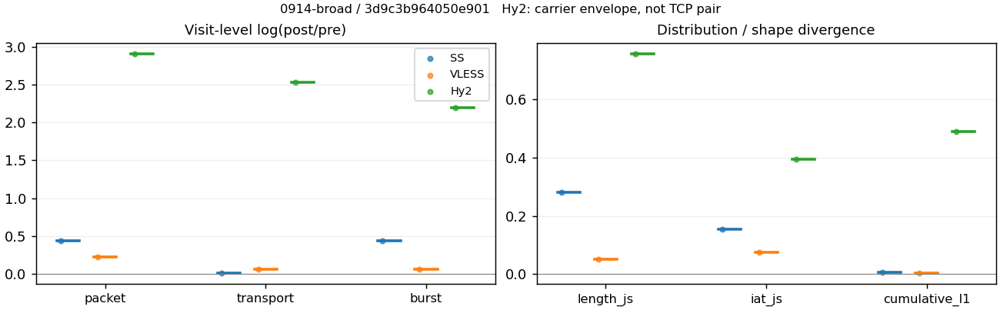
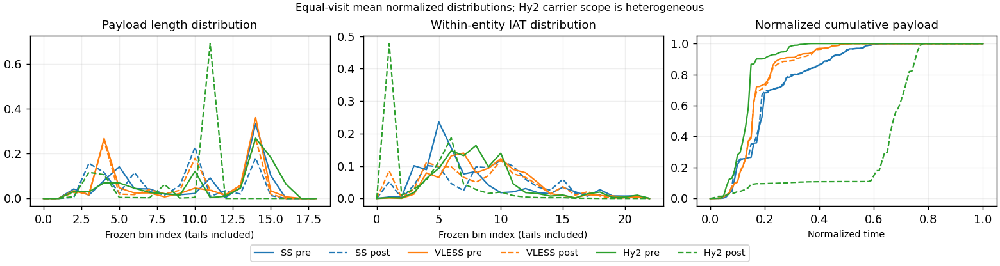

# 0914-broad · 条目 033 · rottentomatoes.com

目标：https://www.rottentomatoes.com/

活动标签：rottentomatoes.com::page_load。选定访问 3 次。

[返回总索引](../../README.md) · [统计口径](../../methods.md)

## 覆盖与资格（每次访问均保留）

| 部署 | 重复 | 主请求路由 | 活动状态 | 代理比较 | DIRECT pre | 请求 proxy/direct/unresolved | 错误 |
| --- | --- | --- | --- | --- | --- | --- | --- |
| Hy2 | 1 | proxy | passed | 1 | 1 | 168/3/1 | [] |
| SS | 1 | proxy | passed | 1 | 0 | 167/0/0 | [] |
| VLESS | 1 | proxy | passed | 1 | 0 | 188/0/0 | [] |

主请求非 proxy 的统计仅解释为已索引的辅助代理连接或 DIRECT 观测，不代表目标业务经代理传输。播放确认与配对资格是两道不同的门。

图中散点为单次访问，短线为重复中位数；Hy2 是共享载体包络，不能与 TCP 配对作等范围因果对比。

形态图先逐访问归一化，再对访问等权平均；实线 pre，虚线 post。分箱序号及边界见 methods，不将分箱索引误解为长度或时间。

## 每次访问的关键观测

### SS

范围：`exclusive_page`。每格 pre → post；空值为不可观测/不适用。

| 重复 | 包数 | 载荷字节 | burst | TCP FR | IAT中位µs | length JS | IAT JS |
| --- | --- | --- | --- | --- | --- | --- | --- |
| 1 | 2372 → 3680 | 2.2459e+06 → 2.2896e+06 | 1679 → 2599 | 222 → 233 | 27.475 → 336.39 | 0.28179 | 0.15403 |

完整标量统计：中位数 [min,max]；Δ 为重复内逐访问变换的中位数，MAD 未缩放。n 为可用变换数；DIRECT-only 的 nΔ=0 不代表 pre 不可用。

| scope | 特征 | pre | post | Δ | IQRΔ | MADΔ | nΔ |
| --- | --- | --- | --- | --- | --- | --- | --- |
| exclusive_page | active_span_sum_s_1000ms | 39.252 [39.252, 39.252] | 46.298 [46.298, 46.298] | 0.16509 | — | — | 1 |
| exclusive_page | active_span_sum_s_100ms | 8.0454 [8.0454, 8.0454] | 15.097 [15.097, 15.097] | 0.62937 | — | — | 1 |
| exclusive_page | active_span_sum_s_500ms | 27.647 [27.647, 27.647] | 34.525 [34.525, 34.525] | 0.22215 | — | — | 1 |
| exclusive_page | burst_bytes_iqr | 1771.5 [1771.5, 1771.5] | 1428 [1428, 1428] | -0.21555 | — | — | 1 |
| exclusive_page | burst_bytes_mad | 31 [31, 31] | 34 [34, 34] | 0.092373 | — | — | 1 |
| exclusive_page | burst_bytes_max | 23336 [23336, 23336] | 8824 [8824, 8824] | -0.97252 | — | — | 1 |
| exclusive_page | burst_bytes_mean | 1337.6 [1337.6, 1337.6] | 880.96 [880.96, 880.96] | -0.41765 | — | — | 1 |
| exclusive_page | burst_bytes_median | 31 [31, 31] | 34 [34, 34] | 0.092373 | — | — | 1 |
| exclusive_page | burst_bytes_min | 0 [0, 0] | 0 [0, 0] | — | — | — | 0 |
| exclusive_page | burst_bytes_p95 | 5792 [5792, 5792] | 2971.4 [2971.4, 2971.4] | -0.66744 | — | — | 1 |
| exclusive_page | burst_bytes_q25 | 0 [0, 0] | 0 [0, 0] | — | — | — | 0 |
| exclusive_page | burst_bytes_q75 | 1771.5 [1771.5, 1771.5] | 1428 [1428, 1428] | -0.21555 | — | — | 1 |
| exclusive_page | burst_bytes_std | 2668.8 [2668.8, 2668.8] | 1382.2 [1382.2, 1382.2] | -0.658 | — | — | 1 |
| exclusive_page | burst_count | 1679 [1679, 1679] | 2599 [2599, 2599] | 0.43693 | — | — | 1 |
| exclusive_page | burst_duration_ms_iqr | 0.01196 [0.01196, 0.01196] | 8.7e-05 [8.7e-05, 8.7e-05] | -4.9234 | — | — | 1 |
| exclusive_page | burst_duration_ms_mad | 0 [0, 0] | 0 [0, 0] | — | — | — | 0 |
| exclusive_page | burst_duration_ms_max | 13642 [13642, 13642] | 13642 [13642, 13642] | 1.8092e-05 | — | — | 1 |
| exclusive_page | burst_duration_ms_mean | 131.66 [131.66, 131.66] | 73.429 [73.429, 73.429] | -0.58388 | — | — | 1 |
| exclusive_page | burst_duration_ms_median | 0 [0, 0] | 0 [0, 0] | — | — | — | 0 |
| exclusive_page | burst_duration_ms_min | 0 [0, 0] | 0 [0, 0] | — | — | — | 0 |
| exclusive_page | burst_duration_ms_p95 | 219.37 [219.37, 219.37] | 22.055 [22.055, 22.055] | -2.2972 | — | — | 1 |
| exclusive_page | burst_duration_ms_q25 | 0 [0, 0] | 0 [0, 0] | — | — | — | 0 |
| exclusive_page | burst_duration_ms_q75 | 0.01196 [0.01196, 0.01196] | 8.7e-05 [8.7e-05, 8.7e-05] | -4.9234 | — | — | 1 |
| exclusive_page | burst_duration_ms_std | 1088.6 [1088.6, 1088.6] | 835.66 [835.66, 835.66] | -0.26445 | — | — | 1 |
| exclusive_page | burst_packets_iqr | 1 [1, 1] | 1 [1, 1] | 0 | — | — | 1 |
| exclusive_page | burst_packets_mad | 0 [0, 0] | 0 [0, 0] | — | — | — | 0 |
| exclusive_page | burst_packets_max | 11 [11, 11] | 7 [7, 7] | -0.45199 | — | — | 1 |
| exclusive_page | burst_packets_mean | 1.4127 [1.4127, 1.4127] | 1.4159 [1.4159, 1.4159] | 0.0022509 | — | — | 1 |
| exclusive_page | burst_packets_median | 1 [1, 1] | 1 [1, 1] | 0 | — | — | 1 |
| exclusive_page | burst_packets_min | 1 [1, 1] | 1 [1, 1] | 0 | — | — | 1 |
| exclusive_page | burst_packets_p95 | 3 [3, 3] | 4 [4, 4] | 0.28768 | — | — | 1 |
| exclusive_page | burst_packets_q25 | 1 [1, 1] | 1 [1, 1] | 0 | — | — | 1 |
| exclusive_page | burst_packets_q75 | 2 [2, 2] | 2 [2, 2] | 0 | — | — | 1 |
| exclusive_page | burst_packets_std | 1.0142 [1.0142, 1.0142] | 0.85127 [0.85127, 0.85127] | -0.17511 | — | — | 1 |
| exclusive_page | connection_span_concurrency_max | 20 [20, 20] | 20 [20, 20] | 0 | — | — | 1 |
| exclusive_page | cumulative_l1 | — | — | 0.0056448 | — | — | 1 |
| exclusive_page | cumulative_max | — | — | 0.143 | — | — | 1 |
| exclusive_page | direction_entropy | 0.64669 [0.64669, 0.64669] | 0.57215 [0.57215, 0.57215] | -0.074544 | — | — | 1 |
| exclusive_page | down_burst_count | 824 [824, 824] | 1284 [1284, 1284] | 0.44356 | — | — | 1 |
| exclusive_page | down_ip_bytes | 2.2291e+06 [2.2291e+06, 2.2291e+06] | 2.2921e+06 [2.2921e+06, 2.2921e+06] | 0.027888 | — | — | 1 |
| exclusive_page | down_packets | 1367 [1367, 1367] | 2014 [2014, 2014] | 0.3875 | — | — | 1 |
| exclusive_page | down_transport_bytes | 2.1578e+06 [2.1578e+06, 2.1578e+06] | 2.187e+06 [2.187e+06, 2.187e+06] | 0.01346 | — | — | 1 |
| exclusive_page | duration_s | 22.182 [22.182, 22.182] | 22.109 [22.109, 22.109] | -0.0033074 | — | — | 1 |
| exclusive_page | entity_count | 31 [31, 31] | 31 [31, 31] | 0 | — | — | 1 |
| exclusive_page | fr_runs | 222 [222, 222] | 233 [233, 233] | 0.048361 | — | — | 1 |
| exclusive_page | fr_runs_per_packet | 0.17303 [0.17303, 0.17303] | 0.11644 [0.11644, 0.11644] | -0.05659 | — | — | 1 |
| exclusive_page | fr_switches | 191 [191, 191] | 202 [202, 202] | 0.055994 | — | — | 1 |
| exclusive_page | fr_switches_per_possible_transition | 0.15256 [0.15256, 0.15256] | 0.10254 [0.10254, 0.10254] | -0.050018 | — | — | 1 |
| exclusive_page | full_retransmission_fraction | 0.0012648 [0.0012648, 0.0012648] | 0.0046196 [0.0046196, 0.0046196] | 0.0033548 | — | — | 1 |
| exclusive_page | full_retransmission_packets | 3 [3, 3] | 17 [17, 17] | 1.7346 | — | — | 1 |
| exclusive_page | iat_count | 2341 [2341, 2341] | 3649 [3649, 3649] | 0.44387 | — | — | 1 |
| exclusive_page | iat_js | — | — | 0.15403 | — | — | 1 |
| exclusive_page | iat_ks | — | — | 0.3108 | — | — | 1 |
| exclusive_page | iat_median_us | 27.475 [27.475, 27.475] | 336.39 [336.39, 336.39] | 2.505 | — | — | 1 |
| exclusive_page | iat_us_iqr | 192.4 [192.4, 192.4] | 1456.4 [1456.4, 1456.4] | 2.0242 | — | — | 1 |
| exclusive_page | iat_us_mad | 23.072 [23.072, 23.072] | 330.55 [330.55, 330.55] | 2.6621 | — | — | 1 |
| exclusive_page | iat_us_max | 1.5e+07 [1.5e+07, 1.5e+07] | 1.5004e+07 [1.5004e+07, 1.5004e+07] | 0.00028132 | — | — | 1 |
| exclusive_page | iat_us_mean | 1.2383e+05 [1.2383e+05, 1.2383e+05] | 78708 [78708, 78708] | -0.45314 | — | — | 1 |
| exclusive_page | iat_us_median | 27.475 [27.475, 27.475] | 336.39 [336.39, 336.39] | 2.505 | — | — | 1 |
| exclusive_page | iat_us_min | 0.058 [0.058, 0.058] | 0.036 [0.036, 0.036] | -0.47692 | — | — | 1 |
| exclusive_page | iat_us_p95 | 1.9937e+05 [1.9937e+05, 1.9937e+05] | 61929 [61929, 61929] | -1.1692 | — | — | 1 |
| exclusive_page | iat_us_q25 | 12.051 [12.051, 12.051] | 14.987 [14.987, 14.987] | 0.21804 | — | — | 1 |
| exclusive_page | iat_us_q75 | 204.45 [204.45, 204.45] | 1471.4 [1471.4, 1471.4] | 1.9736 | — | — | 1 |
| exclusive_page | iat_us_std | 1.0651e+06 [1.0651e+06, 1.0651e+06] | 8.5077e+05 [8.5077e+05, 8.5077e+05] | -0.22465 | — | — | 1 |
| exclusive_page | iat_wasserstein_log1p_us | — | — | 1.2534 | — | — | 1 |
| exclusive_page | idle_gap_count_1000ms | 36 [36, 36] | 30 [30, 30] | -0.18232 | — | — | 1 |
| exclusive_page | idle_gap_count_100ms | 133 [133, 133] | 134 [134, 134] | 0.0074907 | — | — | 1 |
| exclusive_page | idle_gap_count_500ms | 54 [54, 54] | 46 [46, 46] | -0.16034 | — | — | 1 |
| exclusive_page | idle_gap_sum_s_1000ms | 250.63 [250.63, 250.63] | 240.91 [240.91, 240.91] | -0.039552 | — | — | 1 |
| exclusive_page | idle_gap_sum_s_100ms | 281.83 [281.83, 281.83] | 272.11 [272.11, 272.11] | -0.035115 | — | — | 1 |
| exclusive_page | idle_gap_sum_s_500ms | 262.23 [262.23, 262.23] | 252.68 [252.68, 252.68] | -0.037103 | — | — | 1 |
| exclusive_page | ip_bytes | 2.3698e+06 [2.3698e+06, 2.3698e+06] | 2.505e+06 [2.505e+06, 2.505e+06] | 0.0555 | — | — | 1 |
| exclusive_page | length_iqr | 2648 [2648, 2648] | 1342 [1342, 1342] | -0.67964 | — | — | 1 |
| exclusive_page | length_js | — | — | 0.28179 | — | — | 1 |
| exclusive_page | length_ks | — | — | 0.37596 | — | — | 1 |
| exclusive_page | length_mad | 1356 [1356, 1356] | 992 [992, 992] | -0.31257 | — | — | 1 |
| exclusive_page | length_max | 4096 [4096, 4096] | 5712 [5712, 5712] | 0.33256 | — | — | 1 |
| exclusive_page | length_mean | 1750.5 [1750.5, 1750.5] | 1144.2 [1144.2, 1144.2] | -0.42516 | — | — | 1 |
| exclusive_page | length_median | 1448 [1448, 1448] | 1274 [1274, 1274] | -0.12802 | — | — | 1 |
| exclusive_page | length_min | 31 [31, 31] | 13 [13, 13] | -0.86904 | — | — | 1 |
| exclusive_page | length_p95 | 4096 [4096, 4096] | 2856 [2856, 2856] | -0.36059 | — | — | 1 |
| exclusive_page | length_q25 | 248 [248, 248] | 106 [106, 106] | -0.84999 | — | — | 1 |
| exclusive_page | length_q75 | 2896 [2896, 2896] | 1448 [1448, 1448] | -0.69315 | — | — | 1 |
| exclusive_page | length_std | 1371.7 [1371.7, 1371.7] | 1047.4 [1047.4, 1047.4] | -0.26972 | — | — | 1 |
| exclusive_page | length_wasserstein_bytes | — | — | 610.2 | — | — | 1 |
| exclusive_page | nonempty_entity_count | 31 [31, 31] | 31 [31, 31] | 0 | — | — | 1 |
| exclusive_page | nonempty_packets | 1283 [1283, 1283] | 2001 [2001, 2001] | 0.44445 | — | — | 1 |
| exclusive_page | offload_suspect_fraction | 0.26349 [0.26349, 0.26349] | 0.1337 [0.1337, 0.1337] | -0.1298 | — | — | 1 |
| exclusive_page | packet_count | 2372 [2372, 2372] | 3680 [3680, 3680] | 0.43918 | — | — | 1 |
| exclusive_page | rtt_median_ms | 0.029133 [0.029133, 0.029133] | 32.102 [32.102, 32.102] | 7.0048 | — | — | 1 |
| exclusive_page | rtt_sample_count | 1012 [1012, 1012] | 747 [747, 747] | -0.30362 | — | — | 1 |
| exclusive_page | tcp_ack_count | 2341 [2341, 2341] | 3646 [3646, 3646] | 0.44305 | — | — | 1 |
| exclusive_page | tcp_fin_count | 62 [62, 62] | 64 [64, 64] | 0.031749 | — | — | 1 |
| exclusive_page | tcp_packet_count | 2372 [2372, 2372] | 3680 [3680, 3680] | 0.43918 | — | — | 1 |
| exclusive_page | tcp_rst_count | 0 [0, 0] | 0 [0, 0] | — | — | — | 0 |
| exclusive_page | tcp_syn_count | 62 [62, 62] | 65 [65, 65] | 0.047253 | — | — | 1 |
| exclusive_page | tcp_window_raw_median | 65535 [65535, 65535] | 137 [137, 137] | -6.1704 | — | — | 1 |
| exclusive_page | transition_entropy | 0.49835 [0.49835, 0.49835] | 0.38793 [0.38793, 0.38793] | -0.11041 | — | — | 1 |
| exclusive_page | transition_n_mm | 963 [963, 963] | 1617 [1617, 1617] | 0.51827 | — | — | 1 |
| exclusive_page | transition_n_mp | 83 [83, 83] | 89 [89, 89] | 0.069796 | — | — | 1 |
| exclusive_page | transition_n_pm | 108 [108, 108] | 113 [113, 113] | 0.045257 | — | — | 1 |
| exclusive_page | transition_n_pp | 98 [98, 98] | 151 [151, 151] | 0.43231 | — | — | 1 |
| exclusive_page | transition_p_mm | 0.92065 [0.92065, 0.92065] | 0.94783 [0.94783, 0.94783] | 0.027181 | — | — | 1 |
| exclusive_page | transition_p_mp | 0.07935 [0.07935, 0.07935] | 0.052169 [0.052169, 0.052169] | -0.027181 | — | — | 1 |
| exclusive_page | transition_p_pm | 0.52427 [0.52427, 0.52427] | 0.42803 [0.42803, 0.42803] | -0.096242 | — | — | 1 |
| exclusive_page | transition_p_pp | 0.47573 [0.47573, 0.47573] | 0.57197 [0.57197, 0.57197] | 0.096242 | — | — | 1 |
| exclusive_page | transport_bytes | 2.2459e+06 [2.2459e+06, 2.2459e+06] | 2.2896e+06 [2.2896e+06, 2.2896e+06] | 0.019282 | — | — | 1 |
| exclusive_page | up_burst_count | 855 [855, 855] | 1315 [1315, 1315] | 0.43049 | — | — | 1 |
| exclusive_page | up_byte_fraction | 0.039243 [0.039243, 0.039243] | 0.04482 [0.04482, 0.04482] | 0.005577 | — | — | 1 |
| exclusive_page | up_ip_bytes | 1.4068e+05 [1.4068e+05, 1.4068e+05] | 2.1288e+05 [2.1288e+05, 2.1288e+05] | 0.41425 | — | — | 1 |
| exclusive_page | up_packets | 1005 [1005, 1005] | 1666 [1666, 1666] | 0.50544 | — | — | 1 |
| exclusive_page | up_transport_bytes | 88135 [88135, 88135] | 1.0262e+05 [1.0262e+05, 1.0262e+05] | 0.15216 | — | — | 1 |
| exclusive_page | zero_iat_count | 0 [0, 0] | 0 [0, 0] | — | — | — | 0 |
| exclusive_page | zero_iat_fraction | 0 [0, 0] | 0 [0, 0] | 0 | — | — | 1 |

### VLESS

范围：`exclusive_page`。每格 pre → post；空值为不可观测/不适用。

| 重复 | 包数 | 载荷字节 | burst | TCP FR | IAT中位µs | length JS | IAT JS |
| --- | --- | --- | --- | --- | --- | --- | --- |
| 1 | 5397 → 6745 | 4.6655e+06 → 4.996e+06 | 4219 → 4520 | 304 → 388 | 183.72 → 119.36 | 0.051529 | 0.073858 |

完整标量统计：中位数 [min,max]；Δ 为重复内逐访问变换的中位数，MAD 未缩放。n 为可用变换数；DIRECT-only 的 nΔ=0 不代表 pre 不可用。

| scope | 特征 | pre | post | Δ | IQRΔ | MADΔ | nΔ |
| --- | --- | --- | --- | --- | --- | --- | --- |
| exclusive_page | active_span_sum_s_1000ms | 63.661 [63.661, 63.661] | 61.33 [61.33, 61.33] | -0.037315 | — | — | 1 |
| exclusive_page | active_span_sum_s_100ms | 8.5611 [8.5611, 8.5611] | 21.803 [21.803, 21.803] | 0.93484 | — | — | 1 |
| exclusive_page | active_span_sum_s_500ms | 31.693 [31.693, 31.693] | 56.231 [56.231, 56.231] | 0.57336 | — | — | 1 |
| exclusive_page | burst_bytes_iqr | 2824 [2824, 2824] | 2824 [2824, 2824] | 0 | — | — | 1 |
| exclusive_page | burst_bytes_mad | 31 [31, 31] | 72 [72, 72] | 0.84268 | — | — | 1 |
| exclusive_page | burst_bytes_max | 28536 [28536, 28536] | 36272 [36272, 36272] | 0.23988 | — | — | 1 |
| exclusive_page | burst_bytes_mean | 1105.8 [1105.8, 1105.8] | 1105.3 [1105.3, 1105.3] | -0.0004794 | — | — | 1 |
| exclusive_page | burst_bytes_median | 31 [31, 31] | 72 [72, 72] | 0.84268 | — | — | 1 |
| exclusive_page | burst_bytes_min | 0 [0, 0] | 0 [0, 0] | — | — | — | 0 |
| exclusive_page | burst_bytes_p95 | 4272 [4272, 4272] | 2896 [2896, 2896] | -0.38875 | — | — | 1 |
| exclusive_page | burst_bytes_q25 | 0 [0, 0] | 0 [0, 0] | — | — | — | 0 |
| exclusive_page | burst_bytes_q75 | 2824 [2824, 2824] | 2824 [2824, 2824] | 0 | — | — | 1 |
| exclusive_page | burst_bytes_std | 1962.6 [1962.6, 1962.6] | 1577.9 [1577.9, 1577.9] | -0.21814 | — | — | 1 |
| exclusive_page | burst_count | 4219 [4219, 4219] | 4520 [4520, 4520] | 0.068914 | — | — | 1 |
| exclusive_page | burst_duration_ms_iqr | 0 [0, 0] | 0.0067402 [0.0067402, 0.0067402] | — | — | — | 0 |
| exclusive_page | burst_duration_ms_mad | 0 [0, 0] | 0 [0, 0] | — | — | — | 0 |
| exclusive_page | burst_duration_ms_max | 15001 [15001, 15001] | 15049 [15049, 15049] | 0.0032024 | — | — | 1 |
| exclusive_page | burst_duration_ms_mean | 83.812 [83.812, 83.812] | 67.921 [67.921, 67.921] | -0.21024 | — | — | 1 |
| exclusive_page | burst_duration_ms_median | 0 [0, 0] | 0 [0, 0] | — | — | — | 0 |
| exclusive_page | burst_duration_ms_min | 0 [0, 0] | 0 [0, 0] | — | — | — | 0 |
| exclusive_page | burst_duration_ms_p95 | 11.977 [11.977, 11.977] | 21.1 [21.1, 21.1] | 0.56627 | — | — | 1 |
| exclusive_page | burst_duration_ms_q25 | 0 [0, 0] | 0 [0, 0] | — | — | — | 0 |
| exclusive_page | burst_duration_ms_q75 | 0 [0, 0] | 0.0067402 [0.0067402, 0.0067402] | — | — | — | 0 |
| exclusive_page | burst_duration_ms_std | 936.23 [936.23, 936.23] | 882.4 [882.4, 882.4] | -0.059216 | — | — | 1 |
| exclusive_page | burst_packets_iqr | 0 [0, 0] | 1 [1, 1] | — | — | — | 0 |
| exclusive_page | burst_packets_mad | 0 [0, 0] | 0 [0, 0] | — | — | — | 0 |
| exclusive_page | burst_packets_max | 10 [10, 10] | 11 [11, 11] | 0.09531 | — | — | 1 |
| exclusive_page | burst_packets_mean | 1.2792 [1.2792, 1.2792] | 1.4923 [1.4923, 1.4923] | 0.15404 | — | — | 1 |
| exclusive_page | burst_packets_median | 1 [1, 1] | 1 [1, 1] | 0 | — | — | 1 |
| exclusive_page | burst_packets_min | 1 [1, 1] | 1 [1, 1] | 0 | — | — | 1 |
| exclusive_page | burst_packets_p95 | 2 [2, 2] | 3 [3, 3] | 0.40547 | — | — | 1 |
| exclusive_page | burst_packets_q25 | 1 [1, 1] | 1 [1, 1] | 0 | — | — | 1 |
| exclusive_page | burst_packets_q75 | 1 [1, 1] | 2 [2, 2] | 0.69315 | — | — | 1 |
| exclusive_page | burst_packets_std | 0.59965 [0.59965, 0.59965] | 0.90325 [0.90325, 0.90325] | 0.40965 | — | — | 1 |
| exclusive_page | connection_span_concurrency_max | 29 [29, 29] | 29 [29, 29] | 0 | — | — | 1 |
| exclusive_page | cumulative_l1 | — | — | 0.0051019 | — | — | 1 |
| exclusive_page | cumulative_max | — | — | 0.033608 | — | — | 1 |
| exclusive_page | direction_entropy | 0.54685 [0.54685, 0.54685] | 0.46822 [0.46822, 0.46822] | -0.078633 | — | — | 1 |
| exclusive_page | down_burst_count | 2090 [2090, 2090] | 2242 [2242, 2242] | 0.070204 | — | — | 1 |
| exclusive_page | down_ip_bytes | 4.6967e+06 [4.6967e+06, 4.6967e+06] | 4.9866e+06 [4.9866e+06, 4.9866e+06] | 0.0599 | — | — | 1 |
| exclusive_page | down_packets | 3046 [3046, 3046] | 3790 [3790, 3790] | 0.21854 | — | — | 1 |
| exclusive_page | down_transport_bytes | 4.538e+06 [4.538e+06, 4.538e+06] | 4.7892e+06 [4.7892e+06, 4.7892e+06] | 0.053888 | — | — | 1 |
| exclusive_page | duration_s | 21.48 [21.48, 21.48] | 21.483 [21.483, 21.483] | 0.00015477 | — | — | 1 |
| exclusive_page | entity_count | 39 [39, 39] | 39 [39, 39] | 0 | — | — | 1 |
| exclusive_page | fr_runs | 304 [304, 304] | 388 [388, 388] | 0.24398 | — | — | 1 |
| exclusive_page | fr_runs_per_packet | 0.10201 [0.10201, 0.10201] | 0.10546 [0.10546, 0.10546] | 0.00345 | — | — | 1 |
| exclusive_page | fr_switches | 265 [265, 265] | 349 [349, 349] | 0.27534 | — | — | 1 |
| exclusive_page | fr_switches_per_possible_transition | 0.090105 [0.090105, 0.090105] | 0.095879 [0.095879, 0.095879] | 0.0057737 | — | — | 1 |
| exclusive_page | full_retransmission_fraction | 0.00055586 [0.00055586, 0.00055586] | 0 [0, 0] | -0.00055586 | — | — | 1 |
| exclusive_page | full_retransmission_packets | 3 [3, 3] | 0 [0, 0] | — | — | — | 0 |
| exclusive_page | iat_count | 5358 [5358, 5358] | 6706 [6706, 6706] | 0.22441 | — | — | 1 |
| exclusive_page | iat_js | — | — | 0.073858 | — | — | 1 |
| exclusive_page | iat_ks | — | — | 0.17191 | — | — | 1 |
| exclusive_page | iat_median_us | 183.72 [183.72, 183.72] | 119.36 [119.36, 119.36] | -0.43131 | — | — | 1 |
| exclusive_page | iat_us_iqr | 1131.1 [1131.1, 1131.1] | 1155.1 [1155.1, 1155.1] | 0.021014 | — | — | 1 |
| exclusive_page | iat_us_mad | 176.43 [176.43, 176.43] | 119.26 [119.26, 119.26] | -0.39168 | — | — | 1 |
| exclusive_page | iat_us_max | 1.5001e+07 [1.5001e+07, 1.5001e+07] | 1.5058e+07 [1.5058e+07, 1.5058e+07] | 0.0037901 | — | — | 1 |
| exclusive_page | iat_us_mean | 89034 [89034, 89034] | 70237 [70237, 70237] | -0.23714 | — | — | 1 |
| exclusive_page | iat_us_median | 183.72 [183.72, 183.72] | 119.36 [119.36, 119.36] | -0.43131 | — | — | 1 |
| exclusive_page | iat_us_min | 0.059 [0.059, 0.059] | 0.03 [0.03, 0.03] | -0.67634 | — | — | 1 |
| exclusive_page | iat_us_p95 | 14381 [14381, 14381] | 45383 [45383, 45383] | 1.1492 | — | — | 1 |
| exclusive_page | iat_us_q25 | 39.174 [39.174, 39.174] | 12.008 [12.008, 12.008] | -1.1824 | — | — | 1 |
| exclusive_page | iat_us_q75 | 1170.2 [1170.2, 1170.2] | 1167.1 [1167.1, 1167.1] | -0.0026931 | — | — | 1 |
| exclusive_page | iat_us_std | 1.0034e+06 [1.0034e+06, 1.0034e+06] | 8.9614e+05 [8.9614e+05, 8.9614e+05] | -0.11304 | — | — | 1 |
| exclusive_page | iat_wasserstein_log1p_us | — | — | 0.6664 | — | — | 1 |
| exclusive_page | idle_gap_count_1000ms | 42 [42, 42] | 39 [39, 39] | -0.074108 | — | — | 1 |
| exclusive_page | idle_gap_count_100ms | 194 [194, 194] | 231 [231, 231] | 0.17456 | — | — | 1 |
| exclusive_page | idle_gap_count_500ms | 84 [84, 84] | 45 [45, 45] | -0.62415 | — | — | 1 |
| exclusive_page | idle_gap_sum_s_1000ms | 413.38 [413.38, 413.38] | 409.68 [409.68, 409.68] | -0.0089914 | — | — | 1 |
| exclusive_page | idle_gap_sum_s_100ms | 468.48 [468.48, 468.48] | 449.21 [449.21, 449.21] | -0.042012 | — | — | 1 |
| exclusive_page | idle_gap_sum_s_500ms | 445.35 [445.35, 445.35] | 414.78 [414.78, 414.78] | -0.071112 | — | — | 1 |
| exclusive_page | ip_bytes | 4.9459e+06 [4.9459e+06, 4.9459e+06] | 5.3519e+06 [5.3519e+06, 5.3519e+06] | 0.078883 | — | — | 1 |
| exclusive_page | length_iqr | 2752 [2752, 2752] | 2752 [2752, 2752] | 0 | — | — | 1 |
| exclusive_page | length_js | — | — | 0.051529 | — | — | 1 |
| exclusive_page | length_ks | — | — | 0.12819 | — | — | 1 |
| exclusive_page | length_mad | 1376 [1376, 1376] | 1340 [1340, 1340] | -0.026511 | — | — | 1 |
| exclusive_page | length_max | 8920 [8920, 8920] | 4344 [4344, 4344] | -0.7195 | — | — | 1 |
| exclusive_page | length_mean | 1565.6 [1565.6, 1565.6] | 1358 [1358, 1358] | -0.14228 | — | — | 1 |
| exclusive_page | length_median | 1448 [1448, 1448] | 1412 [1412, 1412] | -0.025176 | — | — | 1 |
| exclusive_page | length_min | 3 [3, 3] | 3 [3, 3] | 0 | — | — | 1 |
| exclusive_page | length_p95 | 2896 [2896, 2896] | 2896 [2896, 2896] | 0 | — | — | 1 |
| exclusive_page | length_q25 | 72 [72, 72] | 72 [72, 72] | 0 | — | — | 1 |
| exclusive_page | length_q75 | 2824 [2824, 2824] | 2824 [2824, 2824] | 0 | — | — | 1 |
| exclusive_page | length_std | 1482.9 [1482.9, 1482.9] | 1150.5 [1150.5, 1150.5] | -0.25376 | — | — | 1 |
| exclusive_page | length_wasserstein_bytes | — | — | 285.91 | — | — | 1 |
| exclusive_page | nonempty_entity_count | 39 [39, 39] | 39 [39, 39] | 0 | — | — | 1 |
| exclusive_page | nonempty_packets | 2980 [2980, 2980] | 3679 [3679, 3679] | 0.21072 | — | — | 1 |
| exclusive_page | offload_suspect_fraction | 0.26274 [0.26274, 0.26274] | 0.18962 [0.18962, 0.18962] | -0.073117 | — | — | 1 |
| exclusive_page | packet_count | 5397 [5397, 5397] | 6745 [6745, 6745] | 0.22296 | — | — | 1 |
| exclusive_page | rtt_median_ms | 0.074563 [0.074563, 0.074563] | 0.061571 [0.061571, 0.061571] | -0.19146 | — | — | 1 |
| exclusive_page | rtt_sample_count | 2254 [2254, 2254] | 2748 [2748, 2748] | 0.19817 | — | — | 1 |
| exclusive_page | tcp_ack_count | 5286 [5286, 5286] | 6703 [6703, 6703] | 0.23749 | — | — | 1 |
| exclusive_page | tcp_fin_count | 74 [74, 74] | 77 [77, 77] | 0.03974 | — | — | 1 |
| exclusive_page | tcp_packet_count | 5397 [5397, 5397] | 6745 [6745, 6745] | 0.22296 | — | — | 1 |
| exclusive_page | tcp_rst_count | 72 [72, 72] | 3 [3, 3] | -3.1781 | — | — | 1 |
| exclusive_page | tcp_syn_count | 78 [78, 78] | 78 [78, 78] | 0 | — | — | 1 |
| exclusive_page | tcp_window_raw_median | 65535 [65535, 65535] | 158 [158, 158] | -6.0277 | — | — | 1 |
| exclusive_page | transition_entropy | 0.35171 [0.35171, 0.35171] | 0.34792 [0.34792, 0.34792] | -0.0037977 | — | — | 1 |
| exclusive_page | transition_n_mm | 2452 [2452, 2452] | 3118 [3118, 3118] | 0.24029 | — | — | 1 |
| exclusive_page | transition_n_mp | 113 [113, 113] | 155 [155, 155] | 0.31604 | — | — | 1 |
| exclusive_page | transition_n_pm | 152 [152, 152] | 194 [194, 194] | 0.24398 | — | — | 1 |
| exclusive_page | transition_n_pp | 224 [224, 224] | 173 [173, 173] | -0.25835 | — | — | 1 |
| exclusive_page | transition_p_mm | 0.95595 [0.95595, 0.95595] | 0.95264 [0.95264, 0.95264] | -0.0033026 | — | — | 1 |
| exclusive_page | transition_p_mp | 0.044055 [0.044055, 0.044055] | 0.047357 [0.047357, 0.047357] | 0.0033026 | — | — | 1 |
| exclusive_page | transition_p_pm | 0.40426 [0.40426, 0.40426] | 0.52861 [0.52861, 0.52861] | 0.12436 | — | — | 1 |
| exclusive_page | transition_p_pp | 0.59574 [0.59574, 0.59574] | 0.47139 [0.47139, 0.47139] | -0.12436 | — | — | 1 |
| exclusive_page | transport_bytes | 4.6655e+06 [4.6655e+06, 4.6655e+06] | 4.996e+06 [4.996e+06, 4.996e+06] | 0.068434 | — | — | 1 |
| exclusive_page | up_burst_count | 2129 [2129, 2129] | 2278 [2278, 2278] | 0.067645 | — | — | 1 |
| exclusive_page | up_byte_fraction | 0.027331 [0.027331, 0.027331] | 0.041378 [0.041378, 0.041378] | 0.014047 | — | — | 1 |
| exclusive_page | up_ip_bytes | 2.4925e+05 [2.4925e+05, 2.4925e+05] | 3.6528e+05 [3.6528e+05, 3.6528e+05] | 0.38219 | — | — | 1 |
| exclusive_page | up_packets | 2351 [2351, 2351] | 2955 [2955, 2955] | 0.22866 | — | — | 1 |
| exclusive_page | up_transport_bytes | 1.2752e+05 [1.2752e+05, 1.2752e+05] | 2.0672e+05 [2.0672e+05, 2.0672e+05] | 0.48315 | — | — | 1 |
| exclusive_page | zero_iat_count | 0 [0, 0] | 0 [0, 0] | — | — | — | 0 |
| exclusive_page | zero_iat_fraction | 0 [0, 0] | 0 [0, 0] | 0 | — | — | 1 |

### Hy2

范围：`carrier_context_envelope`。每格 pre → post；空值为不可观测/不适用。

| 重复 | 包数 | 载荷字节 | burst | TCP FR | IAT中位µs | length JS | IAT JS |
| --- | --- | --- | --- | --- | --- | --- | --- |
| 1 | 2559 → 46566 | 4.0129e+06 → 5.0077e+07 | 1707 → 15324 | — | 119.24 → 3.388 | 0.75416 | 0.39394 |

范围：`direct_pre_only`。每格 pre → post；空值为不可观测/不适用。

| 重复 | 包数 | 载荷字节 | burst | TCP FR | IAT中位µs | length JS | IAT JS |
| --- | --- | --- | --- | --- | --- | --- | --- |
| 1 | 207 → — | 2.9997e+05 → — | 146 → — | 16 → — | 151.56 → — | — | — |

完整标量统计：中位数 [min,max]；Δ 为重复内逐访问变换的中位数，MAD 未缩放。n 为可用变换数；DIRECT-only 的 nΔ=0 不代表 pre 不可用。

| scope | 特征 | pre | post | Δ | IQRΔ | MADΔ | nΔ |
| --- | --- | --- | --- | --- | --- | --- | --- |
| carrier_context_envelope | active_span_sum_s_1000ms | 27.097 [27.097, 27.097] | 15.545 [15.545, 15.545] | -0.55567 | — | — | 1 |
| carrier_context_envelope | active_span_sum_s_100ms | 2.4571 [2.4571, 2.4571] | 10.186 [10.186, 10.186] | 1.422 | — | — | 1 |
| carrier_context_envelope | active_span_sum_s_500ms | 22.511 [22.511, 22.511] | 14.657 [14.657, 14.657] | -0.42904 | — | — | 1 |
| carrier_context_envelope | burst_bytes_iqr | 2995 [2995, 2995] | 4247 [4247, 4247] | 0.34927 | — | — | 1 |
| carrier_context_envelope | burst_bytes_mad | 31 [31, 31] | 286.5 [286.5, 286.5] | 2.2238 | — | — | 1 |
| carrier_context_envelope | burst_bytes_max | 25172 [25172, 25172] | 2.5706e+05 [2.5706e+05, 2.5706e+05] | 2.3236 | — | — | 1 |
| carrier_context_envelope | burst_bytes_mean | 2350.9 [2350.9, 2350.9] | 3267.9 [3267.9, 3267.9] | 0.32935 | — | — | 1 |
| carrier_context_envelope | burst_bytes_median | 31 [31, 31] | 319.5 [319.5, 319.5] | 2.3328 | — | — | 1 |
| carrier_context_envelope | burst_bytes_min | 0 [0, 0] | 22 [22, 22] | — | — | — | 0 |
| carrier_context_envelope | burst_bytes_p95 | 10724 [10724, 10724] | 10932 [10932, 10932] | 0.01921 | — | — | 1 |
| carrier_context_envelope | burst_bytes_q25 | 0 [0, 0] | 76 [76, 76] | — | — | — | 0 |
| carrier_context_envelope | burst_bytes_q75 | 2995 [2995, 2995] | 4323 [4323, 4323] | 0.36701 | — | — | 1 |
| carrier_context_envelope | burst_bytes_std | 4110 [4110, 4110] | 7632.8 [7632.8, 7632.8] | 0.61902 | — | — | 1 |
| carrier_context_envelope | burst_count | 1707 [1707, 1707] | 15324 [15324, 15324] | 2.1947 | — | — | 1 |
| carrier_context_envelope | burst_duration_ms_iqr | 0.13244 [0.13244, 0.13244] | 0.024935 [0.024935, 0.024935] | -1.6699 | — | — | 1 |
| carrier_context_envelope | burst_duration_ms_mad | 0 [0, 0] | 4.5e-05 [4.5e-05, 4.5e-05] | — | — | — | 0 |
| carrier_context_envelope | burst_duration_ms_max | 15001 [15001, 15001] | 2205.7 [2205.7, 2205.7] | -1.917 | — | — | 1 |
| carrier_context_envelope | burst_duration_ms_mean | 136.52 [136.52, 136.52] | 0.52052 [0.52052, 0.52052] | -5.5694 | — | — | 1 |
| carrier_context_envelope | burst_duration_ms_median | 0 [0, 0] | 4.5e-05 [4.5e-05, 4.5e-05] | — | — | — | 0 |
| carrier_context_envelope | burst_duration_ms_min | 0 [0, 0] | 0 [0, 0] | — | — | — | 0 |
| carrier_context_envelope | burst_duration_ms_p95 | 193.35 [193.35, 193.35] | 0.17296 [0.17296, 0.17296] | -7.0192 | — | — | 1 |
| carrier_context_envelope | burst_duration_ms_q25 | 0 [0, 0] | 0 [0, 0] | — | — | — | 0 |
| carrier_context_envelope | burst_duration_ms_q75 | 0.13244 [0.13244, 0.13244] | 0.024935 [0.024935, 0.024935] | -1.6699 | — | — | 1 |
| carrier_context_envelope | burst_duration_ms_std | 1241.6 [1241.6, 1241.6] | 19.714 [19.714, 19.714] | -4.1428 | — | — | 1 |
| carrier_context_envelope | burst_packets_iqr | 1 [1, 1] | 3 [3, 3] | 1.0986 | — | — | 1 |
| carrier_context_envelope | burst_packets_mad | 0 [0, 0] | 1 [1, 1] | — | — | — | 0 |
| carrier_context_envelope | burst_packets_max | 23 [23, 23] | 185 [185, 185] | 2.0849 | — | — | 1 |
| carrier_context_envelope | burst_packets_mean | 1.4991 [1.4991, 1.4991] | 3.0388 [3.0388, 3.0388] | 0.70657 | — | — | 1 |
| carrier_context_envelope | burst_packets_median | 1 [1, 1] | 2 [2, 2] | 0.69315 | — | — | 1 |
| carrier_context_envelope | burst_packets_min | 1 [1, 1] | 1 [1, 1] | 0 | — | — | 1 |
| carrier_context_envelope | burst_packets_p95 | 3 [3, 3] | 8 [8, 8] | 0.98083 | — | — | 1 |
| carrier_context_envelope | burst_packets_q25 | 1 [1, 1] | 1 [1, 1] | 0 | — | — | 1 |
| carrier_context_envelope | burst_packets_q75 | 2 [2, 2] | 4 [4, 4] | 0.69315 | — | — | 1 |
| carrier_context_envelope | burst_packets_std | 0.99582 [0.99582, 0.99582] | 5.3091 [5.3091, 5.3091] | 1.6736 | — | — | 1 |
| carrier_context_envelope | connection_span_concurrency_max | 26 [26, 26] | 1 [1, 1] | -3.2581 | — | — | 1 |
| carrier_context_envelope | cumulative_l1 | — | — | 0.48813 | — | — | 1 |
| carrier_context_envelope | cumulative_max | — | — | 0.89259 | — | — | 1 |
| carrier_context_envelope | direction_entropy | 0.73905 [0.73905, 0.73905] | 0.75952 [0.75952, 0.75952] | 0.020469 | — | — | 1 |
| carrier_context_envelope | direction_run_analog_runs | 221 [221, 221] | 15324 [15324, 15324] | 4.239 | — | — | 1 |
| carrier_context_envelope | direction_run_analog_runs_per_packet | 0.15075 [0.15075, 0.15075] | 0.32908 [0.32908, 0.32908] | 0.17833 | — | — | 1 |
| carrier_context_envelope | direction_run_analog_switches | 190 [190, 190] | 15323 [15323, 15323] | 4.3901 | — | — | 1 |
| carrier_context_envelope | direction_run_analog_switches_per_possible_transition | 0.1324 [0.1324, 0.1324] | 0.32907 [0.32907, 0.32907] | 0.19666 | — | — | 1 |
| carrier_context_envelope | down_burst_count | 838 [838, 838] | 7662 [7662, 7662] | 2.213 | — | — | 1 |
| carrier_context_envelope | down_ip_bytes | 3.9864e+06 [3.9864e+06, 3.9864e+06] | 5.0256e+07 [5.0256e+07, 5.0256e+07] | 2.5343 | — | — | 1 |
| carrier_context_envelope | down_packets | 1486 [1486, 1486] | 36338 [36338, 36338] | 3.1968 | — | — | 1 |
| carrier_context_envelope | down_transport_bytes | 3.9088e+06 [3.9088e+06, 3.9088e+06] | 4.9239e+07 [4.9239e+07, 4.9239e+07] | 2.5334 | — | — | 1 |
| carrier_context_envelope | duration_s | 19.073 [19.073, 19.073] | 19.073 [19.073, 19.073] | -4.2796e-06 | — | — | 1 |
| carrier_context_envelope | entity_count | 31 [31, 31] | 1 [1, 1] | -3.434 | — | — | 1 |
| carrier_context_envelope | full_retransmission_fraction | 0.0019539 [0.0019539, 0.0019539] | — | — | — | — | 0 |
| carrier_context_envelope | full_retransmission_packets | 5 [5, 5] | — | — | — | — | 0 |
| carrier_context_envelope | iat_count | 2528 [2528, 2528] | 46565 [46565, 46565] | 2.9134 | — | — | 1 |
| carrier_context_envelope | iat_js | — | — | 0.39394 | — | — | 1 |
| carrier_context_envelope | iat_ks | — | — | 0.58158 | — | — | 1 |
| carrier_context_envelope | iat_median_us | 119.24 [119.24, 119.24] | 3.388 [3.388, 3.388] | -3.5609 | — | — | 1 |
| carrier_context_envelope | iat_us_iqr | 590.87 [590.87, 590.87] | 25.165 [25.165, 25.165] | -3.1561 | — | — | 1 |
| carrier_context_envelope | iat_us_mad | 104.15 [104.15, 104.15] | 3.352 [3.352, 3.352] | -3.4363 | — | — | 1 |
| carrier_context_envelope | iat_us_max | 1.5001e+07 [1.5001e+07, 1.5001e+07] | 2.1714e+06 [2.1714e+06, 2.1714e+06] | -1.9327 | — | — | 1 |
| carrier_context_envelope | iat_us_mean | 1.5496e+05 [1.5496e+05, 1.5496e+05] | 409.61 [409.61, 409.61] | -5.9357 | — | — | 1 |
| carrier_context_envelope | iat_us_median | 119.24 [119.24, 119.24] | 3.388 [3.388, 3.388] | -3.5609 | — | — | 1 |
| carrier_context_envelope | iat_us_min | 0.104 [0.104, 0.104] | 0.002 [0.002, 0.002] | -3.9512 | — | — | 1 |
| carrier_context_envelope | iat_us_p95 | 99038 [99038, 99038] | 249.75 [249.75, 249.75] | -5.9828 | — | — | 1 |
| carrier_context_envelope | iat_us_q25 | 33.616 [33.616, 33.616] | 0.045 [0.045, 0.045] | -6.6161 | — | — | 1 |
| carrier_context_envelope | iat_us_q75 | 624.49 [624.49, 624.49] | 25.21 [25.21, 25.21] | -3.2097 | — | — | 1 |
| carrier_context_envelope | iat_us_std | 1.3771e+06 [1.3771e+06, 1.3771e+06] | 13382 [13382, 13382] | -4.6338 | — | — | 1 |
| carrier_context_envelope | iat_wasserstein_log1p_us | — | — | 3.3632 | — | — | 1 |
| carrier_context_envelope | idle_gap_count_1000ms | 35 [35, 35] | 2 [2, 2] | -2.8622 | — | — | 1 |
| carrier_context_envelope | idle_gap_count_100ms | 127 [127, 127] | 32 [32, 32] | -1.3785 | — | — | 1 |
| carrier_context_envelope | idle_gap_count_500ms | 42 [42, 42] | 3 [3, 3] | -2.6391 | — | — | 1 |
| carrier_context_envelope | idle_gap_sum_s_1000ms | 364.64 [364.64, 364.64] | 3.528 [3.528, 3.528] | -4.6382 | — | — | 1 |
| carrier_context_envelope | idle_gap_sum_s_100ms | 389.28 [389.28, 389.28] | 8.8878 [8.8878, 8.8878] | -3.7796 | — | — | 1 |
| carrier_context_envelope | idle_gap_sum_s_500ms | 369.23 [369.23, 369.23] | 4.416 [4.416, 4.416] | -4.4262 | — | — | 1 |
| carrier_context_envelope | ip_bytes | 4.1466e+06 [4.1466e+06, 4.1466e+06] | 5.1381e+07 [5.1381e+07, 5.1381e+07] | 2.517 | — | — | 1 |
| carrier_context_envelope | length_iqr | 3404.2 [3404.2, 3404.2] | 596 [596, 596] | -1.7425 | — | — | 1 |
| carrier_context_envelope | length_js | — | — | 0.75416 | — | — | 1 |
| carrier_context_envelope | length_ks | — | — | 0.57367 | — | — | 1 |
| carrier_context_envelope | length_mad | 1707 [1707, 1707] | 0 [0, 0] | — | — | — | 0 |
| carrier_context_envelope | length_max | 8920 [8920, 8920] | 1441 [1441, 1441] | -1.823 | — | — | 1 |
| carrier_context_envelope | length_mean | 2737.3 [2737.3, 2737.3] | 1075.4 [1075.4, 1075.4] | -0.9343 | — | — | 1 |
| carrier_context_envelope | length_median | 2234 [2234, 2234] | 1441 [1441, 1441] | -0.43846 | — | — | 1 |
| carrier_context_envelope | length_min | 30 [30, 30] | 22 [22, 22] | -0.31015 | — | — | 1 |
| carrier_context_envelope | length_p95 | 8490 [8490, 8490] | 1441 [1441, 1441] | -1.7736 | — | — | 1 |
| carrier_context_envelope | length_q25 | 527 [527, 527] | 845 [845, 845] | 0.47214 | — | — | 1 |
| carrier_context_envelope | length_q75 | 3931.2 [3931.2, 3931.2] | 1441 [1441, 1441] | -1.0036 | — | — | 1 |
| carrier_context_envelope | length_std | 2547 [2547, 2547] | 580.94 [580.94, 580.94] | -1.478 | — | — | 1 |
| carrier_context_envelope | length_wasserstein_bytes | — | — | 1685.3 | — | — | 1 |
| carrier_context_envelope | nonempty_entity_count | 31 [31, 31] | 1 [1, 1] | -3.434 | — | — | 1 |
| carrier_context_envelope | nonempty_packets | 1466 [1466, 1466] | 46566 [46566, 46566] | 3.4583 | — | — | 1 |
| carrier_context_envelope | offload_suspect_fraction | 0.32864 [0.32864, 0.32864] | 0 [0, 0] | -0.32864 | — | — | 1 |
| carrier_context_envelope | packet_count | 2559 [2559, 2559] | 46566 [46566, 46566] | 2.9013 | — | — | 1 |
| carrier_context_envelope | rtt_median_ms | 0.11904 [0.11904, 0.11904] | — | — | — | — | 0 |
| carrier_context_envelope | rtt_sample_count | 1009 [1009, 1009] | 0 [0, 0] | — | — | — | 0 |
| carrier_context_envelope | tcp_ack_count | 2528 [2528, 2528] | — | — | — | — | 0 |
| carrier_context_envelope | tcp_fin_count | 62 [62, 62] | — | — | — | — | 0 |
| carrier_context_envelope | tcp_packet_count | 2559 [2559, 2559] | 0 [0, 0] | — | — | — | 0 |
| carrier_context_envelope | tcp_rst_count | 0 [0, 0] | — | — | — | — | 0 |
| carrier_context_envelope | tcp_syn_count | 62 [62, 62] | — | — | — | — | 0 |
| carrier_context_envelope | tcp_window_raw_median | 65535 [65535, 65535] | — | — | — | — | 0 |
| carrier_context_envelope | transition_entropy | 0.49469 [0.49469, 0.49469] | 0.7584 [0.7584, 0.7584] | 0.2637 | — | — | 1 |
| carrier_context_envelope | transition_n_mm | 1053 [1053, 1053] | 28676 [28676, 28676] | 3.3044 | — | — | 1 |
| carrier_context_envelope | transition_n_mp | 83 [83, 83] | 7662 [7662, 7662] | 4.5252 | — | — | 1 |
| carrier_context_envelope | transition_n_pm | 107 [107, 107] | 7661 [7661, 7661] | 4.2711 | — | — | 1 |
| carrier_context_envelope | transition_n_pp | 192 [192, 192] | 2566 [2566, 2566] | 2.5926 | — | — | 1 |
| carrier_context_envelope | transition_p_mm | 0.92694 [0.92694, 0.92694] | 0.78915 [0.78915, 0.78915] | -0.13779 | — | — | 1 |
| carrier_context_envelope | transition_p_mp | 0.073063 [0.073063, 0.073063] | 0.21085 [0.21085, 0.21085] | 0.13779 | — | — | 1 |
| carrier_context_envelope | transition_p_pm | 0.35786 [0.35786, 0.35786] | 0.7491 [0.7491, 0.7491] | 0.39124 | — | — | 1 |
| carrier_context_envelope | transition_p_pp | 0.64214 [0.64214, 0.64214] | 0.2509 [0.2509, 0.2509] | -0.39124 | — | — | 1 |
| carrier_context_envelope | transport_bytes | 4.0129e+06 [4.0129e+06, 4.0129e+06] | 5.0077e+07 [5.0077e+07, 5.0077e+07] | 2.524 | — | — | 1 |
| carrier_context_envelope | up_burst_count | 869 [869, 869] | 7662 [7662, 7662] | 2.1767 | — | — | 1 |
| carrier_context_envelope | up_byte_fraction | 0.025941 [0.025941, 0.025941] | 0.016728 [0.016728, 0.016728] | -0.0092133 | — | — | 1 |
| carrier_context_envelope | up_ip_bytes | 1.602e+05 [1.602e+05, 1.602e+05] | 1.1241e+06 [1.1241e+06, 1.1241e+06] | 1.9483 | — | — | 1 |
| carrier_context_envelope | up_packets | 1073 [1073, 1073] | 10228 [10228, 10228] | 2.2547 | — | — | 1 |
| carrier_context_envelope | up_transport_bytes | 1.041e+05 [1.041e+05, 1.041e+05] | 8.3767e+05 [8.3767e+05, 8.3767e+05] | 2.0853 | — | — | 1 |
| carrier_context_envelope | zero_iat_count | 0 [0, 0] | 0 [0, 0] | — | — | — | 0 |
| carrier_context_envelope | zero_iat_fraction | 0 [0, 0] | 0 [0, 0] | 0 | — | — | 1 |
| direct_pre_only | active_span_sum_s_1000ms | 2.4375 [2.4375, 2.4375] | — | — | — | — | 0 |
| direct_pre_only | active_span_sum_s_100ms | 0.45589 [0.45589, 0.45589] | — | — | — | — | 0 |
| direct_pre_only | active_span_sum_s_500ms | 1.4772 [1.4772, 1.4772] | — | — | — | — | 0 |
| direct_pre_only | burst_bytes_iqr | 4200 [4200, 4200] | — | — | — | — | 0 |
| direct_pre_only | burst_bytes_mad | 31 [31, 31] | — | — | — | — | 0 |
| direct_pre_only | burst_bytes_max | 12600 [12600, 12600] | — | — | — | — | 0 |
| direct_pre_only | burst_bytes_mean | 2054.6 [2054.6, 2054.6] | — | — | — | — | 0 |
| direct_pre_only | burst_bytes_median | 31 [31, 31] | — | — | — | — | 0 |
| direct_pre_only | burst_bytes_min | 0 [0, 0] | — | — | — | — | 0 |
| direct_pre_only | burst_bytes_p95 | 5600 [5600, 5600] | — | — | — | — | 0 |
| direct_pre_only | burst_bytes_q25 | 0 [0, 0] | — | — | — | — | 0 |
| direct_pre_only | burst_bytes_q75 | 4200 [4200, 4200] | — | — | — | — | 0 |
| direct_pre_only | burst_bytes_std | 2867.2 [2867.2, 2867.2] | — | — | — | — | 0 |
| direct_pre_only | burst_count | 146 [146, 146] | — | — | — | — | 0 |
| direct_pre_only | burst_duration_ms_iqr | 0.20708 [0.20708, 0.20708] | — | — | — | — | 0 |
| direct_pre_only | burst_duration_ms_mad | 0 [0, 0] | — | — | — | — | 0 |
| direct_pre_only | burst_duration_ms_max | 15001 [15001, 15001] | — | — | — | — | 0 |
| direct_pre_only | burst_duration_ms_mean | 214.46 [214.46, 214.46] | — | — | — | — | 0 |
| direct_pre_only | burst_duration_ms_median | 0 [0, 0] | — | — | — | — | 0 |
| direct_pre_only | burst_duration_ms_min | 0 [0, 0] | — | — | — | — | 0 |
| direct_pre_only | burst_duration_ms_p95 | 53.647 [53.647, 53.647] | — | — | — | — | 0 |
| direct_pre_only | burst_duration_ms_q25 | 0 [0, 0] | — | — | — | — | 0 |
| direct_pre_only | burst_duration_ms_q75 | 0.20708 [0.20708, 0.20708] | — | — | — | — | 0 |
| direct_pre_only | burst_duration_ms_std | 1743.2 [1743.2, 1743.2] | — | — | — | — | 0 |
| direct_pre_only | burst_packets_iqr | 1 [1, 1] | — | — | — | — | 0 |
| direct_pre_only | burst_packets_mad | 0 [0, 0] | — | — | — | — | 0 |
| direct_pre_only | burst_packets_max | 3 [3, 3] | — | — | — | — | 0 |
| direct_pre_only | burst_packets_mean | 1.4178 [1.4178, 1.4178] | — | — | — | — | 0 |
| direct_pre_only | burst_packets_median | 1 [1, 1] | — | — | — | — | 0 |
| direct_pre_only | burst_packets_min | 1 [1, 1] | — | — | — | — | 0 |
| direct_pre_only | burst_packets_p95 | 2 [2, 2] | — | — | — | — | 0 |
| direct_pre_only | burst_packets_q25 | 1 [1, 1] | — | — | — | — | 0 |
| direct_pre_only | burst_packets_q75 | 2 [2, 2] | — | — | — | — | 0 |
| direct_pre_only | burst_packets_std | 0.53324 [0.53324, 0.53324] | — | — | — | — | 0 |
| direct_pre_only | connection_span_concurrency_max | 2 [2, 2] | — | — | — | — | 0 |
| direct_pre_only | direction_entropy | 0.52545 [0.52545, 0.52545] | — | — | — | — | 0 |
| direct_pre_only | down_burst_count | 72 [72, 72] | — | — | — | — | 0 |
| direct_pre_only | down_ip_bytes | 3.0121e+05 [3.0121e+05, 3.0121e+05] | — | — | — | — | 0 |
| direct_pre_only | down_packets | 126 [126, 126] | — | — | — | — | 0 |
| direct_pre_only | down_transport_bytes | 2.9464e+05 [2.9464e+05, 2.9464e+05] | — | — | — | — | 0 |
| direct_pre_only | duration_s | 17.051 [17.051, 17.051] | — | — | — | — | 0 |
| direct_pre_only | entity_count | 2 [2, 2] | — | — | — | — | 0 |
| direct_pre_only | fr_runs | 16 [16, 16] | — | — | — | — | 0 |
| direct_pre_only | fr_runs_per_packet | 0.13559 [0.13559, 0.13559] | — | — | — | — | 0 |
| direct_pre_only | fr_switches | 14 [14, 14] | — | — | — | — | 0 |
| direct_pre_only | fr_switches_per_possible_transition | 0.12069 [0.12069, 0.12069] | — | — | — | — | 0 |
| direct_pre_only | full_retransmission_fraction | 0 [0, 0] | — | — | — | — | 0 |
| direct_pre_only | full_retransmission_packets | 0 [0, 0] | — | — | — | — | 0 |
| direct_pre_only | iat_count | 205 [205, 205] | — | — | — | — | 0 |
| direct_pre_only | iat_median_us | 151.56 [151.56, 151.56] | — | — | — | — | 0 |
| direct_pre_only | iat_us_iqr | 1360.3 [1360.3, 1360.3] | — | — | — | — | 0 |
| direct_pre_only | iat_us_mad | 141.38 [141.38, 141.38] | — | — | — | — | 0 |
| direct_pre_only | iat_us_max | 1.5001e+07 [1.5001e+07, 1.5001e+07] | — | — | — | — | 0 |
| direct_pre_only | iat_us_mean | 1.5824e+05 [1.5824e+05, 1.5824e+05] | — | — | — | — | 0 |
| direct_pre_only | iat_us_median | 151.56 [151.56, 151.56] | — | — | — | — | 0 |
| direct_pre_only | iat_us_min | 4.371 [4.371, 4.371] | — | — | — | — | 0 |
| direct_pre_only | iat_us_p95 | 26223 [26223, 26223] | — | — | — | — | 0 |
| direct_pre_only | iat_us_q25 | 39.614 [39.614, 39.614] | — | — | — | — | 0 |
| direct_pre_only | iat_us_q75 | 1399.9 [1399.9, 1399.9] | — | — | — | — | 0 |
| direct_pre_only | iat_us_std | 1.4753e+06 [1.4753e+06, 1.4753e+06] | — | — | — | — | 0 |
| direct_pre_only | idle_gap_count_1000ms | 2 [2, 2] | — | — | — | — | 0 |
| direct_pre_only | idle_gap_count_100ms | 7 [7, 7] | — | — | — | — | 0 |
| direct_pre_only | idle_gap_count_500ms | 3 [3, 3] | — | — | — | — | 0 |
| direct_pre_only | idle_gap_sum_s_1000ms | 30.001 [30.001, 30.001] | — | — | — | — | 0 |
| direct_pre_only | idle_gap_sum_s_100ms | 31.983 [31.983, 31.983] | — | — | — | — | 0 |
| direct_pre_only | idle_gap_sum_s_500ms | 30.962 [30.962, 30.962] | — | — | — | — | 0 |
| direct_pre_only | ip_bytes | 3.1076e+05 [3.1076e+05, 3.1076e+05] | — | — | — | — | 0 |
| direct_pre_only | length_iqr | 1400 [1400, 1400] | — | — | — | — | 0 |
| direct_pre_only | length_mad | 0 [0, 0] | — | — | — | — | 0 |
| direct_pre_only | length_max | 8920 [8920, 8920] | — | — | — | — | 0 |
| direct_pre_only | length_mean | 2542.1 [2542.1, 2542.1] | — | — | — | — | 0 |
| direct_pre_only | length_median | 2800 [2800, 2800] | — | — | — | — | 0 |
| direct_pre_only | length_min | 31 [31, 31] | — | — | — | — | 0 |
| direct_pre_only | length_p95 | 5600 [5600, 5600] | — | — | — | — | 0 |
| direct_pre_only | length_q25 | 1400 [1400, 1400] | — | — | — | — | 0 |
| direct_pre_only | length_q75 | 2800 [2800, 2800] | — | — | — | — | 0 |
| direct_pre_only | length_std | 1582.4 [1582.4, 1582.4] | — | — | — | — | 0 |
| direct_pre_only | nonempty_entity_count | 2 [2, 2] | — | — | — | — | 0 |
| direct_pre_only | nonempty_packets | 118 [118, 118] | — | — | — | — | 0 |
| direct_pre_only | offload_suspect_fraction | 0.41546 [0.41546, 0.41546] | — | — | — | — | 0 |
| direct_pre_only | packet_count | 207 [207, 207] | — | — | — | — | 0 |
| direct_pre_only | rtt_median_ms | 0.16552 [0.16552, 0.16552] | — | — | — | — | 0 |
| direct_pre_only | rtt_sample_count | 83 [83, 83] | — | — | — | — | 0 |
| direct_pre_only | tcp_ack_count | 205 [205, 205] | — | — | — | — | 0 |
| direct_pre_only | tcp_fin_count | 4 [4, 4] | — | — | — | — | 0 |
| direct_pre_only | tcp_packet_count | 207 [207, 207] | — | — | — | — | 0 |
| direct_pre_only | tcp_rst_count | 0 [0, 0] | — | — | — | — | 0 |
| direct_pre_only | tcp_syn_count | 4 [4, 4] | — | — | — | — | 0 |
| direct_pre_only | tcp_window_raw_median | 65535 [65535, 65535] | — | — | — | — | 0 |
| direct_pre_only | transition_entropy | 0.42035 [0.42035, 0.42035] | — | — | — | — | 0 |
| direct_pre_only | transition_n_mm | 97 [97, 97] | — | — | — | — | 0 |
| direct_pre_only | transition_n_mp | 7 [7, 7] | — | — | — | — | 0 |
| direct_pre_only | transition_n_pm | 7 [7, 7] | — | — | — | — | 0 |
| direct_pre_only | transition_n_pp | 5 [5, 5] | — | — | — | — | 0 |
| direct_pre_only | transition_p_mm | 0.93269 [0.93269, 0.93269] | — | — | — | — | 0 |
| direct_pre_only | transition_p_mp | 0.067308 [0.067308, 0.067308] | — | — | — | — | 0 |
| direct_pre_only | transition_p_pm | 0.58333 [0.58333, 0.58333] | — | — | — | — | 0 |
| direct_pre_only | transition_p_pp | 0.41667 [0.41667, 0.41667] | — | — | — | — | 0 |
| direct_pre_only | transport_bytes | 2.9997e+05 [2.9997e+05, 2.9997e+05] | — | — | — | — | 0 |
| direct_pre_only | up_burst_count | 74 [74, 74] | — | — | — | — | 0 |
| direct_pre_only | up_byte_fraction | 0.017752 [0.017752, 0.017752] | — | — | — | — | 0 |
| direct_pre_only | up_ip_bytes | 9553 [9553, 9553] | — | — | — | — | 0 |
| direct_pre_only | up_packets | 81 [81, 81] | — | — | — | — | 0 |
| direct_pre_only | up_transport_bytes | 5325 [5325, 5325] | — | — | — | — | 0 |
| direct_pre_only | zero_iat_count | 0 [0, 0] | — | — | — | — | 0 |
| direct_pre_only | zero_iat_fraction | 0 [0, 0] | — | — | — | — | 0 |

## 不同部署对比

以下是各部署自身重复中位数的差异，不按重复编号强行配对。跨 TCP/Hy2 的行标记异质观测范围。

| 视角 | 特征 | 部署A | 部署B | A中位 | B中位 | B−A | 比较口径 |
| --- | --- | --- | --- | --- | --- | --- | --- |
| pre | burst_count | SS | VLESS | 1679 | 4219 | 2540 | same_scope_unpaired_visits |
| pre | burst_count | SS | Hy2 | 1679 | 1707 | 28 | heterogeneous_scope_descriptive_only |
| pre | burst_count | VLESS | Hy2 | 4219 | 1707 | -2512 | heterogeneous_scope_descriptive_only |
| pre | connection_span_concurrency_max | SS | VLESS | 20 | 29 | 9 | same_scope_unpaired_visits |
| pre | connection_span_concurrency_max | SS | Hy2 | 20 | 26 | 6 | heterogeneous_scope_descriptive_only |
| pre | connection_span_concurrency_max | VLESS | Hy2 | 29 | 26 | -3 | heterogeneous_scope_descriptive_only |
| pre | direction_entropy | SS | VLESS | 0.64669 | 0.54685 | -0.099841 | same_scope_unpaired_visits |
| pre | direction_entropy | SS | Hy2 | 0.64669 | 0.73905 | 0.092357 | heterogeneous_scope_descriptive_only |
| pre | direction_entropy | VLESS | Hy2 | 0.54685 | 0.73905 | 0.1922 | heterogeneous_scope_descriptive_only |
| pre | down_transport_bytes | SS | VLESS | 2.1578e+06 | 4.538e+06 | 2.3802e+06 | same_scope_unpaired_visits |
| pre | down_transport_bytes | SS | Hy2 | 2.1578e+06 | 3.9088e+06 | 1.7511e+06 | heterogeneous_scope_descriptive_only |
| pre | down_transport_bytes | VLESS | Hy2 | 4.538e+06 | 3.9088e+06 | -6.2916e+05 | heterogeneous_scope_descriptive_only |
| pre | duration_s | SS | VLESS | 22.182 | 21.48 | -0.7029 | same_scope_unpaired_visits |
| pre | duration_s | SS | Hy2 | 22.182 | 19.073 | -3.109 | heterogeneous_scope_descriptive_only |
| pre | duration_s | VLESS | Hy2 | 21.48 | 19.073 | -2.4061 | heterogeneous_scope_descriptive_only |
| pre | entity_count | SS | VLESS | 31 | 39 | 8 | same_scope_unpaired_visits |
| pre | entity_count | SS | Hy2 | 31 | 31 | 0 | heterogeneous_scope_descriptive_only |
| pre | entity_count | VLESS | Hy2 | 39 | 31 | -8 | heterogeneous_scope_descriptive_only |
| pre | fr_runs | SS | VLESS | 222 | 304 | 82 | same_scope_unpaired_visits |
| pre | fr_runs_per_packet | SS | VLESS | 0.17303 | 0.10201 | -0.071019 | same_scope_unpaired_visits |
| pre | fr_switches | SS | VLESS | 191 | 265 | 74 | same_scope_unpaired_visits |
| pre | fr_switches_per_possible_transition | SS | VLESS | 0.15256 | 0.090105 | -0.062451 | same_scope_unpaired_visits |
| pre | full_retransmission_fraction | SS | VLESS | 0.0012648 | 0.00055586 | -0.00070889 | same_scope_unpaired_visits |
| pre | full_retransmission_fraction | SS | Hy2 | 0.0012648 | 0.0019539 | 0.00068913 | heterogeneous_scope_descriptive_only |
| pre | full_retransmission_fraction | VLESS | Hy2 | 0.00055586 | 0.0019539 | 0.001398 | heterogeneous_scope_descriptive_only |
| pre | iat_median_us | SS | VLESS | 27.475 | 183.72 | 156.25 | same_scope_unpaired_visits |
| pre | iat_median_us | SS | Hy2 | 27.475 | 119.24 | 91.768 | heterogeneous_scope_descriptive_only |
| pre | iat_median_us | VLESS | Hy2 | 183.72 | 119.24 | -64.481 | heterogeneous_scope_descriptive_only |
| pre | iat_us_p95 | SS | VLESS | 1.9937e+05 | 14381 | -1.8499e+05 | same_scope_unpaired_visits |
| pre | iat_us_p95 | SS | Hy2 | 1.9937e+05 | 99038 | -1.0033e+05 | heterogeneous_scope_descriptive_only |
| pre | iat_us_p95 | VLESS | Hy2 | 14381 | 99038 | 84656 | heterogeneous_scope_descriptive_only |
| pre | ip_bytes | SS | VLESS | 2.3698e+06 | 4.9459e+06 | 2.5762e+06 | same_scope_unpaired_visits |
| pre | ip_bytes | SS | Hy2 | 2.3698e+06 | 4.1466e+06 | 1.7768e+06 | heterogeneous_scope_descriptive_only |
| pre | ip_bytes | VLESS | Hy2 | 4.9459e+06 | 4.1466e+06 | -7.9939e+05 | heterogeneous_scope_descriptive_only |
| pre | length_median | SS | VLESS | 1448 | 1448 | 0 | same_scope_unpaired_visits |
| pre | length_median | SS | Hy2 | 1448 | 2234 | 786 | heterogeneous_scope_descriptive_only |
| pre | length_median | VLESS | Hy2 | 1448 | 2234 | 786 | heterogeneous_scope_descriptive_only |
| pre | length_p95 | SS | VLESS | 4096 | 2896 | -1200 | same_scope_unpaired_visits |
| pre | length_p95 | SS | Hy2 | 4096 | 8490 | 4394 | heterogeneous_scope_descriptive_only |
| pre | length_p95 | VLESS | Hy2 | 2896 | 8490 | 5594 | heterogeneous_scope_descriptive_only |
| pre | nonempty_packets | SS | VLESS | 1283 | 2980 | 1697 | same_scope_unpaired_visits |
| pre | nonempty_packets | SS | Hy2 | 1283 | 1466 | 183 | heterogeneous_scope_descriptive_only |
| pre | nonempty_packets | VLESS | Hy2 | 2980 | 1466 | -1514 | heterogeneous_scope_descriptive_only |
| pre | offload_suspect_fraction | SS | VLESS | 0.26349 | 0.26274 | -0.00075217 | same_scope_unpaired_visits |
| pre | offload_suspect_fraction | SS | Hy2 | 0.26349 | 0.32864 | 0.065153 | heterogeneous_scope_descriptive_only |
| pre | offload_suspect_fraction | VLESS | Hy2 | 0.26274 | 0.32864 | 0.065905 | heterogeneous_scope_descriptive_only |
| pre | packet_count | SS | VLESS | 2372 | 5397 | 3025 | same_scope_unpaired_visits |
| pre | packet_count | SS | Hy2 | 2372 | 2559 | 187 | heterogeneous_scope_descriptive_only |
| pre | packet_count | VLESS | Hy2 | 5397 | 2559 | -2838 | heterogeneous_scope_descriptive_only |
| pre | rtt_median_ms | SS | VLESS | 0.029133 | 0.074563 | 0.045429 | same_scope_unpaired_visits |
| pre | rtt_median_ms | SS | Hy2 | 0.029133 | 0.11904 | 0.089902 | heterogeneous_scope_descriptive_only |
| pre | rtt_median_ms | VLESS | Hy2 | 0.074563 | 0.11904 | 0.044473 | heterogeneous_scope_descriptive_only |
| pre | transition_entropy | SS | VLESS | 0.49835 | 0.35171 | -0.14663 | same_scope_unpaired_visits |
| pre | transition_entropy | SS | Hy2 | 0.49835 | 0.49469 | -0.0036515 | heterogeneous_scope_descriptive_only |
| pre | transition_entropy | VLESS | Hy2 | 0.35171 | 0.49469 | 0.14298 | heterogeneous_scope_descriptive_only |
| pre | transport_bytes | SS | VLESS | 2.2459e+06 | 4.6655e+06 | 2.4196e+06 | same_scope_unpaired_visits |
| pre | transport_bytes | SS | Hy2 | 2.2459e+06 | 4.0129e+06 | 1.767e+06 | heterogeneous_scope_descriptive_only |
| pre | transport_bytes | VLESS | Hy2 | 4.6655e+06 | 4.0129e+06 | -6.5257e+05 | heterogeneous_scope_descriptive_only |
| pre | up_byte_fraction | SS | VLESS | 0.039243 | 0.027331 | -0.011911 | same_scope_unpaired_visits |
| pre | up_byte_fraction | SS | Hy2 | 0.039243 | 0.025941 | -0.013302 | heterogeneous_scope_descriptive_only |
| pre | up_byte_fraction | VLESS | Hy2 | 0.027331 | 0.025941 | -0.0013903 | heterogeneous_scope_descriptive_only |
| pre | up_transport_bytes | SS | VLESS | 88135 | 1.2752e+05 | 39380 | same_scope_unpaired_visits |
| pre | up_transport_bytes | SS | Hy2 | 88135 | 1.041e+05 | 15965 | heterogeneous_scope_descriptive_only |
| pre | up_transport_bytes | VLESS | Hy2 | 1.2752e+05 | 1.041e+05 | -23415 | heterogeneous_scope_descriptive_only |
| post | burst_count | SS | VLESS | 2599 | 4520 | 1921 | same_scope_unpaired_visits |
| post | burst_count | SS | Hy2 | 2599 | 15324 | 12725 | heterogeneous_scope_descriptive_only |
| post | burst_count | VLESS | Hy2 | 4520 | 15324 | 10804 | heterogeneous_scope_descriptive_only |
| post | connection_span_concurrency_max | SS | VLESS | 20 | 29 | 9 | same_scope_unpaired_visits |
| post | connection_span_concurrency_max | SS | Hy2 | 20 | 1 | -19 | heterogeneous_scope_descriptive_only |
| post | connection_span_concurrency_max | VLESS | Hy2 | 29 | 1 | -28 | heterogeneous_scope_descriptive_only |
| post | direction_entropy | SS | VLESS | 0.57215 | 0.46822 | -0.10393 | same_scope_unpaired_visits |
| post | direction_entropy | SS | Hy2 | 0.57215 | 0.75952 | 0.18737 | heterogeneous_scope_descriptive_only |
| post | direction_entropy | VLESS | Hy2 | 0.46822 | 0.75952 | 0.2913 | heterogeneous_scope_descriptive_only |
| post | down_transport_bytes | SS | VLESS | 2.187e+06 | 4.7892e+06 | 2.6022e+06 | same_scope_unpaired_visits |
| post | down_transport_bytes | SS | Hy2 | 2.187e+06 | 4.9239e+07 | 4.7052e+07 | heterogeneous_scope_descriptive_only |
| post | down_transport_bytes | VLESS | Hy2 | 4.7892e+06 | 4.9239e+07 | 4.445e+07 | heterogeneous_scope_descriptive_only |
| post | duration_s | SS | VLESS | 22.109 | 21.483 | -0.62633 | same_scope_unpaired_visits |
| post | duration_s | SS | Hy2 | 22.109 | 19.073 | -3.0358 | heterogeneous_scope_descriptive_only |
| post | duration_s | VLESS | Hy2 | 21.483 | 19.073 | -2.4095 | heterogeneous_scope_descriptive_only |
| post | entity_count | SS | VLESS | 31 | 39 | 8 | same_scope_unpaired_visits |
| post | entity_count | SS | Hy2 | 31 | 1 | -30 | heterogeneous_scope_descriptive_only |
| post | entity_count | VLESS | Hy2 | 39 | 1 | -38 | heterogeneous_scope_descriptive_only |
| post | fr_runs | SS | VLESS | 233 | 388 | 155 | same_scope_unpaired_visits |
| post | fr_runs_per_packet | SS | VLESS | 0.11644 | 0.10546 | -0.010978 | same_scope_unpaired_visits |
| post | fr_switches | SS | VLESS | 202 | 349 | 147 | same_scope_unpaired_visits |
| post | fr_switches_per_possible_transition | SS | VLESS | 0.10254 | 0.095879 | -0.006659 | same_scope_unpaired_visits |
| post | full_retransmission_fraction | SS | VLESS | 0.0046196 | 0 | -0.0046196 | same_scope_unpaired_visits |
| post | iat_median_us | SS | VLESS | 336.39 | 119.36 | -217.03 | same_scope_unpaired_visits |
| post | iat_median_us | SS | Hy2 | 336.39 | 3.388 | -333 | heterogeneous_scope_descriptive_only |
| post | iat_median_us | VLESS | Hy2 | 119.36 | 3.388 | -115.97 | heterogeneous_scope_descriptive_only |
| post | iat_us_p95 | SS | VLESS | 61929 | 45383 | -16546 | same_scope_unpaired_visits |
| post | iat_us_p95 | SS | Hy2 | 61929 | 249.75 | -61679 | heterogeneous_scope_descriptive_only |
| post | iat_us_p95 | VLESS | Hy2 | 45383 | 249.75 | -45133 | heterogeneous_scope_descriptive_only |
| post | ip_bytes | SS | VLESS | 2.505e+06 | 5.3519e+06 | 2.8469e+06 | same_scope_unpaired_visits |
| post | ip_bytes | SS | Hy2 | 2.505e+06 | 5.1381e+07 | 4.8876e+07 | heterogeneous_scope_descriptive_only |
| post | ip_bytes | VLESS | Hy2 | 5.3519e+06 | 5.1381e+07 | 4.6029e+07 | heterogeneous_scope_descriptive_only |
| post | length_median | SS | VLESS | 1274 | 1412 | 138 | same_scope_unpaired_visits |
| post | length_median | SS | Hy2 | 1274 | 1441 | 167 | heterogeneous_scope_descriptive_only |
| post | length_median | VLESS | Hy2 | 1412 | 1441 | 29 | heterogeneous_scope_descriptive_only |
| post | length_p95 | SS | VLESS | 2856 | 2896 | 40 | same_scope_unpaired_visits |
| post | length_p95 | SS | Hy2 | 2856 | 1441 | -1415 | heterogeneous_scope_descriptive_only |
| post | length_p95 | VLESS | Hy2 | 2896 | 1441 | -1455 | heterogeneous_scope_descriptive_only |
| post | nonempty_packets | SS | VLESS | 2001 | 3679 | 1678 | same_scope_unpaired_visits |
| post | nonempty_packets | SS | Hy2 | 2001 | 46566 | 44565 | heterogeneous_scope_descriptive_only |
| post | nonempty_packets | VLESS | Hy2 | 3679 | 46566 | 42887 | heterogeneous_scope_descriptive_only |
| post | offload_suspect_fraction | SS | VLESS | 0.1337 | 0.18962 | 0.055926 | same_scope_unpaired_visits |
| post | offload_suspect_fraction | SS | Hy2 | 0.1337 | 0 | -0.1337 | heterogeneous_scope_descriptive_only |
| post | offload_suspect_fraction | VLESS | Hy2 | 0.18962 | 0 | -0.18962 | heterogeneous_scope_descriptive_only |
| post | packet_count | SS | VLESS | 3680 | 6745 | 3065 | same_scope_unpaired_visits |
| post | packet_count | SS | Hy2 | 3680 | 46566 | 42886 | heterogeneous_scope_descriptive_only |
| post | packet_count | VLESS | Hy2 | 6745 | 46566 | 39821 | heterogeneous_scope_descriptive_only |
| post | rtt_median_ms | SS | VLESS | 32.102 | 0.061571 | -32.04 | same_scope_unpaired_visits |
| post | transition_entropy | SS | VLESS | 0.38793 | 0.34792 | -0.040019 | same_scope_unpaired_visits |
| post | transition_entropy | SS | Hy2 | 0.38793 | 0.7584 | 0.37046 | heterogeneous_scope_descriptive_only |
| post | transition_entropy | VLESS | Hy2 | 0.34792 | 0.7584 | 0.41048 | heterogeneous_scope_descriptive_only |
| post | transport_bytes | SS | VLESS | 2.2896e+06 | 4.996e+06 | 2.7064e+06 | same_scope_unpaired_visits |
| post | transport_bytes | SS | Hy2 | 2.2896e+06 | 5.0077e+07 | 4.7787e+07 | heterogeneous_scope_descriptive_only |
| post | transport_bytes | VLESS | Hy2 | 4.996e+06 | 5.0077e+07 | 4.5081e+07 | heterogeneous_scope_descriptive_only |
| post | up_byte_fraction | SS | VLESS | 0.04482 | 0.041378 | -0.0034418 | same_scope_unpaired_visits |
| post | up_byte_fraction | SS | Hy2 | 0.04482 | 0.016728 | -0.028092 | heterogeneous_scope_descriptive_only |
| post | up_byte_fraction | VLESS | Hy2 | 0.041378 | 0.016728 | -0.02465 | heterogeneous_scope_descriptive_only |
| post | up_transport_bytes | SS | VLESS | 1.0262e+05 | 2.0672e+05 | 1.041e+05 | same_scope_unpaired_visits |
| post | up_transport_bytes | SS | Hy2 | 1.0262e+05 | 8.3767e+05 | 7.3505e+05 | heterogeneous_scope_descriptive_only |
| post | up_transport_bytes | VLESS | Hy2 | 2.0672e+05 | 8.3767e+05 | 6.3095e+05 | heterogeneous_scope_descriptive_only |
| transformation | burst_count | SS | VLESS | 0.43693 | 0.068914 | -0.36801 | same_scope_unpaired_visits |
| transformation | burst_count | SS | Hy2 | 0.43693 | 2.1947 | 1.7578 | heterogeneous_scope_descriptive_only |
| transformation | burst_count | VLESS | Hy2 | 0.068914 | 2.1947 | 2.1258 | heterogeneous_scope_descriptive_only |
| transformation | connection_span_concurrency_max | SS | VLESS | 0 | 0 | 0 | same_scope_unpaired_visits |
| transformation | connection_span_concurrency_max | SS | Hy2 | 0 | -3.2581 | -3.2581 | heterogeneous_scope_descriptive_only |
| transformation | connection_span_concurrency_max | VLESS | Hy2 | 0 | -3.2581 | -3.2581 | heterogeneous_scope_descriptive_only |
| transformation | direction_entropy | SS | VLESS | -0.074544 | -0.078633 | -0.0040893 | same_scope_unpaired_visits |
| transformation | direction_entropy | SS | Hy2 | -0.074544 | 0.020469 | 0.095012 | heterogeneous_scope_descriptive_only |
| transformation | direction_entropy | VLESS | Hy2 | -0.078633 | 0.020469 | 0.099102 | heterogeneous_scope_descriptive_only |
| transformation | down_transport_bytes | SS | VLESS | 0.01346 | 0.053888 | 0.040428 | same_scope_unpaired_visits |
| transformation | down_transport_bytes | SS | Hy2 | 0.01346 | 2.5334 | 2.52 | heterogeneous_scope_descriptive_only |
| transformation | down_transport_bytes | VLESS | Hy2 | 0.053888 | 2.5334 | 2.4796 | heterogeneous_scope_descriptive_only |
| transformation | duration_s | SS | VLESS | -0.0033074 | 0.00015477 | 0.0034622 | same_scope_unpaired_visits |
| transformation | duration_s | SS | Hy2 | -0.0033074 | -4.2796e-06 | 0.0033031 | heterogeneous_scope_descriptive_only |
| transformation | duration_s | VLESS | Hy2 | 0.00015477 | -4.2796e-06 | -0.00015905 | heterogeneous_scope_descriptive_only |
| transformation | entity_count | SS | VLESS | 0 | 0 | 0 | same_scope_unpaired_visits |
| transformation | entity_count | SS | Hy2 | 0 | -3.434 | -3.434 | heterogeneous_scope_descriptive_only |
| transformation | entity_count | VLESS | Hy2 | 0 | -3.434 | -3.434 | heterogeneous_scope_descriptive_only |
| transformation | fr_runs | SS | VLESS | 0.048361 | 0.24398 | 0.19562 | same_scope_unpaired_visits |
| transformation | fr_runs_per_packet | SS | VLESS | -0.05659 | 0.00345 | 0.06004 | same_scope_unpaired_visits |
| transformation | fr_switches | SS | VLESS | 0.055994 | 0.27534 | 0.21935 | same_scope_unpaired_visits |
| transformation | fr_switches_per_possible_transition | SS | VLESS | -0.050018 | 0.0057737 | 0.055792 | same_scope_unpaired_visits |
| transformation | full_retransmission_fraction | SS | VLESS | 0.0033548 | -0.00055586 | -0.0039107 | same_scope_unpaired_visits |
| transformation | iat_median_us | SS | VLESS | 2.505 | -0.43131 | -2.9363 | same_scope_unpaired_visits |
| transformation | iat_median_us | SS | Hy2 | 2.505 | -3.5609 | -6.0659 | heterogeneous_scope_descriptive_only |
| transformation | iat_median_us | VLESS | Hy2 | -0.43131 | -3.5609 | -3.1296 | heterogeneous_scope_descriptive_only |
| transformation | iat_us_p95 | SS | VLESS | -1.1692 | 1.1492 | 2.3184 | same_scope_unpaired_visits |
| transformation | iat_us_p95 | SS | Hy2 | -1.1692 | -5.9828 | -4.8136 | heterogeneous_scope_descriptive_only |
| transformation | iat_us_p95 | VLESS | Hy2 | 1.1492 | -5.9828 | -7.132 | heterogeneous_scope_descriptive_only |
| transformation | ip_bytes | SS | VLESS | 0.0555 | 0.078883 | 0.023383 | same_scope_unpaired_visits |
| transformation | ip_bytes | SS | Hy2 | 0.0555 | 2.517 | 2.4615 | heterogeneous_scope_descriptive_only |
| transformation | ip_bytes | VLESS | Hy2 | 0.078883 | 2.517 | 2.4381 | heterogeneous_scope_descriptive_only |
| transformation | length_median | SS | VLESS | -0.12802 | -0.025176 | 0.10285 | same_scope_unpaired_visits |
| transformation | length_median | SS | Hy2 | -0.12802 | -0.43846 | -0.31043 | heterogeneous_scope_descriptive_only |
| transformation | length_median | VLESS | Hy2 | -0.025176 | -0.43846 | -0.41328 | heterogeneous_scope_descriptive_only |
| transformation | length_p95 | SS | VLESS | -0.36059 | 0 | 0.36059 | same_scope_unpaired_visits |
| transformation | length_p95 | SS | Hy2 | -0.36059 | -1.7736 | -1.413 | heterogeneous_scope_descriptive_only |
| transformation | length_p95 | VLESS | Hy2 | 0 | -1.7736 | -1.7736 | heterogeneous_scope_descriptive_only |
| transformation | nonempty_packets | SS | VLESS | 0.44445 | 0.21072 | -0.23373 | same_scope_unpaired_visits |
| transformation | nonempty_packets | SS | Hy2 | 0.44445 | 3.4583 | 3.0139 | heterogeneous_scope_descriptive_only |
| transformation | nonempty_packets | VLESS | Hy2 | 0.21072 | 3.4583 | 3.2476 | heterogeneous_scope_descriptive_only |
| transformation | offload_suspect_fraction | SS | VLESS | -0.1298 | -0.073117 | 0.056678 | same_scope_unpaired_visits |
| transformation | offload_suspect_fraction | SS | Hy2 | -0.1298 | -0.32864 | -0.19885 | heterogeneous_scope_descriptive_only |
| transformation | offload_suspect_fraction | VLESS | Hy2 | -0.073117 | -0.32864 | -0.25553 | heterogeneous_scope_descriptive_only |
| transformation | packet_count | SS | VLESS | 0.43918 | 0.22296 | -0.21622 | same_scope_unpaired_visits |
| transformation | packet_count | SS | Hy2 | 0.43918 | 2.9013 | 2.4621 | heterogeneous_scope_descriptive_only |
| transformation | packet_count | VLESS | Hy2 | 0.22296 | 2.9013 | 2.6783 | heterogeneous_scope_descriptive_only |
| transformation | rtt_median_ms | SS | VLESS | 7.0048 | -0.19146 | -7.1962 | same_scope_unpaired_visits |
| transformation | transition_entropy | SS | VLESS | -0.11041 | -0.0037977 | 0.10661 | same_scope_unpaired_visits |
| transformation | transition_entropy | SS | Hy2 | -0.11041 | 0.2637 | 0.37411 | heterogeneous_scope_descriptive_only |
| transformation | transition_entropy | VLESS | Hy2 | -0.0037977 | 0.2637 | 0.2675 | heterogeneous_scope_descriptive_only |
| transformation | transport_bytes | SS | VLESS | 0.019282 | 0.068434 | 0.049153 | same_scope_unpaired_visits |
| transformation | transport_bytes | SS | Hy2 | 0.019282 | 2.524 | 2.5047 | heterogeneous_scope_descriptive_only |
| transformation | transport_bytes | VLESS | Hy2 | 0.068434 | 2.524 | 2.4556 | heterogeneous_scope_descriptive_only |
| transformation | up_byte_fraction | SS | VLESS | 0.005577 | 0.014047 | 0.0084696 | same_scope_unpaired_visits |
| transformation | up_byte_fraction | SS | Hy2 | 0.005577 | -0.0092133 | -0.01479 | heterogeneous_scope_descriptive_only |
| transformation | up_byte_fraction | VLESS | Hy2 | 0.014047 | -0.0092133 | -0.02326 | heterogeneous_scope_descriptive_only |
| transformation | up_transport_bytes | SS | VLESS | 0.15216 | 0.48315 | 0.33098 | same_scope_unpaired_visits |
| transformation | up_transport_bytes | SS | Hy2 | 0.15216 | 2.0853 | 1.9331 | heterogeneous_scope_descriptive_only |
| transformation | up_transport_bytes | VLESS | Hy2 | 0.48315 | 2.0853 | 1.6021 | heterogeneous_scope_descriptive_only |
| transformation | length_js | SS | VLESS | 0.28179 | 0.051529 | -0.23026 | same_scope_unpaired_visits |
| transformation | length_js | SS | Hy2 | 0.28179 | 0.75416 | 0.47237 | heterogeneous_scope_descriptive_only |
| transformation | length_js | VLESS | Hy2 | 0.051529 | 0.75416 | 0.70263 | heterogeneous_scope_descriptive_only |
| transformation | length_ks | SS | VLESS | 0.37596 | 0.12819 | -0.24777 | same_scope_unpaired_visits |
| transformation | length_ks | SS | Hy2 | 0.37596 | 0.57367 | 0.19771 | heterogeneous_scope_descriptive_only |
| transformation | length_ks | VLESS | Hy2 | 0.12819 | 0.57367 | 0.44548 | heterogeneous_scope_descriptive_only |
| transformation | length_wasserstein_bytes | SS | VLESS | 610.2 | 285.91 | -324.29 | same_scope_unpaired_visits |
| transformation | length_wasserstein_bytes | SS | Hy2 | 610.2 | 1685.3 | 1075.1 | heterogeneous_scope_descriptive_only |
| transformation | length_wasserstein_bytes | VLESS | Hy2 | 285.91 | 1685.3 | 1399.4 | heterogeneous_scope_descriptive_only |
| transformation | iat_js | SS | VLESS | 0.15403 | 0.073858 | -0.080174 | same_scope_unpaired_visits |
| transformation | iat_js | SS | Hy2 | 0.15403 | 0.39394 | 0.23991 | heterogeneous_scope_descriptive_only |
| transformation | iat_js | VLESS | Hy2 | 0.073858 | 0.39394 | 0.32008 | heterogeneous_scope_descriptive_only |
| transformation | iat_ks | SS | VLESS | 0.3108 | 0.17191 | -0.1389 | same_scope_unpaired_visits |
| transformation | iat_ks | SS | Hy2 | 0.3108 | 0.58158 | 0.27078 | heterogeneous_scope_descriptive_only |
| transformation | iat_ks | VLESS | Hy2 | 0.17191 | 0.58158 | 0.40967 | heterogeneous_scope_descriptive_only |
| transformation | iat_wasserstein_log1p_us | SS | VLESS | 1.2534 | 0.6664 | -0.58696 | same_scope_unpaired_visits |
| transformation | iat_wasserstein_log1p_us | SS | Hy2 | 1.2534 | 3.3632 | 2.1098 | heterogeneous_scope_descriptive_only |
| transformation | iat_wasserstein_log1p_us | VLESS | Hy2 | 0.6664 | 3.3632 | 2.6968 | heterogeneous_scope_descriptive_only |
| transformation | cumulative_l1 | SS | VLESS | 0.0056448 | 0.0051019 | -0.00054285 | same_scope_unpaired_visits |
| transformation | cumulative_l1 | SS | Hy2 | 0.0056448 | 0.48813 | 0.48248 | heterogeneous_scope_descriptive_only |
| transformation | cumulative_l1 | VLESS | Hy2 | 0.0051019 | 0.48813 | 0.48303 | heterogeneous_scope_descriptive_only |

## 可复核的访问标识

| 部署 | 重复 | session_id |
| --- | --- | --- |
| SS | 1 | a2e148a0-de24-42f2-a6c2-8320ad72ca53 |
| VLESS | 1 | b939b40b-a663-4767-acc1-73a646625a58 |
| Hy2 | 1 | 25c8ae35-f990-4991-be20-392c620dcca0 |

全量三种 packet selection、Hy2 full 范围、Q25/Q75、直方图与曲线见机器可读产物；本页只显示 observed 主范围。
